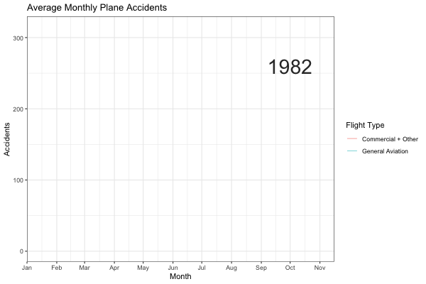

Air Crash Investigation: How does Flight Conditions affect Fatality?
================
Erika Lu & Sophie Wu
2020-12-14

  - [Purpose](#purpose)
  - [Background](#background)
  - [Uncertainties](#uncertainties)
  - [Setup](#setup)
  - [Loading the dataset](#loading-the-dataset)
  - [Initial inspection of the
    dataset](#initial-inspection-of-the-dataset)
  - [Visualizations](#visualizations)
      - [Air crashes and dates](#air-crashes-and-dates)
      - [Geography](#geography)
      - [Weather conditions](#weather-conditions)
      - [Aircraft damage](#aircraft-damage)
  - [Modeling](#modeling)
      - [A model calculating the effect of weather condition on
        fatality](#a-model-calculating-the-effect-of-weather-condition-on-fatality)
      - [A model calculating the predicting effect of aircraft
        damage](#a-model-calculating-the-predicting-effect-of-aircraft-damage)
      - [Fitting a model with two
        variables](#fitting-a-model-with-two-variables)
  - [Summary](#summary)

## Purpose

In this project, we focus on studying the air crash investigation
dataset from National Transportation Safety Board (NTSB). We want to
study the question: How well can flight parameters (engine type/number,
weather condition, the broad phase of flight, etc.) be used to predict
the fatality of a flight?

## Background

The dataset we used contained information on air crashes investigated by
the NTSB from 1982 to 2007. The investigation range of NTSB includes all
air crashes happened within U.S. territory, or when the involved
aircraft are U.S. made, or the aircraft carries passengers/crew members
that are U.S. citizens, or otherwise invited by the transportation
safety bureau from another country.

The dataset includes information on not only military and commercial
flights but general aviation as well. It is easier to get a piloting
license for general aviation than other types of aviation and it is
generally regarded as more dangerous because of lower safety standards.

## Uncertainties

The data on fatalities are collected from air crash investigation
reports, and we may be able to assume that there are no sampling
uncertainties in the collection of data, because our dataset is pretty
close to the population. However, we also believe that there’s a
underestimated of the number of air crashes: as we look through the
dataset, it seems that not all of the crashes are represented in the
dataset. For example, during the terrorist attack on September 11, 2001,
four airplanes are hijacked and crashed, and the dataset only records
one of them. We do not know how many other accidents went unreported.

## Setup

``` r
library(tidyverse)
```

    ## ── Attaching packages ─────────────────────────────────────── tidyverse 1.3.0 ──

    ## ✓ ggplot2 3.3.2     ✓ purrr   0.3.4
    ## ✓ tibble  3.0.4     ✓ dplyr   1.0.2
    ## ✓ tidyr   1.1.2     ✓ stringr 1.4.0
    ## ✓ readr   1.3.1     ✓ forcats 0.5.0

    ## ── Conflicts ────────────────────────────────────────── tidyverse_conflicts() ──
    ## x dplyr::filter() masks stats::filter()
    ## x dplyr::lag()    masks stats::lag()

``` r
library(modelr)
library(broom)
```

    ## 
    ## Attaching package: 'broom'

    ## The following object is masked from 'package:modelr':
    ## 
    ##     bootstrap

``` r
library(scales)
```

    ## 
    ## Attaching package: 'scales'

    ## The following object is masked from 'package:purrr':
    ## 
    ##     discard

    ## The following object is masked from 'package:readr':
    ## 
    ##     col_factor

``` r
library(gganimate)
```

## Loading the dataset

``` r
filename  <- "./data/AviationData.txt"

df_aviation <- read.delim2(filename, header = TRUE, sep = "|", dec = ".")

df_aviation <- df_aviation %>%
  filter(str_detect(Aircraft.Category, "Airplane"), str_detect(Investigation.Type, "Accident")) %>%
  mutate(
    IsGeneralAviation = str_detect(FAR.Description, "91")
  )
```

## Initial inspection of the dataset

``` r
df_aviation %>% glimpse()
```

    ## Rows: 6,486
    ## Columns: 33
    ## $ Event.Id               <chr> "20080125X00106 ", "20080114X00045 ", "2008012…
    ## $ Investigation.Type     <chr> " Accident ", " Accident ", " Accident ", " Ac…
    ## $ Accident.Number        <chr> " SEA08CA056 ", " LAX08FA043 ", " CHI08CA057 "…
    ## $ Event.Date             <chr> " 12/31/2007 ", " 12/30/2007 ", " 12/30/2007 "…
    ## $ Location               <chr> " Santa Ana, CA ", " Paso Robles, CA ", " Alex…
    ## $ Country                <chr> " United States ", " United States ", " United…
    ## $ Latitude               <dbl> 33.67556, 35.54222, 45.86611, 38.53389, 46.800…
    ## $ Longitude              <dbl> -117.86806, -120.52278, -95.39444, -106.93306,…
    ## $ Airport.Code           <chr> " SNA ", " PRB ", " AXN ", "  ", "  ", "  ", "…
    ## $ Airport.Name           <chr> " John Wayne - Orange County ", " Paso Robles …
    ## $ Injury.Severity        <chr> " Non-Fatal ", " Fatal(1) ", " Non-Fatal ", " …
    ## $ Aircraft.Damage        <chr> " Substantial ", " Substantial ", " Substantia…
    ## $ Aircraft.Category      <chr> " Airplane ", " Airplane ", " Airplane ", " Ai…
    ## $ Registration.Number    <chr> " N2800D ", " N254SR ", " N5093F ", " N33MF ",…
    ## $ Make                   <chr> " Piper ", " Cirrus Design Corp. ", " Lerohl "…
    ## $ Model                  <chr> " PA-12 ", " SR22 ", " RV-8 ", " PA-46-310P ",…
    ## $ Amateur.Built          <chr> " No ", " No ", " Yes ", " No ", " No ", " No …
    ## $ Number.of.Engines      <dbl> 1, 1, 1, 1, 1, 1, 1, 1, 2, 1, 1, 1, 1, 1, 2, 2…
    ## $ Engine.Type            <chr> " Reciprocating ", " Reciprocating ", " Recipr…
    ## $ FAR.Description        <chr> " Part 91: General Aviation ", " Part 91: Gene…
    ## $ Schedule               <chr> "  ", "  ", "  ", "  ", "  ", "  ", "  ", "  "…
    ## $ Purpose.of.Flight      <chr> " Instructional ", " Personal ", " Personal ",…
    ## $ Air.Carrier            <chr> "  ", "  ", "  ", "  ", "  ", "  ", "  ", "  "…
    ## $ Total.Fatal.Injuries   <dbl> NA, 1, NA, NA, NA, NA, 0, NA, 1, NA, 0, 0, NA,…
    ## $ Total.Serious.Injuries <dbl> NA, NA, NA, NA, NA, NA, 1, NA, 1, NA, 0, 0, NA…
    ## $ Total.Minor.Injuries   <dbl> NA, NA, NA, NA, NA, NA, 0, NA, NA, NA, 0, 2, N…
    ## $ Total.Uninjured        <dbl> 2, NA, 1, 5, 1, 2, 0, 1, NA, 1, 1, 0, 2, 2, 29…
    ## $ Weather.Condition      <chr> " VMC ", " VMC ", " VMC ", " VMC ", " VMC ", "…
    ## $ Broad.Phase.of.Flight  <chr> " LANDING ", " MANEUVERING ", " TAKEOFF ", " T…
    ## $ Report.Status          <chr> " Probable Cause ", " Probable Cause ", " Prob…
    ## $ Publication.Date       <chr> " 02/28/2008 ", " 06/20/2014 ", " 02/28/2008 "…
    ## $ X                      <lgl> NA, NA, NA, NA, NA, NA, NA, NA, NA, NA, NA, NA…
    ## $ IsGeneralAviation      <lgl> TRUE, TRUE, TRUE, TRUE, TRUE, TRUE, TRUE, TRUE…

**Observations:**

A glimpse at the dataset shows that 6,486 accidents and incidents are
recorded in this dataset. 32 columns are presented (+1 added), in which
the total number of fatal, serious, and minor injuries, as well as the
total uninjured number are recorded as output variables, and other
variables including `Make`, `Model`, `Number.of.Engines`, `Engine.Type`,
`Purpose.of.Flight` and `Broad.Phase.of.Flight` are interpreted as input
variables in this study.

``` r
df_binomial <- df_aviation %>% mutate(Fatal = as.logical(Total.Fatal.Injuries))
df_binomial %>% count(Fatal)
```

    ##   Fatal    n
    ## 1 FALSE 2505
    ## 2  TRUE  943
    ## 3    NA 3038

**Observations:**

A simple check on the `Total.Fatal.Injuries` column of the dataset
reveals that from 1982 to 2007, there are 2505 non-fatal crashes and 943
fatal crashes, and 3038 flight crash information are not available.

``` r
df_aviation %>% count(IsGeneralAviation)
```

    ##   IsGeneralAviation    n
    ## 1             FALSE  874
    ## 2              TRUE 5612

**Observations:** Most of the recorded accidents, 5612 of them, are
general aviation flights. Other flights make up the rest of the 874 of
them.

## Visualizations

``` r
#install.packages("randomcoloR")

library(randomcoloR)

# Styling
blank_theme <- theme_minimal()+
  theme(
  axis.title.x = element_blank(),
  axis.title.y = element_blank(),
  panel.border = element_blank(),
  panel.grid=element_blank(),
  axis.ticks = element_blank(),
  plot.title=element_text(size=14, face="bold")
  )

df_aviation %>%
  filter(Broad.Phase.of.Flight != "  ") %>%
  group_by(Broad.Phase.of.Flight, IsGeneralAviation) %>%
  summarize(
    count = n(),
  ) %>%
  ggplot() +
  geom_bar(mapping = aes(x = "", y = count, fill = Broad.Phase.of.Flight ), stat = "identity", position = position_fill()) +
  
  # Styling 
  blank_theme +
  theme(
    axis.text.x=element_blank()
        ) +
    labs(x = "Month",
        y = "Accidents",
        fill = "Flight Type") +
  scale_fill_manual(values=distinctColorPalette(12))+
  coord_polar(theta = "y", start = 0) +
  
  #Facet
  facet_wrap(~ ifelse(IsGeneralAviation, "General Aviation (Total: 5581)", "Other (Total: 660)"))
```

    ## `summarise()` regrouping output by 'Broad.Phase.of.Flight' (override with `.groups` argument)

<!-- -->

**Observations:**

Accidents happen more often during certain phases when General Aviation
is compared to other types of flights. A dangerous phase for GA is
Landing, while not many accidents happen in that phase for other types
of flights. This may be due to different dynamics when it comes to
smaller planes. GA pilots may also fly in a more risky manner than
commercial pilots. GA may be less accident prone during maneuvering
because the smaller planes were built to do such maneuvers other planes
like passenger planes/cargo planes were are not suited to do such
maneuvers and when they do it is because of an emergency.

### Air crashes and dates

``` r
df_aviation_dates <-df_aviation %>%
  mutate(
    Month.Day = substr(Event.Date,2,6),
    Year = substr(Event.Date, 8, 11),
    Date = paste(Year, substr(Event.Date, 2, 3), substr(Event.Date,5,6), sep = "-", collapse = NULL),
    Month = paste("2020", substr(Event.Date, 2, 3), "01", sep = "-", collapse = NULL)
  ) 

df_aviation_dates$Month.Day = as.Date(df_aviation_dates$Month.Day, format = "%m/%d")
df_aviation_dates$Date = as.Date(df_aviation_dates$Date, format = "%Y-%m-%d")
df_aviation_dates$Month = as.Date(df_aviation_dates$Month, format = "%Y-%m-%d")
```

``` r
df_aviation_dates%>%
  ggplot() +
  geom_boxplot(mapping = aes(x = factor(format(Month, "%m")), y = Total.Fatal.Injuries, color = ifelse(IsGeneralAviation, "General Aviation", "Commercial + Other")) ) +
  labs(x = "Month",
      y = "Deaths",
      color = "Flight Type") +
  ggtitle("Fatalities Per Accident") +
  scale_y_log10()
```

    ## Warning: Transformation introduced infinite values in continuous y-axis

    ## Warning: Removed 5543 rows containing non-finite values (stat_boxplot).

<!-- -->
**Observations:** Commercial + Other flights tend to have higher
fatalities every month compared to General Aviation. This may be due to
the fact that GA planes tend to be much smaller and usually carries the
pilot and a handful of passengers. It is difficult to see a trend of how
month affects the fatality of an accident but it looks like there may be
slightly more fatalies per accident in the months of August and October
for Commercial + Other flights.

``` r
df_aviation_dates %>%
  count(Month.Day) %>%
  ggplot() +
  geom_point(mapping = aes(x = Month.Day, y = n )) +
  scale_x_date(date_breaks = "1 month", date_minor_breaks = "1 week",
             date_labels = "%B") +
  theme(axis.text.x = element_text(angle = 90, vjust = 0.5, hjust=1)) + 
  ggtitle("Accidents by Time of Year")
```

<!-- -->
**Observations:**

``` r
# AGGREGATED BY MONTH

#preprocess data
df_month <- df_aviation_dates %>%
  group_by(Month, Year, IsGeneralAviation) %>%
  mutate(
    count = n(),
    average = mean(n())
  ) %>%
  ungroup() %>%
  arrange(Date) 

df_month$frame <- seq.int(nrow(df_month))

fig <- df_month %>%
  ggplot(aes(color = ifelse(IsGeneralAviation, "General Aviation", "Commercial + Other"))) +
  theme_bw() +
  labs(title = "Average Monthly Plane Accidents") +
  geom_line(data = df_month %>% filter(IsGeneralAviation), aes(x = Month, y = average, group = Year), size = 0.15) +
  geom_line(data = df_month %>% filter(!IsGeneralAviation), aes(x = Month, y = average, group = Year), size = 0.15) +
   labs(x = "Month",
        y = "Accidents",
        color = "Flight Type") +
  scale_x_date(date_breaks = "1 month", date_labels = "%b", expand = expansion(add = c(0, -15))) +
  geom_text(aes(x = as.Date("2020-10-01"), y = 260, label = Year), position = position_nudge(y = -0.1, x = 0), size = 10, color = "gray20") +
  transition_reveal(along = frame, keep_last = FALSE)


# animate(fig, nframes = 200, fps = 10, width=1200,height=800, res = 130,
#         render = av_renderer("Monthly Airplane Accidents.mp4", codec = "libx264"))

animate(fig, renderer = gifski_renderer(), width=600, height=400)
```

<!-- -->

**Observations:**

The last couple of graphs look at occurences of accidents rather than
fatality to better understand the dataset.

One reason we may see more accidents in the middle of the year is that
more people have time to fly (whether for hobby or travel) during the
summer months due to the United States vacation schedule. More flights
lead to more accidents. If the scope of our project was wider, we would
analyze data on all flights, rather than just the accidents.

Another reason that may explain why accidents occur more often in June
and July: during that time thunderstorms are more frequent and more
severe, and microbursts can occur, leading to poor visibility and
unstable flights (especially at landing).

### Geography

``` r
library("ggplot2")
library("sf")
```

    ## Linking to GEOS 3.8.1, GDAL 3.1.4, PROJ 6.3.1

``` r
library("rnaturalearth")
library("rnaturalearthdata")

world <- ne_countries(scale = "medium", returnclass = "sf")

blank_theme <- theme_minimal()+
  theme(
  axis.title.x = element_blank(),
  axis.title.y = element_blank(),
  panel.border = element_blank(),
  panel.grid=element_blank(),
  axis.ticks = element_blank(),
  plot.title=element_text(size=14, face="bold"),
  )

df_geo <- df_aviation_dates %>%
  select (
    Year,
    Longitude,
    Latitude,
    IsGeneralAviation
  ) %>%
  drop_na()


ggplot(data = world) +
  geom_sf() +
  geom_point(data = df_geo, aes(x = Longitude, y = Latitude, fill = ifelse(IsGeneralAviation, "General Aviation", "Commercial + Other")), size = 1, 
      shape = 23) +
  coord_sf(xlim = c(-130, -65), ylim = c(20, 60), expand = FALSE) +
  blank_theme +
  theme(
    axis.text.x=element_blank(),
    axis.text.y=element_blank()
    ) +
  labs(fill = "Flight Type") +
  ggtitle("Aviation Accident Sites")
```

<!-- -->
**Observations:** While there is no discernible trend for Commercial +
Other type accidents, we see that General Aviation accidents happen most
often along the coasts and in the north east.

This may be due to confounding variables such as population and wealth
that would increase the prevalence of GA pilots on the coast. Or perhaps
planes are more prone to accidents in coastal weather.

### Weather conditions

``` r
df_binomial %>%
  filter(is.na(Fatal) == FALSE) %>% 
  group_by(Weather.Condition) %>% 
  count(Fatal) %>%
  ggplot(aes(x = Weather.Condition, y = n, fill = Fatal)) +
  geom_col(position = "dodge") +
  ggtitle("Number of Fatal and Non-fatal Crashes in Different Weather Conditions")
```

<!-- -->

``` r
df_binomial %>%
  filter(!is.na(Fatal), IsGeneralAviation) %>%
  group_by(Fatal, IsGeneralAviation, Weather.Condition) %>%
  summarize(
    count = n(),
  ) %>%
  ggplot() +
  geom_bar(mapping = aes(x = "", y = count, fill = Fatal ), stat = "identity", position = position_fill()) +
  
  # Styling 
  blank_theme +
  theme(
    axis.text.x=element_blank()
        ) +
    labs(fill = "Fatal") +
  coord_polar(theta = "y", start = 0) +
  #Facet
  facet_wrap(~Weather.Condition) +
  ggtitle("Flight Fatalities (General Aviation)")
```

    ## `summarise()` regrouping output by 'Fatal', 'IsGeneralAviation' (override with `.groups` argument)

<!-- -->

``` r
df_binomial %>%
  filter(!is.na(Fatal), !IsGeneralAviation) %>%
  group_by(Fatal, IsGeneralAviation, Weather.Condition) %>%
  summarize(
    count = n(),
  ) %>%
  ggplot() +
  geom_bar(mapping = aes(x = "", y = count, fill = Fatal ), stat = "identity", position = position_fill()) +
  
  # Styling 
  blank_theme +
  theme(
    axis.text.x=element_blank()
        ) +
    labs(fill = "Fatal") +
  coord_polar(theta = "y", start = 0) +
  #Facet
  facet_wrap(~Weather.Condition) +
  ggtitle("Flight Fatalities (Non General Aviation)")
```

    ## `summarise()` regrouping output by 'Fatal', 'IsGeneralAviation' (override with `.groups` argument)

<!-- -->

**Observations:**

VMC, or visual meteorological conditions, means that pilots have
sufficient visibility to fly the aircraft maintaining visual separation
from terrain and other aircraft. IMC, or instrumental meteorological
conditions, means that pilots need to fly primarily by reference to
instruments, and therefore under instrument flight rules (IFR).
Typically, IMC means flying in cloudy or bad weather, while VMC means
fine weather.

Comparing the absolute value of fatal crashes in VMC is higher than IMC.
However, this may be due to the fact that much more flights are flown in
VMC, as flights are likely to be canceled or diverted in deteriorating
weather. Comparing the ratio of fatal and non-fatal crashes in VMC and
IMC, it turns out that in IMC the crashes have a higher odds of being
fatal.

The contribution of weather condition to a fatal crash will be
investigated in later sections by fitting it into a logistic model.

### Aircraft damage

``` r
df_binomial %>%
  filter(is.na(Fatal) == FALSE) %>% 
  group_by(Aircraft.Damage) %>% 
  count(Fatal) %>%
  ggplot(aes(x = Aircraft.Damage, y = n, fill = Fatal)) +
  geom_col(position = "dodge") +
  ggtitle("Number of Fatal and Non-fatal Crashes for different Damage")
```

<!-- -->

**Observations:**

We can reasonably assume that, when an aircraft is severely damaged or
destroyed, there is a higher probability of having fatalities, while for
minor and substantial damages the fatality is much lower. This figure
above proves that, the destroyed air crashes are much more fatal
comparing to other categories.

The `Aircraft.Damage` criteria will be studied in later sections where a
model is fitted to figure out how much the aircraft damage contributes
to fatality.

## Modeling

### A model calculating the effect of weather condition on fatality

``` r
fit_weather <-
  glm(
    formula = Fatal ~ Weather.Condition,
    data = df_binomial %>%
      filter(
        !is.na(Fatal), Weather.Condition %in% c(" IMC ", " VMC ", " UNK ")
      ) %>%
      mutate(Weather.Condition = fct_relevel(Weather.Condition, " UNK ")),
    family = "binomial"
  )

fit_weather %>% tidy()
```

    ## # A tibble: 3 x 5
    ##   term                     estimate std.error statistic  p.value
    ##   <chr>                       <dbl>     <dbl>     <dbl>    <dbl>
    ## 1 "(Intercept)"               0.395     0.232      1.70 8.94e- 2
    ## 2 "Weather.Condition IMC "    0.311     0.257      1.21 2.27e- 1
    ## 3 "Weather.Condition VMC "   -1.70      0.237     -7.19 6.35e-13

**Observations:**

According to the model, setting `UNK` as a reference, `VMC` has a much
lower estimate comparing to `IMC`. This result is consistent with our
conclusion from the bar chart: in IMC conditions, there is a higher odds
of the air crash being fatal. The negative estimate for `VMC`

### A model calculating the predicting effect of aircraft damage

``` r
 fit_damage <-
  glm(
    formula = Fatal ~ Aircraft.Damage,
    data = df_binomial %>%
      filter(
        !is.na(Fatal), Aircraft.Damage %in% c(" Destroyed ", " Minor ", " Substantial ")
      ) %>%
      mutate(Aircraft.Damage = fct_relevel(Aircraft.Damage, " Substantial ")),
    family = "binomial"
  )

fit_damage %>% tidy()
```

    ## # A tibble: 3 x 5
    ##   term                         estimate std.error statistic   p.value
    ##   <chr>                           <dbl>     <dbl>     <dbl>     <dbl>
    ## 1 "(Intercept)"                   -2.61    0.0843    -31.0  3.46e-211
    ## 2 "Aircraft.Damage Destroyed "     3.26    0.104      31.2  3.74e-214
    ## 3 "Aircraft.Damage Minor "         1.46    0.476       3.07 2.12e-  3

**Observations:**

The estimate for destroyed aircraft for modeling fatality is much
higher, while there’s no significant difference between minor damages
and substantial damages (0.13 vs 0). This confirms our hypothesis of
when an aircraft is severely damaged or destroyed, there is a higher
probability of having fatalities. A destroyed aircraft is strongly
correlated with fatalities.

### Fitting a model with two variables

We noticed from the previous figure that in June, July and August, there
is a peak in air crashes. We thus made a hypothesis that the more
frequent severe weather including thunderstorms are microbursts during
that time period contributes to the higher frequency of air crashes.

``` r
df_date<-df_aviation %>%
  filter(str_detect(Aircraft.Category, "Airplane"), str_detect(Investigation.Type, "Accident")) %>%
  mutate(
    Month.Day = substr(Event.Date,2,6),
    Year = substr(Event.Date, 8, 11),
    Date = paste(Year, substr(Event.Date, 2, 3), substr(Event.Date,5,6), sep = "-", collapse = NULL),
    Month = substr(Event.Date, 2, 3)
  ) %>%
  mutate(Month = as.integer(Month)) %>%
  mutate(Fatal = as.logical(Total.Fatal.Injuries))
  
df_date %>% summary()
```

    ##    Event.Id         Investigation.Type Accident.Number     Event.Date       
    ##  Length:6486        Length:6486        Length:6486        Length:6486       
    ##  Class :character   Class :character   Class :character   Class :character  
    ##  Mode  :character   Mode  :character   Mode  :character   Mode  :character  
    ##                                                                             
    ##                                                                             
    ##                                                                             
    ##                                                                             
    ##    Location           Country             Latitude        Longitude      
    ##  Length:6486        Length:6486        Min.   :-78.02   Min.   :-174.30  
    ##  Class :character   Class :character   1st Qu.: 33.62   1st Qu.:-112.95  
    ##  Mode  :character   Mode  :character   Median : 38.31   Median : -93.68  
    ##                                        Mean   : 38.49   Mean   : -97.89  
    ##                                        3rd Qu.: 42.58   3rd Qu.: -82.38  
    ##                                        Max.   : 87.15   Max.   : 145.37  
    ##                                        NA's   :3433     NA's   :3443     
    ##  Airport.Code       Airport.Name       Injury.Severity    Aircraft.Damage   
    ##  Length:6486        Length:6486        Length:6486        Length:6486       
    ##  Class :character   Class :character   Class :character   Class :character  
    ##  Mode  :character   Mode  :character   Mode  :character   Mode  :character  
    ##                                                                             
    ##                                                                             
    ##                                                                             
    ##                                                                             
    ##  Aircraft.Category  Registration.Number     Make              Model          
    ##  Length:6486        Length:6486         Length:6486        Length:6486       
    ##  Class :character   Class :character    Class :character   Class :character  
    ##  Mode  :character   Mode  :character    Mode  :character   Mode  :character  
    ##                                                                              
    ##                                                                              
    ##                                                                              
    ##                                                                              
    ##  Amateur.Built      Number.of.Engines Engine.Type        FAR.Description   
    ##  Length:6486        Min.   :0.000     Length:6486        Length:6486       
    ##  Class :character   1st Qu.:1.000     Class :character   Class :character  
    ##  Mode  :character   Median :1.000     Mode  :character   Mode  :character  
    ##                     Mean   :1.128                                          
    ##                     3rd Qu.:1.000                                          
    ##                     Max.   :4.000                                          
    ##                     NA's   :224                                            
    ##    Schedule         Purpose.of.Flight  Air.Carrier        Total.Fatal.Injuries
    ##  Length:6486        Length:6486        Length:6486        Min.   :  0.000     
    ##  Class :character   Class :character   Class :character   1st Qu.:  0.000     
    ##  Mode  :character   Mode  :character   Mode  :character   Median :  0.000     
    ##                                                           Mean   :  1.105     
    ##                                                           3rd Qu.:  1.000     
    ##                                                           Max.   :228.000     
    ##                                                           NA's   :3038        
    ##  Total.Serious.Injuries Total.Minor.Injuries Total.Uninjured  
    ##  Min.   : 0.000         Min.   :  0.0000     Min.   :  0.000  
    ##  1st Qu.: 0.000         1st Qu.:  0.0000     1st Qu.:  1.000  
    ##  Median : 0.000         Median :  0.0000     Median :  1.000  
    ##  Mean   : 0.314         Mean   :  0.5496     Mean   :  4.199  
    ##  3rd Qu.: 0.000         3rd Qu.:  1.0000     3rd Qu.:  2.000  
    ##  Max.   :44.000         Max.   :200.0000     Max.   :573.000  
    ##  NA's   :3097           NA's   :2756         NA's   :860      
    ##  Weather.Condition  Broad.Phase.of.Flight Report.Status      Publication.Date  
    ##  Length:6486        Length:6486           Length:6486        Length:6486       
    ##  Class :character   Class :character      Class :character   Class :character  
    ##  Mode  :character   Mode  :character      Mode  :character   Mode  :character  
    ##                                                                                
    ##                                                                                
    ##                                                                                
    ##                                                                                
    ##     X           IsGeneralAviation  Month.Day             Year          
    ##  Mode:logical   Mode :logical     Length:6486        Length:6486       
    ##  NA's:6486      FALSE:874         Class :character   Class :character  
    ##                 TRUE :5612        Mode  :character   Mode  :character  
    ##                                                                        
    ##                                                                        
    ##                                                                        
    ##                                                                        
    ##      Date               Month          Fatal        
    ##  Length:6486        Min.   : 1.000   Mode :logical  
    ##  Class :character   1st Qu.: 4.000   FALSE:2505     
    ##  Mode  :character   Median : 7.000   TRUE :943      
    ##                     Mean   : 6.707   NA's :3038     
    ##                     3rd Qu.: 9.000                  
    ##                     Max.   :12.000                  
    ## 

``` r
  fit_date <-
   glm(
     formula = Fatal ~ Month + Weather.Condition,
     data = df_date %>%
       filter(
         !is.na(Fatal), 
         Month %in% c(6, 7, 8),
         Weather.Condition %in% c(" IMC ", " VMC ", " UNK ")
       ) %>%
       mutate(Weather.Condition = fct_relevel(Weather.Condition, " UNK ")),
     family = "binomial"
   )
 
 fit_date %>% tidy()
```

    ## # A tibble: 4 x 5
    ##   term                     estimate std.error statistic  p.value
    ##   <chr>                       <dbl>     <dbl>     <dbl>    <dbl>
    ## 1 "(Intercept)"             0.498      0.816     0.610  0.542   
    ## 2 "Month"                  -0.00663    0.0947   -0.0700 0.944   
    ## 3 "Weather.Condition IMC " -0.0940     0.561    -0.168  0.867   
    ## 4 "Weather.Condition VMC " -1.89       0.490    -3.85   0.000119

**Observations:**

When the time of crashes `Month` is controlled, the estimate for `IMC`
decreases and becomes negative, indicating that `IMC` is less effective
at predicting fatality during summer. We can thus reject our hypothesis
that severe weather is positively correlated to a higher fatality.

## Summary

In this report, we studied air crashes investigated by NTSB from 1982 to
2007, and we identified variables that can potentially be used for
predicting air crash fatalities. We use weather and aircraft damage as
the main input variables to predict if a plane crash is fatal, and we
figure out the correlation between these variables and a fatal crash.

For future studies, we would like to include more variables (e.g. the
cause of crashes) that are not available in this dataset.
