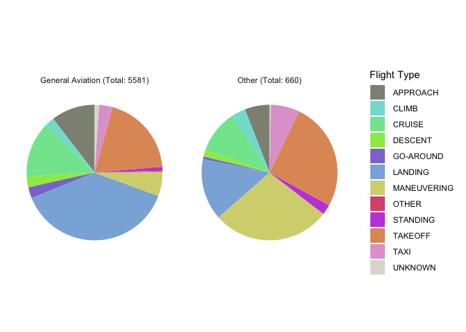

Air Crash Investigation: How does Flight Conditions affect Fatality?
================
Erika Lu & Sophie Wu
2020-12-14

  - [Purpose](#purpose)
  - [Background](#background)
  - [Uncertainties](#uncertainties)
  - [Setup](#setup)
  - [Loading the dataset](#loading-the-dataset)
  - [Initial inspection of the
    dataset](#initial-inspection-of-the-dataset)
  - [Visualizations](#visualizations)
      - [Air crashes and dates](#air-crashes-and-dates)
      - [Geography](#geography)
      - [Weather conditions](#weather-conditions)
      - [Aircraft damage](#aircraft-damage)
  - [Modeling](#modeling)
      - [A model calculating the effect of weather condition on
        fatality](#a-model-calculating-the-effect-of-weather-condition-on-fatality)
      - [A model calculating the predicting effect of aircraft
        damage](#a-model-calculating-the-predicting-effect-of-aircraft-damage)
      - [Fitting a model with two
        variables](#fitting-a-model-with-two-variables)
  - [Summary](#summary)

## Purpose

In this project, we focus on studying the air crash investigation
dataset from National Transportation Safety Board (NTSB). We want to
study the question: How well can flight parameters (engine type/number,
weather condition, the broad phase of flight, etc.) be used to predict
the fatality of a flight?

## Background

The dataset we used contained information on air crashes investigated by
the NTSB from 1982 to 2007. The investigation range of NTSB includes all
air crashes happened within U.S. territory, or when the involved
aircraft are U.S. made, or the aircraft carries passengers/crew members
that are U.S. citizens, or otherwise invited by the transportation
safety bureau from another country.

The dataset includes information on not only military and commercial
flights but general aviation as well. It is easier to get a piloting
license for general aviation than other types of aviation and it is
generally regarded as more dangerous because of lower safety standards.

## Uncertainties

The data on fatalities are collected from air crash investigation
reports, and we may be able to assume that there are no sampling
uncertainties in the collection of data, because our dataset is pretty
close to the population. However, we also believe that there’s a
underestimate of the number of air crashes: as we look through the
dataset, it seems that not all of the crashes are represented in the
dataset. For example, during the terrorist attack on September 11, 2001,
four airplanes are hijacked and crashed, and the dataset only records
one of them. We do not know how many other accidents went unreported.

## Setup

``` r
library(tidyverse)
```

    ## ── Attaching packages ─────────────────────────────────────── tidyverse 1.3.0 ──

    ## ✓ ggplot2 3.3.2     ✓ purrr   0.3.4
    ## ✓ tibble  3.0.4     ✓ dplyr   1.0.2
    ## ✓ tidyr   1.1.2     ✓ stringr 1.4.0
    ## ✓ readr   1.3.1     ✓ forcats 0.5.0

    ## ── Conflicts ────────────────────────────────────────── tidyverse_conflicts() ──
    ## x dplyr::filter() masks stats::filter()
    ## x dplyr::lag()    masks stats::lag()

``` r
library(modelr)
library(broom)
```

    ## 
    ## Attaching package: 'broom'

    ## The following object is masked from 'package:modelr':
    ## 
    ##     bootstrap

``` r
library(scales)
```

    ## 
    ## Attaching package: 'scales'

    ## The following object is masked from 'package:purrr':
    ## 
    ##     discard

    ## The following object is masked from 'package:readr':
    ## 
    ##     col_factor

``` r
library(gganimate)
```

## Loading the dataset

``` r
filename  <- "./data/AviationData.txt"

df_aviation <- read.delim2(filename, header = TRUE, sep = "|", dec = ".")

df_aviation <- df_aviation %>%
  filter(str_detect(Aircraft.Category, "Airplane"), str_detect(Investigation.Type, "Accident")) %>%
  mutate(
    IsGeneralAviation = str_detect(FAR.Description, "91")
  )

df_aviation
```

    ##             Event.Id Investigation.Type Accident.Number   Event.Date
    ## 1    20080125X00106           Accident      SEA08CA056   12/31/2007 
    ## 2    20080114X00045           Accident      LAX08FA043   12/30/2007 
    ## 3    20080129X00122           Accident      CHI08CA057   12/30/2007 
    ## 4    20080129X00118           Accident      DEN08CA045   12/29/2007 
    ## 5    20080215X00200           Accident      CHI08CA058   12/29/2007 
    ## 6    20080214X00193           Accident      CHI08CA056   12/29/2007 
    ## 7    20080102X00006           Accident      SEA08LA054   12/28/2007 
    ## 8    20080111X00041           Accident      DFW08CA051   12/28/2007 
    ## 9    20080108X00030           Accident      CHI08FA055   12/27/2007 
    ## 10   20080117X00072           Accident      SEA08CA052   12/26/2007 
    ## 11   20080210X00163           Accident      NYC08LA070   12/26/2007 
    ## 12   20080104X00022           Accident      MIA08LA032   12/26/2007 
    ## 13   20080128X00110           Accident      MIA08CA045   12/26/2007 
    ## 14   20080129X00123           Accident      ANC08LA030   12/26/2007 
    ## 15   20080107X00025           Accident      SEA08LA051   12/25/2007 
    ## 16   20080107X00024           Accident      SEA08LA050   12/25/2007 
    ## 17   20080125X00105           Accident      SEA08CA053   12/23/2007 
    ## 18   20080124X00101           Accident      NYC08CA068   12/22/2007 
    ## 19   20080201X00127           Accident      NYC08CA067   12/22/2007 
    ## 20   20080207X00157           Accident      LAX08CA041   12/22/2007 
    ## 21   20080219X00206           Accident      DFW08CA049   12/22/2007 
    ## 22   20080128X00114           Accident      DEN08CA043   12/22/2007 
    ## 23   20080722X01095           Accident      DFW08LA134   12/21/2007 
    ## 24   20080204X00134           Accident      DFW08CA048   12/21/2007 
    ## 25   20080416X00491           Accident      NYC08CA066   12/20/2007 
    ## 26   20080207X00156           Accident      LAX08CA040   12/20/2007 
    ## 27   20080128X00112           Accident      DFW08CA047   12/20/2007 
    ## 28   20071231X02011           Accident      CHI08FA054   12/20/2007 
    ## 29   20080102X00007           Accident      CHI08FA053   12/20/2007 
    ## 30   20080117X00066           Accident      ANC08TA028   12/20/2007 
    ## 31   20080327X00393           Accident      NYC08WA065   12/19/2007 
    ## 32   20080312X00298           Accident      MIA08CA046   12/19/2007 
    ## 33   20080123X00095           Accident      MIA08CA031   12/19/2007 
    ## 34   20080318X00323           Accident      MIA08CA030   12/18/2007 
    ## 35   20080207X00155           Accident      LAX08CA039   12/18/2007 
    ## 36   20080116X00058           Accident      ANC08LA027   12/18/2007 
    ## 37   20081031X83921           Accident      NYC08WA329   12/17/2007 
    ## 38   20071217X01939           Accident      DCA08FA018   12/16/2007 
    ## 39   20071226X01986           Accident      DEN08LA041   12/15/2007 
    ## 40   20071226X01987           Accident      SEA08CA047   12/14/2007 
    ## 41   20080213X00187           Accident     NYC08LA062B   12/14/2007 
    ## 42   20080213X00187           Accident     NYC08LA062A   12/14/2007 
    ## 43   20071231X02013           Accident      CHI08FA050   12/14/2007 
    ## 44   20080123X00094           Accident      NYC08CA072   12/13/2007 
    ## 45   20080215X00201           Accident      NYC08CA063   12/13/2007 
    ## 46   20071219X01976           Accident      MIA08LA029   12/13/2007 
    ## 47   20071227X01998           Accident      NYC08LA059   12/12/2007 
    ## 48   20080123X00097           Accident      NYC08CA073   12/12/2007 
    ## 49   20071219X01975           Accident      SEA08FA045   12/11/2007 
    ## 50   20080115X00053           Accident      CHI08CA048   12/11/2007 
    ## 51   20071219X01978           Accident      SEA08FA042   12/10/2007 
    ## 52   20080109X00034           Accident      NYC08FA056   12/09/2007 
    ## 53   20080304X00259           Accident      MIA08CA028   12/09/2007 
    ## 54   20071226X01992           Accident      SEA08CA044   12/08/2007 
    ## 55   20071227X02001           Accident     NYC08FA054B   12/08/2007 
    ## 56   20071227X02001           Accident     NYC08FA054A   12/08/2007 
    ## 57   20080124X00100           Accident      NYC08CA058   12/08/2007 
    ## 58   20071229X02007           Accident      NYC08CA055   12/08/2007 
    ## 59   20071218X01970           Accident      MIA08FA027   12/08/2007 
    ## 60   20080129X00121           Accident      CHI08CA049   12/08/2007 
    ## 61   20080104X00020           Accident      CHI08CA047   12/08/2007 
    ## 62   20071211X01926           Accident      MIA08FA026   12/07/2007 
    ## 63   20080123X00099           Accident      LAX08CA036   12/07/2007 
    ## 64   20080214X00189           Accident      MIA08CA025   12/06/2007 
    ## 65   20080219X00207           Accident      LAX08CA035   12/06/2007 
    ## 66   20080116X00055           Accident      LAX08CA034   12/06/2007 
    ## 67   20080118X00077           Accident      LAX08CA033   12/06/2007 
    ## 68   20071227X01997           Accident      NYC08FA053   12/05/2007 
    ## 69   20071212X01932           Accident      CHI08FA045   12/05/2007 
    ## 70   20071227X02000           Accident      NYC08FA051   12/04/2007 
    ## 71   20071212X01931           Accident      DFW08CA042   12/03/2007 
    ## 72   20071206X01909           Accident      SEA08LA041   12/02/2007 
    ## 73   20081003X17816           Accident      NYC08LA049   12/01/2007 
    ## 74   20071207X01912           Accident      MIA08LA024   12/01/2007 
    ## 75   20071206X01905           Accident      MIA08LA023   12/01/2007 
    ## 76   20080111X00040           Accident      DFW08CA044   11/30/2007 
    ## 77   20071231X02009           Accident      SEA08CA049   11/29/2007 
    ## 78   20071212X01933           Accident      CHI08LA046   11/29/2007 
    ## 79   20080116X00061           Accident      ANC08CA024   11/29/2007 
    ## 80   20080109X00035           Accident      NYC08CA048   11/28/2007 
    ## 81   20071207X01913           Accident      MIA08FA021   11/28/2007 
    ## 82   20080128X00109           Accident      MIA08CA022   11/28/2007 
    ## 83   20071203X01887           Accident      DFW08FA040   11/28/2007 
    ## 84   20071211X01928           Accident      DFW08CA041   11/28/2007 
    ## 85   20071204X01896           Accident      DEN08WA037   11/28/2007 
    ## 86   20071212X01936           Accident      ANC08CA022   11/28/2007 
    ## 87   20071130X01879           Accident      DFW08FA038   11/27/2007 
    ## 88   20080102X00005           Accident      DEN08CA034   11/27/2007 
    ## 89   20071129X01876           Accident      CHI08LA041   11/27/2007 
    ## 90   20071221X01985           Accident      NYC08FA046   11/26/2007 
    ## 91   20080114X00043           Accident      NYC08CA047   11/26/2007 
    ## 92   20080214X00190           Accident      MIA08CA019   11/25/2007 
    ## 93   20071130X01880           Accident      CHI08FA039   11/25/2007 
    ## 94   20071210X01921           Accident      SEA08CA039   11/24/2007 
    ## 95   20071218X01971           Accident      LAX08CA031   11/24/2007 
    ## 96   20071221X01984           Accident      NYC08FA041   11/21/2007 
    ## 97   20071209X01916           Accident      NYC08CA042   11/21/2007 
    ## 98   20071129X01870           Accident      NYC08FA039   11/20/2007 
    ## 99   20071226X01989           Accident      SEA08CA034   11/19/2007 
    ## 100  20071207X01914           Accident      MIA08CA018   11/18/2007 
    ## 101  20080116X00060           Accident      ANC08CA020   11/18/2007 
    ## 102  20071226X01991           Accident      SEA08CA030   11/17/2007 
    ## 103  20080411X00459           Accident      NYC08CA037   11/17/2007 
    ## 104  20080128X00113           Accident      DFW08CA032   11/17/2007 
    ## 105  20080122X00080           Accident      NYC08CA040   11/16/2007 
    ## 106  20071119X01812           Accident      DFW08FA031   11/15/2007 
    ## 107  20080304X00262           Accident      MIA08CA017   11/14/2007 
    ## 108  20080331X00401           Accident      ANC08CA019   11/14/2007 
    ## 109  20080515X00683           Accident      NYC08CA036   11/13/2007 
    ## 110  20071121X01833           Accident      SEA08LA025   11/12/2007 
    ## 111  20071210X01919           Accident      SEA08CA026   11/12/2007 
    ## 112  20080415X00480           Accident      NYC08CA035   11/12/2007 
    ## 113  20071228X02004           Accident      NYC08CA032   11/11/2007 
    ## 114  20071217X01946           Accident      LAX08CA030   11/11/2007 
    ## 115  20071127X01856           Accident      DFW08LA030   11/11/2007 
    ## 116  20080104X00021           Accident      CHI08CA042   11/11/2007 
    ## 117  20080115X00050           Accident      NYC08LA029   11/10/2007 
    ## 118  20080321X00360           Accident      NYC08CA030   11/10/2007 
    ## 119  20071206X01910           Accident      LAX08CA014   11/10/2007 
    ## 120  20071119X01810           Accident      MIA08CA016   11/09/2007 
    ## 121  20071113X01789           Accident      LAX08FA028   11/09/2007 
    ## 122  20080307X00285           Accident      CHI08CA043   11/09/2007 
    ## 123  20080104X00019           Accident      CHI08CA038   11/09/2007 
    ## 124  20071121X01832           Accident      SEA08FA023   11/08/2007 
    ## 125  20071119X01814           Accident      LAX08LA027   11/08/2007 
    ## 126  20071126X01847           Accident      DFW08CA028   11/08/2007 
    ## 127  20071121X01830           Accident      SEA08LA021   11/06/2007 
    ## 128  20071108X01768           Accident     MIA08LA014B   11/06/2007 
    ## 129  20071108X01768           Accident     MIA08LA014A   11/06/2007 
    ## 130  20071113X01788           Accident      LAX08FA026   11/06/2007 
    ## 131  20071111X01782           Accident      NYC08LA027   11/05/2007 
    ## 132  20071205X01903           Accident      DEN08CA025   11/05/2007 
    ## 133  20071226X01990           Accident      ANC08CA017   11/05/2007 
    ## 134  20071121X01825           Accident      NYC08LA024   11/04/2007 
    ## 135  20071109X01775           Accident      MIA08CA012   11/04/2007 
    ## 136  20080103X00009           Accident      DEN08CA026   11/04/2007 
    ## 137  20071204X01895           Accident      CHI08CA034   11/04/2007 
    ## 138  20071114X01795           Accident      DFW08CA024   11/03/2007 
    ## 139  20071217X01940           Accident      DFW08CA023   11/03/2007 
    ## 140  20071107X01748           Accident      CHI08FA033   11/03/2007 
    ## 141  20071109X01779           Accident      SEA08LA017   11/02/2007 
    ## 142  20071120X01821           Accident      NYC08FA023   11/02/2007 
    ## 143  20071129X01875           Accident      MIA08CA011   11/02/2007 
    ## 144  20080129X00120           Accident      DFW08CA022   11/02/2007 
    ## 145  20071127X01858           Accident      DEN08CA023   11/02/2007 
    ## 146  20080111X00042           Accident      DFW08LA035   11/01/2007 
    ## 147  20071108X01767           Accident      CHI08LA031   11/01/2007 
    ## 148  20080104X00017           Accident      CHI08CA035   11/01/2007 
    ## 149  20080104X00016           Accident      CHI08CA032   11/01/2007 
    ## 150  20071121X01835           Accident      SEA08CA018   10/31/2007 
    ## 151  20071203X01892           Accident      SEA08CA016   10/31/2007 
    ## 152  20080219X00208           Accident      LAX08CA037   10/30/2007 
    ## 153  20071205X01901           Accident      LAX08CA022   10/29/2007 
    ## 154  20080103X00014           Accident      CHI08CA029   10/29/2007 
    ## 155  20071102X01706           Accident      SEA08FA013   10/28/2007 
    ## 156  20080103X00015           Accident      CHI08CA030   10/28/2007 
    ## 157  20071119X01804           Accident      NYC08FA020   10/27/2007 
    ## 158  20071105X01726           Accident      LAX08FA001   10/26/2007 
    ## 159  20071128X01863           Accident      LAX08CA021   10/26/2007 
    ## 160  20071126X01840           Accident      DFW08CA021   10/26/2007 
    ## 161  20071128X01862           Accident      LAX08CA020   10/25/2007 
    ## 162  20071127X01860           Accident      LAX08CA019   10/25/2007 
    ## 163  20071211X01924           Accident      CHI08CA008   10/25/2007 
    ## 164  20071126X01842           Accident      DEN08CA020   10/24/2007 
    ## 165  20071127X01857           Accident      DEN08CA019   10/24/2007 
    ## 166  20071212X01935           Accident      ANC08CA009   10/24/2007 
    ## 167  20071026X01664           Accident      MIA08LA006   10/23/2007 
    ## 168  20071102X01708           Accident      CHI08FA027   10/23/2007 
    ## 169  20071109X01776           Accident      ANC08CA008   10/23/2007 
    ## 170  20081003X62957           Accident      DCA08WA010   10/22/2007 
    ## 171  20071107X01746           Accident      MIA08CA008   10/21/2007 
    ## 172  20081003X17818           Accident      NYC08LA018   10/20/2007 
    ## 173  20071104X01724           Accident      NYC08LA015   10/20/2007 
    ## 174  20071119X01808           Accident      NYC08CA017   10/20/2007 
    ## 175  20071205X01898           Accident      LAX08CA015   10/20/2007 
    ## 176  20071025X01658           Accident      DFW08LA018   10/20/2007 
    ## 177  20071129X01877           Accident      DFW08CA033   10/20/2007 
    ## 178  20071109X01777           Accident      ANC08CA005   10/20/2007 
    ## 179  20080415X00479           Accident      NYC08CA016   10/19/2007 
    ## 180  20071129X01874           Accident      CHI08CA025   10/19/2007 
    ## 181  20071211X01925           Accident      CHI08CA024   10/19/2007 
    ## 182  20071025X01657           Accident      DFW08LA019   10/18/2007 
    ## 183  20071106X01740           Accident      DFW08CA016   10/18/2007 
    ## 184  20071030X01686           Accident      DEN08LA013   10/17/2007 
    ## 185  20071121X01827           Accident      LAX08CA013   10/16/2007 
    ## 186  20071121X01834           Accident      SEA08CA010   10/14/2007 
    ## 187  20071113X01791           Accident      LAX08CA011   10/14/2007 
    ## 188  20071130X01881           Accident      LAX08CA012   10/13/2007 
    ## 189  20080104X00018           Accident      CHI08CA036   10/13/2007 
    ## 190  20071114X01794           Accident      DFW08CA011   10/12/2007 
    ## 191  20071113X01790           Accident      LAX08CA010   10/11/2007 
    ## 192  20071128X01866           Accident      DFW08CA009   10/11/2007 
    ## 193  20071126X01846           Accident      DFW08CA007   10/11/2007 
    ## 194  20071102X01713           Accident      SEA08CA009   10/10/2007 
    ## 195  20071104X01722           Accident      NYC08CA011   10/10/2007 
    ## 196  20071018X01614           Accident      LAX08LA009   10/10/2007 
    ## 197  20071210X01922           Accident      DFW08CA014   10/10/2007 
    ## 198  20080305X00270           Accident      NYC08CA010   10/08/2007 
    ## 199  20080103X00011           Accident      CHI08CA007   10/08/2007 
    ## 200  20071128X01861           Accident      NYC08LA009   10/07/2007 
    ## 201  20071025X01653           Accident      NYC08LA008   10/07/2007 
    ## 202  20071025X01655           Accident      NYC08CA006   10/07/2007 
    ## 203  20071017X01609           Accident      LAX08MA007   10/07/2007 
    ## 204  20071120X01820           Accident      LAX08CA017   10/07/2007 
    ## 205  20071106X01734           Accident      LAX08CA006   10/07/2007 
    ## 206  20071023X01643           Accident      DFW08FA004   10/07/2007 
    ## 207  20071127X01855           Accident      DFW08CA005   10/07/2007 
    ## 208  20071107X01749           Accident      CHI08CA012   10/07/2007 
    ## 209  20071023X01640           Accident      CHI08CA009   10/07/2007 
    ## 210  20071120X01824           Accident      ANC08CA002   10/07/2007 
    ## 211  20071101X01703           Accident      ANC08CA001   10/07/2007 
    ## 212  20071017X01600           Accident      MIA08LA002   10/06/2007 
    ## 213  20071128X01865           Accident      DFW08CA008   10/06/2007 
    ## 214  20071107X01754           Accident      DFW08CA003   10/06/2007 
    ## 215  20071217X01945           Accident      CHI08CA010   10/06/2007 
    ## 216  20081219X05830           Accident      NYC08LA004   10/05/2007 
    ## 217  20071017X01592           Accident      MIA08FA003   10/05/2007 
    ## 218  20071017X01608           Accident      LAX08FA002   10/05/2007 
    ## 219  20080103X00013           Accident      CHI08CA015   10/05/2007 
    ## 220  20071214X01938           Accident      CHI08CA001   10/05/2007 
    ## 221  20071119X01809           Accident      NYC08CA003   10/04/2007 
    ## 222  20071031X01692           Accident      DFW08LA001   10/04/2007 
    ## 223  20071029X01672           Accident      DEN08FA003   10/04/2007 
    ## 224  20071102X01705           Accident      DEN08CA002   10/04/2007 
    ## 225  20071219X01974           Accident      CHI08CA013   10/04/2007 
    ## 226  20080103X00012           Accident      CHI08CA005   10/04/2007 
    ## 227  20071108X01771           Accident      CHI08CA004   10/04/2007 
    ## 228  20071102X01710           Accident      SEA08CA004   10/03/2007 
    ## 229  20071016X01587           Accident      NYC08LA001   10/03/2007 
    ## 230  20071111X01781           Accident      NYC08CA002   10/03/2007 
    ## 231  20071011X01567           Accident      CHI08CA002   10/03/2007 
    ## 232  20071113X01787           Accident      DFW08CA006   10/01/2007 
    ## 233  20071107X01743           Accident      NYC07LA244   09/30/2007 
    ## 234  20071104X01720           Accident      NYC07CA242   09/30/2007 
    ## 235  20071101X01696           Accident      LAX07CA288   09/30/2007 
    ## 236  20071011X01546           Accident      LAX07CA286   09/30/2007 
    ## 237  20071012X01575           Accident      LAX07CA285   09/30/2007 
    ## 238  20071108X01769           Accident      CHI07CA315   09/30/2007 
    ## 239  20071105X01730           Accident      NYC07LA241   09/29/2007 
    ## 240  20071101X01697           Accident      LAX07CA283   09/29/2007 
    ## 241  20071026X01670           Accident      LAX07CA282   09/29/2007 
    ## 242  20071127X01849           Accident      DFW07CA211   09/29/2007 
    ## 243  20071217X01943           Accident      CHI08CA011   09/29/2007 
    ## 244  20071102X01714           Accident      CHI07CA311   09/29/2007 
    ## 245  20071018X01622           Accident      CHI07CA308   09/29/2007 
    ## 246  20071126X01839           Accident      DFW07CA210   09/28/2007 
    ## 247  20071126X01837           Accident      DFW07CA209   09/28/2007 
    ## 248  20071005X01522           Accident      DCA07MA310   09/28/2007 
    ## 249  20071011X01539           Accident      MIA07LA158   09/26/2007 
    ## 250  20071029X01683           Accident      CHI07CA306   09/26/2007 
    ## 251  20071024X01648           Accident      SEA07CA274   09/25/2007 
    ## 252  20071026X01668           Accident      SEA07CA273   09/25/2007 
    ## 253  20071026X01669           Accident      SEA07CA271   09/25/2007 
    ## 254  20071104X01723           Accident      NYC07CA239   09/25/2007 
    ## 255  20071102X01715           Accident      LAX07CA287   09/23/2007 
    ## 256  20071004X01514           Accident      MIA07LA155   09/22/2007 
    ## 257  20071116X01802           Accident      CHI07CA304   09/22/2007 
    ## 258  20071116X01801           Accident      CHI07CA303   09/22/2007 
    ## 259  20070926X01452           Accident      ANC07FA102   09/22/2007 
    ## 260  20071101X01700           Accident      ANC07CA107   09/22/2007 
    ## 261  20070928X01469           Accident      NYC07LA233   09/21/2007 
    ## 262  20071009X01533           Accident      NYC07FA234   09/21/2007 
    ## 263  20071017X01607           Accident      NYC07CA235   09/21/2007 
    ## 264  20070925X01444           Accident      MIA07FA154   09/21/2007 
    ## 265  20071101X01702           Accident      ANC07CA105   09/21/2007 
    ## 266  20071026X01666           Accident      SEA07CA272   09/20/2007 
    ## 267  20071106X01736           Accident      SEA07CA267   09/20/2007 
    ## 268  20071103X01718           Accident      NYC07CA238   09/20/2007 
    ## 269  20071030X01690           Accident      DEN07CA162   09/20/2007 
    ## 270  20071009X01535           Accident      DEN07CA161   09/20/2007 
    ## 271  20071024X01649           Accident      NYC07LA237   09/19/2007 
    ## 272  20071024X01647           Accident      SEA07CA265   09/18/2007 
    ## 273  20071127X01853           Accident      NYC07CA240   09/18/2007 
    ## 274  20071015X01586           Accident      ANC07CA101   09/18/2007 
    ## 275  20070927X01464           Accident      LAX07LA280   09/17/2007 
    ## 276  20071017X01606           Accident      NYC07CA230   09/16/2007 
    ## 277  20071018X01619           Accident      LAX07CA276   09/16/2007 
    ## 278  20071113X01786           Accident      DFW07CA202   09/16/2007 
    ## 279  20071126X01845           Accident      DFW07CA200   09/16/2007 
    ## 280  20071102X01716           Accident      CHI07CA314   09/16/2007 
    ## 281  20080611X00829           Accident      NYC07LA245   09/15/2007 
    ## 282  20070928X01470           Accident      NYC07FA228   09/15/2007 
    ## 283  20070925X01443           Accident      DFW07LA199   09/15/2007 
    ## 284  20071018X01610           Accident      NYC07LA229   09/14/2007 
    ## 285  20071018X01612           Accident      LAX07LA278   09/14/2007 
    ## 286  20071012X01570           Accident      LAX07CA275   09/14/2007 
    ## 287  20071012X01583           Accident      SEA07CA261   09/13/2007 
    ## 288  20070927X01467           Accident      NYC07FA226   09/13/2007 
    ## 289  20071105X01728           Accident      NYC07CA225   09/13/2007 
    ## 290  20071017X01601           Accident      NYC07CA224   09/13/2007 
    ## 291  20071108X01770           Accident      CHI07CA313   09/13/2007 
    ## 292  20071025X01654           Accident      NYC07CA231   09/12/2007 
    ## 293  20071018X01620           Accident      LAX07CA279   09/12/2007 
    ## 294  20071011X01565           Accident      CHI07CA298   09/12/2007 
    ## 295  20071018X01615           Accident      CHI07CA297   09/12/2007 
    ## 296  20080227X00242           Accident      ATL07CA126   09/12/2007 
    ## 297  20071024X01646           Accident      SEA07CA268   09/11/2007 
    ## 298  20071103X01719           Accident      NYC07CA222   09/11/2007 
    ## 299  20070927X01460           Accident      LAX07FA272   09/11/2007 
    ## 300  20071011X01563           Accident      CHI07CA296   09/11/2007 
    ## 301  20071101X01701           Accident      ANC07CA097   09/10/2007 
    ## 302  20071108X01764           Accident      MIA07CA144   09/09/2007 
    ## 303  20071001X01486           Accident      LAX07CA271   09/09/2007 
    ## 304  20071005X01530           Accident      NYC07CA223   09/08/2007 
    ## 305  20071005X01523           Accident      MIA07CA143   09/08/2007 
    ## 306  20071001X01485           Accident      LAX07CA269   09/08/2007 
    ## 307  20071107X01751           Accident      DFW07CA195   09/08/2007 
    ## 308  20071017X01602           Accident      NYC07CA218   09/07/2007 
    ## 309  20071017X01593           Accident      MIA07CA141   09/07/2007 
    ## 310  20071011X01562           Accident      CHI07CA295   09/07/2007 
    ## 311  20070926X01447           Accident      NYC07LA221   09/06/2007 
    ## 312  20070917X01406           Accident      NYC07FA217   09/06/2007 
    ## 313  20071108X01765           Accident      MIA07CA142   09/06/2007 
    ## 314  20071101X01698           Accident      ANC07CA098   09/06/2007 
    ## 315  20070919X01415           Accident      MIA07LA140   09/05/2007 
    ## 316  20071004X01497           Accident      DEN07CA153   09/05/2007 
    ## 317  20071023X01641           Accident      CHI07CA294   09/05/2007 
    ## 318  20071017X01605           Accident      NYC07CA216   09/04/2007 
    ## 319  20081007X17184           Accident      SEA07FA277   09/03/2007 
    ## 320  20071016X01589           Accident      NYC07CA213   09/03/2007 
    ## 321  20071005X01529           Accident      NYC07CA211   09/03/2007 
    ## 322  20071005X01526           Accident      LAX07CA266   09/03/2007 
    ## 323  20071009X01536           Accident      LAX07CA265   09/03/2007 
    ## 324  20071009X01534           Accident      LAX07CA264   09/03/2007 
    ## 325  20070910X01344           Accident      CHI07FA286   09/03/2007 
    ## 326  20070925X01442           Accident      NYC07LA210   09/02/2007 
    ## 327  20070927X01454           Accident     NYC07LA208A   09/02/2007 
    ## 328  20071017X01596           Accident      MIA07CA139   09/02/2007 
    ## 329  20071011X01559           Accident      CHI07CA292   09/02/2007 
    ## 330  20071019X01624           Accident      NYC07CA215   09/01/2007 
    ## 331  20070907X01326           Accident      MIA07FA137   09/01/2007 
    ## 332  20071017X01597           Accident      MIA07CA138   09/01/2007 
    ## 333  20071004X01510           Accident      LAX07CA261   09/01/2007 
    ## 334  20071004X01509           Accident      LAX07CA260   09/01/2007 
    ## 335  20070927X01457           Accident      DFW07CA192   09/01/2007 
    ## 336  20071107X01750           Accident      DFW07CA190   09/01/2007 
    ## 337  20080118X00078           Accident      LAX07CA289   08/31/2007 
    ## 338  20071004X01512           Accident      DEN07CA151   08/31/2007 
    ## 339  20071011X01540           Accident      CHI07LA287   08/31/2007 
    ## 340  20071011X01561           Accident      CHI07CA293   08/31/2007 
    ## 341  20071011X01556           Accident      CHI07CA284   08/31/2007 
    ## 342  20071012X01580           Accident      SEA07CA257   08/30/2007 
    ## 343  20080321X00347           Accident      NYC07LA206   08/30/2007 
    ## 344  20071011X01557           Accident      CHI07CA285   08/30/2007 
    ## 345  20071005X01524           Accident      ATL07CA124   08/30/2007 
    ## 346  20071012X01578           Accident      SEA07CA244   08/29/2007 
    ## 347  20071012X01577           Accident      SEA07CA243   08/29/2007 
    ## 348  20070912X01382           Accident      SEA07CA236   08/27/2007 
    ## 349  20070918X01407           Accident      ATL07CA121   08/27/2007 
    ## 350  20071011X01552           Accident      SEA07CA238   08/26/2007 
    ## 351  20071026X01663           Accident      NYC07CA204   08/26/2007 
    ## 352  20071113X01785           Accident      DFW07CA194   08/26/2007 
    ## 353  20071018X01616           Accident      CHI07CA278   08/26/2007 
    ## 354  20070830X01273           Accident      ATL07LA119   08/26/2007 
    ## 355  20070912X01386           Accident      SEA07CA241   08/25/2007 
    ## 356  20071011X01551           Accident      SEA07CA239   08/25/2007 
    ## 357  20080204X00135           Accident      NYC07FAMS1   08/25/2007 
    ## 358  20071107X01744           Accident      ATL07CA132   08/25/2007 
    ## 359  20070918X01409           Accident      ATL07CA107   08/25/2007 
    ## 360  20070920X01420           Accident      ANC07CA084   08/25/2007 
    ## 361  20070905X01314           Accident      CHI07FA279   08/24/2007 
    ## 362  20070917X01403           Accident      NYC07LA203   08/23/2007 
    ## 363  20070904X01308           Accident      NYC07LA202   08/23/2007 
    ## 364  20071019X01623           Accident      MIA07CA134   08/23/2007 
    ## 365  20071105X01729           Accident      NYC07FA200   08/22/2007 
    ## 366  20070927X01458           Accident      DFW07CA189   08/22/2007 
    ## 367  20071011X01550           Accident      CHI07CA275   08/21/2007 
    ## 368  20070911X01365           Accident      DEN07CA141   08/20/2007 
    ## 369  20071109X01774           Accident      ATL07CA123   08/20/2007 
    ## 370  20070918X01408           Accident      ATL07CA117   08/20/2007 
    ## 371  20071005X01520           Accident      NYC07FA196   08/19/2007 
    ## 372  20071016X01591           Accident      NYC07CA198   08/19/2007 
    ## 373  20071026X01667           Accident      LAX07CA254   08/19/2007 
    ## 374  20070911X01364           Accident      DEN07CA139   08/19/2007 
    ## 375  20070822X01224           Accident      ATL07LA116   08/19/2007 
    ## 376  20071016X01590           Accident      NYC07CA195   08/18/2007 
    ## 377  20070920X01423           Accident      ANC07CA089   08/18/2007 
    ## 378  20071011X01555           Accident      CHI07CA282   08/17/2007 
    ## 379  20070907X01325           Accident      CHI07CA274   08/17/2007 
    ## 380  20070928X01476           Accident      ANC07CA087   08/17/2007 
    ## 381  20071001X01484           Accident      LAX07CA256   08/16/2007 
    ## 382  20070928X01473           Accident      LAX07CA255   08/16/2007 
    ## 383  20071107X01753           Accident      DFW07CA196   08/16/2007 
    ## 384  20070823X01233           Accident      ANC07MA083   08/16/2007 
    ## 385  20070928X01474           Accident      LAX07CA252   08/15/2007 
    ## 386  20071001X01483           Accident      LAX07CA251   08/15/2007 
    ## 387  20071129X01872           Accident      DFW07CA213   08/15/2007 
    ## 388  20070911X01363           Accident      ATL07CA118   08/15/2007 
    ## 389  20070912X01385           Accident      SEA07CA235   08/14/2007 
    ## 390  20071001X01482           Accident      LAX07CA250   08/14/2007 
    ## 391  20071001X01480           Accident      LAX07CA249   08/14/2007 
    ## 392  20070821X01213           Accident      ATL07CA114   08/14/2007 
    ## 393  20071106X01742           Accident      DFW07CA182   08/13/2007 
    ## 394  20071004X01499           Accident      DEN07CA154   08/13/2007 
    ## 395  20070831X01281           Accident      SEA07CA230   08/12/2007 
    ## 396  20070912X01381           Accident      SEA07CA229   08/12/2007 
    ## 397  20071104X01725           Accident      NYC07CA190   08/12/2007 
    ## 398  20071018X01618           Accident      CHI07CA268   08/12/2007 
    ## 399  20070911X01367           Accident      CHI07CA265   08/12/2007 
    ## 400  20070816X01194           Accident      ATL07LA112   08/12/2007 
    ## 401  20070912X01384           Accident      SEA07CA232   08/11/2007 
    ## 402  20070912X01383           Accident      SEA07CA227   08/11/2007 
    ## 403  20071227X01993           Accident      NYC07LA189   08/11/2007 
    ## 404  20070907X01324           Accident      CHI07CA269   08/11/2007 
    ## 405  20070911X01371           Accident      CHI07CA276   08/10/2007 
    ## 406  20071011X01547           Accident      CHI07CA264   08/10/2007 
    ## 407  20071107X01752           Accident      CHI07CA263   08/10/2007 
    ## 408  20071011X01560           Accident      CHI07CA261   08/10/2007 
    ## 409  20070831X01284           Accident      SEA07CA226   08/09/2007 
    ## 410  20071011X01554           Accident      SEA07CA225   08/09/2007 
    ## 411  20071011X01548           Accident      CHI07CA267   08/09/2007 
    ## 412  20070912X01390           Accident      CHI07CA259   08/09/2007 
    ## 413  20070909X01342           Accident      NYC07LA187   08/08/2007 
    ## 414  20070829X01262           Accident      DFW07CA181   08/08/2007 
    ## 415  20071011X01549           Accident      CHI07CA270   08/08/2007 
    ## 416  20071011X01545           Accident      CHI07CA262   08/08/2007 
    ## 417  20071025X01661           Accident      ANC07CA076   08/08/2007 
    ## 418  20070912X01387           Accident      SEA07CA224   08/07/2007 
    ## 419  20070905X01316           Accident      ANC07CA075   08/07/2007 
    ## 420  20070908X01339           Accident      LAX07CA242   08/06/2007 
    ## 421  20071025X01660           Accident      ANC07CA074   08/06/2007 
    ## 422  20070908X01336           Accident      LAX07CA259   08/05/2007 
    ## 423  20070908X01338           Accident      LAX07CA244   08/05/2007 
    ## 424  20070815X01188           Accident      DEN07MA134   08/05/2007 
    ## 425  20071018X01617           Accident      CHI07CA258   08/05/2007 
    ## 426  20070907X01323           Accident      CHI07CA250   08/05/2007 
    ## 427  20070908X01337           Accident      LAX07CA243   08/04/2007 
    ## 428  20070829X01272           Accident      LAX07CA248   08/03/2007 
    ## 429  20070928X01472           Accident      LAX07CA232   08/03/2007 
    ## 430  20070813X01173           Accident      DFW07CA175   08/03/2007 
    ## 431  20070911X01370           Accident      CHI07CA255   08/03/2007 
    ## 432  20070817X01204           Accident      CHI07CA253   08/01/2007 
    ## 433  20070913X01391           Accident      CHI07CA248   08/01/2007 
    ## 434  20070920X01425           Accident      ANC07CA072   08/01/2007 
    ## 435  20071005X01528           Accident      NYC07CA181   07/31/2007 
    ## 436  20070904X01304           Accident      NYC07CA179   07/31/2007 
    ## 437  20070831X01279           Accident      SEA07CA222   07/30/2007 
    ## 438  20070910X01356           Accident      LAX07CA246   07/30/2007 
    ## 439  20070828X01248           Accident      DFW07CA174   07/30/2007 
    ## 440  20070911X01368           Accident      CHI07CA229   07/30/2007 
    ## 441  20070911X01358           Accident      MIA07CA128   07/29/2007 
    ## 442  20070823X01228           Accident      CHI07CA245   07/29/2007 
    ## 443  20070930X01478           Accident      SEA07CA219   07/28/2007 
    ## 444  20070830X01274           Accident      LAX07CA237   07/28/2007 
    ## 445  20070906X01320           Accident      CHI07CA239   07/28/2007 
    ## 446  20070904X01301           Accident      NYC07CA185   07/27/2007 
    ## 447  20070810X01168           Accident      CHI07CA236   07/27/2007 
    ## 448  20070810X01166           Accident      CHI07CA234   07/27/2007 
    ## 449  20070824X01239           Accident      SEA07CA215   07/26/2007 
    ## 450  20070909X01341           Accident      NYC07LA177   07/26/2007 
    ## 451  20070807X01128           Accident      DEN07CA128   07/26/2007 
    ## 452  20070911X01369           Accident      CHI07CA247   07/26/2007 
    ## 453  20070810X01164           Accident      CHI07CA231   07/26/2007 
    ## 454  20080227X00241           Accident      ATL07CA109   07/26/2007 
    ## 455  20080227X00240           Accident      ATL07CA108   07/26/2007 
    ## 456  20070813X01172           Accident      DFW07CA177   07/25/2007 
    ## 457  20070824X01237           Accident      SEA07CA216   07/24/2007 
    ## 458  20070824X01240           Accident      SEA07CA211   07/24/2007 
    ## 459  20070810X01163           Accident      DEN07CA123   07/24/2007 
    ## 460  20070823X01227           Accident      CHI07CA242   07/24/2007 
    ## 461  20070907X01322           Accident      CHI07CA228   07/24/2007 
    ## 462  20071001X01481           Accident      LAX07CA230   07/23/2007 
    ## 463  20070829X01269           Accident      LAX07CA226   07/23/2007 
    ## 464  20070810X01167           Accident      CHI07CA230   07/23/2007 
    ## 465  20071129X01873           Accident      CHI07CA227   07/23/2007 
    ## 466  20070912X01388           Accident      CHI07CA226   07/22/2007 
    ## 467  20070911X01366           Accident      CHI07CA225   07/22/2007 
    ## 468  20070730X01051           Accident      DEN07CA126   07/21/2007 
    ## 469  20070829X01271           Accident      LAX07CA224   07/20/2007 
    ## 470  20070912X01389           Accident      CHI07CA251   07/20/2007 
    ## 471  20070803X01104           Accident      CHI07CA223   07/20/2007 
    ## 472  20070803X01102           Accident      CHI07CA220   07/20/2007 
    ## 473  20070803X01103           Accident      CHI07CA222   07/19/2007 
    ## 474  20070808X01145           Accident      SEA07CA207   07/18/2007 
    ## 475  20070902X01295           Accident      NYC07CA169   07/18/2007 
    ## 476  20071017X01594           Accident      MIA07CA126   07/18/2007 
    ## 477  20070908X01335           Accident      LAX07CA228   07/18/2007 
    ## 478  20070902X01294           Accident      NYC07CA165   07/17/2007 
    ## 479  20070803X01101           Accident      CHI07CA218   07/16/2007 
    ## 480  20070913X01392           Accident      CHI07CA217   07/16/2007 
    ## 481  20070831X01277           Accident      SEA07CA221   07/15/2007 
    ## 482  20070731X01066           Accident      SEA07CA206   07/15/2007 
    ## 483  20070808X01141           Accident      SEA07CA198   07/15/2007 
    ## 484  20070806X01121           Accident      NYC07LA168   07/15/2007 
    ## 485  20071106X01741           Accident      DFW07CA163   07/15/2007 
    ## 486  20070831X01288           Accident      CHI07CA214   07/15/2007 
    ## 487  20070829X01267           Accident      CHI07CA209   07/15/2007 
    ## 488  20070828X01257           Accident      ATL07CA105   07/15/2007 
    ## 489  20070808X01142           Accident      SEA07CA197   07/14/2007 
    ## 490  20070828X01252           Accident      DFW07CA161   07/14/2007 
    ## 491  20070807X01127           Accident      DEN07CA121   07/14/2007 
    ## 492  20070803X01099           Accident      CHI07CA216   07/14/2007 
    ## 493  20070829X01268           Accident      CHI07CA210   07/14/2007 
    ## 494  20070730X01061           Accident      SEA07CA194   07/13/2007 
    ## 495  20070806X01111           Accident      NYC07LA166   07/12/2007 
    ## 496  20070911X01360           Accident      MIA07CA119   07/12/2007 
    ## 497  20070820X01207           Accident      DEN07CA118   07/11/2007 
    ## 498  20070803X01097           Accident      CHI07CA206   07/11/2007 
    ## 499  20070723X00973           Accident      NYC07MA162   07/10/2007 
    ## 500  20070820X01209           Accident      DEN07CA117   07/10/2007 
    ## 501  20070716X00937           Accident      MIA07FA117   07/09/2007 
    ## 502  20070801X01081           Accident      LAX07CA213   07/09/2007 
    ## 503  20070815X01190           Accident      LAX07CA211   07/09/2007 
    ## 504  20070711X00915           Accident      CHI07LA204   07/09/2007 
    ## 505  20070718X00957           Accident      NYC07FA159   07/08/2007 
    ## 506  20070807X01135           Accident      NYC07CA163   07/08/2007 
    ## 507  20070904X01303           Accident      NYC07CA161   07/08/2007 
    ## 508  20071106X01735           Accident      MIA07CA122   07/08/2007 
    ## 509  20070908X01333           Accident      LAX07CA214   07/08/2007 
    ## 510  20070919X01411           Accident      MIA07CA118   07/07/2007 
    ## 511  20070723X00989           Accident      LAX07TA208   07/07/2007 
    ## 512  20070808X01159           Accident      LAX07CA207   07/07/2007 
    ## 513  20070730X01056           Accident      DFW07CA151   07/07/2007 
    ## 514  20070723X00976           Accident      DFW07CA150   07/06/2007 
    ## 515  20070726X01021           Accident      CHI07CA200   07/06/2007 
    ## 516  20070726X01019           Accident      CHI07CA192   07/06/2007 
    ## 517  20070807X01134           Accident      NYC07CA158   07/05/2007 
    ## 518  20070808X01157           Accident      LAX07CA205   07/05/2007 
    ## 519  20070905X01315           Accident      ANC07CA061   07/05/2007 
    ## 520  20070808X01156           Accident      LAX07CA203   07/04/2007 
    ## 521  20070820X01206           Accident      DEN07CA120   07/04/2007 
    ## 522  20070808X01136           Accident      DEN07CA112   07/04/2007 
    ## 523  20070810X01170           Accident      CHI07CA194   07/04/2007 
    ## 524  20070713X00933           Accident      LAX07FA200   07/03/2007 
    ## 525  20070808X01154           Accident      LAX07CA202   07/03/2007 
    ## 526  20070807X01125           Accident      DEN07CA116   07/03/2007 
    ## 527  20070901X01291           Accident      NYC07CA156   07/02/2007 
    ## 528  20070804X01105           Accident      LAX07CA201   07/02/2007 
    ## 529  20070829X01264           Accident      MIA07CA115   07/01/2007 
    ## 530  20070908X01334           Accident      LAX07CA199   07/01/2007 
    ## 531  20070829X01266           Accident      LAX07CA196   07/01/2007 
    ## 532  20070727X01032           Accident      DEN07CA111   07/01/2007 
    ## 533  20070723X01004           Accident      SEA07CA192   06/30/2007 
    ## 534  20070731X01065           Accident      DFW07CA147   06/30/2007 
    ## 535  20070711X00907           Accident      CHI07FA187   06/30/2007 
    ## 536  20071018X01621           Accident      CHI07CA188   06/30/2007 
    ## 537  20070723X01001           Accident      SEA07CA191   06/29/2007 
    ## 538  20070727X01031           Accident      DEN07CA110   06/29/2007 
    ## 539  20071011X01544           Accident      CHI07CA202   06/29/2007 
    ## 540  20070724X01007           Accident      ATL07CA099   06/29/2007 
    ## 541  20070909X01343           Accident      NYC07CA154   06/28/2007 
    ## 542  20070705X00878           Accident      CHI07FA183   06/28/2007 
    ## 543  20070817X01203           Accident      CHI07CA196   06/28/2007 
    ## 544  20070827X01245           Accident      CHI07CA190   06/28/2007 
    ## 545  20070910X01353           Accident      MIA07CA112   06/27/2007 
    ## 546  20070705X00879           Accident     CHI07FA184B   06/27/2007 
    ## 547  20070705X00879           Accident     CHI07FA184A   06/27/2007 
    ## 548  20070723X00995           Accident      SEA07CA185   06/26/2007 
    ## 549  20070730X01059           Accident      SEA07CA183   06/26/2007 
    ## 550  20070807X01129           Accident      NYC07CA150   06/26/2007 
    ## 551  20070829X01265           Accident      LAX07CA194   06/26/2007 
    ## 552  20070726X01022           Accident      CHI07CA180   06/26/2007 
    ## 553  20070723X00998           Accident      SEA07CA184   06/25/2007 
    ## 554  20070723X01003           Accident      SEA07CA182   06/25/2007 
    ## 555  20070712X00924           Accident      CHI07CA186   06/25/2007 
    ## 556  20070723X01002           Accident      SEA07CA179   06/24/2007 
    ## 557  20070801X01079           Accident      LAX07CA193   06/24/2007 
    ## 558  20070802X01087           Accident      DEN07CA107   06/24/2007 
    ## 559  20070703X00856           Accident      CHI07CA178   06/24/2007 
    ## 560  20070727X01035           Accident      ATL07CA097   06/24/2007 
    ## 561  20070717X00952           Accident      ANC07CA053   06/24/2007 
    ## 562  20070724X01006           Accident      ATL07CA098   06/23/2007 
    ## 563  20070723X00980           Accident      ATL07CA096   06/23/2007 
    ## 564  20070725X01014           Accident      ATL07CA095   06/23/2007 
    ## 565  20070723X00992           Accident      SEA07CA186   06/22/2007 
    ## 566  20070730X01058           Accident      SEA07CA176   06/22/2007 
    ## 567  20070705X00875           Accident      MIA07LA111   06/22/2007 
    ## 568  20070628X00836           Accident      DFW07CA145   06/22/2007 
    ## 569  20070727X01030           Accident      DEN07CA105   06/22/2007 
    ## 570  20070628X00837           Accident      DEN07CA103   06/22/2007 
    ## 571  20070920X01424           Accident      ANC07CA052   06/22/2007 
    ## 572  20070725X01013           Accident      ATL07CA094   06/21/2007 
    ## 573  20070717X00951           Accident      DFW07CA142   06/20/2007 
    ## 574  20070703X00854           Accident      DEN07CA104   06/20/2007 
    ## 575  20070712X00921           Accident      CHI07CA175   06/20/2007 
    ## 576  20070716X00942           Accident      LAX07CA192   06/19/2007 
    ## 577  20070927X01459           Accident      DFW07CA139   06/19/2007 
    ## 578  20070703X00855           Accident      CHI07CA172   06/19/2007 
    ## 579  20070807X01131           Accident      NYC07CA141   06/18/2007 
    ## 580  20070723X00978           Accident      ATL07CA091   06/18/2007 
    ## 581  20070730X01053           Accident      SEA07CA164   06/17/2007 
    ## 582  20070730X01049           Accident      DEN07CA109   06/17/2007 
    ## 583  20070702X00851           Accident      ANC07CA049   06/17/2007 
    ## 584  20081003X62955           Accident      WAS07WA048   06/16/2007 
    ## 585  20070723X00979           Accident      DFW07CA136   06/16/2007 
    ## 586  20070723X00993           Accident      SEA07CA161   06/15/2007 
    ## 587  20070706X00890           Accident      CHI07CA171   06/15/2007 
    ## 588  20070716X00945           Accident      CHI07CA169   06/15/2007 
    ## 589  20070717X00947           Accident      ATL07CA093   06/15/2007 
    ## 590  20070828X01255           Accident      ANC07CA050   06/15/2007 
    ## 591  20070723X00991           Accident      SEA07CA159   06/14/2007 
    ## 592  20070712X00931           Accident      SEA07CA157   06/14/2007 
    ## 593  20070807X01133           Accident      NYC07CA137   06/13/2007 
    ## 594  20070717X00948           Accident      ATL07CA090   06/13/2007 
    ## 595  20070712X00929           Accident      SEA07CA153   06/12/2007 
    ## 596  20070628X00831           Accident      DFW07CA140   06/12/2007 
    ## 597  20070726X01023           Accident      CHI07CA165   06/11/2007 
    ## 598  20070616X00749           Accident      SEA07LA152   06/10/2007 
    ## 599  20070730X01055           Accident      SEA07CA168   06/10/2007 
    ## 600  20070723X00996           Accident      SEA07CA151   06/10/2007 
    ## 601  20070712X00928           Accident      SEA07CA149   06/10/2007 
    ## 602  20070807X01126           Accident      NYC07CA135   06/10/2007 
    ## 603  20070910X01350           Accident      MIA07CA106   06/10/2007 
    ## 604  20070628X00839           Accident      DFW07CA132   06/10/2007 
    ## 605  20070711X00902           Accident      ANC07CA043   06/10/2007 
    ## 606  20070628X00843           Accident      NYC07LA138   06/09/2007 
    ## 607  20070910X01352           Accident      MIA07CA108   06/09/2007 
    ## 608  20070628X00829           Accident      DFW07CA131   06/09/2007 
    ## 609  20070723X00997           Accident      SEA07CA169   06/08/2007 
    ## 610  20070806X01122           Accident      NYC07LA134   06/08/2007 
    ## 611  20070629X00847           Accident      DEN07CA099   06/08/2007 
    ## 612  20070726X01024           Accident      CHI07CA166   06/08/2007 
    ## 613  20070808X01138           Accident      NYC07CA133   06/07/2007 
    ## 614  20070626X00810           Accident      DFW07CA129   06/06/2007 
    ## 615  20070712X00930           Accident      SEA07CA146   06/05/2007 
    ## 616  20070726X01020           Accident      CHI07CA163   06/05/2007 
    ## 617  20070618X00758           Accident      CHI07CA161   06/05/2007 
    ## 618  20070712X00927           Accident      SEA07CA144   06/04/2007 
    ## 619  20070613X00718           Accident      CHI07MA160   06/04/2007 
    ## 620  20070712X00925           Accident      SEA07CA150   06/03/2007 
    ## 621  20070710X00899           Accident      LAX07CA187   06/03/2007 
    ## 622  20070628X00823           Accident      NYC07CA139   06/02/2007 
    ## 623  20070624X00784           Accident      NYC07CA131   06/02/2007 
    ## 624  20070710X00898           Accident      LAX07CA185   06/02/2007 
    ## 625  20070723X00974           Accident      DFW07LA158   06/02/2007 
    ## 626  20070626X00802           Accident      DFW07CA127   06/02/2007 
    ## 627  20070626X00808           Accident      DFW07CA125   06/02/2007 
    ## 628  20070710X00897           Accident      LAX07CA183   06/01/2007 
    ## 629  20070705X00889           Accident      LAX07CA182   06/01/2007 
    ## 630  20070705X00888           Accident      LAX07CA181   06/01/2007 
    ## 631  20070628X00840           Accident      DFW07CA128   06/01/2007 
    ## 632  20070628X00841           Accident      DFW07CA126   06/01/2007 
    ## 633  20070629X00846           Accident      DEN07CA097   06/01/2007 
    ## 634  20070625X00794           Accident      ANC07CA042   06/01/2007 
    ## 635  20070828X01260           Accident      MIA07CA104   05/30/2007 
    ## 636  20070621X00769           Accident      DFW07CA123   05/29/2007 
    ## 637  20070711X00906           Accident      LAX07CA178   05/28/2007 
    ## 638  20070619X00760           Accident      DEN07CA094   05/28/2007 
    ## 639  20070618X00757           Accident      CHI07CA158   05/28/2007 
    ## 640  20070727X01034           Accident      ATL07CA085   05/27/2007 
    ## 641  20070625X00795           Accident      SEA07CA136   05/26/2007 
    ## 642  20070627X00814           Accident      NYC07CA127   05/26/2007 
    ## 643  20070625X00796           Accident      ANC07CA039   05/26/2007 
    ## 644  20070622X00782           Accident      CHI07CA156   05/25/2007 
    ## 645  20070606X00684           Accident      CHI07CA155   05/25/2007 
    ## 646  20070626X00806           Accident      MIA07CA101   05/24/2007 
    ## 647  20070613X00719           Accident      DFW07CA121   05/24/2007 
    ## 648  20070629X00845           Accident      DEN07CA096   05/24/2007 
    ## 649  20070624X00785           Accident      NYC07LA125   05/23/2007 
    ## 650  20070611X00710           Accident      NYC07LA124   05/23/2007 
    ## 651  20070730X01047           Accident      LAX07CA174   05/23/2007 
    ## 652  20070615X00735           Accident      CHI07CA152   05/22/2007 
    ## 653  20070626X00800           Accident      DFW07CA122   05/20/2007 
    ## 654  20070901X01290           Accident      NYC07CA122   05/19/2007 
    ## 655  20070626X00804           Accident      MIA07CA100   05/19/2007 
    ## 656  20070621X00772           Accident      DFW07CA117   05/19/2007 
    ## 657  20070615X00732           Accident      CHI07CA148   05/19/2007 
    ## 658  20070616X00750           Accident      SEA07CA128   05/18/2007 
    ## 659  20070616X00743           Accident      SEA07CA127   05/18/2007 
    ## 660  20070601X00676           Accident      NYC07LA121   05/18/2007 
    ## 661  20070615X00734           Accident      CHI07CA149   05/18/2007 
    ## 662  20070615X00740           Accident      SEA07CA125   05/17/2007 
    ## 663  20070616X00748           Accident      NYC07CA120   05/17/2007 
    ## 664  20070621X00775           Accident      DFW07CA115   05/16/2007 
    ## 665  20070530X00665           Accident      DFW07CA114   05/16/2007 
    ## 666  20070617X00751           Accident      SEA07CA130   05/15/2007 
    ## 667  20070525X00640           Accident      MIA07CA097   05/15/2007 
    ## 668  20070606X00685           Accident      CHI07CA139   05/15/2007 
    ## 669  20070626X00803           Accident      MIA07CA099   05/14/2007 
    ## 670  20070606X00689           Accident      CHI07CA144   05/14/2007 
    ## 671  20070705X00886           Accident      LAX07CA170   05/12/2007 
    ## 672  20070705X00885           Accident      LAX07CA169   05/12/2007 
    ## 673  20070628X00830           Accident      LAX07CA166   05/12/2007 
    ## 674  20070628X00832           Accident      LAX07CA165   05/12/2007 
    ## 675  20070628X00833           Accident      LAX07CA164   05/12/2007 
    ## 676  20070705X00884           Accident      LAX07CA162   05/12/2007 
    ## 677  20070705X00883           Accident      LAX07CA161   05/12/2007 
    ## 678  20070622X00781           Accident      CHI07CA146   05/12/2007 
    ## 679  20070705X00882           Accident      LAX07CA159   05/11/2007 
    ## 680  20070705X00881           Accident      LAX07CA157   05/11/2007 
    ## 681  20070616X00742           Accident      NYC07CA117   05/10/2007 
    ## 682  20070621X00774           Accident      DFW07CA112   05/10/2007 
    ## 683  20070615X00736           Accident      CHI07CA153   05/10/2007 
    ## 684  20070606X00686           Accident      CHI07CA142   05/10/2007 
    ## 685  20070622X00780           Accident      CHI07CA136   05/10/2007 
    ## 686  20070625X00790           Accident      ANC07CA033   05/10/2007 
    ## 687  20070531X00667           Accident      NYC07CA116   05/09/2007 
    ## 688  20070828X01251           Accident      MIA07CA096   05/09/2007 
    ## 689  20070611X00706           Accident      DFW07CA106   05/09/2007 
    ## 690  20070615X00733           Accident      CHI07CA143   05/09/2007 
    ## 691  20070606X00687           Accident      CHI07CA134   05/09/2007 
    ## 692  20070828X01250           Accident      MIA07CA095   05/08/2007 
    ## 693  20070615X00731           Accident      CHI07CA137   05/08/2007 
    ## 694  20070606X00683           Accident      CHI07CA132   05/08/2007 
    ## 695  20070524X00625           Accident      LAX07CA171   05/07/2007 
    ## 696  20070617X00753           Accident      SEA07CA123   05/06/2007 
    ## 697  20070530X00666           Accident      NYC07CA113   05/06/2007 
    ## 698  20070620X00765           Accident      NYC07CA110   05/06/2007 
    ## 699  20070525X00635           Accident      MIA07CA093   05/06/2007 
    ## 700  20071029X01684           Accident      LAX07CA284   05/06/2007 
    ## 701  20070616X00741           Accident      NYC07CA111   05/05/2007 
    ## 702  20070515X00571           Accident      LAX07CA152   05/05/2007 
    ## 703  20070616X00746           Accident      SEA07CA122   05/04/2007 
    ## 704  20070617X00756           Accident      SEA07CA121   05/04/2007 
    ## 705  20070611X00711           Accident      NYC07CA115   05/04/2007 
    ## 706  20070615X00738           Accident      NYC07CA112   05/04/2007 
    ## 707  20070616X00744           Accident      NYC07CA108   05/04/2007 
    ## 708  20070710X00896           Accident      LAX07CA151   05/04/2007 
    ## 709  20070613X00720           Accident      CHI07CA131   05/04/2007 
    ## 710  20070509X00534           Accident      ATL07FA083   05/04/2007 
    ## 711  20070531X00668           Accident      NYC07LA107   05/03/2007 
    ## 712  20070508X00524           Accident      LAX07FA150   05/03/2007 
    ## 713  20070817X01196           Accident      MIA07CA090   05/02/2007 
    ## 714  20070509X00536           Accident      CHI07LA126   05/01/2007 
    ## 715  20070518X00584           Accident      CHI07CA128   05/01/2007 
    ## 716  20070617X00752           Accident      SEA07CA120   04/30/2007 
    ## 717  20070628X00825           Accident      LAX07CA146   04/30/2007 
    ## 718  20070627X00821           Accident      LAX07CA145   04/30/2007 
    ## 719  20070529X00646           Accident      DFW07CA104   04/30/2007 
    ## 720  20070525X00641           Accident      SEA07CA116   04/29/2007 
    ## 721  20070514X00561           Accident      SEA07CA115   04/29/2007 
    ## 722  20070628X00824           Accident      LAX07CA141   04/29/2007 
    ## 723  20070531X00670           Accident      DEN07CA091   04/29/2007 
    ## 724  20070522X00616           Accident      DEN07CA088   04/29/2007 
    ## 725  20070606X00688           Accident      CHI07CA125   04/29/2007 
    ## 726  20070727X01033           Accident      ATL07CA082   04/29/2007 
    ## 727  20070628X00842           Accident      ANC07CA034   04/29/2007 
    ## 728  20071130X01885           Accident      LAX07CA144   04/28/2007 
    ## 729  20070628X00827           Accident      LAX07CA139   04/28/2007 
    ## 730  20070628X00828           Accident      LAX07CA138   04/28/2007 
    ## 731  20070530X00658           Accident      DFW07CA098   04/28/2007 
    ## 732  20070530X00661           Accident      DFW07CA097   04/28/2007 
    ## 733  20070522X00602           Accident      CHI07CA123   04/28/2007 
    ## 734  20070514X00564           Accident      SEA07CA113   04/27/2007 
    ## 735  20070621X00773           Accident      DFW07CA099   04/27/2007 
    ## 736  20070607X00693           Accident      LAX07CA135   04/26/2007 
    ## 737  20070522X00617           Accident      DEN07CA087   04/26/2007 
    ## 738  20070605X00679           Accident      CHI07CA122   04/26/2007 
    ## 739  20070503X00507           Accident      ATL07FA081   04/26/2007 
    ## 740  20070520X00598           Accident      NYC07LA105   04/25/2007 
    ## 741  20070530X00655           Accident      DFW07CA101   04/24/2007 
    ## 742  20070522X00603           Accident      CHI07CA120   04/24/2007 
    ## 743  20070511X00550           Accident      ANC07CA030   04/24/2007 
    ## 744  20070518X00588           Accident      NYC07CA103   04/23/2007 
    ## 745  20070501X00495           Accident      CHI07LA115   04/23/2007 
    ## 746  20070518X00590           Accident      LAX07CA132   04/22/2007 
    ## 747  20070507X00521           Accident      CHI07CA111   04/22/2007 
    ## 748  20070524X00633           Accident      ATL07CA080   04/22/2007 
    ## 749  20070605X00680           Accident      CHI07CA118   04/21/2007 
    ## 750  20070605X00678           Accident      CHI07CA117   04/21/2007 
    ## 751  20070619X00764           Accident      CHI07CA116   04/21/2007 
    ## 752  20070606X00682           Accident      CHI07CA112   04/21/2007 
    ## 753  20070507X00520           Accident      CHI07CA110   04/21/2007 
    ## 754  20070514X00558           Accident      SEA07CA100   04/20/2007 
    ## 755  20070518X00595           Accident      NYC07CA101   04/20/2007 
    ## 756  20070425X00453           Accident      MIA07FA083   04/20/2007 
    ## 757  20070510X00540           Accident      CHI07CA119   04/20/2007 
    ## 758  20070514X00563           Accident      SEA07CA109   04/19/2007 
    ## 759  20070514X00560           Accident      SEA07CA107   04/19/2007 
    ## 760  20070530X00660           Accident      NYC07CA099   04/19/2007 
    ## 761  20070427X00462           Accident      MIA07LA081   04/19/2007 
    ## 762  20070514X00557           Accident      SEA07CA105   04/18/2007 
    ## 763  20070910X01351           Accident      MIA07CA078   04/18/2007 
    ## 764  20070514X00559           Accident      SEA07CA104   04/17/2007 
    ## 765  20070525X00642           Accident      SEA07CA103   04/17/2007 
    ## 766  20070614X00723           Accident      SEA07CA102   04/17/2007 
    ## 767  20070430X00476           Accident      DFW07CA093   04/15/2007 
    ## 768  20070503X00509           Accident      DFW07CA092   04/15/2007 
    ## 769  20070511X00553           Accident      CHI07CA105   04/15/2007 
    ## 770  20070508X00528           Accident      CHI07CA101   04/15/2007 
    ## 771  20070518X00585           Accident      NYC07CA097   04/14/2007 
    ## 772  20070508X00529           Accident      CHI07CA103   04/14/2007 
    ## 773  20070522X00608           Accident      ATL07CA075   04/14/2007 
    ## 774  20070427X00467           Accident      LAX07CA128   04/13/2007 
    ## 775  20070503X00508           Accident      DFW07CA091   04/13/2007 
    ## 776  20070511X00552           Accident      CHI07CA109   04/13/2007 
    ## 777  20070616X00745           Accident      SEA07CA117   04/12/2007 
    ## 778  20070508X00531           Accident      LAX07CA125   04/12/2007 
    ## 779  20070501X00494           Accident      DCA07FA037   04/12/2007 
    ## 780  20070524X00626           Accident      ATL07CA074   04/12/2007 
    ## 781  20070514X00554           Accident      DEN07CA086   04/11/2007 
    ## 782  20070514X00555           Accident      DEN07CA084   04/11/2007 
    ## 783  20070511X00551           Accident      CHI07CA100   04/11/2007 
    ## 784  20070622X00778           Accident      ATL07CA072   04/10/2007 
    ## 785  20070502X00502           Accident      DEN07CA085   04/08/2007 
    ## 786  20070523X00622           Accident      ATL07CA071   04/08/2007 
    ## 787  20070427X00469           Accident      SEA07CA099   04/07/2007 
    ## 788  20070514X00562           Accident      SEA07CA096   04/07/2007 
    ## 789  20070503X00504           Accident      CHI07FA107   04/07/2007 
    ## 790  20070524X00632           Accident      ATL07CA068   04/06/2007 
    ## 791  20070427X00466           Accident      LAX07CA124   04/04/2007 
    ## 792  20070524X00634           Accident      ATL07CA070   04/04/2007 
    ## 793  20070427X00470           Accident      SEA07CA091   04/03/2007 
    ## 794  20070518X00586           Accident      CHI07CA130   04/03/2007 
    ## 795  20070515X00570           Accident      LAX07CA120   04/02/2007 
    ## 796  20070731X01063           Accident      MIA07CA070   04/01/2007 
    ## 797  20070501X00496           Accident      SEA07CA089   03/31/2007 
    ## 798  20070426X00460           Accident      NYC07CA090   03/31/2007 
    ## 799  20070730X01041           Accident      MIA07CA069   03/31/2007 
    ## 800  20070501X00492           Accident      SEA07CA086   03/30/2007 
    ## 801  20070425X00456           Accident      LAX07CA117   03/30/2007 
    ## 802  20070416X00424           Accident      LAX07CA116   03/29/2007 
    ## 803  20070417X00429           Accident      NYC07LA087   03/26/2007 
    ## 804  20070413X00407           Accident      MIA07CA065   03/26/2007 
    ## 805  20070413X00408           Accident      SEA07CA083   03/24/2007 
    ## 806  20070406X00376           Accident      NYC07FA083   03/24/2007 
    ## 807  20070730X01038           Accident      MIA07CA064   03/24/2007 
    ## 808  20070524X00627           Accident      ATL07CA062   03/24/2007 
    ## 809  20070523X00621           Accident      ATL07CA061   03/24/2007 
    ## 810  20070522X00604           Accident      ATL07CA059   03/24/2007 
    ## 811  20070524X00631           Accident      ATL07CA056   03/24/2007 
    ## 812  20070523X00620           Accident      ATL07CA055   03/24/2007 
    ## 813  20070427X00468           Accident      SEA07CA085   03/23/2007 
    ## 814  20070522X00605           Accident      ATL07CA058   03/22/2007 
    ## 815  20070524X00629           Accident      ATL07CA053   03/20/2007 
    ## 816  20070427X00471           Accident      SEA07CA078   03/19/2007 
    ## 817  20070525X00637           Accident      MIA07CA061   03/19/2007 
    ## 818  20100113X04347           Accident      ERA10CA112   03/19/2007 
    ## 819  20070505X00517           Accident      NYC07CA082   03/18/2007 
    ## 820  20070425X00454           Accident      DFW07CA085   03/18/2007 
    ## 821  20070524X00628           Accident      ATL07CA060   03/18/2007 
    ## 822  20070322X00318           Accident      MIA07FA060   03/16/2007 
    ## 823  20070427X00465           Accident      LAX07CA112   03/16/2007 
    ## 824  20070403X00359           Accident      LAX07CA111   03/16/2007 
    ## 825  20070426X00461           Accident      LAX07CA110   03/16/2007 
    ## 826  20070430X00473           Accident      DEN07CA076   03/16/2007 
    ## 827  20070524X00630           Accident      ATL07CA051   03/15/2007 
    ## 828  20070403X00370           Accident      LAX07CA107   03/14/2007 
    ## 829  20070411X00397           Accident      CHI07CA090   03/14/2007 
    ## 830  20070413X00409           Accident      SEA07CA076   03/13/2007 
    ## 831  20070522X00601           Accident      NYC07CA076   03/12/2007 
    ## 832  20070328X00338           Accident      LAX07CA105   03/12/2007 
    ## 833  20070402X00353           Accident      CHI07CA088   03/12/2007 
    ## 834  20070522X00607           Accident      ATL07CA050   03/12/2007 
    ## 835  20070403X00355           Accident      NYC07CA079   03/11/2007 
    ## 836  20070404X00371           Accident      CHI07CA089   03/11/2007 
    ## 837  20070522X00606           Accident      ATL07CA049   03/11/2007 
    ## 838  20070426X00459           Accident      ANC07CA024   03/11/2007 
    ## 839  20070411X00399           Accident      SEA07CA077   03/10/2007 
    ## 840  20070412X00404           Accident      DFW07CA083   03/10/2007 
    ## 841  20070411X00398           Accident      CHI07CA085   03/10/2007 
    ## 842  20091105X53630           Accident      CEN10WA040   03/10/2007 
    ## 843  20070322X00322           Accident      ANC07CA023   03/10/2007 
    ## 844  20070411X00400           Accident      SEA07CA074   03/09/2007 
    ## 845  20070415X00415           Accident      NYC07CA078   03/09/2007 
    ## 846  20070413X00410           Accident      NYC07CA074   03/09/2007 
    ## 847  20070323X00324           Accident      CHI07FA084   03/09/2007 
    ## 848  20070503X00506           Accident      CHI07CA087   03/09/2007 
    ## 849  20070411X00401           Accident      SEA07CA072   03/07/2007 
    ## 850  20070316X00301           Accident      LAX07FA103   03/07/2007 
    ## 851  20070328X00339           Accident      ATL07CA048   03/07/2007 
    ## 852  20070312X00273           Accident      ATL07CA047   03/05/2007 
    ## 853  20070416X00425           Accident      LAX07CA101   03/03/2007 
    ## 854  20070403X00364           Accident      LAX07CA100   03/03/2007 
    ## 855  20070403X00361           Accident      LAX07CA098   03/03/2007 
    ## 856  20070328X00335           Accident      DEN07CA065   03/03/2007 
    ## 857  20070502X00499           Accident      ANC07CA025   03/03/2007 
    ## 858  20070403X00363           Accident      LAX07CA097   03/01/2007 
    ## 859  20070407X00377           Accident      NYC07CA080   02/28/2007 
    ## 860  20070510X00546           Accident      DFW07LA160   02/28/2007 
    ## 861  20070327X00333           Accident      SEA07CA070   02/26/2007 
    ## 862  20070318X00302           Accident      SEA07CA067   02/26/2007 
    ## 863  20080513X00660           Accident      ENG07RA014   02/26/2007 
    ## 864  20070415X00414           Accident      NYC07CA069   02/25/2007 
    ## 865  20070409X00381           Accident      SEA07CA064   02/24/2007 
    ## 866  20070318X00303           Accident      SEA07CA065   02/23/2007 
    ## 867  20070525X00636           Accident      MIA07CA057   02/23/2007 
    ## 868  20070507X00518           Accident      DFW07CA081   02/23/2007 
    ## 869  20070313X00284           Accident      CHI07CA076   02/23/2007 
    ## 870  20070307X00263           Accident      DFW07CA074   02/21/2007 
    ## 871  20070314X00289           Accident      MIA07CA051   02/20/2007 
    ## 872  20070305X00250           Accident      LAX07CA091   02/20/2007 
    ## 873  20070417X00427           Accident      NYC07CA067   02/17/2007 
    ## 874  20070305X00252           Accident      LAX07CA096   02/17/2007 
    ## 875  20070316X00299           Accident      LAX07CA089   02/17/2007 
    ## 876  20070327X00328           Accident      LAX07CA088   02/17/2007 
    ## 877  20070403X00365           Accident      DFW07CA072   02/17/2007 
    ## 878  20070312X00277           Accident      CHI07CA074   02/16/2007 
    ## 879  20070306X00257           Accident      DFW07CA070   02/15/2007 
    ## 880  20070226X00226           Accident      LAX07CA092   02/14/2007 
    ## 881  20070307X00260           Accident      ATL07CA043   02/12/2007 
    ## 882  20070315X00298           Accident      NYC07CA066   02/11/2007 
    ## 883  20070307X00259           Accident      ATL07CA042   02/11/2007 
    ## 884  20070327X00327           Accident      LAX07CA087   02/10/2007 
    ## 885  20070305X00246           Accident      DFW07CA069   02/10/2007 
    ## 886  20070403X00356           Accident      DFW07CA068   02/10/2007 
    ## 887  20070309X00266           Accident      CHI07CA082   02/10/2007 
    ## 888  20070328X00340           Accident      LAX07CA085   02/09/2007 
    ## 889  20070423X00444           Accident      DEN07CA070   02/09/2007 
    ## 890  20070215X00194           Accident      ATL07FA040   02/09/2007 
    ## 891  20070314X00290           Accident      MIA07CA048   02/08/2007 
    ## 892  20070226X00224           Accident      ANC07CA019   02/08/2007 
    ## 893  20070214X00187           Accident      SEA07FA051   02/06/2007 
    ## 894  20070228X00234           Accident      ATL07CA039   02/06/2007 
    ## 895  20070305X00249           Accident      SEA07CA057   02/04/2007 
    ## 896  20070403X00362           Accident      DFW07CA064   02/04/2007 
    ## 897  20070212X00169           Accident      NYC07FA065   02/02/2007 
    ## 898  20070525X00639           Accident      MIA07CA046   02/02/2007 
    ## 899  20070208X00156           Accident      CHI07LA063   02/02/2007 
    ## 900  20070215X00196           Accident      ATL07FA038   02/02/2007 
    ## 901  20070305X00244           Accident      LAX07CA077   01/31/2007 
    ## 902  20070314X00292           Accident      ANC07CA017   01/31/2007 
    ## 903  20070305X00243           Accident      LAX07CA076   01/30/2007 
    ## 904  20070227X00232           Accident      DFW07CA059   01/28/2007 
    ## 905  20070430X00477           Accident      DEN07CA080   01/28/2007 
    ## 906  20070222X00210           Accident      ATL07CA035   01/28/2007 
    ## 907  20070213X00172           Accident      MIA07CA045   01/27/2007 
    ## 908  20070910X01348           Accident      MIA07CA044   01/26/2007 
    ## 909  20070329X00343           Accident      DFW07CA063   01/26/2007 
    ## 910  20070228X00236           Accident      DFW07CA060   01/26/2007 
    ## 911  20070215X00195           Accident      DEN07CA056   01/26/2007 
    ## 912  20081003X62954           Accident      DCA07WA023   01/25/2007 
    ## 913  20070213X00179           Accident      DFW07CA058   01/24/2007 
    ## 914  20070305X00248           Accident      SEA07CA054   01/23/2007 
    ## 915  20070226X00223           Accident      CHI07CA061   01/22/2007 
    ## 916  20070221X00201           Accident      DEN07CA057   01/21/2007 
    ## 917  20070209X00164           Accident      LAX07CA074   01/20/2007 
    ## 918  20070409X00379           Accident      NYC07CA059   01/19/2007 
    ## 919  20070221X00203           Accident      NYC07CA057   01/18/2007 
    ## 920  20070220X00200           Accident      DEN07CA052   01/17/2007 
    ## 921  20070502X00498           Accident      ANC07LA016   01/17/2007 
    ## 922  20070131X00121           Accident      MIA07FA042   01/15/2007 
    ## 923  20070123X00077           Accident      SEA07LA048   01/14/2007 
    ## 924  20070504X00514           Accident      MIA07CA040   01/14/2007 
    ## 925  20070213X00180           Accident      DFW07CA057   01/14/2007 
    ## 926  20070209X00168           Accident      SEA07CA047   01/13/2007 
    ## 927  20070130X00116           Accident      SEA07CA045   01/12/2007 
    ## 928  20070221X00205           Accident      CHI07CA058   01/10/2007 
    ## 929  20070202X00130           Accident      CHI07CA057   01/09/2007 
    ## 930  20070201X00126           Accident      MIA07CA033   01/06/2007 
    ## 931  20070206X00139           Accident      DEN07CA047   01/06/2007 
    ## 932  20070202X00129           Accident      CHI07CA055   01/05/2007 
    ## 933  20070130X00114           Accident      SEA07CA042   01/04/2007 
    ## 934  20070208X00161           Accident      NYC07CA054   01/04/2007 
    ## 935  20070123X00082           Accident      CHI07CA054   01/03/2007 
    ## 936  20070207X00152           Accident      DEN07CA046   01/01/2007 
    ## 937  20070116X00055           Accident      NYC07CA053   12/31/2006 
    ## 938  20070223X00222           Accident      LAX07CA070   12/31/2006 
    ## 939  20070208X00154           Accident      DFW07CA048   12/31/2006 
    ## 940  20070130X00109           Accident      DFW07CA047   12/31/2006 
    ## 941  20070213X00175           Accident      ANC07CA010   12/30/2006 
    ## 942  20070213X00176           Accident      DFW07CA046   12/27/2006 
    ## 943  20070117X00062           Accident      DFW07CA045   12/27/2006 
    ## 944  20070111X00042           Accident     LAX07LA064B   12/26/2006 
    ## 945  20070111X00042           Accident     LAX07LA064A   12/26/2006 
    ## 946  20070223X00220           Accident      DFW07CA044   12/26/2006 
    ## 947  20070123X00080           Accident      CHI07CA047   12/26/2006 
    ## 948  20070129X00101           Accident      DEN07CA039   12/25/2006 
    ## 949  20070206X00141           Accident      MIA07CA030   12/24/2006 
    ## 950  20070207X00150           Accident      DEN07CA043   12/24/2006 
    ## 951  20070103X00002           Accident      MIA07FA029   12/22/2006 
    ## 952  20070118X00070           Accident      CHI07CA049   12/22/2006 
    ## 953  20070126X00094           Accident      SEA07LA050   12/20/2006 
    ## 954  20070123X00079           Accident      CHI07CA044   12/20/2006 
    ## 955  20070129X00104           Accident      SEA07CA034   12/17/2006 
    ## 956  20070201X00127           Accident      MIA07CA027   12/15/2006 
    ## 957  20070117X00063           Accident      DFW07CA038   12/15/2006 
    ## 958  20070118X00067           Accident      NYC07CA049   12/14/2006 
    ## 959  20070202X00132           Accident      ATL07CA027   12/13/2006 
    ## 960  20070129X00107           Accident      SEA07CA033   12/12/2006 
    ## 961  20070119X00073           Accident      SEA07CA029   12/11/2006 
    ## 962  20070116X00053           Accident      NYC07CA045   12/11/2006 
    ## 963  20070116X00056           Accident      NYC07CA046   12/10/2006 
    ## 964  20070223X00221           Accident      CHI07CA075   12/10/2006 
    ## 965  20070129X00105           Accident      SEA07CA027   12/09/2006 
    ## 966  20061220X01818           Accident      NYC07FA041   12/07/2006 
    ## 967  20070112X00048           Accident      LAX07CA053   12/07/2006 
    ## 968  20070117X00059           Accident      DEN07CA035   12/07/2006 
    ## 969  20070118X00065           Accident      DFW07CA035   12/06/2006 
    ## 970  20061221X01834           Accident      CHI07CA033   12/05/2006 
    ## 971  20061220X01813           Accident      MIA07CA025   12/04/2006 
    ## 972  20070117X00064           Accident      DFW07CA034   12/03/2006 
    ## 973  20070130X00115           Accident      DFW07CA033   12/02/2006 
    ## 974  20070119X00074           Accident      SEA07CA032   12/01/2006 
    ## 975  20061208X01764           Accident      CHI07FA032   12/01/2006 
    ## 976  20070126X00093           Accident      NYC07CA050   11/26/2006 
    ## 977  20070105X00008           Accident      CHI07CA030   11/26/2006 
    ## 978  20070109X00026           Accident      CHI07CA028   11/26/2006 
    ## 979  20061213X01784           Accident      CHI07CA027   11/26/2006 
    ## 980  20070202X00133           Accident      ATL07CA022   11/25/2006 
    ## 981  20070109X00032           Accident      LAX07CA046   11/24/2006 
    ## 982  20061214X01792           Accident      CHI07CA029   11/24/2006 
    ## 983  20070117X00060           Accident      DFW07CA030   11/23/2006 
    ## 984  20070105X00009           Accident      CHI07CA031   11/23/2006 
    ## 985  20070109X00031           Accident      LAX07CA044   11/22/2006 
    ## 986  20070301X00241           Accident      DFW07CA031   11/22/2006 
    ## 987  20061228X01854           Accident      DFW07CA028   11/22/2006 
    ## 988  20061213X01779           Accident      NYC07CA035   11/21/2006 
    ## 989  20061221X01830           Accident      NYC07CA034   11/21/2006 
    ## 990  20061220X01810           Accident      MIA07CA020   11/21/2006 
    ## 991  20061220X01819           Accident      LAX07CA042   11/21/2006 
    ## 992  20070202X00131           Accident      ATL07CA023   11/21/2006 
    ## 993  20061221X01824           Accident      ATL07CA020   11/21/2006 
    ## 994  20061218X01803           Accident      MIA07CA019   11/19/2006 
    ## 995  20070112X00050           Accident      LAX07CA038   11/19/2006 
    ## 996  20061214X01786           Accident      DEN07CA026   11/19/2006 
    ## 997  20061218X01802           Accident      MIA07CA018   11/18/2006 
    ## 998  20061208X01755           Accident      ATL07CA019   11/18/2006 
    ## 999  20061214X01791           Accident      CHI07CA025   11/16/2006 
    ## 1000 20061207X01749           Accident      MIA07CA016   11/14/2006 
    ## 1001 20061221X01836           Accident      CHI07CA023   11/14/2006 
    ## 1002 20061208X01754           Accident      MIA07CA015   11/13/2006 
    ## 1003 20061129X01717           Accident      DEN07CA023   11/13/2006 
    ## 1004 20061222X01840           Accident      NYC07CA028   11/11/2006 
    ## 1005 20070109X00033           Accident      DFW07CA025   11/11/2006 
    ## 1006 20061208X01757           Accident      ATL07CA017   11/10/2006 
    ## 1007 20061207X01751           Accident      ATL07CA018   11/09/2006 
    ## 1008 20061222X01839           Accident      NYC07CA024   11/08/2006 
    ## 1009 20061205X01738           Accident      LAX07CA030   11/07/2006 
    ## 1010 20070426X00458           Accident     CHI07FA020B   11/07/2006 
    ## 1011 20070426X00458           Accident     CHI07FA020A   11/07/2006 
    ## 1012 20061207X01748           Accident      MIA07CA012   11/05/2006 
    ## 1013 20061106X01613           Accident      DEN07CA019   11/05/2006 
    ## 1014 20061115X01677           Accident      LAX07FA026   11/04/2006 
    ## 1015 20061208X01756           Accident      ATL07CA015   11/04/2006 
    ## 1016 20061114X01639           Accident      MIA07FA005   11/01/2006 
    ## 1017 20061204X01726           Accident      NYC07CA019   10/31/2006 
    ## 1018 20061213X01778           Accident      NYC07CA016   10/31/2006 
    ## 1019 20061204X01725           Accident      NYC07CA014   10/29/2006 
    ## 1020 20061208X01765           Accident      CHI07CA019   10/29/2006 
    ## 1021 20061109X01631           Accident      CHI07CA012   10/28/2006 
    ## 1022 20061204X01724           Accident      NYC07CA013   10/27/2006 
    ## 1023 20061114X01658           Accident      DFW07CA014   10/27/2006 
    ## 1024 20061108X01627           Accident      CHI07CA014   10/27/2006 
    ## 1025 20061031X01576           Accident      ATL07FA013   10/27/2006 
    ## 1026 20061228X01852           Accident      DFW07CA015   10/26/2006 
    ## 1027 20061122X01710           Accident      DEN07CA014   10/24/2006 
    ## 1028 20061122X01709           Accident      DEN07CA015   10/23/2006 
    ## 1029 20061114X01670           Accident      SEA07CA010   10/22/2006 
    ## 1030 20070221X00206           Accident      MIA07CA010   10/22/2006 
    ## 1031 20061128X01715           Accident      ANC07CA004   10/22/2006 
    ## 1032 20061207X01747           Accident      MIA07CA008   10/21/2006 
    ## 1033 20061027X01564           Accident      ATL07LA012   10/21/2006 
    ## 1034 20061122X01706           Accident      SEA07CA015   10/20/2006 
    ## 1035 20070327X00329           Accident      MIA07CA007   10/20/2006 
    ## 1036 20061129X01721           Accident      LAX07CA018   10/20/2006 
    ## 1037 20061216X01797           Accident      NYC07CA010   10/19/2006 
    ## 1038 20061026X01561           Accident      LAX07FA012   10/18/2006 
    ## 1039 20061121X01700           Accident      LAX07CA010   10/15/2006 
    ## 1040 20061114X01647           Accident      DFW07CA012   10/15/2006 
    ## 1041 20061026X01563           Accident      NYC07FA007   10/14/2006 
    ## 1042 20061213X01781           Accident      LAX07CA009   10/13/2006 
    ## 1043 20061221X01829           Accident      ATL07CA011   10/13/2006 
    ## 1044 20061129X01718           Accident      ATL07CA008   10/13/2006 
    ## 1045 20061114X01669           Accident      SEA07CA008   10/12/2006 
    ## 1046 20061114X01660           Accident      LAX07CA006   10/12/2006 
    ## 1047 20061114X01663           Accident      DFW07CA013   10/12/2006 
    ## 1048 20061106X01616           Accident      CHI07CA008   10/12/2006 
    ## 1049 20061117X01684           Accident      MIA07CA003   10/11/2006 
    ## 1050 20061106X01608           Accident      DEN07CA007   10/11/2006 
    ## 1051 20061129X01720           Accident      ATL07CA007   10/11/2006 
    ## 1052 20061106X01614           Accident      CHI07CA007   10/10/2006 
    ## 1053 20061027X01567           Accident      NYC07FA003   10/09/2006 
    ## 1054 20061106X01615           Accident      CHI07CA006   10/09/2006 
    ## 1055 20061020X01549           Accident      CHI07CA004   10/08/2006 
    ## 1056 20061207X01752           Accident      ATL07CA003   10/08/2006 
    ## 1057 20061106X01607           Accident      NYC07CA002   10/07/2006 
    ## 1058 20061103X01603           Accident      MIA07CA002   10/07/2006 
    ## 1059 20061113X01636           Accident      NYC07CA004   10/06/2006 
    ## 1060 20061115X01678           Accident      LAX07CA013   10/06/2006 
    ## 1061 20061114X01664           Accident      LAX07CA007   10/06/2006 
    ## 1062 20061205X01733           Accident      DFW07CA001   10/06/2006 
    ## 1063 20061114X01668           Accident      SEA07CA003   10/05/2006 
    ## 1064 20061114X01662           Accident      DFW07CA003   10/05/2006 
    ## 1065 20061013X01520           Accident      CHI07CA003   10/05/2006 
    ## 1066 20061106X01612           Accident      CHI07CA001   10/01/2006 
    ## 1067 20071212X01929           Accident      NYC06CA232   09/30/2006 
    ## 1068 20061020X01548           Accident      CHI06CA277   09/30/2006 
    ## 1069 20061114X01666           Accident      SEA06CA191   09/29/2006 
    ## 1070 20061002X01435           Accident     DCA06RA076B   09/29/2006 
    ## 1071 20061002X01435           Accident     DCA06RA076A   09/29/2006 
    ## 1072 20061020X01547           Accident      CHI06CA274   09/29/2006 
    ## 1073 20061101X01591           Accident      ATL06CA131   09/29/2006 
    ## 1074 20061101X01590           Accident      ATL06CA132   09/28/2006 
    ## 1075 20061114X01665           Accident      SEA06CA190   09/27/2006 
    ## 1076 20061031X01587           Accident      LAX06CA299   09/27/2006 
    ## 1077 20061017X01526           Accident      DEN06CA134   09/26/2006 
    ## 1078 20061020X01545           Accident      CHI06CA272   09/26/2006 
    ## 1079 20061011X01497           Accident      SEA06CA189   09/24/2006 
    ## 1080 20061026X01560           Accident      LAX06FA304   09/24/2006 
    ## 1081 20070112X00047           Accident      LAX06CA303   09/24/2006 
    ## 1082 20061013X01511           Accident      ANC06CA138   09/24/2006 
    ## 1083 20061012X01509           Accident      SEA06CA186   09/23/2006 
    ## 1084 20061018X01535           Accident      DFW06CA214   09/23/2006 
    ## 1085 20061010X01492           Accident      DFW06CA212   09/23/2006 
    ## 1086 20061114X01661           Accident      SEA06CA187   09/22/2006 
    ## 1087 20061020X01542           Accident     DEN06WA133B   09/22/2006 
    ## 1088 20061020X01542           Accident     DEN06WA133A   09/22/2006 
    ## 1089 20061020X01546           Accident      CHI06CA270   09/21/2006 
    ## 1090 20061013X01519           Accident      ATL06CA128   09/20/2006 
    ## 1091 20061024X01553           Accident      ANC06CA135   09/19/2006 
    ## 1092 20061025X01558           Accident      LAX06CA295   09/18/2006 
    ## 1093 20061004X01446           Accident      ANC06CA133   09/18/2006 
    ## 1094 20061027X01570           Accident      NYC06CA225   09/17/2006 
    ## 1095 20061205X01731           Accident      MIA06CA139   09/17/2006 
    ## 1096 20061025X01557           Accident      LAX06CA297   09/17/2006 
    ## 1097 20061114X01667           Accident      SEA06CA192   09/16/2006 
    ## 1098 20061103X01605           Accident      LAX06CA294   09/15/2006 
    ## 1099 20061010X01493           Accident      DFW06CA215   09/15/2006 
    ## 1100 20061005X01464           Accident      CHI06CA267   09/15/2006 
    ## 1101 20061019X01538           Accident      SEA06CA183   09/13/2006 
    ## 1102 20061010X01487           Accident      SEA06CA181   09/13/2006 
    ## 1103 20061005X01460           Accident      DEN06CA127   09/13/2006 
    ## 1104 20060929X01431           Accident      CHI06CA265   09/13/2006 
    ## 1105 20061010X01488           Accident      SEA06CA180   09/11/2006 
    ## 1106 20061019X01540           Accident      SEA06CA179   09/11/2006 
    ## 1107 20061002X01437           Accident      ANC06CA132   09/11/2006 
    ## 1108 20061019X01539           Accident      SEA06CA182   09/10/2006 
    ## 1109 20060919X01365           Accident      CHI06CA259   09/10/2006 
    ## 1110 20061011X01496           Accident      DEN06CA125   09/09/2006 
    ## 1111 20061010X01490           Accident      DEN06CA123   09/09/2006 
    ## 1112 20060929X01433           Accident      ANC06CA126   09/09/2006 
    ## 1113 20061015X01521           Accident     NYC06LA222B   09/08/2006 
    ## 1114 20061015X01521           Accident     NYC06LA222A   09/08/2006 
    ## 1115 20061004X01452           Accident      SEA06CA177   09/07/2006 
    ## 1116 20061010X01489           Accident      SEA06CA178   09/06/2006 
    ## 1117 20061017X01527           Accident      CHI06CA276   09/06/2006 
    ## 1118 20060919X01366           Accident      CHI06CA257   09/06/2006 
    ## 1119 20061013X01515           Accident      LAX06CA286   09/05/2006 
    ## 1120 20061031X01578           Accident      DFW06CA206   09/05/2006 
    ## 1121 20061027X01571           Accident      NYC06CA221   09/04/2006 
    ## 1122 20061006X01476           Accident      NYC06CA218   09/04/2006 
    ## 1123 20060929X01427           Accident      MIA06CA134   09/03/2006 
    ## 1124 20070110X00034           Accident      DEN07CA032   09/03/2006 
    ## 1125 20060928X01416           Accident      CHI06CA253   09/03/2006 
    ## 1126 20060926X01401           Accident      CHI06CA251   09/03/2006 
    ## 1127 20061017X01528           Accident      ATL06CA125   09/03/2006 
    ## 1128 20061004X01448           Accident      SEA06CA174   09/02/2006 
    ## 1129 20061114X01659           Accident      LAX06CA282   09/02/2006 
    ## 1130 20060906X01291           Accident      DEN06MA119   09/01/2006 
    ## 1131 20061218X01805           Accident      NYC06CA217   08/31/2006 
    ## 1132 20061114X01657           Accident      LAX06CA281   08/31/2006 
    ## 1133 20061002X01438           Accident      ANC06CA128   08/31/2006 
    ## 1134 20061004X01451           Accident      SEA06CA173   08/30/2006 
    ## 1135 20070823X01230           Accident      ATL06CA124   08/29/2006 
    ## 1136 20061005X01465           Accident      ANC06CA127   08/29/2006 
    ## 1137 20060914X01335           Accident      NYC06FA209   08/28/2006 
    ## 1138 20060906X01297           Accident     LAX06FA277A   08/28/2006 
    ## 1139 20060915X01347           Accident      DFW06CA204   08/28/2006 
    ## 1140 20060831X01268           Accident      CHI06FA245   08/28/2006 
    ## 1141 20060919X01364           Accident      CHI06CA247   08/27/2006 
    ## 1142 20061005X01471           Accident      ANC06CA123   08/27/2006 
    ## 1143 20060908X01315           Accident      CHI06CA246   08/26/2006 
    ## 1144 20060927X01407           Accident      DFW06CA202   08/25/2006 
    ## 1145 20060918X01356           Accident      DEN06CA117   08/24/2006 
    ## 1146 20061004X01449           Accident      SEA06CA170   08/23/2006 
    ## 1147 20061005X01469           Accident      NYC06CA210   08/23/2006 
    ## 1148 20060906X01300           Accident      DFW06CA200   08/23/2006 
    ## 1149 20060918X01357           Accident      DEN06WA121   08/23/2006 
    ## 1150 20060928X01419           Accident      CHI06CA254   08/23/2006 
    ## 1151 20061006X01479           Accident      LAX06CA285   08/22/2006 
    ## 1152 20061122X01708           Accident      DFW06CA203   08/22/2006 
    ## 1153 20061018X01531           Accident      LAX06CA279   08/21/2006 
    ## 1154 20060925X01388           Accident      NYC06CA212   08/20/2006 
    ## 1155 20061005X01466           Accident      NYC06CA206   08/20/2006 
    ## 1156 20060914X01339           Accident      DFW06CA201   08/20/2006 
    ## 1157 20061005X01467           Accident      ANC06CA124   08/20/2006 
    ## 1158 20061006X01474           Accident      ATL06CA123   08/19/2006 
    ## 1159 20060919X01363           Accident      MIA06CA131   08/17/2006 
    ## 1160 20061004X01455           Accident      LAX06CA263   08/16/2006 
    ## 1161 20060831X01270           Accident      CHI06CA239   08/16/2006 
    ## 1162 20060925X01399           Accident      CHI06CA234   08/16/2006 
    ## 1163 20081003X62311           Accident      ANC06WA120   08/16/2006 
    ## 1164 20060911X01326           Accident      ANC06CA115   08/16/2006 
    ## 1165 20060828X01248           Accident      DEN06FA114   08/15/2006 
    ## 1166 20060925X01400           Accident      CHI06CA233   08/15/2006 
    ## 1167 20060817X01189           Accident      MIA06CA112   08/14/2006 
    ## 1168 20081003X62310           Accident      ANC06WA116   08/14/2006 
    ## 1169 20060912X01332           Accident      ANC06CA111   08/14/2006 
    ## 1170 20060907X01311           Accident      NYC06CA201   08/13/2006 
    ## 1171 20060928X01411           Accident      ATL06CA120   08/13/2006 
    ## 1172 20060915X01348           Accident      CHI06CA229   08/12/2006 
    ## 1173 20060911X01327           Accident      ANC06CA114   08/12/2006 
    ## 1174 20060912X01328           Accident      NYC06CA200   08/11/2006 
    ## 1175 20060831X01262           Accident      CHI06CA238   08/10/2006 
    ## 1176 20060915X01346           Accident      CHI06CA235   08/10/2006 
    ## 1177 20060913X01333           Accident      CHI06CA226   08/10/2006 
    ## 1178 20060901X01275           Accident      ATL06LA119   08/10/2006 
    ## 1179 20060925X01393           Accident      NYC06CA199   08/09/2006 
    ## 1180 20060929X01434           Accident      ANC06CA110   08/09/2006 
    ## 1181 20061002X01436           Accident      CHI06CA225   08/08/2006 
    ## 1182 20060912X01331           Accident      ANC06CA117   08/08/2006 
    ## 1183 20061004X01450           Accident      SEA06CA171   08/07/2006 
    ## 1184 20060823X01225           Accident      CHI06CA228   08/07/2006 
    ## 1185 20061205X01736           Accident      CHI06CA279   08/06/2006 
    ## 1186 20061109X01630           Accident      CHI06CA261   08/06/2006 
    ## 1187 20060818X01215           Accident      CHI06CA217   08/06/2006 
    ## 1188 20060929X01428           Accident      ANC06CA108   08/06/2006 
    ## 1189 20060906X01302           Accident      SEA06CA157   08/05/2006 
    ## 1190 20060831X01267           Accident      NYC06CA196   08/05/2006 
    ## 1191 20060907X01310           Accident      NYC06CA195   08/05/2006 
    ## 1192 20060925X01385           Accident      NYC06CA194   08/05/2006 
    ## 1193 20060822X01221           Accident      NYC06MA192   08/04/2006 
    ## 1194 20060923X01383           Accident      LAX06CA253   08/04/2006 
    ## 1195 20060817X01209           Accident      DEN06CA110   08/04/2006 
    ## 1196 20081003X41444           Accident      CHI06WA248   08/04/2006 
    ## 1197 20060905X01285           Accident      CHI06CA237   08/04/2006 
    ## 1198 20060818X01214           Accident      CHI06CA216   08/04/2006 
    ## 1199 20060923X01382           Accident      LAX06CA252   08/03/2006 
    ## 1200 20060928X01414           Accident      ATL06CA117   08/03/2006 
    ## 1201 20060928X01412           Accident      ATL06CA116   08/03/2006 
    ## 1202 20060817X01203           Accident      SEA06CA156   08/02/2006 
    ## 1203 20060914X01338           Accident      SEA06CA155   08/02/2006 
    ## 1204 20061006X01482           Accident      LAX06CA276   08/01/2006 
    ## 1205 20060831X01269           Accident      CHI06CA221   07/31/2006 
    ## 1206 20060817X01204           Accident      SEA06CA151   07/30/2006 
    ## 1207 20060814X01167           Accident      SEA06CA150   07/30/2006 
    ## 1208 20060907X01309           Accident      NYC06CA188   07/30/2006 
    ## 1209 20060818X01216           Accident      CHI06CA222   07/30/2006 
    ## 1210 20060823X01226           Accident      CHI06CA209   07/30/2006 
    ## 1211 20060901X01281           Accident      SEA06CA148   07/29/2006 
    ## 1212 20060914X01337           Accident      NYC06CA189   07/29/2006 
    ## 1213 20060923X01384           Accident      LAX06CA268   07/29/2006 
    ## 1214 20060906X01299           Accident      DFW06CA194   07/29/2006 
    ## 1215 20060803X01086           Accident      CHI06FA210   07/29/2006 
    ## 1216 20060809X01120           Accident      ATL06CA113   07/29/2006 
    ## 1217 20060808X01115           Accident      DCA06FA058   07/28/2006 
    ## 1218 20060828X01247           Accident      DEN06CA106   07/27/2006 
    ## 1219 20060817X01184           Accident      DEN06CA105   07/27/2006 
    ## 1220 20060817X01206           Accident      ANC06CA106   07/27/2006 
    ## 1221 20060908X01319           Accident      LAX06CA245   07/26/2006 
    ## 1222 20060818X01213           Accident      CHI06CA204   07/26/2006 
    ## 1223 20060823X01227           Accident      CHI06CA201   07/26/2006 
    ## 1224 20060901X01282           Accident      SEA06CA149   07/25/2006 
    ## 1225 20060908X01317           Accident      LAX06CA244   07/25/2006 
    ## 1226 20061011X01498           Accident      SEA06CA176   07/24/2006 
    ## 1227 20060809X01121           Accident      ATL06CA112   07/24/2006 
    ## 1228 20060817X01194           Accident      ANC06CA097   07/24/2006 
    ## 1229 20060817X01205           Accident      SEA06CA145   07/23/2006 
    ## 1230 20060810X01148           Accident      DFW06CA192   07/23/2006 
    ## 1231 20060908X01314           Accident      CHI06CA199   07/23/2006 
    ## 1232 20060817X01195           Accident      ANC06CA096   07/23/2006 
    ## 1233 20060815X01176           Accident      DFW06CA190   07/22/2006 
    ## 1234 20060810X01151           Accident      DFW06CA189   07/22/2006 
    ## 1235 20060908X01324           Accident      CHI06CA198   07/22/2006 
    ## 1236 20060818X01212           Accident      CHI06CA197   07/22/2006 
    ## 1237 20061006X01473           Accident      ATL06CA109   07/22/2006 
    ## 1238 20060803X01080           Accident      NYC06WA182   07/21/2006 
    ## 1239 20060923X01381           Accident      LAX06CA248   07/21/2006 
    ## 1240 20061003X01441           Accident      ATL06CA106   07/21/2006 
    ## 1241 20060817X01193           Accident      LAX06CA241   07/20/2006 
    ## 1242 20060809X01128           Accident      CHI06CA195   07/20/2006 
    ## 1243 20060804X01091           Accident      CHI06CA194   07/19/2006 
    ## 1244 20060823X01231           Accident      LAX06CA239   07/18/2006 
    ## 1245 20060823X01230           Accident      LAX06CA237   07/18/2006 
    ## 1246 20060830X01256           Accident      CHI06CA203   07/18/2006 
    ## 1247 20060731X01054           Accident      NYC06CA177   07/16/2006 
    ## 1248 20060830X01257           Accident      NYC06CA174   07/16/2006 
    ## 1249 20060816X01180           Accident      ATL06CA107   07/16/2006 
    ## 1250 20060802X01074           Accident      NYC06CA119   07/15/2006 
    ## 1251 20060725X01013           Accident      LAX06FA238   07/15/2006 
    ## 1252 20060809X01125           Accident      DFW06CA185   07/15/2006 
    ## 1253 20060814X01158           Accident      DEN06CA101   07/15/2006 
    ## 1254 20060907X01312           Accident      ANC06CA091   07/15/2006 
    ## 1255 20060807X01107           Accident      SEA06CA144   07/14/2006 
    ## 1256 20060816X01179           Accident      ATL06CA105   07/14/2006 
    ## 1257 20060908X01323           Accident      CHI06CA189   07/13/2006 
    ## 1258 20061003X01443           Accident      DFW06CA182   07/12/2006 
    ## 1259 20060817X01201           Accident      CHI06CA227   07/11/2006 
    ## 1260 20060815X01175           Accident      CHI06CA181   07/11/2006 
    ## 1261 20060817X01185           Accident      ANC06CA088   07/11/2006 
    ## 1262 20060829X01254           Accident      DFW06CA179   07/10/2006 
    ## 1263 20060807X01106           Accident      SEA06CA143   07/09/2006 
    ## 1264 20061005X01470           Accident      NYC06CA181   07/09/2006 
    ## 1265 20060809X01127           Accident      DFW06CA181   07/09/2006 
    ## 1266 20060814X01162           Accident      CHI06CA183   07/08/2006 
    ## 1267 20060814X01160           Accident      CHI06CA182   07/08/2006 
    ## 1268 20060810X01147           Accident      ATL06CA104   07/08/2006 
    ## 1269 20060809X01118           Accident      NYC06LA129   07/07/2006 
    ## 1270 20060809X01116           Accident      DFW06CA178   07/07/2006 
    ## 1271 20060809X01117           Accident      DFW06CA176   07/07/2006 
    ## 1272 20060810X01150           Accident      CHI06CA185   07/07/2006 
    ## 1273 20060817X01190           Accident      LAX06CA226   07/06/2006 
    ## 1274 20060727X01027           Accident      DEN06CA093   07/06/2006 
    ## 1275 20060809X01130           Accident      CHI06CA179   07/06/2006 
    ## 1276 20060809X01129           Accident      CHI06CA177   07/06/2006 
    ## 1277 20060814X01159           Accident      CHI06CA176   07/06/2006 
    ## 1278 20060817X01186           Accident      ANC06CA085   07/06/2006 
    ## 1279 20060829X01253           Accident      DFW06CA175   07/05/2006 
    ## 1280 20060727X01026           Accident      DEN06CA092   07/04/2006 
    ## 1281 20060807X01104           Accident      SEA06CA132   07/03/2006 
    ## 1282 20060728X01047           Accident      LAX06CA223   07/03/2006 
    ## 1283 20060801X01069           Accident      CHI06CA180   07/03/2006 
    ## 1284 20060802X01073           Accident      NYC06CA168   07/02/2006 
    ## 1285 20060726X01017           Accident      ATL06CA100   07/02/2006 
    ## 1286 20060817X01198           Accident      ANC06CA083   07/02/2006 
    ## 1287 20060731X01060           Accident      DFW06CA174   07/01/2006 
    ## 1288 20060817X01199           Accident      ANC06CA082   07/01/2006 
    ## 1289 20060806X01098           Accident      NYC06CA164   06/30/2006 
    ## 1290 20060726X01018           Accident      ATL06CA098   06/30/2006 
    ## 1291 20060727X01035           Accident      LAX06CA224   06/29/2006 
    ## 1292 20060726X01022           Accident      SEA06CA131   06/28/2006 
    ## 1293 20060728X01046           Accident      LAX06CA219   06/28/2006 
    ## 1294 20060729X01050           Accident      LAX06CA218   06/27/2006 
    ## 1295 20060727X01036           Accident      LAX06CA217   06/27/2006 
    ## 1296 20060727X01037           Accident      LAX06CA216   06/27/2006 
    ## 1297 20060718X00961           Accident      DFW06CA168   06/27/2006 
    ## 1298 20060713X00933           Accident      DFW06CA167   06/27/2006 
    ## 1299 20060728X01042           Accident      CHI06CA171   06/27/2006 
    ## 1300 20060731X01055           Accident      CHI06CA170   06/27/2006 
    ## 1301 20060728X01045           Accident      CHI06CA172   06/26/2006 
    ## 1302 20060731X01058           Accident      CHI06CA169   06/26/2006 
    ## 1303 20060711X00922           Accident      SEA06CA127   06/25/2006 
    ## 1304 20060630X00859           Accident      MIA06FA120   06/25/2006 
    ## 1305 20060728X01048           Accident      LAX06CA215   06/25/2006 
    ## 1306 20060708X00901           Accident      LAX06CA212   06/25/2006 
    ## 1307 20060717X00955           Accident      CHI06CA166   06/25/2006 
    ## 1308 20060726X01021           Accident      SEA06CA129   06/24/2006 
    ## 1309 20060728X01044           Accident      CHI06CA167   06/24/2006 
    ## 1310 20060915X01349           Accident      MIA06CA119   06/23/2006 
    ## 1311 20060711X00924           Accident      SEA06CA128   06/22/2006 
    ## 1312 20060707X00898           Accident      LAX06CA209   06/22/2006 
    ## 1313 20060728X01043           Accident      CHI06CA162   06/22/2006 
    ## 1314 20060807X01102           Accident      ATL06CA097   06/22/2006 
    ## 1315 20060727X01031           Accident      NYC06CA159   06/21/2006 
    ## 1316 20060729X01049           Accident      LAX06CA207   06/20/2006 
    ## 1317 20060713X00935           Accident      DFW06CA164   06/20/2006 
    ## 1318 20060810X01141           Accident      ATL06CA095   06/20/2006 
    ## 1319 20060627X00822           Accident      DFW06CA162   06/19/2006 
    ## 1320 20060707X00889           Accident      CHI06CA156   06/19/2006 
    ## 1321 20060831X01271           Accident      ANC06CA077   06/19/2006 
    ## 1322 20060717X00956           Accident      SEA06CA122   06/18/2006 
    ## 1323 20060726X01019           Accident      SEA06CA120   06/18/2006 
    ## 1324 20060727X01032           Accident      NYC06CA149   06/18/2006 
    ## 1325 20060721X00986           Accident      CHI06CA159   06/18/2006 
    ## 1326 20060711X00921           Accident      SEA06CA123   06/17/2006 
    ## 1327 20060721X00978           Accident      NYC06CA152   06/17/2006 
    ## 1328 20060721X00980           Accident      NYC06CA148   06/17/2006 
    ## 1329 20060721X00979           Accident      NYC06CA153   06/16/2006 
    ## 1330 20061013X01510           Accident      NYC06CA211   06/15/2006 
    ## 1331 20060717X00953           Accident      NYC06CA146   06/14/2006 
    ## 1332 20060713X00934           Accident      DEN06CA089   06/14/2006 
    ## 1333 20060711X00911           Accident      DEN06CA088   06/14/2006 
    ## 1334 20060817X01188           Accident      ANC06CA071   06/14/2006 
    ## 1335 20060810X01140           Accident      ATL06CA092   06/13/2006 
    ## 1336 20060724X00994           Accident      DFW06CA165   06/12/2006 
    ## 1337 20060713X00938           Accident      DEN06CA087   06/12/2006 
    ## 1338 20060810X01139           Accident      ATL06CA091   06/11/2006 
    ## 1339 20060720X00977           Accident      LAX06CA208   06/10/2006 
    ## 1340 20060707X00897           Accident      LAX06CA203   06/10/2006 
    ## 1341 20060628X00841           Accident      DFW06CA160   06/10/2006 
    ## 1342 20060627X00823           Accident      DEN06CA085   06/10/2006 
    ## 1343 20060713X00937           Accident      DEN06CA084   06/10/2006 
    ## 1344 20060713X00936           Accident      DFW06CA166   06/09/2006 
    ## 1345 20060705X00869           Accident      CHI06CA153   06/09/2006 
    ## 1346 20060714X00945           Accident      CHI06CA151   06/09/2006 
    ## 1347 20060707X00896           Accident      LAX06CA199   06/08/2006 
    ## 1348 20060807X01100           Accident      DCA06WA049   06/07/2006 
    ## 1349 20060711X00923           Accident      SEA06CA113   06/06/2006 
    ## 1350 20060626X00815           Accident      NYC06CA140   06/06/2006 
    ## 1351 20060627X00835           Accident      DFW06CA155   06/06/2006 
    ## 1352 20060707X00888           Accident      CHI06CA140   06/06/2006 
    ## 1353 20060809X01124           Accident      ATL06CA089   06/06/2006 
    ## 1354 20060707X00892           Accident      LAX06CA191   06/04/2006 
    ## 1355 20060616X00746           Accident      DEN06CA082   06/04/2006 
    ## 1356 20060807X01099           Accident      DCA06RA042   06/04/2006 
    ## 1357 20060616X00755           Accident      SEA06CA111   06/03/2006 
    ## 1358 20060707X00893           Accident      LAX06CA193   06/03/2006 
    ## 1359 20060725X01003           Accident      DFW06CA152   06/03/2006 
    ## 1360 20060726X01023           Accident      SEA06CA136   06/02/2006 
    ## 1361 20060711X00920           Accident      SEA06CA117   06/02/2006 
    ## 1362 20060707X00894           Accident      LAX06CA194   06/02/2006 
    ## 1363 20060719X00965           Accident      DFW06CA153   06/02/2006 
    ## 1364 20060627X00828           Accident      DFW06CA150   06/02/2006 
    ## 1365 20060719X00966           Accident      DFW06CA158   06/01/2006 
    ## 1366 20060915X01350           Accident      DFW06CA149   06/01/2006 
    ## 1367 20060705X00861           Accident      DEN06CA081   06/01/2006 
    ## 1368 20060628X00846           Accident      SEA06CA108   05/30/2006 
    ## 1369 20060706X00880           Accident      NYC06CA135   05/30/2006 
    ## 1370 20060621X00782           Accident      MIA06CA113   05/30/2006 
    ## 1371 20060707X00895           Accident      LAX06CA195   05/30/2006 
    ## 1372 20060806X01097           Accident      NYC06CA158   05/29/2006 
    ## 1373 20060623X00806           Accident      NYC06CA141   05/29/2006 
    ## 1374 20060721X00981           Accident      NYC06CA126   05/29/2006 
    ## 1375 20060618X00762           Accident      NYC06CA123   05/29/2006 
    ## 1376 20060627X00833           Accident      DFW06CA146   05/29/2006 
    ## 1377 20060607X00703           Accident      DFW06CA144   05/29/2006 
    ## 1378 20060627X00826           Accident      DEN06CA079   05/29/2006 
    ## 1379 20060705X00866           Accident      CHI06CA142   05/29/2006 
    ## 1380 20060627X00829           Accident      ATL06CA088   05/29/2006 
    ## 1381 20060628X00845           Accident      SEA06CA107   05/28/2006 
    ## 1382 20060621X00789           Accident      ANC06CA065   05/28/2006 
    ## 1383 20060606X00684           Accident      DFW06CA143   05/27/2006 
    ## 1384 20060809X01123           Accident      ATL06CA087   05/27/2006 
    ## 1385 20060629X00856           Accident      ANC06CA063   05/26/2006 
    ## 1386 20060621X00790           Accident      ANC06CA062   05/25/2006 
    ## 1387 20060618X00763           Accident      NYC06CA120   05/24/2006 
    ## 1388 20060622X00793           Accident      NYC06CA118   05/24/2006 
    ## 1389 20060621X00780           Accident      LAX06CA181   05/24/2006 
    ## 1390 20060618X00761           Accident      NYC06CA105   05/23/2006 
    ## 1391 20060607X00697           Accident      DFW06CA138   05/23/2006 
    ## 1392 20060620X00771           Accident      CHI06CA136   05/23/2006 
    ## 1393 20060607X00702           Accident      CHI06CA135   05/23/2006 
    ## 1394 20060809X01122           Accident      ATL06CA084   05/23/2006 
    ## 1395 20060619X00769           Accident      ANC06CA061   05/23/2006 
    ## 1396 20060621X00791           Accident      ANC06CA060   05/23/2006 
    ## 1397 20060621X00784           Accident      SEA06CA106   05/21/2006 
    ## 1398 20060705X00862           Accident      DFW06CA134   05/21/2006 
    ## 1399 20060616X00751           Accident      SEA06CA103   05/20/2006 
    ## 1400 20060620X00778           Accident      LAX06CA179   05/20/2006 
    ## 1401 20060724X00993           Accident      DFW06CA132   05/20/2006 
    ## 1402 20060607X00704           Accident      DFW06CA131   05/20/2006 
    ## 1403 20060607X00700           Accident      CHI06CA133   05/20/2006 
    ## 1404 20060623X00810           Accident      ATL06CA082   05/20/2006 
    ## 1405 20060616X00754           Accident      SEA06CA101   05/19/2006 
    ## 1406 20060816X01181           Accident      LAX06CA176   05/19/2006 
    ## 1407 20060626X00817           Accident      DFW06CA137   05/19/2006 
    ## 1408 20060725X01016           Accident      DFW06CA133   05/19/2006 
    ## 1409 20060707X00899           Accident      LAX06CA177   05/18/2006 
    ## 1410 20060803X01084           Accident      LAX06CA174   05/18/2006 
    ## 1411 20060601X00665           Accident     DFW06LA130B   05/18/2006 
    ## 1412 20060601X00665           Accident     DFW06LA130A   05/18/2006 
    ## 1413 20060627X00830           Accident      DFW06CA129   05/18/2006 
    ## 1414 20060619X00766           Accident      DFW06CA128   05/18/2006 
    ## 1415 20060623X00809           Accident      ATL06CA081   05/18/2006 
    ## 1416 20060622X00803           Accident      ANC06CA055   05/18/2006 
    ## 1417 20060609X00728           Accident      SEA06CA099   05/17/2006 
    ## 1418 20060607X00710           Accident      DEN06CA077   05/17/2006 
    ## 1419 20060628X00844           Accident      MIA06CA111   05/16/2006 
    ## 1420 20060623X00808           Accident      ATL06CA080   05/16/2006 
    ## 1421 20060602X00676           Accident      SEA06CA095   05/15/2006 
    ## 1422 20060609X00729           Accident      SEA06CA094   05/14/2006 
    ## 1423 20060606X00687           Accident      NYC06CA116   05/14/2006 
    ## 1424 20060531X00657           Accident      LAX06CA171   05/14/2006 
    ## 1425 20060601X00663           Accident      DFW06CA126   05/14/2006 
    ## 1426 20060608X00714           Accident      DEN06CA078   05/14/2006 
    ## 1427 20060831X01272           Accident      ANC06CA053   05/14/2006 
    ## 1428 20060626X00818           Accident      DFW06CA125   05/13/2006 
    ## 1429 20060531X00647           Accident      LAX06CA168   05/11/2006 
    ## 1430 20060612X00730           Accident      CHI06CA129   05/11/2006 
    ## 1431 20060609X00727           Accident      NYC06CA113   05/10/2006 
    ## 1432 20060621X00786           Accident      ANC06CA052   05/10/2006 
    ## 1433 20060607X00709           Accident      DEN06CA075   05/09/2006 
    ## 1434 20060621X00788           Accident      ANC06CA051   05/09/2006 
    ## 1435 20060522X00597           Accident      DFW06CA120   05/08/2006 
    ## 1436 20060607X00708           Accident      DEN06CA074   05/08/2006 
    ## 1437 20060607X00694           Accident      NYC06CA111   05/07/2006 
    ## 1438 20060531X00653           Accident      LAX06CA165   05/07/2006 
    ## 1439 20060601X00661           Accident      DEN06CA073   05/07/2006 
    ## 1440 20060607X00701           Accident      CHI06CA134   05/07/2006 
    ## 1441 20060512X00562           Accident      CHI06CA126   05/07/2006 
    ## 1442 20060621X00787           Accident      ANC06CA050   05/07/2006 
    ## 1443 20060608X00722           Accident      NYC06CA109   05/06/2006 
    ## 1444 20060627X00821           Accident      DFW06CA119   05/06/2006 
    ## 1445 20060602X00677           Accident      SEA06CA097   05/05/2006 
    ## 1446 20060525X00636           Accident      SEA06CA092   05/05/2006 
    ## 1447 20060721X00982           Accident      NYC06CA108   05/05/2006 
    ## 1448 20060531X00649           Accident      LAX06CA162   05/05/2006 
    ## 1449 20060627X00834           Accident      ATL06CA075   05/05/2006 
    ## 1450 20060525X00635           Accident      SEA06CA091   05/04/2006 
    ## 1451 20060531X00650           Accident      LAX06CA163   05/04/2006 
    ## 1452 20060608X00721           Accident      CHI06CA125   05/04/2006 
    ## 1453 20060525X00634           Accident      SEA06CA090   05/03/2006 
    ## 1454 20060531X00652           Accident      LAX06CA159   05/03/2006 
    ## 1455 20081219X65319           Accident      ENG07WA003   05/03/2006 
    ## 1456 20060601X00660           Accident      DEN06CA071   05/03/2006 
    ## 1457 20060606X00686           Accident      NYC06CA107   05/02/2006 
    ## 1458 20060627X00820           Accident      DFW06CA117   05/02/2006 
    ## 1459 20060628X00842           Accident      MIA06CA101   05/01/2006 
    ## 1460 20060602X00678           Accident      SEA06CA098   04/30/2006 
    ## 1461 20060531X00651           Accident      LAX06CA157   04/30/2006 
    ## 1462 20060603X00679           Accident      LAX06CA152   04/30/2006 
    ## 1463 20060607X00699           Accident      DFW06CA116   04/30/2006 
    ## 1464 20060605X00680           Accident      LAX06CA160   04/29/2006 
    ## 1465 20060628X00843           Accident      MIA06CA100   04/28/2006 
    ## 1466 20060523X00604           Accident      MIA06CA099   04/28/2006 
    ## 1467 20060803X01083           Accident      LAX06CA173   04/28/2006 
    ## 1468 20060531X00656           Accident      LAX06CA150   04/28/2006 
    ## 1469 20060516X00583           Accident      DFW06CA113   04/28/2006 
    ## 1470 20060525X00618           Accident      CHI06CA122   04/28/2006 
    ## 1471 20060525X00632           Accident      SEA06CA088   04/27/2006 
    ## 1472 20060531X00655           Accident      LAX06CA149   04/27/2006 
    ## 1473 20060525X00633           Accident      SEA06CA089   04/26/2006 
    ## 1474 20060525X00630           Accident      SEA06CA086   04/26/2006 
    ## 1475 20060523X00605           Accident      MIA06CA097   04/25/2006 
    ## 1476 20060509X00531           Accident      CHI06MA121   04/25/2006 
    ## 1477 20060525X00629           Accident      SEA06CA084   04/24/2006 
    ## 1478 20060514X00568           Accident      NYC06CA103   04/23/2006 
    ## 1479 20060514X00571           Accident      NYC06CA102   04/23/2006 
    ## 1480 20060524X00616           Accident      LAX06CA146   04/23/2006 
    ## 1481 20060515X00572           Accident      LAX06CA145   04/23/2006 
    ## 1482 20060525X00637           Accident      SEA06CA093   04/22/2006 
    ## 1483 20060525X00627           Accident      SEA06CA081   04/22/2006 
    ## 1484 20060511X00560           Accident      LAX06CA144   04/22/2006 
    ## 1485 20060512X00566           Accident      CHI06CA123   04/22/2006 
    ## 1486 20060525X00626           Accident      SEA06CA080   04/21/2006 
    ## 1487 20060512X00565           Accident      CHI06CA118   04/21/2006 
    ## 1488 20060525X00631           Accident      SEA06CA087   04/19/2006 
    ## 1489 20060525X00624           Accident      SEA06CA083   04/19/2006 
    ## 1490 20060525X00617           Accident      MIA06CA095   04/19/2006 
    ## 1491 20060515X00573           Accident      LAX06CA143   04/19/2006 
    ## 1492 20060516X00581           Accident      DFW06CA109   04/19/2006 
    ## 1493 20060425X00482           Accident      DCA06WA035   04/19/2006 
    ## 1494 20060512X00564           Accident      CHI06CA120   04/19/2006 
    ## 1495 20060503X00497           Accident      SEA06CA078   04/18/2006 
    ## 1496 20060602X00674           Accident      CHI06CA132   04/18/2006 
    ## 1497 20060504X00509           Accident      ANC06CA046   04/17/2006 
    ## 1498 20060516X00579           Accident      DFW06CA107   04/16/2006 
    ## 1499 20060508X00525           Accident      DFW06CA105   04/16/2006 
    ## 1500 20060627X00831           Accident      ATL06CA068   04/16/2006 
    ## 1501 20060627X00827           Accident      ATL06CA065   04/16/2006 
    ## 1502 20060504X00504           Accident      NYC06CA098   04/15/2006 
    ## 1503 20060522X00595           Accident      NYC06CA096   04/15/2006 
    ## 1504 20060503X00501           Accident      ANC06CA045   04/15/2006 
    ## 1505 20060424X00479           Accident      CHI06CA111   04/13/2006 
    ## 1506 20060504X00510           Accident      MIA06LA086   04/12/2006 
    ## 1507 20060511X00555           Accident      LAX06CA142   04/12/2006 
    ## 1508 20060516X00578           Accident      CHI06CA114   04/12/2006 
    ## 1509 20060522X00598           Accident      ATL06CA064   04/12/2006 
    ## 1510 20060510X00534           Accident      ATL06CA063   04/12/2006 
    ## 1511 20060422X00475           Accident      NYC06CA093   04/11/2006 
    ## 1512 20060510X00537           Accident      DEN06CA060   04/11/2006 
    ## 1513 20060525X00625           Accident      SEA06CA073   04/10/2006 
    ## 1514 20060421X00471           Accident      CHI06CA108   04/10/2006 
    ## 1515 20060510X00536           Accident      ATL06CA062   04/10/2006 
    ## 1516 20060503X00498           Accident      DFW06CA098   04/09/2006 
    ## 1517 20060620X00772           Accident      CHI06CA144   04/09/2006 
    ## 1518 20060421X00470           Accident      CHI06CA107   04/09/2006 
    ## 1519 20060608X00718           Accident      MIA06CA084   04/08/2006 
    ## 1520 20061004X01456           Accident      LAX06CA272   04/08/2006 
    ## 1521 20060505X00516           Accident      CHI06CA113   04/08/2006 
    ## 1522 20060608X00717           Accident      MIA06CA085   04/07/2006 
    ## 1523 20060601X00662           Accident      MIA06CA083   04/07/2006 
    ## 1524 20060630X00858           Accident      MIA06CA082   04/07/2006 
    ## 1525 20060509X00529           Accident      DFW06CA096   04/07/2006 
    ## 1526 20060627X00825           Accident      ATL06CA066   04/07/2006 
    ## 1527 20060504X00514           Accident      NYC06CA088   04/06/2006 
    ## 1528 20060601X00666           Accident      MIA06CA081   04/06/2006 
    ## 1529 20060609X00724           Accident      MIA06CA080   04/06/2006 
    ## 1530 20060511X00558           Accident      LAX06CA136   04/06/2006 
    ## 1531 20060525X00619           Accident      MIA06CA079   04/05/2006 
    ## 1532 20060511X00554           Accident      LAX06CA137   04/05/2006 
    ## 1533 20060418X00452           Accident      CHI06CA106   04/05/2006 
    ## 1534 20060504X00511           Accident      DCA06FA033   04/04/2006 
    ## 1535 20060426X00487           Accident      NYC06CA087   04/02/2006 
    ## 1536 20060620X00777           Accident      LAX06CA167   04/02/2006 
    ## 1537 20060511X00553           Accident      LAX06CA135   04/02/2006 
    ## 1538 20060411X00419           Accident      CHI06CA103   04/02/2006 
    ## 1539 20060417X00449           Accident      SEA06CA070   03/31/2006 
    ## 1540 20060525X00620           Accident      MIA06CA088   03/31/2006 
    ## 1541 20060412X00428           Accident      DEN06CA054   03/31/2006 
    ## 1542 20060514X00569           Accident      NYC06CA094   03/30/2006 
    ## 1543 20060511X00557           Accident      LAX06CA140   03/30/2006 
    ## 1544 20060508X00524           Accident      ATL06CA057   03/30/2006 
    ## 1545 20060503X00500           Accident      ANC06CA039   03/30/2006 
    ## 1546 20060519X00587           Accident      CHI06CA102   03/29/2006 
    ## 1547 20060508X00523           Accident      ATL06CA056   03/29/2006 
    ## 1548 20060525X00628           Accident      SEA06CA082   03/28/2006 
    ## 1549 20060412X00433           Accident      ANC06CA040   03/27/2006 
    ## 1550 20060412X00434           Accident      ANC06CA037   03/27/2006 
    ## 1551 20060419X00455           Accident      MIA06CA072   03/26/2006 
    ## 1552 20060511X00559           Accident      LAX06CA138   03/26/2006 
    ## 1553 20060412X00431           Accident      DFW06CA092   03/26/2006 
    ## 1554 20060511X00561           Accident      ANC06CA034   03/26/2006 
    ## 1555 20060422X00476           Accident      NYC06CA084   03/25/2006 
    ## 1556 20060602X00670           Accident      MIA06CA102   03/25/2006 
    ## 1557 20060421X00472           Accident      CHI06CA104   03/25/2006 
    ## 1558 20060410X00413           Accident      ANC06CA036   03/24/2006 
    ## 1559 20060509X00530           Accident      DFW06CA106   03/21/2006 
    ## 1560 20060404X00387           Accident      NYC06CA080   03/20/2006 
    ## 1561 20060413X00438           Accident      DFW06CA089   03/20/2006 
    ## 1562 20060414X00439           Accident      CHI06CA093   03/17/2006 
    ## 1563 20060407X00410           Accident      SEA06CA066   03/16/2006 
    ## 1564 20060404X00391           Accident      MIA06CA065   03/16/2006 
    ## 1565 20060405X00399           Accident      DFW06CA085   03/15/2006 
    ## 1566 20060412X00432           Accident      DFW06CA084   03/15/2006 
    ## 1567 20060412X00426           Accident      DEN06CA049   03/15/2006 
    ## 1568 20060330X00367           Accident      LAX06CA127   03/10/2006 
    ## 1569 20060328X00358           Accident      LAX06CA128   03/09/2006 
    ## 1570 20060329X00360           Accident      DEN06CA047   03/08/2006 
    ## 1571 20060329X00362           Accident      LAX06CA125   03/07/2006 
    ## 1572 20060322X00328           Accident      CHI06CA098   03/07/2006 
    ## 1573 20060325X00345           Accident      NYC06CA077   03/06/2006 
    ## 1574 20060407X00407           Accident      SEA06CA061   03/05/2006 
    ## 1575 20060503X00502           Accident      ANC06CA033   03/05/2006 
    ## 1576 20060327X00355           Accident      SEA06CA062   03/04/2006 
    ## 1577 20060406X00402           Accident      MIA06CA059   03/04/2006 
    ## 1578 20060316X00316           Accident      DFW06CA081   03/04/2006 
    ## 1579 20060411X00422           Accident      DFW06CA077   03/04/2006 
    ## 1580 20060331X00375           Accident      CHI06CA091   03/04/2006 
    ## 1581 20060313X00293           Accident      SEA06CA059   03/03/2006 
    ## 1582 20060511X00556           Accident      LAX06CA139   03/01/2006 
    ## 1583 20060807X01101           Accident      NYC06CA183   02/26/2006 
    ## 1584 20060314X00298           Accident      LAX06CA122   02/25/2006 
    ## 1585 20060314X00295           Accident      CHI06LA087   02/24/2006 
    ## 1586 20060313X00292           Accident      SEA06CA056   02/23/2006 
    ## 1587 20060324X00342           Accident      ATL06CA046   02/23/2006 
    ## 1588 20060317X00320           Accident      CHI06LA085   02/22/2006 
    ## 1589 20060309X00281           Accident      CHI06CA082   02/20/2006 
    ## 1590 20060314X00301           Accident      LAX06CA120   02/17/2006 
    ## 1591 20060314X00300           Accident      LAX06CA119   02/16/2006 
    ## 1592 20060330X00366           Accident      LAX06CA118   02/16/2006 
    ## 1593 20060310X00286           Accident      LAX06CA117   02/16/2006 
    ## 1594 20060308X00277           Accident      NYC06CA069   02/15/2006 
    ## 1595 20060314X00299           Accident      LAX06CA115   02/14/2006 
    ## 1596 20060307X00270           Accident      ANC06CA019   02/13/2006 
    ## 1597 20060223X00217           Accident      CHI06CA083   02/12/2006 
    ## 1598 20060313X00291           Accident      SEA06CA051   02/11/2006 
    ## 1599 20060325X00344           Accident      NYC06CA068   02/11/2006 
    ## 1600 20081003X63354           Accident      ENG06RA013   02/05/2006 
    ## 1601 20060221X00215           Accident      DFW06CA065   02/05/2006 
    ## 1602 20060310X00285           Accident      LAX06CA102   02/04/2006 
    ## 1603 20060309X00280           Accident      CHI06CA079   02/04/2006 
    ## 1604 20060228X00256           Accident      DFW06CA064   02/02/2006 
    ## 1605 20060322X00327           Accident      ATL06CA043   02/01/2006 
    ## 1606 20060327X00349           Accident      ATL06CA042   02/01/2006 
    ## 1607 20060327X00353           Accident      ATL06CA040   02/01/2006 
    ## 1608 20060227X00239           Accident      SEA06CA048   01/30/2006 
    ## 1609 20060319X00322           Accident      NYC06CA067   01/30/2006 
    ## 1610 20060207X00172           Accident      DFW06CA063   01/30/2006 
    ## 1611 20060210X00191           Accident      NYC06CA065   01/29/2006 
    ## 1612 20060310X00283           Accident      LAX06CA097   01/29/2006 
    ## 1613 20060207X00170           Accident      DFW06CA061   01/29/2006 
    ## 1614 20060310X00284           Accident      LAX06CA083   01/27/2006 
    ## 1615 20060202X00149           Accident      SEA06MA047   01/24/2006 
    ## 1616 20060131X00136           Accident      MIA06CA047   01/24/2006 
    ## 1617 20060126X00125           Accident      CHI06LA071   01/23/2006 
    ## 1618 20060203X00162           Accident      NYC06CA058   01/22/2006 
    ## 1619 20060223X00223           Accident      NYC06CA057   01/22/2006 
    ## 1620 20060223X00219           Accident      NYC06CA059   01/21/2006 
    ## 1621 20060223X00222           Accident      NYC06CA056   01/21/2006 
    ## 1622 20060209X00184           Accident      ATL06CA037   01/21/2006 
    ## 1623 20060223X00218           Accident      NYC06CA060   01/20/2006 
    ## 1624 20060131X00133           Accident      MIA06CA046   01/20/2006 
    ## 1625 20060214X00201           Accident      DFW06CA059   01/20/2006 
    ## 1626 20060209X00186           Accident      DEN06CA033   01/17/2006 
    ## 1627 20060216X00206           Accident      CHI06CA068   01/15/2006 
    ## 1628 20060208X00179           Accident      SEA06CA043   01/14/2006 
    ## 1629 20060217X00208           Accident      LAX06CA090   01/14/2006 
    ## 1630 20060126X00126           Accident      CHI06CA066   01/14/2006 
    ## 1631 20060120X00110           Accident      CHI06CA065   01/12/2006 
    ## 1632 20060201X00146           Accident      ATL06CA034   01/11/2006 
    ## 1633 20060217X00207           Accident      LAX06CA088   01/10/2006 
    ## 1634 20060223X00227           Accident      DFW06CA051   01/10/2006 
    ## 1635 20090514X65913           Accident      CHI06LA281   01/10/2006 
    ## 1636 20060213X00196           Accident      LAX06CA086   01/09/2006 
    ## 1637 20060122X00111           Accident      SEA06CA041   01/08/2006 
    ## 1638 20060202X00152           Accident      LAX06CA085   01/08/2006 
    ## 1639 20060210X00192           Accident      LAX06CA084   01/08/2006 
    ## 1640 20060209X00185           Accident      DEN06CA032   01/07/2006 
    ## 1641 20060201X00142           Accident      DEN06CA030   01/06/2006 
    ## 1642 20060203X00161           Accident      LAX06CA079   01/04/2006 
    ## 1643 20060301X00258           Accident      DFW06CA050   01/04/2006 
    ## 1644 20060110X00043           Accident      NYC06CA049   01/02/2006 
    ## 1645 20060201X00143           Accident      DEN06CA031   01/02/2006 
    ## 1646 20060109X00031           Accident      ATL06CA032   01/02/2006 
    ## 1647 20060113X00068           Accident      ATL06CA031   01/01/2006 
    ## 1648 20060119X00091           Accident      DFW06CA045   12/31/2005 
    ## 1649 20060130X00129           Accident      DEN06CA029   12/31/2005 
    ## 1650 20060206X00169           Accident      NYC06CA063   12/30/2005 
    ## 1651 20060117X00083           Accident      MIA06CA043   12/30/2005 
    ## 1652 20060201X00145           Accident      LAX06CA074   12/30/2005 
    ## 1653 20060131X00137           Accident      DFW06CA047   12/30/2005 
    ## 1654 20060223X00226           Accident      DFW06CA070   12/29/2005 
    ## 1655 20060131X00135           Accident      DFW06CA044   12/29/2005 
    ## 1656 20060111X00058           Accident      NYC06CA051   12/28/2005 
    ## 1657 20060113X00064           Accident      NYC06CA047   12/28/2005 
    ## 1658 20060125X00120           Accident      LAX06CA078   12/28/2005 
    ## 1659 20060106X00022           Accident      SEA06CA034   12/27/2005 
    ## 1660 20060120X00108           Accident      LAX06CA070   12/27/2005 
    ## 1661 20060510X00535           Accident      ATL06CA047   12/27/2005 
    ## 1662 20060127X00128           Accident      DEN06CA027   12/26/2005 
    ## 1663 20051230X02037           Accident      CHI06CA052   12/26/2005 
    ## 1664 20060131X00134           Accident      DFW06CA043   12/25/2005 
    ## 1665 20060110X00042           Accident      DFW06CA042   12/25/2005 
    ## 1666 20060122X00112           Accident      SEA06CA032   12/24/2005 
    ## 1667 20060113X00066           Accident      MIA06CA040   12/24/2005 
    ## 1668 20060117X00084           Accident      MIA06CA034   12/23/2005 
    ## 1669 20060119X00090           Accident      DEN06CA025   12/23/2005 
    ## 1670 20060109X00029           Accident      CHI06CA056   12/23/2005 
    ## 1671 20060109X00028           Accident      CHI06CA053   12/23/2005 
    ## 1672 20051230X02036           Accident      CHI06CA050   12/21/2005 
    ## 1673 20060120X00109           Accident      CHI06CA049   12/21/2005 
    ## 1674 20051230X02035           Accident      CHI06CA048   12/21/2005 
    ## 1675 20060123X00117           Accident      ANC06CA013   12/21/2005 
    ## 1676 20060113X00076           Accident      CHI06CA059   12/20/2005 
    ## 1677 20060109X00027           Accident      CHI06CA046   12/20/2005 
    ## 1678 20060113X00079           Accident      LAX06CA061   12/19/2005 
    ## 1679 20060113X00067           Accident      ANC06CA012   12/19/2005 
    ## 1680 20060113X00073           Accident      CHI06CA045   12/17/2005 
    ## 1681 20051229X02023           Accident      MIA06CA032   12/16/2005 
    ## 1682 20060111X00049           Accident      MIA06CA031   12/16/2005 
    ## 1683 20060113X00063           Accident      NYC06CA043   12/15/2005 
    ## 1684 20051229X02028           Accident      LAX06CA057   12/13/2005 
    ## 1685 20060113X00072           Accident      CHI06CA044   12/13/2005 
    ## 1686 20060113X00069           Accident      ATL06CA025   12/13/2005 
    ## 1687 20060111X00056           Accident      ANC06CA011   12/13/2005 
    ## 1688 20060105X00007           Accident      MIA06CA029   12/12/2005 
    ## 1689 20051216X01983           Accident      SEA06LA026   12/11/2005 
    ## 1690 20060106X00021           Accident      SEA06CA027   12/11/2005 
    ## 1691 20060111X00052           Accident      MIA06CA027   12/11/2005 
    ## 1692 20060120X00107           Accident      LAX06CA062   12/10/2005 
    ## 1693 20060110X00036           Accident      DEN06CA022   12/10/2005 
    ## 1694 20060106X00023           Accident      SEA06CA025   12/09/2005 
    ## 1695 20060113X00074           Accident      CHI06CA054   12/08/2005 
    ## 1696 20060114X00082           Accident      LAX06CA047   12/07/2005 
    ## 1697 20051230X02034           Accident      CHI06CA042   12/07/2005 
    ## 1698 20060130X00130           Accident      ATL06CA033   12/06/2005 
    ## 1699 20060103X00001           Accident      DEN06CA021   12/04/2005 
    ## 1700 20051229X02029           Accident      LAX06CA050   12/01/2005 
    ## 1701 20051216X01985           Accident      SEA06CA024   11/30/2005 
    ## 1702 20051219X01992           Accident      CHI06CA039   11/30/2005 
    ## 1703 20051212X01962           Accident      ATL06CA020   11/30/2005 
    ## 1704 20060105X00014           Accident      DFW06CA034   11/28/2005 
    ## 1705 20060106X00020           Accident      SEA06CA030   11/26/2005 
    ## 1706 20051207X01949           Accident      SEA06CA020   11/25/2005 
    ## 1707 20060113X00078           Accident      LAX06CA052   11/24/2005 
    ## 1708 20051213X01969           Accident      LAX06CA045   11/24/2005 
    ## 1709 20060110X00040           Accident      NYC06CA037   11/23/2005 
    ## 1710 20051219X01989           Accident      DFW06CA035   11/23/2005 
    ## 1711 20051215X01978           Accident      DFW06CA033   11/23/2005 
    ## 1712 20051208X01951           Accident      CHI06CA040   11/22/2005 
    ## 1713 20051215X01977           Accident      DFW06CA032   11/21/2005 
    ## 1714 20051215X01974           Accident      ANC06CA010   11/20/2005 
    ## 1715 20051206X01942           Accident      LAX06CA042   11/19/2005 
    ## 1716 20051216X01979           Accident      MIA06CA021   11/18/2005 
    ## 1717 20051227X02015           Accident      LAX06CA040   11/18/2005 
    ## 1718 20051202X01924           Accident      ATL06CA017   11/18/2005 
    ## 1719 20051227X02014           Accident      LAX06CA038   11/17/2005 
    ## 1720 20051209X01958           Accident      SEA06CA017   11/16/2005 
    ## 1721 20051227X02013           Accident      LAX06CA037   11/16/2005 
    ## 1722 20051209X01957           Accident      ATL06CA016   11/16/2005 
    ## 1723 20051228X02020           Accident      NYC06CA030   11/15/2005 
    ## 1724 20051130X01920           Accident      DFW06CA029   11/13/2005 
    ## 1725 20051202X01923           Accident      ATL06CA015   11/13/2005 
    ## 1726 20051229X02025           Accident      MIA06CA025   11/12/2005 
    ## 1727 20051128X01898           Accident      LAX06CA035   11/12/2005 
    ## 1728 20060110X00038           Accident      NYC06CA031   11/11/2005 
    ## 1729 20051206X01944           Accident      DFW06CA031   11/10/2005 
    ## 1730 20051212X01963           Accident      DFW06CA030   11/09/2005 
    ## 1731 20051124X01887           Accident      NYC06FA027   11/08/2005 
    ## 1732 20051206X01940           Accident      LAX06CA026   11/07/2005 
    ## 1733 20051207X01945           Accident      DEN06CA012   11/07/2005 
    ## 1734 20060808X01111           Accident      ATL06CA118   11/07/2005 
    ## 1735 20051128X01895           Accident      ATL06CA013   11/07/2005 
    ## 1736 20051130X01917           Accident      DFW06CA026   11/06/2005 
    ## 1737 20051215X01976           Accident      DFW06CA022   11/06/2005 
    ## 1738 20051206X01938           Accident     DCA06WA008B   11/06/2005 
    ## 1739 20051206X01938           Accident     DCA06WA008A   11/06/2005 
    ## 1740 20051123X01877           Accident      CHI06CA028   11/06/2005 
    ## 1741 20051130X01902           Accident      ATL06CA018   11/05/2005 
    ## 1742 20051123X01875           Accident      ATL06CA012   11/05/2005 
    ## 1743 20051206X01941           Accident      LAX06CA027   11/04/2005 
    ## 1744 20051202X01926           Accident      LAX06CA025   11/03/2005 
    ## 1745 20051216X01984           Accident      SEA06CA018   11/02/2005 
    ## 1746 20051130X01918           Accident      DFW06CA018   11/02/2005 
    ## 1747 20051206X01933           Accident      CHI06CA025   11/02/2005 
    ## 1748 20051109X01817           Accident      MIA06CA014   11/01/2005 
    ## 1749 20051210X01959           Accident      NYC06CA021   10/31/2005 
    ## 1750 20051213X01967           Accident      LAX06CA039   10/30/2005 
    ## 1751 20051109X01826           Accident      CHI06CA024   10/29/2005 
    ## 1752 20051108X01800           Accident      ATL06CA011   10/29/2005 
    ## 1753 20051104X01785           Accident      ATL06CA009   10/29/2005 
    ## 1754 20051109X01808           Accident      NYC06CA023   10/28/2005 
    ## 1755 20051104X01788           Accident      MIA06CA012   10/28/2005 
    ## 1756 20051128X01897           Accident      LAX06CA022   10/28/2005 
    ## 1757 20051104X01794           Accident      CHI06CA020   10/28/2005 
    ## 1758 20051109X01821           Accident      SEA06CA014   10/27/2005 
    ## 1759 20051207X01947           Accident      LAX06CA020   10/27/2005 
    ## 1760 20051104X01795           Accident      CHI06CA022   10/27/2005 
    ## 1761 20051104X01793           Accident      CHI06CA019   10/27/2005 
    ## 1762 20051128X01899           Accident      LAX06CA028   10/26/2005 
    ## 1763 20051130X01914           Accident      DFW06CA016   10/26/2005 
    ## 1764 20051118X01859           Accident      CHI06CA017   10/26/2005 
    ## 1765 20051213X01968           Accident      DFW06CA014   10/23/2005 
    ## 1766 20051208X01954           Accident      ANC06CA008   10/23/2005 
    ## 1767 20051109X01815           Accident      ANC06CA006   10/23/2005 
    ## 1768 20051114X01831           Accident      SEA06CA010   10/22/2005 
    ## 1769 20051123X01878           Accident      DFW06LA024   10/22/2005 
    ## 1770 20051130X01908           Accident      DFW06CA015   10/22/2005 
    ## 1771 20051219X01990           Accident      DFW06CA009   10/22/2005 
    ## 1772 20051122X01874           Accident      NYC06CA017   10/21/2005 
    ## 1773 20051118X01861           Accident      NYC06CA014   10/21/2005 
    ## 1774 20051122X01873           Accident      NYC06CA013   10/21/2005 
    ## 1775 20051109X01820           Accident      SEA06CA009   10/20/2005 
    ## 1776 20051118X01854           Accident      NYC06CA012   10/19/2005 
    ## 1777 20051107X01797           Accident      MIA06CA011   10/19/2005 
    ## 1778 20051205X01930           Accident      LAX06CA013   10/19/2005 
    ## 1779 20051130X01907           Accident      DFW06CA017   10/19/2005 
    ## 1780 20051118X01858           Accident      CHI06CA014   10/19/2005 
    ## 1781 20051103X01779           Accident      MIA06CA005   10/18/2005 
    ## 1782 20051130X01919           Accident      DFW06CA008   10/17/2005 
    ## 1783 20051108X01801           Accident      MIA06CA010   10/16/2005 
    ## 1784 20051101X01762           Accident      CHI06CA013   10/16/2005 
    ## 1785 20051122X01869           Accident      LAX06CA019   10/15/2005 
    ## 1786 20051122X01868           Accident      LAX06CA010   10/15/2005 
    ## 1787 20051208X01952           Accident      CHI06CA035   10/15/2005 
    ## 1788 20051109X01825           Accident      CHI06CA009   10/14/2005 
    ## 1789 20051019X01688           Accident      ATL06CA005   10/14/2005 
    ## 1790 20051109X01822           Accident      SEA06CA013   10/13/2005 
    ## 1791 20051109X01816           Accident      CHI06CA008   10/13/2005 
    ## 1792 20051130X01910           Accident      DFW06CA004   10/12/2005 
    ## 1793 20051031X01759           Accident      ATL06CA004   10/12/2005 
    ## 1794 20051104X01791           Accident      LAX06CA008   10/11/2005 
    ## 1795 20051104X01790           Accident      LAX06CA007   10/11/2005 
    ## 1796 20051025X01724           Accident      CHI06CA003   10/10/2005 
    ## 1797 20051125X01888           Accident      CHI06CA004   10/09/2005 
    ## 1798 20051130X01915           Accident      ANC06CA004   10/09/2005 
    ## 1799 20051109X01814           Accident      ANC06CA003   10/09/2005 
    ## 1800 20051020X01697           Accident      SEA06CA008   10/08/2005 
    ## 1801 20051026X01736           Accident      NYC06CA006   10/07/2005 
    ## 1802 20051104X01792           Accident      CHI06CA002   10/06/2005 
    ## 1803 20051108X01803           Accident      MIA06CA003   10/05/2005 
    ## 1804 20051107X01798           Accident      DFW06CA003   10/05/2005 
    ## 1805 20051109X01824           Accident      CHI06CA007   10/05/2005 
    ## 1806 20051108X01804           Accident      DFW06CA005   10/04/2005 
    ## 1807 20051107X01796           Accident      DFW06CA002   10/04/2005 
    ## 1808 20051109X01823           Accident      CHI06CA001   10/04/2005 
    ## 1809 20051101X01760           Accident      ATL06CA002   10/04/2005 
    ## 1810 20051024X01713           Accident      SEA06CA002   10/03/2005 
    ## 1811 20060202X00155           Accident      NYC06CA053   10/03/2005 
    ## 1812 20051104X01783           Accident      NYC06CA001   10/02/2005 
    ## 1813 20051108X01802           Accident      MIA06CA009   10/02/2005 
    ## 1814 20051026X01735           Accident      DFW06CA001   10/02/2005 
    ## 1815 20051024X01714           Accident      SEA06CA001   10/01/2005 
    ## 1816 20051028X01747           Accident      ATL06CA001   10/01/2005 
    ## 1817 20051114X01833           Accident      LAX05CA322   09/30/2005 
    ## 1818 20051026X01738           Accident      ATL05CA165   09/30/2005 
    ## 1819 20051028X01750           Accident      ANC05CA151   09/30/2005 
    ## 1820 20051026X01737           Accident      DFW05CA253   09/29/2005 
    ## 1821 20051114X01835           Accident      LAX05CA320   09/28/2005 
    ## 1822 20051020X01698           Accident      DEN05CA149   09/28/2005 
    ## 1823 20051101X01761           Accident      ATL05CA164   09/28/2005 
    ## 1824 20051025X01723           Accident      CHI05CA275   09/27/2005 
    ## 1825 20051020X01696           Accident      NYC05CA147   09/25/2005 
    ## 1826 20051013X01637           Accident      MIA05CA163   09/25/2005 
    ## 1827 20051013X01630           Accident      MIA05CA161   09/25/2005 
    ## 1828 20051023X01708           Accident      NYC05CA146   09/23/2005 
    ## 1829 20051018X01673           Accident      IAD05CA140   09/23/2005 
    ## 1830 20051018X01682           Accident      DEN05CA147   09/23/2005 
    ## 1831 20051130X01912           Accident      DFW05CA248   09/22/2005 
    ## 1832 20051018X01676           Accident      SEA05CA197   09/21/2005 
    ## 1833 20051025X01725           Accident      DFW05CA247   09/21/2005 
    ## 1834 20051024X01710           Accident      DFW05CA246   09/20/2005 
    ## 1835 20051018X01679           Accident      DEN05CA145   09/20/2005 
    ## 1836 20050929X01549           Accident      CHI05CA224   09/20/2005 
    ## 1837 20051018X01669           Accident      NYC05CA143   09/19/2005 
    ## 1838 20051011X01613           Accident      LAX05CA310   09/19/2005 
    ## 1839 20051107X01799           Accident      CHI06CA018   09/19/2005 
    ## 1840 20051013X01643           Accident      LAX05CA302   09/18/2005 
    ## 1841 20051014X01650           Accident      CHI05CA270   09/18/2005 
    ## 1842 20051013X01642           Accident      LAX05CA301   09/17/2005 
    ## 1843 20051013X01645           Accident      LAX05CA307   09/16/2005 
    ## 1844 20051013X01644           Accident      CHI05CA269   09/16/2005 
    ## 1845 20051011X01608           Accident      ATL05CA162   09/16/2005 
    ## 1846 20051025X01720           Accident      ANC05CA148   09/16/2005 
    ## 1847 20051013X01634           Accident      ANC05CA147   09/16/2005 
    ## 1848 20050930X01557           Accident      LAX05CA304   09/15/2005 
    ## 1849 20051013X01641           Accident      CHI05CA268   09/15/2005 
    ## 1850 20051020X01702           Accident      DFW05CA238   09/14/2005 
    ## 1851 20051013X01648           Accident      DFW05CA237   09/14/2005 
    ## 1852 20051130X01913           Accident      DFW05CA236   09/14/2005 
    ## 1853 20050929X01551           Accident      CHI05CA266   09/14/2005 
    ## 1854 20051004X01572           Accident      MIA05CA156   09/13/2005 
    ## 1855 20051013X01638           Accident      DEN05CA144   09/13/2005 
    ## 1856 20051012X01619           Accident      CHI05CA264   09/13/2005 
    ## 1857 20051006X01589           Accident      ANC05CA140   09/13/2005 
    ## 1858 20051007X01598           Accident      SEA05CA191   09/12/2005 
    ## 1859 20051018X01672           Accident      IAD05CA143   09/12/2005 
    ## 1860 20050923X01524           Accident      CHI05CA265   09/11/2005 
    ## 1861 20051006X01590           Accident      ANC05CA146   09/11/2005 
    ## 1862 20051109X01812           Accident      ANC05CA141   09/11/2005 
    ## 1863 20051017X01661           Accident      IAD05CA134   09/10/2005 
    ## 1864 20051011X01614           Accident      DFW05CA233   09/10/2005 
    ## 1865 20051012X01620           Accident      CHI05CA263   09/10/2005 
    ## 1866 20050915X01464           Accident      ATL05CA160   09/10/2005 
    ## 1867 20050921X01498           Accident      ATL05CA159   09/10/2005 
    ## 1868 20051012X01625           Accident      LAX05CA293   09/09/2005 
    ## 1869 20051004X01575           Accident      DFW05CA234   09/09/2005 
    ## 1870 20050928X01543           Accident      DEN05CA136   09/09/2005 
    ## 1871 20050921X01505           Accident      CHI05CA262   09/09/2005 
    ## 1872 20051005X01586           Accident      CHI05CA259   09/09/2005 
    ## 1873 20050928X01542           Accident      DEN05CA135   09/07/2005 
    ## 1874 20051005X01585           Accident      CHI05CA258   09/07/2005 
    ## 1875 20051005X01584           Accident      CHI05CA256   09/07/2005 
    ## 1876 20051005X01582           Accident      ANC05CA139   09/06/2005 
    ## 1877 20051004X01573           Accident      ANC05CA138   09/06/2005 
    ## 1878 20050923X01520           Accident      ANC05CA137   09/06/2005 
    ## 1879 20051006X01587           Accident      SEA05CA186   09/05/2005 
    ## 1880 20051008X01606           Accident      LAX05CA297   09/05/2005 
    ## 1881 20051013X01633           Accident      IAD05CA131   09/05/2005 
    ## 1882 20051108X01806           Accident      DFW05CA206   09/05/2005 
    ## 1883 20050915X01462           Accident      ATL05CA158   09/05/2005 
    ## 1884 20051008X01604           Accident      LAX05CA299   09/04/2005 
    ## 1885 20050912X01434           Accident      ATL05CA157   09/04/2005 
    ## 1886 20051006X01591           Accident      DEN05CA134   09/03/2005 
    ## 1887 20051109X01813           Accident      ANC05CA145   09/03/2005 
    ## 1888 20051004X01570           Accident      ANC05CA134   09/03/2005 
    ## 1889 20050930X01556           Accident      LAX05CA287   09/01/2005 
    ## 1890 20050930X01558           Accident      LAX05CA285   09/01/2005 
    ## 1891 20051025X01722           Accident      DFW05CA225   08/31/2005 
    ## 1892 20050928X01544           Accident      LAX05CA282   08/30/2005 
    ## 1893 20050913X01445           Accident      CHI05CA246   08/29/2005 
    ## 1894 20050930X01552           Accident      ANC05CA132   08/29/2005 
    ## 1895 20051004X01579           Accident      DFW05CA224   08/28/2005 
    ## 1896 20050916X01476           Accident      CHI05CA248   08/28/2005 
    ## 1897 20050915X01470           Accident      CHI05CA247   08/28/2005 
    ## 1898 20050926X01526           Accident      CHI05CA245   08/28/2005 
    ## 1899 20050913X01440           Accident      ATL05CA155   08/28/2005 
    ## 1900 20050923X01519           Accident      ANC05CA131   08/28/2005 
    ## 1901 20050914X01454           Accident      SEA05CA183   08/27/2005 
    ## 1902 20051004X01569           Accident      IAD05CA128   08/27/2005 
    ## 1903 20050929X01546           Accident      DEN05CA132   08/27/2005 
    ## 1904 20050917X01488           Accident      IAD05FA146   08/26/2005 
    ## 1905 20051008X01605           Accident      LAX05CA280   08/25/2005 
    ## 1906 20050831X01340           Accident      CHI05CA244   08/25/2005 
    ## 1907 20050916X01475           Accident      ATL05CA153   08/24/2005 
    ## 1908 20050926X01525           Accident      NYC05CA136   08/23/2005 
    ## 1909 20050916X01477           Accident      MIA05CA153   08/22/2005 
    ## 1910 20050916X01487           Accident      LAX05CA276   08/22/2005 
    ## 1911 20050916X01479           Accident      ATL05CA151   08/22/2005 
    ## 1912 20050914X01458           Accident      NYC05CA135   08/21/2005 
    ## 1913 20050916X01486           Accident      LAX05CA274   08/21/2005 
    ## 1914 20050901X01356           Accident      IAD05CA124   08/21/2005 
    ## 1915 20051004X01578           Accident      DFW05CA219   08/21/2005 
    ## 1916 20050825X01314           Accident      CHI05CA236   08/21/2005 
    ## 1917 20050921X01500           Accident      MIA05CA151   08/20/2005 
    ## 1918 20050831X01336           Accident      DFW05CA218   08/20/2005 
    ## 1919 20050915X01468           Accident      CHI05CA241   08/20/2005 
    ## 1920 20050914X01450           Accident      CHI05CA239   08/20/2005 
    ## 1921 20050916X01482           Accident      ATL05CA150   08/20/2005 
    ## 1922 20050913X01448           Accident      SEA05CA175   08/19/2005 
    ## 1923 20050921X01501           Accident      DCA05MA095   08/19/2005 
    ## 1924 20050901X01361           Accident      CHI05CA240   08/19/2005 
    ## 1925 20050908X01411           Accident      ANC05CA124   08/19/2005 
    ## 1926 20050913X01442           Accident      DEN05CA129   08/17/2005 
    ## 1927 20050922X01508           Accident      ATL05CA147   08/17/2005 
    ## 1928 20051013X01649           Accident      DFW05CA212   08/16/2005 
    ## 1929 20050914X01451           Accident      ATL05CA146   08/16/2005 
    ## 1930 20051017X01655           Accident      DFW05CA216   08/15/2005 
    ## 1931 20050916X01484           Accident      LAX05CA268   08/14/2005 
    ## 1932 20050921X01503           Accident      CHI05CA252   08/14/2005 
    ## 1933 20050913X01439           Accident      ATL05CA143   08/14/2005 
    ## 1934 20051028X01751           Accident      ANC05CA152   08/13/2005 
    ## 1935 20050829X01324           Accident      SEA05CA174   08/12/2005 
    ## 1936 20051012X01629           Accident      DFW05CA210   08/11/2005 
    ## 1937 20050901X01354           Accident      NYC05CA132   08/10/2005 
    ## 1938 20050831X01350           Accident      CHI05CA222   08/10/2005 
    ## 1939 20050909X01423           Accident      DFW05CA209   08/09/2005 
    ## 1940 20050912X01437           Accident      DFW05CA207   08/09/2005 
    ## 1941 20050907X01406           Accident      ANC05CA122   08/09/2005 
    ## 1942 20050825X01313           Accident     IAD05LA118B   08/08/2005 
    ## 1943 20050825X01313           Accident     IAD05LA118A   08/08/2005 
    ## 1944 20050907X01407           Accident      ANC05CA119   08/08/2005 
    ## 1945 20050829X01323           Accident      SEA05CA166   08/07/2005 
    ## 1946 20050914X01449           Accident      DEN05CA122   08/07/2005 
    ## 1947 20050819X01285           Accident      CHI05CA172   08/07/2005 
    ## 1948 20051102X01774           Accident      IAD05CA120   08/06/2005 
    ## 1949 20050811X01216           Accident      DFW05FA204   08/06/2005 
    ## 1950 20050906X01383           Accident      DEN05CA120   08/06/2005 
    ## 1951 20050825X01316           Accident      CHI05CA215   08/06/2005 
    ## 1952 20050908X01410           Accident      ATL05CA138   08/06/2005 
    ## 1953 20050901X01359           Accident      IAD05CA117   08/05/2005 
    ## 1954 20050908X01417           Accident      CHI05CA219   08/05/2005 
    ## 1955 20050818X01279           Accident      SEA05CA167   08/04/2005 
    ## 1956 20050818X01278           Accident      SEA05CA159   08/04/2005 
    ## 1957 20050907X01395           Accident      MIA05CA144   08/04/2005 
    ## 1958 20050908X01416           Accident      LAX05CA260   08/04/2005 
    ## 1959 20050830X01328           Accident      DFW05CA201   08/04/2005 
    ## 1960 20050829X01322           Accident      SEA05CA157   08/03/2005 
    ## 1961 20050812X01234           Accident      MIA05CA142   08/02/2005 
    ## 1962 20050906X01393           Accident      LAX05CA256   08/02/2005 
    ## 1963 20050831X01346           Accident      DFW05CA203   08/02/2005 
    ## 1964 20050909X01424           Accident      DFW05CA199   08/02/2005 
    ## 1965 20050908X01419           Accident      LAX05CA252   08/01/2005 
    ## 1966 20050901X01362           Accident      CHI05CA210   08/01/2005 
    ## 1967 20050819X01286           Accident      CHI05CA208   08/01/2005 
    ## 1968 20050907X01408           Accident      ANC05CA115   08/01/2005 
    ## 1969 20050901X01352           Accident      NYC05CA127   07/31/2005 
    ## 1970 20050906X01392           Accident      LAX05CA257   07/31/2005 
    ## 1971 20050909X01425           Accident      DFW05CA196   07/31/2005 
    ## 1972 20050810X01205           Accident      CHI05CA207   07/31/2005 
    ## 1973 20050907X01402           Accident      ANC05CA114   07/31/2005 
    ## 1974 20050907X01401           Accident      ANC05CA113   07/31/2005 
    ## 1975 20050811X01222           Accident      SEA05CA156   07/30/2005 
    ## 1976 20050908X01415           Accident      LAX05CA250   07/30/2005 
    ## 1977 20050819X01287           Accident      CHI05CA206   07/30/2005 
    ## 1978 20050906X01384           Accident      DEN05CA116   07/29/2005 
    ## 1979 20050829X01318           Accident      CHI05CA204   07/29/2005 
    ## 1980 20050818X01277           Accident      SEA05CA154   07/28/2005 
    ## 1981 20050810X01202           Accident      SEA05CA152   07/28/2005 
    ## 1982 20050830X01327           Accident      DFW05CA194   07/28/2005 
    ## 1983 20050902X01371           Accident      CHI05CA205   07/28/2005 
    ## 1984 20050810X01195           Accident      IAD05CA106   07/27/2005 
    ## 1985 20050830X01330           Accident      DFW05CA198   07/27/2005 
    ## 1986 20050819X01289           Accident      CHI05LA200   07/27/2005 
    ## 1987 20050908X01414           Accident      LAX05CA246   07/26/2005 
    ## 1988 20050921X01502           Accident      CHI05CA201   07/26/2005 
    ## 1989 20050819X01281           Accident      ATL05CA136   07/26/2005 
    ## 1990 20050907X01399           Accident      ANC05CA109   07/26/2005 
    ## 1991 20050906X01391           Accident      ANC05CA108   07/25/2005 
    ## 1992 20050803X01151           Accident      NYC05CA124   07/24/2005 
    ## 1993 20050728X01114           Accident      CHI05CA196   07/24/2005 
    ## 1994 20050802X01145           Accident      SEA05CA150   07/23/2005 
    ## 1995 20050802X01138           Accident      DFW05CA189   07/23/2005 
    ## 1996 20050907X01398           Accident      ANC05CA105   07/23/2005 
    ## 1997 20050830X01334           Accident      MIA05CA141   07/22/2005 
    ## 1998 20050802X01141           Accident      DFW05CA191   07/22/2005 
    ## 1999 20050810X01196           Accident      NYC05CA122   07/21/2005 
    ## 2000 20050817X01267           Accident      DFW05CA186   07/21/2005 
    ## 2001 20050801X01126           Accident      SEA05CA148   07/20/2005 
    ## 2002 20050916X01485           Accident      LAX05CA275   07/20/2005 
    ## 2003 20051008X01603           Accident      LAX05CA240   07/20/2005 
    ## 2004 20050908X01412           Accident      ANC05CA103   07/20/2005 
    ## 2005 20050820X01291           Accident      IAD05CA104   07/19/2005 
    ## 2006 20050810X01203           Accident      CHI05CA193   07/19/2005 
    ## 2007 20050907X01405           Accident      LAX05CA238   07/18/2005 
    ## 2008 20050811X01217           Accident      ATL05CA134   07/18/2005 
    ## 2009 20050811X01214           Accident      ATL05CA133   07/18/2005 
    ## 2010 20050805X01168           Accident      ATL05CA132   07/18/2005 
    ## 2011 20050810X01204           Accident      CHI05CA195   07/17/2005 
    ## 2012 20051129X01901           Accident      ATL05CA166   07/17/2005 
    ## 2013 20050822X01294           Accident      CHI05CA187   07/16/2005 
    ## 2014 20050812X01239           Accident      IAD05CA098   07/15/2005 
    ## 2015 20050805X01167           Accident      ATL05CA131   07/15/2005 
    ## 2016 20050801X01125           Accident      SEA05CA143   07/14/2005 
    ## 2017 20050907X01404           Accident      LAX05CA235   07/14/2005 
    ## 2018 20050907X01403           Accident      LAX05CA233   07/14/2005 
    ## 2019 20050805X01176           Accident      CHI05CA185   07/14/2005 
    ## 2020 20050722X01079           Accident      CHI05CA184   07/14/2005 
    ## 2021 20050907X01397           Accident      ANC05CA102   07/14/2005 
    ## 2022 20050805X01173           Accident      SEA05CA142   07/13/2005 
    ## 2023 20050808X01179           Accident      ATL05CA130   07/13/2005 
    ## 2024 20050811X01229           Accident      LAX05CA230   07/12/2005 
    ## 2025 20050722X01078           Accident      CHI05CA183   07/12/2005 
    ## 2026 20051028X01749           Accident      DCA05MA083   07/11/2005 
    ## 2027 20050805X01165           Accident      IAD05CA100   07/10/2005 
    ## 2028 20050809X01185           Accident      DEN05CA107   07/09/2005 
    ## 2029 20050906X01394           Accident      ANC05CA099   07/09/2005 
    ## 2030 20050805X01163           Accident      ATL05CA125   07/07/2005 
    ## 2031 20050810X01206           Accident      NYC05CA115   07/06/2005 
    ## 2032 20050916X01478           Accident      ANC05CA096   07/06/2005 
    ## 2033 20050804X01161           Accident      DFW05CA157   07/05/2005 
    ## 2034 20050815X01245           Accident      CHI05CA170   07/04/2005 
    ## 2035 20050713X01008           Accident      CHI05CA168   07/04/2005 
    ## 2036 20050805X01175           Accident      CHI05CA165   07/04/2005 
    ## 2037 20050803X01149           Accident      ATL05CA122   07/04/2005 
    ## 2038 20050721X01073           Accident      ANC05CA092   07/04/2005 
    ## 2039 20050804X01162           Accident      ANC05CA091   07/04/2005 
    ## 2040 20050722X01074           Accident      SEA05CA140   07/03/2005 
    ## 2041 20050725X01095           Accident      ANC05CA095   07/03/2005 
    ## 2042 20050722X01075           Accident      ANC05CA089   07/03/2005 
    ## 2043 20050727X01102           Accident      NYC05CA120   07/02/2005 
    ## 2044 20050812X01237           Accident      MIA05CA128   07/02/2005 
    ## 2045 20050802X01147           Accident      CHI05CA169   07/02/2005 
    ## 2046 20050725X01085           Accident      CHI05CA167   07/02/2005 
    ## 2047 20050802X01143           Accident      ATL05CA124   07/02/2005 
    ## 2048 20050802X01142           Accident      ATL05CA120   07/02/2005 
    ## 2049 20050804X01155           Accident      DFW05CA177   07/01/2005 
    ## 2050 20050803X01150           Accident      DFW05CA174   07/01/2005 
    ## 2051 20050711X00975           Accident      DCA05WA081   07/01/2005 
    ## 2052 20050802X01135           Accident      ATL05CA123   07/01/2005 
    ## 2053 20050715X01033           Accident      CHI05CA161   06/30/2005 
    ## 2054 20050818X01276           Accident      MIA05CA125   06/29/2005 
    ## 2055 20050725X01093           Accident      LAX05CA219   06/29/2005 
    ## 2056 20050830X01329           Accident      DFW05CA205   06/29/2005 
    ## 2057 20050718X01042           Accident      SEA05CA135   06/28/2005 
    ## 2058 20050715X01036           Accident      CHI05CA157   06/28/2005 
    ## 2059 20050705X00921           Accident      DEN05FA100   06/27/2005 
    ## 2060 20050728X01115           Accident      NYC05CA108   06/26/2005 
    ## 2061 20050727X01103           Accident      NYC05CA107   06/26/2005 
    ## 2062 20050725X01088           Accident      DEN05CA095   06/26/2005 
    ## 2063 20050810X01189           Accident      CHI05CA181   06/26/2005 
    ## 2064 20050722X01076           Accident      CHI05CA175   06/26/2005 
    ## 2065 20050819X01284           Accident      CHI05CA174   06/26/2005 
    ## 2066 20050715X01031           Accident      CHI05CA166   06/26/2005 
    ## 2067 20050718X01043           Accident      SEA05CA132   06/25/2005 
    ## 2068 20050729X01118           Accident      DEN05CA105   06/25/2005 
    ## 2069 20050707X00948           Accident      SEA05CA131   06/24/2005 
    ## 2070 20050724X01081           Accident      IAD05CA086   06/24/2005 
    ## 2071 20050725X01086           Accident      DEN05CA096   06/24/2005 
    ## 2072 20050713X01005           Accident      NYC05CA112   06/23/2005 
    ## 2073 20050802X01140           Accident      DFW05CA173   06/23/2005 
    ## 2074 20050713X01007           Accident      CHI05CA155   06/23/2005 
    ## 2075 20050713X01000           Accident      ATL05CA112   06/23/2005 
    ## 2076 20050712X00995           Accident      CHI05CA153   06/21/2005 
    ## 2077 20050724X01082           Accident      NYC05CA104   06/20/2005 
    ## 2078 20050630X00911           Accident      SEA05CA119   06/19/2005 
    ## 2079 20050628X00885           Accident      NYC05CA102   06/19/2005 
    ## 2080 20050708X00964           Accident      LAX05CA212   06/19/2005 
    ## 2081 20050713X01009           Accident      CHI05CA150   06/19/2005 
    ## 2082 20050713X01006           Accident      ATL05CA119   06/19/2005 
    ## 2083 20050708X00962           Accident      ATL05CA114   06/19/2005 
    ## 2084 20050711X00979           Accident      ATL05CA107   06/19/2005 
    ## 2085 20050721X01072           Accident      ATL05CA104   06/19/2005 
    ## 2086 20050707X00954           Accident      CHI05CA152   06/18/2005 
    ## 2087 20050712X00989           Accident      ATL05CA102   06/18/2005 
    ## 2088 20050714X01024           Accident      LAX05CA211   06/17/2005 
    ## 2089 20050725X01090           Accident      CHI05CA151   06/17/2005 
    ## 2090 20050712X00984           Accident      DFW05CA164   06/16/2005 
    ## 2091 20050705X00925           Accident      CHI05CA144   06/16/2005 
    ## 2092 20050711X00971           Accident      ATL05CA129   06/16/2005 
    ## 2093 20050713X01004           Accident      ATL05CA099   06/16/2005 
    ## 2094 20050725X01092           Accident      LAX05CA205   06/15/2005 
    ## 2095 20050622X00837           Accident      DFW05CA161   06/15/2005 
    ## 2096 20050712X00996           Accident      CHI05CA142   06/15/2005 
    ## 2097 20050623X00857           Accident      CHI05CA141   06/15/2005 
    ## 2098 20050623X00847           Accident      ATL05CA097   06/15/2005 
    ## 2099 20050628X00890           Accident      SEA05CA116   06/13/2005 
    ## 2100 20050621X00826           Accident      SEA05CA117   06/12/2005 
    ## 2101 20050715X01037           Accident      CHI05CA146   06/12/2005 
    ## 2102 20050721X01071           Accident      ANC05CA083   06/12/2005 
    ## 2103 20050714X01019           Accident      LAX05CA207   06/11/2005 
    ## 2104 20050709X00970           Accident      LAX05CA200   06/11/2005 
    ## 2105 20050712X00983           Accident      DFW05CA166   06/11/2005 
    ## 2106 20050705X00919           Accident      DFW05CA155   06/11/2005 
    ## 2107 20050725X01094           Accident      ANC05CA084   06/11/2005 
    ## 2108 20050712X00987           Accident      DFW05CA176   06/10/2005 
    ## 2109 20050809X01184           Accident      DFW05CA158   06/10/2005 
    ## 2110 20050712X00982           Accident      DFW05CA154   06/10/2005 
    ## 2111 20050715X01038           Accident      CHI05CA139   06/10/2005 
    ## 2112 20050620X00815           Accident      SEA05CA113   06/08/2005 
    ## 2113 20050705X00920           Accident      DFW05CA160   06/08/2005 
    ## 2114 20050706X00941           Accident      ATL05CA096   06/08/2005 
    ## 2115 20050624X00867           Accident      SEA05CA123   06/07/2005 
    ## 2116 20050620X00816           Accident      SEA05CA112   06/07/2005 
    ## 2117 20050630X00901           Accident      MIA05CA118   06/07/2005 
    ## 2118 20050706X00939           Accident      LAX05CA195   06/05/2005 
    ## 2119 20050622X00842           Accident      DFW05CA146   06/05/2005 
    ## 2120 20050705X00922           Accident      ATL05CA093   06/05/2005 
    ## 2121 20050701X00914           Accident      NYC05CA091   06/04/2005 
    ## 2122 20050705X00924           Accident      ATL05CA095   06/03/2005 
    ## 2123 20050707X00946           Accident      ATL05CA092   06/03/2005 
    ## 2124 20050614X00766           Accident      NYC05CA090   06/01/2005 
    ## 2125 20050622X00835           Accident      DFW05CA143   05/31/2005 
    ## 2126 20050624X00866           Accident      LAX05CA191   05/30/2005 
    ## 2127 20050622X00830           Accident      DFW05CA148   05/30/2005 
    ## 2128 20050617X00802           Accident      CHI05CA132   05/30/2005 
    ## 2129 20050609X00743           Accident      CHI05CA131   05/30/2005 
    ## 2130 20050613X00758           Accident      SEA05CA108   05/29/2005 
    ## 2131 20050616X00785           Accident      SEA05CA109   05/28/2005 
    ## 2132 20050630X00903           Accident      MIA05CA120   05/28/2005 
    ## 2133 20050630X00904           Accident      MIA05CA114   05/28/2005 
    ## 2134 20050616X00783           Accident      ATL05CA090   05/28/2005 
    ## 2135 20050630X00909           Accident      DFW05CA137   05/26/2005 
    ## 2136 20050622X00839           Accident      ATL05CA088   05/26/2005 
    ## 2137 20050623X00859           Accident      ANC05CA078   05/26/2005 
    ## 2138 20050621X00825           Accident      CHI05CA134   05/25/2005 
    ## 2139 20051026X01733           Accident      CHI05CA127   05/25/2005 
    ## 2140 20050622X00836           Accident      DFW05CA136   05/24/2005 
    ## 2141 20050622X00840           Accident      DFW05CA135   05/24/2005 
    ## 2142 20050622X00831           Accident      DFW05CA133   05/24/2005 
    ## 2143 20050705X00918           Accident      DFW05CA132   05/24/2005 
    ## 2144 20050712X00985           Accident      DFW05CA131   05/24/2005 
    ## 2145 20050623X00854           Accident      ATL05CA087   05/23/2005 
    ## 2146 20050624X00868           Accident      ANC05CA080   05/23/2005 
    ## 2147 20050706X00935           Accident      DFW05CA130   05/22/2005 
    ## 2148 20050616X00786           Accident      CHI05CA126   05/22/2005 
    ## 2149 20050603X00717           Accident      CHI05CA123   05/22/2005 
    ## 2150 20050630X00908           Accident      DFW05CA128   05/21/2005 
    ## 2151 20050622X00832           Accident      CHI05CA124   05/21/2005 
    ## 2152 20060808X01110           Accident      ATL05CA085   05/21/2005 
    ## 2153 20050630X00902           Accident      MIA05CA109   05/20/2005 
    ## 2154 20050617X00809           Accident      LAX05CA182   05/20/2005 
    ## 2155 20081003X62950           Accident      DCA05WA067   05/20/2005 
    ## 2156 20050620X00812           Accident      CHI05CA118   05/19/2005 
    ## 2157 20050617X00803           Accident      CHI05CA117   05/19/2005 
    ## 2158 20050617X00806           Accident      LAX05CA177   05/17/2005 
    ## 2159 20050622X00833           Accident      DFW05CA122   05/17/2005 
    ## 2160 20050616X00780           Accident      ATL05CA083   05/17/2005 
    ## 2161 20050601X00690           Accident      ATL05CA080   05/15/2005 
    ## 2162 20050616X00798           Accident      ANC05CA077   05/15/2005 
    ## 2163 20050624X00864           Accident      LAX05CA181   05/14/2005 
    ## 2164 20050616X00784           Accident      LAX05CA169   05/14/2005 
    ## 2165 20050520X00643           Accident      DFW05CA124   05/14/2005 
    ## 2166 20050604X00718           Accident      NYC05CA082   05/11/2005 
    ## 2167 20050520X00648           Accident      SEA05CA096   05/10/2005 
    ## 2168 20050614X00764           Accident      DEN05CA073   05/10/2005 
    ## 2169 20051213X01965           Accident     CHI05MA111B   05/10/2005 
    ## 2170 20051213X01965           Accident     CHI05MA111A   05/10/2005 
    ## 2171 20050527X00688           Accident      CHI05CA115   05/10/2005 
    ## 2172 20050609X00741           Accident      NYC05CA080   05/09/2005 
    ## 2173 20050602X00715           Accident      MIA05CA100   05/07/2005 
    ## 2174 20050604X00719           Accident      NYC05CA077   05/06/2005 
    ## 2175 20050601X00705           Accident      LAX05CA157   05/06/2005 
    ## 2176 20050602X00714           Accident      IAD05CA059   05/04/2005 
    ## 2177 20050519X00640           Accident      SEA05CA093   05/03/2005 
    ## 2178 20050630X00900           Accident      MIA05CA121   05/02/2005 
    ## 2179 20050524X00659           Accident      NYC05CA079   05/01/2005 
    ## 2180 20050601X00704           Accident      LAX05CA153   05/01/2005 
    ## 2181 20050527X00685           Accident      NYC05CA078   04/30/2005 
    ## 2182 20050614X00768           Accident      ANC05CA067   04/29/2005 
    ## 2183 20050513X00608           Accident      MIA05CA099   04/28/2005 
    ## 2184 20050512X00605           Accident      SEA05CA088   04/27/2005 
    ## 2185 20050524X00658           Accident      NYC05CA076   04/27/2005 
    ## 2186 20050511X00595           Accident      CHI05CA107   04/27/2005 
    ## 2187 20050525X00667           Accident      LAX05CA148   04/26/2005 
    ## 2188 20050519X00636           Accident      ANC05CA069   04/26/2005 
    ## 2189 20050519X00638           Accident      ANC05CA066   04/26/2005 
    ## 2190 20050513X00610           Accident      MIA05CA097   04/25/2005 
    ## 2191 20050510X00584           Accident      DFW05CA108   04/25/2005 
    ## 2192 20050428X00523           Accident      CHI05CA105   04/25/2005 
    ## 2193 20050519X00637           Accident      ANC05CA062   04/25/2005 
    ## 2194 20050509X00576           Accident      CHI05CA108   04/24/2005 
    ## 2195 20050506X00565           Accident      LAX05CA145   04/23/2005 
    ## 2196 20050506X00564           Accident      LAX05CA142   04/21/2005 
    ## 2197 20050510X00581           Accident      MIA05CA094   04/18/2005 
    ## 2198 20050520X00644           Accident      DFW05CA107   04/18/2005 
    ## 2199 20050511X00594           Accident      CHI05CA101   04/18/2005 
    ## 2200 20050505X00557           Accident      NYC05CA073   04/17/2005 
    ## 2201 20050505X00561           Accident      ATL05CA074   04/17/2005 
    ## 2202 20050616X00787           Accident      ANC05CA060   04/17/2005 
    ## 2203 20050503X00536           Accident      NYC05CA072   04/16/2005 
    ## 2204 20050509X00574           Accident      IAD05CA056   04/16/2005 
    ## 2205 20050511X00592           Accident      CHI05CA098   04/16/2005 
    ## 2206 20050504X00551           Accident      SEA05CA082   04/15/2005 
    ## 2207 20050427X00514           Accident      DFW05CA104   04/15/2005 
    ## 2208 20050512X00603           Accident      ANC05CA059   04/15/2005 
    ## 2209 20050509X00575           Accident      MIA05CA090   04/14/2005 
    ## 2210 20050511X00593           Accident      CHI05CA100   04/14/2005 
    ## 2211 20050513X00607           Accident      MIA05CA092   04/13/2005 
    ## 2212 20050512X00598           Accident      MIA05CA091   04/13/2005 
    ## 2213 20050610X00747           Accident      LAX05CA137   04/12/2005 
    ## 2214 20050504X00556           Accident      LAX05CA147   04/10/2005 
    ## 2215 20050502X00530           Accident      IAD05CA054   04/10/2005 
    ## 2216 20050428X00524           Accident      CHI05CA092   04/10/2005 
    ## 2217 20050512X00604           Accident      ANC05CA057   04/10/2005 
    ## 2218 20050504X00549           Accident      SEA05CA080   04/09/2005 
    ## 2219 20050505X00562           Accident      SEA05CA079   04/09/2005 
    ## 2220 20050510X00582           Accident      MIA05CA089   04/09/2005 
    ## 2221 20050509X00577           Accident      CHI05CA096   04/09/2005 
    ## 2222 20050427X00509           Accident      SEA05CA078   04/08/2005 
    ## 2223 20050418X00472           Accident      DFW05CA101   04/08/2005 
    ## 2224 20050426X00504           Accident      DEN05CA067   04/08/2005 
    ## 2225 20050509X00578           Accident      CHI05CA095   04/08/2005 
    ## 2226 20050426X00505           Accident      CHI05CA093   04/08/2005 
    ## 2227 20050520X00646           Accident      CHI05CA090   04/07/2005 
    ## 2228 20050415X00464           Accident      CHI05CA089   04/05/2005 
    ## 2229 20050420X00487           Accident      ATL05CA069   04/04/2005 
    ## 2230 20050420X00482           Accident      SEA05CA069   04/03/2005 
    ## 2231 20050418X00471           Accident      DFW05CA100   04/03/2005 
    ## 2232 20050504X00548           Accident      ATL05CA068   04/03/2005 
    ## 2233 20050616X00797           Accident      ANC05CA054   04/03/2005 
    ## 2234 20050425X00499           Accident      NYC05CA068   04/02/2005 
    ## 2235 20050503X00547           Accident      LAX05CA129   04/02/2005 
    ## 2236 20050420X00489           Accident      DFW05CA097   04/02/2005 
    ## 2237 20050422X00494           Accident      CHI05CA085   04/02/2005 
    ## 2238 20050504X00555           Accident      LAX05CA128   04/01/2005 
    ## 2239 20050425X00496           Accident      NYC05CA065   03/30/2005 
    ## 2240 20050503X00546           Accident      LAX05CA127   03/30/2005 
    ## 2241 20050420X00488           Accident      ATL05CA070   03/30/2005 
    ## 2242 20050413X00447           Accident      ATL05CA067   03/29/2005 
    ## 2243 20050428X00525           Accident      CHI05CA087   03/28/2005 
    ## 2244 20050414X00459           Accident      LAX05CA123   03/26/2005 
    ## 2245 20050406X00422           Accident      CHI05CA084   03/26/2005 
    ## 2246 20050419X00477           Accident      MIA05CA082   03/25/2005 
    ## 2247 20050503X00545           Accident      LAX05CA121   03/22/2005 
    ## 2248 20050404X00406           Accident      NYC05CA062   03/19/2005 
    ## 2249 20050331X00384           Accident      DFW05CA090   03/19/2005 
    ## 2250 20050330X00380           Accident      ATL05CA064   03/19/2005 
    ## 2251 20050408X00432           Accident      ANC05CA050   03/19/2005 
    ## 2252 20050407X00427           Accident      DFW05CA098   03/18/2005 
    ## 2253 20050405X00415           Accident      DFW05CA093   03/18/2005 
    ## 2254 20050328X00366           Accident      DFW05CA091   03/18/2005 
    ## 2255 20050502X00533           Accident      ATL05CA063   03/18/2005 
    ## 2256 20050414X00453           Accident      DEN05CA062   03/15/2005 
    ## 2257 20050428X00520           Accident      SEA05CA059   03/13/2005 
    ## 2258 20050401X00396           Accident      MIA05CA078   03/13/2005 
    ## 2259 20050406X00420           Accident      SEA05CA062   03/12/2005 
    ## 2260 20050331X00386           Accident      DFW05CA087   03/12/2005 
    ## 2261 20050405X00412           Accident      ATL05CA062   03/12/2005 
    ## 2262 20050406X00421           Accident      SEA05CA063   03/11/2005 
    ## 2263 20050406X00419           Accident      SEA05CA060   03/11/2005 
    ## 2264 20050405X00416           Accident      LAX05CA111   03/11/2005 
    ## 2265 20050426X00503           Accident      DFW05CA095   03/11/2005 
    ## 2266 20050318X00330           Accident      DCA05WA042   03/11/2005 
    ## 2267 20050317X00329           Accident      DFW05CA084   03/10/2005 
    ## 2268 20050404X00397           Accident      ATL05CA060   03/09/2005 
    ## 2269 20050504X00553           Accident      ANC05CA047   03/07/2005 
    ## 2270 20050411X00437           Accident      MIA05CA072   03/06/2005 
    ## 2271 20050404X00400           Accident      ATL05CA059   03/06/2005 
    ## 2272 20050411X00436           Accident      ATL05CA058   03/06/2005 
    ## 2273 20050405X00414           Accident      ATL05CA057   03/06/2005 
    ## 2274 20050406X00418           Accident      SEA05CA055   03/05/2005 
    ## 2275 20050323X00348           Accident      MIA05CA067   03/03/2005 
    ## 2276 20050401X00389           Accident      ATL05CA056   03/03/2005 
    ## 2277 20050323X00356           Accident      NYC05FA054   03/02/2005 
    ## 2278 20050401X00392           Accident      MIA05CA068   03/02/2005 
    ## 2279 20050311X00300           Accident      MIA05CA065   03/02/2005 
    ## 2280 20050307X00278           Accident      DFW05CA079   03/02/2005 
    ## 2281 20050414X00454           Accident      ANC05CA040   03/02/2005 
    ## 2282 20050404X00402           Accident      LAX05CA104   02/27/2005 
    ## 2283 20050328X00370           Accident      CHI05CA075   02/26/2005 
    ## 2284 20050328X00369           Accident      CHI05CA074   02/26/2005 
    ## 2285 20050310X00291           Accident      ATL05CA053   02/26/2005 
    ## 2286 20050328X00365           Accident      DFW05CA094   02/25/2005 
    ## 2287 20050309X00286           Accident      MIA05CA061   02/21/2005 
    ## 2288 20050310X00290           Accident      ATL05CA054   02/18/2005 
    ## 2289 20050304X00271           Accident      SEA05CA050   02/17/2005 
    ## 2290 20050319X00338           Accident      LAX05CA098   02/16/2005 
    ## 2291 20050316X00317           Accident      LAX05CA096   02/14/2005 
    ## 2292 20050226X00235           Accident      DFW05CA068   02/13/2005 
    ## 2293 20050318X00335           Accident      ANC05CA031   02/12/2005 
    ## 2294 20050321X00343           Accident      LAX05CA093   02/10/2005 
    ## 2295 20050224X00231           Accident      CHI05CA072   02/10/2005 
    ## 2296 20050216X00201           Accident      CHI05CA068   02/09/2005 
    ## 2297 20050223X00220           Accident      IAD05CA037   02/07/2005 
    ## 2298 20050302X00254           Accident      NYC05CA050   02/05/2005 
    ## 2299 20050304X00270           Accident      SEA05CA045   02/04/2005 
    ## 2300 20050302X00256           Accident      SEA05CA043   02/03/2005 
    ## 2301 20050222X00215           Accident      LAX05CA082   02/02/2005 
    ## 2302 20050208X00153           Accident      DCA05MA031   02/02/2005 
    ## 2303 20050211X00181           Accident      CHI05CA060   02/01/2005 
    ## 2304 20050401X00393           Accident      MIA05CA064   01/31/2005 
    ## 2305 20050303X00259           Accident      LAX05CA081   01/30/2005 
    ## 2306 20050208X00156           Accident      DFW05CA062   01/28/2005 
    ## 2307 20050203X00130           Accident      CHI05CA058   01/26/2005 
    ## 2308 20050201X00124           Accident      MIA05CA054   01/25/2005 
    ## 2309 20050224X00230           Accident      DFW05CA076   01/24/2005 
    ## 2310 20050226X00236           Accident      DFW05CA061   01/24/2005 
    ## 2311 20050317X00321           Accident      ANC05CA024   01/22/2005 
    ## 2312 20050209X00163           Accident      MIA05CA053   01/21/2005 
    ## 2313 20050328X00367           Accident      DFW05CA077   01/21/2005 
    ## 2314 20050307X00277           Accident      DFW05CA060   01/21/2005 
    ## 2315 20050131X00120           Accident      DFW05CA057   01/19/2005 
    ## 2316 20050211X00175           Accident      DEN05CA050   01/19/2005 
    ## 2317 20050314X00311           Accident      CHI05CA057   01/19/2005 
    ## 2318 20050224X00229           Accident      ATL05CA045   01/17/2005 
    ## 2319 20050119X00074           Accident      DFW05FA055   01/14/2005 
    ## 2320 20050308X00283           Accident      CHI05CA054   01/13/2005 
    ## 2321 20050201X00121           Accident      CHI05CA052   01/12/2005 
    ## 2322 20050127X00112           Accident      SEA05CA033   01/10/2005 
    ## 2323 20050201X00126           Accident      DFW05CA050   01/09/2005 
    ## 2324 20050127X00110           Accident      CHI05CA051   01/09/2005 
    ## 2325 20050216X00197           Accident      LAX05CA067   01/08/2005 
    ## 2326 20050216X00196           Accident      LAX05CA066   01/07/2005 
    ## 2327 20050209X00158           Accident      ATL05CA040   01/06/2005 
    ## 2328 20050201X00125           Accident      MIA05CA048   01/04/2005 
    ## 2329 20050208X00155           Accident      ATL05CA037   01/04/2005 
    ## 2330 20050127X00111           Accident      SEA05CA035   01/03/2005 
    ## 2331 20050216X00195           Accident      LAX05CA059   01/03/2005 
    ## 2332 20050128X00118           Accident      NYC05CA037   12/29/2004 
    ## 2333 20050103X00002           Accident      DFW05CA046   12/29/2004 
    ## 2334 20050104X00007           Accident      DEN05FA045   12/29/2004 
    ## 2335 20050201X00122           Accident      ATL05CA036   12/29/2004 
    ## 2336 20050204X00134           Accident      ANC05CA019   12/24/2004 
    ## 2337 20050114X00055           Accident      SEA05CA030   12/23/2004 
    ## 2338 20050114X00054           Accident      SEA05CA029   12/22/2004 
    ## 2339 20050112X00039           Accident      NYC05CA031   12/22/2004 
    ## 2340 20050120X00085           Accident      DEN05CA040   12/19/2004 
    ## 2341 20050114X00053           Accident      SEA05CA027   12/18/2004 
    ## 2342 20050112X00038           Accident      NYC05CA035   12/18/2004 
    ## 2343 20060303X00264           Accident      IAD05CA025   12/18/2004 
    ## 2344 20050119X00076           Accident      DFW05CA042   12/17/2004 
    ## 2345 20050112X00043           Accident      DCA05WA019   12/16/2004 
    ## 2346 20050204X00133           Accident      ANC05CA017   12/16/2004 
    ## 2347 20050114X00051           Accident      LAX05CA052   12/13/2004 
    ## 2348 20050120X00084           Accident      CHI05CA043   12/10/2004 
    ## 2349 20050104X00013           Accident      LAX05CA047   12/08/2004 
    ## 2350 20050104X00014           Accident      LAX05CA044   12/07/2004 
    ## 2351 20041216X01995           Accident      DEN05FA032   12/07/2004 
    ## 2352 20041208X01940           Accident      MIA05CA041   12/04/2004 
    ## 2353 20041222X02024           Accident      LAX05CA043   12/04/2004 
    ## 2354 20050113X00048           Accident      CHI05CA041   12/04/2004 
    ## 2355 20041230X02042           Accident      CHI05CA040   12/03/2004 
    ## 2356 20050104X00011           Accident      CHI05CA039   12/01/2004 
    ## 2357 20041216X01997           Accident      IAD05CA019   11/29/2004 
    ## 2358 20041214X01981           Accident      ATL05CA030   11/27/2004 
    ## 2359 20041229X02039           Accident      NYC05CA023   11/26/2004 
    ## 2360 20041222X02023           Accident      IAD05CA018   11/25/2004 
    ## 2361 20041223X02031           Accident      CHI05CA036   11/24/2004 
    ## 2362 20050111X00031           Accident      MIA05CA032   11/21/2004 
    ## 2363 20041203X01925           Accident      CHI05CA035   11/21/2004 
    ## 2364 20041217X02002           Accident      CHI05CA032   11/21/2004 
    ## 2365 20041217X02001           Accident      IAD05CA014   11/19/2004 
    ## 2366 20041223X02032           Accident      CHI05CA034   11/19/2004 
    ## 2367 20041221X02017           Accident      ATL05CA027   11/19/2004 
    ## 2368 20050202X00127           Accident      MIA05CA047   11/18/2004 
    ## 2369 20041222X02021           Accident      IAD05CA015   11/18/2004 
    ## 2370 20041213X01970           Accident      NYC05CA016   11/14/2004 
    ## 2371 20041208X01938           Accident      ATL05CA024   11/14/2004 
    ## 2372 20041203X01924           Accident      CHI05CA031   11/13/2004 
    ## 2373 20041203X01911           Accident      CHI05CA029   11/13/2004 
    ## 2374 20050119X00075           Accident      LAX05CA031   11/10/2004 
    ## 2375 20050118X00062           Accident      LAX05CA030   11/10/2004 
    ## 2376 20041203X01918           Accident      MIA05CA034   11/07/2004 
    ## 2377 20041118X01840           Accident      MIA05CA022   11/07/2004 
    ## 2378 20041202X01902           Accident      NYC05CA018   11/06/2004 
    ## 2379 20041203X01914           Accident      CHI05CA025   11/06/2004 
    ## 2380 20041206X01929           Accident      CHI05CA022   11/06/2004 
    ## 2381 20041203X01909           Accident      ATL05CA021   11/06/2004 
    ## 2382 20041213X01974           Accident      LAX05CA028   11/05/2004 
    ## 2383 20041203X01920           Accident      DEN05CA021   11/05/2004 
    ## 2384 20041203X01922           Accident      DEN05CA020   11/05/2004 
    ## 2385 20041203X01921           Accident      DEN05CA018   11/02/2004 
    ## 2386 20041203X01913           Accident      ATL05CA019   11/02/2004 
    ## 2387 20041202X01904           Accident      CHI05CA027   10/31/2004 
    ## 2388 20041105X01762           Accident      MIA05FA017   10/30/2004 
    ## 2389 20041208X01944           Accident      MIA05CA038   10/30/2004 
    ## 2390 20041215X01989           Accident      ANC05CA012   10/30/2004 
    ## 2391 20041215X01988           Accident      ANC05CA011   10/30/2004 
    ## 2392 20041201X01901           Accident      LAX05CA019   10/29/2004 
    ## 2393 20041216X01996           Accident      ANC05CA013   10/29/2004 
    ## 2394 20041203X01912           Accident      LAX05CA024   10/28/2004 
    ## 2395 20041203X01923           Accident      DEN05CA016   10/28/2004 
    ## 2396 20041130X01880           Accident      ATL05CA016   10/28/2004 
    ## 2397 20041118X01841           Accident      LAX05CA017   10/25/2004 
    ## 2398 20041203X01910           Accident      LAX05CA016   10/25/2004 
    ## 2399 20041129X01878           Accident      DFW05CA011   10/25/2004 
    ## 2400 20041116X01827           Accident      DEN05CA015   10/25/2004 
    ## 2401 20041109X01793           Accident      NYC05CA011   10/23/2004 
    ## 2402 20041116X01820           Accident      ATL05CA015   10/20/2004 
    ## 2403 20041115X01813           Accident      MIA05CA014   10/19/2004 
    ## 2404 20041020X01659           Accident      DCA05MA004   10/19/2004 
    ## 2405 20041123X01855           Accident      CHI05CA010   10/19/2004 
    ## 2406 20041028X01719           Accident      CHI05CA006   10/17/2004 
    ## 2407 20041115X01815           Accident      ATL05CA006   10/17/2004 
    ## 2408 20041115X01817           Accident      ATL05CA004   10/17/2004 
    ## 2409 20041129X01877           Accident      DFW05CA006   10/16/2004 
    ## 2410 20041022X01685           Accident      CHI05CA007   10/16/2004 
    ## 2411 20041105X01771           Accident      NYC05CA007   10/15/2004 
    ## 2412 20041028X01720           Accident      DFW05CA008   10/15/2004 
    ## 2413 20041215X01990           Accident      ANC05CA007   10/15/2004 
    ## 2414 20041108X01788           Accident      LAX05CA006   10/14/2004 
    ## 2415 20041029X01722           Accident      DFW05CA005   10/13/2004 
    ## 2416 20041129X01879           Accident      DFW05CA003   10/13/2004 
    ## 2417 20041108X01787           Accident      LAX05CA005   10/12/2004 
    ## 2418 20041207X01931           Accident      ANC05CA005   10/11/2004 
    ## 2419 20041208X01946           Accident      ANC05CA004   10/10/2004 
    ## 2420 20041109X01791           Accident      NYC05CA004   10/09/2004 
    ## 2421 20041105X01773           Accident      NYC05CA003   10/09/2004 
    ## 2422 20041029X01723           Accident      DFW05CA001   10/09/2004 
    ## 2423 20041021X01667           Accident      ATL05CA002   10/09/2004 
    ## 2424 20041104X01753           Accident      DEN05CA007   10/08/2004 
    ## 2425 20041021X01674           Accident      CHI05CA003   10/08/2004 
    ## 2426 20041022X01680           Accident      LAX05CA003   10/04/2004 
    ## 2427 20041105X01776           Accident      CHI05CA002   10/03/2004 
    ## 2428 20041105X01775           Accident      CHI05CA001   10/03/2004 
    ## 2429 20041026X01696           Accident      SEA05CA003   10/01/2004 
    ## 2430 20041022X01679           Accident      LAX05CA001   10/01/2004 
    ## 2431 20041104X01754           Accident      DEN05CA001   10/01/2004 
    ## 2432 20041022X01681           Accident      ATL04CA197   09/30/2004 
    ## 2433 20041028X01718           Accident      CHI04CA289   09/29/2004 
    ## 2434 20041028X01716           Accident      CHI04CA286   09/29/2004 
    ## 2435 20041005X01567           Accident      ATL04CA196   09/29/2004 
    ## 2436 20041013X01614           Accident      FTW04CA246   09/28/2004 
    ## 2437 20041012X01612           Accident      FTW04CA245   09/28/2004 
    ## 2438 20041122X01850           Accident      ANC04CA119   09/28/2004 
    ## 2439 20040930X01547           Accident      SEA04CA194   09/27/2004 
    ## 2440 20041130X01890           Accident      DFW05CA021   09/27/2004 
    ## 2441 20041116X01825           Accident      ANC04CA116   09/27/2004 
    ## 2442 20041028X01717           Accident      CHI04CA288   09/26/2004 
    ## 2443 20041022X01684           Accident      CHI04CA291   09/25/2004 
    ## 2444 20041028X01715           Accident      CHI04CA287   09/25/2004 
    ## 2445 20041014X01626           Accident      ATL04CA193   09/25/2004 
    ## 2446 20041005X01563           Accident      NYC04CA216   09/24/2004 
    ## 2447 20041105X01770           Accident      ANC04CA114   09/24/2004 
    ## 2448 20041014X01628           Accident      SEA04CA193   09/23/2004 
    ## 2449 20041019X01655           Accident      FTW04CA240   09/23/2004 
    ## 2450 20041012X01610           Accident      CHI04CA281   09/22/2004 
    ## 2451 20041008X01605           Accident      ATL04CA191   09/22/2004 
    ## 2452 20041020X01666           Accident      FTW04CA242   09/21/2004 
    ## 2453 20041005X01570           Accident      LAX04CA326   09/20/2004 
    ## 2454 20041014X01624           Accident      FTW04CA241   09/19/2004 
    ## 2455 20041027X01704           Accident      MIA04CA130   09/18/2004 
    ## 2456 20041005X01571           Accident      LAX04CA323   09/18/2004 
    ## 2457 20041105X01774           Accident      CHI04CA296   09/18/2004 
    ## 2458 20041022X01683           Accident      CHI04CA266   09/18/2004 
    ## 2459 20041014X01622           Accident      FTW04CA239   09/17/2004 
    ## 2460 20041015X01639           Accident      ATL04CA188   09/17/2004 
    ## 2461 20041015X01637           Accident      ATL04CA186   09/15/2004 
    ## 2462 20041001X01555           Accident      ATL04CA185   09/15/2004 
    ## 2463 20041022X01678           Accident      LAX04CA317   09/14/2004 
    ## 2464 20040923X01481           Accident      CHI04CA258   09/13/2004 
    ## 2465 20040930X01546           Accident      SEA04CA186   09/12/2004 
    ## 2466 20041005X01573           Accident      LAX04CA316   09/12/2004 
    ## 2467 20041006X01589           Accident      CHI04CA259   09/12/2004 
    ## 2468 20041008X01606           Accident      CHI04CA242   09/12/2004 
    ## 2469 20041006X01584           Accident      ATL04CA180   09/11/2004 
    ## 2470 20041004X01557           Accident      ATL04CA179   09/11/2004 
    ## 2471 20041005X01576           Accident      ANC04CA108   09/11/2004 
    ## 2472 20041006X01578           Accident      ATL04CA192   09/10/2004 
    ## 2473 20041005X01566           Accident      ATL04CA182   09/10/2004 
    ## 2474 20041008X01604           Accident      CHI04CA251   09/09/2004 
    ## 2475 20041015X01631           Accident      ATL04CA184   09/09/2004 
    ## 2476 20040928X01503           Accident      NYC04CA207   09/08/2004 
    ## 2477 20040930X01545           Accident      SEA04CA185   09/07/2004 
    ## 2478 20040930X01538           Accident      NYC04CA206   09/06/2004 
    ## 2479 20041014X01625           Accident      ATL04CA189   09/06/2004 
    ## 2480 20041006X01583           Accident      ANC04CA105   09/06/2004 
    ## 2481 20040928X01502           Accident      NYC04CA205   09/05/2004 
    ## 2482 20041012X01613           Accident      CHI04CA252   09/04/2004 
    ## 2483 20040930X01548           Accident      CHI04CA247   09/04/2004 
    ## 2484 20040910X01401           Accident      CHI04CA246   09/04/2004 
    ## 2485 20041013X01616           Accident      ATL04CA174   09/04/2004 
    ## 2486 20041215X01991           Accident      ANC04CA111   09/04/2004 
    ## 2487 20041006X01581           Accident      NYC04CA202   09/03/2004 
    ## 2488 20040929X01519           Accident      FTW04CA233   09/03/2004 
    ## 2489 20040923X01482           Accident      CHI04CA250   09/02/2004 
    ## 2490 20041014X01630           Accident      LAX04CA309   09/01/2004 
    ## 2491 20041008X01608           Accident      ATL04CA172   09/01/2004 
    ## 2492 20040915X01437           Accident      NYC04CA200   08/29/2004 
    ## 2493 20040910X01389           Accident      LAX04CA307   08/29/2004 
    ## 2494 20040927X01493           Accident      IAD04CA042   08/29/2004 
    ## 2495 20040907X01355           Accident      FTW04WA230   08/29/2004 
    ## 2496 20040924X01491           Accident      DEN04CA137   08/29/2004 
    ## 2497 20040910X01400           Accident      CHI04CA244   08/29/2004 
    ## 2498 20040915X01438           Accident      NYC04CA198   08/28/2004 
    ## 2499 20041005X01574           Accident      LAX04CA306   08/28/2004 
    ## 2500 20040914X01412           Accident      FTW04CA224   08/28/2004 
    ## 2501 20041004X01559           Accident      ATL04CA170   08/28/2004 
    ## 2502 20040916X01444           Accident      SEA04CA174   08/27/2004 
    ## 2503 20040916X01443           Accident      SEA04CA171   08/23/2004 
    ## 2504 20040913X01408           Accident      CHI04CA236   08/23/2004 
    ## 2505 20040927X01498           Accident      NYC04CA196   08/22/2004 
    ## 2506 20040909X01384           Accident      CHI04CA240   08/22/2004 
    ## 2507 20040916X01441           Accident      CHI04CA239   08/22/2004 
    ## 2508 20041005X01561           Accident      ATL04CA169   08/22/2004 
    ## 2509 20041105X01772           Accident      ANC04CA094   08/22/2004 
    ## 2510 20040914X01428           Accident      LAX04CA298   08/20/2004 
    ## 2511 20040907X01354           Accident      FTW04CA218   08/20/2004 
    ## 2512 20040830X01307           Accident      ATL04CA168   08/20/2004 
    ## 2513 20040914X01427           Accident      LAX04CA296   08/18/2004 
    ## 2514 20040929X01516           Accident      FTW04CA228   08/18/2004 
    ## 2515 20040825X01285           Accident      SEA04FA166   08/17/2004 
    ## 2516 20040909X01373           Accident      SEA04CA170   08/17/2004 
    ## 2517 20040927X01492           Accident      IAD04CA038   08/17/2004 
    ## 2518 20040922X01477           Accident      CHI04LA231   08/17/2004 
    ## 2519 20040910X01398           Accident      CHI04CA230   08/17/2004 
    ## 2520 20040910X01388           Accident      LAX04CA303   08/16/2004 
    ## 2521 20040928X01509           Accident      DEN04CA125   08/16/2004 
    ## 2522 20040827X01300           Accident      SEA04CA160   08/15/2004 
    ## 2523 20040817X01241           Accident      LAX04LA292   08/15/2004 
    ## 2524 20040917X01457           Accident      CHI04CA228   08/15/2004 
    ## 2525 20040909X01380           Accident      CHI04CA226   08/14/2004 
    ## 2526 20040827X01301           Accident      SEA04CA164   08/13/2004 
    ## 2527 20040910X01390           Accident      LAX04CA290   08/13/2004 
    ## 2528 20040927X01496           Accident      MIA04CA109   08/12/2004 
    ## 2529 20040830X01317           Accident      CHI04CA224   08/12/2004 
    ## 2530 20040909X01385           Accident      CHI04CA222   08/11/2004 
    ## 2531 20040910X01391           Accident      LAX04CA289   08/10/2004 
    ## 2532 20040908X01359           Accident      DEN04CA120   08/10/2004 
    ## 2533 20041109X01794           Accident      CHI04CA221   08/10/2004 
    ## 2534 20040909X01375           Accident      NYC04CA190   08/09/2004 
    ## 2535 20040903X01349           Accident      NYC04CA189   08/08/2004 
    ## 2536 20040901X01342           Accident      LAX04CA288   08/08/2004 
    ## 2537 20040908X01360           Accident      DEN04CA117   08/08/2004 
    ## 2538 20040909X01381           Accident      CHI04CA218   08/08/2004 
    ## 2539 20040831X01330           Accident      ANC04CA089   08/06/2004 
    ## 2540 20040901X01343           Accident      LAX04CA286   08/05/2004 
    ## 2541 20040910X01399           Accident      CHI04CA241   08/05/2004 
    ## 2542 20041005X01569           Accident      ANC04CA088   08/05/2004 
    ## 2543 20040830X01316           Accident      FTW04CA205   08/04/2004 
    ## 2544 20041005X01568           Accident      ANC04CA085   08/04/2004 
    ## 2545 20040917X01454           Accident      MIA04CA116   08/03/2004 
    ## 2546 20040830X01314           Accident      ATL04CA165   08/02/2004 
    ## 2547 20040827X01299           Accident      SEA04CA151   08/01/2004 
    ## 2548 20040917X01459           Accident      CHI04CA219   08/01/2004 
    ## 2549 20040803X01135           Accident      SEA04FA150   07/31/2004 
    ## 2550 20040917X01453           Accident      MIA04CA114   07/31/2004 
    ## 2551 20040809X01165           Accident      FTW04WA203   07/31/2004 
    ## 2552 20040812X01209           Accident      FTW04CA200   07/31/2004 
    ## 2553 20040830X01318           Accident      CHI04CA211   07/31/2004 
    ## 2554 20040830X01320           Accident      CHI04CA210   07/31/2004 
    ## 2555 20040830X01319           Accident      CHI04CA208   07/31/2004 
    ## 2556 20040823X01269           Accident      CHI04CA209   07/30/2004 
    ## 2557 20040826X01291           Accident      ATL04CA163   07/29/2004 
    ## 2558 20040806X01160           Accident      LAX04CA282   07/27/2004 
    ## 2559 20040810X01189           Accident      SEA04CA144   07/25/2004 
    ## 2560 20060111X00048           Accident      DCA04MA061   07/25/2004 
    ## 2561 20040818X01246           Accident      CHI04CA195   07/25/2004 
    ## 2562 20040818X01245           Accident      CHI04CA194   07/25/2004 
    ## 2563 20040812X01204           Accident      SEA04CA142   07/24/2004 
    ## 2564 20040810X01177           Accident      SEA04CA140   07/24/2004 
    ## 2565 20040819X01253           Accident      NYC04CA180   07/24/2004 
    ## 2566 20040917X01452           Accident      MIA04CA118   07/24/2004 
    ## 2567 20040816X01230           Accident      LAX04CA279   07/24/2004 
    ## 2568 20040816X01231           Accident      LAX04CA278   07/24/2004 
    ## 2569 20040820X01267           Accident      SEA04CA159   07/23/2004 
    ## 2570 20040812X01203           Accident      SEA04CA141   07/23/2004 
    ## 2571 20040825X01282           Accident      DEN04CA121   07/22/2004 
    ## 2572 20040831X01333           Accident      ANC04CA083   07/22/2004 
    ## 2573 20040820X01263           Accident      NYC04CA175   07/21/2004 
    ## 2574 20040813X01220           Accident      CHI04CA189   07/21/2004 
    ## 2575 20040816X01226           Accident      ANC04CA082   07/21/2004 
    ## 2576 20040819X01254           Accident      ATL04CA160   07/20/2004 
    ## 2577 20040730X01118           Accident      MIA04CA106   07/17/2004 
    ## 2578 20040810X01179           Accident      SEA04CA138   07/16/2004 
    ## 2579 20040810X01178           Accident      SEA04CA136   07/16/2004 
    ## 2580 20040729X01089           Accident      FTW04CA185   07/16/2004 
    ## 2581 20040819X01255           Accident      FTW04CA184   07/16/2004 
    ## 2582 20040813X01221           Accident      CHI04CA190   07/15/2004 
    ## 2583 20040805X01152           Accident      SEA04CA132   07/12/2004 
    ## 2584 20040806X01159           Accident      LAX04CA262   07/12/2004 
    ## 2585 20040724X01057           Accident      LAX04CA263   07/11/2004 
    ## 2586 20040805X01153           Accident      LAX04CA258   07/11/2004 
    ## 2587 20040818X01247           Accident      ATL04CA162   07/11/2004 
    ## 2588 20040716X00992           Accident      ANC04CA076   07/11/2004 
    ## 2589 20040810X01184           Accident      DEN04CA102   07/10/2004 
    ## 2590 20040810X01186           Accident      DEN04CA101   07/10/2004 
    ## 2591 20040817X01234           Accident      ATL04CA154   07/10/2004 
    ## 2592 20040813X01212           Accident      ATL04CA151   07/10/2004 
    ## 2593 20040730X01115           Accident      ATL04CA149   07/10/2004 
    ## 2594 20040805X01151           Accident      SEA04CA126   07/08/2004 
    ## 2595 20040729X01094           Accident      FTW04CA181   07/08/2004 
    ## 2596 20040729X01104           Accident      ATL04CA145   07/08/2004 
    ## 2597 20040727X01080           Accident      LAX04CA255   07/07/2004 
    ## 2598 20040810X01181           Accident      DEN04CA100   07/05/2004 
    ## 2599 20040810X01182           Accident      DEN04CA099   07/05/2004 
    ## 2600 20040803X01129           Accident      CHI04CA179   07/05/2004 
    ## 2601 20040901X01338           Accident      CHI04CA176   07/05/2004 
    ## 2602 20040803X01128           Accident      CHI04CA174   07/05/2004 
    ## 2603 20040803X01136           Accident      SEA04CA123   07/04/2004 
    ## 2604 20040726X01060           Accident      NYC04CA159   07/04/2004 
    ## 2605 20040810X01180           Accident      DEN04CA097   07/04/2004 
    ## 2606 20040716X00996           Accident      CHI04CA170   07/04/2004 
    ## 2607 20040804X01147           Accident      NYC04CA155   07/03/2004 
    ## 2608 20040810X01183           Accident      DEN04CA096   07/03/2004 
    ## 2609 20040809X01172           Accident      CHI04CA175   07/03/2004 
    ## 2610 20040802X01121           Accident      ATL04CA146   07/02/2004 
    ## 2611 20040714X00972           Accident      NYC04CA150   07/01/2004 
    ## 2612 20040721X01022           Accident      CHI04CA172   07/01/2004 
    ## 2613 20040728X01085           Accident      NYC04CA164   06/30/2004 
    ## 2614 20040825X01280           Accident      MIA04CA104   06/30/2004 
    ## 2615 20040709X00936           Accident      CHI04LA167   06/30/2004 
    ## 2616 20040803X01127           Accident      CHI04CA168   06/30/2004 
    ## 2617 20040709X00939           Accident      LAX04CA252   06/29/2004 
    ## 2618 20040730X01112           Accident      ATL04CA144   06/29/2004 
    ## 2619 20040712X00946           Accident      IAD04CA026   06/27/2004 
    ## 2620 20040708X00928           Accident      LAX04CA250   06/26/2004 
    ## 2621 20040716X00995           Accident      CHI04CA166   06/26/2004 
    ## 2622 20040712X00955           Accident      CHI04CA165   06/26/2004 
    ## 2623 20040729X01093           Accident      FTW04CA177   06/24/2004 
    ## 2624 20040723X01046           Accident      NYC04CA146   06/23/2004 
    ## 2625 20040714X00968           Accident      CHI04CA169   06/23/2004 
    ## 2626 20040709X00942           Accident      CHI04CA163   06/23/2004 
    ## 2627 20040707X00922           Accident      CHI04CA162   06/23/2004 
    ## 2628 20040803X01138           Accident      SEA04CA116   06/21/2004 
    ## 2629 20040723X01048           Accident      NYC04CA145   06/21/2004 
    ## 2630 20040716X00994           Accident      CHI04CA164   06/20/2004 
    ## 2631 20040716X00993           Accident      CHI04CA160   06/20/2004 
    ## 2632 20040729X01095           Accident      ATL04CA136   06/20/2004 
    ## 2633 20040726X01061           Accident      ATL04CA135   06/20/2004 
    ## 2634 20040708X00926           Accident      LAX04CA244   06/19/2004 
    ## 2635 20040713X00960           Accident      CHI04CA159   06/19/2004 
    ## 2636 20040722X01037           Accident      ATL04CA134   06/19/2004 
    ## 2637 20040721X01020           Accident      ATL04CA133   06/19/2004 
    ## 2638 20040712X00949           Accident      NYC04CA143   06/18/2004 
    ## 2639 20040708X00925           Accident      LAX04CA242   06/17/2004 
    ## 2640 20040803X01141           Accident      SEA04CA105   06/16/2004 
    ## 2641 20040729X01092           Accident      FTW04CA163   06/16/2004 
    ## 2642 20040630X00891           Accident      CHI04CA140   06/16/2004 
    ## 2643 20040623X00853           Accident      ANC04FA063   06/14/2004 
    ## 2644 20040717X00997           Accident      LAX04CA238   06/13/2004 
    ## 2645 20040714X00977           Accident      CHI04CA156   06/13/2004 
    ## 2646 20040628X00878           Accident      CHI04CA150   06/13/2004 
    ## 2647 20040714X00973           Accident      ATL04CA131   06/13/2004 
    ## 2648 20040709X00940           Accident      CHI04CA153   06/12/2004 
    ## 2649 20040616X00808           Accident      ATL04CA129   06/12/2004 
    ## 2650 20040629X00879           Accident      FTW04CA161   06/11/2004 
    ## 2651 20040709X00941           Accident      CHI04CA154   06/10/2004 
    ## 2652 20040709X00938           Accident      CHI04CA152   06/10/2004 
    ## 2653 20040618X00834           Accident      CHI04CA151   06/10/2004 
    ## 2654 20040707X00919           Accident      NYC04CA138   06/09/2004 
    ## 2655 20040623X00855           Accident      FTW04WA165   06/09/2004 
    ## 2656 20040729X01099           Accident      MIA04CA095   06/08/2004 
    ## 2657 20040729X01100           Accident      MIA04CA094   06/07/2004 
    ## 2658 20040617X00831           Accident      CHI04CA143   06/06/2004 
    ## 2659 20040624X00865           Accident      CHI04CA141   06/06/2004 
    ## 2660 20040617X00828           Accident      CHI04CA139   06/06/2004 
    ## 2661 20040707X00913           Accident      ATL04CA127   06/06/2004 
    ## 2662 20040628X00876           Accident      CHI04CA138   06/05/2004 
    ## 2663 20040624X00858           Accident      CHI04CA136   06/04/2004 
    ## 2664 20040628X00877           Accident      CHI04CA135   06/04/2004 
    ## 2665 20040701X00895           Accident      ATL04CA125   06/04/2004 
    ## 2666 20040717X00998           Accident      LAX04CA236   06/02/2004 
    ## 2667 20040717X01002           Accident      LAX04CA222   06/02/2004 
    ## 2668 20040628X00875           Accident      CHI04CA132   06/01/2004 
    ## 2669 20040616X00813           Accident      LAX04CA224   05/31/2004 
    ## 2670 20040624X00860           Accident      NYC04CA135   05/29/2004 
    ## 2671 20040624X00859           Accident      NYC04CA134   05/29/2004 
    ## 2672 20040729X01098           Accident      MIA04CA091   05/29/2004 
    ## 2673 20040729X01090           Accident      FTW04CA141   05/26/2004 
    ## 2674 20040729X01091           Accident      FTW04CA140   05/26/2004 
    ## 2675 20040709X00943           Accident      CHI04CA142   05/26/2004 
    ## 2676 20040615X00796           Accident      NYC04CA131   05/25/2004 
    ## 2677 20040628X00873           Accident      FTW04CA139   05/24/2004 
    ## 2678 20040616X00801           Accident      DEN04CA080   05/24/2004 
    ## 2679 20040617X00833           Accident      NYC04CA129   05/23/2004 
    ## 2680 20040616X00814           Accident      LAX04CA231   05/23/2004 
    ## 2681 20040528X00683           Accident      ATL04CA121   05/23/2004 
    ## 2682 20040616X00802           Accident      DEN04CA073   05/22/2004 
    ## 2683 20040616X00822           Accident      LAX04CA219   05/20/2004 
    ## 2684 20040629X00882           Accident      LAX04CA217   05/20/2004 
    ## 2685 20040524X00642           Accident      CHI04CA122   05/19/2004 
    ## 2686 20040616X00811           Accident      LAX04CA214   05/18/2004 
    ## 2687 20040616X00824           Accident      DEN04CA076   05/18/2004 
    ## 2688 20040617X00827           Accident      ATL04CA120   05/18/2004 
    ## 2689 20040604X00736           Accident      MIA04CA085   05/17/2004 
    ## 2690 20040717X01003           Accident      LAX04CA212   05/15/2004 
    ## 2691 20040520X00626           Accident      CHI04CA121   05/15/2004 
    ## 2692 20040617X00832           Accident      NYC04CA125   05/14/2004 
    ## 2693 20040616X00810           Accident      LAX04CA209   05/14/2004 
    ## 2694 20040615X00795           Accident      NYC04CA124   05/13/2004 
    ## 2695 20040610X00776           Accident      LAX04CA208   05/13/2004 
    ## 2696 20040616X00820           Accident      ATL04CA115   05/13/2004 
    ## 2697 20040615X00794           Accident      NYC04CA132   05/12/2004 
    ## 2698 20040518X00610           Accident      FTW04WA126   05/10/2004 
    ## 2699 20040524X00641           Accident      CHI04CA118   05/09/2004 
    ## 2700 20040524X00645           Accident      CHI04CA117   05/08/2004 
    ## 2701 20040520X00624           Accident      CHI04CA115   05/08/2004 
    ## 2702 20040527X00675           Accident      NYC04CA121   05/06/2004 
    ## 2703 20040603X00725           Accident      MIA04CA080   05/06/2004 
    ## 2704 20040524X00637           Accident      DEN04CA068   05/05/2004 
    ## 2705 20040507X00573           Accident      CHI04CA114   05/05/2004 
    ## 2706 20040602X00713           Accident      ATL04CA113   05/04/2004 
    ## 2707 20040511X00584           Accident      FTW04CA122   05/03/2004 
    ## 2708 20040608X00745           Accident      ATL04CA106   05/03/2004 
    ## 2709 20040506X00561           Accident      FTW04WA120   05/02/2004 
    ## 2710 20040608X00754           Accident      LAX04CA200   05/01/2004 
    ## 2711 20040519X00614           Accident      CHI04CA113   05/01/2004 
    ## 2712 20040524X00636           Accident      ATL04CA108   05/01/2004 
    ## 2713 20040622X00852           Accident      SEA04CA076   04/30/2004 
    ## 2714 20040524X00647           Accident      NYC04CA114   04/30/2004 
    ## 2715 20040603X00719           Accident      NYC04CA115   04/29/2004 
    ## 2716 20040518X00609           Accident      NYC04CA113   04/29/2004 
    ## 2717 20040526X00670           Accident      ATL04CA101   04/29/2004 
    ## 2718 20040520X00617           Accident      NYC04CA112   04/28/2004 
    ## 2719 20041027X01700           Accident      DCA04WA043   04/28/2004 
    ## 2720 20040524X00633           Accident      ATL04CA102   04/28/2004 
    ## 2721 20040803X01126           Accident      DCA04WA041   04/27/2004 
    ## 2722 20040527X00679           Accident      LAX04CA215   04/25/2004 
    ## 2723 20040527X00680           Accident      LAX04CA196   04/25/2004 
    ## 2724 20040524X00635           Accident      DEN04CA067   04/24/2004 
    ## 2725 20040506X00568           Accident      CHI04CA109   04/24/2004 
    ## 2726 20040511X00586           Accident      ATL04CA091   04/23/2004 
    ## 2727 20040426X00512           Accident      CHI04CA108   04/22/2004 
    ## 2728 20040527X00674           Accident      NYC04CA110   04/21/2004 
    ## 2729 20040603X00723           Accident      FTW04CA112   04/21/2004 
    ## 2730 20040504X00553           Accident      DEN04CA066   04/21/2004 
    ## 2731 20040430X00540           Accident      LAX04CA189   04/18/2004 
    ## 2732 20040503X00548           Accident      FTW04WA115   04/18/2004 
    ## 2733 20040510X00580           Accident      MIA04CA077   04/17/2004 
    ## 2734 20040429X00532           Accident      CHI04CA095   04/17/2004 
    ## 2735 20040430X00536           Accident      NYC04CA108   04/16/2004 
    ## 2736 20040506X00567           Accident      CHI04CA105   04/16/2004 
    ## 2737 20040423X00505           Accident      ATL04CA095   04/15/2004 
    ## 2738 20040504X00552           Accident      DEN04CA062   04/14/2004 
    ## 2739 20040427X00515           Accident      CHI04CA106   04/14/2004 
    ## 2740 20040508X00577           Accident      LAX04CA186   04/12/2004 
    ## 2741 20040430X00541           Accident      LAX04CA185   04/12/2004 
    ## 2742 20040508X00576           Accident      LAX04CA183   04/12/2004 
    ## 2743 20040427X00520           Accident      SEA04CA068   04/10/2004 
    ## 2744 20040503X00549           Accident      NYC04CA104   04/10/2004 
    ## 2745 20040429X00535           Accident      FTW04CA106   04/10/2004 
    ## 2746 20040422X00498           Accident      NYC04CA102   04/09/2004 
    ## 2747 20040603X00724           Accident      IAD04CA015   04/09/2004 
    ## 2748 20040426X00514           Accident      FTW04CA107   04/08/2004 
    ## 2749 20040508X00575           Accident      LAX04CA181   04/07/2004 
    ## 2750 20040603X00722           Accident      IAD04CA014   04/07/2004 
    ## 2751 20040525X00657           Accident      FTW04WA137   04/07/2004 
    ## 2752 20040429X00534           Accident      LAX04CA179   04/06/2004 
    ## 2753 20040423X00504           Accident      ATL04CA089   04/03/2004 
    ## 2754 20040508X00574           Accident      LAX04CA175   04/02/2004 
    ## 2755 20040427X00517           Accident      LAX04CA173   03/31/2004 
    ## 2756 20040413X00458           Accident      CHI04CA094   03/31/2004 
    ## 2757 20040408X00431           Accident      NYC04CA097   03/28/2004 
    ## 2758 20040419X00484           Accident      CHI04CA091   03/28/2004 
    ## 2759 20040413X00457           Accident      ATL04CA083   03/28/2004 
    ## 2760 20040330X00386           Accident      FTW04CA098   03/27/2004 
    ## 2761 20040331X00409           Accident      SEA04CA059   03/26/2004 
    ## 2762 20040408X00434           Accident      NYC04CA094   03/25/2004 
    ## 2763 20040419X00481           Accident      NYC04CA091   03/24/2004 
    ## 2764 20040419X00476           Accident      CHI04CA092   03/22/2004 
    ## 2765 20040421X00490           Accident      SEA04CA054   03/21/2004 
    ## 2766 20040421X00487           Accident      DEN04CA054   03/21/2004 
    ## 2767 20040419X00483           Accident      CHI04CA093   03/21/2004 
    ## 2768 20040324X00363           Accident      CHI04CA088   03/21/2004 
    ## 2769 20040408X00432           Accident      NYC04CA089   03/20/2004 
    ## 2770 20040330X00400           Accident      LAX04TA161   03/16/2004 
    ## 2771 20040325X00374           Accident      MIA04FA060   03/15/2004 
    ## 2772 20040330X00396           Accident      LAX04CA157   03/14/2004 
    ## 2773 20040330X00395           Accident      LAX04CA155   03/12/2004 
    ## 2774 20040406X00423           Accident      LAX04CA160   03/11/2004 
    ## 2775 20040406X00424           Accident      LAX04CA154   03/11/2004 
    ## 2776 20040325X00370           Accident      LAX04CA153   03/11/2004 
    ## 2777 20040402X00413           Accident      NYC04CA085   03/10/2004 
    ## 2778 20040402X00415           Accident      NYC04CA084   03/07/2004 
    ## 2779 20040318X00331           Accident      FTW04WA093   03/07/2004 
    ## 2780 20040330X00388           Accident      MIA04CA057   03/06/2004 
    ## 2781 20040313X00321           Accident      LAX04CA147   03/06/2004 
    ## 2782 20040309X00299           Accident      FTW04WA089   03/06/2004 
    ## 2783 20040330X00389           Accident      MIA04CA055   03/03/2004 
    ## 2784 20040318X00338           Accident      NYC04CA080   02/29/2004 
    ## 2785 20040308X00289           Accident      LAX04CA145   02/28/2004 
    ## 2786 20040331X00401           Accident      FTW04CA084   02/28/2004 
    ## 2787 20040312X00318           Accident      NYC04CA076   02/23/2004 
    ## 2788 20040525X00652           Accident      IAD04CA012   02/22/2004 
    ## 2789 20040226X00242           Accident      FTW04LA081   02/22/2004 
    ## 2790 20080421X00521           Accident      DCA04WA051   02/20/2004 
    ## 2791 20040310X00308           Accident      NYC04CA070   02/16/2004 
    ## 2792 20040310X00304           Accident      NYC04CA068   02/15/2004 
    ## 2793 20040306X00287           Accident      LAX04CA136   02/15/2004 
    ## 2794 20040306X00285           Accident      LAX04CA130   02/14/2004 
    ## 2795 20040310X00302           Accident      NYC04CA074   02/13/2004 
    ## 2796 20040310X00303           Accident      NYC04CA072   02/13/2004 
    ## 2797 20040305X00276           Accident      SEA04CA041   02/12/2004 
    ## 2798 20040310X00305           Accident      NYC04CA073   02/12/2004 
    ## 2799 20040303X00258           Accident      MIA04CA053   02/11/2004 
    ## 2800 20040310X00313           Accident      IAD04CA010   02/11/2004 
    ## 2801 20040310X00310           Accident      NYC04CA066   02/09/2004 
    ## 2802 20040220X00212           Accident      NYC04CA064   02/07/2004 
    ## 2803 20040306X00286           Accident      LAX04CA134   02/07/2004 
    ## 2804 20040306X00282           Accident      LAX04CA118   02/07/2004 
    ## 2805 20040306X00281           Accident      LAX04CA117   02/07/2004 
    ## 2806 20040319X00350           Accident      CHI04CA067   02/07/2004 
    ## 2807 20040302X00251           Accident      IAD04CA009   02/05/2004 
    ## 2808 20040224X00230           Accident      LAX04CA115   01/29/2004 
    ## 2809 20040306X00280           Accident      LAX04CA107   01/25/2004 
    ## 2810 20040306X00279           Accident      LAX04CA105   01/22/2004 
    ## 2811 20040306X00278           Accident      LAX04CA104   01/22/2004 
    ## 2812 20040306X00277           Accident      LAX04CA098   01/20/2004 
    ## 2813 20040120X00075           Accident      FTW04FA062   01/15/2004 
    ## 2814 20040325X00376           Accident      FTW04CA061   01/15/2004 
    ## 2815 20040123X00100           Accident      SEA04LA034   01/14/2004 
    ## 2816 20040206X00169           Accident      MIA04CA040   01/14/2004 
    ## 2817 20040203X00157           Accident      LAX04CA093   01/14/2004 
    ## 2818 20040220X00213           Accident      LAX04CA099   01/11/2004 
    ## 2819 20040609X00771           Accident      FTW04WA154   01/11/2004 
    ## 2820 20040203X00160           Accident      LAX04CA091   01/10/2004 
    ## 2821 20040108X00030           Accident      FTW04WA058   01/06/2004 
    ## 2822 20040218X00199           Accident      MIA04CA041   01/03/2004 
    ## 2823 20040117X00071           Accident      LAX04CA088   01/03/2004 
    ## 2824 20040203X00158           Accident      LAX04CA086   01/03/2004 
    ## 2825 20040123X00104           Accident      LAX04CA085   01/03/2004 
    ## 2826 20040211X00181           Accident      SEA04CA037   12/30/2003 
    ## 2827 20040122X00093           Accident      LAX04CA082   12/29/2003 
    ## 2828 20040122X00091           Accident      NYC04CA053   12/27/2003 
    ## 2829 20040108X00034           Accident      FTW04WA050   12/23/2003 
    ## 2830 20040122X00089           Accident      IAD04CA006   12/21/2003 
    ## 2831 20040114X00065           Accident      LAX04CA070   12/18/2003 
    ## 2832 20031231X02108           Accident      MIA04CA034   12/17/2003 
    ## 2833 20040122X00092           Accident      LAX04CA072   12/16/2003 
    ## 2834 20031216X02050           Accident      CHI04LA042   12/16/2003 
    ## 2835 20040108X00040           Accident      FTW04WA048   12/13/2003 
    ## 2836 20040114X00064           Accident      LAX04CA065   12/09/2003 
    ## 2837 20040105X00009           Accident      IAD04CA004   12/09/2003 
    ## 2838 20031215X02037           Accident      FTW04FA038   12/09/2003 
    ## 2839 20031216X02041           Accident      CHI04LA040   12/06/2003 
    ## 2840 20040117X00072           Accident      LAX04CA063   12/03/2003 
    ## 2841 20031204X01994           Accident      ATL04CA041   11/26/2003 
    ## 2842 20031216X02046           Accident      MIA04CA028   11/21/2003 
    ## 2843 20031216X02043           Accident      MIA04CA025   11/15/2003 
    ## 2844 20031128X01963           Accident      NYC04CA032   11/09/2003 
    ## 2845 20031202X01978           Accident      NYC04CA031   11/09/2003 
    ## 2846 20040114X00063           Accident      LAX04CA059   11/09/2003 
    ## 2847 20031113X01899           Accident      SEA04LA016   11/08/2003 
    ## 2848 20031202X01979           Accident      NYC04CA028   11/08/2003 
    ## 2849 20031231X02112           Accident      LAX04CA036   11/06/2003 
    ## 2850 20031202X01975           Accident      NYC04CA022   11/01/2003 
    ## 2851 20031120X01930           Accident      NYC04CA020   11/01/2003 
    ## 2852 20031205X02000           Accident      NYC04CA019   11/01/2003 
    ## 2853 20031120X01929           Accident      NYC04CA018   10/28/2003 
    ## 2854 20031103X01848           Accident      FTW04WA016   10/27/2003 
    ## 2855 20031231X02111           Accident      LAX04CA026   10/25/2003 
    ## 2856 20031222X02081           Accident      LAX04CA024   10/25/2003 
    ## 2857 20031028X01817           Accident      ATL04LA025   10/24/2003 
    ## 2858 20031114X01909           Accident      MIA04CA010   10/22/2003 
    ## 2859 20031222X02080           Accident      LAX04CA023   10/22/2003 
    ## 2860 20031120X01932           Accident      MIA04CA009   10/21/2003 
    ## 2861 20031203X01986           Accident      MIA04CA006   10/19/2003 
    ## 2862 20031114X01908           Accident      MIA04CA005   10/19/2003 
    ## 2863 20031203X01985           Accident      MIA04CA003   10/15/2003 
    ## 2864 20031017X01765           Accident      FTW04LA009   10/15/2003 
    ## 2865 20031222X02079           Accident      LAX04CA013   10/13/2003 
    ## 2866 20031215X02035           Accident      MIA04CA002   10/12/2003 
    ## 2867 20031112X01889           Accident      LAX04CA010   10/11/2003 
    ## 2868 20031120X01933           Accident      NYC04CA009   10/10/2003 
    ## 2869 20031103X01845           Accident      NYC04CA005   10/09/2003 
    ## 2870 20031112X01890           Accident      LAX04CA008   10/09/2003 
    ## 2871 20031203X01987           Accident      MIA04CA001   10/08/2003 
    ## 2872 20040408X00435           Accident      IAD04CA002   10/07/2003 
    ## 2873 20031120X01928           Accident      NYC04CA002   10/06/2003 
    ## 2874 20031105X01861           Accident      NYC04CA003   10/04/2003 
    ## 2875 20040121X00078           Accident      IAD04CA001   10/04/2003 
    ## 2876 20031231X02104           Accident      FTW04CA002   10/04/2003 
    ## 2877 20031113X01895           Accident      NYC04CA001   10/03/2003 
    ## 2878 20031009X01699           Accident      LAX04FA002   10/03/2003 
    ## 2879 20031008X01679           Accident      FTW04WA005   10/03/2003 
    ## 2880 20031126X01956           Accident      SEA03CA200   09/30/2003 
    ## 2881 20031021X01784           Accident      NYC03CA209   09/27/2003 
    ## 2882 20031021X01786           Accident      LAX03CA301   09/27/2003 
    ## 2883 20031023X01805           Accident      SEA03CA195   09/26/2003 
    ## 2884 20031021X01787           Accident      LAX03CA299   09/22/2003 
    ## 2885 20031008X01676           Accident      NYC03CA202   09/21/2003 
    ## 2886 20030930X01620           Accident      FTW03WA234   09/21/2003 
    ## 2887 20031010X01711           Accident      LAX03CA296   09/17/2003 
    ## 2888 20040116X00069           Accident      ATL03LA141   09/17/2003 
    ## 2889 20030930X01619           Accident      FTW03WA227   09/16/2003 
    ## 2890 20031021X01789           Accident      LAX03CA288   09/14/2003 
    ## 2891 20031010X01708           Accident      LAX03CA287   09/13/2003 
    ## 2892 20031219X02070           Accident      LAX03CA286   09/13/2003 
    ## 2893 20030930X01617           Accident      FTW03WA226   09/13/2003 
    ## 2894 20030930X01616           Accident      FTW03WA228   09/12/2003 
    ## 2895 20030916X01546           Accident      NYC03CA193   09/07/2003 
    ## 2896 20031006X01661           Accident      NYC03CA192   09/07/2003 
    ## 2897 20031015X01731           Accident      ANC03CA110   09/07/2003 
    ## 2898 20031015X01729           Accident      ANC03CA109   09/06/2003 
    ## 2899 20031006X01662           Accident      NYC03CA194   09/05/2003 
    ## 2900 20031007X01669           Accident      FTW03WA214   09/04/2003 
    ## 2901 20030909X01493           Accident      MIA03TA175   09/03/2003 
    ## 2902 20030910X01507           Accident      NYC03FA186   09/02/2003 
    ## 2903 20031017X01759           Accident      NYC03CA189   09/02/2003 
    ## 2904 20031006X01658           Accident      NYC03CA188   09/02/2003 
    ## 2905 20031009X01703           Accident      LAX03CA272   08/31/2003 
    ## 2906 20040525X00661           Accident      IAD03CA072   08/31/2003 
    ## 2907 20030930X01627           Accident      ATL03CA135   08/31/2003 
    ## 2908 20031007X01667           Accident      NYC03CA185   08/30/2003 
    ## 2909 20030910X01503           Accident      MIA03CA174   08/30/2003 
    ## 2910 20031009X01700           Accident      LAX03CA269   08/30/2003 
    ## 2911 20030908X01480           Accident      FTW03WA210   08/29/2003 
    ## 2912 20031006X01663           Accident      SEA03CA178   08/26/2003 
    ## 2913 20031008X01678           Accident      LAX03CA263   08/25/2003 
    ## 2914 20030919X01564           Accident      LAX03CA266   08/24/2003 
    ## 2915 20030915X01542           Accident      NYC03CA182   08/23/2003 
    ## 2916 20031007X01670           Accident      LAX03CA261   08/22/2003 
    ## 2917 20031231X02105           Accident      FTW03CA205   08/22/2003 
    ## 2918 20031001X01637           Accident      FTW03WA221   08/21/2003 
    ## 2919 20031008X01683           Accident      IAD03CA071   08/19/2003 
    ## 2920 20031230X02096           Accident      FTW03CA201   08/18/2003 
    ## 2921 20030910X01511           Accident      ANC03CA097   08/18/2003 
    ## 2922 20030917X01554           Accident      NYC03CA179   08/16/2003 
    ## 2923 20031006X01664           Accident      FTW03WA218   08/16/2003 
    ## 2924 20030911X01514           Accident      MIA03CA165   08/13/2003 
    ## 2925 20031015X01732           Accident      ANC03CA114   08/13/2003 
    ## 2926 20030811X01302           Accident      FTW03WA193   08/09/2003 
    ## 2927 20030829X01432           Accident      MIA03CA158   08/07/2003 
    ## 2928 20030912X01532           Accident      ANC03CA090   08/06/2003 
    ## 2929 20030912X01531           Accident      ANC03CA089   08/06/2003 
    ## 2930 20030822X01386           Accident      LAX03CA249   07/31/2003 
    ## 2931 20030912X01529           Accident      ANC03CA078   07/31/2003 
    ## 2932 20030929X01611           Accident      SEA03CA155   07/27/2003 
    ## 2933 20030822X01385           Accident      LAX03CA257   07/26/2003 
    ## 2934 20030910X01510           Accident      NYC03CA167   07/25/2003 
    ## 2935 20030911X01515           Accident      MIA03CA151   07/25/2003 
    ## 2936 20030911X01516           Accident      MIA03CA148   07/25/2003 
    ## 2937 20031017X01751           Accident      IAD03CA068   07/25/2003 
    ## 2938 20030902X01433           Accident      NYC03CA169   07/22/2003 
    ## 2939 20030806X01276           Accident      ANC03CA081   07/21/2003 
    ## 2940 20030929X01610           Accident      SEA03CA144   07/20/2003 
    ## 2941 20030814X01335           Accident      LAX03CA247   07/20/2003 
    ## 2942 20030929X01612           Accident      SEA03CA162   07/17/2003 
    ## 2943 20030812X01308           Accident      ANC03CA080   07/17/2003 
    ## 2944 20030929X01609           Accident      SEA03CA138   07/16/2003 
    ## 2945 20050415X00461           Accident      DCA03WA045   07/16/2003 
    ## 2946 20040318X00334           Accident      IAD03CA065   07/15/2003 
    ## 2947 20030814X01336           Accident      LAX03CA246   07/13/2003 
    ## 2948 20030731X01238           Accident      NYC03CA156   07/12/2003 
    ## 2949 20030811X01304           Accident      ANC03CA077   07/12/2003 
    ## 2950 20030814X01334           Accident      LAX03CA248   07/10/2003 
    ## 2951 20030714X01104           Accident      ANC03LA071   07/09/2003 
    ## 2952 20031001X01635           Accident      FTW03WA185   07/08/2003 
    ## 2953 20031107X01872           Accident      NYC03CA152   07/06/2003 
    ## 2954 20030714X01095           Accident      SEA03FA124   07/04/2003 
    ## 2955 20030805X01269           Accident      NYC03CA149   07/03/2003 
    ## 2956 20030903X01439           Accident      FTW03WA183   07/03/2003 
    ## 2957 20030722X01174           Accident      LAX03CA219   06/30/2003 
    ## 2958 20030728X01206           Accident      IAD03CA060   06/28/2003 
    ## 2959 20030701X00991           Accident      FTW03CA180   06/28/2003 
    ## 2960 20030731X01244           Accident      SEA03CA119   06/27/2003 
    ## 2961 20030707X01025           Accident      NYC03TA138   06/26/2003 
    ## 2962 20030912X01530           Accident      ANC03CA088   06/25/2003 
    ## 2963 20030902X01435           Accident      FTW03WA194   06/23/2003 
    ## 2964 20030722X01175           Accident      LAX03CA208   06/22/2003 
    ## 2965 20030627X00966           Accident      ATL03FA111   06/22/2003 
    ## 2966 20030819X01360           Accident      IAD03CA059   06/21/2003 
    ## 2967 20030626X00959           Accident      FTW03FA174   06/21/2003 
    ## 2968 20030731X01243           Accident      SEA03CA112   06/19/2003 
    ## 2969 20030707X01026           Accident      MIA03CA125   06/18/2003 
    ## 2970 20030625X00951           Accident     MIA03FA124B   06/17/2003 
    ## 2971 20030625X00951           Accident     MIA03FA124A   06/17/2003 
    ## 2972 20030701X00995           Accident      SEA03CA102   06/14/2003 
    ## 2973 20030813X01320           Accident      MIA03CA128   06/14/2003 
    ## 2974 20030819X01351           Accident      IAD03CA057   06/13/2003 
    ## 2975 20030925X01598           Accident      DEN03LA152   06/13/2003 
    ## 2976 20030711X01071           Accident      LAX03CA203   06/12/2003 
    ## 2977 20030710X01057           Accident      ATL03CA105   06/11/2003 
    ## 2978 20030610X00833           Accident      MIA03CA117   05/30/2003 
    ## 2979 20030605X00785           Accident      MIA03CA113   05/27/2003 
    ## 2980 20030520X00693           Accident      MIA03CA108   05/13/2003 
    ## 2981 20030513X00648           Accident      MIA03CA103   05/03/2003 
    ## 2982 20030429X00591           Accident      ATL03FA082   04/24/2003 
    ## 2983 20030423X00552           Accident      FTW03WA137   04/14/2003 
    ## 2984 20030416X00514           Accident      MIA03CA095   04/13/2003 
    ## 2985 20030415X00508           Accident      FTW03WA130   04/12/2003 
    ## 2986 20030416X00523           Accident      ATL03LA076   04/11/2003 
    ## 2987 20030407X00447           Accident      MIA03CA093   04/04/2003 
    ## 2988 20030410X00474           Accident      MIA03CA086   04/01/2003 
    ## 2989 20030408X00458           Accident      MIA03CA083   03/31/2003 
    ## 2990 20030407X00444           Accident      MIA03CA091   03/27/2003 
    ## 2991 20030730X01222           Accident      IAD03CA044   03/27/2003 
    ## 2992 20030325X00386           Accident      ATL03FA064   03/21/2003 
    ## 2993 20030410X00473           Accident      MIA03WA084   03/19/2003 
    ## 2994 20030414X00492           Accident      FTW03WA128   03/09/2003 
    ## 2995 20030315X00341           Accident      LAX03LA105   03/03/2003 
    ## 2996 20030306X00295           Accident      FTW03WA103   02/28/2003 
    ## 2997 20090512X15548           Accident      ENG03RA010   02/13/2003 
    ## 2998 20030305X00289           Accident      SEA03WA033   02/01/2003 
    ## 2999 20030207X00177           Accident      MIA03CA053   01/26/2003 
    ## 3000 20030127X00114           Accident      FTW03FA089   01/24/2003 
    ## 3001 20030130X00129           Accident      FTW03WA090   01/17/2003 
    ## 3002 20030115X00066           Accident      MIA03CA041   01/11/2003 
    ## 3003 20030109X00041           Accident      FTW03LA077   01/08/2003 
    ## 3004 20030110X00042           Accident      FTW03WA076   01/03/2003 
    ## 3005 20030106X00019           Accident      MIA03CA037   12/26/2002 
    ## 3006 20021226X05636           Accident      MIA03FA034   12/25/2002 
    ## 3007 20021218X05616           Accident      MIA03CA030   12/16/2002 
    ## 3008 20021211X05592           Accident      MIA03CA026   12/08/2002 
    ## 3009 20021230X05643           Accident      FTW03FA054   12/04/2002 
    ## 3010 20030225X00257           Accident      MIA03CA063   12/02/2002 
    ## 3011 20021121X05504           Accident      FTW03LA041   11/17/2002 
    ## 3012 20021122X05510           Accident      CHI03CA022   11/17/2002 
    ## 3013 20021121X05499           Accident      FTW03WA043   11/15/2002 
    ## 3014 20021121X05503           Accident      FTW03WA042   11/11/2002 
    ## 3015 20021106X05436           Accident      FTW03WA031   11/04/2002 
    ## 3016 20021106X05438           Accident      FTW03WA032   11/03/2002 
    ## 3017 20021105X05434           Accident      ANC03CA008   10/29/2002 
    ## 3018 20021106X05437           Accident      FTW03WA021   10/28/2002 
    ## 3019 20021030X05407           Accident      ANC03CA006   10/25/2002 
    ## 3020 20021024X05379           Accident      ANC03CA004   10/20/2002 
    ## 3021 20021022X05362           Accident      FTW03WA014   10/15/2002 
    ## 3022 20021029X05398           Accident      NYC03LA004   10/14/2002 
    ## 3023 20021022X05359           Accident      FTW03WA012   10/09/2002 
    ## 3024 20030919X01561           Accident      CHI03CA004   10/05/2002 
    ## 3025 20021004X05280           Accident      NYC02FA200   09/30/2002 
    ## 3026 20021021X05346           Accident      SEA02LA184   09/28/2002 
    ## 3027 20020930X05247           Accident      MIA02CA174   09/25/2002 
    ## 3028 20021023X05373           Accident      MIA02CA177   09/21/2002 
    ## 3029 20021018X05339           Accident      CHI02CA287   09/17/2002 
    ## 3030 20020917X04182           Accident      CHI02LA281   09/15/2002 
    ##                                 Location              Country   Latitude
    ## 1                         Santa Ana, CA        United States   33.675556
    ## 2                       Paso Robles, CA        United States   35.542222
    ## 3                        Alexandria, MN        United States   45.866111
    ## 4                          Gunnison, CO        United States   38.533889
    ## 5                     Crystal Falls, MI        United States   46.800000
    ## 6                          Abingdon, IL        United States   40.799722
    ## 7                          Murrieta, CA        United States   33.572778
    ## 8                           Houston, TX        United States   29.935000
    ## 9                     Traverse City, MI        United States   44.737222
    ## 10                        Fullerton, CA        United States   33.871945
    ## 11                        Pittstown, NJ        United States   40.587500
    ## 12                         Sarasota, FL        United States   27.390555
    ## 13                      Northampton, MA        United States   42.328056
    ## 14                       North Pole, AK        United States   65.765278
    ## 15                         Honolulu, HI        United States   21.318611
    ## 16                          Ontario, CA        United States   34.056111
    ## 17                          Truckee, CA        United States   39.472778
    ## 18                            Alton, NH        United States   43.386666
    ## 19                       Carrollton, GA        United States   33.630000
    ## 20                         Holbrook, AZ        United States   35.933889
    ## 21                           Austin, TX        United States   30.525000
    ## 22                           Gallup, NM        United States   35.500833
    ## 23                         Glenwood, NM        United States   33.357500
    ## 24                        ELmendorf, TX        United States   29.268334
    ## 25                        Blue Bell, PA        United States   40.134444
    ## 26                        Sahuarita, AZ        United States   31.938611
    ## 27                          Medford, OK        United States   36.787777
    ## 28                          Warrens, WI        United States   44.216389
    ## 29                      Springfield, IL        United States   39.736389
    ## 30          McMurdo Station, Antarctica           Antarctica  -78.016945
    ## 31                       Gurupi, Brazil               Brazil          NA
    ## 32                       Pittsburgh, PA        United States   40.354444
    ## 33                        Dunnellon, FL        United States   29.061667
    ## 34                        Talladega, AL        United States   33.568611
    ## 35                          Phoenix, AZ        United States   33.427223
    ## 36                           Bethel, AK        United States   60.795000
    ## 37                        Parral, Chile                Chile  -36.143333
    ## 38                       Providence, RI        United States          NA
    ## 39                     Phillipsburg, KS        United States   39.737500
    ## 40                         El Cajon, CA        United States   32.832500
    ## 41                         New York, NY        United States   40.658333
    ## 42                         New York, NY        United States   40.658333
    ## 43                          Chicago, IL        United States   41.978611
    ## 44                        Lancaster, PA        United States   40.121667
    ## 45                        Key Largo, FL        United States   25.041666
    ## 46                         Marathon, FL        United States   24.783333
    ## 47                      Statesville, NC        United States   35.764722
    ## 48                    Muscle Shoals, AL        United States   34.745277
    ## 49                      Minersville, UT        United States   38.112500
    ## 50                           Elyria, OH        United States   41.344166
    ## 51                           Salmon, ID        United States   45.113889
    ## 52                        Warrenton, VA        United States   38.624723
    ## 53                       Fair Bluff, NC        United States   34.259722
    ## 54                          Spokane, WA        United States   47.619723
    ## 55                         Parkland, FL        United States   26.347222
    ## 56                         Parkland, FL        United States   26.347222
    ## 57                     White Plains, AL        United States   33.716945
    ## 58                      Tallahassee, FL        United States   30.501111
    ## 59                       Bloomfield, KY        United States   37.952222
    ## 60                         Hastings, MI        United States   42.663611
    ## 61                           Wausau, WI        United States   44.926111
    ## 62                         Woodland, AL        United States   33.627223
    ## 63                  Battle Mountain, NV        United States   40.600000
    ## 64                  New Smyrna Beac, FL        United States   29.053333
    ## 65                        Fallbrook, CA        United States   33.352500
    ## 66                          Soledad, CA        United States   36.374167
    ## 67                           Tucson, AZ        United States   32.436666
    ## 68                          Augusta, GA        United States   33.481389
    ## 69                         Columbus, OH        United States   39.788333
    ## 70                       New Castle, DE        United States   39.675556
    ## 71                         STRINGER, MS        United States   31.856389
    ## 72                    Coeur d'Alene, ID        United States   47.774167
    ## 73                     Gaithersburg, MD        United States   39.168334
    ## 74                   Hendersonville, NC        United States   35.307500
    ## 75                        Rockledge, FL        United States   28.300556
    ## 76                           Madill, OK        United States   34.144444
    ## 77                     Death Valley, CA        United States   36.603889
    ## 78                           Benton, IL        United States   38.006667
    ## 79                           Seward, AK        United States   60.085555
    ## 80                          Latrobe, PA        United States   40.275834
    ## 81                       Fort Myers, FL        United States   26.526945
    ## 82                          Orlando, FL        United States   28.289722
    ## 83                           Marlow, OK        United States   34.618889
    ## 84                       Bridgeport, TX        United States   33.175278
    ## 85                       Jagel, Germany              Germany          NA
    ## 86                          Wasilla, AK        United States   61.571667
    ## 87                            Tulsa, OK        United States   36.048611
    ## 88                            Belen, NM        United States   34.645000
    ## 89                      Apple River, IL        United States   42.466389
    ## 90                        Owensboro, KY        United States   87.145833
    ## 91                           Venice, FL        United States   27.071389
    ## 92                     Jacksonville, FL        United States   30.335000
    ## 93                        Faribault, MN        United States   44.318611
    ## 94                             Yelm, WA        United States   46.926945
    ## 95                             Mesa, AZ        United States   33.460833
    ## 96                      New Windsor, NY        United States   41.491389
    ## 97                         Hamilton, NJ        United States   39.485000
    ## 98                            Maine, NY        United States   42.228889
    ## 99                         Calexico, CA        United States   32.672223
    ## 100                        McKinnon, TN        United States   36.316667
    ## 101                         Nikolai, AK        United States   63.018611
    ## 102                         Atwater, CA        United States   37.380556
    ## 103                      Statesboro, GA        United States   32.482778
    ## 104                        Muskogee, OK        United States   35.653333
    ## 105                    Murfreesboro, TN        United States   35.877500
    ## 106                          Ranger, TX        United States   32.476945
    ## 107                         Hyannis, MA        United States   41.668056
    ## 108                          Palmer, AK        United States   61.646111
    ## 109                           Ocala, FL        United States   29.175000
    ## 110                  Salt Lake City, UT        United States   40.788333
    ## 111                          Sedona, AZ        United States   34.848611
    ## 112                         Orlando, FL        United States   28.433611
    ## 113                    West Ossipee, NH        United States   43.825278
    ## 114                       Overgaard, AZ        United States   34.400000
    ## 115                      Sugar Land, TX        United States   29.633056
    ## 116                          Becker, MN        United States   45.431111
    ## 117                       Hollywood, FL        United States   26.000000
    ## 118                         Sanford, FL        United States   28.816667
    ## 119                            Napa, CA        United States   38.213056
    ## 120                       Cramerton, NC        United States   35.366667
    ## 121                       McFarland, CA        United States   35.626945
    ## 122                       Loop City, NE        United States   41.143611
    ## 123                    Plato Center, IL        United States   42.008889
    ## 124                       Las Vegas, NV        United States   35.959167
    ## 125                            Jean, NV        United States   35.754167
    ## 126                         Ardmore, OK        United States   34.146944
    ## 127                     Garberville, CA        United States   40.075834
    ## 128                       Opa Locka, FL        United States   25.904167
    ## 129                       Opa Locka, FL        United States   25.904167
    ## 130                           Chino, CA        United States   33.978056
    ## 131                      West Point, VA        United States   37.624445
    ## 132                          Cortez, CO        United States   37.303056
    ## 133                       Nashville, TN        United States   36.124445
    ## 134                      Farmington, DE        United States   38.843055
    ## 135                      Tuscaloosa, AL        United States   33.220556
    ## 136                        Poultney, VT        United States   43.350000
    ## 137                       Greenwood, IN        United States   39.627500
    ## 138                            Holt, FL        United States   30.685555
    ## 139                          Arcola, TX        United States   29.506111
    ## 140                         Gladwin, MI        United States   43.964167
    ## 141                            Reno, NV        United States   39.667500
    ## 142                      Greenville, PA        United States   41.457778
    ## 143                         Alburgh, VT        United States   44.137222
    ## 144                      Fort Worth, TX        United States   32.565278
    ## 145                         Boulder, CO        United States   40.039444
    ## 146                          Lenora, TX        United States   32.753611
    ## 147                        La Belle, MO        United States   40.023611
    ## 148                       Lafayette, IN        United States   40.412222
    ## 149                        Alliance, OH        United States   40.970834
    ## 150                        Stockton, CA        United States   38.066389
    ## 151                   Cottage Grove, OR        United States   43.799722
    ## 152                         Turlock, CA        United States   37.483611
    ## 153                   N. Bonneville, WA        United States   45.585000
    ## 154                       Brookings, SD        United States   44.304722
    ## 155                          Sequim, WA        United States   48.093055
    ## 156                          Duluth, MN        United States   46.842222
    ## 157                   Boynton Beach, FL        United States   26.511389
    ## 158                      Cedar City, UT        United States   37.429167
    ## 159                       Camarillo, CA        United States   34.213889
    ## 160                      Stillwater, OK        United States   36.161111
    ## 161                          Fresno, CA        United States   36.733333
    ## 162                  Lake Berryessa, CA        United States   38.566667
    ## 163                          Owosso, MI        United States   42.992777
    ## 164                  Grand Junction, CO        United States   39.122223
    ## 165                       Wheatland, WY        United States   41.883056
    ## 166                     Pilot Point, AK        United States   57.218889
    ## 167                      Fort Myers, FL        United States   26.585277
    ## 168                     Browerville, MN        United States   46.159167
    ## 169                       Anchorage, AK        United States   61.368334
    ## 170                   Windhoek, Namibia              Namibia          NA
    ## 171                         Edenton, NC        United States   36.022778
    ## 172                    Guntersville, AL        United States   34.399444
    ## 173                        Unadilla, GA        United States          NA
    ## 174                      Greenville, ME        United States   45.462778
    ## 175                         Daggett, CA        United States   34.856111
    ## 176                           Flora, MS        United States   32.527223
    ## 177                          Lufkin, TX        United States   31.233889
    ## 178                         Wasilla, AK        United States   61.616945
    ## 179                  Hendersonville, NC        United States   35.304444
    ## 180                         O'Neill, NE        United States   42.469723
    ## 181                   Cedar Springs, MI        United States   43.258333
    ## 182                         Lebanon, ME        United States   43.403611
    ## 183                        Magnolia, TX        United States   30.250000
    ## 184                        Goodland, KS        United States   39.368889
    ## 185                       Hurricane, UT        United States   37.142500
    ## 186                         Bigfork, MT        United States   48.080556
    ## 187                            Mesa, AZ        United States   32.460833
    ## 188                       Hillsboro, OR        United States   45.428611
    ## 189                          Lonoke, AR        United States   34.813889
    ## 190                         McAllen, TX        United States   26.175834
    ## 191                        Glendale, AZ        United States   33.531389
    ## 192                        Columbia, LA        United States   32.122223
    ## 193                   New Braunfels, TX        United States   29.704444
    ## 194                        Townsend, MT        United States   49.316667
    ## 195                        Franklin, KY        United States   36.711111
    ## 196                        Prescott, AZ        United States   34.654444
    ## 197                            Taft, TX        United States   27.979167
    ## 198                         Palmyra, PA        United States   40.290833
    ## 199                          Antigo, WI        United States   45.154167
    ## 200                         Roxboro, NC        United States   36.284722
    ## 201                        St.Croix, VI        United States   17.742777
    ## 202                       Lexington, SC        United States   34.017223
    ## 203                          Naches, WA        United States   46.587222
    ## 204                       Troutdale, OR        United States   45.560277
    ## 205                   Arroyo Grande, CA        United States   35.183333
    ## 206                     Castroville, TX        United States   29.326111
    ## 207                       Indianola, MS        United States   33.485555
    ## 208                        Columbus, OH        United States   39.997777
    ## 209                          Festus, MO        United States   38.194722
    ## 210                     King Salmon, AK        United States   57.938055
    ## 211                        Girdwood, AK        United States   61.237777
    ## 212                    Toughkenamon, PA        United States   39.831389
    ## 213                          Laurel, MS        United States   31.170278
    ## 214                          Oxford, MS        United States   34.384444
    ## 215                           Elyra, OH        United States   41.344166
    ## 216                        Hartford, CT        United States   40.736666
    ## 217                          Newton, GA        United States   31.194722
    ## 218                       Oak Hills, CA        United States   35.353889
    ## 219                     Clarksville, AR        United States   35.470556
    ## 220                          Dayton, OH        United States   39.826111
    ## 221                       Wadesboro, NC        United States   35.020556
    ## 222                          Denton, TX        United States   32.215833
    ## 223                  Pagosa Springs, CO        United States   37.183611
    ## 224                          Calhan, CO        United States   39.034722
    ## 225                     Middlefield, OH        United States   41.449444
    ## 226                     Hot Springs, AR        United States   34.477778
    ## 227                          Cokato, NC        United States   46.955278
    ## 228                  Salt Lake City, UT        United States   40.619445
    ## 229                      Chesapeake, VA        United States   36.659444
    ## 230                        Fairview, TN        United States   36.034722
    ## 231                     Grand Forks, ND        United States   47.949166
    ## 232                         Halifax, VA        United States   36.751667
    ## 233                        Franklin, VA        United States   36.691666
    ## 234                         Indiana, PA        United States   40.632223
    ## 235                          Laurel, MT        United States   45.708889
    ## 236                     Bakersfield, CA        United States   35.433611
    ## 237                        Stockton, CA        United States   37.894166
    ## 238                      Maple Lake, MN        United States   45.235833
    ## 239                       Pensacola, FL        United States   30.525556
    ## 240                          Ramona, CA        United States   33.039166
    ## 241                         Turlock, CA        United States   37.483889
    ## 242                        Navasota, TX        United States   30.371945
    ## 243                      Belleville, IL        United States   38.545000
    ## 244                       Warrenton, MO        United States   38.809722
    ## 245                           Heath, OH        United States   40.029723
    ## 246                        McKinney, TX        United States   33.177778
    ## 247                           Pampa, TX        United States   35.613056
    ## 248                       St. Louis, MO        United States   38.748611
    ## 249                       Rockledge, FL        United States   28.341666
    ## 250                   Detroit Lakes, MN        United States   46.825000
    ## 251                       Lexington, OR        United States   45.456944
    ## 252                        Chandler, AZ        United States   33.298889
    ## 253                           Chino, CA        United States   33.974723
    ## 254                        Atlantic, PA        United States   41.500833
    ## 255                        Woodland, WA        United States   45.623056
    ## 256                     Worthington, KY        United States   38.554444
    ## 257                      Carrollton, OH        United States   40.561944
    ## 258                     Bloomington, IL        United States   40.477223
    ## 259                        Whittier, AK        United States   60.635833
    ## 260                          Tyonek, AK        United States   61.055556
    ## 261                  New Smyrna Bch, FL        United States   29.055556
    ## 262                  Ft. Lauderdale, FL        United States   26.197222
    ## 263                         Meriden, CT        United States   41.508889
    ## 264                         Clayton, NC        United States   35.641666
    ## 265                     Chenega Bay, AK        United States   60.048333
    ## 266                       La Grande, OR        United States   45.290000
    ## 267                     Schellville, CA        United States   38.223889
    ## 268                           Yulee, FL        United States   30.618611
    ## 269                 Glenwood Spring, CO        United States   39.505833
    ## 270                      Santa Rosa, NM        United States   34.933889
    ## 271                           Hiram, GA        United States   33.870834
    ## 272                       Flagstaff, AZ        United States   35.127500
    ## 273                      Bridgeport, CT        United States   41.163333
    ## 274                  Cooper Landing, AK        United States   60.566667
    ## 275                       Scappoose, OR        United States   45.773889
    ## 276                     Moultonboro, NH        United States   43.767778
    ## 277                         Compton, CA        United States   33.890000
    ## 278                          Taylor, TX        United States   30.570278
    ## 279                          Vernon, TX        United States   34.231667
    ## 280                            Kent, OH        United States   41.151389
    ## 281                    Bloomingdale, GA        United States   32.157500
    ## 282                          Dallas, GA        United States   33.951944
    ## 283                          Utopia, TX        United States   29.522778
    ## 284                         Atlanta, GA        United States   33.875556
    ## 285                 Lava Hot Spring, ID        United States   42.608333
    ## 286                      Fort Bragg, CA        United States   39.474445
    ## 287                     Grangeville, ID        United States   45.942500
    ## 288                       Whitfield, AL        United States   32.396944
    ## 289                            Stow, MA        United States   42.460278
    ## 290                           Tampa, FL        United States   28.013889
    ## 291                           Salem, OH        United States   40.948055
    ## 292                       Allentown, PA        United States   40.652222
    ## 293                          Helena, MT        United States   46.606667
    ## 294                           Keene, ND        United States   47.940555
    ## 295                          Gordon, NE        United States   42.805833
    ## 296                         Harvest, AL        United States   34.857222
    ## 297                     Placerville, CA        United States   38.724167
    ## 298                       Alabaster, AL        United States   33.176945
    ## 299                     Joshua Tree, CA        United States   34.152222
    ## 300                        Stockton, MO        United States   37.660000
    ## 301                         McGrath, AK        United States   61.902222
    ## 302                        Columbia, SC        United States   33.970556
    ## 303                     Santa Paula, CA        United States   34.346944
    ## 304                     Gainesville, GA        United States   34.273889
    ## 305                      Carrabelle, FL        United States   29.805000
    ## 306                   Port Townsend, WA        United States   48.053611
    ## 307                         Lubbock, TX        United States   33.844444
    ## 308                  N Myrtle Beach, SC        United States   33.811667
    ## 309                     Mooresville, NC        United States   35.623056
    ## 310                         Bristol, WI        United States   42.525834
    ## 311                   Bernardsville, NJ        United States   40.745000
    ## 312                           Syria, VA        United States   38.470278
    ## 313                           Cowen, WV        United States   38.367778
    ## 314                           Umiat, AK        United States   68.675556
    ## 315                      Cross City, FL        United States   29.625556
    ## 316                        Edgewood, NM        United States   35.077778
    ## 317                         Pontiac, MI        United States   42.665278
    ## 318                   William-Sodus, NY        United States   43.234166
    ## 319                   Mammoth Lakes, CA        United States   37.667778
    ## 320                      Wilmington, DE        United States   39.678611
    ## 321                    Lincoln Park, NJ        United States   40.947500
    ## 322                            Reno, NV        United States   39.667223
    ## 323                       Fall City, WA        United States   47.559444
    ## 324                         Shelton, WA        United States   47.333333
    ## 325                   Lake-in-Hills, IL        United States   42.206944
    ## 326                        Hazleton, PA        United States   40.985277
    ## 327                   Daytona Beach, FL        United States   29.080278
    ## 328                    White Plains, NY        United States   41.050833
    ## 329                    Central City, NE        United States   41.112500
    ## 330                           Newry, PA        United States   40.395833
    ## 331                    Elizabethton, TN        United States   36.433611
    ## 332                      Okeechobee, FL        United States   27.262778
    ## 333                        San Jose, CA        United States   37.333333
    ## 334                      Goldendale, WA        United States   45.833333
    ## 335                          Edmond, OK        United States   35.000000
    ## 336                       Kerrville, TX        United States   30.133333
    ## 337                         Reedley, CA        United States   36.705278
    ## 338                         Rawlins, WY        United States   41.803333
    ## 339                      Fort Wayne, IN        United States   40.978334
    ## 340                      Middletown, OH        United States   39.530834
    ## 341                      Eau Claire, WI        United States   44.865556
    ## 342                        Dunsmuir, CA        United States   41.263056
    ## 343                     Sevierville, TN        United States   35.811667
    ## 344                        Atlantic, IA        United States   41.403611
    ## 345                       Pawtucket, RI        United States   41.919167
    ## 346                          Salome, AZ        United States   33.675000
    ## 347                     Bakersfield, CA        United States   35.433611
    ## 348                         Redding, CA        United States   40.574723
    ## 349                   Pompano Beach, FL        United States   26.246944
    ## 350                          Blaine, WA        United States   48.990000
    ## 351                          Julian, WV        United States   38.162500
    ## 352                         Guthrie, OK        United States   35.517223
    ## 353                      Hagerstown, IN        United States   40.247222
    ## 354                     Center Hill, FL        United States   28.586111
    ## 355                    Soda Springs, ID        United States   42.648889
    ## 356                   Cottage Grove, OR        United States   43.799722
    ## 357                     Westhampton, NY        United States   40.700000
    ## 358                        Manassas, VA        United States   38.719445
    ## 359                       Cambridge, MD        United States   38.547222
    ## 360                        Skwentna, AK        United States   62.505000
    ## 361                       Cheboygan, MI        United States   45.852222
    ## 362                       Vandemere, NC        United States   35.191111
    ## 363                     Westhampton, NY        United States   40.843333
    ## 364                         Labelle, FL        United States   26.613611
    ## 365                       Niceville, FL        United States   30.519723
    ## 366                   Hobby Airport, TX        United States   29.645555
    ## 367                    Plato Center, IL        United States   42.014722
    ## 368                          Parker, CO        United States   39.528889
    ## 369                     Stockbridge, GA        United States   33.534722
    ## 370                       Charlotte, NC        United States   35.213611
    ## 371                    Ormond Beach, FL        United States   29.303611
    ## 372                     Springfield, TN        United States   36.613333
    ## 373                     Leavenworth, WA        United States   47.819445
    ## 374                       Lake City, CO        United States   37.833333
    ## 375                      Wellington, FL        United States   26.641111
    ## 376                   Winston-Salem, NC        United States   36.133611
    ## 377                         Iliamna, AK        United States   59.205000
    ## 378                    Grand Rapids, MI        United States   42.880834
    ## 379                           Grant, NE        United States   40.871389
    ## 380                         Bettles, AK        United States   67.468334
    ## 381                 Keystone Height, FL        United States   29.833333
    ## 382                           Heber, UT        United States   40.466667
    ## 383                           Atoka, OK        United States   34.400000
    ## 384                       Ketchikan, AK        United States   55.700000
    ## 385                         Olympia, WA        United States   46.969445
    ## 386                   Coeur D'Alene, ID        United States   47.774445
    ## 387                          Tunica, MS        United States   34.676389
    ## 388                     Front Royal, VA        United States   38.917223
    ## 389                         Seattle, WA        United States   47.616667
    ## 390                            Page, AZ        United States   36.926111
    ## 391                            Moab, UT        United States   38.755000
    ## 392                       Nantucket, MA        United States   41.251944
    ## 393                        Montrose, PA        United States   41.788889
    ## 394                    Fort Collins, CO        United States   40.451667
    ## 395                       San Diego, CA        United States   32.826111
    ## 396                         Newberg, OR        United States   45.295555
    ## 397                         Sebring, FL        United States   27.456389
    ## 398                      Cooksville, IL        United States   40.897222
    ## 399                      Hicksville, OH        United States   41.265278
    ## 400                      Montgomery, NY        United States   41.506111
    ## 401                       San Diego, CA        United States   32.815556
    ## 402                      Silverdale, WA        United States   47.656944
    ## 403                         Captiva, FL        United States   26.545277
    ## 404                   Kellys Island, OH        United States   41.604722
    ## 405                       Hindsboro, IL        United States   39.630556
    ## 406                          Jasper, MN        United States   43.718334
    ## 407                       Princeton, MN        United States   45.559722
    ## 408                      Fort Wayne, IN        United States   40.978334
    ## 409                      Waterville, WA        United States   47.656111
    ## 410                       Bremerton, WA        United States   47.490277
    ## 411                        Hazelton, ND        United States   46.482778
    ## 412                         Creston, IA        United States   41.021945
    ## 413                        Chamblee, GA        United States   33.936944
    ## 414                     Garden City, TX        United States   31.819445
    ## 415                    Chesterfield, MO        United States   38.661944
    ## 416                     Bloomington, IN        United States   39.145833
    ## 417                       Talkeetna, AK        United States   62.323056
    ## 418                       Oceanside, CA        United States   33.218056
    ## 419                        Skwentna, AK        United States   61.666667
    ## 420                         Sisters, OR        United States   44.304444
    ## 421                     King Salmon, AK        United States   58.666667
    ## 422                          Toledo, WA        United States   46.480556
    ## 423                            Jean, NV        United States   35.766667
    ## 424                         Ruidoso, NM        United States   33.459167
    ## 425                        Westerly, RI        United States   41.349444
    ## 426                          Vinton, IA        United States   42.220000
    ## 427                       Big Creek, ID        United States   45.133056
    ## 428                       Elk River, ID        United States   46.800278
    ## 429                     Eagle Point, OR        United States   42.468889
    ## 430                           Ennis, TX        United States   32.329723
    ## 431                          Lapeer, MI        United States   43.066389
    ## 432                          Duluth, MN        United States   46.721945
    ## 433                         Bismark, ND        United States   46.801667
    ## 434                  Anaktuvuk Pass, AK        United States   68.687777
    ## 435                      Winchester, VA        United States   39.375556
    ## 436                         Montauk, NY        United States   41.076389
    ## 437                      St. George, UT        United States   37.095277
    ## 438                         Challis, ID        United States   44.820278
    ## 439                         Garwood, TX        United States   30.537500
    ## 440                  Willow Springs, MO        United States   36.989722
    ## 441                        Valkaria, FL        United States   27.953056
    ## 442                      New Hudson, MI        United States   42.503056
    ## 443                            Arco, ID        United States   43.605556
    ## 444                        Redlands, CA        United States   34.085277
    ## 445                            Cook, MN        United States   47.825000
    ## 446                        Wallkill, NY        United States   41.627778
    ## 447                      Berryville, AR        United States   36.391111
    ## 448                      Georgetown, OH        United States   38.881945
    ## 449                           Chino, CA        United States   33.974445
    ## 450                    Science Hill, KY        United States   37.201389
    ## 451                  Grand Junction, CO        United States   39.125834
    ## 452                     Kansas City, MO        United States   39.123334
    ## 453                      Sturtevant, WI        United States   42.703056
    ## 454                         Newport, RI        United States   41.526111
    ## 455                         Shirley, NY        United States   40.819723
    ## 456                      Kirbyville, TX        United States   30.642777
    ## 457                      Baker City, OR        United States   44.837222
    ## 458                          McCall, ID        United States   44.898611
    ## 459                          Salida, CO        United States   38.538055
    ## 460                        Columbia, IL        United States   38.123056
    ## 461                         Oshkosh, WI        United States   43.984444
    ## 462                     Yellow Pine, ID        United States   44.912222
    ## 463                          Taylor, AZ        United States   34.452778
    ## 464                    Walnut Ridge, AR        United States   36.142500
    ## 465                    Prophetstown, IL        United States   41.666667
    ## 466                          Harvey, ND        United States   47.791111
    ## 467                       Coldwater, MI        United States   41.933611
    ## 468                   Crested Butte, CO        United States   38.851667
    ## 469                        Woodland, CA        United States   38.673889
    ## 470                        Scribner, NE        United States   41.610278
    ## 471                         Chadron, NE        United States   42.833333
    ## 472                    West Liberty, IA        United States   41.586111
    ## 473                         Waldron, MO        United States   39.230556
    ## 474                         Pahokee, FL        United States   26.785000
    ## 475                      Vero Beach, FL        United States   27.655556
    ## 476                        Anderson, AL        United States   34.955000
    ## 477                 San Luis Obispo, CA        United States   35.220278
    ## 478                        Uxbridge, MA        United States   42.166667
    ## 479                    New Hartford, MO        United States   39.150000
    ## 480                          Elyria, OH        United States   41.344166
    ## 481                         Stanley, ID        United States   44.208611
    ## 482                         Ontario, OR        United States   44.022778
    ## 483                         Leadore, ID        United States   44.673889
    ## 484                   E.Stroudsburg, PA        United States   41.040000
    ## 485                    Throckmorton, TX        United States   33.173056
    ## 486                         Sheldon, IL        United States   40.800000
    ## 487                         Lignite, ND        United States   48.166667
    ## 488                         Beverly, MA        United States   42.583889
    ## 489                         Astoria, OR        United States   46.158056
    ## 490                       Levelland, TX        United States   33.923056
    ## 491                          Marble, CO        United States   39.081111
    ## 492                         Madison, SD        United States   44.016111
    ## 493                         Oelwein, IA        United States   42.675278
    ## 494                          Jordan, MT        United States   47.271389
    ## 495                      Enterprise, AL        United States   31.299722
    ## 496                         Atlanta, GA        United States   33.636666
    ## 497                          Deming, NM        United States   32.270278
    ## 498                          Alicia, AR        United States   36.000000
    ## 499                         Sanford, FL        United States   28.809722
    ## 500                      Montpelier, VT        United States   44.203611
    ## 501                         Nichols, FL        United States   27.857222
    ## 502                 Strawberry Rese, UT        United States   40.112222
    ## 503                        Mukilteo, WA        United States   47.927778
    ## 504                        Edgerton, WI        United States   42.872778
    ## 505                          Brooks, KY        United States   38.039444
    ## 506                 Matincus Island, ME        United States   43.871111
    ## 507                       New Haven, CT        United States   41.263611
    ## 508                       Louisburg, NC        United States   36.088055
    ## 509                      Clarksburg, CA        United States   38.443055
    ## 510                   State College, PA        United States   40.849166
    ## 511                           Burns, OR        United States   43.680000
    ## 512                        Spanaway, WA        United States   47.070278
    ## 513                        Eldorado, TX        United States   30.911667
    ## 514                   Colorado City, TX        United States   32.469445
    ## 515                 Lake in the Hil, IL        United States   42.206667
    ## 516                          Muncie, IN        United States   40.242222
    ## 517                       Warrenton, VA        United States   38.586111
    ## 518                      Quartzsite, AZ        United States   33.633333
    ## 519                   Port Alsworth, AK        United States   60.809444
    ## 520                            Pima, AZ        United States   32.847777
    ## 521                          Peyton, CO        United States   38.945555
    ## 522                            Joes, CO        United States   39.116667
    ## 523                         Trenton, MO        United States   40.083889
    ## 524                        Carlsbad, CA        United States   33.127223
    ## 525                    Spanish Fork, UT        United States   40.141666
    ## 526                        Loveland, CO        United States   40.451944
    ## 527                 Fort Lauderdale, FL        United States   26.197222
    ## 528                       Newcastle, UT        United States   37.766667
    ## 529                   Mitchellville, MD        United States   38.941111
    ## 530                   Santa Barbara, CA        United States   34.426111
    ## 531                    Boulder City, NV        United States   35.947500
    ## 532                        Loveland, CO        United States   40.451944
    ## 533                    Palm Springs, CA        United States   33.829723
    ## 534                         Lubbock, TX        United States   33.658056
    ## 535                          Conway, AR        United States   35.081389
    ## 536                     Walkerville, IL        United States   39.497222
    ## 537                       Henderson, NV        United States   35.972778
    ## 538                 Steamboat Spngs, CO        United States   40.516389
    ## 539                       Yorkville, IL        United States   41.655555
    ## 540                           Perry, GA        United States   32.510556
    ## 541                       Lancaster, PA        United States   40.087777
    ## 542                      Wellsville, MO        United States   39.123611
    ## 543                    Cedar Rapids, IA        United States   41.884722
    ## 544                           Salem, IL        United States   38.642777
    ## 545                      Greenville, SC        United States   34.758333
    ## 546                         Chicago, IL        United States   41.968611
    ## 547                         Chicago, IL        United States   41.968611
    ## 548                         Everett, WA        United States   47.910278
    ## 549                      Greenwater, WA        United States   47.013056
    ## 550                         Machias, ME        United States   44.703056
    ## 551                          Fresno, CA        United States   36.732223
    ## 552                        Wyaconda, MO        United States   40.433333
    ## 553                         La Pine, OR        United States   43.674167
    ## 554                      Long Beach, CA        United States   33.817500
    ## 555                     Grand Ledge, MI        United States   42.774167
    ## 556                         Bozeman, MT        United States   45.682500
    ## 557                    Jacksonville, FL        United States   30.336389
    ## 558                   Mountain View, WY        United States   41.450000
    ## 559                       Hillsdale, MI        United States   41.924445
    ## 560                      Binghamton, NY        United States   42.188333
    ## 561                    Dutch Harbor, AK        United States   53.971945
    ## 562                           Coats, NC        United States   35.683611
    ## 563                          Laurel, MD        United States   38.076945
    ## 564                       Lehighton, PA        United States   40.839722
    ## 565                       Bear Lake, ID        United States   42.247222
    ## 566                        Redlands, CA        United States   34.085277
    ## 567                         Cullman, AL        United States   34.281667
    ## 568                   Grand Prairie, TX        United States          NA
    ## 569                        Santa Fe, NM        United States   35.616667
    ## 570                        Highgate, VT        United States   44.983333
    ## 571                    Stoney River, AK        United States   61.533611
    ## 572                           Miami, FL        United States   25.641944
    ## 573                     Baton Rouge, LA        United States   30.533056
    ## 574                          Hudson, CO        United States   40.100000
    ## 575                          London, OH        United States   39.932778
    ## 576                            Reno, NV        United States   39.509722
    ## 577                             Van, TX        United States   32.542777
    ## 578                    Battle Creek, MI        United States   42.307222
    ## 579                        Marietta, PA        United States   40.092222
    ## 580                      Plainville, CT        United States   41.690277
    ## 581                           Nampa, ID        United States   43.581389
    ## 582                       Crowheart, WY        United States   43.533333
    ## 583                          Egegik, AK        United States   56.186944
    ## 584                       nyika, Malawi               Malawi          NA
    ## 585                     Wilsonville, AL        United States   33.234166
    ## 586                        Honolulu, HI        United States   21.253333
    ## 587                        Columbia, IL        United States   38.451944
    ## 588                        Bellaire, MI        United States   44.988611
    ## 589                         Batavia, NY        United States   43.030556
    ## 590                        Seldovia, AK        United States   59.120000
    ## 591                    Roche Harbor, WA        United States   48.620278
    ## 592                          Hailey, ID        United States   43.503611
    ## 593                         Tinicum, PA        United States   40.469445
    ## 594                     Palm Harbor, FL        United States   28.134444
    ## 595                          Hailey, ID        United States   43.512222
    ## 596                            Katy, TX        United States   30.588611
    ## 597                          Manito, IL        United States   40.493611
    ## 598                   Santa Barbara, CA        United States   34.426111
    ## 599                  Halls Crossing, UT        United States   37.325000
    ## 600                          Novato, CA        United States   38.143611
    ## 601                         Esparto, CA        United States   38.650278
    ## 602                         Trenton, GA        United States   34.939722
    ## 603                      Greensboro, GA        United States   33.597777
    ## 604                         Madison, MS        United States   32.436389
    ## 605                       Anchorage, AK        United States   60.691389
    ## 606                    Jacksonville, FL        United States   30.288889
    ## 607                       Williston, FL        United States   29.354167
    ## 608                         Okarche, OK        United States   35.724445
    ## 609                   Coeur d'Alene, ID        United States   47.771111
    ## 610                        Gallatin, TN        United States   36.406667
    ## 611                            Erie, CO        United States   40.000833
    ## 612                         Sargent, NE        United States   41.873889
    ## 613                       Lumberton, NJ        United States   39.934166
    ## 614                           Sayre, OK        United States   35.166667
    ## 615                     Bakersfield, CA        United States   35.433611
    ## 616                    Walnut Ridge, AR        United States   36.129723
    ## 617                       Mc Clusky, ND        United States   47.470278
    ## 618                          Corona, CA        United States   33.897500
    ## 619                       Milwaukee, WI        United States   43.036666
    ## 620                          Aurora, OR        United States   45.249722
    ## 621                         Winston, MT        United States   46.400000
    ## 622                      Smithfield, NC        United States   35.541111
    ## 623                  Raleigh-Durham, NC        United States   35.877500
    ## 624                        Wendover, UT        United States   40.718611
    ## 625                        Rockport, TX        United States   28.086944
    ## 626                     Cheneyville, LA        United States   30.956389
    ## 627                           Happy, TX        United States   34.840277
    ## 628                          Denton, MT        United States   47.320834
    ## 629                        Chandler, AZ        United States   33.309166
    ## 630                         Atwater, CA        United States   37.350000
    ## 631                          Conroe, TX        United States   30.351111
    ## 632                        Seabrook, TX        United States   29.409167
    ## 633                          Oakley, KS        United States   39.109722
    ## 634                       Talkeetna, AK        United States   62.455000
    ## 635                         Pahokee, FL        United States   26.785000
    ## 636                        Banquete, TX        United States   27.801389
    ## 637                   Mammoth Lakes, CA        United States   37.621111
    ## 638                  Grand Junction, CO        United States   39.117223
    ## 639                       Cedarburg, WI        United States   43.666667
    ## 640                     Summerville, GA        United States   34.573611
    ## 641                     Spartanburg, SC        United States   34.915556
    ## 642                        Freeport, PA        United States   40.703889
    ## 643                       Fairbanks, AK        United States   64.240277
    ## 644                          Elwood, IN        United States   40.233333
    ## 645                     Sioux Falls, SD        United States   43.581389
    ## 646                        Carthage, NC        United States   35.237222
    ## 647                         Lubbock, TX        United States   33.650833
    ## 648                       Manhattan, KS        United States   39.140833
    ## 649                        Leesburg, VA        United States   39.063611
    ## 650                      Charleston, SC        United States   39.990000
    ## 651                         Pahokee, FL        United States   26.779445
    ## 652                          Kokomo, IN        United States   40.528056
    ## 653                         Tomball, TX        United States   30.056944
    ## 654                         Memphis, TN        United States   35.200556
    ## 655                        Fairhope, AL        United States   30.460556
    ## 656                          Fabens, TX        United States   31.515556
    ## 657                        Scotland, SD        United States   43.165278
    ## 658                          Morgan, UT        United States   40.971111
    ## 659                          Renton, WA        United States   47.499722
    ## 660                        Syracuse, NY        United States   43.111111
    ## 661                       Waterford, MI        United States   42.664444
    ## 662                       Fairfield, ID        United States   42.337222
    ## 663                   St Petersburg, FL        United States   27.766667
    ## 664                          Harrah, OK        United States   35.486666
    ## 665                        Edmonson, TX        United States   39.336666
    ## 666                          Merced, CA        United States   37.284722
    ## 667                           Byron, GA        United States   32.603611
    ## 668                         English, IN        United States   38.324445
    ## 669                         Emporia, VA        United States   36.686944
    ## 670                    Walnut Ridge, AR        United States   36.125000
    ## 671                     Carson City, NV        United States   39.192222
    ## 672                      St. George, UT        United States   37.090555
    ## 673                          Quincy, CA        United States   39.957222
    ## 674                            Moab, UT        United States   38.533333
    ## 675                       Red Lodge, MT        United States   45.187222
    ## 676                          Dayton, NV        United States   39.237777
    ## 677                        Glendale, AZ        United States   33.526667
    ## 678                          Lonoke, AR        United States   34.813889
    ## 679                      The Dalles, OR        United States   45.618611
    ## 680                        Mariposa, CA        United States   37.510833
    ## 681                       Hollywood, FL        United States   26.001111
    ## 682                          Austin, TX        United States   30.357222
    ## 683                         Harvard, IL        United States   42.402500
    ## 684                  Peachtree City, GA        United States   33.357222
    ## 685                           Traer, IA        United States   42.199166
    ## 686                        Cantwell, AK        United States   62.946389
    ## 687                       Asheville, NC        United States   35.435000
    ## 688                        Fairmont, WV        United States   39.448333
    ## 689                         Houston, TX        United States   29.936666
    ## 690                      Cincinnati, OH        United States   39.246666
    ## 691                          Shelby, OH        United States   40.876945
    ## 692                          Oxford, ME        United States   44.157222
    ## 693                           Mason, MI        United States   42.565833
    ## 694                         Kenosha, WI        United States   42.595833
    ## 695                          Payson, AZ        United States   34.256944
    ## 696                        San Jose, CA        United States   37.330000
    ## 697                        Bessemer, AL        United States   33.312500
    ## 698                      Whitefield, NH        United States   44.367500
    ## 699                        Richmond, VA        United States   37.708889
    ## 700                          Sonoma, CA        United States   38.262500
    ## 701                      Montgomery, NY        United States   41.510000
    ## 702                          Auburn, CA        United States   38.954722
    ## 703                       Chiloquin, OR        United States   42.566667
    ## 704                    Lopez Island, WA        United States   48.483333
    ## 705                   Lagrangeville, NY        United States   41.712778
    ## 706                   Daytona Beach, FL        United States   29.179723
    ## 707                        Leesburg, FL        United States   28.823056
    ## 708                       Las Vegas, NV        United States   36.080000
    ## 709                        Humphrey, AR        United States   34.401667
    ## 710                       Asheville, NC        United States   35.470278
    ## 711                    Cherry Point, NC        United States   34.900833
    ## 712                          Dillon, MT        United States   45.253333
    ## 713                         Lantana, FL        United States   26.592777
    ## 714                       Fruitport, MI        United States   43.105000
    ## 715                    West Chicago, IL        United States   41.907778
    ## 716                       Livermore, CA        United States   37.685000
    ## 717                          Perris, CA        United States   33.756944
    ## 718                         Redding, CA        United States   40.574723
    ## 719                          Benoit, MS        United States   33.650833
    ## 720                         Astoria, OR        United States   40.158056
    ## 721                    Brigham City, UT        United States   41.550833
    ## 722                           Stead, NV        United States   39.667223
    ## 723                     Westminster, MD        United States   39.608056
    ## 724                     Albuquerque, NM        United States   35.152777
    ## 725                        Hamilton, OH        United States   39.363333
    ## 726                      Fort Meade, MD        United States   39.085277
    ## 727                  Delta Junction, AK        United States   63.735000
    ## 728                        Show Low, AZ        United States   34.331945
    ## 729                    Grand Canyon, AZ        United States   35.951667
    ## 730                         Jackpot, NV        United States   41.976111
    ## 731                     Centerville, TX        United States   31.304722
    ## 732                       Levelland, TX        United States   33.554167
    ## 733                           Amery, WI        United States   45.281111
    ## 734                      Prineville, OR        United States   44.324445
    ## 735                     San Antonio, TX        United States   29.527223
    ## 736                     Watsonville, CA        United States   35.934722
    ## 737                           Hatch, NM        United States   32.823056
    ## 738                          Winner, SD        United States   43.390277
    ## 739                     Dawsonville, GA        United States   34.593889
    ## 740                        La Plata, MD        United States   38.454722
    ## 741                   Sierra Blanca, TX        United States   31.250000
    ## 742                    Grand Rapids, MN        United States   47.294444
    ## 743                        Soldotna, AK        United States   60.475556
    ## 744                          Nashua, NH        United States   42.781945
    ## 745                       Knox City, MO        United States   40.208611
    ## 746                      Cottonwood, ID        United States   46.500000
    ## 747                         Paw Paw, MI        United States   42.257778
    ## 748                           Selma, AL        United States   32.343889
    ## 749                     Williamston, MI        United States   42.696666
    ## 750                      Sturtevant, WI        United States   42.703333
    ## 751                       Warrenton, MO        United States   38.805000
    ## 752                        Waukesha, WI        United States   43.040833
    ## 753                        Brighton, MI        United States   42.893611
    ## 754                       Levelland, TX        United States   33.688889
    ## 755                  Pompton Plains, NJ        United States   40.947500
    ## 756                      Cudjoe Key, FL        United States   24.696944
    ## 757                         Saginaw, MI        United States   43.433333
    ## 758                   Peach Springs, AZ        United States   35.990277
    ## 759                     Los Angeles, CA        United States   34.259444
    ## 760                        Lakeland, FL        United States   27.988889
    ## 761                          Welaka, FL        United States   29.658611
    ## 762                         Shawnee, OK        United States   35.363056
    ## 763                        Lakeland, FL        United States   29.988889
    ## 764                         Concord, CA        United States   37.989722
    ## 765                        Oak Glen, CA        United States   34.060555
    ## 766                       Red Lodge, MT        United States   45.186666
    ## 767                      Fort Worth, TX        United States   46.611111
    ## 768                        Marietta, OK        United States   33.906111
    ## 769                         Buffalo, MN        United States   45.158889
    ## 770                  Chippewa Falls, WI        United States   44.993333
    ## 771                         Ashland, ME        United States   46.516945
    ## 772                          Naples, FL        United States   26.151389
    ## 773                      ST. Mary's, GA        United States   30.752778
    ## 774                     Porterville, CA        United States   36.029723
    ## 775                        McKinney, TX        United States   33.178056
    ## 776                          Walker, MN        United States   47.158333
    ## 777                        Glendale, AZ        United States   33.526667
    ## 778                        Stockton, CA        United States   37.894166
    ## 779                   Traverse City, MI        United States   44.741666
    ## 780                      Waynesboro, GA        United States   33.038055
    ## 781                         Watkins, CO        United States   39.785277
    ## 782                        Santa Fe, NM        United States   35.617223
    ## 783                       Charlotte, MI        United States   42.574445
    ## 784                      Enterprise, AL        United States   31.293055
    ## 785                       Wheatland, WY        United States   42.055000
    ## 786                       Dyersburg, TN        United States   35.992222
    ## 787                      San Martin, CA        United States   37.081389
    ## 788                 North Las Vegas, NV        United States   36.217500
    ## 789                   Lake Michigan, MI        United States   42.858333
    ## 790                         Decatur, AL        United States   34.652222
    ## 791                          Stuart, FL        United States   27.181667
    ## 792                      Hinesville, GA        United States   31.886944
    ## 793                          Madera, CA        United States   36.993611
    ## 794                        Fostoria, OH        United States   41.190833
    ## 795                     Los Angeles, CA        United States   34.265556
    ## 796                 Fort Lauderdale, FL        United States   26.197222
    ## 797                           Boise, ID        United States   43.564444
    ## 798                        Marlboro, MA        United States   42.343055
    ## 799                    Keenansville, FL        United States   28.076945
    ## 800                        Enumclaw, WA        United States   47.215000
    ## 801                            Jean, NV        United States   35.769445
    ## 802                         Winslow, AZ        United States   35.019723
    ## 803                    Newport News, VA        United States   37.131667
    ## 804                         Orlando, FL        United States   28.545555
    ## 805                           Ogden, UT        United States   41.196111
    ## 806                    Jacksonville, MD        United States   39.503333
    ## 807                      Okeechobee, FL        United States   27.262778
    ## 808                         Atlanta, GA        United States   33.791667
    ## 809                       Morganton, NC        United States   35.818889
    ## 810                   Lawrenceville, GA        United States   33.978056
    ## 811                    Monks Corner, SC        United States   33.184444
    ## 812                    Myrtle Beach, SC        United States   33.674445
    ## 813                          Tulare, CA        United States   36.160556
    ## 814                        Cornelia, GA        United States   34.497222
    ## 815                  Oliver Springs, TN        United States   36.037500
    ## 816                       Davenport, WA        United States   47.653611
    ## 817                        Leesburg, FL        United States   28.822778
    ## 818                    Calhoun City, MS        United States   33.770278
    ## 819                         Sanford, FL        United States   28.781667
    ## 820                      Brownfield, TX        United States   33.173056
    ## 821                        Moultrie, GA        United States   31.121111
    ## 822                      Titusville, FL        United States   28.516667
    ## 823                        El Cajon, CA        United States   32.826111
    ## 824                    Diamond Lake, OR        United States   43.087500
    ## 825                         Barstow, CA        United States   34.853611
    ## 826                      Pleasanton, KS        United States   38.225000
    ## 827                      Collinwood, TN        United States   35.207222
    ## 828                         Douglas, AZ        United States   31.342777
    ## 829                      Big Rapids, MI        United States   43.722500
    ## 830                         Phoenix, AZ        United States   33.711389
    ## 831                     Farmingdale, NJ        United States   40.186944
    ## 832                       Groveland, CA        United States   37.861667
    ## 833                      Des Moines, IA        United States   41.535000
    ## 834                           Paris, TN        United States   36.338055
    ## 835                  Fredericksburg, VA        United States   38.266111
    ## 836                        Columbus, OH        United States   40.074445
    ## 837                       Ocraacoke, NC        United States   35.101111
    ## 838                        Gridwood, AK        United States   60.966111
    ## 839                         Kingman, AZ        United States   35.265833
    ## 840                    Sand Springs, OK        United States   36.175000
    ## 841                     St. Charles, MO        United States   38.924167
    ## 842        Casarrubios del Monte, Spain                Spain          NA
    ## 843                         Chugiak, AK        United States   61.400000
    ## 844                         Phoenix, AZ        United States   33.691111
    ## 845                         Norfolk, VA        United States   36.894722
    ## 846                      Marshfield, MA        United States   42.098055
    ## 847                         Munster, IN        United States   41.532223
    ## 848                        LaCrosse, WI        United States   43.878889
    ## 849                    Boulder City, NV        United States   35.947222
    ## 850                          Tooele, UT        United States   40.778334
    ## 851                          Toccoa, GA        United States   34.597222
    ## 852                    Cartersville, GA        United States   34.123056
    ## 853                        Prescott, AZ        United States   34.650000
    ## 854                       San Diego, CA        United States   32.566667
    ## 855                         Visalia, CA        United States   36.333333
    ## 856                        Moriarty, NM        United States   34.984722
    ## 857                            Hope, AK        United States   60.906111
    ## 858                       Camarillo, CA        United States   34.283333
    ## 859                      Landenberg, PA        United States   39.806944
    ## 860                        Carlsbad, NM        United States   32.006389
    ## 861                         Phoenix, AZ        United States   33.688333
    ## 862                            Jean, NV        United States   35.768334
    ## 863              London, United Kingdom       United Kingdom          NA
    ## 864                           Utica, NY        United States   43.020834
    ## 865                 Glen Canyon Nat, UT        United States   37.651667
    ## 866                        Lewiston, ID        United States   46.374445
    ## 867                     Fort Pierce, FL        United States   27.502777
    ## 868                          Arcola, MS        United States   33.270278
    ## 869                         Holland, MI        United States   42.742777
    ## 870                        Granbury, TX        United States   32.353889
    ## 871                      Green Cove, FL        United States   29.900556
    ## 872                        Prescott, AZ        United States   34.657500
    ## 873                       Millbrook, NY        United States   41.711944
    ## 874                       Livermore, CA        United States   37.700000
    ## 875                           Nampa, ID        United States   43.581389
    ## 876                         Compton, CA        United States   33.890000
    ## 877                          Dryden, TX        United States   30.046111
    ## 878                       St. Louis, MO        United States   38.661944
    ## 879                    Stephenville, TX        United States   32.215278
    ## 880                      Lake Wells, FL        United States   27.950556
    ## 881                      Monticello, GA        United States   33.326111
    ## 882                           Alton, NH        United States   43.477500
    ## 883                        Elberton, GA        United States   34.090555
    ## 884                        Adelanto, CA        United States   34.633333
    ## 885                       Lancaster, TX        United States   32.579167
    ## 886                         Atlanta, TX        United States   33.101667
    ## 887                   Pinckneyville, IL        United States   37.977778
    ## 888                      Long Beach, CA        United States   33.817778
    ## 889                         Ingalls, KS        United States   48.587500
    ## 890                      Hinesville, GA        United States   31.886944
    ## 891                          Deland, FL        United States   29.104167
    ## 892                       Manokotak, AK        United States   58.952500
    ## 893                        Belgrade, MT        United States   45.993055
    ## 894                        Palmetto, GA        United States   33.535833
    ## 895                         Ontario, OR        United States   43.425556
    ## 896                        McKinney, TX        United States   33.176667
    ## 897                       Dartmouth, MA        United States   41.667500
    ## 898                         Bunnell, FL        United States   29.467500
    ## 899                  Cape Girardeau, MO        United States   37.225278
    ## 900                        Bessemer, AL        United States   33.415000
    ## 901                      Kaunakakai, HI        United States   21.150278
    ## 902                      Vero Beach, FL        United States   27.420000
    ## 903                           Aptos, CA        United States   36.933333
    ## 904                         Madison, MS        United States   32.436389
    ## 905                        Englwood, CO        United States   39.572223
    ## 906                      Siler City, NC        United States   35.702778
    ## 907                         Sanford, FL        United States   28.777778
    ## 908                         Sebring, FL        United States   27.456389
    ## 909                         Houston, TX        United States   30.061667
    ## 910                        Rockwall, TX        United States   35.756944
    ## 911                          Olathe, KS        United States   38.831667
    ## 912                Samedan, Switzerland          Switzerland          NA
    ## 913                       McAlester, OK        United States   34.882223
    ## 914                        Murrieta, CA        United States   33.574167
    ## 915                      White Lake, SD        United States   43.728334
    ## 916                           Craig, CO        United States   40.491389
    ## 917                          Orland, CA        United States   39.716667
    ## 918                         Ashland, VA        United States   37.708333
    ## 919                         Danbury, CT        United States   41.371667
    ## 920                        La Salle, CO        United States   40.333889
    ## 921                          Nenana, AK        United States   64.543055
    ## 922                        Adjuntas, PR        United States   18.147222
    ## 923                       El Centro, CA        United States   32.788889
    ## 924                      Titusville, FL        United States   28.616667
    ## 925                         El Paso, TX        United States   31.803889
    ## 926                        San Jose, CA        United States   37.332778
    ## 927                        Maricopa, AZ        United States   33.050000
    ## 928                        Columbus, OH        United States   39.813611
    ## 929                        Edinburg, OH        United States   41.098611
    ## 930                     Lake Butler, FL        United States   30.018889
    ## 931                           Lamar, CO        United States   38.050000
    ## 932                         Bristol, WI        United States   42.523334
    ## 933                         Buckley, WA        United States   47.150000
    ## 934                    Hackettstown, NJ        United States   40.820000
    ## 935                           Alton, IL        United States   38.890277
    ## 936                          Walden, CO        United States   40.750000
    ## 937                      Cumberland, MD        United States   36.615278
    ## 938                         Jackpot, NV        United States   41.976111
    ## 939                       Spicewood, TX        United States   30.477778
    ## 940                   Crystal Beach, TX        United States   29.265000
    ## 941                        Ashville, NC        United States   35.985555
    ## 942                         Houston, TX        United States   29.935277
    ## 943                       Lakeshore, MS        United States   30.250000
    ## 944                       San Diego, CA        United States   32.733611
    ## 945                       San Diego, CA        United States   32.733611
    ## 946                        Eastland, TX        United States   32.413611
    ## 947                 North St. Louis, MO        United States   38.838055
    ## 948                      Broomfield, CO        United States   39.908333
    ## 949                          Lithia, FL        United States   27.805556
    ## 950                 Cottonwood Fall, KS        United States   38.350833
    ## 951                       Greenhead, FL        United States   30.470556
    ## 952                         Mosinee, WI        United States   44.777500
    ## 953                          Fresno, CA        United States   36.732223
    ## 954                      Cheyboygan, MI        United States   45.531945
    ## 955                   Bonners Ferry, ID        United States   48.725834
    ## 956                 Palm Beach Gard, FL        United States   26.450000
    ## 957                   Brackettville, TX        United States   29.216667
    ## 958                      Middletown, NY        United States   41.431945
    ## 959                      Williamson, GA        United States   33.195277
    ## 960                    Boulder City, NV        United States   35.956389
    ## 961                          Laurel, MT        United States   45.703056
    ## 962                         Danbury, CT        United States   41.371667
    ## 963                    Northhampton, MA        United States   42.328334
    ## 964                        Waukegan, IL        United States   42.422223
    ## 965                 Antelope Island, UT        United States   40.940555
    ## 966                    Summersville, WV        United States   38.248611
    ## 967                          Mojave, CA        United States   35.055556
    ## 968                          Falcon, CO        United States   38.934444
    ## 969                         Humnoke, AR        United States   34.520834
    ## 970                       Menominee, MI        United States   45.126389
    ## 971                           Miami, FL        United States   25.657500
    ## 972                       Jacksboro, TX        United States   33.223889
    ## 973                        Camerson, TX        United States   30.870000
    ## 974                   Point Roberts, WA        United States   48.979723
    ## 975                       Crookston, MN        United States   47.829445
    ## 976                    Block Island, RI        United States   41.168056
    ## 977                        St Louis, MO        United States   38.726667
    ## 978                          Moline, IL        United States   41.448611
    ## 979                         Warroad, MN        United States   48.941389
    ## 980                      Reidsville, NC        United States   36.436944
    ## 981                       Las Vegas, NV        United States   36.227222
    ## 982                     South Haven, MI        United States   42.351111
    ## 983                         Houston, TX        United States   29.506111
    ## 984                      Perryville, MO        United States   37.868611
    ## 985                   Springerville, AZ        United States   34.136944
    ## 986                         Baytown, TX        United States   29.769444
    ## 987                          Spring, TX        United States   30.061944
    ## 988                      Nokesville, VA        United States   38.716389
    ## 989                          Benton, KY        United States   36.776389
    ## 990                       Melbourne, FL        United States   28.102778
    ## 991                       Yerington, NV        United States   39.003889
    ## 992                        Bessemer, AL        United States   33.307778
    ## 993                     Chattanooga, TN        United States   35.035000
    ## 994                      New Smyrna, FL        United States   29.055833
    ## 995                    Grand Canyon, AZ        United States   35.650278
    ## 996                     Albuquerque, NM        United States   35.145000
    ## 997                     Punta Gorda, FL        United States   26.920278
    ## 998                          Midway, GA        United States   31.802500
    ## 999                          Ankeny, IA        United States   41.691389
    ## 1000                        Wimauma, FL        United States   27.711944
    ## 1001                          Akron, OH        United States   40.916111
    ## 1002                        Lantana, FL        United States   26.588889
    ## 1003                       Santa Fe, NM        United States   35.617223
    ## 1004                 Van Hornsville, NY        United States   42.875000
    ## 1005                         Denton, TX        United States   33.200833
    ## 1006                        Raleigh, NC        United States   35.873056
    ## 1007                      Pine Hill, AL        United States   31.966945
    ## 1008                         Hilton, NY        United States   43.222778
    ## 1009                       Glendale, AZ        United States   33.522778
    ## 1010                        Chicago, IL        United States   41.978611
    ## 1011                        Chicago, IL        United States   41.978611
    ## 1012                       Lakeland, FL        United States   28.211667
    ## 1013                     Wellsville, KS        United States   38.542222
    ## 1014                      Yuba City, CA        United States   38.967778
    ## 1015                         Dalton, GA        United States   34.720278
    ## 1016                Fort Lauderdale, FL        United States   26.076945
    ## 1017                      Wakefield, VA        United States   36.987222
    ## 1018                    Farmingdale, NJ        United States   40.186666
    ## 1019                     Morgantown, WV        United States   39.642777
    ## 1020                       Larimore, ND        United States   47.906944
    ## 1021                      Maryville, MO        United States   40.333056
    ## 1022                      Lancaster, PA        United States   40.121667
    ## 1023                          Ethel, AR        United States   34.257222
    ## 1024                   Eden Prairie, MN        United States   44.827223
    ## 1025                    Statesville, NC        United States   35.758889
    ## 1026                  New Braunfels, TX        United States   29.701667
    ## 1027                     Farmington, NM        United States   36.741111
    ## 1028                          Delta, CO        United States   38.786389
    ## 1029                      Scappoose, OR        United States   45.770834
    ## 1030                  St. Augustine, FL        United States   29.959167
    ## 1031                      Anchorage, AK        United States   61.213611
    ## 1032                   Ormond Beach, FL        United States   29.300833
    ## 1033                       New Bern, NC        United States   35.108889
    ## 1034                  Friday Harbor, WA        United States   48.521945
    ## 1035                       Umatilla, FL        United States   28.922778
    ## 1036                        Hopland, CA        United States   38.923889
    ## 1037                      Lumberton, NJ        United States   39.934166
    ## 1038                       Prescott, AZ        United States   34.880278
    ## 1039                       Chandler, AZ        United States   33.268056
    ## 1040                      Vicksburg, MS        United States   32.236944
    ## 1041                       Culpeper, VA        United States   38.526667
    ## 1042                      San Diego, CA        United States   32.800000
    ## 1043                         Linden, AL        United States   32.326389
    ## 1044                    Statesville, NC        United States   35.758889
    ## 1045                        Ontario, OR        United States   44.020556
    ## 1046                           Reno, NV        United States   39.667223
    ## 1047                  Fredricksburg, TX        United States   30.243055
    ## 1048                    Osage Beach, MO        United States   38.110556
    ## 1049                       Sarasota, FL        United States   27.303056
    ## 1050                          Delta, CO        United States   38.785277
    ## 1051                       Belhaven, NC        United States   35.539166
    ## 1052                   Proctorville, OH        United States   38.458333
    ## 1053                    Brownsville, PA        United States   40.039166
    ## 1054                   Grand Rapids, MN        United States   41.211667
    ## 1055                     St Charles, MO        United States   38.848611
    ## 1056                     Enterprise, AL        United States   31.283333
    ## 1057                       Perkasie, PA        United States   40.410278
    ## 1058                            Jay, FL        United States   30.926944
    ## 1059                      Annapolis, MD        United States   38.942777
    ## 1060                       Woodlake, CA        United States   35.700000
    ## 1061                       Glendale, AZ        United States   33.526945
    ## 1062                        Slidell, TX        United States   33.066667
    ## 1063                        Spokane, WA        United States   47.619723
    ## 1064                     Sweetwater, TX        United States   32.466667
    ## 1065                          Fargo, ND        United States   46.920556
    ## 1066                    Barton City, MI        United States   44.792500
    ## 1067                      Cambridge, MD        United States   38.539444
    ## 1068                        Bolivar, MO        United States   37.596111
    ## 1069                          Ronan, MT        United States   47.572778
    ## 1070                    Azevedo, Brazil               Brazil          NA
    ## 1071                    Azevedo, Brazil               Brazil          NA
    ## 1072                        Pontiac, MI        United States   43.665556
    ## 1073                          Macon, GA        United States   32.690555
    ## 1074                    Mooresville, NC        United States   35.608056
    ## 1075                         Burley, ID        United States   42.542222
    ## 1076                        Safford, AZ        United States   32.853056
    ## 1077                        Bennett, CO        United States   39.783333
    ## 1078                  Garrettsville, OH        United States   41.283333
    ## 1079                       Brewster, WA        United States   48.104722
    ## 1080                         Sedona, AZ        United States   34.976945
    ## 1081                         Tucson, AZ        United States   31.938055
    ## 1082                         Palmer, AK        United States   61.521667
    ## 1083                  Pembroke Pine, FL        United States   26.116667
    ## 1084                     Big Spring, TX        United States   32.212500
    ## 1085                     Springtown, TX        United States   32.988889
    ## 1086                         Naples, FL        United States   26.152500
    ## 1087             Bad Schwartau, Germany              Germany   53.916667
    ## 1088             Bad Schwartau, Germany              Germany   53.916667
    ## 1089                         Auburn, IN        United States   41.307222
    ## 1090                     Blue Ridge, GA        United States   34.863056
    ## 1091                      Anchorage, AK        United States   61.200000
    ## 1092                       Chandler, AZ        United States   33.269167
    ## 1093                      Koliganek, AK        United States   60.303611
    ## 1094                    Mount Holly, NJ        United States   39.942777
    ## 1095                Fort Lauderdale, FL        United States   26.206389
    ## 1096                       Temecula, CA        United States   33.571111
    ## 1097                       Rockford, ID        United States   43.190277
    ## 1098                    Watsonville, CA        United States   36.937222
    ## 1099                          Ponca, AR        United States   36.053611
    ## 1100                    Bloomington, IN        United States   39.146111
    ## 1101                      Lewistown, MT        United States   47.049444
    ## 1102                           Moab, UT        United States   38.758333
    ## 1103                  Colo. Springs, CO        United States   38.816111
    ## 1104                         Dayton, OH        United States   39.902500
    ## 1105                     Cedar City, UT        United States   37.701111
    ## 1106                          Kanab, UT        United States   37.342500
    ## 1107                         Noatak, AK        United States   67.744166
    ## 1108                      Lewistown, MT        United States   47.198333
    ## 1109                     Dodgeville, WI        United States   43.068611
    ## 1110                         Conway, SC        United States   33.828334
    ## 1111                     Crossville, TN        United States   35.951667
    ## 1112                      Fairbanks, AK        United States   65.350000
    ## 1113                       New York, NY        United States   40.777223
    ## 1114                       New York, NY        United States   40.777223
    ## 1115                        Shelton, WA        United States   47.233056
    ## 1116                         Laurel, MT        United States   45.662778
    ## 1117                   Cedar Rapids, IA        United States   41.884722
    ## 1118                       Anamoose, ND        United States   47.720000
    ## 1119                         Marana, AZ        United States   32.508333
    ## 1120                          Hondo, TX        United States   29.359444
    ## 1121                      Baltimore, MD        United States   39.325556
    ## 1122                    Farmingdale, NC        United States   40.186944
    ## 1123                      Pensacola, FL        United States   30.398889
    ## 1124                       Riverton, WY        United States   43.064167
    ## 1125                    Platteville, WI        United States   42.689166
    ## 1126                         Elwell, MI        United States   43.399444
    ## 1127                  Topsail Beach, NC        United States   34.363056
    ## 1128                          Arock, OR        United States   43.191389
    ## 1129                         Auburn, CA        United States   38.957778
    ## 1130                         Argyle, FL        United States   30.685555
    ## 1131                     White Lake, NY        United States   43.550000
    ## 1132                Spanish Springs, NV        United States   39.677222
    ## 1133                          Aniak, AK        United States   60.766667
    ## 1134                      Fairfield, UT        United States   40.263611
    ## 1135                         Winder, GA        United States   33.971667
    ## 1136                          Healy, AK        United States   63.966667
    ## 1137                          Whick, KY        United States   37.401944
    ## 1138                          Smith, NV        United States   38.844722
    ## 1139                           Post, TX        United States   33.203611
    ## 1140                   Indianapolis, IN        United States   39.770000
    ## 1141                       Bayfield, WI        United States   46.576389
    ## 1142                         Palmer, AK        United States   61.583333
    ## 1143                       Minocqua, WI        United States   45.928056
    ## 1144                    Gainesville, TX        United States   33.651389
    ## 1145                           Erie, CO        United States   40.613611
    ## 1146                         Auburn, WA        United States   47.333333
    ## 1147                   West Milford, NJ        United States   41.128056
    ## 1148                         Searcy, AR        United States   35.206389
    ## 1149                 Neresheim, Germany              Germany   48.750000
    ## 1150                       Alliance, NE        United States   42.053333
    ## 1151                           Lodi, CA        United States   38.204167
    ## 1152                        Lubbock, TX        United States   33.658056
    ## 1153                  So Lake Tahoe, CA        United States   38.893889
    ## 1154                     Chesapeake, VA        United States   36.780000
    ## 1155                   Lincoln Park, NJ        United States   40.947500
    ## 1156                     San Angelo, TX        United States   31.349722
    ## 1157                          Clear, AK        United States   64.133333
    ## 1158                        Chester, SC        United States   34.786944
    ## 1159                     Fort Myers, FL        United States   26.656111
    ## 1160                   Grass Valley, CA        United States   39.223889
    ## 1161                       Napoleon, MI        United States   42.170834
    ## 1162                        Yankton, SD        United States   42.916667
    ## 1163              Ft. Good Hope, Canada               Canada          NA
    ## 1164                            Tok, AK        United States   63.914444
    ## 1165                      Kremmling, CO        United States   40.035277
    ## 1166                      Lakeville, MN        United States   44.518334
    ## 1167                  Crystal River, FL        United States   28.867223
    ## 1168                   Victoria, Canada               Canada   48.450000
    ## 1169                      Fairbanks, AK        United States   65.590277
    ## 1170                      Pawtucket, RI        United States   41.920834
    ## 1171                           Bunn, NC        United States   35.958056
    ## 1172                      Jamestown, ND        United States          NA
    ## 1173                        Palatka, FL        United States   29.658333
    ## 1174                      Meadville, PA        United States   41.626389
    ## 1175                        Minerva, OH        United States   40.741944
    ## 1176                         Gering, NE        United States   41.828611
    ## 1177                      Hillsdale, MI        United States   41.921389
    ## 1178                         Doerun, GA        United States   31.320000
    ## 1179                      Taneytown, MD        United States   39.636111
    ## 1180                       Coldfoot, AK        United States   67.253611
    ## 1181                   Sioux Center, IA        United States   43.135000
    ## 1182                      Talkeetna, AK        United States   62.320556
    ## 1183                     Greenacres, WA        United States   47.608611
    ## 1184                       Waukesha, WI        United States   43.047222
    ## 1185                     Manistique, MI        United States   45.974723
    ## 1186                    Eden Prarie, MN        United States   44.827223
    ## 1187                         Owosso, MI        United States   42.999444
    ## 1188                         Tyonek, AK        United States   61.000000
    ## 1189                   Port Angeles, WA        United States   48.122778
    ## 1190                        Windsor, NH        United States   43.130278
    ## 1191                        Hyannis, MA        United States   41.638333
    ## 1192                    Harmonsburg, PA        United States   41.640833
    ## 1193                         Pownal, VT        United States   42.805000
    ## 1194                        Gasquet, CA        United States   41.845555
    ## 1195                          Roset, WY        United States   44.338333
    ## 1196                 Regina, SK, Canada               Canada          NA
    ## 1197                    Plattsmouth, NE        United States   40.950278
    ## 1198                          Minot, ND        United States   48.600000
    ## 1199                    San Andreas, CA        United States   38.146111
    ## 1200                        Thomson, GA        United States   33.529445
    ## 1201                        Augusta, GA        United States   33.369723
    ## 1202                       Elk City, ID        United States   46.120834
    ## 1203                       Belgrade, MT        United States   45.777500
    ## 1204                        Buckeye, AZ        United States   33.433333
    ## 1205                    Springfield, MN        United States   44.214444
    ## 1206                         Hailey, ID        United States   43.504444
    ## 1207                         Hailey, ID        United States   43.504444
    ## 1208                        Ashland, KY        United States   38.554444
    ## 1209                    Park Rapids, MN        United States   46.900556
    ## 1210                       Chisholm, MN        United States   47.386666
    ## 1211                 American Falls, ID        United States   42.799444
    ## 1212                   Poughkeepsie, NY        United States   41.626389
    ## 1213                        Ontario, CA        United States   34.055833
    ## 1214                        Jackson, MS        United States   32.451667
    ## 1215                       Sullivan, MO        United States   38.233889
    ## 1216                       Riceboro, GA        United States   31.735277
    ## 1217                        Memphis, TN        United States          NA
    ## 1218                     Cunningham, KS        United States   37.700000
    ## 1219                           Joes, CO        United States   40.106944
    ## 1220                         Hoonah, AK        United States   58.183333
    ## 1221                           Napa, CA        United States   38.213056
    ## 1222                      Wadsworth, OH        United States   41.028334
    ## 1223                          Mason, MI        United States   42.565833
    ## 1224                         Auburn, WA        United States   47.327778
    ## 1225                  Santa Clarita, CA        United States   34.428334
    ## 1226                           Cove, OR        United States   45.358056
    ## 1227                        Griffin, GA        United States   33.226945
    ## 1228                   Anchor Point, AK        United States   59.991666
    ## 1229                         Lamont, WA        United States   47.200000
    ## 1230                          Bowie, TX        United States   33.601667
    ## 1231                      Ainsworth, NE        United States   42.579167
    ## 1232                      Anchorage, AK        United States   61.186944
    ## 1233                      Woodworth, LA        United States   31.126389
    ## 1234                           Katy, TX        United States   29.680000
    ## 1235                           Troy, MI        United States   42.543055
    ## 1236                         Lutsen, MN        United States   47.816389
    ## 1237                       Eatonton, GA        United States   33.452500
    ## 1238                  Debrecen, Hungary              Hungary   47.488889
    ## 1239                        Truckee, CA        United States   39.320000
    ## 1240                           Rome, GA        United States   34.353333
    ## 1241                     Greenfield, CA        United States   36.333333
    ## 1242                       Lakeview, MI        United States   43.452222
    ## 1243                    Marine City, MI        United States   42.720834
    ## 1244                      Camarillo, CA        United States   34.213611
    ## 1245                    Bakersfield, CA        United States   35.433333
    ## 1246                       Napoleon, MI        United States   42.170834
    ## 1247                     Somerville, NJ        United States   40.626667
    ## 1248                        Clayton, NY        United States   44.220278
    ## 1249                      Lafayette, GA        United States   34.686389
    ## 1250                    Plattsburgh, NY        United States   44.686666
    ## 1251                       Van Nuys, CA        United States   34.209722
    ## 1252                       Rockwall, TX        United States   32.813889
    ## 1253                         Olathe, KS        United States   38.847500
    ## 1254                         Venice, FL        United States   27.071389
    ## 1255                         Turner, MT        United States   48.899166
    ## 1256                        Griffin, GA        United States   33.222778
    ## 1257                      Waterford, MI        United States   42.652500
    ## 1258                        Marvell, AR        United States   34.566389
    ## 1259                        Cahokia, IL        United States   38.570556
    ## 1260                   Indianapolis, IN        United States   39.716667
    ## 1261                      Fairbanks, AK        United States   64.916667
    ## 1262                     Georgetown, TX        United States   30.686944
    ## 1263                       Enumclaw, WA        United States   47.243333
    ## 1264                    New Galilee, PA        United States   40.746944
    ## 1265                      El Dorado, TX        United States          NA
    ## 1266                      Baltimore, OH        United States   39.884444
    ## 1267                      Waterford, OH        United States   39.550278
    ## 1268                     Birmingham, AL        United States   33.557778
    ## 1269                      Charlotte, VT        United States   44.268889
    ## 1270                     Downsville, TX        United States   31.453889
    ## 1271                    Denver City, TX        United States   32.980556
    ## 1272                       Sullivan, IL        United States   39.637222
    ## 1273                      Groveland, CA        United States   37.861667
    ## 1274                       Saratoga, WY        United States   41.434444
    ## 1275                     Watervliet, MI        United States   42.193611
    ## 1276                        Pontiac, IL        United States   40.924445
    ## 1277                        Jackson, MI        United States   42.259722
    ## 1278                       Skwentna, AK        United States   61.873611
    ## 1279                    San Antonio, TX        United States   29.533611
    ## 1280                        Jackson, WY        United States   43.606389
    ## 1281                    Great Falls, MT        United States   47.481945
    ## 1282                         Dorris, CA        United States   41.889722
    ## 1283                 Jefferson City, MO        United States   38.591111
    ## 1284                      Mansfield, MA        United States   42.716667
    ## 1285                       Hertford, NC        United States   36.263611
    ## 1286                      Anchorage, AK        United States   61.186944
    ## 1287                        Burnett, TX        United States   30.738889
    ## 1288                  St. Augustine, FL        United States   29.955556
    ## 1289                     Montgomery, NY        United States   41.509722
    ## 1290                     Burnsville, NC        United States   35.868611
    ## 1291                    Searchlight, NV        United States   35.439722
    ## 1292                        Olympia, WA        United States   46.969445
    ## 1293                      Vacaville, CA        United States   38.383889
    ## 1294                    Santa Maria, CA        United States   34.909722
    ## 1295                       El Cajon, CA        United States   32.832500
    ## 1296                    San Andreas, CA        United States   33.154722
    ## 1297                       ELDORADO, TX        United States   30.862222
    ## 1298                      Arlington, TX        United States   32.658056
    ## 1299                       Brussels, WI        United States   44.770000
    ## 1300                   Indianapolis, IN        United States   39.843611
    ## 1301                         Minong, WI        United States   46.103611
    ## 1302                        Lincoln, NE        United States   40.851111
    ## 1303                  Center Island, WA        United States   48.490000
    ## 1304                    Fort Pierce, FL        United States   27.473611
    ## 1305                       Carlsbad, CA        United States   33.136111
    ## 1306                       La Verne, CA        United States   34.091389
    ## 1307                       Walworth, WI        United States   42.531389
    ## 1308                         Summit, UT        United States   37.728056
    ## 1309                         Atwood, IL        United States   39.803333
    ## 1310                      Opa-Locka, FL        United States   25.911667
    ## 1311                         Emmett, ID        United States   43.849722
    ## 1312                        Concord, CA        United States   37.993889
    ## 1313                       Bowbells, ND        United States   48.816111
    ## 1314                        Lebanon, TN        United States   36.195000
    ## 1315                   White Plains, NY        United States   41.066945
    ## 1316                       Hesperia, CA        United States   34.384167
    ## 1317                       Marietta, OK        United States   33.898889
    ## 1318                        Sanford, NC        United States   35.585000
    ## 1319                       Coupland, TX        United States          NA
    ## 1320                    Cooperstown, ND        United States   47.423334
    ## 1321                        Takotna, AK        United States   62.598611
    ## 1322                        Shelton, WA        United States   47.238055
    ## 1323                    Great Falls, MT        United States   47.481945
    ## 1324                     Louisville, KY        United States   38.080556
    ## 1325                  Nebraska City, NE        United States   40.607222
    ## 1326                       Murtaugh, ID        United States   42.493055
    ## 1327                        Beverly, MA        United States   42.584166
    ## 1328                          Parma, NY        United States   43.220278
    ## 1329                   South Boston, VA        United States   36.710000
    ## 1330                   Harrisonburg, VA        United States   38.485000
    ## 1331                        Caribou, ME        United States   46.814444
    ## 1332                        Alamosa, CO        United States   37.384722
    ## 1333                      Cokeville, WY        United States   42.034444
    ## 1334                      Anchorage, AK        United States   61.256111
    ## 1335                         Shelby, NC        United States   35.253333
    ## 1336                         Lawton, OK        United States   34.518056
    ## 1337                       Antonito, CO        United States   37.141667
    ## 1338                          Dover, NC        United States   35.160556
    ## 1339                      Flagstaff, AZ        United States   35.138333
    ## 1340                       Chandler, AZ        United States   33.298611
    ## 1341                      Brownwood, TX        United States   31.789444
    ## 1342                    St. Francis, KS        United States   39.768611
    ## 1343                         Peyton, CO        United States   38.944722
    ## 1344                         Durant, OK        United States   33.942222
    ## 1345                    Cooperstown, ND        United States   47.423334
    ## 1346                         Athens, OH        United States   39.212222
    ## 1347                         Fresno, CA        United States   36.732223
    ## 1348                Rio Negro, Colombia             Colombia          NA
    ## 1349                 Salt Lake City, UT        United States   40.141666
    ## 1350                         Turner, ME        United States   44.188889
    ## 1351                        Minturn, AR        United States   35.951944
    ## 1352                        Jackson, MI        United States   42.259722
    ## 1353                     Banner Elk, NC        United States   36.156111
    ## 1354                         Alpine, CA        United States   32.818611
    ## 1355                    Albuquerque, NM        United States   35.040000
    ## 1356                 Managua, Nicaragua            Nicaragua          NA
    ## 1357                 American Falls, ID        United States   42.633333
    ## 1358                        Gualala, CA        United States   38.801389
    ## 1359                       Victoria, TX        United States   28.720556
    ## 1360                        Stanley, ID        United States   44.213611
    ## 1361                     Grand View, ID        United States   42.980000
    ## 1362                           Jean, NV        United States   35.768889
    ## 1363                           Mena, AR        United States   34.545277
    ## 1364                           Alex, OK        United States   35.106389
    ## 1365                      Childress, TX        United States   34.433611
    ## 1366                    Garden City, TX        United States   31.866667
    ## 1367                        Dighton, KS        United States   38.408889
    ## 1368                      Bountiful, UT        United States   40.869445
    ## 1369                       Leesburg, VA        United States   39.078056
    ## 1370                      Kissimmee, FL        United States   28.289722
    ## 1371                       Holbrook, AZ        United States   34.940555
    ## 1372                     South Hill, VA        United States   36.688055
    ## 1373                   Mount Pocono, PA        United States   41.233333
    ## 1374                       Old Town, ME        United States   44.952500
    ## 1375                         Linden, NJ        United States   40.617223
    ## 1376                      Tuckerman, AR        United States   35.806389
    ## 1377                  Wichita Falls, TX        United States   33.863056
    ## 1378                       Santa Fe, NM        United States   35.616945
    ## 1379                      West Bend, WI        United States   43.421945
    ## 1380                        Gadsden, AL        United States   33.970278
    ## 1381                    Grants Pass, OR        United States   42.517222
    ## 1382                        Wasilla, AK        United States   61.777500
    ## 1383                         Justin, TX        United States   33.133333
    ## 1384                        Brevard, NC        United States   35.268889
    ## 1385                         Willow, AK        United States   61.683333
    ## 1386                      Anchorage, AK        United States   61.213611
    ## 1387                 Tangier Island, VA        United States   37.825000
    ## 1388                      Millbrook, NY        United States   41.704444
    ## 1389                        Buckeye, AZ        United States   33.423056
    ## 1390                        Laconia, NH        United States   43.572500
    ## 1391                      Melbourne, AR        United States   36.069167
    ## 1392                         Morris, IL        United States   41.425278
    ## 1393                   Indianapolis, IN        United States   39.830556
    ## 1394                      Lexington, TN        United States   35.650556
    ## 1395                      Hollywood, FL        United States   26.000833
    ## 1396                       Sterling, AK        United States   60.528889
    ## 1397                   West Glacier, MT        United States   48.457500
    ## 1398                        Weslaco, TX        United States          NA
    ## 1399                       Hamilton, MT        United States   46.254444
    ## 1400                       Columbia, CA        United States   38.030556
    ## 1401                       Marietta, OK        United States   33.891666
    ## 1402                        Ardmore, OK        United States   34.146944
    ## 1403                       Verdigre, NE        United States   42.673056
    ## 1404                     Crossville, TN        United States   35.951111
    ## 1405                         Vaughn, WA        United States   47.356389
    ## 1406                    Carson City, NV        United States   39.333333
    ## 1407                     Winchester, AR        United States   33.757222
    ## 1408                       La Porte, TX        United States   29.669167
    ## 1409                         Tucson, AZ        United States   32.157777
    ## 1410                         Madera, CA        United States   36.986389
    ## 1411                         DeWitt, AR        United States   34.219167
    ## 1412                         DeWitt, AR        United States   34.219167
    ## 1413                 Corpus Christi, TX        United States   27.652778
    ## 1414                     Greenville, MS        United States   33.482778
    ## 1415                   Murfreesboro, TN        United States   35.877223
    ## 1416                          Perry, FL        United States   30.003333
    ## 1417                  Klamath Falls, OR        United States   42.160278
    ## 1418                    Albuquerque, NM        United States   35.040277
    ## 1419                   Ormond Beach, FL        United States   29.311389
    ## 1420                   Murfreesboro, TN        United States   35.880556
    ## 1421                     Big Timber, MT        United States   46.168611
    ## 1422                     Miles City, MT        United States   46.418611
    ## 1423                     Louisville, KY        United States   38.227778
    ## 1424                     Long Beach, CA        United States   33.818611
    ## 1425                          Paris, TX        United States   33.638889
    ## 1426                      Englewood, CO        United States   39.570278
    ## 1427                       AKIACHAK, AK        United States   60.904722
    ## 1428                     Georgetown, TX        United States   30.679723
    ## 1429                      Yuba City, CA        United States   31.031111
    ## 1430                        Dongola, IL        United States   37.425000
    ## 1431                      Allentown, PA        United States   40.570278
    ## 1432                        Iliamna, AK        United States   55.359167
    ## 1433                        Alamosa, CO        United States   37.434722
    ## 1434                  Trapper Creek, AK        United States   62.567500
    ## 1435                      Levelland, TX        United States   33.552500
    ## 1436                   Fort Bridger, WY        United States   41.516111
    ## 1437                 West Middlesex, PA        United States   41.165278
    ## 1438                   Green Valley, AZ        United States   31.908333
    ## 1439                           Cody, WY        United States   44.520000
    ## 1440                      Grayslake, IL        United States   42.324723
    ## 1441                         Aurora, IL        United States   41.771945
    ## 1442                     Chickaloon, AK        United States   61.811944
    ## 1443                       Shamokin, PA        United States   40.836666
    ## 1444                        Coleman, TX        United States   31.841111
    ## 1445                  Coeur d'Alene, ID        United States   47.774167
    ## 1446                          Canby, OR        United States   48.133333
    ## 1447                        Chester, CT        United States   41.383889
    ## 1448                        Kingman, AZ        United States   35.259444
    ## 1449                  Muscle Shoals, AL        United States   34.688055
    ## 1450                   Port Angeles, WA        United States   48.120278
    ## 1451                   Death Valley, CA        United States   36.806944
    ## 1452                         Monett, MO        United States   36.906111
    ## 1453                       Minidoka, ID        United States   42.971389
    ## 1454                       Columbia, CA        United States   38.030278
    ## 1455                      Sochi, Russia               Russia          NA
    ## 1456                        Rangely, CO        United States   40.093889
    ## 1457                      Lumberton, NJ        United States   39.934166
    ## 1458                      Covington, LA        United States   30.445000
    ## 1459                          Miami, FL        United States   25.658333
    ## 1460                       Billings, MT        United States   45.807778
    ## 1461                       Big Bear, CA        United States   34.263611
    ## 1462                        Phoenix, AZ        United States   33.691666
    ## 1463                      Woodville, TX        United States   30.868889
    ## 1464                     Sacramento, CA        United States   38.668611
    ## 1465                    Fort Pierce, FL        United States   27.495000
    ## 1466                 Merritt Island, FL        United States   28.347222
    ## 1467                        Willows, CA        United States   39.509722
    ## 1468                       Honolulu, HI        United States   21.320000
    ## 1469                        De Witt, AR        United States   34.257222
    ## 1470                        Madison, WI        United States   43.139722
    ## 1471                      Kalispell, MT        United States   48.310556
    ## 1472                           Reno, NV        United States   39.667223
    ## 1473                       Lewiston, ID        United States   46.374445
    ## 1474                      Northport, WA        United States   48.927500
    ## 1475                     Lake Wales, FL        United States   27.954722
    ## 1476                        Nogales, AZ        United States   31.566667
    ## 1477                         Bandon, OR        United States   45.086389
    ## 1478                       Linville, VA        United States   38.567500
    ## 1479                      Jeannette, PA        United States   40.376389
    ## 1480                      San Diego, CA        United States   32.572223
    ## 1481                       Redlands, CA        United States   34.085277
    ## 1482                         Tooele, UT        United States   40.612222
    ## 1483                     Malad City, ID        United States   42.177222
    ## 1484                       Chandler, AZ        United States   36.269167
    ## 1485                       Richmond, IN        United States   39.761944
    ## 1486                         Worden, MT        United States   45.960000
    ## 1487                     Henryville, IN        United States   38.365556
    ## 1488                       Billings, MT        United States   45.807778
    ## 1489                          Logan, UT        United States   41.791111
    ## 1490                       Live Oak, FL        United States   30.088611
    ## 1491                         Merced, CA        United States   37.296666
    ## 1492                        Roanake, TX        United States   32.950000
    ## 1493                    Shanghai, China                China          NA
    ## 1494                         Wadena, MN        United States   46.450556
    ## 1495                        Shelton, WA        United States   47.233611
    ## 1496                      Cleveland, OH        United States   41.565000
    ## 1497                      Talkeetna, AK        United States   62.180000
    ## 1498                       Tecumseh, OK        United States   35.250000
    ## 1499                     Fort Worth, TX        United States   32.925278
    ## 1500                     Gainsville, GA        United States   34.272778
    ## 1501                        Griffin, GA        United States   33.226945
    ## 1502                    Finleyville, PA        United States   40.245833
    ## 1503                      Haverhill, NH        United States   44.080000
    ## 1504                      Birchwood, AK        United States   61.416389
    ## 1505                Berrien Springs, MI        United States   41.951667
    ## 1506                    Brooksville, FL        United States   28.470834
    ## 1507                      Stanfield, AZ        United States   32.878889
    ## 1508                        Drayton, ND        United States   48.618334
    ## 1509                          Kenly, NC        United States   35.594722
    ## 1510                    Kenansville, NC        United States   34.983333
    ## 1511                        Norwood, MA        United States   42.190277
    ## 1512                        Ulysses, KS        United States   37.603889
    ## 1513                          Havre, MT        United States   48.543055
    ## 1514                     Fort Wayne, IN        United States   40.978334
    ## 1515                        Sanford, NC        United States   35.934444
    ## 1516                         Denton, TX        United States   33.200000
    ## 1517                     Logansport, IN        United States   40.711111
    ## 1518                      Sandstone, MN        United States   46.143889
    ## 1519                         Venice, FL        United States   27.071667
    ## 1520                       Coalinga, CA        United States   36.247777
    ## 1521                     Pine Creek, MN        United States   48.999444
    ## 1522                    Tallahassee, FL        United States   30.547222
    ## 1523                     Vero Beach, FL        United States   27.650000
    ## 1524                       Lakeland, FL        United States   27.988889
    ## 1525                       Lakeview, AR        United States   36.348611
    ## 1526                    Shelbyville, TN        United States   35.560000
    ## 1527                      Cambridge, MD        United States   38.539444
    ## 1528                       Lakeland, FL        United States   27.992500
    ## 1529                      Englewood, FL        United States   26.989722
    ## 1530                     Wickenburg, AZ        United States   33.968889
    ## 1531                         Destin, FL        United States   30.400000
    ## 1532                        Hanford, CA        United States   36.316667
    ## 1533                   Battle Creek, MI        United States   42.307222
    ## 1534                        Memphis, TN        United States          NA
    ## 1535                      Warrenton, VA        United States   38.586111
    ## 1536                        Lincoln, CA        United States   38.909167
    ## 1537                          Wells, NV        United States   41.116945
    ## 1538                      Grayslake, IL        United States   42.324445
    ## 1539                         Driggs, ID        United States   43.741944
    ## 1540                  Daytona Beach, FL        United States   29.180000
    ## 1541                         Benton, KS        United States   37.772500
    ## 1542                       Hazleton, PA        United States   40.986666
    ## 1543                    Victorville, CA        United States   34.816667
    ## 1544                         Newnan, GA        United States   33.311389
    ## 1545                          Dixon, CA        United States   38.455833
    ## 1546                            Ray, MI        United States   42.737500
    ## 1547                       Pageland, SC        United States   34.741944
    ## 1548                         Aurora, OR        United States   45.247222
    ## 1549                         Palmer, AK        United States   61.255278
    ## 1550                         Marana, AZ        United States   32.506111
    ## 1551                       Key West, FL        United States   24.560278
    ## 1552                    Paso Robles, CA        United States   35.672778
    ## 1553                      Vicksburg, MS        United States   32.236944
    ## 1554                   Grand Canyon, AZ        United States   35.939444
    ## 1555                     Greenville, ME        United States   45.462778
    ## 1556                         Apopka, FL        United States   28.707222
    ## 1557                          Tower, MN        United States   47.810000
    ## 1558                       Prescott, AZ        United States   34.654444
    ## 1559                     Bridgeport, TX        United States   33.171945
    ## 1560                     Morristown, NJ        United States   40.799166
    ## 1561                     Shreveport, LA        United States   32.441111
    ## 1562                        Lebanon, IN        United States   40.085278
    ## 1563                      Sandpoint, ID        United States   48.299444
    ## 1564                       Leesburg, FL        United States   28.817500
    ## 1565                        Houston, TX        United States   29.505000
    ## 1566                  Cherokee City, AR        United States   36.188333
    ## 1567                          Limon, CO        United States   39.272500
    ## 1568                           Mesa, AZ        United States   33.468056
    ## 1569                     Scottsdale, AZ        United States   33.626945
    ## 1570                   Santa Teresa, NM        United States   31.881667
    ## 1571                        Compton, CA        United States   33.890000
    ## 1572                          Holly, MI        United States   42.665278
    ## 1573                  Atlantic City, NJ        United States   39.356111
    ## 1574                     Saint Paul, OR        United States   45.222223
    ## 1575                      Fairbanks, AK        United States   64.815278
    ## 1576                     Shady Cove, OR        United States   42.608056
    ## 1577                        SanJuan, PR        United States   18.433333
    ## 1578                      Texarkana, AR        United States   33.496389
    ## 1579                        Gilliam, LA        United States   32.820556
    ## 1580                         Scotts, MI        United States   42.228334
    ## 1581                          Burns, OR        United States   43.591944
    ## 1582                      Flagstaff, AZ        United States   35.145000
    ## 1583                      Blue Bell, PA        United States   40.137500
    ## 1584                         Sedona, AZ        United States   34.848611
    ## 1585                       Rockford, OH        United States   40.691667
    ## 1586                      Hillsboro, OR        United States   45.428334
    ## 1587                    Long Island, NC        United States   35.663333
    ## 1588                         Fulton, MO        United States   35.884722
    ## 1589                         Backus, MN        United States   46.833334
    ## 1590                       Carefree, AZ        United States   33.818056
    ## 1591                        Kingman, AZ        United States   35.259444
    ## 1592                        Willits, CA        United States   39.451389
    ## 1593                       Prescott, AZ        United States   34.654444
    ## 1594                        Augusta, ME        United States   44.320556
    ## 1595                       Murrieta, CA        United States   33.574167
    ## 1596                         Palmer, AK        United States   61.407778
    ## 1597                     New Hudson, MI        United States   42.505278
    ## 1598                      Arlington, WA        United States   48.160556
    ## 1599                          Essex, NY        United States   44.312222
    ## 1600       Strahan, Tasmania, Australia            Australia          NA
    ## 1601                       Presidio, TX        United States   29.468334
    ## 1602                   Black Canyon, AZ        United States   34.150000
    ## 1603                         Canton, OH        United States   40.916111
    ## 1604                       Comstock, TX        United States   29.789166
    ## 1605                     Birmingham, AL        United States   33.562778
    ## 1606                           Rome, GA        United States   34.350000
    ## 1607                     Burlington, NC        United States   36.048333
    ## 1608                       Lewiston, ID        United States   46.000833
    ## 1609                     Appomattox, VA        United States   37.305833
    ## 1610                           Gail, TX        United States   32.913889
    ## 1611                       Pembroke, MA        United States   42.068334
    ## 1612                       Maricopa, AZ        United States   33.076667
    ## 1613                       Lakeview, AR        United States   36.342500
    ## 1614                       Carefree, AZ        United States   33.934444
    ## 1615                       Carlsbad, CA        United States   33.126945
    ## 1616                        Lantana, FL        United States   26.593055
    ## 1617                        Decatur, NE        United States   41.763611
    ## 1618                   Lincoln Park, NJ        United States   40.948333
    ## 1619                      New Haven, CT        United States   41.263889
    ## 1620                        Bedford, MA        United States   42.472223
    ## 1621                 East Killingly, CT        United States   41.855833
    ## 1622                     Hinesville, GA        United States   31.796111
    ## 1623                        Seboeis, ME        United States   45.368056
    ## 1624                          Tampa, FL        United States   28.000000
    ## 1625                         Lometa, TX        United States   31.233333
    ## 1626                         Denver, CO        United States   39.908611
    ## 1627                       Griffith, IN        United States   41.519723
    ## 1628                           Pine, ID        United States   43.462222
    ## 1629                          Bouse, AZ        United States   33.931389
    ## 1630                        Hibbing, MN        United States   47.386666
    ## 1631                    West Branch, MI        United States   44.244722
    ## 1632                       Walhalla, SC        United States   34.750000
    ## 1633                      Camarillo, CA        United States   34.213889
    ## 1634                        Antlers, OK        United States   34.188889
    ## 1635                         Howell, MI        United States          NA
    ## 1636                      Fallbrook, CA        United States   33.373611
    ## 1637                        Othello, WA        United States   46.828334
    ## 1638                       Van Nuys, CA        United States   34.216389
    ## 1639                      Palo Alto, CA        United States   37.461111
    ## 1640                        Ulysses, KS        United States   37.603889
    ## 1641                           Erie, CO        United States   40.010000
    ## 1642                 Rancho Murieta, CA        United States   38.486944
    ## 1643                        Midland, TX        United States   31.833333
    ## 1644                       Lawrence, MA        United States   42.716945
    ## 1645                     Alamogordo, NM        United States   32.641666
    ## 1646                         Auburn, AL        United States   32.615000
    ## 1647                    Phenix City, AL        United States   32.421111
    ## 1648                          Tulsa, OK        United States   36.192222
    ## 1649                          Hobbs, NM        United States   32.688333
    ## 1650                      Baltimore, MD        United States   30.166667
    ## 1651                 Alexander City, AL        United States   32.904166
    ## 1652                California City, CA        United States   35.151111
    ## 1653                         Yoakum, TX        United States   29.307778
    ## 1654                 Eureka Springs, AZ        United States   36.429723
    ## 1655                 Fredericksburg, TX        United States   30.239166
    ## 1656                      Jamestown, NY        United States   42.150000
    ## 1657                     Greenville, NH        United States   42.720000
    ## 1658                          Lihue, HI        United States   21.972223
    ## 1659                     Sweet Home, OR        United States   44.399444
    ## 1660                      Lancaster, CA        United States   34.741111
    ## 1661                     Wilmington, NC        United States   34.270556
    ## 1662                       Moriarty, NM        United States   34.985555
    ## 1663                   Pelican Lake, WI        United States   45.631111
    ## 1664                    San Antonio, TX        United States   29.746666
    ## 1665                       McKinney, TX        United States   33.240833
    ## 1666                         Emmett, ID        United States   43.848333
    ## 1667                        Palatka, FL        United States   29.658611
    ## 1668                    Haines City, FL        United States   28.131667
    ## 1669                      Los Lunas, NM        United States   34.759722
    ## 1670                    Platteville, WI        United States   42.689444
    ## 1671                         Morris, IL        United States   41.425556
    ## 1672                     California, MO        United States   38.633333
    ## 1673                    Spirit Lake, IA        United States   43.387500
    ## 1674                     North Lima, OH        United States   40.961667
    ## 1675                       Skwentna, AK        United States   62.033333
    ## 1676                   Poplar Grove, IL        United States   42.322778
    ## 1677                         Algona, IA        United States   43.077778
    ## 1678                         Fallon, NV        United States   39.500000
    ## 1679                 Brevig Mission, AK        United States   65.316667
    ## 1680                        Toronto, OH        United States   40.475834
    ## 1681                        Hialeah, FL        United States   25.948889
    ## 1682                         Stuart, FL        United States   27.180834
    ## 1683                  State College, PA        United States   40.849166
    ## 1684                       El Cajon, CA        United States   32.826111
    ## 1685                         Medina, OH        United States   41.131389
    ## 1686                         Mobile, AL        United States   30.626667
    ## 1687                         Newtok, AK        United States   60.939166
    ## 1688                  Daytona Beach, FL        United States   29.179723
    ## 1689                       Chehalis, WA        United States   46.676945
    ## 1690                      Snohomish, WA        United States   47.908056
    ## 1691                      Wiersdale, FL        United States   29.033333
    ## 1692                    Los Angeles, CA        United States   34.259444
    ## 1693                       Lawrence, KS        United States   39.011667
    ## 1694                     Prineville, OR        United States   44.286944
    ## 1695                       Rockford, IL        United States   42.195277
    ## 1696                         Minden, NV        United States   39.000556
    ## 1697                         Pierre, SD        United States   44.382778
    ## 1698                       Waycross, GA        United States   31.248889
    ## 1699                        Lansing, KS        United States   39.227223
    ## 1700                     China Lake, CA        United States   35.686666
    ## 1701                   Lopez Island, WA        United States   48.483889
    ## 1702                       Brainerd, MN        United States   46.397777
    ## 1703                        Sanford, NC        United States   35.583611
    ## 1704                     Kirbyville, TX        United States   30.643611
    ## 1705                         Auburn, WA        United States   47.316667
    ## 1706                     Heber City, UT        United States   40.481945
    ## 1707                       Holbrook, AZ        United States   34.945277
    ## 1708                Panamint Spring, CA        United States   36.580000
    ## 1709                          Maceo, KY        United States   37.830556
    ## 1710                  New Braunfels, TX        United States   29.704444
    ## 1711                          Bixby, OK        United States   36.043611
    ## 1712                       Marshall, MO        United States   39.095833
    ## 1713                        Anahuac, TX        United States   29.768611
    ## 1714                      Anchorage, AK        United States   61.213611
    ## 1715                       Show Low, AZ        United States   34.265278
    ## 1716                      Kissimmee, FL        United States   28.289722
    ## 1717                      Palo Alto, CA        United States   37.461111
    ## 1718                      Woodstock, GA        United States   34.359722
    ## 1719                    Bakersfield, CA        United States   35.433611
    ## 1720                 Salt Lake City, UT        United States   40.771945
    ## 1721                         Aguila, AZ        United States   33.919445
    ## 1722                       New Bern, NC        United States   35.073056
    ## 1723                    Southampton, NY        United States   40.933333
    ## 1724                        Saginaw, TX        United States   32.931111
    ## 1725                    Bryson City, NC        United States   35.854444
    ## 1726                 St. Petersburg, FL        United States   27.765000
    ## 1727                   Apple Valley, CA        United States   33.575278
    ## 1728                     Montgomery, NY        United States   41.510000
    ## 1729                        Osceola, AR        United States   34.738889
    ## 1730                      Arlington, TX        United States   32.658056
    ## 1731                     Manchester, NH        United States   42.948333
    ## 1732                         Payson, AZ        United States   34.256667
    ## 1733                        Watkins, CO        United States   39.785000
    ## 1734                          Perry, GA        United States   32.510556
    ## 1735                          Greer, SC        United States   34.885833
    ## 1736                        Sherman, TX        United States   33.621111
    ## 1737                        Decatur, TX        United States   33.254444
    ## 1738       Heathrow IAP, United Kingdom       United Kingdom          NA
    ## 1739       Heathrow IAP, United Kingdom       United Kingdom          NA
    ## 1740                         Butler, MO        United States   38.293889
    ## 1741                         Durham, NC        United States   36.060000
    ## 1742                   Monroesville, AL        United States   31.457778
    ## 1743                         Tucson, AZ        United States   32.142222
    ## 1744                       Torrance, CA        United States   33.805556
    ## 1745                         Tacoma, WA        United States   47.268056
    ## 1746                        Lubbock, TX        United States   33.663611
    ## 1747                         Canton, IL        United States   40.569167
    ## 1748                  Daytona Beach, FL        United States   29.180000
    ## 1749                        Ashland, KY        United States   38.554444
    ## 1750                      Livermore, CA        United States   37.700000
    ## 1751                       Flushing, MI        United States   43.056944
    ## 1752                  Bennettsville, SC        United States   34.619723
    ## 1753                       Beaufort, SC        United States   32.407222
    ## 1754                     Pittsfield, MA        United States   42.426667
    ## 1755                     Titusville, FL        United States   28.514722
    ## 1756                         Beatty, NV        United States   36.860833
    ## 1757                        Glencoe, MN        United States   44.756111
    ## 1758                           Yelm, WA        United States   46.877223
    ## 1759                       Prescott, AZ        United States   34.654444
    ## 1760                Manitowish Wate, WI        United States   46.121945
    ## 1761                       Brainerd, MN        United States   46.398333
    ## 1762                     Sacramento, CA        United States   38.667500
    ## 1763                          BAKER, LA        United States   30.580556
    ## 1764                           Cuba, MO        United States   38.068889
    ## 1765                    San Antonio, TX        United States   29.572778
    ## 1766                       Skwentna, AK        United States   61.950000
    ## 1767                         Naknek, AK        United States   58.732778
    ## 1768                         Cougar, WA        United States   46.064722
    ## 1769                    San Antonio, TX        United States   29.533611
    ## 1770                         Eunice, LA        United States   30.741666
    ## 1771                         Reklaw, TX        United States   31.843889
    ## 1772                      Shelburne, VT        United States   44.363611
    ## 1773                      Esperance, NY        United States   42.781389
    ## 1774                   West Milford, NJ        United States   41.128056
    ## 1775                    Lake Powell, UT        United States   37.559166
    ## 1776                   Summersville, WV        United States   38.231389
    ## 1777                     Vero Beach, FL        United States   27.656389
    ## 1778                         Upland, CA        United States   36.111389
    ## 1779                        Houston, TX        United States   29.645277
    ## 1780                       Kankakee, IL        United States   41.071389
    ## 1781                        Bunnell, FL        United States   29.478611
    ## 1782                      Hitchcock, TX        United States   29.360000
    ## 1783                    Punta Gorda, FL        United States   26.922778
    ## 1784                         Peoria, IL        United States   40.795277
    ## 1785                      Oceanside, CA        United States   33.217778
    ## 1786                 Mokelumne Hill, CA        United States   38.316667
    ## 1787                       Imperial, NE        United States   40.510278
    ## 1788                        Hanover, MI        United States   42.100000
    ## 1789                     Morgantown, NC        United States   35.820000
    ## 1790                   Medical Lake, WA        United States   47.436666
    ## 1791                        Ottumwa, IA        United States   41.106667
    ## 1792                         Spring, TX        United States   30.061667
    ## 1793                     Millington, TN        United States   35.278889
    ## 1794                      Riverside, CA        United States   33.983333
    ## 1795                         Clovis, NM        United States   34.425000
    ## 1796                          Rolla, MO        United States   38.127500
    ## 1797                      Lake Elmo, MN        United States   44.997500
    ## 1798                         Seward, AK        United States   60.050278
    ## 1799                         Willow, AK        United States   61.750000
    ## 1800                        Spokane, WA        United States   47.620556
    ## 1801                         Ithaca, NY        United States   42.535833
    ## 1802                       Mitchell, SD        United States   43.774723
    ## 1803                   Jacksonville, FL        United States   30.336389
    ## 1804                       La Porte, TX        United States   29.670834
    ## 1805                   Higginsville, MO        United States   39.072778
    ## 1806                         Tupelo, MS        United States   34.270278
    ## 1807                       McGregor, TX        United States   31.465000
    ## 1808                      Lake City, MI        United States   44.361944
    ## 1809                       Pageland, SC        United States   34.742500
    ## 1810                       Creswell, OR        United States   43.916667
    ## 1811                     Providence, RI        United States   41.723889
    ## 1812                     Kensington, NH        United States   42.928334
    ## 1813                    Punta Gorda, FL        United States   26.922778
    ## 1814                        Addison, TX        United States   32.968334
    ## 1815                     Greenwater, WA        United States   47.020834
    ## 1816                     GREENSBORO, NC        United States   36.104722
    ## 1817                           Reno, NV        United States   39.498889
    ## 1818                         Sparta, TN        United States   36.059722
    ## 1819                         Bethel, AK        United States   60.000000
    ## 1820                     Batesville, TX        United States   29.024167
    ## 1821                       Snelling, CA        United States   37.523334
    ## 1822                   Brigham City, UT        United States   41.591666
    ## 1823                         Guyton, GA        United States   32.572223
    ## 1824                   Sturgeon Bay, WI        United States   44.843611
    ## 1825                    Southampton, NY        United States   40.882500
    ## 1826                      Opa Locka, FL        United States   25.906944
    ## 1827                           Bell, FL        United States   29.814167
    ## 1828                  Mitchellville, MD        United States   38.946389
    ## 1829                    Farmingdale, NY        United States   40.728889
    ## 1830                     Las Animas, CO        United States   38.052778
    ## 1831                        El Reno, OK        United States   35.469723
    ## 1832                           Yelm, WA        United States   46.882778
    ## 1833                          Mexia, TX        United States   31.639722
    ## 1834                          Guion, AR        United States   35.833333
    ## 1835                     Cedar City, UT        United States   37.700833
    ## 1836                      Mount Ayr, IA        United States   40.705278
    ## 1837                       Caldwell, NJ        United States   40.875000
    ## 1838                         Sonoma, CA        United States   38.257500
    ## 1839                            Tea, SD        United States   43.457500
    ## 1840                       Show Low, AZ        United States   34.275556
    ## 1841                       Waukesha, WI        United States   42.046389
    ## 1842                       Petaluma, CA        United States   38.257778
    ## 1843                           Reno, NV        United States   39.509166
    ## 1844                        Emerson, NE        United States   42.322778
    ## 1845                     Greenville, AL        United States   31.853611
    ## 1846                       Coldfoot, AK        United States   67.483333
    ## 1847                      Anchorage, AK        United States   61.258333
    ## 1848                    Porterville, CA        United States   36.038056
    ## 1849                           Lodi, WI        United States   43.316389
    ## 1850                          Paris, TX        United States   33.887222
    ## 1851                       Amarillo, TX        United States   35.064444
    ## 1852                           Epps, LA        United States   32.833333
    ## 1853                    Lake Geneva, WI        United States   42.572223
    ## 1854                Kendall-Tamiami, FL        United States   25.642222
    ## 1855                   Spanish Fork, UT        United States   40.141666
    ## 1856                        Decatur, IN        United States   40.815278
    ## 1857                         Nenana, AK        United States   64.171945
    ## 1858                  Klamath Falls, OR        United States   42.156111
    ## 1859                   Capon Bridge, WV        United States   39.325000
    ## 1860                Drummond Island, MI        United States   46.009167
    ## 1861                      Fairbanks, AK        United States   64.183333
    ## 1862                        Bettles, AK        United States   66.812778
    ## 1863                           Hope, ME        United States   44.221111
    ## 1864                  New Braunfels, TX        United States   29.704444
    ## 1865                       Buchanan, MI        United States   41.807500
    ## 1866                     WILMINGTON, NC        United States   34.268889
    ## 1867                      Andulusia, AL        United States   31.314444
    ## 1868                       Dunsmuir, CA        United States   41.263056
    ## 1869                      Galveston, TX        United States   29.618334
    ## 1870                      Telluride, CO        United States   37.953611
    ## 1871                       Boscobel, WI        United States   43.160278
    ## 1872                        Grafton, IL        United States   39.002222
    ## 1873                       Sheridan, WY        United States   44.769167
    ## 1874                        Fertile, MN        United States   47.551944
    ## 1875                     Ellisville, IL        United States   40.604722
    ## 1876                      Fairbanks, AK        United States   64.113333
    ## 1877                          Aniak, AK        United States   60.750556
    ## 1878                        Igiugig, AK        United States   59.116667
    ## 1879                         McCall, ID        United States   44.889722
    ## 1880                          Jiggs, NV        United States   40.433333
    ## 1881                   Lincoln Park, NJ        United States   40.947500
    ## 1882                        Houston, TX        United States   29.607222
    ## 1883                        Deeherd, TN        United States   35.380000
    ## 1884                     San Manuel, AZ        United States   32.640277
    ## 1885                     Haleyville, AL        United States   34.280278
    ## 1886                    Albuquerque, NM        United States   35.040277
    ## 1887                        McGrath, AK        United States   62.083333
    ## 1888                      Fairbanks, AK        United States   64.659167
    ## 1889                    San Andreas, CA        United States   38.146111
    ## 1890                         Malibu, CA        United States   33.958889
    ## 1891                         Taylor, TX        United States   30.571111
    ## 1892                       San Jose, CA        United States   37.332778
    ## 1893                      Davenport, ND        United States   46.920556
    ## 1894                         Tyonek, AK        United States   61.166667
    ## 1895                          Tulsa, OK        United States   36.043611
    ## 1896                      McConnell, IL        United States   42.377778
    ## 1897                      Ypsilanti, MI        United States   42.238055
    ## 1898                         Hector, MN        United States   44.547222
    ## 1899                         Destin, FL        United States   30.406111
    ## 1900                      Fairbanks, AK        United States   64.033333
    ## 1901                      Chiloquin, OR        United States   42.583056
    ## 1902                      Biddeford, ME        United States   43.464167
    ## 1903                          Afton, WY        United States   42.673334
    ## 1904                        Dunkirk, NY        United States   42.664722
    ## 1905                     San Martin, CA        United States   37.081389
    ## 1906                Drummond Island, MI        United States   46.009444
    ## 1907                       SAVANNAH, GA        United States   32.123056
    ## 1908                         Mercer, PA        United States   41.215833
    ## 1909                        Sanford, FL        United States   28.777500
    ## 1910                         Ramona, CA        United States   33.038889
    ## 1911                N. Myrtle Beach, SC        United States          NA
    ## 1912                        Hancock, NY        United States   42.050000
    ## 1913                     Healdsburg, CA        United States   38.653333
    ## 1914                     Readington, NJ        United States   40.583611
    ## 1915                     Springtown, TX        United States   32.983889
    ## 1916                      Marcellus, MI        United States   42.235000
    ## 1917                   Olive Branch, MS        United States   34.978611
    ## 1918                     Bridgeport, TX        United States   33.171945
    ## 1919                       Brodhead, WI        United States   42.591666
    ## 1920                        Holland, MI        United States   42.795833
    ## 1921                OCRACOKE iSLAND, NC        United States   35.100556
    ## 1922                       Roseburg, OR        United States   43.238889
    ## 1923                          Agana, GU        United States          NA
    ## 1924                       Boscobel, WI        United States   43.160278
    ## 1925                     Chickaloon, AK        United States   61.788889
    ## 1926                      Cedaredge, CO        United States   38.865556
    ## 1927                      RIDGELAND, SC        United States   32.484166
    ## 1928                     Alexandria, LA        United States   31.327223
    ## 1929                       ARCHDALE, NC        United States   35.835555
    ## 1930                      Winnsboro, LA        United States   32.151667
    ## 1931                           Reno, CA        United States   39.667223
    ## 1932                         Durand, WI        United States   44.621111
    ## 1933                      Alabaster, AL        United States   33.183889
    ## 1934                        Wiseman, AK        United States   68.145000
    ## 1935                   Port Orchard, WA        United States   47.432223
    ## 1936                   Stephenville, TX        United States   32.215278
    ## 1937                 Patuxent River, MD        United States   38.285833
    ## 1938                      Hillsboro, IL        United States   39.162500
    ## 1939                         Lyford, TX        United States   26.466667
    ## 1940                         Knobel, AR        United States   36.401667
    ## 1941                 Arctic Village, AK        United States   68.546111
    ## 1942                         Newark, NJ        United States   40.700000
    ## 1943                         Newark, NJ        United States   40.700000
    ## 1944                        Nabesna, AK        United States   62.250000
    ## 1945                  Otis Orchards, WA        United States   47.367223
    ## 1946                         Gallup, NM        United States   35.510833
    ## 1947                    Shelbyville, IL        United States   39.410556
    ## 1948                   White Plains, NY        United States   41.066945
    ## 1949                        Cypress, TX        United States   29.972500
    ## 1950                   Fort Collins, CO        United States   40.451667
    ## 1951                      Princeton, MN        United States   45.537222
    ## 1952                      Lumberton, NC        United States   34.616111
    ## 1953                         Eustis, ME        United States   45.163611
    ## 1954                      Watertown, WI        United States   43.169723
    ## 1955                        Kellogg, ID        United States   47.549444
    ## 1956                        Hoquiam, WA        United States   46.974167
    ## 1957                  Sabana Grande, PR        United States   18.050000
    ## 1958                         Tucson, AZ        United States   38.141944
    ## 1959                         Sinton, TX        United States   28.043055
    ## 1960                           Paul, ID        United States   42.616945
    ## 1961                  Daytona Beach, FL        United States   29.174445
    ## 1962                         Benson, AZ        United States   31.999722
    ## 1963                      El Dorado, AR        United States   33.220834
    ## 1964                    Forth Worth, TX        United States   32.558889
    ## 1965                   Shelter Cove, CA        United States   40.025278
    ## 1966                           Knox, IN        United States   41.330278
    ## 1967                        Willard, MO        United States   37.320000
    ## 1968                    Port Heiden, AK        United States   56.361667
    ## 1969                   New Marlboro, MA        United States   42.094166
    ## 1970                 Trinity Center, CA        United States   40.966667
    ## 1971                      New Roads, LA        United States   30.711389
    ## 1972                        Trufant, MI        United States   43.452222
    ## 1973                      Fairbanks, AK        United States   64.815278
    ## 1974                        Wasilla, AK        United States   61.587500
    ## 1975                         Weiser, ID        United States   44.206111
    ## 1976                         Kerman, CA        United States   36.700000
    ## 1977                     Sturtevant, WI        United States   42.703333
    ## 1978                       Saratoga, WY        United States   41.445000
    ## 1979                        Oshkosh, WI        United States   43.984444
    ## 1980                          Camas, WA        United States   45.627778
    ## 1981                         McCall, ID        United States   43.893889
    ## 1982                         Graham, OK        United States   34.303056
    ## 1983                        Holland, MI        United States   42.795833
    ## 1984                           Stow, MA        United States   42.460278
    ## 1985                           Alco, AR        United States   35.885833
    ## 1986                         NEENAH, WI        United States   44.159722
    ## 1987                       Hesperia, CA        United States   34.377223
    ## 1988                         Mexico, MO        United States   39.157500
    ## 1989                    Rogersville, TN        United States   36.454444
    ## 1990                        Yakutat, AK        United States   58.896111
    ## 1991                      Aleknagik, AK        United States   59.281111
    ## 1992                    Leonardtown, MD        United States   38.315278
    ## 1993                        Oshkosh, WI        United States   43.984444
    ## 1994                         Hailey, ID        United States   43.503889
    ## 1995                         Hamlin, TX        United States   32.850000
    ## 1996                       Kivalina, AK        United States   67.803333
    ## 1997                      Kissimmee, FL        United States   28.289722
    ## 1998                       Gassoway, LA        United States   32.351389
    ## 1999                   Schroon Lake, NY        United States   43.862500
    ## 2000                       Tallulah, LA        United States   32.283333
    ## 2001                      Park City, MT        United States   45.673056
    ## 2002                    Edwards AFB, CA        United States   34.905278
    ## 2003                North Las Vegas, NV        United States   36.206389
    ## 2004                          Kenai, AK        United States   61.133333
    ## 2005                Charlottesville, VA        United States   38.135833
    ## 2006                      Plainwell, MI        United States   42.467778
    ## 2007                      Rio Vista, CA        United States   38.193333
    ## 2008                  Winston-Salem, NC        United States   36.133611
    ## 2009                        Atlanta, GA        United States   33.357222
    ## 2010                       Savannah, GA        United States   32.127500
    ## 2011                      Bowstring, MN        United States   47.550000
    ## 2012                       Carthage, NC        United States   35.341666
    ## 2013                         Bagley, MN        United States   47.525000
    ## 2014                   Williamstown, NJ        United States   39.653333
    ## 2015                         Newnan, GA        United States   33.311389
    ## 2016                         Sequim, WA        United States   48.098055
    ## 2017                TwentyninePalms, CA        United States   34.174723
    ## 2018                       Prescott, AZ        United States   34.654444
    ## 2019                         Walnut, IL        United States   41.533333
    ## 2020                        Oshkosh, WI        United States   44.062778
    ## 2021                         Karluk, AK        United States   57.566945
    ## 2022                    Oregon City, OR        United States   45.316389
    ## 2023                          Aiken, SC        United States   33.645555
    ## 2024                         Tucson, AZ        United States   32.142222
    ## 2025                         Guelph, ND        United States   46.016667
    ## 2026                 Raleigh-Durham, NC        United States   35.400000
    ## 2027                        Altoona, PA        United States   40.296111
    ## 2028                      Roosevelt, UT        United States   40.286111
    ## 2029                       Akiachak, AK        United States   60.905833
    ## 2030                    Monroeville, AL        United States   31.457778
    ## 2031                         Albion, NY        United States   43.296389
    ## 2032                           Hope, AK        United States   60.500000
    ## 2033                          Llano, TX        United States   30.783611
    ## 2034                        Kennett, MO        United States   36.225834
    ## 2035                    Minneapolis, MN        United States   44.827223
    ## 2036                     Valparaiso, IN        United States   41.453889
    ## 2037                    Summerville, SC        United States   33.060833
    ## 2038                        Chitina, AK        United States   61.521389
    ## 2039                           Nome, AK        United States   64.500000
    ## 2040                         Kamaih, ID        United States   46.221111
    ## 2041                         Bethel, AK        United States   60.766667
    ## 2042                Excursion Inlet, AK        United States   58.420556
    ## 2043                      Allentown, PA        United States   40.570278
    ## 2044                  St. Augustine, FL        United States   29.959444
    ## 2045                         Nauvoo, IL        United States   40.547500
    ## 2046                        Palmyra, WI        United States   42.883611
    ## 2047                         Lanett, AL        United States   32.820000
    ## 2048                         Durham, NC        United States   36.060000
    ## 2049                        Gillett, AR        United States   34.173056
    ## 2050                       Amarillo, TX        United States   35.219167
    ## 2051             Chittagong, Bangladesh           Bangladesh          NA
    ## 2052                        Shorter, AL        United States   32.524444
    ## 2053                     Cloverdale, IN        United States   39.532223
    ## 2054                      Williston, FL        United States   29.374445
    ## 2055                       Big Bend, CA        United States   41.052778
    ## 2056                         Boerne, TX        United States   29.721111
    ## 2057                         Laurel, MT        United States   45.703056
    ## 2058                           Peru, IL        United States   41.351944
    ## 2059                        Jackson, WY        United States   43.626667
    ## 2060                   Toughkenamon, PA        United States   39.830278
    ## 2061                        Tangier, VA        United States   37.825000
    ## 2062                       Trinidad, CO        United States   37.259444
    ## 2063                     Lake Huron, MI        United States   42.911111
    ## 2064                       Elk Lake, MI        United States   44.833333
    ## 2065                        Willmar, MN        United States   45.115556
    ## 2066                         Lapeer, MI        United States   43.050000
    ## 2067                          Teton, ID        United States   43.888055
    ## 2068                        Parowan, UT        United States   37.866111
    ## 2069                      Hermiston, OR        United States   45.816667
    ## 2070                        Jaffrey, NH        United States   42.805000
    ## 2071                     Dove Creek, CO        United States   37.763611
    ## 2072                     Greenville, PA        United States   41.446944
    ## 2073                     Eagle Lake, TX        United States   29.600556
    ## 2074                         Willis, MI        United States   42.238055
    ## 2075                      Dunnellon, FL        United States   29.061667
    ## 2076                       Columbus, NE        United States   41.448055
    ## 2077                 Fredericksburg, PA        United States   40.442777
    ## 2078                      Pocatello, ID        United States   42.909722
    ## 2079                        Hancock, NY        United States   42.050000
    ## 2080                    Pine Valley, CA        United States   32.831111
    ## 2081                    St. Francis, KS        United States   39.760833
    ## 2082                         Athens, TN        United States   35.397222
    ## 2083                  Daytona Beach, FL        United States   29.179723
    ## 2084                    Panama City, FL        United States   30.070000
    ## 2085                         Naples, FL        United States   26.249722
    ## 2086                      Rochester, MN        United States   43.907222
    ## 2087                           Luka, MS        United States   34.776111
    ## 2088                        Phoenix, AZ        United States   33.688333
    ## 2089                       Wheeling, IL        United States   42.114167
    ## 2090                    Burneyville, OK        United States   33.925000
    ## 2091                      Marcelles, MI        United States   42.151389
    ## 2092                     Orangeburg, SC        United States   33.455000
    ## 2093                    Panama City, FL        United States   30.211944
    ## 2094                         Fallon, NV        United States   39.499166
    ## 2095                        Osceola, AR        United States   35.691111
    ## 2096                        Raymore, MO        United States   38.835277
    ## 2097                          Maize, KS        United States   37.765556
    ## 2098                     Fort Payne, AL        United States   34.478334
    ## 2099                    Yellow Pine, ID        United States   44.912222
    ## 2100                      Geraldine, MT        United States   47.533056
    ## 2101                        Madison, WI        United States   43.139722
    ## 2102                      Anchorage, AK        United States   61.213611
    ## 2103                    Santa Maria, CA        United States   34.898889
    ## 2104                       Fillmore, CA        United States   34.383333
    ## 2105                         Watson, AR        United States   33.950000
    ## 2106                       Goodlett, TX        United States   34.433611
    ## 2107                         Pamler, AK        United States   61.616667
    ## 2108                         Truman, AR        United States   35.831667
    ## 2109                           Boyd, TX        United States   33.166667
    ## 2110                       Marietta, OK        United States   33.892777
    ## 2111                          Niles, MI        United States   41.820278
    ## 2112                         Aurora, OR        United States   45.247222
    ## 2113                      Morrilton, AR        United States   35.136111
    ## 2114                        Griffin, GA        United States   33.233056
    ## 2115                        Ontario, OR        United States   44.020556
    ## 2116                        Buckley, WA        United States   47.166945
    ## 2117                         Venice, FL        United States   27.071389
    ## 2118                        Paulden, AZ        United States   34.910000
    ## 2119                         Waller, TX        United States   30.192500
    ## 2120                       Leasburg, NC        United States   36.399444
    ## 2121                     Old Bridge, NJ        United States   40.330000
    ## 2122                        Decherd, TN        United States   35.216667
    ## 2123                     Crossville, TN        United States   36.995000
    ## 2124                    Willimantic, CT        United States   41.743889
    ## 2125                        Wagoner, OK        United States   35.957500
    ## 2126                       Stockton, CA        United States   37.895000
    ## 2127                          Marfa, TX        United States   30.369167
    ## 2128                    Osage Beach, MO        United States   38.110556
    ## 2129                West Bloomfield, MI        United States   42.600000
    ## 2130                          Sandy, OR        United States   45.401944
    ## 2131                         Laurel, MT        United States   45.703056
    ## 2132                     Fort Myers, FL        United States   26.585277
    ## 2133                      Cedar key, FL        United States   29.136944
    ## 2134                      Louisburg, NC        United States   36.023334
    ## 2135                    Clover Bend, AR        United States   35.983333
    ## 2136                        Raleigh, NC        United States   35.873056
    ## 2137                      Manokotak, AK        United States   58.990277
    ## 2138                         Morris, IL        United States   41.425556
    ## 2139                       Neodesha, KS        United States   37.435277
    ## 2140                         Conroe, TX        United States   30.316667
    ## 2141                         Harvey, LA        United States   29.986666
    ## 2142                       Fontaine, AR        United States   35.817500
    ## 2143                       Tornillo, TX        United States   31.525833
    ## 2144                  Cherry Valley, AR        United States   35.370834
    ## 2145                      DAHLONEGA, GA        United States   34.579167
    ## 2146                 Delta Junction, AK        United States   64.411111
    ## 2147                         Lowell, AR        United States   36.225834
    ## 2148                        Mattoon, IL        United States   39.478056
    ## 2149                        Madison, WI        United States   43.105000
    ## 2150                        Houston, TX        United States   29.817500
    ## 2151                     Port Huron, MI        United States   42.910833
    ## 2152                        Augusta, GA        United States   33.371945
    ## 2153                  Daytona Beach, FL        United States   29.174445
    ## 2154                         Oxnard, CA        United States   34.200833
    ## 2155             London, United Kingdom       United Kingdom          NA
    ## 2156                      Ypsilanti, MI        United States   42.238055
    ## 2157                      Lodgepole, SD        United States   45.883333
    ## 2158                     Scottsdale, AZ        United States   33.622778
    ## 2159                        Midland, TX        United States   31.942500
    ## 2160                         Vienna, GA        United States   32.083333
    ## 2161                          Akron, AL        United States   32.223056
    ## 2162                     Dillingham, AK        United States   59.033333
    ## 2163                         Tucson, AZ        United States   32.135833
    ## 2164                     San Martin, CA        United States   37.081667
    ## 2165                        Houston, TX        United States   29.935000
    ## 2166                       Caldwell, NJ        United States   40.881111
    ## 2167                      Snohomish, WA        United States   47.863889
    ## 2168                   Fort Collins, CO        United States   40.888333
    ## 2169                    Minneapolis, MN        United States   44.880556
    ## 2170                    Minneapolis, MN        United States   44.880556
    ## 2171                    Plattsmouth, NE        United States   40.950278
    ## 2172                      Rhinebeck, NY        United States   41.971389
    ## 2173                    Fort Pierce, FL        United States   27.483333
    ## 2174                       Portland, ME        United States   43.646111
    ## 2175                      Camarillo, CA        United States   34.213889
    ## 2176                      Millville, NJ        United States   39.367778
    ## 2177                        Lebanon, OR        United States   44.529723
    ## 2178                     Clearwater, FL        United States   27.972778
    ## 2179                       Culpeper, VA        United States   38.526667
    ## 2180                          Tracy, CA        United States   37.688889
    ## 2181                          China, ME        United States   44.480000
    ## 2182                         Palmer, AK        United States   61.242777
    ## 2183                    Brooksville, FL        United States   28.794166
    ## 2184                         Eureka, MT        United States   48.968611
    ## 2185                    Indian Head, MD        United States   38.600278
    ## 2186                         Lyndon, KS        United States   38.691944
    ## 2187                      Palo Alto, CA        United States   37.456667
    ## 2188                      Anchorage, AK        United States   61.200000
    ## 2189                      Anchorage, AK        United States   61.000000
    ## 2190                      Pensacola, FL        United States   30.531945
    ## 2191                      Panhandle, TX        United States   35.361667
    ## 2192                     South Bend, IN        United States   41.708611
    ## 2193                      Anchorage, AK        United States   61.200000
    ## 2194                      Lancaster, KS        United States   39.566667
    ## 2195                         Corona, CA        United States   33.897777
    ## 2196                          Chino, CA        United States   33.974723
    ## 2197                       Lakeland, FL        United States   27.992500
    ## 2198                 Fredericksburg, TX        United States   30.243055
    ## 2199                         Gordon, NE        United States   42.806111
    ## 2200                     Wellington, OH        United States   41.162500
    ## 2201                        Oakwood, GA        United States   34.276945
    ## 2202                        Wasilla, AK        United States   61.571667
    ## 2203                   Collegeville, PA        United States   40.203889
    ## 2204                       Leesburg, VA        United States   39.074167
    ## 2205                          Cando, ND        United States   48.480000
    ## 2206                       McCammon, ID        United States   42.687500
    ## 2207                   Bartlesville, OK        United States   36.762222
    ## 2208                        Yakutat, AK        United States   59.967500
    ## 2209                       Lakeland, FL        United States   27.988333
    ## 2210                        Cameron, MO        United States   39.727500
    ## 2211                          Ocala, FL        United States   29.176389
    ## 2212                      Kissimmee, FL        United States   28.293889
    ## 2213                         Gallup, NM        United States   35.511111
    ## 2214                Borrego Springs, CA        United States   33.183333
    ## 2215                South Woodstock, CT        United States   41.921389
    ## 2216                        Lincoln, NE        United States   40.850833
    ## 2217                      Anchorage, AK        United States   61.213611
    ## 2218                        Yamhill, OR        United States   47.350000
    ## 2219                   Independence, OR        United States   44.866667
    ## 2220                  Daytona Beach, FL        United States   29.080000
    ## 2221                         Mexico, MO        United States   39.157500
    ## 2222                           Bend, OR        United States   44.094722
    ## 2223                     Stillwater, OK        United States   36.161111
    ## 2224                         Cortez, CO        United States   37.303333
    ## 2225                      Ann Arbor, MI        United States   42.223056
    ## 2226                    St. Charles, MO        United States   38.726667
    ## 2227                      Kalamazoo, MI        United States   42.234722
    ## 2228                         Howell, MI        United States   42.629445
    ## 2229                        Griffin, GA        United States   33.226945
    ## 2230                        Palouse, WA        United States   46.255278
    ## 2231                   Stephenville, TX        United States   32.215278
    ## 2232                     Union City, SC        United States   34.686389
    ## 2233                         Bethel, AK        United States   60.766667
    ## 2234                      Teterboro, NJ        United States   40.850000
    ## 2235                       Montague, CA        United States   41.730278
    ## 2236                        Shawnee, OK        United States   35.357778
    ## 2237                       Atkinson, NE        United States   42.562500
    ## 2238                       San Jose, CA        United States   37.316667
    ## 2239                         Sussex, NJ        United States   41.200278
    ## 2240                          Chino, CA        United States   33.980000
    ## 2241                    Goose Creek, NC        United States   35.120834
    ## 2242                 Alexander City, AL        United States   32.908889
    ## 2243                 Jeffersonville, IN        United States   38.365556
    ## 2244                       Chandler, AZ        United States   33.269167
    ## 2245                       Baudette, MN        United States   48.728611
    ## 2246                West Palm Beach, FL        United States   26.683056
    ## 2247                       Chandler, AZ        United States   33.266667
    ## 2248                  Mitchellville, MD        United States   38.941111
    ## 2249                   Nachogdoches, TX        United States   31.577778
    ## 2250                        Eastman, GA        United States   32.213889
    ## 2251                     False Pass, AK        United States   54.838333
    ## 2252                      Crosbyton, TX        United States   33.620278
    ## 2253                         Spring, TX        United States   30.061667
    ## 2254                Rio Grande City, TX        United States   26.407500
    ## 2255                      Charlotte, NC        United States   35.213889
    ## 2256                     Farmington, NM        United States   36.738055
    ## 2257                      Manzanita, OR        United States   54.695833
    ## 2258                 Orange Springs, FL        United States   29.484722
    ## 2259                        Gooding, ID        United States   42.917223
    ## 2260                      Lancaster, TX        United States   32.568056
    ## 2261                 Redstone Arsnl, AL        United States   34.671945
    ## 2262                       St. Paul, OR        United States   45.133056
    ## 2263                        Dillard, OR        United States   43.098055
    ## 2264                   Emigrant Gap, CA        United States   39.274723
    ## 2265                        Marvell, AR        United States   34.512222
    ## 2266            Buenos Aires, Argentina            Argentina          NA
    ## 2267                        Gilbert, LA        United States   32.014167
    ## 2268                      Goldsboro, NC        United States   35.289166
    ## 2269                   South Naknek, AK        United States   58.727223
    ## 2270                      Opa Locka, FL        United States   25.911667
    ## 2271                     Millington, TN        United States   35.203333
    ## 2272                         Suches, GA        United States   34.698333
    ## 2273                      Lexington, NC        United States   35.781667
    ## 2274                       Waldport, OR        United States   44.385000
    ## 2275                   Jacksonville, FL        United States   30.277778
    ## 2276                     Eagleville, TN        United States   35.713611
    ## 2277                         Newark, NJ        United States   40.698611
    ## 2278                         Bartow, FL        United States   27.943333
    ## 2279                        Madison, MS        United States   32.434166
    ## 2280                          Dumas, AR        United States   33.925000
    ## 2281                    Panama City, FL        United States   30.200000
    ## 2282                       Williams, AZ        United States   35.302222
    ## 2283                        Portage, WI        United States   43.560278
    ## 2284                          Fargo, ND        United States   46.920556
    ## 2285                      Mt. Olive, NC        United States   35.225834
    ## 2286                      Tuckerman, AR        United States   35.637500
    ## 2287                    Brooksville, FL        United States   28.467223
    ## 2288                    Holly Ridge, NC        United States   34.496111
    ## 2289                      Kalispell, MT        United States   48.281667
    ## 2290                       Chandler, AZ        United States   33.269167
    ## 2291                   Grass Valley, CA        United States   39.113611
    ## 2292                       Angleton, TX        United States   29.316667
    ## 2293                        Panacea, FL        United States   29.989444
    ## 2294                      Roosevelt, AZ        United States   33.639444
    ## 2295                   Indianapolis, IN        United States   39.830834
    ## 2296                       Larimore, ND        United States   47.906944
    ## 2297                     Cross Keys, NJ        United States   39.705278
    ## 2298                 Kelleys Island, OH        United States   41.602778
    ## 2299                        Redmond, OR        United States   44.274167
    ## 2300                    Idaho Falls, ID        United States   43.514444
    ## 2301                       Coalinga, CA        United States   36.247777
    ## 2302                      Teterboro, NJ        United States          NA
    ## 2303                Berrien Springs, MI        United States   41.951667
    ## 2304                          Ocala, FL        United States   29.172500
    ## 2305                           Reno, NV        United States   39.482500
    ## 2306                      Crosbyton, TX        United States   33.623889
    ## 2307                        Willmar, MN        United States   45.115556
    ## 2308                    Punta Gorda, FL        United States   26.920278
    ## 2309                       Marshall, TX        United States   32.520278
    ## 2310                      McAlister, OK        United States   34.882223
    ## 2311                       Big Lake, AK        United States   61.538055
    ## 2312                  Daytona Beach, FL        United States   29.080278
    ## 2313                         Graham, TX        United States   33.110000
    ## 2314                    San Antonio, TX        United States   29.533611
    ## 2315                        Malvern, AR        United States   34.333056
    ## 2316                          Logan, UT        United States   41.788333
    ## 2317                         Muncie, IN        United States   40.242222
    ## 2318                      Nashville, TN        United States   36.116667
    ## 2319                      Patterson, LA        United States   29.700000
    ## 2320                       Stockton, MO        United States   37.660278
    ## 2321                     Cumberland, WI        United States   45.509722
    ## 2322                       Billings, MT        United States   45.808611
    ## 2323                     Fort Worth, TX        United States   32.581667
    ## 2324                 Harbor Springs, MI        United States   45.425556
    ## 2325                         Tucson, AZ        United States   32.141944
    ## 2326                         Tucson, AZ        United States   38.025556
    ## 2327                       Soperton, GA        United States   32.329445
    ## 2328                      Clewiston, FL        United States   26.747777
    ## 2329                Ocean Isle Beac, NC        United States   33.914167
    ## 2330                      Davenport, WA        United States   47.653611
    ## 2331                        Thermal, CA        United States   33.626667
    ## 2332                      Johnstown, NY        United States   42.998055
    ## 2333                        Houston, TX        United States   30.058889
    ## 2334                         Gallup, NM        United States   35.475000
    ## 2335                      Talladega, AL        United States   33.571945
    ## 2336                       Illiamna, AK        United States   59.753889
    ## 2337                      Wenatchee, WA        United States   47.383333
    ## 2338                        Everett, WA        United States   47.906944
    ## 2339                     Waynesboro, VA        United States   38.076945
    ## 2340                    Albuquerque, NM        United States   35.145000
    ## 2341                        Everett, WA        United States   47.907222
    ## 2342                      Cleveland, OH        United States   41.566667
    ## 2343                       Wheeling, WV        United States   40.171667
    ## 2344                    Gordonville, TX        United States   33.839166
    ## 2345                    Ontario, Canada               Canada          NA
    ## 2346                    Nunapitchuk, AK        United States   60.905833
    ## 2347                  Santa Barbara, CA        United States   34.426111
    ## 2348                      Williston, ND        United States   48.178334
    ## 2349                        Kapolei, HI        United States   21.307222
    ## 2350                          Amado, AZ        United States   31.700000
    ## 2351                     Montgomery, TX        United States   30.509722
    ## 2352                  Holly Springs, MS        United States   34.804444
    ## 2353                   Santa Monica, CA        United States   34.015833
    ## 2354                       Atlantic, IA        United States   41.407222
    ## 2355                  Belle Fourche, SD        United States   44.734166
    ## 2356                   Lee's Summit, MO        United States   38.959722
    ## 2357                      Cleveland, OH        United States   41.411667
    ## 2358                    Statesville, NC        United States   35.765000
    ## 2359                     Appomattox, VA        United States   37.251111
    ## 2360                           York, PA        United States   39.916945
    ## 2361                          Davey, NE        United States   40.617778
    ## 2362                    Zephyrhills, FL        United States   29.228056
    ## 2363                       Anderson, IN        United States   40.108611
    ## 2364                     Oconomowoc, WI        United States   43.109444
    ## 2365                      Mansfield, MA        United States   42.000000
    ## 2366                      Lakeville, MN        United States   44.627778
    ## 2367                     Huntsville, AL        United States   34.640277
    ## 2368                      Vicksburg, MS        United States   32.239166
    ## 2369                     Binghamton, NY        United States   42.208611
    ## 2370                       Delaware, OH        United States   40.245833
    ## 2371                     Wilmington, NC        United States   34.267500
    ## 2372                       Sikeston, MO        United States   36.898889
    ## 2373                      St. Clair, MI        United States   42.825556
    ## 2374                North Las Vegas, NV        United States   36.288333
    ## 2375                 Rancho Cordova, CA        United States   38.576111
    ## 2376                    Fort Pierce, FL        United States   27.341944
    ## 2377                        Pierson, FL        United States   29.249722
    ## 2378                      Millbrook, NY        United States   41.707222
    ## 2379                      Cleveland, MO        United States   38.707778
    ## 2380                         Morris, IL        United States   41.425556
    ## 2381                    Rocky Mount, NC        United States   35.896111
    ## 2382                       Chandler, AZ        United States   33.298611
    ## 2383                     Angel Fire, NM        United States   36.320000
    ## 2384                     Santa Rosa, NM        United States   34.933611
    ## 2385                 Salt Lake City, UT        United States   40.620000
    ## 2386                       Columbia, SC        United States   33.942500
    ## 2387                         Morris, IL        United States   41.421945
    ## 2388                   Jacksonville, FL        United States   30.277223
    ## 2389                       Zellwood, FL        United States   28.735277
    ## 2390                       Skwentna, AK        United States   61.950000
    ## 2391                      Talkeetna, AK        United States   62.323056
    ## 2392                      Vacaville, CA        United States   38.376667
    ## 2393                       Skwentna, AK        United States   61.950000
    ## 2394                       Petaluma, CA        United States   38.257778
    ## 2395                   Santa Teresa, NM        United States   31.881111
    ## 2396                         Mobile, AL        United States   30.626389
    ## 2397                       Imperial, CA        United States   32.834166
    ## 2398                      Las Vegas, NV        United States   35.972778
    ## 2399                        Abilene, TX        United States   32.411111
    ## 2400                         Draper, UT        United States   40.633333
    ## 2401                      Lehighton, PA        United States   40.809444
    ## 2402                  West Columbia, SC        United States   33.938889
    ## 2403                       Valkaria, FL        United States   27.961944
    ## 2404                     Kirksville, MO        United States          NA
    ## 2405                   Chesterfield, MO        United States   38.662222
    ## 2406                        Altoona, WI        United States   44.865833
    ## 2407                         Auburn, AL        United States   32.608889
    ## 2408                         Jasper, GA        United States   34.451944
    ## 2409                         Myrick, OK        United States   35.750000
    ## 2410                    Port Austin, MI        United States   44.047777
    ## 2411                     New Market, VA        United States   38.650556
    ## 2412                        Reserve, LA        United States   30.086944
    ## 2413                        Wasilla, AK        United States   61.602778
    ## 2414                    Placerville, CA        United States   38.724167
    ## 2415                         Odessa, TX        United States   31.920556
    ## 2416                        Coahoma, TX        United States   32.307222
    ## 2417                        Winslow, AZ        United States   35.025556
    ## 2418                      Chefornak, AK        United States   60.149166
    ## 2419                    King Salmon, AK        United States   58.666667
    ## 2420                        Jaffery, NH        United States   42.808611
    ## 2421                          Eliot, ME        United States   43.172500
    ## 2422                         Hearne, TX        United States   30.871667
    ## 2423                      Knoxville, TN        United States   35.885555
    ## 2424                     Broomfield, CO        United States   39.913889
    ## 2425                        Augusta, KS        United States   37.666667
    ## 2426                       San Jose, CA        United States   37.318056
    ## 2427                         Marion, IA        United States   42.031111
    ## 2428                       Beatrice, NE        United States   40.301389
    ## 2429                        Medford, OR        United States   42.374167
    ## 2430                        Nogales, AZ        United States   31.417778
    ## 2431                       Santa Fe, NM        United States   35.616667
    ## 2432                    Sevierville, TN        United States   35.811667
    ## 2433                         Custer, SD        United States   43.733333
    ## 2434                         Oxford, IA        United States   41.755000
    ## 2435                      Charlotte, NC        United States   35.213611
    ## 2436                        Gilbert, LA        United States   32.014167
    ## 2437                        Houston, TX        United States   29.818334
    ## 2438                         Haines, AK        United States   59.243889
    ## 2439                  Friday Harbor, WA        United States   48.595833
    ## 2440                        Roanoke, TX        United States   33.076667
    ## 2441                      Talkeetna, AK        United States   62.361944
    ## 2442                      St. James, MO        United States   38.005556
    ## 2443                        Carlton, MN        United States   46.648333
    ## 2444                     Washington, MO        United States   38.591666
    ## 2445                       Anderson, SC        United States   34.586666
    ## 2446                    New Milford, CT        United States   41.500000
    ## 2447                         Willow, AK        United States   62.083333
    ## 2448                    Deer Harbor, WA        United States   48.597500
    ## 2449                   Grand Prarie, TX        United States   32.698333
    ## 2450                        Jackson, MI        United States   42.259722
    ## 2451                      Lancaster, SC        United States   34.674445
    ## 2452                        Haskell, TX        United States   33.191389
    ## 2453                         Denair, CA        United States   37.526389
    ## 2454                         Louise, TX        United States   29.108056
    ## 2455                        Ashland, MS        United States   34.754444
    ## 2456                      Firebaugh, CA        United States   36.850000
    ## 2457                     Port Huron, MI        United States   42.911111
    ## 2458                       Hurdland, MO        United States   40.076945
    ## 2459                  Mountain Home, TX        United States   30.150833
    ## 2460                Kill Devil Hlls, NC        United States   36.018056
    ## 2461                     Montgomery, AL        United States   32.300556
    ## 2462                    Belle Glade, FL        United States   28.057500
    ## 2463                       Monterey, CA        United States   36.586944
    ## 2464                        Detroit, MI        United States   42.409167
    ## 2465                         Brooks, OR        United States   45.031667
    ## 2466                      Lancaster, CA        United States   34.740000
    ## 2467                     New Hudson, WI        United States   42.505000
    ## 2468                         MULLEN, NE        United States   42.050000
    ## 2469                   Olive Branch, MS        United States   34.978611
    ## 2470                      Inverness, FL        United States   28.808333
    ## 2471                          Kenai, AK        United States   60.573056
    ## 2472                          Miami, FL        United States   25.649722
    ## 2473                    Gainesville, FL        United States   29.690000
    ## 2474                LAKE IN THE HIL, IL        United States   42.208333
    ## 2475                 Mount Pleasant, SC        United States   32.897777
    ## 2476                     Charleston, WV        United States   38.373056
    ## 2477                         McCall, ID        United States   45.396666
    ## 2478                   Mount Gilead, OH        United States   40.524445
    ## 2479                      Tullahoma, TN        United States   35.380000
    ## 2480                          Healy, AK        United States   63.844444
    ## 2481                        Montauk, NY        United States   41.076667
    ## 2482                       Marshall, MN        United States   44.650000
    ## 2483                          Grant, NE        United States   40.869445
    ## 2484                   Kendallville, IN        United States   41.472778
    ## 2485                          Boone, NC        United States   36.196666
    ## 2486                      Fairbanks, AK        United States   64.158333
    ## 2487                       Lawrence, MA        United States   42.716945
    ## 2488                      Mc Kinney, TX        United States   33.208333
    ## 2489                        Crivitz, WI        United States   45.214444
    ## 2490                        Willits, CA        United States   39.450278
    ## 2491                       Waycross, GA        United States   31.242777
    ## 2492                      Warrenton, VA        United States   38.586944
    ## 2493                       Williams, AZ        United States   35.302222
    ## 2494                     Ocean City, NJ        United States   39.263333
    ## 2495                     ALDAMA, Mexico               Mexico          NA
    ## 2496                           Erie, CO        United States   40.010000
    ## 2497                      Lakeville, MN        United States   44.627778
    ## 2498                   Williamstown, NJ        United States   39.655556
    ## 2499                      Rio Vista, CA        United States   38.236389
    ## 2500                         Leakey, TX        United States   29.211111
    ## 2501                        Atlanta, GA        United States   33.871945
    ## 2502                          Nampa, ID        United States   43.581389
    ## 2503                      Hillsboro, OR        United States   45.428334
    ## 2504                   Crystal Lake, IL        United States   42.388333
    ## 2505                     Louisville, KY        United States   38.227778
    ## 2506                         Howell, MI        United States   42.629445
    ## 2507                         Golden, MO        United States   37.665278
    ## 2508                    Spring Hope, NC        United States   35.950000
    ## 2509                      Anchorage, AK        United States   61.186944
    ## 2510                         Upland, CA        United States   34.111389
    ## 2511                       Groveton, TX        United States   31.094444
    ## 2512                        Hickory, NC        United States   35.772778
    ## 2513                       Show Low, AZ        United States   33.622778
    ## 2514                    San Antonio, TX        United States   29.812500
    ## 2515                        Neihart, MT        United States   46.977778
    ## 2516                      Pittsburg, OR        United States   45.618056
    ## 2517                          Eliot, ME        United States   43.143055
    ## 2518                         Gobles, MI        United States          NA
    ## 2519                        Liberal, KS        United States   37.044166
    ## 2520                  Bullhead City, AZ        United States   35.157222
    ## 2521                         Dubois, WY        United States   43.800000
    ## 2522                      Sandpoint, ID        United States   48.348055
    ## 2523                     Manchester, CA        United States   39.012778
    ## 2524                        Elkhart, IN        United States   41.719445
    ## 2525                        Elkhart, IN        United States   41.719445
    ## 2526                      Rose Lake, ID        United States   47.530278
    ## 2527                       Honolulu, HI        United States   21.318611
    ## 2528                          Miami, FL        United States   25.647777
    ## 2529                      Cambridge, KS        United States   37.316667
    ## 2530                     Huntington, IN        United States   38.248889
    ## 2531                     Scottsdale, AZ        United States   33.620278
    ## 2532                        Durango, CO        United States   37.203056
    ## 2533                       Nappanee, IN        United States   41.446111
    ## 2534                     Bar Harbor, ME        United States   44.449722
    ## 2535                   Wilkes-Barre, PA        United States   41.338333
    ## 2536                       Chandler, AZ        United States   33.298611
    ## 2537                   Jackson Hole, WY        United States   43.600556
    ## 2538                      Frankfort, MI        United States   44.625000
    ## 2539                       Big lake, AK        United States   61.575000
    ## 2540                       Glendale, AZ        United States   33.526945
    ## 2541                         Olathe, KS        United States   38.830834
    ## 2542                          Kenai, AK        United States   60.763889
    ## 2543                      Cleveland, TX        United States   30.356389
    ## 2544                         Huslia, AK        United States   65.697500
    ## 2545                       Sarasota, FL        United States   27.395555
    ## 2546                        Brewton, AL        United States   31.105278
    ## 2547                Wht Sulphur Spg, MT        United States   46.504167
    ## 2548                        Oshkosh, WI        United States   43.966667
    ## 2549                         Graham, WA        United States   47.051667
    ## 2550                        Wimauma, FL        United States   27.711944
    ## 2551                 La Campa, Honduras             Honduras          NA
    ## 2552                       Bay City, TX        United States   28.973056
    ## 2553                       Waunakee, WI        United States   43.178611
    ## 2554                       Plymouth, MI        United States   42.348055
    ## 2555                       Dunseith, ND        United States   48.997777
    ## 2556                       Sublette, KS        United States   37.491389
    ## 2557                          Inman, SC        United States   35.000000
    ## 2558                  Big Bear City, CA        United States   34.263611
    ## 2559                        Seattle, WA        United States   47.530000
    ## 2560                          Miami, FL        United States          NA
    ## 2561                          Omaha, NE        United States   41.368334
    ## 2562                    Noblesville, IN        United States   40.003611
    ## 2563                      Bainville, MT        United States   48.077778
    ## 2564                         Driggs, ID        United States   43.742222
    ## 2565                  Pence Springs, WV        United States   37.667778
    ## 2566                 Sugar Loaf Key, FL        United States   24.648611
    ## 2567                         Minden, NV        United States   38.999444
    ## 2568                        Gridley, CA        United States   39.383333
    ## 2569                         Sequim, WA        United States   48.098055
    ## 2570                         Morton, WA        United States   46.550278
    ## 2571                          Model, CO        United States   37.251667
    ## 2572                       Kotzebue, AK        United States   66.885555
    ## 2573                  Mitchellville, MD        United States   38.946666
    ## 2574                        Merrill, WI        United States   45.198889
    ## 2575                         Palmer, AK        United States   61.343333
    ## 2576                          Foley, AL        United States   30.418334
    ## 2577                     Okeechobee, FL        United States   27.262778
    ## 2578                       Cut Bank, MT        United States   48.608333
    ## 2579                      La Center, WA        United States   45.830278
    ## 2580                         Havana, AR        United States   35.086944
    ## 2581                         Tiller, AR        United States   33.693055
    ## 2582                      Lake Elmo, MN        United States   44.997500
    ## 2583                      Waitsburg, WA        United States   46.250000
    ## 2584                        Pacoima, CA        United States   34.259722
    ## 2585                California City, CA        United States   35.151111
    ## 2586                         Auburn, CA        United States   38.952778
    ## 2587                       Chamblee, GA        United States   33.875556
    ## 2588                        Bettles, AK        United States   66.915278
    ## 2589                     Farmington, NM        United States   36.741666
    ## 2590                         Meeker, CO        United States   40.083889
    ## 2591                         Dayton, TN        United States   35.486389
    ## 2592                     Walterboro, SC        United States   32.750000
    ## 2593                      Tallassee, AL        United States   32.516667
    ## 2594                        Cascade, ID        United States   44.484166
    ## 2595                         Weiner, AR        United States   35.590000
    ## 2596                     Fernandina, FL        United States   30.611667
    ## 2597                     Chemehuevi, CA        United States   34.517500
    ## 2598                          Limon, CO        United States   39.274167
    ## 2599                        Laramie, WY        United States   41.285277
    ## 2600                        Lansing, IL        United States   41.535000
    ## 2601                      Lake City, MI        United States   44.323056
    ## 2602                      Lancaster, WI        United States   42.830278
    ## 2603                  Mallard Creek, ID        United States   45.623334
    ## 2604                        Andover, NJ        United States   41.008611
    ## 2605                       La Junta, CO        United States   38.051389
    ## 2606                      Rush City, MN        United States   45.698055
    ## 2607                    North Creek, NY        United States   43.700000
    ## 2608                       Cheyenne, WY        United States   41.150833
    ## 2609                      Lake City, MI        United States   44.320278
    ## 2610                      Hillsboro, AL        United States   34.633333
    ## 2611                      Mansfield, OH        United States   40.821389
    ## 2612                           Knox, IN        United States   41.330278
    ## 2613                   Stevensville, MD        United States   38.976389
    ## 2614                      Williston, FL        United States   29.354167
    ## 2615                      Green Bay, WI        United States   44.483333
    ## 2616                        Palmyra, WI        United States   42.883611
    ## 2617                    Casa Grande, AZ        United States   32.954722
    ## 2618                    Thomasville, GA        United States   30.908333
    ## 2619                     Deep River, CT        United States   41.382223
    ## 2620                       Glendale, AZ        United States   33.526945
    ## 2621                        Saginaw, MI        United States   43.433333
    ## 2622                        Fishers, IN        United States   39.935277
    ## 2623                      Kerrville, TX        United States   29.976667
    ## 2624                    Springfield, OH        United States   39.840277
    ## 2625                        Mankato, MN        United States   44.221667
    ## 2626                     Hutchinson, MN        United States   44.860000
    ## 2627                        Britton, SD        United States   45.789444
    ## 2628                       Florence, OR        United States   43.978889
    ## 2629                       Hartford, CT        United States   41.736111
    ## 2630                     Mt. Vernon, IL        United States   38.323334
    ## 2631                          Carmi, IL        United States   38.089444
    ## 2632                       Columbia, TN        United States   35.697222
    ## 2633                    Gulf Shores, AL        United States   30.290277
    ## 2634                        Lincoln, CA        United States   38.909167
    ## 2635                         Lapeer, MI        United States   43.066389
    ## 2636                        Ellijay, GA        United States   34.618334
    ## 2637                       Kennesaw, GA        United States   34.013056
    ## 2638                       Loganton, PA        United States   41.022500
    ## 2639                  The Sea Ranch, CA        United States   38.704722
    ## 2640                          Nampa, ID        United States   43.581389
    ## 2641                       McKinney, TX        United States   33.330834
    ## 2642                 Mount Pleasant, MI        United States   43.713611
    ## 2643                         Kodiak, AK        United States   57.761667
    ## 2644                           Anza, CA        United States   33.520834
    ## 2645                           Hays, KS        United States   38.845000
    ## 2646                       Waukesha, WI        United States   43.041111
    ## 2647                  Meridianville, AL        United States   34.861389
    ## 2648                         Joliet, IL        United States   41.517778
    ## 2649                          Dover, TN        United States   36.400833
    ## 2650                      Lancaster, TX        United States   32.579167
    ## 2651                         Golden, MO        United States   31.611944
    ## 2652                      Hillsboro, ND        United States   47.484722
    ## 2653                           Hope, ND        United States   47.328334
    ## 2654                         Elyria, OH        United States   41.331389
    ## 2655         Yamasa, Dominican Republic   Dominican Republic   18.815278
    ## 2656                       La Belle, FL        United States   26.800278
    ## 2657                     Lake Wales, FL        United States   27.953611
    ## 2658                    Forest Lake, MN        United States   45.247777
    ## 2659                     Fort Scott, KS        United States   37.798611
    ## 2660                        Hamberg, ND        United States   47.659722
    ## 2661                        Decatur, AL        United States   34.650278
    ## 2662                         Beloit, WI        United States   42.497777
    ## 2663                      Milwaukee, WI        United States   43.110278
    ## 2664                        Wichita, KS        United States   37.650000
    ## 2665                       Savannah, TN        United States   35.458333
    ## 2666                       Dunsmuir, CA        United States   41.263056
    ## 2667                         Minden, NV        United States   39.000278
    ## 2668                        Midland, MI        United States   43.663056
    ## 2669                   Grand Canyon, AZ        United States   35.650556
    ## 2670                         Warren, VT        United States   44.116667
    ## 2671                      Worcester, MA        United States   42.267223
    ## 2672                       Carthage, MS        United States   32.761111
    ## 2673                         Tarzan, TX        United States   32.597777
    ## 2674                  Oklahoma City, OK        United States   35.790555
    ## 2675                           Acme, MI        United States   44.741389
    ## 2676                     New Castle, PA        United States   40.941111
    ## 2677                     Beedeville, AR        United States   35.398611
    ## 2678                          Lamar, CO        United States   38.169723
    ## 2679                         Greene, RI        United States   41.696666
    ## 2680                   Boulder City, NV        United States   35.947500
    ## 2681                       Chamblee, GA        United States   33.875278
    ## 2682                        Flagler, CO        United States   39.275000
    ## 2683                      Hawthorne, CA        United States   33.922778
    ## 2684                      Livermore, CA        United States   37.693333
    ## 2685                 South St. Paul, MN        United States   44.861667
    ## 2686                       Chandler, AZ        United States   33.269167
    ## 2687                       Montrose, CO        United States   38.508333
    ## 2688                 Peachtree City, GA        United States   33.357222
    ## 2689                 Pembroke Pines, FL        United States   26.001389
    ## 2690                        Gualala, CA        United States   38.801389
    ## 2691                Fort Leavenwort, KS        United States   39.368334
    ## 2692                     Sacramento, KY        United States   37.396111
    ## 2693                        Kingman, AZ        United States   35.583333
    ## 2694                        Wauseon, OH        United States   41.609167
    ## 2695                         Tucson, AZ        United States   32.142222
    ## 2696                       Grantham, NC        United States   35.288889
    ## 2697                        Halifax, MA        United States   42.008333
    ## 2698                      Curico, Chile                Chile          NA
    ## 2699                       Hartford, WI        United States   43.350000
    ## 2700                         DeKalb, IL        United States   41.931667
    ## 2701                        Mayetta, KS        United States   39.348889
    ## 2702                      Pottstown, PA        United States   40.239444
    ## 2703                    Fort Pierce, FL        United States   27.341944
    ## 2704                         Falcon, CO        United States   38.945833
    ## 2705                     Schaumburg, IL        United States   41.989444
    ## 2706                         Odessa, FL        United States   28.186111
    ## 2707                    Goldthwaite, TX        United States   31.338889
    ## 2708                         Winder, GA        United States   33.969167
    ## 2709                  Milpillas, Mexico               Mexico          NA
    ## 2710                        Phoenix, AZ        United States   33.688055
    ## 2711                  Harrisonville, MO        United States   38.611111
    ## 2712                   Philadelphia, MS        United States   32.766667
    ## 2713                        Redmond, OR        United States   44.253889
    ## 2714                        Taunton, MA        United States   41.874167
    ## 2715                    Front Royal, VA        United States   38.917500
    ## 2716                       Columbus, OH        United States   40.079723
    ## 2717                         Athens, GA        United States   33.948333
    ## 2718                 Fredericksburg, VA        United States   38.266667
    ## 2719                   Bogota, Colombia             Colombia          NA
    ## 2720                      Cedartown, GA        United States   34.018611
    ## 2721                      Melo, Uruguay              Uruguay          NA
    ## 2722                           Galt, CA        United States   38.304722
    ## 2723                        Lincoln, CA        United States   38.915278
    ## 2724                          Lyons, CO        United States   40.225000
    ## 2725                       Flushing, MI        United States   43.056944
    ## 2726                          Delco, NC        United States   34.273056
    ## 2727                    Minneapolis, MN        United States   45.061667
    ## 2728                     Willoughby, OH        United States   41.683889
    ## 2729                     San Angelo, TX        United States   31.357500
    ## 2730                        Durango, CO        United States   37.151667
    ## 2731                         Minden, NV        United States   39.000278
    ## 2732      La Romana, Dominican Republic   Dominican Republic          NA
    ## 2733                       Key West, FL        United States   24.556111
    ## 2734                Lake in the Hil, IL        United States   42.206667
    ## 2735                        Kennedy, NY        United States   42.016667
    ## 2736                       Hastings, MN        United States   44.697777
    ## 2737                       Carthage, TN        United States   36.190277
    ## 2738                      Las Vegas, NM        United States   35.655000
    ## 2739                       Columbia, MO        United States   42.565833
    ## 2740                     Long Beach, CA        United States   33.817500
    ## 2741                   Grass Valley, CA        United States   39.113611
    ## 2742                    Garberville, CA        United States   40.084722
    ## 2743                  Friday Harbor, WA        United States   48.529167
    ## 2744                     Bridgeport, CT        United States   41.163333
    ## 2745                       Bogalusa, LA        United States   30.813611
    ## 2746                      Westfield, MA        United States   42.157500
    ## 2747                      Lexington, KY        United States   38.036944
    ## 2748                         Friona, TX        United States   34.654167
    ## 2749                  McKinleyville, CA        United States   40.966667
    ## 2750                       Hamilton, OH        United States   39.422500
    ## 2751                   Novalato, Mexico               Mexico          NA
    ## 2752                       Montague, CA        United States   41.730556
    ## 2753                     Statesboro, GA        United States   32.365000
    ## 2754                California City, CA        United States   35.152222
    ## 2755                       La Verne, CA        United States   34.091389
    ## 2756                      Long Lake, WI        United States   45.931667
    ## 2757                       Perkasie, PA        United States   40.389166
    ## 2758                       Aberdeen, SD        United States   45.449166
    ## 2759                    Lowndesboro, AL        United States   32.280834
    ## 2760                        Slidell, LA        United States   30.345000
    ## 2761                        Mattawa, WA        United States   46.383333
    ## 2762                     Louisville, KY        United States   38.227778
    ## 2763                        Norwood, MA        United States   42.190277
    ## 2764                        Gardner, KS        United States   38.806667
    ## 2765                      Bremerton, WA        United States   47.492777
    ## 2766                     Broomfield, CO        United States   39.908333
    ## 2767                          Wahoo, NE        United States   41.241389
    ## 2768                    Springfield, MO        United States   37.183333
    ## 2769                     Zelienople, PA        United States   40.801389
    ## 2770                        Safford, AZ        United States   32.866667
    ## 2771                    Spring Hill, FL        United States   28.385000
    ## 2772                        Thermal, CA        United States   33.628056
    ## 2773                      Hollister, CA        United States   36.893333
    ## 2774                      Gila Bend, AZ        United States   32.958056
    ## 2775                      Los Banos, CA        United States   37.166667
    ## 2776                     Calipatria, CA        United States   33.143889
    ## 2777                      Bardstown, KY        United States   37.866667
    ## 2778                   Stevensville, MD        United States   38.976389
    ## 2779                     Celaya, Mexico               Mexico          NA
    ## 2780                 Bay  St. Louis, MS        United States   30.366667
    ## 2781                         Sonora, CA        United States   37.950000
    ## 2782            San Luis Potosi, Mexico               Mexico          NA
    ## 2783                       Parkland, FL        United States   26.197222
    ## 2784                        Hornell, NY        United States   42.382223
    ## 2785                      Red Bluff, CA        United States   40.150556
    ## 2786                    Grape Creek, TX        United States   31.357500
    ## 2787                     Youngstown, OH        United States   40.961667
    ## 2788                     Titusville, PA        United States   41.608611
    ## 2789                      Claremore, OK        United States   36.217778
    ## 2790                     Cannes, France               France          NA
    ## 2791                        Batavia, OH        United States   39.078334
    ## 2792                        Batavia, NY        United States   43.031667
    ## 2793                       Honolulu, HI        United States   21.318611
    ## 2794                      Riverside, CA        United States   33.951667
    ## 2795                     Pittsgrove, NJ        United States   39.504722
    ## 2796                     West Dover, VT        United States   42.927223
    ## 2797                        Rexburg, ID        United States   43.833889
    ## 2798                         Easton, MD        United States   38.804167
    ## 2799                        Sebring, FL        United States   27.450000
    ## 2800                   West Ossipee, NH        United States   43.823611
    ## 2801                Grt. Barrington, MA        United States   42.184166
    ## 2802                     Cumberland, MD        United States   39.615556
    ## 2803                      Groveland, CA        United States   37.861667
    ## 2804                           MESA, AZ        United States   33.450000
    ## 2805                         FOWLER, CA        United States   36.623889
    ## 2806                        Cahokia, IL        United States   38.570834
    ## 2807                       Fredrick, MD        United States   39.417500
    ## 2808                    PLACERVILLE, CA        United States   38.729167
    ## 2809                         Minden, NV        United States   39.000278
    ## 2810                      San Diego, CA        United States   32.815556
    ## 2811                       Shoshone, CA        United States   35.968611
    ## 2812                  Granada Hills, CA        United States   34.250000
    ## 2813                    Willow Park, TX        United States   32.765556
    ## 2814                         Poynor, TX        United States   32.086389
    ## 2815                      Deer Park, WA        United States   47.965000
    ## 2816                     Fort Meade, FL        United States   27.750000
    ## 2817                     Scottsdale, AZ        United States   33.620278
    ## 2818                      San Diego, CA        United States   32.815556
    ## 2819                  Mazamitla, Mexico               Mexico          NA
    ## 2820                         Fresno, CA        United States   36.732223
    ## 2821  Santo Domingo, Dominican Republic   Dominican Republic   18.456667
    ## 2822                Fort Lauderdale, FL        United States   26.084444
    ## 2823                      Groveland, CA        United States   37.861667
    ## 2824                       Redlands, CA        United States   34.084444
    ## 2825                        Hayfork, CA        United States   40.547222
    ## 2826                           Bend, OR        United States   44.094722
    ## 2827                    Angels Camp, CA        United States   38.146111
    ## 2828                       Bluffton, OH        United States   40.885277
    ## 2829                    Shiona, Ecuador              Ecuador   -1.970000
    ## 2830                     Louisville, KY        United States   38.227778
    ## 2831                       SAN JOSE, CA        United States   37.332778
    ## 2832                       Marathon, FL        United States   24.726111
    ## 2833                       PRESCOTT, AZ        United States   34.654444
    ## 2834                        Mosinee, WI        United States   44.777500
    ## 2835                    Guaymas, Mexico               Mexico          NA
    ## 2836                      San Diego, CA        United States   32.815556
    ## 2837                 E. Stroudsburg, PA        United States   41.035833
    ## 2838                     Livingston, TX        United States   30.677778
    ## 2839                       Highmore, SD        United States   44.850000
    ## 2840                        Morenci, AZ        United States   33.346666
    ## 2841                 Southern Pines, NC        United States   35.237222
    ## 2842                        Orlando, FL        United States   28.545555
    ## 2843                   Ormond Beach, FL        United States   29.300833
    ## 2844                       Philippi, WV        United States   39.093333
    ## 2845                      Westfield, MA        United States   42.157778
    ## 2846                        Winslow, AZ        United States   35.021945
    ## 2847                       Kapowsin, WA        United States   47.003889
    ## 2848                      Kilbourne, OH        United States   43.330000
    ## 2849                       Chandler, CA        United States   33.269167
    ## 2850                   Laytonsville, MD        United States   39.244444
    ## 2851                       Franklin, KY        United States   36.711111
    ## 2852                          Salem, NJ        United States   39.530834
    ## 2853                      Mansfield, MA        United States   42.000000
    ## 2854                    Tampico, Mexico               Mexico          NA
    ## 2855                       Petaluma, CA        United States   38.257778
    ## 2856                         Fresno, CA        United States   36.732223
    ## 2857                      Edgefield, SC        United States   33.147222
    ## 2858                        Pierson, FL        United States   20.317500
    ## 2859                       Montague, CA        United States   41.781389
    ## 2860                      Melbourne, FL        United States   28.102778
    ## 2861                Everglades City, FL        United States   25.848611
    ## 2862                Everglades City, FL        United States   25.848611
    ## 2863                     Fort Myers, FL        United States   26.583889
    ## 2864                        Midland, TX        United States   31.942500
    ## 2865                       Stockton, CA        United States   37.894166
    ## 2866                         Archer, FL        United States   29.559444
    ## 2867                       El Cajon, CA        United States   32.826111
    ## 2868                Clarence Center, NY        United States   43.061111
    ## 2869                    Leonardtown, MD        United States   38.315278
    ## 2870                    Casa Grande, AZ        United States   32.988333
    ## 2871                         Bartow, FL        United States   27.947777
    ## 2872                       Ridegway, VA        United States   36.585277
    ## 2873                        Laconia, NH        United States   43.572500
    ## 2874                         Boston, MA        United States   42.364167
    ## 2875                         Sussex, NJ        United States   41.200000
    ## 2876                      Canutillo, TX        United States   31.806667
    ## 2877                           Metz, WV        United States   39.610556
    ## 2878                 East Highlands, CA        United States   34.138611
    ## 2879                   El Peru, Bolivia              Bolivia          NA
    ## 2880                     Basin City, WA        United States   46.521389
    ## 2881                      Duncannon, PA        United States   40.396666
    ## 2882                         Quincy, CA        United States   39.943889
    ## 2883                        Council, ID        United States   44.791666
    ## 2884                        Reedley, CA        United States   36.666389
    ## 2885                    Spencerport, NY        United States   43.195555
    ## 2886                  Pavas, Costa Rica           Costa Rica    9.950000
    ## 2887                          Young, AZ        United States   34.150000
    ## 2888                 Peachtree City, GA        United States   33.356944
    ## 2889             Soto La Marina, Mexico               Mexico   27.783333
    ## 2890                         Tucson, AZ        United States   32.123334
    ## 2891                  Mountain View, CA        United States   37.415278
    ## 2892                       Kneeland, CA        United States   40.716667
    ## 2893                 Tecalitran, Mexico               Mexico   19.337500
    ## 2894                    Uraba, Colombia             Colombia    6.252500
    ## 2895                    Jetersville, VA        United States   37.326111
    ## 2896                       Franklin, VA        United States   36.698055
    ## 2897                          Eagle, AK        United States   64.916667
    ## 2898                          Kenai, AK        United States   60.916667
    ## 2899                      Covington, NY        United States   42.853333
    ## 2900                    Tocumen, Panama               Panama          NA
    ## 2901                            Jay, FL        United States   30.901667
    ## 2902                        Jamaica, NY        United States   40.635555
    ## 2903                         Hebron, KY        United States   39.053333
    ## 2904                       Manassas, VA        United States   38.721389
    ## 2905                  Marble Canyon, AZ        United States   36.812500
    ## 2906                  KENNEBUNKPORT, ME        United States   43.741666
    ## 2907                   Murfreesboro, TN        United States   35.877223
    ## 2908                 Lemont Furnace, PA        United States   39.958333
    ## 2909                          Ocala, FL        United States   29.172500
    ## 2910                    Joshua Tree, CA        United States   34.154167
    ## 2911          Juan de Morros, Venezuela            Venezuela          NA
    ## 2912                           Bend, OR        United States   44.034444
    ## 2913                   Pauma Valley, CA        United States   33.287222
    ## 2914                      Riverside, CA        United States   33.951944
    ## 2915                         Marion, OH        United States   40.619445
    ## 2916                         Tucson, AZ        United States   32.116111
    ## 2917                   Sand Springs, OK        United States   26.175278
    ## 2918     Punta Cana, Dominican Republic   Dominican Republic          NA
    ## 2919                      CLEVELAND, OH        United States   41.518056
    ## 2920                    San Antonio, TX        United States   29.533611
    ## 2921                     Sparrevohn, AK        United States   60.883333
    ## 2922                    Glens Falls, NY        United States   43.341111
    ## 2923               Chilpancingo, Mexico               Mexico          NA
    ## 2924                       La Belle, FL        United States   26.744166
    ## 2925                      Ketchikan, AK        United States   55.366667
    ## 2926          Prto. Echeverry, Colombia             Colombia          NA
    ## 2927                        Orlando, FL        United States   28.545277
    ## 2928                         Seward, AK        United States   60.016667
    ## 2929                        Iliamna, AK        United States   59.200556
    ## 2930                      St. Johns, AZ        United States   34.518334
    ## 2931                          Aniak, AK        United States   61.713333
    ## 2932                        Schafer, MT        United States   48.087222
    ## 2933                           Page, AZ        United States   36.922223
    ## 2934                     Plainfield, CT        United States   41.690277
    ## 2935                  Crystal River, FL        United States   28.867223
    ## 2936                   Olive Branch, MS        United States   34.978611
    ## 2937                         Fulton, KY        United States   36.525834
    ## 2938                      Wadsworth, OH        United States   41.024723
    ## 2939                      ANCHORAGE, AK        United States   61.186944
    ## 2940                         Burley, ID        United States   42.543055
    ## 2941                      Livermore, CA        United States   37.693333
    ## 2942                    Idaho Falls, ID        United States   43.514444
    ## 2943                      Talkeetna, AK        United States   62.320556
    ## 2944                       Sunriver, OR        United States   43.868889
    ## 2945                  Cranbrook, Canada               Canada          NA
    ## 2946                      Hillsboro, TX        United States   32.098611
    ## 2947                      Livermore, CA        United States   37.693333
    ## 2948                          Utica, OH        United States   40.244166
    ## 2949                      Talkeetna, AK        United States   61.756944
    ## 2950                        Phoenix, AZ        United States   33.688333
    ## 2951                       Kotzebue, AK        United States   66.885555
    ## 2952                        Turpo, Peru                 Peru  -12.504167
    ## 2953                     East Brady, PA        United States   41.166667
    ## 2954                 East Wenatchee, WA        United States   47.453333
    ## 2955                   Block Island, RI        United States   41.166667
    ## 2956          Bahia Ballena, Costa Rica           Costa Rica   10.116667
    ## 2957                      St. Johns, AZ        United States   34.816667
    ## 2958                  Atlantic City, NJ        United States   39.360000
    ## 2959                           Vega, TX        United States   35.231945
    ## 2960                        Gooding, ID        United States   42.916945
    ## 2961                     Pearisburg, VA        United States   37.260278
    ## 2962                        Iliamna, AK        United States   59.756389
    ## 2963                Palencia, Guatemala            Guatemala          NA
    ## 2964                        Overton, NV        United States   36.777778
    ## 2965                       Rockvale, TN        United States   35.766945
    ## 2966                      Mansfield, OH        United States   40.824445
    ## 2967                        Cushing, OK        United States   35.935833
    ## 2968                       Woodland, WA        United States   45.901667
    ## 2969                      Melbourne, FL        United States   28.109722
    ## 2970                Deerfield Beach, FL        United States   26.300000
    ## 2971                Deerfield Beach, FL        United States   26.300000
    ## 2972                    Silver City, MT        United States   46.749166
    ## 2973                        Bunnell, FL        United States   29.467223
    ## 2974                         Sutton, WV        United States   38.686944
    ## 2975                       Santa Fe, NM        United States   35.616945
    ## 2976                        Lincoln, CA        United States   38.909167
    ## 2977                St. Simons Isld, GA        United States   31.151667
    ## 2978                         Forest, MS        United States   32.353333
    ## 2979                     Plant City, FL        United States   28.000278
    ## 2980                    Baxterville, MS        United States   31.005000
    ## 2981                        Madison, MS        United States   32.441666
    ## 2982                         Mobile, AL        United States   30.635277
    ## 2983                   Chetumal, Mexico               Mexico   18.836111
    ## 2984                   Olive Branch, MS        United States   34.978889
    ## 2985               Esmeralda, Venezuela            Venezuela    3.471667
    ## 2986                     Fort Payne, AL        United States   34.472778
    ## 2987                       Lakeland, FL        United States   27.988889
    ## 2988                       Lakeland, FL        United States   27.988889
    ## 2989                       Lakeland, FL        United States   27.988889
    ## 2990                            Jay, FL        United States   30.840555
    ## 2991                      CLEVELAND, OH        United States   41.517778
    ## 2992                         Monroe, GA        United States   33.866667
    ## 2993  Santo Domingo, Dominican Republic   Dominican Republic   19.000000
    ## 2994                    Ocana, Colombia             Colombia    7.669445
    ## 2995                          Tracy, CA        United States   37.649444
    ## 2996                  COLCHANI, Bolivia              Bolivia  -19.170834
    ## 2997         Caqueta Province, Colombia             Colombia          NA
    ## 2998              Vancouver, BC, Canada               Canada          NA
    ## 2999                Everglades City, FL        United States   25.848611
    ## 3000                     San Angelo, TX        United States   31.358333
    ## 3001                   Yacuiba, Bolivia              Bolivia  -21.949444
    ## 3002                Everglades City, FL        United States   25.856111
    ## 3003                      Groesbeck, TX        United States   31.639722
    ## 3004  Santo Domingo, Dominican Republic   Dominican Republic   18.670834
    ## 3005                    Tallahassee, FL        United States   30.396389
    ## 3006                         Manteo, NC        United States   35.900556
    ## 3007                  Crystal River, FL        United States   25.867778
    ## 3008                      Pensacola, FL        United States   30.473334
    ## 3009                     Lewisville, TX        United States   33.169723
    ## 3010                    Blountstown, FL        United States   30.375278
    ## 3011                        Houston, TX        United States   30.042500
    ## 3012                         Albion, MI        United States   42.266667
    ## 3013                    Gonzaga, Mexico               Mexico   29.750000
    ## 3014              Polvaredas, Argentina            Argentina          NA
    ## 3015     San Isidro, Dominican Republic   Dominican Republic   18.702778
    ## 3016        CAMBITA, Dominican Republic   Dominican Republic   10.837500
    ## 3017                         Palmer, AK        United States   61.416667
    ## 3018             CARABALLEDA, Venezuela            Venezuela   10.837500
    ## 3019                      Anchorage, AK        United States   61.186944
    ## 3020                        WASILLA, AK        United States   61.571389
    ## 3021                     Tarapoto, Peru                 Peru   -6.427778
    ## 3022                         Albany, NY        United States   42.666667
    ## 3023                   Bogota, Colombia             Colombia          NA
    ## 3024                           Oslo, MN        United States   48.200000
    ## 3025                     West Creek, NJ        United States   39.665278
    ## 3026                       Estacada, OR        United States   45.303056
    ## 3027                     Pikesville, NC        United States   35.449722
    ## 3028                   Cherry Point, NC        United States   34.902500
    ## 3029                   Dodge Center, MN        United States   44.018056
    ## 3030                      EFFINGHAM, IL        United States          NA
    ##        Longitude Airport.Code                     Airport.Name Injury.Severity
    ## 1    -117.868056         SNA       John Wayne - Orange County       Non-Fatal 
    ## 2    -120.522778         PRB              Paso Robles Airport        Fatal(1) 
    ## 3     -95.394444         AXN           Chandler Field Airport       Non-Fatal 
    ## 4    -106.933056                                                    Non-Fatal 
    ## 5     -88.360000                                                    Non-Fatal 
    ## 6     -90.438611                                                    Non-Fatal 
    ## 7    -117.234444                                                    Non-Fatal 
    ## 8     -95.639444         EYQ                  WEISER AIR PARK       Non-Fatal 
    ## 9     -85.527500         TVC           Cherry Capital Airport        Fatal(1) 
    ## 10   -117.979723         FUL              Fullerton Municipal       Non-Fatal 
    ## 11    -75.019167         N85               Alexandria Airport       Non-Fatal 
    ## 12    -82.552778         SRQ          Sarasota/Bradenton Intl       Non-Fatal 
    ## 13    -72.611389        K7B2                      Northampton       Non-Fatal 
    ## 14   -147.390555         95Z        Bradley Sky-Ranch Airport       Non-Fatal 
    ## 15   -157.922500         HNL           Honolulu International       Non-Fatal 
    ## 16   -117.601111         ONT            Ontario International       Non-Fatal 
    ## 17   -120.332500                                                    Non-Fatal 
    ## 18    -71.233333        NH15               Locke Lake Airport       Non-Fatal 
    ## 19    -85.151667         CTJ            West Georgia Regional       Non-Fatal 
    ## 20   -110.133611         P14                         Holbrook       Non-Fatal 
    ## 21    -98.358333         4R2            HORSESHOE BAY AIRPARK       Non-Fatal 
    ## 22   -108.783889         GUP                 GALLUP MUNICIPAL       Non-Fatal 
    ## 23   -108.673889                                                     Fatal(2) 
    ## 24    -98.335000        28TE                        Elmendorf       Non-Fatal 
    ## 25    -75.276389         LOM                      Wings Field       Non-Fatal 
    ## 26   -111.113611        6AZ8                   Flying Diamond       Non-Fatal 
    ## 27    -97.742777        OK68                     MEDFORD MUNI       Non-Fatal 
    ## 28    -90.428334                                                     Fatal(1) 
    ## 29    -89.804444        KSPI     Abraham Lincoln Capital Arpt        Fatal(3) 
    ## 30   -154.966945                                                    Non-Fatal 
    ## 31            NA                                                     Fatal(1) 
    ## 32    -79.930278        KAGC         Alleghney County Airport       Non-Fatal 
    ## 33    -82.376389                                                    Non-Fatal 
    ## 34    -86.050556         ASN                   TALLADEGA MUNI       Non-Fatal 
    ## 35   -112.018334         PHX         Phoenix Sky Harbor Intl.       Non-Fatal 
    ## 36   -161.888333        PABE                           Bethel       Non-Fatal 
    ## 37    -71.826667                                                    Non-Fatal 
    ## 38            NA        KPVD          Theodore F. Green State       Non-Fatal 
    ## 39    -99.317500         PHG           Phillipsburg Municipal       Non-Fatal 
    ## 40   -116.975834         SEE                  Gillespie Field       Non-Fatal 
    ## 41    -73.786666         JFK    John F. Kennedy International       Non-Fatal 
    ## 42    -73.786666         JFK    John F. Kennedy International       Non-Fatal 
    ## 43    -87.904722         ORD              Chicago O'Hare Intl       Non-Fatal 
    ## 44    -76.295833         LNS                Lancaster Airport       Non-Fatal 
    ## 45    -80.488333                                                    Non-Fatal 
    ## 46    -81.137777         MTH   The Florida Keys Marathon Airp       Non-Fatal 
    ## 47    -80.953889         SVH             Statesville Regional        Fatal(1) 
    ## 48    -87.610278         MLS                    Muscle Shoals       Non-Fatal 
    ## 49   -113.001111                                                     Fatal(3) 
    ## 50    -82.177500         LPR           Lorain County Regional       Non-Fatal 
    ## 51   -113.884722        KSMN             Lemhi County Airport        Fatal(2) 
    ## 52    -77.753056         W66       Warrenton-Fauquier Airport        Fatal(1) 
    ## 53    -79.020834        89NC         Strickland Field Airport       Non-Fatal 
    ## 54   -117.533611         SFF              Spokane Felts Field       Non-Fatal 
    ## 55    -80.315278                                                     Fatal(2) 
    ## 56    -80.315278                                                     Fatal(2) 
    ## 57    -85.820834                                                    Non-Fatal 
    ## 58    -84.080278        NONE                 Private Airstrip       Non-Fatal 
    ## 59    -85.235833         JVY           Clark Regional Airport        Fatal(2) 
    ## 60    -85.346111         9D9                 Hastings Airport       Non-Fatal 
    ## 61    -89.626389         AUW                  Wausau Downtown       Non-Fatal 
    ## 62    -85.531389                                                     Fatal(2) 
    ## 63   -116.866667         BAM                  BATTLE MOUNTAIN       Non-Fatal 
    ## 64    -80.942777        KEVB       New Smyrna Beach Municipal       Non-Fatal 
    ## 65   -117.250556         L18      FALLBROOK COMMUNITY AIRPARK       Non-Fatal 
    ## 66   -121.414167                                                    Non-Fatal 
    ## 67   -111.029445         40E                LA CHOLLA AIRPARK       Non-Fatal 
    ## 68    -82.040833                                                     Fatal(1) 
    ## 69    -82.940277         LCK       Rickenbacker International        Fatal(2) 
    ## 70    -75.612222         ILG               New Castle Airport        Fatal(1) 
    ## 71    -89.239166         HBG               BOBBY L CHAIN MUNI       Non-Fatal 
    ## 72   -116.819445         COE       Coeur d'Alene Air Terminal       Non-Fatal 
    ## 73    -77.165000         GAI        Montgomery County Airpark       Non-Fatal 
    ## 74    -82.430556         0A7           Hendersonville Airport       Non-Fatal 
    ## 75    -80.721389        21FA                Rockledge Airport       Non-Fatal 
    ## 76    -96.811389                                                    Non-Fatal 
    ## 77   -117.159167         L09          Stovepipe Wells Airport       Non-Fatal 
    ## 78    -88.934444         H96         Benton Municipal Airport        Fatal(1) 
    ## 79   -174.296666                                                    Non-Fatal 
    ## 80    -79.404722         LBE   Arnold Palmer Regional Airport       Non-Fatal 
    ## 81    -81.783889         RSW   Southwest Florida Internationa        Fatal(1) 
    ## 82    -81.436944        KISM                Kissimmee Gateway       Non-Fatal 
    ## 83    -97.800278                                                     Fatal(2) 
    ## 84    -97.828334         1F9                  BRIDGEPORT MUNI       Non-Fatal 
    ## 85            NA                                                     Fatal(1) 
    ## 86   -149.540277        PAWS                          Wasilla       Non-Fatal 
    ## 87    -95.981111        KRVS      Richard Lloyd Jones airport        Fatal(2) 
    ## 88   -106.833611         E80      Alexander Municipal Airport       Non-Fatal 
    ## 89    -90.169445                                                     Fatal(1) 
    ## 90    -37.682500         OWB   Owensboro - Caviess County Apt        Fatal(1) 
    ## 91    -82.440277         VNC         Venice Municipal Airport       Non-Fatal 
    ## 92    -81.508611                                                    Non-Fatal 
    ## 93    -93.301944         FBL                   FARIBAULT MUNI        Fatal(4) 
    ## 94   -122.465556                                                    Non-Fatal 
    ## 95   -111.728334         FFZ             Falcon Field Airport       Non-Fatal 
    ## 96    -74.168889         SWF            Stewart International        Fatal(1) 
    ## 97    -74.738333                                                    Non-Fatal 
    ## 98    -75.978889         BGM       Greater Binghamton Airport        Fatal(1) 
    ## 99   -115.562222        NONE                 Private Airstrip       Non-Fatal 
    ## 100   -87.916667        KM93                   Houston County       Non-Fatal 
    ## 101  -154.358611                                                    Non-Fatal 
    ## 102  -120.568056         MER                   Castle Airport       Non-Fatal 
    ## 103   -81.736944         TBR        Statesboro-Bulloch County       Non-Fatal 
    ## 104   -95.356667         MKO                      DAVIS FIELD       Non-Fatal 
    ## 105   -86.377500         MBT   Murfreesboro Municipal Airport       Non-Fatal 
    ## 106   -98.520000                                                     Fatal(3) 
    ## 107   -70.274723         HYA   BARNSTABLE MUNI-BOARDMAN/POLAN       Non-Fatal 
    ## 108  -149.292500        4AK6                        WOLF LAKE       Non-Fatal 
    ## 109   -82.224167         OCF              Ocala International       Non-Fatal 
    ## 110  -111.977500        KSLC                   Salt Lake City       Non-Fatal 
    ## 111  -111.788611         SEZ                   Sedona Airport       Non-Fatal 
    ## 112   -81.488055                                                    Non-Fatal 
    ## 113   -71.163889        NH69         Windsock Village Airport       Non-Fatal 
    ## 114  -110.533333        AZ82                 Mogollon Airpark       Non-Fatal 
    ## 115   -95.655556        KSGR      Sugar Land Regional Airport       Non-Fatal 
    ## 116   -93.857500        PRIV                          Private       Non-Fatal 
    ## 117   -80.241666         HWO            Hollywood North Perry       Non-Fatal 
    ## 118   -81.258333                                                    Non-Fatal 
    ## 119  -122.280556         APC              Napa County Airport       Non-Fatal 
    ## 120   -31.100000                                                    Non-Fatal 
    ## 121  -119.135833         L73                 POSO-KERN COUNTY        Fatal(3) 
    ## 122  -102.102222                                                    Non-Fatal 
    ## 123   -88.457500        LL53                    Olson Airport       Non-Fatal 
    ## 124  -115.493889                                                     Fatal(2) 
    ## 125  -115.266667                                                    Non-Fatal 
    ## 126   -97.122778         1F0       Adrmore Downtown Executive       Non-Fatal 
    ## 127  -123.816667         O16              Garberville Airport        Fatal(3) 
    ## 128   -80.273611         OPF      Opa Locka Executive Airport       Non-Fatal 
    ## 129   -80.273611         OPF      Opa Locka Executive Airport       Non-Fatal 
    ## 130  -117.660278         CNO                    Chino Airport        Fatal(2) 
    ## 131   -76.906111         FYJ                 Middle Peninsula       Non-Fatal 
    ## 132  -108.628056         CEZ                 Cortez Municipal       Non-Fatal 
    ## 133   -86.678334        KBNA          Nashville International       Non-Fatal 
    ## 134   -75.607778         D74                  Chorman Airport        Fatal(2) 
    ## 135   -87.611389        KTCL      Tuscaloosa Regional Airport       Non-Fatal 
    ## 136   -73.233333        NONE                           Coltey       Non-Fatal 
    ## 137   -86.087777                                                    Non-Fatal 
    ## 138   -86.747222        FD93            YELLOW RIVER AIRSTRIP       Non-Fatal 
    ## 139   -95.476945         AXH                HOUSTON-SOUTHWEST       Non-Fatal 
    ## 140   -84.513889                                                     Fatal(1) 
    ## 141  -119.876111         4SD               Reno/Stead Airport        Fatal(1) 
    ## 142   -80.373611         4G1     Greenville Municipal Airport        Fatal(1) 
    ## 143   -73.465833        VT46                  Northern Lights       Non-Fatal 
    ## 144   -97.308056         FWS                FORT WORTH SPINKS       Non-Fatal 
    ## 145  -105.225834                                                    Non-Fatal 
    ## 146  -101.918334                                                    Non-Fatal 
    ## 147   -91.873889                                                     Fatal(1) 
    ## 148   -86.936944         LAF        Purdue University Airport       Non-Fatal 
    ## 149   -81.099722         2D1                   Barber Airport       Non-Fatal 
    ## 150  -121.408333        NONE                 Private Airstrip       Non-Fatal 
    ## 151  -123.028889         61S              Cottage Grove State       Non-Fatal 
    ## 152  -120.691666         O15                     TURLOCK MUNI       Non-Fatal 
    ## 153  -122.138611         03S              Sandy River Airport       Non-Fatal 
    ## 154   -96.816945         BKX       Brookings Regional Airport       Non-Fatal 
    ## 155  -122.926389        2WA1           Diamond Point Airstrip        Fatal(1) 
    ## 156   -92.193611         DLH     Duluth International Airport       Non-Fatal 
    ## 157   -80.104444         LNA   Palm Beach County Park Airport        Fatal(2) 
    ## 158  -112.913333                                                     Fatal(2) 
    ## 159  -119.094444         CMA                Camarillo Airport       Non-Fatal 
    ## 160   -97.085555         SWO                  STILLWATER MUNI       Non-Fatal 
    ## 161  -119.816667         FCH        Fresno Chandler Executive       Non-Fatal 
    ## 162  -122.183333                                                    Non-Fatal 
    ## 163   -84.138333         RNP         Owosso Community Airport       Non-Fatal 
    ## 164  -108.526667         GJT                     Walker Field       Non-Fatal 
    ## 165  -106.180834                                                    Non-Fatal 
    ## 166  -156.868056                                                    Non-Fatal 
    ## 167   -81.857778         FMY                       Page Field       Non-Fatal 
    ## 168   -94.657778         LXL     Little Falls-Morrison County        Fatal(2) 
    ## 169  -150.051944                                                    Non-Fatal 
    ## 170           NA                                                     Fatal(2) 
    ## 171   -76.571667        KEDE    Northeastern Regional Airport       Non-Fatal 
    ## 172   -86.270278         8A1   Guntersville Municipal Airport       Non-Fatal 
    ## 173           NA                                                    Non-Fatal 
    ## 174   -69.551389         3B1     Greenville Municipal Airport       Non-Fatal 
    ## 175  -116.783333         DAG                  BARSTOW-DAGGETT       Non-Fatal 
    ## 176   -90.354722                                                    Non-Fatal 
    ## 177   -94.750000        KLFK          Angelina County Airport       Non-Fatal 
    ## 178  -149.324723        55AK                Lawrence Airstrip       Non-Fatal 
    ## 179   -82.426389         0A7                   Hendersonville       Non-Fatal 
    ## 180   -98.688055                                                    Non-Fatal 
    ## 181   -85.545833         PVT                          Private       Non-Fatal 
    ## 182   -70.900555                                                    Non-Fatal 
    ## 183   -95.650000                                                    Non-Fatal 
    ## 184  -101.692777         GLD                     Renner Field       Non-Fatal 
    ## 185  -113.310556        K1L8             Gen Dick Stout Field       Non-Fatal 
    ## 186  -114.001667         53U                         Ferndale       Non-Fatal 
    ## 187  -111.728334         FFZ             Falcon Field Airport       Non-Fatal 
    ## 188  -122.942222         7S3        STARK'S TWIN OAKS AIRPARK       Non-Fatal 
    ## 189   -92.000000        1AR9              Country Air Estates       Non-Fatal 
    ## 190   -98.238611         MFE             MC ALLEN MILLER INTL       Non-Fatal 
    ## 191  -112.302777         GEU       Glendale Municipal Airport       Non-Fatal 
    ## 192   -92.052778                                                    Non-Fatal 
    ## 193   -98.042222        KBAZ          New Braunfels Municipal       Non-Fatal 
    ## 194  -111.466667         8U8                         Townsend       Non-Fatal 
    ## 195   -86.635833        35KY                    Welcome Field       Non-Fatal 
    ## 196  -112.419445                                                    Non-Fatal 
    ## 197   -97.396389         HAA                    Hunt's Ag-Air       Non-Fatal 
    ## 198   -76.584723         58N                   Reigle Airport       Non-Fatal 
    ## 199   -89.110556         AIG                                        Non-Fatal 
    ## 200   -78.984166         TDF                    PERSON COUNTY       Non-Fatal 
    ## 201   -64.902222        TISX   Rohlsen Airport, St Croix USVI        Fatal(1) 
    ## 202   -81.333056         CUB   Columbia Owens Downtown Airpor       Non-Fatal 
    ## 203  -121.352222                                                    Fatal(10) 
    ## 204  -122.401944        KTTD                        Troutdale       Non-Fatal 
    ## 205  -120.366667                                                    Non-Fatal 
    ## 206   -98.842222         T89    Castroville Municipal Airport        Fatal(2) 
    ## 207   -90.678889         IDL                   INDIANOLA MUNI       Non-Fatal 
    ## 208   -82.891666        KCMH                    Port Columbus       Non-Fatal 
    ## 209   -90.385277                                                    Non-Fatal 
    ## 210  -156.055000                                                    Non-Fatal 
    ## 211  -148.642222                                                    Non-Fatal 
    ## 212   -75.768611         N57               New Garden Airport        Fatal(1) 
    ## 213   -89.170000         LUL               HESLER-NOBLE FIELD       Non-Fatal 
    ## 214   -89.536944        KUOX     University of Oxford Airport       Non-Fatal 
    ## 215   -82.177500                                                    Non-Fatal 
    ## 216   -72.649444         HFD                Hartford-Brainard       Non-Fatal 
    ## 217   -84.485277                                                     Fatal(1) 
    ## 218  -117.439722                                                     Fatal(1) 
    ## 219   -93.426945         H35            Clarksville Municipal       Non-Fatal 
    ## 220   -84.048333        KFFO      Dayton-Wright Patterson AFB       Non-Fatal 
    ## 221   -80.076945         AFP             Anson County Airport       Non-Fatal 
    ## 222   -97.197777        KDTO         Denton Municipal Airport       Non-Fatal 
    ## 223  -106.584444                               Not Applicable        Fatal(3) 
    ## 224  -104.284166         5V4                   Calhan Airport       Non-Fatal 
    ## 225   -81.062778                                                    Non-Fatal 
    ## 226   -93.096111                                                    Non-Fatal 
    ## 227    -9.596666                                                    Non-Fatal 
    ## 228  -111.992777         U42               SLC Muni 2 Airport       Non-Fatal 
    ## 229   -76.318889         CPK      Chesapeake Regional Airport        Fatal(1) 
    ## 230   -87.143333         M33                         Gallatin       Non-Fatal 
    ## 231   -97.176111                                                    Non-Fatal 
    ## 232   -78.853056                                                    Non-Fatal 
    ## 233   -76.900278         FKN       Franklin Municipal Airport       Non-Fatal 
    ## 234   -79.105278         IDI                   Indiana County       Non-Fatal 
    ## 235           NA         6S8                 Laurel Municipal       Non-Fatal 
    ## 236  -119.056667         BFL                    Meadown Field       Non-Fatal 
    ## 237  -121.238333         SCK            Stockton Metropolitan       Non-Fatal 
    ## 238   -93.985555         MGG             Maple Lake Municipal       Non-Fatal 
    ## 239   -87.384444         83J                  Coastal Airport       Non-Fatal 
    ## 240  -116.915278         RNM                           Ramona       Non-Fatal 
    ## 241  -120.697222         O15                Turlock Municipal       Non-Fatal 
    ## 242   -96.113056         60R                    NAVASOTA MUNI       Non-Fatal 
    ## 243   -89.835000                                                    Non-Fatal 
    ## 244   -91.103333        MU02                   C.E.F. Airport       Non-Fatal 
    ## 245   -82.461667        KVTA             Newark-Heath Airport       Non-Fatal 
    ## 246   -96.590555         TKI                   MC KINNEY MUNI       Non-Fatal 
    ## 247  -100.996389         PPA               PERRY LEFORS FIELD       Non-Fatal 
    ## 248   -90.366945         STL    Lambert-St. Louis Int Airport       Non-Fatal 
    ## 249   -80.685555         COI                   Merritt Island       Non-Fatal 
    ## 250   -95.885555                                                    Non-Fatal 
    ## 251  -119.695000         9S9                        Lexington       Non-Fatal 
    ## 252  -111.915833         P19                  Stellar Airpark       Non-Fatal 
    ## 253  -117.636666         CNO                    Chino Airport       Non-Fatal 
    ## 254   -80.348055        NONE                                        Non-Fatal 
    ## 255  -122.660556         W27           Woodland State Airport       Non-Fatal 
    ## 256   -82.738055         DWU                 Ashland Regional        Fatal(1) 
    ## 257   -81.077500         TSO    Carroll County - Tolson Arpt.       Non-Fatal 
    ## 258   -88.916111         BMI        Central Illinois Regional       Non-Fatal 
    ## 259  -148.335000                                                     Fatal(1) 
    ## 260  -151.225278                                                    Non-Fatal 
    ## 261   -80.948889         EVB                 New Smyrna Beach        Fatal(1) 
    ## 262   -80.170556        KFXE        Fort Lauderdale Executive       Non-Fatal 
    ## 263   -72.829723         MMK             MERIDEN MARKHAM MUNI       Non-Fatal 
    ## 264   -78.452778                                                     Fatal(1) 
    ## 265  -147.900000                                                    Non-Fatal 
    ## 266  -118.006944         KLG   La Grande/Union County Airport       Non-Fatal 
    ## 267  -122.449722         0Q3            Sonoma Valley Airport       Non-Fatal 
    ## 268   -81.533611        83FL                           Nassau       Non-Fatal 
    ## 269  -107.309167         GWS            GLENWOOD SPRINGS MUNI       Non-Fatal 
    ## 270  -104.639166         I58      Santa Rosa Route 66 Airport       Non-Fatal 
    ## 271   -84.726389         RYY              Cobb County Airport       Non-Fatal 
    ## 272  -111.682223         FLG                 Flagstaff Puliam       Non-Fatal 
    ## 273   -73.126111         BDR      Igor I Sikorsky Mem Airport       Non-Fatal 
    ## 274  -149.875000                                                    Non-Fatal 
    ## 275  -122.850000         SPB     Scappoose Industrial Airpark       Non-Fatal 
    ## 276   -71.385277                                                    Non-Fatal 
    ## 277  -118.243611         CPM          Compton/Woodley Airport       Non-Fatal 
    ## 278   -97.439166         T74                      TAYLOR MUNI       Non-Fatal 
    ## 279   -99.278889         F05         Wilbarger County Airport       Non-Fatal 
    ## 280   -81.901111         1G3    Kent State University Airport       Non-Fatal 
    ## 281   -81.391389        GA35                    Cypress Lakes       Non-Fatal 
    ## 282   -84.765556         RYY                      Cobb County        Fatal(1) 
    ## 283   -99.517778                                                     Fatal(1) 
    ## 284   -84.301944         PDK         Dekalb-Peachtree Airport       Non-Fatal 
    ## 285  -112.031667         00E         Lava Hot Springs Airport       Non-Fatal 
    ## 286  -123.795555        82CL               Fort Bragg Airport       Non-Fatal 
    ## 287  -116.123334         S80              Grangeville Airport       Non-Fatal 
    ## 288   -88.076945                                                     Fatal(1) 
    ## 289   -71.517778         6B6             Minute Man Air Field       Non-Fatal 
    ## 290   -82.345277         VDF                       Vandenberg       Non-Fatal 
    ## 291   -80.862222         38D                SALEM AIRPARK INC       Non-Fatal 
    ## 292   -75.440277         ABE      Lehigh Valley Intl. Airport       Non-Fatal 
    ## 293  -111.982778         HLN          Helena Regional Airport       Non-Fatal 
    ## 294  -102.890555                                                    Non-Fatal 
    ## 295  -102.175000                                                    Non-Fatal 
    ## 296   -86.769723        00AL                    Private Strip       Non-Fatal 
    ## 297  -120.753333         PVF              Placerville Airport       Non-Fatal 
    ## 298   -86.782778         EET            Shelby County Airport       Non-Fatal 
    ## 299  -116.196389         L80             Roy Williams Airport        Fatal(1) 
    ## 300   -93.816667         MO3                    Stockton Muni       Non-Fatal 
    ## 301  -154.551944                                                    Non-Fatal 
    ## 302   -80.995277        KCUB          Columbia Owens Downtown       Non-Fatal 
    ## 303  -119.061111         SZP              Santa Paula Airport       Non-Fatal 
    ## 304   -83.833889         GVL              Lee Gilmer Memorial       Non-Fatal 
    ## 305   -84.595833        FA43               Dog Island Airport       Non-Fatal 
    ## 306  -122.810000         0S9   Jefferson County International       Non-Fatal 
    ## 307  -101.761111         F83                   ABERNATHY MUNI       Non-Fatal 
    ## 308   -78.723889         CRE                     Grand Strand       Non-Fatal 
    ## 309   -80.910277                                                    Non-Fatal 
    ## 310   -88.035278        WI58                Wingfield Airport       Non-Fatal 
    ## 311   -74.556667                                                    Non-Fatal 
    ## 312   -78.398611                                                     Fatal(3) 
    ## 313   -80.561667                                                    Non-Fatal 
    ## 314  -151.783889                                                    Non-Fatal 
    ## 315   -83.291389                                                    Non-Fatal 
    ## 316  -106.167223         1N1      Sandia Airpark Estates East       Non-Fatal 
    ## 317   -83.420000         PTK                  Oakland-Pontiac       Non-Fatal 
    ## 318   -77.118889        KSDC                 Williamson-Sodus       Non-Fatal 
    ## 319  -119.133611                                                     Fatal(1) 
    ## 320   -75.606389                                                    Non-Fatal 
    ## 321   -74.314444         N07                     Lincoln Park       Non-Fatal 
    ## 322  -119.876111         4SD                       Reno/Stead       Non-Fatal 
    ## 323  -121.863611        1WA6                        Fall City       Non-Fatal 
    ## 324  -122.950000                                                    Non-Fatal 
    ## 325   -88.323056         3CK                Lake-in-the-Hills        Fatal(2) 
    ## 326   -75.990277        KHZL               Hazleton Minicipal        Fatal(1) 
    ## 327   -81.046666        7FL6             Spruce Creek Airport       Non-Fatal 
    ## 328   -73.708333        KHPN       Westchester County Airport       Non-Fatal 
    ## 329   -98.051667         07K                Central City Muni       Non-Fatal 
    ## 330   -78.453889         7G4         Blue Knob Valley Airport        Fatal(1) 
    ## 331   -82.102778         0A9   Elizabethton Municipal Airport        Fatal(5) 
    ## 332   -80.849722        KOBE                       Okeechobee       Non-Fatal 
    ## 333  -121.816667         RHV   Reid-Hillview of Santa ClaraCo       Non-Fatal 
    ## 334  -120.883333        NONE                 Unnamed airstrip       Non-Fatal 
    ## 335   -97.000000                                                    Non-Fatal 
    ## 336   -99.150556        60TE              Tierra Linda irport       Non-Fatal 
    ## 337  -119.402778        42CN                Peg Field Airport       Non-Fatal 
    ## 338  -107.193055         RWL        Rawlins Municipal Airport       Non-Fatal 
    ## 339   -85.195000        KFWA         Fort Wayne International       Non-Fatal 
    ## 340   -84.395277         MWO                  Hook Field Muni       Non-Fatal 
    ## 341   -91.484166                                                    Non-Fatal 
    ## 342  -122.272223        NONE          Dunsmuir Municipal-Mott       Non-Fatal 
    ## 343   -83.774723        TN20                 Seymour Air Park       Non-Fatal 
    ## 344   -95.048611        KAIO               Atlantic Municipal       Non-Fatal 
    ## 345   -71.488055         SFZ      North Central State Airport       Non-Fatal 
    ## 346  -113.774723        NONE         Vicksburg Farms Airstrip       Non-Fatal 
    ## 347  -119.056944         BFL                    Meadows Field       Non-Fatal 
    ## 348  -122.408056         O85                     Benton Field       Non-Fatal 
    ## 349   -80.110833        KPMP            Pompano Beach Airpark       Non-Fatal 
    ## 350  -122.732223         4W6                 Blaine Municipal       Non-Fatal 
    ## 351   -81.855000        WV12                          Mallory       Non-Fatal 
    ## 352   -97.408333                                                    Non-Fatal 
    ## 353   -85.172222                                                    Non-Fatal 
    ## 354   -81.962500                                                     Fatal(1) 
    ## 355  -111.621389                                                    Non-Fatal 
    ## 356  -123.028889         61S              Cottage Grove State       Non-Fatal 
    ## 357   -72.583333                                                     Fatal(1) 
    ## 358   -77.509167         HEF                Manassas Regional       Non-Fatal 
    ## 359   -76.047222        KCGE     Cambridge-Dorchester Airport       Non-Fatal 
    ## 360  -152.843333                                                    Non-Fatal 
    ## 361   -84.639722                                                     Fatal(2) 
    ## 362   -76.663889                                                    Non-Fatal 
    ## 363   -72.631667         FOK              Francis S. Gabreski       Non-Fatal 
    ## 364   -81.250000                                                    Non-Fatal 
    ## 365   -86.438333        FL17                   Ruckel Airport       Non-Fatal 
    ## 366   -95.278889         HOU                  WILLIAM P HOBBY       Non-Fatal 
    ## 367   -88.462500        LL53             Plato Center Airport       Non-Fatal 
    ## 368  -104.657778        1CO8                          EVERITT       Non-Fatal 
    ## 369   -84.178611        3GA0                            GRANT       Non-Fatal 
    ## 370   -80.670000        K8A6                Wilgrove Air Park       Non-Fatal 
    ## 371   -81.113611         OMN   Ormond Beach Municipal Airport       Non-Fatal 
    ## 372   -86.810278        3TN9             Holenthawall Airport       Non-Fatal 
    ## 373  -120.719723         27W     Lake Wenatchee State Airport       Non-Fatal 
    ## 374  -107.333333        CD32                     Castle Pines       Non-Fatal 
    ## 375   -80.289722        FD38             Wellington Aero Club        Fatal(2) 
    ## 376   -80.221945         INT           Smith Reynolds Airport       Non-Fatal 
    ## 377  -154.975278                                                    Non-Fatal 
    ## 378   -85.522778                                                    Non-Fatal 
    ## 379  -101.732778                                                    Non-Fatal 
    ## 380  -151.228334                                                    Non-Fatal 
    ## 381   -82.033333         42J                 Keystone Heights       Non-Fatal 
    ## 382   -11.416667         36U     Heber City Municipal Airport       Non-Fatal 
    ## 383   -96.150000         F80                       ATOKA MUNI       Non-Fatal 
    ## 384  -131.633333                                                     Fatal(5) 
    ## 385  -122.902500         OLM                  Olympia Airport       Non-Fatal 
    ## 386  -116.819723         COE       Coeur D'Alene Air Terminal       Non-Fatal 
    ## 387   -90.341666                                                    Non-Fatal 
    ## 388   -78.252222        KFRR   Front Royal-Warren County Airp       Non-Fatal 
    ## 389  -122.266667                                                    Non-Fatal 
    ## 390  -111.433333         PGA                        PAGE MUNI       Non-Fatal 
    ## 391  -109.754722        UT75     MINERAL CANYON STRIP AIRPORT       Non-Fatal 
    ## 392   -70.056111         ACK       Nantucket Memorial Airport       Non-Fatal 
    ## 393   -75.890000         P32                      Husky Haven       Non-Fatal 
    ## 394  -105.011111         FNL   Fort Collins-Loveland Municipa       Non-Fatal 
    ## 395  -116.972500         SEE                  Gillespie Field       Non-Fatal 
    ## 396  -122.955278         2S6                Sportsman Airpark       Non-Fatal 
    ## 397   -81.342222         SEF                          Sebring       Non-Fatal 
    ## 398   -88.713889                                                    Non-Fatal 
    ## 399   -84.800000                                                    Non-Fatal 
    ## 400   -74.258889         MGJ            Orange County Airport       Non-Fatal 
    ## 401  -117.139722         MYF                 Montgomery Field       Non-Fatal 
    ## 402  -122.733056        WA05                     Apex Airpark       Non-Fatal 
    ## 403   -82.198611                                         NONE       Non-Fatal 
    ## 404   -82.685277         89D                    Kellys Island       Non-Fatal 
    ## 405   -88.130556                                                    Non-Fatal 
    ## 406   -96.429167                                                    Non-Fatal 
    ## 407   -93.608056         PNM              Princeton Municipal       Non-Fatal 
    ## 408   -85.195000         FWA                       Fort Wayne       Non-Fatal 
    ## 409  -120.056389         2S5               Waterville Airport       Non-Fatal 
    ## 410  -122.764722         PWT                        Bremerton       Non-Fatal 
    ## 411  -100.271945                                                    Non-Fatal 
    ## 412   -94.362500                                                    Non-Fatal 
    ## 413   -84.270834                                                    Non-Fatal 
    ## 414  -101.478889                                                    Non-Fatal 
    ## 415   -90.653333         SUS       Spirit of St Louis Airport       Non-Fatal 
    ## 416   -86.616667         BMG                      Bloomington       Non-Fatal 
    ## 417  -150.083333                                                    Non-Fatal 
    ## 418  -117.351389         OKB              Oceanside Municipal       Non-Fatal 
    ## 419  -151.533333                                                    Non-Fatal 
    ## 420  -121.539166         6K5                          Sisters       Non-Fatal 
    ## 421  -156.633333                                                    Non-Fatal 
    ## 422  -122.815000         TDO   Carlson Meml - South Lewis Co.       Non-Fatal 
    ## 423  -115.328334         0L7                             Jean       Non-Fatal 
    ## 424  -105.453333         SRR           Sierra Blanca Regional        Fatal(5) 
    ## 425   -71.803333         WST                   Westerly State       Non-Fatal 
    ## 426   -92.031111                                                    Non-Fatal 
    ## 427  -115.321945         U60                        Big Creek       Non-Fatal 
    ## 428  -116.166667        ID85                Elk River Airport       Non-Fatal 
    ## 429  -122.719167         MFR                      FELTS FIELD       Non-Fatal 
    ## 430   -96.663889         F41                       ENNIS MUNI       Non-Fatal 
    ## 431   -83.271945                                                    Non-Fatal 
    ## 432   -92.043333         DYT               RICHARD B HELGESON       Non-Fatal 
    ## 433  -100.679167                                                    Non-Fatal 
    ## 434  -151.880834                                                    Non-Fatal 
    ## 435   -78.307222        9VG9             Jucapa Farms Airport       Non-Fatal 
    ## 436   -71.920556         MTK                  Montauk Airport       Non-Fatal 
    ## 437  -113.599444         SGU                   ST GEORGE MUNI       Non-Fatal 
    ## 438  -114.421111        NONE                 Private Airstrip       Non-Fatal 
    ## 439   -96.524167                                                    Non-Fatal 
    ## 440   -91.954167                                                    Non-Fatal 
    ## 441   -80.559722        KX59                 Valkaria Airport       Non-Fatal 
    ## 442   -83.623611         Y47                       New Hudson       Non-Fatal 
    ## 443  -113.334722        NONE                      Off Airport       Non-Fatal 
    ## 444  -117.145555         L12       REDLANDS MUNICIPAL AIRPORT       Non-Fatal 
    ## 445   -92.695277                                                    Non-Fatal 
    ## 446   -74.133611         N45                   Kobelt Airport       Non-Fatal 
    ## 447   -93.629723         4M1                   Carroll County       Non-Fatal 
    ## 448   -83.882778         GEO                     Brown County       Non-Fatal 
    ## 449  -117.636389        KCNO                    Chino Airport       Non-Fatal 
    ## 450   -84.593611                                                     Fatal(1) 
    ## 451  -108.533334         GJT                     Walker Field       Non-Fatal 
    ## 452   -94.591944                                                    Non-Fatal 
    ## 453   -87.958889         C89                         Sylvania       Non-Fatal 
    ## 454   -71.275556         UUU               NEWPORT STATE ARPT       Non-Fatal 
    ## 455   -72.866667         HWV                       BROOKHAVEN       Non-Fatal 
    ## 456   -93.850278         999                 Private Airstrip       Non-Fatal 
    ## 457  -117.808889         BKE             BAKER CITY MUNICIPAL       Non-Fatal 
    ## 458  -116.105000         MYL                          MC CALL       Non-Fatal 
    ## 459  -106.048611         ANK          Harriet Alexander Field       Non-Fatal 
    ## 460   -90.237500         H49                         Columbia       Non-Fatal 
    ## 461   -88.556944                                                    Non-Fatal 
    ## 462  -115.485555         3U2            Johnson Creek Airport       Non-Fatal 
    ## 463  -110.114722         TYL                   Taylor Airport       Non-Fatal 
    ## 464   -90.836666         PVT          Wilson's Flying Service       Non-Fatal 
    ## 465   -90.083333                                                    Non-Fatal 
    ## 466   -99.931667        ND17                      Harvey Muni       Non-Fatal 
    ## 467   -85.052500         OEB                    Branch County       Non-Fatal 
    ## 468  -106.932778        0CO2                    Crested Butte       Non-Fatal 
    ## 469  -121.871945         O41                   WATTS-WOODLAND       Non-Fatal 
    ## 470   -96.630000         SCB                   Scribner State       Non-Fatal 
    ## 471  -102.990000         CDR                     Chadron Muni       Non-Fatal 
    ## 472   -91.220278        4IA2                     Walker Field       Non-Fatal 
    ## 473   -94.804167        06MO                        Noahs Ark       Non-Fatal 
    ## 474   -80.693333        KPHK                          Pahokee       Non-Fatal 
    ## 475   -80.429445         VRB                       Vero Beach       Non-Fatal 
    ## 476   -87.194444                                                    Non-Fatal 
    ## 477  -120.647500         SBP   SAN LUIS OBISPO COUNTY-MC CHES       Non-Fatal 
    ## 478   -71.100000                                                    Non-Fatal 
    ## 479   -91.216667                                                    Non-Fatal 
    ## 480   -82.177500         LPR   Lorain County Regional Airport       Non-Fatal 
    ## 481  -114.934444         2U7                          Stanley       Non-Fatal 
    ## 482  -117.022778         ONO                     ONTARIO MUNI       Non-Fatal 
    ## 483  -113.353056         U00                          Leadore       Non-Fatal 
    ## 484   -75.173334         N53       Stroudsburg-Pocono Airport       Non-Fatal 
    ## 485   -99.121667                                                    Non-Fatal 
    ## 486   -87.529445                                                    Non-Fatal 
    ## 487  -102.916667                                                    Non-Fatal 
    ## 488   -70.909722         BVY                     BEVERLY MUNI       Non-Fatal 
    ## 489  -123.878611         AST                 Astoria Regional       Non-Fatal 
    ## 490  -102.386111         LLN                   LEVELLAND MUNI       Non-Fatal 
    ## 491  -107.220834        NONE                             NONE       Non-Fatal 
    ## 492   -97.086111                                                    Non-Fatal 
    ## 493   -91.971389                                                    Non-Fatal 
    ## 494  -106.828611                                                    Non-Fatal 
    ## 495   -85.899722         EDN     Enterprise Municipal Airport       Non-Fatal 
    ## 496   -84.428334         ATL   THE WILLIAM B HARTSFIELD ATLAN       Non-Fatal 
    ## 497  -107.723056                                                    Non-Fatal 
    ## 498   -91.133333                                                    Non-Fatal 
    ## 499   -81.292777         SFB    Orlando Sanford International        Fatal(5) 
    ## 500   -72.562222         MPV             Edward F Knapp State       Non-Fatal 
    ## 501   -82.026945         LAL         Lakeland Linder Regional        Fatal(2) 
    ## 502  -110.970556                                                    Non-Fatal 
    ## 503  -122.290555         PAE       Snohomish Co (Paine Field)       Non-Fatal 
    ## 504   -89.075556         58C                             Jana       Non-Fatal 
    ## 505   -85.790000        73KY                     Brooks Field        Fatal(2) 
    ## 506   -68.893333        35ME         Matinicus Island Airport       Non-Fatal 
    ## 507   -72.886666         HVN                  TWEED-NEW HAVEN       Non-Fatal 
    ## 508   -78.368611                                                    Non-Fatal 
    ## 509  -121.508611        CN13                       Clarksburg       Non-Fatal 
    ## 510   -77.848611         UNV                  UNIVERSITY PARK       Non-Fatal 
    ## 511  -119.431667                                                    Non-Fatal 
    ## 512  -122.371111         3B8                      Shady Acres       Non-Fatal 
    ## 513  -100.765833                                                    Non-Fatal 
    ## 514  -100.924167                                                    Non-Fatal 
    ## 515   -88.323056         3CK                Lake in the Hills       Non-Fatal 
    ## 516   -85.395833         MIE    Delaware County-Johnson Field       Non-Fatal 
    ## 517   -77.710556         W66       Warrenton-Fauquier Airport       Non-Fatal 
    ## 518  -113.766667                                                    Non-Fatal 
    ## 519  -152.532223                                                    Non-Fatal 
    ## 520  -109.881667         E37                  Flying J. Ranch       Non-Fatal 
    ## 521  -104.569723         00V                      Meadow Lake       Non-Fatal 
    ## 522  -102.100000                                                    Non-Fatal 
    ## 523   -93.595277         TRX                     Trenton Muni       Non-Fatal 
    ## 524  -117.299444         CRQ                          Carsbad        Fatal(2) 
    ## 525  -111.661389         U77         Spanish Fork-Springville       Non-Fatal 
    ## 526  -105.011389         FNL       Fort Collins-Loveland Muni       Non-Fatal 
    ## 527   -80.170556         FXE        Fort Lauderdale Executive       Non-Fatal 
    ## 528  -113.483333        NONE                     Dry Lake Bed       Non-Fatal 
    ## 529   -76.772223         W00                          Freeway       Non-Fatal 
    ## 530  -119.840277         SBA               SANTA BARBARA MUNI       Non-Fatal 
    ## 531  -114.861111         61B                BOULDER CITY MUNI       Non-Fatal 
    ## 532  -105.011389         FNL       FORT COLLINS-LOVELAND MUNI       Non-Fatal 
    ## 533  -116.506667         PSP       Palm Springs Int'l Airport       Non-Fatal 
    ## 534  -101.820278         LBB    Lubbock International Airport       Non-Fatal 
    ## 535   -92.433056        KCWS    Dennis F. Cantrell Field Arpt        Fatal(2) 
    ## 536   -90.668889                                                    Non-Fatal 
    ## 537  -115.134444         HND                   Henderson Exec       Non-Fatal 
    ## 538  -107.217778         SBS   STEAMBOAT SPRINGS/BOB ADAMS FI       Non-Fatal 
    ## 539   -88.456111                                                    Non-Fatal 
    ## 540   -83.767223        KPXE     Perry-Houston County Airport       Non-Fatal 
    ## 541   -76.272778                                                    Non-Fatal 
    ## 542   -91.578334                                                     Fatal(3) 
    ## 543   -91.710556         CID                Cedar Rapids Muni       Non-Fatal 
    ## 544   -88.964167                                                    Non-Fatal 
    ## 545   -82.375000         GYH               Donnaldson Airport       Non-Fatal 
    ## 546   -87.907778         ORD              CHICAGO O'HARE INTL       Non-Fatal 
    ## 547   -87.907778         ORD              CHICAGO O'HARE INTL       Non-Fatal 
    ## 548  -122.289444         PAE         Snohomish County Airport       Non-Fatal 
    ## 549  -121.533889         21W                     Ranger Creek       Non-Fatal 
    ## 550   -67.478611         MVM                   Machias Valley       Non-Fatal 
    ## 551  -119.820000         FCH        Fresno Chandler Executive       Non-Fatal 
    ## 552   -91.966667                                                    Non-Fatal 
    ## 553  -121.513056                                                    Non-Fatal 
    ## 554  -118.151389         LGB                  Daugherty Field       Non-Fatal 
    ## 555   -84.733333         4D0                 Abrams Municipal       Non-Fatal 
    ## 556  -110.802778                                                    Non-Fatal 
    ## 557   -81.514444         CRG          CRAIG MUNICIPAL AIRPORT       Non-Fatal 
    ## 558  -110.566667                                                    Non-Fatal 
    ## 559   -84.587500         JYM              Hillsdale Municipal       Non-Fatal 
    ## 560   -75.838055        1NK8          Chenango Bridge Airport       Non-Fatal 
    ## 561  -166.850000         DFB                    Driftwood Bay       Non-Fatal 
    ## 562   -78.950278                                                    Non-Fatal 
    ## 563   -76.827778         W18                 Suburban Airport       Non-Fatal 
    ## 564   -75.646666                                                    Non-Fatal 
    ## 565  -111.338333         1U7         Bear Lake County Airport       Non-Fatal 
    ## 566  -117.146389                                                    Non-Fatal 
    ## 567   -86.853611         3A1             Fulsom Field Airport       Non-Fatal 
    ## 568           NA         GPM          Grand Prairie Municipal       Non-Fatal 
    ## 569  -106.086111                                                    Non-Fatal 
    ## 570   -73.166667                                                    Non-Fatal 
    ## 571  -156.189444                                                    Non-Fatal 
    ## 572   -80.426389                                                    Non-Fatal 
    ## 573   -91.149722                                                    Non-Fatal 
    ## 574  -104.701111                                                    Non-Fatal 
    ## 575   -83.461944         UYF                   MADISON COUNTY       Non-Fatal 
    ## 576  -119.768889        KRNO                             Reno       Non-Fatal 
    ## 577   -95.708611        5XS5              Brady Field Airport       Non-Fatal 
    ## 578   -85.251389         BTL                      W K KELLOGG       Non-Fatal 
    ## 579   -77.574445         N71                  Donegal Springs       Non-Fatal 
    ## 580   -72.860000         4B8                  Robertson Field       Non-Fatal 
    ## 581  -116.523056                                                    Non-Fatal 
    ## 582  -109.000000                                                    Non-Fatal 
    ## 583  -157.385555                                                    Non-Fatal 
    ## 584           NA                                                     Fatal(6) 
    ## 585   -86.513056        AL17            Commander Airpark Inc       Non-Fatal 
    ## 586  -157.575556                                                    Non-Fatal 
    ## 587   -90.240833         H49                         COLUMBIA       Non-Fatal 
    ## 588   -85.198333         ACB                    ANTRIM COUNTY       Non-Fatal 
    ## 589   -78.169445        KGVQ           Genesee County Airport       Non-Fatal 
    ## 590  -151.691666                                                    Non-Fatal 
    ## 591  -123.142222        WA09             Roche Harbor Airport       Non-Fatal 
    ## 592   -14.290555        KSUN        Friedman Memorial Airport       Non-Fatal 
    ## 593   -75.082223        56PA                        Hoge Farm       Non-Fatal 
    ## 594   -82.741389                                                    Non-Fatal 
    ## 595  -114.303611        KSUN        Friedman Memorial Airport       Non-Fatal 
    ## 596   -96.363889         CLL          Easterwood Field Airpot       Non-Fatal 
    ## 597           NA         C45                   Manito Michell       Non-Fatal 
    ## 598  -119.840277         SBA      Santa Barbara Municipal Apt       Non-Fatal 
    ## 599  -110.541666                                                    Non-Fatal 
    ## 600  -122.556111        KDVO                      Gnoss Field       Non-Fatal 
    ## 601  -122.002500        NONE                 Private Airstrip       Non-Fatal 
    ## 602   -85.588611        NONE                 Prater's Landing       Non-Fatal 
    ## 603   -83.138889         3J7            GREENE COUNTY AIRPARK       Non-Fatal 
    ## 604   -90.101944         MBO             BRUCE CAMPBELL FIELD       Non-Fatal 
    ## 605  -150.174445                                                    Non-Fatal 
    ## 606   -81.387222                                                    Non-Fatal 
    ## 607   -82.472778         X60                   WILLISTON MUNI       Non-Fatal 
    ## 608   -97.975000                                                    Non-Fatal 
    ## 609  -116.818334        KCOE                    Coeur d'Alene       Non-Fatal 
    ## 610   -86.358889         M33                    Sumner County       Non-Fatal 
    ## 611  -105.034722         EIK           Erie Municipal Airport       Non-Fatal 
    ## 612  -103.595555                                                    Non-Fatal 
    ## 613   -74.807222         N14                 Flying W Airport       Non-Fatal 
    ## 614   -99.663056         3O4          Sayre Municipal Airport       Non-Fatal 
    ## 615  -119.056944         BFL                    Meadows Field       Non-Fatal 
    ## 616   -90.930556         PVT                 Private Airstrip       Non-Fatal 
    ## 617  -100.493889         7G2      Mc Clusky Municipal Airport       Non-Fatal 
    ## 618  -117.602222         L66                      CORONA MUNI       Non-Fatal 
    ## 619   -87.856389         MKE   GENERAL MITCHELL INTERNATIONAL        Fatal(6) 
    ## 620  -122.772223        KAUO             Aurora State Airport       Non-Fatal 
    ## 621  -111.750000         8U8                         Townsend       Non-Fatal 
    ## 622   -78.390277         JNX          Johnston County Airport       Non-Fatal 
    ## 623   -78.787222         RDU     Raleigh-Durham International       Non-Fatal 
    ## 624  -114.030834        KENV                 Wendover Airport       Non-Fatal 
    ## 625   -97.044444         RKP           Aransas County Airport       Non-Fatal 
    ## 626   -92.233889         AEX                  ALEXANDRIA INTL       Non-Fatal 
    ## 627           NA        6TE7            McNeill Ranch Airport       Non-Fatal 
    ## 628  -109.941944         5U0                   Denton Airport       Non-Fatal 
    ## 629  -111.925833        KP19                  Stellar Airpark       Non-Fatal 
    ## 630  -120.583333        KMCE              McCready-Merced, CA       Non-Fatal 
    ## 631   -95.408611         CXO      Lone Star Executive Airport       Non-Fatal 
    ## 632   -95.286666         6R5                    ALVIN AIRPARK       Non-Fatal 
    ## 633  -100.816389                                                    Non-Fatal 
    ## 634  -148.601944                                                    Non-Fatal 
    ## 635   -80.693333        KPHK         Palm Beach County Glades       Non-Fatal 
    ## 636   -97.805000         CRP              CORPUS CHRISTI INTL       Non-Fatal 
    ## 637  -118.835833         MMH                    MAMMOTH LAKES       Non-Fatal 
    ## 638  -108.517500         GJT                     WALKER FIELD       Non-Fatal 
    ## 639   -88.000000                                                    Non-Fatal 
    ## 640   -85.383611        GA23                    Wyatt Airport       Non-Fatal 
    ## 641   -81.956389         SPA    Spartanburg Downtown Memorial       Non-Fatal 
    ## 642   -79.589444        NONE                  Allegheny River       Non-Fatal 
    ## 643  -147.721389                                                    Non-Fatal 
    ## 644   -85.816667                                                    Non-Fatal 
    ## 645   -96.741666                                                    Non-Fatal 
    ## 646   -79.391111        KSOP             Moore County Airport       Non-Fatal 
    ## 647  -101.828889         LBB       Lubbock Preston Smith Int.       Non-Fatal 
    ## 648   -96.670834         MHK                   MANHATTAN MUNI       Non-Fatal 
    ## 649   -77.636666         JYO       Leesburg Municipal Airport       Non-Fatal 
    ## 650   -75.581667         JZI             Charleston Executive        Fatal(2) 
    ## 651   -80.692500         PHK             PALM BEACH CO GLADES       Non-Fatal 
    ## 652   -86.058889         OKK                      KOKOMO MUNI       Non-Fatal 
    ## 653   -95.551667         DWH       DAVID WAYNE HOOKS MEMORIAL       Non-Fatal 
    ## 654   -90.053889         M01     General Dewitt Spain Airport       Non-Fatal 
    ## 655   -87.876945         4R4       H L Sonny Callahan Airport       Non-Fatal 
    ## 656  -106.147222         E35                           FABENS       Non-Fatal 
    ## 657   -97.730834        1SD1              Burke Field Airport       Non-Fatal 
    ## 658  -111.703611                                                    Non-Fatal 
    ## 659  -122.203611         RNT                 Renton Municipal       Non-Fatal 
    ## 660   -76.106389         SYR   Syracuse Hancock International       Non-Fatal 
    ## 661   -83.449722         PTK                  OAKLAND-PONTIAC       Non-Fatal 
    ## 662  -114.796666                                                    Non-Fatal 
    ## 663   -82.624167         SPG                   Albert Whitted       Non-Fatal 
    ## 664   -97.188611        10L2            Steciak Strip Airport       Non-Fatal 
    ## 665  -101.916945                                                    Non-Fatal 
    ## 666  -120.513889         MCE         Merced Municipal Airport       Non-Fatal 
    ## 667   -83.756944        GE27                    Seaborn Smith       Non-Fatal 
    ## 668   -86.495833         PVT                           Harden       Non-Fatal 
    ## 669   -77.482778        KEMV     Emporia-Greensville Regional       Non-Fatal 
    ## 670   -90.925000         PVT                                        Non-Fatal 
    ## 671  -119.734444         CXP                      Carson City       Non-Fatal 
    ## 672  -113.593055         SGU                   ST GEORGE MUNI       Non-Fatal 
    ## 673  -120.897777        NONE                  Private Pasture       Non-Fatal 
    ## 674  -109.983333        UT75     Mineral Canyon Strip Airport       Non-Fatal 
    ## 675  -109.267223         RED                Red Lodge Airport       Non-Fatal 
    ## 676  -119.562222         A34            Dayton Valley Airpark       Non-Fatal 
    ## 677  -112.295000         GEU       Glendale Municipal Airport       Non-Fatal 
    ## 678   -92.000000        1AR9      Country Air Estates Airport       Non-Fatal 
    ## 679  -121.167223        KDLS                  The Dalles Muni       Non-Fatal 
    ## 680  -120.039444         MPI                Mariposa-Yosemite       Non-Fatal 
    ## 681   -80.240833         HWO                      NORTH PERRY       Non-Fatal 
    ## 682   -97.994444         3R9                  LAKEWAY AIRPARK       Non-Fatal 
    ## 683   -88.632223         0C0                             DACY       Non-Fatal 
    ## 684   -84.571945         FFC      PEACHTREE CITY-FALCON FIELD       Non-Fatal 
    ## 685   -92.458056                                                    Non-Fatal 
    ## 686  -148.044166                                                    Non-Fatal 
    ## 687   -82.538333         AVL               ASHEVILLE REGIONAL       Non-Fatal 
    ## 688   -80.166389         4G7              Fairmount Municipal       Non-Fatal 
    ## 689   -95.645000         EYQ                  Weiser Air Park       Non-Fatal 
    ## 690   -84.388333         ISZ      Cincinnati-Blue Ash Airport       Non-Fatal 
    ## 691   -82.706944         12G                 SHELBY COMMUNITY       Non-Fatal 
    ## 692   -70.475278         81D   Oxford County Regional Airport       Non-Fatal 
    ## 693   -84.423056         TEW       Mason Jewett Field Airport       Non-Fatal 
    ## 694   -87.927778         ENW                 KENOSHA REGIONAL       Non-Fatal 
    ## 695  -111.339444         PAN                           PAYSON       Non-Fatal 
    ## 696  -121.686389         RHV   REID-HILLVIEW OF SANTA CLARA C       Non-Fatal 
    ## 697   -86.926389         EKY                 Bessemer Airport       Non-Fatal 
    ## 698   -71.544444         HIE        Mount Washington Regional       Non-Fatal 
    ## 699   -77.436666        KOFP         Hanover County Municipal       Non-Fatal 
    ## 700  -122.434722         0Q9           Sonoma Skypark Airport       Non-Fatal 
    ## 701   -74.264722         MGJ                    ORANGE COUNTY       Non-Fatal 
    ## 702  -121.081667         AUN         Auburn Municipal Airport       Non-Fatal 
    ## 703  -121.866667         2S7                  CHILOQUIN STATE       Non-Fatal 
    ## 704  -122.933333        NONE                          Private       Non-Fatal 
    ## 705   -73.737777        NONE                          Private       Non-Fatal 
    ## 706   -81.057778        KDAB      Daytona Beach International       Non-Fatal 
    ## 707   -81.808611         LEE                         Leesburg       Non-Fatal 
    ## 708  -115.152222         LAS                   MC CARRAN INTL       Non-Fatal 
    ## 709   -91.761667                                                    Non-Fatal 
    ## 710   -82.593611                                                     Fatal(3) 
    ## 711   -76.880556         NKT    CHERRY POINT MCAS /CUNNINGHAM       Non-Fatal 
    ## 712  -112.548889         DLN                           Dillon        Fatal(2) 
    ## 713   -80.085000         LNA           PALM BEACH COUNTY PARK       Non-Fatal 
    ## 714   -86.123611         39Z                   Flying-a-Ranch       Non-Fatal 
    ## 715   -88.248611         DPA                   DuPage Airport       Non-Fatal 
    ## 716  -121.822778         LVK                   LIVERMORE MUNI       Non-Fatal 
    ## 717  -117.263889         L65                    PERRIS VALLEY       Non-Fatal 
    ## 718  -122.408056         O85                     BENTON FIELD       Non-Fatal 
    ## 719   -91.009167         UNK             Crop Duster Airstrip       Non-Fatal 
    ## 720  -123.878611        KAST                 Astoria Regional       Non-Fatal 
    ## 721  -112.061389        KBMC             Brigham City Airport       Non-Fatal 
    ## 722  -119.876111         4SD                       RENO/STEAD       Non-Fatal 
    ## 723   -77.007778         UNK      Carroll County/Jack B Poage       Non-Fatal 
    ## 724  -106.802777         AEG                  DOUBLE EAGLE II       Non-Fatal 
    ## 725   -84.519445         HAO               HAMILTON-FAIRFIELD       Non-Fatal 
    ## 726   -76.755556        KFME                           Tipton       Non-Fatal 
    ## 727  -146.590277                                                    Non-Fatal 
    ## 728  -109.994444         SOW                         Show Low       Non-Fatal 
    ## 729  -112.146666         GCN       GRAND CANYON NATIONAL PARK       Non-Fatal 
    ## 730  -114.658056         06U             JACKPOT/HAYDEN FIELD       Non-Fatal 
    ## 731   -95.796389        TE01            Dillard Ranch Airport       Non-Fatal 
    ## 732  -102.375834        KLLN              Levelland Municipal       Non-Fatal 
    ## 733   -92.375278                                                    Non-Fatal 
    ## 734  -120.906944         S39               Prineville Airport       Non-Fatal 
    ## 735   -98.465556         SAT                 SAN ANTONIO INTL       Non-Fatal 
    ## 736  -121.786944         WVI                 WATSONVILLE MUNI       Non-Fatal 
    ## 737  -107.095000         E05                       HATCH MUNI       Non-Fatal 
    ## 738   -99.842222                                                    Non-Fatal 
    ## 739   -84.226945                                                     Fatal(1) 
    ## 740   -77.049722                                                    Non-Fatal 
    ## 741  -105.300000        NONE                    Sierra Blanca       Non-Fatal 
    ## 742   -93.509722                                                    Non-Fatal 
    ## 743  -151.033889         SXQ                         SOLDOTNA       Non-Fatal 
    ## 744   -71.514722         ASH                      Boire Field       Non-Fatal 
    ## 745   -92.007778                                                     Fatal(2) 
    ## 746  -116.433333        NONE                       Salmon Bar       Non-Fatal 
    ## 747   -85.852778        7MI2                  Beckman Airport       Non-Fatal 
    ## 748   -86.988055         SEM                      CRAIG FIELD       Non-Fatal 
    ## 749   -84.292500                                                    Non-Fatal 
    ## 750   -87.958889                                                    Non-Fatal 
    ## 751   -91.174167                                                    Non-Fatal 
    ## 752   -88.236944                                                    Non-Fatal 
    ## 753   -83.998889         45G                 Brighton Airport       Non-Fatal 
    ## 754  -102.383056         LLN      Levelland Municipal Airport       Non-Fatal 
    ## 755   -74.314444                                                    Non-Fatal 
    ## 756   -81.498333                                                     Fatal(3) 
    ## 757   -83.861667                                                    Non-Fatal 
    ## 758  -113.816389         1G4                Grand Canyon West       Non-Fatal 
    ## 759  -118.413611         WHP                         Whiteman       Non-Fatal 
    ## 760   -82.018334         LAL         Lakeland Linder Regional       Non-Fatal 
    ## 761   -81.688611        3FL0              Mount Royal Airpark        Fatal(2) 
    ## 762   -96.949166         SNL         Shawnee Regional Airport       Non-Fatal 
    ## 763   -82.018611         LAL         Lakeland Linder Regional       Non-Fatal 
    ## 764  -122.056944         CCR                   Buchanan Field       Non-Fatal 
    ## 765  -116.943889                                                    Non-Fatal 
    ## 766  -109.266667                                                    Non-Fatal 
    ## 767           NA                                                    Non-Fatal 
    ## 768   -97.166945         T40   McGehee Catfish Restaurant  OK       Non-Fatal 
    ## 769   -93.843055         CFE        Buffalo Municipal Airport       Non-Fatal 
    ## 770   -91.383333        3WI9           Rosenbaum Field Aiport       Non-Fatal 
    ## 771   -69.118611        NONE                             NONE       Non-Fatal 
    ## 772   -81.771945         APF         Naples Municipal Airport       Non-Fatal 
    ## 773   -81.558611                                                    Non-Fatal 
    ## 774  -119.062778        KPTV                 Porterville Muni       Non-Fatal 
    ## 775   -96.590555        KTKI   Collin County Regional Airport       Non-Fatal 
    ## 776   -94.646111                                                    Non-Fatal 
    ## 777  -112.295000         GEU               GLENDALE MUNICIPAL       Non-Fatal 
    ## 778  -121.238333        KSCK                   Stockton Metro       Non-Fatal 
    ## 779   -85.593333        KTVC           Cherry Capitol Airport       Non-Fatal 
    ## 780   -82.001667                                                    Non-Fatal 
    ## 781  -104.543055         FTG                      Front Range       Non-Fatal 
    ## 782  -105.534722         SAF               Santa Fe Municipal       Non-Fatal 
    ## 783   -84.811389         FPK            Fitch H Beach Airport       Non-Fatal 
    ## 784   -85.893055         EDN     Enterprise Municipal Airport       Non-Fatal 
    ## 785  -104.933333         N/A                       Farm Field       Non-Fatal 
    ## 786   -89.403889         PVT                   Willis Airport       Non-Fatal 
    ## 787  -121.596666         E16                S. County Airport       Non-Fatal 
    ## 788  -115.201944         VGT                  North Las Vegas       Non-Fatal 
    ## 789   -86.358333         ORD              Chicago O'Hare Intl       Non-Fatal 
    ## 790   -86.940555         DCU                      PRYOR FIELD       Non-Fatal 
    ## 791           NA        KSUA                     Witham Field       Non-Fatal 
    ## 792   -81.557222                                                    Non-Fatal 
    ## 793  -120.112222         MAE                   Madera Muni AP       Non-Fatal 
    ## 794   -83.394444         FZI            Fostoria Metropolitan       Non-Fatal 
    ## 795  -118.400000         WHP                         WHITEMAN       Non-Fatal 
    ## 796   -80.170556         FXE        FORT LAUDERDALE EXECUTIVE       Non-Fatal 
    ## 797  -116.222778        KBOI               Boise Air Terminal       Non-Fatal 
    ## 798   -71.508889         9B1                 Marlboro Airport       Non-Fatal 
    ## 799   -81.052222                                                    Non-Fatal 
    ## 800  -122.013333                                                    Non-Fatal 
    ## 801  -115.316667         0L7                             JEAN       Non-Fatal 
    ## 802  -110.720278         INW                     WINSLOW MUNI       Non-Fatal 
    ## 803   -76.492777         PHF       Newport News International       Non-Fatal 
    ## 804   -81.333056         ORL                Orlando Executive       Non-Fatal 
    ## 805  -112.012222         OGD                   Ogden-Hinckley       Non-Fatal 
    ## 806   -76.555278         0W3           Harford County Airport        Fatal(3) 
    ## 807   -80.849722         OBE                OKEECHOBEE COUNTY       Non-Fatal 
    ## 808   -84.521389         FTY   FULTON COUNTY AIRPORT-BROWN FI       Non-Fatal 
    ## 809   -81.606944         MRN       Foothills Regional Airport       Non-Fatal 
    ## 810   -83.962222        KLZU    Gwinnett County Briscoe Field       Non-Fatal 
    ## 811   -80.035000         50J                  BERKELEY COUNTY       Non-Fatal 
    ## 812   -78.923611                                                    Non-Fatal 
    ## 813  -119.332500                                                    Non-Fatal 
    ## 814   -83.556667        KAJR         Habersham County Airport       Non-Fatal 
    ## 815   -84.306389        TN08               OLIVER SPRINGS INC       Non-Fatal 
    ## 816  -118.168611         68S                Davenport Airport       Non-Fatal 
    ## 817   -81.809167        KLEE   Leesburg International Airport       Non-Fatal 
    ## 818   -89.238889        MS76               Wade Field Airport       Non-Fatal 
    ## 819   -81.235000         SFB                  Orlando Sanford       Non-Fatal 
    ## 820  -102.192777        KBFE                     Terry County       Non-Fatal 
    ## 821   -83.585000        NONE                    Private strip       Non-Fatal 
    ## 822   -80.800000        KTIX     Space Coast Regional Airport        Fatal(1) 
    ## 823  -116.972500        KSEE                  Gillespie Field       Non-Fatal 
    ## 824  -122.468889        KLMT                    Klamath Falls       Non-Fatal 
    ## 825  -116.797777        KDAG                   Dagget-Barstow       Non-Fatal 
    ## 826   -94.664444         57K                          GILMORE       Non-Fatal 
    ## 827   -87.780834        NONE                    Private strip       Non-Fatal 
    ## 828  -109.506389         DGL                Douglas Municipal       Non-Fatal 
    ## 829   -85.504167                                                    Non-Fatal 
    ## 830  -112.100278                                                    Non-Fatal 
    ## 831   -74.124723         BLM               Monmouth Executive       Non-Fatal 
    ## 832  -120.177778         E45               Pine Mountain Lake       Non-Fatal 
    ## 833   -93.660556                                                    Non-Fatal 
    ## 834   -82.380556        KPHT             Henry County Airport       Non-Fatal 
    ## 835   -77.449166         EZF                  Shannon Airport       Non-Fatal 
    ## 836   -83.070278         OSU    Ohio State University Airport       Non-Fatal 
    ## 837   -75.963056         W95          Ocracoke Island Airport       Non-Fatal 
    ## 838  -149.125834         AQY                         Girdwood       Non-Fatal 
    ## 839  -113.941111         IGM                  Kingman Airport       Non-Fatal 
    ## 840   -96.151667         0F8   William R. Pogue Municipal Air       Non-Fatal 
    ## 841   -90.424167         SET         St Charles County Smartt       Non-Fatal 
    ## 842           NA        LEMT            Casarrubios del Monte       Non-Fatal 
    ## 843  -149.512222         BCV                Birchwood Airport       Non-Fatal 
    ## 844           NA         DVT               PHX Deer Valley AP       Non-Fatal 
    ## 845   -76.201389         ORF    Norfolk International Airport       Non-Fatal 
    ## 846   -70.672223         GHG     Marshfield Municipal Airport       Non-Fatal 
    ## 847   -87.509167         IGQ        Lansing Municipal Airport        Fatal(2) 
    ## 848   -91.256667                                                    Non-Fatal 
    ## 849  -114.860833         61B                BOULDER CITY MUNI       Non-Fatal 
    ## 850  -113.083889                                                     Fatal(3) 
    ## 851   -83.297222        KTOC       Toccoa RG Letourneau Field       Non-Fatal 
    ## 852   -84.841666                                                    Non-Fatal 
    ## 853  -112.416667         PRC             ERNEST A. LOVE FIELD       Non-Fatal 
    ## 854  -116.966667         SDM                 BROWN FIELD MUNI       Non-Fatal 
    ## 855  -119.383333         VIS                     VISALIA MUNI       Non-Fatal 
    ## 856  -106.005556         0E0                 Moriarty Airport       Non-Fatal 
    ## 857  -149.616667                                                    Non-Fatal 
    ## 858  -119.083333         CMA                        CAMARILLO       Non-Fatal 
    ## 859   -75.768056         ILG               New Castle Airport       Non-Fatal 
    ## 860  -104.917223                                                     Fatal(1) 
    ## 861  -112.081667        KDVT              Deer Valley Airport       Non-Fatal 
    ## 862  -115.329723         0L7                             Jean       Non-Fatal 
    ## 863           NA                                                    Non-Fatal 
    ## 864   -75.170278         6B4       Frankfort-Highland Airport       Non-Fatal 
    ## 865  -110.348333                                                    Non-Fatal 
    ## 866  -117.015278         LWS        Lewiston-Nez Perce County       Non-Fatal 
    ## 867   -80.371389        KFPR            St Lucie County Int'l       Non-Fatal 
    ## 868   -90.879723                                                    Non-Fatal 
    ## 869   -86.107500         BIV                       Tulip City       Non-Fatal 
    ## 870   -97.676389        0TX1                 Pecan Plantation       Non-Fatal 
    ## 871   -81.685000        7FL4                   Haller Airpark       Non-Fatal 
    ## 872  -112.421667        KPRC                         Prescott       Non-Fatal 
    ## 873   -73.746111         44N                Sky Acres Airport       Non-Fatal 
    ## 874  -121.243611        KLVK                        Livermore       Non-Fatal 
    ## 875  -116.523056         S67                            Nampa       Non-Fatal 
    ## 876  -118.243611         CPM                          Compton       Non-Fatal 
    ## 877  -102.212778         6R6                   Terrell County       Non-Fatal 
    ## 878   -90.651944         SUS              Spirit of St. Louis       Non-Fatal 
    ## 879   -98.177778        KSEP            Clark Field Municipal       Non-Fatal 
    ## 880   -81.601389         X25          Chalet Suzanne Airstrip       Non-Fatal 
    ## 881   -83.722778        GA06     Monticello Sky Ranch Airport       Non-Fatal 
    ## 882   -71.236944         B18          Alton Bay Seaplane Base       Non-Fatal 
    ## 883   -82.809444         27A         Elbert County-Patz Field       Non-Fatal 
    ## 884  -117.583333                                                     Fatal(1) 
    ## 885   -96.718889        KLNC                        Lancaster       Non-Fatal 
    ## 886   -94.195277        KATA            Hall-Miller Municipal       Non-Fatal 
    ## 887   -89.360556         PJY           Pinckneyville-Du Quoin       Non-Fatal 
    ## 888  -118.151667         LGB                       Long Beach       Non-Fatal 
    ## 889  -106.689444         DDC              DODGE CITY REGIONAL       Non-Fatal 
    ## 890   -81.557222                                                     Fatal(4) 
    ## 891   -81.313611         1J6             Bob Lee Flight Strip       Non-Fatal 
    ## 892  -159.383333                                                    Non-Fatal 
    ## 893  -111.236666         BZN                   GALLATIN FIELD        Fatal(3) 
    ## 894   -84.636666         8A9                     South Fulton       Non-Fatal 
    ## 895  -117.343333         28U           Owyhee Reservoir State       Non-Fatal 
    ## 896   -96.590000        KTKI   Collin County Regional Airport       Non-Fatal 
    ## 897   -78.976111         EWB     New Bedford Regional Airport        Fatal(3) 
    ## 898   -81.206389         X47                  Flagler Airport       Non-Fatal 
    ## 899   -89.573611         CGI                   Cape Girardeau       Non-Fatal 
    ## 900   -87.143611                                                     Fatal(2) 
    ## 901  -157.096666                                                    Non-Fatal 
    ## 902   -80.636111                                                    Non-Fatal 
    ## 903  -121.850000         WVI                 WATSONVILLE MUNI       Non-Fatal 
    ## 904   -90.101944         MBO           Bruce Campbell Airport       Non-Fatal 
    ## 905  -104.850000         APA                       CENTENNIAL       Non-Fatal 
    ## 906   -79.502500                                                    Non-Fatal 
    ## 907   -81.237500                                                    Non-Fatal 
    ## 908   -81.342222         SEF                          Sebring       Non-Fatal 
    ## 909   -95.551667        KDWH   David Wayne Hooks Memorial Air       Non-Fatal 
    ## 910   -96.353611         1F7                     Airpark East       Non-Fatal 
    ## 911   -94.890000        KOJC   Johnson County Executive Airpo       Non-Fatal 
    ## 912           NA                                                    Non-Fatal 
    ## 913   -95.783611        KMLC       McAlester Regional Airport       Non-Fatal 
    ## 914  -117.128611         F70                    French Valley       Non-Fatal 
    ## 915   -98.713056                                                    Non-Fatal 
    ## 916  -107.525278         CAG             Craig-Moffat Airport       Non-Fatal 
    ## 917  -122.133333         O37                      Haigh Field       Non-Fatal 
    ## 918   -77.436666         OFP                   Hanover County       Non-Fatal 
    ## 919   -73.482223         DXR        Danbury Municipal Airport       Non-Fatal 
    ## 920  -104.686944        NONE            Low Level Ag Airstrip       Non-Fatal 
    ## 921  -149.276111                                                    Non-Fatal 
    ## 922   -66.798333                                                     Fatal(2) 
    ## 923  -115.529445        23CN           Douthitt Strip Airport       Non-Fatal 
    ## 924   -80.831945         X21              Arthur Dunn Airpark       Non-Fatal 
    ## 925  -106.373334        KELP            El Paso International       Non-Fatal 
    ## 926  -121.819723         RHV   REID-HILLVIEW OF SANTA CLARA C       Non-Fatal 
    ## 927  -112.110555        NONE                      Ag Airstrip       Non-Fatal 
    ## 928   -82.927778         LCK       Rickenbacker International       Non-Fatal 
    ## 929   -81.191111         29G           Portage County Airport       Non-Fatal 
    ## 930   -82.577223                                                    Non-Fatal 
    ## 931  -103.510000         LAA                       LAMAR MUNI       Non-Fatal 
    ## 932   -88.016667        04WI               Dutch Gap Airstrip       Non-Fatal 
    ## 933  -122.000000                                                    Non-Fatal 
    ## 934   -74.855278         N05             Hackettstown Airport       Non-Fatal 
    ## 935   -90.046111         ALN       St. Louis Regional Airport       Non-Fatal 
    ## 936  -106.271389                                                    Non-Fatal 
    ## 937   -78.760833         CBE   Greater Cumberland Reg Airport       Non-Fatal 
    ## 938  -114.658056         06U                          Jackpot       Non-Fatal 
    ## 939   -98.121111         88R                    Spicewood, TX       Non-Fatal 
    ## 940   -94.860000        XS77                Seafood Warehouse       Non-Fatal 
    ## 941   -82.883333                                                    Non-Fatal 
    ## 942   -95.634166        KEYQ                  Weiser Air Park       Non-Fatal 
    ## 943   -89.450000        5MS2                     Turkey Bayou       Non-Fatal 
    ## 944  -117.189722        KSAN                        San Diego       Non-Fatal 
    ## 945  -117.189722        KSAN                        San Diego       Non-Fatal 
    ## 946   -98.809722         ETN                    EASTLAND MUNI       Non-Fatal 
    ## 947   -90.287777                                                    Non-Fatal 
    ## 948  -105.116667         BJC         Jefferson County Airport       Non-Fatal 
    ## 949   -82.140277        0FL6                      Stanchester       Non-Fatal 
    ## 950   -96.550278         9K0             Chase County Airport       Non-Fatal 
    ## 951   -85.648611                                                     Fatal(5) 
    ## 952   -89.666667                                                    Non-Fatal 
    ## 953  -119.821945         FCH        Fresno Chandler Executive       Non-Fatal 
    ## 954   -84.308056         SLH                 Cheboygan County       Non-Fatal 
    ## 955  -116.295277         65S                  BOUNDARY COUNTY       Non-Fatal 
    ## 956   -80.683333                                                    Non-Fatal 
    ## 957  -100.616667        2TX3           La Fonda Ranch Airport       Non-Fatal 
    ## 958   -74.391666         06N                  Randall Airport       Non-Fatal 
    ## 959   -84.371389         GA2              Peach State airport       Non-Fatal 
    ## 960  -114.868056         61B        Boulder City Muni Airport       Non-Fatal 
    ## 961  -108.761111         6S8                 Laurel Municipal       Non-Fatal 
    ## 962   -73.482223         DXR        Danbury Municipal Airport       Non-Fatal 
    ## 963   -72.611667         7B2              Northampton Airport       Non-Fatal 
    ## 964   -87.867778         UGN                WAUKEGAN REGIONAL       Non-Fatal 
    ## 965  -112.206944                                                    Non-Fatal 
    ## 966   -80.976111                                                     Fatal(1) 
    ## 967  -118.155000         MHV                           MOJAVE       Non-Fatal 
    ## 968  -104.566945         00V              Meadow Lake Airport       Non-Fatal 
    ## 969   -91.736111                                                    Non-Fatal 
    ## 970   -87.638333         MNM         Menominee-Marinette Twin       Non-Fatal 
    ## 971   -80.443611        KTMB        Kendall-Tamiami Executive       Non-Fatal 
    ## 972   -98.141389                                                    Non-Fatal 
    ## 973   -96.968334         T35             CAMERON MUNI AIRPARK       Non-Fatal 
    ## 974  -123.078889         1RL            Point Roberts Airpark       Non-Fatal 
    ## 975   -96.637222         CKN      CROOKSTON MUNI KIRKWOOD FLD        Fatal(2) 
    ## 976   -71.577778         BID               Block Island State       Non-Fatal 
    ## 977   -90.508333                                                    Non-Fatal 
    ## 978   -90.507500         MLI          Quad City International       Non-Fatal 
    ## 979   -95.348333         RRT    Warroad International Airport       Non-Fatal 
    ## 980   -79.858333         78N   Rockingham County Shiloh Airpo       Non-Fatal 
    ## 981  -115.171389         VGT                  North Las Vegas       Non-Fatal 
    ## 982   -86.255556         LWA             South Haven Regional       Non-Fatal 
    ## 983   -95.476945        KAXH                Houston Southwest       Non-Fatal 
    ## 984   -89.861944                                                    Non-Fatal 
    ## 985  -109.316667         D68          Springerville Municipal       Non-Fatal 
    ## 986   -94.849444         54T                    R W J Airpark       Non-Fatal 
    ## 987   -95.552778        KDWH   David Wayne Hooks Memorial Air       Non-Fatal 
    ## 988   -77.634722        51VA                          Skyview       Non-Fatal 
    ## 989   -88.222223        42KY             Pirates Cove Airport       Non-Fatal 
    ## 990   -80.645833        KMLB                        Melbourne       Non-Fatal 
    ## 991  -119.157778         O43                        Yerington       Non-Fatal 
    ## 992   -86.922223         EKY                 Bessemer Airport       Non-Fatal 
    ## 993   -85.203611        KCHA                     Lovell Field       Non-Fatal 
    ## 994   -80.948333        KEVB       New Smyrna Beach Municipal       Non-Fatal 
    ## 995  -112.141944         40G                    Valle Airport       Non-Fatal 
    ## 996  -106.795000         AEG                  DOUBLE EAGLE II       Non-Fatal 
    ## 997   -81.990555        KPGD                        Charlotte       Non-Fatal 
    ## 998   -81.397222        NONE                 Steve Berg Field       Non-Fatal 
    ## 999   -93.566389         ROS               Rush City Regional       Non-Fatal 
    ## 1000  -82.282778                                                    Non-Fatal 
    ## 1001  -81.442222         CAK            Akron-Canton Regional       Non-Fatal 
    ## 1002  -80.085000                                                    Non-Fatal 
    ## 1003 -106.089444         SAF               Santa Fe Municipal       Non-Fatal 
    ## 1004  -74.833333        NONE                   Van Hornsville       Non-Fatal 
    ## 1005          NA        KDTO          Denton Municipal Aiport       Non-Fatal 
    ## 1006  -78.785555         RDU     RALEIGH-DURHAM INTERNATIONAL       Non-Fatal 
    ## 1007  -87.583056                                                    Non-Fatal 
    ## 1008  -77.684167                                                    Non-Fatal 
    ## 1009 -112.290277         GEU               GLENDALE MUNICIPAL       Non-Fatal 
    ## 1010  -87.904722         ORD             O'Hare International       Non-Fatal 
    ## 1011  -87.904722         ORD             O'Hare International       Non-Fatal 
    ## 1012  -81.998611        FD33            Green Swamp Aerodrome       Non-Fatal 
    ## 1013  -95.255000                                                    Non-Fatal 
    ## 1014 -121.626945                                                     Fatal(2) 
    ## 1015  -84.868611         DNN                      DALTON MUNI       Non-Fatal 
    ## 1016  -80.152222        KFLL   Fort Lauderdale/Hollywood Intl       Non-Fatal 
    ## 1017  -77.001111         AKQ      Wakefield Municipal Airport       Non-Fatal 
    ## 1018  -74.124723         BLM       Monmouth Executive Airport       Non-Fatal 
    ## 1019  -79.916389         MGW     Morgantown Municipal Airport       Non-Fatal 
    ## 1020  -97.640555                                                    Non-Fatal 
    ## 1021  -94.833611                                                    Non-Fatal 
    ## 1022  -76.296111         LNS                Lancaster Airport       Non-Fatal 
    ## 1023  -91.304444                                                    Non-Fatal 
    ## 1024  -93.457222         FCM                     FLYING CLOUD       Non-Fatal 
    ## 1025  -80.953889        KSVH     Statesville Regional Airport        Fatal(2) 
    ## 1026  -98.038333         3R5               NEW BRAUNFELS MUNI       Non-Fatal 
    ## 1027 -108.229723         FMN            FOUR CORNERS REGIONAL       Non-Fatal 
    ## 1028 -108.063611         1V9                      BLAKE FIELD       Non-Fatal 
    ## 1029 -122.861667        KSPB     Scappoose Industrial Airpark       Non-Fatal 
    ## 1030  -81.339722        KSGJ            St. Augustine Airport       Non-Fatal 
    ## 1031 -149.844444        PAMR                    Merrill Field       Non-Fatal 
    ## 1032  -81.122778        KOMN           Ormond Beach Municipal       Non-Fatal 
    ## 1033  -77.045000                                                    Non-Fatal 
    ## 1034 -123.024445                                                    Non-Fatal 
    ## 1035  -81.651667         X23               Umatilla Municipal       Non-Fatal 
    ## 1036 -112.963056        NONE                          Private       Non-Fatal 
    ## 1037  -74.807222         N14                 Flying W Airport       Non-Fatal 
    ## 1038 -112.253333                                                     Fatal(5) 
    ## 1039 -111.806667         CHD       Chandler Municipal Airport       Non-Fatal 
    ## 1040  -90.923889         VKS                   VICKSBURG MUNI       Non-Fatal 
    ## 1041  -77.864722         CJR        Culpeper Regional Airport        Fatal(1) 
    ## 1042 -117.143889         MYF                 MONTGOMERY FIELD       Non-Fatal 
    ## 1043  -88.751111         PVT            Stother Landing Strip       Non-Fatal 
    ## 1044  -80.952222         SVH     Statesville Regional Airport       Non-Fatal 
    ## 1045 -117.013611         ONO                Ontario Municipal       Non-Fatal 
    ## 1046 -119.872223         4SD                       RENO/STEAD       Non-Fatal 
    ## 1047  -98.908333         T82                 Gillespie County       Non-Fatal 
    ## 1048  -92.680556                                                    Non-Fatal 
    ## 1049  -82.272500        22FA             Hidden River Airport       Non-Fatal 
    ## 1050 -108.063611         AJZ                      Blake Field       Non-Fatal 
    ## 1051  -76.616945                                                    Non-Fatal 
    ## 1052  -82.320000                                                    Non-Fatal 
    ## 1053  -79.860556                                                     Fatal(2) 
    ## 1054  -93.510000                                                    Non-Fatal 
    ## 1055  -90.500000         3SQ                       St Charles       Non-Fatal 
    ## 1056  -85.899444         EDN                  ENTERPRISE MUNI       Non-Fatal 
    ## 1057  -75.229445        PS03            Elephant Path Airport       Non-Fatal 
    ## 1058  -87.152777         12J                          Brewton       Non-Fatal 
    ## 1059  -76.568334         ANP                              LEE       Non-Fatal 
    ## 1060 -118.550000                                                    Non-Fatal 
    ## 1061 -112.295277         GEU               Glendale Municipal       Non-Fatal 
    ## 1062  -97.066667                                                    Non-Fatal 
    ## 1063 -117.533889         GEG            Spokane International       Non-Fatal 
    ## 1064 -100.466667        KSWW                    Avenger Field       Non-Fatal 
    ## 1065  -96.815833                                                    Non-Fatal 
    ## 1066  -83.833333         PVT                          Private       Non-Fatal 
    ## 1067  -76.030278         CGE     Cambridge-Dorchester Airport       Non-Fatal 
    ## 1068  -93.347777         M17                     Bolivar Muni       Non-Fatal 
    ## 1069 -114.096666         7S0                    Ronan Airport       Non-Fatal 
    ## 1070          NA                             Cachimbo airbase      Fatal(154) 
    ## 1071          NA                             Cachimbo airbase      Fatal(154) 
    ## 1072  -83.420278         PTK     Oakland County Intl. Airport       Non-Fatal 
    ## 1073  -83.642777         MAC           HERBERT SMART DOWNTOWN       Non-Fatal 
    ## 1074  -80.892777         14A              LAKE NORMAN AIRPARK       Non-Fatal 
    ## 1075 -113.764167                                                    Non-Fatal 
    ## 1076 -109.634722        KSAD                 Safford Regional       Non-Fatal 
    ## 1077 -104.500000                                                    Non-Fatal 
    ## 1078  -81.116667         PVT                 Private Airstrip       Non-Fatal 
    ## 1079 -119.720556         S97                   Anderson Field       Non-Fatal 
    ## 1080 -111.898611                                                     Fatal(2) 
    ## 1081 -111.118889        6AZ8            Flying Dimond Airport       Non-Fatal 
    ## 1082 -148.925000                                                    Non-Fatal 
    ## 1083  -80.240555         HWO              North Perry Airport       Non-Fatal 
    ## 1084 -101.525000        KBPG             Big Spring Municipal       Non-Fatal 
    ## 1085  -97.619445        61TE          Kezer Air Ranch Airport       Non-Fatal 
    ## 1086  -81.775278         APF                      NAPLES MUNI       Non-Fatal 
    ## 1087   10.699722                                                     Fatal(1) 
    ## 1088   10.699722                                                     Fatal(1) 
    ## 1089  -85.064444                                                    Non-Fatal 
    ## 1090  -84.393611        57GA              Sugar Creek Airpark       Non-Fatal 
    ## 1091 -149.816667                                                    Non-Fatal 
    ## 1092 -111.811111         CHD               Chandler Municipal       Non-Fatal 
    ## 1093 -156.899444                                                    Non-Fatal 
    ## 1094  -74.845833                                                    Non-Fatal 
    ## 1095  -80.173611         FXE        Fort Lauderdale Executive       Non-Fatal 
    ## 1096 -117.123611         F70                    FRENCH VALLEY       Non-Fatal 
    ## 1097 -112.531945         2U4                    ROCKFORD MUNI       Non-Fatal 
    ## 1098 -121.793889         WVI                      Watsonville       Non-Fatal 
    ## 1099  -93.367500         UNK                 Private Airstrip       Non-Fatal 
    ## 1100  -86.616667                                                    Non-Fatal 
    ## 1101 -109.466667         LWT               Lewiston Municipal       Non-Fatal 
    ## 1102 -109.758056         CNY                CANYONLANDS FIELD       Non-Fatal 
    ## 1103 -104.700833         COS       Colorado Springs Municipal       Non-Fatal 
    ## 1104  -84.219445                                                    Non-Fatal 
    ## 1105 -113.098889         CDC                  CEDAR CITY MUNI       Non-Fatal 
    ## 1106 -112.223611        UT30       Deer Springs Ranch Airport       Non-Fatal 
    ## 1107 -162.437777                                                    Non-Fatal 
    ## 1108 -109.310278        NONE                    Spear T Ranch       Non-Fatal 
    ## 1109  -90.219445                                                    Non-Fatal 
    ## 1110  -79.121667         HYW              CONWAY-HORRY COUNTY       Non-Fatal 
    ## 1111  -85.085000         CSV      Crossville Memorial Airport       Non-Fatal 
    ## 1112 -145.233333                                                    Non-Fatal 
    ## 1113  -73.872500         LGA               La Guardia Airport       Non-Fatal 
    ## 1114  -73.872500         LGA               La Guardia Airport       Non-Fatal 
    ## 1115 -123.150556        KSHN                Shelton-Sanderson       Non-Fatal 
    ## 1116 -108.719167        NONE                 Private airstrip       Non-Fatal 
    ## 1117  -91.710833                                                    Non-Fatal 
    ## 1118 -100.268889                                                    Non-Fatal 
    ## 1119 -111.200000        NONE                 Private Airstrip       Non-Fatal 
    ## 1120  -99.176667         HDO                       HONDO MUNI       Non-Fatal 
    ## 1121  -76.413611        KMTN             Martin State Airport       Non-Fatal 
    ## 1122  -74.124723         BLM       Monmouth Executive Airport       Non-Fatal 
    ## 1123  -87.348611         82J                 Ferguson Airport       Non-Fatal 
    ## 1124 -108.459722         RIW                RIVERTON REGIONAL       Non-Fatal 
    ## 1125  -90.444166         PVB    Platteville Municipal Airport       Non-Fatal 
    ## 1126  -84.800278         68R                     Hamp Airport       Non-Fatal 
    ## 1127  -77.621945                                                    Non-Fatal 
    ## 1128 -117.646389        NONE            Owyhee River Airstrip       Non-Fatal 
    ## 1129          NA         AUN                      Auburn Muni       Non-Fatal 
    ## 1130  -86.033611                                                     Fatal(1) 
    ## 1131  -75.150000                                                    Non-Fatal 
    ## 1132 -119.827223         N86                  Spanish Springs       Non-Fatal 
    ## 1133 -158.800000                                                    Non-Fatal 
    ## 1134 -112.020834         17U                   Eagle Mountain       Non-Fatal 
    ## 1135  -83.045000         WDR                           WINDER       Non-Fatal 
    ## 1136 -148.966667                                                    Non-Fatal 
    ## 1137  -83.356111         K20                  Wendell H. Ford        Fatal(7) 
    ## 1138 -119.497222                                                    Non-Fatal 
    ## 1139 -101.341389         5F1      Post-Garza County Municipal       Non-Fatal 
    ## 1140  -86.319445                                                     Fatal(1) 
    ## 1141  -91.458611                                                    Non-Fatal 
    ## 1142 -149.092500                                                    Non-Fatal 
    ## 1143  -89.731111                                                    Non-Fatal 
    ## 1144  -97.198055                                                    Non-Fatal 
    ## 1145 -105.034722         EIK                       TRI-COUNTY       Non-Fatal 
    ## 1146 -122.233333         S50         Auburn Municipal Airport       Non-Fatal 
    ## 1147  -74.346666         4N1           Greenwood Lake Airport       Non-Fatal 
    ## 1148  -91.735833                                                    Non-Fatal 
    ## 1149   10.350000                                           NA       Non-Fatal 
    ## 1150 -102.803889         AIA                    ALLIANCE MUNI       Non-Fatal 
    ## 1151 -121.270000         1O3                       Lodi Linds       Non-Fatal 
    ## 1152 -101.820278                                                    Non-Fatal 
    ## 1153 -116.995277         TVL         South Lake Tahoe Airport       Non-Fatal 
    ## 1154  -76.448889        KPVG          Hampton Roads Executive       Non-Fatal 
    ## 1155  -74.314444         N07             Lincoln Park Airport       Non-Fatal 
    ## 1156 -100.499722                                                    Non-Fatal 
    ## 1157 -148.351944                                                    Non-Fatal 
    ## 1158  -81.190555         9A6        Chester Municipal Airport       Non-Fatal 
    ## 1159  -82.121111        1FA3              Pine Island Airport       Non-Fatal 
    ## 1160 -121.003056         GOO                Nevada Co Airpark       Non-Fatal 
    ## 1161  -84.259722         3NP                         NAPOLEON       Non-Fatal 
    ## 1162  -97.386111                                                    Non-Fatal 
    ## 1163          NA                                                     Fatal(6) 
    ## 1164 -143.514167                                                    Non-Fatal 
    ## 1165 -106.451389                                                    Non-Fatal 
    ## 1166  -93.266389                                                    Non-Fatal 
    ## 1167  -82.571111         CGC                    Crystal River       Non-Fatal 
    ## 1168 -123.450000                                                    Non-Fatal 
    ## 1169 -147.498611                                                    Non-Fatal 
    ## 1170  -71.491389         SFC      North Central State Airport       Non-Fatal 
    ## 1171  -78.251944                                                    Non-Fatal 
    ## 1172          NA                                                    Non-Fatal 
    ## 1173  -81.688889         28J                Palatka Municipal       Non-Fatal 
    ## 1174  -77.420556         GKJ           Port Meadville Airport       Non-Fatal 
    ## 1175  -81.103056                                                    Non-Fatal 
    ## 1176 -103.664444                                                    Non-Fatal 
    ## 1177  -84.585833         Y85                   HILLSDALE MUNI       Non-Fatal 
    ## 1178  -83.916667                                                    Non-Fatal 
    ## 1179  -77.122500        MD20                            Greer       Non-Fatal 
    ## 1180 -150.206389                                                    Non-Fatal 
    ## 1181  -96.188333                                                    Non-Fatal 
    ## 1182 -150.093611        PATK                        Talkeetna       Non-Fatal 
    ## 1183 -117.180556        WN92              Sky Meadows Airpark       Non-Fatal 
    ## 1184  -88.236111         UES          Waukesha County Airport       Non-Fatal 
    ## 1185  -86.171945         ISQ               SCHOOLCRAFT COUNTY       Non-Fatal 
    ## 1186  -93.457222                                                    Non-Fatal 
    ## 1187  -84.142500                                                    Non-Fatal 
    ## 1188 -151.434444                                                    Non-Fatal 
    ## 1189          NA         CLM             Fairchild Inter Arpt       Non-Fatal 
    ## 1190  -72.015000        23NH                Windswept Airport       Non-Fatal 
    ## 1191  -70.276667                                                    Non-Fatal 
    ## 1192  -80.151111        NONE                          Private       Non-Fatal 
    ## 1193  -73.157222         DDH                  William H Morse        Fatal(1) 
    ## 1194 -123.984444         0O9                       Ward Field       Non-Fatal 
    ## 1195 -105.170278        NONE                 Private Airstrip       Non-Fatal 
    ## 1196          NA         YQR             Regina International        Fatal(1) 
    ## 1197  -95.917778                                                    Non-Fatal 
    ## 1198 -101.333333                                                    Non-Fatal 
    ## 1199 -120.648055         CPU                 Calaveras County       Non-Fatal 
    ## 1200  -82.513889        KHQU      Thomson-McDuffie Co Airport       Non-Fatal 
    ## 1201  -81.964444        KAGS      Augusta Regional-Bush Field       Non-Fatal 
    ## 1202 -114.927223         1U1                 Moose Creek USFS       Non-Fatal 
    ## 1203 -111.153056         BZN           BOZEMAN/GALLATIN FIELD       Non-Fatal 
    ## 1204 -112.683333                                                    Non-Fatal 
    ## 1205  -94.999166                                                    Non-Fatal 
    ## 1206 -114.296111         SUN                Friedman Memorial       Non-Fatal 
    ## 1207 -114.296111         SUN                FRIEDMAN MEMORIAL       Non-Fatal 
    ## 1208  -82.738055                                                    Non-Fatal 
    ## 1209  -95.073056                                                    Non-Fatal 
    ## 1210  -92.838889                                                    Non-Fatal 
    ## 1211 -112.823889         U01                   American Falls       Non-Fatal 
    ## 1212  -73.884166                                                    Non-Fatal 
    ## 1213 -117.601111         ONT    Ontario International Airport       Non-Fatal 
    ## 1214  -90.363889                                                    Non-Fatal 
    ## 1215  -91.173611         UUV                SULLIVAN REGIONAL        Fatal(6) 
    ## 1216  -81.440277                                                    Non-Fatal 
    ## 1217          NA        KMEM            Memphis International       Non-Fatal 
    ## 1218  -98.754722         N/A                    Private Strip       Non-Fatal 
    ## 1219 -102.721667         N/A               Private Dirt Strip       Non-Fatal 
    ## 1220 -136.000000                                                    Non-Fatal 
    ## 1221 -122.280556        KAPC              Napa County Airport       Non-Fatal 
    ## 1222  -81.798611                                                    Non-Fatal 
    ## 1223  -84.423056                                                    Non-Fatal 
    ## 1224 -122.226667         S50         Auburn Municipal Airport       Non-Fatal 
    ## 1225 -118.484166                                                    Non-Fatal 
    ## 1226 -117.634166        7OR0                      MINAM LODGE       Non-Fatal 
    ## 1227  -84.274723         6A2   Griffin-Spalding County Airpor       Non-Fatal 
    ## 1228 -152.649166                                                    Non-Fatal 
    ## 1229 -117.900000                                                    Non-Fatal 
    ## 1230  -97.775556         0F2          Bowie Municipal Airport       Non-Fatal 
    ## 1231  -99.993055                                                    Non-Fatal 
    ## 1232 -149.965278         Z41                  Lake Hood Strip       Non-Fatal 
    ## 1233  -92.500833         1R4                Woodworth Airport       Non-Fatal 
    ## 1234  -95.790000         O07              Westheimer Air Park       Non-Fatal 
    ## 1235  -83.177778                                                    Non-Fatal 
    ## 1236  -90.383333                                                    Non-Fatal 
    ## 1237  -83.273334        9GA9                Deerfield Landing       Non-Fatal 
    ## 1238   21.615278                                                    Non-Fatal 
    ## 1239 -120.139444         TRK                    Truckee-Tahoe       Non-Fatal 
    ## 1240  -85.154722         RMG               Richard B. Russell       Non-Fatal 
    ## 1241 -121.250000                                                    Non-Fatal 
    ## 1242  -85.264722                                                    Non-Fatal 
    ## 1243  -82.595833                                                    Non-Fatal 
    ## 1244 -119.094166         CMA                Camarillo Airport       Non-Fatal 
    ## 1245 -119.056667         BFL            Meadows Field Airport       Non-Fatal 
    ## 1246  -84.259722                                                    Non-Fatal 
    ## 1247  -74.670000        KSMQ                 Somerset Airport       Non-Fatal 
    ## 1248  -76.073889        NY01                  MAXSON AIRFIELD       Non-Fatal 
    ## 1249  -85.287500                                                    Non-Fatal 
    ## 1250  -73.523334                                                    Non-Fatal 
    ## 1251 -118.490000         VNY                 Van Nuys Airport       Non-Fatal 
    ## 1252  -96.351944         1F7                     Airpark East       Non-Fatal 
    ## 1253  -94.737500         OJC         JOHNSON COUNTY EXECUTIVE       Non-Fatal 
    ## 1254  -82.440277        KVNC         Venice Municipal Airport       Non-Fatal 
    ## 1255 -108.526111        NONE                  Harmon airstrip       Non-Fatal 
    ## 1256  -84.271389         6A2          GRIFFIN-SPALDING COUNTY       Non-Fatal 
    ## 1257  -83.416945                                                    Non-Fatal 
    ## 1258  -90.912778        NONE                                        Non-Fatal 
    ## 1259  -90.156111         CPS       St. Louis Downtown Airport       Non-Fatal 
    ## 1260  -86.300000         IND       Indianapolis International       Non-Fatal 
    ## 1261 -148.800000                                                    Non-Fatal 
    ## 1262  -97.673056         GTU     Georgetown Municipal Airport       Non-Fatal 
    ## 1263 -121.924723        WN76                   Bergseth Field       Non-Fatal 
    ## 1264  -80.413611        1PA5   Beaver Creek Ultralight Fltprk       Non-Fatal 
    ## 1265          NA         27R                 Eldorado Airport       Non-Fatal 
    ## 1266  -82.588889                                                    Non-Fatal 
    ## 1267  -81.648333                                                    Non-Fatal 
    ## 1268  -86.752222                                                    Non-Fatal 
    ## 1269  -73.250556        NONE                          Private       Non-Fatal 
    ## 1270  -97.065556         N/A                          Private       Non-Fatal 
    ## 1271 -102.847777         E57              Denver City Airport       Non-Fatal 
    ## 1272  -88.635833                                                    Non-Fatal 
    ## 1273 -121.177778         E45               Pine Mountain Lake       Non-Fatal 
    ## 1274 -106.817223         SAA                    SHIVELY FIELD       Non-Fatal 
    ## 1275  -86.260278         PVT                          Private       Non-Fatal 
    ## 1276  -88.623889                                                    Non-Fatal 
    ## 1277  -84.459444                                                    Non-Fatal 
    ## 1278 -151.506389                                                    Non-Fatal 
    ## 1279  -98.468611                                                    Non-Fatal 
    ## 1280 -110.738055         UNK        Fish Creek Ranch Airstrip       Non-Fatal 
    ## 1281 -111.370556         GTF   Great Falls International Arpt       Non-Fatal 
    ## 1282 -121.981389         A32             Butte Valley Airport       Non-Fatal 
    ## 1283  -92.156111         JEF    Jefferson City Memorial Arpt.       Non-Fatal 
    ## 1284  -71.123334                                                    Non-Fatal 
    ## 1285  -76.493333        86NC              Craig Craft Airport       Non-Fatal 
    ## 1286 -149.965278         Z41                  Lake Hood Strip       Non-Fatal 
    ## 1287  -98.238333        KBMQ         Burnet Municipal Airport       Non-Fatal 
    ## 1288  -81.337222        KSGJ                    St. Augustine       Non-Fatal 
    ## 1289  -74.264444         MGJ                    Orange County       Non-Fatal 
    ## 1290  -82.341666                                                    Non-Fatal 
    ## 1291 -114.905556        K1L3              Searchlight Airport       Non-Fatal 
    ## 1292 -122.902500         OLM                          Olympia       Non-Fatal 
    ## 1293 -121.970833         VCB                         Nut Tree       Non-Fatal 
    ## 1294 -120.462500         SMX       Santa Maria Public Airport       Non-Fatal 
    ## 1295 -116.976389        KSEE                  Gillespie Field       Non-Fatal 
    ## 1296 -120.657777         CPU                 Calaveras County       Non-Fatal 
    ## 1297 -100.610833         27R        SCHLEICHER COUNTY AIRPORT       Non-Fatal 
    ## 1298  -97.090000        KGKY      Arlington Municipal Airport       Non-Fatal 
    ## 1299  -87.580000         PVT                 Private Airstrip       Non-Fatal 
    ## 1300  -85.896944         MQJ                    Mount Comfort       Non-Fatal 
    ## 1301  -91.903889         HYR                     Hayward Muni       Non-Fatal 
    ## 1302  -96.759444         LNK                     Lincoln Muni       Non-Fatal 
    ## 1303 -122.831945        78WA                    CENTER ISLAND       Non-Fatal 
    ## 1304  -80.336666         FPR   St. Lucie County International        Fatal(1) 
    ## 1305 -117.289445         CRQ                McClellan Palomar       Non-Fatal 
    ## 1306 -117.781667         POC                   Brackett Field       Non-Fatal 
    ## 1307  -88.655000         7V3                Big Foot Airfield       Non-Fatal 
    ## 1308 -112.943611                                                    Non-Fatal 
    ## 1309  -88.490833         0K2               Cooch Landing Area       Non-Fatal 
    ## 1310  -80.286111        KOPF                Opa-Locka Airport       Non-Fatal 
    ## 1311 -116.542777         S76                 Emmett Municipal       Non-Fatal 
    ## 1312 -122.061667         CCR                   Buchanen Field       Non-Fatal 
    ## 1313 -102.253611         ---                              N/A       Non-Fatal 
    ## 1314  -86.313889         M54        Lebanon Municipal Airport       Non-Fatal 
    ## 1315  -73.707500         HPN       Westchester County Airport       Non-Fatal 
    ## 1316 -117.326389         L26                         Hesperia       Non-Fatal 
    ## 1317  -97.170556         T40     McGehee Catfish Rest Airport       Non-Fatal 
    ## 1318  -79.105000         TTA      Sanford-Lee County Regional       Non-Fatal 
    ## 1319          NA        TE96              Crosswinds Airfield       Non-Fatal 
    ## 1320  -98.106389                                                    Non-Fatal 
    ## 1321 -157.163889                                                    Non-Fatal 
    ## 1322 -123.140833                                                    Non-Fatal 
    ## 1323 -111.370556         GTF                 GREAT FALLS INTL       Non-Fatal 
    ## 1324  -85.693055        07KY                Blue Lick Airport       Non-Fatal 
    ## 1325  -95.865556         AFK               Nebraska City Muni       Non-Fatal 
    ## 1326 -114.230000        NONE                          Private       Non-Fatal 
    ## 1327  -70.916389         BVY        Beverly Municipal Airport       Non-Fatal 
    ## 1328  -77.800556        7NK4          Ridge Road West Airport       Non-Fatal 
    ## 1329  -78.848055         W78                   WILLIAM M TUCK       Non-Fatal 
    ## 1330  -78.945277        VA52              Frank Field Airport       Non-Fatal 
    ## 1331  -67.958056                                                    Non-Fatal 
    ## 1332 -105.851389         ALS   SAN LUIS VALLEY REGIONAL/BERGM       Non-Fatal 
    ## 1333 -110.951389         U06      Cokeville Municipal Airport       Non-Fatal 
    ## 1334 -150.100278                                                    Non-Fatal 
    ## 1335  -81.606667                                                    Non-Fatal 
    ## 1336  -98.325556        OK07                      DJS Airport       Non-Fatal 
    ## 1337 -106.271389                                                    Non-Fatal 
    ## 1338  -77.364722                                                    Non-Fatal 
    ## 1339 -111.671111         FLG        Flagstaff Pulliam Airport       Non-Fatal 
    ## 1340 -111.915278         P19                  Stellar Airpark       Non-Fatal 
    ## 1341  -98.953889                                                    Non-Fatal 
    ## 1342 -101.804722         SYF        Cheyenne County Municipal       Non-Fatal 
    ## 1343 -140.576945         00V                      Meadow Lake       Non-Fatal 
    ## 1344  -96.394444         DUA              Eaker Field Airport       Non-Fatal 
    ## 1345  -98.106389                                                    Non-Fatal 
    ## 1346  -82.229445                                                    Non-Fatal 
    ## 1347 -119.819723         FCH        Fresno Chandler Executive       Non-Fatal 
    ## 1348          NA                                                    Non-Fatal 
    ## 1349 -111.981945         U42       Salt Lake City Municipal 2       Non-Fatal 
    ## 1350  -70.232778         3B5                Twitchell Airport       Non-Fatal 
    ## 1351  -91.049166         N/A          Farm Air Flying Service       Non-Fatal 
    ## 1352  -84.459444                                                    Non-Fatal 
    ## 1353  -81.891389        NC06                ELK RIVER AIRPORT       Non-Fatal 
    ## 1354 -116.763889                                                    Non-Fatal 
    ## 1355 -106.610000         ABQ                 Albquerque INTL.       Non-Fatal 
    ## 1356          NA                                                    Non-Fatal 
    ## 1357 -113.100000                                                    Non-Fatal 
    ## 1358 -123.530278         E55                      Ocean Ridge       Non-Fatal 
    ## 1359  -96.928611                                                    Non-Fatal 
    ## 1360 -114.933056         2U7                  Stanley Airport       Non-Fatal 
    ## 1361 -116.096666                                                    Non-Fatal 
    ## 1362 -115.338056         0L7                     Jean Airport       Non-Fatal 
    ## 1363  -94.202778         MEZ     Mena Intermountain Municipal       Non-Fatal 
    ## 1364  -97.968056                                                    Non-Fatal 
    ## 1365 -100.286111         CDS       ChildressMunicipal Airport       Non-Fatal 
    ## 1366 -101.483333                                                    Non-Fatal 
    ## 1367  -97.235833                                                    Non-Fatal 
    ## 1368 -111.927223         BTF                          Skypark       Non-Fatal 
    ## 1369  -77.557500                                                    Non-Fatal 
    ## 1370  -81.437222         ISM                Kissimmee Gateway       Non-Fatal 
    ## 1371 -110.138333         P14               Holbrook Municipal       Non-Fatal 
    ## 1372  -78.054444         AVC     Mecklenburg Regional Airport       Non-Fatal 
    ## 1373  -75.616667                                                    Non-Fatal 
    ## 1374  -68.674445        KOLD      Dewitt Field, Seaplane Base       Non-Fatal 
    ## 1375  -74.244444         LDJ                           Linden       Non-Fatal 
    ## 1376  -91.153333                                                    Non-Fatal 
    ## 1377  -98.495000                                                    Non-Fatal 
    ## 1378 -106.089166                                                    Non-Fatal 
    ## 1379  -88.127778         ETB      West Bend Municipal Airport       Non-Fatal 
    ## 1380  -86.086666                                                    Non-Fatal 
    ## 1381 -123.391111         3S8              Granst Pass Airport       Non-Fatal 
    ## 1382 -149.399166                                                    Non-Fatal 
    ## 1383  -97.291389        3TX6                            CLARK       Non-Fatal 
    ## 1384  -82.639722         22W       Transyvania County Airport       Non-Fatal 
    ## 1385 -150.083333                                                    Non-Fatal 
    ## 1386 -149.844444        PAMR                    Merrill Field       Non-Fatal 
    ## 1387  -75.997777         TGI           Tangier Island Airport       Non-Fatal 
    ## 1388  -73.736111                                                    Non-Fatal 
    ## 1389 -112.688055        KBXK        Buckeye Municipal Airport       Non-Fatal 
    ## 1390  -71.418889         LCI        Laconia Municipal Airport       Non-Fatal 
    ## 1391  -91.824723         42A         MELBOURNE MUNICIPAL ARPT       Non-Fatal 
    ## 1392  -88.418611         C09         Morris Municipal Airport       Non-Fatal 
    ## 1393  -86.294166         EYE              Eagle Creek Airport       Non-Fatal 
    ## 1394  -88.373889         MKL         MC KELLAR-SIPES REGIONAL       Non-Fatal 
    ## 1395  -80.237777        KHWO                      North Perry       Non-Fatal 
    ## 1396 -150.720000                                                    Non-Fatal 
    ## 1397 -113.990277        NONE                 McClure Airstrip       Non-Fatal 
    ## 1398  -97.977223         T65               Mid Valley Airport       Non-Fatal 
    ## 1399 -114.125556         6S5           Ravalli County Airport       Non-Fatal 
    ## 1400 -120.414444         O22                 Columbia Airport       Non-Fatal 
    ## 1401  -97.168334         T40       MCGEHEE CATFISH RESTAURANT       Non-Fatal 
    ## 1402  -97.122500                                                    Non-Fatal 
    ## 1403  -98.226945         PVT                 Private Airstrip       Non-Fatal 
    ## 1404  -85.084722                                                    Non-Fatal 
    ## 1405 -122.795000                                                    Non-Fatal 
    ## 1406 -119.750000                                                    Non-Fatal 
    ## 1407  -91.541111         N/A                    Private Strip       Non-Fatal 
    ## 1408  -95.064167         T41       La Porte Municipal Airport       Non-Fatal 
    ## 1409 -111.188889         RYN                       Ryan Field       Non-Fatal 
    ## 1410 -120.112778         MAE                 Madera Municipal       Non-Fatal 
    ## 1411  -91.313889                                                     Fatal(1) 
    ## 1412  -91.313889                                                     Fatal(1) 
    ## 1413  -97.525000                                                    Non-Fatal 
    ## 1414  -90.985555         GLH       Mid Delta Regional Airport       Non-Fatal 
    ## 1415  -86.377500        KMBT          Murphreesboro Municipal       Non-Fatal 
    ## 1416  -83.493333         40J                      Perry-Foley       Non-Fatal 
    ## 1417 -121.716667         LMT      KLAMATH FALLS INTERNATIONAL       Non-Fatal 
    ## 1418 -106.609167         ABQ        Albuquerque Intl. Sunport       Non-Fatal 
    ## 1419  -81.113889        KOMN                     Ormond Beach       Non-Fatal 
    ## 1420  -86.380556        KMBT          Murphreesboro Municipal       Non-Fatal 
    ## 1421 -109.888333        NONE                 Private Airstrip       Non-Fatal 
    ## 1422 -105.886666        MT29             SUNDAY CREEK AIRPARK       Non-Fatal 
    ## 1423  -85.663611         LOU                     Bowman Field       Non-Fatal 
    ## 1424 -118.152222         LGB                  Daugherty Field       Non-Fatal 
    ## 1425  -95.462500                                                    Non-Fatal 
    ## 1426 -104.849444                                                    Non-Fatal 
    ## 1427 -161.422223         Z13                         AKIACHAK       Non-Fatal 
    ## 1428  -97.672778        KGTU     Georgetown Municipal Airport       Non-Fatal 
    ## 1429 -121.693889                                                    Non-Fatal 
    ## 1430  -89.036666                                                    Non-Fatal 
    ## 1431  -75.488055         1N9     Queen City Municipal Airport       Non-Fatal 
    ## 1432 -154.117223                                                    Non-Fatal 
    ## 1433 -105.851389         ALS   SAN LUIS VALLEY REGIONAL/BERGM       Non-Fatal 
    ## 1434 -150.235833                                                    Non-Fatal 
    ## 1435 -102.372500                                                    Non-Fatal 
    ## 1436 -110.407778         FBR                     FORT BRIDGER       Non-Fatal 
    ## 1437  -80.502500        PA21           West Middlesex Airport       Non-Fatal 
    ## 1438 -111.122223        14AZ                        Ruby Star       Non-Fatal 
    ## 1439 -109.023611                                                    Non-Fatal 
    ## 1440  -88.074167         C81                  Cambell Airport       Non-Fatal 
    ## 1441  -88.475556         ARR                      Aurora Muni       Non-Fatal 
    ## 1442 -147.506944        PASP                   Sheep Mountain       Non-Fatal 
    ## 1443  -76.552222         N79                   Northumberland       Non-Fatal 
    ## 1444  -99.403611         COM        Coleman Municipal Airport       Non-Fatal 
    ## 1445 -116.819723         COE       Coeur d'Alene Air Terminal       Non-Fatal 
    ## 1446 -122.683333        NONE                 private airstrip       Non-Fatal 
    ## 1447  -72.505833                                                    Non-Fatal 
    ## 1448 -113.938055         IGM                  Kingman Airport       Non-Fatal 
    ## 1449  -87.651667                                                    Non-Fatal 
    ## 1450 -123.499722        KCLM                   Fairchild Int.       Non-Fatal 
    ## 1451 -117.781667        NONE       Saline Valley Landing Zone       Non-Fatal 
    ## 1452  -94.012778         M58                      Monett Muni       Non-Fatal 
    ## 1453 -113.350556         1U0                        BEAR TRAP       Non-Fatal 
    ## 1454 -120.414444         O22                 Columbia Airport       Non-Fatal 
    ## 1455          NA        URSS                    Sochi, Russia      Fatal(113) 
    ## 1456 -108.762778         4V0                          RANGELY       Non-Fatal 
    ## 1457  -74.807222         N14                Flying W. Airport       Non-Fatal 
    ## 1458  -89.988889         L31     St. Tammany Regional Airport       Non-Fatal 
    ## 1459  -80.443056        KTMB        Kendall-Tamiami Executive       Non-Fatal 
    ## 1460 -108.542777         BIL     Billings Logan International       Non-Fatal 
    ## 1461 -116.854444         L35                         Big Bear       Non-Fatal 
    ## 1462 -112.076111         DVT              Phoenix Deer Valley       Non-Fatal 
    ## 1463  -94.458889                                                    Non-Fatal 
    ## 1464 -121.400833         MCC               McClellan Airfield       Non-Fatal 
    ## 1465  -80.368334         FPR            St Lucie County Int'l       Non-Fatal 
    ## 1466  -80.686944        KCOI           Merritt Island Airport       Non-Fatal 
    ## 1467 -122.217500         WLW             WILLOWS-GLENN COUNTY       Non-Fatal 
    ## 1468 -157.926389         HNL           Honolulu International       Non-Fatal 
    ## 1469  -91.305833                                                    Non-Fatal 
    ## 1470  -89.337500         MSN             Dane County Regional       Non-Fatal 
    ## 1471 -114.256111         GCI       Glacier Park International       Non-Fatal 
    ## 1472 -119.876111         4SD                       Reno-Stead       Non-Fatal 
    ## 1473 -117.015278         LWS   Lewiston-Nez Perce County Arpt       Non-Fatal 
    ## 1474 -117.764444        NONE                  Schmidt Airport       Non-Fatal 
    ## 1475  -81.614167         X25         Chalet Suzanne Air Strip       Non-Fatal 
    ## 1476 -110.941111                                                    Non-Fatal 
    ## 1477 -124.407778         S05                     BANDON STATE       Non-Fatal 
    ## 1478  -78.855833        NONE                 PRIVATE AIRSTRIP       Non-Fatal 
    ## 1479  -79.608333         5G8    Greensburg Jeannette Regional       Non-Fatal 
    ## 1480 -116.980278         SDM    Brown Field Municipal Airport       Non-Fatal 
    ## 1481 -117.146389         L12               Redlands Municipal       Non-Fatal 
    ## 1482 -112.350833         TVY   Bolinder Field - Tooele Valley       Non-Fatal 
    ## 1483 -112.305000         MLD                       MALAD CITY       Non-Fatal 
    ## 1484 -111.811111         CHD               Chandler Municipal       Non-Fatal 
    ## 1485  -84.849166                                                    Non-Fatal 
    ## 1486 -108.160000                                                    Non-Fatal 
    ## 1487  -85.738055                                                    Non-Fatal 
    ## 1488 -108.542777         BIL     Billings Logan International       Non-Fatal 
    ## 1489 -111.851667         LGU              Logan-Cache Airport       Non-Fatal 
    ## 1490  -83.084444        9FLO           Suwannee Belle Airport       Non-Fatal 
    ## 1491 -120.513889         MCE                 Merced Municipal       Non-Fatal 
    ## 1492  -97.183333         52F               NORTHWEST REGIONAL       Non-Fatal 
    ## 1493          NA                                                    Non-Fatal 
    ## 1494  -95.218056                                                    Non-Fatal 
    ## 1495 -123.133333         SHN                  Sanderson Field       Non-Fatal 
    ## 1496  -81.486389         CGF                  CUYAHOGA COUNTY       Non-Fatal 
    ## 1497 -150.033333         CAL                    Carls Landing       Non-Fatal 
    ## 1498  -96.916667         PVT                    Private Ranch       Non-Fatal 
    ## 1499  -97.406944         T67                   HICKS AIRFIELD       Non-Fatal 
    ## 1500  -83.829723        KGVL   GAINESVILLE/LEE GILMER MEMORIA       Non-Fatal 
    ## 1501  -84.280000         6A2   Griffin-Spalding County Airpor       Non-Fatal 
    ## 1502  -80.012222         G05              Finleyville Airpark       Non-Fatal 
    ## 1503  -72.008333                                                    Non-Fatal 
    ## 1504 -149.507222         BCV                        Birchwood       Non-Fatal 
    ## 1505  -86.367778         C20       Andrews University Airpark       Non-Fatal 
    ## 1506  -82.455556         X05            Pilot Country Airport       Non-Fatal 
    ## 1507 -111.957778        NONE              Custom Farm Service       Non-Fatal 
    ## 1508  -97.175834                                                    Non-Fatal 
    ## 1509  -78.095277         PVT                    Kenly Airport       Non-Fatal 
    ## 1510  -77.966667         DPL                        DUPLIN CO       Non-Fatal 
    ## 1511  -71.172778         OWD         Norwood Memorial Airport       Non-Fatal 
    ## 1512 -101.373334                                                    Non-Fatal 
    ## 1513 -109.762222         HVR        Havre City-County Airport       Non-Fatal 
    ## 1514  -85.195000         FWA         Fort Wayne International       Non-Fatal 
    ## 1515  -79.054444         TTA      Sanford-Lee County Regional       Non-Fatal 
    ## 1516  -97.200000         DTO                 Denton Municipal       Non-Fatal 
    ## 1517  -86.374723         GGP   Logansport/Cass County Airport       Non-Fatal 
    ## 1518  -93.004722                                                    Non-Fatal 
    ## 1519  -82.440277         VNC                 Venice Municipal       Non-Fatal 
    ## 1520 -120.237500         308                     Harris Ranch       Non-Fatal 
    ## 1521  -95.982500         48Y           Piney Pinecreek Border       Non-Fatal 
    ## 1522  -84.373889         TLH             Tallahassee Regional       Non-Fatal 
    ## 1523  -80.417778                                                    Non-Fatal 
    ## 1524  -82.018611         LAL         Lakeland Linder Regional       Non-Fatal 
    ## 1525  -92.556944        K3MO                  Gastons Airport       Non-Fatal 
    ## 1526  -86.442222        KSYI   BOMAR FIELD-SHELBYVILLE MUNICI       Non-Fatal 
    ## 1527  -76.030278                                                    Non-Fatal 
    ## 1528  -82.020000                                                    Non-Fatal 
    ## 1529  -82.373056         X36                   Buchan Airport       Non-Fatal 
    ## 1530 -112.798333         E25     Wickenburg Municipal Airport       Non-Fatal 
    ## 1531  -86.471389         DTS          Destin-Ft. Walton Beach       Non-Fatal 
    ## 1532 -119.627500         HJO        Hanford Municipal Airport       Non-Fatal 
    ## 1533  -85.251389         BTL              W.K.Kellogg Airport       Non-Fatal 
    ## 1534          NA        KMEM    Memphis International Airport       Non-Fatal 
    ## 1535  -77.710556         W66        Warrenton-Fauqier Airport       Non-Fatal 
    ## 1536 -121.351389        KLHM                 Lincoln Regional       Non-Fatal 
    ## 1537 -114.921945         LWL          Wells Municipal Airport       Non-Fatal 
    ## 1538  -88.073889         C81                 Campbell Airport       Non-Fatal 
    ## 1539 -111.097777         DIJ             Driggs-Reed Memorial       Non-Fatal 
    ## 1540  -81.058056         DAB      Daytona Beach International       Non-Fatal 
    ## 1541  -97.810556         1K1                           BENTON       Non-Fatal 
    ## 1542  -75.995000                                                    Non-Fatal 
    ## 1543 -117.383333                                                    Non-Fatal 
    ## 1544  -84.769723        KCCO     Newnan Coweta County Airport       Non-Fatal 
    ## 1545 -121.837777                                                    Non-Fatal 
    ## 1546  -82.890000                                                    Non-Fatal 
    ## 1547  -80.345000        KPYG                 Pageland Airport       Non-Fatal 
    ## 1548 -122.770000        KUAO                     Aurora State       Non-Fatal 
    ## 1549 -148.508333                                                    Non-Fatal 
    ## 1550 -111.323889                                                    Non-Fatal 
    ## 1551  -81.765833        KEYW           Key West International       Non-Fatal 
    ## 1552 -120.626945         PRB    Paso Robles Municipal Airport       Non-Fatal 
    ## 1553  -90.923611                                                    Non-Fatal 
    ## 1554 -112.183889         GCN                     Grand canyon       Non-Fatal 
    ## 1555  -69.551389         3B1     Greenville Municipal Airport       Non-Fatal 
    ## 1556  -81.581667         X04                   Orlando Apopka       Non-Fatal 
    ## 1557  -92.290555                                                    Non-Fatal 
    ## 1558 -112.419445         PRC             Ernest A. Love Field       Non-Fatal 
    ## 1559  -97.823611                                                    Non-Fatal 
    ## 1560  -74.414722         MMU             Morristown Municipal       Non-Fatal 
    ## 1561  -93.821945        KSHV      Shreveport Regional Airport       Non-Fatal 
    ## 1562  -86.367222         6I4                     Boone County       Non-Fatal 
    ## 1563 -116.560278         SZT                Sandpoint Airport       Non-Fatal 
    ## 1564  -81.809167         LEE        Leesburg Regional Airport       Non-Fatal 
    ## 1565  -95.476667         AXH                HOUSTON-SOUTHWEST       Non-Fatal 
    ## 1566  -94.487222        NONE                             None       Non-Fatal 
    ## 1567 -103.666111         LIC                       LIMON MUNI       Non-Fatal 
    ## 1568 -111.736111         FFZ                     Falcon Field       Non-Fatal 
    ## 1569 -111.917500         SDL                       Scottsdale       Non-Fatal 
    ## 1570 -106.705000         5T6                  Dona Ana County       Non-Fatal 
    ## 1571 -118.243333         CPM                          COMPTON       Non-Fatal 
    ## 1572  -83.418611                                                    Non-Fatal 
    ## 1573  -74.453611        KAIY        Atlantic City/Bader Field       Non-Fatal 
    ## 1574 -123.050000                                                    Non-Fatal 
    ## 1575 -147.856389         FAI                        Fairbanks       Non-Fatal 
    ## 1576 -122.826111        OG31                       Shady Cove       Non-Fatal 
    ## 1577  -66.000000                                                    Non-Fatal 
    ## 1578  -93.798055                                                    Non-Fatal 
    ## 1579  -93.845000                                                    Non-Fatal 
    ## 1580  -85.484444                                                    Non-Fatal 
    ## 1581 -118.955556                                                    Non-Fatal 
    ## 1582 -111.683056         FLG                FLAGSTAFF PULLIAM       Non-Fatal 
    ## 1583  -75.265000         LOM              Wings Field Airport       Non-Fatal 
    ## 1584 -111.788611         SEZ                           Sedona       Non-Fatal 
    ## 1585  -84.633889        9OA1                   Ripley Airport       Non-Fatal 
    ## 1586 -122.942222                                                    Non-Fatal 
    ## 1587  -80.970556        NC26              Long Island Airport       Non-Fatal 
    ## 1588  -91.968056        73MU             Sky-Go Farms Airport       Non-Fatal 
    ## 1589  -94.511667         7Y3                   Backus Airport       Non-Fatal 
    ## 1590 -111.897777        18AZ            Sky Ranch at Carefree       Non-Fatal 
    ## 1591 -113.938055        KIGM                  Kingman Airport       Non-Fatal 
    ## 1592 -123.372223         O28                          Willits       Non-Fatal 
    ## 1593 -112.419445         PRC     Ernest A. Love Field Airport       Non-Fatal 
    ## 1594  -69.797222         AUG            Augusta State Airport       Non-Fatal 
    ## 1595 -117.128334         F70            French Valley Airport       Non-Fatal 
    ## 1596 -148.572223                                                    Non-Fatal 
    ## 1597  -83.628334                                                    Non-Fatal 
    ## 1598 -122.158889         AWO      Arlington Municipal Airport       Non-Fatal 
    ## 1599  -73.384722                                                    Non-Fatal 
    ## 1600          NA                                                  Unavailable 
    ## 1601 -103.935277        3TE3    Big Bend Ranch State Park Apt       Non-Fatal 
    ## 1602 -111.716667        NONE                     Black Canyon       Non-Fatal 
    ## 1603  -81.448055         CAK                     Akron-Canton       Non-Fatal 
    ## 1604 -101.172223                                                    Non-Fatal 
    ## 1605  -86.753333        KBHM         Birmingham International       Non-Fatal 
    ## 1606  -85.150000                                                    Non-Fatal 
    ## 1607  -79.474723        KBUY     Burlington-Alamance Regional       Non-Fatal 
    ## 1608 -116.692222        NONE                 Private Airstrip       Non-Fatal 
    ## 1609  -78.878889                                                    Non-Fatal 
    ## 1610 -101.495555         SWW            Avenger Field Airport       Non-Fatal 
    ## 1611  -70.798055        MA63                  Sherman Airport       Non-Fatal 
    ## 1612 -111.983333        3AZ2        U of A Maricopa AG Center       Non-Fatal 
    ## 1613  -92.554167         3M0                  Gastons Airport       Non-Fatal 
    ## 1614 -112.508611                                                    Non-Fatal 
    ## 1615 -117.288889        KCRQ        McClellan-Palomar Airport        Fatal(4) 
    ## 1616  -80.085000         LNA           Palm Beach County Park       Non-Fatal 
    ## 1617  -96.178056                                                     Fatal(1) 
    ## 1618  -74.315000                                                    Non-Fatal 
    ## 1619  -41.263889         HVN          Tweed-New Haven Airport       Non-Fatal 
    ## 1620  -71.292777         BED                          Bedford       Non-Fatal 
    ## 1621  -71.817223                                                    Non-Fatal 
    ## 1622  -81.641111         2J2           Liberty County Airport       Non-Fatal 
    ## 1623  -68.696389                                                    Non-Fatal 
    ## 1624  -82.383333                                                    Non-Fatal 
    ## 1625  -98.467223                                                    Non-Fatal 
    ## 1626 -105.116945         BJC                           JEFFCO       Non-Fatal 
    ## 1627  -87.401111                                                    Non-Fatal 
    ## 1628 -115.309167         1U9                             PINE       Non-Fatal 
    ## 1629 -113.995833        NONE                            Bouse       Non-Fatal 
    ## 1630  -92.839166                                                    Non-Fatal 
    ## 1631  -84.179723                                                    Non-Fatal 
    ## 1632  -83.125000        NONE                 Tokenna Air Park       Non-Fatal 
    ## 1633 -119.094444        KCMA                Camarillo Airport       Non-Fatal 
    ## 1634  -95.643055                                                    Non-Fatal 
    ## 1635          NA         OZW   Livingston County Spencer J. H       Non-Fatal 
    ## 1636 -117.251389         L18      Fallbrook Community Airpark       Non-Fatal 
    ## 1637 -119.475834        NONE         pilot's private airstrip       Non-Fatal 
    ## 1638 -118.494444         VNY                         VAN NUYS       Non-Fatal 
    ## 1639 -122.114722         PAO    PALO ALTO ARPT OF SANTA CLARA       Non-Fatal 
    ## 1640 -101.373334         ULS                          ULYSSES       Non-Fatal 
    ## 1641 -105.048333         48V                       TRI-COUNTY       Non-Fatal 
    ## 1642 -121.102222         RIU                   RANCHO MURIETA       Non-Fatal 
    ## 1643 -101.933333                                                    Non-Fatal 
    ## 1644  -71.123334         LWM       Lawrence Municipal Airport       Non-Fatal 
    ## 1645 -105.708333        52NM                 Timberon Airport       Non-Fatal 
    ## 1646  -85.433889         AUO           Auburn Opelika Airport       Non-Fatal 
    ## 1647  -85.248055                                                    Non-Fatal 
    ## 1648  -95.886111         TUL              Tulsa International       Non-Fatal 
    ## 1649 -103.216667         HOB                LEA COUNTY/HOBBS/       Non-Fatal 
    ## 1650  -76.683333                                                    Non-Fatal 
    ## 1651  -85.893611                                                    Non-Fatal 
    ## 1652 -118.016667         L71             California City Muni       Non-Fatal 
    ## 1653  -97.136389         T85         Yoakum Municipal Airport       Non-Fatal 
    ## 1654  -93.695555         5A5               Silver Wings Field       Non-Fatal 
    ## 1655  -98.905556         T82         Gillespie County Airport       Non-Fatal 
    ## 1656  -79.256667                                                    Non-Fatal 
    ## 1657  -71.780000                                                    Non-Fatal 
    ## 1658 -152.336666         LIH                            LIHUE       Non-Fatal 
    ## 1659 -122.685277        2OR7                       Sweet Home       Non-Fatal 
    ## 1660 -118.218611         WJF      General Wm. J. Fox Airfield       Non-Fatal 
    ## 1661  -77.902500        KILM         WILMINGTON INTERNATIONAL       Non-Fatal 
    ## 1662 -106.000833         0E0                 Moriarty Airport       Non-Fatal 
    ## 1663  -89.467500                                                    Non-Fatal 
    ## 1664  -98.450556         1T8                 Bulverde Airpark       Non-Fatal 
    ## 1665  -96.558333        TS63               Square Air Airport       Non-Fatal 
    ## 1666 -116.545833                                                    Non-Fatal 
    ## 1667  -81.688611         28J               Kay Larkin Airport       Non-Fatal 
    ## 1668  -81.660556         X07             Lake Wales Municipal       Non-Fatal 
    ## 1669 -106.745277         E98               Mid Valley Airport       Non-Fatal 
    ## 1670  -90.444444                                                    Non-Fatal 
    ## 1671  -88.418611                                                    Non-Fatal 
    ## 1672  -92.533611                                                    Non-Fatal 
    ## 1673  -95.139166                                                    Non-Fatal 
    ## 1674  -80.677223                                                    Non-Fatal 
    ## 1675 -151.784444                                                    Non-Fatal 
    ## 1676  -88.836389                                                    Non-Fatal 
    ## 1677  -94.271945                                                    Non-Fatal 
    ## 1678 -119.000000        NONE                     Dixie Valley       Non-Fatal 
    ## 1679 -166.450000         KTS                   Brevig Mission       Non-Fatal 
    ## 1680  -80.628056         1G8       Eddie Dew Memorial Airpark       Non-Fatal 
    ## 1681  -80.423334         X46           Opa-Locka West Airport       Non-Fatal 
    ## 1682  -80.221111        KSUA                     Witham Field       Non-Fatal 
    ## 1683  -77.848611         UNV          University Park Airport       Non-Fatal 
    ## 1684 -116.972223        KSEE           Gilespie Field Airport       Non-Fatal 
    ## 1685  -81.765000         1G5         Medina Municipal Airport       Non-Fatal 
    ## 1686  -88.067500        KBFM          Mobile Downtown Airport       Non-Fatal 
    ## 1687 -164.641389                                                    Non-Fatal 
    ## 1688  -81.058056        KDAB      Daytona Beach International       Non-Fatal 
    ## 1689 -122.982778        KCLS               Chehalis-Centralia       Non-Fatal 
    ## 1690 -122.105278         S43                     Harvey Field       Non-Fatal 
    ## 1691  -81.033333        NONE                     Love Landing       Non-Fatal 
    ## 1692 -118.413333         WHP                         WHITEMAN       Non-Fatal 
    ## 1693  -95.216667         LWC                    LAWRENCE MUNI       Non-Fatal 
    ## 1694 -120.903889         S39               Prineville Airport       Non-Fatal 
    ## 1695  -89.097222         RFD                 Greater Rockford       Non-Fatal 
    ## 1696 -119.750556         MEV             Minden-Tahoe Airport       Non-Fatal 
    ## 1697 -100.286111         PIR                  Pierre Regional       Non-Fatal 
    ## 1698  -82.395277        KAYS     Waycross-Ware County Airport       Non-Fatal 
    ## 1699  -94.951111                                                    Non-Fatal 
    ## 1700 -117.697777                                                    Non-Fatal 
    ## 1701 -122.937500         S31                     LOPEZ ISLAND       Non-Fatal 
    ## 1702  -94.137222                                                    Non-Fatal 
    ## 1703  -79.100278                                                    Non-Fatal 
    ## 1704  -93.914722         T12               Kirbyville Airport       Non-Fatal 
    ## 1705 -122.216667         S5O                      Auburn Muni       Non-Fatal 
    ## 1706 -111.428889         36U     Heber City Municipal Airport       Non-Fatal 
    ## 1707 -110.141666         P14       HOLBROOK MUNICIPAL AIRPORT       Non-Fatal 
    ## 1708 -117.998333                                                    Non-Fatal 
    ## 1709  -87.005556                                                    Non-Fatal 
    ## 1710  -98.042222         BAZ          New Braunfels Municipal       Non-Fatal 
    ## 1711  -95.985277         RVS           RICHARD LLOYD JONES JR       Non-Fatal 
    ## 1712  -93.202778                                                    Non-Fatal 
    ## 1713  -94.657222         T00          Chambers County Airport       Non-Fatal 
    ## 1714 -149.844444                                                    Non-Fatal 
    ## 1715 -110.005556         SOW        Show Low Regional Airport       Non-Fatal 
    ## 1716  -81.437222        KISM        Kissimmee Gateway Airport       Non-Fatal 
    ## 1717 -122.115000         PAO                        Palo Alto       Non-Fatal 
    ## 1718  -84.916667                                                    Non-Fatal 
    ## 1719 -119.056944         BFL                    Meadows Field       Non-Fatal 
    ## 1720 -111.962778        KSLC     Salt Lake City International       Non-Fatal 
    ## 1721 -113.167223        27AZ              Eagle Roost Airpark       Non-Fatal 
    ## 1722  -77.043055                                                    Non-Fatal 
    ## 1723  -72.500000                                                    Non-Fatal 
    ## 1724  -97.411667         T67                      Hicks Field       Non-Fatal 
    ## 1725  -83.523889         GKT          GATLINBURG-PIGEON FORGE       Non-Fatal 
    ## 1726  -82.626945        KSPG           Albert Whitted Airport       Non-Fatal 
    ## 1727 -117.186111                                                    Non-Fatal 
    ## 1728  -74.264722                                                    Non-Fatal 
    ## 1729  -92.289444                                                    Non-Fatal 
    ## 1730  -97.089722         GKY      Arlington Municipal Airport       Non-Fatal 
    ## 1731  -71.440000         MHT                       Manchester       Non-Fatal 
    ## 1732 -111.339166        KPAN                   Payson Airport       Non-Fatal 
    ## 1733 -104.543055         FTG                      FRONT RANGE       Non-Fatal 
    ## 1734  -83.767223        KPXE        Perry Houston Co. Airport       Non-Fatal 
    ## 1735  -82.217500                                                    Non-Fatal 
    ## 1736  -96.585000        KSWI        Sherman Municipal Airport       Non-Fatal 
    ## 1737  -97.580556         LUD        Decatur Municipal Airport       Non-Fatal 
    ## 1738          NA                                                    Non-Fatal 
    ## 1739          NA                                                    Non-Fatal 
    ## 1740  -94.340000         BUM   Butler Memorial sssssssAirport       Non-Fatal 
    ## 1741  -78.783889        8NC8     Lake Ridge Aero Park Airport       Non-Fatal 
    ## 1742  -87.350833        KMVC            Monroe County Airport       Non-Fatal 
    ## 1743 -111.174445         RYN               Ryan Field Airport       Non-Fatal 
    ## 1744 -118.343611        KTOA          Zamperini Field Airport       Non-Fatal 
    ## 1745 -122.578056                                                    Non-Fatal 
    ## 1746 -101.822778        KLBB    Lubbock International Airport       Non-Fatal 
    ## 1747  -90.074723                                                    Non-Fatal 
    ## 1748  -81.058056        KDAB      Daytona Beach International       Non-Fatal 
    ## 1749  -82.738055         DWU       Ahland-Boyd County Airport       Non-Fatal 
    ## 1750 -121.822778        UNKN                          Unknown       Non-Fatal 
    ## 1751  -83.806944         3DA                           DALTON       Non-Fatal 
    ## 1752  -79.738333         BBP                  MARLBORO COUNTY       Non-Fatal 
    ## 1753  -80.634444         73J                  BEAUFORT COUNTY       Non-Fatal 
    ## 1754  -73.292777         PSF     Pittsfield Municipal Airport       Non-Fatal 
    ## 1755  -80.799166        KTIX     Space Coast Regional Airport       Non-Fatal 
    ## 1756 -116.786944         BTY                   Beatty Airport       Non-Fatal 
    ## 1757  -94.081111         GYL        Glencoe Municipal Airport       Non-Fatal 
    ## 1758 -122.601111                                                    Non-Fatal 
    ## 1759 -112.419445         PRC     Ernest A. Love Field Airport       Non-Fatal 
    ## 1760  -89.882223         D25        Manitowish Waters Airport       Non-Fatal 
    ## 1761  -94.138055         BRD          Brainerd Lakes Regional       Non-Fatal 
    ## 1762 -121.400556         MCC              Mc Clellan Airfield       Non-Fatal 
    ## 1763  -91.122500        KBTR                  Baton Rouge, LA       Non-Fatal 
    ## 1764  -91.428889                                                    Non-Fatal 
    ## 1765  -98.463056         T94                Twin Oaks Airpark       Non-Fatal 
    ## 1766 -151.183333                                                    Non-Fatal 
    ## 1767 -157.020000         5NK                           Naknek       Non-Fatal 
    ## 1768 -122.020834                                                    Non-Fatal 
    ## 1769  -98.469723         SAT        San Antonio International       Non-Fatal 
    ## 1770  -92.620278                                                    Non-Fatal 
    ## 1771  -94.956667        7TA7                   Flying M Ranch       Non-Fatal 
    ## 1772  -73.173889         VT8                Shelburne Airport       Non-Fatal 
    ## 1773  -74.325556        NY05                    Hogan Airport       Non-Fatal 
    ## 1774  -74.346666         4N1           Greenwood Lake Airport       Non-Fatal 
    ## 1775 -110.757778                                                    Non-Fatal 
    ## 1776  -80.870278                                                    Non-Fatal 
    ## 1777  -80.416945        KVRB             Vero Beach Municipal       Non-Fatal 
    ## 1778 -117.687500         CCB                    Cable Airport       Non-Fatal 
    ## 1779  -95.278889         HOU                  WILLIAM P HOBBY       Non-Fatal 
    ## 1780  -87.846389         IKK                 Greater Kankakee       Non-Fatal 
    ## 1781  -81.206389         X47           Flagler County Airport       Non-Fatal 
    ## 1782  -95.009722        37TE       Johnnie Volk Field Airport       Non-Fatal 
    ## 1783  -81.995277        KPGD                      Punta Gorda       Non-Fatal 
    ## 1784  -89.613333                                                    Non-Fatal 
    ## 1785 -117.351389         OKB              Oceanside Municipal       Non-Fatal 
    ## 1786 -120.700000        NONE                          Private       Non-Fatal 
    ## 1787 -101.620000                                                    Non-Fatal 
    ## 1788  -84.566667                                                    Non-Fatal 
    ## 1789  -81.611389         MRN        Morgantown-Lenoir Airport       Non-Fatal 
    ## 1790 -117.780556        NONE                                        Non-Fatal 
    ## 1791  -92.448055                                                    Non-Fatal 
    ## 1792  -95.552778         DWH       David Wayne Hooks Memorial       Non-Fatal 
    ## 1793  -89.930556         2M8                    Charles Baker       Non-Fatal 
    ## 1794 -117.410556         RIR                           FLABOB       Non-Fatal 
    ## 1795 -103.079167         CVN                      CLOVIS MUNI       Non-Fatal 
    ## 1796  -91.769445                                                    Non-Fatal 
    ## 1797  -92.855556                                                    Non-Fatal 
    ## 1798 -147.824723                                                    Non-Fatal 
    ## 1799 -151.500000                                                    Non-Fatal 
    ## 1800 -117.537222        KGEG            Spokane INternational       Non-Fatal 
    ## 1801  -76.523611         ITH          Ithaca Regional Airport       Non-Fatal 
    ## 1802  -98.038611                                                    Non-Fatal 
    ## 1803  -81.514444        KCRG          Craig Municipal Airport       Non-Fatal 
    ## 1804  -95.064167         T41       La Porte Municipal Airport       Non-Fatal 
    ## 1805  -93.677500                                                    Non-Fatal 
    ## 1806  -88.771667        KTUP                  Tupelo Regional       Non-Fatal 
    ## 1807  -97.475278                                                    Non-Fatal 
    ## 1808  -85.207222                                                    Non-Fatal 
    ## 1809  -80.348055         PYG                         PAGELAND       Non-Fatal 
    ## 1810 -123.011111         77S                      Hobby Field       Non-Fatal 
    ## 1811  -71.428056         PVD           Theodore Francis Green       Non-Fatal 
    ## 1812  -70.973056        06NH                        Cole Farm       Non-Fatal 
    ## 1813  -81.995277        KPGD                 Charlotte County       Non-Fatal 
    ## 1814  -96.836389         ADS                          ADDISON       Non-Fatal 
    ## 1815 -121.525000         21W             Ranger Creek Airport       Non-Fatal 
    ## 1816  -79.724167                                                    Non-Fatal 
    ## 1817 -119.768056         RNO         Reno/Tahoe International       Non-Fatal 
    ## 1818          NA                                                    Non-Fatal 
    ## 1819 -161.166667                                                    Non-Fatal 
    ## 1820  -99.526945                                                    Non-Fatal 
    ## 1821 -120.406944                                                    Non-Fatal 
    ## 1822 -112.720000                                                    Non-Fatal 
    ## 1823  -81.664167                                                    Non-Fatal 
    ## 1824  -87.421389                                                    Non-Fatal 
    ## 1825  -72.385000        NONE                 Private Airstrip       Non-Fatal 
    ## 1826  -80.278334        KOPF                        Opa Locka       Non-Fatal 
    ## 1827  -82.925556                                                    Non-Fatal 
    ## 1828  -76.775834         W00                  Freeway Airport       Non-Fatal 
    ## 1829  -73.413333                                                    Non-Fatal 
    ## 1830 -103.236944                                                    Non-Fatal 
    ## 1831  -98.003611        KRQO         El Reno Regional Airport       Non-Fatal 
    ## 1832 -122.583333        NONE                         Flying B       Non-Fatal 
    ## 1833  -96.514722         LXY   Mexia-Limestone County Airport       Non-Fatal 
    ## 1834  -91.833333                                                    Non-Fatal 
    ## 1835 -113.098611         CDC                  CEDAR CITY MUNI       Non-Fatal 
    ## 1836  -94.223611         1Y3                        Mount Ayr       Non-Fatal 
    ## 1837  -74.281111         CDW                     Essex County       Non-Fatal 
    ## 1838 -122.435555        K0Q9                   Sonoma Skypark       Non-Fatal 
    ## 1839  -96.801944         Y14       Marv Skie - Lincoln County       Non-Fatal 
    ## 1840 -110.009167         SOW                         Show Low       Non-Fatal 
    ## 1841  -88.239444                                                    Non-Fatal 
    ## 1842 -122.605278         O96               Petaluma Municipal       Non-Fatal 
    ## 1843 -119.768889         RNO         Reno/Tahoe Int'l Airport       Non-Fatal 
    ## 1844  -96.681111                                                    Non-Fatal 
    ## 1845  -86.617500        KPRN    Mac Crenshaw Memorial Airport       Non-Fatal 
    ## 1846 -147.856389                                                    Non-Fatal 
    ## 1847 -150.000000                                                    Non-Fatal 
    ## 1848 -119.071389         PTV                      Porterville       Non-Fatal 
    ## 1849  -89.531945                                                    Non-Fatal 
    ## 1850  -95.865833         PRX                          COX FLD       Non-Fatal 
    ## 1851 -101.849444        2TX0                Blue Sky Airfield       Non-Fatal 
    ## 1852  -91.883333                                                    Non-Fatal 
    ## 1853  -88.367223        WI89          Lake Geneva Air Estates       Non-Fatal 
    ## 1854  -80.433333        KTMB        Kendall-Tamiami Executive       Non-Fatal 
    ## 1855 -111.661667         U77         SPANISH FORK-SPRINGVILLE       Non-Fatal 
    ## 1856  -84.927500        13IN                     Gage Airport       Non-Fatal 
    ## 1857 -150.495277                                                    Non-Fatal 
    ## 1858 -121.733056         LMT                    Klamath Falls       Non-Fatal 
    ## 1859  -78.425000                                                    Non-Fatal 
    ## 1860  -83.743889                                                    Non-Fatal 
    ## 1861 -147.750000                                                    Non-Fatal 
    ## 1862 -150.643889        PAPR                   Prospect Creek       Non-Fatal 
    ## 1863  -69.189722                                                    Non-Fatal 
    ## 1864  -98.042222                                                    Non-Fatal 
    ## 1865  -86.305833                                                    Non-Fatal 
    ## 1866  -70.901389         ILM         WILMINGTON INTERNATIONAL       Non-Fatal 
    ## 1867  -86.400555         79J            Andalusia-Opp Airport       Non-Fatal 
    ## 1868 -122.271945         106               DUNSMUIR MUNI-MOTT       Non-Fatal 
    ## 1869  -94.986666                                                    Non-Fatal 
    ## 1870 -107.908333                                                    Non-Fatal 
    ## 1871  -90.675556                                                    Non-Fatal 
    ## 1872  -90.432223                                                    Non-Fatal 
    ## 1873 -106.980278         SHR          Sheridan County airport       Non-Fatal 
    ## 1874  -96.291944         D14        Fertile Municipal Airport       Non-Fatal 
    ## 1875  -90.287500                                                    Non-Fatal 
    ## 1876 -147.605000                                                    Non-Fatal 
    ## 1877 -158.862222         N/A                         Cinnabar       Non-Fatal 
    ## 1878 -156.283333                                                    Non-Fatal 
    ## 1879 -116.101389         MYL                          MC CALL       Non-Fatal 
    ## 1880 -115.750000                                                    Non-Fatal 
    ## 1881  -74.314444         N07             Lincoln Park Airport       Non-Fatal 
    ## 1882  -95.158611         EFD                  ELLINGTON FIELD       Non-Fatal 
    ## 1883  -86.246111                                                    Non-Fatal 
    ## 1884 -110.647222         E77               San Manuel Airport       Non-Fatal 
    ## 1885  -87.600278                                                    Non-Fatal 
    ## 1886 -106.609167         ABQ   Albuquerque International Sunp       Non-Fatal 
    ## 1887 -154.666667                                                    Non-Fatal 
    ## 1888 -148.380278                                                    Non-Fatal 
    ## 1889 -120.648055         CPU                 Calaveras County       Non-Fatal 
    ## 1890 -118.821389                                                    Non-Fatal 
    ## 1891  -97.443055         T74         Taylor Municipal Airport       Non-Fatal 
    ## 1892 -121.819723         RHV                    Reid-Hillview       Non-Fatal 
    ## 1893  -96.815833                                                    Non-Fatal 
    ## 1894 -151.034166                                                    Non-Fatal 
    ## 1895  -95.983333         RVS      Richard Lloyd Jones Jr. Apt       Non-Fatal 
    ## 1896  -89.563889                                                    Non-Fatal 
    ## 1897  -83.530278                                                    Non-Fatal 
    ## 1898  -95.082223                                                    Non-Fatal 
    ## 1899  -86.828889         DTS                           Destin       Non-Fatal 
    ## 1900 -148.171667                                                    Non-Fatal 
    ## 1901 -121.876111         2S7          Chiloquin State Airport       Non-Fatal 
    ## 1902  -70.472500         B19      Biddeford Municipal Airport       Non-Fatal 
    ## 1903 -110.936666         AFO          Afton Municipal Airport       Non-Fatal 
    ## 1904  -79.309444                                                     Fatal(3) 
    ## 1905 -121.596666         E16             South County Airport       Non-Fatal 
    ## 1906  -83.743889         Y66                  Drummond Island       Non-Fatal 
    ## 1907  -81.201111         SAV           SAVANNAH INTERNATIONAL       Non-Fatal 
    ## 1908  -80.189444        39PN                     Nelson's Run       Non-Fatal 
    ## 1909  -81.237500         SFB    Orlando Sanford International       Non-Fatal 
    ## 1910 -116.915000         RNM                           Ramona       Non-Fatal 
    ## 1911  -78.728611        KCRE              Grand Stand Airport       Non-Fatal 
    ## 1912  -75.300833         4N8        White Birch Field Airport       Non-Fatal 
    ## 1913 -122.899166         O31                  HEALDSBURG MUNI       Non-Fatal 
    ## 1914  -74.735000                                                    Non-Fatal 
    ## 1915  -97.616945                                                    Non-Fatal 
    ## 1916  -85.551944                                                    Non-Fatal 
    ## 1917  -89.786944        KOLV             Olive Branch Airport       Non-Fatal 
    ## 1918  -97.823611                                                    Non-Fatal 
    ## 1919  -89.375278                                                    Non-Fatal 
    ## 1920  -86.161944         HLM            Park Township Airport       Non-Fatal 
    ## 1921  -75.959444         W95                  OCRACOKE ISLAND       Non-Fatal 
    ## 1922 -123.355833         RBG        Roseburg Regional Airport       Non-Fatal 
    ## 1923          NA         GUM          Guam-Antonio B. Won Pat       Non-Fatal 
    ## 1924  -90.675556                                                    Non-Fatal 
    ## 1925 -148.490277                                                    Non-Fatal 
    ## 1926 -107.822778        CO20          Flying W. Ranch Airport       Non-Fatal 
    ## 1927  -80.992222                                                    Non-Fatal 
    ## 1928  -92.548333                                                    Non-Fatal 
    ## 1929  -79.925278         72A                    JOHNSON FIELD       Non-Fatal 
    ## 1930  -91.692222        KF89      Winnsboro Municipal Airport       Non-Fatal 
    ## 1931 -119.876111         4SD                       Reno/Stead       Non-Fatal 
    ## 1932  -91.962778                                                    Non-Fatal 
    ## 1933  -86.793611                                                    Non-Fatal 
    ## 1934 -148.634444                                                    Non-Fatal 
    ## 1935 -122.667778        4WA9                     Port Orchard       Non-Fatal 
    ## 1936  -98.168334                                                    Non-Fatal 
    ## 1937  -76.411667         NHK   Patuxent River Naval Air Stat.       Non-Fatal 
    ## 1938  -89.674723                                                    Non-Fatal 
    ## 1939  -97.833333                                                    Non-Fatal 
    ## 1940  -90.641666                                                    Non-Fatal 
    ## 1941 -148.096944                                                    Non-Fatal 
    ## 1942  -74.172223         EWR     Newark Liberty International       Non-Fatal 
    ## 1943  -74.172223         EWR     Newark Liberty International       Non-Fatal 
    ## 1944 -142.833333                                                    Non-Fatal 
    ## 1945 -117.106389                                                    Non-Fatal 
    ## 1946 -108.789166         GUP                 Gallup Municipal       Non-Fatal 
    ## 1947  -88.845555                                                    Non-Fatal 
    ## 1948  -73.707500                                                    Non-Fatal 
    ## 1949  -95.721945                                                     Fatal(2) 
    ## 1950 -105.011667        KFNL          Fort Collins - Loveland       Non-Fatal 
    ## 1951  -93.513889        MN91                   Reynolds Field       Non-Fatal 
    ## 1952  -79.065833        KLBT                        Lumberton       Non-Fatal 
    ## 1953  -70.450556        NONE           Arkies Field (Private)       Non-Fatal 
    ## 1954  -88.723334         RYV      Watertown Municipal Airport       Non-Fatal 
    ## 1955 -116.188611                                                    Non-Fatal 
    ## 1956 -123.938611         HQM                         Bowerman       Non-Fatal 
    ## 1957  -67.059722                                                    Non-Fatal 
    ## 1958 -111.174445         RYN               Ryan Field Airport       Non-Fatal 
    ## 1959  -97.548333         T69      San Patricio County Airport       Non-Fatal 
    ## 1960 -113.867778                                                    Non-Fatal 
    ## 1961  -81.054722        KDAB      Daytona Beach International       Non-Fatal 
    ## 1962 -110.357222         E95         Benson Municipal Airport       Non-Fatal 
    ## 1963  -92.813056        KELD                    Goodwin Field       Non-Fatal 
    ## 1964  -97.304722                                                    Non-Fatal 
    ## 1965 -124.070556         0Q5                     SHELTER COVE       Non-Fatal 
    ## 1966  -86.664722                                                    Non-Fatal 
    ## 1967  -93.419723        2MO1               Bird Field Airport       Non-Fatal 
    ## 1968 -160.188333                                                    Non-Fatal 
    ## 1969  -73.304444        CT24                     North Caanan       Non-Fatal 
    ## 1970 -122.683333         O86           Trinity Center Airport       Non-Fatal 
    ## 1971  -91.479167         HZR     False River Regional Airport       Non-Fatal 
    ## 1972  -85.264722                                                    Non-Fatal 
    ## 1973 -147.856389                                                    Non-Fatal 
    ## 1974 -149.360278                                                    Non-Fatal 
    ## 1975 -115.963611                                                    Non-Fatal 
    ## 1976 -120.033333        NONE                             None       Non-Fatal 
    ## 1977  -87.958889                                                    Non-Fatal 
    ## 1978 -106.823334         SAA                    SHIVELY FIELD       Non-Fatal 
    ## 1979  -88.556944         OSH         Wittman Regional Airport       Non-Fatal 
    ## 1980 -122.404167         1W1              Grove Field Airport       Non-Fatal 
    ## 1981 -116.102222         MYL         McCall Municipal Airport       Non-Fatal 
    ## 1982  -97.019445                                                    Non-Fatal 
    ## 1983  -86.161944                                                    Non-Fatal 
    ## 1984  -71.517778         6B6             Minute Man Air Field       Non-Fatal 
    ## 1985  -92.366945                                                    Non-Fatal 
    ## 1986  -88.565833         79C                 BRENNAND AIRPORT       Non-Fatal 
    ## 1987 -117.315833         L26                         Hesperia       Non-Fatal 
    ## 1988  -91.818334                                                    Non-Fatal 
    ## 1989  -82.893333         RVN                   HAWKINS COUNTY       Non-Fatal 
    ## 1990 -137.936111                                                    Non-Fatal 
    ## 1991 -158.597222                                                    Non-Fatal 
    ## 1992  -76.550000         2W6                       St. Mary's       Non-Fatal 
    ## 1993  -88.556944                                                    Non-Fatal 
    ## 1994 -114.295833                                                    Non-Fatal 
    ## 1995 -100.137777                                                    Non-Fatal 
    ## 1996 -164.090000                                                    Non-Fatal 
    ## 1997  -81.437222         ISM                Kissimmee Gateway       Non-Fatal 
    ## 1998  -91.027500                                                    Non-Fatal 
    ## 1999  -73.742500         4B7                     Schroon Lake       Non-Fatal 
    ## 2000  -91.123334                                                    Non-Fatal 
    ## 2001 -108.870000                                                    Non-Fatal 
    ## 2002 -117.883611         EDW                      EDWARDS AFB       Non-Fatal 
    ## 2003 -115.190000         VGT     NORTH LAS VEGAS AIR TERMINAL       Non-Fatal 
    ## 2004 -153.116667                                                    Non-Fatal 
    ## 2005  -78.452778         CHO        CHARLOTTESVILLE-ALBEMARLE       Non-Fatal 
    ## 2006  -85.648055                                                    Non-Fatal 
    ## 2007 -121.703611         O88      Rio Vista Municipal Airport       Non-Fatal 
    ## 2008  -80.221945         INT           Smith Reynolds Airport       Non-Fatal 
    ## 2009  -84.571667         FFC      Peachtree City-Falcon Field       Non-Fatal 
    ## 2010  -81.202222         SAV         Savannah/Hilton head Int       Non-Fatal 
    ## 2011  -93.867223         PVT                   Bowstring Lake       Non-Fatal 
    ## 2012  -79.436944        5NC3       Gilliam-McConnell Airfield       Non-Fatal 
    ## 2013  -95.360833         7Y4         Bagley Municipal Airport       Non-Fatal 
    ## 2014  -75.014444         CO1           Southern Cross Airport       Non-Fatal 
    ## 2015  -84.769723         CCO                           Newnan       Non-Fatal 
    ## 2016 -123.187222         W28            Sequim Valley Airport       Non-Fatal 
    ## 2017 -116.066945        61CA                    Bauer Airport       Non-Fatal 
    ## 2018 -112.419723         PRC     Ernest A. Love Field Airport       Non-Fatal 
    ## 2019  -89.583333         PVT                 Woodley Airstrip       Non-Fatal 
    ## 2020  -88.557222        51WI                        Gallinger       Non-Fatal 
    ## 2021 -154.450278        PAKY                           Karluk       Non-Fatal 
    ## 2022 -122.605278        OG30                Aeroacres Airport       Non-Fatal 
    ## 2023  -81.866945         S17               Twin Lakes Airport       Non-Fatal 
    ## 2024 -111.174445         RYN               Ryan Field Airport       Non-Fatal 
    ## 2025  -98.233333         2D5                  Oakes Municipal       Non-Fatal 
    ## 2026  -80.666667                                                    Non-Fatal 
    ## 2027  -78.320000         AOO     Altoona-Blair County Airport       Non-Fatal 
    ## 2028 -110.052222         74V                Roosevelt Airport       Non-Fatal 
    ## 2029 -161.426389                                                    Non-Fatal 
    ## 2030  -87.350833         MVC            Monroeville Municipal       Non-Fatal 
    ## 2031  -78.213889         GVA            Gaines Valley Airport       Non-Fatal 
    ## 2032 -150.333333                                                    Non-Fatal 
    ## 2033  -98.657222         6R9                       LLANO MUNI       Non-Fatal 
    ## 2034  -90.036666                                                    Non-Fatal 
    ## 2035  -93.457222                                                    Non-Fatal 
    ## 2036  -87.006944                                                    Non-Fatal 
    ## 2037  -80.223611         DYB                DORCHESTER COUNTY       Non-Fatal 
    ## 2038 -144.135555                                                    Non-Fatal 
    ## 2039 -165.433333                                                    Non-Fatal 
    ## 2040 -116.013611         S73                      KAMIAH MUNI       Non-Fatal 
    ## 2041 -161.833333                                                    Non-Fatal 
    ## 2042 -135.432223                                                    Non-Fatal 
    ## 2043  -75.488055                                                    Non-Fatal 
    ## 2044  -81.339722        KSGJ            St. Augustine Airport       Non-Fatal 
    ## 2045  -91.384722                                                    Non-Fatal 
    ## 2046  -88.597500                                                    Non-Fatal 
    ## 2047  -85.238056         7A3         Lanett Municipal Airport       Non-Fatal 
    ## 2048  -78.783333         8NC                   Lakeridge Aero       Non-Fatal 
    ## 2049  -91.935555                                                    Non-Fatal 
    ## 2050 -101.705833         AMA           Amarillo International       Non-Fatal 
    ## 2051          NA                                                    Non-Fatal 
    ## 2052  -85.881945         N/A                              PVT       Non-Fatal 
    ## 2053  -86.832223                                                    Non-Fatal 
    ## 2054  -82.520556                                                    Non-Fatal 
    ## 2055 -121.966667        NONE            Iron Canyon Reservoir       Non-Fatal 
    ## 2056  -98.690000         5C1               BOERNE STAGE FIELD       Non-Fatal 
    ## 2057 -108.761111         6S8                 Laurel Municipal       Non-Fatal 
    ## 2058  -89.153056                                                    Non-Fatal 
    ## 2059 -110.727223                                                     Fatal(1) 
    ## 2060  -75.769723         N57               New Garden Airport       Non-Fatal 
    ## 2061  -75.997777         TGI           Tangier Island Airport       Non-Fatal 
    ## 2062 -104.340555         TAD                  Trinidad-Stokes       Non-Fatal 
    ## 2063  -82.528889                                                    Non-Fatal 
    ## 2064  -85.383333                                                    Non-Fatal 
    ## 2065  -95.088889                                                    Non-Fatal 
    ## 2066  -83.283333         D95                    Dupont-Lapeer       Non-Fatal 
    ## 2067 -111.668611                                                    Non-Fatal 
    ## 2068          NA         1L9                          Parowan       Non-Fatal 
    ## 2069 -119.265278         HRI                   Hermiston Muni       Non-Fatal 
    ## 2070  -72.003056         AFN        JAFFREY MUNI-SILVER RANCH       Non-Fatal 
    ## 2071 -108.888611                                                    Non-Fatal 
    ## 2072  -80.391389         4G1     Greenville Municipal Airport       Non-Fatal 
    ## 2073  -96.321945                                                    Non-Fatal 
    ## 2074  -83.530278                                                    Non-Fatal 
    ## 2075  -82.376389         X35   Dunnellon/Marion County & Park       Non-Fatal 
    ## 2076  -97.342500                                                    Non-Fatal 
    ## 2077  -76.441389         9N7            Farmers Pride Airport       Non-Fatal 
    ## 2078 -112.596111         PIH               POCATELLO REGIONAL       Non-Fatal 
    ## 2079  -75.301111         4N8                White Birch Field       Non-Fatal 
    ## 2080 -116.578611                                                    Non-Fatal 
    ## 2081 -101.795833         SYF                  Cheyenne County       Non-Fatal 
    ## 2082  -84.562500         MMI            McMinn County Airport       Non-Fatal 
    ## 2083  -81.058056         DAB   Daytona Beach International Ai       Non-Fatal 
    ## 2084  -85.583056                                                    Non-Fatal 
    ## 2085  -81.699722         APF         Naples Municipal Airport       Non-Fatal 
    ## 2086  -92.498889         RST          Rochester International       Non-Fatal 
    ## 2087  -88.166389                                                    Non-Fatal 
    ## 2088 -112.082500         DVT      Phoenix Deer Valley Airport       Non-Fatal 
    ## 2089  -87.901389         PWK      Palwaukee Municipal Airport       Non-Fatal 
    ## 2090  -97.295000                                                    Non-Fatal 
    ## 2091  -86.126389                                                    Non-Fatal 
    ## 2092  -80.855278         OGB                  ORANGEBURG MUNI       Non-Fatal 
    ## 2093  -85.682778        KPFN   Panama City - Bay County Int'l       Non-Fatal 
    ## 2094 -118.748889         FLX         Fallon Municipal Airport       Non-Fatal 
    ## 2095  -90.010000         7M4        Osceola Municipal Airport       Non-Fatal 
    ## 2096  -94.428334                                                    Non-Fatal 
    ## 2097  -97.435833         70K                    Maize Airport       Non-Fatal 
    ## 2098  -85.724445                                                    Non-Fatal 
    ## 2099 -115.485555         3U2                    Johnson Creek       Non-Fatal 
    ## 2100 -110.243611                                                    Non-Fatal 
    ## 2101  -89.337500                                                    Non-Fatal 
    ## 2102 -149.844444         MRI                    Merrill Field       Non-Fatal 
    ## 2103 -120.457500         SMX               Santa Maria Public       Non-Fatal 
    ## 2104 -118.983333         CMA                        Camarillo       Non-Fatal 
    ## 2105          NA                                                    Non-Fatal 
    ## 2106 -100.287777                                                    Non-Fatal 
    ## 2107 -149.033333                                                    Non-Fatal 
    ## 2108  -90.646389                                                    Non-Fatal 
    ## 2109  -97.633333                                                    Non-Fatal 
    ## 2110  -97.168889         T40        McGhee Catfish Restaurant       Non-Fatal 
    ## 2111  -86.236666                                                    Non-Fatal 
    ## 2112 -122.770000         UAO             Aurora State Airport       Non-Fatal 
    ## 2113  -92.713333         BDQ      Morrilton Municipal Airport       Non-Fatal 
    ## 2114  -84.280556                                                    Non-Fatal 
    ## 2115 -117.013611         ONO        Ontario Municipal Airport       Non-Fatal 
    ## 2116 -122.016667        NONE                  Burnett Landing       Non-Fatal 
    ## 2117  -82.440277         VNC                Venice Muncicipal       Non-Fatal 
    ## 2118 -112.533889        AZ27        Big Springs Ranch Airport       Non-Fatal 
    ## 2119  -95.963056                                                    Non-Fatal 
    ## 2120  -79.128056        68NC            Winstead '76' Airport       Non-Fatal 
    ## 2121  -74.346666         3N6               Old Bridge Airport       Non-Fatal 
    ## 2122  -86.083333                                                    Non-Fatal 
    ## 2123  -84.805556                                                    Non-Fatal 
    ## 2124  -72.180000         IJD                          Windham       Non-Fatal 
    ## 2125  -95.338333                                                    Non-Fatal 
    ## 2126 -121.238333        KSCK            Stockton Metropolitan       Non-Fatal 
    ## 2127 -104.017223                                                    Non-Fatal 
    ## 2128  -92.680556                                                    Non-Fatal 
    ## 2129  -83.450000         PTK                  Oakland-Pontiac       Non-Fatal 
    ## 2130 -122.228889                                                    Non-Fatal 
    ## 2131 -108.761111         6S8         Laurel Municipal Airport       Non-Fatal 
    ## 2132  -81.857778                                                    Non-Fatal 
    ## 2133  -83.048333                                                    Non-Fatal 
    ## 2134  -78.330278        KLHZ                  Franklin County       Non-Fatal 
    ## 2135  -91.083333                                                    Non-Fatal 
    ## 2136  -78.785555         RDU     RALEIGH-DURHAM INTERNATIONAL       Non-Fatal 
    ## 2137 -159.050000         17Z                        Manokotak       Non-Fatal 
    ## 2138  -88.418611         C09                 Morris Municipal       Non-Fatal 
    ## 2139  -95.646111         2K7               Neodesha Municipal       Non-Fatal 
    ## 2140  -95.333333                                                    Non-Fatal 
    ## 2141  -90.254722                                                    Non-Fatal 
    ## 2142  -90.641111                                                    Non-Fatal 
    ## 2143 -106.156111                                                    Non-Fatal 
    ## 2144  -90.756111        NONE                          Private       Non-Fatal 
    ## 2145  -84.020278         9A0            LUMPKIN COUNTY-WIMPYS       Non-Fatal 
    ## 2146 -143.730556                                                    Non-Fatal 
    ## 2147  -94.032223        AR91           Circle S Farms Airport       Non-Fatal 
    ## 2148  -88.279167         MTO            Coles County Memorial       Non-Fatal 
    ## 2149  -89.185555                                                    Non-Fatal 
    ## 2150  -95.670278                                                    Non-Fatal 
    ## 2151  -82.528889                                                    Non-Fatal 
    ## 2152  -81.963889                                                    Non-Fatal 
    ## 2153  -81.054722        KDAB      Daytona Beach International       Non-Fatal 
    ## 2154 -119.207222         OXR                           Oxnard       Non-Fatal 
    ## 2155          NA                                                    Non-Fatal 
    ## 2156  -83.530278         YIP               Willow Run Airport       Non-Fatal 
    ## 2157 -102.656111                                                    Non-Fatal 
    ## 2158 -111.910556         SDL               Scottsdale Airport       Non-Fatal 
    ## 2159 -102.201667         MAF    Midland International Airport       Non-Fatal 
    ## 2160  -83.683333                                                    Non-Fatal 
    ## 2161  -87.613889        NONE         Strickland Smalley Field       Non-Fatal 
    ## 2162 -158.505556         DLG                       Dillingham       Non-Fatal 
    ## 2163 -111.174445         RYN               Ryan Field Airport       Non-Fatal 
    ## 2164 -121.596666         E16                       San Martin       Non-Fatal 
    ## 2165  -95.639444         EYQ                  Weiser Air Park       Non-Fatal 
    ## 2166  -74.291111         CDW             Essex County Airport       Non-Fatal 
    ## 2167 -122.068056                                                    Non-Fatal 
    ## 2168 -105.041666         3V5            Fort Collins Downtown       Non-Fatal 
    ## 2169  -93.216945         MSP   MINNEAPOLIS-ST PAUL INTL/WOLD-       Non-Fatal 
    ## 2170  -93.216945         MSP   MINNEAPOLIS-ST PAUL INTL/WOLD-       Non-Fatal 
    ## 2171  -95.917778                                                    Non-Fatal 
    ## 2172  -73.862778        NY94                    OLD RHINEBECK       Non-Fatal 
    ## 2173  -80.200000                                                    Non-Fatal 
    ## 2174  -70.309167                                                    Non-Fatal 
    ## 2175 -119.094444        KCMA                Camarillo Airport       Non-Fatal 
    ## 2176  -75.072223                                                    Non-Fatal 
    ## 2177 -122.929445                                                    Non-Fatal 
    ## 2178  -82.755278         CLW              Clearwater Air Park       Non-Fatal 
    ## 2179  -77.858889         CJR        Culpeper Regional Airport       Non-Fatal 
    ## 2180 -121.441666        KTCY                  Tracy Municipal       Non-Fatal 
    ## 2181  -69.531667                                                    Non-Fatal 
    ## 2182 -148.588889                                                    Non-Fatal 
    ## 2183  -82.765000        KBKV          Hernando County Airport       Non-Fatal 
    ## 2184 -155.071667         88M                   Eureka Airport       Non-Fatal 
    ## 2185  -77.072778         2W5                 Maryland Airport       Non-Fatal 
    ## 2186  -95.689722         39K              Pomona Lake Airport       Non-Fatal 
    ## 2187 -122.108889         PAO    PALO ALTO ARPT OF SANTA CLARA       Non-Fatal 
    ## 2188 -149.833333         MRI                    Merrill Field       Non-Fatal 
    ## 2189 -151.433333                                                    Non-Fatal 
    ## 2190  -87.385277         83J                  Coastal Airport       Non-Fatal 
    ## 2191 -101.365000         T45          PANHANDLE-CARSON COUNTY       Non-Fatal 
    ## 2192  -86.317223         SBN              South Bend Regional       Non-Fatal 
    ## 2193 -149.833333         MRI                    Merrill Field       Non-Fatal 
    ## 2194  -95.300000         K59                   Amelia Earhart       Non-Fatal 
    ## 2195 -117.604167         AJO                           Corona       Non-Fatal 
    ## 2196 -117.636666         CNO                            Chino       Non-Fatal 
    ## 2197  -82.019723         LAL          Lakeland Linder Reginal       Non-Fatal 
    ## 2198  -98.909167         T82         Gillespie County Airport       Non-Fatal 
    ## 2199 -102.175278         GRN         Gordon Municipal Airport       Non-Fatal 
    ## 2200  -82.202778         67D          Reader-Botsford Airport       Non-Fatal 
    ## 2201  -83.833056                                                    Non-Fatal 
    ## 2202 -149.540277                                                    Non-Fatal 
    ## 2203  -75.430000         N10         Perkiomen Valley Airport       Non-Fatal 
    ## 2204  -77.557222         JYO       Leesburg Executive Airport       Non-Fatal 
    ## 2205  -99.235833         9D7          Cando Municipal Airport       Non-Fatal 
    ## 2206 -112.200833                                                    Non-Fatal 
    ## 2207  -96.011111         BVO   Bartlesville Municipal Airport       Non-Fatal 
    ## 2208 -141.659167                                                    Non-Fatal 
    ## 2209  -82.018334                                                    Non-Fatal 
    ## 2210  -94.276389                                                    Non-Fatal 
    ## 2211  -82.229167         OCF   Ocala International -JimTaylor       Non-Fatal 
    ## 2212  -81.439444         ISM        Kissimmee Gateway Airport       Non-Fatal 
    ## 2213 -108.793611         GUP                 GALLUP MUNICIPAL       Non-Fatal 
    ## 2214 -116.283333         L08                   Borrego Valley       Non-Fatal 
    ## 2215  -71.952778        64CT                Woodstock Airport       Non-Fatal 
    ## 2216  -96.759167                                                    Non-Fatal 
    ## 2217 -149.844444        PAMR                    Merrill Field       Non-Fatal 
    ## 2218 -123.359444        OR05                 Flying M Airport       Non-Fatal 
    ## 2219 -123.198333         7S5       Independence State Airport       Non-Fatal 
    ## 2220  -81.046666        7FL6                     Spruce Creek       Non-Fatal 
    ## 2221  -91.818334         PVT                 Private Airstrip       Non-Fatal 
    ## 2222 -121.200556         S07           Bend Municipal Airport       Non-Fatal 
    ## 2223  -97.085555         SWO      Stillwater Regional Airport       Non-Fatal 
    ## 2224 -108.628334         CEZ          CORTEZ-MONTEZUMA COUNTY       Non-Fatal 
    ## 2225  -83.745555                                                    Non-Fatal 
    ## 2226  -90.508056         1H0              Creve Coeur Airport       Non-Fatal 
    ## 2227  -85.551944                                                    Non-Fatal 
    ## 2228  -83.984166         OZW        Livingston County Airport       Non-Fatal 
    ## 2229  -84.274723         6A2          GRIFFIN-SPALDING COUNTY       Non-Fatal 
    ## 2230 -117.058611                                                    Non-Fatal 
    ## 2231  -98.177500         SEP   Clark Field Municipal Airrport       Non-Fatal 
    ## 2232  -81.641666         35A   UNION COUNTY, TROY SHELTON FIE       Non-Fatal 
    ## 2233 -161.833333         BET                           Bethel       Non-Fatal 
    ## 2234  -74.060833         TEB                        Teterboro       Non-Fatal 
    ## 2235 -122.545555         1O5      MONTAGUE-YREKA ROHRER FIELD       Non-Fatal 
    ## 2236  -96.942777         SNL         Shawnee Regional Airport       Non-Fatal 
    ## 2237  -99.037777                                                    Non-Fatal 
    ## 2238 -121.821945        KRHV                    Reid Hillview       Non-Fatal 
    ## 2239  -74.623056         FWN                           Sussex       Non-Fatal 
    ## 2240 -117.638611        KCNO                    Chino Airport       Non-Fatal 
    ## 2241  -80.587222         28A                      GOOSE CREEK       Non-Fatal 
    ## 2242  -85.957778                                                    Non-Fatal 
    ## 2243  -85.738055                                                    Non-Fatal 
    ## 2244  111.818611         CHD               Chandler Municipal       Non-Fatal 
    ## 2245  -94.612222                                                    Non-Fatal 
    ## 2246  -80.095555        KPBI         Palm Beach International       Non-Fatal 
    ## 2247 -111.800000         CHD       Chandler Municipal Airport       Non-Fatal 
    ## 2248  -76.772223         WOO                  Freeway Airport       Non-Fatal 
    ## 2249  -94.709444         OCH         A L Mangham Jr. Regional       Non-Fatal 
    ## 2250  -83.127778                                                    Non-Fatal 
    ## 2251 -163.866667                                                    Non-Fatal 
    ## 2252 -101.245833         8F3                            Dummy       Non-Fatal 
    ## 2253  -95.553333         DWH               Daviid Wayne Hooks       Non-Fatal 
    ## 2254  -98.845833        NONE                 Private Airstrip       Non-Fatal 
    ## 2255  -80.943055                                                    Non-Fatal 
    ## 2256 -108.224445         FMN    Four Corners Regional Airport       Non-Fatal 
    ## 2257 -123.931389         3S7              Nehalem Bay Airport       Non-Fatal 
    ## 2258  -82.021945        FD02             85TH AVENUE AIRSTRIP       Non-Fatal 
    ## 2259 -114.765278         GNG                Gooding Municipal       Non-Fatal 
    ## 2260  -96.718056                                                    Non-Fatal 
    ## 2261  -86.692222        KHUA                     Redstone AAF       Non-Fatal 
    ## 2262 -123.011111                                                    Non-Fatal 
    ## 2263 -123.428889                                                    Non-Fatal 
    ## 2264 -120.709722        KBLU      Blue Canyon - Nyack Airport       Non-Fatal 
    ## 2265  -90.978334        NONE     (Pvt) Gibbons Flying Service       Non-Fatal 
    ## 2266          NA                                                    Non-Fatal 
    ## 2267  -91.663889                                                    Non-Fatal 
    ## 2268  -78.180000        6NC0          Cox - Grantham Airfield       Non-Fatal 
    ## 2269 -156.940833         3AK                     South Naknek       Non-Fatal 
    ## 2270  -80.278334         OPF                        Opa Locka       Non-Fatal 
    ## 2271  -90.238611         M01     GENERAL DEWITT SPAIN AIRPORT       Non-Fatal 
    ## 2272  -84.013333        GA87    High Valley Airpark (private)       Non-Fatal 
    ## 2273  -80.416945        48NC         Morrison Field (private)       Non-Fatal 
    ## 2274 -124.085000         R33              Wakonda Beach State       Non-Fatal 
    ## 2275  -81.805833         HEG                  Herlong Airport       Non-Fatal 
    ## 2276  -86.589166        KSYI   Bomar Field - Shelbyville Muni       Non-Fatal 
    ## 2277  -74.170000         EWR     Newark International Airport       Non-Fatal 
    ## 2278  -81.783333         BOW         Bartow Municipal Airport       Non-Fatal 
    ## 2279  -90.105000        KMBO     Bruce Campbell Field Airport       Non-Fatal 
    ## 2280  -91.511111                                                    Non-Fatal 
    ## 2281  -85.666667                                                    Non-Fatal 
    ## 2282 -112.193889         P32       H. A. Clark Memorial Field       Non-Fatal 
    ## 2283  -89.482778         C47        Portage Municipal Airport       Non-Fatal 
    ## 2284  -96.815833                                                    Non-Fatal 
    ## 2285  -78.040833         PVT                      Mount Olive       Non-Fatal 
    ## 2286  -91.176111                                                    Non-Fatal 
    ## 2287  -82.455556         BKV          Hernando County Airport       Non-Fatal 
    ## 2288  -77.533056        01NC                 Top Soil Airpark       Non-Fatal 
    ## 2289 -114.223611        NONE                    Private Strip       Non-Fatal 
    ## 2290 -111.811111         CHD               Chandler Municipal       Non-Fatal 
    ## 2291 -121.056389        09CL              Alta Sierra Skypark       Non-Fatal 
    ## 2292  -95.750000                                                    Non-Fatal 
    ## 2293  -84.395277         2J0           Wakulla County Airport       Non-Fatal 
    ## 2294 -111.056667        51AZ                Grapevine Airport       Non-Fatal 
    ## 2295  -86.294444         EYE              Eagle Creek Airpark       Non-Fatal 
    ## 2296  -97.640555                                                    Non-Fatal 
    ## 2297  -75.032778         17N               Cross Keys Airport       Non-Fatal 
    ## 2298  -82.684444         89D                   Kelleys Island       Non-Fatal 
    ## 2299 -121.108056                                                    Non-Fatal 
    ## 2300 -112.070278         IDA             Idaho Falls Regional       Non-Fatal 
    ## 2301 -120.237500         3O8             Harris Ranch Airport       Non-Fatal 
    ## 2302          NA        KTEB                     Teterboro NJ       Non-Fatal 
    ## 2303  -86.367778                                                    Non-Fatal 
    ## 2304  -82.224167         OCF      Ocala International Airport       Non-Fatal 
    ## 2305 -119.768056         RNO         Reno/Tahoe Intl. Airport       Non-Fatal 
    ## 2306 -101.240833         8F3              Crosbyton Municipal       Non-Fatal 
    ## 2307  -95.088889         ILL   Willmar Muni-John L Rice Field       Non-Fatal 
    ## 2308  -81.990555        KPGD         Charlotte County Airport       Non-Fatal 
    ## 2309  -94.307778         ASL          Harrison County Airport       Non-Fatal 
    ## 2310  -95.783333         MLC       McAlister Regional Airport       Non-Fatal 
    ## 2311 -149.800000                                                    Non-Fatal 
    ## 2312  -81.046666        7FL6             Spruce Creek Airport       Non-Fatal 
    ## 2313  -98.555278         RPH         Graham Municipal AIrport       Non-Fatal 
    ## 2314  -98.469723         SAT        San Antonio International       Non-Fatal 
    ## 2315  -92.761389                                                    Non-Fatal 
    ## 2316 -111.853333         LGU              Logan-Cache Airport       Non-Fatal 
    ## 2317  -85.395833                                                    Non-Fatal 
    ## 2318  -86.666667        KBNA          Nashville International       Non-Fatal 
    ## 2319  -91.333333         PTN   Harry P Williams Municipal Air        Fatal(1) 
    ## 2320  -93.816945         MO3       Stockton Municipal Airport       Non-Fatal 
    ## 2321  -91.980556         UBE             Cumberland Municipal       Non-Fatal 
    ## 2322 -108.530834         BIL      Billings Logan Intl Airport       Non-Fatal 
    ## 2323  -97.590555         50F           Bourland Field Airport       Non-Fatal 
    ## 2324  -84.913333         MGN           Harbor Springs Airport       Non-Fatal 
    ## 2325 -111.174445         RYN               Ryan Field Airport       Non-Fatal 
    ## 2326 -111.174445         RYN               Ryan Field Airport       Non-Fatal 
    ## 2327  -82.635000        3GA8      Cauley's Airstrip (private)       Non-Fatal 
    ## 2328  -81.049444        K2IS             Clewiston, Airglades       Non-Fatal 
    ## 2329  -78.438889         60J               Ocean Isle Airport       Non-Fatal 
    ## 2330 -118.168611         68S              Davenport Municipal       Non-Fatal 
    ## 2331 -116.159722         TRM      Jacqueline Cochran Regional       Non-Fatal 
    ## 2332  -74.329445         NYO                    Fulton County       Non-Fatal 
    ## 2333  -95.552778         DWH       David Wayne Hooks Memorial       Non-Fatal 
    ## 2334 -108.747222         GUP                 GALLUP MUNICIPAL        Fatal(1) 
    ## 2335  -86.051389                                                    Non-Fatal 
    ## 2336 -154.911111         ILI                         Illiamna       Non-Fatal 
    ## 2337 -120.211389         EAT                Pangborn Memorial       Non-Fatal 
    ## 2338 -122.273056         PAE                      Paine Field       Non-Fatal 
    ## 2339  -78.944166         W13             Eagle's Nest Airport       Non-Fatal 
    ## 2340 -106.795000         AEG                  DOUBLE EAGLE II       Non-Fatal 
    ## 2341 -122.286111         PAE                      Paine Field       Non-Fatal 
    ## 2342  -81.488333         CGF          Cuyahoga County Airport       Non-Fatal 
    ## 2343  -80.641111                                                    Non-Fatal 
    ## 2344  -96.810000         3T0              Cedar Mills Airport       Non-Fatal 
    ## 2345          NA                                                    Non-Fatal 
    ## 2346 -162.439166         16A                      Nunapitchuk       Non-Fatal 
    ## 2347 -119.840277         SBA          Santa Barbara Municipal       Non-Fatal 
    ## 2348 -103.643333                                                    Non-Fatal 
    ## 2349 -158.070278         HJR                 Kalaeloa Airport       Non-Fatal 
    ## 2350 -111.050000        NONE                   Amado airstrip       Non-Fatal 
    ## 2351  -95.648611                                                     Fatal(2) 
    ## 2352  -89.521111         M41    Holly Springs-Marshall-County       Non-Fatal 
    ## 2353 -118.451389         SMO           Santa Monica Municipal       Non-Fatal 
    ## 2354  -95.046944                                                    Non-Fatal 
    ## 2355 -103.861944         EFC   Belle Fourche Municipal Airpor       Non-Fatal 
    ## 2356  -94.371667                                                    Non-Fatal 
    ## 2357  -81.849722         CLE           Cleveland-Hopkins Int.       Non-Fatal 
    ## 2358  -80.956667         SVH             Statesville Regional       Non-Fatal 
    ## 2359  -78.834722        94VA           Highview Farms Airport       Non-Fatal 
    ## 2360  -76.872778         THV                             York       Non-Fatal 
    ## 2361  -96.924723                                                    Non-Fatal 
    ## 2362  -82.155833                                                    Non-Fatal 
    ## 2363  -85.613056         AID    ANDERSON MUNICIPAL-DARLINGTON       Non-Fatal 
    ## 2364  -88.486111                                                    Non-Fatal 
    ## 2365  -71.196666         1B9      Mansfield Municipal Airport       Non-Fatal 
    ## 2366  -93.228056                                                    Non-Fatal 
    ## 2367  -86.773056        KHSV         Huntsville International       Non-Fatal 
    ## 2368  -90.928334        KVKS      Vicksburg Municipal Airport       Non-Fatal 
    ## 2369  -75.979723         BGM   BINGHAMTON REGIONAL/EDWIN A LI       Non-Fatal 
    ## 2370  -82.975000        NONE                             NONE       Non-Fatal 
    ## 2371  -77.818056        KILM         Wilmington International       Non-Fatal 
    ## 2372  -89.561667                                                    Non-Fatal 
    ## 2373  -82.513333         PVT                                        Non-Fatal 
    ## 2374 -115.294166         VGT                  North Las Vegas       Non-Fatal 
    ## 2375 -121.259722         MHR                Sacramento Mather       Non-Fatal 
    ## 2376  -80.521945        FD88               Aero Acres Airport       Non-Fatal 
    ## 2377  -81.459167         2J8        Pierson Municipal Airport       Non-Fatal 
    ## 2378  -73.737777         44N                Sky Acres Airport       Non-Fatal 
    ## 2379  -94.584166                                                    Non-Fatal 
    ## 2380  -88.418611                                                    Non-Fatal 
    ## 2381  -79.765000         RWI    Rocky Mount - Wilson Regional       Non-Fatal 
    ## 2382 -111.915833         P19                  Stellar Airpark       Non-Fatal 
    ## 2383 -105.294166         AXX                       ANGEL FIRE       Non-Fatal 
    ## 2384 -104.643333        NONE                      Off Airport       Non-Fatal 
    ## 2385 -111.993333         U42            SALT LAKE CITY MUNI 2       Non-Fatal 
    ## 2386  -81.121389        KCAE    Columbia Metropolitan Airport       Non-Fatal 
    ## 2387  -88.417778                                                    Non-Fatal 
    ## 2388  -81.799722        KHEG                  Herlong Airport        Fatal(1) 
    ## 2389  -81.629167         X61          Bob White Field Airport       Non-Fatal 
    ## 2390 -151.196666                                                    Non-Fatal 
    ## 2391 -150.083333         TKA                        TALKEETNA       Non-Fatal 
    ## 2392 -121.962222         VCB                 Nut Tree Airport       Non-Fatal 
    ## 2393 -151.183333                                                    Non-Fatal 
    ## 2394 -122.605556        KO69                         Petaluma       Non-Fatal 
    ## 2395 -106.704722         5T6   DONA ANA COUNTY AT SANTA TERES       Non-Fatal 
    ## 2396  -88.067778         MOB          Mobile Regional Airport       Non-Fatal 
    ## 2397 -115.578611         IPL          Imperial County Airport       Non-Fatal 
    ## 2398 -115.134444         HND      Henderson Executive Airport       Non-Fatal 
    ## 2399  -99.681667         ABI         Abilene Regional Airport       Non-Fatal 
    ## 2400 -111.883333         PVU                       PROVO MUNI       Non-Fatal 
    ## 2401  -75.761389         22N              Jake Arner Memorial       Non-Fatal 
    ## 2402  -81.119445        KCAE    Columbia Metropolitan Airport       Non-Fatal 
    ## 2403  -80.559722         X59                         Valkaria       Non-Fatal 
    ## 2404          NA         IRK              KIRKSVILLE REGIONAL       Fatal(13) 
    ## 2405  -90.651944                                                    Non-Fatal 
    ## 2406  -91.484166                                                    Non-Fatal 
    ## 2407  -85.433889         AUO   AUBURN-OPELIKA ROBERT G. PITTS       Non-Fatal 
    ## 2408  -84.450556         JZP                   PICKENS COUNTY       Non-Fatal 
    ## 2409  -97.400278        330K                    Myrick Arport       Non-Fatal 
    ## 2410  -82.914167         29C    Grindstone Air Harbor Airport       Non-Fatal 
    ## 2411  -78.700556         8W2               New Market Airport       Non-Fatal 
    ## 2412  -90.582500         1L0   St. John the Baptist Parish Ai       Non-Fatal 
    ## 2413 -149.575000        43AK                   Kalmbach Strip       Non-Fatal 
    ## 2414 -120.753056         PVF              Placerville Airport       Non-Fatal 
    ## 2415 -102.386944         ODO   Odessa-Schlemeyer Field Airpor       Non-Fatal 
    ## 2416 -101.342777                                                    Non-Fatal 
    ## 2417 -110.726389         INW       WINSLOW LINDBERGH REGIONAL       Non-Fatal 
    ## 2418 -164.285555                                                    Non-Fatal 
    ## 2419 -156.566667                                                    Non-Fatal 
    ## 2420  -72.005000         AFN             Silver Ranch Airport       Non-Fatal 
    ## 2421  -70.798889         PSM    Pease International Tradeport       Non-Fatal 
    ## 2422  -96.622223         LHB         Hearne Municipal AIrport       Non-Fatal 
    ## 2423  -83.957500        TN98                Sky Ranch Airport       Non-Fatal 
    ## 2424 -105.116667         BJC                   Jeffco Airport       Non-Fatal 
    ## 2425  -97.016945         PVT                                        Non-Fatal 
    ## 2426 -121.819723         RHV            Reid-Hillview Airport       Non-Fatal 
    ## 2427  -91.529445         C17                   Marion Airport       Non-Fatal 
    ## 2428  -96.754167         BIE       Beatrice Municipal Airport       Non-Fatal 
    ## 2429 -122.873611                                                    Non-Fatal 
    ## 2430 -110.847777         OLS            Nogales International       Non-Fatal 
    ## 2431 -106.088333         SAF       Santa Fe Municipal Airport       Non-Fatal 
    ## 2432  -83.724445        TN20                  Seymour AirPark       Non-Fatal 
    ## 2433 -103.617778         CUT                    CUSTER COUNTY       Non-Fatal 
    ## 2434  -91.727778                                                    Non-Fatal 
    ## 2435  -80.669445         SA6                Wilgrove Air Park       Non-Fatal 
    ## 2436  -91.663889                                                    Non-Fatal 
    ## 2437  -95.676667         IWS             West Houston Airport       Non-Fatal 
    ## 2438 -135.523611                                                    Non-Fatal 
    ## 2439 -122.993055                                                    Non-Fatal 
    ## 2440  -97.232778                                                    Non-Fatal 
    ## 2441 -151.079167                                                    Non-Fatal 
    ## 2442  -91.607500                                                    Non-Fatal 
    ## 2443  -92.471111         PVT                 Private Airstrip       Non-Fatal 
    ## 2444  -90.997777        MO49                            Dummy       Non-Fatal 
    ## 2445  -82.673056                                                    Non-Fatal 
    ## 2446  -73.456667                                                    Non-Fatal 
    ## 2447 -149.516667                                                    Non-Fatal 
    ## 2448 -122.997500        NONE                     Crane Island       Non-Fatal 
    ## 2449  -97.046389                                                    Non-Fatal 
    ## 2450  -84.459444         JXN    Jackson County-Reynolds Field       Non-Fatal 
    ## 2451  -80.680556                                                    Non-Fatal 
    ## 2452  -99.717778                                                    Non-Fatal 
    ## 2453 -120.795833         O15        Turlock Municipal Airport       Non-Fatal 
    ## 2454  -96.398611                                                    Non-Fatal 
    ## 2455  -89.162778                                                    Non-Fatal 
    ## 2456 -120.451389                                                    Non-Fatal 
    ## 2457  -82.528889                                                    Non-Fatal 
    ## 2458  -92.320000        MU33                 Harrison Airport       Non-Fatal 
    ## 2459  -99.316945                                                    Non-Fatal 
    ## 2460  -75.671111        KFFA                     First Flight       Non-Fatal 
    ## 2461  -86.393889        KMGM    Montgomery Reg/Dannelly Field       Non-Fatal 
    ## 2462  -81.762778         PVT                  Belle Glade, FL       Non-Fatal 
    ## 2463 -121.843055        KMRY                         Monterey       Non-Fatal 
    ## 2464  -83.009722         DET             Detroit City Airport       Non-Fatal 
    ## 2465 -122.956944        29OR            Smith Private Airport       Non-Fatal 
    ## 2466 -118.220000        KWJF                    William J Fox       Non-Fatal 
    ## 2467  -83.628334         Y47        Oakland Southwest Airport       Non-Fatal 
    ## 2468 -101.067500                                                    Non-Fatal 
    ## 2469  -89.786666        KOVL                     Olive Branch       Non-Fatal 
    ## 2470  -82.316389         X40                        Inverness       Non-Fatal 
    ## 2471 -151.245000                                                    Non-Fatal 
    ## 2472  -80.416667         TMB                  Kendall Tamiami       Non-Fatal 
    ## 2473  -82.271667        KGNV     Gainesville Regional Airport       Non-Fatal 
    ## 2474  -88.323334                                                    Non-Fatal 
    ## 2475  -79.782778         8S5                      East Cooper       Non-Fatal 
    ## 2476  -81.593055         CRW                   Yeager Airport       Non-Fatal 
    ## 2477 -115.483333        ID76             Wilson Bar USFS Arpt       Non-Fatal 
    ## 2478  -82.850000         4I9                     Mount Gilead       Non-Fatal 
    ## 2479  -86.246111        KTHA       Tullahoma Regional Airport       Non-Fatal 
    ## 2480 -148.287500                                                    Non-Fatal 
    ## 2481  -71.920278         MTP                          Montauk       Non-Fatal 
    ## 2482  -95.380278                                                    Non-Fatal 
    ## 2483 -101.732778                                                    Non-Fatal 
    ## 2484  -85.260833                                                    Non-Fatal 
    ## 2485  -81.633889        NC14                    Boone Airport       Non-Fatal 
    ## 2486 -147.783333                                                    Non-Fatal 
    ## 2487  -71.123334         LWM                    LAWRENCE MUNI       Non-Fatal 
    ## 2488  -96.741666         T31             Aero Country Airport       Non-Fatal 
    ## 2489  -88.072778                                                    Non-Fatal 
    ## 2490 -123.379167         O28                Willits Municipal       Non-Fatal 
    ## 2491  -82.390555                                                    Non-Fatal 
    ## 2492  -77.711389         W66       Warrenton-Fauquier Airport       Non-Fatal 
    ## 2493  112.201111         P32       H. A. Clark Memorial Field       Non-Fatal 
    ## 2494  -74.612222         26N                  OCEAN CITY MUNI       Non-Fatal 
    ## 2495          NA                     Private Airstrip, Aldama        Fatal(3) 
    ## 2496 -105.048333         48V                       TRI-COUNTY       Non-Fatal 
    ## 2497  -93.228056         LVN                  Airlake Airport       Non-Fatal 
    ## 2498  -75.014444         C01                   Southern Cross       Non-Fatal 
    ## 2499 -121.681667                                                    Non-Fatal 
    ## 2500  -99.743333                                                    Non-Fatal 
    ## 2501  -84.301944         PDK                 DEKALB-PEACHTREE       Non-Fatal 
    ## 2502 -116.525000                                                    Non-Fatal 
    ## 2503 -122.942222         7S3        Stark's Twin Oaks Airpark       Non-Fatal 
    ## 2504  -88.564722                                                    Non-Fatal 
    ## 2505  -85.663611         LOU             Bowman Field Airport       Non-Fatal 
    ## 2506  -83.984166                                                    Non-Fatal 
    ## 2507  -94.158889                                                    Non-Fatal 
    ## 2508  -78.116667        42NC             Spring Paths Airport       Non-Fatal 
    ## 2509 -149.965278         Z41                  Lake Hood Strip       Non-Fatal 
    ## 2510 -117.687500         CCB                    Cable Airport       Non-Fatal 
    ## 2511  -95.162778                                                    Non-Fatal 
    ## 2512  -77.971667         E40             Wilson's Airport USA       Non-Fatal 
    ## 2513 -111.910556         SOW                         Show Low       Non-Fatal 
    ## 2514  -98.425278         1T7                  Kestrel Airpark       Non-Fatal 
    ## 2515 -110.609722                                                     Fatal(2) 
    ## 2516 -116.468056        NONE                Pittsburg Landing       Non-Fatal 
    ## 2517  -70.772223         3B4              Littlebrook Airpark       Non-Fatal 
    ## 2518          NA                                      Private       Non-Fatal 
    ## 2519 -100.959722                                                    Non-Fatal 
    ## 2520 -114.559444         IFP   Laughlin/Bullhead Internationa       Non-Fatal 
    ## 2521 -109.533333                                                    Non-Fatal 
    ## 2522 -116.553611        ID25       Olmstead Sky Ranch Airport       Non-Fatal 
    ## 2523 -123.382778         O48             Little River Airport       Non-Fatal 
    ## 2524  -86.001667                                                    Non-Fatal 
    ## 2525  -86.001667                                                    Non-Fatal 
    ## 2526 -116.565278                                                    Non-Fatal 
    ## 2527 -157.922223        PHNL   Honolulu International Airport       Non-Fatal 
    ## 2528  -80.432778                                                    Non-Fatal 
    ## 2529  -96.883333                                                    Non-Fatal 
    ## 2530  -86.953611         HHG     Huntington Municipal Airport       Non-Fatal 
    ## 2531 -111.910278         SDL               Scottsdale Airport       Non-Fatal 
    ## 2532 -107.869167        5CO0           Durango-Animas Airpark       Non-Fatal 
    ## 2533  -85.934722                                                    Non-Fatal 
    ## 2534  -68.361389         BHB      Hancock County - Bar Harbor       Non-Fatal 
    ## 2535  -75.723334                                                    Non-Fatal 
    ## 2536 -111.915833        KCHD       Chandler Municipal Airport       Non-Fatal 
    ## 2537 -110.733611         JAC                     JACKSON HOLE       Non-Fatal 
    ## 2538  -86.200833                                                    Non-Fatal 
    ## 2539 -149.866667                                                    Non-Fatal 
    ## 2540 -112.295277        KGEU                    Glendale Muni       Non-Fatal 
    ## 2541  -94.890277         IXD                      New Century       Non-Fatal 
    ## 2542 -151.889166                                                    Non-Fatal 
    ## 2543  -95.007778                                                    Non-Fatal 
    ## 2544 -156.351111                                                    Non-Fatal 
    ## 2545  -82.554444        KSRQ         Sarasota/Bradenton Int'l       Non-Fatal 
    ## 2546  -87.072223        K12J                Brewton Municipal       Non-Fatal 
    ## 2547 -110.913333         7S6    White Sulphur Springs Airport       Non-Fatal 
    ## 2548  -88.500000                                                    Non-Fatal 
    ## 2549 -122.318056                                                    Non-Fatal 
    ## 2550  -82.282778        FD77                 Wimauma Air Park       Non-Fatal 
    ## 2551          NA                                                     Fatal(1) 
    ## 2552  -95.863333         BYY       Bay City Municipal Airport       Non-Fatal 
    ## 2553  -89.451389         6P3                 Waunakee Airport       Non-Fatal 
    ## 2554  -83.456389         1D2         Canton-Plymouth-Mettetal       Non-Fatal 
    ## 2555 -100.043333         S28   International Peace Garden Apt       Non-Fatal 
    ## 2556 -100.829723         19S     Sublette Flying Club Airport       Non-Fatal 
    ## 2557  -82.183333         PVT        Windridge (Private Strip)       Non-Fatal 
    ## 2558 -116.854444         L35                    Big Bear City       Non-Fatal 
    ## 2559 -122.301944         BFI    BOEING FIELD/KING COUNTY INTL       Non-Fatal 
    ## 2560          NA                                                    Non-Fatal 
    ## 2561  -96.022500         3NO                      North Omaha       Non-Fatal 
    ## 2562  -87.964722         I80                      Noblesville       Non-Fatal 
    ## 2563 -104.195000        NONE                          Private       Non-Fatal 
    ## 2564 -111.101111                                                    Non-Fatal 
    ## 2565  -80.700833        WV77          Hinton-Alderson Airport       Non-Fatal 
    ## 2566  -81.577500        7FA1               Sugar Loaf Airport       Non-Fatal 
    ## 2567 -119.752778         MEV                     Minden-Tahoe       Non-Fatal 
    ## 2568 -121.666667                                                    Non-Fatal 
    ## 2569 -123.187222         W28            Sequim Valley Airport       Non-Fatal 
    ## 2570 -122.266389                                                    Non-Fatal 
    ## 2571 -104.334444         TAD                     PERRY STOKES       Non-Fatal 
    ## 2572 -162.583333                                                    Non-Fatal 
    ## 2573  -76.776111         W00                  Freeway Airport       Non-Fatal 
    ## 2574  -89.712778         RRL                     Merrill Muni       Non-Fatal 
    ## 2575 -148.823334                                                    Non-Fatal 
    ## 2576  -87.701389        NONE                 Collier Airstrip       Non-Fatal 
    ## 2577  -80.849722        KOBE        Okeechobee County Airport       Non-Fatal 
    ## 2578 -122.375000         CTB                    CUT BANK MUNI       Non-Fatal 
    ## 2579 -122.637500                                                    Non-Fatal 
    ## 2580  -93.427500                                                    Non-Fatal 
    ## 2581  -91.379445        AR79           Flying G Ranch Airport       Non-Fatal 
    ## 2582  -92.855556                                                    Non-Fatal 
    ## 2583 -118.143889                                                    Non-Fatal 
    ## 2584 -118.413333         WHP                         Whiteman       Non-Fatal 
    ## 2585 -118.016667         L71                  California City       Non-Fatal 
    ## 2586 -121.075556         AUN                           Auburn       Non-Fatal 
    ## 2587  -84.301944         PDK         DeKalb Peachtree Airport       Non-Fatal 
    ## 2588 -151.528056         2A4      VOR Lake Waterlane Seaplane       Non-Fatal 
    ## 2589 -108.230000         FMN            FOUR CORNERS REGIONAL       Non-Fatal 
    ## 2590 -107.851667         EEO                           Meeker       Non-Fatal 
    ## 2591  -84.931111         2A0               Mark Anton Airport       Non-Fatal 
    ## 2592  -80.666667         RBW             Low Country Regional       Non-Fatal 
    ## 2593  -85.883333                                                    Non-Fatal 
    ## 2594 -116.001389         U70                          CASCADE       Non-Fatal 
    ## 2595  -90.913611                                                    Non-Fatal 
    ## 2596  -81.462222                                                    Non-Fatal 
    ## 2597 -114.418056         49X                Chemehuevi Valley       Non-Fatal 
    ## 2598 -103.666111                                                    Non-Fatal 
    ## 2599 -105.668056                                                    Non-Fatal 
    ## 2600  -87.529445                                                    Non-Fatal 
    ## 2601  -85.171111         PVT                    Sapphire Lake       Non-Fatal 
    ## 2602  -90.680834                                                    Non-Fatal 
    ## 2603 -115.320000                                                    Non-Fatal 
    ## 2604  -74.738055         12N         Aeroflex-Andover Airport       Non-Fatal 
    ## 2605 -103.843889         LHX                    LA JUNTA MUNI       Non-Fatal 
    ## 2606  -92.953056        KROS               Rush City Regional       Non-Fatal 
    ## 2607  -73.982778        0NY0                 Bennetta Airport       Non-Fatal 
    ## 2608 -106.452500         CYS                         Cheyenne       Non-Fatal 
    ## 2609  -85.170278                                                    Non-Fatal 
    ## 2610  -87.200000         9A4          Lawrence County Airport       Non-Fatal 
    ## 2611  -82.516389         MFD          Mansfield Lahm Regional       Non-Fatal 
    ## 2612  -86.664722                                                    Non-Fatal 
    ## 2613  -76.329723         W29               Bay Bridge Airport       Non-Fatal 
    ## 2614  -82.472778         X60              Williston Municipal       Non-Fatal 
    ## 2615  -88.133333         GRB    AUSTIN STRAUBEL INTERNATIONAL       Non-Fatal 
    ## 2616  -88.597500                                                    Non-Fatal 
    ## 2617 -111.766945        KCGZ                      Casa Grande       Non-Fatal 
    ## 2618  -83.881111         TVI                 THOMASVILLE MUNI       Non-Fatal 
    ## 2619  -72.385277         3B9                  Chester Airport       Non-Fatal 
    ## 2620 -112.295277         GEU       Glendale Municipal Airport       Non-Fatal 
    ## 2621  -83.862500        KHYX               Saginaw H W Browne       Non-Fatal 
    ## 2622  -86.045000         UMP        Indianapolis Metropolitan       Non-Fatal 
    ## 2623  -99.085555                                                    Non-Fatal 
    ## 2624  -83.840000         SGH              Springfield-Beckley       Non-Fatal 
    ## 2625  -93.918889                                                    Non-Fatal 
    ## 2626  -94.382500         HCD     Hutchinson Municipal Airport       Non-Fatal 
    ## 2627  -97.749444                                                    Non-Fatal 
    ## 2628 -124.109444         6S2                    FLORENCE MUNI       Non-Fatal 
    ## 2629  -72.650000        KHFD        Hartford-Brainard Airport       Non-Fatal 
    ## 2630  -88.858611         MVN                     Mount Vernon       Non-Fatal 
    ## 2631  -88.123056         CUL                       Carmi Muni       Non-Fatal 
    ## 2632  -86.956944         PVT                     Hunter Field       Non-Fatal 
    ## 2633  -87.671667         PVT                     Norton Field       Non-Fatal 
    ## 2634 -121.351111         LHM    Lincoln Regional Airport/Karl       Non-Fatal 
    ## 2635  -83.272223         D95          DuPont - Lapeer Airport       Non-Fatal 
    ## 2636  -84.530556         49A            Ellijay Glimer County       Non-Fatal 
    ## 2637  -84.598333         RYY       Cobb County McCullom Field       Non-Fatal 
    ## 2638  -77.333333        NONE                    Schrack Farms       Non-Fatal 
    ## 2639 -123.432500        CA51            The Sea Ranch Airport       Non-Fatal 
    ## 2640 -116.523056                                                    Non-Fatal 
    ## 2641  -96.706389        KTKI   Collin County Regional Airport       Non-Fatal 
    ## 2642  -84.707778                                                    Non-Fatal 
    ## 2643 -152.303056         ADQ                           KODIAK        Fatal(1) 
    ## 2644 -116.796666        54CL           Lake Riverside Estates       Non-Fatal 
    ## 2645  -99.273889                                                    Non-Fatal 
    ## 2646  -88.236944                                                    Non-Fatal 
    ## 2647  -86.557222        KMDQ         Madison County Executive       Non-Fatal 
    ## 2648  -88.175556         JOT          Joliet Regional Airport       Non-Fatal 
    ## 2649  -87.991666        8TN7                      Short Creek       Non-Fatal 
    ## 2650  -96.718889         LNC                Lancaster Airport       Non-Fatal 
    ## 2651  -93.676945                                                    Non-Fatal 
    ## 2652  -97.074723        5ND9                     Deck Airport       Non-Fatal 
    ## 2653  -97.678334                                                    Non-Fatal 
    ## 2654  -82.100278         1G1                   Elyria Airport       Non-Fatal 
    ## 2655  -70.069723                                                     Fatal(4) 
    ## 2656  -81.485000                                                    Non-Fatal 
    ## 2657  -81.601389        KX25                   Chalet Suzanne       Non-Fatal 
    ## 2658  -92.994444                                                    Non-Fatal 
    ## 2659  -94.769445         FSK                  FORT SCOTT MUNI       Non-Fatal 
    ## 2660  -99.661111                                                    Non-Fatal 
    ## 2661  -86.945000         PVT         Hampton-Russell Airstrip       Non-Fatal 
    ## 2662  -88.967778                                                    Non-Fatal 
    ## 2663  -88.034444                                                    Non-Fatal 
    ## 2664  -97.433056                                                    Non-Fatal 
    ## 2665  -88.216667         SNH           Savannah Hardin County       Non-Fatal 
    ## 2666 -122.271945         1O6        Dunsmuir Municipal - Mott       Non-Fatal 
    ## 2667 -119.751111         MEV                     Minden-Tahoe       Non-Fatal 
    ## 2668  -84.261389                                                    Non-Fatal 
    ## 2669 -112.147777         40G                    Valle Airport       Non-Fatal 
    ## 2670  -72.826945         0B7                 Warren-Sugarbush       Non-Fatal 
    ## 2671  -71.875556         ORH       Worcester Regional Airport       Non-Fatal 
    ## 2672  -89.530000         08M            Carthage-Leake County       Non-Fatal 
    ## 2673 -101.123056        NONE   Cooper Flying Service Airstrip       Non-Fatal 
    ## 2674  -97.940555         2DT                 Downtown Airpark       Non-Fatal 
    ## 2675  -85.582223                                                    Non-Fatal 
    ## 2676  -80.347500        NONE                                        Non-Fatal 
    ## 2677  -91.133333        NONE                                        Non-Fatal 
    ## 2678 -102.688611                                                    Non-Fatal 
    ## 2679  -71.783611        RI11                   Riconn Airport       Non-Fatal 
    ## 2680 -114.868611        K61B           Boulder City Municipal       Non-Fatal 
    ## 2681  -84.303333         PDK         DeKalb Peachtree Airport       Non-Fatal 
    ## 2682 -104.071667                                                    Non-Fatal 
    ## 2683 -118.335000        KHHR    Jack Northrop Field/Hawthorne       Non-Fatal 
    ## 2684 -121.820278         LVK      Livermore Municipal Airport       Non-Fatal 
    ## 2685  -93.032778         SGS                    Fleming Field       Non-Fatal 
    ## 2686 -111.811111        KCHD                         Chandler       Non-Fatal 
    ## 2687 -107.893333         MTJ                Montrose Regional       Non-Fatal 
    ## 2688  -84.571667         FFC                   Peachtree City       Non-Fatal 
    ## 2689  -80.235833         HWO                      North Perry       Non-Fatal 
    ## 2690 -123.530278         Q69                      Ocean Ridge       Non-Fatal 
    ## 2691  -94.914722         FLV                      SHERMAN AAF       Non-Fatal 
    ## 2692  -87.235277        80KY               David Lowe Airport       Non-Fatal 
    ## 2693 -114.050000                                                    Non-Fatal 
    ## 2694  -84.126945         USE            Fulton County Airport       Non-Fatal 
    ## 2695 -111.174445         RYN                       Ryan Field       Non-Fatal 
    ## 2696  -78.179723        PRVT                      Shane Field       Non-Fatal 
    ## 2697  -70.841666         MA6                  Monponsett Pond       Non-Fatal 
    ## 2698          NA                                                     Fatal(1) 
    ## 2699  -88.391666         HXF       Hartford Municipal Airport       Non-Fatal 
    ## 2700  -88.708333         DKB          DeKalb Taylor Municipal       Non-Fatal 
    ## 2701  -95.692777         PVT                 Private Airstrip       Non-Fatal 
    ## 2702  -75.556667         PTW       Pottstown Limerick Airport       Non-Fatal 
    ## 2703  -80.521945        FD88               Aero Acres Airport       Non-Fatal 
    ## 2704 -104.569723         OOV               Meadowlake Airport       Non-Fatal 
    ## 2705  -88.101389         06C      Schaumburg Regional Airport       Non-Fatal 
    ## 2706  -82.621945        3FD1          Tampa Executive Airport       Non-Fatal 
    ## 2707  -98.609444         6R9          Llano Municipal Airport       Non-Fatal 
    ## 2708  -83.668056         WDR             Winder Barrow County       Non-Fatal 
    ## 2709          NA                                                     Fatal(7) 
    ## 2710 -112.082500         DVT      Phoenix Deer Valley Airport       Non-Fatal 
    ## 2711  -94.342222         LRY          LAWRENCE SMITH MEMORIAL       Non-Fatal 
    ## 2712  -89.100000                                                    Non-Fatal 
    ## 2713 -121.150000         RDM                    ROBERTS FIELD       Non-Fatal 
    ## 2714  -71.016389         TAN        Taunton Municipal Airport       Non-Fatal 
    ## 2715  -78.253333         FRR                    Warren County       Non-Fatal 
    ## 2716  -83.072778         OSU            Ohio State University       Non-Fatal 
    ## 2717  -83.326111        KAHN                Athens / Ben Epps       Non-Fatal 
    ## 2718  -77.449166         EXF                  Shannon Airport       Non-Fatal 
    ## 2719          NA                                                    Non-Fatal 
    ## 2720  -85.146389         4A4            Cornelius-Moore Field       Non-Fatal 
    ## 2721          NA                                                    Non-Fatal 
    ## 2722 -121.429445         Q53           Franklin Field Airport       Non-Fatal 
    ## 2723 -121.352222         LHM                 Lincoln Regional       Non-Fatal 
    ## 2724 -105.266667                                                    Non-Fatal 
    ## 2725  -83.806944         3DA                   Dalton Airport       Non-Fatal 
    ## 2726  -77.904167                                                    Non-Fatal 
    ## 2727  -93.353333         MIC                  Crystal Airport       Non-Fatal 
    ## 2728  -81.389722         LNN      WILLOUGHBY LOST NATION MUNI       Non-Fatal 
    ## 2729 -100.496111                                                    Non-Fatal 
    ## 2730 -107.753333         DRO          Durango La Plata County       Non-Fatal 
    ## 2731 -119.750556         MEV             Minden-Tahoe Airport       Non-Fatal 
    ## 2732          NA                                                    Non-Fatal 
    ## 2733  -81.759444         EYW           Key West International       Non-Fatal 
    ## 2734  -88.323056                                                    Non-Fatal 
    ## 2735  -79.361389        NONE                 Kennedy Airfield       Non-Fatal 
    ## 2736  -92.864167                                                    Non-Fatal 
    ## 2737  -86.313889                                                    Non-Fatal 
    ## 2738 -105.141666         LVS      Las Vegas Municipal Airport       Non-Fatal 
    ## 2739  -84.423334                                                    Non-Fatal 
    ## 2740 -118.151389         LGB               Long Beach Airport       Non-Fatal 
    ## 2741 -121.056389        09CL              Alta Sierra Airport       Non-Fatal 
    ## 2742 -123.808056         O16              Garberville Airport       Non-Fatal 
    ## 2743 -123.063889                                                    Non-Fatal 
    ## 2744  -73.126111         BDR   Igor Sikorsky Memorial Airport       Non-Fatal 
    ## 2745  -89.864444         BXA   GEORGE R CARR MEMORIAL AIR FLD       Non-Fatal 
    ## 2746  -72.715556         BAF                 Barnes Municipal       Non-Fatal 
    ## 2747  -84.605278         LEX               Blue Grass Airport       Non-Fatal 
    ## 2748 -102.691666         X54                   Benger Airpark       Non-Fatal 
    ## 2749 -124.100000         ACV                   Arcata Airport       Non-Fatal 
    ## 2750  -84.523334         HAO   Butler County Regional Airport       Non-Fatal 
    ## 2751          NA                                                     Fatal(3) 
    ## 2752 -122.545555         1O6                         Montague       Non-Fatal 
    ## 2753  -81.786389                                                    Non-Fatal 
    ## 2754 -118.016667         L71   California City Municipal Airp       Non-Fatal 
    ## 2755 -117.781667        KPOC           Brackett Field Airport       Non-Fatal 
    ## 2756  -89.268889         EGV                EAGLE RIVER UNION       Non-Fatal 
    ## 2757  -75.290277         N70                Pennridge Airport       Non-Fatal 
    ## 2758  -98.421945                                                    Non-Fatal 
    ## 2759  -86.601944                                                    Non-Fatal 
    ## 2760  -89.820556         ASD                                        Non-Fatal 
    ## 2761 -119.800000                                                    Non-Fatal 
    ## 2762  -85.663611         LOU                     Bowman Field       Non-Fatal 
    ## 2763  -71.172778         OWD                          Norwood       Non-Fatal 
    ## 2764  -94.956111         K34         Gardner Municipal Airort       Non-Fatal 
    ## 2765 -122.762500         PWT               BREMERTON NATIONAL       Non-Fatal 
    ## 2766 -105.116667         BJC                           JEFFCO       Non-Fatal 
    ## 2767  -96.594166                                                    Non-Fatal 
    ## 2768  -93.133611                                                    Non-Fatal 
    ## 2769  -80.160556         8G7     Zelienople Municipal Airport       Non-Fatal 
    ## 2770 -109.400000                                                     Fatal(1) 
    ## 2771  -82.448333                                                     Fatal(1) 
    ## 2772 -116.160278        NONE                 McKeever Private       Non-Fatal 
    ## 2773 -121.410000         3O7      Hollister Municipal Airport       Non-Fatal 
    ## 2774 -112.678056         E63      Gila Bend Municipal Airport       Non-Fatal 
    ## 2775 -120.683333           0                 Private Airstrip       Non-Fatal 
    ## 2776 -115.576111        KCLR   Cliff Hatfield Memorial Airpor       Non-Fatal 
    ## 2777  -85.166667        NONE                     Hensel Field       Non-Fatal 
    ## 2778  -76.329723         W29               Bay Bridge Airport       Non-Fatal 
    ## 2779          NA                                                    Non-Fatal 
    ## 2780  -89.450000        KHSA    Stennis International Airport       Non-Fatal 
    ## 2781 -120.550000         O22                 Columbia Airport       Non-Fatal 
    ## 2782          NA                                                     Fatal(4) 
    ## 2783  -80.170556                                                    Non-Fatal 
    ## 2784  -77.682223         4G6        Hornell Municipal Airport       Non-Fatal 
    ## 2785 -122.252222        NONE                   Squirrel Acres       Non-Fatal 
    ## 2786 -100.496111         SJT   San Angelo Regional Airport/Ma       Non-Fatal 
    ## 2787  -80.677223         4G4   Youngstown Elser Metro Airport       Non-Fatal 
    ## 2788  -79.741111         6G1                       TITUSVILLE       Non-Fatal 
    ## 2789  -95.651667         K11                Sam Riggs Airpark       Non-Fatal 
    ## 2790          NA                                                  Unavailable 
    ## 2791  -84.210000         I69                  CLERMONT COUNTY       Non-Fatal 
    ## 2792  -78.167500         GVQ           Genesee County Airport       Non-Fatal 
    ## 2793 -157.922223        PHNL   Honolulu International Airport       Non-Fatal 
    ## 2794 -117.445000         RAL      Riverside Municipal Airport       Non-Fatal 
    ## 2795  -75.093055        23NJ                 Alliance Airport       Non-Fatal 
    ## 2796  -72.865556         4V8               Mount Snow Airport       Non-Fatal 
    ## 2797 -111.805278         U11           REXBURG-MADISON COUNTY       Non-Fatal 
    ## 2798  -76.068889         ESN                   Easton Airport       Non-Fatal 
    ## 2799  -81.350000        KSEB         Sebring Regional Airport       Non-Fatal 
    ## 2800  -71.186666        NH69                 WINDSOCK VILLAGE       Non-Fatal 
    ## 2801  -73.403056         GBR                 GREAT BARRINGTON       Non-Fatal 
    ## 2802  -78.760833         CBE      Greater Cumberland Regional       Non-Fatal 
    ## 2803 -120.177778         Q68       Pine Mountain Lake Airport       Non-Fatal 
    ## 2804 -111.716667         FFZ             Falcon Field Airport       Non-Fatal 
    ## 2805 -119.683333                                                    Non-Fatal 
    ## 2806  -90.156111                                                    Non-Fatal 
    ## 2807  -77.374167         FDK                   FREDERICK MUNI       Non-Fatal 
    ## 2808 -120.755556        KPVF              Placerville Airport       Non-Fatal 
    ## 2809 -119.750556         MEV             Minden-Tahoe Airport       Non-Fatal 
    ## 2810 -117.139444         MYF         Montgomery Field Airport       Non-Fatal 
    ## 2811 -116.269445         L61                 Shoshone Airport       Non-Fatal 
    ## 2812 -118.500000        KVNY                 Van Nuys Airport       Non-Fatal 
    ## 2813  -97.670000         WEA            Parker County Airport        Fatal(1) 
    ## 2814  -95.599166                                                    Non-Fatal 
    ## 2815 -117.431667         DEW                Deer Park Airport       Non-Fatal 
    ## 2816  -82.200000                                                    Non-Fatal 
    ## 2817 -111.906111         SDL               Scottsdale Airport       Non-Fatal 
    ## 2818 -117.139444         MYF         Montgomery Field Airport       Non-Fatal 
    ## 2819          NA                                                    Non-Fatal 
    ## 2820 -119.819723         FCH          Fresno-Chandler Airport       Non-Fatal 
    ## 2821  -66.098055                                                    Non-Fatal 
    ## 2822  -80.201111                                                    Non-Fatal 
    ## 2823 -120.177778         Q68       Pine Mountain Lake Airport       Non-Fatal 
    ## 2824 -117.141111         L12       Redlands Municipal Airport       Non-Fatal 
    ## 2825 -123.181667         Q72                          Hayfork       Non-Fatal 
    ## 2826 -121.200556         S07                        BEND MUNI       Non-Fatal 
    ## 2827 -120.648055                                                    Non-Fatal 
    ## 2828  -83.868611         5G7                         Bluffton       Non-Fatal 
    ## 2829  -76.435555                                                     Fatal(1) 
    ## 2830  -85.663611         LOU                     Bowman Field       Non-Fatal 
    ## 2831 -121.819723         RHV                    Reid-Hillview       Non-Fatal 
    ## 2832  -81.063889         MTH                         Marathon       Non-Fatal 
    ## 2833 -112.419445         PRC     Ernest A. Love Field Airport       Non-Fatal 
    ## 2834  -89.666667         CWA                CENTRAL WISCONSIN       Non-Fatal 
    ## 2835          NA                                                     Fatal(2) 
    ## 2836 -117.139444         MYF                 Montgomery Field       Non-Fatal 
    ## 2837  -75.160556         N53       Stroudsburg-Pocono Airport       Non-Fatal 
    ## 2838  -95.012778         00R     Livingston Municipal Airport        Fatal(1) 
    ## 2839  -99.366667         PVT                                        Non-Fatal 
    ## 2840 -109.491666           0                   Double O Ranch       Non-Fatal 
    ## 2841  -79.391111                                                    Non-Fatal 
    ## 2842  -81.332778         ORL       Orlando Excecutive Airport       Non-Fatal 
    ## 2843  -81.120278         OMN             Ormond Beach Airport       Non-Fatal 
    ## 2844  -80.025834         9W3                          Simpson       Non-Fatal 
    ## 2845  -72.715556         BAF         Barnes Municipal Airport       Non-Fatal 
    ## 2846 -110.722500         INW       Winslow-Lindbergh Regional       Non-Fatal 
    ## 2847 -122.148889                                                    Non-Fatal 
    ## 2848  -82.956667        NONE                          Private       Non-Fatal 
    ## 2849 -111.811111         CHD               Chandler Municipal       Non-Fatal 
    ## 2850  -77.148611         W50                     Laytonsville       Non-Fatal 
    ## 2851  -86.636111        35KY                    Welcome Field       Non-Fatal 
    ## 2852  -75.477223        NONE                     Rainbows End       Non-Fatal 
    ## 2853  -71.196666         1B9              Mansfield Municipal       Non-Fatal 
    ## 2854          NA                                                     Fatal(3) 
    ## 2855 -122.605556         O69               Petaluma Municipal       Non-Fatal 
    ## 2856 -119.819723         FCH                  Fresno Chandler       Non-Fatal 
    ## 2857  -81.163889                                                    Non-Fatal 
    ## 2858  -81.305556                                                    Non-Fatal 
    ## 2859 -122.468056         SIY     Montague Siskiyou County, CA       Non-Fatal 
    ## 2860  -80.645277        KMLB    Melbourne International Airpt       Non-Fatal 
    ## 2861  -81.390000         X01               Everglades Airpark       Non-Fatal 
    ## 2862  -81.390000                                                    Non-Fatal 
    ## 2863  -91.858333         FMY                       Page Field       Non-Fatal 
    ## 2864 -102.201667        KBPG   Big Spring McMahon-Wrinkle Air       Non-Fatal 
    ## 2865 -121.238333         SCK            Stockton Metropolitan       Non-Fatal 
    ## 2866  -82.499444        FL66                    Peach Orchard       Non-Fatal 
    ## 2867 -116.972500        KSEE                        Gillespie       Non-Fatal 
    ## 2868  -78.661389         D46                         POTOCZAK       Non-Fatal 
    ## 2869  -76.550000         2W6   Captain Walter Francis Duke Re       Non-Fatal 
    ## 2870 -111.918889         A39                 Phoenix Regional       Non-Fatal 
    ## 2871  -81.778056         BOW         Bartow Municipal Airport       Non-Fatal 
    ## 2872  -79.893889        VA02                     Pace Airport       Non-Fatal 
    ## 2873  -71.418889         LCI                Laconia Municipal       Non-Fatal 
    ## 2874  -71.005000         BOS                           Boston       Non-Fatal 
    ## 2875  -74.622778                                                    Non-Fatal 
    ## 2876 -106.377778                                                    Non-Fatal 
    ## 2877  -80.376945         MGW                       Morgantown       Non-Fatal 
    ## 2878 -117.095000                                                     Fatal(2) 
    ## 2879          NA                                                     Fatal(4) 
    ## 2880 -119.180556        NONE                 Dorman (Private)       Non-Fatal 
    ## 2881  -77.074167        5PS5            Chestnut Hill Airport       Non-Fatal 
    ## 2882 -120.945277         201                    Gansner Field       Non-Fatal 
    ## 2883 -116.516667        NONE                          Private       Non-Fatal 
    ## 2884 -119.449722         O32                Reedley Municipal       Non-Fatal 
    ## 2885  -77.748055        91NY            Manitou Field Airport       Non-Fatal 
    ## 2886  -84.133333                                                    Non-Fatal 
    ## 2887 -110.983333         PVT                            Young       Non-Fatal 
    ## 2888  -84.571945         FFC                     Falcon Field       Non-Fatal 
    ## 2889  -90.200000                                                     Fatal(1) 
    ## 2890 -110.947777         TUS             Tucson International       Non-Fatal 
    ## 2891 -122.048333         NUQ                    Moffett Field       Non-Fatal 
    ## 2892 -123.927500         O19                 Kneeland Airport       Non-Fatal 
    ## 2893 -103.756944                                                     Fatal(8) 
    ## 2894  -76.502778                                                     Fatal(2) 
    ## 2895  -78.071667        NONE                 Private Airfield       Non-Fatal 
    ## 2896  -76.903611         FKN   FRANKLIN MUNI-JOHN BEVERLY ROS       Non-Fatal 
    ## 2897 -142.450000                                                    Non-Fatal 
    ## 2898 -151.950000                                                    Non-Fatal 
    ## 2899  -78.010278        NONE                 private airstrip       Non-Fatal 
    ## 2900          NA                                                    Non-Fatal 
    ## 2901  -87.118611        FL96                      Jay Airport       Non-Fatal 
    ## 2902  -73.773889         JFK    John F. Kennedy International       Non-Fatal 
    ## 2903  -84.653333         CVG     Cincinnati/Northern Kentucky       Non-Fatal 
    ## 2904  -77.515556         HEF        Manassas Regional Airport       Non-Fatal 
    ## 2905 -111.646389         L41                    Marble Canyon       Non-Fatal 
    ## 2906  -70.438333        ME46                       BACK ACRES       Non-Fatal 
    ## 2907  -86.377500        KMBT             Murfreesboro Airport       Non-Fatal 
    ## 2908  -79.656667         VVS            Connellsville Airport       Non-Fatal 
    ## 2909  -82.224167         OCF   OCALA REGIONAL/JIM TAYLOR FIEL       Non-Fatal 
    ## 2910 -116.252222         L80                        Hi Desert       Non-Fatal 
    ## 2911          NA                                                     Fatal(3) 
    ## 2912 -121.118334        5OR5                 JUNIPER AIR PARK       Non-Fatal 
    ## 2913 -116.956389                                                    Non-Fatal 
    ## 2914 -117.445277        KRAL              Riverside Municipal       Non-Fatal 
    ## 2915  -83.053333         MNN         Marion Municipal Airport       Non-Fatal 
    ## 2916 -110.941111                                                    Non-Fatal 
    ## 2917  -96.151667                                                    Non-Fatal 
    ## 2918          NA                                                    Non-Fatal 
    ## 2919  -81.683333        BKL;                  BURKE LAKEFRONT       Non-Fatal 
    ## 2920  -98.469723         SAT        San Antonio International       Non-Fatal 
    ## 2921 -155.000000                                                    Non-Fatal 
    ## 2922  -73.610278         GFL                    WARREN COUNTY       Non-Fatal 
    ## 2923          NA                                                     Fatal(1) 
    ## 2924  -81.432500         X14               La Belle Municipal       Non-Fatal 
    ## 2925 -131.733333                                                    Non-Fatal 
    ## 2926          NA                                                     Fatal(2) 
    ## 2927  -81.332778         ORL                Orlando Executive       Non-Fatal 
    ## 2928 -148.508333                                                    Non-Fatal 
    ## 2929 -154.933889                                                    Non-Fatal 
    ## 2930 -109.378611         SJN     St. Johns Industrial Airpark       Non-Fatal 
    ## 2931 -158.616667                                                    Non-Fatal 
    ## 2932 -113.250833         8U2                   SCHAFER /USFS/       Non-Fatal 
    ## 2933 -111.448333         PGA           Page Municipal Airport       Non-Fatal 
    ## 2934  -72.864722         4B8                  Robertson Field       Non-Fatal 
    ## 2935  -82.571111         CGC            Crystal River Airport       Non-Fatal 
    ## 2936  -89.786944                                                    Non-Fatal 
    ## 2937  -88.915556         1M7                   Fulton Airport       Non-Fatal 
    ## 2938  -81.727223                                                    Non-Fatal 
    ## 2939 -149.965278        PAMR                    MERRILL FIELD       Non-Fatal 
    ## 2940 -113.772223         BYI                      BURLEY MUNI       Non-Fatal 
    ## 2941 -121.820278         LVK                    Livermore, CA       Non-Fatal 
    ## 2942 -112.070278         IDA                    FANNING FIELD       Non-Fatal 
    ## 2943 -150.093611                                                    Non-Fatal 
    ## 2944 -121.455833         S21                         SUNRIVER       Non-Fatal 
    ## 2945          NA                                                     Fatal(2) 
    ## 2946  -97.083889         5T5              Hillsboro Municipal       Non-Fatal 
    ## 2947 -121.820278        KLVK                        Livermore       Non-Fatal 
    ## 2948  -82.551389         4I3              Knox County Airport       Non-Fatal 
    ## 2949 -150.052778                                                    Non-Fatal 
    ## 2950 -112.082500        KDVT                      Deer Valley       Non-Fatal 
    ## 2951 -162.598611                                                    Non-Fatal 
    ## 2952  -75.207222                                                    Non-Fatal 
    ## 2953  -80.133333        NONE                                        Non-Fatal 
    ## 2954 -120.273056                                                     Fatal(1) 
    ## 2955  -71.567778                                                    Non-Fatal 
    ## 2956  -83.550000                                                    Non-Fatal 
    ## 2957 -109.400000         SJN     St. Johns Industrial Airport       Non-Fatal 
    ## 2958  -74.460000                                                    Non-Fatal 
    ## 2959 -102.398889         E52                    OLDHAM COUNTY       Non-Fatal 
    ## 2960 -114.765000         GNG                     GOODING MUNI       Non-Fatal 
    ## 2961  -80.807222                                                    Non-Fatal 
    ## 2962 -154.901667                                                    Non-Fatal 
    ## 2963          NA                                                    Non-Fatal 
    ## 2964 -114.375000         U08            Perkins Field Airport       Non-Fatal 
    ## 2965  -86.558056        TN68                  Gibson Stolport        Fatal(3) 
    ## 2966  -82.516389                                                    Non-Fatal 
    ## 2967  -96.779167                                                     Fatal(1) 
    ## 2968 -122.743055        WA71                   WOODLAND STATE       Non-Fatal 
    ## 2969  -80.737777         MLB               MELBOURNE REGIONAL       Non-Fatal 
    ## 2970  -80.050000                                                     Fatal(5) 
    ## 2971  -80.050000                                                     Fatal(5) 
    ## 2972 -112.180278        MT18                      SILVER CITY       Non-Fatal 
    ## 2973  -81.206389         X47                   Flagler County       Non-Fatal 
    ## 2974  -80.651667         48I                    BRAXON COUNTY       Non-Fatal 
    ## 2975 -106.089166         SAF       Santa Fe Municipal Airport       Non-Fatal 
    ## 2976 -121.351111         LHM         Lincoln Regional Airport       Non-Fatal 
    ## 2977  -81.393889         SSI                            Dummy       Non-Fatal 
    ## 2978  -89.488611         2M4                 G. V. MONTGOMERY       Non-Fatal 
    ## 2979  -82.164167        KPCM     Plant City Municipal Airport       Non-Fatal 
    ## 2980  -89.570000                                                    Non-Fatal 
    ## 2981  -90.100833                                                    Non-Fatal 
    ## 2982  -88.066389         BFM          Mobile Downtown Airport        Fatal(1) 
    ## 2983  -88.334722                                                     Fatal(3) 
    ## 2984  -89.786944        KOLV             Olive Branch Airport       Non-Fatal 
    ## 2985  -65.791666                                                     Fatal(4) 
    ## 2986  -85.722223         4A9                     Isbell Field       Non-Fatal 
    ## 2987  -82.018611         LAL                  Lakeland Linder       Non-Fatal 
    ## 2988  -82.018611         LAL         LAKELAND LINDER REGIONAL       Non-Fatal 
    ## 2989  -82.018611         LAL         LAKELAND LINDER REGIONAL       Non-Fatal 
    ## 2990  -87.105833        FD82                  Porter STOLport       Non-Fatal 
    ## 2991  -81.683333         CGF                  Cuyahoga County       Non-Fatal 
    ## 2992  -83.730556                                                     Fatal(2) 
    ## 2993  -70.666667                                                    Non-Fatal 
    ## 2994  -72.587500                                                     Fatal(5) 
    ## 2995 -121.375000        KTCY                            Tracy       Non-Fatal 
    ## 2996  -66.501389                                                     Fatal(1) 
    ## 2997          NA                                                    Non-Fatal 
    ## 2998          NA                                                    Non-Fatal 
    ## 2999  -81.390000         X01                       EVERGLADES       Non-Fatal 
    ## 3000 -100.612778        TS65                   Ducote Airpark       Non-Fatal 
    ## 3001  -64.648055                                                    Non-Fatal 
    ## 3002  -81.399722         X01               Everglades Airpark       Non-Fatal 
    ## 3003  -96.514722                                                    Non-Fatal 
    ## 3004  -70.172223                                                     Fatal(1) 
    ## 3005  -84.333611         TLH             TALLAHASSEE REGIONAL       Non-Fatal 
    ## 3006  -75.733333                                                     Fatal(1) 
    ## 3007  -82.574445         X31                    CRYSTAL RIVER       Non-Fatal 
    ## 3008  -87.187500         PNS       Pensacola Regional Airport       Non-Fatal 
    ## 3009  -97.032223                                                     Fatal(1) 
    ## 3010  -85.027778                                                    Non-Fatal 
    ## 3011  -96.027778                                                     Fatal(1) 
    ## 3012  -84.716667         ---                              N/A       Non-Fatal 
    ## 3013 -114.500000                                                     Fatal(2) 
    ## 3014          NA                                                     Fatal(2) 
    ## 3015  -69.840277                                                     Fatal(1) 
    ## 3016  -69.919445                                                     Fatal(1) 
    ## 3017 -148.550000                                                    Non-Fatal 
    ## 3018  -66.506111                                                     Fatal(4) 
    ## 3019 -149.965278         Z41                  Lake Hood Strip       Non-Fatal 
    ## 3020 -149.540555        PAWS                          WASILLA       Non-Fatal 
    ## 3021  -77.205833                                                     Fatal(2) 
    ## 3022  -74.216667         ALB     Albany International Airport       Non-Fatal 
    ## 3023          NA                                                     Fatal(2) 
    ## 3024  -97.133333         N/A     Cenex Co. airstrip (private)       Non-Fatal 
    ## 3025  -74.308056         31E              Eagles Nest Airport        Fatal(1) 
    ## 3026 -122.359722                                                    Non-Fatal 
    ## 3027  -77.849722                                                    Non-Fatal 
    ## 3028  -76.880834         MKT     Cherry Point MCAS/Cunningham       Non-Fatal 
    ## 3029  -92.831389                                                    Non-Fatal 
    ## 3030          NA         1H2                            Dummy       Non-Fatal 
    ##      Aircraft.Damage Aircraft.Category Registration.Number
    ## 1       Substantial          Airplane              N2800D 
    ## 2       Substantial          Airplane              N254SR 
    ## 3       Substantial          Airplane              N5093F 
    ## 4       Substantial          Airplane               N33MF 
    ## 5       Substantial          Airplane              N8191U 
    ## 6       Substantial          Airplane              N94131 
    ## 7       Substantial          Airplane              N365SX 
    ## 8       Substantial          Airplane              N1458U 
    ## 9         Destroyed          Airplane              N37249 
    ## 10      Substantial          Airplane              N13974 
    ## 11      Substantial          Airplane              N9412X 
    ## 12      Substantial          Airplane              N5875Q 
    ## 13      Substantial          Airplane              N5425K 
    ## 14      Substantial          Airplane              N7637D 
    ## 15                           Airplane              N819NW 
    ## 16                           Airplane              N943AS 
    ## 17      Substantial          Airplane              N9086Y 
    ## 18      Substantial          Airplane              N3070A 
    ## 19      Substantial          Airplane              N9371M 
    ## 20      Substantial          Airplane              N418MS 
    ## 21      Substantial          Airplane              N212CG 
    ## 22      Substantial          Airplane              N8305V 
    ## 23        Destroyed          Airplane              N28836 
    ## 24      Substantial          Airplane              N131RV 
    ## 25      Substantial          Airplane              N4814L 
    ## 26      Substantial          Airplane              N7229R 
    ## 27      Substantial          Airplane              N5957F 
    ## 28        Destroyed          Airplane              N1919H 
    ## 29        Destroyed          Airplane              N17784 
    ## 30      Substantial          Airplane              C-FMKB 
    ## 31      Substantial          Airplane                     
    ## 32      Substantial          Airplane              N13616 
    ## 33      Substantial          Airplane              N5811M 
    ## 34      Substantial          Airplane              N2180E 
    ## 35      Substantial          Airplane              N5499J 
    ## 36      Substantial          Airplane              N5187B 
    ## 37      Substantial          Airplane                     
    ## 38      Substantial          Airplane              N470ZW 
    ## 39        Destroyed          Airplane               N63LH 
    ## 40      Substantial          Airplane              N567SP 
    ## 41      Substantial          Airplane              N184JB 
    ## 42      Substantial          Airplane              B-2477 
    ## 43            Minor          Airplane              N220UA 
    ## 44      Substantial          Airplane              N777EV 
    ## 45      Substantial          Airplane              N961PH 
    ## 46      Substantial          Airplane              N801VC 
    ## 47      Substantial          Airplane              N199JW 
    ## 48      Substantial          Airplane              N112ED 
    ## 49        Destroyed          Airplane              N364KW 
    ## 50      Substantial          Airplane              N2699G 
    ## 51        Destroyed          Airplane              N925TT 
    ## 52      Substantial          Airplane              N5481D 
    ## 53        Destroyed          Airplane              N3699S 
    ## 54      Substantial          Airplane              N9048T 
    ## 55        Destroyed          Airplane              N24478 
    ## 56        Destroyed          Airplane              N766CC 
    ## 57      Substantial          Airplane              N43682 
    ## 58      Substantial          Airplane              N5921D 
    ## 59      Substantial          Airplane              N5431C 
    ## 60      Substantial          Airplane              N173DA 
    ## 61      Substantial          Airplane              N2151J 
    ## 62        Destroyed          Airplane              N2643C 
    ## 63      Substantial          Airplane              C-GPIA 
    ## 64      Substantial          Airplane              N130SX 
    ## 65      Substantial          Airplane              N44528 
    ## 66        Destroyed          Airplane              N6024M 
    ## 67      Substantial          Airplane               N700H 
    ## 68      Substantial          Airplane              N43274 
    ## 69        Destroyed          Airplane               N28MG 
    ## 70        Destroyed          Airplane              N105PP 
    ## 71      Substantial          Airplane               N29RV 
    ## 72      Substantial          Airplane              N551GF 
    ## 73      Substantial          Airplane              N259ER 
    ## 74        Destroyed          Airplane              N874SR 
    ## 75      Substantial          Airplane               N79GP 
    ## 76      Substantial          Airplane              N6135M 
    ## 77      Substantial          Airplane              N8770M 
    ## 78        Destroyed          Airplane              N7016M 
    ## 79      Substantial          Airplane              N1181Y 
    ## 80      Substantial          Airplane              N103JT 
    ## 81      Substantial          Airplane              N201VX 
    ## 82      Substantial          Airplane              N148ND 
    ## 83      Substantial          Airplane              N6555D 
    ## 84      Substantial          Airplane              N64197 
    ## 85      Substantial          Airplane              N141CD 
    ## 86      Substantial          Airplane              N8965R 
    ## 87        Destroyed          Airplane                N3NG 
    ## 88      Substantial          Airplane               N74SR 
    ## 89      Substantial          Airplane              N2159M 
    ## 90      Substantial          Airplane              N3364G 
    ## 91      Substantial          Airplane              N461TC 
    ## 92      Substantial          Airplane              N1055L 
    ## 93        Destroyed          Airplane              N482SR 
    ## 94      Substantial          Airplane              N3250B 
    ## 95      Substantial          Airplane              N4191D 
    ## 96      Substantial          Airplane              N108GD 
    ## 97      Substantial          Airplane              N172MG 
    ## 98        Destroyed          Airplane              N252DD 
    ## 99      Substantial          Airplane              N2237D 
    ## 100     Substantial          Airplane              N5803A 
    ## 101     Substantial          Airplane              N170BP 
    ## 102     Substantial          Airplane              N3318E 
    ## 103     Substantial          Airplane              N6492E 
    ## 104     Substantial          Airplane              N45137 
    ## 105     Substantial          Airplane              N4396T 
    ## 106       Destroyed          Airplane              N55307 
    ## 107     Substantial          Airplane              N9610W 
    ## 108     Substantial          Airplane              N439MA 
    ## 109     Substantial          Airplane              N120AB 
    ## 110     Substantial          Airplane              N84859 
    ## 111     Substantial          Airplane              N3656R 
    ## 112     Substantial          Airplane              N9198C 
    ## 113       Destroyed          Airplane               N38PC 
    ## 114     Substantial          Airplane              N31495 
    ## 115     Substantial          Airplane              N209LS 
    ## 116     Substantial          Airplane              N5248E 
    ## 117     Substantial          Airplane              N131AB 
    ## 118     Substantial          Airplane                N2PR 
    ## 119     Substantial          Airplane              N3038P 
    ## 120     Substantial          Airplane              N9151R 
    ## 121       Destroyed          Airplane              N6895Z 
    ## 122     Substantial          Airplane              N9192X 
    ## 123     Substantial          Airplane              N2813Z 
    ## 124       Destroyed          Airplane              N881CP 
    ## 125     Substantial          Airplane              N3627B 
    ## 126     Substantial          Airplane              N4830B 
    ## 127       Destroyed          Airplane              N5049Q 
    ## 128     Substantial          Airplane                N18R 
    ## 129     Substantial          Airplane              N701SE 
    ## 130       Destroyed          Airplane               N30GC 
    ## 131     Substantial          Airplane              N723EP 
    ## 132     Substantial          Airplane                N6ZT 
    ## 133     Substantial          Airplane              N5555R 
    ## 134       Destroyed          Airplane                N27S 
    ## 135     Substantial          Airplane              N980JH 
    ## 136     Substantial          Airplane              N89120 
    ## 137     Substantial          Airplane              N601AG 
    ## 138     Substantial          Airplane              N457EZ 
    ## 139     Substantial          Airplane               N712j 
    ## 140     Substantial          Airplane              N8353L 
    ## 141     Substantial          Airplane               N42KK 
    ## 142       Destroyed          Airplane              N289DT 
    ## 143     Substantial          Airplane               N58MB 
    ## 144     Substantial          Airplane              N81800 
    ## 145     Substantial          Airplane              N4635F 
    ## 146     Substantial          Airplane              N32984 
    ## 147       Destroyed          Airplane              N634WB 
    ## 148     Substantial          Airplane              N5912Q 
    ## 149     Substantial          Airplane              N5733W 
    ## 150     Substantial          Airplane              N4153M 
    ## 151     Substantial          Airplane              N2161Y 
    ## 152     Substantial          Airplane              N64994 
    ## 153     Substantial          Airplane              N46361 
    ## 154     Substantial          Airplane               N77LU 
    ## 155       Destroyed          Airplane              N27175 
    ## 156     Substantial          Airplane              N4366R 
    ## 157     Substantial          Airplane              N8155C 
    ## 158       Destroyed          Airplane              N3971X 
    ## 159     Substantial          Airplane               N16SF 
    ## 160     Substantial          Airplane              N5181A 
    ## 161     Substantial          Airplane              N6791J 
    ## 162     Substantial          Airplane              N195LS 
    ## 163     Substantial          Airplane              N702BW 
    ## 164     Substantial          Airplane              N1422E 
    ## 165     Substantial          Airplane              N5859L 
    ## 166     Substantial          Airplane              N1602A 
    ## 167     Substantial          Airplane              N52730 
    ## 168     Substantial          Airplane              N327ND 
    ## 169     Substantial          Airplane              N3236P 
    ## 170       Destroyed          Airplane                     
    ## 171     Substantial          Airplane              N80997 
    ## 172     Substantial          Airplane                N1UU 
    ## 173     Substantial          Airplane              N780SR 
    ## 174     Substantial          Airplane              N757DP 
    ## 175     Substantial          Airplane              N5323D 
    ## 176     Substantial          Airplane              N6157G 
    ## 177     Substantial          Airplane              N172GH 
    ## 178     Substantial          Airplane              N6628N 
    ## 179     Substantial          Airplane              N1437S 
    ## 180     Substantial          Airplane              N48862 
    ## 181       Destroyed          Airplane              N1431S 
    ## 182     Substantial          Airplane              N8777Q 
    ## 183       Destroyed          Airplane              N901RC 
    ## 184     Substantial          Airplane               N31MC 
    ## 185     Substantial          Airplane              N785CP 
    ## 186     Substantial          Airplane              N475TW 
    ## 187     Substantial          Airplane              N5644N 
    ## 188     Substantial          Airplane              N45720 
    ## 189     Substantial          Airplane              N8635Y 
    ## 190     Substantial          Airplane              N65591 
    ## 191     Substantial          Airplane              N9914F 
    ## 192     Substantial          Airplane              N8521L 
    ## 193     Substantial          Airplane              N24547 
    ## 194     Substantial          Airplane              N1139C 
    ## 195     Substantial          Airplane              N515HS 
    ## 196     Substantial          Airplane              N9897G 
    ## 197     Substantial          Airplane              N5006K 
    ## 198     Substantial          Airplane              N6252K 
    ## 199     Substantial          Airplane              N5425D 
    ## 200     Substantial          Airplane              N9910A 
    ## 201       Destroyed          Airplane              N100UC 
    ## 202     Substantial          Airplane              N4575D 
    ## 203       Destroyed          Airplane               N430A 
    ## 204     Substantial          Airplane              N6415F 
    ## 205     Substantial          Airplane              N9620Z 
    ## 206       Destroyed          Airplane              N11467 
    ## 207     Substantial          Airplane              N9603K 
    ## 208     Substantial          Airplane              N3601Y 
    ## 209     Substantial          Airplane              N100GK 
    ## 210     Substantial          Airplane               N24BR 
    ## 211     Substantial          Airplane               N55XP 
    ## 212     Substantial          Airplane              N8642V 
    ## 213     Substantial          Airplane               N954Z 
    ## 214     Substantial          Airplane              N5260J 
    ## 215     Substantial          Airplane              N1260Z 
    ## 216     Substantial          Airplane              N5205X 
    ## 217     Substantial          Airplane              N62970 
    ## 218     Substantial          Airplane              N6549W 
    ## 219     Substantial          Airplane              N22899 
    ## 220     Substantial          Airplane              N3635N 
    ## 221     Substantial          Airplane              N5494C 
    ## 222     Substantial          Airplane              N211LS 
    ## 223       Destroyed          Airplane              N590GM 
    ## 224     Substantial          Airplane              N2263E 
    ## 225     Substantial          Airplane              N9774F 
    ## 226     Substantial          Airplane              N4157R 
    ## 227     Substantial          Airplane              N452TR 
    ## 228     Substantial          Airplane              N8549F 
    ## 229       Destroyed          Airplane                N8VE 
    ## 230     Substantial          Airplane              N7751N 
    ## 231     Substantial          Airplane              N437ND 
    ## 232     Substantial          Airplane                N6RP 
    ## 233     Substantial          Airplane              N52359 
    ## 234     Substantial          Airplane              N1839T 
    ## 235     Substantial          Airplane              N41695 
    ## 236     Substantial          Airplane              N3580Y 
    ## 237     Substantial          Airplane              N4175A 
    ## 238     Substantial          Airplane              N806EV 
    ## 239     Substantial          Airplane               N62RE 
    ## 240     Substantial          Airplane              N2826K 
    ## 241     Substantial          Airplane              N38234 
    ## 242     Substantial          Airplane              N7149P 
    ## 243     Substantial          Airplane              N65998 
    ## 244     Substantial          Airplane              N9583L 
    ## 245     Substantial          Airplane              N2327J 
    ## 246     Substantial          Airplane              N364GW 
    ## 247     Substantial          Airplane              N45014 
    ## 248     Substantial          Airplane              N454AA 
    ## 249     Substantial          Airplane              N880FS 
    ## 250     Substantial          Airplane              N2560M 
    ## 251     Substantial          Airplane              N6497E 
    ## 252     Substantial          Airplane              N6716J 
    ## 253     Substantial          Airplane               N33LQ 
    ## 254     Substantial          Airplane              N39263 
    ## 255     Substantial          Airplane              N19298 
    ## 256     Substantial          Airplane              N26442 
    ## 257     Substantial          Airplane              N9793L 
    ## 258     Substantial          Airplane               N11HP 
    ## 259     Substantial          Airplane              N46209 
    ## 260     Substantial          Airplane              N5050R 
    ## 261     Substantial          Airplane              N2455B 
    ## 262       Destroyed          Airplane              N123MD 
    ## 263     Substantial          Airplane              N7837G 
    ## 264       Destroyed          Airplane              N8844H 
    ## 265     Substantial          Airplane              N3948W 
    ## 266     Substantial          Airplane              N7078T 
    ## 267     Substantial          Airplane              C-FTPA 
    ## 268     Substantial          Airplane              N190BJ 
    ## 269     Substantial          Airplane              N97996 
    ## 270     Substantial          Airplane              N8033M 
    ## 271     Substantial          Airplane              N416EC 
    ## 272     Substantial          Airplane              N4764T 
    ## 273     Substantial          Airplane              N9285J 
    ## 274     Substantial          Airplane              N2825Z 
    ## 275     Substantial          Airplane              N1415B 
    ## 276     Substantial          Airplane              N20577 
    ## 277     Substantial          Airplane              N1844Q 
    ## 278     Substantial          Airplane              N6017P 
    ## 279     Substantial          Airplane              N729CM 
    ## 280     Substantial          Airplane              N1950E 
    ## 281     Substantial          Airplane              N515KJ 
    ## 282     Substantial          Airplane              N8260R 
    ## 283       Destroyed          Airplane              N110SP 
    ## 284     Substantial          Airplane               N100G 
    ## 285     Substantial          Airplane               N769R 
    ## 286     Substantial          Airplane              N5344U 
    ## 287     Substantial          Airplane              N319AM 
    ## 288       Destroyed          Airplane              N109PA 
    ## 289     Substantial          Airplane              N30926 
    ## 290     Substantial          Airplane              N1145X 
    ## 291     Substantial          Airplane              N423SH 
    ## 292     Substantial          Airplane              N6731U 
    ## 293     Substantial          Airplane              N7221Q 
    ## 294     Substantial          Airplane              N40325 
    ## 295     Substantial          Airplane              N68462 
    ## 296     Substantial          Airplane              N269RV 
    ## 297     Substantial          Airplane              N1229X 
    ## 298     Substantial          Airplane              N335DF 
    ## 299     Substantial          Airplane               N119G 
    ## 300     Substantial          Airplane              N12189 
    ## 301     Substantial          Airplane              N94260 
    ## 302     Substantial          Airplane              N2353Y 
    ## 303     Substantial          Airplane              N1237H 
    ## 304     Substantial          Airplane              N1751W 
    ## 305     Substantial          Airplane              N1954F 
    ## 306     Substantial          Airplane               N228C 
    ## 307     Substantial          Airplane              N72699 
    ## 308     Substantial          Airplane              N3063Y 
    ## 309     Substantial          Airplane              N6729A 
    ## 310     Substantial          Airplane               N819F 
    ## 311     Substantial          Airplane               N62BA 
    ## 312       Destroyed          Airplane              N6493W 
    ## 313     Substantial          Airplane               N93FD 
    ## 314     Substantial          Airplane              N384CC 
    ## 315     Substantial          Airplane              N702PA 
    ## 316     Substantial          Airplane              N41734 
    ## 317     Substantial          Airplane              N73455 
    ## 318     Substantial          Airplane              N444CF 
    ## 319       Destroyed          Airplane               N240R 
    ## 320     Substantial          Airplane              N251AS 
    ## 321     Substantial          Airplane              N46248 
    ## 322       Destroyed          Airplane               N351F 
    ## 323     Substantial          Airplane              N58596 
    ## 324     Substantial          Airplane              N1118H 
    ## 325     Substantial          Airplane              N212YA 
    ## 326       Destroyed          Airplane              N60867 
    ## 327     Substantial          Airplane              N465MA 
    ## 328     Substantial          Airplane               N84GT 
    ## 329     Substantial          Airplane              N62063 
    ## 330     Substantial          Airplane                NONE 
    ## 331       Destroyed          Airplane              N326DK 
    ## 332     Substantial          Airplane              N444LT 
    ## 333     Substantial          Airplane              N5479A 
    ## 334           Minor          Airplane              N5180G 
    ## 335     Substantial          Airplane               N65PG 
    ## 336     Substantial          Airplane               N915W 
    ## 337     Substantial          Airplane              N1544K 
    ## 338     Substantial          Airplane              N3914Z 
    ## 339     Substantial          Airplane              N231BQ 
    ## 340     Substantial          Airplane              N93783 
    ## 341     Substantial          Airplane              N7321S 
    ## 342     Substantial          Airplane              N2001S 
    ## 343     Substantial          Airplane              N3077Q 
    ## 344     Substantial          Airplane              N2540T 
    ## 345     Substantial          Airplane              N2459Y 
    ## 346     Substantial          Airplane              N8521Z 
    ## 347     Substantial          Airplane              N3544Z 
    ## 348     Substantial          Airplane              N8280E 
    ## 349     Substantial          Airplane              N61265 
    ## 350     Substantial          Airplane               N8179 
    ## 351     Substantial          Airplane              N6670A 
    ## 352     Substantial          Airplane              N1158S 
    ## 353     Substantial          Airplane              N15425 
    ## 354     Substantial          Airplane              N904DZ 
    ## 355     Substantial          Airplane              N8600L 
    ## 356     Substantial          Airplane              N75032 
    ## 357       Destroyed          Airplane              N5067T 
    ## 358     Substantial          Airplane              N733BS 
    ## 359     Substantial          Airplane              N8157Q 
    ## 360       Destroyed          Airplane              N1560C 
    ## 361     Substantial          Airplane               N96DF 
    ## 362     Substantial          Airplane              N3163T 
    ## 363     Substantial          Airplane                N9CU 
    ## 364     Substantial          Airplane              N4824B 
    ## 365     Substantial          Airplane              N1802N 
    ## 366                          Airplane                N6kf 
    ## 367     Substantial          Airplane              N912GR 
    ## 368     Substantial          Airplane               N6193 
    ## 369     Substantial          Airplane              N345JE 
    ## 370     Substantial          Airplane              N7410G 
    ## 371       Destroyed          Airplane              N550XL 
    ## 372     Substantial          Airplane               N487J 
    ## 373     Substantial          Airplane              N5967A 
    ## 374     Substantial          Airplane              N185MR 
    ## 375     Substantial          Airplane                N6GN 
    ## 376     Substantial          Airplane              N7125Q 
    ## 377     Substantial          Airplane              N4773U 
    ## 378     Substantial          Airplane              N9153Y 
    ## 379     Substantial          Airplane              N89492 
    ## 380     Substantial          Airplane               N717E 
    ## 381     Substantial          Airplane              N11449 
    ## 382     Substantial          Airplane              N7947R 
    ## 383     Substantial          Airplane              N1682W 
    ## 384       Destroyed          Airplane              N345KA 
    ## 385     Substantial          Airplane              N4084N 
    ## 386     Substantial          Airplane              N756MN 
    ## 387     Substantial          Airplane              N7906W 
    ## 388     Substantial          Airplane              N6455R 
    ## 389     Substantial          Airplane              N7657X 
    ## 390     Substantial          Airplane              N3464S 
    ## 391     Substantial          Airplane              C-GTHY 
    ## 392     Substantial          Airplane              N801TS 
    ## 393     Substantial          Airplane              N71162 
    ## 394     Substantial          Airplane              N249FS 
    ## 395     Substantial          Airplane              N1031D 
    ## 396     Substantial          Airplane              N8058J 
    ## 397     Substantial          Airplane              N6128A 
    ## 398     Substantial          Airplane              N61352 
    ## 399     Substantial          Airplane              N6837U 
    ## 400     Substantial          Airplane              N223FS 
    ## 401     Substantial          Airplane              N336SR 
    ## 402     Substantial          Airplane              N422NL 
    ## 403     Substantial          Airplane                N340 
    ## 404     Substantial          Airplane              N6087U 
    ## 405     Substantial          Airplane                N68N 
    ## 406     Substantial          Airplane              N52998 
    ## 407     Substantial          Airplane              N2311C 
    ## 408     Substantial          Airplane              N3794Y 
    ## 409       Destroyed          Airplane              N8802E 
    ## 410     Substantial          Airplane              N1298M 
    ## 411     Substantial          Airplane              N16535 
    ## 412     Substantial          Airplane              N9195G 
    ## 413     Substantial          Airplane              N969CB 
    ## 414     Substantial          Airplane              N4827J 
    ## 415     Substantial          Airplane              N201LE 
    ## 416     Substantial          Airplane              N1837Y 
    ## 417     Substantial          Airplane              N56366 
    ## 418     Substantial          Airplane               N968J 
    ## 419     Substantial          Airplane              N7741A 
    ## 420     Substantial          Airplane              N7604X 
    ## 421     Substantial          Airplane              N39302 
    ## 422     Substantial          Airplane                NONE 
    ## 423     Substantial          Airplane                N9ET 
    ## 424       Destroyed          Airplane              N369CD 
    ## 425     Substantial          Airplane               N65HM 
    ## 426       Destroyed          Airplane              N48558 
    ## 427     Substantial          Airplane              N9356K 
    ## 428     Substantial          Airplane              N27166 
    ## 429     Substantial          Airplane              N919CA 
    ## 430     Substantial          Airplane               N76VR 
    ## 431       Destroyed          Airplane                N5HB 
    ## 432     Substantial          Airplane              N5016E 
    ## 433     Substantial          Airplane               N529R 
    ## 434     Substantial          Airplane              N40832 
    ## 435     Substantial          Airplane              N2893G 
    ## 436     Substantial          Airplane              N284HP 
    ## 437     Substantial          Airplane              N416SM 
    ## 438     Substantial          Airplane              N705BH 
    ## 439       Destroyed          Airplane              N9298R 
    ## 440       Destroyed          Airplane              N232AN 
    ## 441     Substantial          Airplane              N87026 
    ## 442     Substantial          Airplane              N222UN 
    ## 443     Substantial          Airplane              N3446C 
    ## 444     Substantial          Airplane              N8973A 
    ## 445     Substantial          Airplane              N22198 
    ## 446     Substantial          Airplane               N435A 
    ## 447     Substantial          Airplane              N5094P 
    ## 448     Substantial          Airplane              N2306L 
    ## 449     Substantial          Airplane              N919BD 
    ## 450     Substantial          Airplane              N2354J 
    ## 451     Substantial          Airplane              N1049V 
    ## 452     Substantial          Airplane               N197T 
    ## 453     Substantial          Airplane              N613KP 
    ## 454     Substantial          Airplane              N51250 
    ## 455     Substantial          Airplane              N604EV 
    ## 456     Substantial          Airplane              N9870B 
    ## 457     Substantial          Airplane              N7380S 
    ## 458     Substantial          Airplane              N176AZ 
    ## 459     Substantial          Airplane               N28TH 
    ## 460     Substantial          Airplane               N2498 
    ## 461     Substantial          Airplane              N377CT 
    ## 462     Substantial          Airplane              N6056Y 
    ## 463       Destroyed          Airplane              N6005X 
    ## 464     Substantial          Airplane              N8402K 
    ## 465     Substantial          Airplane              N628JP 
    ## 466     Substantial          Airplane              C-FWBN 
    ## 467     Substantial          Airplane              N59220 
    ## 468     Substantial          Airplane              N602BC 
    ## 469     Substantial          Airplane               N531M 
    ## 470     Substantial          Airplane              N4802H 
    ## 471     Substantial          Airplane               N714Q 
    ## 472     Substantial          Airplane              N8490K 
    ## 473     Substantial          Airplane              N5571G 
    ## 474     Substantial          Airplane              N907JW 
    ## 475     Substantial          Airplane              N93574 
    ## 476     Substantial          Airplane                None 
    ## 477     Substantial          Airplane              N599CA 
    ## 478       Destroyed          Airplane              N7088H 
    ## 479     Substantial          Airplane              N4412Q 
    ## 480     Substantial          Airplane              N804DC 
    ## 481     Substantial          Airplane              N6561B 
    ## 482     Substantial          Airplane              N7474L 
    ## 483     Substantial          Airplane              N2625G 
    ## 484     Substantial          Airplane              N7389J 
    ## 485     Substantial          Airplane              N13441 
    ## 486     Substantial          Airplane              N8449K 
    ## 487     Substantial          Airplane              N8841S 
    ## 488     Substantial          Airplane              N13151 
    ## 489     Substantial          Airplane              N233KS 
    ## 490     Substantial          Airplane               N4589 
    ## 491     Substantial          Airplane              N3196D 
    ## 492     Substantial          Airplane              N3306D 
    ## 493     Substantial          Airplane              N7034Y 
    ## 494     Substantial          Airplane              N7145Z 
    ## 495     Substantial          Airplane              N4043P 
    ## 496                          Airplane              N865DA 
    ## 497     Substantial          Airplane              N442PJ 
    ## 498     Substantial          Airplane              N8066K 
    ## 499       Destroyed          Airplane               N501N 
    ## 500     Substantial          Airplane              N9890H 
    ## 501     Substantial          Airplane              N387RP 
    ## 502     Substantial          Airplane              N747PZ 
    ## 503       Destroyed          Airplane              N3964M 
    ## 504     Substantial          Airplane              N2579R 
    ## 505     Substantial          Airplane              N9180V 
    ## 506     Substantial          Airplane              N2762Q 
    ## 507     Substantial          Airplane              N759BY 
    ## 508           Minor          Airplane              N1999G 
    ## 509           Minor          Airplane              N2869E 
    ## 510     Substantial          Airplane              N1576A 
    ## 511     Substantial          Airplane              N92043 
    ## 512     Substantial          Airplane              N9716A 
    ## 513     Substantial          Airplane              N712GS 
    ## 514     Substantial          Airplane              N2254S 
    ## 515     Substantial          Airplane              N4419F 
    ## 516     Substantial          Airplane              N7693U 
    ## 517     Substantial          Airplane              N6381D 
    ## 518     Substantial          Airplane              N337DS 
    ## 519     Substantial          Airplane              N9464H 
    ## 520     Substantial          Airplane               N521F 
    ## 521     Substantial          Airplane              N108EM 
    ## 522     Substantial          Airplane              N8459K 
    ## 523     Substantial          Airplane              N1178J 
    ## 524       Destroyed          Airplane               N47LC 
    ## 525     Substantial          Airplane              N619TH 
    ## 526     Substantial          Airplane              N5129C 
    ## 527     Substantial          Airplane              N500JT 
    ## 528     Substantial          Airplane              N84888 
    ## 529     Substantial          Airplane              N321MD 
    ## 530     Substantial          Airplane              N214GZ 
    ## 531     Substantial          Airplane              N6370P 
    ## 532     Substantial          Airplane              N180EV 
    ## 533     Substantial          Airplane              N475CC 
    ## 534     Substantial          Airplane              N41585 
    ## 535       Destroyed          Airplane              N771HR 
    ## 536       Destroyed          Airplane              N5230S 
    ## 537     Substantial          Airplane                N4KE 
    ## 538     Substantial          Airplane              N72638 
    ## 539     Substantial          Airplane              N738SV 
    ## 540     Substantial          Airplane              N54730 
    ## 541     Substantial          Airplane              N7842E 
    ## 542       Destroyed          Airplane              N477MD 
    ## 543     Substantial          Airplane              N123JA 
    ## 544     Substantial          Airplane              N11419 
    ## 545     Substantial          Airplane              N812EV 
    ## 546     Substantial          Airplane              N9630A 
    ## 547           Minor          Airplane              N213UA 
    ## 548     Substantial          Airplane               N3715 
    ## 549     Substantial          Airplane              N733XW 
    ## 550     Substantial          Airplane              N5457P 
    ## 551     Substantial          Airplane              N1054E 
    ## 552     Substantial          Airplane              N4998Q 
    ## 553       Destroyed          Airplane               N363M 
    ## 554     Substantial          Airplane              N137RJ 
    ## 555     Substantial          Airplane              N2364K 
    ## 556     Substantial          Airplane              N1316D 
    ## 557     Substantial          Airplane              N567DD 
    ## 558       Destroyed          Airplane               N281Z 
    ## 559     Substantial          Airplane              N7597E 
    ## 560     Substantial          Airplane              N3124U 
    ## 561     Substantial          Airplane               N7811 
    ## 562     Substantial          Airplane              N112SC 
    ## 563     Substantial          Airplane               N526W 
    ## 564     Substantial          Airplane              N85136 
    ## 565     Substantial          Airplane              N3570B 
    ## 566     Substantial          Airplane              N92827 
    ## 567     Substantial          Airplane              N18491 
    ## 568     Substantial          Airplane              N676EV 
    ## 569     Substantial          Airplane              N8207Z 
    ## 570     Substantial          Airplane              N8078Y 
    ## 571     Substantial          Airplane              N7624M 
    ## 572     Substantial          Airplane              N65399 
    ## 573     Substantial          Airplane              N4803U 
    ## 574     Substantial          Airplane              N6929B 
    ## 575     Substantial          Airplane              N45468 
    ## 576     Substantial          Airplane              N32035 
    ## 577       Destroyed          Airplane              N115RC 
    ## 578     Substantial          Airplane              N4358V 
    ## 579     Substantial          Airplane              N97044 
    ## 580     Substantial          Airplane              N67248 
    ## 581     Substantial          Airplane              N2467F 
    ## 582     Substantial          Airplane              N196MB 
    ## 583     Substantial          Airplane               N27MR 
    ## 584       Destroyed          Airplane                     
    ## 585     Substantial          Airplane              N222ES 
    ## 586       Destroyed          Airplane              N60020 
    ## 587     Substantial          Airplane              N2850K 
    ## 588     Substantial          Airplane              N23117 
    ## 589     Substantial          Airplane              N2228L 
    ## 590     Substantial          Airplane              N230JH 
    ## 591     Substantial          Airplane              N623AM 
    ## 592     Substantial          Airplane               N33AG 
    ## 593     Substantial          Airplane              N3023U 
    ## 594     Substantial          Airplane              N771AT 
    ## 595     Substantial          Airplane              N4018Z 
    ## 596     Substantial          Airplane              N4260L 
    ## 597     Substantial          Airplane              N26756 
    ## 598     Substantial          Airplane              N914DD 
    ## 599     Substantial          Airplane              N2579U 
    ## 600     Substantial          Airplane              N171SR 
    ## 601     Substantial          Airplane              N5641H 
    ## 602     Substantial          Airplane              N1206D 
    ## 603     Substantial          Airplane              N1786Q 
    ## 604     Substantial          Airplane              N987MD 
    ## 605     Substantial          Airplane              N3412D 
    ## 606     Substantial          Airplane              N193BA 
    ## 607     Substantial          Airplane               N33CP 
    ## 608     Substantial          Airplane              N48613 
    ## 609     Substantial          Airplane              N450SS 
    ## 610     Substantial          Airplane               N729P 
    ## 611     Substantial          Airplane              N83365 
    ## 612       Destroyed          Airplane              N9493G 
    ## 613     Substantial          Airplane              N2173S 
    ## 614     Substantial          Airplane               N4673 
    ## 615     Substantial          Airplane              N6973N 
    ## 616     Substantial          Airplane              N3627B 
    ## 617     Substantial          Airplane              N1246W 
    ## 618     Substantial          Airplane               N45BH 
    ## 619       Destroyed          Airplane              N550BP 
    ## 620     Substantial          Airplane              N58518 
    ## 621       Destroyed          Airplane              N246AM 
    ## 622     Substantial          Airplane              N9910A 
    ## 623     Substantial          Airplane              N2298W 
    ## 624       Destroyed          Airplane              N65755 
    ## 625     Substantial          Airplane              N4977S 
    ## 626     Substantial          Airplane              N3356R 
    ## 627       Destroyed          Airplane              N53377 
    ## 628     Substantial          Airplane                N9RB 
    ## 629       Destroyed          Airplane              N8688K 
    ## 630     Substantial          Airplane              N86698 
    ## 631     Substantial          Airplane              N985JD 
    ## 632     Substantial          Airplane                N61R 
    ## 633     Substantial          Airplane              N836RV 
    ## 634     Substantial          Airplane              N6760B 
    ## 635     Substantial          Airplane              N1767D 
    ## 636     Substantial          Airplane              N502DB 
    ## 637     Substantial          Airplane              N6744P 
    ## 638     Substantial          Airplane              N3408Y 
    ## 639     Substantial          Airplane              N2366M 
    ## 640     Substantial          Airplane              N955BJ 
    ## 641     Substantial          Airplane              N613KF 
    ## 642     Substantial          Airplane              N4801W 
    ## 643     Substantial          Airplane              N4111Z 
    ## 644     Substantial          Airplane              N2897K 
    ## 645     Substantial          Airplane              N9904Y 
    ## 646     Substantial          Airplane              N904MM 
    ## 647     Substantial          Airplane              N255ER 
    ## 648     Substantial          Airplane              N65685 
    ## 649     Substantial          Airplane              N3982S 
    ## 650     Substantial          Airplane              N55718 
    ## 651     Substantial          Airplane              N5090M 
    ## 652     Substantial          Airplane               N85SC 
    ## 653     Substantial          Airplane              N188LC 
    ## 654     Substantial          Airplane              N234RX 
    ## 655     Substantial          Airplane              N985GC 
    ## 656     Substantial          Airplane              N3863J 
    ## 657     Substantial          Airplane              N926LT 
    ## 658     Substantial          Airplane              N3007G 
    ## 659     Substantial          Airplane              N8045Q 
    ## 660     Substantial          Airplane              N1799U 
    ## 661     Substantial          Airplane               N28DR 
    ## 662     Substantial          Airplane              N2778C 
    ## 663       Destroyed          Airplane              N1044M 
    ## 664     Substantial          Airplane              N62960 
    ## 665     Substantial          Airplane              N120CP 
    ## 666     Substantial          Airplane              N363AM 
    ## 667     Substantial          Airplane              N33116 
    ## 668     Substantial          Airplane              N7772E 
    ## 669     Substantial          Airplane              N79941 
    ## 670     Substantial          Airplane              N8402K 
    ## 671     Substantial          Airplane              N5023A 
    ## 672     Substantial          Airplane              N5285H 
    ## 673     Substantial          Airplane              N98041 
    ## 674     Substantial          Airplane              N8598N 
    ## 675     Substantial          Airplane              N10484 
    ## 676     Substantial          Airplane              N9274Z 
    ## 677     Substantial          Airplane              N85835 
    ## 678     Substantial          Airplane              N42005 
    ## 679     Substantial          Airplane               N66CE 
    ## 680     Substantial          Airplane              N2539D 
    ## 681     Substantial          Airplane              N369ES 
    ## 682     Substantial          Airplane              N2209C 
    ## 683     Substantial          Airplane              N234ME 
    ## 684     Substantial          Airplane               N7757 
    ## 685     Substantial          Airplane              N52621 
    ## 686     Substantial          Airplane              N9832X 
    ## 687     Substantial          Airplane              N924LP 
    ## 688     Substantial          Airplane              N38730 
    ## 689     Substantial          Airplane              N25945 
    ## 690     Substantial          Airplane              N15207 
    ## 691     Substantial          Airplane              N8469L 
    ## 692     Substantial          Airplane              N80132 
    ## 693     Substantial          Airplane              N83228 
    ## 694     Substantial          Airplane              N97464 
    ## 695     Substantial          Airplane              N533ER 
    ## 696     Substantial          Airplane              N8581W 
    ## 697     Substantial          Airplane               N119C 
    ## 698     Substantial          Airplane              N1960B 
    ## 699     Substantial          Airplane              N33180 
    ## 700     Substantial          Airplane              N45316 
    ## 701     Substantial          Airplane              N12152 
    ## 702     Substantial          Airplane              N97648 
    ## 703     Substantial          Airplane              N1394C 
    ## 704     Substantial          Airplane              N609PF 
    ## 705     Substantial          Airplane              N1478E 
    ## 706     Substantial          Airplane              N462ER 
    ## 707     Substantial          Airplane              N809MS 
    ## 708     Substantial          Airplane              N2834U 
    ## 709       Destroyed          Airplane              N668FA 
    ## 710     Substantial          Airplane              N735DP 
    ## 711     Substantial          Airplane              N5234A 
    ## 712       Destroyed          Airplane               N22HP 
    ## 713     Substantial          Airplane              N7273M 
    ## 714     Substantial          Airplane              N1120B 
    ## 715     Substantial          Airplane              N97224 
    ## 716     Substantial          Airplane               N28BC 
    ## 717     Substantial          Airplane               N177R 
    ## 718     Substantial          Airplane              N145RL 
    ## 719     Substantial          Airplane              N629LA 
    ## 720     Substantial          Airplane              N1911V 
    ## 721     Substantial          Airplane              N180GW 
    ## 722     Substantial          Airplane              N360DD 
    ## 723     Substantial          Airplane              N28989 
    ## 724     Substantial          Airplane              N121RM 
    ## 725     Substantial          Airplane              N3974Y 
    ## 726       Destroyed          Airplane               N22QT 
    ## 727     Substantial          Airplane              N3613M 
    ## 728     Substantial          Airplane              N751EW 
    ## 729     Substantial          Airplane              N1273E 
    ## 730     Substantial          Airplane              N211RT 
    ## 731     Substantial          Airplane               N674F 
    ## 732     Substantial          Airplane              N2524J 
    ## 733     Substantial          Airplane              N50486 
    ## 734     Substantial          Airplane              N40520 
    ## 735     Substantial          Airplane              N49108 
    ## 736     Substantial          Airplane              N1557Q 
    ## 737     Substantial          Airplane              N3700G 
    ## 738     Substantial          Airplane              N72953 
    ## 739     Substantial          Airplane              N9247T 
    ## 740                          Airplane              N648SW 
    ## 741     Substantial          Airplane              N800CP 
    ## 742     Substantial          Airplane              N1646G 
    ## 743     Substantial          Airplane              N3579A 
    ## 744     Substantial          Airplane              N6341N 
    ## 745       Destroyed          Airplane               N40SW 
    ## 746     Substantial          Airplane              N29100 
    ## 747     Substantial          Airplane              N8893S 
    ## 748     Substantial          Airplane              N186AS 
    ## 749     Substantial          Airplane              N5528F 
    ## 750     Substantial          Airplane              N6140U 
    ## 751     Substantial          Airplane               N50ML 
    ## 752     Substantial          Airplane               N231E 
    ## 753     Substantial          Airplane              N99811 
    ## 754     Substantial          Airplane              N3523J 
    ## 755       Destroyed          Airplane              N6513M 
    ## 756     Substantial          Airplane               N422G 
    ## 757     Substantial          Airplane              N1041Z 
    ## 758     Substantial          Airplane              N35562 
    ## 759     Substantial          Airplane              N7546X 
    ## 760     Substantial          Airplane              N11798 
    ## 761     Substantial          Airplane              N2874B 
    ## 762     Substantial          Airplane              N6251T 
    ## 763     Substantial          Airplane               N555X 
    ## 764     Substantial          Airplane              N3115U 
    ## 765       Destroyed          Airplane              N49902 
    ## 766       Destroyed          Airplane              N464SB 
    ## 767     Substantial          Airplane              N725ES 
    ## 768     Substantial          Airplane              N3280Y 
    ## 769     Substantial          Airplane               N899P 
    ## 770     Substantial          Airplane              N28428 
    ## 771     Substantial          Airplane              N4756E 
    ## 772     Substantial          Airplane              N967SP 
    ## 773     Substantial          Airplane              N2455G 
    ## 774     Substantial          Airplane               N30WH 
    ## 775     Substantial          Airplane              N3022T 
    ## 776     Substantial          Airplane               N770C 
    ## 777     Substantial          Airplane              N756HQ 
    ## 778     Substantial          Airplane              N9685Q 
    ## 779     Substantial          Airplane              N8905F 
    ## 780     Substantial          Airplane              N47944 
    ## 781     Substantial          Airplane              N1258D 
    ## 782     Substantial          Airplane              N9253T 
    ## 783     Substantial          Airplane               N77RE 
    ## 784     Substantial          Airplane              N6380S 
    ## 785     Substantial          Airplane              N3329C 
    ## 786     Substantial          Airplane              N6555S 
    ## 787     Substantial          Airplane               N20HD 
    ## 788     Substantial          Airplane              N1079M 
    ## 789     Substantial          Airplane              N77181 
    ## 790     Substantial          Airplane              N107WB 
    ## 791     Substantial          Airplane               N35MM 
    ## 792     Substantial          Airplane              N89193 
    ## 793     Substantial          Airplane              N368AM 
    ## 794     Substantial          Airplane              N3840K 
    ## 795     Substantial          Airplane                N320 
    ## 796     Substantial          Airplane              N828EW 
    ## 797     Substantial          Airplane              N65067 
    ## 798     Substantial          Airplane              N4047K 
    ## 799     Substantial          Airplane              N199DA 
    ## 800     Substantial          Airplane               N968A 
    ## 801     Substantial          Airplane              N714DE 
    ## 802     Substantial          Airplane              N6450X 
    ## 803     Substantial          Airplane              N527PA 
    ## 804     Substantial          Airplane              N95129 
    ## 805     Substantial          Airplane              N423DW 
    ## 806       Destroyed          Airplane              N324ST 
    ## 807     Substantial          Airplane              N704HF 
    ## 808     Substantial          Airplane              N4988L 
    ## 809     Substantial          Airplane               N17XZ 
    ## 810     Substantial          Airplane              N8384K 
    ## 811     Substantial          Airplane              N1981L 
    ## 812     Substantial          Airplane              N4330Z 
    ## 813     Substantial          Airplane              N2124N 
    ## 814     Substantial          Airplane              N46567 
    ## 815     Substantial          Airplane              N9596S 
    ## 816     Substantial          Airplane              N6463T 
    ## 817     Substantial          Airplane              N9017M 
    ## 818     Substantial          Airplane              N90923 
    ## 819     Substantial          Airplane              N96319 
    ## 820     Substantial          Airplane              N4242U 
    ## 821     Substantial          Airplane              N56537 
    ## 822       Destroyed          Airplane              N63925 
    ## 823     Substantial          Airplane              N829CL 
    ## 824     Substantial          Airplane              N6462A 
    ## 825     Substantial          Airplane              N628TT 
    ## 826     Substantial          Airplane              N5759t 
    ## 827     Substantial          Airplane              N90319 
    ## 828     Substantial          Airplane              N214GP 
    ## 829     Substantial          Airplane              N3622S 
    ## 830     Substantial          Airplane              N1903X 
    ## 831     Substantial          Airplane              N404CT 
    ## 832     Substantial          Airplane              N2489P 
    ## 833     Substantial          Airplane              N400VL 
    ## 834     Substantial          Airplane              N46588 
    ## 835     Substantial          Airplane              N9150S 
    ## 836     Substantial          Airplane              N440ES 
    ## 837     Substantial          Airplane               N313L 
    ## 838     Substantial          Airplane              N2911X 
    ## 839     Substantial          Airplane              N521ER 
    ## 840     Substantial          Airplane              N11341 
    ## 841     Substantial          Airplane               N75FP 
    ## 842     Substantial          Airplane              N1271B 
    ## 843     Substantial          Airplane              N73813 
    ## 844     Substantial          Airplane              N4663D 
    ## 845     Substantial          Airplane              N441QF 
    ## 846       Destroyed          Airplane              N323RW 
    ## 847     Substantial          Airplane              N332HA 
    ## 848     Substantial          Airplane              N7272S 
    ## 849     Substantial          Airplane              N6520B 
    ## 850       Destroyed          Airplane              N9381W 
    ## 851     Substantial          Airplane                N4WY 
    ## 852     Substantial          Airplane              N2145T 
    ## 853     Substantial          Airplane              N526ER 
    ## 854     Substantial          Airplane               N78DH 
    ## 855     Substantial          Airplane              N6628U 
    ## 856     Substantial          Airplane               N93BD 
    ## 857     Substantial          Airplane              N44233 
    ## 858     Substantial          Airplane              N18642 
    ## 859     Substantial          Airplane              N3278F 
    ## 860       Destroyed          Airplane              N320TX 
    ## 861     Substantial          Airplane              N600WW 
    ## 862     Substantial          Airplane              N1864X 
    ## 863     Substantial          Airplane              N786UA 
    ## 864     Substantial          Airplane              N7141A 
    ## 865     Substantial          Airplane              N224MT 
    ## 866     Substantial          Airplane              N2343M 
    ## 867     Substantial          Airplane              N2808P 
    ## 868     Substantial          Airplane              N8063K 
    ## 869     Substantial          Airplane              N5321D 
    ## 870     Substantial          Airplane              N134DG 
    ## 871     Substantial          Airplane              N938JF 
    ## 872     Substantial          Airplane               N39KB 
    ## 873     Substantial          Airplane              N47480 
    ## 874     Substantial          Airplane               N57RM 
    ## 875     Substantial          Airplane              N7722D 
    ## 876     Substantial          Airplane              N515SF 
    ## 877     Substantial          Airplane               N2480 
    ## 878     Substantial          Airplane              N270JA 
    ## 879     Substantial          Airplane              N2629U 
    ## 880     Substantial          Airplane              N289SP 
    ## 881     Substantial          Airplane              N3875R 
    ## 882     Substantial          Airplane              N10438 
    ## 883     Substantial          Airplane              N2335M 
    ## 884     Substantial          Airplane                None 
    ## 885                          Airplane              N124SJ 
    ## 886     Substantial          Airplane               N229P 
    ## 887     Substantial          Airplane              N9478E 
    ## 888     Substantial          Airplane              N271RG 
    ## 889     Substantial          Airplane              N5737M 
    ## 890     Substantial          Airplane              N506BC 
    ## 891     Substantial          Airplane              N711AT 
    ## 892     Substantial          Airplane              N3889X 
    ## 893     Substantial          Airplane               N45MF 
    ## 894     Substantial          Airplane              N5843E 
    ## 895     Substantial          Airplane              N9670T 
    ## 896     Substantial          Airplane                N6XH 
    ## 897       Destroyed          Airplane              N944CA 
    ## 898       Destroyed          Airplane               N69TT 
    ## 899     Substantial          Airplane              N777AJ 
    ## 900     Substantial          Airplane              N7109G 
    ## 901                          Airplane              N979HA 
    ## 902     Substantial          Airplane               N760C 
    ## 903     Substantial          Airplane              N25932 
    ## 904     Substantial          Airplane              N6914T 
    ## 905     Substantial          Airplane              N777HY 
    ## 906     Substantial          Airplane              N221GW 
    ## 907     Substantial          Airplane              N20956 
    ## 908     Substantial          Airplane              N757LW 
    ## 909     Substantial          Airplane               N83HT 
    ## 910     Substantial          Airplane              N385DT 
    ## 911     Substantial          Airplane              N2621Z 
    ## 912           Minor          Airplane                     
    ## 913     Substantial          Airplane              N49053 
    ## 914     Substantial          Airplane              N2006V 
    ## 915     Substantial          Airplane              N98096 
    ## 916     Substantial          Airplane               N88JE 
    ## 917     Substantial          Airplane                NONE 
    ## 918     Substantial          Airplane              N9392X 
    ## 919     Substantial          Airplane              N477EM 
    ## 920     Substantial          Airplane              N1670V 
    ## 921     Substantial          Airplane               N82FA 
    ## 922     Substantial          Airplane               N90KB 
    ## 923     Substantial          Airplane                N3BP 
    ## 924     Substantial          Airplane              N369JG 
    ## 925     Substantial          Airplane              N1190K 
    ## 926     Substantial          Airplane               N18WB 
    ## 927     Substantial          Airplane              N518GM 
    ## 928     Substantial          Airplane               N40AN 
    ## 929       Destroyed          Airplane               N54DT 
    ## 930     Substantial          Airplane              N56434 
    ## 931     Substantial          Airplane              N2185R 
    ## 932     Substantial          Airplane              N63332 
    ## 933     Substantial          Airplane              N186AC 
    ## 934     Substantial          Airplane               N695X 
    ## 935     Substantial          Airplane              N364MA 
    ## 936     Substantial          Airplane              N821GS 
    ## 937     Substantial          Airplane              N348TF 
    ## 938     Substantial          Airplane              N7769W 
    ## 939     Substantial          Airplane              N988SP 
    ## 940     Substantial          Airplane              N5319J 
    ## 941     Substantial          Airplane              N2319L 
    ## 942     Substantial          Airplane              N172BP 
    ## 943     Substantial          Airplane              N2021H 
    ## 944     Substantial          Airplane              N673AA 
    ## 945           Minor          Airplane              N207WN 
    ## 946     Substantial          Airplane              N9364U 
    ## 947     Substantial          Airplane              N6864C 
    ## 948     Substantial          Airplane              N6051N 
    ## 949     Substantial          Airplane              N817DJ 
    ## 950     Substantial          Airplane              N4811G 
    ## 951       Destroyed          Airplane               N70BC 
    ## 952     Substantial          Airplane              N799CZ 
    ## 953     Substantial          Airplane              N4666J 
    ## 954     Substantial          Airplane              N5811D 
    ## 955     Substantial          Airplane              N19698 
    ## 956     Substantial          Airplane              N554FS 
    ## 957       Destroyed          Airplane              N642CB 
    ## 958     Substantial          Airplane              N8260X 
    ## 959     Substantial          Airplane              N16651 
    ## 960     Substantial          Airplane               N91BH 
    ## 961     Substantial          Airplane              N6501V 
    ## 962     Substantial          Airplane              N44635 
    ## 963     Substantial          Airplane              N9421Z 
    ## 964     Substantial          Airplane              N523FX 
    ## 965     Substantial          Airplane              N3222M 
    ## 966       Destroyed          Airplane              N9165T 
    ## 967     Substantial          Airplane              N9525C 
    ## 968     Substantial          Airplane              N6487J 
    ## 969     Substantial          Airplane              N7054H 
    ## 970     Substantial          Airplane              N425JP 
    ## 971     Substantial          Airplane              N113KJ 
    ## 972     Substantial          Airplane              N5697P 
    ## 973     Substantial          Airplane               N3129 
    ## 974     Substantial          Airplane               N119N 
    ## 975       Destroyed          Airplane              N9850G 
    ## 976     Substantial          Airplane              N68469 
    ## 977     Substantial          Airplane               N74HP 
    ## 978     Substantial          Airplane              N471BW 
    ## 979                          Airplane              N380SP 
    ## 980     Substantial          Airplane              N172LF 
    ## 981     Substantial          Airplane              N977SA 
    ## 982     Substantial          Airplane              N61235 
    ## 983     Substantial          Airplane              N67503 
    ## 984     Substantial          Airplane              N1915N 
    ## 985     Substantial          Airplane              N4925L 
    ## 986     Substantial          Airplane              N7499E 
    ## 987     Substantial          Airplane               N81HT 
    ## 988     Substantial          Airplane               N5779 
    ## 989     Substantial          Airplane              N148HW 
    ## 990     Substantial          Airplane              N508XL 
    ## 991     Substantial          Airplane              N7092B 
    ## 992     Substantial          Airplane              N44594 
    ## 993     Substantial          Airplane              N195AB 
    ## 994     Substantial          Airplane              N53095 
    ## 995     Substantial          Airplane              N8477F 
    ## 996     Substantial          Airplane              N531XL 
    ## 997     Substantial          Airplane               N75EZ 
    ## 998     Substantial          Airplane              N525RV 
    ## 999     Substantial          Airplane              N1374F 
    ## 1000    Substantial          Airplane              N4038W 
    ## 1001    Substantial          Airplane              N202WB 
    ## 1002    Substantial          Airplane              N6663V 
    ## 1003    Substantial          Airplane               N87VF 
    ## 1004    Substantial          Airplane              N4549M 
    ## 1005    Substantial          Airplane               N218E 
    ## 1006    Substantial          Airplane              N190WA 
    ## 1007    Substantial          Airplane              N962QC 
    ## 1008    Substantial          Airplane              N5016W 
    ## 1009    Substantial          Airplane              N333LC 
    ## 1010    Substantial          Airplane              N328UA 
    ## 1011          Minor          Airplane              N428UA 
    ## 1012    Substantial          Airplane              N5657L 
    ## 1013    Substantial          Airplane              N26324 
    ## 1014      Destroyed          Airplane              N158MD 
    ## 1015      Destroyed          Airplane              N4368L 
    ## 1016    Substantial          Airplane              N232TN 
    ## 1017    Substantial          Airplane              N20931 
    ## 1018    Substantial          Airplane               N916R 
    ## 1019    Substantial          Airplane              N952AC 
    ## 1020    Substantial          Airplane              N149TM 
    ## 1021    Substantial          Airplane              N8196B 
    ## 1022    Substantial          Airplane              N68727 
    ## 1023      Destroyed          Airplane              N2590F 
    ## 1024    Substantial          Airplane              N57410 
    ## 1025    Substantial          Airplane              N969ES 
    ## 1026    Substantial          Airplane               N32CX 
    ## 1027    Substantial          Airplane              N9867Y 
    ## 1028    Substantial          Airplane              N6849R 
    ## 1029    Substantial          Airplane              N1382Y 
    ## 1030    Substantial          Airplane              N200MW 
    ## 1031    Substantial          Airplane              N3404A 
    ## 1032    Substantial          Airplane              N401ER 
    ## 1033    Substantial          Airplane              N9176R 
    ## 1034    Substantial          Airplane              N4942U 
    ## 1035    Substantial          Airplane              N10772 
    ## 1036    Substantial          Airplane              N429AD 
    ## 1037    Substantial          Airplane              N246MT 
    ## 1038      Destroyed          Airplane              N121CS 
    ## 1039    Substantial          Airplane               N501W 
    ## 1040    Substantial          Airplane              N1013Y 
    ## 1041      Destroyed          Airplane              N168EX 
    ## 1042    Substantial          Airplane              N467JF 
    ## 1043    Substantial          Airplane              N8504T 
    ## 1044    Substantial          Airplane              N180VT 
    ## 1045    Substantial          Airplane               N94LL 
    ## 1046    Substantial          Airplane               N14HM 
    ## 1047    Substantial          Airplane              N36687 
    ## 1048    Substantial          Airplane              N8546P 
    ## 1049    Substantial          Airplane              N777WH 
    ## 1050    Substantial          Airplane              N511SH 
    ## 1051    Substantial          Airplane              N91181 
    ## 1052    Substantial          Airplane              N5103R 
    ## 1053    Substantial          Airplane              N3447N 
    ## 1054    Substantial          Airplane              N739XK 
    ## 1055    Substantial          Airplane              N4775D 
    ## 1056    Substantial          Airplane              N222DQ 
    ## 1057    Substantial          Airplane               N46RC 
    ## 1058    Substantial          Airplane              N1425Y 
    ## 1059    Substantial          Airplane               N600U 
    ## 1060    Substantial          Airplane               N40AW 
    ## 1061    Substantial          Airplane              N97811 
    ## 1062    Substantial          Airplane              N6379N 
    ## 1063    Substantial          Airplane              N134GW 
    ## 1064    Substantial          Airplane              N27933 
    ## 1065    Substantial          Airplane              N275ND 
    ## 1066    Substantial          Airplane              N64257 
    ## 1067    Substantial          Airplane               N61WT 
    ## 1068    Substantial          Airplane              N1154J 
    ## 1069    Substantial          Airplane              N9918T 
    ## 1070          Minor          Airplane              N600XL 
    ## 1071      Destroyed          Airplane                     
    ## 1072    Substantial          Airplane              N1949W 
    ## 1073    Substantial          Airplane               N69PM 
    ## 1074    Substantial          Airplane              N64382 
    ## 1075    Substantial          Airplane              N566JH 
    ## 1076    Substantial          Airplane              N9412Y 
    ## 1077    Substantial          Airplane              N93873 
    ## 1078    Substantial          Airplane              N985BC 
    ## 1079    Substantial          Airplane                None 
    ## 1080      Destroyed          Airplane              N2700Q 
    ## 1081    Substantial          Airplane               N24AZ 
    ## 1082    Substantial          Airplane              N7939B 
    ## 1083    Substantial          Airplane              N45945 
    ## 1084    Substantial          Airplane              N23260 
    ## 1085    Substantial          Airplane                N7LC 
    ## 1086    Substantial          Airplane              N320CP 
    ## 1087      Destroyed          Airplane                     
    ## 1088    Substantial          Airplane                     
    ## 1089    Substantial          Airplane               N44DX 
    ## 1090    Substantial          Airplane              N201SJ 
    ## 1091      Destroyed          Airplane              N7745E 
    ## 1092    Substantial          Airplane              N9067E 
    ## 1093    Substantial          Airplane              N82905 
    ## 1094    Substantial          Airplane              N6319Z 
    ## 1095    Substantial          Airplane              N428RM 
    ## 1096    Substantial          Airplane              N1157N 
    ## 1097    Substantial          Airplane              N183TA 
    ## 1098      Destroyed          Airplane              N6532L 
    ## 1099    Substantial          Airplane              N143RM 
    ## 1100    Substantial          Airplane              N6500V 
    ## 1101    Substantial          Airplane              N5074H 
    ## 1102    Substantial          Airplane               N29MX 
    ## 1103    Substantial          Airplane               N71DH 
    ## 1104    Substantial          Airplane              N434TW 
    ## 1105    Substantial          Airplane              N2153R 
    ## 1106    Substantial          Airplane              N4202R 
    ## 1107    Substantial          Airplane              N105JH 
    ## 1108    Substantial          Airplane              N786ST 
    ## 1109    Substantial          Airplane              N2020B 
    ## 1110      Destroyed          Airplane              N31756 
    ## 1111    Substantial          Airplane               N5309 
    ## 1112    Substantial          Airplane              N3764Z 
    ## 1113    Substantial          Airplane              N864RW 
    ## 1114          Minor          Airplane              C-GJTA 
    ## 1115    Substantial          Airplane              N5482T 
    ## 1116    Substantial          Airplane              N6581T 
    ## 1117    Substantial          Airplane              N2430A 
    ## 1118    Substantial          Airplane              N8501L 
    ## 1119    Substantial          Airplane              N503RX 
    ## 1120    Substantial          Airplane               N944C 
    ## 1121    Substantial          Airplane              N65659 
    ## 1122    Substantial          Airplane              N5501A 
    ## 1123    Substantial          Airplane              N1210F 
    ## 1124    Substantial          Airplane              N82236 
    ## 1125    Substantial          Airplane                N4FD 
    ## 1126    Substantial          Airplane              N28403 
    ## 1127    Substantial          Airplane              N225FL 
    ## 1128    Substantial          Airplane              N9026C 
    ## 1129    Substantial          Airplane              N4813T 
    ## 1130      Destroyed          Airplane              N6569L 
    ## 1131    Substantial          Airplane              N6774B 
    ## 1132    Substantial          Airplane              N97306 
    ## 1133    Substantial          Airplane              N1858A 
    ## 1134    Substantial          Airplane              N5464n 
    ## 1135    Substantial          Airplane              N856CP 
    ## 1136    Substantial          Airplane              N5375R 
    ## 1137      Destroyed          Airplane              N408JC 
    ## 1138    Substantial          Airplane              N879QS 
    ## 1139    Substantial          Airplane              N9254F 
    ## 1140      Destroyed          Airplane               N91MB 
    ## 1141    Substantial          Airplane               N76JS 
    ## 1142    Substantial          Airplane              N801ZA 
    ## 1143    Substantial          Airplane              N314MA 
    ## 1144    Substantial          Airplane              N6102Q 
    ## 1145    Substantial          Airplane               N442E 
    ## 1146    Substantial          Airplane              N8042D 
    ## 1147    Substantial          Airplane              N4583T 
    ## 1148    Substantial          Airplane              N9365E 
    ## 1149    Substantial          Airplane              N4067P 
    ## 1150    Substantial          Airplane              N73006 
    ## 1151    Substantial          Airplane              N205TC 
    ## 1152    Substantial          Airplane               N19RR 
    ## 1153    Substantial          Airplane              N6821R 
    ## 1154    Substantial          Airplane              N6401A 
    ## 1155    Substantial          Airplane               N19TP 
    ## 1156    Substantial          Airplane              N6602C 
    ## 1157    Substantial          Airplane              N1655G 
    ## 1158    Substantial          Airplane              N51887 
    ## 1159    Substantial          Airplane              N250CS 
    ## 1160    Substantial          Airplane              N9818K 
    ## 1161    Substantial          Airplane              N4008Q 
    ## 1162    Substantial          Airplane              N6544T 
    ## 1163      Destroyed          Airplane                     
    ## 1164    Substantial          Airplane              N8597D 
    ## 1165      Destroyed          Airplane              N8127J 
    ## 1166    Substantial          Airplane               N232S 
    ## 1167    Substantial          Airplane              N7255G 
    ## 1168    Substantial          Airplane              N1234N 
    ## 1169    Substantial          Airplane              N5402H 
    ## 1170    Substantial          Airplane               N75AP 
    ## 1171    Substantial          Airplane              N6882G 
    ## 1172    Substantial          Airplane              N17015 
    ## 1173    Substantial          Airplane              N2469U 
    ## 1174    Substantial          Airplane              N97541 
    ## 1175    Substantial          Airplane              N5165N 
    ## 1176    Substantial          Airplane              N48461 
    ## 1177    Substantial          Airplane              N109CT 
    ## 1178      Destroyed          Airplane              N61224 
    ## 1179    Substantial          Airplane               N81RG 
    ## 1180    Substantial          Airplane              N7663H 
    ## 1181    Substantial          Airplane              N9012P 
    ## 1182    Substantial          Airplane              N5114H 
    ## 1183    Substantial          Airplane              N6549A 
    ## 1184    Substantial          Airplane              N2396J 
    ## 1185    Substantial          Airplane              N34360 
    ## 1186    Substantial          Airplane              N214RS 
    ## 1187    Substantial          Airplane              N702BW 
    ## 1188    Substantial          Airplane              N57778 
    ## 1189    Substantial          Airplane              N347JP 
    ## 1190    Substantial          Airplane              N73672 
    ## 1191    Substantial          Airplane              N7533F 
    ## 1192    Substantial          Airplane              N9866B 
    ## 1193      Destroyed          Airplane               N59BA 
    ## 1194    Substantial          Airplane              N5262R 
    ## 1195    Substantial          Airplane              N3344Y 
    ## 1196      Destroyed          Airplane              N554SB 
    ## 1197    Substantial          Airplane              N116GS 
    ## 1198    Substantial          Airplane              N7587Z 
    ## 1199    Substantial          Airplane              N12626 
    ## 1200    Substantial          Airplane              N124CK 
    ## 1201    Substantial          Airplane              N20965 
    ## 1202    Substantial          Airplane              N3239D 
    ## 1203    Substantial          Airplane              N7955V 
    ## 1204    Substantial          Airplane              N28332 
    ## 1205    Substantial          Airplane              N23720 
    ## 1206    Substantial          Airplane               N89SJ 
    ## 1207    Substantial          Airplane              N42401 
    ## 1208    Substantial          Airplane              N1981V 
    ## 1209    Substantial          Airplane              N7982V 
    ## 1210    Substantial          Airplane              N3336T 
    ## 1211    Substantial          Airplane              N8707U 
    ## 1212    Substantial          Airplane              N97650 
    ## 1213    Substantial          Airplane              N805PR 
    ## 1214    Substantial          Airplane               N6106 
    ## 1215    Substantial          Airplane               N203E 
    ## 1216    Substantial          Airplane              N415GA 
    ## 1217    Substantial          Airplane              N391FE 
    ## 1218    Substantial          Airplane              N89669 
    ## 1219    Substantial          Airplane              N8459K 
    ## 1220    Substantial          Airplane              N8216E 
    ## 1221    Substantial          Airplane              N60816 
    ## 1222    Substantial          Airplane              N739TG 
    ## 1223    Substantial          Airplane              N9205Q 
    ## 1224    Substantial          Airplane               N15SN 
    ## 1225    Substantial          Airplane              N8961X 
    ## 1226    Substantial          Airplane               N477G 
    ## 1227    Substantial          Airplane              N4556C 
    ## 1228    Substantial          Airplane              N9588B 
    ## 1229    Substantial          Airplane              N8376K 
    ## 1230    Substantial          Airplane              N2326Z 
    ## 1231    Substantial          Airplane               N96AP 
    ## 1232    Substantial          Airplane              N4017M 
    ## 1233    Substantial          Airplane              N9952W 
    ## 1234    Substantial          Airplane              N3134F 
    ## 1235      Destroyed          Airplane              N6186C 
    ## 1236    Substantial          Airplane              N52728 
    ## 1237    Substantial          Airplane              N3415R 
    ## 1238    Substantial          Airplane              N122WD 
    ## 1239    Substantial          Airplane              N6686N 
    ## 1240    Substantial          Airplane              N5324R 
    ## 1241    Substantial          Airplane               N53SE 
    ## 1242    Substantial          Airplane               N5068 
    ## 1243    Substantial          Airplane              N1026K 
    ## 1244    Substantial          Airplane              N34480 
    ## 1245    Substantial          Airplane              N4785M 
    ## 1246    Substantial          Airplane              N6155B 
    ## 1247    Substantial          Airplane              N5363P 
    ## 1248    Substantial          Airplane              N210DT 
    ## 1249    Substantial          Airplane              N97351 
    ## 1250    Substantial          Airplane              N2186G 
    ## 1251    Substantial          Airplane              N554CL 
    ## 1252    Substantial          Airplane              N2591N 
    ## 1253      Destroyed          Airplane              N6955P 
    ## 1254    Substantial          Airplane               N667N 
    ## 1255    Substantial          Airplane              N4706H 
    ## 1256    Substantial          Airplane              N546CA 
    ## 1257    Substantial          Airplane              N918TA 
    ## 1258    Substantial          Airplane              N90614 
    ## 1259    Substantial          Airplane              N1725V 
    ## 1260    Substantial          Airplane              N40978 
    ## 1261    Substantial          Airplane              N8440Q 
    ## 1262    Substantial          Airplane              N8164J 
    ## 1263    Substantial          Airplane               N43MM 
    ## 1264    Substantial          Airplane                NONE 
    ## 1265    Substantial          Airplane              N6697U 
    ## 1266    Substantial          Airplane              N335SP 
    ## 1267    Substantial          Airplane              N7805G 
    ## 1268    Substantial          Airplane              N3479S 
    ## 1269    Substantial          Airplane              N43432 
    ## 1270    Substantial          Airplane              N9260C 
    ## 1271    Substantial          Airplane              N9419X 
    ## 1272    Substantial          Airplane              N7349G 
    ## 1273    Substantial          Airplane              N157ST 
    ## 1274    Substantial          Airplane              N542EZ 
    ## 1275    Substantial          Airplane               N70HU 
    ## 1276    Substantial          Airplane              N6900R 
    ## 1277    Substantial          Airplane              N4780D 
    ## 1278    Substantial          Airplane              N9488D 
    ## 1279    Substantial          Airplane              N2745F 
    ## 1280    Substantial          Airplane               N19BB 
    ## 1281    Substantial          Airplane              N6857D 
    ## 1282    Substantial          Airplane              N6413C 
    ## 1283    Substantial          Airplane              N43060 
    ## 1284    Substantial          Airplane              N771SF 
    ## 1285    Substantial          Airplane                 N6N 
    ## 1286    Substantial          Airplane              N2868K 
    ## 1287    Substantial          Airplane              N7943G 
    ## 1288    Substantial          Airplane               N7999 
    ## 1289    Substantial          Airplane                N4TB 
    ## 1290    Substantial          Airplane              N2168F 
    ## 1291    Substantial          Airplane              N2142G 
    ## 1292    Substantial          Airplane              N30328 
    ## 1293    Substantial          Airplane              N2924D 
    ## 1294    Substantial          Airplane               N562H 
    ## 1295    Substantial          Airplane              N6720T 
    ## 1296    Substantial          Airplane              N181RE 
    ## 1297    Substantial          Airplane              N5424X 
    ## 1298    Substantial          Airplane              N834JA 
    ## 1299    Substantial          Airplane              N701US 
    ## 1300    Substantial          Airplane              N3366J 
    ## 1301    Substantial          Airplane              N82223 
    ## 1302    Substantial          Airplane               N983T 
    ## 1303    Substantial          Airplane              N2476Q 
    ## 1304      Destroyed          Airplane              N316PR 
    ## 1305      Destroyed          Airplane              N1098E 
    ## 1306    Substantial          Airplane               N209Z 
    ## 1307    Substantial          Airplane              N1910T 
    ## 1308    Substantial          Airplane              N2987L 
    ## 1309    Substantial          Airplane              N9204A 
    ## 1310    Substantial          Airplane              N7788Z 
    ## 1311    Substantial          Airplane                None 
    ## 1312    Substantial          Airplane              N5534M 
    ## 1313    Substantial          Airplane              N1263W 
    ## 1314    Substantial          Airplane              N6124T 
    ## 1315    Substantial          Airplane              N968SP 
    ## 1316    Substantial          Airplane               N31RM 
    ## 1317    Substantial          Airplane              N8649U 
    ## 1318    Substantial          Airplane              N5024J 
    ## 1319    Substantial          Airplane              N42656 
    ## 1320    Substantial          Airplane              N9073G 
    ## 1321    Substantial          Airplane              N9622V 
    ## 1322    Substantial          Airplane              N6255G 
    ## 1323    Substantial          Airplane              N2251C 
    ## 1324    Substantial          Airplane              N4812T 
    ## 1325    Substantial          Airplane              N1270C 
    ## 1326    Substantial          Airplane              N3632T 
    ## 1327    Substantial          Airplane               N830W 
    ## 1328    Substantial          Airplane               N50VS 
    ## 1329    Substantial          Airplane              N5045Z 
    ## 1330    Substantial          Airplane              N93911 
    ## 1331    Substantial          Airplane              N248PC 
    ## 1332    Substantial          Airplane              N6134X 
    ## 1333    Substantial          Airplane               N9709 
    ## 1334    Substantial          Airplane              N714JE 
    ## 1335    Substantial          Airplane              N7579U 
    ## 1336    Substantial          Airplane              N7303E 
    ## 1337    Substantial          Airplane               N584W 
    ## 1338    Substantial          Airplane               N15WK 
    ## 1339    Substantial          Airplane              N9666X 
    ## 1340    Substantial          Airplane              N280AM 
    ## 1341    Substantial          Airplane              N5963F 
    ## 1342    Substantial          Airplane              N142SR 
    ## 1343    Substantial          Airplane              N299TL 
    ## 1344    Substantial          Airplane              N9733T 
    ## 1345    Substantial          Airplane              N3360C 
    ## 1346    Substantial          Airplane               N240U 
    ## 1347    Substantial          Airplane              N5699Y 
    ## 1348    Substantial          Airplane              N922FT 
    ## 1349    Substantial          Airplane              N7494K 
    ## 1350    Substantial          Airplane              N185RW 
    ## 1351    Substantial          Airplane              N9195G 
    ## 1352    Substantial          Airplane              N36262 
    ## 1353    Substantial          Airplane              N1046P 
    ## 1354    Substantial          Airplane              N4438T 
    ## 1355    Substantial          Airplane              N6220N 
    ## 1356    Substantial          Airplane              N68047 
    ## 1357    Substantial          Airplane               N45CK 
    ## 1358    Substantial          Airplane              N4174Z 
    ## 1359    Substantial          Airplane              N9190B 
    ## 1360    Substantial          Airplane              N7537N 
    ## 1361    Substantial          Airplane              N5047X 
    ## 1362    Substantial          Airplane              N9962M 
    ## 1363    Substantial          Airplane              N950RM 
    ## 1364      Destroyed          Airplane              N8225K 
    ## 1365    Substantial          Airplane               N70AF 
    ## 1366    Substantial          Airplane              N7318C 
    ## 1367    Substantial          Airplane               N14RY 
    ## 1368    Substantial          Airplane              N8866L 
    ## 1369    Substantial          Airplane              N460CT 
    ## 1370    Substantial          Airplane              N498CR 
    ## 1371    Substantial          Airplane              N515TT 
    ## 1372    Substantial          Airplane              N55267 
    ## 1373    Substantial          Airplane              N5640S 
    ## 1374    Substantial          Airplane              N1401V 
    ## 1375    Substantial          Airplane              N9613Q 
    ## 1376    Substantial          Airplane              N175LA 
    ## 1377    Substantial          Airplane              N201XW 
    ## 1378    Substantial          Airplane              N7353C 
    ## 1379    Substantial          Airplane               N391T 
    ## 1380    Substantial          Airplane               N99NR 
    ## 1381    Substantial          Airplane              N537MF 
    ## 1382    Substantial          Airplane              N2945M 
    ## 1383    Substantial          Airplane              N95016 
    ## 1384    Substantial          Airplane              N414AS 
    ## 1385    Substantial          Airplane               N141R 
    ## 1386    Substantial          Airplane              N9389C 
    ## 1387    Substantial          Airplane              N5180L 
    ## 1388    Substantial          Airplane              N289AE 
    ## 1389    Substantial          Airplane              N6136B 
    ## 1390    Substantial          Airplane              N412PM 
    ## 1391    Substantial          Airplane              N31875 
    ## 1392    Substantial          Airplane              N944SJ 
    ## 1393    Substantial          Airplane              N409TA 
    ## 1394    Substantial          Airplane              N7624G 
    ## 1395    Substantial          Airplane              N44778 
    ## 1396    Substantial          Airplane               N4814 
    ## 1397    Substantial          Airplane              N3477C 
    ## 1398    Substantial          Airplane              N731RR 
    ## 1399    Substantial          Airplane              N12808 
    ## 1400    Substantial          Airplane              N5468E 
    ## 1401    Substantial          Airplane              N9419C 
    ## 1402    Substantial          Airplane              N714BL 
    ## 1403    Substantial          Airplane              N814SN 
    ## 1404    Substantial          Airplane              N99083 
    ## 1405    Substantial          Airplane              N2426H 
    ## 1406    Substantial          Airplane              N7857P 
    ## 1407      Destroyed          Airplane              N283TA 
    ## 1408    Substantial          Airplane              N2378K 
    ## 1409    Substantial          Airplane              N63149 
    ## 1410    Substantial          Airplane              N3544Z 
    ## 1411    Substantial          Airplane              N4121G 
    ## 1412    Substantial          Airplane               N6629 
    ## 1413    Substantial          Airplane              N72260 
    ## 1414    Substantial          Airplane               N893R 
    ## 1415    Substantial          Airplane              N9902W 
    ## 1416    Substantial          Airplane              N5596X 
    ## 1417    Substantial          Airplane              N69183 
    ## 1418    Substantial          Airplane              N7898N 
    ## 1419    Substantial          Airplane              N8149Q 
    ## 1420    Substantial          Airplane              N545TG 
    ## 1421    Substantial          Airplane              N124WT 
    ## 1422    Substantial          Airplane              N157VM 
    ## 1423    Substantial          Airplane              N642KM 
    ## 1424    Substantial          Airplane              N5799X 
    ## 1425    Substantial          Airplane              N98829 
    ## 1426    Substantial          Airplane               N153C 
    ## 1427    Substantial          Airplane              N91099 
    ## 1428    Substantial          Airplane              N93733 
    ## 1429    Substantial          Airplane               N4892 
    ## 1430    Substantial          Airplane              N8585Y 
    ## 1431    Substantial          Airplane              N1788H 
    ## 1432    Substantial          Airplane               N723C 
    ## 1433    Substantial          Airplane              N105KY 
    ## 1434    Substantial          Airplane              N582AK 
    ## 1435    Substantial          Airplane              N10964 
    ## 1436    Substantial          Airplane              N759EF 
    ## 1437    Substantial          Airplane                NONE 
    ## 1438      Destroyed          Airplane              N66705 
    ## 1439    Substantial          Airplane              N6083A 
    ## 1440    Substantial          Airplane              N2378U 
    ## 1441    Substantial          Airplane                N26H 
    ## 1442    Substantial          Airplane              N2396D 
    ## 1443    Substantial          Airplane              N4732Q 
    ## 1444    Substantial          Airplane              N3815J 
    ## 1445    Substantial          Airplane              N726RD 
    ## 1446    Substantial          Airplane              N3305W 
    ## 1447    Substantial          Airplane              N4814J 
    ## 1448    Substantial          Airplane              N8750M 
    ## 1449    Substantial          Airplane              N613SP 
    ## 1450    Substantial          Airplane               CICJF 
    ## 1451    Substantial          Airplane              N160SE 
    ## 1452    Substantial          Airplane               N91LB 
    ## 1453    Substantial          Airplane              N8959G 
    ## 1454    Substantial          Airplane              N441MA 
    ## 1455      Destroyed          Airplane                     
    ## 1456    Substantial          Airplane              N6946B 
    ## 1457    Substantial          Airplane              N2549Y 
    ## 1458    Substantial          Airplane              N42336 
    ## 1459    Substantial          Airplane              N738DW 
    ## 1460    Substantial          Airplane              N739AJ 
    ## 1461    Substantial          Airplane              N534SP 
    ## 1462    Substantial          Airplane              N449PA 
    ## 1463    Substantial          Airplane              N777LF 
    ## 1464    Substantial          Airplane              N2074P 
    ## 1465    Substantial          Airplane              N2891C 
    ## 1466    Substantial          Airplane              N95462 
    ## 1467    Substantial          Airplane              N1488C 
    ## 1468    Substantial          Airplane              N790SP 
    ## 1469      Destroyed          Airplane              N48717 
    ## 1470    Substantial          Airplane              N1129P 
    ## 1471    Substantial          Airplane              N413AC 
    ## 1472    Substantial          Airplane               N778T 
    ## 1473    Substantial          Airplane               N91JE 
    ## 1474    Substantial          Airplane              N20342 
    ## 1475    Substantial          Airplane              N1051L 
    ## 1476    Substantial          Airplane                None 
    ## 1477    Substantial          Airplane              N8689M 
    ## 1478    Substantial          Airplane              N62015 
    ## 1479    Substantial          Airplane              N6775F 
    ## 1480      Destroyed          Airplane              N9756U 
    ## 1481    Substantial          Airplane              N3190A 
    ## 1482    Substantial          Airplane              N8503J 
    ## 1483    Substantial          Airplane              N679SP 
    ## 1484    Substantial          Airplane              N143HP 
    ## 1485    Substantial          Airplane              N2985U 
    ## 1486    Substantial          Airplane               N27EP 
    ## 1487    Substantial          Airplane              N732AN 
    ## 1488    Substantial          Airplane              N954EA 
    ## 1489    Substantial          Airplane               N4678 
    ## 1490    Substantial          Airplane              N8117Q 
    ## 1491    Substantial          Airplane              N757GF 
    ## 1492    Substantial          Airplane              N3419V 
    ## 1493                         Airplane              N216UA 
    ## 1494    Substantial          Airplane              N5766T 
    ## 1495    Substantial          Airplane              N2886C 
    ## 1496    Substantial          Airplane              N34405 
    ## 1497    Substantial          Airplane              N6195D 
    ## 1498    Substantial          Airplane               N945A 
    ## 1499    Substantial          Airplane              N620CF 
    ## 1500    Substantial          Airplane              N21527 
    ## 1501    Substantial          Airplane              N9970V 
    ## 1502    Substantial          Airplane               N93AC 
    ## 1503    Substantial          Airplane              N82320 
    ## 1504    Substantial          Airplane              N7257D 
    ## 1505    Substantial          Airplane                N416 
    ## 1506    Substantial          Airplane              N6981L 
    ## 1507    Substantial          Airplane              N1539X 
    ## 1508    Substantial          Airplane              N2555P 
    ## 1509    Substantial          Airplane              N711WN 
    ## 1510    Substantial          Airplane                N3FS 
    ## 1511    Substantial          Airplane              N4359D 
    ## 1512    Substantial          Airplane              N50669 
    ## 1513    Substantial          Airplane              N2831C 
    ## 1514    Substantial          Airplane              N2878W 
    ## 1515    Substantial          Airplane              N72675 
    ## 1516    Substantial          Airplane              N358TW 
    ## 1517    Substantial          Airplane              N793MA 
    ## 1518    Substantial          Airplane              N50970 
    ## 1519    Substantial          Airplane              N339DL 
    ## 1520    Substantial          Airplane              N8068J 
    ## 1521    Substantial          Airplane              N3456V 
    ## 1522    Substantial          Airplane              N577CC 
    ## 1523    Substantial          Airplane              N64425 
    ## 1524    Substantial          Airplane              N9291A 
    ## 1525    Substantial          Airplane              N4316T 
    ## 1526    Substantial          Airplane              N122JV 
    ## 1527    Substantial          Airplane              N54928 
    ## 1528    Substantial          Airplane              N200JW 
    ## 1529    Substantial          Airplane              N3602X 
    ## 1530    Substantial          Airplane              N84034 
    ## 1531    Substantial          Airplane              N4654M 
    ## 1532    Substantial          Airplane              N5561C 
    ## 1533    Substantial          Airplane              N16214 
    ## 1534    Substantial          Airplane              N386FE 
    ## 1535    Substantial          Airplane              N43497 
    ## 1536    Substantial          Airplane              N5096Q 
    ## 1537    Substantial          Airplane               N57AB 
    ## 1538    Substantial          Airplane              N8290X 
    ## 1539    Substantial          Airplane              N471AM 
    ## 1540    Substantial          Airplane              N172FL 
    ## 1541    Substantial          Airplane              N2359J 
    ## 1542    Substantial          Airplane              N704MT 
    ## 1543    Substantial          Airplane              N7086Z 
    ## 1544    Substantial          Airplane              N9880V 
    ## 1545    Substantial          Airplane               N5397 
    ## 1546      Destroyed          Airplane              N22220 
    ## 1547    Substantial          Airplane              N76688 
    ## 1548    Substantial          Airplane              N20488 
    ## 1549    Substantial          Airplane              N2947D 
    ## 1550    Substantial          Airplane              N939RG 
    ## 1551    Substantial          Airplane              N326XT 
    ## 1552    Substantial          Airplane              N5906W 
    ## 1553      Destroyed          Airplane              N42685 
    ## 1554    Substantial          Airplane              N6123D 
    ## 1555    Substantial          Airplane              N2165Z 
    ## 1556    Substantial          Airplane              N2316K 
    ## 1557    Substantial          Airplane              N1856G 
    ## 1558    Substantial          Airplane              N514ER 
    ## 1559    Substantial          Airplane              N616SF 
    ## 1560    Substantial          Airplane              N13878 
    ## 1561    Substantial          Airplane              N662MW 
    ## 1562    Substantial          Airplane              N3675U 
    ## 1563    Substantial          Airplane              N9971T 
    ## 1564    Substantial          Airplane              N737TR 
    ## 1565    Substantial          Airplane              N97881 
    ## 1566    Substantial          Airplane              N5537F 
    ## 1567    Substantial          Airplane              N8947K 
    ## 1568    Substantial          Airplane              N89166 
    ## 1569    Substantial          Airplane              N8141L 
    ## 1570    Substantial          Airplane              N59496 
    ## 1571    Substantial          Airplane              N739NU 
    ## 1572    Substantial          Airplane              N7810N 
    ## 1573    Substantial          Airplane              N680SP 
    ## 1574    Substantial          Airplane              N1991A 
    ## 1575    Substantial          Airplane              N223HW 
    ## 1576    Substantial          Airplane              N1984A 
    ## 1577    Substantial          Airplane              N2875D 
    ## 1578    Substantial          Airplane              N6641Q 
    ## 1579    Substantial          Airplane              N8519T 
    ## 1580      Destroyed          Airplane              N46365 
    ## 1581    Substantial          Airplane              N3511V 
    ## 1582    Substantial          Airplane               N348G 
    ## 1583    Substantial          Airplane              N123GT 
    ## 1584    Substantial          Airplane              N64423 
    ## 1585    Substantial          Airplane              N6366S 
    ## 1586    Substantial          Airplane              N11568 
    ## 1587    Substantial          Airplane              N3803Q 
    ## 1588    Substantial          Airplane               N55MW 
    ## 1589    Substantial          Airplane              N1877J 
    ## 1590    Substantial          Airplane              N29377 
    ## 1591    Substantial          Airplane              N2096C 
    ## 1592    Substantial          Airplane              N9704M 
    ## 1593    Substantial          Airplane              N13514 
    ## 1594    Substantial          Airplane              N47105 
    ## 1595    Substantial          Airplane              N80859 
    ## 1596    Substantial          Airplane              N101MG 
    ## 1597    Substantial          Airplane              N222UN 
    ## 1598    Substantial          Airplane              N93788 
    ## 1599    Substantial          Airplane             N180HJS 
    ## 1600    Substantial          Airplane                     
    ## 1601    Substantial          Airplane              N560SC 
    ## 1602      Destroyed          Airplane              N5421B 
    ## 1603    Substantial          Airplane              N755PG 
    ## 1604    Substantial          Airplane               N192D 
    ## 1605    Substantial          Airplane              N902NS 
    ## 1606    Substantial          Airplane              N2134U 
    ## 1607    Substantial          Airplane              N3581C 
    ## 1608    Substantial          Airplane              N2303Y 
    ## 1609    Substantial          Airplane              N8146P 
    ## 1610    Substantial          Airplane                N744 
    ## 1611    Substantial          Airplane              N7574N 
    ## 1612    Substantial          Airplane              N62712 
    ## 1613    Substantial          Airplane              N347JM 
    ## 1614    Substantial          Airplane              N35588 
    ## 1615      Destroyed          Airplane               N86CE 
    ## 1616    Substantial          Airplane              N89723 
    ## 1617    Substantial          Airplane              N242EV 
    ## 1618      Destroyed          Airplane              N285MG 
    ## 1619    Substantial          Airplane              N9284A 
    ## 1620    Substantial          Airplane              N6278T 
    ## 1621    Substantial          Airplane              N32729 
    ## 1622    Substantial          Airplane              N6697N 
    ## 1623    Substantial          Airplane              N5300G 
    ## 1624    Substantial          Airplane              N122SR 
    ## 1625    Substantial          Airplane              N13708 
    ## 1626    Substantial          Airplane              N1322U 
    ## 1627    Substantial          Airplane              N141DE 
    ## 1628    Substantial          Airplane              N456AM 
    ## 1629          Minor          Airplane                None 
    ## 1630    Substantial          Airplane              N76203 
    ## 1631    Substantial          Airplane              N8325H 
    ## 1632    Substantial          Airplane               N86LL 
    ## 1633    Substantial          Airplane              N506RJ 
    ## 1634    Substantial          Airplane              N2233Y 
    ## 1635    Substantial          Airplane              N99811 
    ## 1636    Substantial          Airplane              N36382 
    ## 1637    Substantial          Airplane              N9852T 
    ## 1638    Substantial          Airplane              N4495T 
    ## 1639    Substantial          Airplane              N531HP 
    ## 1640    Substantial          Airplane              N2912D 
    ## 1641    Substantial          Airplane              N747MD 
    ## 1642    Substantial          Airplane              N49391 
    ## 1643    Substantial          Airplane              N5279A 
    ## 1644    Substantial          Airplane              N323RB 
    ## 1645    Substantial          Airplane              N37814 
    ## 1646    Substantial          Airplane              N246PL 
    ## 1647    Substantial          Airplane              N4370P 
    ## 1648    Substantial          Airplane              N18132 
    ## 1649    Substantial          Airplane              N4755D 
    ## 1650                         Airplane              N885RR 
    ## 1651    Substantial          Airplane              N841CF 
    ## 1652    Substantial          Airplane               N99BK 
    ## 1653    Substantial          Airplane              N5765N 
    ## 1654    Substantial          Airplane              N2251L 
    ## 1655    Substantial          Airplane              N7569F 
    ## 1656    Substantial          Airplane              N4792A 
    ## 1657    Substantial          Airplane              N2869U 
    ## 1658    Substantial          Airplane              N572TB 
    ## 1659    Substantial          Airplane              N3199S 
    ## 1660    Substantial          Airplane               N198X 
    ## 1661    Substantial          Airplane              N54360 
    ## 1662    Substantial          Airplane               N75VX 
    ## 1663    Substantial          Airplane              N6085M 
    ## 1664    Substantial          Airplane               N40FJ 
    ## 1665      Destroyed          Airplane              N131AK 
    ## 1666      Destroyed          Airplane              N5695V 
    ## 1667    Substantial          Airplane              N7657R 
    ## 1668    Substantial          Airplane              N8304S 
    ## 1669          Minor          Airplane              N96924 
    ## 1670    Substantial          Airplane              N7592B 
    ## 1671    Substantial          Airplane              N723PG 
    ## 1672    Substantial          Airplane              N115BT 
    ## 1673    Substantial          Airplane              N4680Z 
    ## 1674    Substantial          Airplane              N761WY 
    ## 1675    Substantial          Airplane              N237WT 
    ## 1676    Substantial          Airplane              N8723S 
    ## 1677    Substantial          Airplane              N9292U 
    ## 1678    Substantial          Airplane              N3199H 
    ## 1679    Substantial          Airplane              N303GV 
    ## 1680    Substantial          Airplane              N5031Z 
    ## 1681    Substantial          Airplane              N51434 
    ## 1682    Substantial          Airplane              N41805 
    ## 1683    Substantial          Airplane              N62497 
    ## 1684    Substantial          Airplane              N47186 
    ## 1685    Substantial          Airplane              N290DM 
    ## 1686    Substantial          Airplane              N348SP 
    ## 1687    Substantial          Airplane              N454SF 
    ## 1688    Substantial          Airplane              N56825 
    ## 1689    Substantial          Airplane              N900EH 
    ## 1690    Substantial          Airplane              N2697X 
    ## 1691    Substantial          Airplane              N99009 
    ## 1692    Substantial          Airplane              N4403K 
    ## 1693    Substantial          Airplane              N1053X 
    ## 1694    Substantial          Airplane              N2584S 
    ## 1695    Substantial          Airplane              N2196B 
    ## 1696    Substantial          Airplane              N251BP 
    ## 1697    Substantial          Airplane              N8403F 
    ## 1698    Substantial          Airplane              N1689F 
    ## 1699    Substantial          Airplane               N123F 
    ## 1700    Substantial          Airplane              N6004X 
    ## 1701    Substantial          Airplane              N1876Z 
    ## 1702    Substantial          Airplane              N4334Z 
    ## 1703    Substantial          Airplane              N46555 
    ## 1704    Substantial          Airplane              N761FL 
    ## 1705    Substantial          Airplane              N7692B 
    ## 1706    Substantial          Airplane              N1528D 
    ## 1707    Substantial          Airplane              N6005X 
    ## 1708    Substantial          Airplane              N8091H 
    ## 1709    Substantial          Airplane              N26708 
    ## 1710    Substantial          Airplane              N2564X 
    ## 1711    Substantial          Airplane              N859DA 
    ## 1712    Substantial          Airplane              N3619R 
    ## 1713    Substantial          Airplane              N15145 
    ## 1714    Substantial          Airplane              N91399 
    ## 1715    Substantial          Airplane              N4562F 
    ## 1716    Substantial          Airplane              N5182Z 
    ## 1717    Substantial          Airplane              N6122A 
    ## 1718    Substantial          Airplane                N57N 
    ## 1719    Substantial          Airplane              N2863X 
    ## 1720    Substantial          Airplane              N6029N 
    ## 1721    Substantial          Airplane              N389VV 
    ## 1722    Substantial          Airplane              N821KF 
    ## 1723    Substantial          Airplane              N117SA 
    ## 1724    Substantial          Airplane              N81868 
    ## 1725    Substantial          Airplane              N1186X 
    ## 1726    Substantial          Airplane              N2969M 
    ## 1727    Substantial          Airplane               N14GK 
    ## 1728    Substantial          Airplane              N1813W 
    ## 1729    Substantial          Airplane              N5075P 
    ## 1730    Substantial          Airplane              N5437J 
    ## 1731      Destroyed          Airplane              N7801Q 
    ## 1732    Substantial          Airplane              N2111P 
    ## 1733    Substantial          Airplane              N258HB 
    ## 1734    Substantial          Airplane              N3015E 
    ## 1735    Substantial          Airplane              N3873X 
    ## 1736    Substantial          Airplane              N2884E 
    ## 1737    Substantial          Airplane              N2593P 
    ## 1738                         Airplane                     
    ## 1739    Substantial          Airplane              N781AN 
    ## 1740    Substantial          Airplane              N5784B 
    ## 1741    Substantial          Airplane              N5144L 
    ## 1742    Substantial          Airplane              N704VR 
    ## 1743    Substantial          Airplane              N515AB 
    ## 1744    Substantial          Airplane              N182HG 
    ## 1745    Substantial          Airplane              N1959P 
    ## 1746    Substantial          Airplane              N828MC 
    ## 1747      Destroyed          Airplane              N9664D 
    ## 1748    Substantial          Airplane              N442ER 
    ## 1749    Substantial          Airplane              N204WC 
    ## 1750    Substantial          Airplane              N51732 
    ## 1751    Substantial          Airplane              N62078 
    ## 1752    Substantial          Airplane              N3029Z 
    ## 1753    Substantial          Airplane              N1711Q 
    ## 1754    Substantial          Airplane               N120V 
    ## 1755    Substantial          Airplane              N49005 
    ## 1756    Substantial          Airplane              N2876J 
    ## 1757    Substantial          Airplane              N15127 
    ## 1758    Substantial          Airplane              N85534 
    ## 1759    Substantial          Airplane              N8154H 
    ## 1760    Substantial          Airplane               N20KK 
    ## 1761    Substantial          Airplane              CF-JVT 
    ## 1762    Substantial          Airplane              N888DV 
    ## 1763    Substantial          Airplane              N59051 
    ## 1764    Substantial          Airplane              N5065N 
    ## 1765    Substantial          Airplane              N3331F 
    ## 1766    Substantial          Airplane              N3308S 
    ## 1767    Substantial          Airplane              N6832A 
    ## 1768    Substantial          Airplane              N686JM 
    ## 1769                         Airplane              N679MG 
    ## 1770    Substantial          Airplane              N296PC 
    ## 1771    Substantial          Airplane              N555YF 
    ## 1772    Substantial          Airplane              N1693Q 
    ## 1773    Substantial          Airplane              N2536W 
    ## 1774    Substantial          Airplane              N46475 
    ## 1775    Substantial          Airplane              N7377H 
    ## 1776    Substantial          Airplane               N722W 
    ## 1777    Substantial          Airplane              N9234V 
    ## 1778    Substantial          Airplane              N4252P 
    ## 1779    Substantial          Airplane              N564BR 
    ## 1780    Substantial          Airplane              N3610Y 
    ## 1781    Substantial          Airplane              N2621U 
    ## 1782    Substantial          Airplane              N53795 
    ## 1783    Substantial          Airplane              N3588F 
    ## 1784    Substantial          Airplane              N152SG 
    ## 1785    Substantial          Airplane              N221MH 
    ## 1786    Substantial          Airplane              N2728B 
    ## 1787    Substantial          Airplane              N3428R 
    ## 1788    Substantial          Airplane              N5227X 
    ## 1789    Substantial          Airplane              N9202U 
    ## 1790    Substantial          Airplane                None 
    ## 1791    Substantial          Airplane              N310SK 
    ## 1792    Substantial          Airplane               N94JA 
    ## 1793    Substantial          Airplane              N273PS 
    ## 1794    Substantial          Airplane              N14715 
    ## 1795    Substantial          Airplane              N835RA 
    ## 1796    Substantial          Airplane              N701PR 
    ## 1797    Substantial          Airplane              N13585 
    ## 1798    Substantial          Airplane              N4447Z 
    ## 1799    Substantial          Airplane              N5947D 
    ## 1800    Substantial          Airplane              N8069J 
    ## 1801    Substantial          Airplane              N1163A 
    ## 1802    Substantial          Airplane              N149KC 
    ## 1803    Substantial          Airplane                N4UT 
    ## 1804    Substantial          Airplane              N40120 
    ## 1805    Substantial          Airplane              N9738L 
    ## 1806    Substantial          Airplane              N94684 
    ## 1807    Substantial          Airplane              N32476 
    ## 1808    Substantial          Airplane              N9696K 
    ## 1809    Substantial          Airplane              N6922T 
    ## 1810    Substantial          Airplane              N2106D 
    ## 1811    Substantial          Airplane               N72BG 
    ## 1812    Substantial          Airplane                N89B 
    ## 1813    Substantial          Airplane              N952AC 
    ## 1814    Substantial          Airplane              N9880A 
    ## 1815      Destroyed          Airplane              N4175U 
    ## 1816    Substantial          Airplane              N5606S 
    ## 1817    Substantial          Airplane              N5394K 
    ## 1818    Substantial          Airplane              N8513U 
    ## 1819    Substantial          Airplane              N3569Y 
    ## 1820    Substantial          Airplane              N5343U 
    ## 1821    Substantial          Airplane              N1938E 
    ## 1822    Substantial          Airplane              N206FB 
    ## 1823    Substantial          Airplane              N1012H 
    ## 1824    Substantial          Airplane              N206WK 
    ## 1825    Substantial          Airplane              N5203N 
    ## 1826    Substantial          Airplane              N7788Z 
    ## 1827      Destroyed          Airplane              N993FL 
    ## 1828    Substantial          Airplane              N99137 
    ## 1829    Substantial          Airplane              N8014T 
    ## 1830    Substantial          Airplane              N94263 
    ## 1831    Substantial          Airplane                N7WS 
    ## 1832    Substantial          Airplane              N1037V 
    ## 1833      Destroyed          Airplane              N909KF 
    ## 1834    Substantial          Airplane              N95006 
    ## 1835    Substantial          Airplane              N172GW 
    ## 1836    Substantial          Airplane              N6266W 
    ## 1837    Substantial          Airplane              N64763 
    ## 1838    Substantial          Airplane              N559JC 
    ## 1839    Substantial          Airplane              N8495K 
    ## 1840    Substantial          Airplane              N121CW 
    ## 1841    Substantial          Airplane              N5467C 
    ## 1842    Substantial          Airplane              N8103X 
    ## 1843    Substantial          Airplane              N8063T 
    ## 1844    Substantial          Airplane              N8225F 
    ## 1845    Substantial          Airplane              N287RR 
    ## 1846    Substantial          Airplane              N2873E 
    ## 1847    Substantial          Airplane              N124SM 
    ## 1848    Substantial          Airplane               N127F 
    ## 1849    Substantial          Airplane              N392PT 
    ## 1850    Substantial          Airplane              N9640G 
    ## 1851      Destroyed          Airplane              N19998 
    ## 1852    Substantial          Airplane              N6667Q 
    ## 1853    Substantial          Airplane              N2401T 
    ## 1854    Substantial          Airplane              N513JG 
    ## 1855    Substantial          Airplane              N46289 
    ## 1856    Substantial          Airplane              N42619 
    ## 1857    Substantial          Airplane              N7761D 
    ## 1858    Substantial          Airplane              N852PG 
    ## 1859    Substantial          Airplane              N627RK 
    ## 1860    Substantial          Airplane                N7QR 
    ## 1861    Substantial          Airplane              N1755P 
    ## 1862    Substantial          Airplane              N58316 
    ## 1863    Substantial          Airplane              N9138W 
    ## 1864    Substantial          Airplane              N349MC 
    ## 1865    Substantial          Airplane               N54BX 
    ## 1866    Substantial          Airplane              N1251C 
    ## 1867    Substantial          Airplane              N8153N 
    ## 1868    Substantial          Airplane              N391TM 
    ## 1869    Substantial          Airplane              N68440 
    ## 1870    Substantial          Airplane              N207GR 
    ## 1871    Substantial          Airplane               N75SM 
    ## 1872    Substantial          Airplane              N9120Q 
    ## 1873    Substantial          Airplane              N477DK 
    ## 1874    Substantial          Airplane              N291ND 
    ## 1875    Substantial          Airplane              N52551 
    ## 1876    Substantial          Airplane              N1907A 
    ## 1877    Substantial          Airplane              N8624X 
    ## 1878    Substantial          Airplane              N199BM 
    ## 1879    Substantial          Airplane              N8276C 
    ## 1880    Substantial          Airplane              N9331S 
    ## 1881    Substantial          Airplane              N209SL 
    ## 1882    Substantial          Airplane              N2426S 
    ## 1883    Substantial          Airplane              N60770 
    ## 1884    Substantial          Airplane              N53056 
    ## 1885    Substantial          Airplane              N5320R 
    ## 1886    Substantial          Airplane              N505EA 
    ## 1887    Substantial          Airplane              N4707U 
    ## 1888    Substantial          Airplane              N63995 
    ## 1889    Substantial          Airplane              N1644M 
    ## 1890    Substantial          Airplane              N2686Z 
    ## 1891    Substantial          Airplane              N4010M 
    ## 1892    Substantial          Airplane              N53893 
    ## 1893    Substantial          Airplane              N3024U 
    ## 1894    Substantial          Airplane              N4714F 
    ## 1895    Substantial          Airplane              N4670B 
    ## 1896    Substantial          Airplane              N5211L 
    ## 1897    Substantial          Airplane              N8103V 
    ## 1898    Substantial          Airplane              N4550N 
    ## 1899      Destroyed          Airplane              N88432 
    ## 1900    Substantial          Airplane              N51623 
    ## 1901    Substantial          Airplane              N11661 
    ## 1902    Substantial          Airplane               N228X 
    ## 1903    Substantial          Airplane              N91245 
    ## 1904      Destroyed          Airplane              N8164H 
    ## 1905    Substantial          Airplane              N4366K 
    ## 1906    Substantial          Airplane               N77DN 
    ## 1907    Substantial          Airplane              N21670 
    ## 1908    Substantial          Airplane              N184MH 
    ## 1909    Substantial          Airplane              N6741S 
    ## 1910    Substantial          Airplane              N734MY 
    ## 1911    Substantial          Airplane               N262T 
    ## 1912    Substantial          Airplane              N6617P 
    ## 1913    Substantial          Airplane              N7226M 
    ## 1914    Substantial          Airplane              N6159X 
    ## 1915    Substantial          Airplane               N93AF 
    ## 1916    Substantial          Airplane              N4970Y 
    ## 1917    Substantial          Airplane              N34329 
    ## 1918    Substantial          Airplane              N6459M 
    ## 1919    Substantial          Airplane              N2373P 
    ## 1920    Substantial          Airplane              N6222V 
    ## 1921    Substantial          Airplane              N40624 
    ## 1922    Substantial          Airplane              CF-YKO 
    ## 1923    Substantial          Airplane              N627US 
    ## 1924    Substantial          Airplane              N425AH 
    ## 1925    Substantial          Airplane              N3575T 
    ## 1926    Substantial          Airplane              N7172K 
    ## 1927    Substantial          Airplane              N5863R 
    ## 1928    Substantial          Airplane              N6903K 
    ## 1929    Substantial          Airplane              N8595C 
    ## 1930    Substantial          Airplane              N4952Q 
    ## 1931    Substantial          Airplane              N6045D 
    ## 1932    Substantial          Airplane              N6222T 
    ## 1933    Substantial          Airplane              N1399G 
    ## 1934    Substantial          Airplane              N9950Q 
    ## 1935    Substantial          Airplane              N1622T 
    ## 1936    Substantial          Airplane              N2071D 
    ## 1937    Substantial          Airplane              N7880N 
    ## 1938    Substantial          Airplane              N6601G 
    ## 1939    Substantial          Airplane              N7794V 
    ## 1940    Substantial          Airplane              N9041Q 
    ## 1941    Substantial          Airplane              N78481 
    ## 1942    Substantial          Airplane              N10575 
    ## 1943    Substantial          Airplane              N73270 
    ## 1944    Substantial          Airplane              N6480A 
    ## 1945    Substantial          Airplane              N2094K 
    ## 1946    Substantial          Airplane              N2584B 
    ## 1947    Substantial          Airplane               N7446 
    ## 1948    Substantial          Airplane              N297ME 
    ## 1949    Substantial          Airplane              N3209K 
    ## 1950    Substantial          Airplane              N5136R 
    ## 1951    Substantial          Airplane               N89CJ 
    ## 1952    Substantial          Airplane              N67076 
    ## 1953    Substantial          Airplane              N5924R 
    ## 1954    Substantial          Airplane              N515KG 
    ## 1955    Substantial          Airplane              N6743G 
    ## 1956    Substantial          Airplane              N724TM 
    ## 1957    Substantial          Airplane               N460Y 
    ## 1958    Substantial          Airplane              N2020U 
    ## 1959      Destroyed          Airplane               N15BA 
    ## 1960    Substantial          Airplane              N8386K 
    ## 1961    Substantial          Airplane              N864CP 
    ## 1962    Substantial          Airplane              N71780 
    ## 1963    Substantial          Airplane              N80735 
    ## 1964    Substantial          Airplane               N5802 
    ## 1965    Substantial          Airplane               N375Z 
    ## 1966      Destroyed          Airplane                N83W 
    ## 1967    Substantial          Airplane              N6846J 
    ## 1968    Substantial          Airplane              N9062D 
    ## 1969    Substantial          Airplane              N1003G 
    ## 1970      Destroyed          Airplane              N8166V 
    ## 1971    Substantial          Airplane              N1703N 
    ## 1972    Substantial          Airplane              N8951H 
    ## 1973    Substantial          Airplane              N6946C 
    ## 1974    Substantial          Airplane              N120CS 
    ## 1975    Substantial          Airplane              N7004K 
    ## 1976    Substantial          Airplane              N4003Z 
    ## 1977    Substantial          Airplane              N1841B 
    ## 1978    Substantial          Airplane              N2361F 
    ## 1979    Substantial          Airplane              C-IAVT 
    ## 1980    Substantial          Airplane              N9861L 
    ## 1981    Substantial          Airplane               N90RW 
    ## 1982    Substantial          Airplane              N6776E 
    ## 1983      Destroyed          Airplane              N602EA 
    ## 1984    Substantial          Airplane              N28860 
    ## 1985    Substantial          Airplane              N115JT 
    ## 1986    Substantial          Airplane              N219CC 
    ## 1987    Substantial          Airplane              N97492 
    ## 1988    Substantial          Airplane              N731SV 
    ## 1989    Substantial          Airplane               N84FS 
    ## 1990    Substantial          Airplane              N185DB 
    ## 1991    Substantial          Airplane              N6195D 
    ## 1992    Substantial          Airplane              N16227 
    ## 1993    Substantial          Airplane              N619BS 
    ## 1994    Substantial          Airplane               N16JE 
    ## 1995    Substantial          Airplane              N4946X 
    ## 1996    Substantial          Airplane              N7478T 
    ## 1997    Substantial          Airplane              N280FT 
    ## 1998    Substantial          Airplane              N50075 
    ## 1999    Substantial          Airplane              N26784 
    ## 2000    Substantial          Airplane              N8891H 
    ## 2001    Substantial          Airplane              N5942H 
    ## 2002    Substantial          Airplane              N106ED 
    ## 2003    Substantial          Airplane              N4961D 
    ## 2004    Substantial          Airplane              N7886G 
    ## 2005    Substantial          Airplane              N3537B 
    ## 2006    Substantial          Airplane              N2654A 
    ## 2007    Substantial          Airplane              N68475 
    ## 2008    Substantial          Airplane              N240AM 
    ## 2009    Substantial          Airplane              N143PF 
    ## 2010    Substantial          Airplane              N5299K 
    ## 2011    Substantial          Airplane              N4652B 
    ## 2012    Substantial          Airplane               N49KB 
    ## 2013    Substantial          Airplane              N6261M 
    ## 2014    Substantial          Airplane              N48408 
    ## 2015    Substantial          Airplane                N3ST 
    ## 2016    Substantial          Airplane              N3119T 
    ## 2017    Substantial          Airplane              N210NS 
    ## 2018    Substantial          Airplane              N2958D 
    ## 2019    Substantial          Airplane              N8962Q 
    ## 2020    Substantial          Airplane              N125WH 
    ## 2021    Substantial          Airplane              N8152Z 
    ## 2022    Substantial          Airplane              N5576D 
    ## 2023    Substantial          Airplane               N30SP 
    ## 2024    Substantial          Airplane              N9886K 
    ## 2025    Substantial          Airplane              N4232X 
    ## 2026                         Airplane              N113DA 
    ## 2027    Substantial          Airplane              N95822 
    ## 2028    Substantial          Airplane              N36044 
    ## 2029    Substantial          Airplane              N73788 
    ## 2030    Substantial          Airplane              N98530 
    ## 2031    Substantial          Airplane               N16AF 
    ## 2032    Substantial          Airplane               N18VF 
    ## 2033    Substantial          Airplane              N1466R 
    ## 2034    Substantial          Airplane              N5791U 
    ## 2035    Substantial          Airplane               CGGJB 
    ## 2036    Substantial          Airplane              N5807Z 
    ## 2037    Substantial          Airplane              N14532 
    ## 2038    Substantial          Airplane              N106TB 
    ## 2039    Substantial          Airplane              N7440K 
    ## 2040    Substantial          Airplane              N1735P 
    ## 2041    Substantial          Airplane               N48CF 
    ## 2042    Substantial          Airplane               N39AK 
    ## 2043    Substantial          Airplane               N78SF 
    ## 2044    Substantial          Airplane              N89073 
    ## 2045    Substantial          Airplane              N47111 
    ## 2046    Substantial          Airplane              N95145 
    ## 2047    Substantial          Airplane              N9133m 
    ## 2048      Destroyed          Airplane              N100XX 
    ## 2049    Substantial          Airplane              N6626K 
    ## 2050    Substantial          Airplane              N345MC 
    ## 2051    Substantial          Airplane                     
    ## 2052    Substantial          Airplane              N1029E 
    ## 2053    Substantial          Airplane               N64MF 
    ## 2054    Substantial          Airplane              N5372L 
    ## 2055    Substantial          Airplane              N2929C 
    ## 2056    Substantial          Airplane              N8753A 
    ## 2057    Substantial          Airplane              N2619D 
    ## 2058    Substantial          Airplane              N355ST 
    ## 2059      Destroyed          Airplane                None 
    ## 2060    Substantial          Airplane              N4750H 
    ## 2061    Substantial          Airplane              N19681 
    ## 2062    Substantial          Airplane              N8097F 
    ## 2063    Substantial          Airplane              N601RE 
    ## 2064    Substantial          Airplane               N90MW 
    ## 2065    Substantial          Airplane              N9027F 
    ## 2066    Substantial          Airplane              N3184U 
    ## 2067    Substantial          Airplane              N2021V 
    ## 2068    Substantial          Airplane              N2484T 
    ## 2069    Substantial          Airplane              N333DD 
    ## 2070    Substantial          Airplane              N37709 
    ## 2071    Substantial          Airplane               N42HY 
    ## 2072    Substantial          Airplane              N46541 
    ## 2073    Substantial          Airplane              N5671X 
    ## 2074    Substantial          Airplane              N6324E 
    ## 2075    Substantial          Airplane              N466FL 
    ## 2076    Substantial          Airplane              N962KY 
    ## 2077    Substantial          Airplane              N33818 
    ## 2078    Substantial          Airplane              N825PB 
    ## 2079    Substantial          Airplane              N736TG 
    ## 2080    Substantial          Airplane              N2663A 
    ## 2081    Substantial          Airplane              N53462 
    ## 2082    Substantial          Airplane               N10KS 
    ## 2083    Substantial          Airplane              N4313X 
    ## 2084    Substantial          Airplane              N7748L 
    ## 2085    Substantial          Airplane              N625PA 
    ## 2086    Substantial          Airplane              N73328 
    ## 2087    Substantial          Airplane                N5TJ 
    ## 2088    Substantial          Airplane              N617MA 
    ## 2089    Substantial          Airplane               N92RK 
    ## 2090    Substantial          Airplane              N93206 
    ## 2091    Substantial          Airplane              N9327U 
    ## 2092    Substantial          Airplane               N37GH 
    ## 2093    Substantial          Airplane              N45372 
    ## 2094    Substantial          Airplane              N177BJ 
    ## 2095    Substantial          Airplane              N4894R 
    ## 2096    Substantial          Airplane              N6294C 
    ## 2097    Substantial          Airplane              N44242 
    ## 2098    Substantial          Airplane              N5527M 
    ## 2099    Substantial          Airplane              N96156 
    ## 2100    Substantial          Airplane              N4768Y 
    ## 2101    Substantial          Airplane              N6454J 
    ## 2102    Substantial          Airplane              N2830C 
    ## 2103    Substantial          Airplane              N2384L 
    ## 2104      Destroyed          Airplane               N647J 
    ## 2105    Substantial          Airplane              N8856Q 
    ## 2106    Substantial          Airplane              N4919R 
    ## 2107    Substantial          Airplane              N5408Y 
    ## 2108    Substantial          Airplane              N4842R 
    ## 2109    Substantial          Airplane             NC18252 
    ## 2110    Substantial          Airplane              N47962 
    ## 2111    Substantial          Airplane              N143WW 
    ## 2112    Substantial          Airplane              N223MJ 
    ## 2113    Substantial          Airplane              N6973S 
    ## 2114    Substantial          Airplane              N8680D 
    ## 2115    Substantial          Airplane              N5814D 
    ## 2116    Substantial          Airplane              N2751S 
    ## 2117    Substantial          Airplane               N27BK 
    ## 2118    Substantial          Airplane              N351AH 
    ## 2119    Substantial          Airplane              N7220Z 
    ## 2120    Substantial          Airplane              N43536 
    ## 2121    Substantial          Airplane               N3675 
    ## 2122    Substantial          Airplane               N524J 
    ## 2123    Substantial          Airplane              N1202V 
    ## 2124    Substantial          Airplane              N4606X 
    ## 2125    Substantial          Airplane              N28784 
    ## 2126    Substantial          Airplane              N172MR 
    ## 2127    Substantial          Airplane                N8ME 
    ## 2128    Substantial          Airplane              N3225U 
    ## 2129    Substantial          Airplane               N95AK 
    ## 2130    Substantial          Airplane              N548AF 
    ## 2131    Substantial          Airplane              N133DJ 
    ## 2132    Substantial          Airplane              N416FR 
    ## 2133    Substantial          Airplane               N16CT 
    ## 2134    Substantial          Airplane              N22055 
    ## 2135    Substantial          Airplane              N93982 
    ## 2136    Substantial          Airplane              N496AC 
    ## 2137    Substantial          Airplane               N65MR 
    ## 2138    Substantial          Airplane              N3875K 
    ## 2139    Substantial          Airplane              N8337G 
    ## 2140    Substantial          Airplane              N67770 
    ## 2141    Substantial          Airplane              N5120Q 
    ## 2142    Substantial          Airplane              N3629K 
    ## 2143    Substantial          Airplane              N1284W 
    ## 2144    Substantial          Airplane              N198AS 
    ## 2145    Substantial          Airplane              N17836 
    ## 2146    Substantial          Airplane              N1087A 
    ## 2147    Substantial          Airplane              N9425M 
    ## 2148    Substantial          Airplane              N601AY 
    ## 2149    Substantial          Airplane              N13558 
    ## 2150    Substantial          Airplane              N39821 
    ## 2151    Substantial          Airplane              N860SA 
    ## 2152                         Airplane              N699CW 
    ## 2153    Substantial          Airplane              N864CP 
    ## 2154    Substantial          Airplane              N8460N 
    ## 2155    Substantial          Airplane              N864DA 
    ## 2156    Substantial          Airplane              N3936W 
    ## 2157    Substantial          Airplane              N102AM 
    ## 2158    Substantial          Airplane              N4162K 
    ## 2159    Substantial          Airplane              N6037W 
    ## 2160    Substantial          Airplane              N1701L 
    ## 2161    Substantial          Airplane              N35920 
    ## 2162    Substantial          Airplane              N8275U 
    ## 2163    Substantial          Airplane              N55069 
    ## 2164    Substantial          Airplane              N1982L 
    ## 2165    Substantial          Airplane              N1766X 
    ## 2166    Substantial          Airplane              N64815 
    ## 2167    Substantial          Airplane              N7755H 
    ## 2168      Destroyed          Airplane              N11065 
    ## 2169    Substantial          Airplane              N368NB 
    ## 2170    Substantial          Airplane              N763NC 
    ## 2171    Substantial          Airplane              N4987R 
    ## 2172    Substantial          Airplane              N7157Q 
    ## 2173      Destroyed          Airplane              N98117 
    ## 2174    Substantial          Airplane              N238PP 
    ## 2175    Substantial          Airplane              N6205N 
    ## 2176    Substantial          Airplane              N5150B 
    ## 2177    Substantial          Airplane               N72JJ 
    ## 2178    Substantial          Airplane              N66113 
    ## 2179    Substantial          Airplane              N1066M 
    ## 2180    Substantial          Airplane              N5300V 
    ## 2181    Substantial          Airplane              N6256R 
    ## 2182    Substantial          Airplane              N5061G 
    ## 2183    Substantial          Airplane              N146SW 
    ## 2184    Substantial          Airplane              N1387Q 
    ## 2185    Substantial          Airplane              N8730E 
    ## 2186    Substantial          Airplane              N74849 
    ## 2187    Substantial          Airplane              N737WF 
    ## 2188    Substantial          Airplane              N2981D 
    ## 2189    Substantial          Airplane              N4685A 
    ## 2190    Substantial          Airplane              N53954 
    ## 2191    Substantial          Airplane              N215LF 
    ## 2192    Substantial          Airplane              N2833F 
    ## 2193    Substantial          Airplane              N4563B 
    ## 2194    Substantial          Airplane              N37395 
    ## 2195    Substantial          Airplane              N270KC 
    ## 2196    Substantial          Airplane              N8337F 
    ## 2197    Substantial          Airplane              N4264E 
    ## 2198    Substantial          Airplane               N6968 
    ## 2199    Substantial          Airplane              N9332D 
    ## 2200    Substantial          Airplane              N1086F 
    ## 2201    Substantial          Airplane              N1643F 
    ## 2202    Substantial          Airplane              N4557F 
    ## 2203    Substantial          Airplane              N7653X 
    ## 2204    Substantial          Airplane               N127X 
    ## 2205    Substantial          Airplane              N774CA 
    ## 2206    Substantial          Airplane              N8715E 
    ## 2207    Substantial          Airplane              N8396D 
    ## 2208    Substantial          Airplane              N9417G 
    ## 2209    Substantial          Airplane              N7690U 
    ## 2210      Destroyed          Airplane              N316RP 
    ## 2211    Substantial          Airplane              N463DA 
    ## 2212    Substantial          Airplane              N716SD 
    ## 2213    Substantial          Airplane              N520ER 
    ## 2214    Substantial          Airplane              N1033C 
    ## 2215    Substantial          Airplane              N130MC 
    ## 2216    Substantial          Airplane              N21816 
    ## 2217    Substantial          Airplane              N9028C 
    ## 2218    Substantial          Airplane              N8400L 
    ## 2219    Substantial          Airplane              N7771E 
    ## 2220    Substantial          Airplane              N610RG 
    ## 2221    Substantial          Airplane              N11177 
    ## 2222    Substantial          Airplane              N115YP 
    ## 2223    Substantial          Airplane              N68472 
    ## 2224    Substantial          Airplane              N92112 
    ## 2225    Substantial          Airplane              N777UM 
    ## 2226    Substantial          Airplane              N36691 
    ## 2227    Substantial          Airplane              N985BT 
    ## 2228          Minor          Airplane              N215CF 
    ## 2229    Substantial          Airplane              N6651W 
    ## 2230    Substantial          Airplane              N4784Q 
    ## 2231    Substantial          Airplane              N3889Q 
    ## 2232    Substantial          Airplane              N3064L 
    ## 2233    Substantial          Airplane              N9091D 
    ## 2234    Substantial          Airplane              N169TA 
    ## 2235    Substantial          Airplane                N50G 
    ## 2236    Substantial          Airplane              N5086Q 
    ## 2237    Substantial          Airplane              N8150F 
    ## 2238    Substantial          Airplane              N4789G 
    ## 2239    Substantial          Airplane              N9235J 
    ## 2240    Substantial          Airplane              N7832G 
    ## 2241    Substantial          Airplane              N714TK 
    ## 2242    Substantial          Airplane              N119WP 
    ## 2243    Substantial          Airplane              N722RM 
    ## 2244    Substantial          Airplane              N124FG 
    ## 2245    Substantial          Airplane              N8954B 
    ## 2246    Substantial          Airplane               N11EG 
    ## 2247    Substantial          Airplane              N4101E 
    ## 2248    Substantial          Airplane              N11965 
    ## 2249    Substantial          Airplane               N12CT 
    ## 2250    Substantial          Airplane              N32033 
    ## 2251    Substantial          Airplane              N3996Z 
    ## 2252    Substantial          Airplane              N9017Z 
    ## 2253    Substantial          Airplane              N91505 
    ## 2254    Substantial          Airplane              N6372D 
    ## 2255    Substantial          Airplane              N7148M 
    ## 2256    Substantial          Airplane               N435P 
    ## 2257    Substantial          Airplane              N4076D 
    ## 2258    Substantial          Airplane              N5341D 
    ## 2259    Substantial          Airplane              N5953A 
    ## 2260    Substantial          Airplane              N6211Z 
    ## 2261      Destroyed          Airplane              N5456K 
    ## 2262    Substantial          Airplane              N6407M 
    ## 2263    Substantial          Airplane              N481DB 
    ## 2264    Substantial          Airplane              N4682G 
    ## 2265    Substantial          Airplane              N8422V 
    ## 2266    Substantial          Airplane              N790AN 
    ## 2267    Substantial          Airplane               N5327 
    ## 2268    Substantial          Airplane              N187WS 
    ## 2269    Substantial          Airplane              N7871X 
    ## 2270    Substantial          Airplane              N21427 
    ## 2271    Substantial          Airplane               N74EK 
    ## 2272    Substantial          Airplane              N7209J 
    ## 2273    Substantial          Airplane              N45524 
    ## 2274    Substantial          Airplane              N8100L 
    ## 2275    Substantial          Airplane              N4980R 
    ## 2276      Destroyed          Airplane              N4024B 
    ## 2277    Substantial          Airplane              N78008 
    ## 2278    Substantial          Airplane              N54550 
    ## 2279    Substantial          Airplane              N212CF 
    ## 2280    Substantial          Airplane              N1518Z 
    ## 2281    Substantial          Airplane              N5006V 
    ## 2282    Substantial          Airplane              N8339P 
    ## 2283    Substantial          Airplane              N7325G 
    ## 2284    Substantial          Airplane              N1623H 
    ## 2285    Substantial          Airplane              N2521B 
    ## 2286    Substantial          Airplane              N8501H 
    ## 2287    Substantial          Airplane              N98636 
    ## 2288    Substantial          Airplane              N1476A 
    ## 2289    Substantial          Airplane               N22HU 
    ## 2290    Substantial          Airplane              N80565 
    ## 2291    Substantial          Airplane              N4725E 
    ## 2292    Substantial          Airplane              N6717S 
    ## 2293    Substantial          Airplane              N429WD 
    ## 2294    Substantial          Airplane              N973EL 
    ## 2295    Substantial          Airplane              N840JK 
    ## 2296    Substantial          Airplane               N66ND 
    ## 2297    Substantial          Airplane              N54812 
    ## 2298    Substantial          Airplane              N4649M 
    ## 2299    Substantial          Airplane              N3127S 
    ## 2300    Substantial          Airplane              N5204K 
    ## 2301    Substantial          Airplane              N521JD 
    ## 2302    Substantial          Airplane               N370V 
    ## 2303    Substantial          Airplane              N9515B 
    ## 2304    Substantial          Airplane              N9572U 
    ## 2305    Substantial          Airplane              N9003M 
    ## 2306    Substantial          Airplane              N3138L 
    ## 2307    Substantial          Airplane              N8205U 
    ## 2308    Substantial          Airplane              N182CR 
    ## 2309    Substantial          Airplane              N8134B 
    ## 2310    Substantial          Airplane              N9866M 
    ## 2311    Substantial          Airplane              N5417H 
    ## 2312    Substantial          Airplane              N121HS 
    ## 2313    Substantial          Airplane              N832TC 
    ## 2314    Substantial          Airplane              XB-JGI 
    ## 2315    Substantial          Airplane              N2855F 
    ## 2316    Substantial          Airplane               N74RQ 
    ## 2317    Substantial          Airplane              N421HG 
    ## 2318    Substantial          Airplane              N24218 
    ## 2319    Substantial          Airplane              N7912R 
    ## 2320    Substantial          Airplane              N714UV 
    ## 2321    Substantial          Airplane              N427KP 
    ## 2322    Substantial          Airplane              N8609X 
    ## 2323    Substantial          Airplane              N233CR 
    ## 2324    Substantial          Airplane              N194JA 
    ## 2325    Substantial          Airplane              N8351W 
    ## 2326    Substantial          Airplane              N151MM 
    ## 2327    Substantial          Airplane              N8566E 
    ## 2328    Substantial          Airplane              N365SP 
    ## 2329    Substantial          Airplane              N6133U 
    ## 2330    Substantial          Airplane              N310RA 
    ## 2331    Substantial          Airplane              N441CX 
    ## 2332    Substantial          Airplane              N300WE 
    ## 2333    Substantial          Airplane              N118FR 
    ## 2334      Destroyed          Airplane               N573B 
    ## 2335    Substantial          Airplane              N9588S 
    ## 2336    Substantial          Airplane              N9909Z 
    ## 2337    Substantial          Airplane              N28525 
    ## 2338    Substantial          Airplane              N7858B 
    ## 2339    Substantial          Airplane              D-MAFL 
    ## 2340    Substantial          Airplane               N204X 
    ## 2341    Substantial          Airplane              N826JB 
    ## 2342    Substantial          Airplane              N417CW 
    ## 2343    Substantial          Airplane               N60CF 
    ## 2344    Substantial          Airplane              N207TP 
    ## 2345      Destroyed          Airplane              N748CC 
    ## 2346    Substantial          Airplane               N496K 
    ## 2347    Substantial          Airplane               N95JD 
    ## 2348    Substantial          Airplane              N6563N 
    ## 2349    Substantial          Airplane              N140ND 
    ## 2350    Substantial          Airplane              N60469 
    ## 2351      Destroyed          Airplane              N141SW 
    ## 2352    Substantial          Airplane              N3570J 
    ## 2353    Substantial          Airplane              N253FD 
    ## 2354    Substantial          Airplane              N7803Y 
    ## 2355    Substantial          Airplane              N21213 
    ## 2356    Substantial          Airplane              N3575X 
    ## 2357    Substantial          Airplane              N995CW 
    ## 2358    Substantial          Airplane               N2201 
    ## 2359    Substantial          Airplane              N33061 
    ## 2360    Substantial          Airplane              N720GP 
    ## 2361    Substantial          Airplane              N191AS 
    ## 2362    Substantial          Airplane              N7493X 
    ## 2363    Substantial          Airplane              N967SA 
    ## 2364    Substantial          Airplane              N478SX 
    ## 2365    Substantial          Airplane              N2120M 
    ## 2366    Substantial          Airplane              N737CR 
    ## 2367    Substantial          Airplane              N38047 
    ## 2368    Substantial          Airplane              N756KQ 
    ## 2369    Substantial          Airplane              N55510 
    ## 2370    Substantial          Airplane                NONE 
    ## 2371    Substantial          Airplane              N75776 
    ## 2372    Substantial          Airplane              N3464Q 
    ## 2373    Substantial          Airplane               N80TG 
    ## 2374    Substantial          Airplane              N6663P 
    ## 2375    Substantial          Airplane              N6416W 
    ## 2376    Substantial          Airplane              N4545M 
    ## 2377    Substantial          Airplane              N1826G 
    ## 2378    Substantial          Airplane              N14288 
    ## 2379    Substantial          Airplane               N90JW 
    ## 2380    Substantial          Airplane              N2245M 
    ## 2381    Substantial          Airplane              N49196 
    ## 2382    Substantial          Airplane              N20519 
    ## 2383    Substantial          Airplane              N80791 
    ## 2384    Substantial          Airplane              N2695W 
    ## 2385    Substantial          Airplane              N8504G 
    ## 2386    Substantial          Airplane              N4874G 
    ## 2387    Substantial          Airplane              N814FA 
    ## 2388    Substantial          Airplane              N2588X 
    ## 2389    Substantial          Airplane              N212KR 
    ## 2390    Substantial          Airplane              N86901 
    ## 2391    Substantial          Airplane              N4851E 
    ## 2392    Substantial          Airplane              N8158D 
    ## 2393    Substantial          Airplane              N185CQ 
    ## 2394    Substantial          Airplane              N9081L 
    ## 2395    Substantial          Airplane              N5290B 
    ## 2396    Substantial          Airplane              N2845Q 
    ## 2397    Substantial          Airplane              N4734B 
    ## 2398    Substantial          Airplane              N4894V 
    ## 2399    Substantial          Airplane              N9284J 
    ## 2400    Substantial          Airplane              N8175M 
    ## 2401    Substantial          Airplane              N586FL 
    ## 2402    Substantial          Airplane               N37CJ 
    ## 2403    Substantial          Airplane              N607FT 
    ## 2404      Destroyed          Airplane              N875JX 
    ## 2405    Substantial          Airplane               N558B 
    ## 2406    Substantial          Airplane              N5520W 
    ## 2407    Substantial          Airplane              N29459 
    ## 2408    Substantial          Airplane              N1491K 
    ## 2409    Substantial          Airplane               N92VA 
    ## 2410    Substantial          Airplane              N555MN 
    ## 2411    Substantial          Airplane              N130SV 
    ## 2412    Substantial          Airplane              N88390 
    ## 2413    Substantial          Airplane              N9146D 
    ## 2414    Substantial          Airplane              N6071C 
    ## 2415    Substantial          Airplane              N1002W 
    ## 2416    Substantial          Airplane              N8886S 
    ## 2417    Substantial          Airplane              N50338 
    ## 2418    Substantial          Airplane              N5277J 
    ## 2419    Substantial          Airplane              N5001R 
    ## 2420    Substantial          Airplane              N49738 
    ## 2421    Substantial          Airplane              N80657 
    ## 2422    Substantial          Airplane              N5529K 
    ## 2423                         Airplane              N78211 
    ## 2424    Substantial          Airplane               N14DV 
    ## 2425    Substantial          Airplane              N701TD 
    ## 2426    Substantial          Airplane              N24373 
    ## 2427    Substantial          Airplane              N7841N 
    ## 2428      Destroyed          Airplane              N173DC 
    ## 2429    Substantial          Airplane              N2849Z 
    ## 2430    Substantial          Airplane              N4835F 
    ## 2431    Substantial          Airplane              N714MX 
    ## 2432    Substantial          Airplane              N45667 
    ## 2433    Substantial          Airplane              N968MA 
    ## 2434    Substantial          Airplane              N61111 
    ## 2435    Substantial          Airplane              N41985 
    ## 2436    Substantial          Airplane              N8661H 
    ## 2437    Substantial          Airplane               N189W 
    ## 2438    Substantial          Airplane              N3002T 
    ## 2439    Substantial          Airplane              N757RD 
    ## 2440    Substantial          Airplane              N28086 
    ## 2441    Substantial          Airplane              N3685Z 
    ## 2442    Substantial          Airplane              N4179E 
    ## 2443    Substantial          Airplane                NONE 
    ## 2444    Substantial          Airplane              N4637K 
    ## 2445    Substantial          Airplane              N29650 
    ## 2446    Substantial          Airplane               N44LD 
    ## 2447    Substantial          Airplane              N1018D 
    ## 2448    Substantial          Airplane              N56775 
    ## 2449    Substantial          Airplane               N70HR 
    ## 2450    Substantial          Airplane              N98222 
    ## 2451    Substantial          Airplane              N2079S 
    ## 2452    Substantial          Airplane              N282HP 
    ## 2453    Substantial          Airplane              N823WT 
    ## 2454    Substantial          Airplane              N98659 
    ## 2455    Substantial          Airplane              N9074W 
    ## 2456    Substantial          Airplane              N8822Q 
    ## 2457    Substantial          Airplane              N5891H 
    ## 2458    Substantial          Airplane              N8275W 
    ## 2459    Substantial          Airplane              N11418 
    ## 2460    Substantial          Airplane              N986AC 
    ## 2461    Substantial          Airplane              N948SM 
    ## 2462    Substantial          Airplane              N90375 
    ## 2463    Substantial          Airplane              N5300R 
    ## 2464    Substantial          Airplane              N7662C 
    ## 2465      Destroyed          Airplane              N26327 
    ## 2466    Substantial          Airplane               N51VS 
    ## 2467    Substantial          Airplane              N227PS 
    ## 2468    Substantial          Airplane              N9657S 
    ## 2469    Substantial          Airplane               N49RT 
    ## 2470    Substantial          Airplane               N35FD 
    ## 2471    Substantial          Airplane               N354B 
    ## 2472    Substantial          Airplane              N268DA 
    ## 2473    Substantial          Airplane              N270JM 
    ## 2474    Substantial          Airplane              N379BF 
    ## 2475    Substantial          Airplane              N9621W 
    ## 2476    Substantial          Airplane              N5774C 
    ## 2477    Substantial          Airplane              N3458Y 
    ## 2478    Substantial          Airplane              N809SP 
    ## 2479    Substantial          Airplane               N432U 
    ## 2480    Substantial          Airplane              N7472D 
    ## 2481    Substantial          Airplane              N1351H 
    ## 2482    Substantial          Airplane              N5005J 
    ## 2483    Substantial          Airplane              N91042 
    ## 2484    Substantial          Airplane              N91622 
    ## 2485    Substantial          Airplane               N137Y 
    ## 2486    Substantial          Airplane              N9698S 
    ## 2487    Substantial          Airplane              N5208G 
    ## 2488    Substantial          Airplane               N89JJ 
    ## 2489    Substantial          Airplane              N8173J 
    ## 2490      Destroyed          Airplane              N897TW 
    ## 2491    Substantial          Airplane              N89255 
    ## 2492    Substantial          Airplane              N2975X 
    ## 2493    Substantial          Airplane              N2583F 
    ## 2494    Substantial          Airplane              N7573P 
    ## 2495    Substantial          Airplane                     
    ## 2496    Substantial          Airplane              N2099J 
    ## 2497    Substantial          Airplane              N5180V 
    ## 2498    Substantial          Airplane              N524JN 
    ## 2499    Substantial          Airplane              N4358Z 
    ## 2500    Substantial          Airplane              N2477E 
    ## 2501    Substantial          Airplane              N26486 
    ## 2502    Substantial          Airplane              N1983B 
    ## 2503    Substantial          Airplane              N1316S 
    ## 2504    Substantial          Airplane              N92848 
    ## 2505    Substantial          Airplane              N151BW 
    ## 2506    Substantial          Airplane               N15JH 
    ## 2507    Substantial          Airplane              N23316 
    ## 2508    Substantial          Airplane              N84399 
    ## 2509    Substantial          Airplane              N8238A 
    ## 2510    Substantial          Airplane              N592DJ 
    ## 2511      Destroyed          Airplane              N8140R 
    ## 2512    Substantial          Airplane              N367SA 
    ## 2513    Substantial          Airplane              N562NA 
    ## 2514    Substantial          Airplane              N3379X 
    ## 2515      Destroyed          Airplane              N199GL 
    ## 2516    Substantial          Airplane              N52096 
    ## 2517    Substantial          Airplane              N4631J 
    ## 2518    Substantial          Airplane              N655DM 
    ## 2519    Substantial          Airplane               N39SB 
    ## 2520    Substantial          Airplane               N54RR 
    ## 2521    Substantial          Airplane              N167MC 
    ## 2522    Substantial          Airplane               N90TY 
    ## 2523    Substantial          Airplane              N11037 
    ## 2524    Substantial          Airplane              N4303A 
    ## 2525    Substantial          Airplane               N44DX 
    ## 2526    Substantial          Airplane              N9752Z 
    ## 2527    Substantial          Airplane              N3554Y 
    ## 2528    Substantial          Airplane              N21063 
    ## 2529    Substantial          Airplane              N2353W 
    ## 2530    Substantial          Airplane              N201AM 
    ## 2531    Substantial          Airplane              N8414E 
    ## 2532    Substantial          Airplane              N6212Q 
    ## 2533    Substantial          Airplane              N7940Q 
    ## 2534    Substantial          Airplane              N723SR 
    ## 2535    Substantial          Airplane              N4599D 
    ## 2536    Substantial          Airplane              N5327G 
    ## 2537    Substantial          Airplane              N11640 
    ## 2538    Substantial          Airplane              N54517 
    ## 2539    Substantial          Airplane              N4433N 
    ## 2540    Substantial          Airplane              N1529A 
    ## 2541    Substantial          Airplane              N458CM 
    ## 2542    Substantial          Airplane              N3481U 
    ## 2543    Substantial          Airplane              N4865G 
    ## 2544    Substantial          Airplane              N300SN 
    ## 2545    Substantial          Airplane              N218JA 
    ## 2546    Substantial          Airplane              N9663M 
    ## 2547    Substantial          Airplane              N3838P 
    ## 2548    Substantial          Airplane              N1056L 
    ## 2549    Substantial          Airplane              N97599 
    ## 2550    Substantial          Airplane              N89617 
    ## 2551      Destroyed          Airplane              N6347V 
    ## 2552    Substantial          Airplane              N75272 
    ## 2553    Substantial          Airplane              N917WT 
    ## 2554      Destroyed          Airplane              N77782 
    ## 2555    Substantial          Airplane              C-GKHN 
    ## 2556    Substantial          Airplane              N105PD 
    ## 2557    Substantial          Airplane              N3967F 
    ## 2558    Substantial          Airplane              N65615 
    ## 2559    Substantial          Airplane               N663W 
    ## 2560                         Airplane              N797AN 
    ## 2561    Substantial          Airplane              N9290W 
    ## 2562    Substantial          Airplane              N3708D 
    ## 2563    Substantial          Airplane              N92824 
    ## 2564    Substantial          Airplane               N991C 
    ## 2565    Substantial          Airplane               N24VV 
    ## 2566    Substantial          Airplane              N4590F 
    ## 2567    Substantial          Airplane              N268DM 
    ## 2568      Destroyed          Airplane               N93DM 
    ## 2569    Substantial          Airplane              N88373 
    ## 2570    Substantial          Airplane              N2527Y 
    ## 2571    Substantial          Airplane              N7064P 
    ## 2572    Substantial          Airplane               N2364 
    ## 2573    Substantial          Airplane              N9476X 
    ## 2574    Substantial          Airplane              N45628 
    ## 2575    Substantial          Airplane              N3458N 
    ## 2576    Substantial          Airplane              N7222Z 
    ## 2577    Substantial          Airplane              N315PA 
    ## 2578    Substantial          Airplane               N185S 
    ## 2579    Substantial          Airplane              N18542 
    ## 2580    Substantial          Airplane               N519Y 
    ## 2581    Substantial          Airplane              N6555K 
    ## 2582    Substantial          Airplane              N299DS 
    ## 2583    Substantial          Airplane              N23811 
    ## 2584    Substantial          Airplane              N360MA 
    ## 2585    Substantial          Airplane              N9108C 
    ## 2586    Substantial          Airplane              N56416 
    ## 2587    Substantial          Airplane              N6555D 
    ## 2588    Substantial          Airplane              N888FF 
    ## 2589    Substantial          Airplane              N10059 
    ## 2590    Substantial          Airplane               N518W 
    ## 2591    Substantial          Airplane              N10736 
    ## 2592    Substantial          Airplane              N3955D 
    ## 2593    Substantial          Airplane                N6AU 
    ## 2594    Substantial          Airplane               N16JA 
    ## 2595    Substantial          Airplane              N8676X 
    ## 2596    Substantial          Airplane              N6321R 
    ## 2597    Substantial          Airplane              N734PW 
    ## 2598    Substantial          Airplane              N1480E 
    ## 2599    Substantial          Airplane              N737YJ 
    ## 2600    Substantial          Airplane              N620CR 
    ## 2601    Substantial          Airplane              N7072B 
    ## 2602    Substantial          Airplane              N92422 
    ## 2603    Substantial          Airplane              N761TD 
    ## 2604    Substantial          Airplane               N803B 
    ## 2605      Destroyed          Airplane              N3581S 
    ## 2606    Substantial          Airplane              N55930 
    ## 2607    Substantial          Airplane              N57430 
    ## 2608    Substantial          Airplane                N2KD 
    ## 2609    Substantial          Airplane              N2546H 
    ## 2610    Substantial          Airplane              N9089L 
    ## 2611    Substantial          Airplane               N98EH 
    ## 2612    Substantial          Airplane              N310WH 
    ## 2613    Substantial          Airplane              N421RW 
    ## 2614    Substantial          Airplane               N56KC 
    ## 2615    Substantial          Airplane              N432FA 
    ## 2616    Substantial          Airplane               N43MP 
    ## 2617    Substantial          Airplane              N8717V 
    ## 2618    Substantial          Airplane               N77ET 
    ## 2619    Substantial          Airplane              N802RA 
    ## 2620    Substantial          Airplane              N35389 
    ## 2621    Substantial          Airplane              N23342 
    ## 2622    Substantial          Airplane              N229ME 
    ## 2623    Substantial          Airplane              N9147H 
    ## 2624    Substantial          Airplane              N65612 
    ## 2625    Substantial          Airplane              N88089 
    ## 2626    Substantial          Airplane               N5339 
    ## 2627    Substantial          Airplane              N1013N 
    ## 2628    Substantial          Airplane              N9827Y 
    ## 2629    Substantial          Airplane              N356ES 
    ## 2630    Substantial          Airplane              N3234Q 
    ## 2631    Substantial          Airplane              N7690E 
    ## 2632    Substantial          Airplane              N1435L 
    ## 2633    Substantial          Airplane              N82451 
    ## 2634    Substantial          Airplane               N232E 
    ## 2635      Destroyed          Airplane              N5439N 
    ## 2636    Substantial          Airplane              N7393C 
    ## 2637    Substantial          Airplane              N52846 
    ## 2638    Substantial          Airplane               N785H 
    ## 2639    Substantial          Airplane               N93AZ 
    ## 2640    Substantial          Airplane              NX26WF 
    ## 2641    Substantial          Airplane              N2101M 
    ## 2642    Substantial          Airplane              N3915V 
    ## 2643      Destroyed          Airplane              N401CK 
    ## 2644    Substantial          Airplane              N9009J 
    ## 2645    Substantial          Airplane              N70718 
    ## 2646    Substantial          Airplane              N5664R 
    ## 2647    Substantial          Airplane              N98981 
    ## 2648    Substantial          Airplane              N1970K 
    ## 2649    Substantial          Airplane              N5153E 
    ## 2650    Substantial          Airplane              N106WR 
    ## 2651    Substantial          Airplane              N3911N 
    ## 2652    Substantial          Airplane              N737SV 
    ## 2653    Substantial          Airplane              N48517 
    ## 2654    Substantial          Airplane              N802MC 
    ## 2655      Destroyed          Airplane                     
    ## 2656    Substantial          Airplane              N8304S 
    ## 2657    Substantial          Airplane              N41916 
    ## 2658    Substantial          Airplane              N6620F 
    ## 2659    Substantial          Airplane              N369RV 
    ## 2660    Substantial          Airplane              N736QX 
    ## 2661    Substantial          Airplane              N10424 
    ## 2662    Substantial          Airplane              N796DM 
    ## 2663    Substantial          Airplane              N50923 
    ## 2664    Substantial          Airplane              N59027 
    ## 2665    Substantial          Airplane              N39190 
    ## 2666    Substantial          Airplane              N39678 
    ## 2667    Substantial          Airplane              N9961G 
    ## 2668    Substantial          Airplane               N959B 
    ## 2669    Substantial          Airplane                N7PP 
    ## 2670    Substantial          Airplane               N53WM 
    ## 2671    Substantial          Airplane              N73704 
    ## 2672    Substantial          Airplane              N2484A 
    ## 2673    Substantial          Airplane              N61407 
    ## 2674    Substantial          Airplane               N72SC 
    ## 2675    Substantial          Airplane              N115PK 
    ## 2676    Substantial          Airplane              N1996V 
    ## 2677    Substantial          Airplane              N45553 
    ## 2678    Substantial          Airplane              N2030J 
    ## 2679    Substantial          Airplane              N7132L 
    ## 2680    Substantial          Airplane              N767GS 
    ## 2681    Substantial          Airplane              N6005H 
    ## 2682    Substantial          Airplane              N8586L 
    ## 2683    Substantial          Airplane              N758ND 
    ## 2684    Substantial          Airplane              N5361R 
    ## 2685    Substantial          Airplane                GNQK 
    ## 2686    Substantial          Airplane              N62712 
    ## 2687    Substantial          Airplane              N3079H 
    ## 2688    Substantial          Airplane              N16181 
    ## 2689    Substantial          Airplane              N737FE 
    ## 2690    Substantial          Airplane              N931RP 
    ## 2691    Substantial          Airplane              N1806Y 
    ## 2692    Substantial          Airplane              N7795E 
    ## 2693    Substantial          Airplane              N6430X 
    ## 2694    Substantial          Airplane                N78K 
    ## 2695    Substantial          Airplane              N84245 
    ## 2696    Substantial          Airplane              N112PE 
    ## 2697    Substantial          Airplane               N17MR 
    ## 2698      Destroyed          Airplane                     
    ## 2699    Substantial          Airplane              N2368M 
    ## 2700    Substantial          Airplane              N81898 
    ## 2701    Substantial          Airplane               N12JV 
    ## 2702    Substantial          Airplane              N94577 
    ## 2703    Substantial          Airplane               N87AD 
    ## 2704      Destroyed          Airplane              N94405 
    ## 2705    Substantial          Airplane              N65752 
    ## 2706    Substantial          Airplane              N737HW 
    ## 2707      Destroyed          Airplane              N3050J 
    ## 2708    Substantial          Airplane              N870KS 
    ## 2709      Destroyed          Airplane                     
    ## 2710    Substantial          Airplane              N2493Q 
    ## 2711    Substantial          Airplane              N7448G 
    ## 2712    Substantial          Airplane               N32DS 
    ## 2713    Substantial          Airplane              N5764K 
    ## 2714    Substantial          Airplane              N2070E 
    ## 2715    Substantial          Airplane               N99NH 
    ## 2716    Substantial          Airplane               N70SU 
    ## 2717    Substantial          Airplane              N7908M 
    ## 2718    Substantial          Airplane              N999SB 
    ## 2719    Substantial          Airplane              N189AX 
    ## 2720    Substantial          Airplane               N271T 
    ## 2721    Substantial          Airplane              N715FE 
    ## 2722    Substantial          Airplane              N169JP 
    ## 2723    Substantial          Airplane              N734RE 
    ## 2724    Substantial          Airplane              N5048E 
    ## 2725    Substantial          Airplane              N83291 
    ## 2726    Substantial          Airplane              N32891 
    ## 2727    Substantial          Airplane              N82943 
    ## 2728    Substantial          Airplane              N497MA 
    ## 2729      Destroyed          Airplane              N5196J 
    ## 2730    Substantial          Airplane              N2861R 
    ## 2731    Substantial          Airplane              N6062D 
    ## 2732    Substantial          Airplane              N355UJ 
    ## 2733    Substantial          Airplane              N5280D 
    ## 2734    Substantial          Airplane              N6715X 
    ## 2735    Substantial          Airplane               N569Z 
    ## 2736    Substantial          Airplane              N185TY 
    ## 2737    Substantial          Airplane              N2908E 
    ## 2738    Substantial          Airplane              N8956Q 
    ## 2739    Substantial          Airplane               N40RT 
    ## 2740    Substantial          Airplane              N669SP 
    ## 2741    Substantial          Airplane              N39515 
    ## 2742    Substantial          Airplane              N8872T 
    ## 2743    Substantial          Airplane              N14026 
    ## 2744    Substantial          Airplane              N6583D 
    ## 2745    Substantial          Airplane              N84623 
    ## 2746    Substantial          Airplane              N5425K 
    ## 2747    Substantial          Airplane              N11253 
    ## 2748    Substantial          Airplane              N2320T 
    ## 2749    Substantial          Airplane              N2609F 
    ## 2750    Substantial          Airplane              N4713B 
    ## 2751      Destroyed          Airplane                     
    ## 2752    Substantial          Airplane               N686H 
    ## 2753    Substantial          Airplane              N4874G 
    ## 2754      Destroyed          Airplane               N88BM 
    ## 2755    Substantial          Airplane               N74SA 
    ## 2756    Substantial          Airplane              N223WH 
    ## 2757    Substantial          Airplane              N182VM 
    ## 2758    Substantial          Airplane              N2916C 
    ## 2759    Substantial          Airplane              N910MB 
    ## 2760    Substantial          Airplane              N8755K 
    ## 2761    Substantial          Airplane              N8420V 
    ## 2762    Substantial          Airplane              N340PA 
    ## 2763    Substantial          Airplane              N6535J 
    ## 2764    Substantial          Airplane              N51365 
    ## 2765    Substantial          Airplane              N200TZ 
    ## 2766    Substantial          Airplane              N3465G 
    ## 2767    Substantial          Airplane              N3077H 
    ## 2768    Substantial          Airplane              N7265T 
    ## 2769    Substantial          Airplane              N62058 
    ## 2770      Destroyed          Airplane              N6259N 
    ## 2771    Substantial          Airplane              N8148G 
    ## 2772    Substantial          Airplane              N8287X 
    ## 2773    Substantial          Airplane               N796L 
    ## 2774    Substantial          Airplane              N9869A 
    ## 2775    Substantial          Airplane              N8930Q 
    ## 2776    Substantial          Airplane              N8520V 
    ## 2777    Substantial          Airplane              N316MA 
    ## 2778    Substantial          Airplane              N317ME 
    ## 2779    Substantial          Airplane                     
    ## 2780    Substantial          Airplane              N4010A 
    ## 2781    Substantial          Airplane              N2819Y 
    ## 2782      Destroyed          Airplane                     
    ## 2783    Substantial          Airplane               N61PS 
    ## 2784    Substantial          Airplane              N86715 
    ## 2785    Substantial          Airplane              N3029N 
    ## 2786    Substantial          Airplane               N50MC 
    ## 2787    Substantial          Airplane              N738EK 
    ## 2788    Substantial          Airplane              N7388N 
    ## 2789    Substantial          Airplane              N30408 
    ## 2790    Substantial          Airplane                     
    ## 2791    Substantial          Airplane              N121UC 
    ## 2792    Substantial          Airplane              N369WP 
    ## 2793    Substantial          Airplane              N30599 
    ## 2794    Substantial          Airplane              N262TA 
    ## 2795    Substantial          Airplane              N823DP 
    ## 2796    Substantial          Airplane              N8880V 
    ## 2797    Substantial          Airplane              N2216M 
    ## 2798    Substantial          Airplane              N734AT 
    ## 2799    Substantial          Airplane              N246SG 
    ## 2800    Substantial          Airplane              N2634A 
    ## 2801    Substantial          Airplane              N6760A 
    ## 2802    Substantial          Airplane              N61648 
    ## 2803    Substantial          Airplane              N5032G 
    ## 2804    Substantial          Airplane              N9675M 
    ## 2805    Substantial          Airplane              N8702Z 
    ## 2806    Substantial          Airplane              N738Ej 
    ## 2807    Substantial          Airplane              N5165M 
    ## 2808    Substantial          Airplane              N28385 
    ## 2809    Substantial          Airplane              N7922W 
    ## 2810    Substantial          Airplane              N321JT 
    ## 2811    Substantial          Airplane               N33HY 
    ## 2812    Substantial          Airplane              N5364K 
    ## 2813      Destroyed          Airplane              N7252X 
    ## 2814    Substantial          Airplane              N4136S 
    ## 2815    Substantial          Airplane              N185WB 
    ## 2816    Substantial          Airplane              N453MC 
    ## 2817    Substantial          Airplane              N4160A 
    ## 2818    Substantial          Airplane              N67844 
    ## 2819      Destroyed          Airplane              N6763V 
    ## 2820    Substantial          Airplane               N606M 
    ## 2821    Substantial          Airplane              N16035 
    ## 2822    Substantial          Airplane              N10430 
    ## 2823    Substantial          Airplane              N9272Q 
    ## 2824    Substantial          Airplane              N5184F 
    ## 2825    Substantial          Airplane              N390BV 
    ## 2826    Substantial          Airplane              N727MR 
    ## 2827    Substantial          Airplane              N461BD 
    ## 2828    Substantial          Airplane              N363SA 
    ## 2829      Destroyed          Airplane                     
    ## 2830    Substantial          Airplane              N7532Y 
    ## 2831    Substantial          Airplane              N1338B 
    ## 2832    Substantial          Airplane               N64JE 
    ## 2833    Substantial          Airplane              N4380T 
    ## 2834    Substantial          Airplane              N399CZ 
    ## 2835      Destroyed          Airplane              N9223X 
    ## 2836    Substantial          Airplane               N58JG 
    ## 2837    Substantial          Airplane              N7202R 
    ## 2838      Destroyed          Airplane              N98287 
    ## 2839    Substantial          Airplane              N7543E 
    ## 2840    Substantial          Airplane              N1451T 
    ## 2841    Substantial          Airplane              N3210K 
    ## 2842    Substantial          Airplane              N378FA 
    ## 2843    Substantial          Airplane              N24887 
    ## 2844    Substantial          Airplane              N738UL 
    ## 2845    Substantial          Airplane              N3194Z 
    ## 2846    Substantial          Airplane              N75816 
    ## 2847    Substantial          Airplane              N2106G 
    ## 2848    Substantial          Airplane              N78203 
    ## 2849    Substantial          Airplane              N124TK 
    ## 2850    Substantial          Airplane              N70800 
    ## 2851    Substantial          Airplane              N3264Z 
    ## 2852    Substantial          Airplane              N8772M 
    ## 2853    Substantial          Airplane              N33532 
    ## 2854      Destroyed          Airplane                     
    ## 2855    Substantial          Airplane              N7409K 
    ## 2856    Substantial          Airplane              N738YL 
    ## 2857    Substantial          Airplane              N3007R 
    ## 2858    Substantial          Airplane              N94445 
    ## 2859    Substantial          Airplane              N80543 
    ## 2860    Substantial          Airplane              N734JT 
    ## 2861    Substantial          Airplane              N198GM 
    ## 2862    Substantial          Airplane              N933JH 
    ## 2863    Substantial          Airplane              N710WL 
    ## 2864    Substantial          Airplane              N4013Z 
    ## 2865    Substantial          Airplane               N379C 
    ## 2866    Substantial          Airplane              N9291P 
    ## 2867    Substantial          Airplane              N239HL 
    ## 2868    Substantial          Airplane              N8511T 
    ## 2869    Substantial          Airplane              N9271H 
    ## 2870    Substantial          Airplane              N658SE 
    ## 2871    Substantial          Airplane              N5668L 
    ## 2872    Substantial          Airplane              N2370N 
    ## 2873    Substantial          Airplane               N64SF 
    ## 2874    Substantial          Airplane              N972AN 
    ## 2875    Substantial          Airplane              N98145 
    ## 2876    Substantial          Airplane              N300HS 
    ## 2877    Substantial          Airplane               N475F 
    ## 2878      Destroyed          Airplane              N299MA 
    ## 2879      Destroyed          Airplane                     
    ## 2880    Substantial          Airplane              N4451Z 
    ## 2881    Substantial          Airplane              N465JW 
    ## 2882    Substantial          Airplane               N1698 
    ## 2883    Substantial          Airplane              N9707G 
    ## 2884    Substantial          Airplane              N3093X 
    ## 2885    Substantial          Airplane              N7225E 
    ## 2886    Substantial          Airplane              N713HM 
    ## 2887    Substantial          Airplane              N2646R 
    ## 2888    Substantial          Airplane               N796W 
    ## 2889      Destroyed          Airplane              N302WB 
    ## 2890    Substantial          Airplane              N73179 
    ## 2891    Substantial          Airplane               N57BC 
    ## 2892    Substantial          Airplane              N258SJ 
    ## 2893      Destroyed          Airplane                     
    ## 2894      Destroyed          Airplane                     
    ## 2895    Substantial          Airplane              N63600 
    ## 2896    Substantial          Airplane              N4725B 
    ## 2897    Substantial          Airplane              N8597D 
    ## 2898    Substantial          Airplane              N4564B 
    ## 2899    Substantial          Airplane               unreg 
    ## 2900    Substantial          Airplane                     
    ## 2901    Substantial          Airplane              N52615 
    ## 2902    Substantial          Airplane              N454AA 
    ## 2903                         Airplane              N413FJ 
    ## 2904    Substantial          Airplane              N789HS 
    ## 2905    Substantial          Airplane              N2898F 
    ## 2906    Substantial          Airplane              N11576 
    ## 2907    Substantial          Airplane              N3542K 
    ## 2908      Destroyed          Airplane              N5628T 
    ## 2909    Substantial          Airplane              N93193 
    ## 2910    Substantial          Airplane              N2318L 
    ## 2911      Destroyed          Airplane                     
    ## 2912    Substantial          Airplane              N6536C 
    ## 2913    Substantial          Airplane              N15285 
    ## 2914    Substantial          Airplane              N64291 
    ## 2915    Substantial          Airplane              N258HB 
    ## 2916    Substantial          Airplane              N7909Z 
    ## 2917    Substantial          Airplane              N9882A 
    ## 2918    Substantial          Airplane                     
    ## 2919    Substantial          Airplane              N229ME 
    ## 2920    Substantial          Airplane              N139RC 
    ## 2921    Substantial          Airplane              N8016A 
    ## 2922    Substantial          Airplane              N9673B 
    ## 2923    Substantial          Airplane              N1647J 
    ## 2924    Substantial          Airplane              N2987D 
    ## 2925    Substantial          Airplane              N59352 
    ## 2926      Destroyed          Airplane                     
    ## 2927    Substantial          Airplane              N775SP 
    ## 2928    Substantial          Airplane              N9668P 
    ## 2929    Substantial          Airplane              N185TB 
    ## 2930    Substantial          Airplane              N2935A 
    ## 2931    Substantial          Airplane              N3694T 
    ## 2932    Substantial          Airplane              N1979C 
    ## 2933    Substantial          Airplane              N235WC 
    ## 2934    Substantial          Airplane              N62152 
    ## 2935    Substantial          Airplane              N643AM 
    ## 2936    Substantial          Airplane              N970SP 
    ## 2937      Destroyed          Airplane              N4103X 
    ## 2938                         Airplane              N504US 
    ## 2939    Substantial          Airplane              N72860 
    ## 2940    Substantial          Airplane              N2709Q 
    ## 2941    Substantial          Airplane              N73857 
    ## 2942    Substantial          Airplane              N758LW 
    ## 2943    Substantial          Airplane              N83582 
    ## 2944    Substantial          Airplane              N299KP 
    ## 2945      Destroyed          Airplane                     
    ## 2946    Substantial          Airplane              N905CT 
    ## 2947    Substantial          Airplane               N25SF 
    ## 2948    Substantial          Airplane               N33WL 
    ## 2949    Substantial          Airplane              N83272 
    ## 2950    Substantial          Airplane              N787WW 
    ## 2951                         Airplane              N410GV 
    ## 2952    Substantial          Airplane                     
    ## 2953    Substantial          Airplane               N70LB 
    ## 2954    Substantial          Airplane              N279WP 
    ## 2955    Substantial          Airplane               N540Q 
    ## 2956    Substantial          Airplane                     
    ## 2957    Substantial          Airplane              N6216M 
    ## 2958    Substantial          Airplane              N4133Y 
    ## 2959    Substantial          Airplane              N7501H 
    ## 2960    Substantial          Airplane              N2825X 
    ## 2961    Substantial          Airplane              N4506L 
    ## 2962    Substantial          Airplane              N930TG 
    ## 2963    Substantial          Airplane                     
    ## 2964    Substantial          Airplane              N7342G 
    ## 2965    Substantial          Airplane              N555MR 
    ## 2966    Substantial          Airplane              N9298D 
    ## 2967      Destroyed          Airplane              N8548S 
    ## 2968    Substantial          Airplane              N2279Y 
    ## 2969    Substantial          Airplane              N53352 
    ## 2970      Destroyed          Airplane              N759XA 
    ## 2971      Destroyed          Airplane              N4903F 
    ## 2972    Substantial          Airplane              N82946 
    ## 2973    Substantial          Airplane                None 
    ## 2974    Substantial          Airplane              N55175 
    ## 2975    Substantial          Airplane              N211EZ 
    ## 2976    Substantial          Airplane              N1156N 
    ## 2977    Substantial          Airplane              N221SA 
    ## 2978    Substantial          Airplane               N258P 
    ## 2979    Substantial          Airplane              N76494 
    ## 2980    Substantial          Airplane              N82204 
    ## 2981    Substantial          Airplane               N175W 
    ## 2982    Substantial          Airplane              N705QD 
    ## 2983      Destroyed          Airplane              N7026Y 
    ## 2984    Substantial          Airplane              N757AZ 
    ## 2985      Destroyed          Airplane                     
    ## 2986    Substantial          Airplane               CGDJF 
    ## 2987    Substantial          Airplane              N2535R 
    ## 2988    Substantial          Airplane              N405BM 
    ## 2989    Substantial          Airplane              N4413C 
    ## 2990    Substantial          Airplane               N366X 
    ## 2991    Substantial          Airplane              N613SP 
    ## 2992      Destroyed          Airplane              N219ME 
    ## 2993                         Airplane              N216AT 
    ## 2994      Destroyed          Airplane                     
    ## 2995    Substantial          Airplane              N132JH 
    ## 2996      Destroyed          Airplane                     
    ## 2997      Destroyed          Airplane              N1116G 
    ## 2998    Substantial          Airplane              N764AS 
    ## 2999    Substantial          Airplane              N9973H 
    ## 3000      Destroyed          Airplane              N944FE 
    ## 3001    Substantial          Airplane                     
    ## 3002    Substantial          Airplane              N5629G 
    ## 3003    Substantial          Airplane                N628 
    ## 3004      Destroyed          Airplane                     
    ## 3005    Substantial          Airplane              N752CF 
    ## 3006    Substantial          Airplane              N1122Y 
    ## 3007    Substantial          Airplane              N9852J 
    ## 3008    Substantial          Airplane              N2585B 
    ## 3009      Destroyed          Airplane              N402ME 
    ## 3010    Substantial          Airplane              N6193V 
    ## 3011                         Airplane              N4794P 
    ## 3012    Substantial          Airplane              N5066M 
    ## 3013      Destroyed          Airplane              N70685 
    ## 3014      Destroyed          Airplane                     
    ## 3015      Destroyed          Airplane               N30CJ 
    ## 3016      Destroyed          Airplane              N74946 
    ## 3017      Destroyed          Airplane               N878A 
    ## 3018      Destroyed          Airplane                     
    ## 3019    Substantial          Airplane              N5244D 
    ## 3020    Substantial          Airplane              N1302D 
    ## 3021      Destroyed          Airplane                     
    ## 3022    Substantial          Airplane              N847EX 
    ## 3023      Destroyed          Airplane                     
    ## 3024    Substantial          Airplane              N3345Y 
    ## 3025      Destroyed          Airplane              N5556Q 
    ## 3026      Destroyed          Airplane              N5337B 
    ## 3027    Substantial          Airplane              N21689 
    ## 3028    Substantial          Airplane                N6QR 
    ## 3029    Substantial          Airplane              N2870S 
    ## 3030    Substantial          Airplane              N3989H 
    ##                                  Make                  Model Amateur.Built
    ## 1                              Piper                  PA-12            No 
    ## 2                Cirrus Design Corp.                   SR22            No 
    ## 3                             Lerohl                   RV-8           Yes 
    ## 4                              Piper             PA-46-310P            No 
    ## 5                             Cessna                   172F            No 
    ## 6     Ercoupe (Eng & Research Corp.)                   415D            No 
    ## 7                               Hein                  Sonex           Yes 
    ## 8                             Cessna                    172            No 
    ## 9                             CESSNA                   310R            No 
    ## 10                            Cessna                   172S            No 
    ## 11                            CESSNA                   182R            No 
    ## 12                            Mooney                   M20E            No 
    ## 13                            Cessna                   172P            No 
    ## 14                             PIPER              PA-22-150            No 
    ## 15                  Airbus Industrie               A330-323            No 
    ## 16                 MCDONNELL DOUGLAS                DC-9-83            No 
    ## 17                             Piper              PA-18-150            No 
    ## 18                            Cessna                   170B            No 
    ## 19                            Mooney                   M20F            No 
    ## 20                        Found Acft                FBA-2C2            No 
    ## 21                            Cessna                    182            No 
    ## 22                          Champion                  7GCAA            No 
    ## 23                            CESSNA                    310            No 
    ## 24                           Portman                  RV-7A           Yes 
    ## 25                             Piper               PA28-180            No 
    ## 26                          Eldredge          Aircamper SDE           Yes 
    ## 27                            Cessna                    210            No 
    ## 28                             Piper             PA-32R-300            No 
    ## 29                             Beech                   V35B            No 
    ## 30                           DOUGLAS                  DC-3T            No 
    ## 31                            Cirrus                   SR22            No 
    ## 32                            Cessna           Citation 510            No 
    ## 33                            Cessna                   310P            No 
    ## 34                            Cessna                   172N            No 
    ## 35                            Cessna                   310R            No 
    ## 36                            CESSNA                   208B            No 
    ## 37                           GRUMMAN                  G164A            No 
    ## 38                        BOMBARDIER             CL600-2B19            No 
    ## 39                            Mooney                   M20C            No 
    ## 40                            Cessna                   172S            No 
    ## 41                           EMBRAER                EMB-190            No 
    ## 42                            BOEING            B747-433BCF            No 
    ## 43                            Boeing                777-222            No 
    ## 44                             Beech                  BE-55            No 
    ## 45                             Maule                M-7-235            No 
    ## 46                             PIPER               PA32-260            No 
    ## 47                     Wootton, John            Aero Canard           Yes 
    ## 48                             Piper                 PA-31T            No 
    ## 49                             BEECH                  A36TC            No 
    ## 50               Smith, Ted Aerostar           Aerostar 601            No 
    ## 51                             BEECH                    200            No 
    ## 52                             BEECH                    H35            No 
    ## 53                            Cessna                   172E            No 
    ## 54                            Cessna                    182            No 
    ## 55                            CESSNA                    152            No 
    ## 56                             PIPER                  PA-30            No 
    ## 57                       Fisher Aero              Celebrity           Yes 
    ## 58                             Piper              PA-22-150            No 
    ## 59                            CESSNA                  T210N            No 
    ## 60                            Cessna                    172            No 
    ## 61                            Cessna            Skyhawk 172            No 
    ## 62                            Cessna                   R182            No 
    ## 63    Piaggio Aero Industries S.P.A.           Avanti P-180            No 
    ## 64                       Messing Roy                  Sonex           Yes 
    ## 65                             Piper              PA-28-180            No 
    ## 66                       Air Tractor                 AT-401            No 
    ## 67             Senft/Anderson/salmon                    C-5           Yes 
    ## 68                             PIPER             PA-28R-200            No 
    ## 69                            CESSNA                   208B            No 
    ## 70                             BEECH                     60            No 
    ## 71                     Vans Aircraft                   RV-6           Yes 
    ## 72                            CESSNA                    551            No 
    ## 73                            CESSNA                   172N            No 
    ## 74                            Cirrus                   SR22            No 
    ## 75                       PORTER GLEN            AVENTURA II           Yes 
    ## 76                            Cessna                    152            No 
    ## 77                             Beech                    A23            No 
    ## 78          SWEARINGEN T R/MASTERS W              Rand KR 2           Yes 
    ## 79                             Piper              PA-18-135            No 
    ## 80                     Vans Aircraft                   RV-8           Yes 
    ## 81                            Mooney                   M20J            No 
    ## 82                             Piper              PA-28-161            No 
    ## 83                            CESSNA                   172N            No 
    ## 84                            Cessna                   172P            No 
    ## 85               Cirrus Design Corp.                  SR-20            No 
    ## 86                           Aeronca                    7JC            No 
    ## 87                            CESSNA                  T210M            No 
    ## 88                   Godwin, David P          Sorrell SNJ-7           Yes 
    ## 89             HERINK H R/HERINK R W             CHALLENGER           Yes 
    ## 90                            CESSNA                   310R            No 
    ## 91                            Cessna                    152            No 
    ## 92                              Lake               LA-4-200            No 
    ## 93               Cirrus Design Corp.                   SR22            No 
    ## 94                             Piper             PA-18A-135            No 
    ## 95       Diamond Aircraft Industries               DA-20-C1            No 
    ## 96                CIRRUS DESIGN CORP                   SR20            No 
    ## 97                            Cessna                   172N            No 
    ## 98                            MOONEY                   M20K            No 
    ## 99                             Ayres                 S2R-G1            No 
    ## 100                           Cessna                    172            No 
    ## 101                           Cessna                   170B            No 
    ## 102                           Cessna                   172N            No 
    ## 103                           Cessna                   172N            No 
    ## 104                           Cessna                    150            No 
    ## 105                            Piper              PA-28-140            No 
    ## 106                            PIPER             PA-28R-200            No 
    ## 107                            Piper              PA-28-140            No 
    ## 108         American Champion (ACAC)                  8GCBC            No 
    ## 109                           Cessna                    120            No 
    ## 110                            PIPER              PA-31-350            No 
    ## 111                            Piper              PA-28-180            No 
    ## 112                           Cessna                    180            No 
    ## 113                   Brand, Richard          Bateleur 2000           Yes 
    ## 114                            Maule              MX-7-180A            No 
    ## 115             GULFSTREAM AEROSPACE                   G-IV            No 
    ## 116                           Cessna                    180            No 
    ## 117                            PIPER              PA-25-235            No 
    ## 118                  Sea & Air Sales                 Searey           Yes 
    ## 119                            Piper             PA-34-200T            No 
    ## 120                         Scottish            Bulldog 120            No 
    ## 121                            PIPER             PA-60-602P            No 
    ## 122                      Air Tractor                 AT-502            No 
    ## 123                            Piper              PA-22-150            No 
    ## 124                           CESSNA                  T182T            No 
    ## 125                            BEECH                    A36            No 
    ## 126                           Cessna                    152            No 
    ## 127                           CESSNA                    340            No 
    ## 128                            BEECH                   E18S            No 
    ## 129                           CESSNA                  C208B            No 
    ## 130                            BEECH                   A100            No 
    ## 131                    Vans Aircraft                  RV-7A           Yes 
    ## 132                            Piper              PA-18-150            No 
    ## 133                           Cessna                    172            No 
    ## 134                          Blondin                 601HDS           Yes 
    ## 135                            Piper              PA-31-350            No 
    ## 136                           Cessna                    140            No 
    ## 137                      Gluff, Alan             Zenair 200           Yes 
    ## 138                        Pipistrel              Sinus 912            No 
    ## 139                         Bellanca                  7GCBC            No 
    ## 140                           CESSNA                   172I            No 
    ## 141                            Kelly                    F1D           Yes 
    ## 142                  Daniel R. Lloyd      Trish's Ride Home           Yes 
    ## 143                  Smith Miniplane                  DSA-1           Yes 
    ## 144                          Aeronca                    7AC            No 
    ## 145                           Cessna                 TP206A            No 
    ## 146                            Ayres                   S2-R            No 
    ## 147             WRB Associates, LLC.          Zodiac 601 XL            No 
    ## 148                           Mooney                   M20E            No 
    ## 149                            Piper              PA-28-151            No 
    ## 150                            Piper              PA-18-150            No 
    ## 151                              Dye      Rans S-12 Airaile           Yes 
    ## 152                           Cessna                    152            No 
    ## 153                 Bagnall Harold E          Kitfox Lite 2           Yes 
    ## 154                           Cessna                   172R            No 
    ## 155                 Grumman American                  AA-5A            No 
    ## 156                           Cessna                   172M            No 
    ## 157                            PIPER              PA-28-181            No 
    ## 158                            PIPER             PA-28R-200            No 
    ## 159                            Beech                    A36            No 
    ## 160                           Cessna                    172            No 
    ## 161                            Piper              PA-28-140            No 
    ## 162     Ploof Progressive Aerodyne's                 Searey            No 
    ## 163                  Veltman, Robert                  CH701           Yes 
    ## 164                           Cessna                   172N            No 
    ## 165                 Grumman American                   AA-5            No 
    ## 166                            Piper                  PA-18            No 
    ## 167                      Taylorcraft                 DCO-65            No 
    ## 168                            PIPER              PA-44-180            No 
    ## 169                            Piper                  PA-18            No 
    ## 170                            Beech                    A36            No 
    ## 171                            Globe                  GC-1B            No 
    ## 172                            Blair                Skybolt           Yes 
    ## 173                             Ryan                 ST-3KR            No 
    ## 174                           Cessna                    152            No 
    ## 175                           Cessna                   172N            No 
    ## 176                           Cessna                   150K            No 
    ## 177                           Cessna                   172R            No 
    ## 178                      Taylorcraft                   F-19            No 
    ## 179                           Cessna                    182            No 
    ## 180                           Cessna                    152            No 
    ## 181                           Cessna                  C-182            No 
    ## 182                           Cessna                  U206G            No 
    ## 183                          Ward RC                 350 HP           Yes 
    ## 184                          Learjet                    35A            No 
    ## 185                            Poser         DM 582 Buckeye            No 
    ## 186                            Welch                   RV-9           Yes 
    ## 187                            Maule              M-5-235-C            No 
    ## 188                           Cessna                   150M            No 
    ## 189                            Piper                  PA-30            No 
    ## 190                           Cessna                    172            No 
    ## 191                           Cessna                   172R            No 
    ## 192                      Air Tractor                 AT-602            No 
    ## 193                           Cessna                   172R            No 
    ## 194                            Piper               PA-22/20            No 
    ## 195                           Slagle             Thorp T-18           Yes 
    ## 196                           Cessna                   172L            No 
    ## 197                      Air Tractor                   402B            No 
    ## 198                           Cessna                   150M            No 
    ## 199                          Krueger                Quickie           Yes 
    ## 200                           CESSNA                   170A            No 
    ## 201                            BEECH                    D55            No 
    ## 202                            Beech                    G35            No 
    ## 203                           CESSNA                   208B            No 
    ## 204                           Cessna                   182P            No 
    ## 205                            Aviat                    A-1            No 
    ## 206                           CESSNA                   150L            No 
    ## 207                          Stinson                  108-2            No 
    ## 208                           Cessna                   210C            No 
    ## 209                           Cessna   Turbo Centurion T210            No 
    ## 210                     de Havilland                  DHC-2            No 
    ## 211                           Rittal                Glastar           Yes 
    ## 212                         Bellanca                  7GCAA            No 
    ## 213                     Cub Crafters               CC11-100            No 
    ## 214                           Cessna                   172N            No 
    ## 215                            Beech                    N35            No 
    ## 216                    Cirrus Design                   SR22            No 
    ## 217                         Bellanca                  7GCBC            No 
    ## 218                            PIPER              PA-28-140            No 
    ## 219                           Cessna                   150H            No 
    ## 220                       Dusenberry      1905 Wright Flyer           Yes 
    ## 221                           Cessna                   170A            No 
    ## 222                            Indus          T211 Thorpedo            No 
    ## 223        Raytheon Aircraft Company                   C90A            No 
    ## 224                           Cessna                   172N            No 
    ## 225                           Cessna                    182            No 
    ## 226                            Piper              PA-18-150            No 
    ## 227             Progressive Aerodyne                 Searey           Yes 
    ## 228                            Piper              PA 28-151            No 
    ## 229                   Lambert John G                Varieze           Yes 
    ## 230                            Piper              PA-28-180            No 
    ## 231                            Piper               PA28-161            No 
    ## 232                    Vans Aircraft                    RV6           Yes 
    ## 233                            BEECH                   F33A            No 
    ## 234                            Piper              PA-28-140            No 
    ## 235                         Bellanca                  7GCBC            No 
    ## 236                           Cessna                   182F            No 
    ## 237                            Piper            PA-32R-301T            No 
    ## 238                      Aerotechnik      Sportstar-Evektor            No 
    ## 239                          Everson             Sidewinder           Yes 
    ## 240                         Luscombe                     8E            No 
    ## 241                            Piper                    J5A            No 
    ## 242                            Piper              PA-24-250            No 
    ## 243                           Cessna                   172P            No 
    ## 244                 Grumman American          AA-5 Traveler            No 
    ## 245                           Cessna                 172 SP            No 
    ## 246                           Cessna                    172            No 
    ## 247                            Piper              PA-31-350            No 
    ## 248                MCDONNELL DOUGLAS        DC-9-82 (MD-82)            No 
    ## 249                    FLY BY SEA CO             COMP AIR 1           Yes 
    ## 250                            Piper                  PA-12            No 
    ## 251                           Cessna                  A185F            No 
    ## 252                            Piper              PA-28-140            No 
    ## 253                          Langley            Tri-Quickie           Yes 
    ## 254                      Taylorcraft                 BC12-D            No 
    ## 255                           Cessna                   150L            No 
    ## 256                          GRUMMAN                  AA-5A            No 
    ## 257                            Beech                    C23            No 
    ## 258                   North American                  SNJ-5            No 
    ## 259                           CESSNA                    180            No 
    ## 260                            Piper                     J3            No 
    ## 261                            TEMCO                  GC-1B            No 
    ## 262                            BEECH                   H-18            No 
    ## 263                           Cessna                    172            No 
    ## 264                   North American                 Navion            No 
    ## 265                            Piper                  PA-32            No 
    ## 266                   Jeffrey Wilson               Escapade           Yes 
    ## 267                           Cessna                   340A            No 
    ## 268                           Cessna                    190            No 
    ## 269                           Cessna                   182Q            No 
    ## 270                           Cessna                   182P            No 
    ## 271                  ORTIZ G/SAINT J                  RV-10           Yes 
    ## 272                            Piper              PA 28-140            No 
    ## 273                            Piper              PA-28-180            No 
    ## 274                            Piper              PA-22-150            No 
    ## 275                             Root                 Sherpa           Yes 
    ## 276                          Grenier              Kitfox IV           Yes 
    ## 277                           Cessna                  177RG            No 
    ## 278                            Piper              PA-24-180            No 
    ## 279                             VANS                  RV-7A           Yes 
    ## 280                          Aeronca                    7AC            No 
    ## 281                            BEECH                   C-90            No 
    ## 282                         Bellanca                 17-30A            No 
    ## 283                        Monocoupe                  110SP            No 
    ## 284       Israel Aircraft Industries              Astra SPX            No 
    ## 285                          Skykits           Savannah ADV            No 
    ## 286                           Cessna                  U206G            No 
    ## 287                            Aviat                   A-1B            No 
    ## 288                            PIPER             PA-32R-301            No 
    ## 289                            Piper                 J3L-65            No 
    ## 290                            Piper             PA-28R-200            No 
    ## 291                            Hasch               Vans RV6           Yes 
    ## 292                           Mooney                   M20C            No 
    ## 293                           Cessna                   172L            No 
    ## 294                            Maule               M-4-220C            No 
    ## 295                  Boeing Stearman                    E75            No 
    ## 296                       Rans, Inc.                  RV-9A           Yes 
    ## 297                           Mooney                   M20D            No 
    ## 298                          LANCAIR                   IV-P           Yes 
    ## 299                 Grumman American                   AA-5            No 
    ## 300                           Cessna            172 Skyhawk            No 
    ## 301                           Cessna                    185            No 
    ## 302                           Cessna                    177            No 
    ## 303                            Piper              PA-28-140            No 
    ## 304                            Beech                  BE-55            No 
    ## 305                           Cessna                   172N            No 
    ## 306                          Stinson                  108-2            No 
    ## 307                           Cessna                    140            No 
    ## 308                            Piper              PA-28-181            No 
    ## 309                           Cessna                    172            No 
    ## 310                   Ekornaas, Fred       SkyRanger II Kit            No 
    ## 311                            Piper              PA-23-250            No 
    ## 312                            PIPER              PA-28-140            No 
    ## 313                            Furey              Kitfox IV           Yes 
    ## 314               Piper/Cub Crafters                  PA-18            No 
    ## 315                           CESSNA                   208B            No 
    ## 316                            Jones          Challenger II           Yes 
    ## 317                           Cessna                   172M            No 
    ## 318                            Piper               PA28-161            No 
    ## 319                         Bellanca              8KCAB-180            No 
    ## 320                            Piper             PA-34-200T            No 
    ## 321                          Aeronca                  O-58B            No 
    ## 322              American Air Racing        Thunder Mustang           Yes 
    ## 323                           Cessna                   182P            No 
    ## 324                          Aeronca                  S15AC            No 
    ## 325                         Yakovlev                 Yak 52            No 
    ## 326                           CESSNA                   150J            No 
    ## 327                            PIPER              PA-28-181            No 
    ## 328                         Trinidad                  TB-20            No 
    ## 329                            Maule                M5-210C            No 
    ## 330                         Ebersole   Hummel Ultra Cruiser           Yes 
    ## 331                            BEECH                    A36            No 
    ## 332            Anthony J. Bencivenga            Aventura II           Yes 
    ## 333                           Cessna                  T210N            No 
    ## 334                            Ayres                    SR2            No 
    ## 335                           Boeing                   1942            No 
    ## 336                           KitFox               Series 5           Yes 
    ## 337                         Luscombe                     8A            No 
    ## 338                            Piper              PA-18-150            No 
    ## 339                           MOONEY                   M20K            No 
    ## 340   Ercoupe (Eng & Research Corp.)           Ercoupe 415C            No 
    ## 341                           Cessna                   182P            No 
    ## 342                           Cessna                   182Q            No 
    ## 343                            PIPER              PA-28-181            No 
    ## 344                           Navion               NAVION H            No 
    ## 345                           Cessna                  C172R            No 
    ## 346                      Air Tractor                AT-502B            No 
    ## 347                           Cessna                   172S            No 
    ## 348                           Cessna                   182R            No 
    ## 349                            Beech                  BE-76            No 
    ## 350                   Curtiss-Wright        Travel Air 4000            No 
    ## 351                           Cessna                    172            No 
    ## 352                           Nicely         Kitfox Model 5           Yes 
    ## 353                            Piper              PA-28-180            No 
    ## 354                           CESSNA                   P206            No 
    ## 355                            Piper              PA-25-235            No 
    ## 356                           Cessna                   210L            No 
    ## 357                            PIPER              PA-32-260            No 
    ## 358                           Cessna                  C172N            No 
    ## 359                       McNicholas                   S-12           Yes 
    ## 360                           Cessna                    180            No 
    ## 361                           SOCATA         TB-20 Trinidad            No 
    ## 362                      AIR TRACTOR                 AT-301            No 
    ## 363                      LEARJET INC                     60            No 
    ## 364                           Cessna                    152            No 
    ## 365                            BEECH                   C24R            No 
    ## 366                       Mitsubishi               MU-2B-36            No 
    ## 367                  Weaver, David A           Pulsar 912XP           Yes 
    ## 368                      EAA Biplane                      P           Yes 
    ## 369                    Vans Aircraft              Vans RV-6           Yes 
    ## 370                           Cessna                   172K            No 
    ## 371           Liberty Aerospace Inc.                    XL2            No 
    ## 372              Christen Industries             PITTS S-2B            No 
    ## 373                           Cessna                    172            No 
    ## 374                           Cessna                  A185F            No 
    ## 375                             Niva             Thorp T-18           Yes 
    ## 376                           Cessna                   172L            No 
    ## 377                           Cessna                  U206G            No 
    ## 378                           Mooney                   M20M            No 
    ## 379                           Cessna                    140            No 
    ## 380                            Maule                     M7            No 
    ## 381                           Cessna                   150L            No 
    ## 382                            Beech                    D55            No 
    ## 383                       Interplane                 Skyboy            No 
    ## 384                     de Havilland                  DHC-2            No 
    ## 385                           Cessna                    140            No 
    ## 386                           Cessna                   R182            No 
    ## 387                            Piper              PA-28-180            No 
    ## 388                            Piper               PA28-140            No 
    ## 389                           CESSNA                   172B            No 
    ## 390                           Cessna                   182H            No 
    ## 391                            Aviat             Husky A-1B            No 
    ## 392       Waco Classic Aircraft Corp                  YMF-5            No 
    ## 393                           Cessna                    182            No 
    ## 394                           Cessna                   172R            No 
    ## 395                           Cessna                    195            No 
    ## 396        Quicksilver Manufacturing                 GT-500            No 
    ## 397                           Ackert       Dakota Hawk DH23           Yes 
    ## 398                      Air Tractor                AT-502B            No 
    ## 399                           Mooney                  M20-C            No 
    ## 400          Falcon Safety Craft Inc              Falcon XP           Yes 
    ## 401              Cirrus Design Corp.                   SR22            No 
    ## 402                            Mapes               Kitfox V           Yes 
    ## 403                     Stout Gordon            Glasair III           Yes 
    ## 404                        Aviat Inc                    A-1            No 
    ## 405                     Golden Eagle                  Chief            No 
    ## 406                           Cessna                    182            No 
    ## 407                           Cessna                    180            No 
    ## 408                           Cessna                  210 D            No 
    ## 409               Eagle Aircraft Co.             Eagle DW-1            No 
    ## 410                           Cessna                   182P            No 
    ## 411                             Snow                   S-2C            No 
    ## 412                      Air Tractor                 AT-502            No 
    ## 413                           CESSNA                  T337G            No 
    ## 414                           Cessna                  A188B            No 
    ## 415                           Mooney                   M20J            No 
    ## 416                            Beech                  BE-77            No 
    ## 417                            Maule                M-5-235            No 
    ## 418                           Cessna                   421B            No 
    ## 419                           Cessna                    180            No 
    ## 420                           Cessna                   172B            No 
    ## 421                            Piper                  PA-18            No 
    ## 422                Six Chutter, Inc.                    SR7           Yes 
    ## 423                            Beech                     36            No 
    ## 424                            Beech                   E90B            No 
    ## 425                          Aeronca                    7AC            No 
    ## 426                          Grumman                 G-164A            No 
    ## 427                            Piper             PA-34-200T            No 
    ## 428                 Grumman American                   AA5A            No 
    ## 429                            Piper              PA-28-180            No 
    ## 430                          Mellema                 Bede 4           Yes 
    ## 431                          Buttles                  SNS-7           Yes 
    ## 432                           Cessna                   180A            No 
    ## 433                            Beech                    B60            No 
    ## 434                            Piper                  PA-18            No 
    ## 435                            Piper              PA-28-161            No 
    ## 436                            Piper              PA-28-181            No 
    ## 437                            Piper              PA-18-150            No 
    ## 438        Found Aircraft Canada Inc                FBA-2C1            No 
    ## 439                           Cessna                  A188B            No 
    ## 440                             Netz                KIS TR2           Yes 
    ## 441           Engineering & Research          Ercoupe 415-C            No 
    ## 442                           Cessna                   172N            No 
    ## 443                           Cessna                  170 B            No 
    ## 444                            Beech                    C35            No 
    ## 445                           Cessna                   150H            No 
    ## 446                            Beech                 65-A90            No 
    ## 447                            Piper              PA-24-180            No 
    ## 448                            Beech                     23            No 
    ## 449                           Cessna                  305-C            No 
    ## 450                            BEECH                  BE-23            No 
    ## 451                           Cessna                   182T            No 
    ## 452                            Piper              PA-18-135            No 
    ## 453                            Beech                    A36            No 
    ## 454                           Cessna                   172P            No 
    ## 455              Evektor Aerotechnic              Sportstar            No 
    ## 456                          Aeronca               Champion            No 
    ## 457                           Cessna                   182P            No 
    ## 458             Artic Aircraft Corp.                  S-1B2            No 
    ## 459                           Horton   Aviat ChristEagle II           Yes 
    ## 460                        Marcellus      Starduster SA-300           Yes 
    ## 461                    Flight Design                   CTSW            No 
    ## 462                            Beech                   V35B            No 
    ## 463                            Beech                    C23            No 
    ## 464             Gulfstream-Schweizer   Gulfstream AM G-164B            No 
    ## 465                      Air Tractor                 AT-602            No 
    ## 466                         Hamilton       Rotorway Exec 90            No 
    ## 467                             Ryan                  ST3KR            No 
    ## 468        Found Aircraft Canada Inc                FBA-2C2            No 
    ## 469                           Cessna                   150M            No 
    ## 470                            Piper                  PA-17            No 
    ## 471                   Bush Caddy USA                    LSA            No 
    ## 472                        Schweizer                 G-164B            No 
    ## 473                           Cessna                   150J            No 
    ## 474                           Cessna                   172S            No 
    ## 475                           Cessna                    152            No 
    ## 476           Phantom Sport Airplane                     XI           Yes 
    ## 477                         DTA Sari           Combo FC 912            No 
    ## 478                            Piper                 J3C-65            No 
    ## 479                           Cessna                   188A            No 
    ## 480                     Chrapczynski      M1 Midget Mustang           Yes 
    ## 481                   Britten-Norman               BN-2A-20            No 
    ## 482                            Piper              PA-18-150            No 
    ## 483                           Cessna                   182B            No 
    ## 484                            PIPER              PA-28-140            No 
    ## 485                           Cessna                   172M            No 
    ## 486                          Grumman                 G-164B            No 
    ## 487                      Air Tractor                 AT-301            No 
    ## 488                           Cessna                   172S            No 
    ## 489                           Cessna                   182S            No 
    ## 490                          Rodgers           Zodiac 601XL           Yes 
    ## 491                           Cessna                    180            No 
    ## 492                           Cessna                    180            No 
    ## 493                           Boeing                 A-75N1            No 
    ## 494                            Piper              PA-18-150            No 
    ## 495                            PIPER              PA-23-160            No 
    ## 496                           Boeing                777-232            No 
    ## 497                          Johnson               F11C-2PJ           Yes 
    ## 498                          Grumman                 G-164B            No 
    ## 499                           CESSNA                   310R            No 
    ## 500                           Cessna                   182R            No 
    ## 501                            PIPER                  PA-30            No 
    ## 502                 Diamond Aircraft             DA40-G1000            No 
    ## 503                            Piper                  PA-12            No 
    ## 504                           Cessna                   182K            No 
    ## 505                           Mooney                   M20F            No 
    ## 506                           Cessna                   182K            No 
    ## 507                           Cessna                   182Q            No 
    ## 508                            Beech                    B90            No 
    ## 509                          Aeronca                    7AC            No 
    ## 510                            Piper              PA-20-135            No 
    ## 511                   WSK PZL Mielec                  M-18A            No 
    ## 512                           Cessna                    170            No 
    ## 513                      Air Tractor                AT-402B            No 
    ## 514                            Ayres                S2R-G10            No 
    ## 515                            Piper              PA-28-181            No 
    ## 516                           Cessna                   150M            No 
    ## 517                           Cessna                    195            No 
    ## 518                         Saunders               Stiletto           Yes 
    ## 519                           Cessna                   185F            No 
    ## 520                         Rajhamsa                   XAIR            No 
    ## 521               Flight Design GMBH                   CTSW            No 
    ## 522                Grumman-Schweizer                 G-164B            No 
    ## 523                           Boeing                  N2S-3            No 
    ## 524                            BEECH                    E90            No 
    ## 525                           Cessna                   172S            No 
    ## 526                           Cessna                  T210N            No 
    ## 527                            Piper              PA-34-200            No 
    ## 528                           Cessna                   172K            No 
    ## 529                           Mooney                   M20R            No 
    ## 530                           Cessna                   172S            No 
    ## 531                            Piper              PA-24-250            No 
    ## 532                           Cessna                   180A            No 
    ## 533                Cub Crafters Inc.               CC11-100            No 
    ## 534                            Piper              PA28R-200            No 
    ## 535                           Cessna                    500            No 
    ## 536                      Air Tractor                 AT-301            No 
    ## 537                            Piper             PA 28R-180            No 
    ## 538                           Cessna                  T206H            No 
    ## 539                           Cessna                   172N            No 
    ## 540                           Cessna                   172P            No 
    ## 541                           Cessna                    150            No 
    ## 542                            Piper            PA-46-500TP            No 
    ## 543                         Anderson          Glasair FT II           Yes 
    ## 544                           Cessna                   150L            No 
    ## 545           Evektor-Aerotechnik AS              Sportstar            No 
    ## 546                McDonnell Douglas                  MD 83            No 
    ## 547                           BOEING                777-222            No 
    ## 548                           Hammer             Thorp T-18           Yes 
    ## 549                           Cessna                   172N            No 
    ## 550                            Piper              PA-24-250            No 
    ## 551                          Aeronca                    7AC            No 
    ## 552                           Cessna                   188B            No 
    ## 553      Diamond Aircraft Industries                DA20-C1            No 
    ## 554                           Cessna                   172S            No 
    ## 555                            Piper                 J3F-65            No 
    ## 556                           Cessna                   170A            No 
    ## 557                           Cessna                   172S            No 
    ## 558                     Truitt Peter        Zenair CH 701SP           Yes 
    ## 559                          Aeronca                    7EC            No 
    ## 560                  Sherman John, H            Nieuport II            No 
    ## 561                          Grumman                   G21A            No 
    ## 562         American Champion (ACAC)                  7GCBC            No 
    ## 563                             Burk                  RV-6A           Yes 
    ## 564                   Zaverton Elmer    PJ260 SR Aero Sport           Yes 
    ## 565                           Cessna                    182            No 
    ## 566                     Commonwealth                    185            No 
    ## 567                            BEECH                    A36            No 
    ## 568                          Evektor              sportstar            No 
    ## 569                            Piper             PA-32-301T            No 
    ## 570                            Piper                  PA-30            No 
    ## 571                           Cessna                    175            No 
    ## 572                           Cessna                   C152            No 
    ## 573                           Cessna                    206            No 
    ## 574                            Beech                  B36TC            No 
    ## 575                         Luscombe                     8A            No 
    ## 576                             Waco                  UPF-7            No 
    ## 577                           Mooney                  M-20E            No 
    ## 578                           Cessna                    195            No 
    ## 579                            Piper               PA31-310            No 
    ## 580                            Beech                   C-23            No 
    ## 581                           Cessna                   180H            No 
    ## 582                          Becerra     Avid Flyer Mark IV           Yes 
    ## 583                   Britten-Norman                 BN2A26            No 
    ## 584                           Cessna                  U206F            No 
    ## 585                   Sandall Evan R                    RV8           Yes 
    ## 586                           Cessna                   150J            No 
    ## 587                         Luscombe                     8A            No 
    ## 588                           Cessna                   150H            No 
    ## 589                           Cessna                   172S            No 
    ## 590                           Cessna                    206            No 
    ## 591                           Nelson    Murphy SR3500 Moose           Yes 
    ## 592                           Cessna                   210M            No 
    ## 593                            Piper            PA-28RT-201            No 
    ## 594                        Rosenbaum           Super Petrel           Yes 
    ## 595                            Piper              PA-18-150            No 
    ## 596                           Cessna                   172G            No 
    ## 597                   WSK PZL Mielec               PZL-M-18            No 
    ## 598                 Dassault-Breguet     Mystere Falcon 900            No 
    ## 599                           Cessna                   172D            No 
    ## 600              Cirrus Design Corp.                   SR22            No 
    ## 601                            Piper                  PA-16            No 
    ## 602                           Cessna                 C-170A            No 
    ## 603                           Cessna                   150L            No 
    ## 604                            Piper              PA-24-250            No 
    ## 605                           Cessna                    170            No 
    ## 606                            PIPER                   PA38            No 
    ## 607            James L. Stringfellow                Glastar           Yes 
    ## 608                          Grumman                 G-164A            No 
    ## 609                  Boeing Stearman                  A75N1            No 
    ## 610        Raytheon Aircraft Company                    A36            No 
    ## 611                          Aeronca                    7AC            No 
    ## 612                           Cessna                  A188B            No 
    ## 613                            Piper              PA-44-180            No 
    ## 614                          Grumman                 G-164A            No 
    ## 615                           Cessna                  T210N            No 
    ## 616                        Schweizer                 G-164B            No 
    ## 617                        Weatherly                   201C            No 
    ## 618                 Billings/Humbyrd            Thorpe T-18           Yes 
    ## 619                           Cessna                    550            No 
    ## 620                           Cessna                   182P            No 
    ## 621                            Aviat             Husky A1-B            No 
    ## 622                           Cessna                   170A            No 
    ## 623                           Cessna                   172S            No 
    ## 624                           Cessna                   172S            No 
    ## 625                            Piper             PA-28R-200            No 
    ## 626                           Cessna                   182L            No 
    ## 627                           Cessna                  A188B            No 
    ## 628                           Cessna                   210F            No 
    ## 629                           Cessna                   340A            No 
    ## 630                           Dutton             Air Camper           Yes 
    ## 631                     DOGGETT JACK                 Samson           Yes 
    ## 632                        Gray Jack         Tean Rocket F1           Yes 
    ## 633                        Stevenson                   RV-6           Yes 
    ## 634                            Piper                  PA-18            No 
    ## 635                           Cessna                   170B            No 
    ## 636                  Air Tractor Inc                AT-502B            No 
    ## 637                            Piper              PA-24-250            No 
    ## 638                           Cessna                   180H            No 
    ## 639                           Cessna                   182S            No 
    ## 640                Robert J. Jackson                  RV6-A           Yes 
    ## 641                          Lidgard                 4-1200           Yes 
    ## 642                       Wroblewski                 Searey           Yes 
    ## 643                            Piper                  PA-18            No 
    ## 644                         Luscombe                     8A            No 
    ## 645                         Champion                    7EC            No 
    ## 646                           Mooney                   M20R            No 
    ## 647                            Piper              PA-44-180            No 
    ## 648                           Cessna                   172P            No 
    ## 649                           CESSNA                   172E            No 
    ## 650                  Boeing Stearman                  A75N1            No 
    ## 651                            Beech                     76            No 
    ## 652                           Cessna                   421C            No 
    ## 653                          Luciani                    RV8           Yes 
    ## 654                    Hanson Gerald     Hanson Bucker 131E           Yes 
    ## 655                 Hillery W. Grice            Alley Cat 1           Yes 
    ## 656                           Cessna                  A188B            No 
    ## 657                           Cessna                   A188            No 
    ## 658                           Forney                    F-1            No 
    ## 659                           Cessna                  A185F            No 
    ## 660                          DOUGLAS                DC-9-31            No 
    ## 661                            Piper                    J3C            No 
    ## 662                           Cessna                   170B            No 
    ## 663                            Maule             MXT-7-180A            No 
    ## 664                           CESSNA                   172P            No 
    ## 665                      Air Tractor                AT-402A            No 
    ## 666    Aircraft Mfg & Dev. Co. (AMD)                CH 2000            No 
    ## 667                            Piper                J3-C-65            No 
    ## 668                           Cessna                    150            No 
    ## 669                           Cessna                   172K            No 
    ## 670             Gulfstream-Schweizer   Gulfstream AM G-164B            No 
    ## 671                           Cessna                   172S            No 
    ## 672                           Cessna                   172M            No 
    ## 673                            Piper                 J3C-65            No 
    ## 674                            Piper              PA-28-140            No 
    ## 675                            Maule             MXT-7-180A            No 
    ## 676                           Cessna                  R172E            No 
    ## 677                          Aeronca                   11AC            No 
    ## 678                          Everett           Zodiac 601XL           Yes 
    ## 679                           Cessna                  T210L            No 
    ## 680                            Piper              PA-38-112            No 
    ## 681                           Cessna                   172R            No 
    ## 682                           Cessna                    180            No 
    ## 683                           Cessna                   182S            No 
    ## 684           Canadian Car & Foundry          Harvard MK IV            No 
    ## 685                           Cessna                   182P            No 
    ## 686                           Cessna                    185            No 
    ## 687                           Cessna                   172S            No 
    ## 688                            Piper              PA-28-180            No 
    ## 689                           Cessna                    152            No 
    ## 690                            Piper             PA-28R-200            No 
    ## 691                           Cessna                   172I            No 
    ## 692                           Cessna                  172-M            No 
    ## 693                          Aeronca                    7AC            No 
    ## 694                           Cessna                   172P            No 
    ## 695                           Cessna                   172S            No 
    ## 696                            Piper               PA28-235            No 
    ## 697                           Mooney                  M-18L            No 
    ## 698                         Luscombe                     8A            No 
    ## 699                            Piper                    J5A            No 
    ## 700                           Cessna                   150M            No 
    ## 701                           Cessna                   172S            No 
    ## 702                          Stinson                    108            No 
    ## 703                            Piper                  PA-22            No 
    ## 704                           Cessna                   180G            No 
    ## 705                          Aeronca                    7AC            No 
    ## 706                           Cessna                  172SP            No 
    ## 707                            Piper              PA28R-201            No 
    ## 708                            Piper              PA-28-181            No 
    ## 709                Grumman-Schweizer                 G-164B            No 
    ## 710                           CESSNA                   182Q            No 
    ## 711                          Grumman                   S-2B            No 
    ## 712                           CESSNA                   S550            No 
    ## 713                           Cessna                   172R            No 
    ## 714                         Luscombe                     8A            No 
    ## 715                           Cessna                   172P            No 
    ## 716                           Cessna                   172R            No 
    ## 717                           Cessna                  177RG            No 
    ## 718                            Piper                 J3C-65            No 
    ## 719                      Air Tractor                 AT-602            No 
    ## 720                           Cessna                   172M            No 
    ## 721                           Cessna                    180            No 
    ## 722                  BISHOP THOMAS W            BISHOP-ACRO           Yes 
    ## 723                            Piper             PA-28-201T            No 
    ## 724                       Acro Sport    Acroduster II SA750           Yes 
    ## 725                           Cessna                   210D            No 
    ## 726                    Flight Design                   CTSW            No 
    ## 727                            Piper                  PA-12            No 
    ## 728                          Gadbois           Apex Cross 5            No 
    ## 729                           Cessna                  T206H            No 
    ## 730                    Tolsma Tony G            Avid Magnum           Yes 
    ## 731                            Flagg              Kitfox IV           Yes 
    ## 732                           Cessna                   150E            No 
    ## 733                           Cessna                   150J            No 
    ## 734                            Piper                  PA-18            No 
    ## 735                           Cessna                    152            No 
    ## 736                           Cessna                   150L            No 
    ## 737                           Cessna                   310R            No 
    ## 738                           Cessna                    140            No 
    ## 739                   Piper Aircraft              PA-38-112            No 
    ## 740                           BOEING                737-300            No 
    ## 741                            Maule              MXT-7-180            No 
    ## 742                         Champion                  7GCAA            No 
    ## 743                            Piper                  PA-22            No 
    ## 744                         Champion                   7ECA            No 
    ## 745                             Bird           Seawind 3000           Yes 
    ## 746                           Cessna                 U206-C            No 
    ## 747                           Cessna                   150F            No 
    ## 748                       Rans, Inc.                   RV-4           Yes 
    ## 749                            Piper              PA-28-140            No 
    ## 750                    Neal Anderson             Comp Air 6           Yes 
    ## 751      Diamond Aircraft Industries               DA 20-A1            No 
    ## 752                PZL Warzawa-CNPSL      PZL-104 Wilga 35A            No 
    ## 753           Engineering & Research          Ercoupe 415-C            No 
    ## 754                           Cessna                   150E            No 
    ## 755                          Stinson                  108-3            No 
    ## 756                           CESSNA                   182Q            No 
    ## 757        Johnson-Whittman Tailwind                   JW9L           Yes 
    ## 758                           Cessna                   172I            No 
    ## 759                           Cessna                   172B            No 
    ## 760               Monocoupe Aircraft                    90A            No 
    ## 761                           CESSNA                  U206G            No 
    ## 762                           Cessna                   150E            No 
    ## 763               Robert J. Goodyear            Hummel Bird           Yes 
    ## 764                            Maule               MT-7-235            No 
    ## 765                           Cessna                    152            No 
    ## 766     North American Aviation Div.                  T-28C            No 
    ## 767                     Dwayne Smith                   RV-6           Yes 
    ## 768                           Cessna                   182E            No 
    ## 769                          Pavliga              Hatz CB-1           Yes 
    ## 770                         Luscombe                     8A            No 
    ## 771                           Cessna                  A185F            No 
    ## 772                           Cessna                   172S            No 
    ## 773                           Cessna                   182B            No 
    ## 774                         Bellanca                  7GCBC            No 
    ## 775                           Cessna                   320C            No 
    ## 776                            Piper              PA-31-350            No 
    ## 777                           Cessna                  U206G            No 
    ## 778                           Cessna                   172M            No 
    ## 779                       Bombardier            CL-600-2B19            No 
    ## 780                            Piper             PA-28R-201            No 
    ## 781                           Cessna                   170A            No 
    ## 782                           Cessna                   180C            No 
    ## 783                           Cessna                   210N            No 
    ## 784                           Cessna                 C-150G            No 
    ## 785                            Beech                   F-35            No 
    ## 786                           Cessna                 C-150H            No 
    ## 787                          Barnett           MA-5 Charger           Yes 
    ## 788                           Cessna                   172L            No 
    ## 789                         Canadair            CL-600-2B19            No 
    ## 790                            Beech                   D50E            No 
    ## 791            Waco Classic Aircraft                YMF-F5C            No 
    ## 792                           Cessna                    152            No 
    ## 793                AC Mfg & Dev't Co                CH 2000            No 
    ## 794                           Boeing                  E75N1            No 
    ## 795                        Carpenter            Lancair 320           Yes 
    ## 796                           Cessna                   206G            No 
    ## 797                           Cessna                  T206H            No 
    ## 798                           Navion                      A            No 
    ## 799                        Aeroprakt                   A-22            No 
    ## 800                            Piper                  PA-22            No 
    ## 801                          Edwards             Wag-A-Bond           Yes 
    ## 802                           Cessna                   180D            No 
    ## 803                    Gates Learjet                    36A            No 
    ## 804                           Cessna                   172R            No 
    ## 805                     Duffy/Wagner              Vans RV-4           Yes 
    ## 806                            PIPER             PA-32R-301            No 
    ## 807                           Cessna                    150            No 
    ## 808                            Piper            PA-28A-180C            No 
    ## 809               Harrison Robert J.                 Longez           Yes 
    ## 810                          Stinson                    108            No 
    ## 811                            Beech                   B24R            No 
    ## 812                            Piper              PA-18-150            No 
    ## 813                            Piper                  PA-18            No 
    ## 814                           Cessna                   172K            No 
    ## 815                         Champion                   7ECA            No 
    ## 816                           Cessna                   150A            No 
    ## 817                    Bruce E. Hotz             Wind Wagon           Yes 
    ## 818                         BELLANCA                   7ECA            No 
    ## 819                           Cessna                   172P            No 
    ## 820                           Cessna                    150            No 
    ## 821                            Maule               M-5 235C            No 
    ## 822       Aero Vodochody Aero. Works                  L-39C            No 
    ## 823                          Caywood                Long-Ez           Yes 
    ## 824                           Cessna                    182            No 
    ## 825                           Cessna                  T210N            No 
    ## 826                           Cessna                   172E            No 
    ## 827                      Air Tractor                AT-502B            No 
    ## 828                          Pietsch                     IT           Yes 
    ## 829                           Cessna                   172E            No 
    ## 830                           Cessna                   182H            No 
    ## 831                         Bellanca                 17-30A            No 
    ## 832                            Piper              PA-38-112            No 
    ## 833                            Piper              PA-24-400            No 
    ## 834                           Cessna                   172K            No 
    ## 835                            Beech                    C23            No 
    ## 836                           Cessna                   172R            No 
    ## 837              Cirrus Design Corp.                  SR-22            No 
    ## 838                           Cessna                    177            No 
    ## 839                           Cessna                   172S            No 
    ## 840                           Cessna                    150            No 
    ## 841                           Polcyn               Long-EZE           Yes 
    ## 842                         COLUMBIA             LC42-550FG            No 
    ## 843                           Cessna                    172            No 
    ## 844                           Cessna                   172N            No 
    ## 845                           Cessna                   172R            No 
    ## 846                           Mooney                   M20R            No 
    ## 847                            Beech                     58            No 
    ## 848                           Cessna                    150            No 
    ## 849                           Cessna                  T210M            No 
    ## 850                            PIPER              PA-28-235            No 
    ## 851                           Mooney                   M20J            No 
    ## 852                           Cessna                   172R            No 
    ## 853                           CESSNA                   172S            No 
    ## 854                           Hirsch             Thorp T-18           Yes 
    ## 855                           Mooney                   M20D            No 
    ## 856                   Ogden Aubrey D                   BD-4           Yes 
    ## 857                      Taylorcraft                 BC12-D            No 
    ## 858                        Monocoupe                    110            No 
    ## 859                           Mooney                   M20F            No 
    ## 860                         Ingraham                   RV-6           Yes 
    ## 861                            Waltz            Sonex Waiex           Yes 
    ## 862                           Cessna                   182H            No 
    ## 863                           BOEING               777-200B            No 
    ## 864                           Cessna                    172            No 
    ## 865              Cirrus Design Corp.                   SR22            No 
    ## 866                            Piper                  PA-12            No 
    ## 867                            Piper              PA-22-150            No 
    ## 868             Gulfstream-Schweizer                 G-164B            No 
    ## 869                           Cessna                   172N            No 
    ## 870                    Flight Design                   CTSW            No 
    ## 871              Van's Aircraft, Inc                   RV7A           Yes 
    ## 872                            Maule               M-7-235B            No 
    ## 873                            Piper              PA-28-181            No 
    ## 874                             Peay           Quckie Q-200           Yes 
    ## 875               Flight Design GMBH                   CTSW            No 
    ## 876                         Luscombe                     8A            No 
    ## 877                  American Legend                  AL-11            No 
    ## 878                           Cessna                   172S            No 
    ## 879                           Cessna                   172B            No 
    ## 880                           Cessna                   172S            No 
    ## 881                    Burkhart-Grob                   G109            No 
    ## 882                            Maule             MXT-7-180A            No 
    ## 883                            Piper                  PA-12            No 
    ## 884                          Wampole               Mini-Max           Yes 
    ## 885                           Cessna                    172            No 
    ## 886                          Fortuna                  Sonex           Yes 
    ## 887                           Cessna                   172N            No 
    ## 888                           Cessna                    152            No 
    ## 889            Mooney Aircraft Corp.                   M20K            No 
    ## 890                            BEECH                    A36            No 
    ## 891                American Champion                  7GCBC            No 
    ## 892                   Aero Commander                    100            No 
    ## 893                            Beech                    200            No 
    ## 894                           Cessna                   C150            No 
    ## 895                            Piper              PA-38-112            No 
    ## 896                            Beech                    F35            No 
    ## 897                           SOCATA                TBM 700            No 
    ## 898                        C.W Crane                     T2           Yes 
    ## 899        Raytheon Aircraft Company                   B200            No 
    ## 900                           CESSNA                   172K            No 
    ## 901                 Bombardier, Inc.              DHC-8-103            No 
    ## 902                            Piper            PA-46-500TP            No 
    ## 903                           Cessna                    152            No 
    ## 904                            Piper             PA-46-310P            No 
    ## 905                            Aviat                   A-1B            No 
    ## 906                    Cirrus Design                  SR-22            No 
    ## 907                           Cessna                   172S            No 
    ## 908          Airborne Windsports LTD                Classic            No 
    ## 909                           Cessna                    152            No 
    ## 910                           Tanker      DR-107 One Design           Yes 
    ## 911                           Cessna                   172R            No 
    ## 912                         Raytheon                 B-1900            No 
    ## 913                           Cessna                    152            No 
    ## 914                           Cessna                    140            No 
    ## 915                            Piper                 J3C-65            No 
    ## 916              Smith, Ted Aerostar                   601P            No 
    ## 917        Quad City Ultralight, LLC     Challenger Special           Yes 
    ## 918                           Cessna                   182E            No 
    ## 919                      Foley James                 Searey           Yes 
    ## 920                           Cessna                    120            No 
    ## 921                          Douglas                C54G-DC            No 
    ## 922                       Partenavia                  P 68C            No 
    ## 923                           Navion                G Model            No 
    ## 924                     Jim Garrison                    N11           Yes 
    ## 925                         Luscombe                     8A            No 
    ## 926                           Cessna                    140            No 
    ## 927                            Piper              PA 18-150            No 
    ## 928                          Learjet                    35A            No 
    ## 929                           Barron              Thorp T18           Yes 
    ## 930                Ryan Aeronautical                  ST3KR            No 
    ## 931                           Cessna                   182G            No 
    ## 932                           Cessna                   150M            No 
    ## 933         American Champion (ACAC)                  8GCBC            No 
    ## 934                           Cessna                   R182            No 
    ## 935                           Cessna                   172S            No 
    ## 936                            Piper             PA-34-200T            No 
    ## 937                            Piper              PA-28-181            No 
    ## 938                            Piper              PA-28-180            No 
    ## 939                           Cessna                   172S            No 
    ## 940                            Piper            PA 32R 301T            No 
    ## 941                            Beech                  BE-23            No 
    ## 942                           Cessna                   172M            No 
    ## 943   Ercoupe (Eng & Research Corp.)                  415-C            No 
    ## 944                           BOEING                737-3A4            No 
    ## 945                           Boeing                737-7H4            No 
    ## 946                           Cessna                   150M            No 
    ## 947                           Cessna                  T210L            No 
    ## 948                           Cessna                  T210M            No 
    ## 949                Morgan, Marvin R.      Zenair CH701 STOL           Yes 
    ## 950                           Cessna                   172N            No 
    ## 951                           CESSNA                   421B            No 
    ## 952                            Beech                     99            No 
    ## 953                            Piper             PA-28R-180            No 
    ## 954                            Piper              PA-22-150            No 
    ## 955                           Cessna                    172            No 
    ## 956               Richard F. Sheldon            Aventura II           Yes 
    ## 957                           Cessna                    421            No 
    ## 958                           Cessna                   172C            No 
    ## 959                            Piper                    J-2            No 
    ## 960           Extra Flugzeugbau GMBH               EA 300/L            No 
    ## 961                           Cessna                  172RG            No 
    ## 962                            Piper              PA-28-151            No 
    ## 963                           Cessna                   172R            No 
    ## 964                 Bombardier, Inc.            BD-100-1A10            No 
    ## 965                            Piper                  PA-12            No 
    ## 966                           MOONEY                   M20R            No 
    ## 967                   North American                  AT-6C            No 
    ## 968                            Piper              PA-28-180            No 
    ## 969                            Piper                 J3C-65            No 
    ## 970                           Cessna                  C-425            No 
    ## 971      Waco Classic Aircraft Corp.                YMF-F5C            No 
    ## 972                            Piper              PA-24-250            No 
    ## 973                 Stits Flut-R-Bug                   SA6B           Yes 
    ## 974                            Riley                  D-16A            No 
    ## 975                           CESSNA                                   No 
    ## 976                           Cessna                    152            No 
    ## 977                            Aviat                   A-1B            No 
    ## 978                           Cessna                   421C            No 
    ## 979                           Cessna                   172S            No 
    ## 980                           Cessna                   172N            No 
    ## 981                           Cessna                  T210M            No 
    ## 982                           Cessna                   150J            No 
    ## 983                           Cessna                    152            No 
    ## 984                           Cessna                    120            No 
    ## 985                            Piper              PA-28-180            No 
    ## 986                           Cessna                    210            No 
    ## 987                           Cessna                   172N            No 
    ## 988                          Baggett                   RV6A           Yes 
    ## 989                      Taylorcraft                 BC12-D            No 
    ## 990           Liberty Aerospace Inc.                   XL-2            No 
    ## 991                          Pippert          Zenith CH-701           Yes 
    ## 992                 Hudspeth Shawn D          Challenger II           Yes 
    ## 993                           Cessna                    190            No 
    ## 994                           Cessna                   172S            No 
    ## 995                            Piper              PA-28-140            No 
    ## 996           Liberty Aerospace Inc.           Liberty XL-2            No 
    ## 997                 Sargent Jonathan                Varieze           Yes 
    ## 998                        Holmgreen                  RV-6A           Yes 
    ## 999                           Cessna                   172G            No 
    ## 1000               Jerald F. Huffman                  Rebel           Yes 
    ## 1001                          Mooney                   M20J            No 
    ## 1002                        Bellanca               BL-17-30            No 
    ## 1003        American Champion (ACAC)                  7GCBC            No 
    ## 1004                           Piper                  PA-11            No 
    ## 1005                  Eiben Theodore          Quickie Q-200           Yes 
    ## 1006     Diamond Aircraft Industries               DA 20-C1            No 
    ## 1007                         Grumman                 G-164B            No 
    ## 1008                            UTVA                66 V-51            No 
    ## 1009    Great Lakes Aircraft Company                2T-1A-2            No 
    ## 1010                          Boeing                737-300            No 
    ## 1011                          Airbus              A-320-200            No 
    ## 1012   American Aviation Corp. (AAC)                   AA-1            No 
    ## 1013                        Luscombe                     8F            No 
    ## 1014   Aircraft Mfg & Dev. Co. (AMD)           CH601XL SLSA            No 
    ## 1015                          Cessna                   172G            No 
    ## 1016               British Aerospace            HS 125-700A            No 
    ## 1017                          Cessna                   172M            No 
    ## 1018                           Jahns                   RV-7           Yes 
    ## 1019                          Cessna                   172N            No 
    ## 1020                           Aviat                    S2B            No 
    ## 1021                          Cessna                    172            No 
    ## 1022                          Cessna                    152            No 
    ## 1023                        Champion                   7ECA            No 
    ## 1024                        Bellanca                   7ECA            No 
    ## 1025             Cirrus Design Corp.                   SR22            No 
    ## 1026                           Maule                     M5            No 
    ## 1027                        Champion                   7GCB            No 
    ## 1028                          Cessna                  T210G            No 
    ## 1029                       Alexander            Lancair 320           Yes 
    ## 1030                           Beech                    A36            No 
    ## 1031                           Piper              PA-20-135            No 
    ## 1032                          Cessna                   172S            No 
    ## 1033                          Cessna                  A188B            No 
    ## 1034                          Cessna                   210E            No 
    ## 1035                          Cessna                   150L            No 
    ## 1036                   Codding/Fluno         Sportsman GS-2           Yes 
    ## 1037                          Cirrus                  SR-22            No 
    ## 1038                           Piper                  PA-42            No 
    ## 1039                       Monocoupe            110 Special            No 
    ## 1040                          Cessna                    182            No 
    ## 1041               Extra Flugzeugbau               GMBH 300            No 
    ## 1042                    Finney Thorp                   T-18           Yes 
    ## 1043                     Air Tractor                AT-802A            No 
    ## 1044                          Cessna               CE-180-A            No 
    ## 1045                           Beech                   E-55            No 
    ## 1046                 Harry D. Miller       Midget Mustang 1           Yes 
    ## 1047                         Aeronca                 65-TAC            No 
    ## 1048                           Piper              PA-24-260            No 
    ## 1049                    Olree Robert     Spezio Sport DAL-1           Yes 
    ## 1050                            Huff           Acro Sport I           Yes 
    ## 1051                          Cessna                   188B            No 
    ## 1052                       Steinbaum              Kitfox IV           Yes 
    ## 1053                          Mooney                   M20F            No 
    ## 1054                          Cessna                   172N            No 
    ## 1055                          Cessna                   172N            No 
    ## 1056                         Hadwise                Varieze           Yes 
    ## 1057                          Cutler                VariEze           Yes 
    ## 1058                          Cessna                   172C            No 
    ## 1059                           Beech                  BE-58            No 
    ## 1060                           Aviat                   A-1A            No 
    ## 1061                          Cessna                   172P            No 
    ## 1062                        Champion               Citabria            No 
    ## 1063                          Cessna                  T182T            No 
    ## 1064                          Boeing                     75            No 
    ## 1065                           Piper              PA-28-161            No 
    ## 1066                          Cessna                   180K            No 
    ## 1067                          Cessna                   172S            No 
    ## 1068                        Rockwell                  112TC            No 
    ## 1069                           Maule                M-6-235            No 
    ## 1070                         Embraer            E135 Legacy            No 
    ## 1071                          Boeing                737-800            No 
    ## 1072                           Beech                    B19            No 
    ## 1073                           Beech                    A36            No 
    ## 1074                          Cessna                   180K            No 
    ## 1075                         Coltrin                   RV-6           Yes 
    ## 1076                           Beech                  95-55            No 
    ## 1077                          Cessna                    152            No 
    ## 1078                          Boeing                  A75N1            No 
    ## 1079                       Northwing           Apache Sport           Yes 
    ## 1080                          CESSNA                   182K            No 
    ## 1081                         CLEBERG     Sportsman 2+2 GS-2           Yes 
    ## 1082                          Cessna                    172            No 
    ## 1083                          Cessna                    152            No 
    ## 1084                     Air Tractor                    301            No 
    ## 1085                   Vans Aircraft                    RV4           Yes 
    ## 1086                          Cessna                   172S            No 
    ## 1087                           Piper              PA-28-181            No 
    ## 1088                           Piper              PA-28-181            No 
    ## 1089                        Devereux             Mustang II           Yes 
    ## 1090                          Mooney                  M-20J            No 
    ## 1091                          Cessna                    150            No 
    ## 1092                           Beech                    A36            No 
    ## 1093                           Piper                  PA-18            No 
    ## 1094                           Piper              PA-25-180            No 
    ## 1095                           Piper              PA-23-250            No 
    ## 1096                          Mooney                   M20J            No 
    ## 1097                          Amorde        Glasair II-S RG           Yes 
    ## 1098     Grumman American AVN. CORP.                   AA-5            No 
    ## 1099                           Maule                   MT-7            No 
    ## 1100                        Columbia                    350            No 
    ## 1101                          Cessna                   305A            No 
    ## 1102                          Cessna                   172M            No 
    ## 1103                           Piper            PA-46T-350P            No 
    ## 1104                           Piper             PA-34-220T            No 
    ## 1105                           Beech                  B36TC            No 
    ## 1106                           Piper              PA-32-300            No 
    ## 1107                           Piper                  PA-12            No 
    ## 1108                           Maule               M-4-180V            No 
    ## 1109                        Luscombe                     8E            No 
    ## 1110                          Thomas               Velocity           Yes 
    ## 1111                         Parsons    JN4-D Jenny Replica           Yes 
    ## 1112                           Piper              PA-18-150            No 
    ## 1113                         Embraer                EMB-170            No 
    ## 1114                Airbus Industrie               A319-112            No 
    ## 1115                          Cessna                  182RG            No 
    ## 1116                          Cessna                    150            No 
    ## 1117                          Cessna                  T206H            No 
    ## 1118                           Piper              PA-25-235            No 
    ## 1119                          Ageton           MXL Sport II           Yes 
    ## 1120                           Beech                   B200            No 
    ## 1121                          Cessna                   172P            No 
    ## 1122                        Bellanca                  7GCAA            No 
    ## 1123                          Cessna                   172N            No 
    ## 1124                           Piper              PA-18-150            No 
    ## 1125                         Hedeman            Tailwind W8           Yes 
    ## 1126                        Luscombe                     8A            No 
    ## 1127                   Brown Floyd L      Christen Eagle II           Yes 
    ## 1128                          Cessna                    180            No 
    ## 1129                           Piper              PA-28-140            No 
    ## 1130                      Mitsubishi               MU-2B-35            No 
    ## 1131                           Piper              PA-18-150            No 
    ## 1132                          Cessna                   172P            No 
    ## 1133                           Piper                  PA-18            No 
    ## 1134                          Cessna                  182RG            No 
    ## 1135                          Cessna                   172R            No 
    ## 1136                          Cessna                    172            No 
    ## 1137                          Cessna                   401A            No 
    ## 1138                        Raytheon           Hawker 800XP            No 
    ## 1139                    Ron Burleigh                Air Cam           Yes 
    ## 1140                          Cirrus                   SR22            No 
    ## 1141                           Piper                J-3C-65            No 
    ## 1142                          Frisby                  CH801           Yes 
    ## 1143                           Aviat                   A-1B            No 
    ## 1144                          Cessna                    152            No 
    ## 1145                          Gordon              Vans RV-6           Yes 
    ## 1146                           Piper           PA-22-20-150            No 
    ## 1147                           Piper             PA-28R-200            No 
    ## 1148                         Aeronca                   11AC            No 
    ## 1149                           Piper              PA-23-160            No 
    ## 1150                     Air Tractor                AT-400A            No 
    ## 1151                           Beech                     99            No 
    ## 1152                           Piper                   601P            No 
    ## 1153                          Cessna                  T210G            No 
    ## 1154                           Piper              PA 38-112            No 
    ## 1155                           Piper             PA-34-200T            No 
    ## 1156                          Cessna                  T210N            No 
    ## 1157                        Champion                  7GCBC            No 
    ## 1158                          Cessna                   172P            No 
    ## 1159                          Cessna                   182S            No 
    ## 1160                         Stinson                  108-2            No 
    ## 1161                           Piper              PA-28-181            No 
    ## 1162                           Beech                    19A            No 
    ## 1163                          CESSNA                    337            No 
    ## 1164                           Piper                  PA-18            No 
    ## 1165             Cirrus Design Corp.                   SR20            No 
    ## 1166                            Hoyt     KOLB MARK III CLSC           Yes 
    ## 1167                          Cessna                   150L            No 
    ## 1168                          Mooney                   M20E            No 
    ## 1169                           Piper                  PA-14            No 
    ## 1170                           Beech                   B100            No 
    ## 1171                          Cessna                   150L            No 
    ## 1172                          Cessna                    150            No 
    ## 1173                          CESSNA                    172            No 
    ## 1174                         Stinson                    108            No 
    ## 1175                          Boeing                  B75N1            No 
    ## 1176               Grumman-Schweizer                 G-164A            No 
    ## 1177                   Flight Design                   CTSW            No 
    ## 1178                           AYRES                                   No 
    ## 1179                          Stampe                  SV-4C            No 
    ## 1180                           Piper                  PA-12            No 
    ## 1181                       Weatherly                   620B            No 
    ## 1182                           Piper                  PA-14            No 
    ## 1183                           Piper              PA-23-250            No 
    ## 1184                           Piper                  PA-18            No 
    ## 1185             Meyers Aircraft Co.                MAC-145            No 
    ## 1186                           Beech                    B19            No 
    ## 1187                         Veltman                  CH701           Yes 
    ## 1188                           Piper              PA-18-150            No 
    ## 1189                         Piggott               Bearhawk           Yes 
    ## 1190                          Cessna                   172N            No 
    ## 1191                        Champion                  7KCAB            No 
    ## 1192                        Champion                    7FC            No 
    ## 1193                         Embraer                  110P1            No 
    ## 1194                          Cessna                   172M            No 
    ## 1195                          Cessna                   182E            No 
    ## 1196                          Bussey             Express FT           Yes 
    ## 1197                        Spittler              Rans S-16           Yes 
    ## 1198                           Piper                  PA-25            No 
    ## 1199                          Cessna                   172M            No 
    ## 1200                          Cessna                   172S            No 
    ## 1201                          Cessna                   172M            No 
    ## 1202                          Cessna                    180            No 
    ## 1203                          Cessna                   180H            No 
    ## 1204                      Interstate                   S-1A            No 
    ## 1205                     Air Tractor                 AT-400            No 
    ## 1206                          Cessna                   180H            No 
    ## 1207                          Cessna                   180J            No 
    ## 1208                          Cessna                    120            No 
    ## 1209                        Rockwell                    S2R            No 
    ## 1210                          Cessna                   180M            No 
    ## 1211                          Cessna                   172F            No 
    ## 1212                          Cessna                   172P            No 
    ## 1213                          Cessna                   414A            No 
    ## 1214                  Curtiss-Wright        Travel Air 4000            No 
    ## 1215                    de Havilland              DHC-6-100            No 
    ## 1216                          Cessna                    208            No 
    ## 1217                          BOEING              MD-10-10F            No 
    ## 1218                          Cessna                    140            No 
    ## 1219         Schweizer Aircraft Corp                 G-164B            No 
    ## 1220                     Taylorcraft                    F19            No 
    ## 1221                          Cessna                   150J            No 
    ## 1222                          Cessna                   172N            No 
    ## 1223                           Beech                    A36            No 
    ## 1224                           Maule               M-7-235C            No 
    ## 1225                          Cessna                   182D            No 
    ## 1226                          Cessna                    185            No 
    ## 1227                          Cessna                   170B            No 
    ## 1228                          Cessna                    180            No 
    ## 1229               Grumman-Schweizer                 G-164B            No 
    ## 1230                           Beech                   BE23            No 
    ## 1231                          Porter             Mustang II           Yes 
    ## 1232                           Piper                  PA-12            No 
    ## 1233                           Piper              PA-28-140            No 
    ## 1234                           Piper             PA19/L-18C            No 
    ## 1235                         Sargent      Bushby Mustang II           Yes 
    ## 1236                          Cessna                   206H            No 
    ## 1237                          Cessna                   182L            No 
    ## 1238                           Piper                 PA-46T            No 
    ## 1239                          Cessna                  T210N            No 
    ## 1240                          Cessna                   172F            No 
    ## 1241      American Champion Aircraft                  7GCBC            No 
    ## 1242                         Grumman                 G-164A            No 
    ## 1243                        Luscombe                     8A            No 
    ## 1244                          Cessna                  177RG            No 
    ## 1245                           Beech                    A36            No 
    ## 1246                          Cessna                    182            No 
    ## 1247                           Beech                    A36            No 
    ## 1248                          Cessna                   210G            No 
    ## 1249                          Cessna                   182Q            No 
    ## 1250                          Cessna                   182A            No 
    ## 1251                         LEARJET                     55            No 
    ## 1252                          Cessna                    120            No 
    ## 1253                           Piper              PA-24-250            No 
    ## 1254       Dahlstrom - Piel Emeraude                  CP-30           Yes 
    ## 1255                           Piper                  PA-11            No 
    ## 1256                           Piper              PA-28-161            No 
    ## 1257                          Cessna                   172R            No 
    ## 1258                     Air Tractor                AT-502B            No 
    ## 1259                          Cessna                   172M            No 
    ## 1260                           Piper              PA-31-350            No 
    ## 1261                          Cessna                   206F            No 
    ## 1262                           Piper              PA-28-161            No 
    ## 1263              Rolladen-Schneider                   LS3A            No 
    ## 1264                Carlson Aircraft                Sparrow           Yes 
    ## 1265                          Mooney                   M20C            No 
    ## 1266                          CESSNA                   172S            No 
    ## 1267                          Cessna                   172L            No 
    ## 1268                          Cessna                   182H            No 
    ## 1269                Chevrier, Armand                   J-3K            No 
    ## 1270                          Cessna                    180            No 
    ## 1271                          Cessna                   210A            No 
    ## 1272                          Cessna                   172K            No 
    ## 1273                         Barnard                   RV-6           Yes 
    ## 1274                          Cessna                   305A            No 
    ## 1275                           Aviat                    A-1            No 
    ## 1276                          Cessna                  T210G            No 
    ## 1277                          Cessna                   182A            No 
    ## 1278                           Piper              PA-18-180            No 
    ## 1279                          Cessna                  C340A            No 
    ## 1280                         Flaglor               High Tow           Yes 
    ## 1281                          Cessna                    195            No 
    ## 1282                           Piper               PA28-181            No 
    ## 1283                           Piper              PA-28-161            No 
    ## 1284          Liberty Aerospace Inc.                    XL2            No 
    ## 1285                          Nickel                Acro II           Yes 
    ## 1286                          Cessna                    180            No 
    ## 1287                          Cessna                   172L            No 
    ## 1288    American Legend Aircraft Co.                   AL-3            No 
    ## 1289                  Baker, Timithy              Falco F8L           Yes 
    ## 1290                          Mooney                   M20M            No 
    ## 1291                          Mooney                   M20M            No 
    ## 1292                          Cessna                   177A            No 
    ## 1293                          Cessna                   170B            No 
    ## 1294                          Cessna                  T206H            No 
    ## 1295                           Beech                     76            No 
    ## 1296                          Eklund             Thorp T-18           Yes 
    ## 1297                          Cessna                 TU206G            No 
    ## 1298                  AGIN JEFFREY T                   RV-4           Yes 
    ## 1299                           Croke          Zenith CH 701           Yes 
    ## 1300                          Cessna                   150G            No 
    ## 1301                           Piper              PA-18-150            No 
    ## 1302                           Beech                  35-33            No 
    ## 1303                          Cessna                   182K            No 
    ## 1304                      MITSUBISHI               MU-2B-60            No 
    ## 1305                        Bellanca                  7KCAB            No 
    ## 1306                           Maule               M-7-235C            No 
    ## 1307                           Piper              PA-28-140            No 
    ## 1308                          Mooney                  M-20F            No 
    ## 1309                          Cessna                   170A            No 
    ## 1310                           Piper              PA-25-235            No 
    ## 1311                         Unknown          Challenger II           Yes 
    ## 1312                          Cessna                    152            No 
    ## 1313                       Weatherly                   201B            No 
    ## 1314                          Cessna                   R182            No 
    ## 1315                          Cessna                   172S            No 
    ## 1316                Ronald D. Murray                  RV-6A           Yes 
    ## 1317                          Cessna                   172F            No 
    ## 1318                     Fantasy Air           Allegro 2000            No 
    ## 1319                          Cessna                   182L            No 
    ## 1320                          Cessna                   182N            No 
    ## 1321             Christen Industries                    A-1            No 
    ## 1322                          Cessna                   150K            No 
    ## 1323                          Cessna                    180            No 
    ## 1324                           Piper              PA-28-140            No 
    ## 1325                           Piper              PA-22-135            No 
    ## 1326                       Schweizer                 G-164B            No 
    ## 1327                          Cessna                   182F            No 
    ## 1328                     Taylorcraft                  DC-65            No 
    ## 1329                           Piper              PA-22-108            No 
    ## 1330  Ercoupe (Eng & Research Corp.)                  415-C            No 
    ## 1331             Theordore Jankowski              Rans S-12           Yes 
    ## 1332                          Cessna                 TU206G            No 
    ## 1333               Grumman-Schweizer                 G-164A            No 
    ## 1334                          Cessna                   185F            No 
    ## 1335                          Cessna                   150M            No 
    ## 1336                          Cessna                    210            No 
    ## 1337                           Piper              PA-28-150            No 
    ## 1338                           Kearn                 Breezy           Yes 
    ## 1339                          Cessna                   210B            No 
    ## 1340   Aircraft Mfg & Dev. Co. (AMD)                 CH2000            No 
    ## 1341                           Piper              PA-28-151            No 
    ## 1342                  Brent W. Brown           Murphy Moose           Yes 
    ## 1343                          Malott             Mustang II           Yes 
    ## 1344                          Cessna                   172A            No 
    ## 1345                          Cessna                   R182            No 
    ## 1346                          Cessna                   172N            No 
    ## 1347                          Mooney                   M20K            No 
    ## 1348                          Boeing                747-200            No 
    ## 1349                           Piper                  PA-20            No 
    ## 1350                          Cessna                  A185E            No 
    ## 1351                     Air Tractor                 AT-502            No 
    ## 1352                           Piper            PA-32RT-300            No 
    ## 1353                          Mooney                   M20M            No 
    ## 1354                           Piper             PA-28R-200            No 
    ## 1355                          Cessna                   182R            No 
    ## 1356               McDonnell Douglas               DC10-10F            No 
    ## 1357                  North American                  SNJ-6            No 
    ## 1358                           Piper            PA-32R-301T            No 
    ## 1359                     Air Tractor                 AT-401            No 
    ## 1360                          Cessna                   206G            No 
    ## 1361                           Ayres                   S-2R            No 
    ## 1362                          Cessna                  T207A            No 
    ## 1363                           Piper              PA-23-250            No 
    ## 1364                         Grumman                 G-164B            No 
    ## 1365                           Ayres                S2R-600            No 
    ## 1366                     Air Tractor                 AT-401            No 
    ## 1367                         Grumman                 G-164B            No 
    ## 1368                         Grumman                  AA-1B            No 
    ## 1369                   Flight Design                   Gmbh            No 
    ## 1370                          Cessna                   172R            No 
    ## 1371     Waco Classic Aircraft Corp.                 YMF 5C            No 
    ## 1372                          Boeing                  A75N1            No 
    ## 1373                           Maule               M-5-180C            No 
    ## 1374                           Piper                    J3C            No 
    ## 1375             Christen Industries                    A-1            No 
    ## 1376                     Air Tractor                 AT-802            No 
    ## 1377                          Mooney                   M20J            No 
    ## 1378                          Cessna                  T210N            No 
    ## 1379                            STYS           T-Bird Sport            No 
    ## 1380                        Bellanca                   7ECA            No 
    ## 1381                          Taplin             Avid Flyer           Yes 
    ## 1382                           Piper                  PA-12            No 
    ## 1383                     Taylorcraft                 BC12-D            No 
    ## 1384                           Beech                  B36TC            No 
    ## 1385                         Grumman                   G-44            No 
    ## 1386                          Cessna                    180            No 
    ## 1387                           Piper              PA-28-280            No 
    ## 1388                         Espinal       Velocity Jet 900           Yes 
    ## 1389                          Cessna                    152            No 
    ## 1390                           Piper              PA-32-260            No 
    ## 1391                           Maule              MX-7-180B            No 
    ## 1392                          Miller          Rutan Long-Ez           Yes 
    ## 1393                          Cessna                  172SP            No 
    ## 1394                          Cessna                   172L            No 
    ## 1395                           Piper                    J-3            No 
    ## 1396                          Cessna                    180            No 
    ## 1397                          Cessna                   170B            No 
    ## 1398                          Cessna                  P210N            No 
    ## 1399                          Cessna                   172M            No 
    ## 1400                          Cessna                  A185F            No 
    ## 1401                           Piper              PA-28-161            No 
    ## 1402                          Cessna                   150M            No 
    ## 1403             Cirrus Design Corp.                   SR22            No 
    ## 1404                         Ercoupe                   415C            No 
    ## 1405  Ercoupe (Eng & Research Corp.)                  415-C            No 
    ## 1406                           Piper              PA-24-250            No 
    ## 1407                           Ayres                S2R-T34            No 
    ## 1408                           Piper              PA-38-112            No 
    ## 1409                          Cessna                   150M            No 
    ## 1410                          Cessna                   172S            No 
    ## 1411                           Ayres                    S2R            No 
    ## 1412                         Grumman                 G-164A            No 
    ## 1413                         Mahoney             Evans VP-1           Yes 
    ## 1414                           Beech                   BE33            No 
    ## 1415                           Piper               PA28-140            No 
    ## 1416          Rockwell International                   S-2R            No 
    ## 1417                          Cessna                    152            No 
    ## 1418                          Cessna          R172E (T-41C)            No 
    ## 1419                           Piper              PA-28-161            No 
    ## 1420                          Cessna                    525            No 
    ## 1421                          Helmer            Avid Magnum           Yes 
    ## 1422                   Harold Vander             Avid Flyer           Yes 
    ## 1423                          Cessna                   172S            No 
    ## 1424                          Cessna                    320            No 
    ## 1425                           Piper                 J3C-65            No 
    ## 1426                           Aviat                   A-1A            No 
    ## 1427                          Cessna                    207            No 
    ## 1428                        Bellanca                 17-A30            No 
    ## 1429                         Grumman                 G-164A            No 
    ## 1430                           Piper                  PA-30            No 
    ## 1431                          Cessna                   310C            No 
    ## 1432                           Piper                  PA-18            No 
    ## 1433                       Aviat Inc                    A-1            No 
    ## 1434                         Lanford          Antares MA-33           Yes 
    ## 1435                          Cessna                   150L            No 
    ## 1436                          Cessna                   182Q            No 
    ## 1437                     Quicksilver                 GT-400           Yes 
    ## 1438                          Cessna                   150M            No 
    ## 1439                           Piper              PA-18-150            No 
    ## 1440                           Piper              PA-28-161            No 
    ## 1441                        Helmetag           Glassair III           Yes 
    ## 1442                          Cessna                   170B            No 
    ## 1443                          Cessna                    152            No 
    ## 1444                          Cessna                   150G            No 
    ## 1445                            Rupp          Rutan Defiant           Yes 
    ## 1446                          Cessna                   182F            No 
    ## 1447                           Piper              PA-28-180            No 
    ## 1448                           Beech                   BE23            No 
    ## 1449                          Cessna                  C172S            No 
    ## 1450                 Murphy Aircraft               Renegade           Yes 
    ## 1451                  Indus Aviation                   T211            No 
    ## 1452                         Bangham              Barracuda           Yes 
    ## 1453                          Cessna                  A188B            No 
    ## 1454                           Piper              PA-28-181            No 
    ## 1455                          AIRBUS                   A320            No 
    ## 1456                           Piper              PA-22-150            No 
    ## 1457                          Cessna                   172D            No 
    ## 1458                          Cessna                   182L            No 
    ## 1459                          Cessna                   172N            No 
    ## 1460                          Cessna                   172N            No 
    ## 1461                          Cessna                   172S            No 
    ## 1462                           Piper              PA-44-180            No 
    ## 1463                       Heliotech                  H-250            No 
    ## 1464                           Beech                   C24R            No 
    ## 1465                          Cessna                   170B            No 
    ## 1466           Howard Aircraft Corp.                DGA-15P            No 
    ## 1467                          Cirrus                  SR-20            No 
    ## 1468                          Cessna                   172S            No 
    ## 1469               Grumman-Schweizer                 G-164B            No 
    ## 1470                          Cessna                   182T            No 
    ## 1471                           Potts                   MA-5           Yes 
    ## 1472                     M.C. Thomas            Thorpe T-18           Yes 
    ## 1473                             Ely             Kitfox III           Yes 
    ## 1474                         Schmidt                   RV7A           Yes 
    ## 1475                            Lake               LA-4-200            No 
    ## 1476                 GENERAL ATOMICS             PREDATOR B            No 
    ## 1477                           Beech                   P-35            No 
    ## 1478                           Maule               M-5-210C            No 
    ## 1479                           Piper              PA-28-181            No 
    ## 1480                Grumman American                  AA-1C            No 
    ## 1481                          Cessna                   170B            No 
    ## 1482                          Zenair                CH 2000            No 
    ## 1483                          Cessna                  172 S            No 
    ## 1484                           Aviat                   A-1B            No 
    ## 1485                          Cessna                   172E            No 
    ## 1486                         Pitrolo                  GL-25           Yes 
    ## 1487                          Cessna                  T210L            No 
    ## 1488                          Cessna                   310R            No 
    ## 1489                     CubCrafters              CC-18-180            No 
    ## 1490                 Marland E Davis                  RV-6A           Yes 
    ## 1491                          Cessna                    152            No 
    ## 1492                          Cessna                   150M            No 
    ## 1493                          Boeing                    777            No 
    ## 1494                          Cessna                   172E            No 
    ## 1495                          Cessna                   170B            No 
    ## 1496                          Cessna                   177B            No 
    ## 1497                           Piper                  PA-18            No 
    ## 1498                           Piper                  PA-22            No 
    ## 1499                           Parks                   RV-7           Yes 
    ## 1500                          Cessna                   172S            No 
    ## 1501                          Cessna                  172 M            No 
    ## 1502                          Cessna                   310Q            No 
    ## 1503                         Aeronca                    7AC            No 
    ## 1504                           PIPER              PA-22-150            No 
    ## 1505                             Lee                SQ 2000           Yes 
    ## 1506                          Cessna                   310K            No 
    ## 1507                     Air Tractor                   502A            No 
    ## 1508                           Piper              PA-22-150            No 
    ## 1509                          Cessna                   L-19            No 
    ## 1510                          Cessna                   0-1A            No 
    ## 1511                           Piper              PA-28-161            No 
    ## 1512                     Air Tractor                 AT-602            No 
    ## 1513                          Cessna                   170B            No 
    ## 1514                          Cessna                 182 RG            No 
    ## 1515                          Cessna                 C-172S            No 
    ## 1516                          Cessna                   172S            No 
    ## 1517                           Piper              PA-28-181            No 
    ## 1518                          Cessna                    150            No 
    ## 1519             Linwood R. Lawrence   Van's Aircraft RV-9A           Yes 
    ## 1520                           Piper              PA-28-181            No 
    ## 1521                          Cessna                    195            No 
    ## 1522                    Cub Crafters               CC18-180            No 
    ## 1523                          Cessna                   172M            No 
    ## 1524                          Cessna                  C170A            No 
    ## 1525                           Piper              PA-28-140            No 
    ## 1526              Flight Design GMBH                   CTSW            No 
    ## 1527                          Cessna                  172-P            No 
    ## 1528                  Woolley John A            Lancair 320           Yes 
    ## 1529                  Aero Commander                    100            No 
    ## 1530                          Cessna                    172            No 
    ## 1531                          Mooney                   M20R            No 
    ## 1532                          Cessna                   170A            No 
    ## 1533                            Waco                  EQC-6            No 
    ## 1534               MCDONNELL DOUGLAS                   DC10            No 
    ## 1535                     Taylorcraft                 BC12-D            No 
    ## 1536                          Cessna                   310N            No 
    ## 1537                          Cessna                  T210H            No 
    ## 1538                           Piper              PA-32-301            No 
    ## 1539                           Aviat                   A-1B            No 
    ## 1540                          Cessna                   172N            No 
    ## 1541                          Cessna                   170B            No 
    ## 1542                          Cessna                   150M            No 
    ## 1543                           Piper              PA-31-310            No 
    ## 1544                          Cessna                   172M            No 
    ## 1545               Grumman-Schweizer                 G-164A            No 
    ## 1546                          Martin       RANS S-7 COURIER           Yes 
    ## 1547                          Cessna                    140            No 
    ## 1548                          Cessna                    172            No 
    ## 1549                          Cessna                   170B            No 
    ## 1550                           Piper              PA-38-112            No 
    ## 1551                           Piper               PA32-301            No 
    ## 1552                           Piper              PA-28-180            No 
    ## 1553                 Waterwings, Inc                 SeaRey           Yes 
    ## 1554                           Piper                  PA-22            No 
    ## 1555                          Cessna                   180F            No 
    ## 1556                           Piper                 38-112            No 
    ## 1557               American Champion                  7GCBC            No 
    ## 1558                          Cessna                   172S            No 
    ## 1559                          Cessna                  172RG            No 
    ## 1560                           Piper               PA23-250            No 
    ## 1561                  Aero Commander                   AC50            No 
    ## 1562                          Cessna                   182G            No 
    ## 1563                          Cessna                   182D            No 
    ## 1564                          Cessna                    172            No 
    ## 1565                          Cessna                    182            No 
    ## 1566                           Piper              PA-28-140            No 
    ## 1567                         Stinson                  108-1            No 
    ## 1568                          Cessna                    140            No 
    ## 1569                          Cirrus                   SR22            No 
    ## 1570                          Boeing                  D75N1            No 
    ## 1571                          Cessna                   172N            No 
    ## 1572                           Piper              PA-28-180            No 
    ## 1573                          Cessna                   172S            No 
    ## 1574                           Piper                  PA-18            No 
    ## 1575                        Champion                   7GCB            No 
    ## 1576                           Piper                 PA-18A            No 
    ## 1577                           Piper                  PA-18            No 
    ## 1578               Grumman-Schweizer                 G-164B            No 
    ## 1579                          Cessna                   182C            No 
    ## 1580                         Balkema          STOL Aircraft           Yes 
    ## 1581                           Beech                   V35B            No 
    ## 1582                           Beech                    G35            No 
    ## 1583                          Cessna                   180H            No 
    ## 1584                          Cessna                   172P            No 
    ## 1585                          CESSNA                   150G            No 
    ## 1586                          Cessna                   150L            No 
    ## 1587                          Cessna                   172L            No 
    ## 1588                         WHEELER          Pitts Special           Yes 
    ## 1589                           Piper              PA-28-140            No 
    ## 1590                          Cessna                    177            No 
    ## 1591                           Beech                     95            No 
    ## 1592                          Mooney                   M20F            No 
    ## 1593                          Cessna                   172M            No 
    ## 1594                          Cessna                    152            No 
    ## 1595                          Cessna                   172M            No 
    ## 1596                Kenetic Aviation          Mountain Goat           Yes 
    ## 1597                          Cessna                   172N            No 
    ## 1598                         Ercoupe                  415-C            No 
    ## 1599                          Cessna                   180J            No 
    ## 1600                          CESSNA            208 Caravan            No 
    ## 1601                   Ralph Sanders      Murphy Acft Elite           Yes 
    ## 1602                          Cessna                    182            No 
    ## 1603                          SOCATA                TBM 700            No 
    ## 1604           WSK-PZL WARZAWAOKECIE       PZL-104 WILGA 80            No 
    ## 1605                          Cessna                   172P            No 
    ## 1606                          Cessna                  T210N            No 
    ## 1607                           Piper              PA-31-350            No 
    ## 1608                          Cessna                  A185E            No 
    ## 1609                       Pergerson             Highlander           Yes 
    ## 1610                           Piper              PA-18-150            No 
    ## 1611                          Cessna                  A185F            No 
    ## 1612                           Piper              PA-18-150            No 
    ## 1613                           Maule               M-7-260C            No 
    ## 1614                           Piper                     J5            No 
    ## 1615                          Cessna                    560            No 
    ## 1616                          Cessna                    152            No 
    ## 1617                      Villarubia                   RV-6           Yes 
    ## 1618             Cirrus Design Corp.                   SR22            No 
    ## 1619                           Piper              PA-28-161            No 
    ## 1620                          Cessna                   R182            No 
    ## 1621                           Piper              PA-28-140            No 
    ## 1622                           Beech                  BE-76            No 
    ## 1623                          Cessna                   305A            No 
    ## 1624                           Piper          PA-46/Jetprop            No 
    ## 1625                       Pietenpol              Aircamper           Yes 
    ## 1626                          Cessna                   172M            No 
    ## 1627                          Cessna                   310Q            No 
    ## 1628                           Aviat                   A1-A            No 
    ## 1629                     Quicksilver           MX II Sprint           Yes 
    ## 1630                          Cessna                    120            No 
    ## 1631                           Piper              PA-28-161            No 
    ## 1632                         Labarre               Hatz CB1           Yes 
    ## 1633                      Huntington                    KIS           Yes 
    ## 1634                          Cessna                    177            No 
    ## 1635                          Univar                Ercoupe            No 
    ## 1636                        Bellanca                  7KCAB            No 
    ## 1637                          Cessna                   172A            No 
    ## 1638                           Piper                 Seneca            No 
    ## 1639                          Cessna                  T206H            No 
    ## 1640                          Cessna                   170B            No 
    ## 1641                           Appel             Mustang II           Yes 
    ## 1642                          Cessna                    152            No 
    ## 1643                          Cessna                   T210            No 
    ## 1644                           Piper             PA-34-220T            No 
    ## 1645                          Culver              Cadet LCA            No 
    ## 1646                          Cessna                  T210L            No 
    ## 1647                           Piper              PA-23-160            No 
    ## 1648                          Cessna                   150L            No 
    ## 1649                          Cessna                   182A            No 
    ## 1650            Gulfstream Aerospace                  G-200            No 
    ## 1651                           Aviat                   A-1B            No 
    ## 1652                   Avid Aircraft                Mark IV           Yes 
    ## 1653                          Mooney                   M20J            No 
    ## 1654                           Beech                    C23            No 
    ## 1655                        Champion                   7ECA            No 
    ## 1656                           Piper                  PA-22            No 
    ## 1657                          Cessna                   180H            No 
    ## 1658                            Waco                 YMF-5C            No 
    ## 1659                          Cessna                   182G            No 
    ## 1660                          SOCATA                TBM 700            No 
    ## 1661                          Cessna                  172 P            No 
    ## 1662                           Maule                M-7-235            No 
    ## 1663                          Cessna                    152            No 
    ## 1664                          Mooney                   M20J            No 
    ## 1665                            CASA                 1.131E            No 
    ## 1666                           Piper              PA-28-151            No 
    ## 1667                           Beech                   BE23            No 
    ## 1668                          Cessna                    182            No 
    ## 1669                     Taylorcraft                 BC12-D            No 
    ## 1670                        Champion                    7EC            No 
    ## 1671                          Cessna                   172R            No 
    ## 1672    Elliott Quad City Ultralight          Challenger II           Yes 
    ## 1673                           Piper              PA-22-108            No 
    ## 1674                          Cessna                  T210M            No 
    ## 1675                           Piper                  PA-18            No 
    ## 1676                          Cessna                   150F            No 
    ## 1677                          Cessna                   150M            No 
    ## 1678                           Beech                    A36            No 
    ## 1679                          Cessna                    208            No 
    ## 1680                           Piper              PA-22-108            No 
    ## 1681                          Cessna                   172P            No 
    ## 1682                          Cessna                    210            No 
    ## 1683                           Piper              PA-23-250            No 
    ## 1684                         Grafton              Rand KR-1           Yes 
    ## 1685                      Mendenhall            Lancair 235           Yes 
    ## 1686                          Cessna                   172S            No 
    ## 1687                          Cessna                   208B            No 
    ## 1688                           Piper              PA-34-200            No 
    ## 1689                        Hitchens               EDI 90FT           Yes 
    ## 1690                          Cessna                 TP206A            No 
    ## 1691  Ercoupe (Eng & Research Corp.)                   415C            No 
    ## 1692                            Ryan                 Navion            No 
    ## 1693                          Cessna                   172S            No 
    ## 1694                           Piper              PA-18-150            No 
    ## 1695                           Piper              PA-44-180            No 
    ## 1696                  North American                  P-51D            No 
    ## 1697                          Cessna                   310Q            No 
    ## 1698                          Cessna                   172H            No 
    ## 1699                          Cessna                   182E            No 
    ## 1700                          Mooney                   M20A            No 
    ## 1701                          Cessna                  210-5            No 
    ## 1702                          Larson            Aero Comp-6           Yes 
    ## 1703                          Cessna                    152            No 
    ## 1704                          Cessna                   210M            No 
    ## 1705                        Bellanca                14-19-2            No 
    ## 1706                          Cessna                   195A            No 
    ## 1707                           Beech                    C23            No 
    ## 1708                           Piper              PA-28-161            No 
    ## 1709                         Grumman                   AA5A            No 
    ## 1710                          Cessna                   P206            No 
    ## 1711                           Piper              PA-23-250            No 
    ## 1712                           Piper              PA-28-180            No 
    ## 1713                           Piper              PA-34-200            No 
    ## 1714                          Cessna                   180H            No 
    ## 1715                          Cessna                  A185E            No 
    ## 1716                          Cessna                   172R            No 
    ## 1717                          Cessna                  P210R            No 
    ## 1718                          Cessna                    120            No 
    ## 1719                           Piper            PA-28RT-201            No 
    ## 1720                          Cessna                  T210M            No 
    ## 1721                         Hopkins       Rutan VariViggen           Yes 
    ## 1722                          Cessna                    177            No 
    ## 1723                          Cessna                    208            No 
    ## 1724                         Aeronca                    7DC            No 
    ## 1725                           Piper              PA-32-260            No 
    ## 1726                           Piper                  PA-12            No 
    ## 1727                   Vans Aircraft                   RV-4           Yes 
    ## 1728                           Beech                   F33A            No 
    ## 1729                     Air Tractor                AT-502B            No 
    ## 1730                          Cessna                   172N            No 
    ## 1731                         EMBRAER                  110P1            No 
    ## 1732                           Piper              PA-28-161            No 
    ## 1733                        Kucklick              Hiperbipe           Yes 
    ## 1734                          Cessna                   172N            No 
    ## 1735                           Beech                  BE-76            No 
    ## 1736                          Cessna                   172N            No 
    ## 1737                           Piper                   PA38            No 
    ## 1738                          Airbus                   A340            No 
    ## 1739                          Boeing                  B-777            No 
    ## 1740                          Cessna                    182            No 
    ## 1741                          Cessna                    152            No 
    ## 1742                          Cessna                    150            No 
    ## 1743                        Lee Kolb       Mark III Classic            No 
    ## 1744                          Cessna                   182Q            No 
    ## 1745                           Piper              PA-24-250            No 
    ## 1746                           Piper                  PA28A            No 
    ## 1747                           Piper               PA22-150            No 
    ## 1748                          Cessna                   172S            No 
    ## 1749                           Craig          Sonerai II LT           Yes 
    ## 1750                          Cessna                   182T            No 
    ## 1751                Colson/Goodbread              Rans S-12           Yes 
    ## 1752                           Piper              PA-22-160            No 
    ## 1753                   Swing Brian S             Quickie Q2           Yes 
    ## 1754                           Beech                    M35            No 
    ## 1755                          Cessna                    152            No 
    ## 1756                          Cessna                  T188C            No 
    ## 1757                         Stinson                  SR-6A            No 
    ## 1758                         Aeronca                    7AC            No 
    ## 1759                           Piper              PA-44-180            No 
    ## 1760                          Cessna                    180            No 
    ## 1761                           Piper                  PA-12            No 
    ## 1762                         Learjet                    25D            No 
    ## 1763                          Cessna                   210L            No 
    ## 1764                        Bellanca                   7ECA            No 
    ## 1765                          Cessna                   182J            No 
    ## 1766                          Cessna                    185            No 
    ## 1767                          Cessna                    172            No 
    ## 1768                Michael Moneyhan                 Magnum           Yes 
    ## 1769                          Boeing                727-225            No 
    ## 1770                     Chamberlain               Vans RV6           Yes 
    ## 1771                   Vans Aircraft                   RV7A           Yes 
    ## 1772                          Cessna                   150L            No 
    ## 1773                      Beechcraft                 BE-24R            No 
    ## 1774                          Cessna                   172K            No 
    ## 1775                          Cessna                  A185F            No 
    ## 1776                           Weber                Glastar           Yes 
    ## 1777                           Piper              PA-28-161            No 
    ## 1778                           Piper              PA-23-160            No 
    ## 1779                 Hawker Siddeley                125-700            No 
    ## 1780                          Cessna                   210C            No 
    ## 1781                          Cessna                   172R            No 
    ## 1782                          Cessna                   172P            No 
    ## 1783                          Cessna                   182J            No 
    ## 1784                          Cessna                    152            No 
    ## 1785                          Harmel                   RV6A           Yes 
    ## 1786                          Cessna                   182B            No 
    ## 1787                           Piper              PA-28-180            No 
    ## 1788                          Cessna                  U206G            No 
    ## 1789                          Cessna                   150M            No 
    ## 1790                      North Wing        Apache ST Trike            No 
    ## 1791                          Cessna                   310R            No 
    ## 1792                          Cessna                    172            No 
    ## 1793                           Beech                   F33A            No 
    ## 1794                        Bellanca                 17-30A            No 
    ## 1795                           APPEL                 RDA 04           Yes 
    ## 1796                       DallMeyer          Zenith CH-701           Yes 
    ## 1797                          Cessna                   172M            No 
    ## 1798                          Cessna                    206            No 
    ## 1799                           Piper                  PA-22            No 
    ## 1800                        Williams          Challenger II           Yes 
    ## 1801                          Mooney                   M20K            No 
    ## 1802                           Creed                   RV-4           Yes 
    ## 1803                           Beech                     58            No 
    ## 1804                           Harms        KitFox Series 5           Yes 
    ## 1805                           Beech                    C23            No 
    ## 1806                          Cessna                    152            No 
    ## 1807                          Culver                    LCA            No 
    ## 1808                         Pyramid            Aventura II           Yes 
    ## 1809                           Piper              PA-28-181            No 
    ## 1810                           Beech                    D35            No 
    ## 1811                           Beech                   E-55            No 
    ## 1812                            Waco                    YMF            No 
    ## 1813                          Cessna                   172N            No 
    ## 1814                          Cessna                    195            No 
    ## 1815                          Cessna                   150D            No 
    ## 1816                           Beech                  D-95A            No 
    ## 1817                          Cessna                   172P            No 
    ## 1818                          Cessna                  C172F            No 
    ## 1819                          Cessna                    182            No 
    ## 1820                          Cessna                   172S            No 
    ## 1821                         Aeronca                    7AC            No 
    ## 1822                          Cessna                    206            No 
    ## 1823                           Maule               MT-7-235            No 
    ## 1824                          Cessna                  T206H            No 
    ## 1825                          Cessna                    182            No 
    ## 1826                           Piper              PA-25-235            No 
    ## 1827                   Vans Aircraft                   RV-3           Yes 
    ## 1828                          Cessna                   172P            No 
    ## 1829                           Beech                  BE-36            No 
    ## 1830                          Cessna                  T210L            No 
    ## 1831                           Piper                 PA-46T            No 
    ## 1832                          Cessna                   180H            No 
    ## 1833             Smith, Ted Aerostar                   601P            No 
    ## 1834                     Taylorcraft                 BC12-D            No 
    ## 1835                          Cessna                   172S            No 
    ## 1836                           Piper              PA-28-140            No 
    ## 1837                          Cessna                   172P            No 
    ## 1838                           Clark               Vans RV8           Yes 
    ## 1839                         Stinson                  108-1            No 
    ## 1840                          Cessna                   172S            No 
    ## 1841                          Cessna                   182S            No 
    ## 1842                           Piper              PA 28-181            No 
    ## 1843                           Piper              PA-32-301            No 
    ## 1844                           Beech                   F33A            No 
    ## 1845                           Piper              PA-34-200            No 
    ## 1846                         Aeronca                    7AC            No 
    ## 1847                          Cessna                    172            No 
    ## 1848                           Beech                 95-B55            No 
    ## 1849                          Cessna                   180A            No 
    ## 1850                          Cessna                  A188B            No 
    ## 1851                          Cessna                   172M            No 
    ## 1852                         Grumman                 G-164B            No 
    ## 1853                            Ryan               Navion G            No 
    ## 1854                          Cessna                  172-S            No 
    ## 1855                 Bradford Haines                Glastar           Yes 
    ## 1856                           Maule               MT-7-260            No 
    ## 1857                           Piper                  PA-18            No 
    ## 1858                         Gleason        Sky Star Kitfox           Yes 
    ## 1859                           Maule                MT7-235            No 
    ## 1860                           Aviat                   A-1B            No 
    ## 1861                           Piper                  PA-18            No 
    ## 1862                          Cessna                   185F            No 
    ## 1863                          Lamont            Aventura II           Yes 
    ## 1864      Israel Aircraft Industries                   1124            No 
    ## 1865                           Keith         Avid Amphibian           Yes 
    ## 1866                          CESSNA                   182T            No 
    ## 1867                           Piper                     28            No 
    ## 1868                           Piper            PA-28R-201T            No 
    ## 1869                          Cessna                    152            No 
    ## 1870                          Cessna                  T207A            No 
    ## 1871                          Cessna                   310Q            No 
    ## 1872                           Dixon                   RV-4           Yes 
    ## 1873                           Aviat                   A-1B            No 
    ## 1874                           Piper              PA-44-180            No 
    ## 1875                          Boeing                  A75N1            No 
    ## 1876                           Piper                  PA-18            No 
    ## 1877                          Cessna                    180            No 
    ## 1878                     deHavilland                  DHC-2            No 
    ## 1879                           Piper             PA-22 (20)            No 
    ## 1880                           Beech                    C23            No 
    ## 1881             Cirrus Design Corp.                   SR22            No 
    ## 1882                          Cessna                   182T            No 
    ## 1883             Christen Industries                   S-2B            No 
    ## 1884                          Cessna                   172S            No 
    ## 1885                          Cessna                   172F            No 
    ## 1886                Eclipse Aviation                    HXB            No 
    ## 1887                          Cessna                    180            No 
    ## 1888                        Champion                  7KCAB            No 
    ## 1889                          Cessna                  A185E            No 
    ## 1890                        Bellanca                   7ECA            No 
    ## 1891                           Ayres                S2R-T15            No 
    ## 1892                        Bellanca                   7ECA            No 
    ## 1893                           Ayres                S2R-G10            No 
    ## 1894                          Cessna                    172            No 
    ## 1895                          Cessna                    152            No 
    ## 1896                           Piper              PA-28-180            No 
    ## 1897                           Piper              PA-28-181            No 
    ## 1898                     Air Tractor                 AT-502            No 
    ## 1899                        Bellanca                  8GCBC            No 
    ## 1900                           Maule               M-5-210C            No 
    ## 1901                        Bellanca                  7KCAB            No 
    ## 1902                         Presley                   RV-4           Yes 
    ## 1903                          Cessna                   180J            No 
    ## 1904                           Piper            PA-28RT-201               
    ## 1905                           Piper              PA-28-236            No 
    ## 1906                          Cessna                    414            No 
    ## 1907                          Cessna                   172S            No 
    ## 1908                           Hanek              Pitts S1S           Yes 
    ## 1909                          Cessna                    152            No 
    ## 1910                          Cessna                   172N            No 
    ## 1911                           Piper              PA-18-105            No 
    ## 1912                           Piper              PA-24-180            No 
    ## 1913                           Beech                    A36            No 
    ## 1914                          Cessna                   421C            No 
    ## 1915                          Cessna                   172R            No 
    ## 1916                       Yamokoski                Glastar           Yes 
    ## 1917                          Cessna                   177B            No 
    ## 1918                          Cessna                    152            No 
    ## 1919                           Piper              PA-22-150            No 
    ## 1920                           Beech                     36            No 
    ## 1921                           Maule                M4-210C            No 
    ## 1922                          Cessna                   150J            No 
    ## 1923                          BOEING                747-200            No 
    ## 1924                           Piper                  PA-12            No 
    ## 1925                     Taylorcraft                    F19            No 
    ## 1926                           Piper             PA-18A-135            No 
    ## 1927                          Cessna                   172G            No 
    ## 1928                         Grumman                  G164B            No 
    ## 1929                           Piper                     22            No 
    ## 1930                          Cessna                  A188B            No 
    ## 1931                           Piper              PA-22-150            No 
    ## 1932                          Cessna                   150E            No 
    ## 1933                          Cessna                   402B            No 
    ## 1934                           Piper                  PA-18            No 
    ## 1935                          Navion               Navion G            No 
    ## 1936                          McCain                   RV-8           Yes 
    ## 1937                          Cessna                  R172E            No 
    ## 1938                          Cessna                   150L            No 
    ## 1939                        Rockwell                   S-2R            No 
    ## 1940                         Grumman                  G-164            No 
    ## 1941                           Piper                  PA-12            No 
    ## 1942                         Embraer              EMB-145LR            No 
    ## 1943                          Boeing                737-824            No 
    ## 1944                          Cessna                    182            No 
    ## 1945                        Luscombe                     8A            No 
    ## 1946                         Stinson                   L-5G            No 
    ## 1947                            Waco                    CTO            No 
    ## 1948                          Cessna                   172S            No 
    ## 1949                           Globe                  GC-1B            No 
    ## 1950                          Cessna                  172RG            No 
    ## 1951                          Rosner          Acro Sport II           Yes 
    ## 1952                           Beech                   C24R            No 
    ## 1953                          Cessna                 C-172G            No 
    ## 1954        American Champion (ACAC)                  7GCBC            No 
    ## 1955                          Cessna                   150L            No 
    ## 1956                          Cessna                   172M            No 
    ## 1957                Grumman American                  G-164            No 
    ## 1958                           Maule               M-4-220C            No 
    ## 1959                  Smith Aerostar                   601P            No 
    ## 1960                         Grumman                 G-164B            No 
    ## 1961                          Cessna                   172R            No 
    ## 1962                        Luscombe                     8A            No 
    ## 1963                          Cessna                   172M            No 
    ## 1964                          Mrazek              Rans S-14           Yes 
    ## 1965                           Beech                 35-A33            No 
    ## 1966                            Barr               Barr Six           Yes 
    ## 1967                           Piper              PA-28-181            No 
    ## 1968                           Piper                  PA-18            No 
    ## 1969                        Yakovlev                    55M            No 
    ## 1970                          Cessna                  A150M            No 
    ## 1971                          Cessna                    120            No 
    ## 1972  Allied Ag Cat Productions, Inc                 G-164A            No 
    ## 1973                          Cessna                   170B            No 
    ## 1974                           Piper              PA-18-150            No 
    ## 1975                           Piper              PA-20-115               
    ## 1976                           Ayres                S2R-134            No 
    ## 1977                        Luscombe                     8F            No 
    ## 1978                          Cessna                   210E            No 
    ## 1979                          Wilson            Acrolite 1T           Yes 
    ## 1980                Grumman American                   AA1B            No 
    ## 1981                          Cessna                    180            No 
    ## 1982                          Cessna                   175A            No 
    ## 1983                           Piper              PA-28-151            No 
    ## 1984                Grumman American                  AA-5B            No 
    ## 1985                   Amateur Built                Varieze           Yes 
    ## 1986                   Vans Aircraft                  RV-9A           Yes 
    ## 1987                         Stinson                    108            No 
    ## 1988                          Cessna                    188            No 
    ## 1989                   Flight Design                   CTSW            No 
    ## 1990                           Maule                MX7-180            No 
    ## 1991                           Piper              PA-18-150            No 
    ## 1992                            Waco                  AQC-6            No 
    ## 1993                         Simmons                   GP-4           Yes 
    ## 1994        American Champion (ACAC)                   7ECA            No 
    ## 1995          Rockwell International                   S-2R            No 
    ## 1996                           Jeska           Murphy Rebel           Yes 
    ## 1997                           Piper              PA-28-161            No 
    ## 1998                     Air Tractor                AT-502B            No 
    ## 1999       Gulfstream American Corp.                  AA-5A            No 
    ## 2000               Grumman-Schweizer                 G-164A            No 
    ## 2001                           Piper                  PA-16            No 
    ## 2002                          Cessna                   172S            No 
    ## 2003                          Cessna                   172N            No 
    ## 2004                          Cessna                    172            No 
    ## 2005                          Cessna                   172S            No 
    ## 2006                           Piper                  PA-22            No 
    ## 2007                          Cessna                    152            No 
    ## 2008   Aircraft Mfg & Dev. Co. (AMD)                 CH2000            No 
    ## 2009                           Piper              PA-34-200            No 
    ## 2010                          Cessna                   172P            No 
    ## 2011                          Cessna                    180            No 
    ## 2012                           Beech                     35            No 
    ## 2013                       McDaniels      Kitfox Classic IV           Yes 
    ## 2014                         Grumman                  G164A            No 
    ## 2015                          Cessna                   525A            No 
    ## 2016                           Beech                    A36            No 
    ## 2017                          Cessna                  T210M            No 
    ## 2018                          Cessna                   170B            No 
    ## 2019                  Aero Commander                    S2R            No 
    ## 2020                          Hirsch                  RV-6A           Yes 
    ## 2021                           Piper              PA-32-301            No 
    ## 2022                           Beech                   H-35            No 
    ## 2023                 Jabiru Aircraft                 SK0007           Yes 
    ## 2024                           Piper              PA-28-161            No 
    ## 2025                        Rockwell                   S-2R            No 
    ## 2026                          Boeing                767-232            No 
    ## 2027                     Taylorcraft                 BC12-D            No 
    ## 2028                     Taylorcraft                BC12-65            No 
    ## 2029                          Cessna                    172            No 
    ## 2030                          Cessna                   172P            No 
    ## 2031                          Wagner              Kitfox II           Yes 
    ## 2032                           Piper              PA-18-160            No 
    ## 2033                         Grumman                   AA1B            No 
    ## 2034                          Mooney                   M20K            No 
    ## 2035                           Piper              PA-32-300            No 
    ## 2036                           Piper              PA-22-180            No 
    ## 2037                         Aeronca                     C3            No 
    ## 2038                         Sweeney    Preceptor Ultra Pup           Yes 
    ## 2039                           Piper                  PA-20            No 
    ## 2040                           Piper                  PA-22            No 
    ## 2041                          Cessna                    207            No 
    ## 2042                          Cessna                   207A            No 
    ## 2043                           Piper             PA-34-200T            No 
    ## 2044                          Cessna                    152            No 
    ## 2045                          Kelley     Volmer Amphibian B           Yes 
    ## 2046                     Taylorcraft                 BC12-D            No 
    ## 2047                          Cessna                   182P            No 
    ## 2048                Grumman American                  AA-1B            No 
    ## 2049               Grumman-Schweizer                 G-164C            No 
    ## 2050                         Learjet                     25            No 
    ## 2051               MCDONNELL DOUGLAS               DC-10-30            No 
    ## 2052                        Bellanca                  7KCAB            No 
    ## 2053                         Mueller     Stewart Headwind B           Yes 
    ## 2054                          Cessna                    152            No 
    ## 2055                          Cessna                   180A            No 
    ## 2056                           Beech                     35            No 
    ## 2057                          Cessna                   170B            No 
    ## 2058                          Cessna                    195            No 
    ## 2059                    CGS Aviation   Hawk Two Place Arrow            No 
    ## 2060                          Mooney                  M-20J            No 
    ## 2061                          Cessna                   172L            No 
    ## 2062                   Vans Aircraft                  RV-6A           Yes 
    ## 2063                           Piper              PA-31-310            No 
    ## 2064                          Cessna                  A185F            No 
    ## 2065                           Piper              PA-28-151            No 
    ## 2066                          Cessna                   182F            No 
    ## 2067                       Weatherly                   620B            No 
    ## 2068                          Navion               Navion G            No 
    ## 2069                           Maule               M-7-235B            No 
    ## 2070                     Porterfield                  CP-65            No 
    ## 2071                           Aviat                   A-1B            No 
    ## 2072                          Cessna                    152            No 
    ## 2073                           Ayres                   S-2R            No 
    ## 2074                          Cessna                    172            No 
    ## 2075                           Piper              PA-28-140            No 
    ## 2076                S C Aerostar S A                 YAK-52            No 
    ## 2077                           Piper                 J3C-65            No 
    ## 2078                          Adkins        Ridge Runner II           Yes 
    ## 2079                          Cessna                   R182            No 
    ## 2080                           Piper              PA-18-135            No 
    ## 2081                          Cessna                   172P            No 
    ## 2082                           Globe                  GC-1B            No 
    ## 2083                           Piper             PA-28R-200            No 
    ## 2084                          Cessna                  172 K            No 
    ## 2085                          Cessna                    152            No 
    ## 2086                          Cessna                   172M            No 
    ## 2087                           Piper              PA-28-180            No 
    ## 2088        American Champion (ACAC)                  8GCBC            No 
    ## 2089                           Kirby         Christen Eagle           Yes 
    ## 2090                          Cessna                    152            No 
    ## 2091                          Cessna                   150M            No 
    ## 2092                        Luscombe                     8E            No 
    ## 2093                          Cessna                   150M            No 
    ## 2094                          Cessna                   177B            No 
    ## 2095                          Cessna                  A188B            No 
    ## 2096                           Piper              PA-28-181            No 
    ## 2097                     Quicksilver               Sport 2S           Yes 
    ## 2098                          Cessna                    152            No 
    ## 2099                     Taylorcraft                 BC12-D            No 
    ## 2100                           Piper              PA-25-260            No 
    ## 2101                          Cessna                   172N            No 
    ## 2102                          Cessna                   170B            No 
    ## 2103                          Cessna                   172R            No 
    ## 2104                           Aviat             Pitts S-1T            No 
    ## 2105          Rockwell International                   S-2R            No 
    ## 2106                          Cessna                  A188B            No 
    ## 2107                           Piper                  PA-18            No 
    ## 2108                          Cessna                  A188B            No 
    ## 2109                            Rose           Parakeet A-1            No 
    ## 2110                          Cessna                    152            No 
    ## 2111                          Grimes                  SNS-9           Yes 
    ## 2112          Micco Aircraft Company               MAC-145A            No 
    ## 2113                          Cessna                   150H            No 
    ## 2114                           Piper             PA-18A-150            No 
    ## 2115                           Piper              PA-22-150            No 
    ## 2116                          Cessna                   150G            No 
    ## 2117            Herbert O. Kellerman                 173 RG           Yes 
    ## 2118                          Boeing                 A75N-1            No 
    ## 2119                           Piper              PA-25-235            No 
    ## 2120                         Allegro                   2000            No 
    ## 2121                          Auster                 Mark 6            No 
    ## 2122                 David S Robbins        Christavia MK 1           Yes 
    ## 2123                          Cessna                    172            No 
    ## 2124                          Cessna                   150G            No 
    ## 2125                        Luscombe                     8A            No 
    ## 2126                          Cessna                   172N            No 
    ## 2127                       Aermacchi          Bosbok AM 3-C            No 
    ## 2128                          Cessna                   182F            No 
    ## 2129                          Cessna                 TU206G            No 
    ## 2130                          Fisher          Mini Max 1300           Yes 
    ## 2131                         Jackson              Rans S-6S           Yes 
    ## 2132                          Cessna                   172R            No 
    ## 2133                           Beech                   F33A            No 
    ## 2134                          Cessna                   172R            No 
    ## 2135                      PZL-Mielec                    M18            No 
    ## 2136                          Cessna                    172            No 
    ## 2137                           Piper              PA-31-310            No 
    ## 2138                           Temco                  GC-1B            No 
    ## 2139                          Cessna                   150F            No 
    ## 2140                          Cessna                    152            No 
    ## 2141                          Cessna                   210L            No 
    ## 2142                         Grumman                  164-B            No 
    ## 2143                       Weatherly                   201B            No 
    ## 2144                     Air Tractor                AT-402A            No 
    ## 2145                           Beech                  BE-36            No 
    ## 2146                           Piper                  PA-18            No 
    ## 2147                          Cessna                   182P            No 
    ## 2148                           Young           Zodiac 601XL           Yes 
    ## 2149                          Cessna                 C-172M            No 
    ## 2150                        Bellanca                 17-30A            No 
    ## 2151                          Cessna                   172S            No 
    ## 2152                        Canadair                  CL600            No 
    ## 2153                          Cessna                   172R            No 
    ## 2154                           Piper              PA-28-181            No 
    ## 2155                          BOEING              B-777-232            No 
    ## 2156                           Piper              PA-32-260            No 
    ## 2157                           Aviat                   A-1B            No 
    ## 2158                           Piper             PA-34-220T            No 
    ## 2159                           Beech                  BE-55            No 
    ## 2160       Rand Robinson Engineering                   KR-2           Yes 
    ## 2161                           Piper                    J4E            No 
    ## 2162                           Piper                  PA-18            No 
    ## 2163                           Piper             PA-28R-200            No 
    ## 2164                           Beech          C23 Sundowner            No 
    ## 2165                          Cessna                   210L            No 
    ## 2166                          Cessna                   172P            No 
    ## 2167                           Piper                  PA-12            No 
    ## 2168                        Champion                   7ECA            No 
    ## 2169                Airbus Industrie              A-319-114            No 
    ## 2170               McDonnell Douglas                DC-9-51            No 
    ## 2171                          Cessna                   172H            No 
    ## 2172                           Palen          Sopwith Camel           Yes 
    ## 2173                           Piper              PA-28-140            No 
    ## 2174                           Piper              PA-28-180            No 
    ## 2175                          Cessna                   182R            No 
    ## 2176                          Cessna                    152            No 
    ## 2177                         Johnson     Johnson Chris-Tena           Yes 
    ## 2178                          Cessna                  172SP            No 
    ## 2179                          Boeing                  B75N1            No 
    ## 2180                         Aerotek             Pitts S-2A            No 
    ## 2181                          Cessna                   150F            No 
    ## 2182                        Bellanca                  7GCBC            No 
    ## 2183                           Piper               PA32-301            No 
    ## 2184                          Cessna                   150L            No 
    ## 2185                           Piper              PA-28-140            No 
    ## 2186                        Whittman               Tailwind           Yes 
    ## 2187                          Cessna                   172N            No 
    ## 2188                          Cessna                    170            No 
    ## 2189                          Cessna                    180            No 
    ## 2190                        Bellanca                  8GCBC            No 
    ## 2191   Aircraft Mfg & Dev. Co. (AMD)                CH-2000            No 
    ## 2192                           Piper              PA-28-161            No 
    ## 2193                          Cessna                    180            No 
    ## 2194                      Interstate               S-1A-90F            No 
    ## 2195                          Cessna                    180            No 
    ## 2196                          Rankin             Quickie Q2           Yes 
    ## 2197                         Aeronca                    7AC            No 
    ## 2198                            Bell                    P39            No 
    ## 2199                           Piper              PA-22-160            No 
    ## 2200                          Cessna                   172N            No 
    ## 2201                          Cessna                   172H            No 
    ## 2202                          Cessna                  A185E            No 
    ## 2203                          Cessna                   172B            No 
    ## 2204     Diamond Aircraft Industries                   DA40            No 
    ## 2205                            Curl        Avid Air Magnum           Yes 
    ## 2206                           Piper              PA-28-140            No 
    ## 2207                           Beech                    J35            No 
    ## 2208                          Cessna                  U206E            No 
    ## 2209                  North American                  AT-6C            No 
    ## 2210                        MITCHELL                  KR-2S           Yes 
    ## 2211                          Cessna                  337 B            No 
    ## 2212                          Cessna                    172            No 
    ## 2213                          Cessna                   172S            No 
    ## 2214                           Maule              MA-7-235C            No 
    ## 2215                     Clark/Loken      Christen Eagle II           Yes 
    ## 2216                          Mooney                   M20M            No 
    ## 2217                          Cessna                    180            No 
    ## 2218                          Cessna                    172            No 
    ## 2219                          Cessna                    150            No 
    ## 2220                   Aerostar, S.A               Yak-52TW            No 
    ## 2221                        Champion                   7ECA            No 
    ## 2222                         Shannon    Lancair Legacy 2000           Yes 
    ## 2223                          Cessna                    152            No 
    ## 2224                          Cessna                   182M            No 
    ## 2225                          Cessna                   172P            No 
    ## 2226                           Piper            PA-32RT-300            No 
    ## 2227                          Cessna                   172R            No 
    ## 2228                           Franz                   RV-6           Yes 
    ## 2229                           Piper              PA-28-140            No 
    ## 2230                          Cessna                  A188B            No 
    ## 2231                          Cessna                   172L            No 
    ## 2232                          Cessna                   310J            No 
    ## 2233                           Piper                  PA-18            No 
    ## 2234                        Canadair            CL-600-2A12            No 
    ## 2235                           Beech                   D50C            No 
    ## 2236                          Cessna                    152            No 
    ## 2237             Cirrus Design Corp.                  SR-22            No 
    ## 2238                          Cessna                   172N            No 
    ## 2239                           Piper              PA-28-180            No 
    ## 2240                          Cessna                   172L            No 
    ## 2241                          Cessna                    152            No 
    ## 2242                           Aviat                    A1A            No 
    ## 2243                           Piper              PA-32-300            No 
    ## 2244                 Peter A. Geiser   Lee/Geiser Nieuprt17           Yes 
    ## 2245                          Cessna                    172            No 
    ## 2246                           Piper              PA-23-250            No 
    ## 2247                           Piper              PA-18-150            No 
    ## 2248                          Cessna                   150L            No 
    ## 2249                          Cessna                    172            No 
    ## 2250                           Piper               PA28-151            No 
    ## 2251                           Piper                  PA-18            No 
    ## 2252                     Air Tractor                 AT-602            No 
    ## 2253                          Cessna                   172M            No 
    ## 2254                          Cessna                   172N            No 
    ## 2255                          Cessna                    175            No 
    ## 2256                           Beech                    A36            No 
    ## 2257                          Cessna                   182A            No 
    ## 2258                          Cessna                   180A            No 
    ## 2259                          Cessna                    172            No 
    ## 2260                          Cessna                 TU206G            No 
    ## 2261                          Cessna                   172P            No 
    ## 2262                           Jeffs                 J-Bird           Yes 
    ## 2263                          Birtch              Kitfox II           Yes 
    ## 2264                          Cessna                   172A            No 
    ## 2265                           Ayres                   S-2R            No 
    ## 2266                          Boeing                   B777            No 
    ## 2267                         Grumman                 G-164A            No 
    ## 2268                          Savage                   RV-8           Yes 
    ## 2269                          Cessna                   172B            No 
    ## 2270                           Piper              PA-44-180            No 
    ## 2271                           Ecker           Starduster 1           Yes 
    ## 2272                           Piper              PA-28-140            No 
    ## 2273                        Luscombe                     8A            No 
    ## 2274                          Cessna                   172H            No 
    ## 2275                          Cessna                    172            No 
    ## 2276                        Bellanca                 17-30A            No 
    ## 2277                          Boeing                777-200            No 
    ## 2278                          Cessna                   305A            No 
    ## 2279                          Cessna                    172            No 
    ## 2280                     Air Tractor                 AT-402            No 
    ## 2281                     Air Tractor                 AT-602            No 
    ## 2282                           Piper              PA-32-301            No 
    ## 2283                          Cessna                   172K            No 
    ## 2284                          Cessna                  177RG            No 
    ## 2285               Bennett RA Oliver      Zodiac CH 601 HDS           Yes 
    ## 2286                         Grumman                 G-164A            No 
    ## 2287                          Cessna                    172            No 
    ## 2288                           Piper                  PA-22            No 
    ## 2289                           Aviat              Husky A-1            No 
    ## 2290                           Piper              PA-28-161            No 
    ## 2291                         Aeronca                    7EC            No 
    ## 2292                           Beech                   BE77            No 
    ## 2293                         Dickson                  RV-7A           Yes 
    ## 2294                           Piper              PA-28-161            No 
    ## 2295             Gulfstream American                   690C            No 
    ## 2296                           Piper              PA-18-150            No 
    ## 2297                          Cessna                   172P            No 
    ## 2298                          Cessna                    152            No 
    ## 2299                          Cessna                   182G            No 
    ## 2300                          Cessna                   172N            No 
    ## 2301                          Cessna                   172S            No 
    ## 2302                      Bombardier            CL-600-1A11            No 
    ## 2303                          Cessna                  172RG            No 
    ## 2304                Grumman American                  AA-5A            No 
    ## 2305                          Cessna                   182P            No 
    ## 2306                          Cessna                  310-J            No 
    ## 2307                          Cessna                   172F            No 
    ## 2308                          Cessna                   182S            No 
    ## 2309                          Cessna                    172            No 
    ## 2310                           Maule               M-4-210C            No 
    ## 2311                           Piper                  PA-19            No 
    ## 2312            Lee Harold Swarthout          Velocity XLRG           Yes 
    ## 2313                          Cessna                    182            No 
    ## 2314                Sabreliner Corp.                     40            No 
    ## 2315                          Cessna                   182J            No 
    ## 2316                         Grumman                 G-1159            No 
    ## 2317                          Cessna                   421C            No 
    ## 2318                          Cessna                    152            No 
    ## 2319                           BEECH                 95-B55            No 
    ## 2320                          Cessna                    152            No 
    ## 2321                           Piper             PA-32R-300            No 
    ## 2322                          Cessna                    180            No 
    ## 2323                        Reinhart                   GP-4           Yes 
    ## 2324                          Cessna                   414A            No 
    ## 2325                           Piper              PA-28-161            No 
    ## 2326                           Piper              PA-28-151            No 
    ## 2327                        Champion                    7FC            No 
    ## 2328                          Cessna                  172SP            No 
    ## 2329                Stanley, Davey L             Pulsar III           Yes 
    ## 2330                          Cessna                   310J            No 
    ## 2331                          Cessna                    441            No 
    ## 2332                           Piper            PA-32RT-300            No 
    ## 2333                          Cessna                   172P            No 
    ## 2334                           Piper                 PA-31P            No 
    ## 2335                        Champion                 7-GCAA            No 
    ## 2336                          Cessna                  U206G            No 
    ## 2337                       Fairchild                24W-41A            No 
    ## 2338                           Beech                   58TC            No 
    ## 2339                   Flight Design                  CT-2K            No 
    ## 2340                         Daniels              Vans RV-8           Yes 
    ## 2341                           Breit    Zodiac (CH-601-HDS)           Yes 
    ## 2342         Raytheon Corporate Jets                   400A            No 
    ## 2343             Smith, Ted Aerostar                   601P            No 
    ## 2344              Ohlemeier/Stratton                  RV-7A           Yes 
    ## 2345                  Short Brothers                 SD3-60            No 
    ## 2346                          Cessna                  U206G            No 
    ## 2347          Classic Aircraft Corp.               Waco YMF            No 
    ## 2348                        Bellanca                  14-19            No 
    ## 2349                           Piper              PA-28-161            No 
    ## 2350                          Cessna                   150J            No 
    ## 2351                           Beech                    A45            No 
    ## 2352                           Piper              PA-28-161            No 
    ## 2353                           Piper              PA-28-181            No 
    ## 2354                           Piper                  PA-30            No 
    ## 2355                          Cessna                   182P            No 
    ## 2356                           Piper              PA-28-181            No 
    ## 2357                         Embraer              EMB-135BJ            No 
    ## 2358                          Mooney                   M20J            No 
    ## 2359                           Piper              PA-28-180            No 
    ## 2360                           Piper              PA 28-181            No 
    ## 2361                       Spaulding           Tailwind W-8           Yes 
    ## 2362                          Cessna                   172B            No 
    ## 2363                          Cessna                   172S            No 
    ## 2364                           Olson                  Sonex           Yes 
    ## 2365                          Cessna                   172S            No 
    ## 2366                          Cessna                   172N            No 
    ## 2367                           Beech                  A36TC            No 
    ## 2368                          Cessna                  TR182            No 
    ## 2369                          SOCATA               TB 21-TC            No 
    ## 2370                         Syreini        Hipps J3 Kitten           Yes 
    ## 2371                          Cessna                   172N            No 
    ## 2372                           Piper            PA-28R-201T            No 
    ## 2373                            Gray                Skybolt           Yes 
    ## 2374                          Cessna                  P210N            No 
    ## 2375                          Cessna                  P210N            No 
    ## 2376                           Beech                     58            No 
    ## 2377                        Champion                  7GCBC            No 
    ## 2378                          Kinner              Sportster            No 
    ## 2379                     Jabat, Inc.             Avid Flyer           Yes 
    ## 2380                           Piper              PA-28-181            No 
    ## 2381                          Cessna                    152            No 
    ## 2382                          Cessna                   172S            No 
    ## 2383                           Temco                  GC-1B            No 
    ## 2384                          Mooney                   M20E            No 
    ## 2385   Aircraft Mfg & Dev. Co. (AMD)                CH 2000            No 
    ## 2386                          Cessna                   172N            No 
    ## 2387                          Cessna                  T182T            No 
    ## 2388                          Cessna                   P206            No 
    ## 2389                 Steven W. Jones                    KR2           Yes 
    ## 2390                        Bellanca                  8GCBC            No 
    ## 2391                        Champion                    7FC            No 
    ## 2392                           Piper              PA-22-160            No 
    ## 2393                          Cessna                    185            No 
    ## 2394                        Champion                  7GCAA            No 
    ## 2395                          Cessna                    152            No 
    ## 2396                          Cessna                    172            No 
    ## 2397                          Cessna                    152            No 
    ## 2398                        Bellanca                BL17-30            No 
    ## 2399                           Piper                  PA-28            No 
    ## 2400                          Cessna                   310I            No 
    ## 2401                           Piper              PA-28-140            No 
    ## 2402                          Cessna                  172SP            No 
    ## 2403                           Piper              PA-28-161            No 
    ## 2404               British Aerospace           Jetstream 32            No 
    ## 2405                           Beech                   B-55            No 
    ## 2406                           Piper              PA-28-160            No 
    ## 2407                          Cessna                    177            No 
    ## 2408                        Luscombe                   LL-8            No 
    ## 2409                          Gunnoe               Velocity           Yes 
    ## 2410             Cirrus Design Corp.                   SR22            No 
    ## 2411                           Beech                    A23            No 
    ## 2412                           Piper                  PA-22            No 
    ## 2413                           Piper                  PA-18            No 
    ## 2414                          Cessna                  182RG            No 
    ## 2415                          Murray                   DA5B           Yes 
    ## 2416                     Air Tractor                 AT-301            No 
    ## 2417                        Bellanca                  7GCBC            No 
    ## 2418                          Cessna                    207            No 
    ## 2419                          Cessna                   185F            No 
    ## 2420                 Boeing Stearman                 B75-N1            No 
    ## 2421                          Cessna                   172M            No 
    ## 2422                        Bellanca                   7ECA            No 
    ## 2423                          Cessna                   172K            No 
    ## 2424                          Mooney                   M20E            No 
    ## 2425                        Sinclair             Zenith 701           Yes 
    ## 2426                          Cessna                    152            No 
    ## 2427                           Piper              PA-28-180            No 
    ## 2428                           Piper              PA-23-180            No 
    ## 2429                           Piper               PA-22/20            No 
    ## 2430                          Cessna                 TU206A            No 
    ## 2431                          Cessna                   185F            No 
    ## 2432                          Cessna                   150M            No 
    ## 2433                     Arganbright              Vans RV-4           Yes 
    ## 2434                          Cessna                 C-150J            No 
    ## 2435                           Piper              PA-28-180            No 
    ## 2436                         Grumman                 G-164A            No 
    ## 2437                          Cessna                   172H            No 
    ## 2438                           Piper              PA-28-181            No 
    ## 2439                          Cessna                    152            No 
    ## 2440                        Bellanca              BL-17-30A            No 
    ## 2441                           Piper              PA-18-180            No 
    ## 2442                         Aeronca                   7BCM            No 
    ## 2443                         Johnson        Titan Tornado I           Yes 
    ## 2444                          Cessna                   182P            No 
    ## 2445                          Cessna                    177            No 
    ## 2446   Consolidated Aeronautics Inc.          Lake LA-4-200            No 
    ## 2447                    de Havilland                  DHC-2            No 
    ## 2448                           Piper                  PA-28            No 
    ## 2449                    Carter-Jones       Volmer Sportsman           Yes 
    ## 2450                           Piper              PA-28-140            No 
    ## 2451                         Pinkham          Challenger II           Yes 
    ## 2452                           Piper              PA-28-181            No 
    ## 2453                   IAR SA Brasov                    823           Yes 
    ## 2454                           Piper                 J3C-65            No 
    ## 2455                      Lemuel May   Leza-Lockwood Aircam           Yes 
    ## 2456                  Aero Commander                    S2R            No 
    ## 2457                           Piper                  PA-16            No 
    ## 2458                           Piper              PA-28-180            No 
    ## 2459                          Cessna                   150L            No 
    ## 2460                          Cessna                   172L            No 
    ## 2461                          Cessna                  172RG            No 
    ## 2462                     Air Tractor                AT-502B            No 
    ## 2463                           Piper             PA-32R-301            No 
    ## 2464                           Piper              PA-28-140            No 
    ## 2465                Grumman American                  AA-5A            No 
    ## 2466                           Smith                  S-51D           Yes 
    ## 2467                       Schroeder                Wichawk           Yes 
    ## 2468                         Aeronca         CHAMPION 7GCBC            No 
    ## 2469                     Wood/Thorpe                   T-18           Yes 
    ## 2470                          Cessna                    152            No 
    ## 2471                          Bailey              Merlin GT           Yes 
    ## 2472                           Piper              PA-44-180            No 
    ## 2473                           Maule                M4-210C            No 
    ## 2474                          Cessna                   182T            No 
    ## 2475                           Piper              PA-28-140            No 
    ## 2476                          Cessna                   402C            No 
    ## 2477                          Cessna                   180H            No 
    ## 2478                          Cessna                   172S            No 
    ## 2479                           Beech                   D18S            No 
    ## 2480                           Piper                  PA-18            No 
    ## 2481                           Piper               PA32-300            No 
    ## 2482                          Cessna                  T310R            No 
    ## 2483                           Piper              PA-18-150            No 
    ## 2484                       Utterback             Mustang II           Yes 
    ## 2485                Grumman American                   AA1C            No 
    ## 2486                        Champion                  7GCBC            No 
    ## 2487                          Cessna                   305A            No 
    ## 2488               Senior Aero Sport                  D-260           Yes 
    ## 2489                           Piper              PA-32-301            No 
    ## 2490                          Cessna                   172S            No 
    ## 2491                          Cessna                    152            No 
    ## 2492                          Cessna                    177            No 
    ## 2493                        Champion                   7ECA            No 
    ## 2494                           Piper              PA-24-180            No 
    ## 2495                           Piper                  PA-30            No 
    ## 2496                          Cessna                   172S            No 
    ## 2497                           Beech                  BE-18            No 
    ## 2498              Pettigrew, Richard                  RV-6A           Yes 
    ## 2499                     Quicksilver                 MXL II           Yes 
    ## 2500                          Cessna                   172S            No 
    ## 2501                          Cessna                   172R            No 
    ## 2502                        Luscombe                     8A            No 
    ## 2503                          Cessna                   182P            No 
    ## 2504                          Cessna                    182            No 
    ## 2505                            Wahl                  S-51D           Yes 
    ## 2506                         Stinson                    V77            No 
    ## 2507                          Cessna                   150H            No 
    ## 2508                         Aeronca                    7AC            No 
    ## 2509                          Cessna                   170B            No 
    ## 2510                           Berry              Hatz CB-1           Yes 
    ## 2511                           Beech                  BE-58            No 
    ## 2512             Christen Industries                    A1B            No 
    ## 2513                         Pilatus               PC-12/45            No 
    ## 2514                          Mooney                   M20E            No 
    ## 2515                           BEECH                  BE-99            No 
    ## 2516                          Cessna                   180J            No 
    ## 2517                           Piper             PA-28R-180            No 
    ## 2518                         Stephen           T-Bird TBT06           Yes 
    ## 2519                          Bowles       Questair Venture           Yes 
    ## 2520                        Rockwell                  112TC            No 
    ## 2521                           Maule                M-6-235            No 
    ## 2522                          Beyers              Kitfox IV           Yes 
    ## 2523        American Champion (ACAC)                   7ECA            No 
    ## 2524                           Piper              PA-22-150            No 
    ## 2525                        Devereux             Mustang II           Yes 
    ## 2526                          Cessna                  U206G            No 
    ## 2527                          Cessna                   172S            No 
    ## 2528                          CESSNA                  172SP            No 
    ## 2529                     Air Tractor                 AT-301            No 
    ## 2530                          Mooney                   M20J            No 
    ## 2531                           Piper              PA-28-181            No 
    ## 2532                          Mooney                   M20J            No 
    ## 2533                          Cessna                   310Q            No 
    ## 2534          Classic Aircraft Corp.               Waco YMF            No 
    ## 2535                          Cessna                   172P            No 
    ## 2536                          Cessna                   172S            No 
    ## 2537                          Mooney                   M20K            No 
    ## 2538                          Cessna                   305A            No 
    ## 2539                         Aeronca                   15AC            No 
    ## 2540                           Piper                  PA-20            No 
    ## 2541                          Cessna                   172R            No 
    ## 2542                          Cessna                   182F            No 
    ## 2543                          Cessna                   172N            No 
    ## 2544                          Cessna                   402C            No 
    ## 2545                          Cessna                    152            No 
    ## 2546                          Mooney                   M20F            No 
    ## 2547                           Piper                PA22-20            No 
    ## 2548                            Lake                LA4-200            No 
    ## 2549                         Stinson                    108            No 
    ## 2550                          Cessna                    140            No 
    ## 2551                           Helio                  H-295            No 
    ## 2552                          Boeing                  A75N1            No 
    ## 2553                         Stamsta   Wittman Tailwind W10           Yes 
    ## 2554                           Piper           PA-28RT-201T            No 
    ## 2555                         Cherkas           Murphy Rebel           Yes 
    ## 2556                          Cessna                   172M            No 
    ## 2557                          Cessna                    172            No 
    ## 2558                          Cessna                   172P            No 
    ## 2559                           Piper          Aerostar 602P            No 
    ## 2560                          Boeing                    777            No 
    ## 2561                           Piper              PA-28-235            No 
    ## 2562                          Cessna                   182A            No 
    ## 2563                          Cessna                   182N            No 
    ## 2564                           Aviat                   A-1B            No 
    ## 2565                          Cessna                   182Q            No 
    ## 2566                           Piper              PA-28-151            No 
    ## 2567                           Aviat                   A-1B            No 
    ## 2568                          Cessna                  A185F            No 
    ## 2569                        Bellanca                  7GCAA            No 
    ## 2570                          Cessna                   172D            No 
    ## 2571                           Piper              PA-24-250            No 
    ## 2572                           Piper                    J5A            No 
    ## 2573                          Cessna                   182R            No 
    ## 2574                        Luscombe                     8A            No 
    ## 2575                           Piper                    J3C            No 
    ## 2576                           Piper                  PA 25            No 
    ## 2577                           Piper                  PA-28            No 
    ## 2578                          Cessna                  A185F            No 
    ## 2579                          Cessna                   150L            No 
    ## 2580                         Grumman                  G-164            No 
    ## 2581                         Grumman                 G-164C            No 
    ## 2582                      Selby Dean                KR-2-SS           Yes 
    ## 2583                Air Tractor Inc.                 AT-301            No 
    ## 2584                       Manoucher       Lancair 360 MKII           Yes 
    ## 2585                          Cessna                   R182            No 
    ## 2586                          Boeing                 A 75N1            No 
    ## 2587                          Cessna                    172            No 
    ## 2588                          Cessna                   180J            No 
    ## 2589            Mooney Aircraft Corp                   M20S            No 
    ## 2590                        Whitlock     Rotorway Exec 162F           Yes 
    ## 2591              Glassic Composites             SQ-2000 XL           Yes 
    ## 2592                          Cessna                   182A            No 
    ## 2593                           Piper              PA-28-161            No 
    ## 2594                         Ammeter                   RV-6           Yes 
    ## 2595                          Cessna                   180E            No 
    ## 2596                          Cessna                 172 RG            No 
    ## 2597                          Cessna                   172N            No 
    ## 2598                         Aeronca                    7AC            No 
    ## 2599                          Cessna                   172N            No 
    ## 2600                            Waco                YMF-FSC            No 
    ## 2601                           Piper              PA-18-150            No 
    ## 2602                          Cessna                   182N            No 
    ## 2603                          Cessna                  T210M            No 
    ## 2604                        Luscombe                     8F            No 
    ## 2605                          Cessna                   172E            No 
    ## 2606                           Piper               PA28-140            No 
    ## 2607                        Bellanca                   7ECA            No 
    ## 2608                          Cessna                  T210J            No 
    ## 2609  Ercoupe (Eng & Research Corp.)                   415C            No 
    ## 2610                     Air Tractor                AT-402A            No 
    ## 2611                           Henes          Zenair CH 701           Yes 
    ## 2612                          Cessna                   310P            No 
    ## 2613                          Cessna                   172S            No 
    ## 2614             William K. Crawford                Tango 2           Yes 
    ## 2615                           Beech                    200            No 
    ## 2616                            Peck              Vans RV-4           Yes 
    ## 2617                        Bellanca                  7KCAB            No 
    ## 2618                          Mooney                  M-20E            No 
    ## 2619                            Lake                 LA-250            No 
    ## 2620                          Cessna                   172S            No 
    ## 2621                           Beech                     23            No 
    ## 2622                          Cessna                   172S            No 
    ## 2623                          Mooney                   M20R            No 
    ## 2624                          Cessna                   172P            No 
    ## 2625                        Bellanca                  8GCBC            No 
    ## 2626                         Grumman                 G-164A            No 
    ## 2627                     Air Tractor                 AT-401            No 
    ## 2628                        Champion                   7GCB            No 
    ## 2629                          Cessna                   172R            No 
    ## 2630                          Cessna                    401            No 
    ## 2631                        Champion                    7FC            No 
    ## 2632                           Beech                    A23            No 
    ## 2633                           Piper              PA-25-235            No 
    ## 2634                       Fairchild                 24R-40            No 
    ## 2635                         Bracken                  CB540           Yes 
    ## 2636                          Cessna                  T210N            No 
    ## 2637                          Cessna                    172            No 
    ## 2638                        Stearman                     4E            No 
    ## 2639                   Vans Aircraft                  RV-9A           Yes 
    ## 2640                       Fetherolf              Hatz CB-1           Yes 
    ## 2641                          Cessna                    172            No 
    ## 2642                          Cessna                   150H            No 
    ## 2643                           BEECH                  C-45H            No 
    ## 2644                           Piper              PA-28-180            No 
    ## 2645                          Youkey            Lancair 235           Yes 
    ## 2646                           Maule                 MX7235            No 
    ## 2647                          Cessna                    172            No 
    ## 2648                        Luscombe                     8E            No 
    ## 2649                          Cessna                   172N            No 
    ## 2650                          Ruehle                Glastar           Yes 
    ## 2651                          Mooney                   M20C            No 
    ## 2652                          Cessna                   172N            No 
    ## 2653               Grumman-Schweizer                 G-164B            No 
    ## 2654                          Cessna                    152            No 
    ## 2655                           Piper                  Pa-28            No 
    ## 2656                          Cessna                   182H            No 
    ## 2657                           Piper              PA-28-140            No 
    ## 2658                          Cessna                   150F            No 
    ## 2659                 Doerr Raymond R                  RV-9A           Yes 
    ## 2660                          Cessna                  TR182            No 
    ## 2661                          Cessna                    150            No 
    ## 2662                          Merkel          Acro Sport II           Yes 
    ## 2663                          Cessna                   172P            No 
    ## 2664                          Cessna                  T210L            No 
    ## 2665                     Taylorcraft                  DC-65            No 
    ## 2666                           Piper              PA-28-181            No 
    ## 2667                          Cessna                  A188A            No 
    ## 2668                          Cessna                    150            No 
    ## 2669                          Cessna                   177B            No 
    ## 2670                          Mooney                   M20R            No 
    ## 2671                          Cessna                   172M            No 
    ## 2672                           Piper              PA-38-112            No 
    ## 2673                     Air Tractor                 AT-502            No 
    ## 2674                           Beech                 BE-58P            No 
    ## 2675                        Kauffman                Bede IV           Yes 
    ## 2676                          Cessna                    120            No 
    ## 2677                     Air Tractor                 AT-402            No 
    ## 2678                          Cessna                  T188C            No 
    ## 2679                Grumman American                   AA-5            No 
    ## 2680                   Glenn L Smith                   RV-8           Yes 
    ## 2681                           Beech                  BE-24            No 
    ## 2682                           Piper              PA-25-235            No 
    ## 2683                          Cessna                  R172K            No 
    ## 2684                           PIPER             PA-34-200T            No 
    ## 2685                          Cessna                   180J            No 
    ## 2686                           Piper              PA-18-150            No 
    ## 2687               Wilford J. Tolman               Kitfox 6           Yes 
    ## 2688                         Stinson                  SR-8E            No 
    ## 2689                          Cessna                   172N            No 
    ## 2690                           Beech                    A60            No 
    ## 2691                          Cessna                   172C            No 
    ## 2692                          Cessna                    150            No 
    ## 2693                          Cessna                    180            No 
    ## 2694                          Fraker             Mustang II           Yes 
    ## 2695                           Piper              PA-28-161            No 
    ## 2696                     Loehle Ent.    2/3 Earlybird Jenny           Yes 
    ## 2697                           Aviat                   A-1B            No 
    ## 2698                          Cessna                   172M            No 
    ## 2699                           Piper                  PA-12            No 
    ## 2700                           Piper            PA-28RT-201            No 
    ## 2701                      Villeneuve                   RV-3           Yes 
    ## 2702                          Cessna                    152            No 
    ## 2703                           Beech                    H35            No 
    ## 2704  Ercoupe (Eng & Research Corp.)                   415G            No 
    ## 2705                          Cessna                   172P            No 
    ## 2706                          Cessna                   172N            No 
    ## 2707                          Cessna                   150E            No 
    ## 2708                           Beech         BE-65 (LF-23F)            No 
    ## 2709                  Aero Commander                    840            No 
    ## 2710                          Cessna                   182K            No 
    ## 2711                          Cessna                   172K            No 
    ## 2712                          Sawyer                Skybolt           Yes 
    ## 2713                          Mooney                  M-20J            No 
    ## 2714                          Cessna                  305 A            No 
    ## 2715                          Mooney                   M20C            No 
    ## 2716                          Cessna                  C-152            No 
    ## 2717                           Beech                   D95A            No 
    ## 2718                    Bolger Scott                  RV-6A           Yes 
    ## 2719                          Boeing               DC-10-30            No 
    ## 2720                           Piper                  PA-18            No 
    ## 2721                          Fokker                F27-500            No 
    ## 2722                           Piper             PA-28R-200            No 
    ## 2723                          Cessna                   172N            No 
    ## 2724                          Cessna                   172N            No 
    ## 2725                         Aeronca                    7AC            No 
    ## 2726                           Piper             PA-28R-200            No 
    ## 2727                           Piper              PA-18-150            No 
    ## 2728                           Piper             PA-34-220T            No 
    ## 2729                     Air Tractor                AT-502B            No 
    ## 2730                          Cessna                   182K            No 
    ## 2731                           Piper              PA-22-150            No 
    ## 2732                         Learjet                     55            No 
    ## 2733                          Cessna                   172S            No 
    ## 2734                           Beech                    C23            No 
    ## 2735                         Andrews           Zenith Tri-Z           Yes 
    ## 2736                          Cessna                  A185E            No 
    ## 2737                         Aeronca                    7AC            No 
    ## 2738                          Cessna                   180A            No 
    ## 2739                           Piper              PA-28-180            No 
    ## 2740                          Cessna                   172S            No 
    ## 2741                         Aeronca                 65-TAC            No 
    ## 2742                          Cessna                   182C            No 
    ## 2743                        Yakovlev                 Yak 54            No 
    ## 2744                          Cessna                   172N            No 
    ## 2745                          Cessna                   172K            No 
    ## 2746                          Cessna                   172P            No 
    ## 2747                            Waco                    ASO            No 
    ## 2748                           Ayres                S2R-T34            No 
    ## 2749                           Piper              PA-38-112            No 
    ## 2750                          Cessna                    152            No 
    ## 2751                         Lancair                   IV-P           Yes 
    ## 2752                           Beech                 95-A55            No 
    ## 2753                          Cessna                   172N            No 
    ## 2754                          Cessna                    177            No 
    ## 2755                           Piper               PA34-200            No 
    ## 2756                          Cessna                    180            No 
    ## 2757                          Cessna                   182T            No 
    ## 2758                          Cessna                  C-180            No 
    ## 2759              Dantzer Lawrence L              Rans S-12           Yes 
    ## 2760                         Stinson                  108-1            No 
    ## 2761                        Rockwell                   S-2R            No 
    ## 2762                           Piper              PA-28-181            No 
    ## 2763                           Piper              PA-28-180            No 
    ## 2764                          Cessna                   150J            No 
    ## 2765                         Menefee           RAF Vari-Eze           Yes 
    ## 2766                          Cessna                  T310R            No 
    ## 2767                           Beech                   F33A            No 
    ## 2768                          Cessna                   172A            No 
    ## 2769                          Cessna                   172P            No 
    ## 2770                  WSK PZL Mielec                  M-18A            No 
    ## 2771                          Cessna                   182P            No 
    ## 2772                          Cessna                   172C            No 
    ## 2773                  Jerry Garrison      Christen Eagle II           Yes 
    ## 2774                          Cessna                  C195A            No 
    ## 2775                           Ayres                   S-2R            No 
    ## 2776                           Ayres                S2R-600            No 
    ## 2777     Diamond Aircraft Industries                  DA-40            No 
    ## 2778                          Cessna                   172S            No 
    ## 2779                          Cessna                   208B            No 
    ## 2780                           Beech                   V35B            No 
    ## 2781                          Cessna                   182E            No 
    ## 2782                          Cessna                    182            No 
    ## 2783                           Aviat              Pitts S2B            No 
    ## 2784                        Bellanca                   7ECA            No 
    ## 2785                          Cessna                    120            No 
    ## 2786                          Cessna                  T210M            No 
    ## 2787                          Cessna                   172N            No 
    ## 2788                          Cessna                   182P            No 
    ## 2789                          Cessna                   182A            No 
    ## 2790         Raytheon Corporate Jets          390 Premier I               
    ## 2791                          Cessna                   172R            No 
    ## 2792                          Cessna                   172E            No 
    ## 2793                          Cessna                   177A            No 
    ## 2794                          Cessna                   172S            No 
    ## 2795                        Danbrook          Corbin Jr Ace           Yes 
    ## 2796                          Cessna                    172            No 
    ## 2797                           Piper            PA-28R-201T            No 
    ## 2798                          Cessna                   172N            No 
    ## 2799        American Champion (ACAC)                  7GCAA            No 
    ## 2800                           Piper                  PA-20            No 
    ## 2801                           Piper              PA-23-250            No 
    ## 2802                          Cessna                   172M            No 
    ## 2803                        Bellanca                   7ECA            No 
    ## 2804                          Mooney                   M20C            No 
    ## 2805                          Cessna                  A185F            No 
    ## 2806                          Cessna                   172N            No 
    ## 2807                          Cessna                   172R            No 
    ## 2808                           Piper              PA-28-161            No 
    ## 2809                           Piper             PA-28-180C            No 
    ## 2810                           Beech                  B36TC            No 
    ## 2811                           Beech                   F33A            No 
    ## 2812                          Cessna                   172P            No 
    ## 2813                           BEECH                  B36TC            No 
    ## 2814                           Piper                 PA-32R            No 
    ## 2815                          Cessna                   185F            No 
    ## 2816                          Cessna                   210L            No 
    ## 2817                           Piper              PA-28-181            No 
    ## 2818                          Cessna                    152            No 
    ## 2819                          Mooney                   M20C            No 
    ## 2820                           Fleet                      2            No 
    ## 2821                          Cessna                   150L            No 
    ## 2822                           Maule               M-7-235B            No 
    ## 2823                           Piper              PA 28-181            No 
    ## 2824                          Cessna                   172F            No 
    ## 2825                          Cessna                   172N            No 
    ## 2826                        Bellanca                  8KCAB            No 
    ## 2827                          Cessna                   172N            No 
    ## 2828                          Cessna                   172R            No 
    ## 2829                          Cessna                    172            No 
    ## 2830                           PIPER                  PA-30            No 
    ## 2831                        Luscombe                     8E            No 
    ## 2832                            Waco                  4MF 5            No 
    ## 2833                           Piper                  PA-18            No 
    ## 2834                           Beech                     99            No 
    ## 2835                           Piper                  PA-46            No 
    ## 2836                           Beech                    58P            No 
    ## 2837                           Beech                  BE-55            No 
    ## 2838                           Piper              PA-28-140            No 
    ## 2839             Clement-Kazmierczak          Sorrell SNS-7           Yes 
    ## 2840                           Piper             PA-28R-200            No 
    ## 2841                           Globe             Swift GC1B            No 
    ## 2842                          Cessna                   172S            No 
    ## 2843                          Cessna                    152            No 
    ## 2844                          Cessna                   172N            No 
    ## 2845                           Piper                  PA-18            No 
    ## 2846                          Cessna                   172N            No 
    ## 2847                          Cessna                   182A            No 
    ## 2848                          Cessna                   172K            No 
    ## 2849                 R. James Thorne            Nieuport 12           Yes 
    ## 2850                          Cessna                   182M            No 
    ## 2851                           Piper              PA-22-150            No 
    ## 2852                           Beech                    A23            No 
    ## 2853                           Piper              PA-28-140            No 
    ## 2854         Raytheon Corporate Jets             Hawker 125            No 
    ## 2855                           Piper                  PA-20            No 
    ## 2856                          Cessna                   172N            No 
    ## 2857                          Cessna                  U206F            No 
    ## 2858                          Cessna                    152            No 
    ## 2859                          Cessna                   172M            No 
    ## 2860                          Cessna                   172N            No 
    ## 2861                           Piper              PA-32-300            No 
    ## 2862                          Cessna                   172N            No 
    ## 2863                 William F. Lair                  RV-6A           Yes 
    ## 2864                           AYRES                                   No 
    ## 2865                 Cleveland Orson   Starduster II SA-300           Yes 
    ## 2866                           Piper             PA-24-260B            No 
    ## 2867               Avions Max Holste      MH 1521 BROUSSARD           Yes 
    ## 2868                          Cessna                   182C            No 
    ## 2869           Howard Aircraft Corp.                DGA-15P            No 
    ## 2870                        Velocity                     XL           Yes 
    ## 2871       American General Aircraft                   AA-1            No 
    ## 2872                          Cessna                    140            No 
    ## 2873                            Lake                  LA250            No 
    ## 2874                          Boeing                    737            No 
    ## 2875                          Cessna                   172P            No 
    ## 2876                           Price      Cuby Acro Trainer           Yes 
    ## 2877                        Williams                   RV-4           Yes 
    ## 2878                        LOCKHEED                    P2V            No 
    ## 2879                          Cessna                 U-206G            No 
    ## 2880                           Piper              PA-18-150            No 
    ## 2881                           Wells              Pitts S1S           Yes 
    ## 2882                      Starduster                  SA300           Yes 
    ## 2883                          Cessna                  180 H            No 
    ## 2884                          Cessna                   150F            No 
    ## 2885                          Cessna                   182B            No 
    ## 2886                           Piper                  PA-60            No 
    ## 2887                          Cessna                   182K            No 
    ## 2888                        BELLANCA                 CH-300           Yes 
    ## 2889                  Aero Commander                    690            No 
    ## 2890                          Cessna                   172M            No 
    ## 2891                           Aviat             Pitts S-2C            No 
    ## 2892                           Beech                     58            No 
    ## 2893                          Cessna                   402B            No 
    ## 2894                           Piper                  PA-31            No 
    ## 2895                          Cessna                   150M            No 
    ## 2896                          Cessna                    152            No 
    ## 2897                           Piper              PA-18-180            No 
    ## 2898                           Maule                M-6-235            No 
    ## 2899                         unknown             Avid Flyer           Yes 
    ## 2900                          Cessna                    152            No 
    ## 2901                          Cessna                   172P            No 
    ## 2902               MCDONNELL DOUGLAS                DC-9-82            No 
    ## 2903                       Fairchild        Dornier 328-300            No 
    ## 2904                         Lancair                    IVP           Yes 
    ## 2905                          Cessna                   182J            No 
    ## 2906                          Cessna                  C-170            No 
    ## 2907                           Piper              PA-28-140            No 
    ## 2908                          Cessna                   172E            No 
    ## 2909                          Cessna                    152            No 
    ## 2910                           Piper              PA-38-112            No 
    ## 2911                          Cessna                  R172K            No 
    ## 2912                           Beech                   C24R            No 
    ## 2913                           Piper              PA-28-180            No 
    ## 2914                          Cessna                   172M            No 
    ## 2915                        Kucklick              Hiperbipe           Yes 
    ## 2916                          Cessna                   150C            No 
    ## 2917                          Cessna                    195            No 
    ## 2918                          Cessna                    152            No 
    ## 2919                          Cessna                    172            No 
    ## 2920                          Cessna                   210D            No 
    ## 2921                          Cessna                   170B            No 
    ## 2922                          Cessna                  172RG            No 
    ## 2923                           Piper              PA-28-140            No 
    ## 2924                          Cessna                   170B            No 
    ## 2925                          Cessna                    206            No 
    ## 2926                          Cessna                   185F            No 
    ## 2927                          Cessna                   172S            No 
    ## 2928                           Piper                  PA-18            No 
    ## 2929                          Cessna                    185            No 
    ## 2930                          Cessna                    180            No 
    ## 2931                     Taylorcraft                   F-19            No 
    ## 2932                          Cessna                   170B            No 
    ## 2933                         Lancair                    235           Yes 
    ## 2934                          Cessna                   172P            No 
    ## 2935   Aircraft Mfg & Dev. Co. (AMD)                   CH2T            No 
    ## 2936                          Cessna                   172S            No 
    ## 2937                  Aero Commander                    100            No 
    ## 2938                          Boeing                757-251            No 
    ## 2939                          Cessna                    140            No 
    ## 2940                  WSK PZL Mielec               PZL-M-18            No 
    ## 2941                          Cessna                   172N            No 
    ## 2942                          Cessna                  R172K            No 
    ## 2943                           Piper                  PA-18            No 
    ## 2944                           Beech                    F90            No 
    ## 2945                        Lockheed                 L-188A            No 
    ## 2946     Diamond Aircraft Industries         DA20-C1 Katana            No 
    ## 2947                        Maysmike              Pitts S1S           Yes 
    ## 2948                          Mooney                   M20C            No 
    ## 2949                           Piper                  PA-18            No 
    ## 2950                          Cessna                   172S            No 
    ## 2951                          CESSNA                   208B            No 
    ## 2952                          Cessna                   208B            No 
    ## 2953                           Maule               MX-7-235            No 
    ## 2954                           Beech                  A36TC            No 
    ## 2955                           Beech                   BE36            No 
    ## 2956                          Cessna                   208B            No 
    ## 2957                         Stinson                  108-3            No 
    ## 2958                        Bellanca                  7GCBC            No 
    ## 2959                       Schweizer                 G-164B            No 
    ## 2960                          Cessna                   P206            No 
    ## 2961                     AIR TRACTOR                   402A            No 
    ## 2962                    de Havilland                  DHC-2            No 
    ## 2963                          Cessna                TU-206F            No 
    ## 2964                          Cessna                   172K            No 
    ## 2965                           Maule               M-5-235C            No 
    ## 2966                           Piper   Saratoga II TC PA32-            No 
    ## 2967                          Cessna                   182H            No 
    ## 2968                          Cessna                    177            No 
    ## 2969                          Cessna                   172S            No 
    ## 2970                          Cessna                   182Q            No 
    ## 2971                          Cessna                   172N            No 
    ## 2972                           Piper                  PA-18            No 
    ## 2973                    Kolb Company                  MKIII           Yes 
    ## 2974                          Boeing            A75N1(PT17)            No 
    ## 2975                           Piper            PA-46-500TP            No 
    ## 2976                          Mooney                   M20J            No 
    ## 2977                           Ayers                  RV-6A           Yes 
    ## 2978                           Beech                 95-B55            No 
    ## 2979                          Cessna                    120            No 
    ## 2980                  WSK PZL Mielec                  M-18A            No 
    ## 2981                           Piper              PA-22-150            No 
    ## 2982                          SOCATA               TBM 700B            No 
    ## 2983                         Grumman                  HU-16            No 
    ## 2984                          Cessna                    152            No 
    ## 2985                          Cessna                   182L            No 
    ## 2986                     Larry Woods                Venture           Yes 
    ## 2987                          Boeing                  A75N1            No 
    ## 2988                         Mathews                Pegazai           Yes 
    ## 2989                          Cessna                    190            No 
    ## 2990                           Maule               M-5-235C            No 
    ## 2991                          Cessna                   172S            No 
    ## 2992                          Cessna                   172S            No 
    ## 2993                    Aerospatiale             ATR-42-300            No 
    ## 2994                          Cessna                 R172HP            No 
    ## 2995                  Aero Commander                   690A            No 
    ## 2996                          Cessna                    411            No 
    ## 2997                          CESSNA                    208            No 
    ## 2998                          Boeing                737-400            No 
    ## 2999                          Cessna                   182R            No 
    ## 3000                          Cessna                   208B            No 
    ## 3001               British Aerospace           Jetstream 31            No 
    ## 3002                          Cessna                   150K            No 
    ## 3003                        Carlisle             Comp Air 6           Yes 
    ## 3004                           Beech                  BE-60            No 
    ## 3005                           Piper                  PA-30            No 
    ## 3006                          Cessna                   208B            No 
    ## 3007                          Cessna                  A150M            No 
    ## 3008                           Piper                   PA38            No 
    ## 3009                          Cessna                   402C            No 
    ## 3010   Consolidated Aeronautics Inc.               LA-4-200            No 
    ## 3011                          Cessna                    152            No 
    ## 3012                     Taylorcraft                 BC12-D            No 
    ## 3013                          Cessna                   182M            No 
    ## 3014                           Piper              PA-28-236            No 
    ## 3015                        Canadair                   F-86            No 
    ## 3016                           Piper              PA-31-350            No 
    ## 3017                           Piper                  PA-22            No 
    ## 3018                           Piper             PA-34-200T            No 
    ## 3019                          Cessna                    180            No 
    ## 3020                          Cessna                    180            No 
    ## 3021                          Cessna                   182F            No 
    ## 3022                    de Havilland              DHC-8-102            No 
    ## 3023                        Bellanca                  17-30            No 
    ## 3024                          Cessna                   182E            No 
    ## 3025                          Mooney                   M20E            No 
    ## 3026                          Cessna                    182            No 
    ## 3027                          Cessna                   188B            No 
    ## 3028                           Aviat                    A-1            No 
    ## 3029                          Cessna                   150G            No 
    ## 3030  Ercoupe (Eng & Research Corp.)                 415-CD            No 
    ##      Number.of.Engines     Engine.Type                 FAR.Description Schedule
    ## 1                    1  Reciprocating       Part 91: General Aviation          
    ## 2                    1  Reciprocating       Part 91: General Aviation          
    ## 3                    1  Reciprocating       Part 91: General Aviation          
    ## 4                    1  Reciprocating       Part 91: General Aviation          
    ## 5                    1  Reciprocating       Part 91: General Aviation          
    ## 6                    1  Reciprocating       Part 91: General Aviation          
    ## 7                    1  Reciprocating       Part 91: General Aviation          
    ## 8                    1  Reciprocating       Part 91: General Aviation          
    ## 9                    2  Reciprocating       Part 91: General Aviation          
    ## 10                   1  Reciprocating       Part 91: General Aviation          
    ## 11                   1  Reciprocating       Part 91: General Aviation     NSCH 
    ## 12                   1  Reciprocating       Part 91: General Aviation          
    ## 13                   1  Reciprocating       Part 91: General Aviation          
    ## 14                   1  Reciprocating       Part 91: General Aviation          
    ## 15                   2      Turbo Fan           Part 121: Air Carrier     SCHD 
    ## 16                   2      Turbo Fan           Part 121: Air Carrier     SCHD 
    ## 17                   1  Reciprocating       Part 91: General Aviation          
    ## 18                   1  Reciprocating       Part 91: General Aviation          
    ## 19                   1  Reciprocating       Part 91: General Aviation          
    ## 20                   1  Reciprocating       Part 91: General Aviation          
    ## 21                   1  Reciprocating       Part 91: General Aviation          
    ## 22                   1  Reciprocating       Part 91: General Aviation          
    ## 23                   2  Reciprocating       Part 91: General Aviation          
    ## 24                   1  Reciprocating       Part 91: General Aviation          
    ## 25                   1  Reciprocating       Part 91: General Aviation          
    ## 26                   1  Reciprocating       Part 91: General Aviation          
    ## 27                   1  Reciprocating       Part 91: General Aviation          
    ## 28                   1  Reciprocating       Part 91: General Aviation          
    ## 29                   1  Reciprocating       Part 91: General Aviation          
    ## 30                   2                                     Public Use     NSCH 
    ## 31                  NA                       Non-U.S., Non-Commercial          
    ## 32                   2      Turbo Jet       Part 91: General Aviation          
    ## 33                   2  Reciprocating       Part 91: General Aviation          
    ## 34                   1  Reciprocating       Part 91: General Aviation          
    ## 35                   2  Reciprocating   Part 135: Air Taxi & Commuter     NSCH 
    ## 36                   1     Turbo Prop   Part 135: Air Taxi & Commuter     NSCH 
    ## 37                   1  Reciprocating        Non-U.S., Non-Commercial          
    ## 38                   2      Turbo Fan           Part 121: Air Carrier     SCHD 
    ## 39                  NA  Reciprocating       Part 91: General Aviation          
    ## 40                   1  Reciprocating       Part 91: General Aviation          
    ## 41                   2      Turbo Fan       Part 91: General Aviation     SCHD 
    ## 42                   4                              Part 129: Foreign     SCHD 
    ## 43                   2      Turbo Fan           Part 121: Air Carrier     SCHD 
    ## 44                   2  Reciprocating       Part 91: General Aviation          
    ## 45                   1  Reciprocating       Part 91: General Aviation          
    ## 46                   1  Reciprocating       Part 91: General Aviation          
    ## 47                   1  Reciprocating       Part 91: General Aviation          
    ## 48                   2     Turbo Prop       Part 91: General Aviation          
    ## 49                   1  Reciprocating       Part 91: General Aviation          
    ## 50                   2  Reciprocating       Part 91: General Aviation          
    ## 51                   2     Turbo Prop       Part 91: General Aviation          
    ## 52                   1  Reciprocating       Part 91: General Aviation          
    ## 53                   1  Reciprocating       Part 91: General Aviation          
    ## 54                   1  Reciprocating       Part 91: General Aviation          
    ## 55                   1  Reciprocating       Part 91: General Aviation          
    ## 56                   2  Reciprocating       Part 91: General Aviation          
    ## 57                   1  Reciprocating       Part 91: General Aviation          
    ## 58                   1  Reciprocating       Part 91: General Aviation          
    ## 59                   1  Reciprocating       Part 91: General Aviation          
    ## 60                   1  Reciprocating       Part 91: General Aviation          
    ## 61                   1  Reciprocating       Part 91: General Aviation          
    ## 62                   1  Reciprocating       Part 91: General Aviation          
    ## 63                   2     Turbo Prop       Part 91: General Aviation          
    ## 64                   1  Reciprocating       Part 91: General Aviation          
    ## 65                   1  Reciprocating       Part 91: General Aviation          
    ## 66                   1  Reciprocating          Part 137: Agricultural          
    ## 67                   1  Reciprocating       Part 91: General Aviation          
    ## 68                   1  Reciprocating       Part 91: General Aviation          
    ## 69                   2     Turbo Prop   Part 135: Air Taxi & Commuter     NSCH 
    ## 70                   2  Reciprocating       Part 91: General Aviation          
    ## 71                   1  Reciprocating       Part 91: General Aviation          
    ## 72                   2      Turbo Fan       Part 91: General Aviation          
    ## 73                   1  Reciprocating       Part 91: General Aviation          
    ## 74                   1  Reciprocating       Part 91: General Aviation          
    ## 75                   1                      Part 91: General Aviation          
    ## 76                   1  Reciprocating       Part 91: General Aviation          
    ## 77                   1  Reciprocating       Part 91: General Aviation          
    ## 78                   1  Reciprocating       Part 91: General Aviation          
    ## 79                   1  Reciprocating       Part 91: General Aviation          
    ## 80                   1  Reciprocating       Part 91: General Aviation          
    ## 81                   1                      Part 91: General Aviation          
    ## 82                   1  Reciprocating       Part 91: General Aviation          
    ## 83                   1  Reciprocating       Part 91: General Aviation          
    ## 84                   1  Reciprocating       Part 91: General Aviation          
    ## 85                  NA                      Part 91: General Aviation          
    ## 86                   1  Reciprocating       Part 91: General Aviation          
    ## 87                   1  Reciprocating       Part 91: General Aviation          
    ## 88                   1  Reciprocating       Part 91: General Aviation          
    ## 89                   1                      Part 91: General Aviation          
    ## 90                   2  Reciprocating       Part 91: General Aviation          
    ## 91                   1  Reciprocating       Part 91: General Aviation          
    ## 92                   1  Reciprocating       Part 91: General Aviation          
    ## 93                   1  Reciprocating       Part 91: General Aviation          
    ## 94                   1  Reciprocating       Part 91: General Aviation          
    ## 95                   1  Reciprocating       Part 91: General Aviation          
    ## 96                   1  Reciprocating       Part 91: General Aviation          
    ## 97                   1  Reciprocating       Part 91: General Aviation          
    ## 98                   1  Reciprocating       Part 91: General Aviation          
    ## 99                   1     Turbo Prop          Part 137: Agricultural          
    ## 100                  1  Reciprocating       Part 91: General Aviation          
    ## 101                  1  Reciprocating       Part 91: General Aviation          
    ## 102                  1  Reciprocating       Part 91: General Aviation          
    ## 103                  1  Reciprocating       Part 91: General Aviation          
    ## 104                  1  Reciprocating       Part 91: General Aviation          
    ## 105                  1  Reciprocating       Part 91: General Aviation          
    ## 106                  1  Reciprocating       Part 91: General Aviation          
    ## 107                  1  Reciprocating       Part 91: General Aviation          
    ## 108                  1  Reciprocating       Part 91: General Aviation          
    ## 109                  1  Reciprocating       Part 91: General Aviation          
    ## 110                  2  Reciprocating       Part 91: General Aviation          
    ## 111                  1  Reciprocating       Part 91: General Aviation          
    ## 112                  1  Reciprocating       Part 91: General Aviation          
    ## 113                  1  Reciprocating       Part 91: General Aviation          
    ## 114                  1  Reciprocating       Part 91: General Aviation          
    ## 115                  2      Turbo Fan       Part 91: General Aviation          
    ## 116                  1  Reciprocating       Part 91: General Aviation          
    ## 117                  1  Reciprocating       Part 91: General Aviation     NSCH 
    ## 118                  1  Reciprocating       Part 91: General Aviation          
    ## 119                  2  Reciprocating       Part 91: General Aviation          
    ## 120                  1  Reciprocating       Part 91: General Aviation          
    ## 121                  2  Reciprocating       Part 91: General Aviation          
    ## 122                  1    Turbo Shaft          Part 137: Agricultural          
    ## 123                  1  Reciprocating       Part 91: General Aviation          
    ## 124                  1  Reciprocating       Part 91: General Aviation          
    ## 125                  1  Reciprocating       Part 91: General Aviation          
    ## 126                  1  Reciprocating       Part 91: General Aviation          
    ## 127                  2  Reciprocating       Part 91: General Aviation          
    ## 128                  2  Reciprocating   Part 135: Air Taxi & Commuter     NSCH 
    ## 129                  1     Turbo Prop   Part 135: Air Taxi & Commuter     NSCH 
    ## 130                  2     Turbo Prop       Part 91: General Aviation          
    ## 131                  1  Reciprocating       Part 91: General Aviation          
    ## 132                  1  Reciprocating       Part 91: General Aviation          
    ## 133                  1  Reciprocating       Part 91: General Aviation          
    ## 134                  1  Reciprocating       Part 91: General Aviation          
    ## 135                  2  Reciprocating   Part 135: Air Taxi & Commuter     NSCH 
    ## 136                  1  Reciprocating       Part 91: General Aviation          
    ## 137                  1  Reciprocating       Part 91: General Aviation          
    ## 138                  1  Reciprocating       Part 91: General Aviation          
    ## 139                  1  Reciprocating       Part 91: General Aviation          
    ## 140                  1  Reciprocating       Part 91: General Aviation          
    ## 141                  1  Reciprocating       Part 91: General Aviation          
    ## 142                  1  Reciprocating       Part 91: General Aviation          
    ## 143                  1  Reciprocating       Part 91: General Aviation          
    ## 144                  1  Reciprocating       Part 91: General Aviation          
    ## 145                  1  Reciprocating       Part 91: General Aviation          
    ## 146                  1     Turbo Prop          Part 137: Agricultural          
    ## 147                  1  Reciprocating       Part 91: General Aviation          
    ## 148                  1  Reciprocating       Part 91: General Aviation          
    ## 149                  1  Reciprocating       Part 91: General Aviation          
    ## 150                  1  Reciprocating       Part 91: General Aviation          
    ## 151                  1  Reciprocating       Part 91: General Aviation          
    ## 152                  1  Reciprocating       Part 91: General Aviation          
    ## 153                  1  Reciprocating       Part 91: General Aviation          
    ## 154                  1  Reciprocating       Part 91: General Aviation          
    ## 155                  1  Reciprocating       Part 91: General Aviation          
    ## 156                  1  Reciprocating       Part 91: General Aviation          
    ## 157                  1  Reciprocating       Part 91: General Aviation          
    ## 158                  1  Reciprocating       Part 91: General Aviation          
    ## 159                  1  Reciprocating       Part 91: General Aviation          
    ## 160                  1  Reciprocating       Part 91: General Aviation          
    ## 161                  1  Reciprocating       Part 91: General Aviation          
    ## 162                  1  Reciprocating       Part 91: General Aviation          
    ## 163                  1  Reciprocating       Part 91: General Aviation          
    ## 164                  1  Reciprocating       Part 91: General Aviation          
    ## 165                  1  Reciprocating       Part 91: General Aviation          
    ## 166                  1  Reciprocating       Part 91: General Aviation          
    ## 167                  1  Reciprocating       Part 91: General Aviation          
    ## 168                  2  Reciprocating       Part 91: General Aviation          
    ## 169                  1  Reciprocating       Part 91: General Aviation          
    ## 170                 NA                       Non-U.S., Non-Commercial          
    ## 171                  1  Reciprocating       Part 91: General Aviation          
    ## 172                  1  Reciprocating       Part 91: General Aviation     NSCH 
    ## 173                  1  Reciprocating       Part 91: General Aviation          
    ## 174                  1  Reciprocating       Part 91: General Aviation          
    ## 175                  1  Reciprocating       Part 91: General Aviation          
    ## 176                  1  Reciprocating       Part 91: General Aviation          
    ## 177                  1  Reciprocating       Part 91: General Aviation          
    ## 178                  1  Reciprocating       Part 91: General Aviation          
    ## 179                  1  Reciprocating       Part 91: General Aviation          
    ## 180                  1  Reciprocating       Part 91: General Aviation          
    ## 181                  1  Reciprocating       Part 91: General Aviation          
    ## 182                  1  Reciprocating       Part 91: General Aviation          
    ## 183                  1  Reciprocating       Part 91: General Aviation          
    ## 184                  2      Turbo Fan       Part 91: General Aviation          
    ## 185                  1  Reciprocating       Part 91: General Aviation          
    ## 186                  1  Reciprocating       Part 91: General Aviation          
    ## 187                  1  Reciprocating       Part 91: General Aviation          
    ## 188                  1  Reciprocating       Part 91: General Aviation          
    ## 189                  1  Reciprocating       Part 91: General Aviation          
    ## 190                  1  Reciprocating       Part 91: General Aviation          
    ## 191                  1  Reciprocating       Part 91: General Aviation          
    ## 192                  1     Turbo Prop          Part 137: Agricultural          
    ## 193                  1  Reciprocating       Part 91: General Aviation          
    ## 194                  1  Reciprocating       Part 91: General Aviation          
    ## 195                  1  Reciprocating       Part 91: General Aviation          
    ## 196                  1  Reciprocating       Part 91: General Aviation          
    ## 197                  1     Turbo Prop          Part 137: Agricultural          
    ## 198                  1  Reciprocating       Part 91: General Aviation          
    ## 199                  1  Reciprocating       Part 91: General Aviation          
    ## 200                  1  Reciprocating       Part 91: General Aviation          
    ## 201                  2  Reciprocating       Part 91: General Aviation          
    ## 202                  1  Reciprocating       Part 91: General Aviation          
    ## 203                  1     Turbo Prop       Part 91: General Aviation          
    ## 204                  1  Reciprocating       Part 91: General Aviation          
    ## 205                  1  Reciprocating       Part 91: General Aviation          
    ## 206                  1  Reciprocating       Part 91: General Aviation          
    ## 207                  1  Reciprocating       Part 91: General Aviation          
    ## 208                  1  Reciprocating       Part 91: General Aviation          
    ## 209                  1  Reciprocating       Part 91: General Aviation          
    ## 210                  1  Reciprocating   Part 135: Air Taxi & Commuter     NSCH 
    ## 211                  1  Reciprocating       Part 91: General Aviation          
    ## 212                  1  Reciprocating       Part 91: General Aviation          
    ## 213                  1  Reciprocating       Part 91: General Aviation          
    ## 214                  1  Reciprocating       Part 91: General Aviation          
    ## 215                  1  Reciprocating       Part 91: General Aviation          
    ## 216                  1  Reciprocating       Part 91: General Aviation          
    ## 217                  1  Reciprocating       Part 91: General Aviation          
    ## 218                  1  Reciprocating       Part 91: General Aviation          
    ## 219                  1  Reciprocating       Part 91: General Aviation          
    ## 220                  1  Reciprocating       Part 91: General Aviation          
    ## 221                  1  Reciprocating       Part 91: General Aviation          
    ## 222                  1  Reciprocating       Part 91: General Aviation          
    ## 223                  2     Turbo Prop       Part 91: General Aviation          
    ## 224                  1  Reciprocating       Part 91: General Aviation          
    ## 225                  1  Reciprocating       Part 91: General Aviation          
    ## 226                  1  Reciprocating       Part 91: General Aviation          
    ## 227                  1  Reciprocating       Part 91: General Aviation          
    ## 228                  1  Reciprocating       Part 91: General Aviation          
    ## 229                  1  Reciprocating       Part 91: General Aviation          
    ## 230                  1  Reciprocating       Part 91: General Aviation          
    ## 231                  1  Reciprocating       Part 91: General Aviation          
    ## 232                  1  Reciprocating       Part 91: General Aviation          
    ## 233                  1  Reciprocating       Part 91: General Aviation          
    ## 234                  1  Reciprocating       Part 91: General Aviation          
    ## 235                  1  Reciprocating       Part 91: General Aviation          
    ## 236                  1  Reciprocating       Part 91: General Aviation          
    ## 237                  1  Reciprocating       Part 91: General Aviation          
    ## 238                  1  Reciprocating       Part 91: General Aviation          
    ## 239                  1  Reciprocating       Part 91: General Aviation          
    ## 240                  1  Reciprocating       Part 91: General Aviation          
    ## 241                  1  Reciprocating       Part 91: General Aviation          
    ## 242                  1  Reciprocating       Part 91: General Aviation          
    ## 243                  1  Reciprocating       Part 91: General Aviation          
    ## 244                  1  Reciprocating       Part 91: General Aviation          
    ## 245                  1  Reciprocating       Part 91: General Aviation          
    ## 246                  1  Reciprocating       Part 91: General Aviation          
    ## 247                  2  Reciprocating       Part 91: General Aviation          
    ## 248                  2      Turbo Fan           Part 121: Air Carrier     SCHD 
    ## 249                  1     Turbo Prop       Part 91: General Aviation          
    ## 250                  1  Reciprocating       Part 91: General Aviation          
    ## 251                  1  Reciprocating       Part 91: General Aviation          
    ## 252                  1  Reciprocating       Part 91: General Aviation          
    ## 253                  1  Reciprocating       Part 91: General Aviation          
    ## 254                  1  Reciprocating       Part 91: General Aviation          
    ## 255                  1  Reciprocating       Part 91: General Aviation          
    ## 256                  1  Reciprocating       Part 91: General Aviation          
    ## 257                  1  Reciprocating       Part 91: General Aviation          
    ## 258                  1  Reciprocating       Part 91: General Aviation          
    ## 259                  1  Reciprocating       Part 91: General Aviation          
    ## 260                  1  Reciprocating       Part 91: General Aviation          
    ## 261                  1  Reciprocating       Part 91: General Aviation          
    ## 262                  2  Reciprocating   Part 135: Air Taxi & Commuter     NSCH 
    ## 263                  1  Reciprocating       Part 91: General Aviation          
    ## 264                  1  Reciprocating       Part 91: General Aviation          
    ## 265                  1  Reciprocating       Part 91: General Aviation          
    ## 266                  1  Reciprocating       Part 91: General Aviation          
    ## 267                  2  Reciprocating       Part 91: General Aviation          
    ## 268                  1  Reciprocating       Part 91: General Aviation          
    ## 269                  1  Reciprocating       Part 91: General Aviation          
    ## 270                  1  Reciprocating       Part 91: General Aviation          
    ## 271                  1                      Part 91: General Aviation          
    ## 272                  1  Reciprocating       Part 91: General Aviation          
    ## 273                  1  Reciprocating       Part 91: General Aviation          
    ## 274                  1  Reciprocating       Part 91: General Aviation          
    ## 275                  1  Reciprocating       Part 91: General Aviation          
    ## 276                  1  Reciprocating       Part 91: General Aviation          
    ## 277                  1  Reciprocating       Part 91: General Aviation          
    ## 278                  1  Reciprocating       Part 91: General Aviation          
    ## 279                  1  Reciprocating       Part 91: General Aviation          
    ## 280                  1  Reciprocating       Part 91: General Aviation          
    ## 281                  2     Turbo Prop       Part 91: General Aviation          
    ## 282                  1  Reciprocating       Part 91: General Aviation          
    ## 283                 NA  Reciprocating       Part 91: General Aviation          
    ## 284                  2      Turbo Fan       Part 91: General Aviation          
    ## 285                  1  Reciprocating       Part 91: General Aviation          
    ## 286                  1  Reciprocating       Part 91: General Aviation          
    ## 287                  1  Reciprocating       Part 91: General Aviation          
    ## 288                  1  Reciprocating       Part 91: General Aviation          
    ## 289                  1  Reciprocating       Part 91: General Aviation          
    ## 290                  1  Reciprocating       Part 91: General Aviation          
    ## 291                  1  Reciprocating       Part 91: General Aviation          
    ## 292                  1  Reciprocating       Part 91: General Aviation          
    ## 293                  1  Reciprocating       Part 91: General Aviation          
    ## 294                  1  Reciprocating       Part 91: General Aviation          
    ## 295                  1  Reciprocating       Part 91: General Aviation          
    ## 296                  1  Reciprocating       Part 91: General Aviation          
    ## 297                  1  Reciprocating       Part 91: General Aviation          
    ## 298                  1  Reciprocating       Part 91: General Aviation          
    ## 299                  1  Reciprocating       Part 91: General Aviation          
    ## 300                  1  Reciprocating       Part 91: General Aviation          
    ## 301                  1  Reciprocating   Part 135: Air Taxi & Commuter     NSCH 
    ## 302                  1  Reciprocating       Part 91: General Aviation          
    ## 303                  1  Reciprocating       Part 91: General Aviation          
    ## 304                  2  Reciprocating       Part 91: General Aviation          
    ## 305                  1  Reciprocating       Part 91: General Aviation          
    ## 306                  1  Reciprocating       Part 91: General Aviation          
    ## 307                  1  Reciprocating       Part 91: General Aviation          
    ## 308                  1  Reciprocating       Part 91: General Aviation          
    ## 309                  1  Reciprocating       Part 91: General Aviation          
    ## 310                  1  Reciprocating       Part 91: General Aviation          
    ## 311                  2  Reciprocating       Part 91: General Aviation          
    ## 312                  1  Reciprocating       Part 91: General Aviation          
    ## 313                  1  Reciprocating       Part 91: General Aviation          
    ## 314                  1  Reciprocating       Part 91: General Aviation          
    ## 315                  1     Turbo Prop       Part 91: General Aviation          
    ## 316                  1  Reciprocating       Part 91: General Aviation          
    ## 317                  1  Reciprocating       Part 91: General Aviation          
    ## 318                  1  Reciprocating       Part 91: General Aviation          
    ## 319                  1  Reciprocating       Part 91: General Aviation          
    ## 320                  2  Reciprocating       Part 91: General Aviation          
    ## 321                  1  Reciprocating       Part 91: General Aviation          
    ## 322                  1  Reciprocating       Part 91: General Aviation          
    ## 323                  1  Reciprocating       Part 91: General Aviation          
    ## 324                  1  Reciprocating       Part 91: General Aviation          
    ## 325                  1  Reciprocating       Part 91: General Aviation          
    ## 326                  1  Reciprocating       Part 91: General Aviation          
    ## 327                  1  Reciprocating       Part 91: General Aviation          
    ## 328                  1  Reciprocating       Part 91: General Aviation          
    ## 329                  1  Reciprocating       Part 91: General Aviation          
    ## 330                  1  Reciprocating       Part 91: General Aviation          
    ## 331                  1  Reciprocating       Part 91: General Aviation          
    ## 332                  1  Reciprocating       Part 91: General Aviation          
    ## 333                  1  Reciprocating       Part 91: General Aviation          
    ## 334                  1  Reciprocating       Part 91: General Aviation          
    ## 335                  1  Reciprocating       Part 91: General Aviation          
    ## 336                  1  Reciprocating       Part 91: General Aviation          
    ## 337                  1  Reciprocating       Part 91: General Aviation          
    ## 338                  1  Reciprocating       Part 91: General Aviation          
    ## 339                 NA  Reciprocating       Part 91: General Aviation          
    ## 340                  1  Reciprocating       Part 91: General Aviation          
    ## 341                  1  Reciprocating       Part 91: General Aviation          
    ## 342                  1  Reciprocating       Part 91: General Aviation          
    ## 343                  1  Reciprocating       Part 91: General Aviation          
    ## 344                  1  Reciprocating       Part 91: General Aviation          
    ## 345                  1  Reciprocating       Part 91: General Aviation          
    ## 346                  1     Turbo Prop          Part 137: Agricultural          
    ## 347                  1  Reciprocating       Part 91: General Aviation          
    ## 348                  1  Reciprocating       Part 91: General Aviation          
    ## 349                  2  Reciprocating       Part 91: General Aviation          
    ## 350                  1  Reciprocating       Part 91: General Aviation          
    ## 351                  1  Reciprocating       Part 91: General Aviation          
    ## 352                  1  Reciprocating       Part 91: General Aviation          
    ## 353                  1  Reciprocating       Part 91: General Aviation          
    ## 354                  1  Reciprocating       Part 91: General Aviation          
    ## 355                  1  Reciprocating          Part 137: Agricultural          
    ## 356                  1  Reciprocating       Part 91: General Aviation          
    ## 357                  1  Reciprocating       Part 91: General Aviation          
    ## 358                  1  Reciprocating       Part 91: General Aviation          
    ## 359                  1  Reciprocating       Part 91: General Aviation          
    ## 360                  1  Reciprocating       Part 91: General Aviation          
    ## 361                  1  Reciprocating       Part 91: General Aviation          
    ## 362                  1  Reciprocating          Part 137: Agricultural          
    ## 363                  2      Turbo Fan   Part 135: Air Taxi & Commuter     NSCH 
    ## 364                  1  Reciprocating       Part 91: General Aviation          
    ## 365                  1  Reciprocating       Part 91: General Aviation          
    ## 366                  2     Turbo Prop       Part 91: General Aviation          
    ## 367                  1  Reciprocating       Part 91: General Aviation          
    ## 368                  1  Reciprocating       Part 91: General Aviation          
    ## 369                  1  Reciprocating       Part 91: General Aviation          
    ## 370                  1  Reciprocating       Part 91: General Aviation          
    ## 371                  1  Reciprocating       Part 91: General Aviation          
    ## 372                  1  Reciprocating       Part 91: General Aviation          
    ## 373                  1  Reciprocating       Part 91: General Aviation          
    ## 374                  1  Reciprocating       Part 91: General Aviation          
    ## 375                  1  Reciprocating       Part 91: General Aviation          
    ## 376                  1  Reciprocating       Part 91: General Aviation          
    ## 377                  1  Reciprocating       Part 91: General Aviation          
    ## 378                  1  Reciprocating       Part 91: General Aviation          
    ## 379                  1  Reciprocating       Part 91: General Aviation          
    ## 380                  1  Reciprocating       Part 91: General Aviation          
    ## 381                  1  Reciprocating       Part 91: General Aviation          
    ## 382                  2  Reciprocating       Part 91: General Aviation          
    ## 383                  1  Reciprocating       Part 91: General Aviation          
    ## 384                  1  Reciprocating   Part 135: Air Taxi & Commuter     NSCH 
    ## 385                  1  Reciprocating       Part 91: General Aviation          
    ## 386                  1  Reciprocating       Part 91: General Aviation          
    ## 387                  1  Reciprocating       Part 91: General Aviation          
    ## 388                  1  Reciprocating       Part 91: General Aviation          
    ## 389                  1  Reciprocating       Part 91: General Aviation          
    ## 390                  1  Reciprocating       Part 91: General Aviation          
    ## 391                  1  Reciprocating       Part 91: General Aviation          
    ## 392                  1  Reciprocating       Part 91: General Aviation          
    ## 393                  1  Reciprocating       Part 91: General Aviation          
    ## 394                  1  Reciprocating       Part 91: General Aviation          
    ## 395                  1  Reciprocating       Part 91: General Aviation          
    ## 396                  1  Reciprocating       Part 91: General Aviation          
    ## 397                  1  Reciprocating       Part 91: General Aviation          
    ## 398                  1     Turbo Prop          Part 137: Agricultural          
    ## 399                  1  Reciprocating       Part 91: General Aviation          
    ## 400                  1  Reciprocating       Part 91: General Aviation          
    ## 401                  1  Reciprocating       Part 91: General Aviation          
    ## 402                  1  Reciprocating       Part 91: General Aviation          
    ## 403                  1  Reciprocating       Part 91: General Aviation          
    ## 404                  1  Reciprocating       Part 91: General Aviation          
    ## 405                  1  Reciprocating       Part 91: General Aviation          
    ## 406                  1  Reciprocating       Part 91: General Aviation          
    ## 407                  1  Reciprocating       Part 91: General Aviation          
    ## 408                  1  Reciprocating       Part 91: General Aviation          
    ## 409                  1  Reciprocating          Part 137: Agricultural          
    ## 410                  1  Reciprocating       Part 91: General Aviation          
    ## 411                  1  Reciprocating          Part 137: Agricultural          
    ## 412                  1     Turbo Prop          Part 137: Agricultural          
    ## 413                  2  Reciprocating       Part 91: General Aviation          
    ## 414                  1  Reciprocating          Part 137: Agricultural          
    ## 415                  1  Reciprocating       Part 91: General Aviation          
    ## 416                  1  Reciprocating       Part 91: General Aviation          
    ## 417                  1  Reciprocating       Part 91: General Aviation          
    ## 418                  2  Reciprocating       Part 91: General Aviation          
    ## 419                  1  Reciprocating       Part 91: General Aviation          
    ## 420                  1  Reciprocating       Part 91: General Aviation          
    ## 421                  1  Reciprocating       Part 91: General Aviation          
    ## 422                  1  Reciprocating       Part 91: General Aviation          
    ## 423                  1  Reciprocating       Part 91: General Aviation          
    ## 424                  2     Turbo Prop   Part 135: Air Taxi & Commuter     NSCH 
    ## 425                  1  Reciprocating       Part 91: General Aviation          
    ## 426                  1  Reciprocating          Part 137: Agricultural          
    ## 427                  2  Reciprocating       Part 91: General Aviation          
    ## 428                  1  Reciprocating       Part 91: General Aviation          
    ## 429                  1  Reciprocating       Part 91: General Aviation          
    ## 430                  1  Reciprocating       Part 91: General Aviation          
    ## 431                  1  Reciprocating       Part 91: General Aviation          
    ## 432                  1  Reciprocating       Part 91: General Aviation          
    ## 433                  2  Reciprocating       Part 91: General Aviation          
    ## 434                  1  Reciprocating       Part 91: General Aviation          
    ## 435                  1  Reciprocating       Part 91: General Aviation          
    ## 436                  1  Reciprocating       Part 91: General Aviation          
    ## 437                  1  Reciprocating       Part 91: General Aviation          
    ## 438                  1  Reciprocating       Part 91: General Aviation          
    ## 439                  1  Reciprocating          Part 137: Agricultural          
    ## 440                  1  Reciprocating       Part 91: General Aviation          
    ## 441                  1  Reciprocating       Part 91: General Aviation          
    ## 442                  1  Reciprocating       Part 91: General Aviation          
    ## 443                  1  Reciprocating       Part 91: General Aviation          
    ## 444                  1  Reciprocating       Part 91: General Aviation          
    ## 445                  1  Reciprocating       Part 91: General Aviation          
    ## 446                  2     Turbo Prop       Part 91: General Aviation          
    ## 447                  1  Reciprocating       Part 91: General Aviation          
    ## 448                  1  Reciprocating       Part 91: General Aviation          
    ## 449                  1  Reciprocating       Part 91: General Aviation          
    ## 450                  1  Reciprocating       Part 91: General Aviation          
    ## 451                  1  Reciprocating       Part 91: General Aviation          
    ## 452                  1  Reciprocating       Part 91: General Aviation          
    ## 453                  1  Reciprocating       Part 91: General Aviation          
    ## 454                  1  Reciprocating       Part 91: General Aviation          
    ## 455                  1  Reciprocating       Part 91: General Aviation          
    ## 456                  1  Reciprocating       Part 91: General Aviation          
    ## 457                  1  Reciprocating       Part 91: General Aviation          
    ## 458                  1  Reciprocating       Part 91: General Aviation          
    ## 459                  1  Reciprocating       Part 91: General Aviation          
    ## 460                  1  Reciprocating       Part 91: General Aviation          
    ## 461                  1  Reciprocating       Part 91: General Aviation          
    ## 462                  1  Reciprocating       Part 91: General Aviation          
    ## 463                  1  Reciprocating       Part 91: General Aviation          
    ## 464                  1     Turbo Prop          Part 137: Agricultural          
    ## 465                  1     Turbo Prop       Part 91: General Aviation          
    ## 466                  1  Reciprocating       Part 91: General Aviation          
    ## 467                  1  Reciprocating       Part 91: General Aviation          
    ## 468                  1  Reciprocating       Part 91: General Aviation          
    ## 469                  1  Reciprocating       Part 91: General Aviation          
    ## 470                  1  Reciprocating       Part 91: General Aviation          
    ## 471                  1  Reciprocating       Part 91: General Aviation          
    ## 472                  1     Turbo Prop          Part 137: Agricultural          
    ## 473                  1  Reciprocating       Part 91: General Aviation          
    ## 474                  1  Reciprocating       Part 91: General Aviation          
    ## 475                  1  Reciprocating       Part 91: General Aviation          
    ## 476                  1  Reciprocating       Part 91: General Aviation          
    ## 477                  1  Reciprocating       Part 91: General Aviation          
    ## 478                  1  Reciprocating       Part 91: General Aviation          
    ## 479                  1  Reciprocating          Part 137: Agricultural          
    ## 480                  1  Reciprocating       Part 91: General Aviation          
    ## 481                  2  Reciprocating       Part 91: General Aviation          
    ## 482                  1  Reciprocating       Part 91: General Aviation          
    ## 483                  1  Reciprocating       Part 91: General Aviation          
    ## 484                  1  Reciprocating       Part 91: General Aviation          
    ## 485                  1  Reciprocating       Part 91: General Aviation          
    ## 486                  1     Turbo Prop          Part 137: Agricultural          
    ## 487                  1  Reciprocating          Part 137: Agricultural          
    ## 488                  1  Reciprocating       Part 91: General Aviation          
    ## 489                  1  Reciprocating       Part 91: General Aviation          
    ## 490                  1  Reciprocating       Part 91: General Aviation          
    ## 491                  1  Reciprocating       Part 91: General Aviation          
    ## 492                  1  Reciprocating       Part 91: General Aviation          
    ## 493                  1  Reciprocating       Part 91: General Aviation          
    ## 494                  1  Reciprocating       Part 91: General Aviation          
    ## 495                  2  Reciprocating       Part 91: General Aviation          
    ## 496                  2      Turbo Fan           Part 121: Air Carrier     SCHD 
    ## 497                  1  Reciprocating       Part 91: General Aviation          
    ## 498                  1  Reciprocating          Part 137: Agricultural          
    ## 499                  2  Reciprocating       Part 91: General Aviation          
    ## 500                  1  Reciprocating       Part 91: General Aviation          
    ## 501                  2  Reciprocating       Part 91: General Aviation          
    ## 502                  1  Reciprocating       Part 91: General Aviation          
    ## 503                  1  Reciprocating       Part 91: General Aviation          
    ## 504                  1  Reciprocating       Part 91: General Aviation          
    ## 505                  1  Reciprocating       Part 91: General Aviation          
    ## 506                  1  Reciprocating       Part 91: General Aviation          
    ## 507                  1  Reciprocating       Part 91: General Aviation          
    ## 508                  2     Turbo Prop       Part 91: General Aviation          
    ## 509                  1  Reciprocating       Part 91: General Aviation          
    ## 510                  1  Reciprocating       Part 91: General Aviation          
    ## 511                  1     Turbo Prop                      Public Use          
    ## 512                  1  Reciprocating       Part 91: General Aviation          
    ## 513                  1     Turbo Prop          Part 137: Agricultural          
    ## 514                  1     Turbo Prop          Part 137: Agricultural          
    ## 515                  1  Reciprocating       Part 91: General Aviation          
    ## 516                  1  Reciprocating       Part 91: General Aviation          
    ## 517                  1  Reciprocating       Part 91: General Aviation          
    ## 518                  1  Reciprocating       Part 91: General Aviation          
    ## 519                  1  Reciprocating       Part 91: General Aviation          
    ## 520                  1  Reciprocating       Part 91: General Aviation          
    ## 521                  1  Reciprocating       Part 91: General Aviation          
    ## 522                  1  Reciprocating          Part 137: Agricultural          
    ## 523                  1  Reciprocating       Part 91: General Aviation          
    ## 524                  2     Turbo Prop       Part 91: General Aviation          
    ## 525                  1  Reciprocating       Part 91: General Aviation          
    ## 526                  1  Reciprocating       Part 91: General Aviation          
    ## 527                  1  Reciprocating       Part 91: General Aviation          
    ## 528                  1  Reciprocating       Part 91: General Aviation          
    ## 529                  1  Reciprocating       Part 91: General Aviation          
    ## 530                  1  Reciprocating       Part 91: General Aviation          
    ## 531                  1  Reciprocating       Part 91: General Aviation          
    ## 532                  1  Reciprocating       Part 91: General Aviation          
    ## 533                  1  Reciprocating       Part 91: General Aviation          
    ## 534                  1  Reciprocating       Part 91: General Aviation          
    ## 535                  2      Turbo Fan       Part 91: General Aviation          
    ## 536                  1     Turbo Prop          Part 137: Agricultural          
    ## 537                  1  Reciprocating       Part 91: General Aviation          
    ## 538                  1  Reciprocating       Part 91: General Aviation          
    ## 539                  1  Reciprocating       Part 91: General Aviation          
    ## 540                  1  Reciprocating       Part 91: General Aviation          
    ## 541                  1  Reciprocating       Part 91: General Aviation          
    ## 542                  1     Turbo Prop       Part 91: General Aviation          
    ## 543                  1  Reciprocating       Part 91: General Aviation          
    ## 544                  1  Reciprocating       Part 91: General Aviation          
    ## 545                  1  Reciprocating       Part 91: General Aviation          
    ## 546                  2      Turbo Fan           Part 121: Air Carrier     SCHD 
    ## 547                  2      Turbo Fan           Part 121: Air Carrier     SCHD 
    ## 548                  1  Reciprocating       Part 91: General Aviation          
    ## 549                  1  Reciprocating       Part 91: General Aviation          
    ## 550                  1  Reciprocating       Part 91: General Aviation          
    ## 551                  1  Reciprocating       Part 91: General Aviation          
    ## 552                  1  Reciprocating          Part 137: Agricultural          
    ## 553                  1  Reciprocating       Part 91: General Aviation          
    ## 554                  1  Reciprocating       Part 91: General Aviation          
    ## 555                  1  Reciprocating       Part 91: General Aviation          
    ## 556                  1  Reciprocating       Part 91: General Aviation          
    ## 557                  1  Reciprocating       Part 91: General Aviation          
    ## 558                  1  Reciprocating       Part 91: General Aviation          
    ## 559                  1  Reciprocating       Part 91: General Aviation          
    ## 560                  1  Reciprocating       Part 91: General Aviation          
    ## 561                  2  Reciprocating       Part 91: General Aviation          
    ## 562                  1  Reciprocating       Part 91: General Aviation          
    ## 563                  1  Reciprocating       Part 91: General Aviation          
    ## 564                  1  Reciprocating       Part 91: General Aviation          
    ## 565                  1  Reciprocating       Part 91: General Aviation          
    ## 566                  1  Reciprocating       Part 91: General Aviation          
    ## 567                  1  Reciprocating       Part 91: General Aviation          
    ## 568                  1  Reciprocating       Part 91: General Aviation          
    ## 569                  1  Reciprocating       Part 91: General Aviation          
    ## 570                  2  Reciprocating       Part 91: General Aviation          
    ## 571                  1  Reciprocating       Part 91: General Aviation          
    ## 572                  1  Reciprocating       Part 91: General Aviation          
    ## 573                  1  Reciprocating       Part 91: General Aviation          
    ## 574                  1  Reciprocating       Part 91: General Aviation          
    ## 575                  1  Reciprocating       Part 91: General Aviation          
    ## 576                  1  Reciprocating       Part 91: General Aviation          
    ## 577                  1  Reciprocating       Part 91: General Aviation          
    ## 578                  1  Reciprocating       Part 91: General Aviation          
    ## 579                  2  Reciprocating       Part 91: General Aviation          
    ## 580                  1  Reciprocating       Part 91: General Aviation          
    ## 581                  1  Reciprocating       Part 91: General Aviation          
    ## 582                  1  Reciprocating       Part 91: General Aviation          
    ## 583                  1  Reciprocating   Part 135: Air Taxi & Commuter     NSCH 
    ## 584                 NA                       Non-U.S., Non-Commercial          
    ## 585                  1  Reciprocating       Part 91: General Aviation          
    ## 586                  1  Reciprocating       Part 91: General Aviation          
    ## 587                  1  Reciprocating       Part 91: General Aviation          
    ## 588                  1  Reciprocating       Part 91: General Aviation          
    ## 589                  1  Reciprocating       Part 91: General Aviation          
    ## 590                  1  Reciprocating       Part 91: General Aviation          
    ## 591                  1  Reciprocating       Part 91: General Aviation          
    ## 592                  1  Reciprocating       Part 91: General Aviation          
    ## 593                  1  Reciprocating       Part 91: General Aviation          
    ## 594                  1  Reciprocating       Part 91: General Aviation          
    ## 595                  1  Reciprocating       Part 91: General Aviation          
    ## 596                  1  Reciprocating       Part 91: General Aviation          
    ## 597                  1  Reciprocating          Part 137: Agricultural          
    ## 598                  3      Turbo Fan       Part 91: General Aviation          
    ## 599                  1  Reciprocating       Part 91: General Aviation          
    ## 600                  1  Reciprocating       Part 91: General Aviation          
    ## 601                  1  Reciprocating       Part 91: General Aviation          
    ## 602                  1  Reciprocating       Part 91: General Aviation          
    ## 603                  1  Reciprocating       Part 91: General Aviation          
    ## 604                  1  Reciprocating       Part 91: General Aviation          
    ## 605                  1  Reciprocating       Part 91: General Aviation          
    ## 606                  1                      Part 91: General Aviation          
    ## 607                  1  Reciprocating       Part 91: General Aviation          
    ## 608                  1  Reciprocating          Part 137: Agricultural          
    ## 609                  1  Reciprocating       Part 91: General Aviation          
    ## 610                  1  Reciprocating       Part 91: General Aviation          
    ## 611                  1  Reciprocating       Part 91: General Aviation          
    ## 612                  1  Reciprocating          Part 137: Agricultural          
    ## 613                  2  Reciprocating       Part 91: General Aviation          
    ## 614                  1  Reciprocating          Part 137: Agricultural          
    ## 615                  1  Reciprocating       Part 91: General Aviation          
    ## 616                  1     Turbo Prop          Part 137: Agricultural          
    ## 617                  1  Reciprocating          Part 137: Agricultural          
    ## 618                  1  Reciprocating       Part 91: General Aviation          
    ## 619                  2      Turbo Fan   Part 135: Air Taxi & Commuter     NSCH 
    ## 620                  1  Reciprocating       Part 91: General Aviation          
    ## 621                  1  Reciprocating       Part 91: General Aviation          
    ## 622                  1  Reciprocating       Part 91: General Aviation          
    ## 623                  1  Reciprocating       Part 91: General Aviation          
    ## 624                  1  Reciprocating       Part 91: General Aviation          
    ## 625                  1  Reciprocating       Part 91: General Aviation          
    ## 626                  1  Reciprocating       Part 91: General Aviation          
    ## 627                  1  Reciprocating          Part 137: Agricultural          
    ## 628                  1  Reciprocating       Part 91: General Aviation          
    ## 629                  2  Reciprocating       Part 91: General Aviation          
    ## 630                  1  Reciprocating       Part 91: General Aviation          
    ## 631                  1  Reciprocating       Part 91: General Aviation          
    ## 632                  1  Reciprocating       Part 91: General Aviation          
    ## 633                  1  Reciprocating       Part 91: General Aviation          
    ## 634                  1  Reciprocating       Part 91: General Aviation          
    ## 635                  1  Reciprocating       Part 91: General Aviation          
    ## 636                  1     Turbo Prop          Part 137: Agricultural          
    ## 637                  1  Reciprocating       Part 91: General Aviation          
    ## 638                  1  Reciprocating       Part 91: General Aviation          
    ## 639                  1  Reciprocating       Part 91: General Aviation          
    ## 640                  1  Reciprocating       Part 91: General Aviation          
    ## 641                  1  Reciprocating       Part 91: General Aviation          
    ## 642                  1  Reciprocating       Part 91: General Aviation          
    ## 643                  1  Reciprocating       Part 91: General Aviation          
    ## 644                  1  Reciprocating       Part 91: General Aviation          
    ## 645                  1  Reciprocating       Part 91: General Aviation          
    ## 646                  1  Reciprocating       Part 91: General Aviation          
    ## 647                  2  Reciprocating       Part 91: General Aviation          
    ## 648                  1  Reciprocating       Part 91: General Aviation          
    ## 649                  1  Reciprocating       Part 91: General Aviation          
    ## 650                  1  Reciprocating       Part 91: General Aviation          
    ## 651                  2  Reciprocating       Part 91: General Aviation          
    ## 652                  2  Reciprocating   Part 135: Air Taxi & Commuter     NSCH 
    ## 653                  1  Reciprocating       Part 91: General Aviation          
    ## 654                  1  Reciprocating       Part 91: General Aviation          
    ## 655                  1  Reciprocating       Part 91: General Aviation          
    ## 656                  1  Reciprocating          Part 137: Agricultural          
    ## 657                  1  Reciprocating          Part 137: Agricultural          
    ## 658                  1  Reciprocating       Part 91: General Aviation          
    ## 659                  1  Reciprocating       Part 91: General Aviation          
    ## 660                  2      Turbo Jet           Part 121: Air Carrier     SCHD 
    ## 661                  1  Reciprocating       Part 91: General Aviation          
    ## 662                  1  Reciprocating       Part 91: General Aviation          
    ## 663                  1  Reciprocating       Part 91: General Aviation          
    ## 664                  1  Reciprocating       Part 91: General Aviation          
    ## 665                  1     Turbo Prop          Part 137: Agricultural          
    ## 666                  1  Reciprocating       Part 91: General Aviation          
    ## 667                  1  Reciprocating       Part 91: General Aviation          
    ## 668                  1  Reciprocating       Part 91: General Aviation          
    ## 669                  1  Reciprocating       Part 91: General Aviation          
    ## 670                  1     Turbo Prop          Part 137: Agricultural          
    ## 671                  1  Reciprocating       Part 91: General Aviation          
    ## 672                  1  Reciprocating       Part 91: General Aviation          
    ## 673                  1  Reciprocating       Part 91: General Aviation          
    ## 674                  1  Reciprocating       Part 91: General Aviation          
    ## 675                  1  Reciprocating       Part 91: General Aviation          
    ## 676                  1  Reciprocating       Part 91: General Aviation          
    ## 677                  1  Reciprocating       Part 91: General Aviation          
    ## 678                  1  Reciprocating       Part 91: General Aviation          
    ## 679                  1  Reciprocating       Part 91: General Aviation          
    ## 680                  1  Reciprocating       Part 91: General Aviation          
    ## 681                  1  Reciprocating       Part 91: General Aviation          
    ## 682                  1  Reciprocating       Part 91: General Aviation          
    ## 683                  1  Reciprocating       Part 91: General Aviation          
    ## 684                  1  Reciprocating       Part 91: General Aviation          
    ## 685                  1  Reciprocating       Part 91: General Aviation          
    ## 686                  1  Reciprocating       Part 91: General Aviation          
    ## 687                  1  Reciprocating       Part 91: General Aviation          
    ## 688                  1  Reciprocating       Part 91: General Aviation          
    ## 689                  1  Reciprocating       Part 91: General Aviation          
    ## 690                  1  Reciprocating       Part 91: General Aviation          
    ## 691                  1  Reciprocating       Part 91: General Aviation          
    ## 692                  1  Reciprocating       Part 91: General Aviation          
    ## 693                  1  Reciprocating       Part 91: General Aviation          
    ## 694                  1  Reciprocating       Part 91: General Aviation          
    ## 695                  1  Reciprocating       Part 91: General Aviation          
    ## 696                  1  Reciprocating       Part 91: General Aviation          
    ## 697                  1  Reciprocating       Part 91: General Aviation          
    ## 698                  1  Reciprocating       Part 91: General Aviation          
    ## 699                  1  Reciprocating       Part 91: General Aviation          
    ## 700                  1  Reciprocating       Part 91: General Aviation          
    ## 701                  1  Reciprocating       Part 91: General Aviation          
    ## 702                  1  Reciprocating       Part 91: General Aviation          
    ## 703                  1  Reciprocating       Part 91: General Aviation          
    ## 704                  1  Reciprocating       Part 91: General Aviation          
    ## 705                  1  Reciprocating       Part 91: General Aviation          
    ## 706                  1  Reciprocating       Part 91: General Aviation          
    ## 707                  1  Reciprocating       Part 91: General Aviation          
    ## 708                  1  Reciprocating       Part 91: General Aviation          
    ## 709                  1     Turbo Prop          Part 137: Agricultural          
    ## 710                  1  Reciprocating       Part 91: General Aviation          
    ## 711                  2  Reciprocating       Part 91: General Aviation          
    ## 712                  2      Turbo Jet       Part 91: General Aviation          
    ## 713                  1  Reciprocating       Part 91: General Aviation          
    ## 714                  1  Reciprocating       Part 91: General Aviation          
    ## 715                  1  Reciprocating       Part 91: General Aviation          
    ## 716                  1  Reciprocating       Part 91: General Aviation          
    ## 717                  1  Reciprocating       Part 91: General Aviation          
    ## 718                  1  Reciprocating       Part 91: General Aviation          
    ## 719                  1    Turbo Shaft          Part 137: Agricultural          
    ## 720                  1  Reciprocating       Part 91: General Aviation          
    ## 721                  1  Reciprocating       Part 91: General Aviation          
    ## 722                  1  Reciprocating       Part 91: General Aviation          
    ## 723                  1  Reciprocating       Part 91: General Aviation          
    ## 724                  1  Reciprocating       Part 91: General Aviation          
    ## 725                  1  Reciprocating       Part 91: General Aviation          
    ## 726                  1  Reciprocating       Part 91: General Aviation          
    ## 727                  1  Reciprocating       Part 91: General Aviation          
    ## 728                  1  Reciprocating       Part 91: General Aviation          
    ## 729                  1  Reciprocating       Part 91: General Aviation          
    ## 730                  1  Reciprocating       Part 91: General Aviation          
    ## 731                  1  Reciprocating       Part 91: General Aviation          
    ## 732                  1  Reciprocating       Part 91: General Aviation          
    ## 733                  1  Reciprocating       Part 91: General Aviation          
    ## 734                  1  Reciprocating       Part 91: General Aviation          
    ## 735                  1  Reciprocating       Part 91: General Aviation          
    ## 736                  1  Reciprocating       Part 91: General Aviation          
    ## 737                  2  Reciprocating   Part 135: Air Taxi & Commuter     NSCH 
    ## 738                  1  Reciprocating       Part 91: General Aviation          
    ## 739                  1  Reciprocating       Part 91: General Aviation          
    ## 740                  2      Turbo Fan           Part 121: Air Carrier     SCHD 
    ## 741                  1  Reciprocating       Part 91: General Aviation          
    ## 742                  1  Reciprocating       Part 91: General Aviation          
    ## 743                  1  Reciprocating       Part 91: General Aviation          
    ## 744                  1  Reciprocating       Part 91: General Aviation          
    ## 745                  1  Reciprocating       Part 91: General Aviation          
    ## 746                  1  Reciprocating       Part 91: General Aviation          
    ## 747                  1  Reciprocating       Part 91: General Aviation          
    ## 748                  1  Reciprocating       Part 91: General Aviation          
    ## 749                  1  Reciprocating       Part 91: General Aviation          
    ## 750                  1  Reciprocating       Part 91: General Aviation          
    ## 751                  1  Reciprocating       Part 91: General Aviation          
    ## 752                  1  Reciprocating       Part 91: General Aviation          
    ## 753                  1  Reciprocating       Part 91: General Aviation          
    ## 754                  1  Reciprocating       Part 91: General Aviation          
    ## 755                  1  Reciprocating       Part 91: General Aviation          
    ## 756                  1  Reciprocating       Part 91: General Aviation          
    ## 757                  1  Reciprocating       Part 91: General Aviation          
    ## 758                  1  Reciprocating       Part 91: General Aviation          
    ## 759                  1  Reciprocating       Part 91: General Aviation          
    ## 760                  1  Reciprocating       Part 91: General Aviation          
    ## 761                  1  Reciprocating       Part 91: General Aviation          
    ## 762                  1  Reciprocating       Part 91: General Aviation          
    ## 763                  1  Reciprocating       Part 91: General Aviation          
    ## 764                  1  Reciprocating       Part 91: General Aviation          
    ## 765                  1  Reciprocating       Part 91: General Aviation          
    ## 766                  1  Reciprocating       Part 91: General Aviation          
    ## 767                  1  Reciprocating       Part 91: General Aviation          
    ## 768                  1  Reciprocating       Part 91: General Aviation          
    ## 769                  1  Reciprocating       Part 91: General Aviation          
    ## 770                  1  Reciprocating       Part 91: General Aviation          
    ## 771                  1  Reciprocating                      Public Use          
    ## 772                  1  Reciprocating       Part 91: General Aviation          
    ## 773                  1  Reciprocating       Part 91: General Aviation          
    ## 774                  1  Reciprocating       Part 91: General Aviation          
    ## 775                  2  Reciprocating       Part 91: General Aviation          
    ## 776                  2  Reciprocating       Part 91: General Aviation          
    ## 777                  1  Reciprocating       Part 91: General Aviation          
    ## 778                  1  Reciprocating       Part 91: General Aviation          
    ## 779                  2      Turbo Fan           Part 121: Air Carrier     SCHD 
    ## 780                  1  Reciprocating       Part 91: General Aviation          
    ## 781                  1  Reciprocating       Part 91: General Aviation          
    ## 782                  1  Reciprocating       Part 91: General Aviation          
    ## 783                  1  Reciprocating   Part 135: Air Taxi & Commuter     NSCH 
    ## 784                  1  Reciprocating       Part 91: General Aviation          
    ## 785                  1  Reciprocating       Part 91: General Aviation          
    ## 786                  1  Reciprocating       Part 91: General Aviation          
    ## 787                  1  Reciprocating       Part 91: General Aviation          
    ## 788                  1  Reciprocating       Part 91: General Aviation          
    ## 789                  2      Turbo Fan           Part 121: Air Carrier     SCHD 
    ## 790                  2  Reciprocating       Part 91: General Aviation          
    ## 791                  1  Reciprocating       Part 91: General Aviation          
    ## 792                  1  Reciprocating       Part 91: General Aviation          
    ## 793                  1  Reciprocating       Part 91: General Aviation          
    ## 794                  1  Reciprocating       Part 91: General Aviation          
    ## 795                  1  Reciprocating       Part 91: General Aviation          
    ## 796                  2  Reciprocating       Part 91: General Aviation          
    ## 797                  1  Reciprocating       Part 91: General Aviation          
    ## 798                  1  Reciprocating       Part 91: General Aviation          
    ## 799                  1  Reciprocating       Part 91: General Aviation          
    ## 800                  1  Reciprocating       Part 91: General Aviation          
    ## 801                  1  Reciprocating       Part 91: General Aviation          
    ## 802                  1  Reciprocating       Part 91: General Aviation          
    ## 803                  2      Turbo Fan                      Public Use          
    ## 804                  1  Reciprocating       Part 91: General Aviation          
    ## 805                  1  Reciprocating       Part 91: General Aviation          
    ## 806                  1  Reciprocating       Part 91: General Aviation          
    ## 807                  1  Reciprocating       Part 91: General Aviation          
    ## 808                  1  Reciprocating       Part 91: General Aviation          
    ## 809                  1  Reciprocating       Part 91: General Aviation          
    ## 810                  1  Reciprocating       Part 91: General Aviation          
    ## 811                  1  Reciprocating       Part 91: General Aviation          
    ## 812                  1  Reciprocating       Part 91: General Aviation          
    ## 813                  1  Reciprocating       Part 91: General Aviation          
    ## 814                  1  Reciprocating       Part 91: General Aviation          
    ## 815                  1  Reciprocating       Part 91: General Aviation          
    ## 816                  1  Reciprocating       Part 91: General Aviation          
    ## 817                  1  Reciprocating       Part 91: General Aviation          
    ## 818                  1  Reciprocating       Part 91: General Aviation          
    ## 819                  1  Reciprocating       Part 91: General Aviation          
    ## 820                  1  Reciprocating       Part 91: General Aviation          
    ## 821                  1  Reciprocating       Part 91: General Aviation          
    ## 822                  1      Turbo Jet       Part 91: General Aviation          
    ## 823                  1  Reciprocating       Part 91: General Aviation          
    ## 824                  1  Reciprocating       Part 91: General Aviation          
    ## 825                  1  Reciprocating       Part 91: General Aviation          
    ## 826                  1  Reciprocating       Part 91: General Aviation          
    ## 827                  1     Turbo Prop          Part 137: Agricultural          
    ## 828                  1  Reciprocating       Part 91: General Aviation          
    ## 829                  1  Reciprocating       Part 91: General Aviation          
    ## 830                  1  Reciprocating       Part 91: General Aviation          
    ## 831                  1  Reciprocating       Part 91: General Aviation          
    ## 832                  1  Reciprocating       Part 91: General Aviation          
    ## 833                  1  Reciprocating       Part 91: General Aviation          
    ## 834                  1  Reciprocating       Part 91: General Aviation          
    ## 835                  1  Reciprocating       Part 91: General Aviation          
    ## 836                  1  Reciprocating       Part 91: General Aviation          
    ## 837                  1  Reciprocating       Part 91: General Aviation          
    ## 838                  1  Reciprocating       Part 91: General Aviation          
    ## 839                  1  Reciprocating       Part 91: General Aviation          
    ## 840                  1  Reciprocating       Part 91: General Aviation          
    ## 841                  1  Reciprocating       Part 91: General Aviation          
    ## 842                  1  Reciprocating        Non-U.S., Non-Commercial          
    ## 843                  1  Reciprocating       Part 91: General Aviation          
    ## 844                  1  Reciprocating       Part 91: General Aviation          
    ## 845                  1  Reciprocating       Part 91: General Aviation          
    ## 846                  1  Reciprocating       Part 91: General Aviation          
    ## 847                  2  Reciprocating       Part 91: General Aviation          
    ## 848                  1  Reciprocating       Part 91: General Aviation          
    ## 849                  1  Reciprocating       Part 91: General Aviation          
    ## 850                  1  Reciprocating       Part 91: General Aviation          
    ## 851                  1  Reciprocating       Part 91: General Aviation          
    ## 852                  1  Reciprocating       Part 91: General Aviation          
    ## 853                  1  Reciprocating       Part 91: General Aviation          
    ## 854                  1  Reciprocating       Part 91: General Aviation          
    ## 855                  1  Reciprocating       Part 91: General Aviation          
    ## 856                  1  Reciprocating       Part 91: General Aviation          
    ## 857                  1  Reciprocating       Part 91: General Aviation          
    ## 858                  1  Reciprocating       Part 91: General Aviation          
    ## 859                  1  Reciprocating       Part 91: General Aviation          
    ## 860                  1                      Part 91: General Aviation          
    ## 861                  1  Reciprocating       Part 91: General Aviation          
    ## 862                  1  Reciprocating       Part 91: General Aviation          
    ## 863                 NA                          Part 121: Air Carrier     SCHD 
    ## 864                  1  Reciprocating       Part 91: General Aviation          
    ## 865                  1  Reciprocating       Part 91: General Aviation          
    ## 866                  1  Reciprocating       Part 91: General Aviation          
    ## 867                  1  Reciprocating       Part 91: General Aviation          
    ## 868                  1  Reciprocating          Part 137: Agricultural          
    ## 869                  1  Reciprocating       Part 91: General Aviation          
    ## 870                  1  Reciprocating       Part 91: General Aviation          
    ## 871                  1  Reciprocating       Part 91: General Aviation          
    ## 872                  1  Reciprocating       Part 91: General Aviation          
    ## 873                  1  Reciprocating       Part 91: General Aviation          
    ## 874                  1  Reciprocating       Part 91: General Aviation          
    ## 875                  1  Reciprocating       Part 91: General Aviation          
    ## 876                  1  Reciprocating       Part 91: General Aviation          
    ## 877                  1  Reciprocating       Part 91: General Aviation          
    ## 878                  1  Reciprocating       Part 91: General Aviation          
    ## 879                  1  Reciprocating       Part 91: General Aviation          
    ## 880                  1  Reciprocating       Part 91: General Aviation          
    ## 881                  1  Reciprocating       Part 91: General Aviation          
    ## 882                  1  Reciprocating       Part 91: General Aviation          
    ## 883                  1  Reciprocating       Part 91: General Aviation          
    ## 884                  1  Reciprocating       Part 91: General Aviation          
    ## 885                  1  Reciprocating       Part 91: General Aviation          
    ## 886                  1  Reciprocating       Part 91: General Aviation          
    ## 887                  1  Reciprocating       Part 91: General Aviation          
    ## 888                  1  Reciprocating       Part 91: General Aviation          
    ## 889                  1  Reciprocating       Part 91: General Aviation          
    ## 890                  1  Reciprocating       Part 91: General Aviation          
    ## 891                  1  Reciprocating       Part 91: General Aviation          
    ## 892                  1  Reciprocating       Part 91: General Aviation          
    ## 893                  2    Turbo Shaft       Part 91: General Aviation          
    ## 894                  1  Reciprocating       Part 91: General Aviation          
    ## 895                  1  Reciprocating       Part 91: General Aviation          
    ## 896                  1  Reciprocating       Part 91: General Aviation          
    ## 897                  1     Turbo Prop       Part 91: General Aviation          
    ## 898                  1  Reciprocating       Part 91: General Aviation          
    ## 899                  2     Turbo Prop       Part 91: General Aviation          
    ## 900                  1  Reciprocating       Part 91: General Aviation          
    ## 901                  2     Turbo Prop       Part 91: General Aviation          
    ## 902                  1     Turbo Prop       Part 91: General Aviation          
    ## 903                  1  Reciprocating       Part 91: General Aviation          
    ## 904                  1  Reciprocating       Part 91: General Aviation          
    ## 905                  1  Reciprocating       Part 91: General Aviation          
    ## 906                  1  Reciprocating       Part 91: General Aviation          
    ## 907                  1  Reciprocating       Part 91: General Aviation          
    ## 908                  1  Reciprocating       Part 91: General Aviation          
    ## 909                  1  Reciprocating       Part 91: General Aviation          
    ## 910                  1  Reciprocating       Part 91: General Aviation          
    ## 911                  1  Reciprocating       Part 91: General Aviation          
    ## 912                 NA                           Non-U.S., Commercial     SCHD 
    ## 913                  1  Reciprocating       Part 91: General Aviation          
    ## 914                  1  Reciprocating       Part 91: General Aviation          
    ## 915                  1  Reciprocating       Part 91: General Aviation          
    ## 916                  2  Reciprocating       Part 91: General Aviation          
    ## 917                  1  Reciprocating       Part 91: General Aviation          
    ## 918                  1  Reciprocating       Part 91: General Aviation          
    ## 919                  1  Reciprocating       Part 91: General Aviation          
    ## 920                  1  Reciprocating       Part 91: General Aviation          
    ## 921                  4  Reciprocating     Part 125: 20+ Pax,6000+ lbs          
    ## 922                  2  Reciprocating       Part 91: General Aviation          
    ## 923                  1  Reciprocating       Part 91: General Aviation          
    ## 924                  1  Reciprocating       Part 91: General Aviation          
    ## 925                  1  Reciprocating       Part 91: General Aviation          
    ## 926                  1  Reciprocating       Part 91: General Aviation          
    ## 927                  1  Reciprocating       Part 91: General Aviation          
    ## 928                  2      Turbo Fan   Part 135: Air Taxi & Commuter     NSCH 
    ## 929                  1  Reciprocating       Part 91: General Aviation          
    ## 930                  1  Reciprocating       Part 91: General Aviation          
    ## 931                  1  Reciprocating       Part 91: General Aviation          
    ## 932                  1  Reciprocating       Part 91: General Aviation          
    ## 933                  1  Reciprocating       Part 91: General Aviation          
    ## 934                  1  Reciprocating       Part 91: General Aviation          
    ## 935                  1  Reciprocating       Part 91: General Aviation          
    ## 936                  2  Reciprocating       Part 91: General Aviation          
    ## 937                  1  Reciprocating       Part 91: General Aviation          
    ## 938                  1  Reciprocating       Part 91: General Aviation          
    ## 939                  1  Reciprocating       Part 91: General Aviation          
    ## 940                  1  Reciprocating       Part 91: General Aviation          
    ## 941                  1  Reciprocating       Part 91: General Aviation          
    ## 942                  1  Reciprocating       Part 91: General Aviation          
    ## 943                  1  Reciprocating       Part 91: General Aviation          
    ## 944                  2      Turbo Fan           Part 121: Air Carrier     SCHD 
    ## 945                  2      Turbo Fan           Part 121: Air Carrier     SCHD 
    ## 946                  1  Reciprocating       Part 91: General Aviation          
    ## 947                  1  Reciprocating       Part 91: General Aviation          
    ## 948                  1  Reciprocating       Part 91: General Aviation          
    ## 949                  1  Reciprocating       Part 91: General Aviation          
    ## 950                  1  Reciprocating       Part 91: General Aviation          
    ## 951                  2  Reciprocating       Part 91: General Aviation          
    ## 952                  2     Turbo Prop       Part 91: General Aviation          
    ## 953                  1  Reciprocating                         Unknown          
    ## 954                  1  Reciprocating       Part 91: General Aviation          
    ## 955                  1  Reciprocating       Part 91: General Aviation          
    ## 956                  1  Reciprocating       Part 91: General Aviation          
    ## 957                  2  Reciprocating       Part 91: General Aviation          
    ## 958                  1  Reciprocating       Part 91: General Aviation          
    ## 959                  1  Reciprocating       Part 91: General Aviation          
    ## 960                  1  Reciprocating       Part 91: General Aviation          
    ## 961                  1  Reciprocating       Part 91: General Aviation          
    ## 962                  1  Reciprocating       Part 91: General Aviation          
    ## 963                  1  Reciprocating       Part 91: General Aviation          
    ## 964                  2      Turbo Fan   Part 135: Air Taxi & Commuter     NSCH 
    ## 965                  1  Reciprocating       Part 91: General Aviation          
    ## 966                  1  Reciprocating       Part 91: General Aviation          
    ## 967                  1  Reciprocating       Part 91: General Aviation          
    ## 968                  1  Reciprocating       Part 91: General Aviation          
    ## 969                  1  Reciprocating       Part 91: General Aviation          
    ## 970                  2     Turbo Prop       Part 91: General Aviation          
    ## 971                  1  Reciprocating       Part 91: General Aviation          
    ## 972                  1  Reciprocating       Part 91: General Aviation          
    ## 973                  1  Reciprocating       Part 91: General Aviation          
    ## 974                  2  Reciprocating       Part 91: General Aviation          
    ## 975                  1                      Part 91: General Aviation          
    ## 976                  1  Reciprocating       Part 91: General Aviation          
    ## 977                  1  Reciprocating       Part 91: General Aviation          
    ## 978                  2  Reciprocating       Part 91: General Aviation          
    ## 979                  1  Reciprocating       Part 91: General Aviation          
    ## 980                  1  Reciprocating       Part 91: General Aviation          
    ## 981                  1  Reciprocating       Part 91: General Aviation          
    ## 982                  1  Reciprocating       Part 91: General Aviation          
    ## 983                  1  Reciprocating       Part 91: General Aviation          
    ## 984                  1  Reciprocating       Part 91: General Aviation          
    ## 985                  1  Reciprocating       Part 91: General Aviation          
    ## 986                  1  Reciprocating       Part 91: General Aviation          
    ## 987                  1  Reciprocating       Part 91: General Aviation          
    ## 988                  1  Reciprocating       Part 91: General Aviation          
    ## 989                  1  Reciprocating       Part 91: General Aviation          
    ## 990                  1  Reciprocating       Part 91: General Aviation          
    ## 991                  1  Reciprocating       Part 91: General Aviation          
    ## 992                  1  Reciprocating       Part 91: General Aviation          
    ## 993                  1  Reciprocating       Part 91: General Aviation          
    ## 994                  1  Reciprocating       Part 91: General Aviation          
    ## 995                  1  Reciprocating       Part 91: General Aviation          
    ## 996                  1  Reciprocating       Part 91: General Aviation          
    ## 997                  1  Reciprocating       Part 91: General Aviation          
    ## 998                  1  Reciprocating       Part 91: General Aviation          
    ## 999                  1  Reciprocating       Part 91: General Aviation          
    ## 1000                 1  Reciprocating       Part 91: General Aviation          
    ## 1001                 1  Reciprocating       Part 91: General Aviation          
    ## 1002                 1  Reciprocating       Part 91: General Aviation          
    ## 1003                 1  Reciprocating       Part 91: General Aviation          
    ## 1004                 1  Reciprocating       Part 91: General Aviation          
    ## 1005                 1  Reciprocating       Part 91: General Aviation          
    ## 1006                 1  Reciprocating       Part 91: General Aviation          
    ## 1007                 1     Turbo Prop          Part 137: Agricultural          
    ## 1008                 1  Reciprocating       Part 91: General Aviation          
    ## 1009                 1  Reciprocating       Part 91: General Aviation          
    ## 1010                NA                          Part 121: Air Carrier     SCHD 
    ## 1011                 2      Turbo Fan           Part 121: Air Carrier     SCHD 
    ## 1012                 1  Reciprocating       Part 91: General Aviation          
    ## 1013                 1  Reciprocating       Part 91: General Aviation          
    ## 1014                 1  Reciprocating       Part 91: General Aviation          
    ## 1015                 1  Reciprocating       Part 91: General Aviation          
    ## 1016                 2      Turbo Fan       Part 91: General Aviation          
    ## 1017                 1  Reciprocating       Part 91: General Aviation          
    ## 1018                 1  Reciprocating       Part 91: General Aviation          
    ## 1019                 1  Reciprocating       Part 91: General Aviation          
    ## 1020                 1  Reciprocating       Part 91: General Aviation          
    ## 1021                 1  Reciprocating       Part 91: General Aviation          
    ## 1022                 1  Reciprocating       Part 91: General Aviation          
    ## 1023                 1  Reciprocating       Part 91: General Aviation          
    ## 1024                 1  Reciprocating       Part 91: General Aviation          
    ## 1025                 1  Reciprocating       Part 91: General Aviation          
    ## 1026                 1  Reciprocating       Part 91: General Aviation          
    ## 1027                 1  Reciprocating       Part 91: General Aviation          
    ## 1028                 1  Reciprocating       Part 91: General Aviation          
    ## 1029                 1  Reciprocating       Part 91: General Aviation          
    ## 1030                 1  Reciprocating       Part 91: General Aviation          
    ## 1031                 1  Reciprocating       Part 91: General Aviation          
    ## 1032                 1  Reciprocating       Part 91: General Aviation          
    ## 1033                 1  Reciprocating          Part 137: Agricultural          
    ## 1034                 1  Reciprocating       Part 91: General Aviation          
    ## 1035                 1  Reciprocating       Part 91: General Aviation          
    ## 1036                 1  Reciprocating       Part 91: General Aviation          
    ## 1037                 1  Reciprocating       Part 91: General Aviation          
    ## 1038                 2     Turbo Prop       Part 91: General Aviation          
    ## 1039                 1  Reciprocating       Part 91: General Aviation          
    ## 1040                 1  Reciprocating       Part 91: General Aviation          
    ## 1041                 1  Reciprocating       Part 91: General Aviation          
    ## 1042                 1  Reciprocating       Part 91: General Aviation          
    ## 1043                 1     Turbo Prop          Part 137: Agricultural          
    ## 1044                 1  Reciprocating       Part 91: General Aviation          
    ## 1045                 2  Reciprocating       Part 91: General Aviation          
    ## 1046                 1  Reciprocating       Part 91: General Aviation          
    ## 1047                 1  Reciprocating       Part 91: General Aviation          
    ## 1048                 1  Reciprocating       Part 91: General Aviation          
    ## 1049                 1  Reciprocating       Part 91: General Aviation          
    ## 1050                 1  Reciprocating       Part 91: General Aviation          
    ## 1051                 1  Reciprocating          Part 137: Agricultural          
    ## 1052                 1  Reciprocating       Part 91: General Aviation          
    ## 1053                 1  Reciprocating       Part 91: General Aviation          
    ## 1054                 1  Reciprocating       Part 91: General Aviation          
    ## 1055                 1  Reciprocating       Part 91: General Aviation          
    ## 1056                 1  Reciprocating       Part 91: General Aviation          
    ## 1057                 1  Reciprocating       Part 91: General Aviation          
    ## 1058                 1  Reciprocating       Part 91: General Aviation          
    ## 1059                 2  Reciprocating       Part 91: General Aviation          
    ## 1060                 1  Reciprocating       Part 91: General Aviation          
    ## 1061                 1  Reciprocating       Part 91: General Aviation          
    ## 1062                 1  Reciprocating       Part 91: General Aviation          
    ## 1063                 1  Reciprocating       Part 91: General Aviation          
    ## 1064                 1  Reciprocating       Part 91: General Aviation          
    ## 1065                 1  Reciprocating       Part 91: General Aviation          
    ## 1066                 1  Reciprocating       Part 91: General Aviation          
    ## 1067                 1  Reciprocating       Part 91: General Aviation          
    ## 1068                 1  Reciprocating       Part 91: General Aviation          
    ## 1069                 1  Reciprocating       Part 91: General Aviation          
    ## 1070                 2                      Part 91: General Aviation          
    ## 1071                 2                           Non-U.S., Commercial     SCHD 
    ## 1072                 1  Reciprocating       Part 91: General Aviation          
    ## 1073                 1  Reciprocating       Part 91: General Aviation          
    ## 1074                 1  Reciprocating       Part 91: General Aviation          
    ## 1075                 1  Reciprocating       Part 91: General Aviation          
    ## 1076                 2  Reciprocating       Part 91: General Aviation          
    ## 1077                 1  Reciprocating       Part 91: General Aviation          
    ## 1078                 1  Reciprocating       Part 91: General Aviation          
    ## 1079                 1  Reciprocating       Part 91: General Aviation          
    ## 1080                 1  Reciprocating       Part 91: General Aviation          
    ## 1081                 1  Reciprocating       Part 91: General Aviation          
    ## 1082                 1  Reciprocating       Part 91: General Aviation          
    ## 1083                 1  Reciprocating       Part 91: General Aviation          
    ## 1084                 1  Reciprocating          Part 137: Agricultural          
    ## 1085                 1  Reciprocating       Part 91: General Aviation          
    ## 1086                 1  Reciprocating       Part 91: General Aviation          
    ## 1087                NA                       Non-U.S., Non-Commercial          
    ## 1088                NA                       Non-U.S., Non-Commercial          
    ## 1089                 1  Reciprocating       Part 91: General Aviation          
    ## 1090                 1  Reciprocating       Part 91: General Aviation          
    ## 1091                 1  Reciprocating       Part 91: General Aviation          
    ## 1092                 1  Reciprocating       Part 91: General Aviation          
    ## 1093                 1  Reciprocating       Part 91: General Aviation          
    ## 1094                 1  Reciprocating       Part 91: General Aviation          
    ## 1095                 2  Reciprocating       Part 91: General Aviation          
    ## 1096                 1  Reciprocating       Part 91: General Aviation          
    ## 1097                 1  Reciprocating       Part 91: General Aviation          
    ## 1098                 1  Reciprocating       Part 91: General Aviation          
    ## 1099                 1  Reciprocating       Part 91: General Aviation          
    ## 1100                 1  Reciprocating       Part 91: General Aviation          
    ## 1101                 1  Reciprocating       Part 91: General Aviation          
    ## 1102                 1  Reciprocating       Part 91: General Aviation          
    ## 1103                 1     Turbo Prop       Part 91: General Aviation          
    ## 1104                 2  Reciprocating       Part 91: General Aviation          
    ## 1105                 1  Reciprocating       Part 91: General Aviation          
    ## 1106                 1  Reciprocating       Part 91: General Aviation          
    ## 1107                 1  Reciprocating       Part 91: General Aviation          
    ## 1108                 1  Reciprocating       Part 91: General Aviation          
    ## 1109                 1  Reciprocating       Part 91: General Aviation          
    ## 1110                 1  Reciprocating       Part 91: General Aviation          
    ## 1111                 1  Reciprocating       Part 91: General Aviation          
    ## 1112                 1  Reciprocating       Part 91: General Aviation          
    ## 1113                 2      Turbo Fan           Part 121: Air Carrier     SCHD 
    ## 1114                 2      Turbo Fan               Part 129: Foreign     SCHD 
    ## 1115                 1  Reciprocating       Part 91: General Aviation          
    ## 1116                 1  Reciprocating       Part 91: General Aviation          
    ## 1117                 1  Reciprocating       Part 91: General Aviation          
    ## 1118                 1  Reciprocating          Part 137: Agricultural          
    ## 1119                 1  Reciprocating       Part 91: General Aviation          
    ## 1120                 2     Turbo Prop       Part 91: General Aviation          
    ## 1121                 1  Reciprocating       Part 91: General Aviation          
    ## 1122                 1  Reciprocating       Part 91: General Aviation          
    ## 1123                 1  Reciprocating       Part 91: General Aviation          
    ## 1124                 1  Reciprocating       Part 91: General Aviation          
    ## 1125                 1  Reciprocating       Part 91: General Aviation          
    ## 1126                 1  Reciprocating       Part 91: General Aviation          
    ## 1127                 1  Reciprocating       Part 91: General Aviation          
    ## 1128                 1  Reciprocating       Part 91: General Aviation          
    ## 1129                 1  Reciprocating       Part 91: General Aviation          
    ## 1130                 2     Turbo Prop       Part 91: General Aviation          
    ## 1131                 1  Reciprocating       Part 91: General Aviation          
    ## 1132                 1  Reciprocating       Part 91: General Aviation          
    ## 1133                 1  Reciprocating       Part 91: General Aviation          
    ## 1134                 1  Reciprocating       Part 91: General Aviation          
    ## 1135                 1  Reciprocating       Part 91: General Aviation          
    ## 1136                 1  Reciprocating       Part 91: General Aviation          
    ## 1137                 2  Reciprocating       Part 91: General Aviation          
    ## 1138                 2      Turbo Fan   Part 91 Subpart K: Fractional          
    ## 1139                 2  Reciprocating       Part 91: General Aviation          
    ## 1140                 1  Reciprocating       Part 91: General Aviation          
    ## 1141                 1  Reciprocating       Part 91: General Aviation          
    ## 1142                 1  Reciprocating       Part 91: General Aviation          
    ## 1143                 1  Reciprocating       Part 91: General Aviation          
    ## 1144                 1  Reciprocating       Part 91: General Aviation          
    ## 1145                 1  Reciprocating       Part 91: General Aviation          
    ## 1146                 1  Reciprocating       Part 91: General Aviation          
    ## 1147                 1  Reciprocating       Part 91: General Aviation          
    ## 1148                 1  Reciprocating       Part 91: General Aviation          
    ## 1149                 1  Reciprocating        Non-U.S., Non-Commercial          
    ## 1150                 1     Turbo Prop          Part 137: Agricultural          
    ## 1151                 2     Turbo Prop       Part 91: General Aviation          
    ## 1152                 1  Reciprocating       Part 91: General Aviation          
    ## 1153                 1  Reciprocating       Part 91: General Aviation          
    ## 1154                 1  Reciprocating       Part 91: General Aviation          
    ## 1155                 2  Reciprocating       Part 91: General Aviation          
    ## 1156                 1  Reciprocating       Part 91: General Aviation          
    ## 1157                 1  Reciprocating       Part 91: General Aviation          
    ## 1158                 1  Reciprocating       Part 91: General Aviation          
    ## 1159                 1  Reciprocating       Part 91: General Aviation          
    ## 1160                 1  Reciprocating       Part 91: General Aviation          
    ## 1161                 1  Reciprocating       Part 91: General Aviation          
    ## 1162                 1  Reciprocating       Part 91: General Aviation          
    ## 1163                NA                           Non-U.S., Commercial     NSCH 
    ## 1164                 1  Reciprocating   Part 135: Air Taxi & Commuter     NSCH 
    ## 1165                 1  Reciprocating       Part 91: General Aviation          
    ## 1166                 1  Reciprocating       Part 91: General Aviation          
    ## 1167                 1  Reciprocating       Part 91: General Aviation          
    ## 1168                NA                       Non-U.S., Non-Commercial          
    ## 1169                 1  Reciprocating       Part 91: General Aviation          
    ## 1170                 2     Turbo Prop       Part 91: General Aviation          
    ## 1171                 1  Reciprocating       Part 91: General Aviation          
    ## 1172                 1  Reciprocating       Part 91: General Aviation          
    ## 1173                 1  Reciprocating       Part 91: General Aviation          
    ## 1174                 1  Reciprocating       Part 91: General Aviation          
    ## 1175                 1  Reciprocating       Part 91: General Aviation          
    ## 1176                 1  Reciprocating          Part 137: Agricultural          
    ## 1177                 1  Reciprocating       Part 91: General Aviation          
    ## 1178                 1                         Part 137: Agricultural          
    ## 1179                 1  Reciprocating       Part 91: General Aviation          
    ## 1180                 1  Reciprocating       Part 91: General Aviation          
    ## 1181                 1  Reciprocating          Part 137: Agricultural          
    ## 1182                 1  Reciprocating       Part 91: General Aviation          
    ## 1183                 2  Reciprocating       Part 91: General Aviation          
    ## 1184                 1  Reciprocating       Part 91: General Aviation          
    ## 1185                 1  Reciprocating       Part 91: General Aviation          
    ## 1186                 1  Reciprocating       Part 91: General Aviation          
    ## 1187                 1  Reciprocating       Part 91: General Aviation          
    ## 1188                 1  Reciprocating       Part 91: General Aviation          
    ## 1189                 1  Reciprocating       Part 91: General Aviation          
    ## 1190                 1  Reciprocating       Part 91: General Aviation          
    ## 1191                 1  Reciprocating       Part 91: General Aviation          
    ## 1192                 1  Reciprocating       Part 91: General Aviation          
    ## 1193                 2     Turbo Prop       Part 91: General Aviation          
    ## 1194                 1  Reciprocating       Part 91: General Aviation          
    ## 1195                 1  Reciprocating       Part 91: General Aviation          
    ## 1196                 1  Reciprocating        Non-U.S., Non-Commercial          
    ## 1197                 1  Reciprocating       Part 91: General Aviation          
    ## 1198                 1  Reciprocating          Part 137: Agricultural          
    ## 1199                 1  Reciprocating       Part 91: General Aviation          
    ## 1200                 1  Reciprocating       Part 91: General Aviation          
    ## 1201                 1  Reciprocating       Part 91: General Aviation          
    ## 1202                 1  Reciprocating       Part 91: General Aviation          
    ## 1203                 1  Reciprocating       Part 91: General Aviation          
    ## 1204                 1  Reciprocating       Part 91: General Aviation          
    ## 1205                 1     Turbo Prop          Part 137: Agricultural          
    ## 1206                 1  Reciprocating       Part 91: General Aviation          
    ## 1207                 1  Reciprocating       Part 91: General Aviation          
    ## 1208                 1  Reciprocating       Part 91: General Aviation          
    ## 1209                 1  Reciprocating          Part 137: Agricultural          
    ## 1210                 1  Reciprocating       Part 91: General Aviation          
    ## 1211                 1  Reciprocating       Part 91: General Aviation          
    ## 1212                 1  Reciprocating       Part 91: General Aviation          
    ## 1213                 2  Reciprocating       Part 91: General Aviation          
    ## 1214                 1  Reciprocating       Part 91: General Aviation          
    ## 1215                 2     Turbo Prop       Part 91: General Aviation          
    ## 1216                 1     Turbo Prop       Part 91: General Aviation          
    ## 1217                 3      Turbo Fan           Part 121: Air Carrier     NSCH 
    ## 1218                 1  Reciprocating       Part 91: General Aviation          
    ## 1219                 1  Reciprocating          Part 137: Agricultural          
    ## 1220                 1  Reciprocating       Part 91: General Aviation          
    ## 1221                 1  Reciprocating       Part 91: General Aviation          
    ## 1222                 1  Reciprocating       Part 91: General Aviation          
    ## 1223                 1  Reciprocating       Part 91: General Aviation          
    ## 1224                 1  Reciprocating       Part 91: General Aviation          
    ## 1225                 1  Reciprocating       Part 91: General Aviation          
    ## 1226                 1  Reciprocating       Part 91: General Aviation          
    ## 1227                 1  Reciprocating       Part 91: General Aviation          
    ## 1228                 1  Reciprocating       Part 91: General Aviation          
    ## 1229                 1  Reciprocating          Part 137: Agricultural          
    ## 1230                 1  Reciprocating       Part 91: General Aviation          
    ## 1231                 1  Reciprocating       Part 91: General Aviation          
    ## 1232                 1  Reciprocating       Part 91: General Aviation          
    ## 1233                 1  Reciprocating       Part 91: General Aviation          
    ## 1234                 1  Reciprocating       Part 91: General Aviation          
    ## 1235                 1  Reciprocating       Part 91: General Aviation          
    ## 1236                 1  Reciprocating       Part 91: General Aviation          
    ## 1237                 1  Reciprocating       Part 91: General Aviation          
    ## 1238                NA                       Non-U.S., Non-Commercial          
    ## 1239                 1  Reciprocating       Part 91: General Aviation          
    ## 1240                 1  Reciprocating       Part 91: General Aviation          
    ## 1241                 1  Reciprocating       Part 91: General Aviation          
    ## 1242                 1  Reciprocating          Part 137: Agricultural          
    ## 1243                 1  Reciprocating       Part 91: General Aviation          
    ## 1244                 1  Reciprocating       Part 91: General Aviation          
    ## 1245                 1  Reciprocating       Part 91: General Aviation          
    ## 1246                 1  Reciprocating       Part 91: General Aviation          
    ## 1247                 1  Reciprocating       Part 91: General Aviation          
    ## 1248                 1  Reciprocating       Part 91: General Aviation          
    ## 1249                 1  Reciprocating       Part 91: General Aviation          
    ## 1250                 1  Reciprocating       Part 91: General Aviation          
    ## 1251                 2      Turbo Fan   Part 135: Air Taxi & Commuter     NSCH 
    ## 1252                 1  Reciprocating       Part 91: General Aviation          
    ## 1253                 1  Reciprocating       Part 91: General Aviation          
    ## 1254                 1  Reciprocating       Part 91: General Aviation          
    ## 1255                 1  Reciprocating       Part 91: General Aviation          
    ## 1256                 1  Reciprocating       Part 91: General Aviation          
    ## 1257                 1  Reciprocating       Part 91: General Aviation          
    ## 1258                 1     Turbo Prop          Part 137: Agricultural          
    ## 1259                 1  Reciprocating       Part 91: General Aviation          
    ## 1260                 2  Reciprocating   Part 135: Air Taxi & Commuter     NSCH 
    ## 1261                 1  Reciprocating   Part 135: Air Taxi & Commuter     NSCH 
    ## 1262                 1  Reciprocating       Part 91: General Aviation          
    ## 1263                 0                      Part 91: General Aviation          
    ## 1264                 1  Reciprocating       Part 91: General Aviation          
    ## 1265                 1  Reciprocating       Part 91: General Aviation          
    ## 1266                 1  Reciprocating       Part 91: General Aviation          
    ## 1267                 1  Reciprocating       Part 91: General Aviation          
    ## 1268                 1  Reciprocating       Part 91: General Aviation          
    ## 1269                 1  Reciprocating       Part 91: General Aviation          
    ## 1270                 1  Reciprocating       Part 91: General Aviation          
    ## 1271                 1  Reciprocating       Part 91: General Aviation          
    ## 1272                 1  Reciprocating       Part 91: General Aviation          
    ## 1273                 1  Reciprocating       Part 91: General Aviation          
    ## 1274                 1  Reciprocating       Part 91: General Aviation          
    ## 1275                 1  Reciprocating       Part 91: General Aviation          
    ## 1276                 1  Reciprocating       Part 91: General Aviation          
    ## 1277                 1  Reciprocating       Part 91: General Aviation          
    ## 1278                 1  Reciprocating       Part 91: General Aviation          
    ## 1279                 2  Reciprocating       Part 91: General Aviation          
    ## 1280                 1  Reciprocating       Part 91: General Aviation          
    ## 1281                 1  Reciprocating       Part 91: General Aviation          
    ## 1282                 1  Reciprocating       Part 91: General Aviation          
    ## 1283                 1  Reciprocating       Part 91: General Aviation          
    ## 1284                 1  Reciprocating       Part 91: General Aviation          
    ## 1285                 1  Reciprocating       Part 91: General Aviation          
    ## 1286                 1  Reciprocating       Part 91: General Aviation          
    ## 1287                 1  Reciprocating       Part 91: General Aviation          
    ## 1288                 1  Reciprocating       Part 91: General Aviation          
    ## 1289                 1  Reciprocating       Part 91: General Aviation          
    ## 1290                 1  Reciprocating       Part 91: General Aviation          
    ## 1291                 1  Reciprocating       Part 91: General Aviation          
    ## 1292                 1  Reciprocating       Part 91: General Aviation          
    ## 1293                 1  Reciprocating       Part 91: General Aviation          
    ## 1294                 1  Reciprocating       Part 91: General Aviation          
    ## 1295                 2  Reciprocating       Part 91: General Aviation          
    ## 1296                 1  Reciprocating       Part 91: General Aviation          
    ## 1297                 1  Reciprocating       Part 91: General Aviation          
    ## 1298                 1  Reciprocating       Part 91: General Aviation          
    ## 1299                 1  Reciprocating       Part 91: General Aviation          
    ## 1300                 1  Reciprocating       Part 91: General Aviation          
    ## 1301                 1  Reciprocating       Part 91: General Aviation          
    ## 1302                 1  Reciprocating       Part 91: General Aviation          
    ## 1303                 1  Reciprocating       Part 91: General Aviation          
    ## 1304                 2     Turbo Prop       Part 91: General Aviation          
    ## 1305                 1  Reciprocating       Part 91: General Aviation          
    ## 1306                 1  Reciprocating       Part 91: General Aviation          
    ## 1307                 1  Reciprocating       Part 91: General Aviation          
    ## 1308                 1  Reciprocating       Part 91: General Aviation          
    ## 1309                 1  Reciprocating       Part 91: General Aviation          
    ## 1310                 1  Reciprocating       Part 91: General Aviation          
    ## 1311                 1  Reciprocating       Part 91: General Aviation          
    ## 1312                 1  Reciprocating       Part 91: General Aviation          
    ## 1313                 1  Reciprocating          Part 137: Agricultural          
    ## 1314                 1  Reciprocating       Part 91: General Aviation          
    ## 1315                 1  Reciprocating       Part 91: General Aviation          
    ## 1316                 1  Reciprocating       Part 91: General Aviation          
    ## 1317                 1  Reciprocating       Part 91: General Aviation          
    ## 1318                 1  Reciprocating       Part 91: General Aviation          
    ## 1319                 1  Reciprocating       Part 91: General Aviation          
    ## 1320                 1  Reciprocating       Part 91: General Aviation          
    ## 1321                 1  Reciprocating       Part 91: General Aviation          
    ## 1322                 1  Reciprocating       Part 91: General Aviation          
    ## 1323                 1  Reciprocating       Part 91: General Aviation          
    ## 1324                 1  Reciprocating       Part 91: General Aviation          
    ## 1325                 1  Reciprocating       Part 91: General Aviation          
    ## 1326                 1     Turbo Prop          Part 137: Agricultural          
    ## 1327                 1  Reciprocating       Part 91: General Aviation          
    ## 1328                 1  Reciprocating       Part 91: General Aviation          
    ## 1329                 1  Reciprocating       Part 91: General Aviation          
    ## 1330                 1  Reciprocating       Part 91: General Aviation          
    ## 1331                 1  Reciprocating       Part 91: General Aviation          
    ## 1332                 1  Reciprocating       Part 91: General Aviation          
    ## 1333                 1  Reciprocating          Part 137: Agricultural          
    ## 1334                 1  Reciprocating       Part 91: General Aviation          
    ## 1335                 1  Reciprocating       Part 91: General Aviation          
    ## 1336                 1  Reciprocating       Part 91: General Aviation          
    ## 1337                 1  Reciprocating       Part 91: General Aviation          
    ## 1338                 1  Reciprocating       Part 91: General Aviation          
    ## 1339                 1  Reciprocating       Part 91: General Aviation          
    ## 1340                 1  Reciprocating       Part 91: General Aviation          
    ## 1341                 1  Reciprocating       Part 91: General Aviation          
    ## 1342                 1  Reciprocating       Part 91: General Aviation          
    ## 1343                 1  Reciprocating       Part 91: General Aviation          
    ## 1344                 1  Reciprocating       Part 91: General Aviation          
    ## 1345                 1  Reciprocating       Part 91: General Aviation          
    ## 1346                 1  Reciprocating       Part 91: General Aviation          
    ## 1347                 1  Reciprocating       Part 91: General Aviation          
    ## 1348                NA                          Part 121: Air Carrier     NSCH 
    ## 1349                 1  Reciprocating       Part 91: General Aviation          
    ## 1350                 1  Reciprocating       Part 91: General Aviation          
    ## 1351                 1     Turbo Prop          Part 137: Agricultural          
    ## 1352                 1  Reciprocating       Part 91: General Aviation          
    ## 1353                 1  Reciprocating       Part 91: General Aviation          
    ## 1354                 1  Reciprocating       Part 91: General Aviation          
    ## 1355                 1  Reciprocating       Part 91: General Aviation          
    ## 1356                NA                          Part 121: Air Carrier     NSCH 
    ## 1357                 1  Reciprocating       Part 91: General Aviation          
    ## 1358                 1  Reciprocating       Part 91: General Aviation          
    ## 1359                 1  Reciprocating          Part 137: Agricultural          
    ## 1360                 1  Reciprocating       Part 91: General Aviation          
    ## 1361                 1     Turbo Prop          Part 137: Agricultural          
    ## 1362                 1  Reciprocating       Part 91: General Aviation          
    ## 1363                 2  Reciprocating       Part 91: General Aviation          
    ## 1364                 1  Reciprocating          Part 137: Agricultural          
    ## 1365                 1  Reciprocating          Part 137: Agricultural          
    ## 1366                 1  Reciprocating       Part 91: General Aviation          
    ## 1367                 1  Reciprocating          Part 137: Agricultural          
    ## 1368                 1  Reciprocating       Part 91: General Aviation          
    ## 1369                 1  Reciprocating       Part 91: General Aviation          
    ## 1370                 1  Reciprocating       Part 91: General Aviation          
    ## 1371                 1  Reciprocating       Part 91: General Aviation          
    ## 1372                 1  Reciprocating       Part 91: General Aviation          
    ## 1373                 1  Reciprocating       Part 91: General Aviation          
    ## 1374                 1  Reciprocating       Part 91: General Aviation          
    ## 1375                 1  Reciprocating       Part 91: General Aviation          
    ## 1376                 1     Turbo Prop          Part 137: Agricultural          
    ## 1377                 1  Reciprocating       Part 91: General Aviation          
    ## 1378                 1  Reciprocating       Part 91: General Aviation          
    ## 1379                 1  Reciprocating       Part 91: General Aviation          
    ## 1380                 1  Reciprocating       Part 91: General Aviation          
    ## 1381                 1  Reciprocating       Part 91: General Aviation          
    ## 1382                 1  Reciprocating       Part 91: General Aviation          
    ## 1383                 1  Reciprocating       Part 91: General Aviation          
    ## 1384                 1  Reciprocating       Part 91: General Aviation          
    ## 1385                 2  Reciprocating       Part 91: General Aviation          
    ## 1386                 1  Reciprocating       Part 91: General Aviation          
    ## 1387                 1  Reciprocating       Part 91: General Aviation          
    ## 1388                 1      Turbo Jet       Part 91: General Aviation          
    ## 1389                 1  Reciprocating       Part 91: General Aviation          
    ## 1390                 1  Reciprocating       Part 91: General Aviation          
    ## 1391                 1  Reciprocating       Part 91: General Aviation          
    ## 1392                 1  Reciprocating       Part 91: General Aviation          
    ## 1393                 1  Reciprocating       Part 91: General Aviation          
    ## 1394                 1  Reciprocating       Part 91: General Aviation          
    ## 1395                 1  Reciprocating       Part 91: General Aviation          
    ## 1396                 1  Reciprocating       Part 91: General Aviation          
    ## 1397                 1  Reciprocating       Part 91: General Aviation          
    ## 1398                 1  Reciprocating       Part 91: General Aviation          
    ## 1399                 1  Reciprocating       Part 91: General Aviation          
    ## 1400                 1  Reciprocating       Part 91: General Aviation          
    ## 1401                 1  Reciprocating       Part 91: General Aviation          
    ## 1402                 1  Reciprocating       Part 91: General Aviation          
    ## 1403                 1  Reciprocating       Part 91: General Aviation          
    ## 1404                 1  Reciprocating       Part 91: General Aviation          
    ## 1405                 1  Reciprocating       Part 91: General Aviation          
    ## 1406                 1  Reciprocating       Part 91: General Aviation          
    ## 1407                 1     Turbo Prop          Part 137: Agricultural          
    ## 1408                 1  Reciprocating       Part 91: General Aviation          
    ## 1409                 1  Reciprocating       Part 91: General Aviation          
    ## 1410                 1  Reciprocating       Part 91: General Aviation          
    ## 1411                 1     Turbo Prop          Part 137: Agricultural          
    ## 1412                 1     Turbo Prop          Part 137: Agricultural          
    ## 1413                 1  Reciprocating       Part 91: General Aviation          
    ## 1414                 1  Reciprocating       Part 91: General Aviation          
    ## 1415                 1  Reciprocating       Part 91: General Aviation          
    ## 1416                 1     Turbo Prop          Part 137: Agricultural          
    ## 1417                 1  Reciprocating       Part 91: General Aviation          
    ## 1418                 1  Reciprocating       Part 91: General Aviation          
    ## 1419                 1  Reciprocating       Part 91: General Aviation          
    ## 1420                 2      Turbo Fan       Part 91: General Aviation          
    ## 1421                 1  Reciprocating       Part 91: General Aviation          
    ## 1422                 1  Reciprocating       Part 91: General Aviation          
    ## 1423                 1  Reciprocating       Part 91: General Aviation          
    ## 1424                 2  Reciprocating       Part 91: General Aviation          
    ## 1425                 1  Reciprocating       Part 91: General Aviation          
    ## 1426                 1  Reciprocating       Part 91: General Aviation          
    ## 1427                 1  Reciprocating   Part 135: Air Taxi & Commuter     NSCH 
    ## 1428                 1  Reciprocating       Part 91: General Aviation          
    ## 1429                 1  Reciprocating          Part 137: Agricultural          
    ## 1430                 2  Reciprocating       Part 91: General Aviation          
    ## 1431                 2  Reciprocating       Part 91: General Aviation          
    ## 1432                 1  Reciprocating       Part 91: General Aviation          
    ## 1433                 1  Reciprocating       Part 91: General Aviation          
    ## 1434                 1  Reciprocating       Part 91: General Aviation          
    ## 1435                 1  Reciprocating       Part 91: General Aviation          
    ## 1436                 1  Reciprocating       Part 91: General Aviation          
    ## 1437                 1  Reciprocating       Part 91: General Aviation          
    ## 1438                 1  Reciprocating       Part 91: General Aviation          
    ## 1439                 1  Reciprocating       Part 91: General Aviation          
    ## 1440                 1  Reciprocating       Part 91: General Aviation          
    ## 1441                 1  Reciprocating       Part 91: General Aviation          
    ## 1442                 1  Reciprocating       Part 91: General Aviation          
    ## 1443                 1  Reciprocating       Part 91: General Aviation          
    ## 1444                 1  Reciprocating       Part 91: General Aviation          
    ## 1445                 2  Reciprocating       Part 91: General Aviation          
    ## 1446                 1  Reciprocating       Part 91: General Aviation          
    ## 1447                 1  Reciprocating       Part 91: General Aviation          
    ## 1448                 1  Reciprocating       Part 91: General Aviation          
    ## 1449                 1  Reciprocating       Part 91: General Aviation          
    ## 1450                 1  Reciprocating       Part 91: General Aviation          
    ## 1451                 1  Reciprocating       Part 91: General Aviation          
    ## 1452                 1  Reciprocating       Part 91: General Aviation          
    ## 1453                 1  Reciprocating          Part 137: Agricultural          
    ## 1454                 1  Reciprocating       Part 91: General Aviation          
    ## 1455                 2      Turbo Fan            Non-U.S., Commercial     SCHD 
    ## 1456                 1  Reciprocating       Part 91: General Aviation          
    ## 1457                 1  Reciprocating       Part 91: General Aviation          
    ## 1458                 1  Reciprocating       Part 91: General Aviation          
    ## 1459                 1  Reciprocating       Part 91: General Aviation          
    ## 1460                 1  Reciprocating       Part 91: General Aviation          
    ## 1461                 1  Reciprocating       Part 91: General Aviation          
    ## 1462                 2  Reciprocating       Part 91: General Aviation          
    ## 1463                 1  Reciprocating       Part 91: General Aviation          
    ## 1464                 1  Reciprocating       Part 91: General Aviation          
    ## 1465                 1  Reciprocating       Part 91: General Aviation          
    ## 1466                 1  Reciprocating       Part 91: General Aviation          
    ## 1467                 1  Reciprocating       Part 91: General Aviation          
    ## 1468                 1  Reciprocating       Part 91: General Aviation          
    ## 1469                 1     Turbo Prop          Part 137: Agricultural          
    ## 1470                 1  Reciprocating       Part 91: General Aviation          
    ## 1471                 1  Reciprocating       Part 91: General Aviation          
    ## 1472                 1  Reciprocating       Part 91: General Aviation          
    ## 1473                 1  Reciprocating       Part 91: General Aviation          
    ## 1474                 1  Reciprocating       Part 91: General Aviation          
    ## 1475                 1  Reciprocating       Part 91: General Aviation          
    ## 1476                 1     Turbo Prop                      Public Use          
    ## 1477                 1  Reciprocating       Part 91: General Aviation          
    ## 1478                 1  Reciprocating       Part 91: General Aviation          
    ## 1479                 1  Reciprocating       Part 91: General Aviation          
    ## 1480                 1  Reciprocating       Part 91: General Aviation          
    ## 1481                 1  Reciprocating       Part 91: General Aviation          
    ## 1482                 1  Reciprocating       Part 91: General Aviation          
    ## 1483                 1  Reciprocating       Part 91: General Aviation          
    ## 1484                 1  Reciprocating       Part 91: General Aviation          
    ## 1485                 1  Reciprocating       Part 91: General Aviation          
    ## 1486                 1  Reciprocating       Part 91: General Aviation          
    ## 1487                 1  Reciprocating       Part 91: General Aviation          
    ## 1488                 2  Reciprocating   Part 135: Air Taxi & Commuter     NSCH 
    ## 1489                 1  Reciprocating       Part 91: General Aviation          
    ## 1490                 1  Reciprocating       Part 91: General Aviation          
    ## 1491                 1  Reciprocating       Part 91: General Aviation          
    ## 1492                 1  Reciprocating       Part 91: General Aviation          
    ## 1493                NA                          Part 121: Air Carrier     SCHD 
    ## 1494                 1  Reciprocating       Part 91: General Aviation          
    ## 1495                 1  Reciprocating       Part 91: General Aviation          
    ## 1496                 1  Reciprocating       Part 91: General Aviation          
    ## 1497                 1  Reciprocating       Part 91: General Aviation          
    ## 1498                 1  Reciprocating       Part 91: General Aviation          
    ## 1499                 1  Reciprocating       Part 91: General Aviation          
    ## 1500                 1  Reciprocating       Part 91: General Aviation          
    ## 1501                 1  Reciprocating       Part 91: General Aviation          
    ## 1502                 2  Reciprocating       Part 91: General Aviation          
    ## 1503                 1  Reciprocating       Part 91: General Aviation          
    ## 1504                 1  Reciprocating       Part 91: General Aviation          
    ## 1505                 1  Reciprocating       Part 91: General Aviation          
    ## 1506                NA  Reciprocating       Part 91: General Aviation          
    ## 1507                 1     Turbo Prop          Part 137: Agricultural          
    ## 1508                 1  Reciprocating       Part 91: General Aviation          
    ## 1509                 1  Reciprocating       Part 91: General Aviation          
    ## 1510                 1  Reciprocating       Part 91: General Aviation          
    ## 1511                 1  Reciprocating       Part 91: General Aviation          
    ## 1512                 1     Turbo Prop          Part 137: Agricultural          
    ## 1513                 1  Reciprocating       Part 91: General Aviation          
    ## 1514                 1  Reciprocating       Part 91: General Aviation          
    ## 1515                 1  Reciprocating       Part 91: General Aviation          
    ## 1516                 1  Reciprocating       Part 91: General Aviation          
    ## 1517                 1  Reciprocating       Part 91: General Aviation          
    ## 1518                 1  Reciprocating       Part 91: General Aviation          
    ## 1519                 1  Reciprocating       Part 91: General Aviation          
    ## 1520                 1  Reciprocating       Part 91: General Aviation          
    ## 1521                 1  Reciprocating       Part 91: General Aviation          
    ## 1522                 1  Reciprocating       Part 91: General Aviation          
    ## 1523                 1  Reciprocating       Part 91: General Aviation          
    ## 1524                 1  Reciprocating       Part 91: General Aviation          
    ## 1525                 1  Reciprocating       Part 91: General Aviation          
    ## 1526                 1  Reciprocating       Part 91: General Aviation          
    ## 1527                 1  Reciprocating       Part 91: General Aviation          
    ## 1528                 1  Reciprocating       Part 91: General Aviation          
    ## 1529                 1  Reciprocating       Part 91: General Aviation          
    ## 1530                 1  Reciprocating       Part 91: General Aviation          
    ## 1531                 1  Reciprocating       Part 91: General Aviation          
    ## 1532                 1  Reciprocating       Part 91: General Aviation          
    ## 1533                 1  Reciprocating       Part 91: General Aviation          
    ## 1534                 3      Turbo Fan           Part 121: Air Carrier     NSCH 
    ## 1535                 1  Reciprocating       Part 91: General Aviation          
    ## 1536                 2  Reciprocating       Part 91: General Aviation          
    ## 1537                 1  Reciprocating       Part 91: General Aviation          
    ## 1538                 1  Reciprocating       Part 91: General Aviation          
    ## 1539                 1  Reciprocating       Part 91: General Aviation          
    ## 1540                 1  Reciprocating       Part 91: General Aviation          
    ## 1541                 1  Reciprocating       Part 91: General Aviation          
    ## 1542                 1  Reciprocating       Part 91: General Aviation          
    ## 1543                 2  Reciprocating       Part 91: General Aviation          
    ## 1544                 1  Reciprocating       Part 91: General Aviation          
    ## 1545                 1  Reciprocating          Part 137: Agricultural          
    ## 1546                 1  Reciprocating       Part 91: General Aviation          
    ## 1547                 1  Reciprocating       Part 91: General Aviation          
    ## 1548                 1  Reciprocating       Part 91: General Aviation          
    ## 1549                 1  Reciprocating       Part 91: General Aviation          
    ## 1550                 1  Reciprocating       Part 91: General Aviation          
    ## 1551                 1  Reciprocating       Part 91: General Aviation          
    ## 1552                 1  Reciprocating       Part 91: General Aviation          
    ## 1553                 1  Reciprocating       Part 91: General Aviation          
    ## 1554                 1  Reciprocating       Part 91: General Aviation          
    ## 1555                 1  Reciprocating       Part 91: General Aviation          
    ## 1556                 1  Reciprocating       Part 91: General Aviation          
    ## 1557                 1  Reciprocating       Part 91: General Aviation          
    ## 1558                 1  Reciprocating       Part 91: General Aviation          
    ## 1559                 1  Reciprocating       Part 91: General Aviation          
    ## 1560                 2  Reciprocating       Part 91: General Aviation          
    ## 1561                 2  Reciprocating   Part 135: Air Taxi & Commuter     NSCH 
    ## 1562                 1  Reciprocating       Part 91: General Aviation          
    ## 1563                 1  Reciprocating       Part 91: General Aviation          
    ## 1564                 1  Reciprocating       Part 91: General Aviation          
    ## 1565                 1  Reciprocating       Part 91: General Aviation          
    ## 1566                 1  Reciprocating       Part 91: General Aviation          
    ## 1567                 1  Reciprocating       Part 91: General Aviation          
    ## 1568                 1  Reciprocating       Part 91: General Aviation          
    ## 1569                 1  Reciprocating       Part 91: General Aviation          
    ## 1570                 1  Reciprocating       Part 91: General Aviation          
    ## 1571                 1  Reciprocating       Part 91: General Aviation          
    ## 1572                 1  Reciprocating       Part 91: General Aviation          
    ## 1573                 1  Reciprocating       Part 91: General Aviation          
    ## 1574                 1  Reciprocating       Part 91: General Aviation          
    ## 1575                 1  Reciprocating       Part 91: General Aviation          
    ## 1576                 1  Reciprocating       Part 91: General Aviation          
    ## 1577                 1  Reciprocating       Part 91: General Aviation          
    ## 1578                 1  Reciprocating          Part 137: Agricultural          
    ## 1579                 1  Reciprocating       Part 91: General Aviation          
    ## 1580                 1  Reciprocating       Part 91: General Aviation          
    ## 1581                 1  Reciprocating       Part 91: General Aviation          
    ## 1582                 1  Reciprocating       Part 91: General Aviation          
    ## 1583                 1  Reciprocating       Part 91: General Aviation          
    ## 1584                 1  Reciprocating       Part 91: General Aviation          
    ## 1585                 1  Reciprocating       Part 91: General Aviation          
    ## 1586                 1  Reciprocating       Part 91: General Aviation          
    ## 1587                 1  Reciprocating       Part 91: General Aviation          
    ## 1588                 1  Reciprocating       Part 91: General Aviation          
    ## 1589                 1  Reciprocating       Part 91: General Aviation          
    ## 1590                 1  Reciprocating       Part 91: General Aviation          
    ## 1591                 2  Reciprocating       Part 91: General Aviation          
    ## 1592                 1  Reciprocating       Part 91: General Aviation          
    ## 1593                 1  Reciprocating       Part 91: General Aviation          
    ## 1594                 1  Reciprocating       Part 91: General Aviation          
    ## 1595                 1  Reciprocating       Part 91: General Aviation          
    ## 1596                 1  Reciprocating       Part 91: General Aviation          
    ## 1597                 1  Reciprocating       Part 91: General Aviation          
    ## 1598                 1  Reciprocating       Part 91: General Aviation          
    ## 1599                 1  Reciprocating       Part 91: General Aviation          
    ## 1600                 1     Turbo Prop            Non-U.S., Commercial     NSCH 
    ## 1601                 1  Reciprocating       Part 91: General Aviation          
    ## 1602                 1  Reciprocating       Part 91: General Aviation          
    ## 1603                 1     Turbo Prop       Part 91: General Aviation          
    ## 1604                 1  Reciprocating       Part 91: General Aviation          
    ## 1605                 1  Reciprocating       Part 91: General Aviation          
    ## 1606                 1  Reciprocating       Part 91: General Aviation          
    ## 1607                 2  Reciprocating       Part 91: General Aviation          
    ## 1608                 1  Reciprocating       Part 91: General Aviation          
    ## 1609                 1  Reciprocating       Part 91: General Aviation          
    ## 1610                 1  Reciprocating       Part 91: General Aviation          
    ## 1611                 1  Reciprocating       Part 91: General Aviation          
    ## 1612                 1  Reciprocating       Part 91: General Aviation          
    ## 1613                 1  Reciprocating       Part 91: General Aviation          
    ## 1614                 1  Reciprocating       Part 91: General Aviation          
    ## 1615                 2      Turbo Fan       Part 91: General Aviation          
    ## 1616                 1  Reciprocating       Part 91: General Aviation          
    ## 1617                 1  Reciprocating       Part 91: General Aviation          
    ## 1618                 1  Reciprocating       Part 91: General Aviation          
    ## 1619                 1  Reciprocating       Part 91: General Aviation          
    ## 1620                 1  Reciprocating       Part 91: General Aviation          
    ## 1621                 1  Reciprocating       Part 91: General Aviation          
    ## 1622                 2  Reciprocating       Part 91: General Aviation          
    ## 1623                 1  Reciprocating       Part 91: General Aviation          
    ## 1624                 1     Turbo Prop       Part 91: General Aviation          
    ## 1625                 1  Reciprocating       Part 91: General Aviation          
    ## 1626                 1  Reciprocating       Part 91: General Aviation          
    ## 1627                 2  Reciprocating       Part 91: General Aviation          
    ## 1628                 1  Reciprocating       Part 91: General Aviation          
    ## 1629                 1  Reciprocating       Part 91: General Aviation          
    ## 1630                 1  Reciprocating       Part 91: General Aviation          
    ## 1631                 1  Reciprocating       Part 91: General Aviation          
    ## 1632                 1  Reciprocating       Part 91: General Aviation          
    ## 1633                 1  Reciprocating       Part 91: General Aviation          
    ## 1634                 1  Reciprocating       Part 91: General Aviation          
    ## 1635                 1  Reciprocating       Part 91: General Aviation          
    ## 1636                 1  Reciprocating       Part 91: General Aviation          
    ## 1637                 1  Reciprocating       Part 91: General Aviation          
    ## 1638                 2  Reciprocating       Part 91: General Aviation          
    ## 1639                 1  Reciprocating       Part 91: General Aviation          
    ## 1640                 1  Reciprocating       Part 91: General Aviation          
    ## 1641                 1  Reciprocating       Part 91: General Aviation          
    ## 1642                 1  Reciprocating       Part 91: General Aviation          
    ## 1643                 1  Reciprocating       Part 91: General Aviation          
    ## 1644                 1  Reciprocating       Part 91: General Aviation          
    ## 1645                 1  Reciprocating       Part 91: General Aviation          
    ## 1646                 1  Reciprocating       Part 91: General Aviation          
    ## 1647                 2  Reciprocating       Part 91: General Aviation          
    ## 1648                 1  Reciprocating       Part 91: General Aviation          
    ## 1649                 1  Reciprocating       Part 91: General Aviation          
    ## 1650                 2      Turbo Fan       Part 91: General Aviation          
    ## 1651                 1  Reciprocating       Part 91: General Aviation          
    ## 1652                 1  Reciprocating       Part 91: General Aviation          
    ## 1653                 1  Reciprocating       Part 91: General Aviation          
    ## 1654                 1  Reciprocating       Part 91: General Aviation          
    ## 1655                 1  Reciprocating       Part 91: General Aviation          
    ## 1656                 1  Reciprocating       Part 91: General Aviation          
    ## 1657                 1  Reciprocating       Part 91: General Aviation          
    ## 1658                 1  Reciprocating       Part 91: General Aviation          
    ## 1659                 1  Reciprocating       Part 91: General Aviation          
    ## 1660                 1     Turbo Prop       Part 91: General Aviation          
    ## 1661                 1  Reciprocating       Part 91: General Aviation          
    ## 1662                 1  Reciprocating       Part 91: General Aviation          
    ## 1663                 1  Reciprocating       Part 91: General Aviation          
    ## 1664                 1  Reciprocating       Part 91: General Aviation          
    ## 1665                 1  Reciprocating       Part 91: General Aviation          
    ## 1666                 1  Reciprocating       Part 91: General Aviation          
    ## 1667                 1  Reciprocating       Part 91: General Aviation          
    ## 1668                 1  Reciprocating       Part 91: General Aviation          
    ## 1669                 1  Reciprocating       Part 91: General Aviation          
    ## 1670                 1  Reciprocating       Part 91: General Aviation          
    ## 1671                 1  Reciprocating       Part 91: General Aviation          
    ## 1672                 1  Reciprocating       Part 91: General Aviation          
    ## 1673                 1  Reciprocating       Part 91: General Aviation          
    ## 1674                 1  Reciprocating       Part 91: General Aviation          
    ## 1675                 1  Reciprocating       Part 91: General Aviation          
    ## 1676                 1  Reciprocating       Part 91: General Aviation          
    ## 1677                 1  Reciprocating       Part 91: General Aviation          
    ## 1678                 1  Reciprocating   Part 135: Air Taxi & Commuter     NSCH 
    ## 1679                 1     Turbo Prop   Part 135: Air Taxi & Commuter     SCHD 
    ## 1680                 1  Reciprocating       Part 91: General Aviation          
    ## 1681                 1  Reciprocating       Part 91: General Aviation          
    ## 1682                 1  Reciprocating       Part 91: General Aviation          
    ## 1683                 2  Reciprocating   Part 135: Air Taxi & Commuter     NSCH 
    ## 1684                 1  Reciprocating       Part 91: General Aviation          
    ## 1685                 1  Reciprocating       Part 91: General Aviation          
    ## 1686                 1  Reciprocating       Part 91: General Aviation          
    ## 1687                 1     Turbo Prop   Part 135: Air Taxi & Commuter     SCHD 
    ## 1688                 2  Reciprocating       Part 91: General Aviation          
    ## 1689                 1  Reciprocating       Part 91: General Aviation          
    ## 1690                 1  Reciprocating       Part 91: General Aviation          
    ## 1691                 1  Reciprocating       Part 91: General Aviation          
    ## 1692                 1  Reciprocating       Part 91: General Aviation          
    ## 1693                 1  Reciprocating       Part 91: General Aviation          
    ## 1694                 1  Reciprocating       Part 91: General Aviation          
    ## 1695                 2  Reciprocating       Part 91: General Aviation          
    ## 1696                 1  Reciprocating       Part 91: General Aviation          
    ## 1697                 2  Reciprocating   Part 135: Air Taxi & Commuter     NSCH 
    ## 1698                 1  Reciprocating       Part 91: General Aviation          
    ## 1699                 1  Reciprocating       Part 91: General Aviation          
    ## 1700                 1  Reciprocating       Part 91: General Aviation          
    ## 1701                 1  Reciprocating       Part 91: General Aviation          
    ## 1702                 1  Reciprocating       Part 91: General Aviation          
    ## 1703                 1  Reciprocating       Part 91: General Aviation          
    ## 1704                 1  Reciprocating       Part 91: General Aviation          
    ## 1705                 1  Reciprocating       Part 91: General Aviation          
    ## 1706                 1  Reciprocating       Part 91: General Aviation          
    ## 1707                 1  Reciprocating       Part 91: General Aviation          
    ## 1708                 1  Reciprocating       Part 91: General Aviation          
    ## 1709                 1  Reciprocating       Part 91: General Aviation          
    ## 1710                 1  Reciprocating       Part 91: General Aviation          
    ## 1711                 2  Reciprocating       Part 91: General Aviation          
    ## 1712                 1  Reciprocating       Part 91: General Aviation          
    ## 1713                 2  Reciprocating       Part 91: General Aviation          
    ## 1714                 1  Reciprocating       Part 91: General Aviation          
    ## 1715                 1  Reciprocating       Part 91: General Aviation          
    ## 1716                 1  Reciprocating       Part 91: General Aviation          
    ## 1717                 1  Reciprocating       Part 91: General Aviation          
    ## 1718                 1  Reciprocating       Part 91: General Aviation          
    ## 1719                 1  Reciprocating       Part 91: General Aviation          
    ## 1720                 1  Reciprocating       Part 91: General Aviation          
    ## 1721                 1  Reciprocating       Part 91: General Aviation          
    ## 1722                 1  Reciprocating       Part 91: General Aviation          
    ## 1723                 1     Turbo Prop       Part 91: General Aviation          
    ## 1724                 1  Reciprocating       Part 91: General Aviation          
    ## 1725                 1  Reciprocating       Part 91: General Aviation          
    ## 1726                 1  Reciprocating       Part 91: General Aviation          
    ## 1727                 1  Reciprocating       Part 91: General Aviation          
    ## 1728                 1  Reciprocating       Part 91: General Aviation          
    ## 1729                 1     Turbo Prop       Part 91: General Aviation          
    ## 1730                 1  Reciprocating       Part 91: General Aviation          
    ## 1731                 2     Turbo Prop   Part 135: Air Taxi & Commuter     NSCH 
    ## 1732                 1  Reciprocating       Part 91: General Aviation          
    ## 1733                 1  Reciprocating       Part 91: General Aviation          
    ## 1734                 1  Reciprocating       Part 91: General Aviation          
    ## 1735                 2  Reciprocating       Part 91: General Aviation          
    ## 1736                 1  Reciprocating       Part 91: General Aviation          
    ## 1737                 1  Reciprocating       Part 91: General Aviation          
    ## 1738                NA                           Non-U.S., Commercial     SCHD 
    ## 1739                NA                          Part 121: Air Carrier     SCHD 
    ## 1740                 1  Reciprocating       Part 91: General Aviation          
    ## 1741                 1  Reciprocating       Part 91: General Aviation          
    ## 1742                 1  Reciprocating       Part 91: General Aviation          
    ## 1743                 1  Reciprocating       Part 91: General Aviation          
    ## 1744                 1  Reciprocating       Part 91: General Aviation          
    ## 1745                 1  Reciprocating       Part 91: General Aviation          
    ## 1746                 1  Reciprocating       Part 91: General Aviation          
    ## 1747                 1  Reciprocating       Part 91: General Aviation          
    ## 1748                 1  Reciprocating       Part 91: General Aviation          
    ## 1749                 1  Reciprocating       Part 91: General Aviation          
    ## 1750                 1  Reciprocating       Part 91: General Aviation          
    ## 1751                 1  Reciprocating       Part 91: General Aviation          
    ## 1752                 1  Reciprocating       Part 91: General Aviation          
    ## 1753                 1  Reciprocating       Part 91: General Aviation          
    ## 1754                 1  Reciprocating       Part 91: General Aviation          
    ## 1755                 1  Reciprocating       Part 91: General Aviation          
    ## 1756                 1  Reciprocating       Part 91: General Aviation          
    ## 1757                 1  Reciprocating       Part 91: General Aviation          
    ## 1758                 1  Reciprocating       Part 91: General Aviation          
    ## 1759                 2  Reciprocating       Part 91: General Aviation          
    ## 1760                 1  Reciprocating       Part 91: General Aviation          
    ## 1761                 1  Reciprocating       Part 91: General Aviation          
    ## 1762                 2      Turbo Jet       Part 91: General Aviation          
    ## 1763                 1  Reciprocating       Part 91: General Aviation          
    ## 1764                 1  Reciprocating       Part 91: General Aviation          
    ## 1765                 1  Reciprocating       Part 91: General Aviation          
    ## 1766                 1  Reciprocating       Part 91: General Aviation          
    ## 1767                 1  Reciprocating       Part 91: General Aviation          
    ## 1768                 1  Reciprocating       Part 91: General Aviation          
    ## 1769                 3      Turbo Fan       Part 91: General Aviation          
    ## 1770                 1  Reciprocating       Part 91: General Aviation          
    ## 1771                 1  Reciprocating       Part 91: General Aviation          
    ## 1772                 1  Reciprocating       Part 91: General Aviation          
    ## 1773                 1  Reciprocating       Part 91: General Aviation          
    ## 1774                 1  Reciprocating       Part 91: General Aviation          
    ## 1775                 1  Reciprocating       Part 91: General Aviation          
    ## 1776                 1  Reciprocating       Part 91: General Aviation          
    ## 1777                 1  Reciprocating       Part 91: General Aviation          
    ## 1778                 1  Reciprocating       Part 91: General Aviation          
    ## 1779                 2      Turbo Fan   Part 135: Air Taxi & Commuter     NSCH 
    ## 1780                 1  Reciprocating       Part 91: General Aviation          
    ## 1781                 1  Reciprocating       Part 91: General Aviation          
    ## 1782                 1  Reciprocating       Part 91: General Aviation          
    ## 1783                 1  Reciprocating       Part 91: General Aviation          
    ## 1784                 1  Reciprocating       Part 91: General Aviation          
    ## 1785                 1  Reciprocating       Part 91: General Aviation          
    ## 1786                 1  Reciprocating       Part 91: General Aviation          
    ## 1787                 1  Reciprocating       Part 91: General Aviation          
    ## 1788                 1  Reciprocating       Part 91: General Aviation          
    ## 1789                 1  Reciprocating       Part 91: General Aviation          
    ## 1790                 1  Reciprocating                         Unknown     NSCH 
    ## 1791                 1  Reciprocating   Part 135: Air Taxi & Commuter     NSCH 
    ## 1792                 1  Reciprocating       Part 91: General Aviation          
    ## 1793                 1  Reciprocating       Part 91: General Aviation          
    ## 1794                 1  Reciprocating       Part 91: General Aviation          
    ## 1795                 1  Reciprocating       Part 91: General Aviation          
    ## 1796                 1  Reciprocating       Part 91: General Aviation          
    ## 1797                 1  Reciprocating       Part 91: General Aviation          
    ## 1798                 1  Reciprocating       Part 91: General Aviation          
    ## 1799                 1  Reciprocating       Part 91: General Aviation          
    ## 1800                 1  Reciprocating       Part 91: General Aviation          
    ## 1801                 1  Reciprocating       Part 91: General Aviation          
    ## 1802                 1  Reciprocating       Part 91: General Aviation          
    ## 1803                 2  Reciprocating   Part 135: Air Taxi & Commuter     NSCH 
    ## 1804                 1  Reciprocating       Part 91: General Aviation          
    ## 1805                 1  Reciprocating       Part 91: General Aviation          
    ## 1806                 1  Reciprocating       Part 91: General Aviation          
    ## 1807                 1  Reciprocating       Part 91: General Aviation          
    ## 1808                 1  Reciprocating       Part 91: General Aviation          
    ## 1809                 1  Reciprocating       Part 91: General Aviation          
    ## 1810                 1  Reciprocating       Part 91: General Aviation          
    ## 1811                 2  Reciprocating       Part 91: General Aviation          
    ## 1812                 1  Reciprocating       Part 91: General Aviation          
    ## 1813                 1  Reciprocating       Part 91: General Aviation          
    ## 1814                 1  Reciprocating       Part 91: General Aviation          
    ## 1815                 1  Reciprocating       Part 91: General Aviation          
    ## 1816                 1  Reciprocating       Part 91: General Aviation          
    ## 1817                 1  Reciprocating       Part 91: General Aviation          
    ## 1818                 1  Reciprocating       Part 91: General Aviation          
    ## 1819                 1  Reciprocating       Part 91: General Aviation          
    ## 1820                 1  Reciprocating       Part 91: General Aviation          
    ## 1821                 1  Reciprocating       Part 91: General Aviation          
    ## 1822                 1  Reciprocating       Part 91: General Aviation          
    ## 1823                 1  Reciprocating       Part 91: General Aviation          
    ## 1824                 1  Reciprocating       Part 91: General Aviation          
    ## 1825                 1  Reciprocating       Part 91: General Aviation          
    ## 1826                 1  Reciprocating       Part 91: General Aviation          
    ## 1827                 1  Reciprocating       Part 91: General Aviation          
    ## 1828                 1  Reciprocating       Part 91: General Aviation          
    ## 1829                 1  Reciprocating       Part 91: General Aviation          
    ## 1830                 1  Reciprocating       Part 91: General Aviation          
    ## 1831                 1     Turbo Prop       Part 91: General Aviation          
    ## 1832                 1  Reciprocating       Part 91: General Aviation          
    ## 1833                 2  Reciprocating       Part 91: General Aviation          
    ## 1834                 1  Reciprocating       Part 91: General Aviation          
    ## 1835                 1  Reciprocating       Part 91: General Aviation          
    ## 1836                 1  Reciprocating       Part 91: General Aviation          
    ## 1837                 1  Reciprocating       Part 91: General Aviation          
    ## 1838                 1  Reciprocating       Part 91: General Aviation          
    ## 1839                 1  Reciprocating       Part 91: General Aviation          
    ## 1840                 1  Reciprocating       Part 91: General Aviation          
    ## 1841                 1  Reciprocating       Part 91: General Aviation          
    ## 1842                 1  Reciprocating       Part 91: General Aviation          
    ## 1843                 1  Reciprocating       Part 91: General Aviation          
    ## 1844                 1  Reciprocating       Part 91: General Aviation          
    ## 1845                 2  Reciprocating       Part 91: General Aviation          
    ## 1846                 1  Reciprocating       Part 91: General Aviation          
    ## 1847                 1  Reciprocating       Part 91: General Aviation          
    ## 1848                 2  Reciprocating       Part 91: General Aviation          
    ## 1849                 1  Reciprocating       Part 91: General Aviation          
    ## 1850                 1  Reciprocating          Part 137: Agricultural          
    ## 1851                 1  Reciprocating       Part 91: General Aviation          
    ## 1852                 1     Turbo Prop          Part 137: Agricultural          
    ## 1853                 1  Reciprocating       Part 91: General Aviation          
    ## 1854                 1  Reciprocating       Part 91: General Aviation          
    ## 1855                 1  Reciprocating       Part 91: General Aviation          
    ## 1856                 1  Reciprocating       Part 91: General Aviation          
    ## 1857                 1  Reciprocating       Part 91: General Aviation          
    ## 1858                 1  Reciprocating       Part 91: General Aviation          
    ## 1859                 1  Reciprocating       Part 91: General Aviation          
    ## 1860                 1  Reciprocating       Part 91: General Aviation          
    ## 1861                 1  Reciprocating       Part 91: General Aviation          
    ## 1862                 1  Reciprocating   Part 135: Air Taxi & Commuter     NSCH 
    ## 1863                 1  Reciprocating       Part 91: General Aviation          
    ## 1864                 2      Turbo Fan   Part 135: Air Taxi & Commuter     NSCH 
    ## 1865                 1  Reciprocating       Part 91: General Aviation          
    ## 1866                 1  Reciprocating       Part 91: General Aviation          
    ## 1867                 1  Reciprocating       Part 91: General Aviation          
    ## 1868                 1  Reciprocating       Part 91: General Aviation          
    ## 1869                 1  Reciprocating       Part 91: General Aviation          
    ## 1870                 1  Reciprocating       Part 91: General Aviation          
    ## 1871                 2  Reciprocating       Part 91: General Aviation          
    ## 1872                 1  Reciprocating       Part 91: General Aviation          
    ## 1873                 1  Reciprocating       Part 91: General Aviation          
    ## 1874                 2  Reciprocating       Part 91: General Aviation          
    ## 1875                 1  Reciprocating       Part 91: General Aviation          
    ## 1876                 1  Reciprocating       Part 91: General Aviation          
    ## 1877                 1  Reciprocating       Part 91: General Aviation          
    ## 1878                 1  Reciprocating       Part 91: General Aviation          
    ## 1879                 1  Reciprocating       Part 91: General Aviation          
    ## 1880                 1  Reciprocating       Part 91: General Aviation          
    ## 1881                 1  Reciprocating       Part 91: General Aviation          
    ## 1882                 1  Reciprocating       Part 91: General Aviation          
    ## 1883                 1  Reciprocating       Part 91: General Aviation          
    ## 1884                 1  Reciprocating       Part 91: General Aviation          
    ## 1885                 1  Reciprocating       Part 91: General Aviation          
    ## 1886                 2      Turbo Fan       Part 91: General Aviation          
    ## 1887                 1  Reciprocating       Part 91: General Aviation          
    ## 1888                 1  Reciprocating       Part 91: General Aviation          
    ## 1889                 1  Reciprocating       Part 91: General Aviation          
    ## 1890                 1  Reciprocating       Part 91: General Aviation          
    ## 1891                 1     Turbo Prop          Part 137: Agricultural          
    ## 1892                 1  Reciprocating       Part 91: General Aviation          
    ## 1893                 1     Turbo Prop          Part 137: Agricultural          
    ## 1894                 1  Reciprocating   Part 135: Air Taxi & Commuter     NSCH 
    ## 1895                 1  Reciprocating       Part 91: General Aviation          
    ## 1896                 1  Reciprocating       Part 91: General Aviation          
    ## 1897                 1  Reciprocating       Part 91: General Aviation          
    ## 1898                 1     Turbo Prop          Part 137: Agricultural          
    ## 1899                 1  Reciprocating       Part 91: General Aviation          
    ## 1900                 1  Reciprocating       Part 91: General Aviation          
    ## 1901                 1  Reciprocating       Part 91: General Aviation          
    ## 1902                 1  Reciprocating       Part 91: General Aviation          
    ## 1903                 1  Reciprocating       Part 91: General Aviation          
    ## 1904                 1  Reciprocating       Part 91: General Aviation          
    ## 1905                 1  Reciprocating       Part 91: General Aviation          
    ## 1906                 2  Reciprocating       Part 91: General Aviation          
    ## 1907                 1  Reciprocating       Part 91: General Aviation          
    ## 1908                 1  Reciprocating       Part 91: General Aviation          
    ## 1909                 1  Reciprocating       Part 91: General Aviation          
    ## 1910                 1  Reciprocating       Part 91: General Aviation          
    ## 1911                 1  Reciprocating       Part 91: General Aviation          
    ## 1912                 1  Reciprocating       Part 91: General Aviation          
    ## 1913                 1  Reciprocating       Part 91: General Aviation          
    ## 1914                 2  Reciprocating       Part 91: General Aviation          
    ## 1915                 1  Reciprocating       Part 91: General Aviation          
    ## 1916                 1  Reciprocating       Part 91: General Aviation          
    ## 1917                 1  Reciprocating       Part 91: General Aviation          
    ## 1918                 1  Reciprocating       Part 91: General Aviation          
    ## 1919                 1  Reciprocating       Part 91: General Aviation          
    ## 1920                 1  Reciprocating       Part 91: General Aviation          
    ## 1921                 1  Reciprocating       Part 91: General Aviation          
    ## 1922                 1  Reciprocating       Part 91: General Aviation          
    ## 1923                 4      Turbo Fan           Part 121: Air Carrier     SCHD 
    ## 1924                 1  Reciprocating       Part 91: General Aviation          
    ## 1925                 1  Reciprocating       Part 91: General Aviation          
    ## 1926                 1  Reciprocating       Part 91: General Aviation          
    ## 1927                 1  Reciprocating       Part 91: General Aviation          
    ## 1928                 1  Reciprocating          Part 137: Agricultural          
    ## 1929                 1  Reciprocating       Part 91: General Aviation          
    ## 1930                 1  Reciprocating       Part 91: General Aviation          
    ## 1931                 1  Reciprocating       Part 91: General Aviation          
    ## 1932                 1  Reciprocating       Part 91: General Aviation          
    ## 1933                 2  Reciprocating       Part 91: General Aviation          
    ## 1934                 1  Reciprocating       Part 91: General Aviation          
    ## 1935                 1  Reciprocating       Part 91: General Aviation          
    ## 1936                 1  Reciprocating       Part 91: General Aviation          
    ## 1937                 1  Reciprocating       Part 91: General Aviation          
    ## 1938                 1  Reciprocating       Part 91: General Aviation          
    ## 1939                 1     Turbo Prop          Part 137: Agricultural          
    ## 1940                 1  Reciprocating          Part 137: Agricultural          
    ## 1941                 1  Reciprocating       Part 91: General Aviation          
    ## 1942                 2      Turbo Jet           Part 121: Air Carrier     SCHD 
    ## 1943                 2      Turbo Jet           Part 121: Air Carrier     SCHD 
    ## 1944                 1  Reciprocating       Part 91: General Aviation          
    ## 1945                 1  Reciprocating       Part 91: General Aviation          
    ## 1946                 1  Reciprocating       Part 91: General Aviation          
    ## 1947                 1  Reciprocating       Part 91: General Aviation          
    ## 1948                 1  Reciprocating       Part 91: General Aviation          
    ## 1949                 1  Reciprocating       Part 91: General Aviation          
    ## 1950                 1  Reciprocating       Part 91: General Aviation          
    ## 1951                 1  Reciprocating       Part 91: General Aviation          
    ## 1952                 1  Reciprocating       Part 91: General Aviation          
    ## 1953                 1  Reciprocating       Part 91: General Aviation          
    ## 1954                 1  Reciprocating       Part 91: General Aviation          
    ## 1955                 1  Reciprocating       Part 91: General Aviation          
    ## 1956                 1  Reciprocating       Part 91: General Aviation          
    ## 1957                 1  Reciprocating          Part 137: Agricultural          
    ## 1958                 1  Reciprocating       Part 91: General Aviation          
    ## 1959                 2  Reciprocating       Part 91: General Aviation          
    ## 1960                 1  Reciprocating          Part 137: Agricultural          
    ## 1961                 1  Reciprocating       Part 91: General Aviation          
    ## 1962                 1  Reciprocating       Part 91: General Aviation          
    ## 1963                 1  Reciprocating       Part 91: General Aviation          
    ## 1964                 1  Reciprocating       Part 91: General Aviation          
    ## 1965                 1  Reciprocating       Part 91: General Aviation          
    ## 1966                 1  Reciprocating       Part 91: General Aviation          
    ## 1967                 1  Reciprocating       Part 91: General Aviation          
    ## 1968                 1  Reciprocating       Part 91: General Aviation          
    ## 1969                 1  Reciprocating       Part 91: General Aviation          
    ## 1970                 1  Reciprocating       Part 91: General Aviation          
    ## 1971                 1  Reciprocating       Part 91: General Aviation          
    ## 1972                 1     Turbo Prop          Part 137: Agricultural          
    ## 1973                 1  Reciprocating       Part 91: General Aviation          
    ## 1974                 1  Reciprocating       Part 91: General Aviation          
    ## 1975                 1  Reciprocating       Part 91: General Aviation          
    ## 1976                 1     Turbo Prop          Part 137: Agricultural          
    ## 1977                 1  Reciprocating       Part 91: General Aviation          
    ## 1978                 1  Reciprocating       Part 91: General Aviation          
    ## 1979                 1  Reciprocating       Part 91: General Aviation          
    ## 1980                 1  Reciprocating       Part 91: General Aviation          
    ## 1981                 1  Reciprocating       Part 91: General Aviation          
    ## 1982                 1  Reciprocating       Part 91: General Aviation          
    ## 1983                 1  Reciprocating       Part 91: General Aviation          
    ## 1984                 1  Reciprocating       Part 91: General Aviation          
    ## 1985                 1  Reciprocating       Part 91: General Aviation          
    ## 1986                 1  Reciprocating       Part 91: General Aviation          
    ## 1987                 1  Reciprocating       Part 91: General Aviation          
    ## 1988                 1  Reciprocating       Part 91: General Aviation          
    ## 1989                 1  Reciprocating       Part 91: General Aviation          
    ## 1990                 1  Reciprocating       Part 91: General Aviation          
    ## 1991                 1  Reciprocating       Part 91: General Aviation          
    ## 1992                 1  Reciprocating       Part 91: General Aviation          
    ## 1993                 1  Reciprocating       Part 91: General Aviation          
    ## 1994                 1  Reciprocating       Part 91: General Aviation          
    ## 1995                 1     Turbo Prop          Part 137: Agricultural          
    ## 1996                 1  Reciprocating       Part 91: General Aviation          
    ## 1997                 1  Reciprocating       Part 91: General Aviation          
    ## 1998                 1     Turbo Prop          Part 137: Agricultural          
    ## 1999                 1  Reciprocating       Part 91: General Aviation          
    ## 2000                 1  Reciprocating          Part 137: Agricultural          
    ## 2001                 1  Reciprocating       Part 91: General Aviation          
    ## 2002                 1  Reciprocating       Part 91: General Aviation          
    ## 2003                 1  Reciprocating       Part 91: General Aviation          
    ## 2004                 1  Reciprocating       Part 91: General Aviation          
    ## 2005                 1  Reciprocating       Part 91: General Aviation          
    ## 2006                 1  Reciprocating       Part 91: General Aviation          
    ## 2007                 1  Reciprocating       Part 91: General Aviation          
    ## 2008                 1  Reciprocating       Part 91: General Aviation          
    ## 2009                 1  Reciprocating       Part 91: General Aviation          
    ## 2010                 1  Reciprocating       Part 91: General Aviation          
    ## 2011                 1  Reciprocating       Part 91: General Aviation          
    ## 2012                 1  Reciprocating       Part 91: General Aviation          
    ## 2013                 1  Reciprocating       Part 91: General Aviation          
    ## 2014                 1  Reciprocating       Part 91: General Aviation          
    ## 2015                 2      Turbo Fan       Part 91: General Aviation          
    ## 2016                 1  Reciprocating       Part 91: General Aviation          
    ## 2017                 1  Reciprocating       Part 91: General Aviation          
    ## 2018                 1  Reciprocating       Part 91: General Aviation          
    ## 2019                 1  Reciprocating          Part 137: Agricultural          
    ## 2020                 1  Reciprocating       Part 91: General Aviation          
    ## 2021                 1  Reciprocating   Part 135: Air Taxi & Commuter     NSCH 
    ## 2022                 1  Reciprocating       Part 91: General Aviation          
    ## 2023                 1  Reciprocating       Part 91: General Aviation          
    ## 2024                 1  Reciprocating       Part 91: General Aviation          
    ## 2025                 1  Reciprocating          Part 137: Agricultural          
    ## 2026                 2      Turbo Fan           Part 121: Air Carrier     SCHD 
    ## 2027                 1  Reciprocating       Part 91: General Aviation          
    ## 2028                 1  Reciprocating       Part 91: General Aviation          
    ## 2029                 1  Reciprocating   Part 135: Air Taxi & Commuter     NSCH 
    ## 2030                 1  Reciprocating       Part 91: General Aviation          
    ## 2031                 1  Reciprocating       Part 91: General Aviation          
    ## 2032                 1  Reciprocating       Part 91: General Aviation          
    ## 2033                 1  Reciprocating       Part 91: General Aviation          
    ## 2034                 1  Reciprocating       Part 91: General Aviation          
    ## 2035                 1  Reciprocating       Part 91: General Aviation          
    ## 2036                 1  Reciprocating       Part 91: General Aviation          
    ## 2037                 1  Reciprocating       Part 91: General Aviation          
    ## 2038                 1  Reciprocating       Part 91: General Aviation          
    ## 2039                 1  Reciprocating       Part 91: General Aviation          
    ## 2040                 1  Reciprocating       Part 91: General Aviation          
    ## 2041                 1  Reciprocating       Part 91: General Aviation          
    ## 2042                 1  Reciprocating   Part 135: Air Taxi & Commuter     NSCH 
    ## 2043                 2  Reciprocating       Part 91: General Aviation          
    ## 2044                 1  Reciprocating       Part 91: General Aviation          
    ## 2045                 1  Reciprocating       Part 91: General Aviation          
    ## 2046                 1  Reciprocating       Part 91: General Aviation          
    ## 2047                 1  Reciprocating       Part 91: General Aviation          
    ## 2048                 1  Reciprocating       Part 91: General Aviation          
    ## 2049                 1     Turbo Prop          Part 137: Agricultural          
    ## 2050                 2      Turbo Jet       Part 91: General Aviation          
    ## 2051                NA                           Non-U.S., Commercial     SCHD 
    ## 2052                 1  Reciprocating       Part 91: General Aviation          
    ## 2053                 1  Reciprocating       Part 91: General Aviation          
    ## 2054                 1  Reciprocating       Part 91: General Aviation          
    ## 2055                 1  Reciprocating       Part 91: General Aviation          
    ## 2056                 1  Reciprocating       Part 91: General Aviation          
    ## 2057                 1  Reciprocating       Part 91: General Aviation          
    ## 2058                 1  Reciprocating       Part 91: General Aviation          
    ## 2059                 1  Reciprocating       Part 91: General Aviation          
    ## 2060                 1  Reciprocating       Part 91: General Aviation          
    ## 2061                 1  Reciprocating       Part 91: General Aviation          
    ## 2062                 1  Reciprocating       Part 91: General Aviation          
    ## 2063                 2  Reciprocating       Part 91: General Aviation          
    ## 2064                 1  Reciprocating       Part 91: General Aviation          
    ## 2065                 1  Reciprocating       Part 91: General Aviation          
    ## 2066                 1  Reciprocating       Part 91: General Aviation          
    ## 2067                 1  Reciprocating          Part 137: Agricultural          
    ## 2068                 1  Reciprocating       Part 91: General Aviation          
    ## 2069                 1  Reciprocating       Part 91: General Aviation          
    ## 2070                 1  Reciprocating       Part 91: General Aviation          
    ## 2071                 1  Reciprocating       Part 91: General Aviation          
    ## 2072                 1  Reciprocating       Part 91: General Aviation          
    ## 2073                 1     Turbo Prop       Part 91: General Aviation          
    ## 2074                 1  Reciprocating       Part 91: General Aviation          
    ## 2075                 1  Reciprocating       Part 91: General Aviation          
    ## 2076                 1  Reciprocating       Part 91: General Aviation          
    ## 2077                 1  Reciprocating       Part 91: General Aviation          
    ## 2078                 1  Reciprocating       Part 91: General Aviation          
    ## 2079                 1  Reciprocating       Part 91: General Aviation          
    ## 2080                 1  Reciprocating       Part 91: General Aviation          
    ## 2081                 1  Reciprocating       Part 91: General Aviation          
    ## 2082                 1  Reciprocating       Part 91: General Aviation          
    ## 2083                 1  Reciprocating       Part 91: General Aviation          
    ## 2084                 1  Reciprocating       Part 91: General Aviation          
    ## 2085                 1  Reciprocating       Part 91: General Aviation          
    ## 2086                 1  Reciprocating       Part 91: General Aviation          
    ## 2087                 1  Reciprocating       Part 91: General Aviation          
    ## 2088                 1  Reciprocating       Part 91: General Aviation          
    ## 2089                 1  Reciprocating       Part 91: General Aviation          
    ## 2090                 1  Reciprocating       Part 91: General Aviation          
    ## 2091                 1  Reciprocating       Part 91: General Aviation          
    ## 2092                 1  Reciprocating       Part 91: General Aviation          
    ## 2093                 1  Reciprocating       Part 91: General Aviation          
    ## 2094                 1  Reciprocating       Part 91: General Aviation          
    ## 2095                 1  Reciprocating          Part 137: Agricultural          
    ## 2096                 1  Reciprocating       Part 91: General Aviation          
    ## 2097                 1  Reciprocating       Part 91: General Aviation          
    ## 2098                 1  Reciprocating       Part 91: General Aviation          
    ## 2099                 1  Reciprocating       Part 91: General Aviation          
    ## 2100                 1  Reciprocating          Part 137: Agricultural          
    ## 2101                 1  Reciprocating       Part 91: General Aviation          
    ## 2102                 1  Reciprocating       Part 91: General Aviation          
    ## 2103                 1  Reciprocating       Part 91: General Aviation          
    ## 2104                 1  Reciprocating       Part 91: General Aviation          
    ## 2105                 1  Reciprocating          Part 137: Agricultural          
    ## 2106                 1  Reciprocating          Part 137: Agricultural          
    ## 2107                 1  Reciprocating       Part 91: General Aviation          
    ## 2108                 1  Reciprocating          Part 137: Agricultural          
    ## 2109                 1  Reciprocating       Part 91: General Aviation          
    ## 2110                 1  Reciprocating       Part 91: General Aviation          
    ## 2111                 1  Reciprocating       Part 91: General Aviation          
    ## 2112                 1  Reciprocating       Part 91: General Aviation          
    ## 2113                 1  Reciprocating       Part 91: General Aviation          
    ## 2114                 1  Reciprocating       Part 91: General Aviation          
    ## 2115                 1  Reciprocating       Part 91: General Aviation          
    ## 2116                 1  Reciprocating       Part 91: General Aviation          
    ## 2117                 1  Reciprocating       Part 91: General Aviation          
    ## 2118                 1  Reciprocating       Part 91: General Aviation          
    ## 2119                 1  Reciprocating       Part 91: General Aviation          
    ## 2120                 1  Reciprocating       Part 91: General Aviation          
    ## 2121                 1  Reciprocating       Part 91: General Aviation          
    ## 2122                 1  Reciprocating       Part 91: General Aviation          
    ## 2123                 1  Reciprocating       Part 91: General Aviation          
    ## 2124                 1  Reciprocating       Part 91: General Aviation          
    ## 2125                 1  Reciprocating       Part 91: General Aviation          
    ## 2126                 1  Reciprocating       Part 91: General Aviation          
    ## 2127                 1  Reciprocating       Part 91: General Aviation          
    ## 2128                 1  Reciprocating       Part 91: General Aviation          
    ## 2129                 1  Reciprocating       Part 91: General Aviation          
    ## 2130                 1  Reciprocating       Part 91: General Aviation          
    ## 2131                 1  Reciprocating       Part 91: General Aviation          
    ## 2132                 1  Reciprocating       Part 91: General Aviation          
    ## 2133                 1  Reciprocating       Part 91: General Aviation          
    ## 2134                 1  Reciprocating       Part 91: General Aviation          
    ## 2135                 1     Turbo Prop          Part 137: Agricultural          
    ## 2136                 1  Reciprocating       Part 91: General Aviation          
    ## 2137                 2  Reciprocating       Part 91: General Aviation          
    ## 2138                 1  Reciprocating       Part 91: General Aviation          
    ## 2139                 1  Reciprocating       Part 91: General Aviation          
    ## 2140                 1  Reciprocating       Part 91: General Aviation          
    ## 2141                 1  Reciprocating       Part 91: General Aviation          
    ## 2142                 1     Turbo Prop          Part 137: Agricultural          
    ## 2143                 1  Reciprocating          Part 137: Agricultural          
    ## 2144                 1     Turbo Prop          Part 137: Agricultural          
    ## 2145                 1  Reciprocating       Part 91: General Aviation          
    ## 2146                 1  Reciprocating   Part 135: Air Taxi & Commuter     NSCH 
    ## 2147                 1  Reciprocating       Part 91: General Aviation          
    ## 2148                 1  Reciprocating       Part 91: General Aviation          
    ## 2149                 1  Reciprocating       Part 91: General Aviation          
    ## 2150                 1  Reciprocating       Part 91: General Aviation          
    ## 2151                 1  Reciprocating       Part 91: General Aviation          
    ## 2152                 2      Turbo Fan       Part 91: General Aviation          
    ## 2153                 1  Reciprocating       Part 91: General Aviation          
    ## 2154                 1  Reciprocating       Part 91: General Aviation          
    ## 2155                NA                          Part 121: Air Carrier     SCHD 
    ## 2156                 1  Reciprocating       Part 91: General Aviation          
    ## 2157                 1  Reciprocating                      Public Use          
    ## 2158                 2  Reciprocating       Part 91: General Aviation          
    ## 2159                 1  Reciprocating       Part 91: General Aviation          
    ## 2160                 1  Reciprocating       Part 91: General Aviation          
    ## 2161                 1  Reciprocating       Part 91: General Aviation          
    ## 2162                 1  Reciprocating       Part 91: General Aviation          
    ## 2163                 1  Reciprocating       Part 91: General Aviation          
    ## 2164                 1  Reciprocating       Part 91: General Aviation          
    ## 2165                 1  Reciprocating       Part 91: General Aviation          
    ## 2166                 1  Reciprocating       Part 91: General Aviation          
    ## 2167                 1  Reciprocating       Part 91: General Aviation          
    ## 2168                 1  Reciprocating       Part 91: General Aviation          
    ## 2169                 2      Turbo Fan           Part 121: Air Carrier     SCHD 
    ## 2170                 2      Turbo Fan           Part 121: Air Carrier     SCHD 
    ## 2171                 1  Reciprocating       Part 91: General Aviation          
    ## 2172                 1  Reciprocating       Part 91: General Aviation          
    ## 2173                 1  Reciprocating       Part 91: General Aviation          
    ## 2174                 1  Reciprocating       Part 91: General Aviation          
    ## 2175                 1  Reciprocating       Part 91: General Aviation          
    ## 2176                 1  Reciprocating       Part 91: General Aviation          
    ## 2177                 1  Reciprocating       Part 91: General Aviation          
    ## 2178                 1  Reciprocating       Part 91: General Aviation          
    ## 2179                 1  Reciprocating       Part 91: General Aviation          
    ## 2180                 1  Reciprocating       Part 91: General Aviation          
    ## 2181                 1  Reciprocating       Part 91: General Aviation          
    ## 2182                 1  Reciprocating       Part 91: General Aviation          
    ## 2183                 1  Reciprocating       Part 91: General Aviation          
    ## 2184                 1  Reciprocating       Part 91: General Aviation          
    ## 2185                 1  Reciprocating       Part 91: General Aviation          
    ## 2186                 1  Reciprocating       Part 91: General Aviation          
    ## 2187                 1  Reciprocating       Part 91: General Aviation          
    ## 2188                 1  Reciprocating       Part 91: General Aviation          
    ## 2189                 1  Reciprocating       Part 91: General Aviation          
    ## 2190                 1  Reciprocating       Part 91: General Aviation          
    ## 2191                 1  Reciprocating       Part 91: General Aviation          
    ## 2192                 1  Reciprocating       Part 91: General Aviation          
    ## 2193                 1  Reciprocating       Part 91: General Aviation          
    ## 2194                 1  Reciprocating       Part 91: General Aviation          
    ## 2195                 1  Reciprocating       Part 91: General Aviation          
    ## 2196                 1  Reciprocating       Part 91: General Aviation          
    ## 2197                 1  Reciprocating       Part 91: General Aviation          
    ## 2198                 1  Reciprocating       Part 91: General Aviation          
    ## 2199                 1  Reciprocating       Part 91: General Aviation          
    ## 2200                 1  Reciprocating       Part 91: General Aviation          
    ## 2201                 1  Reciprocating       Part 91: General Aviation          
    ## 2202                 1  Reciprocating       Part 91: General Aviation          
    ## 2203                 1  Reciprocating       Part 91: General Aviation          
    ## 2204                 1  Reciprocating       Part 91: General Aviation          
    ## 2205                 1  Reciprocating       Part 91: General Aviation          
    ## 2206                 1  Reciprocating       Part 91: General Aviation          
    ## 2207                 1  Reciprocating       Part 91: General Aviation          
    ## 2208                 1  Reciprocating       Part 91: General Aviation          
    ## 2209                 1  Reciprocating       Part 91: General Aviation          
    ## 2210                 1  Reciprocating       Part 91: General Aviation          
    ## 2211                 2  Reciprocating       Part 91: General Aviation          
    ## 2212                 1  Reciprocating       Part 91: General Aviation          
    ## 2213                 1  Reciprocating       Part 91: General Aviation          
    ## 2214                 1  Reciprocating       Part 91: General Aviation          
    ## 2215                 1  Reciprocating       Part 91: General Aviation          
    ## 2216                 1  Reciprocating       Part 91: General Aviation          
    ## 2217                 1  Reciprocating       Part 91: General Aviation          
    ## 2218                 1  Reciprocating       Part 91: General Aviation          
    ## 2219                 1  Reciprocating       Part 91: General Aviation          
    ## 2220                 1  Reciprocating       Part 91: General Aviation          
    ## 2221                 1  Reciprocating       Part 91: General Aviation          
    ## 2222                 1  Reciprocating       Part 91: General Aviation          
    ## 2223                 1  Reciprocating       Part 91: General Aviation          
    ## 2224                 1  Reciprocating       Part 91: General Aviation          
    ## 2225                 1  Reciprocating       Part 91: General Aviation          
    ## 2226                 1  Reciprocating       Part 91: General Aviation          
    ## 2227                 1  Reciprocating       Part 91: General Aviation          
    ## 2228                 1  Reciprocating       Part 91: General Aviation          
    ## 2229                 1  Reciprocating       Part 91: General Aviation          
    ## 2230                 1  Reciprocating          Part 137: Agricultural          
    ## 2231                 1  Reciprocating       Part 91: General Aviation          
    ## 2232                 2  Reciprocating       Part 91: General Aviation          
    ## 2233                 1  Reciprocating       Part 91: General Aviation          
    ## 2234                 2      Turbo Fan       Part 91: General Aviation          
    ## 2235                 2  Reciprocating       Part 91: General Aviation          
    ## 2236                 1  Reciprocating       Part 91: General Aviation          
    ## 2237                 1  Reciprocating       Part 91: General Aviation          
    ## 2238                 1  Reciprocating       Part 91: General Aviation          
    ## 2239                 1  Reciprocating       Part 91: General Aviation          
    ## 2240                 1  Reciprocating       Part 91: General Aviation          
    ## 2241                 1  Reciprocating       Part 91: General Aviation          
    ## 2242                 1  Reciprocating       Part 91: General Aviation          
    ## 2243                 1  Reciprocating       Part 91: General Aviation          
    ## 2244                 1  Reciprocating       Part 91: General Aviation          
    ## 2245                 1  Reciprocating       Part 91: General Aviation          
    ## 2246                 2  Reciprocating       Part 91: General Aviation          
    ## 2247                 1  Reciprocating       Part 91: General Aviation          
    ## 2248                 1  Reciprocating       Part 91: General Aviation          
    ## 2249                 1  Reciprocating       Part 91: General Aviation          
    ## 2250                 1  Reciprocating       Part 91: General Aviation          
    ## 2251                 1  Reciprocating       Part 91: General Aviation          
    ## 2252                 1     Turbo Prop          Part 137: Agricultural          
    ## 2253                 1  Reciprocating       Part 91: General Aviation          
    ## 2254                 1  Reciprocating       Part 91: General Aviation          
    ## 2255                 1  Reciprocating       Part 91: General Aviation          
    ## 2256                 1  Reciprocating       Part 91: General Aviation          
    ## 2257                 1  Reciprocating       Part 91: General Aviation          
    ## 2258                 1  Reciprocating       Part 91: General Aviation          
    ## 2259                 1  Reciprocating       Part 91: General Aviation          
    ## 2260                 1  Reciprocating       Part 91: General Aviation          
    ## 2261                 1  Reciprocating       Part 91: General Aviation          
    ## 2262                 1  Reciprocating       Part 91: General Aviation          
    ## 2263                 1  Reciprocating       Part 91: General Aviation          
    ## 2264                 1  Reciprocating       Part 91: General Aviation          
    ## 2265                 1     Turbo Prop          Part 137: Agricultural          
    ## 2266                NA                          Part 121: Air Carrier     SCHD 
    ## 2267                 1  Reciprocating          Part 137: Agricultural          
    ## 2268                 1  Reciprocating       Part 91: General Aviation          
    ## 2269                 1  Reciprocating       Part 91: General Aviation          
    ## 2270                 2  Reciprocating       Part 91: General Aviation          
    ## 2271                 1  Reciprocating       Part 91: General Aviation          
    ## 2272                 1  Reciprocating       Part 91: General Aviation          
    ## 2273                 1  Reciprocating       Part 91: General Aviation          
    ## 2274                 1  Reciprocating       Part 91: General Aviation          
    ## 2275                 1  Reciprocating       Part 91: General Aviation          
    ## 2276                 1  Reciprocating       Part 91: General Aviation          
    ## 2277                 2      Turbo Fan           Part 121: Air Carrier     SCHD 
    ## 2278                 1  Reciprocating       Part 91: General Aviation          
    ## 2279                 1  Reciprocating       Part 91: General Aviation          
    ## 2280                 1     Turbo Prop          Part 137: Agricultural          
    ## 2281                 1     Turbo Prop          Part 137: Agricultural          
    ## 2282                 1  Reciprocating       Part 91: General Aviation          
    ## 2283                 1  Reciprocating       Part 91: General Aviation          
    ## 2284                 1  Reciprocating       Part 91: General Aviation          
    ## 2285                 1  Reciprocating       Part 91: General Aviation          
    ## 2286                 1  Reciprocating       Part 91: General Aviation          
    ## 2287                 1  Reciprocating       Part 91: General Aviation          
    ## 2288                 1  Reciprocating       Part 91: General Aviation          
    ## 2289                 1  Reciprocating       Part 91: General Aviation          
    ## 2290                 1  Reciprocating       Part 91: General Aviation          
    ## 2291                 1  Reciprocating       Part 91: General Aviation          
    ## 2292                 1  Reciprocating       Part 91: General Aviation          
    ## 2293                 1  Reciprocating       Part 91: General Aviation          
    ## 2294                 1  Reciprocating       Part 91: General Aviation          
    ## 2295                 2     Turbo Prop       Part 91: General Aviation          
    ## 2296                 1  Reciprocating       Part 91: General Aviation          
    ## 2297                 1  Reciprocating       Part 91: General Aviation          
    ## 2298                 1  Reciprocating       Part 91: General Aviation          
    ## 2299                 1  Reciprocating       Part 91: General Aviation          
    ## 2300                 1  Reciprocating       Part 91: General Aviation          
    ## 2301                 1  Reciprocating       Part 91: General Aviation          
    ## 2302                 2      Turbo Fan   Part 135: Air Taxi & Commuter     NSCH 
    ## 2303                 1  Reciprocating       Part 91: General Aviation          
    ## 2304                 1  Reciprocating       Part 91: General Aviation          
    ## 2305                 1  Reciprocating       Part 91: General Aviation          
    ## 2306                 2  Reciprocating       Part 91: General Aviation          
    ## 2307                 1  Reciprocating       Part 91: General Aviation          
    ## 2308                 1  Reciprocating       Part 91: General Aviation          
    ## 2309                 1  Reciprocating       Part 91: General Aviation          
    ## 2310                 1  Reciprocating       Part 91: General Aviation          
    ## 2311                 1  Reciprocating       Part 91: General Aviation          
    ## 2312                 1  Reciprocating       Part 91: General Aviation          
    ## 2313                 1  Reciprocating       Part 91: General Aviation          
    ## 2314                 2      Turbo Jet       Part 91: General Aviation          
    ## 2315                 1  Reciprocating       Part 91: General Aviation          
    ## 2316                 2      Turbo Jet       Part 91: General Aviation          
    ## 2317                 2  Reciprocating       Part 91: General Aviation          
    ## 2318                 1  Reciprocating       Part 91: General Aviation          
    ## 2319                 2  Reciprocating       Part 91: General Aviation          
    ## 2320                 1  Reciprocating       Part 91: General Aviation          
    ## 2321                 1  Reciprocating       Part 91: General Aviation          
    ## 2322                 1  Reciprocating       Part 91: General Aviation          
    ## 2323                 1  Reciprocating       Part 91: General Aviation          
    ## 2324                 2  Reciprocating       Part 91: General Aviation          
    ## 2325                 1  Reciprocating       Part 91: General Aviation          
    ## 2326                 1  Reciprocating       Part 91: General Aviation          
    ## 2327                 1  Reciprocating       Part 91: General Aviation          
    ## 2328                 1  Reciprocating       Part 91: General Aviation          
    ## 2329                 1  Reciprocating       Part 91: General Aviation          
    ## 2330                 1  Reciprocating       Part 91: General Aviation          
    ## 2331                 2     Turbo Prop       Part 91: General Aviation          
    ## 2332                 1  Reciprocating       Part 91: General Aviation          
    ## 2333                 1  Reciprocating       Part 91: General Aviation          
    ## 2334                 2  Reciprocating       Part 91: General Aviation          
    ## 2335                 1  Reciprocating       Part 91: General Aviation          
    ## 2336                 1  Reciprocating       Part 91: General Aviation          
    ## 2337                 1  Reciprocating       Part 91: General Aviation          
    ## 2338                 2  Reciprocating       Part 91: General Aviation          
    ## 2339                 1  Reciprocating       Part 91: General Aviation          
    ## 2340                 1  Reciprocating       Part 91: General Aviation          
    ## 2341                 1  Reciprocating       Part 91: General Aviation          
    ## 2342                 2      Turbo Fan       Part 91: General Aviation          
    ## 2343                 2  Reciprocating                         Unknown     NSCH 
    ## 2344                 1  Reciprocating       Part 91: General Aviation          
    ## 2345                NA                          Part 121: Air Carrier     NSCH 
    ## 2346                 1  Reciprocating       Part 91: General Aviation          
    ## 2347                 1  Reciprocating       Part 91: General Aviation          
    ## 2348                 1  Reciprocating       Part 91: General Aviation          
    ## 2349                 1  Reciprocating       Part 91: General Aviation          
    ## 2350                 1  Reciprocating       Part 91: General Aviation          
    ## 2351                 1  Reciprocating       Part 91: General Aviation          
    ## 2352                 1  Reciprocating       Part 91: General Aviation          
    ## 2353                 1  Reciprocating       Part 91: General Aviation          
    ## 2354                 1  Reciprocating       Part 91: General Aviation          
    ## 2355                 1  Reciprocating       Part 91: General Aviation          
    ## 2356                 1  Reciprocating       Part 91: General Aviation          
    ## 2357                 2      Turbo Fan       Part 91: General Aviation          
    ## 2358                 1  Reciprocating       Part 91: General Aviation          
    ## 2359                 1  Reciprocating       Part 91: General Aviation          
    ## 2360                 1  Reciprocating       Part 91: General Aviation          
    ## 2361                 1  Reciprocating       Part 91: General Aviation          
    ## 2362                 1  Reciprocating       Part 91: General Aviation          
    ## 2363                 1  Reciprocating       Part 91: General Aviation          
    ## 2364                 1  Reciprocating       Part 91: General Aviation          
    ## 2365                 1  Reciprocating       Part 91: General Aviation          
    ## 2366                 1  Reciprocating       Part 91: General Aviation          
    ## 2367                 1  Reciprocating       Part 91: General Aviation          
    ## 2368                 1  Reciprocating       Part 91: General Aviation          
    ## 2369                 1  Reciprocating       Part 91: General Aviation          
    ## 2370                 1  Reciprocating       Part 91: General Aviation          
    ## 2371                 1  Reciprocating       Part 91: General Aviation          
    ## 2372                 1  Reciprocating       Part 91: General Aviation          
    ## 2373                 1  Reciprocating       Part 91: General Aviation          
    ## 2374                 1  Reciprocating       Part 91: General Aviation          
    ## 2375                 1  Reciprocating       Part 91: General Aviation          
    ## 2376                 2  Reciprocating       Part 91: General Aviation          
    ## 2377                 1  Reciprocating       Part 91: General Aviation          
    ## 2378                 1  Reciprocating       Part 91: General Aviation          
    ## 2379                 1  Reciprocating       Part 91: General Aviation          
    ## 2380                 1  Reciprocating       Part 91: General Aviation          
    ## 2381                 1  Reciprocating       Part 91: General Aviation          
    ## 2382                 1  Reciprocating       Part 91: General Aviation          
    ## 2383                 1  Reciprocating       Part 91: General Aviation          
    ## 2384                 1  Reciprocating       Part 91: General Aviation          
    ## 2385                 1  Reciprocating       Part 91: General Aviation          
    ## 2386                 1  Reciprocating       Part 91: General Aviation          
    ## 2387                 1  Reciprocating       Part 91: General Aviation          
    ## 2388                 1  Reciprocating       Part 91: General Aviation          
    ## 2389                 1  Reciprocating       Part 91: General Aviation          
    ## 2390                 1  Reciprocating       Part 91: General Aviation          
    ## 2391                 1  Reciprocating       Part 91: General Aviation          
    ## 2392                 1  Reciprocating       Part 91: General Aviation          
    ## 2393                 1  Reciprocating       Part 91: General Aviation          
    ## 2394                 1  Reciprocating       Part 91: General Aviation          
    ## 2395                 1  Reciprocating       Part 91: General Aviation          
    ## 2396                 1  Reciprocating       Part 91: General Aviation          
    ## 2397                 1  Reciprocating       Part 91: General Aviation          
    ## 2398                 1  Reciprocating       Part 91: General Aviation          
    ## 2399                 1  Reciprocating       Part 91: General Aviation          
    ## 2400                 2  Reciprocating       Part 91: General Aviation          
    ## 2401                 1  Reciprocating       Part 91: General Aviation          
    ## 2402                 1  Reciprocating       Part 91: General Aviation          
    ## 2403                 1  Reciprocating       Part 91: General Aviation          
    ## 2404                 2     Turbo Prop           Part 121: Air Carrier     SCHD 
    ## 2405                 2  Reciprocating       Part 91: General Aviation          
    ## 2406                 1  Reciprocating       Part 91: General Aviation          
    ## 2407                 1  Reciprocating       Part 91: General Aviation          
    ## 2408                 1  Reciprocating       Part 91: General Aviation          
    ## 2409                 1  Reciprocating       Part 91: General Aviation          
    ## 2410                 1  Reciprocating       Part 91: General Aviation          
    ## 2411                 1  Reciprocating       Part 91: General Aviation          
    ## 2412                 1  Reciprocating       Part 91: General Aviation          
    ## 2413                 1  Reciprocating       Part 91: General Aviation          
    ## 2414                 1  Reciprocating       Part 91: General Aviation          
    ## 2415                 1  Reciprocating       Part 91: General Aviation          
    ## 2416                 1  Reciprocating          Part 137: Agricultural          
    ## 2417                 1  Reciprocating       Part 91: General Aviation          
    ## 2418                 1  Reciprocating   Part 135: Air Taxi & Commuter     SCHD 
    ## 2419                 1  Reciprocating       Part 91: General Aviation          
    ## 2420                 1  Reciprocating       Part 91: General Aviation          
    ## 2421                 1  Reciprocating       Part 91: General Aviation          
    ## 2422                 1  Reciprocating       Part 91: General Aviation          
    ## 2423                 1  Reciprocating       Part 91: General Aviation          
    ## 2424                 1  Reciprocating       Part 91: General Aviation          
    ## 2425                 1  Reciprocating       Part 91: General Aviation          
    ## 2426                 1  Reciprocating       Part 91: General Aviation          
    ## 2427                 1  Reciprocating       Part 91: General Aviation          
    ## 2428                 2  Reciprocating       Part 91: General Aviation          
    ## 2429                 1  Reciprocating       Part 91: General Aviation          
    ## 2430                 1  Reciprocating       Part 91: General Aviation          
    ## 2431                 1  Reciprocating       Part 91: General Aviation          
    ## 2432                 1  Reciprocating       Part 91: General Aviation          
    ## 2433                 1  Reciprocating       Part 91: General Aviation          
    ## 2434                 1  Reciprocating       Part 91: General Aviation          
    ## 2435                 1  Reciprocating       Part 91: General Aviation          
    ## 2436                 1  Reciprocating          Part 137: Agricultural          
    ## 2437                 1  Reciprocating       Part 91: General Aviation          
    ## 2438                 1  Reciprocating       Part 91: General Aviation          
    ## 2439                 1  Reciprocating       Part 91: General Aviation          
    ## 2440                 1  Reciprocating       Part 91: General Aviation          
    ## 2441                 1  Reciprocating       Part 91: General Aviation          
    ## 2442                 1  Reciprocating       Part 91: General Aviation          
    ## 2443                 1  Reciprocating       Part 91: General Aviation          
    ## 2444                 1  Reciprocating       Part 91: General Aviation          
    ## 2445                 1  Reciprocating       Part 91: General Aviation          
    ## 2446                 1  Reciprocating       Part 91: General Aviation          
    ## 2447                 1  Reciprocating   Part 135: Air Taxi & Commuter     NSCH 
    ## 2448                 1  Reciprocating       Part 91: General Aviation          
    ## 2449                 1  Reciprocating       Part 91: General Aviation          
    ## 2450                 1  Reciprocating       Part 91: General Aviation          
    ## 2451                 1  Reciprocating       Part 91: General Aviation          
    ## 2452                 1  Reciprocating       Part 91: General Aviation          
    ## 2453                 1  Reciprocating       Part 91: General Aviation          
    ## 2454                 1  Reciprocating       Part 91: General Aviation          
    ## 2455                 2  Reciprocating       Part 91: General Aviation          
    ## 2456                 1     Turbo Prop          Part 137: Agricultural          
    ## 2457                 1  Reciprocating       Part 91: General Aviation          
    ## 2458                 1  Reciprocating       Part 91: General Aviation          
    ## 2459                 1  Reciprocating       Part 91: General Aviation          
    ## 2460                 1  Reciprocating       Part 91: General Aviation          
    ## 2461                 1  Reciprocating       Part 91: General Aviation          
    ## 2462                 1     Turbo Prop          Part 137: Agricultural          
    ## 2463                 1  Reciprocating       Part 91: General Aviation          
    ## 2464                 1  Reciprocating       Part 91: General Aviation          
    ## 2465                 1  Reciprocating       Part 91: General Aviation          
    ## 2466                 1  Reciprocating       Part 91: General Aviation          
    ## 2467                 1  Reciprocating       Part 91: General Aviation          
    ## 2468                 1  Reciprocating       Part 91: General Aviation          
    ## 2469                 1  Reciprocating       Part 91: General Aviation          
    ## 2470                 1  Reciprocating       Part 91: General Aviation          
    ## 2471                 1  Reciprocating       Part 91: General Aviation          
    ## 2472                 2  Reciprocating       Part 91: General Aviation          
    ## 2473                 1  Reciprocating       Part 91: General Aviation          
    ## 2474                 1  Reciprocating       Part 91: General Aviation          
    ## 2475                 1  Reciprocating       Part 91: General Aviation          
    ## 2476                 2  Reciprocating   Part 135: Air Taxi & Commuter     NSCH 
    ## 2477                 1  Reciprocating       Part 91: General Aviation          
    ## 2478                 1  Reciprocating       Part 91: General Aviation          
    ## 2479                 2  Reciprocating       Part 91: General Aviation          
    ## 2480                 1  Reciprocating       Part 91: General Aviation          
    ## 2481                 1  Reciprocating       Part 91: General Aviation          
    ## 2482                 2  Reciprocating       Part 91: General Aviation          
    ## 2483                 1  Reciprocating                      Public Use          
    ## 2484                 1  Reciprocating       Part 91: General Aviation          
    ## 2485                 1  Reciprocating       Part 91: General Aviation          
    ## 2486                 1  Reciprocating       Part 91: General Aviation          
    ## 2487                 1  Reciprocating       Part 91: General Aviation          
    ## 2488                 1  Reciprocating       Part 91: General Aviation          
    ## 2489                 2  Reciprocating       Part 91: General Aviation          
    ## 2490                 1  Reciprocating       Part 91: General Aviation          
    ## 2491                 1  Reciprocating       Part 91: General Aviation          
    ## 2492                 1  Reciprocating       Part 91: General Aviation          
    ## 2493                 1  Reciprocating       Part 91: General Aviation          
    ## 2494                 1  Reciprocating       Part 91: General Aviation          
    ## 2495                NA                       Non-U.S., Non-Commercial          
    ## 2496                 1  Reciprocating       Part 91: General Aviation          
    ## 2497                 2  Reciprocating       Part 91: General Aviation          
    ## 2498                 1  Reciprocating       Part 91: General Aviation          
    ## 2499                 1  Reciprocating       Part 91: General Aviation          
    ## 2500                 1  Reciprocating       Part 91: General Aviation          
    ## 2501                 1  Reciprocating       Part 91: General Aviation          
    ## 2502                 1  Reciprocating       Part 91: General Aviation          
    ## 2503                 1  Reciprocating       Part 91: General Aviation          
    ## 2504                 1  Reciprocating       Part 91: General Aviation          
    ## 2505                 1     Turbo Prop       Part 91: General Aviation          
    ## 2506                 1  Reciprocating       Part 91: General Aviation          
    ## 2507                 1  Reciprocating       Part 91: General Aviation          
    ## 2508                 1  Reciprocating       Part 91: General Aviation          
    ## 2509                 1  Reciprocating       Part 91: General Aviation          
    ## 2510                 1  Reciprocating       Part 91: General Aviation          
    ## 2511                 2  Reciprocating       Part 91: General Aviation          
    ## 2512                 1  Reciprocating       Part 91: General Aviation          
    ## 2513                 1     Turbo Prop       Part 91: General Aviation          
    ## 2514                 1  Reciprocating       Part 91: General Aviation          
    ## 2515                 2     Turbo Prop   Part 135: Air Taxi & Commuter     NSCH 
    ## 2516                 1  Reciprocating       Part 91: General Aviation          
    ## 2517                 1  Reciprocating       Part 91: General Aviation          
    ## 2518                 1  Reciprocating       Part 91: General Aviation          
    ## 2519                 1  Reciprocating       Part 91: General Aviation          
    ## 2520                 1  Reciprocating       Part 91: General Aviation          
    ## 2521                 1  Reciprocating       Part 91: General Aviation          
    ## 2522                 1  Reciprocating       Part 91: General Aviation          
    ## 2523                 1  Reciprocating       Part 91: General Aviation          
    ## 2524                 1  Reciprocating       Part 91: General Aviation          
    ## 2525                 1  Reciprocating       Part 91: General Aviation          
    ## 2526                 1  Reciprocating   Part 135: Air Taxi & Commuter     NSCH 
    ## 2527                 1  Reciprocating       Part 91: General Aviation          
    ## 2528                 1  Reciprocating       Part 91: General Aviation          
    ## 2529                 1  Reciprocating          Part 137: Agricultural          
    ## 2530                 1  Reciprocating       Part 91: General Aviation          
    ## 2531                 1  Reciprocating       Part 91: General Aviation          
    ## 2532                 1  Reciprocating       Part 91: General Aviation          
    ## 2533                 2  Reciprocating       Part 91: General Aviation          
    ## 2534                 1  Reciprocating       Part 91: General Aviation          
    ## 2535                 1  Reciprocating       Part 91: General Aviation          
    ## 2536                 1  Reciprocating       Part 91: General Aviation          
    ## 2537                 1  Reciprocating       Part 91: General Aviation          
    ## 2538                 1  Reciprocating       Part 91: General Aviation          
    ## 2539                 1  Reciprocating       Part 91: General Aviation          
    ## 2540                 1  Reciprocating       Part 91: General Aviation          
    ## 2541                 1  Reciprocating       Part 91: General Aviation          
    ## 2542                 1  Reciprocating       Part 91: General Aviation          
    ## 2543                 1  Reciprocating       Part 91: General Aviation          
    ## 2544                 2  Reciprocating   Part 135: Air Taxi & Commuter     NSCH 
    ## 2545                 1  Reciprocating       Part 91: General Aviation          
    ## 2546                 1  Reciprocating       Part 91: General Aviation          
    ## 2547                 1  Reciprocating       Part 91: General Aviation          
    ## 2548                 1  Reciprocating       Part 91: General Aviation          
    ## 2549                 1  Reciprocating       Part 91: General Aviation          
    ## 2550                 1  Reciprocating       Part 91: General Aviation          
    ## 2551                NA                       Non-U.S., Non-Commercial          
    ## 2552                 1  Reciprocating       Part 91: General Aviation          
    ## 2553                 1  Reciprocating       Part 91: General Aviation          
    ## 2554                 1  Reciprocating       Part 91: General Aviation          
    ## 2555                 1  Reciprocating       Part 91: General Aviation          
    ## 2556                 1  Reciprocating       Part 91: General Aviation          
    ## 2557                 1  Reciprocating       Part 91: General Aviation          
    ## 2558                 1  Reciprocating       Part 91: General Aviation          
    ## 2559                 2  Reciprocating       Part 91: General Aviation          
    ## 2560                 2      Turbo Fan           Part 121: Air Carrier     SCHD 
    ## 2561                 1  Reciprocating       Part 91: General Aviation          
    ## 2562                 1  Reciprocating       Part 91: General Aviation          
    ## 2563                 1  Reciprocating       Part 91: General Aviation          
    ## 2564                 1  Reciprocating       Part 91: General Aviation          
    ## 2565                 1  Reciprocating       Part 91: General Aviation          
    ## 2566                 1  Reciprocating       Part 91: General Aviation          
    ## 2567                 1  Reciprocating       Part 91: General Aviation          
    ## 2568                 1  Reciprocating       Part 91: General Aviation          
    ## 2569                 1  Reciprocating       Part 91: General Aviation          
    ## 2570                 1  Reciprocating       Part 91: General Aviation          
    ## 2571                 1  Reciprocating       Part 91: General Aviation          
    ## 2572                 1  Reciprocating       Part 91: General Aviation          
    ## 2573                 1  Reciprocating       Part 91: General Aviation          
    ## 2574                 1  Reciprocating       Part 91: General Aviation          
    ## 2575                 1  Reciprocating       Part 91: General Aviation          
    ## 2576                 1  Reciprocating       Part 91: General Aviation          
    ## 2577                 1  Reciprocating       Part 91: General Aviation          
    ## 2578                 1  Reciprocating       Part 91: General Aviation          
    ## 2579                 1  Reciprocating       Part 91: General Aviation          
    ## 2580                 1  Reciprocating          Part 137: Agricultural          
    ## 2581                 1  Reciprocating          Part 137: Agricultural          
    ## 2582                 1  Reciprocating       Part 91: General Aviation          
    ## 2583                 1  Reciprocating          Part 137: Agricultural          
    ## 2584                 1  Reciprocating       Part 91: General Aviation          
    ## 2585                 1  Reciprocating       Part 91: General Aviation          
    ## 2586                 1  Reciprocating       Part 91: General Aviation          
    ## 2587                 1  Reciprocating       Part 91: General Aviation          
    ## 2588                 1  Reciprocating       Part 91: General Aviation          
    ## 2589                 1  Reciprocating       Part 91: General Aviation          
    ## 2590                 1  Reciprocating       Part 91: General Aviation          
    ## 2591                 1  Reciprocating       Part 91: General Aviation          
    ## 2592                 1  Reciprocating       Part 91: General Aviation          
    ## 2593                 1  Reciprocating       Part 91: General Aviation          
    ## 2594                 1  Reciprocating       Part 91: General Aviation          
    ## 2595                 1  Reciprocating       Part 91: General Aviation          
    ## 2596                 1  Reciprocating       Part 91: General Aviation          
    ## 2597                 1  Reciprocating       Part 91: General Aviation          
    ## 2598                 1  Reciprocating       Part 91: General Aviation          
    ## 2599                 1  Reciprocating       Part 91: General Aviation          
    ## 2600                 1  Reciprocating       Part 91: General Aviation          
    ## 2601                 1  Reciprocating       Part 91: General Aviation          
    ## 2602                 1  Reciprocating       Part 91: General Aviation          
    ## 2603                 1  Reciprocating       Part 91: General Aviation          
    ## 2604                 1  Reciprocating       Part 91: General Aviation          
    ## 2605                 1  Reciprocating       Part 91: General Aviation          
    ## 2606                 1  Reciprocating       Part 91: General Aviation          
    ## 2607                 1  Reciprocating       Part 91: General Aviation          
    ## 2608                 1  Reciprocating       Part 91: General Aviation          
    ## 2609                 1  Reciprocating       Part 91: General Aviation          
    ## 2610                 1     Turbo Prop       Part 91: General Aviation          
    ## 2611                 1  Reciprocating       Part 91: General Aviation          
    ## 2612                 2  Reciprocating       Part 91: General Aviation          
    ## 2613                 1  Reciprocating       Part 91: General Aviation          
    ## 2614                 1  Reciprocating       Part 91: General Aviation          
    ## 2615                 2     Turbo Prop   Part 135: Air Taxi & Commuter     NSCH 
    ## 2616                 1  Reciprocating       Part 91: General Aviation          
    ## 2617                 1  Reciprocating       Part 91: General Aviation          
    ## 2618                 1  Reciprocating       Part 91: General Aviation          
    ## 2619                 1  Reciprocating       Part 91: General Aviation          
    ## 2620                 1  Reciprocating       Part 91: General Aviation          
    ## 2621                 1  Reciprocating       Part 91: General Aviation          
    ## 2622                 1  Reciprocating       Part 91: General Aviation          
    ## 2623                 1  Reciprocating       Part 91: General Aviation          
    ## 2624                 1  Reciprocating       Part 91: General Aviation          
    ## 2625                 1  Reciprocating       Part 91: General Aviation          
    ## 2626                 1  Reciprocating          Part 137: Agricultural          
    ## 2627                 1  Reciprocating          Part 137: Agricultural          
    ## 2628                 1  Reciprocating       Part 91: General Aviation          
    ## 2629                 1  Reciprocating       Part 91: General Aviation          
    ## 2630                 2  Reciprocating       Part 91: General Aviation          
    ## 2631                 1  Reciprocating       Part 91: General Aviation          
    ## 2632                 1  Reciprocating       Part 91: General Aviation          
    ## 2633                 1  Reciprocating       Part 91: General Aviation          
    ## 2634                 1  Reciprocating       Part 91: General Aviation          
    ## 2635                 1  Reciprocating       Part 91: General Aviation          
    ## 2636                 1  Reciprocating       Part 91: General Aviation          
    ## 2637                 1  Reciprocating       Part 91: General Aviation          
    ## 2638                 1  Reciprocating       Part 91: General Aviation          
    ## 2639                 1  Reciprocating       Part 91: General Aviation          
    ## 2640                 1  Reciprocating       Part 91: General Aviation          
    ## 2641                 1  Reciprocating       Part 91: General Aviation          
    ## 2642                 1  Reciprocating       Part 91: General Aviation          
    ## 2643                 2     Turbo Prop   Part 135: Air Taxi & Commuter     NSCH 
    ## 2644                 1  Reciprocating       Part 91: General Aviation          
    ## 2645                 1  Reciprocating       Part 91: General Aviation          
    ## 2646                 1  Reciprocating       Part 91: General Aviation          
    ## 2647                 1  Reciprocating       Part 91: General Aviation          
    ## 2648                 1  Reciprocating       Part 91: General Aviation          
    ## 2649                 1  Reciprocating       Part 91: General Aviation          
    ## 2650                 1  Reciprocating       Part 91: General Aviation          
    ## 2651                 1  Reciprocating       Part 91: General Aviation          
    ## 2652                 1  Reciprocating       Part 91: General Aviation          
    ## 2653                 1  Reciprocating          Part 137: Agricultural          
    ## 2654                 1  Reciprocating       Part 91: General Aviation          
    ## 2655                NA                       Non-U.S., Non-Commercial          
    ## 2656                 1  Reciprocating       Part 91: General Aviation          
    ## 2657                 1  Reciprocating       Part 91: General Aviation          
    ## 2658                 1  Reciprocating       Part 91: General Aviation          
    ## 2659                 1  Reciprocating       Part 91: General Aviation          
    ## 2660                 1  Reciprocating       Part 91: General Aviation          
    ## 2661                 1  Reciprocating       Part 91: General Aviation          
    ## 2662                 1  Reciprocating       Part 91: General Aviation          
    ## 2663                 1  Reciprocating       Part 91: General Aviation          
    ## 2664                 1  Reciprocating       Part 91: General Aviation          
    ## 2665                 1  Reciprocating       Part 91: General Aviation          
    ## 2666                 1  Reciprocating       Part 91: General Aviation          
    ## 2667                 1  Reciprocating       Part 91: General Aviation          
    ## 2668                 1  Reciprocating       Part 91: General Aviation          
    ## 2669                 1  Reciprocating       Part 91: General Aviation          
    ## 2670                 1  Reciprocating       Part 91: General Aviation          
    ## 2671                 1  Reciprocating       Part 91: General Aviation          
    ## 2672                 1  Reciprocating       Part 91: General Aviation          
    ## 2673                 1  Reciprocating          Part 137: Agricultural          
    ## 2674                 2  Reciprocating       Part 91: General Aviation          
    ## 2675                 1  Reciprocating       Part 91: General Aviation          
    ## 2676                 1  Reciprocating       Part 91: General Aviation          
    ## 2677                 1     Turbo Prop          Part 137: Agricultural          
    ## 2678                 1  Reciprocating          Part 137: Agricultural          
    ## 2679                 1  Reciprocating       Part 91: General Aviation          
    ## 2680                 1  Reciprocating       Part 91: General Aviation          
    ## 2681                 1  Reciprocating       Part 91: General Aviation          
    ## 2682                 1  Reciprocating          Part 137: Agricultural          
    ## 2683                 1  Reciprocating       Part 91: General Aviation          
    ## 2684                 2  Reciprocating       Part 91: General Aviation          
    ## 2685                 1  Reciprocating       Part 91: General Aviation          
    ## 2686                 1  Reciprocating       Part 91: General Aviation          
    ## 2687                 1  Reciprocating       Part 91: General Aviation          
    ## 2688                 1  Reciprocating       Part 91: General Aviation          
    ## 2689                 1  Reciprocating       Part 91: General Aviation          
    ## 2690                 2  Reciprocating       Part 91: General Aviation          
    ## 2691                 1  Reciprocating       Part 91: General Aviation          
    ## 2692                 1  Reciprocating       Part 91: General Aviation          
    ## 2693                 1  Reciprocating       Part 91: General Aviation          
    ## 2694                 1  Reciprocating       Part 91: General Aviation          
    ## 2695                 1  Reciprocating       Part 91: General Aviation          
    ## 2696                 1  Reciprocating       Part 91: General Aviation          
    ## 2697                 1  Reciprocating       Part 91: General Aviation          
    ## 2698                NA                       Non-U.S., Non-Commercial          
    ## 2699                 1  Reciprocating       Part 91: General Aviation          
    ## 2700                 1  Reciprocating       Part 91: General Aviation          
    ## 2701                 1  Reciprocating       Part 91: General Aviation          
    ## 2702                 1  Reciprocating       Part 91: General Aviation          
    ## 2703                 1  Reciprocating       Part 91: General Aviation          
    ## 2704                 1  Reciprocating       Part 91: General Aviation          
    ## 2705                 1  Reciprocating       Part 91: General Aviation          
    ## 2706                 1  Reciprocating       Part 91: General Aviation          
    ## 2707                 1  Reciprocating       Part 91: General Aviation          
    ## 2708                 2  Reciprocating       Part 91: General Aviation          
    ## 2709                NA                       Non-U.S., Non-Commercial          
    ## 2710                 1  Reciprocating       Part 91: General Aviation          
    ## 2711                 1  Reciprocating       Part 91: General Aviation          
    ## 2712                 1  Reciprocating       Part 91: General Aviation          
    ## 2713                 1  Reciprocating       Part 91: General Aviation          
    ## 2714                 1  Reciprocating       Part 91: General Aviation          
    ## 2715                 1  Reciprocating       Part 91: General Aviation          
    ## 2716                 1  Reciprocating       Part 91: General Aviation          
    ## 2717                 2  Reciprocating       Part 91: General Aviation          
    ## 2718                 1  Reciprocating       Part 91: General Aviation          
    ## 2719                NA                          Part 121: Air Carrier     NSCH 
    ## 2720                 1  Reciprocating       Part 91: General Aviation          
    ## 2721                NA                          Part 121: Air Carrier     NSCH 
    ## 2722                 1  Reciprocating       Part 91: General Aviation          
    ## 2723                 1  Reciprocating       Part 91: General Aviation          
    ## 2724                 1  Reciprocating       Part 91: General Aviation          
    ## 2725                 1  Reciprocating       Part 91: General Aviation          
    ## 2726                 1  Reciprocating       Part 91: General Aviation          
    ## 2727                 1  Reciprocating       Part 91: General Aviation          
    ## 2728                 2  Reciprocating       Part 91: General Aviation          
    ## 2729                 1     Turbo Prop          Part 137: Agricultural          
    ## 2730                 1  Reciprocating       Part 91: General Aviation          
    ## 2731                 1  Reciprocating       Part 91: General Aviation          
    ## 2732                NA                           Non-U.S., Commercial     NSCH 
    ## 2733                 1  Reciprocating       Part 91: General Aviation          
    ## 2734                 1  Reciprocating       Part 91: General Aviation          
    ## 2735                 1  Reciprocating       Part 91: General Aviation          
    ## 2736                 1  Reciprocating       Part 91: General Aviation          
    ## 2737                 1  Reciprocating       Part 91: General Aviation          
    ## 2738                 1  Reciprocating       Part 91: General Aviation          
    ## 2739                 1  Reciprocating       Part 91: General Aviation          
    ## 2740                 1  Reciprocating       Part 91: General Aviation          
    ## 2741                 1  Reciprocating       Part 91: General Aviation          
    ## 2742                 1  Reciprocating       Part 91: General Aviation          
    ## 2743                 1  Reciprocating       Part 91: General Aviation          
    ## 2744                 1  Reciprocating       Part 91: General Aviation          
    ## 2745                 1  Reciprocating       Part 91: General Aviation          
    ## 2746                 1  Reciprocating       Part 91: General Aviation          
    ## 2747                 1  Reciprocating       Part 91: General Aviation          
    ## 2748                 1     Turbo Prop          Part 137: Agricultural          
    ## 2749                 1  Reciprocating       Part 91: General Aviation          
    ## 2750                 1  Reciprocating       Part 91: General Aviation          
    ## 2751                NA                       Non-U.S., Non-Commercial          
    ## 2752                 1  Reciprocating       Part 91: General Aviation          
    ## 2753                 1  Reciprocating       Part 91: General Aviation          
    ## 2754                 1  Reciprocating       Part 91: General Aviation          
    ## 2755                 2  Reciprocating       Part 91: General Aviation          
    ## 2756                 1  Reciprocating       Part 91: General Aviation          
    ## 2757                 1  Reciprocating       Part 91: General Aviation          
    ## 2758                 1  Reciprocating       Part 91: General Aviation          
    ## 2759                 1  Reciprocating       Part 91: General Aviation          
    ## 2760                 1  Reciprocating       Part 91: General Aviation          
    ## 2761                 1  Reciprocating          Part 137: Agricultural          
    ## 2762                 1  Reciprocating       Part 91: General Aviation          
    ## 2763                 1  Reciprocating       Part 91: General Aviation          
    ## 2764                 1  Reciprocating       Part 91: General Aviation          
    ## 2765                 1  Reciprocating       Part 91: General Aviation          
    ## 2766                 2  Reciprocating       Part 91: General Aviation          
    ## 2767                 1  Reciprocating       Part 91: General Aviation          
    ## 2768                 1  Reciprocating       Part 91: General Aviation          
    ## 2769                 1  Reciprocating       Part 91: General Aviation          
    ## 2770                 1  Reciprocating                      Public Use          
    ## 2771                 1  Reciprocating       Part 91: General Aviation          
    ## 2772                 1  Reciprocating       Part 91: General Aviation          
    ## 2773                 1  Reciprocating       Part 91: General Aviation          
    ## 2774                 1  Reciprocating       Part 91: General Aviation          
    ## 2775                 1  Reciprocating          Part 137: Agricultural          
    ## 2776                 1  Reciprocating          Part 137: Agricultural          
    ## 2777                 1  Reciprocating       Part 91: General Aviation          
    ## 2778                 1  Reciprocating       Part 91: General Aviation          
    ## 2779                NA                           Non-U.S., Commercial     NSCH 
    ## 2780                 1  Reciprocating       Part 91: General Aviation          
    ## 2781                 1  Reciprocating       Part 91: General Aviation          
    ## 2782                NA                       Non-U.S., Non-Commercial          
    ## 2783                 1  Reciprocating       Part 91: General Aviation          
    ## 2784                 1  Reciprocating       Part 91: General Aviation          
    ## 2785                 1  Reciprocating       Part 91: General Aviation          
    ## 2786                 1  Reciprocating       Part 91: General Aviation          
    ## 2787                 1  Reciprocating       Part 91: General Aviation          
    ## 2788                 1  Reciprocating       Part 91: General Aviation          
    ## 2789                 1  Reciprocating       Part 91: General Aviation          
    ## 2790                NA                       Non-U.S., Non-Commercial          
    ## 2791                 1  Reciprocating       Part 91: General Aviation          
    ## 2792                 1  Reciprocating       Part 91: General Aviation          
    ## 2793                 1  Reciprocating       Part 91: General Aviation          
    ## 2794                 1  Reciprocating       Part 91: General Aviation          
    ## 2795                 1  Reciprocating       Part 91: General Aviation          
    ## 2796                 1  Reciprocating       Part 91: General Aviation          
    ## 2797                 1  Reciprocating       Part 91: General Aviation          
    ## 2798                 1  Reciprocating       Part 91: General Aviation          
    ## 2799                 1  Reciprocating       Part 91: General Aviation          
    ## 2800                 1  Reciprocating       Part 91: General Aviation          
    ## 2801                 2  Reciprocating       Part 91: General Aviation          
    ## 2802                 1  Reciprocating       Part 91: General Aviation          
    ## 2803                 1  Reciprocating       Part 91: General Aviation          
    ## 2804                 1  Reciprocating       Part 91: General Aviation          
    ## 2805                 1  Reciprocating       Part 91: General Aviation          
    ## 2806                 1  Reciprocating       Part 91: General Aviation          
    ## 2807                 1  Reciprocating       Part 91: General Aviation          
    ## 2808                 1  Reciprocating       Part 91: General Aviation          
    ## 2809                 1  Reciprocating       Part 91: General Aviation          
    ## 2810                 1  Reciprocating       Part 91: General Aviation          
    ## 2811                 1  Reciprocating       Part 91: General Aviation          
    ## 2812                 1  Reciprocating       Part 91: General Aviation          
    ## 2813                 1  Reciprocating       Part 91: General Aviation          
    ## 2814                 1  Reciprocating       Part 91: General Aviation          
    ## 2815                 1  Reciprocating       Part 91: General Aviation          
    ## 2816                 1  Reciprocating       Part 91: General Aviation          
    ## 2817                 1  Reciprocating       Part 91: General Aviation          
    ## 2818                 1  Reciprocating       Part 91: General Aviation          
    ## 2819                NA                       Non-U.S., Non-Commercial          
    ## 2820                 1  Reciprocating       Part 91: General Aviation          
    ## 2821                NA                       Non-U.S., Non-Commercial          
    ## 2822                 1  Reciprocating       Part 91: General Aviation          
    ## 2823                 1  Reciprocating       Part 91: General Aviation          
    ## 2824                 1  Reciprocating       Part 91: General Aviation          
    ## 2825                 1  Reciprocating       Part 91: General Aviation          
    ## 2826                 1  Reciprocating       Part 91: General Aviation          
    ## 2827                 1  Reciprocating       Part 91: General Aviation          
    ## 2828                 1                      Part 91: General Aviation          
    ## 2829                NA                           Non-U.S., Commercial     NSCH 
    ## 2830                 2  Reciprocating       Part 91: General Aviation          
    ## 2831                 1  Reciprocating       Part 91: General Aviation          
    ## 2832                 1  Reciprocating       Part 91: General Aviation          
    ## 2833                 1  Reciprocating       Part 91: General Aviation          
    ## 2834                 2     Turbo Prop   Part 135: Air Taxi & Commuter     NSCH 
    ## 2835                NA                      Part 91: General Aviation          
    ## 2836                 2  Reciprocating       Part 91: General Aviation          
    ## 2837                 2  Reciprocating       Part 91: General Aviation          
    ## 2838                 1  Reciprocating       Part 91: General Aviation          
    ## 2839                 1  Reciprocating       Part 91: General Aviation          
    ## 2840                 1  Reciprocating       Part 91: General Aviation          
    ## 2841                 1  Reciprocating       Part 91: General Aviation          
    ## 2842                 1  Reciprocating       Part 91: General Aviation          
    ## 2843                 1  Reciprocating       Part 91: General Aviation          
    ## 2844                 1  Reciprocating       Part 91: General Aviation          
    ## 2845                 1  Reciprocating       Part 91: General Aviation          
    ## 2846                 1  Reciprocating       Part 91: General Aviation          
    ## 2847                 1  Reciprocating       Part 91: General Aviation          
    ## 2848                 1  Reciprocating       Part 91: General Aviation          
    ## 2849                 1  Reciprocating       Part 91: General Aviation          
    ## 2850                 1  Reciprocating       Part 91: General Aviation          
    ## 2851                 1  Reciprocating       Part 91: General Aviation          
    ## 2852                 1  Reciprocating       Part 91: General Aviation          
    ## 2853                 1  Reciprocating       Part 91: General Aviation          
    ## 2854                NA                           Non-U.S., Commercial     NSCH 
    ## 2855                 1  Reciprocating       Part 91: General Aviation          
    ## 2856                 1                      Part 91: General Aviation          
    ## 2857                 1  Reciprocating       Part 91: General Aviation          
    ## 2858                 1  Reciprocating       Part 91: General Aviation          
    ## 2859                 1  Reciprocating       Part 91: General Aviation          
    ## 2860                 1  Reciprocating       Part 91: General Aviation          
    ## 2861                 1  Reciprocating       Part 91: General Aviation          
    ## 2862                 1  Reciprocating       Part 91: General Aviation          
    ## 2863                 1  Reciprocating       Part 91: General Aviation          
    ## 2864                 1                         Part 137: Agricultural          
    ## 2865                 1  Reciprocating       Part 91: General Aviation          
    ## 2866                 1  Reciprocating       Part 91: General Aviation          
    ## 2867                 1  Reciprocating       Part 91: General Aviation          
    ## 2868                 1  Reciprocating       Part 91: General Aviation          
    ## 2869                 1  Reciprocating       Part 91: General Aviation          
    ## 2870                 1  Reciprocating       Part 91: General Aviation          
    ## 2871                 1  Reciprocating       Part 91: General Aviation          
    ## 2872                 1  Reciprocating       Part 91: General Aviation          
    ## 2873                 1  Reciprocating       Part 91: General Aviation          
    ## 2874                 2      Turbo Fan           Part 121: Air Carrier     SCHD 
    ## 2875                 1  Reciprocating       Part 91: General Aviation          
    ## 2876                 1                      Part 91: General Aviation          
    ## 2877                 1  Reciprocating       Part 91: General Aviation          
    ## 2878                 4    REC, TJ, TJ       Part 91: General Aviation          
    ## 2879                NA                           Non-U.S., Commercial     NSCH 
    ## 2880                 1  Reciprocating       Part 91: General Aviation          
    ## 2881                 1  Reciprocating       Part 91: General Aviation          
    ## 2882                 1  Reciprocating       Part 91: General Aviation          
    ## 2883                 1  Reciprocating       Part 91: General Aviation          
    ## 2884                 1  Reciprocating       Part 91: General Aviation          
    ## 2885                 1  Reciprocating       Part 91: General Aviation          
    ## 2886                NA                      Part 91: General Aviation          
    ## 2887                 1  Reciprocating       Part 91: General Aviation          
    ## 2888                NA  Reciprocating       Part 91: General Aviation          
    ## 2889                NA                      Part 91: General Aviation          
    ## 2890                 1  Reciprocating       Part 91: General Aviation          
    ## 2891                 1  Reciprocating       Part 91: General Aviation          
    ## 2892                 2  Reciprocating       Part 91: General Aviation          
    ## 2893                NA                       Non-U.S., Non-Commercial          
    ## 2894                NA                       Non-U.S., Non-Commercial          
    ## 2895                 1  Reciprocating       Part 91: General Aviation          
    ## 2896                 1  Reciprocating       Part 91: General Aviation          
    ## 2897                 1  Reciprocating       Part 91: General Aviation          
    ## 2898                 1  Reciprocating       Part 91: General Aviation          
    ## 2899                 1  Reciprocating       Part 91: General Aviation          
    ## 2900                NA                       Non-U.S., Non-Commercial          
    ## 2901                 1  Reciprocating                      Public Use          
    ## 2902                 2      Turbo Jet           Part 121: Air Carrier     SCHD 
    ## 2903                 2      Turbo Fan           Part 121: Air Carrier     SCHD 
    ## 2904                 1  Reciprocating       Part 91: General Aviation          
    ## 2905                 1  Reciprocating       Part 91: General Aviation          
    ## 2906                 1  Reciprocating       Part 91: General Aviation          
    ## 2907                 1  Reciprocating       Part 91: General Aviation          
    ## 2908                 1  Reciprocating       Part 91: General Aviation          
    ## 2909                 1  Reciprocating       Part 91: General Aviation          
    ## 2910                 1  Reciprocating       Part 91: General Aviation          
    ## 2911                NA                       Non-U.S., Non-Commercial          
    ## 2912                 1  Reciprocating       Part 91: General Aviation          
    ## 2913                 1  Reciprocating       Part 91: General Aviation          
    ## 2914                 1  Reciprocating       Part 91: General Aviation          
    ## 2915                 1  Reciprocating       Part 91: General Aviation          
    ## 2916                 1  Reciprocating       Part 91: General Aviation          
    ## 2917                 1  Reciprocating       Part 91: General Aviation          
    ## 2918                NA                       Non-U.S., Non-Commercial          
    ## 2919                 1  Reciprocating       Part 91: General Aviation          
    ## 2920                 1  Reciprocating       Part 91: General Aviation          
    ## 2921                 1  Reciprocating       Part 91: General Aviation          
    ## 2922                 1  Reciprocating       Part 91: General Aviation          
    ## 2923                NA                       Non-U.S., Non-Commercial          
    ## 2924                 1  Reciprocating       Part 91: General Aviation          
    ## 2925                 1  Reciprocating   Part 135: Air Taxi & Commuter     NSCH 
    ## 2926                NA                       Non-U.S., Non-Commercial          
    ## 2927                 1  Reciprocating       Part 91: General Aviation          
    ## 2928                 1  Reciprocating       Part 91: General Aviation          
    ## 2929                 1  Reciprocating       Part 91: General Aviation          
    ## 2930                 1  Reciprocating       Part 91: General Aviation          
    ## 2931                 1  Reciprocating       Part 91: General Aviation          
    ## 2932                 1  Reciprocating       Part 91: General Aviation          
    ## 2933                 1  Reciprocating       Part 91: General Aviation          
    ## 2934                 1  Reciprocating       Part 91: General Aviation          
    ## 2935                 1  Reciprocating       Part 91: General Aviation          
    ## 2936                 1  Reciprocating       Part 91: General Aviation          
    ## 2937                 1  Reciprocating       Part 91: General Aviation          
    ## 2938                 2      Turbo Fan           Part 121: Air Carrier     SCHD 
    ## 2939                 1  Reciprocating       Part 91: General Aviation          
    ## 2940                 1     Turbo Prop       Part 91: General Aviation          
    ## 2941                 1  Reciprocating       Part 91: General Aviation          
    ## 2942                 1  Reciprocating       Part 91: General Aviation          
    ## 2943                 1  Reciprocating       Part 91: General Aviation          
    ## 2944                 2     Turbo Prop       Part 91: General Aviation          
    ## 2945                NA                                        Unknown     NSCH 
    ## 2946                 1  Reciprocating       Part 91: General Aviation          
    ## 2947                 1  Reciprocating       Part 91: General Aviation          
    ## 2948                 1  Reciprocating       Part 91: General Aviation          
    ## 2949                 1  Reciprocating       Part 91: General Aviation          
    ## 2950                 1  Reciprocating       Part 91: General Aviation          
    ## 2951                 1     Turbo Prop   Part 135: Air Taxi & Commuter     SCHD 
    ## 2952                NA                           Non-U.S., Commercial     SCHD 
    ## 2953                 1  Reciprocating       Part 91: General Aviation          
    ## 2954                 1     Turbo Prop       Part 91: General Aviation          
    ## 2955                 1  Reciprocating       Part 91: General Aviation          
    ## 2956                NA                           Non-U.S., Commercial     SCHD 
    ## 2957                 1  Reciprocating       Part 91: General Aviation          
    ## 2958                 1  Reciprocating       Part 91: General Aviation          
    ## 2959                 1  Reciprocating          Part 137: Agricultural          
    ## 2960                 1  Reciprocating       Part 91: General Aviation          
    ## 2961                 1     Turbo Prop                      Public Use          
    ## 2962                 1  Reciprocating       Part 91: General Aviation          
    ## 2963                NA                       Non-U.S., Non-Commercial          
    ## 2964                 1  Reciprocating       Part 91: General Aviation          
    ## 2965                 1  Reciprocating       Part 91: General Aviation          
    ## 2966                 1  Reciprocating       Part 91: General Aviation          
    ## 2967                 1  Reciprocating       Part 91: General Aviation          
    ## 2968                 1  Reciprocating       Part 91: General Aviation          
    ## 2969                 1  Reciprocating       Part 91: General Aviation          
    ## 2970                 1  Reciprocating       Part 91: General Aviation          
    ## 2971                 1  Reciprocating       Part 91: General Aviation          
    ## 2972                 1  Reciprocating       Part 91: General Aviation          
    ## 2973                 1  Reciprocating       Part 91: General Aviation          
    ## 2974                 1  Reciprocating       Part 91: General Aviation          
    ## 2975                 1     Turbo Prop       Part 91: General Aviation          
    ## 2976                 1  Reciprocating       Part 91: General Aviation          
    ## 2977                 1  Reciprocating       Part 91: General Aviation          
    ## 2978                 2  Reciprocating       Part 91: General Aviation          
    ## 2979                 1  Reciprocating       Part 91: General Aviation          
    ## 2980                 1     Turbo Prop          Part 137: Agricultural          
    ## 2981                 1  Reciprocating       Part 91: General Aviation          
    ## 2982                 1     Turbo Prop       Part 91: General Aviation          
    ## 2983                NA                       Non-U.S., Non-Commercial          
    ## 2984                 1  Reciprocating       Part 91: General Aviation          
    ## 2985                NA                           Non-U.S., Commercial     NSCH 
    ## 2986                 1  Reciprocating       Part 91: General Aviation          
    ## 2987                 1  Reciprocating       Part 91: General Aviation          
    ## 2988                 1  Reciprocating       Part 91: General Aviation          
    ## 2989                 1  Reciprocating       Part 91: General Aviation          
    ## 2990                 1  Reciprocating       Part 91: General Aviation          
    ## 2991                 1  Reciprocating       Part 91: General Aviation          
    ## 2992                 1  Reciprocating       Part 91: General Aviation          
    ## 2993                NA                          Part 121: Air Carrier     SCHD 
    ## 2994                NA                           Non-U.S., Commercial     NSCH 
    ## 2995                 2     Turbo Prop       Part 91: General Aviation          
    ## 2996                NA                           Non-U.S., Commercial     NSCH 
    ## 2997                 1     Turbo Prop                      Public Use          
    ## 2998                NA                          Part 121: Air Carrier     SCHD 
    ## 2999                 1  Reciprocating       Part 91: General Aviation          
    ## 3000                 1     Turbo Prop       Part 91: General Aviation          
    ## 3001                NA                           Non-U.S., Commercial     NSCH 
    ## 3002                 1  Reciprocating       Part 91: General Aviation          
    ## 3003                 1  Reciprocating       Part 91: General Aviation          
    ## 3004                NA                       Non-U.S., Non-Commercial          
    ## 3005                 2  Reciprocating       Part 91: General Aviation          
    ## 3006                 1     Turbo Prop       Part 91: General Aviation          
    ## 3007                 1  Reciprocating       Part 91: General Aviation          
    ## 3008                 1  Reciprocating       Part 91: General Aviation          
    ## 3009                 2     Turbo Prop       Part 91: General Aviation          
    ## 3010                 1  Reciprocating       Part 91: General Aviation          
    ## 3011                 1  Reciprocating       Part 91: General Aviation          
    ## 3012                 1  Reciprocating       Part 91: General Aviation          
    ## 3013                NA                      Part 91: General Aviation          
    ## 3014                NA                       Non-U.S., Non-Commercial          
    ## 3015                NA                      Part 91: General Aviation          
    ## 3016                NA                      Part 91: General Aviation          
    ## 3017                 1  Reciprocating       Part 91: General Aviation          
    ## 3018                NA                       Non-U.S., Non-Commercial          
    ## 3019                 1  Reciprocating       Part 91: General Aviation          
    ## 3020                 1  Reciprocating       Part 91: General Aviation          
    ## 3021                NA                           Non-U.S., Commercial     NSCH 
    ## 3022                 2     Turbo Prop           Part 121: Air Carrier     SCHD 
    ## 3023                NA                       Non-U.S., Non-Commercial          
    ## 3024                 1  Reciprocating       Part 91: General Aviation          
    ## 3025                 1  Reciprocating       Part 91: General Aviation          
    ## 3026                 1  Reciprocating       Part 91: General Aviation          
    ## 3027                 1  Reciprocating          Part 137: Agricultural          
    ## 3028                 1  Reciprocating       Part 91: General Aviation          
    ## 3029                 1  Reciprocating       Part 91: General Aviation          
    ## 3030                 1  Reciprocating       Part 91: General Aviation          
    ##                Purpose.of.Flight
    ## 1                 Instructional 
    ## 2                      Personal 
    ## 3                      Personal 
    ## 4                      Personal 
    ## 5                      Personal 
    ## 6                      Personal 
    ## 7                      Personal 
    ## 8                      Personal 
    ## 9                      Personal 
    ## 10                Instructional 
    ## 11                     Personal 
    ## 12                     Personal 
    ## 13                Instructional 
    ## 14                Instructional 
    ## 15                              
    ## 16                              
    ## 17                     Personal 
    ## 18                     Personal 
    ## 19                     Personal 
    ## 20                     Personal 
    ## 21                     Personal 
    ## 22                     Personal 
    ## 23                     Personal 
    ## 24                     Personal 
    ## 25                Instructional 
    ## 26                     Personal 
    ## 27                     Personal 
    ## 28                     Personal 
    ## 29                     Personal 
    ## 30    Public Aircraft - Federal 
    ## 31                      Unknown 
    ## 32                        Ferry 
    ## 33                Instructional 
    ## 34                     Personal 
    ## 35                              
    ## 36                              
    ## 37           Aerial Application 
    ## 38                              
    ## 39                     Personal 
    ## 40                Instructional 
    ## 41                  Positioning 
    ## 42                  Positioning 
    ## 43                              
    ## 44                     Personal 
    ## 45                     Personal 
    ## 46                     Personal 
    ## 47                     Personal 
    ## 48                     Personal 
    ## 49                     Personal 
    ## 50                     Personal 
    ## 51          Executive/Corporate 
    ## 52                     Personal 
    ## 53                     Personal 
    ## 54                  Positioning 
    ## 55                Instructional 
    ## 56                     Personal 
    ## 57                     Personal 
    ## 58                     Personal 
    ## 59                     Personal 
    ## 60                Instructional 
    ## 61                     Personal 
    ## 62                Instructional 
    ## 63                     Business 
    ## 64                     Personal 
    ## 65                     Personal 
    ## 66           Aerial Application 
    ## 67                     Personal 
    ## 68                     Business 
    ## 69                              
    ## 70                     Personal 
    ## 71                     Personal 
    ## 72                     Personal 
    ## 73                Instructional 
    ## 74                     Personal 
    ## 75                     Personal 
    ## 76                Instructional 
    ## 77                     Personal 
    ## 78                     Personal 
    ## 79                     Personal 
    ## 80                     Personal 
    ## 81                     Personal 
    ## 82                Instructional 
    ## 83                     Personal 
    ## 84                     Personal 
    ## 85                        Ferry 
    ## 86                     Personal 
    ## 87                     Personal 
    ## 88                     Personal 
    ## 89                     Personal 
    ## 90                  Positioning 
    ## 91                Instructional 
    ## 92                     Personal 
    ## 93                     Personal 
    ## 94                     Personal 
    ## 95                Instructional 
    ## 96                     Personal 
    ## 97                     Personal 
    ## 98                     Personal 
    ## 99           Aerial Application 
    ## 100                    Personal 
    ## 101                    Personal 
    ## 102               Instructional 
    ## 103               Instructional 
    ## 104                    Personal 
    ## 105               Instructional 
    ## 106               Instructional 
    ## 107               Instructional 
    ## 108                    Personal 
    ## 109                    Personal 
    ## 110                 Positioning 
    ## 111                    Personal 
    ## 112                    Personal 
    ## 113                    Personal 
    ## 114                    Personal 
    ## 115                    Business 
    ## 116                    Personal 
    ## 117                  Banner Tow 
    ## 118                    Personal 
    ## 119                 Positioning 
    ## 120                    Personal 
    ## 121                    Personal 
    ## 122          Aerial Application 
    ## 123                    Personal 
    ## 124                    Personal 
    ## 125                    Personal 
    ## 126                    Personal 
    ## 127                    Business 
    ## 128                             
    ## 129                    Business 
    ## 130         Executive/Corporate 
    ## 131                    Personal 
    ## 132                    Personal 
    ## 133                    Personal 
    ## 134                    Personal 
    ## 135                             
    ## 136                    Personal 
    ## 137                    Personal 
    ## 138                    Personal 
    ## 139                    Personal 
    ## 140                    Personal 
    ## 141                 Flight Test 
    ## 142                    Personal 
    ## 143                    Personal 
    ## 144                    Personal 
    ## 145                    Personal 
    ## 146          Aerial Application 
    ## 147                 Flight Test 
    ## 148                    Business 
    ## 149                    Personal 
    ## 150                    Business 
    ## 151                    Personal 
    ## 152               Instructional 
    ## 153                    Personal 
    ## 154               Instructional 
    ## 155                    Personal 
    ## 156                    Personal 
    ## 157               Instructional 
    ## 158                    Business 
    ## 159                    Personal 
    ## 160               Instructional 
    ## 161                    Personal 
    ## 162                    Personal 
    ## 163                    Personal 
    ## 164                    Personal 
    ## 165                     Unknown 
    ## 166              Other Work Use 
    ## 167                    Personal 
    ## 168               Instructional 
    ## 169                    Personal 
    ## 170                    Personal 
    ## 171                    Personal 
    ## 172                    Personal 
    ## 173                    Personal 
    ## 174                    Personal 
    ## 175                    Personal 
    ## 176               Instructional 
    ## 177                    Personal 
    ## 178               Instructional 
    ## 179                    Personal 
    ## 180                    Personal 
    ## 181                    Personal 
    ## 182                    Personal 
    ## 183                    Personal 
    ## 184                    Business 
    ## 185                    Personal 
    ## 186                    Personal 
    ## 187                    Personal 
    ## 188                    Personal 
    ## 189                    Personal 
    ## 190               Instructional 
    ## 191               Instructional 
    ## 192          Aerial Application 
    ## 193               Instructional 
    ## 194               Instructional 
    ## 195                    Personal 
    ## 196                    Personal 
    ## 197          Aerial Application 
    ## 198               Instructional 
    ## 199                 Flight Test 
    ## 200                    Personal 
    ## 201                    Personal 
    ## 202                    Personal 
    ## 203                    Personal 
    ## 204                    Personal 
    ## 205                    Personal 
    ## 206                    Personal 
    ## 207                    Personal 
    ## 208                    Personal 
    ## 209                    Personal 
    ## 210                             
    ## 211                    Personal 
    ## 212                  Glider Tow 
    ## 213                    Personal 
    ## 214                    Personal 
    ## 215                    Personal 
    ## 216                    Personal 
    ## 217                    Personal 
    ## 218                    Personal 
    ## 219               Instructional 
    ## 220               Air Race/Show 
    ## 221                    Personal 
    ## 222                    Personal 
    ## 223                 Positioning 
    ## 224               Instructional 
    ## 225               Instructional 
    ## 226                    Personal 
    ## 227                 Flight Test 
    ## 228                    Personal 
    ## 229                    Personal 
    ## 230                    Personal 
    ## 231               Instructional 
    ## 232                    Personal 
    ## 233                    Personal 
    ## 234               Instructional 
    ## 235               Instructional 
    ## 236                    Personal 
    ## 237                    Personal 
    ## 238               Instructional 
    ## 239                    Personal 
    ## 240               Instructional 
    ## 241                    Personal 
    ## 242                    Personal 
    ## 243                    Personal 
    ## 244                    Personal 
    ## 245               Instructional 
    ## 246               Instructional 
    ## 247                 Positioning 
    ## 248                             
    ## 249                    Personal 
    ## 250                    Personal 
    ## 251                    Personal 
    ## 252               Instructional 
    ## 253                    Personal 
    ## 254                    Personal 
    ## 255               Instructional 
    ## 256                    Personal 
    ## 257                    Personal 
    ## 258                    Personal 
    ## 259                    Personal 
    ## 260                    Personal 
    ## 261                    Personal 
    ## 262                             
    ## 263               Instructional 
    ## 264                    Personal 
    ## 265                    Personal 
    ## 266                    Personal 
    ## 267                    Personal 
    ## 268                    Personal 
    ## 269                    Personal 
    ## 270                    Personal 
    ## 271                    Personal 
    ## 272               Instructional 
    ## 273               Instructional 
    ## 274                    Personal 
    ## 275                    Personal 
    ## 276                    Personal 
    ## 277                    Personal 
    ## 278                    Personal 
    ## 279                    Personal 
    ## 280                    Personal 
    ## 281                 Positioning 
    ## 282                    Personal 
    ## 283                    Personal 
    ## 284         Executive/Corporate 
    ## 285                    Personal 
    ## 286                    Personal 
    ## 287                    Personal 
    ## 288                 Positioning 
    ## 289                    Personal 
    ## 290                    Personal 
    ## 291                    Personal 
    ## 292               Instructional 
    ## 293                    Personal 
    ## 294                    Business 
    ## 295                    Personal 
    ## 296                    Personal 
    ## 297                    Personal 
    ## 298                    Personal 
    ## 299                    Personal 
    ## 300               Instructional 
    ## 301                             
    ## 302                    Personal 
    ## 303                    Personal 
    ## 304                 Positioning 
    ## 305                    Personal 
    ## 306                    Personal 
    ## 307               Instructional 
    ## 308                    Personal 
    ## 309                    Personal 
    ## 310                    Personal 
    ## 311                 Positioning 
    ## 312                    Personal 
    ## 313                    Personal 
    ## 314                    Personal 
    ## 315                 Positioning 
    ## 316                    Personal 
    ## 317               Instructional 
    ## 318                    Personal 
    ## 319                    Personal 
    ## 320                    Personal 
    ## 321                    Personal 
    ## 322                    Personal 
    ## 323                    Personal 
    ## 324                    Personal 
    ## 325                    Personal 
    ## 326                    Personal 
    ## 327                    Personal 
    ## 328                    Personal 
    ## 329                    Personal 
    ## 330                    Personal 
    ## 331                    Personal 
    ## 332                    Personal 
    ## 333                    Personal 
    ## 334               Instructional 
    ## 335                    Personal 
    ## 336                    Personal 
    ## 337                    Personal 
    ## 338                    Personal 
    ## 339                    Personal 
    ## 340               Instructional 
    ## 341                    Personal 
    ## 342                    Personal 
    ## 343                    Personal 
    ## 344                    Business 
    ## 345               Instructional 
    ## 346          Aerial Application 
    ## 347               Instructional 
    ## 348                 Positioning 
    ## 349               Instructional 
    ## 350                    Personal 
    ## 351                    Personal 
    ## 352                    Personal 
    ## 353                    Personal 
    ## 354                    Personal 
    ## 355          Aerial Application 
    ## 356                       Ferry 
    ## 357                    Personal 
    ## 358               Instructional 
    ## 359                    Personal 
    ## 360                    Personal 
    ## 361                    Personal 
    ## 362          Aerial Application 
    ## 363                             
    ## 364               Instructional 
    ## 365                    Personal 
    ## 366                     Unknown 
    ## 367                 Flight Test 
    ## 368                    Personal 
    ## 369                    Personal 
    ## 370                    Personal 
    ## 371               Instructional 
    ## 372                    Personal 
    ## 373                    Personal 
    ## 374                    Personal 
    ## 375                    Personal 
    ## 376               Instructional 
    ## 377                 Positioning 
    ## 378                    Personal 
    ## 379                    Personal 
    ## 380                    Personal 
    ## 381               Instructional 
    ## 382                    Personal 
    ## 383                    Personal 
    ## 384                             
    ## 385                    Personal 
    ## 386               Instructional 
    ## 387                    Personal 
    ## 388                    Business 
    ## 389               Instructional 
    ## 390                 Positioning 
    ## 391                    Personal 
    ## 392                    Personal 
    ## 393                    Personal 
    ## 394               Instructional 
    ## 395                    Personal 
    ## 396                    Personal 
    ## 397                    Personal 
    ## 398          Aerial Application 
    ## 399                    Personal 
    ## 400                    Personal 
    ## 401                    Personal 
    ## 402                    Personal 
    ## 403                    Personal 
    ## 404                    Personal 
    ## 405                    Personal 
    ## 406                    Personal 
    ## 407                    Personal 
    ## 408                    Personal 
    ## 409          Aerial Application 
    ## 410                    Personal 
    ## 411          Aerial Application 
    ## 412                       Ferry 
    ## 413                    Personal 
    ## 414          Aerial Application 
    ## 415                    Personal 
    ## 416                    Personal 
    ## 417               Instructional 
    ## 418                    Personal 
    ## 419                    Personal 
    ## 420                    Personal 
    ## 421                    Personal 
    ## 422                    Personal 
    ## 423                    Personal 
    ## 424                             
    ## 425                    Personal 
    ## 426          Aerial Observation 
    ## 427                    Personal 
    ## 428                    Personal 
    ## 429                    Personal 
    ## 430                    Personal 
    ## 431                    Personal 
    ## 432                    Personal 
    ## 433                    Personal 
    ## 434                    Business 
    ## 435                    Personal 
    ## 436                    Personal 
    ## 437                    Personal 
    ## 438                    Personal 
    ## 439          Aerial Application 
    ## 440                    Personal 
    ## 441               Instructional 
    ## 442               Instructional 
    ## 443                    Personal 
    ## 444               Instructional 
    ## 445                    Personal 
    ## 446                    Business 
    ## 447                    Personal 
    ## 448                    Personal 
    ## 449                    Personal 
    ## 450                    Personal 
    ## 451                    Personal 
    ## 452               Instructional 
    ## 453                    Personal 
    ## 454               Instructional 
    ## 455               Instructional 
    ## 456                    Personal 
    ## 457                    Business 
    ## 458                    Personal 
    ## 459                    Personal 
    ## 460                    Personal 
    ## 461                    Personal 
    ## 462                    Personal 
    ## 463                    Personal 
    ## 464          Aerial Application 
    ## 465                 Positioning 
    ## 466                    Personal 
    ## 467                    Personal 
    ## 468                    Personal 
    ## 469               Instructional 
    ## 470                    Personal 
    ## 471                    Personal 
    ## 472          Aerial Application 
    ## 473               Instructional 
    ## 474               Instructional 
    ## 475               Instructional 
    ## 476                    Personal 
    ## 477               Instructional 
    ## 478                    Personal 
    ## 479          Aerial Application 
    ## 480                 Flight Test 
    ## 481                 Positioning 
    ## 482                    Personal 
    ## 483                    Personal 
    ## 484                    Personal 
    ## 485                    Personal 
    ## 486          Aerial Application 
    ## 487          Aerial Application 
    ## 488                    Personal 
    ## 489                    Personal 
    ## 490                    Personal 
    ## 491                    Personal 
    ## 492                    Personal 
    ## 493                    Personal 
    ## 494          Aerial Observation 
    ## 495               Instructional 
    ## 496                             
    ## 497                 Flight Test 
    ## 498          Aerial Application 
    ## 499         Executive/Corporate 
    ## 500                    Personal 
    ## 501                    Personal 
    ## 502                    Personal 
    ## 503                    Personal 
    ## 504                    Personal 
    ## 505                    Personal 
    ## 506                    Personal 
    ## 507                    Personal 
    ## 508                   Skydiving 
    ## 509                    Personal 
    ## 510                    Personal 
    ## 511                Firefighting 
    ## 512                    Personal 
    ## 513          Aerial Application 
    ## 514          Aerial Application 
    ## 515                    Personal 
    ## 516               Instructional 
    ## 517                    Personal 
    ## 518                    Personal 
    ## 519                    Personal 
    ## 520               Instructional 
    ## 521                    Personal 
    ## 522          Aerial Application 
    ## 523                    Personal 
    ## 524                    Personal 
    ## 525               Instructional 
    ## 526                    Business 
    ## 527                    Personal 
    ## 528               Instructional 
    ## 529                    Personal 
    ## 530                    Personal 
    ## 531                    Personal 
    ## 532                    Personal 
    ## 533                    Personal 
    ## 534               Instructional 
    ## 535                    Personal 
    ## 536          Aerial Application 
    ## 537                    Personal 
    ## 538                    Personal 
    ## 539                    Personal 
    ## 540               Instructional 
    ## 541                    Personal 
    ## 542                    Personal 
    ## 543                    Personal 
    ## 544               Instructional 
    ## 545                    Personal 
    ## 546                             
    ## 547                             
    ## 548                    Personal 
    ## 549               Instructional 
    ## 550                    Personal 
    ## 551                    Personal 
    ## 552          Aerial Application 
    ## 553               Instructional 
    ## 554                    Personal 
    ## 555                    Personal 
    ## 556                    Personal 
    ## 557               Instructional 
    ## 558                 Positioning 
    ## 559                    Personal 
    ## 560                    Personal 
    ## 561                 Positioning 
    ## 562               Instructional 
    ## 563                    Personal 
    ## 564                    Personal 
    ## 565                    Personal 
    ## 566                    Personal 
    ## 567                    Personal 
    ## 568                    Personal 
    ## 569                    Personal 
    ## 570                    Personal 
    ## 571                    Personal 
    ## 572                    Personal 
    ## 573          Aerial Observation 
    ## 574                    Personal 
    ## 575                    Personal 
    ## 576              Other Work Use 
    ## 577                    Personal 
    ## 578                    Personal 
    ## 579                    Personal 
    ## 580                    Personal 
    ## 581                    Personal 
    ## 582                    Personal 
    ## 583                             
    ## 584                             
    ## 585                    Personal 
    ## 586                    Personal 
    ## 587                    Personal 
    ## 588                    Personal 
    ## 589               Instructional 
    ## 590                    Personal 
    ## 591                    Personal 
    ## 592                    Personal 
    ## 593                    Personal 
    ## 594                    Personal 
    ## 595                    Personal 
    ## 596                     Unknown 
    ## 597          Aerial Application 
    ## 598         Executive/Corporate 
    ## 599                    Personal 
    ## 600                    Business 
    ## 601                    Personal 
    ## 602                    Personal 
    ## 603                    Personal 
    ## 604                    Personal 
    ## 605                    Personal 
    ## 606                    Personal 
    ## 607                    Personal 
    ## 608          Aerial Application 
    ## 609                    Personal 
    ## 610                    Business 
    ## 611               Instructional 
    ## 612          Aerial Application 
    ## 613               Instructional 
    ## 614          Aerial Application 
    ## 615                    Personal 
    ## 616          Aerial Application 
    ## 617          Aerial Application 
    ## 618                    Personal 
    ## 619                             
    ## 620                    Personal 
    ## 621               Instructional 
    ## 622                    Personal 
    ## 623               Instructional 
    ## 624                    Personal 
    ## 625                    Personal 
    ## 626                    Personal 
    ## 627          Aerial Application 
    ## 628                    Personal 
    ## 629                    Personal 
    ## 630                    Personal 
    ## 631                     Unknown 
    ## 632                    Personal 
    ## 633                    Personal 
    ## 634                    Personal 
    ## 635                    Personal 
    ## 636          Aerial Application 
    ## 637                    Personal 
    ## 638                    Personal 
    ## 639                    Personal 
    ## 640                    Personal 
    ## 641                    Personal 
    ## 642                    Personal 
    ## 643                    Personal 
    ## 644               Instructional 
    ## 645                    Personal 
    ## 646                    Personal 
    ## 647               Instructional 
    ## 648               Instructional 
    ## 649                    Personal 
    ## 650                    Personal 
    ## 651                    Personal 
    ## 652                             
    ## 653                 Flight Test 
    ## 654                    Personal 
    ## 655               Air Race/Show 
    ## 656          Aerial Application 
    ## 657          Aerial Application 
    ## 658                    Personal 
    ## 659                    Personal 
    ## 660                             
    ## 661                    Personal 
    ## 662                    Personal 
    ## 663                    Personal 
    ## 664                    Personal 
    ## 665          Aerial Application 
    ## 666               Instructional 
    ## 667                    Personal 
    ## 668                    Personal 
    ## 669               Instructional 
    ## 670          Aerial Application 
    ## 671               Instructional 
    ## 672                    Personal 
    ## 673                    Personal 
    ## 674                    Personal 
    ## 675                    Personal 
    ## 676                    Personal 
    ## 677               Instructional 
    ## 678                    Personal 
    ## 679                    Personal 
    ## 680                    Personal 
    ## 681               Instructional 
    ## 682                    Personal 
    ## 683                    Personal 
    ## 684                    Personal 
    ## 685                    Personal 
    ## 686                    Personal 
    ## 687                    Personal 
    ## 688                    Business 
    ## 689                    Personal 
    ## 690                    Personal 
    ## 691                    Personal 
    ## 692               Instructional 
    ## 693                    Personal 
    ## 694               Instructional 
    ## 695               Instructional 
    ## 696                    Personal 
    ## 697                    Personal 
    ## 698                    Personal 
    ## 699                  Banner Tow 
    ## 700                    Personal 
    ## 701               Instructional 
    ## 702                    Personal 
    ## 703                    Personal 
    ## 704                    Personal 
    ## 705                    Personal 
    ## 706                    Personal 
    ## 707               Instructional 
    ## 708                    Personal 
    ## 709          Aerial Application 
    ## 710                    Personal 
    ## 711                 Positioning 
    ## 712                    Personal 
    ## 713               Instructional 
    ## 714                    Personal 
    ## 715               Instructional 
    ## 716                    Personal 
    ## 717                    Personal 
    ## 718                    Personal 
    ## 719          Aerial Application 
    ## 720               Instructional 
    ## 721                    Personal 
    ## 722                    Personal 
    ## 723                    Personal 
    ## 724                    Personal 
    ## 725                    Personal 
    ## 726               Instructional 
    ## 727                    Personal 
    ## 728                    Personal 
    ## 729                    Personal 
    ## 730                    Personal 
    ## 731                    Personal 
    ## 732               Instructional 
    ## 733                    Personal 
    ## 734                    Personal 
    ## 735                    Personal 
    ## 736               Instructional 
    ## 737                             
    ## 738                    Personal 
    ## 739                    Personal 
    ## 740                             
    ## 741          Aerial Observation 
    ## 742                    Personal 
    ## 743                    Personal 
    ## 744                  Banner Tow 
    ## 745                    Personal 
    ## 746                    Business 
    ## 747                    Personal 
    ## 748                    Personal 
    ## 749                    Personal 
    ## 750                    Personal 
    ## 751                    Personal 
    ## 752                    Personal 
    ## 753                    Personal 
    ## 754               Instructional 
    ## 755                    Personal 
    ## 756                    Personal 
    ## 757                    Personal 
    ## 758                    Personal 
    ## 759                    Personal 
    ## 760                    Personal 
    ## 761                    Personal 
    ## 762                    Personal 
    ## 763                    Personal 
    ## 764                    Business 
    ## 765               Instructional 
    ## 766                    Personal 
    ## 767                    Personal 
    ## 768                    Personal 
    ## 769                    Personal 
    ## 770                    Personal 
    ## 771     Public Aircraft - State 
    ## 772                    Personal 
    ## 773                   Skydiving 
    ## 774                    Personal 
    ## 775               Instructional 
    ## 776                    Personal 
    ## 777             Public Aircraft 
    ## 778                    Personal 
    ## 779                             
    ## 780                    Personal 
    ## 781                    Personal 
    ## 782                    Personal 
    ## 783                             
    ## 784               Instructional 
    ## 785                    Personal 
    ## 786               Instructional 
    ## 787                    Personal 
    ## 788               Instructional 
    ## 789                             
    ## 790                    Personal 
    ## 791                    Personal 
    ## 792                    Personal 
    ## 793               Instructional 
    ## 794                    Personal 
    ## 795                    Personal 
    ## 796                    Personal 
    ## 797                    Personal 
    ## 798                    Personal 
    ## 799                    Personal 
    ## 800                    Personal 
    ## 801                    Personal 
    ## 802                    Personal 
    ## 803             Public Aircraft 
    ## 804               Instructional 
    ## 805                    Personal 
    ## 806                    Personal 
    ## 807                    Personal 
    ## 808                    Personal 
    ## 809                    Personal 
    ## 810                    Personal 
    ## 811                    Personal 
    ## 812                  Banner Tow 
    ## 813                    Personal 
    ## 814               Instructional 
    ## 815                    Personal 
    ## 816                    Personal 
    ## 817                 Flight Test 
    ## 818                    Personal 
    ## 819               Instructional 
    ## 820                    Personal 
    ## 821                    Personal 
    ## 822               Air Race/Show 
    ## 823                    Personal 
    ## 824                    Personal 
    ## 825                    Personal 
    ## 826                    Personal 
    ## 827          Aerial Application 
    ## 828               Air Race/Show 
    ## 829                    Personal 
    ## 830                    Personal 
    ## 831                    Personal 
    ## 832                    Personal 
    ## 833                    Personal 
    ## 834                    Personal 
    ## 835                    Personal 
    ## 836                    Personal 
    ## 837                    Personal 
    ## 838                    Personal 
    ## 839               Instructional 
    ## 840                    Personal 
    ## 841                    Personal 
    ## 842                    Personal 
    ## 843               Instructional 
    ## 844                    Personal 
    ## 845                    Personal 
    ## 846                    Personal 
    ## 847         Executive/Corporate 
    ## 848               Instructional 
    ## 849                    Personal 
    ## 850                    Personal 
    ## 851                    Personal 
    ## 852                    Personal 
    ## 853               Instructional 
    ## 854                    Personal 
    ## 855                    Personal 
    ## 856                    Personal 
    ## 857                    Personal 
    ## 858                    Personal 
    ## 859                    Personal 
    ## 860                       Ferry 
    ## 861                    Personal 
    ## 862                    Personal 
    ## 863                             
    ## 864                    Personal 
    ## 865                    Personal 
    ## 866                    Personal 
    ## 867                    Personal 
    ## 868          Aerial Application 
    ## 869               Instructional 
    ## 870                    Personal 
    ## 871                    Personal 
    ## 872                    Personal 
    ## 873                    Personal 
    ## 874                 Flight Test 
    ## 875               Instructional 
    ## 876                    Personal 
    ## 877                    Personal 
    ## 878                    Personal 
    ## 879                    Personal 
    ## 880               Instructional 
    ## 881                    Personal 
    ## 882                    Personal 
    ## 883                    Personal 
    ## 884                    Personal 
    ## 885                    Personal 
    ## 886                    Personal 
    ## 887                    Personal 
    ## 888               Instructional 
    ## 889                    Personal 
    ## 890                    Personal 
    ## 891                    Personal 
    ## 892                    Personal 
    ## 893                     Unknown 
    ## 894               Instructional 
    ## 895                    Personal 
    ## 896                    Personal 
    ## 897         Executive/Corporate 
    ## 898                    Personal 
    ## 899                    Business 
    ## 900                    Personal 
    ## 901                 Positioning 
    ## 902               Instructional 
    ## 903               Instructional 
    ## 904                    Personal 
    ## 905                    Personal 
    ## 906                    Personal 
    ## 907               Instructional 
    ## 908               Instructional 
    ## 909               Instructional 
    ## 910                    Personal 
    ## 911                    Personal 
    ## 912                             
    ## 913                    Personal 
    ## 914                    Personal 
    ## 915                    Personal 
    ## 916                    Business 
    ## 917                    Personal 
    ## 918                    Personal 
    ## 919                    Personal 
    ## 920                    Personal 
    ## 921              Other Work Use 
    ## 922                    Personal 
    ## 923                    Personal 
    ## 924                    Personal 
    ## 925                    Personal 
    ## 926                     Unknown 
    ## 927                    Personal 
    ## 928                             
    ## 929                    Personal 
    ## 930                    Personal 
    ## 931                    Personal 
    ## 932                    Personal 
    ## 933                    Business 
    ## 934                    Personal 
    ## 935               Instructional 
    ## 936                    Personal 
    ## 937                    Personal 
    ## 938                    Personal 
    ## 939                    Personal 
    ## 940                    Personal 
    ## 941                    Personal 
    ## 942                    Personal 
    ## 943                    Personal 
    ## 944                             
    ## 945                             
    ## 946                    Personal 
    ## 947                 Positioning 
    ## 948                    Personal 
    ## 949                    Personal 
    ## 950                    Personal 
    ## 951                    Personal 
    ## 952                 Positioning 
    ## 953                             
    ## 954                    Personal 
    ## 955               Instructional 
    ## 956                    Personal 
    ## 957                    Personal 
    ## 958                    Personal 
    ## 959                    Personal 
    ## 960                    Personal 
    ## 961                    Personal 
    ## 962               Instructional 
    ## 963                    Personal 
    ## 964                             
    ## 965                    Personal 
    ## 966                    Personal 
    ## 967                    Personal 
    ## 968                    Personal 
    ## 969                    Personal 
    ## 970                    Business 
    ## 971                    Personal 
    ## 972                    Personal 
    ## 973               Instructional 
    ## 974                    Personal 
    ## 975                    Personal 
    ## 976                    Personal 
    ## 977                    Personal 
    ## 978                    Personal 
    ## 979                    Personal 
    ## 980               Instructional 
    ## 981                    Personal 
    ## 982                    Personal 
    ## 983                    Personal 
    ## 984                    Personal 
    ## 985                    Personal 
    ## 986                    Personal 
    ## 987                    Personal 
    ## 988                    Personal 
    ## 989                    Personal 
    ## 990                    Personal 
    ## 991                    Personal 
    ## 992                    Personal 
    ## 993                    Personal 
    ## 994               Instructional 
    ## 995                    Personal 
    ## 996               Instructional 
    ## 997                    Personal 
    ## 998                    Personal 
    ## 999                    Personal 
    ## 1000                   Personal 
    ## 1001                   Personal 
    ## 1002                   Personal 
    ## 1003                   Personal 
    ## 1004                   Personal 
    ## 1005                   Personal 
    ## 1006                   Personal 
    ## 1007         Aerial Application 
    ## 1008                   Personal 
    ## 1009                   Personal 
    ## 1010                            
    ## 1011                            
    ## 1012                   Personal 
    ## 1013                   Personal 
    ## 1014                   Personal 
    ## 1015                   Personal 
    ## 1016        Executive/Corporate 
    ## 1017              Instructional 
    ## 1018                Flight Test 
    ## 1019              Instructional 
    ## 1020                   Personal 
    ## 1021                   Personal 
    ## 1022              Instructional 
    ## 1023                   Personal 
    ## 1024                   Personal 
    ## 1025                   Personal 
    ## 1026                   Personal 
    ## 1027                   Personal 
    ## 1028                   Personal 
    ## 1029                   Personal 
    ## 1030                   Personal 
    ## 1031                   Personal 
    ## 1032              Instructional 
    ## 1033         Aerial Application 
    ## 1034                   Personal 
    ## 1035              Instructional 
    ## 1036                   Personal 
    ## 1037              Instructional 
    ## 1038                   Personal 
    ## 1039                   Personal 
    ## 1040                   Personal 
    ## 1041              Air Race/Show 
    ## 1042                   Personal 
    ## 1043         Aerial Application 
    ## 1044                   Personal 
    ## 1045                   Personal 
    ## 1046                   Personal 
    ## 1047                   Personal 
    ## 1048                   Personal 
    ## 1049                   Personal 
    ## 1050                   Personal 
    ## 1051         Aerial Application 
    ## 1052                   Personal 
    ## 1053              Instructional 
    ## 1054                   Personal 
    ## 1055                   Personal 
    ## 1056                   Personal 
    ## 1057                   Personal 
    ## 1058                   Personal 
    ## 1059                   Personal 
    ## 1060                   Personal 
    ## 1061              Instructional 
    ## 1062                   Personal 
    ## 1063                   Business 
    ## 1064                   Personal 
    ## 1065              Instructional 
    ## 1066                   Personal 
    ## 1067                   Personal 
    ## 1068                   Personal 
    ## 1069                   Personal 
    ## 1070                      Ferry 
    ## 1071                            
    ## 1072                   Personal 
    ## 1073                   Personal 
    ## 1074                   Personal 
    ## 1075                   Personal 
    ## 1076                   Personal 
    ## 1077                   Personal 
    ## 1078                   Personal 
    ## 1079                   Personal 
    ## 1080                   Personal 
    ## 1081                   Personal 
    ## 1082                   Personal 
    ## 1083              Instructional 
    ## 1084                      Ferry 
    ## 1085                   Personal 
    ## 1086              Instructional 
    ## 1087                    Unknown 
    ## 1088                    Unknown 
    ## 1089                   Personal 
    ## 1090                   Personal 
    ## 1091                   Personal 
    ## 1092              Instructional 
    ## 1093                   Business 
    ## 1094                 Banner Tow 
    ## 1095                   Personal 
    ## 1096              Instructional 
    ## 1097                    Unknown 
    ## 1098                   Personal 
    ## 1099                   Personal 
    ## 1100                   Personal 
    ## 1101                   Personal 
    ## 1102                    Unknown 
    ## 1103                   Personal 
    ## 1104                   Personal 
    ## 1105                   Personal 
    ## 1106                   Personal 
    ## 1107                   Personal 
    ## 1108                   Personal 
    ## 1109                   Personal 
    ## 1110                   Personal 
    ## 1111                   Personal 
    ## 1112                   Personal 
    ## 1113                            
    ## 1114                            
    ## 1115              Instructional 
    ## 1116                   Personal 
    ## 1117                   Business 
    ## 1118         Aerial Application 
    ## 1119                   Personal 
    ## 1120                Positioning 
    ## 1121                   Personal 
    ## 1122                 Banner Tow 
    ## 1123              Instructional 
    ## 1124                   Personal 
    ## 1125                   Personal 
    ## 1126                   Personal 
    ## 1127                   Personal 
    ## 1128                   Personal 
    ## 1129                   Personal 
    ## 1130                Positioning 
    ## 1131              Instructional 
    ## 1132                   Personal 
    ## 1133                   Personal 
    ## 1134              Instructional 
    ## 1135              Instructional 
    ## 1136                   Personal 
    ## 1137                   Personal 
    ## 1138                            
    ## 1139                   Personal 
    ## 1140                   Personal 
    ## 1141         Aerial Observation 
    ## 1142                   Personal 
    ## 1143                   Personal 
    ## 1144              Instructional 
    ## 1145                   Personal 
    ## 1146              Instructional 
    ## 1147                   Personal 
    ## 1148              Instructional 
    ## 1149                   Personal 
    ## 1150         Aerial Application 
    ## 1151                  Skydiving 
    ## 1152                   Personal 
    ## 1153                   Personal 
    ## 1154                   Personal 
    ## 1155                   Personal 
    ## 1156                   Personal 
    ## 1157                   Personal 
    ## 1158              Instructional 
    ## 1159                   Personal 
    ## 1160                   Personal 
    ## 1161                   Personal 
    ## 1162              Instructional 
    ## 1163                            
    ## 1164                            
    ## 1165                   Personal 
    ## 1166                   Personal 
    ## 1167              Instructional 
    ## 1168                    Unknown 
    ## 1169                   Personal 
    ## 1170                   Personal 
    ## 1171                   Personal 
    ## 1172                   Personal 
    ## 1173              Instructional 
    ## 1174                   Personal 
    ## 1175                   Personal 
    ## 1176         Aerial Application 
    ## 1177                   Personal 
    ## 1178         Aerial Application 
    ## 1179                   Personal 
    ## 1180                   Business 
    ## 1181         Aerial Application 
    ## 1182                   Personal 
    ## 1183                   Personal 
    ## 1184                   Personal 
    ## 1185                   Personal 
    ## 1186              Instructional 
    ## 1187                   Personal 
    ## 1188                   Personal 
    ## 1189                   Personal 
    ## 1190                   Personal 
    ## 1191                 Banner Tow 
    ## 1192                   Personal 
    ## 1193                Positioning 
    ## 1194                   Personal 
    ## 1195                   Personal 
    ## 1196                   Personal 
    ## 1197                   Personal 
    ## 1198         Aerial Application 
    ## 1199              Instructional 
    ## 1200              Instructional 
    ## 1201              Instructional 
    ## 1202                   Personal 
    ## 1203                    Unknown 
    ## 1204                   Personal 
    ## 1205         Aerial Application 
    ## 1206                   Personal 
    ## 1207                   Personal 
    ## 1208                   Personal 
    ## 1209         Aerial Application 
    ## 1210                   Personal 
    ## 1211                   Personal 
    ## 1212              Instructional 
    ## 1213                   Personal 
    ## 1214                   Personal 
    ## 1215                  Skydiving 
    ## 1216                   Business 
    ## 1217                            
    ## 1218                   Personal 
    ## 1219         Aerial Application 
    ## 1220                   Personal 
    ## 1221                   Personal 
    ## 1222              Instructional 
    ## 1223                   Personal 
    ## 1224                   Personal 
    ## 1225                   Personal 
    ## 1226                    Unknown 
    ## 1227                   Personal 
    ## 1228                Positioning 
    ## 1229         Aerial Application 
    ## 1230              Instructional 
    ## 1231                   Personal 
    ## 1232                   Personal 
    ## 1233                   Personal 
    ## 1234                   Personal 
    ## 1235                   Personal 
    ## 1236                   Personal 
    ## 1237              Instructional 
    ## 1238                   Personal 
    ## 1239                   Personal 
    ## 1240                   Business 
    ## 1241                   Personal 
    ## 1242         Aerial Application 
    ## 1243                   Personal 
    ## 1244                   Personal 
    ## 1245                   Personal 
    ## 1246                   Personal 
    ## 1247                   Personal 
    ## 1248                   Personal 
    ## 1249              Instructional 
    ## 1250                  Skydiving 
    ## 1251                            
    ## 1252                   Personal 
    ## 1253                   Personal 
    ## 1254                   Personal 
    ## 1255                   Personal 
    ## 1256              Instructional 
    ## 1257              Instructional 
    ## 1258         Aerial Application 
    ## 1259                   Personal 
    ## 1260                            
    ## 1261                            
    ## 1262              Instructional 
    ## 1263                   Personal 
    ## 1264                   Personal 
    ## 1265                   Personal 
    ## 1266                   Personal 
    ## 1267                   Personal 
    ## 1268                   Personal 
    ## 1269                   Personal 
    ## 1270                   Personal 
    ## 1271                   Personal 
    ## 1272                   Personal 
    ## 1273                   Personal 
    ## 1274                   Personal 
    ## 1275                   Personal 
    ## 1276                   Personal 
    ## 1277                   Personal 
    ## 1278                   Personal 
    ## 1279                   Personal 
    ## 1280                   Personal 
    ## 1281                   Personal 
    ## 1282                   Personal 
    ## 1283              Instructional 
    ## 1284                   Personal 
    ## 1285              Instructional 
    ## 1286                   Personal 
    ## 1287              Instructional 
    ## 1288                   Personal 
    ## 1289                   Personal 
    ## 1290                   Personal 
    ## 1291                   Personal 
    ## 1292                   Personal 
    ## 1293                   Personal 
    ## 1294                   Personal 
    ## 1295              Instructional 
    ## 1296                   Personal 
    ## 1297              Instructional 
    ## 1298                   Personal 
    ## 1299                   Personal 
    ## 1300                   Personal 
    ## 1301                   Personal 
    ## 1302              Instructional 
    ## 1303                    Unknown 
    ## 1304                      Ferry 
    ## 1305                   Personal 
    ## 1306                   Personal 
    ## 1307                   Personal 
    ## 1308                   Personal 
    ## 1309                   Personal 
    ## 1310                 Banner Tow 
    ## 1311                   Personal 
    ## 1312              Instructional 
    ## 1313         Aerial Application 
    ## 1314                Positioning 
    ## 1315              Instructional 
    ## 1316                   Personal 
    ## 1317                   Personal 
    ## 1318              Instructional 
    ## 1319                  Skydiving 
    ## 1320                   Personal 
    ## 1321                   Personal 
    ## 1322                   Personal 
    ## 1323                    Unknown 
    ## 1324                   Personal 
    ## 1325                   Personal 
    ## 1326         Aerial Application 
    ## 1327                   Personal 
    ## 1328                   Personal 
    ## 1329                   Personal 
    ## 1330                   Personal 
    ## 1331                   Personal 
    ## 1332                   Personal 
    ## 1333         Aerial Application 
    ## 1334                   Personal 
    ## 1335              Instructional 
    ## 1336                   Personal 
    ## 1337                   Personal 
    ## 1338                   Personal 
    ## 1339                   Personal 
    ## 1340              Instructional 
    ## 1341                   Personal 
    ## 1342                   Personal 
    ## 1343                   Personal 
    ## 1344                   Personal 
    ## 1345                   Personal 
    ## 1346              Instructional 
    ## 1347                   Personal 
    ## 1348                            
    ## 1349              Instructional 
    ## 1350                   Personal 
    ## 1351         Aerial Application 
    ## 1352                   Personal 
    ## 1353                   Personal 
    ## 1354              Instructional 
    ## 1355                   Personal 
    ## 1356                            
    ## 1357                      Ferry 
    ## 1358                   Personal 
    ## 1359         Aerial Application 
    ## 1360                   Business 
    ## 1361         Aerial Application 
    ## 1362                  Skydiving 
    ## 1363                   Personal 
    ## 1364         Aerial Application 
    ## 1365         Aerial Application 
    ## 1366                Flight Test 
    ## 1367         Aerial Application 
    ## 1368                   Personal 
    ## 1369                   Business 
    ## 1370              Instructional 
    ## 1371                   Personal 
    ## 1372                   Personal 
    ## 1373                   Personal 
    ## 1374                   Personal 
    ## 1375                   Personal 
    ## 1376         Aerial Application 
    ## 1377                   Personal 
    ## 1378                    Unknown 
    ## 1379                   Personal 
    ## 1380                   Personal 
    ## 1381                   Personal 
    ## 1382                   Personal 
    ## 1383                   Personal 
    ## 1384                   Personal 
    ## 1385                   Personal 
    ## 1386                   Personal 
    ## 1387                   Personal 
    ## 1388                   Personal 
    ## 1389                   Personal 
    ## 1390                   Personal 
    ## 1391                   Personal 
    ## 1392                   Personal 
    ## 1393                   Personal 
    ## 1394                   Personal 
    ## 1395              Instructional 
    ## 1396                   Personal 
    ## 1397                   Personal 
    ## 1398                      Ferry 
    ## 1399                   Personal 
    ## 1400                   Personal 
    ## 1401                   Personal 
    ## 1402                   Personal 
    ## 1403                   Personal 
    ## 1404                   Personal 
    ## 1405                   Personal 
    ## 1406                   Personal 
    ## 1407         Aerial Application 
    ## 1408                   Personal 
    ## 1409              Instructional 
    ## 1410              Instructional 
    ## 1411         Aerial Application 
    ## 1412         Aerial Application 
    ## 1413                   Personal 
    ## 1414                   Personal 
    ## 1415              Instructional 
    ## 1416         Aerial Application 
    ## 1417                   Personal 
    ## 1418                   Personal 
    ## 1419              Instructional 
    ## 1420                   Business 
    ## 1421                   Personal 
    ## 1422                   Personal 
    ## 1423              Instructional 
    ## 1424                   Personal 
    ## 1425                   Personal 
    ## 1426                   Personal 
    ## 1427                            
    ## 1428                   Personal 
    ## 1429         Aerial Application 
    ## 1430                   Business 
    ## 1431                   Personal 
    ## 1432                   Business 
    ## 1433                   Personal 
    ## 1434                   Personal 
    ## 1435                   Personal 
    ## 1436                   Personal 
    ## 1437                   Personal 
    ## 1438              Instructional 
    ## 1439                   Business 
    ## 1440              Instructional 
    ## 1441                   Personal 
    ## 1442                   Personal 
    ## 1443                   Personal 
    ## 1444                   Personal 
    ## 1445                   Personal 
    ## 1446                   Personal 
    ## 1447                   Personal 
    ## 1448                   Personal 
    ## 1449              Instructional 
    ## 1450                   Personal 
    ## 1451                   Personal 
    ## 1452                   Personal 
    ## 1453         Aerial Observation 
    ## 1454                   Personal 
    ## 1455                            
    ## 1456              Instructional 
    ## 1457              Instructional 
    ## 1458                   Personal 
    ## 1459                   Personal 
    ## 1460                   Personal 
    ## 1461                   Personal 
    ## 1462              Instructional 
    ## 1463                   Personal 
    ## 1464                   Personal 
    ## 1465                   Personal 
    ## 1466                   Personal 
    ## 1467              Instructional 
    ## 1468              Instructional 
    ## 1469         Aerial Application 
    ## 1470              Instructional 
    ## 1471                   Personal 
    ## 1472              Instructional 
    ## 1473              Instructional 
    ## 1474                   Personal 
    ## 1475                   Personal 
    ## 1476         Aerial Observation 
    ## 1477                   Personal 
    ## 1478                   Personal 
    ## 1479              Instructional 
    ## 1480                   Personal 
    ## 1481              Instructional 
    ## 1482              Instructional 
    ## 1483                   Personal 
    ## 1484                   Personal 
    ## 1485                   Personal 
    ## 1486                   Personal 
    ## 1487                   Personal 
    ## 1488                            
    ## 1489              Instructional 
    ## 1490                   Personal 
    ## 1491              Instructional 
    ## 1492              Instructional 
    ## 1493                            
    ## 1494                   Personal 
    ## 1495                   Personal 
    ## 1496                   Personal 
    ## 1497                   Personal 
    ## 1498                   Personal 
    ## 1499                   Personal 
    ## 1500              Instructional 
    ## 1501                   Personal 
    ## 1502                   Personal 
    ## 1503              Instructional 
    ## 1504              Instructional 
    ## 1505                   Personal 
    ## 1506                   Personal 
    ## 1507         Aerial Application 
    ## 1508                   Personal 
    ## 1509                   Personal 
    ## 1510            Public Aircraft 
    ## 1511                   Personal 
    ## 1512         Aerial Application 
    ## 1513                   Personal 
    ## 1514                   Personal 
    ## 1515                   Personal 
    ## 1516              Instructional 
    ## 1517                   Personal 
    ## 1518                   Personal 
    ## 1519                   Personal 
    ## 1520                   Personal 
    ## 1521                   Personal 
    ## 1522                   Personal 
    ## 1523                   Personal 
    ## 1524                   Personal 
    ## 1525                   Personal 
    ## 1526                   Personal 
    ## 1527              Instructional 
    ## 1528                   Personal 
    ## 1529                   Personal 
    ## 1530              Instructional 
    ## 1531                   Personal 
    ## 1532                   Personal 
    ## 1533                   Personal 
    ## 1534                            
    ## 1535                   Personal 
    ## 1536                   Personal 
    ## 1537                   Personal 
    ## 1538                   Personal 
    ## 1539                   Personal 
    ## 1540                   Personal 
    ## 1541                Positioning 
    ## 1542              Instructional 
    ## 1543            Public Aircraft 
    ## 1544              Instructional 
    ## 1545         Aerial Application 
    ## 1546                   Personal 
    ## 1547                   Personal 
    ## 1548              Instructional 
    ## 1549                   Personal 
    ## 1550                   Personal 
    ## 1551                   Personal 
    ## 1552                   Personal 
    ## 1553                   Personal 
    ## 1554                   Personal 
    ## 1555                   Personal 
    ## 1556                   Personal 
    ## 1557                   Personal 
    ## 1558                   Personal 
    ## 1559              Instructional 
    ## 1560                Positioning 
    ## 1561                            
    ## 1562              Instructional 
    ## 1563                   Personal 
    ## 1564              Instructional 
    ## 1565                   Personal 
    ## 1566                   Personal 
    ## 1567                   Personal 
    ## 1568                   Personal 
    ## 1569                   Personal 
    ## 1570                   Personal 
    ## 1571              Instructional 
    ## 1572                   Personal 
    ## 1573                   Personal 
    ## 1574                   Personal 
    ## 1575                   Personal 
    ## 1576                   Personal 
    ## 1577                 Banner Tow 
    ## 1578         Aerial Application 
    ## 1579                   Personal 
    ## 1580                   Personal 
    ## 1581                   Personal 
    ## 1582                   Personal 
    ## 1583                   Personal 
    ## 1584                   Personal 
    ## 1585                   Personal 
    ## 1586              Instructional 
    ## 1587              Instructional 
    ## 1588                   Personal 
    ## 1589              Instructional 
    ## 1590                   Personal 
    ## 1591              Instructional 
    ## 1592                   Personal 
    ## 1593                   Personal 
    ## 1594              Instructional 
    ## 1595              Instructional 
    ## 1596                   Personal 
    ## 1597              Instructional 
    ## 1598                   Personal 
    ## 1599                   Personal 
    ## 1600                            
    ## 1601                   Personal 
    ## 1602                   Personal 
    ## 1603                   Personal 
    ## 1604                   Personal 
    ## 1605                Positioning 
    ## 1606                   Personal 
    ## 1607        Executive/Corporate 
    ## 1608                   Personal 
    ## 1609                   Personal 
    ## 1610            Public Aircraft 
    ## 1611                   Personal 
    ## 1612                   Personal 
    ## 1613                   Personal 
    ## 1614                   Personal 
    ## 1615        Executive/Corporate 
    ## 1616              Instructional 
    ## 1617                   Personal 
    ## 1618                   Personal 
    ## 1619              Instructional 
    ## 1620                   Personal 
    ## 1621              Instructional 
    ## 1622                   Personal 
    ## 1623                   Personal 
    ## 1624                   Personal 
    ## 1625                   Personal 
    ## 1626                   Personal 
    ## 1627              Instructional 
    ## 1628                   Personal 
    ## 1629                   Personal 
    ## 1630                   Personal 
    ## 1631                   Personal 
    ## 1632                   Personal 
    ## 1633                Flight Test 
    ## 1634                   Personal 
    ## 1635                   Personal 
    ## 1636              Instructional 
    ## 1637                   Personal 
    ## 1638              Instructional 
    ## 1639    Public Aircraft - State 
    ## 1640                   Personal 
    ## 1641                   Personal 
    ## 1642              Instructional 
    ## 1643                Positioning 
    ## 1644                   Personal 
    ## 1645                   Personal 
    ## 1646                   Personal 
    ## 1647                   Personal 
    ## 1648                   Personal 
    ## 1649                   Personal 
    ## 1650        Executive/Corporate 
    ## 1651                   Personal 
    ## 1652                   Personal 
    ## 1653                   Personal 
    ## 1654                   Personal 
    ## 1655                   Personal 
    ## 1656                   Personal 
    ## 1657                   Personal 
    ## 1658             Other Work Use 
    ## 1659                   Personal 
    ## 1660              Instructional 
    ## 1661              Instructional 
    ## 1662                   Personal 
    ## 1663              Instructional 
    ## 1664                   Personal 
    ## 1665                   Personal 
    ## 1666                   Personal 
    ## 1667                   Personal 
    ## 1668                   Personal 
    ## 1669                   Personal 
    ## 1670              Instructional 
    ## 1671                   Personal 
    ## 1672                   Personal 
    ## 1673                   Personal 
    ## 1674                   Personal 
    ## 1675                   Personal 
    ## 1676              Instructional 
    ## 1677                   Personal 
    ## 1678                            
    ## 1679                            
    ## 1680                   Personal 
    ## 1681              Instructional 
    ## 1682                   Personal 
    ## 1683                            
    ## 1684                   Personal 
    ## 1685                   Personal 
    ## 1686              Instructional 
    ## 1687                            
    ## 1688              Instructional 
    ## 1689                   Personal 
    ## 1690                  Skydiving 
    ## 1691                   Personal 
    ## 1692                   Personal 
    ## 1693              Instructional 
    ## 1694                   Personal 
    ## 1695              Instructional 
    ## 1696                   Personal 
    ## 1697                            
    ## 1698              Instructional 
    ## 1699                   Personal 
    ## 1700                   Personal 
    ## 1701                    Unknown 
    ## 1702                   Personal 
    ## 1703              Instructional 
    ## 1704         Aerial Observation 
    ## 1705                   Personal 
    ## 1706                   Personal 
    ## 1707              Instructional 
    ## 1708                   Personal 
    ## 1709                   Personal 
    ## 1710                   Personal 
    ## 1711                   Personal 
    ## 1712                   Personal 
    ## 1713              Instructional 
    ## 1714                   Personal 
    ## 1715                   Personal 
    ## 1716              Instructional 
    ## 1717                   Business 
    ## 1718                   Personal 
    ## 1719                   Personal 
    ## 1720                   Personal 
    ## 1721                Flight Test 
    ## 1722                   Personal 
    ## 1723              Instructional 
    ## 1724              Instructional 
    ## 1725                   Personal 
    ## 1726                 Banner Tow 
    ## 1727                   Personal 
    ## 1728                   Personal 
    ## 1729                Positioning 
    ## 1730              Instructional 
    ## 1731                            
    ## 1732                   Personal 
    ## 1733                   Personal 
    ## 1734              Instructional 
    ## 1735                   Business 
    ## 1736                   Personal 
    ## 1737                   Personal 
    ## 1738                            
    ## 1739                            
    ## 1740                  Skydiving 
    ## 1741                   Personal 
    ## 1742              Instructional 
    ## 1743              Instructional 
    ## 1744                   Personal 
    ## 1745                   Personal 
    ## 1746              Instructional 
    ## 1747                   Personal 
    ## 1748              Instructional 
    ## 1749                   Personal 
    ## 1750                    Unknown 
    ## 1751                   Personal 
    ## 1752                   Personal 
    ## 1753                   Personal 
    ## 1754                   Personal 
    ## 1755              Instructional 
    ## 1756                Positioning 
    ## 1757                   Personal 
    ## 1758                   Personal 
    ## 1759              Instructional 
    ## 1760                   Personal 
    ## 1761                   Personal 
    ## 1762                Positioning 
    ## 1763                   Personal 
    ## 1764                   Personal 
    ## 1765                   Personal 
    ## 1766                   Personal 
    ## 1767                   Personal 
    ## 1768                   Personal 
    ## 1769                Positioning 
    ## 1770                   Personal 
    ## 1771                   Personal 
    ## 1772              Instructional 
    ## 1773                   Personal 
    ## 1774                   Personal 
    ## 1775                   Personal 
    ## 1776                   Personal 
    ## 1777              Instructional 
    ## 1778                   Personal 
    ## 1779                            
    ## 1780                   Personal 
    ## 1781              Instructional 
    ## 1782                   Personal 
    ## 1783                   Personal 
    ## 1784              Instructional 
    ## 1785                   Personal 
    ## 1786                   Personal 
    ## 1787                   Personal 
    ## 1788                   Personal 
    ## 1789                   Personal 
    ## 1790                            
    ## 1791                            
    ## 1792                   Personal 
    ## 1793                   Personal 
    ## 1794                   Personal 
    ## 1795                   Personal 
    ## 1796                   Personal 
    ## 1797                   Personal 
    ## 1798                Positioning 
    ## 1799                   Personal 
    ## 1800                   Personal 
    ## 1801                   Personal 
    ## 1802                   Personal 
    ## 1803                            
    ## 1804              Instructional 
    ## 1805                   Personal 
    ## 1806                   Personal 
    ## 1807                   Personal 
    ## 1808                   Personal 
    ## 1809                   Personal 
    ## 1810                   Personal 
    ## 1811                   Personal 
    ## 1812              Instructional 
    ## 1813              Instructional 
    ## 1814                   Personal 
    ## 1815                   Personal 
    ## 1816                   Personal 
    ## 1817                   Personal 
    ## 1818                   Personal 
    ## 1819                   Personal 
    ## 1820                   Personal 
    ## 1821                   Personal 
    ## 1822                   Personal 
    ## 1823                   Personal 
    ## 1824                   Personal 
    ## 1825                   Personal 
    ## 1826                 Banner Tow 
    ## 1827                   Personal 
    ## 1828                   Personal 
    ## 1829                   Personal 
    ## 1830                   Personal 
    ## 1831                   Personal 
    ## 1832                   Personal 
    ## 1833                   Personal 
    ## 1834                   Personal 
    ## 1835              Instructional 
    ## 1836                   Personal 
    ## 1837              Instructional 
    ## 1838                   Personal 
    ## 1839              Instructional 
    ## 1840                   Personal 
    ## 1841                   Personal 
    ## 1842                   Personal 
    ## 1843                   Personal 
    ## 1844                   Business 
    ## 1845                   Personal 
    ## 1846                   Personal 
    ## 1847                   Personal 
    ## 1848                   Personal 
    ## 1849                   Personal 
    ## 1850         Aerial Application 
    ## 1851                   Personal 
    ## 1852         Aerial Application 
    ## 1853                   Personal 
    ## 1854                   Personal 
    ## 1855                   Personal 
    ## 1856                   Personal 
    ## 1857                   Personal 
    ## 1858                   Personal 
    ## 1859                   Personal 
    ## 1860                   Personal 
    ## 1861                   Personal 
    ## 1862                            
    ## 1863                   Personal 
    ## 1864                            
    ## 1865                   Personal 
    ## 1866                   Personal 
    ## 1867                   Personal 
    ## 1868                   Personal 
    ## 1869                   Personal 
    ## 1870                   Personal 
    ## 1871                   Personal 
    ## 1872                   Personal 
    ## 1873                   Personal 
    ## 1874              Instructional 
    ## 1875                   Personal 
    ## 1876                   Personal 
    ## 1877                   Personal 
    ## 1878                Positioning 
    ## 1879                   Personal 
    ## 1880                   Personal 
    ## 1881                   Personal 
    ## 1882                   Personal 
    ## 1883                   Personal 
    ## 1884                   Personal 
    ## 1885                   Personal 
    ## 1886             Other Work Use 
    ## 1887                   Business 
    ## 1888                   Personal 
    ## 1889                   Personal 
    ## 1890         Aerial Observation 
    ## 1891         Aerial Application 
    ## 1892                   Personal 
    ## 1893         Aerial Application 
    ## 1894                            
    ## 1895                   Personal 
    ## 1896                   Personal 
    ## 1897                   Personal 
    ## 1898         Aerial Application 
    ## 1899                 Banner Tow 
    ## 1900                   Personal 
    ## 1901                   Personal 
    ## 1902                   Personal 
    ## 1903                   Personal 
    ## 1904                   Personal 
    ## 1905                   Personal 
    ## 1906                   Personal 
    ## 1907              Instructional 
    ## 1908                   Personal 
    ## 1909              Instructional 
    ## 1910              Instructional 
    ## 1911                 Banner Tow 
    ## 1912                   Personal 
    ## 1913                   Personal 
    ## 1914                   Personal 
    ## 1915                   Personal 
    ## 1916                   Personal 
    ## 1917              Instructional 
    ## 1918              Instructional 
    ## 1919                   Personal 
    ## 1920                   Personal 
    ## 1921                   Personal 
    ## 1922                   Personal 
    ## 1923                            
    ## 1924              Instructional 
    ## 1925                   Personal 
    ## 1926                   Personal 
    ## 1927                   Personal 
    ## 1928         Aerial Application 
    ## 1929                   Personal 
    ## 1930                   Personal 
    ## 1931                   Personal 
    ## 1932                   Personal 
    ## 1933                   Personal 
    ## 1934                   Business 
    ## 1935                   Personal 
    ## 1936                   Personal 
    ## 1937              Instructional 
    ## 1938                   Personal 
    ## 1939         Aerial Application 
    ## 1940         Aerial Application 
    ## 1941                   Personal 
    ## 1942                            
    ## 1943                            
    ## 1944                   Personal 
    ## 1945                   Personal 
    ## 1946                   Personal 
    ## 1947                   Personal 
    ## 1948                   Personal 
    ## 1949                   Personal 
    ## 1950              Instructional 
    ## 1951                   Personal 
    ## 1952                   Personal 
    ## 1953                   Personal 
    ## 1954              Instructional 
    ## 1955                   Personal 
    ## 1956              Instructional 
    ## 1957         Aerial Application 
    ## 1958                   Personal 
    ## 1959                   Personal 
    ## 1960         Aerial Application 
    ## 1961              Instructional 
    ## 1962                   Personal 
    ## 1963                   Personal 
    ## 1964                   Personal 
    ## 1965                   Personal 
    ## 1966                   Personal 
    ## 1967                   Personal 
    ## 1968                   Personal 
    ## 1969                Positioning 
    ## 1970                   Personal 
    ## 1971                   Personal 
    ## 1972         Aerial Application 
    ## 1973                   Personal 
    ## 1974                   Personal 
    ## 1975                   Personal 
    ## 1976         Aerial Application 
    ## 1977                   Personal 
    ## 1978                   Personal 
    ## 1979                   Personal 
    ## 1980              Instructional 
    ## 1981                   Personal 
    ## 1982                   Personal 
    ## 1983              Instructional 
    ## 1984                   Personal 
    ## 1985                   Personal 
    ## 1986                   Personal 
    ## 1987                   Personal 
    ## 1988                Positioning 
    ## 1989                   Personal 
    ## 1990                   Personal 
    ## 1991                   Personal 
    ## 1992                   Personal 
    ## 1993                   Personal 
    ## 1994                   Personal 
    ## 1995         Aerial Application 
    ## 1996                   Personal 
    ## 1997              Instructional 
    ## 1998         Aerial Application 
    ## 1999                   Personal 
    ## 2000         Aerial Application 
    ## 2001                   Personal 
    ## 2002                   Personal 
    ## 2003              Instructional 
    ## 2004                   Personal 
    ## 2005              Instructional 
    ## 2006                   Personal 
    ## 2007              Instructional 
    ## 2008              Instructional 
    ## 2009              Instructional 
    ## 2010                   Personal 
    ## 2011                   Personal 
    ## 2012                   Personal 
    ## 2013              Instructional 
    ## 2014                Positioning 
    ## 2015                   Business 
    ## 2016                   Personal 
    ## 2017                   Personal 
    ## 2018              Instructional 
    ## 2019         Aerial Application 
    ## 2020                   Personal 
    ## 2021                            
    ## 2022                   Personal 
    ## 2023                   Personal 
    ## 2024              Instructional 
    ## 2025         Aerial Application 
    ## 2026                            
    ## 2027                   Personal 
    ## 2028                   Personal 
    ## 2029                            
    ## 2030              Instructional 
    ## 2031                   Personal 
    ## 2032                   Personal 
    ## 2033                   Personal 
    ## 2034                   Personal 
    ## 2035                   Personal 
    ## 2036                   Personal 
    ## 2037                   Personal 
    ## 2038                   Personal 
    ## 2039                   Personal 
    ## 2040                   Personal 
    ## 2041                Positioning 
    ## 2042                            
    ## 2043                   Personal 
    ## 2044              Instructional 
    ## 2045                   Personal 
    ## 2046              Instructional 
    ## 2047                   Personal 
    ## 2048                   Personal 
    ## 2049         Aerial Application 
    ## 2050                   Personal 
    ## 2051                            
    ## 2052                   Personal 
    ## 2053                   Personal 
    ## 2054                   Personal 
    ## 2055                   Personal 
    ## 2056                   Personal 
    ## 2057              Instructional 
    ## 2058                   Personal 
    ## 2059                   Personal 
    ## 2060                   Personal 
    ## 2061                   Personal 
    ## 2062                   Personal 
    ## 2063                   Personal 
    ## 2064                   Personal 
    ## 2065                   Personal 
    ## 2066                   Business 
    ## 2067         Aerial Application 
    ## 2068                   Personal 
    ## 2069                   Personal 
    ## 2070              Instructional 
    ## 2071                   Personal 
    ## 2072              Instructional 
    ## 2073                   Personal 
    ## 2074                   Personal 
    ## 2075                   Personal 
    ## 2076                   Personal 
    ## 2077                   Personal 
    ## 2078                    Unknown 
    ## 2079                   Personal 
    ## 2080                   Personal 
    ## 2081                   Personal 
    ## 2082                   Personal 
    ## 2083              Instructional 
    ## 2084              Instructional 
    ## 2085              Instructional 
    ## 2086                   Personal 
    ## 2087                   Personal 
    ## 2088                   Personal 
    ## 2089                   Personal 
    ## 2090              Instructional 
    ## 2091              Instructional 
    ## 2092                   Personal 
    ## 2093             Other Work Use 
    ## 2094                   Personal 
    ## 2095         Aerial Application 
    ## 2096                   Personal 
    ## 2097              Instructional 
    ## 2098                    Unknown 
    ## 2099                   Personal 
    ## 2100         Aerial Application 
    ## 2101                   Personal 
    ## 2102                   Personal 
    ## 2103              Instructional 
    ## 2104                   Personal 
    ## 2105         Aerial Application 
    ## 2106         Aerial Application 
    ## 2107                   Personal 
    ## 2108         Aerial Application 
    ## 2109                   Personal 
    ## 2110                   Personal 
    ## 2111                   Personal 
    ## 2112                   Personal 
    ## 2113                   Personal 
    ## 2114                   Personal 
    ## 2115                   Personal 
    ## 2116                   Personal 
    ## 2117                   Personal 
    ## 2118                   Personal 
    ## 2119                 Glider Tow 
    ## 2120                   Personal 
    ## 2121                   Personal 
    ## 2122                   Personal 
    ## 2123                   Personal 
    ## 2124              Instructional 
    ## 2125                   Personal 
    ## 2126                   Personal 
    ## 2127                   Personal 
    ## 2128                   Personal 
    ## 2129                   Personal 
    ## 2130                   Personal 
    ## 2131              Instructional 
    ## 2132                   Personal 
    ## 2133                   Personal 
    ## 2134                   Personal 
    ## 2135         Aerial Application 
    ## 2136                   Personal 
    ## 2137                Positioning 
    ## 2138                   Personal 
    ## 2139              Instructional 
    ## 2140                   Personal 
    ## 2141                   Personal 
    ## 2142         Aerial Application 
    ## 2143         Aerial Application 
    ## 2144         Aerial Application 
    ## 2145                   Personal 
    ## 2146                            
    ## 2147              Instructional 
    ## 2148                   Personal 
    ## 2149                   Personal 
    ## 2150                   Personal 
    ## 2151              Instructional 
    ## 2152                Positioning 
    ## 2153              Instructional 
    ## 2154                   Personal 
    ## 2155                            
    ## 2156                   Personal 
    ## 2157    Public Aircraft - State 
    ## 2158              Instructional 
    ## 2159                   Personal 
    ## 2160                   Personal 
    ## 2161                   Personal 
    ## 2162              Instructional 
    ## 2163              Instructional 
    ## 2164                   Personal 
    ## 2165                   Personal 
    ## 2166              Instructional 
    ## 2167                   Personal 
    ## 2168                   Personal 
    ## 2169                            
    ## 2170                            
    ## 2171              Instructional 
    ## 2172                   Personal 
    ## 2173                   Personal 
    ## 2174                   Personal 
    ## 2175                   Personal 
    ## 2176                   Personal 
    ## 2177                   Personal 
    ## 2178                   Personal 
    ## 2179                   Personal 
    ## 2180                   Personal 
    ## 2181                   Personal 
    ## 2182                   Personal 
    ## 2183                   Personal 
    ## 2184                   Personal 
    ## 2185                   Personal 
    ## 2186                   Personal 
    ## 2187              Instructional 
    ## 2188                   Personal 
    ## 2189                   Personal 
    ## 2190             Other Work Use 
    ## 2191              Instructional 
    ## 2192              Instructional 
    ## 2193                   Personal 
    ## 2194                   Personal 
    ## 2195                   Personal 
    ## 2196                   Personal 
    ## 2197                   Personal 
    ## 2198                   Personal 
    ## 2199                   Personal 
    ## 2200                   Personal 
    ## 2201                   Personal 
    ## 2202              Instructional 
    ## 2203                   Personal 
    ## 2204              Instructional 
    ## 2205                   Personal 
    ## 2206                   Personal 
    ## 2207                   Personal 
    ## 2208                Positioning 
    ## 2209                   Personal 
    ## 2210                Flight Test 
    ## 2211                   Personal 
    ## 2212              Instructional 
    ## 2213              Instructional 
    ## 2214                   Personal 
    ## 2215                   Personal 
    ## 2216                   Business 
    ## 2217                   Personal 
    ## 2218                   Personal 
    ## 2219                   Personal 
    ## 2220                   Personal 
    ## 2221                   Personal 
    ## 2222                   Personal 
    ## 2223              Instructional 
    ## 2224                   Business 
    ## 2225              Instructional 
    ## 2226                   Personal 
    ## 2227              Instructional 
    ## 2228                   Personal 
    ## 2229                   Personal 
    ## 2230         Aerial Application 
    ## 2231                   Personal 
    ## 2232                   Personal 
    ## 2233                   Personal 
    ## 2234        Executive/Corporate 
    ## 2235                   Personal 
    ## 2236              Instructional 
    ## 2237                   Business 
    ## 2238              Instructional 
    ## 2239              Instructional 
    ## 2240                   Personal 
    ## 2241                   Personal 
    ## 2242                   Personal 
    ## 2243                   Personal 
    ## 2244                   Personal 
    ## 2245                   Personal 
    ## 2246                   Personal 
    ## 2247                   Personal 
    ## 2248                   Personal 
    ## 2249                   Personal 
    ## 2250              Instructional 
    ## 2251                   Personal 
    ## 2252         Aerial Application 
    ## 2253                   Personal 
    ## 2254                   Personal 
    ## 2255                Positioning 
    ## 2256              Instructional 
    ## 2257                   Personal 
    ## 2258                   Personal 
    ## 2259                   Personal 
    ## 2260                   Personal 
    ## 2261                   Personal 
    ## 2262                   Personal 
    ## 2263                   Personal 
    ## 2264                   Personal 
    ## 2265         Aerial Application 
    ## 2266                            
    ## 2267         Aerial Application 
    ## 2268                   Personal 
    ## 2269                   Personal 
    ## 2270              Instructional 
    ## 2271                   Personal 
    ## 2272                   Personal 
    ## 2273                   Personal 
    ## 2274                   Personal 
    ## 2275              Instructional 
    ## 2276                   Personal 
    ## 2277                            
    ## 2278                   Personal 
    ## 2279              Instructional 
    ## 2280         Aerial Application 
    ## 2281         Aerial Application 
    ## 2282                   Personal 
    ## 2283                   Personal 
    ## 2284                Positioning 
    ## 2285                   Personal 
    ## 2286                   Personal 
    ## 2287                   Personal 
    ## 2288              Instructional 
    ## 2289                   Personal 
    ## 2290              Instructional 
    ## 2291                   Personal 
    ## 2292                   Personal 
    ## 2293                Flight Test 
    ## 2294              Instructional 
    ## 2295                   Personal 
    ## 2296              Instructional 
    ## 2297              Instructional 
    ## 2298              Instructional 
    ## 2299                   Personal 
    ## 2300              Instructional 
    ## 2301                   Personal 
    ## 2302                            
    ## 2303              Instructional 
    ## 2304                   Personal 
    ## 2305                   Personal 
    ## 2306                   Business 
    ## 2307              Instructional 
    ## 2308                   Personal 
    ## 2309                   Personal 
    ## 2310                   Personal 
    ## 2311                   Personal 
    ## 2312                   Personal 
    ## 2313                   Personal 
    ## 2314        Executive/Corporate 
    ## 2315                   Personal 
    ## 2316                   Business 
    ## 2317                   Personal 
    ## 2318              Instructional 
    ## 2319                   Personal 
    ## 2320              Instructional 
    ## 2321                   Personal 
    ## 2322                   Business 
    ## 2323                   Personal 
    ## 2324                   Business 
    ## 2325              Instructional 
    ## 2326              Instructional 
    ## 2327                   Personal 
    ## 2328                   Personal 
    ## 2329                   Personal 
    ## 2330                   Personal 
    ## 2331                   Personal 
    ## 2332                   Personal 
    ## 2333                   Personal 
    ## 2334                   Personal 
    ## 2335                   Personal 
    ## 2336                Positioning 
    ## 2337                   Personal 
    ## 2338                   Personal 
    ## 2339                   Personal 
    ## 2340                   Personal 
    ## 2341                   Personal 
    ## 2342                Positioning 
    ## 2343                            
    ## 2344                   Personal 
    ## 2345                            
    ## 2346                Positioning 
    ## 2347                   Personal 
    ## 2348                   Personal 
    ## 2349              Instructional 
    ## 2350                   Personal 
    ## 2351                   Business 
    ## 2352                   Personal 
    ## 2353              Instructional 
    ## 2354                   Personal 
    ## 2355                   Personal 
    ## 2356                   Personal 
    ## 2357                Positioning 
    ## 2358              Instructional 
    ## 2359                   Personal 
    ## 2360                   Personal 
    ## 2361                   Personal 
    ## 2362                   Personal 
    ## 2363                   Personal 
    ## 2364                   Personal 
    ## 2365              Instructional 
    ## 2366                   Personal 
    ## 2367                   Personal 
    ## 2368                   Personal 
    ## 2369                   Personal 
    ## 2370                   Personal 
    ## 2371                   Personal 
    ## 2372                   Personal 
    ## 2373                   Personal 
    ## 2374                   Business 
    ## 2375                   Business 
    ## 2376                   Personal 
    ## 2377             Other Work Use 
    ## 2378                   Personal 
    ## 2379                   Personal 
    ## 2380                   Personal 
    ## 2381              Instructional 
    ## 2382              Instructional 
    ## 2383                   Personal 
    ## 2384                   Personal 
    ## 2385              Instructional 
    ## 2386                   Personal 
    ## 2387                   Personal 
    ## 2388                  Skydiving 
    ## 2389                   Personal 
    ## 2390                   Personal 
    ## 2391              Instructional 
    ## 2392                   Personal 
    ## 2393                   Personal 
    ## 2394                   Personal 
    ## 2395              Instructional 
    ## 2396                   Personal 
    ## 2397              Instructional 
    ## 2398                   Personal 
    ## 2399                   Personal 
    ## 2400                   Personal 
    ## 2401              Instructional 
    ## 2402              Instructional 
    ## 2403                   Personal 
    ## 2404                            
    ## 2405                   Business 
    ## 2406                   Personal 
    ## 2407                   Personal 
    ## 2408                   Personal 
    ## 2409                   Personal 
    ## 2410                   Business 
    ## 2411                   Personal 
    ## 2412                   Personal 
    ## 2413                   Personal 
    ## 2414                   Personal 
    ## 2415                   Personal 
    ## 2416         Aerial Application 
    ## 2417                   Personal 
    ## 2418                            
    ## 2419                   Personal 
    ## 2420             Other Work Use 
    ## 2421                   Personal 
    ## 2422                   Personal 
    ## 2423              Instructional 
    ## 2424                   Personal 
    ## 2425                   Personal 
    ## 2426              Instructional 
    ## 2427                   Personal 
    ## 2428                   Personal 
    ## 2429                   Personal 
    ## 2430                   Personal 
    ## 2431                   Personal 
    ## 2432                   Personal 
    ## 2433                   Personal 
    ## 2434                   Personal 
    ## 2435                   Personal 
    ## 2436         Aerial Application 
    ## 2437                   Personal 
    ## 2438                Positioning 
    ## 2439                   Business 
    ## 2440                   Personal 
    ## 2441                   Personal 
    ## 2442                   Personal 
    ## 2443                Flight Test 
    ## 2444              Instructional 
    ## 2445                   Business 
    ## 2446                   Personal 
    ## 2447                            
    ## 2448                   Personal 
    ## 2449                   Personal 
    ## 2450                   Personal 
    ## 2451                   Personal 
    ## 2452                   Personal 
    ## 2453                   Personal 
    ## 2454                   Personal 
    ## 2455                   Personal 
    ## 2456         Aerial Application 
    ## 2457                   Personal 
    ## 2458                   Personal 
    ## 2459                   Personal 
    ## 2460                   Personal 
    ## 2461                   Personal 
    ## 2462         Aerial Application 
    ## 2463                   Personal 
    ## 2464              Instructional 
    ## 2465              Instructional 
    ## 2466                   Personal 
    ## 2467                   Personal 
    ## 2468                   Personal 
    ## 2469                   Personal 
    ## 2470                   Personal 
    ## 2471                   Personal 
    ## 2472                   Personal 
    ## 2473                   Personal 
    ## 2474                   Personal 
    ## 2475                   Personal 
    ## 2476                            
    ## 2477                   Personal 
    ## 2478                   Personal 
    ## 2479             Other Work Use 
    ## 2480                   Personal 
    ## 2481                   Personal 
    ## 2482                   Personal 
    ## 2483            Public Aircraft 
    ## 2484                   Personal 
    ## 2485                   Personal 
    ## 2486                   Personal 
    ## 2487             Other Work Use 
    ## 2488                   Personal 
    ## 2489                   Business 
    ## 2490                   Personal 
    ## 2491                   Personal 
    ## 2492                   Personal 
    ## 2493                   Personal 
    ## 2494                   Personal 
    ## 2495                   Personal 
    ## 2496                   Personal 
    ## 2497                   Personal 
    ## 2498                   Personal 
    ## 2499                   Personal 
    ## 2500                   Personal 
    ## 2501              Instructional 
    ## 2502                   Personal 
    ## 2503                   Personal 
    ## 2504                   Personal 
    ## 2505                   Personal 
    ## 2506                   Personal 
    ## 2507                   Personal 
    ## 2508                   Personal 
    ## 2509                   Personal 
    ## 2510                   Personal 
    ## 2511                   Personal 
    ## 2512                   Personal 
    ## 2513                Positioning 
    ## 2514                   Personal 
    ## 2515                            
    ## 2516                   Personal 
    ## 2517              Instructional 
    ## 2518                   Personal 
    ## 2519                   Personal 
    ## 2520                   Personal 
    ## 2521                   Personal 
    ## 2522                   Personal 
    ## 2523                   Personal 
    ## 2524                   Personal 
    ## 2525                   Personal 
    ## 2526                            
    ## 2527              Instructional 
    ## 2528                   Personal 
    ## 2529         Aerial Application 
    ## 2530              Instructional 
    ## 2531              Instructional 
    ## 2532                   Personal 
    ## 2533                   Personal 
    ## 2534             Other Work Use 
    ## 2535              Instructional 
    ## 2536              Instructional 
    ## 2537                   Personal 
    ## 2538             Other Work Use 
    ## 2539                   Personal 
    ## 2540                   Personal 
    ## 2541              Instructional 
    ## 2542                   Personal 
    ## 2543              Instructional 
    ## 2544                            
    ## 2545              Instructional 
    ## 2546                   Personal 
    ## 2547              Instructional 
    ## 2548                   Personal 
    ## 2549                   Personal 
    ## 2550                   Personal 
    ## 2551                   Personal 
    ## 2552                   Personal 
    ## 2553                   Personal 
    ## 2554                   Personal 
    ## 2555                   Personal 
    ## 2556              Instructional 
    ## 2557                   Personal 
    ## 2558              Instructional 
    ## 2559                   Personal 
    ## 2560                            
    ## 2561                   Personal 
    ## 2562                   Personal 
    ## 2563                   Personal 
    ## 2564                   Personal 
    ## 2565                   Personal 
    ## 2566                   Personal 
    ## 2567                   Personal 
    ## 2568                   Business 
    ## 2569                   Personal 
    ## 2570                   Personal 
    ## 2571                   Personal 
    ## 2572                   Personal 
    ## 2573              Instructional 
    ## 2574              Instructional 
    ## 2575                   Personal 
    ## 2576                   Business 
    ## 2577              Instructional 
    ## 2578                    Unknown 
    ## 2579              Instructional 
    ## 2580         Aerial Application 
    ## 2581         Aerial Application 
    ## 2582                   Personal 
    ## 2583         Aerial Application 
    ## 2584                   Personal 
    ## 2585                   Personal 
    ## 2586              Instructional 
    ## 2587              Instructional 
    ## 2588                   Personal 
    ## 2589                Positioning 
    ## 2590                   Personal 
    ## 2591                   Personal 
    ## 2592                   Business 
    ## 2593                   Personal 
    ## 2594                   Personal 
    ## 2595                   Personal 
    ## 2596              Instructional 
    ## 2597              Instructional 
    ## 2598                   Personal 
    ## 2599                   Personal 
    ## 2600                   Personal 
    ## 2601                   Personal 
    ## 2602                   Personal 
    ## 2603                   Personal 
    ## 2604                   Personal 
    ## 2605              Instructional 
    ## 2606                   Personal 
    ## 2607                   Personal 
    ## 2608                   Personal 
    ## 2609                   Personal 
    ## 2610                   Business 
    ## 2611                   Personal 
    ## 2612                   Personal 
    ## 2613                   Personal 
    ## 2614                Flight Test 
    ## 2615                            
    ## 2616                   Personal 
    ## 2617                   Personal 
    ## 2618                   Personal 
    ## 2619                   Personal 
    ## 2620              Instructional 
    ## 2621                   Personal 
    ## 2622              Instructional 
    ## 2623                    Unknown 
    ## 2624              Instructional 
    ## 2625                   Personal 
    ## 2626         Aerial Observation 
    ## 2627         Aerial Application 
    ## 2628                   Personal 
    ## 2629              Instructional 
    ## 2630                   Personal 
    ## 2631                   Personal 
    ## 2632                   Personal 
    ## 2633             Other Work Use 
    ## 2634                   Personal 
    ## 2635                   Personal 
    ## 2636                   Personal 
    ## 2637              Instructional 
    ## 2638                   Personal 
    ## 2639                   Personal 
    ## 2640                   Personal 
    ## 2641              Instructional 
    ## 2642                   Personal 
    ## 2643                            
    ## 2644                   Personal 
    ## 2645                   Personal 
    ## 2646                   Personal 
    ## 2647                   Personal 
    ## 2648                   Personal 
    ## 2649              Instructional 
    ## 2650                   Personal 
    ## 2651                   Personal 
    ## 2652                   Personal 
    ## 2653         Aerial Application 
    ## 2654              Instructional 
    ## 2655                    Unknown 
    ## 2656             Other Work Use 
    ## 2657                   Personal 
    ## 2658                   Personal 
    ## 2659                   Personal 
    ## 2660                   Personal 
    ## 2661                   Personal 
    ## 2662                   Personal 
    ## 2663              Instructional 
    ## 2664                   Personal 
    ## 2665                   Personal 
    ## 2666                   Personal 
    ## 2667              Instructional 
    ## 2668              Instructional 
    ## 2669                   Personal 
    ## 2670                   Personal 
    ## 2671                   Personal 
    ## 2672              Instructional 
    ## 2673         Aerial Application 
    ## 2674                   Personal 
    ## 2675                   Personal 
    ## 2676                   Personal 
    ## 2677         Aerial Application 
    ## 2678         Aerial Application 
    ## 2679                   Personal 
    ## 2680                   Personal 
    ## 2681                   Personal 
    ## 2682         Aerial Application 
    ## 2683                   Personal 
    ## 2684              Instructional 
    ## 2685                Flight Test 
    ## 2686              Instructional 
    ## 2687                   Personal 
    ## 2688                   Personal 
    ## 2689              Instructional 
    ## 2690                   Personal 
    ## 2691                   Personal 
    ## 2692                   Personal 
    ## 2693              Instructional 
    ## 2694                   Personal 
    ## 2695              Instructional 
    ## 2696                   Personal 
    ## 2697                   Personal 
    ## 2698                   Personal 
    ## 2699                   Personal 
    ## 2700              Instructional 
    ## 2701                   Personal 
    ## 2702              Instructional 
    ## 2703                   Personal 
    ## 2704                   Personal 
    ## 2705              Instructional 
    ## 2706                   Personal 
    ## 2707                   Personal 
    ## 2708                   Personal 
    ## 2709         Aerial Observation 
    ## 2710                   Personal 
    ## 2711              Instructional 
    ## 2712                   Personal 
    ## 2713                   Personal 
    ## 2714                   Personal 
    ## 2715                   Personal 
    ## 2716              Instructional 
    ## 2717                   Personal 
    ## 2718                   Personal 
    ## 2719                            
    ## 2720                   Personal 
    ## 2721                            
    ## 2722              Instructional 
    ## 2723                   Personal 
    ## 2724              Instructional 
    ## 2725                   Personal 
    ## 2726              Instructional 
    ## 2727                   Personal 
    ## 2728                   Personal 
    ## 2729         Aerial Application 
    ## 2730                   Personal 
    ## 2731                   Personal 
    ## 2732                            
    ## 2733                   Personal 
    ## 2734              Instructional 
    ## 2735                   Personal 
    ## 2736                   Personal 
    ## 2737                   Personal 
    ## 2738                   Personal 
    ## 2739                   Personal 
    ## 2740              Instructional 
    ## 2741                   Personal 
    ## 2742                   Personal 
    ## 2743                   Personal 
    ## 2744                   Personal 
    ## 2745              Instructional 
    ## 2746              Instructional 
    ## 2747                   Personal 
    ## 2748         Aerial Application 
    ## 2749              Instructional 
    ## 2750              Instructional 
    ## 2751              Instructional 
    ## 2752                   Personal 
    ## 2753                   Personal 
    ## 2754              Instructional 
    ## 2755              Instructional 
    ## 2756                   Personal 
    ## 2757                   Personal 
    ## 2758                   Personal 
    ## 2759                   Personal 
    ## 2760                   Personal 
    ## 2761         Aerial Application 
    ## 2762              Instructional 
    ## 2763              Instructional 
    ## 2764              Instructional 
    ## 2765                   Personal 
    ## 2766                   Personal 
    ## 2767                   Personal 
    ## 2768                   Personal 
    ## 2769              Instructional 
    ## 2770            Public Aircraft 
    ## 2771                   Personal 
    ## 2772                   Personal 
    ## 2773                   Personal 
    ## 2774              Instructional 
    ## 2775         Aerial Application 
    ## 2776         Aerial Application 
    ## 2777                   Personal 
    ## 2778              Instructional 
    ## 2779                            
    ## 2780              Instructional 
    ## 2781                   Personal 
    ## 2782                   Personal 
    ## 2783                   Personal 
    ## 2784                   Personal 
    ## 2785                   Personal 
    ## 2786                   Business 
    ## 2787              Instructional 
    ## 2788                   Personal 
    ## 2789                  Skydiving 
    ## 2790                    Unknown 
    ## 2791              Instructional 
    ## 2792                   Personal 
    ## 2793                   Personal 
    ## 2794                   Personal 
    ## 2795                   Personal 
    ## 2796                   Personal 
    ## 2797                   Personal 
    ## 2798              Instructional 
    ## 2799                   Personal 
    ## 2800                   Personal 
    ## 2801                   Personal 
    ## 2802                   Personal 
    ## 2803                   Personal 
    ## 2804                   Personal 
    ## 2805                   Personal 
    ## 2806              Instructional 
    ## 2807              Instructional 
    ## 2808              Instructional 
    ## 2809              Instructional 
    ## 2810                   Personal 
    ## 2811              Instructional 
    ## 2812                   Personal 
    ## 2813                   Personal 
    ## 2814                   Personal 
    ## 2815              Instructional 
    ## 2816                   Personal 
    ## 2817              Instructional 
    ## 2818                   Personal 
    ## 2819                   Personal 
    ## 2820                   Personal 
    ## 2821                   Personal 
    ## 2822                   Personal 
    ## 2823                   Personal 
    ## 2824                   Personal 
    ## 2825                   Personal 
    ## 2826                   Personal 
    ## 2827              Instructional 
    ## 2828              Instructional 
    ## 2829                            
    ## 2830                   Personal 
    ## 2831                   Personal 
    ## 2832                   Personal 
    ## 2833                   Personal 
    ## 2834                            
    ## 2835                   Personal 
    ## 2836                   Personal 
    ## 2837                   Personal 
    ## 2838                   Personal 
    ## 2839                   Personal 
    ## 2840                   Personal 
    ## 2841                   Personal 
    ## 2842              Instructional 
    ## 2843              Instructional 
    ## 2844                   Personal 
    ## 2845                   Personal 
    ## 2846              Instructional 
    ## 2847                  Skydiving 
    ## 2848                   Personal 
    ## 2849                   Personal 
    ## 2850                   Personal 
    ## 2851                   Personal 
    ## 2852                   Personal 
    ## 2853                   Personal 
    ## 2854                            
    ## 2855                   Personal 
    ## 2856                   Personal 
    ## 2857                   Personal 
    ## 2858              Instructional 
    ## 2859                   Personal 
    ## 2860                   Personal 
    ## 2861                   Personal 
    ## 2862                   Personal 
    ## 2863                   Personal 
    ## 2864         Aerial Application 
    ## 2865                   Personal 
    ## 2866                   Personal 
    ## 2867                   Personal 
    ## 2868                   Personal 
    ## 2869                   Personal 
    ## 2870                   Personal 
    ## 2871                   Personal 
    ## 2872                   Personal 
    ## 2873                      Ferry 
    ## 2874                            
    ## 2875              Instructional 
    ## 2876                    Unknown 
    ## 2877                   Personal 
    ## 2878                Positioning 
    ## 2879                            
    ## 2880                   Personal 
    ## 2881                   Personal 
    ## 2882                   Personal 
    ## 2883                   Personal 
    ## 2884                   Personal 
    ## 2885                   Personal 
    ## 2886             Other Work Use 
    ## 2887                   Personal 
    ## 2888                   Personal 
    ## 2889                   Business 
    ## 2890                   Personal 
    ## 2891              Air Race/Show 
    ## 2892                   Business 
    ## 2893                   Personal 
    ## 2894                   Personal 
    ## 2895                   Personal 
    ## 2896              Instructional 
    ## 2897                   Personal 
    ## 2898                   Personal 
    ## 2899                   Personal 
    ## 2900              Instructional 
    ## 2901            Public Aircraft 
    ## 2902                            
    ## 2903                            
    ## 2904                   Personal 
    ## 2905                   Personal 
    ## 2906                   Personal 
    ## 2907              Instructional 
    ## 2908              Instructional 
    ## 2909              Instructional 
    ## 2910              Instructional 
    ## 2911                   Personal 
    ## 2912              Instructional 
    ## 2913                   Personal 
    ## 2914              Instructional 
    ## 2915                   Personal 
    ## 2916                   Personal 
    ## 2917                   Personal 
    ## 2918              Instructional 
    ## 2919                   Personal 
    ## 2920                   Personal 
    ## 2921                   Personal 
    ## 2922                   Personal 
    ## 2923                   Personal 
    ## 2924                   Personal 
    ## 2925                            
    ## 2926                   Personal 
    ## 2927                   Personal 
    ## 2928                   Personal 
    ## 2929                   Personal 
    ## 2930                    Unknown 
    ## 2931                   Personal 
    ## 2932                   Personal 
    ## 2933                   Personal 
    ## 2934              Instructional 
    ## 2935              Instructional 
    ## 2936              Instructional 
    ## 2937                   Personal 
    ## 2938                            
    ## 2939                   Personal 
    ## 2940                   Personal 
    ## 2941                   Personal 
    ## 2942                   Personal 
    ## 2943                   Personal 
    ## 2944                   Personal 
    ## 2945                            
    ## 2946                   Personal 
    ## 2947                   Personal 
    ## 2948                   Personal 
    ## 2949                   Personal 
    ## 2950              Instructional 
    ## 2951                            
    ## 2952                            
    ## 2953                   Personal 
    ## 2954                   Personal 
    ## 2955                   Personal 
    ## 2956                            
    ## 2957                   Personal 
    ## 2958             Other Work Use 
    ## 2959         Aerial Application 
    ## 2960                   Personal 
    ## 2961         Aerial Application 
    ## 2962                   Business 
    ## 2963                   Personal 
    ## 2964              Instructional 
    ## 2965                   Personal 
    ## 2966                   Personal 
    ## 2967                  Skydiving 
    ## 2968                   Personal 
    ## 2969                   Personal 
    ## 2970                   Personal 
    ## 2971                   Personal 
    ## 2972                   Personal 
    ## 2973                Flight Test 
    ## 2974                   Personal 
    ## 2975                   Personal 
    ## 2976                   Personal 
    ## 2977                   Personal 
    ## 2978                   Personal 
    ## 2979                   Personal 
    ## 2980         Aerial Application 
    ## 2981                   Personal 
    ## 2982        Executive/Corporate 
    ## 2983                   Personal 
    ## 2984              Instructional 
    ## 2985                            
    ## 2986                   Personal 
    ## 2987              Air Race/Show 
    ## 2988                   Personal 
    ## 2989                   Personal 
    ## 2990                   Personal 
    ## 2991              Instructional 
    ## 2992              Instructional 
    ## 2993                            
    ## 2994                            
    ## 2995                   Business 
    ## 2996                            
    ## 2997  Public Aircraft - Federal 
    ## 2998                            
    ## 2999              Instructional 
    ## 3000              Instructional 
    ## 3001                            
    ## 3002              Instructional 
    ## 3003                   Personal 
    ## 3004                   Personal 
    ## 3005                   Personal 
    ## 3006                Positioning 
    ## 3007              Instructional 
    ## 3008              Instructional 
    ## 3009                Positioning 
    ## 3010              Instructional 
    ## 3011              Instructional 
    ## 3012                   Personal 
    ## 3013                   Personal 
    ## 3014                   Personal 
    ## 3015                   Personal 
    ## 3016                   Personal 
    ## 3017                   Personal 
    ## 3018                   Personal 
    ## 3019                   Personal 
    ## 3020                   Personal 
    ## 3021                            
    ## 3022                            
    ## 3023                   Personal 
    ## 3024                   Personal 
    ## 3025                   Personal 
    ## 3026                  Skydiving 
    ## 3027         Aerial Application 
    ## 3028                   Personal 
    ## 3029                   Personal 
    ## 3030                Positioning 
    ##                                                                   Air.Carrier
    ## 1                                                                            
    ## 2                                                                            
    ## 3                                                                            
    ## 4                                                                            
    ## 5                                                                            
    ## 6                                                                            
    ## 7                                                                            
    ## 8                                                                            
    ## 9                                                                            
    ## 10                                                                           
    ## 11                                                                           
    ## 12                                                                           
    ## 13                                                                           
    ## 14                                                                           
    ## 15                                                  Northwest Airlines, Inc. 
    ## 16                                                     Alaska Airlines, Inc. 
    ## 17                                                                           
    ## 18                                                                           
    ## 19                                                                           
    ## 20                                                                           
    ## 21                                                                           
    ## 22                                                                           
    ## 23                                                                           
    ## 24                                                                           
    ## 25                                                                           
    ## 26                                                                           
    ## 27                                                                           
    ## 28                                                                           
    ## 29                                                                           
    ## 30                                                                           
    ## 31                                                                           
    ## 32                                                                           
    ## 33                                                                           
    ## 34                                                                           
    ## 35                                            Aero Charter & Transport, Inc. 
    ## 36                                            Arctic Circle Air Service Inc. 
    ## 37                                                                           
    ## 38                                                    Air Wisconsin Airlines 
    ## 39                                                                           
    ## 40                                                                           
    ## 41                                                                           
    ## 42                                                        Air China Airlines 
    ## 43                                                                           
    ## 44                                                                           
    ## 45                                                                           
    ## 46                                                                           
    ## 47                                                                           
    ## 48                                                                           
    ## 49                                                                           
    ## 50                                                                           
    ## 51                                                                           
    ## 52                                                                           
    ## 53                                                                           
    ## 54                                                                           
    ## 55                                                                           
    ## 56                                                                           
    ## 57                                                                           
    ## 58                                                                           
    ## 59                                                                           
    ## 60                                                                           
    ## 61                                                                           
    ## 62                                                                           
    ## 63                                                                           
    ## 64                                                                           
    ## 65                                                                           
    ## 66                                                                           
    ## 67                                                                           
    ## 68                                                                           
    ## 69                                                       Castle Aviation LLC 
    ## 70                                                                           
    ## 71                                                                           
    ## 72                                                                           
    ## 73                                                                           
    ## 74                                                                           
    ## 75                                                                           
    ## 76                                                                           
    ## 77                                                                           
    ## 78                                                                           
    ## 79                                                                           
    ## 80                                                                           
    ## 81                                                                           
    ## 82                                                                           
    ## 83                                                                           
    ## 84                                                                           
    ## 85                                                                           
    ## 86                                                                           
    ## 87                                                                           
    ## 88                                                                           
    ## 89                                                                           
    ## 90                                                                           
    ## 91                                                                           
    ## 92                                                                           
    ## 93                                                                           
    ## 94                                                                           
    ## 95                                                                           
    ## 96                                                                           
    ## 97                                                                           
    ## 98                                                                           
    ## 99                                                                           
    ## 100                                                                          
    ## 101                                                                          
    ## 102                                                                          
    ## 103                                                                          
    ## 104                                                                          
    ## 105                                                                          
    ## 106                                                                          
    ## 107                                                                          
    ## 108                                                                          
    ## 109                                                                          
    ## 110                                                                          
    ## 111                                                                          
    ## 112                                                                          
    ## 113                                                                          
    ## 114                                                                          
    ## 115                                                                          
    ## 116                                                                          
    ## 117                                                                          
    ## 118                                                                          
    ## 119                                                                          
    ## 120                                                                          
    ## 121                                                                          
    ## 122                                                                          
    ## 123                                                                          
    ## 124                                                                          
    ## 125                                                                          
    ## 126                                                                          
    ## 127                                                                          
    ## 128                      Aircap Management CO Inc. (DBA: Island Air Service) 
    ## 129                     Florida Air Cargo, Inc (DBA: Florida Air Cargo, Inc) 
    ## 130                                                                          
    ## 131                                                                          
    ## 132                                                                          
    ## 133                                                                          
    ## 134                                                                          
    ## 135                                                       Air Southeast Inc. 
    ## 136                                                                          
    ## 137                                                                          
    ## 138                                                                          
    ## 139                                                                          
    ## 140                                                                          
    ## 141                                                                          
    ## 142                                                                          
    ## 143                                                                          
    ## 144                                                                          
    ## 145                                                                          
    ## 146                                                                          
    ## 147                                                                          
    ## 148                                                                          
    ## 149                                                                          
    ## 150                                                                          
    ## 151                                                                          
    ## 152                                                                          
    ## 153                                                                          
    ## 154                                                                          
    ## 155                                                                          
    ## 156                                                                          
    ## 157                                                                          
    ## 158                                                                          
    ## 159                                                                          
    ## 160                                                                          
    ## 161                                                                          
    ## 162                                                                          
    ## 163                                                                          
    ## 164                                                                          
    ## 165                                                                          
    ## 166                                                                          
    ## 167                                                                          
    ## 168                                                                          
    ## 169                                                                          
    ## 170                                                                          
    ## 171                                                                          
    ## 172                                                                          
    ## 173                                                                          
    ## 174                                                                          
    ## 175                                                                          
    ## 176                                                                          
    ## 177                                                                          
    ## 178                                                                          
    ## 179                                                                          
    ## 180                                                                          
    ## 181                                                                          
    ## 182                                                                          
    ## 183                                                                          
    ## 184                                                                          
    ## 185                                                                          
    ## 186                                                                          
    ## 187                                                                          
    ## 188                                                                          
    ## 189                                                                          
    ## 190                                                                          
    ## 191                                                                          
    ## 192                                                                          
    ## 193                                                                          
    ## 194                                                                          
    ## 195                                                                          
    ## 196                                                                          
    ## 197                                                                          
    ## 198                                                                          
    ## 199                                                                          
    ## 200                                                                          
    ## 201                                                                          
    ## 202                                                                          
    ## 203                                                                          
    ## 204                                                                          
    ## 205                                                                          
    ## 206                                                                          
    ## 207                                                                          
    ## 208                                                                          
    ## 209                                                                          
    ## 210                                                         Branch River Air 
    ## 211                                                                          
    ## 212                                                                          
    ## 213                                                                          
    ## 214                                                                          
    ## 215                                                                          
    ## 216                                                                          
    ## 217                                                                          
    ## 218                                                                          
    ## 219                                                                          
    ## 220                                                                          
    ## 221                                                                          
    ## 222                                                                          
    ## 223                                                                          
    ## 224                                                                          
    ## 225                                                                          
    ## 226                                                                          
    ## 227                                                                          
    ## 228                                                                          
    ## 229                                                                          
    ## 230                                                                          
    ## 231                                                                          
    ## 232                                                                          
    ## 233                                                                          
    ## 234                                                                          
    ## 235                                                                          
    ## 236                                                                          
    ## 237                                                                          
    ## 238                                                                          
    ## 239                                                                          
    ## 240                                                                          
    ## 241                                                                          
    ## 242                                                                          
    ## 243                                                                          
    ## 244                                                                          
    ## 245                                                                          
    ## 246                                                                          
    ## 247                                                                          
    ## 248                                                        American Airlines 
    ## 249                                                                          
    ## 250                                                                          
    ## 251                                                                          
    ## 252                                                                          
    ## 253                                                                          
    ## 254                                                                          
    ## 255                                                                          
    ## 256                                                                          
    ## 257                                                                          
    ## 258                                                                          
    ## 259                                                                          
    ## 260                                                                          
    ## 261                                                                          
    ## 262                                                        Monarch Air Group 
    ## 263                                                                          
    ## 264                                                                          
    ## 265                                                                          
    ## 266                                                                          
    ## 267                                                                          
    ## 268                                                                          
    ## 269                                                                          
    ## 270                                                                          
    ## 271                                                                          
    ## 272                                                                          
    ## 273                                                                          
    ## 274                                                                          
    ## 275                                                                          
    ## 276                                                                          
    ## 277                                                                          
    ## 278                                                                          
    ## 279                                                                          
    ## 280                                                                          
    ## 281                                                                          
    ## 282                                                                          
    ## 283                                                                          
    ## 284                                                                          
    ## 285                                                                          
    ## 286                                                                          
    ## 287                                                                          
    ## 288                                                                          
    ## 289                                                                          
    ## 290                                                                          
    ## 291                                                                          
    ## 292                                                                          
    ## 293                                                                          
    ## 294                                                                          
    ## 295                                                                          
    ## 296                                                                          
    ## 297                                                                          
    ## 298                                                                          
    ## 299                                                                          
    ## 300                                                                          
    ## 301                                                          SERVANT AIR INC 
    ## 302                                                                          
    ## 303                                                                          
    ## 304                                                                          
    ## 305                                                                          
    ## 306                                                                          
    ## 307                                                                          
    ## 308                                                                          
    ## 309                                                                          
    ## 310                                                                          
    ## 311                                                                          
    ## 312                                                                          
    ## 313                                                                          
    ## 314                                                                          
    ## 315                                                                          
    ## 316                                                                          
    ## 317                                                                          
    ## 318                                                                          
    ## 319                                                                          
    ## 320                                                                          
    ## 321                                                                          
    ## 322                                                                          
    ## 323                                                                          
    ## 324                                                                          
    ## 325                                                                          
    ## 326                                                                          
    ## 327                                                                          
    ## 328                                                                          
    ## 329                                                                          
    ## 330                                                                          
    ## 331                                                                          
    ## 332                                                                          
    ## 333                                                                          
    ## 334                                                                          
    ## 335                                                                          
    ## 336                                                                          
    ## 337                                                                          
    ## 338                                                                          
    ## 339                                                                          
    ## 340                                                                          
    ## 341                                                                          
    ## 342                                                                          
    ## 343                                                                          
    ## 344                                                                          
    ## 345                                                                          
    ## 346                                                                          
    ## 347                                                                          
    ## 348                                                                          
    ## 349                                                                          
    ## 350                                                                          
    ## 351                                                                          
    ## 352                                                                          
    ## 353                                                                          
    ## 354                                                                          
    ## 355                                                                          
    ## 356                                                                          
    ## 357                                                                          
    ## 358                                                                          
    ## 359                                                                          
    ## 360                                                                          
    ## 361                                                                          
    ## 362                                                                          
    ## 363                                                        Jet Share US, LLC 
    ## 364                                                                          
    ## 365                                                                          
    ## 366                                                                          
    ## 367                                                                          
    ## 368                                                                          
    ## 369                                                                          
    ## 370                                                                          
    ## 371                                                                          
    ## 372                                                                          
    ## 373                                                                          
    ## 374                                                                          
    ## 375                                                                          
    ## 376                                                                          
    ## 377                                                                          
    ## 378                                                                          
    ## 379                                                                          
    ## 380                                                                          
    ## 381                                                                          
    ## 382                                                                          
    ## 383                                                                          
    ## 384                                                                          
    ## 385                                                                          
    ## 386                                                                          
    ## 387                                                                          
    ## 388                                                                          
    ## 389                                                                          
    ## 390                                                                          
    ## 391                                                                          
    ## 392                                                                          
    ## 393                                                                          
    ## 394                                                                          
    ## 395                                                                          
    ## 396                                                                          
    ## 397                                                                          
    ## 398                                                                          
    ## 399                                                                          
    ## 400                                                                          
    ## 401                                                                          
    ## 402                                                                          
    ## 403                                                                          
    ## 404                                                                          
    ## 405                                                                          
    ## 406                                                                          
    ## 407                                                                          
    ## 408                                                                          
    ## 409                                                                          
    ## 410                                                                          
    ## 411                                                                          
    ## 412                                                                          
    ## 413                                                                          
    ## 414                                                                          
    ## 415                                                                          
    ## 416                                                                          
    ## 417                                                                          
    ## 418                                                                          
    ## 419                                                                          
    ## 420                                                                          
    ## 421                                                                          
    ## 422                                                                          
    ## 423                                                                          
    ## 424                                                                          
    ## 425                                                                          
    ## 426                                                                          
    ## 427                                                                          
    ## 428                                                                          
    ## 429                                                                          
    ## 430                                                                          
    ## 431                                                                          
    ## 432                                                                          
    ## 433                                                                          
    ## 434                                                                          
    ## 435                                                                          
    ## 436                                                                          
    ## 437                                                                          
    ## 438                                                                          
    ## 439                                                                          
    ## 440                                                                          
    ## 441                                                                          
    ## 442                                                                          
    ## 443                                                                          
    ## 444                                                                          
    ## 445                                                                          
    ## 446                                                                          
    ## 447                                                                          
    ## 448                                                                          
    ## 449                                                                          
    ## 450                                                                          
    ## 451                                                                          
    ## 452                                                                          
    ## 453                                                                          
    ## 454                                                                          
    ## 455                                                                          
    ## 456                                                                          
    ## 457                                                                          
    ## 458                                                                          
    ## 459                                                                          
    ## 460                                                                          
    ## 461                                                                          
    ## 462                                                                          
    ## 463                                                                          
    ## 464                                                                          
    ## 465                                                                          
    ## 466                                                                          
    ## 467                                                                          
    ## 468                                                                          
    ## 469                                                                          
    ## 470                                                                          
    ## 471                                                                          
    ## 472                                                                          
    ## 473                                                                          
    ## 474                                                                          
    ## 475                                                                          
    ## 476                                                                          
    ## 477                                                                          
    ## 478                                                                          
    ## 479                                                                          
    ## 480                                                                          
    ## 481                                                                          
    ## 482                                                                          
    ## 483                                                                          
    ## 484                                                                          
    ## 485                                                                          
    ## 486                                                                          
    ## 487                                                                          
    ## 488                                                                          
    ## 489                                                                          
    ## 490                                                                          
    ## 491                                                                          
    ## 492                                                                          
    ## 493                                                                          
    ## 494                                                                          
    ## 495                                                                          
    ## 496                                                      DELTA AIR LINES INC 
    ## 497                                                                          
    ## 498                                                                          
    ## 499                                                                          
    ## 500                                                                          
    ## 501                                                                          
    ## 502                                                                          
    ## 503                                                                          
    ## 504                                                                          
    ## 505                                                                          
    ## 506                                                                          
    ## 507                                                                          
    ## 508                                                                          
    ## 509                                                                          
    ## 510                                                                          
    ## 511                                                                          
    ## 512                                                                          
    ## 513                                                                          
    ## 514                                                                          
    ## 515                                                                          
    ## 516                                                                          
    ## 517                                                                          
    ## 518                                                                          
    ## 519                                                                          
    ## 520                                                                          
    ## 521                                                                          
    ## 522                                                                          
    ## 523                                                                          
    ## 524                                                                          
    ## 525                                                                          
    ## 526                                                                          
    ## 527                                                                          
    ## 528                                                                          
    ## 529                                                                          
    ## 530                                                                          
    ## 531                                                                          
    ## 532                                                                          
    ## 533                                                                          
    ## 534                                                                          
    ## 535                                                                          
    ## 536                                                                          
    ## 537                                                                          
    ## 538                                                                          
    ## 539                                                                          
    ## 540                                                                          
    ## 541                                                                          
    ## 542                                                                          
    ## 543                                                                          
    ## 544                                                                          
    ## 545                                                                          
    ## 546                                                                          
    ## 547                                                                          
    ## 548                                                                          
    ## 549                                                                          
    ## 550                                                                          
    ## 551                                                                          
    ## 552                                                                          
    ## 553                                                                          
    ## 554                                                                          
    ## 555                                                                          
    ## 556                                                                          
    ## 557                                                                          
    ## 558                                                                          
    ## 559                                                                          
    ## 560                                                                          
    ## 561                                                                          
    ## 562                                                                          
    ## 563                                                                          
    ## 564                                                                          
    ## 565                                                                          
    ## 566                                                                          
    ## 567                                                                          
    ## 568                                                                          
    ## 569                                                                          
    ## 570                                                                          
    ## 571                                                                          
    ## 572                                                                          
    ## 573                                                                          
    ## 574                                                                          
    ## 575                                                                          
    ## 576                                                                          
    ## 577                                                                          
    ## 578                                                                          
    ## 579                                                                          
    ## 580                                                                          
    ## 581                                                                          
    ## 582                                                                          
    ## 583                                                       ISLAND AIR SERVICE 
    ## 584                                                                          
    ## 585                                                                          
    ## 586                                                                          
    ## 587                                                                          
    ## 588                                                                          
    ## 589                                                                          
    ## 590                                                                          
    ## 591                                                                          
    ## 592                                                                          
    ## 593                                                                          
    ## 594                                                                          
    ## 595                                                                          
    ## 596                                                                          
    ## 597                                                                          
    ## 598                                                                          
    ## 599                                                                          
    ## 600                                                                          
    ## 601                                                                          
    ## 602                                                                          
    ## 603                                                                          
    ## 604                                                                          
    ## 605                                                                          
    ## 606                                                                          
    ## 607                                                                          
    ## 608                                                                          
    ## 609                                                                          
    ## 610                                                                          
    ## 611                                                                          
    ## 612                                                                          
    ## 613                                                                          
    ## 614                                                                          
    ## 615                                                                          
    ## 616                                                                          
    ## 617                                                                          
    ## 618                                                                          
    ## 619                                                           MARLIN AIR INC 
    ## 620                                                                          
    ## 621                                                                          
    ## 622                                                                          
    ## 623                                                                          
    ## 624                                                                          
    ## 625                                                                          
    ## 626                                                                          
    ## 627                                                                          
    ## 628                                                                          
    ## 629                                                                          
    ## 630                                                                          
    ## 631                                                                          
    ## 632                                                                          
    ## 633                                                                          
    ## 634                                                                          
    ## 635                                                                          
    ## 636                                                                          
    ## 637                                                                          
    ## 638                                                                          
    ## 639                                                                          
    ## 640                                                                          
    ## 641                                                                          
    ## 642                                                                          
    ## 643                                                                          
    ## 644                                                                          
    ## 645                                                                          
    ## 646                                                                          
    ## 647                                                                          
    ## 648                                                                          
    ## 649                                                                          
    ## 650                                                                          
    ## 651                                                                          
    ## 652                                      MILLER, DAVE (DBA: Miller Aviation) 
    ## 653                                                                          
    ## 654                                                                          
    ## 655                                                                          
    ## 656                                                                          
    ## 657                                                                          
    ## 658                                                                          
    ## 659                                                                          
    ## 660                                                                          
    ## 661                                                                          
    ## 662                                                                          
    ## 663                                                                          
    ## 664                                                                          
    ## 665                                                                          
    ## 666                                                                          
    ## 667                                                                          
    ## 668                                                                          
    ## 669                                                                          
    ## 670                                                                          
    ## 671                                                                          
    ## 672                                                                          
    ## 673                                                                          
    ## 674                                                                          
    ## 675                                                                          
    ## 676                                                                          
    ## 677                                                                          
    ## 678                                                                          
    ## 679                                                                          
    ## 680                                                                          
    ## 681                                                                          
    ## 682                                                                          
    ## 683                                                                          
    ## 684                                                                          
    ## 685                                                                          
    ## 686                                                                          
    ## 687                                                                          
    ## 688                                                                          
    ## 689                                                                          
    ## 690                                                                          
    ## 691                                                                          
    ## 692                                                                          
    ## 693                                                                          
    ## 694                                                                          
    ## 695                                                                          
    ## 696                                                                          
    ## 697                                                                          
    ## 698                                                                          
    ## 699                                                                          
    ## 700                                                                          
    ## 701                                                                          
    ## 702                                                                          
    ## 703                                                                          
    ## 704                                                                          
    ## 705                                                                          
    ## 706                                                                          
    ## 707                                                                          
    ## 708                                                                          
    ## 709                                                                          
    ## 710                                                                          
    ## 711                                                                          
    ## 712                                                                          
    ## 713                                                                          
    ## 714                                                                          
    ## 715                                                                          
    ## 716                                                                          
    ## 717                                                                          
    ## 718                                                                          
    ## 719                                                                          
    ## 720                                                                          
    ## 721                                                                          
    ## 722                                                                          
    ## 723                                                                          
    ## 724                                                                          
    ## 725                                                                          
    ## 726                                                                          
    ## 727                                                                          
    ## 728                                                                          
    ## 729                                                                          
    ## 730                                                                          
    ## 731                                                                          
    ## 732                                                                          
    ## 733                                                                          
    ## 734                                                                          
    ## 735                                                                          
    ## 736                                                                          
    ## 737                                               Aero Charter and Transport 
    ## 738                                                                          
    ## 739                                                                          
    ## 740                                                                          
    ## 741                                                                          
    ## 742                                                                          
    ## 743                                                                          
    ## 744                                                                          
    ## 745                                                                          
    ## 746                                                                          
    ## 747                                                                          
    ## 748                                                                          
    ## 749                                                                          
    ## 750                                                                          
    ## 751                                                                          
    ## 752                                                                          
    ## 753                                                                          
    ## 754                                                                          
    ## 755                                                                          
    ## 756                                                                          
    ## 757                                                                          
    ## 758                                                                          
    ## 759                                                                          
    ## 760                                                                          
    ## 761                                                                          
    ## 762                                                                          
    ## 763                                                                          
    ## 764                                                                          
    ## 765                                                                          
    ## 766                                                                          
    ## 767                                                                          
    ## 768                                                                          
    ## 769                                                                          
    ## 770                                                                          
    ## 771                                                                          
    ## 772                                                                          
    ## 773                                                                          
    ## 774                                                                          
    ## 775                                                                          
    ## 776                                                                          
    ## 777                                                                          
    ## 778                                                                          
    ## 779                                PINNACLE AIR INC (DBA: Northwest Airlink) 
    ## 780                                                                          
    ## 781                                                                          
    ## 782                                                                          
    ## 783                                                                          
    ## 784                                                                          
    ## 785                                                                          
    ## 786                                                                          
    ## 787                                                                          
    ## 788                                                                          
    ## 789                                Mesa Airlines, Inc. (DBA: United Express) 
    ## 790                                                                          
    ## 791                                                                          
    ## 792                                                                          
    ## 793                                                                          
    ## 794                                                                          
    ## 795                                                                          
    ## 796                                                                          
    ## 797                                                                          
    ## 798                                                                          
    ## 799                                                                          
    ## 800                                                                          
    ## 801                                                                          
    ## 802                                                                          
    ## 803                                                                          
    ## 804                                                                          
    ## 805                                                                          
    ## 806                                                                          
    ## 807                                                                          
    ## 808                                                                          
    ## 809                                                                          
    ## 810                                                                          
    ## 811                                                                          
    ## 812                                                                          
    ## 813                                                                          
    ## 814                                                                          
    ## 815                                                                          
    ## 816                                                                          
    ## 817                                                                          
    ## 818                                                                          
    ## 819                                                                          
    ## 820                                                                          
    ## 821                                                                          
    ## 822                                                                          
    ## 823                                                                          
    ## 824                                                                          
    ## 825                                                                          
    ## 826                                                                          
    ## 827                                                                          
    ## 828                                                                          
    ## 829                                                                          
    ## 830                                                                          
    ## 831                                                                          
    ## 832                                                                          
    ## 833                                                                          
    ## 834                                                                          
    ## 835                                                                          
    ## 836                                                                          
    ## 837                                                                          
    ## 838                                                                          
    ## 839                                                                          
    ## 840                                                                          
    ## 841                                                                          
    ## 842                                                                          
    ## 843                                                                          
    ## 844                                                                          
    ## 845                                                                          
    ## 846                                                                          
    ## 847                                                                          
    ## 848                                                                          
    ## 849                                                                          
    ## 850                                                                          
    ## 851                                                                          
    ## 852                                                                          
    ## 853                                                                          
    ## 854                                                                          
    ## 855                                                                          
    ## 856                                                                          
    ## 857                                                                          
    ## 858                                                                          
    ## 859                                                                          
    ## 860                                                                          
    ## 861                                                                          
    ## 862                                                                          
    ## 863                                                                          
    ## 864                                                                          
    ## 865                                                                          
    ## 866                                                                          
    ## 867                                                                          
    ## 868                                                                          
    ## 869                                                                          
    ## 870                                                                          
    ## 871                                                                          
    ## 872                                                                          
    ## 873                                                                          
    ## 874                                                                          
    ## 875                                                                          
    ## 876                                                                          
    ## 877                                                                          
    ## 878                                                                          
    ## 879                                                                          
    ## 880                                                                          
    ## 881                                                                          
    ## 882                                                                          
    ## 883                                                                          
    ## 884                                                                          
    ## 885                                                                          
    ## 886                                                                          
    ## 887                                                                          
    ## 888                                                                          
    ## 889                                                                          
    ## 890                                                                          
    ## 891                                                                          
    ## 892                                                                          
    ## 893                                                                          
    ## 894                                                                          
    ## 895                                                                          
    ## 896                                                                          
    ## 897                                                                          
    ## 898                                                                          
    ## 899                                                                          
    ## 900                                                                          
    ## 901                                                                          
    ## 902                                                                          
    ## 903                                                                          
    ## 904                                                                          
    ## 905                                                                          
    ## 906                                                                          
    ## 907                                                                          
    ## 908                                                                          
    ## 909                                                                          
    ## 910                                                                          
    ## 911                                                                          
    ## 912                                                                          
    ## 913                                                                          
    ## 914                                                                          
    ## 915                                                                          
    ## 916                                                                          
    ## 917                                                                          
    ## 918                                                                          
    ## 919                                                                          
    ## 920                                                                          
    ## 921                                                                          
    ## 922                                                                          
    ## 923                                                                          
    ## 924                                                                          
    ## 925                                                                          
    ## 926                                                                          
    ## 927                                                                          
    ## 928                                                                          
    ## 929                                                                          
    ## 930                                                                          
    ## 931                                                                          
    ## 932                                                                          
    ## 933                                                                          
    ## 934                                                                          
    ## 935                                                                          
    ## 936                                                                          
    ## 937                                                                          
    ## 938                                                                          
    ## 939                                                                          
    ## 940                                                                          
    ## 941                                                                          
    ## 942                                                                          
    ## 943                                                                          
    ## 944                                                                          
    ## 945                                                                          
    ## 946                                                                          
    ## 947                                                                          
    ## 948                                                                          
    ## 949                                                                          
    ## 950                                                                          
    ## 951                                                                          
    ## 952                                                                          
    ## 953                                                                          
    ## 954                                                                          
    ## 955                                                                          
    ## 956                                                                          
    ## 957                                                                          
    ## 958                                                                          
    ## 959                                                                          
    ## 960                                                                          
    ## 961                                                                          
    ## 962                                                                          
    ## 963                                                                          
    ## 964                                                       Jet Solutions, LLC 
    ## 965                                                                          
    ## 966                                                                          
    ## 967                                                                          
    ## 968                                                                          
    ## 969                                                                          
    ## 970                                                                          
    ## 971                                                                          
    ## 972                                                                          
    ## 973                                                                          
    ## 974                                                                          
    ## 975                                                                          
    ## 976                                                                          
    ## 977                                                                          
    ## 978                                                                          
    ## 979                                                                          
    ## 980                                                                          
    ## 981                                                                          
    ## 982                                                                          
    ## 983                                                                          
    ## 984                                                                          
    ## 985                                                                          
    ## 986                                                                          
    ## 987                                                                          
    ## 988                                                                          
    ## 989                                                                          
    ## 990                                                                          
    ## 991                                                                          
    ## 992                                                                          
    ## 993                                                                          
    ## 994                                                                          
    ## 995                                                                          
    ## 996                                                                          
    ## 997                                                                          
    ## 998                                                                          
    ## 999                                                                          
    ## 1000                                                                         
    ## 1001                                                                         
    ## 1002                                                                         
    ## 1003                                                                         
    ## 1004                                                                         
    ## 1005                                                                         
    ## 1006                                                                         
    ## 1007                                                                         
    ## 1008                                                                         
    ## 1009                                                                         
    ## 1010                              UNITED AIRLINES INC (DBA: United Airlines) 
    ## 1011                              UNITED AIRLINES INC (DBA: United Airlines) 
    ## 1012                                                                         
    ## 1013                                                                         
    ## 1014                                                                         
    ## 1015                                                                         
    ## 1016                                                                         
    ## 1017                                                                         
    ## 1018                                                                         
    ## 1019                                                                         
    ## 1020                                                                         
    ## 1021                                                                         
    ## 1022                                                                         
    ## 1023                                                                         
    ## 1024                                                                         
    ## 1025                                                                         
    ## 1026                                                                         
    ## 1027                                                                         
    ## 1028                                                                         
    ## 1029                                                                         
    ## 1030                                                                         
    ## 1031                                                                         
    ## 1032                                                                         
    ## 1033                                                                         
    ## 1034                                                                         
    ## 1035                                                                         
    ## 1036                                                                         
    ## 1037                                                                         
    ## 1038                                                                         
    ## 1039                                                                         
    ## 1040                                                                         
    ## 1041                                                                         
    ## 1042                                                                         
    ## 1043                                                                         
    ## 1044                                                                         
    ## 1045                                                                         
    ## 1046                                                                         
    ## 1047                                                                         
    ## 1048                                                                         
    ## 1049                                                                         
    ## 1050                                                                         
    ## 1051                                                                         
    ## 1052                                                                         
    ## 1053                                                                         
    ## 1054                                                                         
    ## 1055                                                                         
    ## 1056                                                                         
    ## 1057                                                                         
    ## 1058                                                                         
    ## 1059                                                                         
    ## 1060                                                                         
    ## 1061                                                                         
    ## 1062                                                                         
    ## 1063                                                                         
    ## 1064                                                                         
    ## 1065                                                                         
    ## 1066                                                                         
    ## 1067                                                                         
    ## 1068                                                                         
    ## 1069                                                                         
    ## 1070                                                                         
    ## 1071                                                                         
    ## 1072                                                                         
    ## 1073                                                                         
    ## 1074                                                                         
    ## 1075                                                                         
    ## 1076                                                                         
    ## 1077                                                                         
    ## 1078                                                                         
    ## 1079                                                                         
    ## 1080                                                                         
    ## 1081                                                                         
    ## 1082                                                                         
    ## 1083                                                                         
    ## 1084                                                                         
    ## 1085                                                                         
    ## 1086                                                                         
    ## 1087                                                                         
    ## 1088                                                                         
    ## 1089                                                                         
    ## 1090                                                                         
    ## 1091                                                                         
    ## 1092                                                                         
    ## 1093                                                                         
    ## 1094                                                                         
    ## 1095                                                                         
    ## 1096                                                                         
    ## 1097                                                                         
    ## 1098                                                                         
    ## 1099                                                                         
    ## 1100                                                                         
    ## 1101                                                                         
    ## 1102                                                                         
    ## 1103                                                                         
    ## 1104                                                                         
    ## 1105                                                                         
    ## 1106                                                                         
    ## 1107                                                                         
    ## 1108                                                                         
    ## 1109                                                                         
    ## 1110                                                                         
    ## 1111                                                                         
    ## 1112                                                                         
    ## 1113                                                                         
    ## 1114                                                              AIR CANADA 
    ## 1115                                                                         
    ## 1116                                                                         
    ## 1117                                                                         
    ## 1118                                                                         
    ## 1119                                                                         
    ## 1120                                                                         
    ## 1121                                                                         
    ## 1122                                                                         
    ## 1123                                                                         
    ## 1124                                                                         
    ## 1125                                                                         
    ## 1126                                                                         
    ## 1127                                                                         
    ## 1128                                                                         
    ## 1129                                                                         
    ## 1130                                                                         
    ## 1131                                                                         
    ## 1132                                                                         
    ## 1133                                                                         
    ## 1134                                                                         
    ## 1135                                                                         
    ## 1136                                                                         
    ## 1137                                                                         
    ## 1138                                                                         
    ## 1139                                                                         
    ## 1140                                                                         
    ## 1141                                                                         
    ## 1142                                                                         
    ## 1143                                                                         
    ## 1144                                                                         
    ## 1145                                                                         
    ## 1146                                                                         
    ## 1147                                                                         
    ## 1148                                                                         
    ## 1149                                                                         
    ## 1150                                                                         
    ## 1151                                                                         
    ## 1152                                                                         
    ## 1153                                                                         
    ## 1154                                                                         
    ## 1155                                                                         
    ## 1156                                                                         
    ## 1157                                                                         
    ## 1158                                                                         
    ## 1159                                                                         
    ## 1160                                                                         
    ## 1161                                                                         
    ## 1162                                                                         
    ## 1163                                                                         
    ## 1164                                                     Forty Mile Air Ltd. 
    ## 1165                                                                         
    ## 1166                                                                         
    ## 1167                                                                         
    ## 1168                                                                         
    ## 1169                                                                         
    ## 1170                                                                         
    ## 1171                                                                         
    ## 1172                                                                         
    ## 1173                                                                         
    ## 1174                                                                         
    ## 1175                                                                         
    ## 1176                                                                         
    ## 1177                                                                         
    ## 1178                                                                         
    ## 1179                                                                         
    ## 1180                                                                         
    ## 1181                                                                         
    ## 1182                                                                         
    ## 1183                                                                         
    ## 1184                                                                         
    ## 1185                                                                         
    ## 1186                                                                         
    ## 1187                                                                         
    ## 1188                                                                         
    ## 1189                                                                         
    ## 1190                                                                         
    ## 1191                                                                         
    ## 1192                                                                         
    ## 1193                                                                         
    ## 1194                                                                         
    ## 1195                                                                         
    ## 1196                                                                         
    ## 1197                                                                         
    ## 1198                                                                         
    ## 1199                                                                         
    ## 1200                                                                         
    ## 1201                                                                         
    ## 1202                                                                         
    ## 1203                                                                         
    ## 1204                                                                         
    ## 1205                                                                         
    ## 1206                                                                         
    ## 1207                                                                         
    ## 1208                                                                         
    ## 1209                                                                         
    ## 1210                                                                         
    ## 1211                                                                         
    ## 1212                                                                         
    ## 1213                                                                         
    ## 1214                                                                         
    ## 1215                                                                         
    ## 1216                                                                         
    ## 1217                                                    FEDERAL EXPRESS CORP 
    ## 1218                                                                         
    ## 1219                                                                         
    ## 1220                                                                         
    ## 1221                                                                         
    ## 1222                                                                         
    ## 1223                                                                         
    ## 1224                                                                         
    ## 1225                                                                         
    ## 1226                                                                         
    ## 1227                                                                         
    ## 1228                                                                         
    ## 1229                                                                         
    ## 1230                                                                         
    ## 1231                                                                         
    ## 1232                                                                         
    ## 1233                                                                         
    ## 1234                                                                         
    ## 1235                                                                         
    ## 1236                                                                         
    ## 1237                                                                         
    ## 1238                                                                         
    ## 1239                                                                         
    ## 1240                                                                         
    ## 1241                                                                         
    ## 1242                                                                         
    ## 1243                                                                         
    ## 1244                                                                         
    ## 1245                                                                         
    ## 1246                                                                         
    ## 1247                                                                         
    ## 1248                                                                         
    ## 1249                                                                         
    ## 1250                                                                         
    ## 1251                                                      Clay Lacy Aviation 
    ## 1252                                                                         
    ## 1253                                                                         
    ## 1254                                                                         
    ## 1255                                                                         
    ## 1256                                                                         
    ## 1257                                                                         
    ## 1258                                                                         
    ## 1259                                                                         
    ## 1260                                                                         
    ## 1261                                       Marina Air (DBA: Marina Air Inc.) 
    ## 1262                                                                         
    ## 1263                                                                         
    ## 1264                                                                         
    ## 1265                                                                         
    ## 1266                                                                         
    ## 1267                                                                         
    ## 1268                                                                         
    ## 1269                                                                         
    ## 1270                                                                         
    ## 1271                                                                         
    ## 1272                                                                         
    ## 1273                                                                         
    ## 1274                                                                         
    ## 1275                                                                         
    ## 1276                                                                         
    ## 1277                                                                         
    ## 1278                                                                         
    ## 1279                                                                         
    ## 1280                                                                         
    ## 1281                                                                         
    ## 1282                                                                         
    ## 1283                                                                         
    ## 1284                                                                         
    ## 1285                                                                         
    ## 1286                                                                         
    ## 1287                                                                         
    ## 1288                                                                         
    ## 1289                                                                         
    ## 1290                                                                         
    ## 1291                                                                         
    ## 1292                                                                         
    ## 1293                                                                         
    ## 1294                                                                         
    ## 1295                                                                         
    ## 1296                                                                         
    ## 1297                                                                         
    ## 1298                                                                         
    ## 1299                                                                         
    ## 1300                                                                         
    ## 1301                                                                         
    ## 1302                                                                         
    ## 1303                                                                         
    ## 1304                                                                         
    ## 1305                                                                         
    ## 1306                                                                         
    ## 1307                                                                         
    ## 1308                                                                         
    ## 1309                                                                         
    ## 1310                                                                         
    ## 1311                                                                         
    ## 1312                                                                         
    ## 1313                                                                         
    ## 1314                                                                         
    ## 1315                                                                         
    ## 1316                                                                         
    ## 1317                                                                         
    ## 1318                                                                         
    ## 1319                                                                         
    ## 1320                                                                         
    ## 1321                                                                         
    ## 1322                                                                         
    ## 1323                                                                         
    ## 1324                                                                         
    ## 1325                                                                         
    ## 1326                                                                         
    ## 1327                                                                         
    ## 1328                                                                         
    ## 1329                                                                         
    ## 1330                                                                         
    ## 1331                                                                         
    ## 1332                                                                         
    ## 1333                                                                         
    ## 1334                                                                         
    ## 1335                                                                         
    ## 1336                                                                         
    ## 1337                                                                         
    ## 1338                                                                         
    ## 1339                                                                         
    ## 1340                                                                         
    ## 1341                                                                         
    ## 1342                                                                         
    ## 1343                                                                         
    ## 1344                                                                         
    ## 1345                                                                         
    ## 1346                                                                         
    ## 1347                                                                         
    ## 1348                                                                         
    ## 1349                                                                         
    ## 1350                                                                         
    ## 1351                                                                         
    ## 1352                                                                         
    ## 1353                                                                         
    ## 1354                                                                         
    ## 1355                                                                         
    ## 1356                                                                         
    ## 1357                                                                         
    ## 1358                                                                         
    ## 1359                                                                         
    ## 1360                                                                         
    ## 1361                                                                         
    ## 1362                                                                         
    ## 1363                                                                         
    ## 1364                                                                         
    ## 1365                                                                         
    ## 1366                                                                         
    ## 1367                                                                         
    ## 1368                                                                         
    ## 1369                                                                         
    ## 1370                                                                         
    ## 1371                                                                         
    ## 1372                                                                         
    ## 1373                                                                         
    ## 1374                                                                         
    ## 1375                                                                         
    ## 1376                                                                         
    ## 1377                                                                         
    ## 1378                                                                         
    ## 1379                                                                         
    ## 1380                                                                         
    ## 1381                                                                         
    ## 1382                                                                         
    ## 1383                                                                         
    ## 1384                                                                         
    ## 1385                                                                         
    ## 1386                                                                         
    ## 1387                                                                         
    ## 1388                                                                         
    ## 1389                                                                         
    ## 1390                                                                         
    ## 1391                                                                         
    ## 1392                                                                         
    ## 1393                                                                         
    ## 1394                                                                         
    ## 1395                                                                         
    ## 1396                                                                         
    ## 1397                                                                         
    ## 1398                                                                         
    ## 1399                                                                         
    ## 1400                                                                         
    ## 1401                                                                         
    ## 1402                                                                         
    ## 1403                                                                         
    ## 1404                                                                         
    ## 1405                                                                         
    ## 1406                                                                         
    ## 1407                                                                         
    ## 1408                                                                         
    ## 1409                                                                         
    ## 1410                                                                         
    ## 1411                                                                         
    ## 1412                                                                         
    ## 1413                                                                         
    ## 1414                                                                         
    ## 1415                                                                         
    ## 1416                                                                         
    ## 1417                                                                         
    ## 1418                                                                         
    ## 1419                                                                         
    ## 1420                                                                         
    ## 1421                                                                         
    ## 1422                                                                         
    ## 1423                                                                         
    ## 1424                                                                         
    ## 1425                                                                         
    ## 1426                                                                         
    ## 1427                                            INLAND AVIATION SERVICES INC 
    ## 1428                                                                         
    ## 1429                                                                         
    ## 1430                                                                         
    ## 1431                                                                         
    ## 1432                                                                         
    ## 1433                                                                         
    ## 1434                                                                         
    ## 1435                                                                         
    ## 1436                                                                         
    ## 1437                                                                         
    ## 1438                                                                         
    ## 1439                                                                         
    ## 1440                                                                         
    ## 1441                                                                         
    ## 1442                                                                         
    ## 1443                                                                         
    ## 1444                                                                         
    ## 1445                                                                         
    ## 1446                                                                         
    ## 1447                                                                         
    ## 1448                                                                         
    ## 1449                                                                         
    ## 1450                                                                         
    ## 1451                                                                         
    ## 1452                                                                         
    ## 1453                                                                         
    ## 1454                                                                         
    ## 1455                                                                         
    ## 1456                                                                         
    ## 1457                                                                         
    ## 1458                                                                         
    ## 1459                                                                         
    ## 1460                                                                         
    ## 1461                                                                         
    ## 1462                                                                         
    ## 1463                                                                         
    ## 1464                                                                         
    ## 1465                                                                         
    ## 1466                                                                         
    ## 1467                                                                         
    ## 1468                                                                         
    ## 1469                                                                         
    ## 1470                                                                         
    ## 1471                                                                         
    ## 1472                                                                         
    ## 1473                                                                         
    ## 1474                                                                         
    ## 1475                                                                         
    ## 1476                                                                         
    ## 1477                                                                         
    ## 1478                                                                         
    ## 1479                                                                         
    ## 1480                                                                         
    ## 1481                                                                         
    ## 1482                                                                         
    ## 1483                                                                         
    ## 1484                                                                         
    ## 1485                                                                         
    ## 1486                                                                         
    ## 1487                                                                         
    ## 1488                                                                         
    ## 1489                                                                         
    ## 1490                                                                         
    ## 1491                                                                         
    ## 1492                                                                         
    ## 1493                                                                         
    ## 1494                                                                         
    ## 1495                                                                         
    ## 1496                                                                         
    ## 1497                                                                         
    ## 1498                                                                         
    ## 1499                                                                         
    ## 1500                                                                         
    ## 1501                                                                         
    ## 1502                                                                         
    ## 1503                                                                         
    ## 1504                                                                         
    ## 1505                                                                         
    ## 1506                                                                         
    ## 1507                                                                         
    ## 1508                                                                         
    ## 1509                                                                         
    ## 1510                                                                         
    ## 1511                                                                         
    ## 1512                                                                         
    ## 1513                                                                         
    ## 1514                                                                         
    ## 1515                                                                         
    ## 1516                                                                         
    ## 1517                                                                         
    ## 1518                                                                         
    ## 1519                                                                         
    ## 1520                                                                         
    ## 1521                                                                         
    ## 1522                                                                         
    ## 1523                                                                         
    ## 1524                                                                         
    ## 1525                                                                         
    ## 1526                                                                         
    ## 1527                                                                         
    ## 1528                                                                         
    ## 1529                                                                         
    ## 1530                                                                         
    ## 1531                                                                         
    ## 1532                                                                         
    ## 1533                                                                         
    ## 1534                                                           FEDEX EXPRESS 
    ## 1535                                                                         
    ## 1536                                                                         
    ## 1537                                                                         
    ## 1538                                                                         
    ## 1539                                                                         
    ## 1540                                                                         
    ## 1541                                                                         
    ## 1542                                                                         
    ## 1543                                                                         
    ## 1544                                                                         
    ## 1545                                                                         
    ## 1546                                                                         
    ## 1547                                                                         
    ## 1548                                                                         
    ## 1549                                                                         
    ## 1550                                                                         
    ## 1551                                                                         
    ## 1552                                                                         
    ## 1553                                                                         
    ## 1554                                                                         
    ## 1555                                                                         
    ## 1556                                                                         
    ## 1557                                                                         
    ## 1558                                                                         
    ## 1559                                                                         
    ## 1560                                                                         
    ## 1561                                             Central Air Southwest, Inc. 
    ## 1562                                                                         
    ## 1563                                                                         
    ## 1564                                                                         
    ## 1565                                                                         
    ## 1566                                                                         
    ## 1567                                                                         
    ## 1568                                                                         
    ## 1569                                                                         
    ## 1570                                                                         
    ## 1571                                                                         
    ## 1572                                                                         
    ## 1573                                                                         
    ## 1574                                                                         
    ## 1575                                                                         
    ## 1576                                                                         
    ## 1577                                                                         
    ## 1578                                                                         
    ## 1579                                                                         
    ## 1580                                                                         
    ## 1581                                                                         
    ## 1582                                                                         
    ## 1583                                                                         
    ## 1584                                                                         
    ## 1585                                                                         
    ## 1586                                                                         
    ## 1587                                                                         
    ## 1588                                                                         
    ## 1589                                                                         
    ## 1590                                                                         
    ## 1591                                                                         
    ## 1592                                                                         
    ## 1593                                                                         
    ## 1594                                                                         
    ## 1595                                                                         
    ## 1596                                                                         
    ## 1597                                                                         
    ## 1598                                                                         
    ## 1599                                                                         
    ## 1600                                                                         
    ## 1601                                                                         
    ## 1602                                                                         
    ## 1603                                                                         
    ## 1604                                                                         
    ## 1605                                                                         
    ## 1606                                                                         
    ## 1607                                                                         
    ## 1608                                                                         
    ## 1609                                                                         
    ## 1610                                                                         
    ## 1611                                                                         
    ## 1612                                                                         
    ## 1613                                                                         
    ## 1614                                                                         
    ## 1615                                                                         
    ## 1616                                                                         
    ## 1617                                                                         
    ## 1618                                                                         
    ## 1619                                                                         
    ## 1620                                                                         
    ## 1621                                                                         
    ## 1622                                                                         
    ## 1623                                                                         
    ## 1624                                                                         
    ## 1625                                                                         
    ## 1626                                                                         
    ## 1627                                                                         
    ## 1628                                                                         
    ## 1629                                                                         
    ## 1630                                                                         
    ## 1631                                                                         
    ## 1632                                                                         
    ## 1633                                                                         
    ## 1634                                                                         
    ## 1635                                                                         
    ## 1636                                                                         
    ## 1637                                                                         
    ## 1638                                                                         
    ## 1639                                                                         
    ## 1640                                                                         
    ## 1641                                                                         
    ## 1642                                                                         
    ## 1643                                                                         
    ## 1644                                                                         
    ## 1645                                                                         
    ## 1646                                                                         
    ## 1647                                                                         
    ## 1648                                                                         
    ## 1649                                                                         
    ## 1650                                                                         
    ## 1651                                                                         
    ## 1652                                                                         
    ## 1653                                                                         
    ## 1654                                                                         
    ## 1655                                                                         
    ## 1656                                                                         
    ## 1657                                                                         
    ## 1658                                                                         
    ## 1659                                                                         
    ## 1660                                                                         
    ## 1661                                                                         
    ## 1662                                                                         
    ## 1663                                                                         
    ## 1664                                                                         
    ## 1665                                                                         
    ## 1666                                                                         
    ## 1667                                                                         
    ## 1668                                                                         
    ## 1669                                                                         
    ## 1670                                                                         
    ## 1671                                                                         
    ## 1672                                                                         
    ## 1673                                                                         
    ## 1674                                                                         
    ## 1675                                                                         
    ## 1676                                                                         
    ## 1677                                                                         
    ## 1678                                                        FALLON AIRMOTIVE 
    ## 1679                                        Hageland Aviation Services, Inc. 
    ## 1680                                                                         
    ## 1681                                                                         
    ## 1682                                                                         
    ## 1683                                                                         
    ## 1684                                                                         
    ## 1685                                                                         
    ## 1686                                                                         
    ## 1687                                                                         
    ## 1688                                                                         
    ## 1689                                                                         
    ## 1690                                                                         
    ## 1691                                                                         
    ## 1692                                                                         
    ## 1693                                                                         
    ## 1694                                                                         
    ## 1695                                                                         
    ## 1696                                                                         
    ## 1697                                                        Air Max Airlines 
    ## 1698                                                                         
    ## 1699                                                                         
    ## 1700                                                                         
    ## 1701                                                                         
    ## 1702                                                                         
    ## 1703                                                                         
    ## 1704                                                                         
    ## 1705                                                                         
    ## 1706                                                                         
    ## 1707                                                                         
    ## 1708                                                                         
    ## 1709                                                                         
    ## 1710                                                                         
    ## 1711                                                                         
    ## 1712                                                                         
    ## 1713                                                                         
    ## 1714                                                                         
    ## 1715                                                                         
    ## 1716                                                                         
    ## 1717                                                                         
    ## 1718                                                                         
    ## 1719                                                                         
    ## 1720                                                                         
    ## 1721                                                                         
    ## 1722                                                                         
    ## 1723                                                                         
    ## 1724                                                                         
    ## 1725                                                                         
    ## 1726                                                                         
    ## 1727                                                                         
    ## 1728                                                                         
    ## 1729                                                                         
    ## 1730                                                                         
    ## 1731                                                                         
    ## 1732                                                                         
    ## 1733                                                                         
    ## 1734                                                                         
    ## 1735                                                                         
    ## 1736                                                                         
    ## 1737                                                                         
    ## 1738                                                                         
    ## 1739                                                                         
    ## 1740                                                                         
    ## 1741                                                                         
    ## 1742                                                                         
    ## 1743                                                                         
    ## 1744                                                                         
    ## 1745                                                                         
    ## 1746                                                                         
    ## 1747                                                                         
    ## 1748                                                                         
    ## 1749                                                                         
    ## 1750                                                                         
    ## 1751                                                                         
    ## 1752                                                                         
    ## 1753                                                                         
    ## 1754                                                                         
    ## 1755                                                                         
    ## 1756                                                                         
    ## 1757                                                                         
    ## 1758                                                                         
    ## 1759                                                                         
    ## 1760                                                                         
    ## 1761                                                                         
    ## 1762                                                                         
    ## 1763                                                                         
    ## 1764                                                                         
    ## 1765                                                                         
    ## 1766                                                                         
    ## 1767                                                                         
    ## 1768                                                                         
    ## 1769                                                                         
    ## 1770                                                                         
    ## 1771                                                                         
    ## 1772                                                                         
    ## 1773                                                                         
    ## 1774                                                                         
    ## 1775                                                                         
    ## 1776                                                                         
    ## 1777                                                                         
    ## 1778                                                                         
    ## 1779                                     Kaleidoscope Charter Services Corp. 
    ## 1780                                                                         
    ## 1781                                                                         
    ## 1782                                                                         
    ## 1783                                                                         
    ## 1784                                                                         
    ## 1785                                                                         
    ## 1786                                                                         
    ## 1787                                                                         
    ## 1788                                                                         
    ## 1789                                                                         
    ## 1790                                                                         
    ## 1791                                                                         
    ## 1792                                                                         
    ## 1793                                                                         
    ## 1794                                                                         
    ## 1795                                                                         
    ## 1796                                                                         
    ## 1797                                                                         
    ## 1798                                                                         
    ## 1799                                                                         
    ## 1800                                                                         
    ## 1801                                                                         
    ## 1802                                                                         
    ## 1803                                                     RAM AIR FREIGHT INC 
    ## 1804                                                                         
    ## 1805                                                                         
    ## 1806                                                                         
    ## 1807                                                                         
    ## 1808                                                                         
    ## 1809                                                                         
    ## 1810                                                                         
    ## 1811                                                                         
    ## 1812                                                                         
    ## 1813                                                                         
    ## 1814                                                                         
    ## 1815                                                                         
    ## 1816                                                                         
    ## 1817                                                                         
    ## 1818                                                                         
    ## 1819                                                                         
    ## 1820                                                                         
    ## 1821                                                                         
    ## 1822                                                                         
    ## 1823                                                                         
    ## 1824                                                                         
    ## 1825                                                                         
    ## 1826                                                                         
    ## 1827                                                                         
    ## 1828                                                                         
    ## 1829                                                                         
    ## 1830                                                                         
    ## 1831                                                                         
    ## 1832                                                                         
    ## 1833                                                                         
    ## 1834                                                                         
    ## 1835                                                                         
    ## 1836                                                                         
    ## 1837                                                                         
    ## 1838                                                                         
    ## 1839                                                                         
    ## 1840                                                                         
    ## 1841                                                                         
    ## 1842                                                                         
    ## 1843                                                                         
    ## 1844                                                                         
    ## 1845                                                                         
    ## 1846                                                                         
    ## 1847                                                                         
    ## 1848                                                                         
    ## 1849                                                                         
    ## 1850                                                                         
    ## 1851                                                                         
    ## 1852                                                                         
    ## 1853                                                                         
    ## 1854                                                                         
    ## 1855                                                                         
    ## 1856                                                                         
    ## 1857                                                                         
    ## 1858                                                                         
    ## 1859                                                                         
    ## 1860                                                                         
    ## 1861                                                                         
    ## 1862                                                   Brooks Range Aviation 
    ## 1863                                                                         
    ## 1864                                                                         
    ## 1865                                                                         
    ## 1866                                                                         
    ## 1867                                                                         
    ## 1868                                                                         
    ## 1869                                                                         
    ## 1870                                                                         
    ## 1871                                                                         
    ## 1872                                                                         
    ## 1873                                                                         
    ## 1874                                                                         
    ## 1875                                                                         
    ## 1876                                                                         
    ## 1877                                                                         
    ## 1878                                                                         
    ## 1879                                                                         
    ## 1880                                                                         
    ## 1881                                                                         
    ## 1882                                                                         
    ## 1883                                                                         
    ## 1884                                                                         
    ## 1885                                                                         
    ## 1886                                                                         
    ## 1887                                                                         
    ## 1888                                                                         
    ## 1889                                                                         
    ## 1890                                                                         
    ## 1891                                                                         
    ## 1892                                                                         
    ## 1893                                                                         
    ## 1894                                                  Great Northern Air LLC 
    ## 1895                                                                         
    ## 1896                                                                         
    ## 1897                                                                         
    ## 1898                                                                         
    ## 1899                                                                         
    ## 1900                                                                         
    ## 1901                                                                         
    ## 1902                                                                         
    ## 1903                                                                         
    ## 1904                                                                         
    ## 1905                                                                         
    ## 1906                                                                         
    ## 1907                                                                         
    ## 1908                                                                         
    ## 1909                                                                         
    ## 1910                                                                         
    ## 1911                                                                         
    ## 1912                                                                         
    ## 1913                                                                         
    ## 1914                                                                         
    ## 1915                                                                         
    ## 1916                                                                         
    ## 1917                                                                         
    ## 1918                                                                         
    ## 1919                                                                         
    ## 1920                                                                         
    ## 1921                                                                         
    ## 1922                                                                         
    ## 1923                                                                         
    ## 1924                                                                         
    ## 1925                                                                         
    ## 1926                                                                         
    ## 1927                                                                         
    ## 1928                                                                         
    ## 1929                                                                         
    ## 1930                                                                         
    ## 1931                                                                         
    ## 1932                                                                         
    ## 1933                                                                         
    ## 1934                                                                         
    ## 1935                                                                         
    ## 1936                                                                         
    ## 1937                                                                         
    ## 1938                                                                         
    ## 1939                                                                         
    ## 1940                                                                         
    ## 1941                                                                         
    ## 1942                                                 CONTINENTAL EXPRESS INC 
    ## 1943                                                CONTINENTAL AIRLINES INC 
    ## 1944                                                                         
    ## 1945                                                                         
    ## 1946                                                                         
    ## 1947                                                                         
    ## 1948                                                                         
    ## 1949                                                                         
    ## 1950                                                                         
    ## 1951                                                                         
    ## 1952                                                                         
    ## 1953                                                                         
    ## 1954                                                                         
    ## 1955                                                                         
    ## 1956                                                                         
    ## 1957                                                                         
    ## 1958                                                                         
    ## 1959                                                                         
    ## 1960                                                                         
    ## 1961                                                                         
    ## 1962                                                                         
    ## 1963                                                                         
    ## 1964                                                                         
    ## 1965                                                                         
    ## 1966                                                                         
    ## 1967                                                                         
    ## 1968                                                                         
    ## 1969                                                                         
    ## 1970                                                                         
    ## 1971                                                                         
    ## 1972                                                                         
    ## 1973                                                                         
    ## 1974                                                                         
    ## 1975                                                                         
    ## 1976                                                                         
    ## 1977                                                                         
    ## 1978                                                                         
    ## 1979                                                                         
    ## 1980                                                                         
    ## 1981                                                                         
    ## 1982                                                                         
    ## 1983                                                                         
    ## 1984                                                                         
    ## 1985                                                                         
    ## 1986                                                                         
    ## 1987                                                                         
    ## 1988                                                                         
    ## 1989                                                                         
    ## 1990                                                                         
    ## 1991                                                                         
    ## 1992                                                                         
    ## 1993                                                                         
    ## 1994                                                                         
    ## 1995                                                                         
    ## 1996                                                                         
    ## 1997                                                                         
    ## 1998                                                                         
    ## 1999                                                                         
    ## 2000                                                                         
    ## 2001                                                                         
    ## 2002                                                                         
    ## 2003                                                                         
    ## 2004                                                                         
    ## 2005                                                                         
    ## 2006                                                                         
    ## 2007                                                                         
    ## 2008                                                                         
    ## 2009                                                                         
    ## 2010                                                                         
    ## 2011                                                                         
    ## 2012                                                                         
    ## 2013                                                                         
    ## 2014                                                                         
    ## 2015                                                                         
    ## 2016                                                                         
    ## 2017                                                                         
    ## 2018                                                                         
    ## 2019                                                                         
    ## 2020                                                                         
    ## 2021                                            Island Air (DBA: Island Air) 
    ## 2022                                                                         
    ## 2023                                                                         
    ## 2024                                                                         
    ## 2025                                                                         
    ## 2026                                                                         
    ## 2027                                                                         
    ## 2028                                                                         
    ## 2029                                  Inland Aviation (DBA: Inland Aviation) 
    ## 2030                                                                         
    ## 2031                                                                         
    ## 2032                                                                         
    ## 2033                                                                         
    ## 2034                                                                         
    ## 2035                                                                         
    ## 2036                                                                         
    ## 2037                                                                         
    ## 2038                                                                         
    ## 2039                                                                         
    ## 2040                                                                         
    ## 2041                                                                         
    ## 2042                                  Wings of Alaska (DBA: Wings of Alaska) 
    ## 2043                                                                         
    ## 2044                                                                         
    ## 2045                                                                         
    ## 2046                                                                         
    ## 2047                                                                         
    ## 2048                                                                         
    ## 2049                                                                         
    ## 2050                                                                         
    ## 2051                                                                         
    ## 2052                                                                         
    ## 2053                                                                         
    ## 2054                                                                         
    ## 2055                                                                         
    ## 2056                                                                         
    ## 2057                                                                         
    ## 2058                                                                         
    ## 2059                                                                         
    ## 2060                                                                         
    ## 2061                                                                         
    ## 2062                                                                         
    ## 2063                                                                         
    ## 2064                                                                         
    ## 2065                                                                         
    ## 2066                                                                         
    ## 2067                                                                         
    ## 2068                                                                         
    ## 2069                                                                         
    ## 2070                                                                         
    ## 2071                                                                         
    ## 2072                                                                         
    ## 2073                                                                         
    ## 2074                                                                         
    ## 2075                                                                         
    ## 2076                                                                         
    ## 2077                                                                         
    ## 2078                                                                         
    ## 2079                                                                         
    ## 2080                                                                         
    ## 2081                                                                         
    ## 2082                                                                         
    ## 2083                                                                         
    ## 2084                                                                         
    ## 2085                                                                         
    ## 2086                                                                         
    ## 2087                                                                         
    ## 2088                                                                         
    ## 2089                                                                         
    ## 2090                                                                         
    ## 2091                                                                         
    ## 2092                                                                         
    ## 2093                                                                         
    ## 2094                                                                         
    ## 2095                                                                         
    ## 2096                                                                         
    ## 2097                                                                         
    ## 2098                                                                         
    ## 2099                                                                         
    ## 2100                                                                         
    ## 2101                                                                         
    ## 2102                                                                         
    ## 2103                                                                         
    ## 2104                                                                         
    ## 2105                                                                         
    ## 2106                                                                         
    ## 2107                                                                         
    ## 2108                                                                         
    ## 2109                                                                         
    ## 2110                                                                         
    ## 2111                                                                         
    ## 2112                                                                         
    ## 2113                                                                         
    ## 2114                                                                         
    ## 2115                                                                         
    ## 2116                                                                         
    ## 2117                                                                         
    ## 2118                                                                         
    ## 2119                                                                         
    ## 2120                                                                         
    ## 2121                                                                         
    ## 2122                                                                         
    ## 2123                                                                         
    ## 2124                                                                         
    ## 2125                                                                         
    ## 2126                                                                         
    ## 2127                                                                         
    ## 2128                                                                         
    ## 2129                                                                         
    ## 2130                                                                         
    ## 2131                                                                         
    ## 2132                                                                         
    ## 2133                                                                         
    ## 2134                                                                         
    ## 2135                                                                         
    ## 2136                                                                         
    ## 2137                                                                         
    ## 2138                                                                         
    ## 2139                                                                         
    ## 2140                                                                         
    ## 2141                                                                         
    ## 2142                                                                         
    ## 2143                                                                         
    ## 2144                                                                         
    ## 2145                                                                         
    ## 2146                                                                         
    ## 2147                                                                         
    ## 2148                                                                         
    ## 2149                                                                         
    ## 2150                                                                         
    ## 2151                                                                         
    ## 2152                                                                         
    ## 2153                                                                         
    ## 2154                                                                         
    ## 2155                                                                         
    ## 2156                                                                         
    ## 2157                                                                         
    ## 2158                                                                         
    ## 2159                                                                         
    ## 2160                                                                         
    ## 2161                                                                         
    ## 2162                                                                         
    ## 2163                                                                         
    ## 2164                                                                         
    ## 2165                                                                         
    ## 2166                                                                         
    ## 2167                                                                         
    ## 2168                                                                         
    ## 2169                                                 Northwest Airlines Inc. 
    ## 2170                                                                         
    ## 2171                                                                         
    ## 2172                                                                         
    ## 2173                                                                         
    ## 2174                                                                         
    ## 2175                                                                         
    ## 2176                                                                         
    ## 2177                                                                         
    ## 2178                                                                         
    ## 2179                                                                         
    ## 2180                                                                         
    ## 2181                                                                         
    ## 2182                                                                         
    ## 2183                                                                         
    ## 2184                                                                         
    ## 2185                                                                         
    ## 2186                                                                         
    ## 2187                                                                         
    ## 2188                                                                         
    ## 2189                                                                         
    ## 2190                                                                         
    ## 2191                                                                         
    ## 2192                                                                         
    ## 2193                                                                         
    ## 2194                                                                         
    ## 2195                                                                         
    ## 2196                                                                         
    ## 2197                                                                         
    ## 2198                                                                         
    ## 2199                                                                         
    ## 2200                                                                         
    ## 2201                                                                         
    ## 2202                                                                         
    ## 2203                                                                         
    ## 2204                                                                         
    ## 2205                                                                         
    ## 2206                                                                         
    ## 2207                                                                         
    ## 2208                                                                         
    ## 2209                                                                         
    ## 2210                                                                         
    ## 2211                                                                         
    ## 2212                                                                         
    ## 2213                                                                         
    ## 2214                                                                         
    ## 2215                                                                         
    ## 2216                                                                         
    ## 2217                                                                         
    ## 2218                                                                         
    ## 2219                                                                         
    ## 2220                                                                         
    ## 2221                                                                         
    ## 2222                                                                         
    ## 2223                                                                         
    ## 2224                                                                         
    ## 2225                                                                         
    ## 2226                                                                         
    ## 2227                                                                         
    ## 2228                                                                         
    ## 2229                                                                         
    ## 2230                                                                         
    ## 2231                                                                         
    ## 2232                                                                         
    ## 2233                                                                         
    ## 2234                                                                         
    ## 2235                                                                         
    ## 2236                                                                         
    ## 2237                                                                         
    ## 2238                                                                         
    ## 2239                                                                         
    ## 2240                                                                         
    ## 2241                                                                         
    ## 2242                                                                         
    ## 2243                                                                         
    ## 2244                                                                         
    ## 2245                                                                         
    ## 2246                                                                         
    ## 2247                                                                         
    ## 2248                                                                         
    ## 2249                                                                         
    ## 2250                                                                         
    ## 2251                                                                         
    ## 2252                                                                         
    ## 2253                                                                         
    ## 2254                                                                         
    ## 2255                                                                         
    ## 2256                                                                         
    ## 2257                                                                         
    ## 2258                                                                         
    ## 2259                                                                         
    ## 2260                                                                         
    ## 2261                                                                         
    ## 2262                                                                         
    ## 2263                                                                         
    ## 2264                                                                         
    ## 2265                                                                         
    ## 2266                                                                         
    ## 2267                                                                         
    ## 2268                                                                         
    ## 2269                                                                         
    ## 2270                                                                         
    ## 2271                                                                         
    ## 2272                                                                         
    ## 2273                                                                         
    ## 2274                                                                         
    ## 2275                                                                         
    ## 2276                                                                         
    ## 2277                                                CONTINENTAL AIRLINES INC 
    ## 2278                                                                         
    ## 2279                                                                         
    ## 2280                                                                         
    ## 2281                                                                         
    ## 2282                                                                         
    ## 2283                                                                         
    ## 2284                                                                         
    ## 2285                                                                         
    ## 2286                                                                         
    ## 2287                                                                         
    ## 2288                                                                         
    ## 2289                                                                         
    ## 2290                                                                         
    ## 2291                                                                         
    ## 2292                                                                         
    ## 2293                                                                         
    ## 2294                                                                         
    ## 2295                                                                         
    ## 2296                                                                         
    ## 2297                                                                         
    ## 2298                                                                         
    ## 2299                                                                         
    ## 2300                                                                         
    ## 2301                                                                         
    ## 2302                                                  Platinum Jet Managment 
    ## 2303                                                                         
    ## 2304                                                                         
    ## 2305                                                                         
    ## 2306                                                                         
    ## 2307                                                                         
    ## 2308                                                                         
    ## 2309                                                                         
    ## 2310                                                                         
    ## 2311                                                                         
    ## 2312                                                                         
    ## 2313                                                                         
    ## 2314                                                                         
    ## 2315                                                                         
    ## 2316                                                                         
    ## 2317                                                                         
    ## 2318                                                                         
    ## 2319                                                                         
    ## 2320                                                                         
    ## 2321                                                                         
    ## 2322                                                                         
    ## 2323                                                                         
    ## 2324                                                                         
    ## 2325                                                                         
    ## 2326                                                                         
    ## 2327                                                                         
    ## 2328                                                                         
    ## 2329                                                                         
    ## 2330                                                                         
    ## 2331                                                                         
    ## 2332                                                                         
    ## 2333                                                                         
    ## 2334                                                                         
    ## 2335                                                                         
    ## 2336                                                                         
    ## 2337                                                                         
    ## 2338                                                                         
    ## 2339                                                                         
    ## 2340                                                                         
    ## 2341                                                                         
    ## 2342                                                                         
    ## 2343                                                                         
    ## 2344                                                                         
    ## 2345                                                                         
    ## 2346                                                                         
    ## 2347                                                                         
    ## 2348                                                                         
    ## 2349                                                                         
    ## 2350                                                                         
    ## 2351                                                                         
    ## 2352                                                                         
    ## 2353                                                                         
    ## 2354                                                                         
    ## 2355                                                                         
    ## 2356                                                                         
    ## 2357                                                                         
    ## 2358                                                                         
    ## 2359                                                                         
    ## 2360                                                                         
    ## 2361                                                                         
    ## 2362                                                                         
    ## 2363                                                                         
    ## 2364                                                                         
    ## 2365                                                                         
    ## 2366                                                                         
    ## 2367                                                                         
    ## 2368                                                                         
    ## 2369                                                                         
    ## 2370                                                                         
    ## 2371                                                                         
    ## 2372                                                                         
    ## 2373                                                                         
    ## 2374                                                                         
    ## 2375                                                                         
    ## 2376                                                                         
    ## 2377                                                                         
    ## 2378                                                                         
    ## 2379                                                                         
    ## 2380                                                                         
    ## 2381                                                                         
    ## 2382                                                                         
    ## 2383                                                                         
    ## 2384                                                                         
    ## 2385                                                                         
    ## 2386                                                                         
    ## 2387                                                                         
    ## 2388                                                                         
    ## 2389                                                                         
    ## 2390                                                                         
    ## 2391                                                                         
    ## 2392                                                                         
    ## 2393                                                                         
    ## 2394                                                                         
    ## 2395                                                                         
    ## 2396                                                                         
    ## 2397                                                                         
    ## 2398                                                                         
    ## 2399                                                                         
    ## 2400                                                                         
    ## 2401                                                                         
    ## 2402                                                                         
    ## 2403                                                                         
    ## 2404                                                      CORPORATE AIRLINES 
    ## 2405                                                                         
    ## 2406                                                                         
    ## 2407                                                                         
    ## 2408                                                                         
    ## 2409                                                                         
    ## 2410                                                                         
    ## 2411                                                                         
    ## 2412                                                                         
    ## 2413                                                                         
    ## 2414                                                                         
    ## 2415                                                                         
    ## 2416                                                                         
    ## 2417                                                                         
    ## 2418                                                       Hageland Aviation 
    ## 2419                                                                         
    ## 2420                                                                         
    ## 2421                                                                         
    ## 2422                                                                         
    ## 2423                                                                         
    ## 2424                                                                         
    ## 2425                                                                         
    ## 2426                                                                         
    ## 2427                                                                         
    ## 2428                                                                         
    ## 2429                                                                         
    ## 2430                                                                         
    ## 2431                                                                         
    ## 2432                                                                         
    ## 2433                                                                         
    ## 2434                                                                         
    ## 2435                                                                         
    ## 2436                                                                         
    ## 2437                                                                         
    ## 2438                                                                         
    ## 2439                                                                         
    ## 2440                                                                         
    ## 2441                                                                         
    ## 2442                                                                         
    ## 2443                                                                         
    ## 2444                                                                         
    ## 2445                                                                         
    ## 2446                                                                         
    ## 2447                                                 SUSITNA AIR SERVICE INC 
    ## 2448                                                                         
    ## 2449                                                                         
    ## 2450                                                                         
    ## 2451                                                                         
    ## 2452                                                                         
    ## 2453                                                                         
    ## 2454                                                                         
    ## 2455                                                                         
    ## 2456                                                                         
    ## 2457                                                                         
    ## 2458                                                                         
    ## 2459                                                                         
    ## 2460                                                                         
    ## 2461                                                                         
    ## 2462                                                                         
    ## 2463                                                                         
    ## 2464                                                                         
    ## 2465                                                                         
    ## 2466                                                                         
    ## 2467                                                                         
    ## 2468                                                                         
    ## 2469                                                                         
    ## 2470                                                                         
    ## 2471                                                                         
    ## 2472                                                                         
    ## 2473                                                                         
    ## 2474                                                                         
    ## 2475                                                                         
    ## 2476                                                                         
    ## 2477                                                                         
    ## 2478                                                                         
    ## 2479                                                                         
    ## 2480                                                                         
    ## 2481                                                                         
    ## 2482                                                                         
    ## 2483                                                                         
    ## 2484                                                                         
    ## 2485                                                                         
    ## 2486                                                                         
    ## 2487                                                                         
    ## 2488                                                                         
    ## 2489                                                                         
    ## 2490                                                                         
    ## 2491                                                                         
    ## 2492                                                                         
    ## 2493                                                                         
    ## 2494                                                                         
    ## 2495                                                                         
    ## 2496                                                                         
    ## 2497                                                                         
    ## 2498                                                                         
    ## 2499                                                                         
    ## 2500                                                                         
    ## 2501                                                                         
    ## 2502                                                                         
    ## 2503                                                                         
    ## 2504                                                                         
    ## 2505                                                                         
    ## 2506                                                                         
    ## 2507                                                                         
    ## 2508                                                                         
    ## 2509                                                                         
    ## 2510                                                                         
    ## 2511                                                                         
    ## 2512                                                                         
    ## 2513                                                                         
    ## 2514                                                                         
    ## 2515                                                                         
    ## 2516                                                                         
    ## 2517                                                                         
    ## 2518                                                                         
    ## 2519                                                                         
    ## 2520                                                                         
    ## 2521                                                                         
    ## 2522                                                                         
    ## 2523                                                                         
    ## 2524                                                                         
    ## 2525                                                                         
    ## 2526                                            Brooks Seaplane Service Inc. 
    ## 2527                                                                         
    ## 2528                                                                         
    ## 2529                                                                         
    ## 2530                                                                         
    ## 2531                                                                         
    ## 2532                                                                         
    ## 2533                                                                         
    ## 2534                                                                         
    ## 2535                                                                         
    ## 2536                                                                         
    ## 2537                                                                         
    ## 2538                                                                         
    ## 2539                                                                         
    ## 2540                                                                         
    ## 2541                                                                         
    ## 2542                                                                         
    ## 2543                                                                         
    ## 2544                  ARCTIC CIRCLE AIR SERVICE INC (DBA: Arctic Circle Air) 
    ## 2545                                                                         
    ## 2546                                                                         
    ## 2547                                                                         
    ## 2548                                                                         
    ## 2549                                                                         
    ## 2550                                                                         
    ## 2551                                                                         
    ## 2552                                                                         
    ## 2553                                                                         
    ## 2554                                                                         
    ## 2555                                                                         
    ## 2556                                                                         
    ## 2557                                                                         
    ## 2558                                                                         
    ## 2559                                                                         
    ## 2560                                                   AMERICAN AIRLINES INC 
    ## 2561                                                                         
    ## 2562                                                                         
    ## 2563                                                                         
    ## 2564                                                                         
    ## 2565                                                                         
    ## 2566                                                                         
    ## 2567                                                                         
    ## 2568                                                                         
    ## 2569                                                                         
    ## 2570                                                                         
    ## 2571                                                                         
    ## 2572                                                                         
    ## 2573                                                                         
    ## 2574                                                                         
    ## 2575                                                                         
    ## 2576                                                                         
    ## 2577                                                                         
    ## 2578                                                                         
    ## 2579                                                                         
    ## 2580                                                                         
    ## 2581                                                                         
    ## 2582                                                                         
    ## 2583                                                                         
    ## 2584                                                                         
    ## 2585                                                                         
    ## 2586                                                                         
    ## 2587                                                                         
    ## 2588                                                                         
    ## 2589                                                                         
    ## 2590                                                                         
    ## 2591                                                                         
    ## 2592                                                                         
    ## 2593                                                                         
    ## 2594                                                                         
    ## 2595                                                                         
    ## 2596                                                                         
    ## 2597                                                                         
    ## 2598                                                                         
    ## 2599                                                                         
    ## 2600                                                                         
    ## 2601                                                                         
    ## 2602                                                                         
    ## 2603                                                                         
    ## 2604                                                                         
    ## 2605                                                                         
    ## 2606                                                                         
    ## 2607                                                                         
    ## 2608                                                                         
    ## 2609                                                                         
    ## 2610                                                                         
    ## 2611                                                                         
    ## 2612                                                                         
    ## 2613                                                                         
    ## 2614                                                                         
    ## 2615                                                  FRONTLINE AVIATION INC 
    ## 2616                                                                         
    ## 2617                                                                         
    ## 2618                                                                         
    ## 2619                                                                         
    ## 2620                                                                         
    ## 2621                                                                         
    ## 2622                                                                         
    ## 2623                                                                         
    ## 2624                                                                         
    ## 2625                                                                         
    ## 2626                                                                         
    ## 2627                                                                         
    ## 2628                                                                         
    ## 2629                                                                         
    ## 2630                                                                         
    ## 2631                                                                         
    ## 2632                                                                         
    ## 2633                                                                         
    ## 2634                                                                         
    ## 2635                                                                         
    ## 2636                                                                         
    ## 2637                                                                         
    ## 2638                                                                         
    ## 2639                                                                         
    ## 2640                                                                         
    ## 2641                                                                         
    ## 2642                                                                         
    ## 2643                                                             BELLAIR INC 
    ## 2644                                                                         
    ## 2645                                                                         
    ## 2646                                                                         
    ## 2647                                                                         
    ## 2648                                                                         
    ## 2649                                                                         
    ## 2650                                                                         
    ## 2651                                                                         
    ## 2652                                                                         
    ## 2653                                                                         
    ## 2654                                                                         
    ## 2655                                                                         
    ## 2656                                                                         
    ## 2657                                                                         
    ## 2658                                                                         
    ## 2659                                                                         
    ## 2660                                                                         
    ## 2661                                                                         
    ## 2662                                                                         
    ## 2663                                                                         
    ## 2664                                                                         
    ## 2665                                                                         
    ## 2666                                                                         
    ## 2667                                                                         
    ## 2668                                                                         
    ## 2669                                                                         
    ## 2670                                                                         
    ## 2671                                                                         
    ## 2672                                                                         
    ## 2673                                                                         
    ## 2674                                                                         
    ## 2675                                                                         
    ## 2676                                                                         
    ## 2677                                                                         
    ## 2678                                                                         
    ## 2679                                                                         
    ## 2680                                                                         
    ## 2681                                                                         
    ## 2682                                                                         
    ## 2683                                                                         
    ## 2684                                                                         
    ## 2685                                                                         
    ## 2686                                                                         
    ## 2687                                                                         
    ## 2688                                                                         
    ## 2689                                                                         
    ## 2690                                                                         
    ## 2691                                                                         
    ## 2692                                                                         
    ## 2693                                                                         
    ## 2694                                                                         
    ## 2695                                                                         
    ## 2696                                                                         
    ## 2697                                                                         
    ## 2698                                                                         
    ## 2699                                                                         
    ## 2700                                                                         
    ## 2701                                                                         
    ## 2702                                                                         
    ## 2703                                                                         
    ## 2704                                                                         
    ## 2705                                                                         
    ## 2706                                                                         
    ## 2707                                                                         
    ## 2708                                                                         
    ## 2709                                                                         
    ## 2710                                                                         
    ## 2711                                                                         
    ## 2712                                                                         
    ## 2713                                                                         
    ## 2714                                                                         
    ## 2715                                                                         
    ## 2716                                                                         
    ## 2717                                                                         
    ## 2718                                                                         
    ## 2719                                                                         
    ## 2720                                                                         
    ## 2721                                                                         
    ## 2722                                                                         
    ## 2723                                                                         
    ## 2724                                                                         
    ## 2725                                                                         
    ## 2726                                                                         
    ## 2727                                                                         
    ## 2728                                                                         
    ## 2729                                                                         
    ## 2730                                                                         
    ## 2731                                                                         
    ## 2732                                                                         
    ## 2733                                                                         
    ## 2734                                                                         
    ## 2735                                                                         
    ## 2736                                                                         
    ## 2737                                                                         
    ## 2738                                                                         
    ## 2739                                                                         
    ## 2740                                                                         
    ## 2741                                                                         
    ## 2742                                                                         
    ## 2743                                                                         
    ## 2744                                                                         
    ## 2745                                                                         
    ## 2746                                                                         
    ## 2747                                                                         
    ## 2748                                                                         
    ## 2749                                                                         
    ## 2750                                                                         
    ## 2751                                                                         
    ## 2752                                                                         
    ## 2753                                                                         
    ## 2754                                                                         
    ## 2755                                                                         
    ## 2756                                                                         
    ## 2757                                                                         
    ## 2758                                                                         
    ## 2759                                                                         
    ## 2760                                                                         
    ## 2761                                                                         
    ## 2762                                                                         
    ## 2763                                                                         
    ## 2764                                                                         
    ## 2765                                                                         
    ## 2766                                                                         
    ## 2767                                                                         
    ## 2768                                                                         
    ## 2769                                                                         
    ## 2770                                                                         
    ## 2771                                                                         
    ## 2772                                                                         
    ## 2773                                                                         
    ## 2774                                                                         
    ## 2775                                                                         
    ## 2776                                                                         
    ## 2777                                                                         
    ## 2778                                                                         
    ## 2779                                                                         
    ## 2780                                                                         
    ## 2781                                                                         
    ## 2782                                                                         
    ## 2783                                                                         
    ## 2784                                                                         
    ## 2785                                                                         
    ## 2786                                                                         
    ## 2787                                                                         
    ## 2788                                                                         
    ## 2789                                                                         
    ## 2790                                                                         
    ## 2791                                                                         
    ## 2792                                                                         
    ## 2793                                                                         
    ## 2794                                                                         
    ## 2795                                                                         
    ## 2796                                                                         
    ## 2797                                                                         
    ## 2798                                                                         
    ## 2799                                                                         
    ## 2800                                                                         
    ## 2801                                                                         
    ## 2802                                                                         
    ## 2803                                                                         
    ## 2804                                                                         
    ## 2805                                                                         
    ## 2806                                                                         
    ## 2807                                                                         
    ## 2808                                                                         
    ## 2809                                                                         
    ## 2810                                                                         
    ## 2811                                                                         
    ## 2812                                                                         
    ## 2813                                                                         
    ## 2814                                                                         
    ## 2815                                                                         
    ## 2816                                                                         
    ## 2817                                                                         
    ## 2818                                                                         
    ## 2819                                                                         
    ## 2820                                                                         
    ## 2821                                                                         
    ## 2822                                                                         
    ## 2823                                                                         
    ## 2824                                                                         
    ## 2825                                                                         
    ## 2826                                                                         
    ## 2827                                                                         
    ## 2828                                                                         
    ## 2829                                                                         
    ## 2830                                                                         
    ## 2831                                                                         
    ## 2832                                                                         
    ## 2833                                                                         
    ## 2834                                             FREIGHT RUNNERS EXPRESS INC 
    ## 2835                                                                         
    ## 2836                                                                         
    ## 2837                                                                         
    ## 2838                                                                         
    ## 2839                                                                         
    ## 2840                                                                         
    ## 2841                                                                         
    ## 2842                                                                         
    ## 2843                                                                         
    ## 2844                                                                         
    ## 2845                                                                         
    ## 2846                                                                         
    ## 2847                                                                         
    ## 2848                                                                         
    ## 2849                                                                         
    ## 2850                                                                         
    ## 2851                                                                         
    ## 2852                                                                         
    ## 2853                                                                         
    ## 2854                                                                         
    ## 2855                                                                         
    ## 2856                                                                         
    ## 2857                                                                         
    ## 2858                                                                         
    ## 2859                                                                         
    ## 2860                                                                         
    ## 2861                                                                         
    ## 2862                                                                         
    ## 2863                                                                         
    ## 2864                                                                         
    ## 2865                                                                         
    ## 2866                                                                         
    ## 2867                                                                         
    ## 2868                                                                         
    ## 2869                                                                         
    ## 2870                                                                         
    ## 2871                                                                         
    ## 2872                                                                         
    ## 2873                                                                         
    ## 2874                                                                         
    ## 2875                                                                         
    ## 2876                                                                         
    ## 2877                                                                         
    ## 2878                                                                         
    ## 2879                                                                         
    ## 2880                                                                         
    ## 2881                                                                         
    ## 2882                                                                         
    ## 2883                                                                         
    ## 2884                                                                         
    ## 2885                                                                         
    ## 2886                                                                         
    ## 2887                                                                         
    ## 2888                                                                         
    ## 2889                                                                         
    ## 2890                                                                         
    ## 2891                                                                         
    ## 2892                                                                         
    ## 2893                                                                         
    ## 2894                                                                         
    ## 2895                                                                         
    ## 2896                                                                         
    ## 2897                                                                         
    ## 2898                                                                         
    ## 2899                                                                         
    ## 2900                                                                         
    ## 2901                                                                         
    ## 2902                                                   AMERICAN AIRLINES INC 
    ## 2903                  Atlantic Coast Airlines (DBA: Atlantic Coast Airlines) 
    ## 2904                                                                         
    ## 2905                                                                         
    ## 2906                                                                         
    ## 2907                                                                         
    ## 2908                                                                         
    ## 2909                                                                         
    ## 2910                                                                         
    ## 2911                                                                         
    ## 2912                                                                         
    ## 2913                                                                         
    ## 2914                                                                         
    ## 2915                                                                         
    ## 2916                                                                         
    ## 2917                                                                         
    ## 2918                                                                         
    ## 2919                                                                         
    ## 2920                                                                         
    ## 2921                                                                         
    ## 2922                                                                         
    ## 2923                                                                         
    ## 2924                                                                         
    ## 2925                                Clifford S. Kamm (DBA: Seawind Aviation) 
    ## 2926                                                                         
    ## 2927                                                                         
    ## 2928                                                                         
    ## 2929                                                                         
    ## 2930                                                                         
    ## 2931                                                                         
    ## 2932                                                                         
    ## 2933                                                                         
    ## 2934                                                                         
    ## 2935                                                                         
    ## 2936                                                                         
    ## 2937                                                                         
    ## 2938                                                 Northwest Airlines Inc. 
    ## 2939                                                                         
    ## 2940                                                                         
    ## 2941                                                                         
    ## 2942                                                                         
    ## 2943                                                                         
    ## 2944                                                                         
    ## 2945                                                                         
    ## 2946                                                                         
    ## 2947                                                                         
    ## 2948                                                                         
    ## 2949                                                                         
    ## 2950                                                                         
    ## 2951  HAGELAND AVIATION SERVICES INC (DBA: Hageland Aviation Services, Inc.) 
    ## 2952                                                                         
    ## 2953                                                                         
    ## 2954                                                                         
    ## 2955                                                                         
    ## 2956                                                                         
    ## 2957                                                                         
    ## 2958                                                                         
    ## 2959                                                                         
    ## 2960                                                                         
    ## 2961                                                                         
    ## 2962                                                                         
    ## 2963                                                                         
    ## 2964                                                                         
    ## 2965                                                                         
    ## 2966                                                                         
    ## 2967                                                                         
    ## 2968                                                                         
    ## 2969                                                                         
    ## 2970                                                                         
    ## 2971                                                                         
    ## 2972                                                                         
    ## 2973                                                                         
    ## 2974                                                                         
    ## 2975                                                                         
    ## 2976                                                                         
    ## 2977                                                                         
    ## 2978                                                                         
    ## 2979                                                                         
    ## 2980                                                                         
    ## 2981                                                                         
    ## 2982                                                                         
    ## 2983                                                                         
    ## 2984                                                                         
    ## 2985                                                                         
    ## 2986                                                                         
    ## 2987                                                                         
    ## 2988                                                                         
    ## 2989                                                                         
    ## 2990                                                                         
    ## 2991                                                                         
    ## 2992                                                                         
    ## 2993                                                                         
    ## 2994                                                                         
    ## 2995                                                                         
    ## 2996                                                                         
    ## 2997                                                                         
    ## 2998                                                                         
    ## 2999                                                                         
    ## 3000                                                                         
    ## 3001                                                                         
    ## 3002                                                                         
    ## 3003                                                                         
    ## 3004                                                                         
    ## 3005                                                                         
    ## 3006                                                                         
    ## 3007                                                                         
    ## 3008                                                                         
    ## 3009                                                                         
    ## 3010                                                                         
    ## 3011                                                                         
    ## 3012                                                                         
    ## 3013                                                                         
    ## 3014                                                                         
    ## 3015                                                                         
    ## 3016                                                                         
    ## 3017                                                                         
    ## 3018                                                                         
    ## 3019                                                                         
    ## 3020                                                                         
    ## 3021                                                                         
    ## 3022                            Allegheny Airlines (DBA: US Airways Express) 
    ## 3023                                                                         
    ## 3024                                                                         
    ## 3025                                                                         
    ## 3026                                                                         
    ## 3027                                                                         
    ## 3028                                                                         
    ## 3029                                                                         
    ## 3030                                                                         
    ##      Total.Fatal.Injuries Total.Serious.Injuries Total.Minor.Injuries
    ## 1                      NA                     NA                   NA
    ## 2                       1                     NA                   NA
    ## 3                      NA                     NA                   NA
    ## 4                      NA                     NA                   NA
    ## 5                      NA                     NA                   NA
    ## 6                      NA                     NA                   NA
    ## 7                       0                      1                    0
    ## 8                      NA                     NA                   NA
    ## 9                       1                      1                   NA
    ## 10                     NA                     NA                   NA
    ## 11                      0                      0                    0
    ## 12                      0                      0                    2
    ## 13                     NA                     NA                   NA
    ## 14                     NA                     NA                   NA
    ## 15                      0                      1                    3
    ## 16                      0                      2                    0
    ## 17                     NA                     NA                   NA
    ## 18                     NA                     NA                   NA
    ## 19                     NA                     NA                   NA
    ## 20                     NA                     NA                    2
    ## 21                     NA                     NA                   NA
    ## 22                     NA                     NA                   NA
    ## 23                      2                      0                    0
    ## 24                     NA                     NA                    1
    ## 25                     NA                     NA                   NA
    ## 26                     NA                     NA                   NA
    ## 27                     NA                     NA                   NA
    ## 28                      1                     NA                   NA
    ## 29                      3                     NA                   NA
    ## 30                      0                      0                    1
    ## 31                      1                      1                   NA
    ## 32                     NA                     NA                   NA
    ## 33                     NA                     NA                   NA
    ## 34                     NA                     NA                   NA
    ## 35                     NA                     NA                   NA
    ## 36                     NA                      1                    1
    ## 37                     NA                     NA                   NA
    ## 38                     NA                     NA                   NA
    ## 39                      0                      1                    1
    ## 40                     NA                     NA                   NA
    ## 41                     NA                     NA                   NA
    ## 42                     NA                     NA                   NA
    ## 43                      0                      1                    0
    ## 44                     NA                     NA                   NA
    ## 45                     NA                     NA                   NA
    ## 46                      0                      0                    2
    ## 47                      1                      0                    0
    ## 48                     NA                     NA                   NA
    ## 49                      3                      0                    0
    ## 50                     NA                     NA                   NA
    ## 51                      2                     NA                   NA
    ## 52                      1                      0                    0
    ## 53                     NA                     NA                   NA
    ## 54                     NA                     NA                   NA
    ## 55                      2                     NA                   NA
    ## 56                      2                     NA                   NA
    ## 57                     NA                     NA                   NA
    ## 58                     NA                     NA                    1
    ## 59                      2                      0                    0
    ## 60                     NA                     NA                   NA
    ## 61                     NA                     NA                   NA
    ## 62                      2                     NA                   NA
    ## 63                     NA                     NA                   NA
    ## 64                     NA                     NA                   NA
    ## 65                     NA                     NA                   NA
    ## 66                     NA                      1                   NA
    ## 67                     NA                     NA                    1
    ## 68                      1                     NA                   NA
    ## 69                      2                     NA                   NA
    ## 70                      1                     NA                   NA
    ## 71                     NA                     NA                   NA
    ## 72                     NA                     NA                   NA
    ## 73                     NA                     NA                    2
    ## 74                     NA                     NA                   NA
    ## 75                      0                      1                    0
    ## 76                     NA                     NA                   NA
    ## 77                     NA                     NA                   NA
    ## 78                      1                      0                    0
    ## 79                     NA                     NA                   NA
    ## 80                     NA                      1                   NA
    ## 81                      1                      0                    0
    ## 82                     NA                     NA                   NA
    ## 83                      2                      0                    0
    ## 84                     NA                     NA                   NA
    ## 85                      1                     NA                   NA
    ## 86                     NA                     NA                   NA
    ## 87                      2                      1                    0
    ## 88                     NA                     NA                   NA
    ## 89                      1                      0                    0
    ## 90                      1                      0                    0
    ## 91                     NA                     NA                   NA
    ## 92                     NA                     NA                    2
    ## 93                      4                     NA                   NA
    ## 94                     NA                     NA                   NA
    ## 95                     NA                     NA                   NA
    ## 96                      1                      2                   NA
    ## 97                     NA                     NA                   NA
    ## 98                      1                     NA                   NA
    ## 99                     NA                     NA                   NA
    ## 100                    NA                     NA                   NA
    ## 101                    NA                     NA                   NA
    ## 102                    NA                     NA                    1
    ## 103                    NA                     NA                   NA
    ## 104                    NA                     NA                   NA
    ## 105                    NA                     NA                   NA
    ## 106                     3                     NA                   NA
    ## 107                    NA                     NA                   NA
    ## 108                    NA                     NA                   NA
    ## 109                    NA                     NA                    1
    ## 110                     0                      0                    0
    ## 111                    NA                     NA                   NA
    ## 112                    NA                     NA                    1
    ## 113                    NA                     NA                   NA
    ## 114                    NA                     NA                   NA
    ## 115                     0                      0                    0
    ## 116                    NA                     NA                    1
    ## 117                    NA                      1                   NA
    ## 118                    NA                     NA                    2
    ## 119                    NA                     NA                   NA
    ## 120                    NA                     NA                   NA
    ## 121                     3                      0                    0
    ## 122                    NA                     NA                    1
    ## 123                    NA                     NA                   NA
    ## 124                     2                      0                    0
    ## 125                     0                      0                    0
    ## 126                    NA                     NA                   NA
    ## 127                     3                      0                    0
    ## 128                    NA                     NA                   NA
    ## 129                    NA                     NA                   NA
    ## 130                     2                     NA                   NA
    ## 131                     0                      0                    1
    ## 132                    NA                     NA                   NA
    ## 133                    NA                     NA                   NA
    ## 134                     2                      0                    0
    ## 135                    NA                     NA                   NA
    ## 136                    NA                     NA                   NA
    ## 137                    NA                     NA                    1
    ## 138                    NA                     NA                    1
    ## 139                    NA                     NA                   NA
    ## 140                     1                      0                    0
    ## 141                     1                      0                    0
    ## 142                     1                     NA                   NA
    ## 143                    NA                      1                   NA
    ## 144                    NA                     NA                   NA
    ## 145                    NA                     NA                    1
    ## 146                    NA                     NA                   NA
    ## 147                     1                      0                    0
    ## 148                    NA                     NA                   NA
    ## 149                    NA                     NA                   NA
    ## 150                    NA                     NA                   NA
    ## 151                    NA                     NA                    2
    ## 152                    NA                     NA                   NA
    ## 153                    NA                     NA                   NA
    ## 154                    NA                     NA                   NA
    ## 155                     1                      0                    0
    ## 156                    NA                     NA                   NA
    ## 157                     2                      1                   NA
    ## 158                     2                      0                    0
    ## 159                    NA                     NA                   NA
    ## 160                    NA                     NA                   NA
    ## 161                    NA                      2                    1
    ## 162                    NA                     NA                    2
    ## 163                    NA                      1                   NA
    ## 164                    NA                     NA                   NA
    ## 165                    NA                     NA                   NA
    ## 166                    NA                     NA                    1
    ## 167                     0                      0                    1
    ## 168                     2                      0                    0
    ## 169                    NA                     NA                   NA
    ## 170                     2                     NA                   NA
    ## 171                    NA                     NA                   NA
    ## 172                    NA                     NA                   NA
    ## 173                     0                      0                    0
    ## 174                    NA                     NA                   NA
    ## 175                    NA                     NA                   NA
    ## 176                    NA                     NA                   NA
    ## 177                    NA                     NA                   NA
    ## 178                    NA                     NA                   NA
    ## 179                    NA                     NA                   NA
    ## 180                    NA                     NA                   NA
    ## 181                    NA                     NA                   NA
    ## 182                    NA                     NA                   NA
    ## 183                    NA                     NA                   NA
    ## 184                    NA                     NA                   NA
    ## 185                    NA                     NA                   NA
    ## 186                    NA                     NA                   NA
    ## 187                    NA                     NA                   NA
    ## 188                    NA                     NA                   NA
    ## 189                    NA                     NA                   NA
    ## 190                    NA                     NA                   NA
    ## 191                    NA                     NA                   NA
    ## 192                    NA                     NA                   NA
    ## 193                    NA                     NA                   NA
    ## 194                    NA                     NA                   NA
    ## 195                    NA                     NA                   NA
    ## 196                    NA                     NA                    1
    ## 197                    NA                     NA                   NA
    ## 198                    NA                     NA                   NA
    ## 199                    NA                      1                   NA
    ## 200                     0                      0                    0
    ## 201                     1                     NA                   NA
    ## 202                    NA                     NA                   NA
    ## 203                    10                     NA                   NA
    ## 204                    NA                     NA                   NA
    ## 205                    NA                     NA                   NA
    ## 206                     2                      0                    0
    ## 207                    NA                     NA                   NA
    ## 208                    NA                     NA                   NA
    ## 209                    NA                     NA                   NA
    ## 210                    NA                     NA                    1
    ## 211                    NA                     NA                   NA
    ## 212                     1                      0                    0
    ## 213                    NA                     NA                   NA
    ## 214                    NA                     NA                    2
    ## 215                    NA                     NA                   NA
    ## 216                    NA                     NA                   NA
    ## 217                     1                      0                    0
    ## 218                     1                      0                    0
    ## 219                    NA                     NA                    1
    ## 220                    NA                     NA                   NA
    ## 221                    NA                     NA                   NA
    ## 222                     0                      1                    1
    ## 223                     3                     NA                   NA
    ## 224                    NA                     NA                    1
    ## 225                    NA                     NA                   NA
    ## 226                    NA                     NA                    1
    ## 227                    NA                      1                   NA
    ## 228                    NA                     NA                   NA
    ## 229                     1                     NA                   NA
    ## 230                    NA                     NA                    1
    ## 231                    NA                     NA                   NA
    ## 232                    NA                     NA                   NA
    ## 233                     0                      0                    2
    ## 234                    NA                     NA                    1
    ## 235                    NA                     NA                   NA
    ## 236                    NA                     NA                   NA
    ## 237                    NA                     NA                   NA
    ## 238                    NA                     NA                    2
    ## 239                    NA                      1                   NA
    ## 240                    NA                     NA                   NA
    ## 241                    NA                     NA                    1
    ## 242                    NA                     NA                   NA
    ## 243                    NA                     NA                   NA
    ## 244                    NA                     NA                    3
    ## 245                    NA                     NA                   NA
    ## 246                    NA                     NA                   NA
    ## 247                    NA                     NA                   NA
    ## 248                    NA                     NA                   NA
    ## 249                    NA                     NA                   NA
    ## 250                    NA                     NA                   NA
    ## 251                    NA                     NA                   NA
    ## 252                    NA                     NA                   NA
    ## 253                    NA                     NA                    2
    ## 254                    NA                     NA                    2
    ## 255                    NA                     NA                   NA
    ## 256                     1                      0                    0
    ## 257                    NA                     NA                    2
    ## 258                    NA                     NA                   NA
    ## 259                     1                      1                    0
    ## 260                    NA                     NA                   NA
    ## 261                     1                      0                    0
    ## 262                    NA                      1                   NA
    ## 263                    NA                     NA                   NA
    ## 264                     1                      0                    0
    ## 265                    NA                     NA                   NA
    ## 266                    NA                     NA                   NA
    ## 267                    NA                     NA                   NA
    ## 268                    NA                     NA                   NA
    ## 269                    NA                     NA                    1
    ## 270                    NA                     NA                   NA
    ## 271                     0                      0                    0
    ## 272                    NA                     NA                    1
    ## 273                    NA                     NA                   NA
    ## 274                    NA                     NA                   NA
    ## 275                     0                      1                    1
    ## 276                    NA                     NA                   NA
    ## 277                    NA                     NA                   NA
    ## 278                    NA                     NA                   NA
    ## 279                    NA                     NA                    1
    ## 280                    NA                     NA                   NA
    ## 281                    NA                     NA                   NA
    ## 282                     1                     NA                   NA
    ## 283                     1                     NA                   NA
    ## 284                    NA                     NA                    1
    ## 285                     0                      0                    0
    ## 286                    NA                     NA                    1
    ## 287                    NA                     NA                   NA
    ## 288                     1                     NA                   NA
    ## 289                    NA                     NA                   NA
    ## 290                    NA                     NA                    1
    ## 291                    NA                     NA                   NA
    ## 292                    NA                     NA                   NA
    ## 293                    NA                     NA                   NA
    ## 294                    NA                     NA                    1
    ## 295                    NA                     NA                   NA
    ## 296                    NA                     NA                   NA
    ## 297                    NA                     NA                   NA
    ## 298                    NA                     NA                    1
    ## 299                     1                      0                    0
    ## 300                    NA                     NA                    1
    ## 301                    NA                     NA                   NA
    ## 302                    NA                     NA                    3
    ## 303                    NA                     NA                   NA
    ## 304                    NA                     NA                   NA
    ## 305                    NA                     NA                    5
    ## 306                    NA                     NA                    1
    ## 307                    NA                     NA                   NA
    ## 308                    NA                     NA                   NA
    ## 309                    NA                     NA                   NA
    ## 310                    NA                      1                   NA
    ## 311                    NA                     NA                   NA
    ## 312                     3                      0                    0
    ## 313                    NA                     NA                    1
    ## 314                    NA                     NA                   NA
    ## 315                    NA                     NA                   NA
    ## 316                    NA                     NA                    1
    ## 317                    NA                     NA                   NA
    ## 318                    NA                     NA                   NA
    ## 319                     1                     NA                   NA
    ## 320                    NA                     NA                   NA
    ## 321                    NA                     NA                    1
    ## 322                    NA                     NA                   NA
    ## 323                    NA                     NA                   NA
    ## 324                    NA                     NA                   NA
    ## 325                     2                      0                    0
    ## 326                     1                      0                    0
    ## 327                     0                      0                    0
    ## 328                    NA                     NA                    1
    ## 329                    NA                     NA                   NA
    ## 330                     1                     NA                   NA
    ## 331                     5                      0                    0
    ## 332                    NA                     NA                   NA
    ## 333                    NA                     NA                    2
    ## 334                    NA                      1                   NA
    ## 335                    NA                     NA                   NA
    ## 336                    NA                     NA                   NA
    ## 337                    NA                     NA                   NA
    ## 338                    NA                     NA                   NA
    ## 339                    NA                     NA                   NA
    ## 340                    NA                     NA                   NA
    ## 341                    NA                     NA                   NA
    ## 342                    NA                     NA                   NA
    ## 343                     0                      0                    0
    ## 344                    NA                     NA                   NA
    ## 345                    NA                     NA                   NA
    ## 346                    NA                     NA                   NA
    ## 347                    NA                     NA                   NA
    ## 348                    NA                     NA                   NA
    ## 349                    NA                     NA                   NA
    ## 350                    NA                     NA                   NA
    ## 351                    NA                     NA                    1
    ## 352                    NA                     NA                    1
    ## 353                    NA                     NA                   NA
    ## 354                     1                      0                    0
    ## 355                    NA                     NA                   NA
    ## 356                    NA                     NA                   NA
    ## 357                     1                      0                    0
    ## 358                    NA                     NA                   NA
    ## 359                    NA                      1                   NA
    ## 360                    NA                     NA                   NA
    ## 361                     2                      0                    0
    ## 362                    NA                     NA                   NA
    ## 363                    NA                     NA                   NA
    ## 364                    NA                     NA                    1
    ## 365                     0                      2                    2
    ## 366                    NA                      1                   NA
    ## 367                    NA                     NA                    1
    ## 368                    NA                     NA                    1
    ## 369                    NA                     NA                   NA
    ## 370                    NA                     NA                    2
    ## 371                    NA                      1                   NA
    ## 372                    NA                     NA                   NA
    ## 373                    NA                     NA                    2
    ## 374                    NA                     NA                   NA
    ## 375                     2                      0                    0
    ## 376                    NA                     NA                   NA
    ## 377                    NA                     NA                   NA
    ## 378                    NA                     NA                   NA
    ## 379                    NA                     NA                   NA
    ## 380                    NA                     NA                   NA
    ## 381                    NA                     NA                   NA
    ## 382                    NA                     NA                   NA
    ## 383                    NA                     NA                   NA
    ## 384                     5                      4                   NA
    ## 385                    NA                     NA                   NA
    ## 386                    NA                     NA                   NA
    ## 387                    NA                     NA                   NA
    ## 388                    NA                     NA                   NA
    ## 389                    NA                     NA                   NA
    ## 390                    NA                     NA                   NA
    ## 391                    NA                     NA                   NA
    ## 392                    NA                     NA                   NA
    ## 393                    NA                     NA                   NA
    ## 394                    NA                     NA                   NA
    ## 395                    NA                     NA                   NA
    ## 396                    NA                      1                   NA
    ## 397                    NA                     NA                   NA
    ## 398                    NA                     NA                   NA
    ## 399                    NA                     NA                   NA
    ## 400                     0                      1                    0
    ## 401                    NA                     NA                   NA
    ## 402                    NA                     NA                    1
    ## 403                     0                      0                    2
    ## 404                    NA                     NA                   NA
    ## 405                    NA                     NA                   NA
    ## 406                    NA                     NA                   NA
    ## 407                    NA                     NA                    1
    ## 408                    NA                     NA                   NA
    ## 409                    NA                     NA                   NA
    ## 410                    NA                     NA                   NA
    ## 411                    NA                     NA                   NA
    ## 412                    NA                     NA                   NA
    ## 413                    NA                      2                   NA
    ## 414                    NA                      1                   NA
    ## 415                    NA                     NA                   NA
    ## 416                    NA                     NA                   NA
    ## 417                    NA                     NA                   NA
    ## 418                    NA                     NA                   NA
    ## 419                    NA                     NA                   NA
    ## 420                    NA                     NA                   NA
    ## 421                    NA                     NA                   NA
    ## 422                    NA                      2                   NA
    ## 423                    NA                     NA                   NA
    ## 424                     5                     NA                   NA
    ## 425                    NA                     NA                   NA
    ## 426                    NA                     NA                    1
    ## 427                    NA                     NA                   NA
    ## 428                    NA                     NA                   NA
    ## 429                    NA                     NA                    1
    ## 430                    NA                     NA                    2
    ## 431                    NA                     NA                   NA
    ## 432                    NA                     NA                   NA
    ## 433                    NA                     NA                   NA
    ## 434                    NA                     NA                   NA
    ## 435                    NA                     NA                   NA
    ## 436                    NA                     NA                   NA
    ## 437                    NA                     NA                   NA
    ## 438                    NA                     NA                   NA
    ## 439                    NA                     NA                   NA
    ## 440                    NA                      1                   NA
    ## 441                    NA                     NA                    2
    ## 442                    NA                     NA                   NA
    ## 443                    NA                     NA                   NA
    ## 444                    NA                     NA                    1
    ## 445                    NA                     NA                   NA
    ## 446                    NA                     NA                   NA
    ## 447                    NA                     NA                   NA
    ## 448                    NA                     NA                   NA
    ## 449                    NA                     NA                   NA
    ## 450                     1                     NA                   NA
    ## 451                    NA                     NA                   NA
    ## 452                    NA                     NA                   NA
    ## 453                    NA                     NA                   NA
    ## 454                    NA                     NA                   NA
    ## 455                    NA                     NA                   NA
    ## 456                    NA                     NA                   NA
    ## 457                    NA                     NA                   NA
    ## 458                    NA                     NA                   NA
    ## 459                    NA                     NA                   NA
    ## 460                    NA                     NA                   NA
    ## 461                    NA                     NA                   NA
    ## 462                    NA                     NA                   NA
    ## 463                    NA                     NA                   NA
    ## 464                    NA                     NA                    1
    ## 465                    NA                     NA                   NA
    ## 466                    NA                     NA                   NA
    ## 467                    NA                      1                    1
    ## 468                    NA                     NA                   NA
    ## 469                    NA                     NA                    1
    ## 470                    NA                     NA                   NA
    ## 471                    NA                     NA                    1
    ## 472                    NA                     NA                    1
    ## 473                    NA                     NA                   NA
    ## 474                    NA                     NA                   NA
    ## 475                    NA                     NA                   NA
    ## 476                    NA                     NA                    1
    ## 477                    NA                     NA                   NA
    ## 478                    NA                     NA                   NA
    ## 479                    NA                     NA                   NA
    ## 480                    NA                     NA                   NA
    ## 481                    NA                     NA                   NA
    ## 482                    NA                     NA                   NA
    ## 483                    NA                     NA                   NA
    ## 484                     0                      1                    0
    ## 485                    NA                     NA                   NA
    ## 486                    NA                     NA                    1
    ## 487                    NA                      1                   NA
    ## 488                    NA                     NA                   NA
    ## 489                    NA                     NA                   NA
    ## 490                    NA                     NA                   NA
    ## 491                    NA                     NA                   NA
    ## 492                    NA                     NA                   NA
    ## 493                    NA                     NA                   NA
    ## 494                    NA                     NA                   NA
    ## 495                    NA                     NA                    1
    ## 496                    NA                      1                   NA
    ## 497                    NA                     NA                    1
    ## 498                    NA                     NA                   NA
    ## 499                     5                      4                   NA
    ## 500                    NA                     NA                   NA
    ## 501                     2                     NA                   NA
    ## 502                    NA                     NA                    2
    ## 503                    NA                      1                   NA
    ## 504                    NA                     NA                    1
    ## 505                     2                      2                    0
    ## 506                    NA                     NA                    2
    ## 507                    NA                     NA                   NA
    ## 508                    NA                      1                   NA
    ## 509                    NA                      1                   NA
    ## 510                    NA                     NA                   NA
    ## 511                    NA                     NA                    1
    ## 512                    NA                     NA                    2
    ## 513                    NA                     NA                   NA
    ## 514                    NA                     NA                   NA
    ## 515                    NA                     NA                   NA
    ## 516                    NA                     NA                   NA
    ## 517                    NA                     NA                   NA
    ## 518                    NA                     NA                    1
    ## 519                    NA                     NA                    1
    ## 520                    NA                      1                   NA
    ## 521                    NA                     NA                   NA
    ## 522                    NA                     NA                    1
    ## 523                    NA                     NA                    2
    ## 524                     2                     NA                   NA
    ## 525                    NA                     NA                   NA
    ## 526                    NA                     NA                   NA
    ## 527                    NA                     NA                   NA
    ## 528                    NA                     NA                   NA
    ## 529                    NA                     NA                   NA
    ## 530                    NA                     NA                   NA
    ## 531                    NA                     NA                   NA
    ## 532                    NA                     NA                   NA
    ## 533                    NA                     NA                   NA
    ## 534                    NA                     NA                   NA
    ## 535                     2                     NA                    1
    ## 536                    NA                     NA                   NA
    ## 537                    NA                     NA                   NA
    ## 538                    NA                     NA                   NA
    ## 539                    NA                     NA                   NA
    ## 540                    NA                     NA                   NA
    ## 541                    NA                     NA                   NA
    ## 542                     3                     NA                   NA
    ## 543                    NA                     NA                    2
    ## 544                    NA                     NA                   NA
    ## 545                    NA                     NA                   NA
    ## 546                    NA                     NA                   NA
    ## 547                    NA                     NA                   NA
    ## 548                    NA                     NA                    1
    ## 549                    NA                     NA                   NA
    ## 550                    NA                     NA                   NA
    ## 551                    NA                     NA                    2
    ## 552                    NA                     NA                    1
    ## 553                    NA                     NA                   NA
    ## 554                    NA                     NA                   NA
    ## 555                    NA                     NA                   NA
    ## 556                    NA                      1                   NA
    ## 557                    NA                     NA                   NA
    ## 558                    NA                     NA                    1
    ## 559                    NA                     NA                   NA
    ## 560                    NA                     NA                    1
    ## 561                    NA                     NA                   NA
    ## 562                    NA                     NA                   NA
    ## 563                    NA                     NA                    1
    ## 564                    NA                     NA                    2
    ## 565                    NA                     NA                   NA
    ## 566                    NA                     NA                    2
    ## 567                    NA                      2                   NA
    ## 568                    NA                     NA                   NA
    ## 569                    NA                     NA                    2
    ## 570                    NA                     NA                   NA
    ## 571                    NA                     NA                   NA
    ## 572                    NA                     NA                   NA
    ## 573                    NA                     NA                   NA
    ## 574                    NA                     NA                   NA
    ## 575                    NA                     NA                    1
    ## 576                    NA                     NA                   NA
    ## 577                    NA                     NA                   NA
    ## 578                    NA                     NA                   NA
    ## 579                    NA                     NA                   NA
    ## 580                    NA                     NA                   NA
    ## 581                    NA                     NA                    1
    ## 582                    NA                     NA                   NA
    ## 583                    NA                     NA                   NA
    ## 584                     6                     NA                   NA
    ## 585                    NA                     NA                   NA
    ## 586                    NA                     NA                   NA
    ## 587                    NA                     NA                   NA
    ## 588                    NA                     NA                    2
    ## 589                    NA                     NA                   NA
    ## 590                    NA                     NA                    1
    ## 591                    NA                      1                   NA
    ## 592                    NA                     NA                    2
    ## 593                    NA                     NA                    2
    ## 594                    NA                     NA                    1
    ## 595                    NA                     NA                   NA
    ## 596                    NA                     NA                   NA
    ## 597                    NA                     NA                    1
    ## 598                     0                      0                    0
    ## 599                    NA                     NA                   NA
    ## 600                    NA                     NA                   NA
    ## 601                    NA                     NA                   NA
    ## 602                    NA                     NA                   NA
    ## 603                    NA                     NA                    2
    ## 604                    NA                     NA                   NA
    ## 605                    NA                     NA                   NA
    ## 606                    NA                     NA                   NA
    ## 607                    NA                     NA                    1
    ## 608                    NA                     NA                   NA
    ## 609                    NA                     NA                   NA
    ## 610                     0                      2                    2
    ## 611                    NA                     NA                   NA
    ## 612                    NA                      1                   NA
    ## 613                    NA                     NA                   NA
    ## 614                    NA                     NA                   NA
    ## 615                    NA                     NA                   NA
    ## 616                    NA                     NA                    1
    ## 617                    NA                     NA                   NA
    ## 618                    NA                     NA                   NA
    ## 619                     6                     NA                   NA
    ## 620                    NA                     NA                   NA
    ## 621                    NA                      2                   NA
    ## 622                    NA                     NA                   NA
    ## 623                    NA                     NA                   NA
    ## 624                    NA                     NA                    3
    ## 625                    NA                     NA                   NA
    ## 626                    NA                     NA                    1
    ## 627                    NA                     NA                    1
    ## 628                    NA                     NA                   NA
    ## 629                    NA                     NA                   NA
    ## 630                    NA                     NA                   NA
    ## 631                    NA                     NA                   NA
    ## 632                    NA                     NA                    1
    ## 633                    NA                     NA                    1
    ## 634                    NA                     NA                   NA
    ## 635                    NA                     NA                   NA
    ## 636                    NA                     NA                   NA
    ## 637                    NA                     NA                   NA
    ## 638                    NA                     NA                    1
    ## 639                    NA                     NA                   NA
    ## 640                    NA                      2                   NA
    ## 641                    NA                     NA                    2
    ## 642                    NA                     NA                    2
    ## 643                    NA                     NA                    1
    ## 644                    NA                     NA                    1
    ## 645                    NA                     NA                   NA
    ## 646                    NA                     NA                   NA
    ## 647                    NA                     NA                   NA
    ## 648                    NA                     NA                   NA
    ## 649                     0                      0                    1
    ## 650                     2                     NA                   NA
    ## 651                    NA                     NA                   NA
    ## 652                    NA                     NA                   NA
    ## 653                    NA                     NA                    2
    ## 654                    NA                     NA                    1
    ## 655                    NA                      1                   NA
    ## 656                    NA                     NA                    1
    ## 657                    NA                     NA                   NA
    ## 658                    NA                     NA                   NA
    ## 659                    NA                     NA                   NA
    ## 660                     0                      0                    0
    ## 661                    NA                     NA                    1
    ## 662                    NA                     NA                   NA
    ## 663                    NA                      1                    1
    ## 664                    NA                     NA                   NA
    ## 665                    NA                     NA                    1
    ## 666                    NA                     NA                   NA
    ## 667                    NA                     NA                    1
    ## 668                    NA                     NA                   NA
    ## 669                    NA                     NA                   NA
    ## 670                    NA                     NA                   NA
    ## 671                    NA                     NA                   NA
    ## 672                    NA                     NA                   NA
    ## 673                    NA                     NA                   NA
    ## 674                    NA                     NA                    1
    ## 675                    NA                     NA                   NA
    ## 676                    NA                     NA                   NA
    ## 677                    NA                     NA                   NA
    ## 678                    NA                     NA                   NA
    ## 679                    NA                     NA                   NA
    ## 680                    NA                     NA                   NA
    ## 681                    NA                     NA                   NA
    ## 682                    NA                     NA                   NA
    ## 683                    NA                     NA                   NA
    ## 684                    NA                     NA                   NA
    ## 685                    NA                     NA                   NA
    ## 686                    NA                     NA                   NA
    ## 687                    NA                     NA                   NA
    ## 688                    NA                     NA                   NA
    ## 689                    NA                     NA                    1
    ## 690                    NA                     NA                   NA
    ## 691                    NA                     NA                    1
    ## 692                    NA                     NA                    1
    ## 693                    NA                     NA                   NA
    ## 694                    NA                     NA                   NA
    ## 695                    NA                     NA                   NA
    ## 696                    NA                     NA                   NA
    ## 697                    NA                     NA                   NA
    ## 698                    NA                     NA                   NA
    ## 699                    NA                     NA                   NA
    ## 700                    NA                     NA                    1
    ## 701                    NA                     NA                    1
    ## 702                    NA                     NA                   NA
    ## 703                    NA                      1                    2
    ## 704                    NA                     NA                   NA
    ## 705                    NA                     NA                   NA
    ## 706                    NA                     NA                   NA
    ## 707                    NA                     NA                   NA
    ## 708                    NA                     NA                    1
    ## 709                    NA                     NA                    1
    ## 710                     3                     NA                   NA
    ## 711                    NA                      3                    2
    ## 712                     2                      0                    0
    ## 713                    NA                     NA                   NA
    ## 714                    NA                      2                   NA
    ## 715                    NA                     NA                   NA
    ## 716                    NA                     NA                   NA
    ## 717                    NA                     NA                    1
    ## 718                    NA                     NA                   NA
    ## 719                    NA                     NA                   NA
    ## 720                    NA                     NA                   NA
    ## 721                    NA                     NA                    2
    ## 722                    NA                     NA                   NA
    ## 723                    NA                     NA                   NA
    ## 724                    NA                     NA                   NA
    ## 725                    NA                      1                    2
    ## 726                    NA                     NA                    1
    ## 727                    NA                     NA                   NA
    ## 728                    NA                     NA                   NA
    ## 729                    NA                     NA                   NA
    ## 730                    NA                     NA                   NA
    ## 731                    NA                     NA                   NA
    ## 732                    NA                     NA                   NA
    ## 733                    NA                     NA                    3
    ## 734                    NA                     NA                   NA
    ## 735                    NA                     NA                   NA
    ## 736                    NA                     NA                    1
    ## 737                    NA                     NA                   NA
    ## 738                    NA                     NA                   NA
    ## 739                     1                      0                    0
    ## 740                    NA                      1                   NA
    ## 741                    NA                     NA                   NA
    ## 742                    NA                     NA                   NA
    ## 743                    NA                     NA                   NA
    ## 744                    NA                     NA                   NA
    ## 745                     2                      1                   NA
    ## 746                    NA                     NA                   NA
    ## 747                    NA                     NA                    1
    ## 748                    NA                     NA                   NA
    ## 749                    NA                     NA                    1
    ## 750                    NA                     NA                    2
    ## 751                    NA                     NA                   NA
    ## 752                    NA                     NA                   NA
    ## 753                    NA                     NA                   NA
    ## 754                    NA                     NA                   NA
    ## 755                    NA                     NA                    2
    ## 756                     3                      0                    0
    ## 757                    NA                     NA                   NA
    ## 758                    NA                     NA                    2
    ## 759                    NA                     NA                    2
    ## 760                    NA                     NA                    1
    ## 761                     2                      0                    0
    ## 762                    NA                     NA                   NA
    ## 763                    NA                      1                   NA
    ## 764                    NA                     NA                   NA
    ## 765                    NA                     NA                    2
    ## 766                    NA                     NA                    1
    ## 767                    NA                     NA                   NA
    ## 768                    NA                     NA                    2
    ## 769                    NA                     NA                   NA
    ## 770                    NA                     NA                   NA
    ## 771                    NA                     NA                   NA
    ## 772                    NA                     NA                   NA
    ## 773                    NA                     NA                    1
    ## 774                    NA                     NA                    1
    ## 775                    NA                     NA                   NA
    ## 776                    NA                     NA                   NA
    ## 777                    NA                     NA                   NA
    ## 778                    NA                     NA                    1
    ## 779                    NA                     NA                   NA
    ## 780                    NA                     NA                   NA
    ## 781                    NA                     NA                   NA
    ## 782                    NA                     NA                   NA
    ## 783                    NA                     NA                   NA
    ## 784                    NA                     NA                    2
    ## 785                    NA                     NA                   NA
    ## 786                    NA                     NA                   NA
    ## 787                    NA                     NA                   NA
    ## 788                    NA                     NA                   NA
    ## 789                    NA                     NA                   NA
    ## 790                    NA                     NA                   NA
    ## 791                    NA                     NA                   NA
    ## 792                    NA                     NA                   NA
    ## 793                    NA                     NA                   NA
    ## 794                    NA                     NA                   NA
    ## 795                    NA                     NA                   NA
    ## 796                    NA                     NA                    1
    ## 797                    NA                     NA                   NA
    ## 798                    NA                      1                   NA
    ## 799                    NA                     NA                   NA
    ## 800                    NA                     NA                   NA
    ## 801                    NA                     NA                   NA
    ## 802                    NA                     NA                   NA
    ## 803                    NA                     NA                   NA
    ## 804                    NA                     NA                   NA
    ## 805                    NA                     NA                   NA
    ## 806                     3                     NA                   NA
    ## 807                    NA                     NA                   NA
    ## 808                    NA                     NA                   NA
    ## 809                    NA                      1                   NA
    ## 810                    NA                     NA                   NA
    ## 811                    NA                     NA                   NA
    ## 812                    NA                     NA                   NA
    ## 813                    NA                     NA                   NA
    ## 814                    NA                     NA                   NA
    ## 815                    NA                     NA                    1
    ## 816                    NA                     NA                   NA
    ## 817                    NA                     NA                    1
    ## 818                    NA                     NA                   NA
    ## 819                    NA                     NA                   NA
    ## 820                    NA                     NA                    2
    ## 821                    NA                     NA                   NA
    ## 822                     1                     NA                   NA
    ## 823                    NA                     NA                   NA
    ## 824                    NA                      1                   NA
    ## 825                    NA                     NA                   NA
    ## 826                    NA                     NA                   NA
    ## 827                    NA                     NA                   NA
    ## 828                    NA                     NA                   NA
    ## 829                    NA                     NA                   NA
    ## 830                    NA                     NA                   NA
    ## 831                    NA                     NA                    1
    ## 832                    NA                     NA                   NA
    ## 833                    NA                     NA                   NA
    ## 834                    NA                     NA                    2
    ## 835                    NA                     NA                   NA
    ## 836                    NA                     NA                   NA
    ## 837                    NA                     NA                   NA
    ## 838                    NA                     NA                   NA
    ## 839                    NA                     NA                   NA
    ## 840                    NA                     NA                   NA
    ## 841                    NA                     NA                    1
    ## 842                    NA                     NA                   NA
    ## 843                    NA                     NA                   NA
    ## 844                    NA                     NA                    2
    ## 845                    NA                     NA                   NA
    ## 846                    NA                     NA                   NA
    ## 847                     2                     NA                   NA
    ## 848                    NA                     NA                   NA
    ## 849                    NA                     NA                   NA
    ## 850                     3                      0                    0
    ## 851                    NA                     NA                   NA
    ## 852                    NA                     NA                   NA
    ## 853                    NA                     NA                   NA
    ## 854                    NA                     NA                    2
    ## 855                    NA                     NA                   NA
    ## 856                    NA                     NA                    1
    ## 857                    NA                     NA                   NA
    ## 858                    NA                     NA                    2
    ## 859                    NA                     NA                   NA
    ## 860                     1                      0                    0
    ## 861                    NA                     NA                   NA
    ## 862                    NA                     NA                    1
    ## 863                    NA                     NA                   NA
    ## 864                    NA                     NA                   NA
    ## 865                    NA                     NA                    3
    ## 866                    NA                     NA                   NA
    ## 867                    NA                     NA                   NA
    ## 868                    NA                     NA                   NA
    ## 869                    NA                     NA                   NA
    ## 870                    NA                     NA                   NA
    ## 871                    NA                     NA                    1
    ## 872                    NA                     NA                   NA
    ## 873                    NA                     NA                   NA
    ## 874                    NA                     NA                   NA
    ## 875                    NA                     NA                   NA
    ## 876                    NA                     NA                    2
    ## 877                    NA                     NA                   NA
    ## 878                    NA                     NA                   NA
    ## 879                    NA                     NA                    1
    ## 880                    NA                     NA                   NA
    ## 881                    NA                     NA                   NA
    ## 882                    NA                     NA                   NA
    ## 883                    NA                     NA                   NA
    ## 884                     1                     NA                   NA
    ## 885                    NA                      1                   NA
    ## 886                    NA                     NA                   NA
    ## 887                    NA                     NA                   NA
    ## 888                    NA                     NA                   NA
    ## 889                    NA                     NA                   NA
    ## 890                     4                     NA                   NA
    ## 891                    NA                     NA                   NA
    ## 892                    NA                     NA                   NA
    ## 893                     3                     NA                   NA
    ## 894                    NA                     NA                   NA
    ## 895                    NA                     NA                   NA
    ## 896                    NA                     NA                   NA
    ## 897                     3                     NA                   NA
    ## 898                    NA                     NA                    1
    ## 899                    NA                     NA                   NA
    ## 900                     2                     NA                   NA
    ## 901                    NA                      1                   NA
    ## 902                    NA                     NA                   NA
    ## 903                    NA                     NA                   NA
    ## 904                    NA                     NA                   NA
    ## 905                    NA                     NA                   NA
    ## 906                    NA                     NA                   NA
    ## 907                    NA                     NA                   NA
    ## 908                    NA                      1                    1
    ## 909                    NA                     NA                   NA
    ## 910                    NA                     NA                   NA
    ## 911                    NA                     NA                   NA
    ## 912                     0                      0                    0
    ## 913                    NA                     NA                   NA
    ## 914                    NA                     NA                   NA
    ## 915                    NA                     NA                   NA
    ## 916                    NA                     NA                   NA
    ## 917                    NA                     NA                   NA
    ## 918                    NA                     NA                   NA
    ## 919                    NA                     NA                   NA
    ## 920                    NA                     NA                   NA
    ## 921                    NA                     NA                   NA
    ## 922                     2                      0                    0
    ## 923                    NA                      2                   NA
    ## 924                    NA                      1                   NA
    ## 925                    NA                     NA                   NA
    ## 926                    NA                     NA                   NA
    ## 927                    NA                     NA                   NA
    ## 928                    NA                     NA                   NA
    ## 929                    NA                      1                   NA
    ## 930                    NA                     NA                    2
    ## 931                    NA                     NA                   NA
    ## 932                    NA                     NA                   NA
    ## 933                    NA                     NA                   NA
    ## 934                    NA                     NA                   NA
    ## 935                    NA                     NA                   NA
    ## 936                    NA                     NA                   NA
    ## 937                    NA                     NA                   NA
    ## 938                    NA                     NA                   NA
    ## 939                    NA                     NA                   NA
    ## 940                    NA                     NA                   NA
    ## 941                    NA                     NA                    2
    ## 942                    NA                     NA                   NA
    ## 943                    NA                     NA                   NA
    ## 944                    NA                     NA                   NA
    ## 945                    NA                     NA                   NA
    ## 946                    NA                     NA                   NA
    ## 947                    NA                     NA                    1
    ## 948                    NA                     NA                   NA
    ## 949                    NA                     NA                   NA
    ## 950                    NA                     NA                   NA
    ## 951                     5                     NA                   NA
    ## 952                    NA                     NA                   NA
    ## 953                    NA                     NA                   NA
    ## 954                    NA                     NA                   NA
    ## 955                    NA                     NA                   NA
    ## 956                    NA                      1                   NA
    ## 957                    NA                     NA                   NA
    ## 958                    NA                     NA                    1
    ## 959                    NA                      1                   NA
    ## 960                    NA                     NA                    1
    ## 961                    NA                     NA                   NA
    ## 962                    NA                     NA                   NA
    ## 963                    NA                     NA                   NA
    ## 964                    NA                     NA                   NA
    ## 965                    NA                     NA                   NA
    ## 966                     1                      0                    0
    ## 967                    NA                     NA                   NA
    ## 968                    NA                     NA                    1
    ## 969                    NA                     NA                   NA
    ## 970                    NA                     NA                   NA
    ## 971                    NA                     NA                   NA
    ## 972                    NA                     NA                   NA
    ## 973                    NA                     NA                   NA
    ## 974                    NA                     NA                   NA
    ## 975                     2                     NA                   NA
    ## 976                    NA                     NA                   NA
    ## 977                    NA                     NA                   NA
    ## 978                    NA                     NA                   NA
    ## 979                    NA                      1                   NA
    ## 980                    NA                     NA                   NA
    ## 981                    NA                     NA                   NA
    ## 982                    NA                     NA                   NA
    ## 983                    NA                     NA                   NA
    ## 984                    NA                     NA                   NA
    ## 985                    NA                     NA                   NA
    ## 986                    NA                     NA                   NA
    ## 987                    NA                     NA                   NA
    ## 988                    NA                     NA                    1
    ## 989                    NA                      1                   NA
    ## 990                    NA                     NA                   NA
    ## 991                    NA                     NA                   NA
    ## 992                    NA                     NA                   NA
    ## 993                    NA                     NA                   NA
    ## 994                    NA                     NA                   NA
    ## 995                    NA                     NA                   NA
    ## 996                    NA                      1                   NA
    ## 997                    NA                      1                   NA
    ## 998                    NA                      1                   NA
    ## 999                    NA                     NA                   NA
    ## 1000                   NA                     NA                   NA
    ## 1001                   NA                     NA                    1
    ## 1002                   NA                     NA                    1
    ## 1003                   NA                     NA                   NA
    ## 1004                   NA                     NA                    1
    ## 1005                   NA                     NA                   NA
    ## 1006                   NA                     NA                   NA
    ## 1007                   NA                     NA                   NA
    ## 1008                   NA                     NA                   NA
    ## 1009                   NA                     NA                   NA
    ## 1010                   NA                     NA                   NA
    ## 1011                   NA                     NA                   NA
    ## 1012                   NA                     NA                   NA
    ## 1013                   NA                     NA                   NA
    ## 1014                    2                      0                    0
    ## 1015                   NA                     NA                   NA
    ## 1016                   NA                     NA                   NA
    ## 1017                   NA                     NA                   NA
    ## 1018                   NA                     NA                   NA
    ## 1019                   NA                     NA                   NA
    ## 1020                   NA                     NA                   NA
    ## 1021                   NA                     NA                    1
    ## 1022                   NA                     NA                   NA
    ## 1023                   NA                     NA                    1
    ## 1024                   NA                     NA                   NA
    ## 1025                    2                      2                   NA
    ## 1026                   NA                     NA                   NA
    ## 1027                   NA                     NA                   NA
    ## 1028                   NA                     NA                   NA
    ## 1029                   NA                     NA                   NA
    ## 1030                   NA                     NA                   NA
    ## 1031                   NA                     NA                   NA
    ## 1032                   NA                     NA                   NA
    ## 1033                   NA                     NA                    1
    ## 1034                   NA                     NA                   NA
    ## 1035                   NA                     NA                    1
    ## 1036                   NA                     NA                   NA
    ## 1037                   NA                     NA                   NA
    ## 1038                    5                     NA                   NA
    ## 1039                   NA                     NA                   NA
    ## 1040                   NA                     NA                   NA
    ## 1041                    1                     NA                   NA
    ## 1042                   NA                     NA                   NA
    ## 1043                   NA                     NA                   NA
    ## 1044                   NA                     NA                   NA
    ## 1045                   NA                     NA                    2
    ## 1046                   NA                     NA                   NA
    ## 1047                   NA                     NA                   NA
    ## 1048                   NA                     NA                   NA
    ## 1049                   NA                     NA                   NA
    ## 1050                   NA                     NA                    1
    ## 1051                   NA                     NA                   NA
    ## 1052                   NA                     NA                   NA
    ## 1053                    2                     NA                   NA
    ## 1054                   NA                     NA                   NA
    ## 1055                   NA                     NA                   NA
    ## 1056                   NA                     NA                   NA
    ## 1057                   NA                     NA                   NA
    ## 1058                   NA                     NA                    1
    ## 1059                   NA                     NA                   NA
    ## 1060                   NA                     NA                   NA
    ## 1061                   NA                     NA                   NA
    ## 1062                   NA                      1                    2
    ## 1063                   NA                     NA                   NA
    ## 1064                   NA                     NA                   NA
    ## 1065                   NA                     NA                   NA
    ## 1066                   NA                     NA                   NA
    ## 1067                   NA                     NA                   NA
    ## 1068                   NA                     NA                   NA
    ## 1069                   NA                     NA                   NA
    ## 1070                  154                     NA                   NA
    ## 1071                  154                     NA                   NA
    ## 1072                   NA                     NA                   NA
    ## 1073                   NA                     NA                   NA
    ## 1074                   NA                     NA                   NA
    ## 1075                   NA                     NA                   NA
    ## 1076                   NA                     NA                    1
    ## 1077                   NA                     NA                   NA
    ## 1078                   NA                     NA                   NA
    ## 1079                   NA                     NA                    1
    ## 1080                    2                     NA                   NA
    ## 1081                   NA                     NA                   NA
    ## 1082                   NA                     NA                   NA
    ## 1083                   NA                     NA                   NA
    ## 1084                   NA                     NA                   NA
    ## 1085                   NA                     NA                    1
    ## 1086                   NA                     NA                   NA
    ## 1087                    1                     NA                   NA
    ## 1088                    1                     NA                   NA
    ## 1089                   NA                     NA                   NA
    ## 1090                   NA                     NA                   NA
    ## 1091                   NA                     NA                   NA
    ## 1092                   NA                     NA                   NA
    ## 1093                   NA                     NA                   NA
    ## 1094                   NA                     NA                   NA
    ## 1095                   NA                     NA                   NA
    ## 1096                   NA                     NA                   NA
    ## 1097                   NA                     NA                   NA
    ## 1098                   NA                     NA                   NA
    ## 1099                   NA                     NA                   NA
    ## 1100                   NA                     NA                   NA
    ## 1101                   NA                     NA                   NA
    ## 1102                   NA                     NA                   NA
    ## 1103                   NA                     NA                   NA
    ## 1104                   NA                     NA                   NA
    ## 1105                   NA                     NA                   NA
    ## 1106                   NA                     NA                   NA
    ## 1107                   NA                     NA                   NA
    ## 1108                   NA                     NA                   NA
    ## 1109                   NA                     NA                   NA
    ## 1110                   NA                     NA                    2
    ## 1111                   NA                      1                   NA
    ## 1112                   NA                     NA                   NA
    ## 1113                   NA                     NA                   NA
    ## 1114                   NA                     NA                   NA
    ## 1115                   NA                     NA                   NA
    ## 1116                   NA                     NA                    2
    ## 1117                   NA                     NA                   NA
    ## 1118                   NA                     NA                   NA
    ## 1119                   NA                      1                   NA
    ## 1120                   NA                     NA                   NA
    ## 1121                   NA                     NA                   NA
    ## 1122                   NA                     NA                   NA
    ## 1123                   NA                     NA                    1
    ## 1124                   NA                     NA                   NA
    ## 1125                   NA                     NA                   NA
    ## 1126                   NA                     NA                   NA
    ## 1127                   NA                     NA                   NA
    ## 1128                   NA                     NA                   NA
    ## 1129                   NA                     NA                    3
    ## 1130                    1                     NA                   NA
    ## 1131                   NA                     NA                    1
    ## 1132                   NA                     NA                   NA
    ## 1133                   NA                     NA                   NA
    ## 1134                   NA                     NA                   NA
    ## 1135                   NA                     NA                   NA
    ## 1136                   NA                     NA                   NA
    ## 1137                    7                     NA                   NA
    ## 1138                   NA                     NA                    3
    ## 1139                   NA                     NA                   NA
    ## 1140                    1                      3                   NA
    ## 1141                   NA                     NA                    1
    ## 1142                   NA                     NA                    1
    ## 1143                   NA                     NA                   NA
    ## 1144                   NA                     NA                   NA
    ## 1145                   NA                     NA                   NA
    ## 1146                   NA                     NA                   NA
    ## 1147                   NA                     NA                   NA
    ## 1148                   NA                     NA                   NA
    ## 1149                   NA                     NA                   NA
    ## 1150                   NA                     NA                   NA
    ## 1151                   NA                      1                   NA
    ## 1152                   NA                     NA                   NA
    ## 1153                   NA                     NA                   NA
    ## 1154                   NA                     NA                   NA
    ## 1155                   NA                     NA                   NA
    ## 1156                   NA                     NA                   NA
    ## 1157                   NA                     NA                   NA
    ## 1158                   NA                     NA                   NA
    ## 1159                   NA                     NA                   NA
    ## 1160                   NA                     NA                   NA
    ## 1161                   NA                     NA                   NA
    ## 1162                   NA                     NA                   NA
    ## 1163                    6                     NA                   NA
    ## 1164                   NA                     NA                   NA
    ## 1165                   NA                      1                    1
    ## 1166                   NA                     NA                   NA
    ## 1167                   NA                     NA                   NA
    ## 1168                   NA                     NA                   NA
    ## 1169                   NA                     NA                   NA
    ## 1170                   NA                     NA                   NA
    ## 1171                   NA                     NA                   NA
    ## 1172                   NA                     NA                   NA
    ## 1173                   NA                     NA                   NA
    ## 1174                   NA                     NA                    1
    ## 1175                   NA                     NA                   NA
    ## 1176                   NA                     NA                   NA
    ## 1177                   NA                     NA                   NA
    ## 1178                   NA                     NA                   NA
    ## 1179                   NA                     NA                   NA
    ## 1180                   NA                     NA                    1
    ## 1181                   NA                     NA                   NA
    ## 1182                   NA                     NA                   NA
    ## 1183                   NA                     NA                   NA
    ## 1184                   NA                     NA                   NA
    ## 1185                   NA                     NA                   NA
    ## 1186                   NA                     NA                   NA
    ## 1187                   NA                     NA                   NA
    ## 1188                   NA                     NA                   NA
    ## 1189                   NA                     NA                   NA
    ## 1190                   NA                     NA                   NA
    ## 1191                   NA                     NA                    1
    ## 1192                   NA                      1                   NA
    ## 1193                    1                     NA                   NA
    ## 1194                   NA                      1                    1
    ## 1195                   NA                     NA                   NA
    ## 1196                    1                     NA                   NA
    ## 1197                   NA                     NA                   NA
    ## 1198                   NA                     NA                   NA
    ## 1199                   NA                     NA                   NA
    ## 1200                   NA                     NA                   NA
    ## 1201                   NA                     NA                   NA
    ## 1202                   NA                     NA                   NA
    ## 1203                   NA                     NA                   NA
    ## 1204                   NA                     NA                   NA
    ## 1205                   NA                     NA                   NA
    ## 1206                   NA                     NA                   NA
    ## 1207                   NA                     NA                   NA
    ## 1208                   NA                     NA                   NA
    ## 1209                   NA                     NA                    1
    ## 1210                   NA                     NA                   NA
    ## 1211                   NA                     NA                   NA
    ## 1212                   NA                     NA                   NA
    ## 1213                   NA                     NA                   NA
    ## 1214                   NA                      1                   NA
    ## 1215                    6                      2                   NA
    ## 1216                   NA                     NA                   NA
    ## 1217                   NA                     NA                   NA
    ## 1218                   NA                     NA                   NA
    ## 1219                   NA                     NA                   NA
    ## 1220                   NA                     NA                   NA
    ## 1221                   NA                     NA                    1
    ## 1222                   NA                     NA                    1
    ## 1223                   NA                     NA                    1
    ## 1224                   NA                     NA                   NA
    ## 1225                   NA                     NA                   NA
    ## 1226                   NA                     NA                   NA
    ## 1227                   NA                     NA                   NA
    ## 1228                   NA                     NA                   NA
    ## 1229                   NA                     NA                    1
    ## 1230                   NA                     NA                   NA
    ## 1231                   NA                     NA                    1
    ## 1232                   NA                     NA                   NA
    ## 1233                   NA                     NA                   NA
    ## 1234                   NA                      1                   NA
    ## 1235                   NA                     NA                    1
    ## 1236                   NA                     NA                   NA
    ## 1237                   NA                     NA                   NA
    ## 1238                   NA                     NA                   NA
    ## 1239                   NA                     NA                   NA
    ## 1240                   NA                      3                   NA
    ## 1241                   NA                     NA                   NA
    ## 1242                   NA                     NA                   NA
    ## 1243                   NA                     NA                    1
    ## 1244                   NA                     NA                   NA
    ## 1245                   NA                     NA                   NA
    ## 1246                   NA                     NA                   NA
    ## 1247                   NA                     NA                   NA
    ## 1248                   NA                     NA                    3
    ## 1249                   NA                     NA                   NA
    ## 1250                   NA                      1                   NA
    ## 1251                   NA                     NA                   NA
    ## 1252                   NA                     NA                   NA
    ## 1253                   NA                     NA                   NA
    ## 1254                   NA                     NA                   NA
    ## 1255                   NA                     NA                   NA
    ## 1256                   NA                     NA                   NA
    ## 1257                   NA                     NA                   NA
    ## 1258                   NA                     NA                   NA
    ## 1259                   NA                     NA                   NA
    ## 1260                   NA                     NA                   NA
    ## 1261                   NA                     NA                   NA
    ## 1262                   NA                     NA                    2
    ## 1263                   NA                     NA                   NA
    ## 1264                   NA                      1                   NA
    ## 1265                   NA                     NA                    1
    ## 1266                   NA                     NA                   NA
    ## 1267                   NA                     NA                   NA
    ## 1268                   NA                     NA                   NA
    ## 1269                   NA                     NA                   NA
    ## 1270                   NA                     NA                   NA
    ## 1271                   NA                     NA                   NA
    ## 1272                   NA                     NA                    1
    ## 1273                   NA                     NA                   NA
    ## 1274                   NA                     NA                   NA
    ## 1275                   NA                     NA                   NA
    ## 1276                   NA                     NA                    1
    ## 1277                   NA                     NA                    4
    ## 1278                   NA                     NA                   NA
    ## 1279                   NA                     NA                   NA
    ## 1280                   NA                     NA                   NA
    ## 1281                   NA                     NA                   NA
    ## 1282                   NA                     NA                   NA
    ## 1283                   NA                     NA                   NA
    ## 1284                   NA                     NA                   NA
    ## 1285                   NA                      1                    1
    ## 1286                   NA                     NA                   NA
    ## 1287                   NA                     NA                    1
    ## 1288                   NA                     NA                   NA
    ## 1289                   NA                      1                   NA
    ## 1290                   NA                     NA                   NA
    ## 1291                   NA                     NA                   NA
    ## 1292                   NA                     NA                   NA
    ## 1293                   NA                     NA                    1
    ## 1294                   NA                     NA                   NA
    ## 1295                   NA                     NA                   NA
    ## 1296                   NA                     NA                    1
    ## 1297                   NA                     NA                   NA
    ## 1298                   NA                     NA                    1
    ## 1299                   NA                      1                   NA
    ## 1300                   NA                     NA                   NA
    ## 1301                   NA                     NA                    2
    ## 1302                   NA                      1                    1
    ## 1303                   NA                     NA                   NA
    ## 1304                    1                     NA                   NA
    ## 1305                   NA                     NA                   NA
    ## 1306                   NA                     NA                   NA
    ## 1307                   NA                     NA                   NA
    ## 1308                   NA                     NA                    2
    ## 1309                   NA                     NA                    1
    ## 1310                   NA                      1                   NA
    ## 1311                   NA                     NA                   NA
    ## 1312                   NA                     NA                   NA
    ## 1313                   NA                     NA                    1
    ## 1314                   NA                     NA                   NA
    ## 1315                   NA                     NA                   NA
    ## 1316                   NA                     NA                    2
    ## 1317                   NA                      1                    1
    ## 1318                   NA                     NA                   NA
    ## 1319                   NA                     NA                   NA
    ## 1320                   NA                     NA                   NA
    ## 1321                   NA                     NA                   NA
    ## 1322                   NA                     NA                    1
    ## 1323                   NA                     NA                   NA
    ## 1324                   NA                     NA                   NA
    ## 1325                   NA                     NA                    1
    ## 1326                   NA                     NA                   NA
    ## 1327                   NA                     NA                   NA
    ## 1328                   NA                      1                    1
    ## 1329                   NA                     NA                   NA
    ## 1330                   NA                     NA                   NA
    ## 1331                   NA                      1                   NA
    ## 1332                   NA                     NA                   NA
    ## 1333                   NA                     NA                    1
    ## 1334                   NA                     NA                   NA
    ## 1335                   NA                     NA                   NA
    ## 1336                   NA                     NA                   NA
    ## 1337                   NA                     NA                   NA
    ## 1338                   NA                      1                   NA
    ## 1339                   NA                     NA                   NA
    ## 1340                   NA                     NA                   NA
    ## 1341                   NA                      1                    1
    ## 1342                   NA                     NA                   NA
    ## 1343                   NA                     NA                   NA
    ## 1344                   NA                     NA                   NA
    ## 1345                   NA                     NA                   NA
    ## 1346                   NA                     NA                   NA
    ## 1347                   NA                     NA                   NA
    ## 1348                   NA                     NA                   NA
    ## 1349                   NA                     NA                   NA
    ## 1350                   NA                     NA                   NA
    ## 1351                   NA                     NA                   NA
    ## 1352                   NA                     NA                   NA
    ## 1353                   NA                     NA                    1
    ## 1354                   NA                     NA                   NA
    ## 1355                   NA                     NA                   NA
    ## 1356                   NA                     NA                   NA
    ## 1357                   NA                     NA                   NA
    ## 1358                   NA                     NA                   NA
    ## 1359                   NA                     NA                   NA
    ## 1360                   NA                     NA                   NA
    ## 1361                   NA                     NA                   NA
    ## 1362                   NA                     NA                   NA
    ## 1363                   NA                     NA                   NA
    ## 1364                   NA                      1                   NA
    ## 1365                   NA                     NA                   NA
    ## 1366                   NA                     NA                   NA
    ## 1367                   NA                     NA                    1
    ## 1368                   NA                     NA                    1
    ## 1369                   NA                     NA                    1
    ## 1370                   NA                     NA                   NA
    ## 1371                   NA                     NA                   NA
    ## 1372                   NA                     NA                   NA
    ## 1373                   NA                     NA                   NA
    ## 1374                   NA                     NA                   NA
    ## 1375                   NA                     NA                   NA
    ## 1376                   NA                     NA                   NA
    ## 1377                   NA                     NA                   NA
    ## 1378                   NA                      1                   NA
    ## 1379                   NA                     NA                   NA
    ## 1380                   NA                     NA                   NA
    ## 1381                   NA                     NA                   NA
    ## 1382                   NA                     NA                   NA
    ## 1383                   NA                     NA                   NA
    ## 1384                   NA                     NA                    2
    ## 1385                   NA                     NA                   NA
    ## 1386                   NA                     NA                   NA
    ## 1387                   NA                     NA                   NA
    ## 1388                   NA                     NA                    1
    ## 1389                   NA                     NA                   NA
    ## 1390                   NA                     NA                   NA
    ## 1391                   NA                     NA                   NA
    ## 1392                   NA                     NA                   NA
    ## 1393                   NA                     NA                   NA
    ## 1394                   NA                     NA                   NA
    ## 1395                   NA                     NA                   NA
    ## 1396                   NA                     NA                   NA
    ## 1397                   NA                     NA                   NA
    ## 1398                   NA                     NA                   NA
    ## 1399                   NA                     NA                   NA
    ## 1400                   NA                     NA                   NA
    ## 1401                   NA                     NA                    2
    ## 1402                   NA                     NA                   NA
    ## 1403                   NA                      1                   NA
    ## 1404                   NA                     NA                    1
    ## 1405                   NA                     NA                    2
    ## 1406                   NA                     NA                   NA
    ## 1407                   NA                     NA                   NA
    ## 1408                   NA                     NA                    1
    ## 1409                   NA                     NA                   NA
    ## 1410                   NA                     NA                   NA
    ## 1411                    1                      1                   NA
    ## 1412                    1                      1                   NA
    ## 1413                   NA                     NA                    1
    ## 1414                   NA                     NA                   NA
    ## 1415                   NA                     NA                   NA
    ## 1416                   NA                     NA                   NA
    ## 1417                   NA                     NA                    1
    ## 1418                   NA                     NA                   NA
    ## 1419                   NA                     NA                   NA
    ## 1420                   NA                     NA                   NA
    ## 1421                   NA                     NA                   NA
    ## 1422                   NA                     NA                   NA
    ## 1423                   NA                     NA                   NA
    ## 1424                   NA                     NA                   NA
    ## 1425                   NA                     NA                    1
    ## 1426                   NA                     NA                   NA
    ## 1427                   NA                     NA                   NA
    ## 1428                   NA                     NA                   NA
    ## 1429                   NA                     NA                   NA
    ## 1430                   NA                     NA                   NA
    ## 1431                   NA                     NA                   NA
    ## 1432                   NA                     NA                   NA
    ## 1433                   NA                     NA                    1
    ## 1434                   NA                     NA                    1
    ## 1435                   NA                     NA                    1
    ## 1436                   NA                     NA                   NA
    ## 1437                   NA                      1                   NA
    ## 1438                   NA                     NA                    2
    ## 1439                   NA                     NA                   NA
    ## 1440                   NA                     NA                   NA
    ## 1441                   NA                     NA                   NA
    ## 1442                   NA                     NA                   NA
    ## 1443                   NA                      1                   NA
    ## 1444                   NA                     NA                   NA
    ## 1445                   NA                     NA                   NA
    ## 1446                   NA                     NA                   NA
    ## 1447                   NA                     NA                    3
    ## 1448                   NA                     NA                   NA
    ## 1449                   NA                     NA                   NA
    ## 1450                   NA                     NA                   NA
    ## 1451                   NA                     NA                   NA
    ## 1452                   NA                     NA                   NA
    ## 1453                   NA                     NA                   NA
    ## 1454                   NA                     NA                    1
    ## 1455                  113                     NA                   NA
    ## 1456                   NA                     NA                   NA
    ## 1457                   NA                     NA                   NA
    ## 1458                   NA                     NA                    1
    ## 1459                   NA                     NA                   NA
    ## 1460                   NA                     NA                   NA
    ## 1461                   NA                     NA                   NA
    ## 1462                   NA                     NA                   NA
    ## 1463                   NA                     NA                    1
    ## 1464                   NA                     NA                   NA
    ## 1465                   NA                     NA                   NA
    ## 1466                   NA                     NA                   NA
    ## 1467                   NA                     NA                   NA
    ## 1468                   NA                     NA                   NA
    ## 1469                   NA                     NA                    1
    ## 1470                   NA                     NA                   NA
    ## 1471                   NA                     NA                    1
    ## 1472                   NA                     NA                    2
    ## 1473                   NA                     NA                   NA
    ## 1474                   NA                     NA                   NA
    ## 1475                   NA                     NA                    2
    ## 1476                   NA                     NA                   NA
    ## 1477                   NA                     NA                   NA
    ## 1478                   NA                     NA                   NA
    ## 1479                   NA                     NA                   NA
    ## 1480                   NA                     NA                    2
    ## 1481                   NA                     NA                   NA
    ## 1482                   NA                     NA                   NA
    ## 1483                   NA                     NA                   NA
    ## 1484                   NA                     NA                   NA
    ## 1485                   NA                     NA                   NA
    ## 1486                   NA                     NA                   NA
    ## 1487                   NA                     NA                   NA
    ## 1488                   NA                     NA                   NA
    ## 1489                   NA                     NA                   NA
    ## 1490                   NA                     NA                    1
    ## 1491                   NA                     NA                   NA
    ## 1492                   NA                     NA                   NA
    ## 1493                   NA                      1                    4
    ## 1494                   NA                     NA                   NA
    ## 1495                   NA                     NA                   NA
    ## 1496                   NA                     NA                   NA
    ## 1497                   NA                     NA                   NA
    ## 1498                   NA                     NA                   NA
    ## 1499                   NA                     NA                   NA
    ## 1500                   NA                     NA                   NA
    ## 1501                   NA                     NA                   NA
    ## 1502                   NA                     NA                   NA
    ## 1503                   NA                     NA                   NA
    ## 1504                   NA                     NA                   NA
    ## 1505                   NA                     NA                   NA
    ## 1506                   NA                     NA                   NA
    ## 1507                   NA                     NA                   NA
    ## 1508                   NA                     NA                   NA
    ## 1509                   NA                     NA                    1
    ## 1510                   NA                     NA                   NA
    ## 1511                   NA                     NA                   NA
    ## 1512                   NA                     NA                    1
    ## 1513                   NA                     NA                   NA
    ## 1514                   NA                     NA                   NA
    ## 1515                   NA                     NA                   NA
    ## 1516                   NA                     NA                   NA
    ## 1517                   NA                     NA                   NA
    ## 1518                   NA                     NA                   NA
    ## 1519                   NA                     NA                   NA
    ## 1520                   NA                     NA                   NA
    ## 1521                   NA                     NA                   NA
    ## 1522                   NA                     NA                   NA
    ## 1523                   NA                     NA                   NA
    ## 1524                   NA                     NA                   NA
    ## 1525                   NA                     NA                    3
    ## 1526                   NA                     NA                   NA
    ## 1527                   NA                     NA                   NA
    ## 1528                   NA                     NA                   NA
    ## 1529                   NA                     NA                    2
    ## 1530                   NA                     NA                   NA
    ## 1531                   NA                     NA                   NA
    ## 1532                   NA                     NA                   NA
    ## 1533                   NA                     NA                   NA
    ## 1534                   NA                     NA                   NA
    ## 1535                   NA                     NA                   NA
    ## 1536                   NA                     NA                   NA
    ## 1537                   NA                     NA                    2
    ## 1538                   NA                     NA                   NA
    ## 1539                   NA                     NA                   NA
    ## 1540                   NA                     NA                   NA
    ## 1541                   NA                     NA                   NA
    ## 1542                   NA                     NA                   NA
    ## 1543                   NA                     NA                   NA
    ## 1544                   NA                     NA                   NA
    ## 1545                   NA                     NA                   NA
    ## 1546                   NA                     NA                   NA
    ## 1547                   NA                     NA                   NA
    ## 1548                   NA                     NA                   NA
    ## 1549                   NA                     NA                   NA
    ## 1550                   NA                     NA                   NA
    ## 1551                   NA                     NA                   NA
    ## 1552                   NA                     NA                   NA
    ## 1553                   NA                     NA                   NA
    ## 1554                   NA                     NA                   NA
    ## 1555                   NA                     NA                   NA
    ## 1556                   NA                     NA                   NA
    ## 1557                   NA                     NA                   NA
    ## 1558                   NA                     NA                   NA
    ## 1559                   NA                     NA                   NA
    ## 1560                   NA                      1                   NA
    ## 1561                   NA                     NA                   NA
    ## 1562                   NA                     NA                   NA
    ## 1563                   NA                     NA                   NA
    ## 1564                   NA                     NA                   NA
    ## 1565                   NA                     NA                   NA
    ## 1566                   NA                     NA                   NA
    ## 1567                   NA                     NA                   NA
    ## 1568                   NA                     NA                   NA
    ## 1569                   NA                     NA                   NA
    ## 1570                   NA                     NA                    2
    ## 1571                   NA                     NA                    2
    ## 1572                   NA                     NA                   NA
    ## 1573                   NA                     NA                   NA
    ## 1574                   NA                     NA                   NA
    ## 1575                   NA                     NA                   NA
    ## 1576                   NA                     NA                   NA
    ## 1577                   NA                     NA                   NA
    ## 1578                   NA                     NA                    1
    ## 1579                   NA                     NA                   NA
    ## 1580                   NA                     NA                   NA
    ## 1581                   NA                     NA                   NA
    ## 1582                   NA                     NA                   NA
    ## 1583                   NA                     NA                   NA
    ## 1584                   NA                     NA                   NA
    ## 1585                   NA                      2                   NA
    ## 1586                   NA                     NA                   NA
    ## 1587                   NA                     NA                   NA
    ## 1588                   NA                     NA                    1
    ## 1589                   NA                     NA                   NA
    ## 1590                   NA                     NA                   NA
    ## 1591                   NA                     NA                   NA
    ## 1592                   NA                      2                    2
    ## 1593                   NA                     NA                   NA
    ## 1594                   NA                     NA                   NA
    ## 1595                   NA                     NA                   NA
    ## 1596                   NA                     NA                   NA
    ## 1597                   NA                     NA                   NA
    ## 1598                   NA                     NA                   NA
    ## 1599                   NA                     NA                   NA
    ## 1600                   NA                     NA                   NA
    ## 1601                   NA                     NA                   NA
    ## 1602                   NA                     NA                   NA
    ## 1603                   NA                     NA                   NA
    ## 1604                   NA                     NA                   NA
    ## 1605                   NA                     NA                   NA
    ## 1606                   NA                     NA                   NA
    ## 1607                   NA                     NA                   NA
    ## 1608                   NA                     NA                   NA
    ## 1609                   NA                     NA                   NA
    ## 1610                   NA                     NA                   NA
    ## 1611                   NA                     NA                   NA
    ## 1612                   NA                     NA                   NA
    ## 1613                   NA                     NA                   NA
    ## 1614                   NA                     NA                   NA
    ## 1615                    4                     NA                   NA
    ## 1616                   NA                     NA                   NA
    ## 1617                    1                     NA                   NA
    ## 1618                   NA                     NA                   NA
    ## 1619                   NA                     NA                   NA
    ## 1620                   NA                     NA                   NA
    ## 1621                   NA                      2                   NA
    ## 1622                   NA                      1                   NA
    ## 1623                   NA                     NA                   NA
    ## 1624                   NA                     NA                   NA
    ## 1625                   NA                     NA                   NA
    ## 1626                   NA                     NA                   NA
    ## 1627                   NA                     NA                   NA
    ## 1628                   NA                     NA                   NA
    ## 1629                   NA                      1                    1
    ## 1630                   NA                     NA                   NA
    ## 1631                   NA                     NA                   NA
    ## 1632                   NA                     NA                   NA
    ## 1633                   NA                      1                   NA
    ## 1634                   NA                     NA                    1
    ## 1635                   NA                     NA                   NA
    ## 1636                   NA                     NA                    1
    ## 1637                   NA                     NA                   NA
    ## 1638                   NA                     NA                    2
    ## 1639                   NA                     NA                   NA
    ## 1640                   NA                     NA                    1
    ## 1641                   NA                     NA                   NA
    ## 1642                   NA                     NA                   NA
    ## 1643                   NA                     NA                   NA
    ## 1644                   NA                     NA                   NA
    ## 1645                   NA                     NA                    1
    ## 1646                   NA                     NA                    2
    ## 1647                   NA                      1                    1
    ## 1648                   NA                     NA                    2
    ## 1649                   NA                      2                   NA
    ## 1650                   NA                      1                   NA
    ## 1651                   NA                     NA                   NA
    ## 1652                   NA                     NA                   NA
    ## 1653                   NA                     NA                   NA
    ## 1654                   NA                     NA                   NA
    ## 1655                   NA                     NA                   NA
    ## 1656                   NA                     NA                   NA
    ## 1657                   NA                     NA                    1
    ## 1658                   NA                     NA                   NA
    ## 1659                   NA                     NA                    1
    ## 1660                   NA                     NA                    2
    ## 1661                   NA                     NA                   NA
    ## 1662                   NA                     NA                   NA
    ## 1663                   NA                     NA                   NA
    ## 1664                   NA                     NA                   NA
    ## 1665                   NA                     NA                   NA
    ## 1666                   NA                     NA                   NA
    ## 1667                   NA                     NA                   NA
    ## 1668                   NA                     NA                   NA
    ## 1669                   NA                      1                   NA
    ## 1670                   NA                     NA                    1
    ## 1671                   NA                     NA                   NA
    ## 1672                   NA                     NA                    1
    ## 1673                   NA                     NA                   NA
    ## 1674                   NA                     NA                   NA
    ## 1675                   NA                     NA                   NA
    ## 1676                   NA                     NA                   NA
    ## 1677                   NA                     NA                    2
    ## 1678                   NA                     NA                   NA
    ## 1679                   NA                     NA                   NA
    ## 1680                   NA                     NA                   NA
    ## 1681                   NA                     NA                   NA
    ## 1682                   NA                     NA                    2
    ## 1683                   NA                     NA                   NA
    ## 1684                   NA                     NA                   NA
    ## 1685                   NA                     NA                   NA
    ## 1686                   NA                     NA                   NA
    ## 1687                   NA                     NA                   NA
    ## 1688                   NA                     NA                   NA
    ## 1689                   NA                      1                   NA
    ## 1690                   NA                     NA                    1
    ## 1691                   NA                     NA                   NA
    ## 1692                   NA                     NA                   NA
    ## 1693                   NA                     NA                   NA
    ## 1694                   NA                     NA                   NA
    ## 1695                   NA                     NA                   NA
    ## 1696                   NA                     NA                   NA
    ## 1697                   NA                     NA                   NA
    ## 1698                   NA                     NA                   NA
    ## 1699                   NA                     NA                    3
    ## 1700                   NA                     NA                    2
    ## 1701                   NA                     NA                   NA
    ## 1702                   NA                      1                   NA
    ## 1703                   NA                     NA                   NA
    ## 1704                   NA                     NA                   NA
    ## 1705                   NA                     NA                   NA
    ## 1706                   NA                     NA                   NA
    ## 1707                   NA                     NA                   NA
    ## 1708                   NA                     NA                   NA
    ## 1709                   NA                     NA                   NA
    ## 1710                   NA                     NA                   NA
    ## 1711                   NA                     NA                   NA
    ## 1712                   NA                     NA                    1
    ## 1713                   NA                     NA                   NA
    ## 1714                   NA                     NA                   NA
    ## 1715                   NA                     NA                    1
    ## 1716                   NA                     NA                   NA
    ## 1717                   NA                     NA                   NA
    ## 1718                   NA                     NA                   NA
    ## 1719                   NA                     NA                   NA
    ## 1720                   NA                     NA                   NA
    ## 1721                   NA                      1                   NA
    ## 1722                   NA                     NA                    1
    ## 1723                   NA                     NA                    1
    ## 1724                   NA                     NA                   NA
    ## 1725                   NA                     NA                    1
    ## 1726                   NA                     NA                   NA
    ## 1727                   NA                     NA                   NA
    ## 1728                   NA                     NA                   NA
    ## 1729                   NA                     NA                   NA
    ## 1730                   NA                     NA                   NA
    ## 1731                   NA                      1                   NA
    ## 1732                   NA                     NA                   NA
    ## 1733                   NA                     NA                   NA
    ## 1734                   NA                     NA                   NA
    ## 1735                   NA                     NA                    2
    ## 1736                   NA                     NA                   NA
    ## 1737                   NA                     NA                   NA
    ## 1738                   NA                     NA                   NA
    ## 1739                   NA                     NA                   NA
    ## 1740                   NA                     NA                   NA
    ## 1741                   NA                     NA                   NA
    ## 1742                   NA                     NA                   NA
    ## 1743                   NA                     NA                   NA
    ## 1744                   NA                     NA                   NA
    ## 1745                   NA                     NA                   NA
    ## 1746                   NA                     NA                   NA
    ## 1747                   NA                     NA                    1
    ## 1748                   NA                     NA                   NA
    ## 1749                   NA                      1                   NA
    ## 1750                   NA                     NA                   NA
    ## 1751                   NA                     NA                    1
    ## 1752                   NA                     NA                   NA
    ## 1753                   NA                     NA                    1
    ## 1754                   NA                     NA                   NA
    ## 1755                   NA                     NA                   NA
    ## 1756                   NA                     NA                   NA
    ## 1757                   NA                     NA                   NA
    ## 1758                   NA                      1                   NA
    ## 1759                   NA                     NA                   NA
    ## 1760                   NA                     NA                   NA
    ## 1761                   NA                     NA                   NA
    ## 1762                   NA                     NA                   NA
    ## 1763                   NA                     NA                   NA
    ## 1764                   NA                     NA                   NA
    ## 1765                   NA                     NA                   NA
    ## 1766                   NA                     NA                   NA
    ## 1767                   NA                     NA                   NA
    ## 1768                   NA                     NA                    2
    ## 1769                   NA                      1                   NA
    ## 1770                   NA                     NA                    1
    ## 1771                   NA                     NA                   NA
    ## 1772                   NA                     NA                   NA
    ## 1773                   NA                     NA                    1
    ## 1774                   NA                     NA                   NA
    ## 1775                   NA                     NA                   NA
    ## 1776                   NA                     NA                   NA
    ## 1777                   NA                     NA                   NA
    ## 1778                   NA                     NA                    1
    ## 1779                   NA                     NA                   NA
    ## 1780                   NA                     NA                   NA
    ## 1781                   NA                     NA                   NA
    ## 1782                   NA                     NA                    1
    ## 1783                   NA                     NA                   NA
    ## 1784                   NA                     NA                    1
    ## 1785                   NA                     NA                   NA
    ## 1786                   NA                     NA                   NA
    ## 1787                   NA                     NA                   NA
    ## 1788                   NA                     NA                   NA
    ## 1789                   NA                     NA                   NA
    ## 1790                   NA                      1                   NA
    ## 1791                   NA                     NA                    2
    ## 1792                   NA                     NA                   NA
    ## 1793                   NA                     NA                   NA
    ## 1794                   NA                     NA                   NA
    ## 1795                   NA                     NA                   NA
    ## 1796                   NA                     NA                   NA
    ## 1797                   NA                     NA                    1
    ## 1798                   NA                     NA                   NA
    ## 1799                   NA                     NA                   NA
    ## 1800                   NA                     NA                   NA
    ## 1801                   NA                     NA                    1
    ## 1802                   NA                     NA                   NA
    ## 1803                   NA                     NA                   NA
    ## 1804                   NA                     NA                   NA
    ## 1805                   NA                     NA                   NA
    ## 1806                   NA                     NA                   NA
    ## 1807                   NA                     NA                    2
    ## 1808                   NA                     NA                   NA
    ## 1809                   NA                      1                   NA
    ## 1810                   NA                     NA                   NA
    ## 1811                   NA                     NA                   NA
    ## 1812                   NA                     NA                   NA
    ## 1813                   NA                     NA                   NA
    ## 1814                   NA                     NA                   NA
    ## 1815                   NA                     NA                    1
    ## 1816                   NA                     NA                    2
    ## 1817                   NA                     NA                   NA
    ## 1818                   NA                     NA                   NA
    ## 1819                   NA                     NA                   NA
    ## 1820                   NA                     NA                   NA
    ## 1821                   NA                     NA                   NA
    ## 1822                   NA                     NA                   NA
    ## 1823                   NA                     NA                   NA
    ## 1824                   NA                     NA                   NA
    ## 1825                   NA                     NA                   NA
    ## 1826                   NA                     NA                   NA
    ## 1827                   NA                     NA                    1
    ## 1828                   NA                     NA                   NA
    ## 1829                   NA                     NA                   NA
    ## 1830                   NA                     NA                   NA
    ## 1831                   NA                     NA                   NA
    ## 1832                   NA                     NA                   NA
    ## 1833                   NA                     NA                    5
    ## 1834                   NA                     NA                   NA
    ## 1835                   NA                     NA                   NA
    ## 1836                   NA                     NA                    1
    ## 1837                   NA                     NA                   NA
    ## 1838                   NA                     NA                    1
    ## 1839                   NA                     NA                   NA
    ## 1840                   NA                     NA                   NA
    ## 1841                   NA                     NA                   NA
    ## 1842                   NA                     NA                   NA
    ## 1843                   NA                     NA                   NA
    ## 1844                   NA                     NA                   NA
    ## 1845                   NA                      1                    2
    ## 1846                   NA                     NA                   NA
    ## 1847                   NA                     NA                   NA
    ## 1848                   NA                     NA                   NA
    ## 1849                   NA                     NA                    1
    ## 1850                   NA                     NA                   NA
    ## 1851                   NA                     NA                    4
    ## 1852                   NA                      1                   NA
    ## 1853                   NA                     NA                   NA
    ## 1854                   NA                     NA                   NA
    ## 1855                   NA                     NA                   NA
    ## 1856                   NA                     NA                    1
    ## 1857                   NA                     NA                   NA
    ## 1858                   NA                     NA                   NA
    ## 1859                   NA                     NA                   NA
    ## 1860                   NA                     NA                   NA
    ## 1861                   NA                     NA                   NA
    ## 1862                   NA                     NA                   NA
    ## 1863                   NA                      1                   NA
    ## 1864                   NA                     NA                   NA
    ## 1865                   NA                     NA                    1
    ## 1866                   NA                     NA                   NA
    ## 1867                   NA                     NA                   NA
    ## 1868                   NA                     NA                   NA
    ## 1869                   NA                     NA                   NA
    ## 1870                   NA                     NA                    1
    ## 1871                   NA                     NA                   NA
    ## 1872                   NA                     NA                    1
    ## 1873                   NA                     NA                    1
    ## 1874                   NA                     NA                   NA
    ## 1875                   NA                     NA                   NA
    ## 1876                   NA                     NA                   NA
    ## 1877                   NA                     NA                   NA
    ## 1878                   NA                     NA                   NA
    ## 1879                   NA                     NA                   NA
    ## 1880                   NA                     NA                   NA
    ## 1881                   NA                     NA                    1
    ## 1882                   NA                     NA                   NA
    ## 1883                   NA                     NA                    1
    ## 1884                   NA                     NA                   NA
    ## 1885                   NA                     NA                    1
    ## 1886                   NA                     NA                   NA
    ## 1887                   NA                     NA                   NA
    ## 1888                   NA                     NA                   NA
    ## 1889                   NA                     NA                   NA
    ## 1890                   NA                     NA                   NA
    ## 1891                   NA                     NA                   NA
    ## 1892                   NA                     NA                   NA
    ## 1893                   NA                     NA                   NA
    ## 1894                   NA                     NA                   NA
    ## 1895                   NA                     NA                   NA
    ## 1896                   NA                     NA                   NA
    ## 1897                   NA                     NA                   NA
    ## 1898                   NA                     NA                   NA
    ## 1899                   NA                     NA                   NA
    ## 1900                   NA                     NA                   NA
    ## 1901                   NA                     NA                   NA
    ## 1902                   NA                     NA                   NA
    ## 1903                   NA                     NA                   NA
    ## 1904                    3                     NA                   NA
    ## 1905                   NA                     NA                   NA
    ## 1906                   NA                     NA                   NA
    ## 1907                   NA                     NA                   NA
    ## 1908                   NA                     NA                    1
    ## 1909                   NA                     NA                    1
    ## 1910                   NA                     NA                   NA
    ## 1911                   NA                     NA                    1
    ## 1912                   NA                     NA                   NA
    ## 1913                   NA                     NA                   NA
    ## 1914                   NA                     NA                   NA
    ## 1915                   NA                     NA                   NA
    ## 1916                   NA                     NA                   NA
    ## 1917                   NA                     NA                   NA
    ## 1918                   NA                     NA                   NA
    ## 1919                   NA                     NA                    1
    ## 1920                   NA                     NA                   NA
    ## 1921                   NA                     NA                   NA
    ## 1922                   NA                     NA                   NA
    ## 1923                    0                      0                    2
    ## 1924                   NA                     NA                   NA
    ## 1925                   NA                     NA                   NA
    ## 1926                   NA                     NA                   NA
    ## 1927                   NA                     NA                    1
    ## 1928                   NA                     NA                   NA
    ## 1929                   NA                     NA                   NA
    ## 1930                   NA                     NA                   NA
    ## 1931                   NA                     NA                   NA
    ## 1932                   NA                     NA                   NA
    ## 1933                   NA                     NA                   NA
    ## 1934                   NA                     NA                   NA
    ## 1935                   NA                     NA                   NA
    ## 1936                   NA                     NA                   NA
    ## 1937                   NA                     NA                   NA
    ## 1938                   NA                     NA                   NA
    ## 1939                   NA                     NA                   NA
    ## 1940                   NA                     NA                   NA
    ## 1941                   NA                     NA                   NA
    ## 1942                   NA                     NA                   NA
    ## 1943                   NA                     NA                   NA
    ## 1944                   NA                     NA                    1
    ## 1945                   NA                     NA                   NA
    ## 1946                   NA                     NA                   NA
    ## 1947                   NA                     NA                   NA
    ## 1948                   NA                     NA                   NA
    ## 1949                    2                     NA                   NA
    ## 1950                   NA                     NA                   NA
    ## 1951                   NA                     NA                   NA
    ## 1952                   NA                     NA                    3
    ## 1953                   NA                     NA                    2
    ## 1954                   NA                     NA                   NA
    ## 1955                   NA                     NA                   NA
    ## 1956                   NA                     NA                   NA
    ## 1957                   NA                     NA                    1
    ## 1958                   NA                     NA                   NA
    ## 1959                   NA                     NA                    1
    ## 1960                   NA                     NA                   NA
    ## 1961                   NA                     NA                   NA
    ## 1962                   NA                     NA                   NA
    ## 1963                   NA                     NA                   NA
    ## 1964                   NA                     NA                   NA
    ## 1965                   NA                     NA                   NA
    ## 1966                   NA                     NA                   NA
    ## 1967                   NA                     NA                   NA
    ## 1968                   NA                     NA                   NA
    ## 1969                   NA                     NA                   NA
    ## 1970                   NA                     NA                    1
    ## 1971                   NA                     NA                   NA
    ## 1972                   NA                     NA                   NA
    ## 1973                   NA                     NA                   NA
    ## 1974                   NA                     NA                   NA
    ## 1975                   NA                     NA                   NA
    ## 1976                   NA                     NA                   NA
    ## 1977                   NA                     NA                   NA
    ## 1978                   NA                     NA                   NA
    ## 1979                   NA                     NA                    1
    ## 1980                   NA                     NA                    1
    ## 1981                   NA                     NA                   NA
    ## 1982                   NA                     NA                   NA
    ## 1983                   NA                     NA                   NA
    ## 1984                   NA                     NA                   NA
    ## 1985                   NA                     NA                    1
    ## 1986                   NA                     NA                    2
    ## 1987                   NA                     NA                    1
    ## 1988                   NA                     NA                   NA
    ## 1989                   NA                     NA                   NA
    ## 1990                   NA                     NA                   NA
    ## 1991                   NA                     NA                   NA
    ## 1992                   NA                     NA                   NA
    ## 1993                   NA                     NA                   NA
    ## 1994                   NA                     NA                   NA
    ## 1995                   NA                     NA                   NA
    ## 1996                   NA                     NA                   NA
    ## 1997                   NA                     NA                   NA
    ## 1998                   NA                     NA                   NA
    ## 1999                   NA                     NA                   NA
    ## 2000                   NA                     NA                    1
    ## 2001                   NA                     NA                   NA
    ## 2002                   NA                     NA                   NA
    ## 2003                   NA                     NA                   NA
    ## 2004                   NA                     NA                   NA
    ## 2005                   NA                     NA                   NA
    ## 2006                   NA                     NA                    1
    ## 2007                   NA                     NA                   NA
    ## 2008                   NA                     NA                   NA
    ## 2009                   NA                     NA                   NA
    ## 2010                   NA                     NA                   NA
    ## 2011                   NA                     NA                   NA
    ## 2012                   NA                     NA                   NA
    ## 2013                   NA                     NA                   NA
    ## 2014                   NA                     NA                   NA
    ## 2015                   NA                     NA                   NA
    ## 2016                   NA                     NA                   NA
    ## 2017                   NA                     NA                   NA
    ## 2018                   NA                     NA                    1
    ## 2019                   NA                     NA                    1
    ## 2020                   NA                     NA                    1
    ## 2021                   NA                     NA                   NA
    ## 2022                   NA                     NA                   NA
    ## 2023                   NA                     NA                    1
    ## 2024                   NA                     NA                   NA
    ## 2025                   NA                      1                   NA
    ## 2026                   NA                      1                   NA
    ## 2027                   NA                     NA                    1
    ## 2028                   NA                     NA                   NA
    ## 2029                   NA                     NA                   NA
    ## 2030                   NA                     NA                   NA
    ## 2031                   NA                     NA                    1
    ## 2032                   NA                     NA                   NA
    ## 2033                   NA                      1                    1
    ## 2034                   NA                     NA                   NA
    ## 2035                   NA                     NA                   NA
    ## 2036                   NA                     NA                   NA
    ## 2037                   NA                      2                   NA
    ## 2038                   NA                     NA                   NA
    ## 2039                   NA                     NA                   NA
    ## 2040                   NA                     NA                   NA
    ## 2041                   NA                     NA                   NA
    ## 2042                   NA                     NA                   NA
    ## 2043                   NA                     NA                   NA
    ## 2044                   NA                     NA                   NA
    ## 2045                   NA                     NA                    2
    ## 2046                   NA                     NA                   NA
    ## 2047                   NA                     NA                   NA
    ## 2048                   NA                     NA                   NA
    ## 2049                   NA                     NA                   NA
    ## 2050                   NA                     NA                   NA
    ## 2051                   NA                     NA                   NA
    ## 2052                   NA                     NA                   NA
    ## 2053                   NA                     NA                    1
    ## 2054                   NA                     NA                   NA
    ## 2055                   NA                     NA                    1
    ## 2056                   NA                     NA                   NA
    ## 2057                   NA                     NA                   NA
    ## 2058                   NA                     NA                    1
    ## 2059                    1                     NA                   NA
    ## 2060                   NA                     NA                   NA
    ## 2061                   NA                     NA                   NA
    ## 2062                   NA                     NA                   NA
    ## 2063                   NA                     NA                    1
    ## 2064                   NA                     NA                   NA
    ## 2065                   NA                     NA                   NA
    ## 2066                   NA                     NA                    1
    ## 2067                   NA                     NA                   NA
    ## 2068                   NA                     NA                   NA
    ## 2069                   NA                     NA                   NA
    ## 2070                   NA                     NA                    1
    ## 2071                   NA                     NA                   NA
    ## 2072                   NA                     NA                   NA
    ## 2073                   NA                     NA                   NA
    ## 2074                   NA                     NA                   NA
    ## 2075                   NA                     NA                   NA
    ## 2076                   NA                     NA                    1
    ## 2077                   NA                     NA                   NA
    ## 2078                   NA                     NA                   NA
    ## 2079                   NA                     NA                    2
    ## 2080                   NA                     NA                   NA
    ## 2081                   NA                     NA                   NA
    ## 2082                   NA                     NA                    1
    ## 2083                   NA                     NA                   NA
    ## 2084                   NA                     NA                   NA
    ## 2085                   NA                     NA                   NA
    ## 2086                   NA                     NA                   NA
    ## 2087                   NA                     NA                    3
    ## 2088                   NA                     NA                   NA
    ## 2089                   NA                     NA                   NA
    ## 2090                   NA                     NA                   NA
    ## 2091                   NA                      1                   NA
    ## 2092                   NA                     NA                   NA
    ## 2093                   NA                     NA                    1
    ## 2094                   NA                     NA                    1
    ## 2095                   NA                     NA                   NA
    ## 2096                   NA                     NA                   NA
    ## 2097                   NA                     NA                   NA
    ## 2098                   NA                     NA                   NA
    ## 2099                   NA                     NA                   NA
    ## 2100                   NA                     NA                    1
    ## 2101                   NA                     NA                   NA
    ## 2102                   NA                     NA                   NA
    ## 2103                   NA                     NA                   NA
    ## 2104                   NA                     NA                    1
    ## 2105                   NA                     NA                   NA
    ## 2106                   NA                     NA                   NA
    ## 2107                   NA                     NA                   NA
    ## 2108                   NA                     NA                   NA
    ## 2109                   NA                     NA                    1
    ## 2110                   NA                     NA                   NA
    ## 2111                   NA                     NA                    1
    ## 2112                   NA                     NA                   NA
    ## 2113                   NA                     NA                    2
    ## 2114                   NA                      1                    1
    ## 2115                   NA                     NA                   NA
    ## 2116                   NA                     NA                   NA
    ## 2117                   NA                     NA                   NA
    ## 2118                   NA                     NA                   NA
    ## 2119                   NA                     NA                   NA
    ## 2120                   NA                     NA                   NA
    ## 2121                   NA                     NA                   NA
    ## 2122                   NA                     NA                    1
    ## 2123                   NA                     NA                    1
    ## 2124                   NA                     NA                   NA
    ## 2125                   NA                     NA                   NA
    ## 2126                   NA                     NA                   NA
    ## 2127                   NA                     NA                   NA
    ## 2128                   NA                     NA                   NA
    ## 2129                   NA                     NA                    1
    ## 2130                   NA                     NA                   NA
    ## 2131                   NA                     NA                   NA
    ## 2132                   NA                     NA                   NA
    ## 2133                   NA                     NA                   NA
    ## 2134                   NA                     NA                   NA
    ## 2135                   NA                     NA                    1
    ## 2136                   NA                     NA                   NA
    ## 2137                   NA                     NA                   NA
    ## 2138                   NA                     NA                   NA
    ## 2139                   NA                     NA                   NA
    ## 2140                   NA                     NA                   NA
    ## 2141                   NA                     NA                   NA
    ## 2142                   NA                     NA                   NA
    ## 2143                   NA                     NA                    1
    ## 2144                   NA                     NA                   NA
    ## 2145                   NA                     NA                   NA
    ## 2146                   NA                     NA                   NA
    ## 2147                   NA                      1                    1
    ## 2148                   NA                     NA                   NA
    ## 2149                   NA                     NA                   NA
    ## 2150                   NA                      2                   NA
    ## 2151                   NA                     NA                   NA
    ## 2152                   NA                      1                   NA
    ## 2153                   NA                     NA                   NA
    ## 2154                   NA                     NA                   NA
    ## 2155                   NA                     NA                   NA
    ## 2156                   NA                     NA                   NA
    ## 2157                   NA                      1                    1
    ## 2158                   NA                     NA                   NA
    ## 2159                   NA                     NA                   NA
    ## 2160                   NA                     NA                    1
    ## 2161                   NA                     NA                   NA
    ## 2162                   NA                     NA                   NA
    ## 2163                   NA                     NA                   NA
    ## 2164                   NA                     NA                   NA
    ## 2165                   NA                     NA                   NA
    ## 2166                   NA                     NA                   NA
    ## 2167                   NA                     NA                   NA
    ## 2168                   NA                     NA                    2
    ## 2169                   NA                      1                    7
    ## 2170                   NA                      1                    7
    ## 2171                   NA                     NA                   NA
    ## 2172                   NA                     NA                   NA
    ## 2173                   NA                     NA                    2
    ## 2174                   NA                     NA                    2
    ## 2175                   NA                     NA                   NA
    ## 2176                   NA                     NA                   NA
    ## 2177                   NA                     NA                   NA
    ## 2178                   NA                     NA                   NA
    ## 2179                   NA                     NA                   NA
    ## 2180                   NA                     NA                    1
    ## 2181                   NA                     NA                   NA
    ## 2182                   NA                     NA                   NA
    ## 2183                   NA                     NA                   NA
    ## 2184                   NA                     NA                   NA
    ## 2185                   NA                     NA                   NA
    ## 2186                   NA                     NA                   NA
    ## 2187                   NA                     NA                   NA
    ## 2188                   NA                     NA                   NA
    ## 2189                   NA                     NA                   NA
    ## 2190                   NA                     NA                   NA
    ## 2191                   NA                     NA                   NA
    ## 2192                   NA                     NA                   NA
    ## 2193                   NA                     NA                   NA
    ## 2194                   NA                     NA                   NA
    ## 2195                   NA                     NA                   NA
    ## 2196                   NA                     NA                   NA
    ## 2197                   NA                     NA                    2
    ## 2198                   NA                     NA                   NA
    ## 2199                   NA                     NA                   NA
    ## 2200                   NA                     NA                   NA
    ## 2201                   NA                     NA                   NA
    ## 2202                   NA                     NA                   NA
    ## 2203                   NA                     NA                   NA
    ## 2204                   NA                     NA                   NA
    ## 2205                   NA                     NA                   NA
    ## 2206                   NA                     NA                   NA
    ## 2207                   NA                     NA                    1
    ## 2208                   NA                     NA                   NA
    ## 2209                   NA                     NA                   NA
    ## 2210                   NA                     NA                    1
    ## 2211                   NA                     NA                   NA
    ## 2212                   NA                     NA                   NA
    ## 2213                   NA                     NA                   NA
    ## 2214                   NA                     NA                   NA
    ## 2215                   NA                     NA                   NA
    ## 2216                   NA                     NA                   NA
    ## 2217                   NA                     NA                   NA
    ## 2218                   NA                     NA                   NA
    ## 2219                   NA                     NA                    1
    ## 2220                   NA                     NA                    2
    ## 2221                   NA                     NA                   NA
    ## 2222                   NA                     NA                   NA
    ## 2223                   NA                     NA                   NA
    ## 2224                   NA                     NA                   NA
    ## 2225                   NA                     NA                   NA
    ## 2226                   NA                     NA                   NA
    ## 2227                   NA                     NA                   NA
    ## 2228                   NA                      1                    1
    ## 2229                   NA                     NA                   NA
    ## 2230                   NA                     NA                   NA
    ## 2231                   NA                     NA                   NA
    ## 2232                   NA                     NA                   NA
    ## 2233                   NA                     NA                   NA
    ## 2234                   NA                     NA                   NA
    ## 2235                   NA                     NA                    1
    ## 2236                   NA                     NA                   NA
    ## 2237                   NA                     NA                   NA
    ## 2238                   NA                     NA                   NA
    ## 2239                   NA                     NA                    2
    ## 2240                   NA                     NA                   NA
    ## 2241                   NA                     NA                   NA
    ## 2242                   NA                     NA                   NA
    ## 2243                   NA                     NA                   NA
    ## 2244                   NA                     NA                   NA
    ## 2245                   NA                     NA                   NA
    ## 2246                   NA                     NA                   NA
    ## 2247                   NA                     NA                   NA
    ## 2248                   NA                     NA                   NA
    ## 2249                   NA                     NA                    1
    ## 2250                   NA                     NA                   NA
    ## 2251                   NA                     NA                    1
    ## 2252                   NA                     NA                   NA
    ## 2253                   NA                     NA                    2
    ## 2254                   NA                     NA                   NA
    ## 2255                   NA                     NA                    1
    ## 2256                   NA                     NA                   NA
    ## 2257                   NA                     NA                   NA
    ## 2258                   NA                     NA                   NA
    ## 2259                   NA                     NA                   NA
    ## 2260                   NA                     NA                   NA
    ## 2261                   NA                     NA                    1
    ## 2262                   NA                     NA                   NA
    ## 2263                   NA                     NA                   NA
    ## 2264                   NA                     NA                   NA
    ## 2265                   NA                     NA                   NA
    ## 2266                   NA                     NA                    8
    ## 2267                   NA                     NA                   NA
    ## 2268                   NA                     NA                    1
    ## 2269                   NA                     NA                   NA
    ## 2270                   NA                     NA                   NA
    ## 2271                   NA                     NA                   NA
    ## 2272                   NA                     NA                   NA
    ## 2273                   NA                     NA                   NA
    ## 2274                   NA                     NA                    2
    ## 2275                   NA                     NA                   NA
    ## 2276                   NA                     NA                    1
    ## 2277                   NA                     NA                   NA
    ## 2278                   NA                     NA                   NA
    ## 2279                   NA                     NA                   NA
    ## 2280                   NA                     NA                   NA
    ## 2281                   NA                     NA                   NA
    ## 2282                   NA                     NA                   NA
    ## 2283                   NA                      1                    1
    ## 2284                   NA                      2                   NA
    ## 2285                   NA                      1                   NA
    ## 2286                   NA                     NA                   NA
    ## 2287                   NA                     NA                   NA
    ## 2288                   NA                     NA                   NA
    ## 2289                   NA                     NA                   NA
    ## 2290                   NA                     NA                   NA
    ## 2291                   NA                     NA                   NA
    ## 2292                   NA                     NA                   NA
    ## 2293                   NA                     NA                    1
    ## 2294                   NA                     NA                   NA
    ## 2295                   NA                     NA                   NA
    ## 2296                   NA                     NA                   NA
    ## 2297                   NA                     NA                   NA
    ## 2298                   NA                     NA                   NA
    ## 2299                   NA                     NA                    1
    ## 2300                   NA                     NA                   NA
    ## 2301                   NA                     NA                   NA
    ## 2302                    0                      4                    9
    ## 2303                   NA                     NA                   NA
    ## 2304                   NA                     NA                   NA
    ## 2305                   NA                     NA                   NA
    ## 2306                   NA                     NA                   NA
    ## 2307                   NA                     NA                   NA
    ## 2308                   NA                     NA                   NA
    ## 2309                   NA                     NA                   NA
    ## 2310                   NA                     NA                    1
    ## 2311                   NA                     NA                   NA
    ## 2312                   NA                     NA                   NA
    ## 2313                   NA                     NA                   NA
    ## 2314                   NA                     NA                   NA
    ## 2315                   NA                     NA                   NA
    ## 2316                   NA                     NA                   NA
    ## 2317                   NA                     NA                   NA
    ## 2318                   NA                     NA                    1
    ## 2319                    1                     NA                   NA
    ## 2320                   NA                     NA                   NA
    ## 2321                   NA                     NA                    1
    ## 2322                   NA                     NA                   NA
    ## 2323                   NA                     NA                   NA
    ## 2324                   NA                     NA                   NA
    ## 2325                   NA                     NA                   NA
    ## 2326                   NA                     NA                   NA
    ## 2327                   NA                     NA                   NA
    ## 2328                   NA                     NA                   NA
    ## 2329                   NA                     NA                   NA
    ## 2330                   NA                     NA                   NA
    ## 2331                   NA                     NA                   NA
    ## 2332                   NA                     NA                   NA
    ## 2333                   NA                     NA                   NA
    ## 2334                    1                     NA                   NA
    ## 2335                   NA                     NA                   NA
    ## 2336                   NA                     NA                   NA
    ## 2337                   NA                     NA                   NA
    ## 2338                   NA                     NA                   NA
    ## 2339                   NA                     NA                   NA
    ## 2340                   NA                     NA                   NA
    ## 2341                   NA                     NA                    1
    ## 2342                   NA                     NA                    1
    ## 2343                   NA                     NA                    1
    ## 2344                   NA                     NA                    2
    ## 2345                   NA                      2                   NA
    ## 2346                   NA                     NA                   NA
    ## 2347                   NA                     NA                   NA
    ## 2348                   NA                     NA                   NA
    ## 2349                   NA                     NA                   NA
    ## 2350                   NA                     NA                    1
    ## 2351                    2                     NA                   NA
    ## 2352                   NA                     NA                   NA
    ## 2353                   NA                     NA                   NA
    ## 2354                   NA                     NA                   NA
    ## 2355                   NA                     NA                    3
    ## 2356                   NA                     NA                   NA
    ## 2357                   NA                     NA                   NA
    ## 2358                   NA                     NA                   NA
    ## 2359                   NA                     NA                   NA
    ## 2360                   NA                     NA                   NA
    ## 2361                   NA                     NA                   NA
    ## 2362                   NA                      1                   NA
    ## 2363                   NA                     NA                   NA
    ## 2364                   NA                      1                   NA
    ## 2365                   NA                     NA                   NA
    ## 2366                   NA                     NA                   NA
    ## 2367                   NA                      1                   NA
    ## 2368                   NA                     NA                   NA
    ## 2369                   NA                     NA                   NA
    ## 2370                   NA                      1                   NA
    ## 2371                   NA                     NA                   NA
    ## 2372                   NA                     NA                   NA
    ## 2373                   NA                     NA                    1
    ## 2374                   NA                     NA                    1
    ## 2375                   NA                     NA                   NA
    ## 2376                   NA                     NA                   NA
    ## 2377                   NA                     NA                   NA
    ## 2378                   NA                     NA                   NA
    ## 2379                   NA                     NA                   NA
    ## 2380                   NA                     NA                    1
    ## 2381                   NA                     NA                   NA
    ## 2382                   NA                     NA                   NA
    ## 2383                   NA                     NA                   NA
    ## 2384                   NA                     NA                   NA
    ## 2385                   NA                     NA                   NA
    ## 2386                   NA                      1                   NA
    ## 2387                   NA                     NA                   NA
    ## 2388                    1                      4                    1
    ## 2389                   NA                     NA                   NA
    ## 2390                   NA                     NA                   NA
    ## 2391                   NA                     NA                   NA
    ## 2392                   NA                     NA                   NA
    ## 2393                   NA                     NA                   NA
    ## 2394                   NA                     NA                   NA
    ## 2395                   NA                     NA                   NA
    ## 2396                   NA                     NA                   NA
    ## 2397                   NA                     NA                   NA
    ## 2398                   NA                     NA                    1
    ## 2399                   NA                     NA                   NA
    ## 2400                   NA                     NA                    2
    ## 2401                   NA                     NA                   NA
    ## 2402                   NA                     NA                   NA
    ## 2403                   NA                     NA                   NA
    ## 2404                   13                      2                   NA
    ## 2405                   NA                     NA                   NA
    ## 2406                   NA                     NA                   NA
    ## 2407                   NA                     NA                   NA
    ## 2408                   NA                      1                   NA
    ## 2409                   NA                     NA                   NA
    ## 2410                   NA                     NA                   NA
    ## 2411                   NA                     NA                   NA
    ## 2412                   NA                     NA                   NA
    ## 2413                   NA                     NA                   NA
    ## 2414                   NA                     NA                    2
    ## 2415                   NA                     NA                    1
    ## 2416                   NA                     NA                   NA
    ## 2417                   NA                     NA                   NA
    ## 2418                   NA                     NA                   NA
    ## 2419                   NA                      1                   NA
    ## 2420                   NA                     NA                    2
    ## 2421                   NA                     NA                   NA
    ## 2422                   NA                     NA                    1
    ## 2423                   NA                      1                   NA
    ## 2424                   NA                     NA                   NA
    ## 2425                   NA                     NA                   NA
    ## 2426                   NA                     NA                   NA
    ## 2427                   NA                     NA                    2
    ## 2428                   NA                      1                   NA
    ## 2429                   NA                     NA                   NA
    ## 2430                   NA                     NA                   NA
    ## 2431                   NA                     NA                   NA
    ## 2432                   NA                     NA                   NA
    ## 2433                   NA                     NA                   NA
    ## 2434                   NA                     NA                   NA
    ## 2435                   NA                     NA                   NA
    ## 2436                   NA                     NA                   NA
    ## 2437                   NA                     NA                   NA
    ## 2438                   NA                     NA                   NA
    ## 2439                   NA                     NA                   NA
    ## 2440                   NA                     NA                   NA
    ## 2441                   NA                     NA                   NA
    ## 2442                   NA                     NA                   NA
    ## 2443                   NA                     NA                   NA
    ## 2444                   NA                     NA                   NA
    ## 2445                   NA                     NA                   NA
    ## 2446                   NA                     NA                    1
    ## 2447                   NA                     NA                   NA
    ## 2448                   NA                     NA                   NA
    ## 2449                   NA                     NA                   NA
    ## 2450                   NA                     NA                   NA
    ## 2451                   NA                      1                   NA
    ## 2452                   NA                     NA                    1
    ## 2453                   NA                     NA                   NA
    ## 2454                   NA                     NA                   NA
    ## 2455                   NA                     NA                   NA
    ## 2456                   NA                     NA                   NA
    ## 2457                   NA                     NA                   NA
    ## 2458                   NA                     NA                    4
    ## 2459                   NA                     NA                   NA
    ## 2460                   NA                      1                   NA
    ## 2461                   NA                     NA                   NA
    ## 2462                   NA                     NA                   NA
    ## 2463                   NA                     NA                   NA
    ## 2464                   NA                     NA                    1
    ## 2465                   NA                     NA                   NA
    ## 2466                   NA                     NA                   NA
    ## 2467                   NA                     NA                   NA
    ## 2468                   NA                     NA                   NA
    ## 2469                   NA                     NA                   NA
    ## 2470                   NA                     NA                    1
    ## 2471                   NA                     NA                   NA
    ## 2472                   NA                     NA                   NA
    ## 2473                   NA                     NA                   NA
    ## 2474                   NA                     NA                   NA
    ## 2475                   NA                     NA                   NA
    ## 2476                   NA                     NA                   NA
    ## 2477                   NA                     NA                    1
    ## 2478                   NA                     NA                   NA
    ## 2479                   NA                     NA                   NA
    ## 2480                   NA                     NA                   NA
    ## 2481                   NA                     NA                   NA
    ## 2482                   NA                     NA                   NA
    ## 2483                   NA                     NA                   NA
    ## 2484                   NA                     NA                    1
    ## 2485                   NA                     NA                   NA
    ## 2486                   NA                     NA                   NA
    ## 2487                   NA                     NA                    1
    ## 2488                   NA                     NA                   NA
    ## 2489                   NA                     NA                   NA
    ## 2490                   NA                     NA                    1
    ## 2491                   NA                     NA                   NA
    ## 2492                   NA                     NA                   NA
    ## 2493                   NA                     NA                   NA
    ## 2494                   NA                     NA                   NA
    ## 2495                    3                     NA                   NA
    ## 2496                   NA                     NA                   NA
    ## 2497                   NA                     NA                    1
    ## 2498                   NA                     NA                   NA
    ## 2499                   NA                     NA                   NA
    ## 2500                   NA                     NA                    3
    ## 2501                   NA                     NA                    2
    ## 2502                   NA                     NA                   NA
    ## 2503                   NA                     NA                    2
    ## 2504                   NA                     NA                   NA
    ## 2505                   NA                     NA                   NA
    ## 2506                   NA                     NA                   NA
    ## 2507                   NA                     NA                   NA
    ## 2508                   NA                     NA                   NA
    ## 2509                   NA                     NA                   NA
    ## 2510                   NA                     NA                   NA
    ## 2511                   NA                     NA                   NA
    ## 2512                   NA                     NA                   NA
    ## 2513                   NA                     NA                   NA
    ## 2514                   NA                     NA                   NA
    ## 2515                    2                     NA                   NA
    ## 2516                   NA                     NA                   NA
    ## 2517                   NA                     NA                   NA
    ## 2518                   NA                      2                   NA
    ## 2519                   NA                     NA                   NA
    ## 2520                   NA                     NA                   NA
    ## 2521                   NA                     NA                    1
    ## 2522                   NA                     NA                   NA
    ## 2523                   NA                     NA                   NA
    ## 2524                   NA                     NA                   NA
    ## 2525                   NA                     NA                   NA
    ## 2526                   NA                     NA                   NA
    ## 2527                   NA                     NA                   NA
    ## 2528                   NA                     NA                   NA
    ## 2529                   NA                     NA                    1
    ## 2530                   NA                     NA                   NA
    ## 2531                   NA                     NA                   NA
    ## 2532                   NA                     NA                    1
    ## 2533                   NA                     NA                   NA
    ## 2534                   NA                      1                   NA
    ## 2535                   NA                     NA                   NA
    ## 2536                   NA                     NA                   NA
    ## 2537                   NA                     NA                    1
    ## 2538                   NA                     NA                   NA
    ## 2539                   NA                     NA                   NA
    ## 2540                   NA                     NA                   NA
    ## 2541                   NA                     NA                   NA
    ## 2542                   NA                     NA                   NA
    ## 2543                   NA                     NA                   NA
    ## 2544                   NA                     NA                   NA
    ## 2545                   NA                     NA                   NA
    ## 2546                   NA                     NA                   NA
    ## 2547                   NA                     NA                   NA
    ## 2548                   NA                     NA                   NA
    ## 2549                   NA                     NA                    1
    ## 2550                   NA                     NA                   NA
    ## 2551                    1                     NA                   NA
    ## 2552                   NA                     NA                   NA
    ## 2553                   NA                     NA                   NA
    ## 2554                   NA                     NA                    1
    ## 2555                   NA                     NA                   NA
    ## 2556                   NA                     NA                    1
    ## 2557                   NA                     NA                    2
    ## 2558                   NA                     NA                   NA
    ## 2559                   NA                     NA                   NA
    ## 2560                   NA                      1                   NA
    ## 2561                   NA                     NA                   NA
    ## 2562                   NA                     NA                    3
    ## 2563                   NA                     NA                   NA
    ## 2564                   NA                     NA                   NA
    ## 2565                   NA                     NA                   NA
    ## 2566                   NA                     NA                   NA
    ## 2567                   NA                     NA                   NA
    ## 2568                   NA                     NA                   NA
    ## 2569                   NA                     NA                   NA
    ## 2570                   NA                     NA                   NA
    ## 2571                   NA                     NA                    1
    ## 2572                   NA                     NA                   NA
    ## 2573                   NA                     NA                   NA
    ## 2574                   NA                     NA                    2
    ## 2575                   NA                     NA                    1
    ## 2576                   NA                     NA                   NA
    ## 2577                   NA                     NA                   NA
    ## 2578                   NA                     NA                   NA
    ## 2579                   NA                     NA                    2
    ## 2580                   NA                      1                   NA
    ## 2581                   NA                     NA                   NA
    ## 2582                   NA                     NA                   NA
    ## 2583                   NA                     NA                   NA
    ## 2584                   NA                     NA                   NA
    ## 2585                   NA                     NA                   NA
    ## 2586                   NA                     NA                   NA
    ## 2587                   NA                     NA                   NA
    ## 2588                   NA                     NA                   NA
    ## 2589                   NA                     NA                    1
    ## 2590                   NA                     NA                   NA
    ## 2591                   NA                     NA                   NA
    ## 2592                   NA                     NA                   NA
    ## 2593                   NA                     NA                    1
    ## 2594                   NA                     NA                    2
    ## 2595                   NA                     NA                   NA
    ## 2596                   NA                     NA                   NA
    ## 2597                   NA                     NA                    1
    ## 2598                   NA                     NA                   NA
    ## 2599                   NA                     NA                   NA
    ## 2600                   NA                     NA                   NA
    ## 2601                   NA                     NA                   NA
    ## 2602                   NA                     NA                   NA
    ## 2603                   NA                     NA                   NA
    ## 2604                   NA                     NA                   NA
    ## 2605                   NA                     NA                   NA
    ## 2606                   NA                     NA                   NA
    ## 2607                   NA                     NA                   NA
    ## 2608                   NA                     NA                    1
    ## 2609                   NA                     NA                    2
    ## 2610                   NA                     NA                    1
    ## 2611                   NA                     NA                   NA
    ## 2612                   NA                     NA                   NA
    ## 2613                   NA                     NA                   NA
    ## 2614                   NA                     NA                    1
    ## 2615                   NA                     NA                   NA
    ## 2616                   NA                     NA                   NA
    ## 2617                   NA                     NA                   NA
    ## 2618                   NA                     NA                    1
    ## 2619                   NA                     NA                    1
    ## 2620                   NA                     NA                   NA
    ## 2621                   NA                     NA                   NA
    ## 2622                   NA                     NA                   NA
    ## 2623                   NA                     NA                   NA
    ## 2624                   NA                     NA                   NA
    ## 2625                   NA                     NA                    1
    ## 2626                   NA                     NA                   NA
    ## 2627                   NA                     NA                   NA
    ## 2628                   NA                     NA                   NA
    ## 2629                   NA                     NA                   NA
    ## 2630                   NA                     NA                   NA
    ## 2631                   NA                     NA                    1
    ## 2632                   NA                      1                   NA
    ## 2633                   NA                     NA                    1
    ## 2634                   NA                     NA                   NA
    ## 2635                   NA                      1                   NA
    ## 2636                   NA                     NA                    2
    ## 2637                   NA                     NA                   NA
    ## 2638                   NA                     NA                   NA
    ## 2639                   NA                     NA                   NA
    ## 2640                   NA                     NA                   NA
    ## 2641                   NA                     NA                   NA
    ## 2642                   NA                     NA                   NA
    ## 2643                    1                     NA                   NA
    ## 2644                   NA                     NA                   NA
    ## 2645                   NA                     NA                   NA
    ## 2646                   NA                     NA                   NA
    ## 2647                   NA                     NA                   NA
    ## 2648                   NA                     NA                    1
    ## 2649                   NA                     NA                   NA
    ## 2650                   NA                     NA                   NA
    ## 2651                   NA                      1                   NA
    ## 2652                   NA                     NA                   NA
    ## 2653                   NA                     NA                   NA
    ## 2654                   NA                     NA                   NA
    ## 2655                    4                     NA                   NA
    ## 2656                   NA                     NA                   NA
    ## 2657                   NA                     NA                   NA
    ## 2658                   NA                     NA                   NA
    ## 2659                   NA                     NA                    1
    ## 2660                   NA                     NA                   NA
    ## 2661                   NA                     NA                    1
    ## 2662                   NA                     NA                   NA
    ## 2663                   NA                     NA                   NA
    ## 2664                   NA                     NA                    1
    ## 2665                   NA                      1                   NA
    ## 2666                   NA                     NA                   NA
    ## 2667                   NA                     NA                   NA
    ## 2668                   NA                     NA                   NA
    ## 2669                   NA                     NA                   NA
    ## 2670                   NA                     NA                   NA
    ## 2671                   NA                      1                   NA
    ## 2672                   NA                     NA                   NA
    ## 2673                   NA                     NA                   NA
    ## 2674                   NA                     NA                    1
    ## 2675                   NA                     NA                   NA
    ## 2676                   NA                     NA                   NA
    ## 2677                   NA                     NA                   NA
    ## 2678                   NA                     NA                   NA
    ## 2679                   NA                     NA                    1
    ## 2680                   NA                     NA                   NA
    ## 2681                   NA                     NA                   NA
    ## 2682                   NA                     NA                   NA
    ## 2683                   NA                     NA                   NA
    ## 2684                   NA                     NA                   NA
    ## 2685                   NA                     NA                   NA
    ## 2686                   NA                     NA                   NA
    ## 2687                   NA                     NA                   NA
    ## 2688                   NA                     NA                   NA
    ## 2689                   NA                     NA                   NA
    ## 2690                   NA                     NA                   NA
    ## 2691                   NA                     NA                   NA
    ## 2692                   NA                     NA                   NA
    ## 2693                   NA                     NA                   NA
    ## 2694                   NA                     NA                    1
    ## 2695                   NA                     NA                   NA
    ## 2696                   NA                     NA                    1
    ## 2697                   NA                     NA                    1
    ## 2698                    1                      2                   NA
    ## 2699                   NA                     NA                   NA
    ## 2700                   NA                     NA                   NA
    ## 2701                   NA                     NA                   NA
    ## 2702                   NA                     NA                   NA
    ## 2703                   NA                     NA                    1
    ## 2704                   NA                     NA                    2
    ## 2705                   NA                     NA                   NA
    ## 2706                   NA                     NA                   NA
    ## 2707                   NA                     NA                   NA
    ## 2708                   NA                      1                   NA
    ## 2709                    7                     NA                   NA
    ## 2710                   NA                     NA                   NA
    ## 2711                   NA                     NA                    1
    ## 2712                   NA                     NA                   NA
    ## 2713                   NA                     NA                   NA
    ## 2714                   NA                     NA                    1
    ## 2715                   NA                     NA                   NA
    ## 2716                   NA                     NA                   NA
    ## 2717                   NA                     NA                   NA
    ## 2718                   NA                     NA                   NA
    ## 2719                   NA                     NA                    1
    ## 2720                   NA                     NA                   NA
    ## 2721                   NA                     NA                   NA
    ## 2722                   NA                     NA                   NA
    ## 2723                   NA                     NA                   NA
    ## 2724                   NA                     NA                   NA
    ## 2725                   NA                      1                   NA
    ## 2726                   NA                     NA                    2
    ## 2727                   NA                     NA                    1
    ## 2728                   NA                     NA                   NA
    ## 2729                   NA                     NA                   NA
    ## 2730                   NA                     NA                   NA
    ## 2731                   NA                     NA                   NA
    ## 2732                   NA                     NA                   NA
    ## 2733                   NA                     NA                   NA
    ## 2734                   NA                     NA                   NA
    ## 2735                   NA                      1                   NA
    ## 2736                   NA                     NA                    2
    ## 2737                   NA                     NA                    2
    ## 2738                   NA                     NA                   NA
    ## 2739                   NA                     NA                   NA
    ## 2740                   NA                     NA                   NA
    ## 2741                   NA                     NA                   NA
    ## 2742                   NA                     NA                   NA
    ## 2743                   NA                     NA                   NA
    ## 2744                   NA                     NA                   NA
    ## 2745                   NA                     NA                   NA
    ## 2746                   NA                     NA                   NA
    ## 2747                   NA                     NA                   NA
    ## 2748                   NA                     NA                   NA
    ## 2749                   NA                     NA                   NA
    ## 2750                   NA                     NA                    1
    ## 2751                    3                     NA                   NA
    ## 2752                   NA                     NA                   NA
    ## 2753                   NA                     NA                   NA
    ## 2754                   NA                     NA                    4
    ## 2755                   NA                     NA                   NA
    ## 2756                   NA                     NA                   NA
    ## 2757                   NA                     NA                   NA
    ## 2758                   NA                     NA                   NA
    ## 2759                   NA                     NA                    1
    ## 2760                   NA                     NA                   NA
    ## 2761                   NA                     NA                   NA
    ## 2762                   NA                     NA                   NA
    ## 2763                   NA                     NA                   NA
    ## 2764                   NA                     NA                   NA
    ## 2765                   NA                     NA                    1
    ## 2766                   NA                     NA                   NA
    ## 2767                   NA                     NA                   NA
    ## 2768                   NA                     NA                    1
    ## 2769                   NA                     NA                   NA
    ## 2770                    1                     NA                   NA
    ## 2771                    1                     NA                   NA
    ## 2772                   NA                     NA                    1
    ## 2773                   NA                     NA                   NA
    ## 2774                   NA                     NA                   NA
    ## 2775                   NA                     NA                    1
    ## 2776                   NA                     NA                   NA
    ## 2777                   NA                     NA                   NA
    ## 2778                   NA                     NA                   NA
    ## 2779                   NA                     NA                    2
    ## 2780                   NA                     NA                   NA
    ## 2781                   NA                     NA                   NA
    ## 2782                    4                     NA                   NA
    ## 2783                   NA                     NA                   NA
    ## 2784                   NA                     NA                   NA
    ## 2785                   NA                     NA                   NA
    ## 2786                   NA                     NA                    2
    ## 2787                   NA                     NA                   NA
    ## 2788                   NA                     NA                   NA
    ## 2789                   NA                     NA                    1
    ## 2790                   NA                     NA                   NA
    ## 2791                   NA                     NA                   NA
    ## 2792                   NA                     NA                   NA
    ## 2793                   NA                     NA                   NA
    ## 2794                   NA                     NA                   NA
    ## 2795                   NA                     NA                   NA
    ## 2796                   NA                     NA                   NA
    ## 2797                   NA                     NA                   NA
    ## 2798                   NA                     NA                   NA
    ## 2799                   NA                     NA                   NA
    ## 2800                   NA                     NA                   NA
    ## 2801                   NA                     NA                   NA
    ## 2802                   NA                     NA                   NA
    ## 2803                   NA                     NA                   NA
    ## 2804                   NA                     NA                   NA
    ## 2805                   NA                     NA                   NA
    ## 2806                   NA                     NA                   NA
    ## 2807                   NA                     NA                   NA
    ## 2808                   NA                     NA                   NA
    ## 2809                   NA                     NA                   NA
    ## 2810                   NA                     NA                   NA
    ## 2811                   NA                      1                   NA
    ## 2812                   NA                     NA                   NA
    ## 2813                    1                     NA                   NA
    ## 2814                   NA                     NA                   NA
    ## 2815                   NA                     NA                   NA
    ## 2816                   NA                     NA                   NA
    ## 2817                   NA                     NA                   NA
    ## 2818                   NA                     NA                   NA
    ## 2819                   NA                     NA                   NA
    ## 2820                   NA                     NA                   NA
    ## 2821                   NA                     NA                   NA
    ## 2822                   NA                     NA                   NA
    ## 2823                   NA                     NA                   NA
    ## 2824                   NA                     NA                   NA
    ## 2825                   NA                     NA                   NA
    ## 2826                   NA                     NA                   NA
    ## 2827                   NA                     NA                   NA
    ## 2828                   NA                     NA                   NA
    ## 2829                    1                     NA                   NA
    ## 2830                   NA                     NA                   NA
    ## 2831                   NA                     NA                   NA
    ## 2832                   NA                     NA                   NA
    ## 2833                   NA                     NA                   NA
    ## 2834                   NA                     NA                   NA
    ## 2835                    2                     NA                   NA
    ## 2836                   NA                     NA                   NA
    ## 2837                   NA                     NA                   NA
    ## 2838                    1                      1                   NA
    ## 2839                   NA                     NA                   NA
    ## 2840                   NA                     NA                   NA
    ## 2841                   NA                     NA                   NA
    ## 2842                   NA                     NA                   NA
    ## 2843                   NA                     NA                   NA
    ## 2844                   NA                     NA                    2
    ## 2845                   NA                     NA                   NA
    ## 2846                   NA                     NA                   NA
    ## 2847                   NA                     NA                   NA
    ## 2848                   NA                     NA                   NA
    ## 2849                   NA                     NA                   NA
    ## 2850                   NA                     NA                   NA
    ## 2851                   NA                     NA                    1
    ## 2852                   NA                      1                   NA
    ## 2853                   NA                     NA                   NA
    ## 2854                    3                     NA                   NA
    ## 2855                   NA                     NA                   NA
    ## 2856                   NA                     NA                   NA
    ## 2857                   NA                      1                   NA
    ## 2858                   NA                     NA                    2
    ## 2859                   NA                     NA                   NA
    ## 2860                   NA                     NA                   NA
    ## 2861                   NA                     NA                   NA
    ## 2862                   NA                     NA                    1
    ## 2863                   NA                     NA                   NA
    ## 2864                   NA                     NA                    1
    ## 2865                   NA                     NA                   NA
    ## 2866                   NA                     NA                   NA
    ## 2867                   NA                     NA                   NA
    ## 2868                   NA                     NA                   NA
    ## 2869                   NA                     NA                   NA
    ## 2870                   NA                     NA                   NA
    ## 2871                   NA                     NA                    1
    ## 2872                   NA                     NA                   NA
    ## 2873                   NA                     NA                   NA
    ## 2874                   NA                     NA                   NA
    ## 2875                   NA                     NA                   NA
    ## 2876                   NA                     NA                   NA
    ## 2877                   NA                     NA                   NA
    ## 2878                    2                     NA                   NA
    ## 2879                    4                      2                   NA
    ## 2880                   NA                     NA                   NA
    ## 2881                   NA                     NA                   NA
    ## 2882                   NA                     NA                   NA
    ## 2883                   NA                     NA                   NA
    ## 2884                   NA                     NA                   NA
    ## 2885                   NA                      1                    1
    ## 2886                   NA                     NA                   NA
    ## 2887                   NA                     NA                   NA
    ## 2888                   NA                     NA                   NA
    ## 2889                    1                     NA                   NA
    ## 2890                   NA                     NA                   NA
    ## 2891                   NA                     NA                    1
    ## 2892                   NA                     NA                   NA
    ## 2893                    8                     NA                   NA
    ## 2894                    2                     NA                   NA
    ## 2895                   NA                     NA                   NA
    ## 2896                   NA                     NA                   NA
    ## 2897                   NA                     NA                   NA
    ## 2898                   NA                     NA                   NA
    ## 2899                   NA                     NA                    2
    ## 2900                   NA                      1                   NA
    ## 2901                   NA                      2                   NA
    ## 2902                   NA                     NA                   NA
    ## 2903                   NA                      1                   NA
    ## 2904                   NA                     NA                   NA
    ## 2905                   NA                     NA                   NA
    ## 2906                   NA                     NA                   NA
    ## 2907                   NA                     NA                   NA
    ## 2908                   NA                     NA                    1
    ## 2909                   NA                     NA                   NA
    ## 2910                   NA                     NA                    1
    ## 2911                    3                     NA                   NA
    ## 2912                   NA                     NA                   NA
    ## 2913                   NA                     NA                   NA
    ## 2914                   NA                     NA                   NA
    ## 2915                   NA                     NA                   NA
    ## 2916                   NA                     NA                   NA
    ## 2917                   NA                     NA                   NA
    ## 2918                   NA                      1                   NA
    ## 2919                   NA                     NA                   NA
    ## 2920                   NA                     NA                   NA
    ## 2921                   NA                     NA                   NA
    ## 2922                   NA                     NA                   NA
    ## 2923                    1                      2                   NA
    ## 2924                   NA                     NA                   NA
    ## 2925                   NA                     NA                   NA
    ## 2926                    2                     NA                    3
    ## 2927                   NA                     NA                   NA
    ## 2928                   NA                     NA                   NA
    ## 2929                   NA                     NA                   NA
    ## 2930                   NA                     NA                   NA
    ## 2931                   NA                     NA                   NA
    ## 2932                   NA                     NA                    2
    ## 2933                   NA                     NA                   NA
    ## 2934                   NA                     NA                   NA
    ## 2935                   NA                     NA                   NA
    ## 2936                   NA                     NA                   NA
    ## 2937                   NA                     NA                    2
    ## 2938                   NA                      1                    2
    ## 2939                   NA                     NA                   NA
    ## 2940                   NA                     NA                    1
    ## 2941                   NA                     NA                   NA
    ## 2942                   NA                     NA                   NA
    ## 2943                   NA                     NA                   NA
    ## 2944                   NA                     NA                   NA
    ## 2945                    2                     NA                   NA
    ## 2946                   NA                     NA                   NA
    ## 2947                   NA                     NA                   NA
    ## 2948                   NA                     NA                    1
    ## 2949                   NA                     NA                   NA
    ## 2950                   NA                     NA                   NA
    ## 2951                   NA                      1                   NA
    ## 2952                   NA                     NA                   NA
    ## 2953                   NA                     NA                    1
    ## 2954                    1                      1                    1
    ## 2955                   NA                     NA                   NA
    ## 2956                   NA                     NA                   13
    ## 2957                   NA                     NA                   NA
    ## 2958                   NA                     NA                    1
    ## 2959                   NA                     NA                   NA
    ## 2960                   NA                     NA                   NA
    ## 2961                   NA                     NA                   NA
    ## 2962                   NA                     NA                   NA
    ## 2963                   NA                     NA                    3
    ## 2964                   NA                     NA                   NA
    ## 2965                    3                     NA                   NA
    ## 2966                   NA                     NA                   NA
    ## 2967                    1                      2                    2
    ## 2968                   NA                     NA                   NA
    ## 2969                   NA                     NA                   NA
    ## 2970                    5                     NA                   NA
    ## 2971                    5                     NA                   NA
    ## 2972                   NA                     NA                   NA
    ## 2973                   NA                     NA                    1
    ## 2974                   NA                     NA                    2
    ## 2975                   NA                     NA                   NA
    ## 2976                   NA                     NA                   NA
    ## 2977                   NA                     NA                    1
    ## 2978                   NA                     NA                   NA
    ## 2979                   NA                     NA                    1
    ## 2980                   NA                     NA                   NA
    ## 2981                   NA                     NA                   NA
    ## 2982                    1                     NA                   NA
    ## 2983                    3                     NA                   NA
    ## 2984                   NA                     NA                   NA
    ## 2985                    4                     NA                   NA
    ## 2986                   NA                     NA                   NA
    ## 2987                   NA                     NA                   NA
    ## 2988                   NA                     NA                    1
    ## 2989                   NA                     NA                   NA
    ## 2990                   NA                     NA                   NA
    ## 2991                   NA                     NA                   NA
    ## 2992                    2                     NA                   NA
    ## 2993                   NA                      1                   NA
    ## 2994                    5                     NA                   NA
    ## 2995                   NA                      1                   NA
    ## 2996                    1                      4                   NA
    ## 2997                   NA                     NA                    3
    ## 2998                   NA                     NA                   NA
    ## 2999                   NA                     NA                   NA
    ## 3000                   NA                      2                   NA
    ## 3001                   NA                     NA                   NA
    ## 3002                   NA                      1                    1
    ## 3003                   NA                     NA                   NA
    ## 3004                    1                      1                   NA
    ## 3005                   NA                     NA                   NA
    ## 3006                    1                     NA                   NA
    ## 3007                   NA                     NA                   NA
    ## 3008                   NA                     NA                   NA
    ## 3009                    1                     NA                   NA
    ## 3010                   NA                     NA                   NA
    ## 3011                    1                     NA                   NA
    ## 3012                   NA                     NA                    1
    ## 3013                    2                     NA                   NA
    ## 3014                    2                     NA                   NA
    ## 3015                    1                     NA                   NA
    ## 3016                    1                      2                   NA
    ## 3017                   NA                     NA                   NA
    ## 3018                    4                     NA                   NA
    ## 3019                   NA                     NA                   NA
    ## 3020                   NA                     NA                   NA
    ## 3021                    2                      2                   NA
    ## 3022                   NA                     NA                   NA
    ## 3023                    2                     NA                   NA
    ## 3024                   NA                     NA                   NA
    ## 3025                    1                     NA                   NA
    ## 3026                   NA                     NA                   NA
    ## 3027                   NA                     NA                    1
    ## 3028                   NA                     NA                   NA
    ## 3029                   NA                     NA                   NA
    ## 3030                   NA                     NA                   NA
    ##      Total.Uninjured Weather.Condition Broad.Phase.of.Flight    Report.Status
    ## 1                  2              VMC               LANDING   Probable Cause 
    ## 2                 NA              VMC           MANEUVERING   Probable Cause 
    ## 3                  1              VMC               TAKEOFF   Probable Cause 
    ## 4                  5              VMC               TAKEOFF   Probable Cause 
    ## 5                  1              VMC               LANDING   Probable Cause 
    ## 6                  2              VMC           MANEUVERING   Probable Cause 
    ## 7                  0              VMC                CRUISE   Probable Cause 
    ## 8                  1              VMC               TAKEOFF   Probable Cause 
    ## 9                 NA              IMC              APPROACH   Probable Cause 
    ## 10                 1              VMC                  TAXI   Probable Cause 
    ## 11                 1              VMC               TAKEOFF   Probable Cause 
    ## 12                 0              VMC               TAKEOFF   Probable Cause 
    ## 13                 2              VMC               TAKEOFF   Probable Cause 
    ## 14                 2              VMC             GO-AROUND   Probable Cause 
    ## 15               291              VMC                CRUISE   Probable Cause 
    ## 16               112              VMC               DESCENT   Probable Cause 
    ## 17                 1              VMC                CRUISE   Probable Cause 
    ## 18                 4              VMC           MANEUVERING   Probable Cause 
    ## 19                 1              IMC              APPROACH   Probable Cause 
    ## 20                 2              VMC               LANDING   Probable Cause 
    ## 21                 1              VMC               LANDING   Probable Cause 
    ## 22                 2              VMC               LANDING   Probable Cause 
    ## 23                 0                                UNKNOWN   Probable Cause 
    ## 24                NA              VMC               LANDING   Probable Cause 
    ## 25                 1              VMC               LANDING   Probable Cause 
    ## 26                 1              VMC               LANDING   Probable Cause 
    ## 27                 3              VMC               LANDING   Probable Cause 
    ## 28                NA              IMC                CRUISE   Probable Cause 
    ## 29                NA              IMC              APPROACH   Probable Cause 
    ## 30                 9              VMC               TAKEOFF   Probable Cause 
    ## 31                NA                                                 Foreign 
    ## 32                 2              VMC                CRUISE   Probable Cause 
    ## 33                 2              VMC               TAKEOFF   Probable Cause 
    ## 34                 1              VMC               LANDING   Probable Cause 
    ## 35                 1              VMC                  TAXI   Probable Cause 
    ## 36                NA              VMC                 CLIMB   Probable Cause 
    ## 37                 1              VMC                                Foreign 
    ## 38                34              IMC               LANDING   Probable Cause 
    ## 39                 0              VMC                CRUISE   Probable Cause 
    ## 40                 1              VMC                  TAXI   Probable Cause 
    ## 41                 5              IMC              STANDING   Probable Cause 
    ## 42                 5              IMC                  TAXI   Probable Cause 
    ## 43               263              VMC              APPROACH   Probable Cause 
    ## 44                 1              VMC              APPROACH   Probable Cause 
    ## 45                 4              VMC               LANDING   Probable Cause 
    ## 46                 0              VMC                CRUISE   Probable Cause 
    ## 47                 0              VMC               TAKEOFF   Probable Cause 
    ## 48                 2              VMC               LANDING   Probable Cause 
    ## 49                 0              VMC                CRUISE   Probable Cause 
    ## 50                 1              IMC               TAKEOFF   Probable Cause 
    ## 51                 2              IMC               TAKEOFF   Probable Cause 
    ## 52                 0              IMC              APPROACH   Probable Cause 
    ## 53                 1              VMC               TAKEOFF   Probable Cause 
    ## 54                 1              VMC               TAKEOFF   Probable Cause 
    ## 55                NA              VMC                CRUISE   Probable Cause 
    ## 56                NA              VMC                CRUISE   Probable Cause 
    ## 57                 1              VMC                CRUISE   Probable Cause 
    ## 58                NA              VMC              APPROACH   Probable Cause 
    ## 59                 0              IMC              APPROACH   Probable Cause 
    ## 60                 1              VMC               LANDING   Probable Cause 
    ## 61                 1              VMC               LANDING   Probable Cause 
    ## 62                NA              VMC               UNKNOWN   Probable Cause 
    ## 63                 2              IMC               LANDING   Probable Cause 
    ## 64                 1              VMC              APPROACH   Probable Cause 
    ## 65                 2              VMC              APPROACH   Probable Cause 
    ## 66                NA              VMC           MANEUVERING   Probable Cause 
    ## 67                NA              VMC                CRUISE   Probable Cause 
    ## 68                NA              VMC                CRUISE   Probable Cause 
    ## 69                NA              IMC               TAKEOFF   Probable Cause 
    ## 70                NA              VMC                  TAXI   Probable Cause 
    ## 71                 1              VMC                CRUISE   Probable Cause 
    ## 72                 8              VMC               LANDING   Probable Cause 
    ## 73                NA              VMC             GO-AROUND   Probable Cause 
    ## 74                 2              VMC               LANDING   Probable Cause 
    ## 75                 0              VMC               TAKEOFF   Probable Cause 
    ## 76                 1              VMC               LANDING   Probable Cause 
    ## 77                 1              VMC               LANDING   Probable Cause 
    ## 78                 0              VMC               TAKEOFF   Probable Cause 
    ## 79                 2              VMC               TAKEOFF   Probable Cause 
    ## 80                NA              VMC               LANDING   Probable Cause 
    ## 81                 0              IMC              APPROACH   Probable Cause 
    ## 82                 1              VMC               LANDING   Probable Cause 
    ## 83                 0              VMC           MANEUVERING   Probable Cause 
    ## 84                 1              VMC               LANDING   Probable Cause 
    ## 85                NA              IMC                                Foreign 
    ## 86                 1              IMC               LANDING   Probable Cause 
    ## 87                 0              VMC                 CLIMB   Probable Cause 
    ## 88                 1              VMC               LANDING   Probable Cause 
    ## 89                 0              VMC               UNKNOWN   Probable Cause 
    ## 90                 0              IMC              APPROACH   Probable Cause 
    ## 91                 1              VMC             GO-AROUND   Probable Cause 
    ## 92                NA              VMC           MANEUVERING   Probable Cause 
    ## 93                NA              VMC             GO-AROUND   Probable Cause 
    ## 94                 1              VMC               LANDING   Probable Cause 
    ## 95                 1              VMC               LANDING   Probable Cause 
    ## 96                NA              IMC              APPROACH   Probable Cause 
    ## 97                 3              VMC                CRUISE   Probable Cause 
    ## 98                NA              IMC               TAKEOFF   Probable Cause 
    ## 99                 1              VMC               LANDING   Probable Cause 
    ## 100                4              VMC               LANDING   Probable Cause 
    ## 101                1              VMC                CRUISE   Probable Cause 
    ## 102               NA              VMC               LANDING   Probable Cause 
    ## 103                1              VMC               LANDING   Probable Cause 
    ## 104                2              VMC               LANDING   Probable Cause 
    ## 105                2              VMC               LANDING   Probable Cause 
    ## 106               NA              VMC                CRUISE   Probable Cause 
    ## 107                2              VMC              APPROACH   Probable Cause 
    ## 108                1              VMC               LANDING   Probable Cause 
    ## 109               NA              VMC               LANDING   Probable Cause 
    ## 110                1              VMC               LANDING   Probable Cause 
    ## 111                4              VMC               TAKEOFF   Probable Cause 
    ## 112               NA              VMC               LANDING   Probable Cause 
    ## 113                1              VMC           MANEUVERING   Probable Cause 
    ## 114                1              VMC               LANDING   Probable Cause 
    ## 115                8              VMC               LANDING   Probable Cause 
    ## 116               NA              VMC               LANDING   Probable Cause 
    ## 117               NA              VMC           MANEUVERING   Probable Cause 
    ## 118               NA              VMC               LANDING   Probable Cause 
    ## 119                1              IMC               TAKEOFF   Probable Cause 
    ## 120                1              VMC                CRUISE   Probable Cause 
    ## 121                0              VMC               DESCENT   Probable Cause 
    ## 122               NA              VMC           MANEUVERING   Probable Cause 
    ## 123                1              VMC               LANDING   Probable Cause 
    ## 124                0              VMC                 CLIMB   Probable Cause 
    ## 125                2              VMC                CRUISE   Probable Cause 
    ## 126                1              VMC               LANDING   Probable Cause 
    ## 127                0              IMC              APPROACH   Probable Cause 
    ## 128                2              VMC                  TAXI   Probable Cause 
    ## 129                2              VMC                  TAXI   Probable Cause 
    ## 130               NA              IMC               TAKEOFF   Probable Cause 
    ## 131                0              VMC                CRUISE   Probable Cause 
    ## 132                2              VMC               LANDING   Probable Cause 
    ## 133                1              VMC                  TAXI   Probable Cause 
    ## 134                0              VMC           MANEUVERING   Probable Cause 
    ## 135                6              VMC                  TAXI   Probable Cause 
    ## 136                1              VMC               LANDING   Probable Cause 
    ## 137               NA              VMC                 CLIMB   Probable Cause 
    ## 138                1              VMC               TAKEOFF   Probable Cause 
    ## 139                2              VMC               LANDING   Probable Cause 
    ## 140                0              VMC           MANEUVERING   Probable Cause 
    ## 141                0              VMC              APPROACH   Probable Cause 
    ## 142               NA              VMC           MANEUVERING   Probable Cause 
    ## 143               NA              VMC           MANEUVERING   Probable Cause 
    ## 144                1              VMC               LANDING   Probable Cause 
    ## 145               NA              VMC              APPROACH   Probable Cause 
    ## 146                1              VMC                CRUISE   Probable Cause 
    ## 147                0              VMC           MANEUVERING   Probable Cause 
    ## 148                1              VMC                CRUISE   Probable Cause 
    ## 149                2              VMC               LANDING   Probable Cause 
    ## 150                2              VMC                  TAXI   Probable Cause 
    ## 151               NA              VMC                CRUISE   Probable Cause 
    ## 152                1              VMC               LANDING   Probable Cause 
    ## 153                2              VMC           MANEUVERING   Probable Cause 
    ## 154                1              VMC               TAKEOFF   Probable Cause 
    ## 155                0              VMC              APPROACH   Probable Cause 
    ## 156                1              VMC               LANDING   Probable Cause 
    ## 157               NA              VMC                CRUISE   Probable Cause 
    ## 158                0              VMC                CRUISE   Probable Cause 
    ## 159                2              VMC             GO-AROUND   Probable Cause 
    ## 160                1              VMC               LANDING   Probable Cause 
    ## 161               NA              VMC              APPROACH   Probable Cause 
    ## 162               NA              VMC               LANDING   Probable Cause 
    ## 163               NA              VMC               TAKEOFF   Probable Cause 
    ## 164                2              VMC               LANDING   Probable Cause 
    ## 165                1              VMC               LANDING   Probable Cause 
    ## 166               NA              VMC             GO-AROUND   Probable Cause 
    ## 167                1              VMC              APPROACH   Probable Cause 
    ## 168                0              VMC                CRUISE   Probable Cause 
    ## 169                1              VMC               LANDING   Probable Cause 
    ## 170               NA              VMC                                Foreign 
    ## 171                2              VMC              APPROACH   Probable Cause 
    ## 172                2              VMC               LANDING   Probable Cause 
    ## 173                1              VMC               DESCENT   Probable Cause 
    ## 174                1              VMC              APPROACH   Probable Cause 
    ## 175                2              VMC                  TAXI   Probable Cause 
    ## 176                2              VMC             GO-AROUND   Probable Cause 
    ## 177                1              VMC               LANDING   Probable Cause 
    ## 178                2              VMC               TAKEOFF   Probable Cause 
    ## 179                3              VMC               TAKEOFF   Probable Cause 
    ## 180                1              VMC               TAKEOFF   Probable Cause 
    ## 181                3              VMC               TAKEOFF   Probable Cause 
    ## 182                1              VMC                CRUISE   Probable Cause 
    ## 183                3              VMC                CRUISE   Probable Cause 
    ## 184                2              IMC               LANDING   Probable Cause 
    ## 185                1              VMC               TAKEOFF   Probable Cause 
    ## 186                2              VMC              APPROACH   Probable Cause 
    ## 187                2              VMC               LANDING   Probable Cause 
    ## 188                2              VMC               LANDING   Probable Cause 
    ## 189                4              VMC               LANDING   Probable Cause 
    ## 190                1              VMC               LANDING   Probable Cause 
    ## 191                2              VMC               LANDING   Probable Cause 
    ## 192                1              VMC               LANDING   Probable Cause 
    ## 193                1              VMC               LANDING   Probable Cause 
    ## 194                2              VMC               LANDING   Probable Cause 
    ## 195                2              VMC               LANDING   Probable Cause 
    ## 196               NA              VMC                CRUISE   Probable Cause 
    ## 197                1              VMC               TAKEOFF   Probable Cause 
    ## 198                2              VMC               LANDING   Probable Cause 
    ## 199               NA              VMC           MANEUVERING   Probable Cause 
    ## 200                2              VMC               LANDING   Probable Cause 
    ## 201               NA              IMC               DESCENT   Probable Cause 
    ## 202                2              VMC                CRUISE   Probable Cause 
    ## 203               NA              IMC           MANEUVERING   Probable Cause 
    ## 204                2              VMC               LANDING   Probable Cause 
    ## 205                1              VMC              APPROACH   Probable Cause 
    ## 206                0              VMC               TAKEOFF   Probable Cause 
    ## 207                3              VMC               LANDING   Probable Cause 
    ## 208                1              VMC              APPROACH   Probable Cause 
    ## 209                2              VMC               LANDING   Probable Cause 
    ## 210                2              VMC              APPROACH   Probable Cause 
    ## 211                1              VMC               LANDING   Probable Cause 
    ## 212                0              VMC               TAKEOFF   Probable Cause 
    ## 213                1              VMC                  TAXI   Probable Cause 
    ## 214                2              VMC               TAKEOFF   Probable Cause 
    ## 215                2              VMC               TAKEOFF   Probable Cause 
    ## 216                2              VMC                  TAXI   Probable Cause 
    ## 217                0              VMC                CRUISE   Probable Cause 
    ## 218                0              IMC                CRUISE   Probable Cause 
    ## 219                1              VMC               TAKEOFF   Probable Cause 
    ## 220                1              VMC           MANEUVERING   Probable Cause 
    ## 221                2              VMC               LANDING   Probable Cause 
    ## 222                0              VMC              APPROACH   Probable Cause 
    ## 223               NA              IMC               DESCENT   Probable Cause 
    ## 224               NA              VMC               TAKEOFF   Probable Cause 
    ## 225                2              VMC               LANDING   Probable Cause 
    ## 226               NA              VMC                CRUISE   Probable Cause 
    ## 227               NA              VMC               LANDING   Probable Cause 
    ## 228                1              VMC              STANDING   Probable Cause 
    ## 229               NA              VMC              APPROACH   Probable Cause 
    ## 230               NA              VMC                CRUISE   Probable Cause 
    ## 231                1              VMC                  TAXI   Probable Cause 
    ## 232                1              VMC               LANDING   Probable Cause 
    ## 233                0              VMC              APPROACH   Probable Cause 
    ## 234               NA              VMC               LANDING   Probable Cause 
    ## 235                2              VMC               LANDING   Probable Cause 
    ## 236                4              VMC              STANDING   Probable Cause 
    ## 237                2              VMC               LANDING   Probable Cause 
    ## 238               NA              VMC               TAKEOFF   Probable Cause 
    ## 239               NA              VMC               LANDING   Probable Cause 
    ## 240                1              VMC               LANDING   Probable Cause 
    ## 241               NA              VMC              STANDING   Probable Cause 
    ## 242                2              VMC               LANDING   Probable Cause 
    ## 243                1              VMC               UNKNOWN   Probable Cause 
    ## 244                1              VMC              APPROACH   Probable Cause 
    ## 245                1              VMC               LANDING   Probable Cause 
    ## 246                1              VMC               LANDING   Probable Cause 
    ## 247                1              IMC               LANDING   Probable Cause 
    ## 248              143              VMC                 CLIMB   Probable Cause 
    ## 249                1              VMC                CRUISE   Probable Cause 
    ## 250                2              VMC               TAKEOFF   Probable Cause 
    ## 251                1              VMC               LANDING   Probable Cause 
    ## 252                2              VMC              APPROACH   Probable Cause 
    ## 253               NA              VMC               TAKEOFF   Probable Cause 
    ## 254               NA              VMC               LANDING   Probable Cause 
    ## 255                2              VMC                CRUISE   Probable Cause 
    ## 256                0              VMC               TAKEOFF   Probable Cause 
    ## 257               NA              VMC              APPROACH   Probable Cause 
    ## 258                1              VMC               TAKEOFF   Probable Cause 
    ## 259                0              VMC               TAKEOFF   Probable Cause 
    ## 260                2              VMC               TAKEOFF   Probable Cause 
    ## 261                0              VMC               TAKEOFF   Probable Cause 
    ## 262               NA              VMC               TAKEOFF   Probable Cause 
    ## 263                1              VMC               LANDING   Probable Cause 
    ## 264                0              IMC                CRUISE   Probable Cause 
    ## 265                5              VMC               LANDING   Probable Cause 
    ## 266                2              VMC               LANDING   Probable Cause 
    ## 267                2              VMC               LANDING   Probable Cause 
    ## 268                1              VMC               LANDING   Probable Cause 
    ## 269                2              VMC               LANDING   Probable Cause 
    ## 270                2              VMC               LANDING   Probable Cause 
    ## 271                1              VMC                CRUISE   Probable Cause 
    ## 272               NA              VMC               TAKEOFF   Probable Cause 
    ## 273                1              VMC               LANDING   Probable Cause 
    ## 274                2              VMC               TAKEOFF   Probable Cause 
    ## 275                0              VMC              APPROACH   Probable Cause 
    ## 276                1              VMC               TAKEOFF   Probable Cause 
    ## 277                1              VMC               LANDING   Probable Cause 
    ## 278                1              VMC                CRUISE   Probable Cause 
    ## 279               NA              VMC               LANDING   Probable Cause 
    ## 280                1              VMC               LANDING   Probable Cause 
    ## 281                1              VMC               DESCENT   Probable Cause 
    ## 282               NA              VMC                CRUISE   Probable Cause 
    ## 283               NA              VMC           MANEUVERING   Probable Cause 
    ## 284                3              IMC               LANDING   Probable Cause 
    ## 285                2              VMC               LANDING   Probable Cause 
    ## 286               NA              VMC               LANDING   Probable Cause 
    ## 287                2              VMC               LANDING   Probable Cause 
    ## 288               NA              IMC                CRUISE   Probable Cause 
    ## 289                1              VMC               TAKEOFF   Probable Cause 
    ## 290               NA              VMC               LANDING   Probable Cause 
    ## 291                2              VMC              STANDING   Probable Cause 
    ## 292                1              VMC               LANDING   Probable Cause 
    ## 293                2              VMC              APPROACH   Probable Cause 
    ## 294               NA              VMC               TAKEOFF   Probable Cause 
    ## 295                2              VMC               LANDING   Probable Cause 
    ## 296                1              VMC               LANDING   Probable Cause 
    ## 297                1              VMC               LANDING   Probable Cause 
    ## 298                1              VMC               LANDING   Probable Cause 
    ## 299                0              VMC               DESCENT   Probable Cause 
    ## 300               NA              VMC               LANDING   Probable Cause 
    ## 301                4              VMC               TAKEOFF   Probable Cause 
    ## 302               NA              VMC               TAKEOFF   Probable Cause 
    ## 303                3              VMC               LANDING   Probable Cause 
    ## 304                3              VMC               LANDING   Probable Cause 
    ## 305               NA              VMC               LANDING   Probable Cause 
    ## 306               NA              VMC               LANDING   Probable Cause 
    ## 307                2              VMC               LANDING   Probable Cause 
    ## 308                1              VMC             GO-AROUND   Probable Cause 
    ## 309                1              VMC                CRUISE   Probable Cause 
    ## 310               NA              VMC               LANDING   Probable Cause 
    ## 311                1              VMC                CRUISE   Probable Cause 
    ## 312                0              VMC                CRUISE   Probable Cause 
    ## 313               NA              VMC                CRUISE   Probable Cause 
    ## 314                1              VMC               LANDING   Probable Cause 
    ## 315                1              VMC                CRUISE   Probable Cause 
    ## 316               NA              VMC               TAKEOFF   Probable Cause 
    ## 317                1              VMC               LANDING   Probable Cause 
    ## 318                1              VMC               LANDING   Probable Cause 
    ## 319               NA              VMC           MANEUVERING   Probable Cause 
    ## 320                3              VMC               LANDING   Probable Cause 
    ## 321               NA              VMC              APPROACH   Probable Cause 
    ## 322                1              VMC               TAKEOFF   Probable Cause 
    ## 323                2              VMC               LANDING   Probable Cause 
    ## 324                2              VMC               TAKEOFF   Probable Cause 
    ## 325                0              VMC               TAKEOFF   Probable Cause 
    ## 326                0              VMC              APPROACH   Probable Cause 
    ## 327                2              VMC             GO-AROUND   Probable Cause 
    ## 328               NA              VMC               TAKEOFF   Probable Cause 
    ## 329                4              VMC               LANDING   Probable Cause 
    ## 330               NA              VMC           MANEUVERING   Probable Cause 
    ## 331                0              VMC                 CLIMB   Probable Cause 
    ## 332                1              VMC              APPROACH   Probable Cause 
    ## 333               NA              VMC                CRUISE   Probable Cause 
    ## 334               NA              VMC               TAKEOFF   Probable Cause 
    ## 335                1              VMC               TAKEOFF   Probable Cause 
    ## 336                2              VMC               TAKEOFF   Probable Cause 
    ## 337                1              VMC               LANDING   Probable Cause 
    ## 338                2              VMC               LANDING   Probable Cause 
    ## 339                3              VMC               TAKEOFF   Probable Cause 
    ## 340                1              VMC               LANDING   Probable Cause 
    ## 341                2              VMC               LANDING   Probable Cause 
    ## 342                1              VMC               LANDING   Probable Cause 
    ## 343                1              VMC               LANDING   Probable Cause 
    ## 344                1              VMC               LANDING   Probable Cause 
    ## 345                1              VMC               TAKEOFF   Probable Cause 
    ## 346                1              VMC               TAKEOFF   Probable Cause 
    ## 347                1              VMC               LANDING   Probable Cause 
    ## 348                1              VMC               LANDING   Probable Cause 
    ## 349                2              VMC               LANDING   Probable Cause 
    ## 350                2              VMC               LANDING   Probable Cause 
    ## 351                1              IMC                 OTHER   Probable Cause 
    ## 352               NA              VMC                CRUISE   Probable Cause 
    ## 353                3              VMC               TAKEOFF   Probable Cause 
    ## 354                0              VMC           MANEUVERING   Probable Cause 
    ## 355                1              VMC           MANEUVERING   Probable Cause 
    ## 356                1              VMC               TAKEOFF   Probable Cause 
    ## 357                0              IMC               UNKNOWN   Probable Cause 
    ## 358                1              VMC               LANDING   Probable Cause 
    ## 359               NA              VMC               TAKEOFF   Probable Cause 
    ## 360                2              VMC               TAKEOFF   Probable Cause 
    ## 361                0              VMC               UNKNOWN   Probable Cause 
    ## 362                1              VMC           MANEUVERING   Probable Cause 
    ## 363                6              IMC               LANDING   Probable Cause 
    ## 364               NA              VMC               LANDING   Probable Cause 
    ## 365                0              VMC               TAKEOFF   Probable Cause 
    ## 366               NA              VMC              STANDING   Probable Cause 
    ## 367               NA              VMC              APPROACH   Probable Cause 
    ## 368               NA              VMC               TAKEOFF   Probable Cause 
    ## 369                2              VMC               LANDING   Probable Cause 
    ## 370               NA              VMC              APPROACH   Probable Cause 
    ## 371               NA              VMC             GO-AROUND   Probable Cause 
    ## 372                2              VMC               LANDING   Probable Cause 
    ## 373                2              VMC               TAKEOFF   Probable Cause 
    ## 374                1              VMC               TAKEOFF   Probable Cause 
    ## 375                0              VMC               TAKEOFF   Probable Cause 
    ## 376                1              VMC               LANDING   Probable Cause 
    ## 377                1              VMC                  TAXI   Probable Cause 
    ## 378                5              VMC               LANDING   Probable Cause 
    ## 379                2              VMC               LANDING   Probable Cause 
    ## 380                1              VMC               LANDING   Probable Cause 
    ## 381                1              VMC             GO-AROUND   Probable Cause 
    ## 382                2              VMC               LANDING   Probable Cause 
    ## 383                1              VMC               LANDING   Probable Cause 
    ## 384               NA              VMC           MANEUVERING   Probable Cause 
    ## 385                1              VMC               LANDING   Probable Cause 
    ## 386                3              VMC               LANDING   Probable Cause 
    ## 387                1              VMC               LANDING   Probable Cause 
    ## 388                1              VMC               LANDING   Probable Cause 
    ## 389                2              VMC               TAKEOFF   Probable Cause 
    ## 390                1              VMC                  TAXI   Probable Cause 
    ## 391                1              VMC               TAKEOFF   Probable Cause 
    ## 392                1              VMC               TAKEOFF   Probable Cause 
    ## 393                1              VMC               LANDING   Probable Cause 
    ## 394                1              VMC               LANDING   Probable Cause 
    ## 395                2              VMC               LANDING   Probable Cause 
    ## 396               NA              VMC           MANEUVERING   Probable Cause 
    ## 397                1              VMC               LANDING   Probable Cause 
    ## 398                1              VMC               TAKEOFF   Probable Cause 
    ## 399                1              VMC               LANDING   Probable Cause 
    ## 400                0              VMC               TAKEOFF   Probable Cause 
    ## 401                3              VMC               LANDING   Probable Cause 
    ## 402                1              VMC               TAKEOFF   Probable Cause 
    ## 403                0              VMC                CRUISE   Probable Cause 
    ## 404                1              VMC               LANDING   Probable Cause 
    ## 405                1              VMC                CRUISE   Probable Cause 
    ## 406                2              VMC               TAKEOFF   Probable Cause 
    ## 407                1              VMC                CRUISE   Probable Cause 
    ## 408                1              VMC              APPROACH   Probable Cause 
    ## 409                1              VMC               TAKEOFF   Probable Cause 
    ## 410                2              VMC               LANDING   Probable Cause 
    ## 411                1              VMC           MANEUVERING   Probable Cause 
    ## 412                1              VMC                CRUISE   Probable Cause 
    ## 413               NA              VMC                 CLIMB   Probable Cause 
    ## 414               NA              VMC           MANEUVERING   Probable Cause 
    ## 415                1              VMC                  TAXI   Probable Cause 
    ## 416                1              VMC               TAKEOFF   Probable Cause 
    ## 417                2              VMC              APPROACH   Probable Cause 
    ## 418                2              VMC               LANDING   Probable Cause 
    ## 419                2              VMC               LANDING   Probable Cause 
    ## 420                1              VMC             GO-AROUND   Probable Cause 
    ## 421                2              VMC               TAKEOFF   Probable Cause 
    ## 422               NA              VMC               TAKEOFF   Probable Cause 
    ## 423                3              VMC                CRUISE   Probable Cause 
    ## 424               NA              VMC           MANEUVERING   Probable Cause 
    ## 425                1              VMC               LANDING   Probable Cause 
    ## 426               NA              VMC           MANEUVERING   Probable Cause 
    ## 427                1              VMC               LANDING   Probable Cause 
    ## 428                2              VMC               LANDING   Probable Cause 
    ## 429               NA              VMC                CRUISE   Probable Cause 
    ## 430               NA              VMC               LANDING   Probable Cause 
    ## 431                1              VMC                CRUISE   Probable Cause 
    ## 432                2              VMC               LANDING   Probable Cause 
    ## 433                1              VMC               TAKEOFF   Probable Cause 
    ## 434                1              VMC              APPROACH   Probable Cause 
    ## 435                2              VMC               TAKEOFF   Probable Cause 
    ## 436                1              VMC             GO-AROUND   Probable Cause 
    ## 437                1              VMC               LANDING   Probable Cause 
    ## 438                2              VMC              APPROACH   Probable Cause 
    ## 439                1              VMC               TAKEOFF   Probable Cause 
    ## 440               NA              VMC                CRUISE   Probable Cause 
    ## 441               NA              VMC              APPROACH   Probable Cause 
    ## 442                1              VMC               LANDING   Probable Cause 
    ## 443                2              VMC               TAKEOFF   Probable Cause 
    ## 444               NA              VMC              APPROACH   Probable Cause 
    ## 445                2              VMC               TAKEOFF   Probable Cause 
    ## 446                3              VMC               LANDING   Probable Cause 
    ## 447                1              VMC               LANDING   Probable Cause 
    ## 448                1              VMC               LANDING   Probable Cause 
    ## 449                1              VMC               LANDING   Probable Cause 
    ## 450               NA              VMC                CRUISE   Probable Cause 
    ## 451                2              VMC               LANDING   Probable Cause 
    ## 452                2              VMC               LANDING   Probable Cause 
    ## 453                5              VMC               LANDING   Probable Cause 
    ## 454                1              VMC               LANDING   Probable Cause 
    ## 455                2              VMC             GO-AROUND   Probable Cause 
    ## 456                2              VMC               TAKEOFF   Probable Cause 
    ## 457                2              VMC               LANDING   Probable Cause 
    ## 458                1              VMC               LANDING   Probable Cause 
    ## 459                2              VMC               LANDING   Probable Cause 
    ## 460                1              VMC               LANDING   Probable Cause 
    ## 461                2              VMC               LANDING   Probable Cause 
    ## 462                1              VMC               LANDING   Probable Cause 
    ## 463                1              VMC               LANDING   Probable Cause 
    ## 464               NA              VMC               TAKEOFF   Probable Cause 
    ## 465                1              VMC                CRUISE   Probable Cause 
    ## 466                2              VMC               TAKEOFF   Probable Cause 
    ## 467               NA              VMC               TAKEOFF   Probable Cause 
    ## 468                4              VMC               LANDING   Probable Cause 
    ## 469                1              VMC              APPROACH   Probable Cause 
    ## 470                1              VMC               LANDING   Probable Cause 
    ## 471                1              VMC               LANDING   Probable Cause 
    ## 472               NA              VMC               TAKEOFF   Probable Cause 
    ## 473                1              VMC             GO-AROUND   Probable Cause 
    ## 474                2              VMC               LANDING   Probable Cause 
    ## 475                1              VMC               LANDING   Probable Cause 
    ## 476               NA              VMC               TAKEOFF   Probable Cause 
    ## 477                2              VMC               LANDING   Probable Cause 
    ## 478                1              VMC               TAKEOFF   Probable Cause 
    ## 479                1              VMC           MANEUVERING   Probable Cause 
    ## 480                1              VMC               TAKEOFF   Probable Cause 
    ## 481                1              VMC               TAKEOFF   Probable Cause 
    ## 482                1              VMC               LANDING   Probable Cause 
    ## 483                3              VMC               TAKEOFF   Probable Cause 
    ## 484                0              VMC              APPROACH   Probable Cause 
    ## 485                2              VMC               DESCENT   Probable Cause 
    ## 486               NA              VMC               TAKEOFF   Probable Cause 
    ## 487               NA              VMC           MANEUVERING   Probable Cause 
    ## 488                1              VMC               LANDING   Probable Cause 
    ## 489                1              VMC               LANDING   Probable Cause 
    ## 490                1              VMC               TAKEOFF   Probable Cause 
    ## 491                2              VMC               LANDING   Probable Cause 
    ## 492                4              VMC               LANDING   Probable Cause 
    ## 493                1              VMC               LANDING   Probable Cause 
    ## 494                2              VMC             GO-AROUND   Probable Cause 
    ## 495                1              VMC              APPROACH   Probable Cause 
    ## 496              250              VMC                  TAXI   Probable Cause 
    ## 497               NA              VMC               LANDING   Probable Cause 
    ## 498                1              VMC           MANEUVERING   Probable Cause 
    ## 499               NA              VMC                CRUISE   Probable Cause 
    ## 500                2              VMC               LANDING   Probable Cause 
    ## 501               NA              VMC                CRUISE   Probable Cause 
    ## 502                2              VMC                 CLIMB   Probable Cause 
    ## 503               NA              VMC              APPROACH   Probable Cause 
    ## 504                2              VMC                CRUISE   Probable Cause 
    ## 505                0              VMC               LANDING   Probable Cause 
    ## 506                1              VMC              APPROACH   Probable Cause 
    ## 507                4              VMC               LANDING   Probable Cause 
    ## 508               12              VMC               DESCENT   Probable Cause 
    ## 509               NA              VMC              STANDING   Probable Cause 
    ## 510                1              VMC               LANDING   Probable Cause 
    ## 511               NA              VMC           MANEUVERING   Probable Cause 
    ## 512                1              VMC               TAKEOFF   Probable Cause 
    ## 513                1              VMC           MANEUVERING   Probable Cause 
    ## 514                1              VMC           MANEUVERING   Probable Cause 
    ## 515                2              VMC               LANDING   Probable Cause 
    ## 516                1              VMC               LANDING   Probable Cause 
    ## 517                2              VMC               LANDING   Probable Cause 
    ## 518                1              VMC                CRUISE   Probable Cause 
    ## 519                3              VMC           MANEUVERING   Probable Cause 
    ## 520               NA              VMC               LANDING   Probable Cause 
    ## 521                1              VMC               LANDING   Probable Cause 
    ## 522               NA              VMC               TAKEOFF   Probable Cause 
    ## 523               NA              VMC           MANEUVERING   Probable Cause 
    ## 524               NA              IMC               TAKEOFF   Probable Cause 
    ## 525                1              VMC               LANDING   Probable Cause 
    ## 526                2              VMC               LANDING   Probable Cause 
    ## 527                4              VMC               LANDING   Probable Cause 
    ## 528                1              VMC               TAKEOFF   Probable Cause 
    ## 529                3              VMC               LANDING   Probable Cause 
    ## 530                2              VMC               LANDING   Probable Cause 
    ## 531                2              VMC               LANDING   Probable Cause 
    ## 532                4              VMC               LANDING   Probable Cause 
    ## 533                1              VMC               LANDING   Probable Cause 
    ## 534                2              VMC              APPROACH   Probable Cause 
    ## 535               NA              VMC               LANDING   Probable Cause 
    ## 536                1              VMC           MANEUVERING   Probable Cause 
    ## 537                4              VMC             GO-AROUND   Probable Cause 
    ## 538                1              VMC               LANDING   Probable Cause 
    ## 539                1              VMC                CRUISE   Probable Cause 
    ## 540                1              VMC               LANDING   Probable Cause 
    ## 541                1              VMC                CRUISE   Probable Cause 
    ## 542               NA              VMC                 CLIMB   Probable Cause 
    ## 543               NA              VMC              APPROACH   Probable Cause 
    ## 544                1              VMC                CRUISE   Probable Cause 
    ## 545                1              VMC               TAKEOFF   Probable Cause 
    ## 546              501              VMC              STANDING   Probable Cause 
    ## 547              501              VMC                  TAXI   Probable Cause 
    ## 548               NA              VMC               LANDING   Probable Cause 
    ## 549                2              VMC               TAKEOFF   Probable Cause 
    ## 550                1              VMC               LANDING   Probable Cause 
    ## 551               NA              VMC               TAKEOFF   Probable Cause 
    ## 552               NA              VMC           MANEUVERING   Probable Cause 
    ## 553                1              VMC               LANDING   Probable Cause 
    ## 554                2              VMC               LANDING   Probable Cause 
    ## 555                2              VMC               TAKEOFF   Probable Cause 
    ## 556                2              VMC           MANEUVERING   Probable Cause 
    ## 557                1              VMC               LANDING   Probable Cause 
    ## 558               NA              VMC                CRUISE   Probable Cause 
    ## 559                1              VMC               LANDING   Probable Cause 
    ## 560               NA              VMC               LANDING   Probable Cause 
    ## 561                2              VMC               TAKEOFF   Probable Cause 
    ## 562                2              VMC                  TAXI   Probable Cause 
    ## 563               NA              VMC               LANDING   Probable Cause 
    ## 564               NA              VMC           MANEUVERING   Probable Cause 
    ## 565                2              VMC               TAKEOFF   Probable Cause 
    ## 566               NA              VMC               TAKEOFF   Probable Cause 
    ## 567               NA              VMC                CRUISE   Probable Cause 
    ## 568                2              VMC               TAKEOFF   Probable Cause 
    ## 569               NA              VMC                 CLIMB   Probable Cause 
    ## 570                4              VMC              APPROACH   Probable Cause 
    ## 571                1              VMC               TAKEOFF   Probable Cause 
    ## 572                1              VMC              APPROACH   Probable Cause 
    ## 573                1              VMC               DESCENT   Probable Cause 
    ## 574                2              VMC               TAKEOFF   Probable Cause 
    ## 575               NA              VMC               LANDING   Probable Cause 
    ## 576                2              VMC               LANDING   Probable Cause 
    ## 577                1              VMC               TAKEOFF   Probable Cause 
    ## 578                3              VMC               LANDING   Probable Cause 
    ## 579                1              VMC              APPROACH   Probable Cause 
    ## 580                1              VMC               LANDING   Probable Cause 
    ## 581               NA              VMC                CRUISE   Probable Cause 
    ## 582                1              VMC                CRUISE   Probable Cause 
    ## 583                7              VMC               LANDING   Probable Cause 
    ## 584               NA                                                 Foreign 
    ## 585                2              VMC               LANDING   Probable Cause 
    ## 586                2              VMC                CRUISE   Probable Cause 
    ## 587                1              VMC               LANDING   Probable Cause 
    ## 588               NA              VMC              APPROACH   Probable Cause 
    ## 589                1              VMC               LANDING   Probable Cause 
    ## 590               NA              VMC              APPROACH   Probable Cause 
    ## 591                3              VMC               LANDING   Probable Cause 
    ## 592               NA              VMC               LANDING   Probable Cause 
    ## 593               NA              IMC               TAKEOFF   Probable Cause 
    ## 594               NA              VMC              APPROACH   Probable Cause 
    ## 595                1              VMC               TAKEOFF   Probable Cause 
    ## 596                1              VMC               LANDING   Probable Cause 
    ## 597               NA              VMC               TAKEOFF   Probable Cause 
    ## 598               15              VMC               TAKEOFF   Probable Cause 
    ## 599                4              VMC               LANDING   Probable Cause 
    ## 600                3              VMC               LANDING   Probable Cause 
    ## 601                2              VMC              APPROACH   Probable Cause 
    ## 602                1              VMC               LANDING   Probable Cause 
    ## 603               NA              VMC             GO-AROUND   Probable Cause 
    ## 604                2              VMC               LANDING   Probable Cause 
    ## 605                2              VMC              APPROACH   Probable Cause 
    ## 606                2              VMC                CRUISE   Probable Cause 
    ## 607               NA              VMC               LANDING   Probable Cause 
    ## 608                1              VMC           MANEUVERING   Probable Cause 
    ## 609                2              VMC               LANDING   Probable Cause 
    ## 610                0              VMC               DESCENT   Probable Cause 
    ## 611                1              VMC               LANDING   Probable Cause 
    ## 612               NA              VMC           MANEUVERING   Probable Cause 
    ## 613                2              VMC              APPROACH   Probable Cause 
    ## 614                1              VMC               TAKEOFF   Probable Cause 
    ## 615                2              VMC               LANDING   Probable Cause 
    ## 616               NA              VMC               LANDING   Probable Cause 
    ## 617                1              VMC               TAKEOFF   Probable Cause 
    ## 618                1              VMC               TAKEOFF   Probable Cause 
    ## 619               NA              VMC                 CLIMB   Probable Cause 
    ## 620                4              VMC               LANDING   Probable Cause 
    ## 621               NA              VMC           MANEUVERING   Probable Cause 
    ## 622                1              VMC               LANDING   Probable Cause 
    ## 623                1              VMC               LANDING   Probable Cause 
    ## 624               NA              VMC               LANDING   Probable Cause 
    ## 625                2              VMC               LANDING   Probable Cause 
    ## 626               NA              VMC                 CLIMB   Probable Cause 
    ## 627               NA              VMC           MANEUVERING   Probable Cause 
    ## 628                2              VMC               LANDING   Probable Cause 
    ## 629                1              VMC              APPROACH   Probable Cause 
    ## 630                1              VMC                CRUISE   Probable Cause 
    ## 631                1              VMC               LANDING   Probable Cause 
    ## 632               NA              VMC                CRUISE   Probable Cause 
    ## 633               NA              VMC              APPROACH   Probable Cause 
    ## 634                1              VMC               LANDING   Probable Cause 
    ## 635                1              VMC               LANDING   Probable Cause 
    ## 636                1              VMC           MANEUVERING   Probable Cause 
    ## 637                2              VMC               TAKEOFF   Probable Cause 
    ## 638               NA              VMC               TAKEOFF   Probable Cause 
    ## 639                4              VMC               LANDING   Probable Cause 
    ## 640               NA              VMC               LANDING   Probable Cause 
    ## 641               NA              VMC               TAKEOFF   Probable Cause 
    ## 642               NA              VMC               LANDING   Probable Cause 
    ## 643                1              VMC           MANEUVERING   Probable Cause 
    ## 644                1              VMC              APPROACH   Probable Cause 
    ## 645                2              VMC               TAKEOFF   Probable Cause 
    ## 646                1              VMC               LANDING   Probable Cause 
    ## 647                2              VMC                  TAXI   Probable Cause 
    ## 648                2              VMC              APPROACH   Probable Cause 
    ## 649                0              VMC                CRUISE   Probable Cause 
    ## 650               NA              VMC           MANEUVERING   Probable Cause 
    ## 651                2              VMC               LANDING   Probable Cause 
    ## 652                5              VMC               TAKEOFF   Probable Cause 
    ## 653               NA              VMC               LANDING   Probable Cause 
    ## 654               NA              VMC               LANDING   Probable Cause 
    ## 655               NA              VMC           MANEUVERING   Probable Cause 
    ## 656               NA              VMC               TAKEOFF   Probable Cause 
    ## 657                1              VMC               TAKEOFF   Probable Cause 
    ## 658                1              VMC              APPROACH   Probable Cause 
    ## 659                1              VMC               LANDING   Probable Cause 
    ## 660               99              VMC              STANDING   Probable Cause 
    ## 661                1              VMC               TAKEOFF   Probable Cause 
    ## 662                2              VMC              APPROACH   Probable Cause 
    ## 663               NA              VMC               LANDING   Probable Cause 
    ## 664                1              VMC               LANDING   Probable Cause 
    ## 665               NA              VMC           MANEUVERING   Probable Cause 
    ## 666                2              VMC               TAKEOFF   Probable Cause 
    ## 667               NA              VMC               TAKEOFF   Probable Cause 
    ## 668                1              VMC               TAKEOFF   Probable Cause 
    ## 669                1              VMC               TAKEOFF   Probable Cause 
    ## 670                1              VMC               TAKEOFF   Probable Cause 
    ## 671                1              VMC               LANDING   Probable Cause 
    ## 672                3              VMC               LANDING   Probable Cause 
    ## 673                1              VMC               LANDING   Probable Cause 
    ## 674               NA              VMC               TAKEOFF   Probable Cause 
    ## 675                2              VMC               LANDING   Probable Cause 
    ## 676                2              VMC               LANDING   Probable Cause 
    ## 677                2              VMC               LANDING   Probable Cause 
    ## 678                2              VMC               DESCENT   Probable Cause 
    ## 679                1              VMC               LANDING   Probable Cause 
    ## 680                1              VMC                  TAXI   Probable Cause 
    ## 681                1              VMC               LANDING   Probable Cause 
    ## 682                3              VMC              APPROACH   Probable Cause 
    ## 683                2              VMC               LANDING   Probable Cause 
    ## 684                1              VMC               LANDING   Probable Cause 
    ## 685                1              VMC               LANDING   Probable Cause 
    ## 686                2              VMC               TAKEOFF   Probable Cause 
    ## 687                1              VMC               LANDING   Probable Cause 
    ## 688                1              VMC               LANDING   Probable Cause 
    ## 689               NA              VMC               LANDING   Probable Cause 
    ## 690                1              VMC                  TAXI   Probable Cause 
    ## 691                1              VMC               LANDING   Probable Cause 
    ## 692               NA              VMC             GO-AROUND   Probable Cause 
    ## 693                1              VMC               LANDING   Probable Cause 
    ## 694                1              VMC               LANDING   Probable Cause 
    ## 695                1              VMC               LANDING   Probable Cause 
    ## 696                2              VMC               LANDING   Probable Cause 
    ## 697                1              VMC               LANDING   Probable Cause 
    ## 698                1              VMC               LANDING   Probable Cause 
    ## 699                1              VMC                  TAXI   Probable Cause 
    ## 700               NA              VMC               LANDING   Probable Cause 
    ## 701               NA              VMC               LANDING   Probable Cause 
    ## 702                2              VMC               LANDING   Probable Cause 
    ## 703                1              VMC               TAKEOFF   Probable Cause 
    ## 704                1              VMC               TAKEOFF   Probable Cause 
    ## 705                1              VMC               LANDING   Probable Cause 
    ## 706                1              VMC               LANDING   Probable Cause 
    ## 707                2              VMC               LANDING   Probable Cause 
    ## 708                2              VMC              APPROACH   Probable Cause 
    ## 709               NA              VMC           MANEUVERING   Probable Cause 
    ## 710               NA              IMC              APPROACH   Probable Cause 
    ## 711               NA              VMC              APPROACH   Probable Cause 
    ## 712                0              VMC              APPROACH   Probable Cause 
    ## 713                1              VMC               LANDING   Probable Cause 
    ## 714               NA              VMC               TAKEOFF   Probable Cause 
    ## 715                2              VMC               LANDING   Probable Cause 
    ## 716                1              VMC               LANDING   Probable Cause 
    ## 717               NA              VMC                CRUISE   Probable Cause 
    ## 718                1              VMC              APPROACH   Probable Cause 
    ## 719                1              VMC               LANDING   Probable Cause 
    ## 720                1              VMC               TAKEOFF   Probable Cause 
    ## 721                1              VMC               LANDING   Probable Cause 
    ## 722                1              VMC              APPROACH   Probable Cause 
    ## 723                1              VMC               LANDING   Probable Cause 
    ## 724                1              VMC               LANDING   Probable Cause 
    ## 725               NA              VMC             GO-AROUND   Probable Cause 
    ## 726               NA              VMC               LANDING   Probable Cause 
    ## 727                1              VMC               LANDING   Probable Cause 
    ## 728                1              VMC                CRUISE   Probable Cause 
    ## 729                2              VMC               LANDING   Probable Cause 
    ## 730                2              VMC               LANDING   Probable Cause 
    ## 731                1              VMC               TAKEOFF   Probable Cause 
    ## 732                2              VMC               LANDING   Probable Cause 
    ## 733               NA              VMC               LANDING   Probable Cause 
    ## 734                2              VMC           MANEUVERING   Probable Cause 
    ## 735                2              VMC                  TAXI   Probable Cause 
    ## 736                1              VMC               TAKEOFF   Probable Cause 
    ## 737                1              VMC                CRUISE   Probable Cause 
    ## 738                1              VMC               LANDING   Probable Cause 
    ## 739                0              VMC                CRUISE   Probable Cause 
    ## 740              102              IMC              APPROACH   Probable Cause 
    ## 741                2              VMC               LANDING   Probable Cause 
    ## 742                1              VMC               LANDING   Probable Cause 
    ## 743                1              VMC               LANDING   Probable Cause 
    ## 744                1              VMC           MANEUVERING   Probable Cause 
    ## 745               NA              VMC                CRUISE   Probable Cause 
    ## 746                2              VMC               LANDING   Probable Cause 
    ## 747               NA              VMC              APPROACH   Probable Cause 
    ## 748                2              VMC               LANDING   Probable Cause 
    ## 749                1              VMC               LANDING   Probable Cause 
    ## 750               NA              VMC               LANDING   Probable Cause 
    ## 751                1              VMC                CRUISE   Probable Cause 
    ## 752                2              VMC               TAKEOFF   Probable Cause 
    ## 753                1              VMC              APPROACH   Probable Cause 
    ## 754                2              VMC                CRUISE   Probable Cause 
    ## 755               NA              VMC               TAKEOFF   Probable Cause 
    ## 756                0              VMC                CRUISE   Probable Cause 
    ## 757                1              VMC              APPROACH   Probable Cause 
    ## 758                1              VMC              APPROACH   Probable Cause 
    ## 759               NA              VMC             GO-AROUND   Probable Cause 
    ## 760               NA              VMC               LANDING   Probable Cause 
    ## 761                0              IMC               TAKEOFF   Probable Cause 
    ## 762                1              VMC               DESCENT   Probable Cause 
    ## 763               NA              VMC             GO-AROUND   Probable Cause 
    ## 764                1              VMC               LANDING   Probable Cause 
    ## 765               NA              VMC           MANEUVERING   Probable Cause 
    ## 766               NA              VMC               TAKEOFF   Probable Cause 
    ## 767                2              VMC                CRUISE   Probable Cause 
    ## 768                2              VMC               LANDING   Probable Cause 
    ## 769                1              VMC              APPROACH   Probable Cause 
    ## 770                1              VMC              STANDING   Probable Cause 
    ## 771                2              VMC                  TAXI   Probable Cause 
    ## 772                1              VMC               LANDING   Probable Cause 
    ## 773               NA              VMC              APPROACH   Probable Cause 
    ## 774               NA              VMC               LANDING   Probable Cause 
    ## 775                2              VMC               LANDING   Probable Cause 
    ## 776                3              VMC               LANDING   Probable Cause 
    ## 777                1              VMC               TAKEOFF   Probable Cause 
    ## 778               NA              VMC               DESCENT   Probable Cause 
    ## 779               52              IMC               LANDING   Probable Cause 
    ## 780                1              VMC                CRUISE   Probable Cause 
    ## 781                1              VMC               LANDING   Probable Cause 
    ## 782                1              VMC               TAKEOFF   Probable Cause 
    ## 783                1              VMC               LANDING   Probable Cause 
    ## 784               NA              VMC               TAKEOFF   Probable Cause 
    ## 785                1              VMC               TAKEOFF   Probable Cause 
    ## 786                1              VMC               LANDING   Probable Cause 
    ## 787                1              VMC              APPROACH   Probable Cause 
    ## 788                1              VMC               LANDING   Probable Cause 
    ## 789                4              VMC                CRUISE   Probable Cause 
    ## 790                4              VMC                CRUISE   Probable Cause 
    ## 791                1              VMC               TAKEOFF   Probable Cause 
    ## 792                1              VMC                CRUISE   Probable Cause 
    ## 793                1              VMC               LANDING   Probable Cause 
    ## 794                1              VMC               LANDING   Probable Cause 
    ## 795                1              VMC               TAKEOFF   Probable Cause 
    ## 796               NA              VMC              APPROACH   Probable Cause 
    ## 797                2              VMC               LANDING   Probable Cause 
    ## 798               NA              VMC              APPROACH   Probable Cause 
    ## 799                1              VMC               LANDING   Probable Cause 
    ## 800                1              VMC                CRUISE   Probable Cause 
    ## 801                1              VMC               LANDING   Probable Cause 
    ## 802                1              VMC               LANDING   Probable Cause 
    ## 803                2              IMC               TAKEOFF   Probable Cause 
    ## 804                1              VMC               LANDING   Probable Cause 
    ## 805                2              VMC                CRUISE   Probable Cause 
    ## 806               NA              IMC                 CLIMB   Probable Cause 
    ## 807                1              VMC              APPROACH   Probable Cause 
    ## 808                2              VMC               LANDING   Probable Cause 
    ## 809               NA              VMC              APPROACH   Probable Cause 
    ## 810                4              VMC               LANDING   Probable Cause 
    ## 811                4              VMC               LANDING   Probable Cause 
    ## 812                1              VMC                CRUISE   Probable Cause 
    ## 813                1              VMC                CRUISE   Probable Cause 
    ## 814                2              VMC                  TAXI   Probable Cause 
    ## 815               NA              VMC               LANDING   Probable Cause 
    ## 816                1              VMC               LANDING   Probable Cause 
    ## 817               NA              VMC               TAKEOFF   Probable Cause 
    ## 818                1              VMC               TAKEOFF   Probable Cause 
    ## 819                1              VMC               LANDING   Probable Cause 
    ## 820               NA              VMC           MANEUVERING   Probable Cause 
    ## 821                1              VMC               LANDING   Probable Cause 
    ## 822               NA              VMC           MANEUVERING   Probable Cause 
    ## 823                1              VMC               LANDING   Probable Cause 
    ## 824               NA              VMC                 CLIMB   Probable Cause 
    ## 825                3              VMC               LANDING   Probable Cause 
    ## 826                1              VMC             GO-AROUND   Probable Cause 
    ## 827                1              VMC                CRUISE   Probable Cause 
    ## 828                1              VMC           MANEUVERING   Probable Cause 
    ## 829                1              VMC               TAKEOFF   Probable Cause 
    ## 830                2              VMC                CRUISE   Probable Cause 
    ## 831                3              VMC                CRUISE   Probable Cause 
    ## 832                1              VMC               LANDING   Probable Cause 
    ## 833                2              VMC               LANDING   Probable Cause 
    ## 834               NA              VMC              APPROACH   Probable Cause 
    ## 835                1              VMC               LANDING   Probable Cause 
    ## 836                2              VMC               LANDING   Probable Cause 
    ## 837                4              VMC               LANDING   Probable Cause 
    ## 838                2              VMC               LANDING   Probable Cause 
    ## 839                1              VMC               LANDING   Probable Cause 
    ## 840                1              VMC               LANDING   Probable Cause 
    ## 841               NA              VMC                  TAXI   Probable Cause 
    ## 842                1              VMC                                Foreign 
    ## 843                2              VMC              APPROACH   Probable Cause 
    ## 844               NA              VMC               LANDING   Probable Cause 
    ## 845                1              VMC               LANDING   Probable Cause 
    ## 846                1              VMC               LANDING   Probable Cause 
    ## 847               NA              VMC              APPROACH   Probable Cause 
    ## 848                2              VMC               LANDING   Probable Cause 
    ## 849                2              VMC               LANDING   Probable Cause 
    ## 850                0              VMC                CRUISE   Probable Cause 
    ## 851                2              VMC             GO-AROUND   Probable Cause 
    ## 852                1              VMC               LANDING   Probable Cause 
    ## 853                2              VMC               LANDING   Probable Cause 
    ## 854               NA              VMC               LANDING   Probable Cause 
    ## 855                2              VMC               DESCENT   Probable Cause 
    ## 856               NA              VMC               LANDING   Probable Cause 
    ## 857                2              VMC                  TAXI   Probable Cause 
    ## 858               NA              VMC               LANDING   Probable Cause 
    ## 859                1              VMC                CRUISE   Probable Cause 
    ## 860                0              VMC               UNKNOWN   Probable Cause 
    ## 861                1              VMC               LANDING   Probable Cause 
    ## 862               NA              VMC              APPROACH   Probable Cause 
    ## 863              205                                                 Foreign 
    ## 864                2              VMC               TAKEOFF   Probable Cause 
    ## 865               NA              VMC           MANEUVERING   Probable Cause 
    ## 866                2              VMC               LANDING   Probable Cause 
    ## 867                2              VMC               LANDING   Probable Cause 
    ## 868                1              VMC           MANEUVERING   Probable Cause 
    ## 869                1              VMC               TAKEOFF   Probable Cause 
    ## 870                1              VMC               LANDING   Probable Cause 
    ## 871               NA              VMC              APPROACH   Probable Cause 
    ## 872                1              VMC               TAKEOFF   Probable Cause 
    ## 873                2              VMC              APPROACH   Probable Cause 
    ## 874                1              VMC               TAKEOFF   Probable Cause 
    ## 875                1              VMC               LANDING   Probable Cause 
    ## 876               NA              VMC               LANDING   Probable Cause 
    ## 877                2              VMC               TAKEOFF   Probable Cause 
    ## 878                3              VMC               LANDING   Probable Cause 
    ## 879               NA              VMC              APPROACH   Probable Cause 
    ## 880                2              VMC               LANDING   Probable Cause 
    ## 881                1              VMC               LANDING   Probable Cause 
    ## 882                1              VMC               TAKEOFF   Probable Cause 
    ## 883                2              VMC               LANDING   Probable Cause 
    ## 884               NA              VMC           MANEUVERING   Probable Cause 
    ## 885                4              VMC              STANDING   Probable Cause 
    ## 886                1              VMC             GO-AROUND   Probable Cause 
    ## 887                1              VMC               LANDING   Probable Cause 
    ## 888                1              VMC               LANDING   Probable Cause 
    ## 889                1              IMC                CRUISE   Probable Cause 
    ## 890               NA              IMC                CRUISE   Probable Cause 
    ## 891                2              VMC               LANDING   Probable Cause 
    ## 892                2              IMC                CRUISE   Probable Cause 
    ## 893               NA              VMC               DESCENT   Probable Cause 
    ## 894                1              VMC               LANDING   Probable Cause 
    ## 895                2              VMC               TAKEOFF   Probable Cause 
    ## 896                2              VMC              APPROACH   Probable Cause 
    ## 897               NA              IMC             GO-AROUND   Probable Cause 
    ## 898               NA              VMC              APPROACH   Probable Cause 
    ## 899                2              VMC                CRUISE   Probable Cause 
    ## 900               NA              IMC                CRUISE   Probable Cause 
    ## 901                5              VMC               DESCENT   Probable Cause 
    ## 902                3              VMC           MANEUVERING   Probable Cause 
    ## 903                1              VMC               LANDING   Probable Cause 
    ## 904                1              VMC                CRUISE   Probable Cause 
    ## 905                2              VMC               LANDING   Probable Cause 
    ## 906                2              VMC               LANDING   Probable Cause 
    ## 907                2              VMC                CRUISE   Probable Cause 
    ## 908               NA              VMC               TAKEOFF   Probable Cause 
    ## 909                1              VMC               LANDING   Probable Cause 
    ## 910                1              VMC             GO-AROUND   Probable Cause 
    ## 911                1              VMC               LANDING   Probable Cause 
    ## 912               15                                                 Foreign 
    ## 913                1              VMC               LANDING   Probable Cause 
    ## 914                2              VMC                  TAXI   Probable Cause 
    ## 915                1              VMC               LANDING   Probable Cause 
    ## 916                1              VMC               LANDING   Probable Cause 
    ## 917                1              VMC              APPROACH   Probable Cause 
    ## 918                1              VMC               TAKEOFF   Probable Cause 
    ## 919                2              VMC               LANDING   Probable Cause 
    ## 920                1              VMC           MANEUVERING   Probable Cause 
    ## 921                2              VMC                CRUISE   Probable Cause 
    ## 922                0              IMC               DESCENT   Probable Cause 
    ## 923               NA              VMC             GO-AROUND   Probable Cause 
    ## 924               NA              VMC               TAKEOFF   Probable Cause 
    ## 925                2              VMC               LANDING   Probable Cause 
    ## 926                1              VMC               LANDING   Probable Cause 
    ## 927                2              VMC               LANDING   Probable Cause 
    ## 928                2              VMC           MANEUVERING   Probable Cause 
    ## 929               NA              VMC              APPROACH   Probable Cause 
    ## 930               NA              VMC                CRUISE   Probable Cause 
    ## 931                4              VMC               LANDING   Probable Cause 
    ## 932                2              VMC                  TAXI   Probable Cause 
    ## 933                1              VMC               LANDING   Probable Cause 
    ## 934                2              VMC               TAKEOFF   Probable Cause 
    ## 935                1              VMC               LANDING   Probable Cause 
    ## 936                4              VMC                CRUISE   Probable Cause 
    ## 937                1              VMC               LANDING   Probable Cause 
    ## 938                4              VMC               LANDING   Probable Cause 
    ## 939                1              VMC               LANDING   Probable Cause 
    ## 940                2              VMC               LANDING   Probable Cause 
    ## 941                2              IMC                CRUISE   Probable Cause 
    ## 942                1              VMC               LANDING   Probable Cause 
    ## 943                1              VMC               LANDING   Probable Cause 
    ## 944              208              VMC                  TAXI   Probable Cause 
    ## 945              208              VMC                  TAXI   Probable Cause 
    ## 946                2              VMC                CRUISE   Probable Cause 
    ## 947               NA              VMC                CRUISE   Probable Cause 
    ## 948                1              VMC                CRUISE   Probable Cause 
    ## 949                2              VMC               LANDING   Probable Cause 
    ## 950                4              VMC               LANDING   Probable Cause 
    ## 951               NA              IMC                CRUISE   Probable Cause 
    ## 952                1              IMC               LANDING   Probable Cause 
    ## 953                2                                UNKNOWN   Probable Cause 
    ## 954                2              VMC                CRUISE   Probable Cause 
    ## 955                1              VMC               TAKEOFF   Probable Cause 
    ## 956               NA              VMC               TAKEOFF   Probable Cause 
    ## 957                1              VMC              APPROACH   Probable Cause 
    ## 958               NA              VMC              APPROACH   Probable Cause 
    ## 959               NA              VMC                 CLIMB   Probable Cause 
    ## 960                1              VMC               TAKEOFF   Probable Cause 
    ## 961                2              VMC               LANDING   Probable Cause 
    ## 962                1              VMC               LANDING   Probable Cause 
    ## 963                2              VMC               LANDING   Probable Cause 
    ## 964                2              VMC               TAKEOFF   Probable Cause 
    ## 965                1              VMC                CRUISE   Probable Cause 
    ## 966                0              IMC                CRUISE   Probable Cause 
    ## 967                2              VMC           MANEUVERING   Probable Cause 
    ## 968               NA              VMC              APPROACH   Probable Cause 
    ## 969                1              VMC               TAKEOFF   Probable Cause 
    ## 970                2              VMC                  TAXI   Probable Cause 
    ## 971                1              VMC               LANDING   Probable Cause 
    ## 972                2              VMC                CRUISE   Probable Cause 
    ## 973                2              VMC               LANDING   Probable Cause 
    ## 974                1              VMC               TAKEOFF   Probable Cause 
    ## 975               NA              IMC           MANEUVERING   Probable Cause 
    ## 976                2              VMC                  TAXI   Probable Cause 
    ## 977                1              VMC               LANDING   Probable Cause 
    ## 978                5              VMC               LANDING   Probable Cause 
    ## 979                1              VMC              STANDING   Probable Cause 
    ## 980                1              VMC               LANDING   Probable Cause 
    ## 981                6              VMC               DESCENT   Probable Cause 
    ## 982                2              VMC               LANDING   Probable Cause 
    ## 983                1              VMC               LANDING   Probable Cause 
    ## 984                1              VMC               LANDING   Probable Cause 
    ## 985                1              VMC               LANDING   Probable Cause 
    ## 986                2              VMC               TAKEOFF   Probable Cause 
    ## 987                2              VMC               LANDING   Probable Cause 
    ## 988               NA              VMC               LANDING   Probable Cause 
    ## 989               NA              VMC              APPROACH   Probable Cause 
    ## 990                2              VMC             GO-AROUND   Probable Cause 
    ## 991                1              VMC               LANDING   Probable Cause 
    ## 992                1              VMC              APPROACH   Probable Cause 
    ## 993                3              VMC               TAKEOFF   Probable Cause 
    ## 994                1              VMC               LANDING   Probable Cause 
    ## 995                3              VMC               LANDING   Probable Cause 
    ## 996               NA              VMC               LANDING   Probable Cause 
    ## 997               NA              VMC              APPROACH   Probable Cause 
    ## 998                1              VMC               LANDING   Probable Cause 
    ## 999                1              VMC               LANDING   Probable Cause 
    ## 1000               1              VMC               LANDING   Probable Cause 
    ## 1001              NA              VMC              APPROACH   Probable Cause 
    ## 1002              NA              VMC              APPROACH   Probable Cause 
    ## 1003               2              VMC               LANDING   Probable Cause 
    ## 1004              NA              VMC               LANDING   Probable Cause 
    ## 1005               1              VMC               TAKEOFF   Probable Cause 
    ## 1006               1              VMC             GO-AROUND   Probable Cause 
    ## 1007               1              VMC                CRUISE   Probable Cause 
    ## 1008               1              VMC               TAKEOFF   Probable Cause 
    ## 1009               1              VMC               LANDING   Probable Cause 
    ## 1010             216              IMC              STANDING   Probable Cause 
    ## 1011             216              IMC                  TAXI   Probable Cause 
    ## 1012               1              VMC               LANDING   Probable Cause 
    ## 1013               1              VMC                CRUISE   Probable Cause 
    ## 1014               0              VMC                CRUISE   Probable Cause 
    ## 1015               1              VMC              STANDING   Probable Cause 
    ## 1016              12              VMC               LANDING   Probable Cause 
    ## 1017               1              VMC                CRUISE   Probable Cause 
    ## 1018               1              VMC              APPROACH   Probable Cause 
    ## 1019               1              VMC             GO-AROUND   Probable Cause 
    ## 1020               1              VMC               LANDING   Probable Cause 
    ## 1021               3              VMC               LANDING   Probable Cause 
    ## 1022               1              VMC               LANDING   Probable Cause 
    ## 1023              NA              IMC               TAKEOFF   Probable Cause 
    ## 1024               1              VMC               LANDING   Probable Cause 
    ## 1025              NA              IMC           MANEUVERING   Probable Cause 
    ## 1026               1              VMC               LANDING   Probable Cause 
    ## 1027               1              VMC               LANDING   Probable Cause 
    ## 1028               3              VMC               LANDING   Probable Cause 
    ## 1029               2              VMC             GO-AROUND   Probable Cause 
    ## 1030               2              VMC               LANDING   Probable Cause 
    ## 1031               2              VMC               LANDING   Probable Cause 
    ## 1032               1              VMC               LANDING   Probable Cause 
    ## 1033              NA              VMC               TAKEOFF   Probable Cause 
    ## 1034               6              VMC               TAKEOFF   Probable Cause 
    ## 1035               1              VMC             GO-AROUND   Probable Cause 
    ## 1036               1              VMC               LANDING   Probable Cause 
    ## 1037               1              VMC             GO-AROUND   Probable Cause 
    ## 1038              NA              VMC           MANEUVERING   Probable Cause 
    ## 1039               1              VMC               LANDING   Probable Cause 
    ## 1040               4              VMC               LANDING   Probable Cause 
    ## 1041              NA              VMC           MANEUVERING   Probable Cause 
    ## 1042               1              VMC               LANDING   Probable Cause 
    ## 1043               1              VMC               TAKEOFF   Probable Cause 
    ## 1044               1              VMC               LANDING   Probable Cause 
    ## 1045              NA              VMC                CRUISE   Probable Cause 
    ## 1046               1              VMC               LANDING   Probable Cause 
    ## 1047               2              VMC               LANDING   Probable Cause 
    ## 1048               4              VMC               LANDING   Probable Cause 
    ## 1049               1              VMC              APPROACH   Probable Cause 
    ## 1050              NA              VMC               LANDING   Probable Cause 
    ## 1051               1              VMC               TAKEOFF   Probable Cause 
    ## 1052               2              VMC              APPROACH   Probable Cause 
    ## 1053              NA              VMC           MANEUVERING   Probable Cause 
    ## 1054               1              VMC               LANDING   Probable Cause 
    ## 1055               2              VMC               LANDING   Probable Cause 
    ## 1056               1              VMC              STANDING   Probable Cause 
    ## 1057               1              VMC               TAKEOFF   Probable Cause 
    ## 1058              NA              VMC                CRUISE   Probable Cause 
    ## 1059               2              VMC               LANDING   Probable Cause 
    ## 1060               1              VMC               LANDING   Probable Cause 
    ## 1061               2              VMC               LANDING   Probable Cause 
    ## 1062              NA              VMC               TAKEOFF   Probable Cause 
    ## 1063               1              VMC               LANDING   Probable Cause 
    ## 1064               2              VMC               LANDING   Probable Cause 
    ## 1065               1              VMC               LANDING   Probable Cause 
    ## 1066               1              VMC               LANDING   Probable Cause 
    ## 1067               2              VMC               LANDING   Probable Cause 
    ## 1068               2              VMC             GO-AROUND   Probable Cause 
    ## 1069               1              VMC               LANDING   Probable Cause 
    ## 1070               7              IMC                                Foreign 
    ## 1071               7              IMC                                Foreign 
    ## 1072               2              VMC               LANDING   Probable Cause 
    ## 1073               2              VMC               DESCENT   Probable Cause 
    ## 1074               2              VMC               TAKEOFF   Probable Cause 
    ## 1075               1              VMC              APPROACH   Probable Cause 
    ## 1076              NA              VMC              APPROACH   Probable Cause 
    ## 1077               2              VMC               TAKEOFF   Probable Cause 
    ## 1078               2              VMC               TAKEOFF   Probable Cause 
    ## 1079              NA              VMC               LANDING   Probable Cause 
    ## 1080              NA              VMC           MANEUVERING   Probable Cause 
    ## 1081               1              VMC               LANDING   Probable Cause 
    ## 1082               2              VMC               TAKEOFF   Probable Cause 
    ## 1083               1              VMC               LANDING   Probable Cause 
    ## 1084               1              VMC                CRUISE   Probable Cause 
    ## 1085              NA              VMC                 CLIMB   Probable Cause 
    ## 1086               1              VMC               LANDING   Probable Cause 
    ## 1087               4              VMC                                Foreign 
    ## 1088               4              VMC                                Foreign 
    ## 1089               2              VMC               LANDING   Probable Cause 
    ## 1090               1              VMC               LANDING   Probable Cause 
    ## 1091               1              VMC              APPROACH   Probable Cause 
    ## 1092               2              VMC               LANDING   Probable Cause 
    ## 1093               2              VMC           MANEUVERING   Probable Cause 
    ## 1094               1              VMC              STANDING   Probable Cause 
    ## 1095               3              VMC               LANDING   Probable Cause 
    ## 1096               1              VMC               LANDING   Probable Cause 
    ## 1097               1              VMC               LANDING   Probable Cause 
    ## 1098               1              VMC                CRUISE   Probable Cause 
    ## 1099               1              VMC               LANDING   Probable Cause 
    ## 1100               1              VMC                 CLIMB   Probable Cause 
    ## 1101               1              VMC               LANDING   Probable Cause 
    ## 1102               3              VMC               LANDING   Probable Cause 
    ## 1103               2              VMC               LANDING   Probable Cause 
    ## 1104               3              VMC               LANDING   Probable Cause 
    ## 1105               1              VMC               TAKEOFF   Probable Cause 
    ## 1106               5              VMC               TAKEOFF   Probable Cause 
    ## 1107               1              VMC               LANDING   Probable Cause 
    ## 1108               1              VMC               LANDING   Probable Cause 
    ## 1109               1              VMC               LANDING   Probable Cause 
    ## 1110              NA              VMC              APPROACH   Probable Cause 
    ## 1111              NA              VMC               TAKEOFF   Probable Cause 
    ## 1112               1              VMC               LANDING   Probable Cause 
    ## 1113             179              VMC                  TAXI   Probable Cause 
    ## 1114             179              VMC                  TAXI   Probable Cause 
    ## 1115               2              VMC               LANDING   Probable Cause 
    ## 1116              NA              VMC               TAKEOFF   Probable Cause 
    ## 1117               3              VMC                 CLIMB   Probable Cause 
    ## 1118               1              VMC           MANEUVERING   Probable Cause 
    ## 1119              NA              VMC               TAKEOFF   Probable Cause 
    ## 1120               1              VMC                  TAXI   Probable Cause 
    ## 1121               1              VMC               LANDING   Probable Cause 
    ## 1122               1              VMC           MANEUVERING   Probable Cause 
    ## 1123              NA              VMC             GO-AROUND   Probable Cause 
    ## 1124               1              VMC               LANDING   Probable Cause 
    ## 1125               1              VMC               TAKEOFF   Probable Cause 
    ## 1126               1              VMC               LANDING   Probable Cause 
    ## 1127               1              VMC                CRUISE   Probable Cause 
    ## 1128               1              VMC             GO-AROUND   Probable Cause 
    ## 1129              NA              VMC               TAKEOFF   Probable Cause 
    ## 1130              NA              IMC               DESCENT   Probable Cause 
    ## 1131               1              VMC               LANDING   Probable Cause 
    ## 1132               2              VMC             GO-AROUND   Probable Cause 
    ## 1133               2              VMC               TAKEOFF   Probable Cause 
    ## 1134               2              VMC              APPROACH   Probable Cause 
    ## 1135               1              VMC             GO-AROUND   Probable Cause 
    ## 1136               3              VMC           MANEUVERING   Probable Cause 
    ## 1137              NA              IMC              APPROACH   Probable Cause 
    ## 1138               3              VMC               DESCENT   Probable Cause 
    ## 1139               1              VMC                CRUISE   Probable Cause 
    ## 1140              NA              IMC                 CLIMB   Probable Cause 
    ## 1141               1              VMC           MANEUVERING   Probable Cause 
    ## 1142              NA              VMC               TAKEOFF   Probable Cause 
    ## 1143               2              VMC              APPROACH   Probable Cause 
    ## 1144               1              VMC               LANDING   Probable Cause 
    ## 1145               1              VMC               TAKEOFF   Probable Cause 
    ## 1146               2              VMC               LANDING   Probable Cause 
    ## 1147               1              VMC               LANDING   Probable Cause 
    ## 1148               2              VMC               TAKEOFF   Probable Cause 
    ## 1149               1              VMC                                Foreign 
    ## 1150               1              VMC               TAKEOFF   Probable Cause 
    ## 1151              13              VMC           MANEUVERING   Probable Cause 
    ## 1152               1              VMC               LANDING   Probable Cause 
    ## 1153               1              VMC               LANDING   Probable Cause 
    ## 1154               2              VMC               LANDING   Probable Cause 
    ## 1155               1              VMC               LANDING   Probable Cause 
    ## 1156               1              VMC               LANDING   Probable Cause 
    ## 1157               2              VMC               LANDING   Probable Cause 
    ## 1158               2              VMC               LANDING   Probable Cause 
    ## 1159               3              VMC               LANDING   Probable Cause 
    ## 1160               1              VMC               LANDING   Probable Cause 
    ## 1161               2              VMC               LANDING   Probable Cause 
    ## 1162               2              VMC             GO-AROUND   Probable Cause 
    ## 1163              NA                                                 Foreign 
    ## 1164               2              VMC               TAKEOFF   Probable Cause 
    ## 1165              NA              VMC                CRUISE   Probable Cause 
    ## 1166               1              VMC           MANEUVERING   Probable Cause 
    ## 1167               1              VMC               LANDING   Probable Cause 
    ## 1168               1              VMC                                Foreign 
    ## 1169               2              VMC               TAKEOFF   Probable Cause 
    ## 1170               1              VMC              APPROACH   Probable Cause 
    ## 1171               1              VMC                CRUISE   Probable Cause 
    ## 1172               1              VMC               TAKEOFF   Probable Cause 
    ## 1173               3              VMC           MANEUVERING   Probable Cause 
    ## 1174               1              VMC               LANDING   Probable Cause 
    ## 1175               1              VMC               LANDING   Probable Cause 
    ## 1176               1              VMC           MANEUVERING   Probable Cause 
    ## 1177               1              VMC               LANDING   Probable Cause 
    ## 1178               1              VMC                CRUISE   Probable Cause 
    ## 1179               2              VMC               LANDING   Probable Cause 
    ## 1180               1              VMC               LANDING   Probable Cause 
    ## 1181               1              VMC           MANEUVERING   Probable Cause 
    ## 1182               3              VMC               LANDING   Probable Cause 
    ## 1183               3              VMC               LANDING   Probable Cause 
    ## 1184               2              VMC               LANDING   Probable Cause 
    ## 1185               1              VMC                  TAXI   Probable Cause 
    ## 1186               1              VMC               LANDING   Probable Cause 
    ## 1187               1              VMC               LANDING   Probable Cause 
    ## 1188               2              VMC               TAKEOFF   Probable Cause 
    ## 1189               1              VMC               TAKEOFF   Probable Cause 
    ## 1190               1              VMC               TAKEOFF   Probable Cause 
    ## 1191              NA              VMC                CRUISE   Probable Cause 
    ## 1192               1              VMC              APPROACH   Probable Cause 
    ## 1193              NA              IMC              APPROACH   Probable Cause 
    ## 1194              NA              VMC              APPROACH   Probable Cause 
    ## 1195               2              VMC               LANDING   Probable Cause 
    ## 1196              NA              VMC                                Foreign 
    ## 1197               2              VMC               TAKEOFF   Probable Cause 
    ## 1198               1              VMC                CRUISE   Probable Cause 
    ## 1199               3              VMC               TAKEOFF   Probable Cause 
    ## 1200               1              VMC               LANDING   Probable Cause 
    ## 1201               1              VMC               LANDING   Probable Cause 
    ## 1202               3              VMC               LANDING   Probable Cause 
    ## 1203               1              VMC               LANDING   Probable Cause 
    ## 1204               1              VMC           MANEUVERING   Probable Cause 
    ## 1205               1              VMC               LANDING   Probable Cause 
    ## 1206               1              VMC                  TAXI   Probable Cause 
    ## 1207               2              VMC               LANDING   Probable Cause 
    ## 1208               1              VMC                 CLIMB   Probable Cause 
    ## 1209              NA              VMC           MANEUVERING   Probable Cause 
    ## 1210               4              VMC               LANDING   Probable Cause 
    ## 1211               2              VMC               TAKEOFF   Probable Cause 
    ## 1212               1              VMC               LANDING   Probable Cause 
    ## 1213               4              VMC               LANDING   Probable Cause 
    ## 1214              NA              VMC               LANDING   Probable Cause 
    ## 1215              NA              VMC               TAKEOFF   Probable Cause 
    ## 1216               6              VMC               TAKEOFF   Probable Cause 
    ## 1217               3              VMC               LANDING   Probable Cause 
    ## 1218               1              VMC               TAKEOFF   Probable Cause 
    ## 1219               1              VMC               TAKEOFF   Probable Cause 
    ## 1220               2              VMC               LANDING   Probable Cause 
    ## 1221              NA              IMC           MANEUVERING   Probable Cause 
    ## 1222              NA              VMC               TAKEOFF   Probable Cause 
    ## 1223               3              VMC               TAKEOFF   Probable Cause 
    ## 1224               1              VMC               LANDING   Probable Cause 
    ## 1225               2              VMC                CRUISE   Probable Cause 
    ## 1226               2              VMC               TAKEOFF   Probable Cause 
    ## 1227               1              VMC               TAKEOFF   Probable Cause 
    ## 1228               1              VMC               LANDING   Probable Cause 
    ## 1229              NA              VMC           MANEUVERING   Probable Cause 
    ## 1230               2              VMC             GO-AROUND   Probable Cause 
    ## 1231               1              VMC               LANDING   Probable Cause 
    ## 1232               2              VMC               TAKEOFF   Probable Cause 
    ## 1233               1              VMC             GO-AROUND   Probable Cause 
    ## 1234              NA              VMC           MANEUVERING   Probable Cause 
    ## 1235              NA              VMC             GO-AROUND   Probable Cause 
    ## 1236               3              VMC               TAKEOFF   Probable Cause 
    ## 1237               2              VMC               LANDING   Probable Cause 
    ## 1238               6              VMC                                Foreign 
    ## 1239               6              VMC              APPROACH   Probable Cause 
    ## 1240              NA              VMC           MANEUVERING   Probable Cause 
    ## 1241               1              VMC               LANDING   Probable Cause 
    ## 1242               1              VMC           MANEUVERING   Probable Cause 
    ## 1243               1              VMC               TAKEOFF   Probable Cause 
    ## 1244               1              VMC               LANDING   Probable Cause 
    ## 1245               3              VMC               LANDING   Probable Cause 
    ## 1246               1              VMC               LANDING   Probable Cause 
    ## 1247               2              IMC              APPROACH   Probable Cause 
    ## 1248              NA              VMC                CRUISE   Probable Cause 
    ## 1249               1              VMC               LANDING   Probable Cause 
    ## 1250              NA              VMC              APPROACH   Probable Cause 
    ## 1251               5              VMC              APPROACH   Probable Cause 
    ## 1252               1              VMC               TAKEOFF   Probable Cause 
    ## 1253               1              VMC               LANDING   Probable Cause 
    ## 1254               2              VMC               LANDING   Probable Cause 
    ## 1255               2              VMC               LANDING   Probable Cause 
    ## 1256               1              VMC               LANDING   Probable Cause 
    ## 1257               1              VMC               LANDING   Probable Cause 
    ## 1258               1              VMC               TAKEOFF   Probable Cause 
    ## 1259               1              VMC               LANDING   Probable Cause 
    ## 1260               1              VMC                  TAXI   Probable Cause 
    ## 1261               5              VMC               TAKEOFF   Probable Cause 
    ## 1262              NA              VMC              APPROACH   Probable Cause 
    ## 1263               1              VMC               LANDING   Probable Cause 
    ## 1264              NA              VMC               TAKEOFF   Probable Cause 
    ## 1265              NA              VMC                CRUISE   Probable Cause 
    ## 1266               2              VMC               TAKEOFF   Probable Cause 
    ## 1267               1              VMC               LANDING   Probable Cause 
    ## 1268               2              VMC               LANDING   Probable Cause 
    ## 1269               1              VMC               TAKEOFF   Probable Cause 
    ## 1270               1              VMC               LANDING   Probable Cause 
    ## 1271               1              VMC              APPROACH   Probable Cause 
    ## 1272              NA              VMC               LANDING   Probable Cause 
    ## 1273               2              VMC               LANDING   Probable Cause 
    ## 1274               2              VMC               TAKEOFF   Probable Cause 
    ## 1275               1              VMC               LANDING   Probable Cause 
    ## 1276              NA              VMC              APPROACH   Probable Cause 
    ## 1277              NA              VMC              APPROACH   Probable Cause 
    ## 1278               1              VMC               LANDING   Probable Cause 
    ## 1279               2              VMC               UNKNOWN   Probable Cause 
    ## 1280               2              VMC               TAKEOFF   Probable Cause 
    ## 1281               2              VMC               TAKEOFF   Probable Cause 
    ## 1282               4              VMC             GO-AROUND   Probable Cause 
    ## 1283               2              VMC               LANDING   Probable Cause 
    ## 1284               1              VMC               LANDING   Probable Cause 
    ## 1285              NA              VMC              APPROACH   Probable Cause 
    ## 1286               1              VMC               LANDING   Probable Cause 
    ## 1287               2              VMC             GO-AROUND   Probable Cause 
    ## 1288               1              VMC               LANDING   Probable Cause 
    ## 1289              NA              VMC               TAKEOFF   Probable Cause 
    ## 1290               4              VMC               LANDING   Probable Cause 
    ## 1291               2              VMC               LANDING   Probable Cause 
    ## 1292               1              VMC               LANDING   Probable Cause 
    ## 1293               3              VMC               TAKEOFF   Probable Cause 
    ## 1294               5              VMC               LANDING   Probable Cause 
    ## 1295               2              VMC              APPROACH   Probable Cause 
    ## 1296              NA              VMC               LANDING   Probable Cause 
    ## 1297               2              VMC              APPROACH   Probable Cause 
    ## 1298              NA              VMC               LANDING   Probable Cause 
    ## 1299              NA              VMC              APPROACH   Probable Cause 
    ## 1300               1              VMC              STANDING   Probable Cause 
    ## 1301              NA              VMC             GO-AROUND   Probable Cause 
    ## 1302               2              VMC              APPROACH   Probable Cause 
    ## 1303               2              VMC               LANDING   Probable Cause 
    ## 1304              NA              VMC               TAKEOFF   Probable Cause 
    ## 1305               1              VMC               LANDING   Probable Cause 
    ## 1306               2              VMC               LANDING   Probable Cause 
    ## 1307               2              VMC             GO-AROUND   Probable Cause 
    ## 1308               1              VMC                 CLIMB   Probable Cause 
    ## 1309              NA              VMC              APPROACH   Probable Cause 
    ## 1310              NA              VMC               TAKEOFF   Probable Cause 
    ## 1311               2              VMC               TAKEOFF   Probable Cause 
    ## 1312               1              VMC               LANDING   Probable Cause 
    ## 1313              NA              VMC           MANEUVERING   Probable Cause 
    ## 1314               1              VMC               DESCENT   Probable Cause 
    ## 1315               1              VMC               LANDING   Probable Cause 
    ## 1316              NA              VMC               LANDING   Probable Cause 
    ## 1317              NA              VMC               TAKEOFF   Probable Cause 
    ## 1318               1              VMC               LANDING   Probable Cause 
    ## 1319               1              VMC               LANDING   Probable Cause 
    ## 1320               1              VMC               LANDING   Probable Cause 
    ## 1321               1              VMC               LANDING   Probable Cause 
    ## 1322               1              VMC              APPROACH   Probable Cause 
    ## 1323               2              VMC               TAKEOFF   Probable Cause 
    ## 1324               1              VMC               LANDING   Probable Cause 
    ## 1325               1              VMC               LANDING   Probable Cause 
    ## 1326               1              VMC               LANDING   Probable Cause 
    ## 1327               2              VMC               LANDING   Probable Cause 
    ## 1328              NA              VMC               TAKEOFF   Probable Cause 
    ## 1329               2              VMC               LANDING   Probable Cause 
    ## 1330               1              VMC              STANDING   Probable Cause 
    ## 1331              NA              VMC               TAKEOFF   Probable Cause 
    ## 1332               4              VMC               LANDING   Probable Cause 
    ## 1333              NA              VMC               LANDING   Probable Cause 
    ## 1334               1              VMC                CRUISE   Probable Cause 
    ## 1335               1              VMC                CRUISE   Probable Cause 
    ## 1336               1              VMC             GO-AROUND   Probable Cause 
    ## 1337               1              VMC                 CLIMB   Probable Cause 
    ## 1338              NA              VMC           MANEUVERING   Probable Cause 
    ## 1339               2              VMC               LANDING   Probable Cause 
    ## 1340               2              VMC               TAKEOFF   Probable Cause 
    ## 1341              NA              VMC              APPROACH   Probable Cause 
    ## 1342               3              VMC               TAKEOFF   Probable Cause 
    ## 1343               2              VMC               TAKEOFF   Probable Cause 
    ## 1344               1              VMC               LANDING   Probable Cause 
    ## 1345               3              VMC               LANDING   Probable Cause 
    ## 1346               1              VMC               LANDING   Probable Cause 
    ## 1347               1              VMC               LANDING   Probable Cause 
    ## 1348               6                                                 Foreign 
    ## 1349               1              VMC               LANDING   Probable Cause 
    ## 1350               1              VMC               DESCENT   Probable Cause 
    ## 1351               1              VMC              APPROACH   Probable Cause 
    ## 1352               2              VMC               LANDING   Probable Cause 
    ## 1353              NA              VMC               LANDING   Probable Cause 
    ## 1354               2              VMC                CRUISE   Probable Cause 
    ## 1355               1              VMC                  TAXI   Probable Cause 
    ## 1356               3                                                 Foreign 
    ## 1357               2              VMC                CRUISE   Probable Cause 
    ## 1358               3              VMC               LANDING   Probable Cause 
    ## 1359               1              VMC               TAKEOFF   Probable Cause 
    ## 1360               1              VMC               TAKEOFF   Probable Cause 
    ## 1361               1              VMC               LANDING   Probable Cause 
    ## 1362               7              VMC               TAKEOFF   Probable Cause 
    ## 1363               2              VMC               LANDING   Probable Cause 
    ## 1364              NA              VMC           MANEUVERING   Probable Cause 
    ## 1365               1              VMC           MANEUVERING   Probable Cause 
    ## 1366               1              VMC                CRUISE   Probable Cause 
    ## 1367              NA              VMC               TAKEOFF   Probable Cause 
    ## 1368              NA              VMC                CRUISE   Probable Cause 
    ## 1369               1              VMC               TAKEOFF   Probable Cause 
    ## 1370               1              VMC               LANDING   Probable Cause 
    ## 1371               1              VMC               LANDING   Probable Cause 
    ## 1372               2              VMC               LANDING   Probable Cause 
    ## 1373               1              VMC               LANDING   Probable Cause 
    ## 1374               1              VMC               TAKEOFF   Probable Cause 
    ## 1375               1              VMC              STANDING   Probable Cause 
    ## 1376               1              VMC                 CLIMB   Probable Cause 
    ## 1377               4              VMC               LANDING   Probable Cause 
    ## 1378              NA              VMC           MANEUVERING   Probable Cause 
    ## 1379               1              VMC              APPROACH   Probable Cause 
    ## 1380               2              VMC           MANEUVERING   Probable Cause 
    ## 1381               1              VMC           MANEUVERING   Probable Cause 
    ## 1382               1              VMC               LANDING   Probable Cause 
    ## 1383               1              VMC                  TAXI   Probable Cause 
    ## 1384              NA              VMC               LANDING   Probable Cause 
    ## 1385               2              VMC               LANDING   Probable Cause 
    ## 1386               1              VMC               LANDING   Probable Cause 
    ## 1387               3              VMC               TAKEOFF   Probable Cause 
    ## 1388              NA              VMC              APPROACH   Probable Cause 
    ## 1389               2              VMC               LANDING   Probable Cause 
    ## 1390               3              VMC               LANDING   Probable Cause 
    ## 1391               1              VMC               LANDING   Probable Cause 
    ## 1392               1              VMC              APPROACH   Probable Cause 
    ## 1393               1              VMC               LANDING   Probable Cause 
    ## 1394               1              VMC               LANDING   Probable Cause 
    ## 1395               2              VMC               LANDING   Probable Cause 
    ## 1396               1              VMC               LANDING   Probable Cause 
    ## 1397               3              VMC               TAKEOFF   Probable Cause 
    ## 1398               1              VMC                CRUISE   Probable Cause 
    ## 1399               4              VMC               LANDING   Probable Cause 
    ## 1400               2              VMC               LANDING   Probable Cause 
    ## 1401               2              VMC               TAKEOFF   Probable Cause 
    ## 1402               1              VMC                CRUISE   Probable Cause 
    ## 1403               3              VMC               LANDING   Probable Cause 
    ## 1404              NA              VMC              APPROACH   Probable Cause 
    ## 1405              NA              VMC           MANEUVERING   Probable Cause 
    ## 1406               1              VMC                CRUISE   Probable Cause 
    ## 1407               1              VMC               TAKEOFF   Probable Cause 
    ## 1408              NA              VMC               TAKEOFF   Probable Cause 
    ## 1409               2              VMC               LANDING   Probable Cause 
    ## 1410               1              VMC               LANDING   Probable Cause 
    ## 1411              NA              VMC           MANEUVERING   Probable Cause 
    ## 1412              NA              VMC                CRUISE   Probable Cause 
    ## 1413              NA              VMC               TAKEOFF   Probable Cause 
    ## 1414               2              VMC               LANDING   Probable Cause 
    ## 1415               1              VMC               LANDING   Probable Cause 
    ## 1416               1              VMC           MANEUVERING   Probable Cause 
    ## 1417              NA              VMC               DESCENT   Probable Cause 
    ## 1418               1              VMC              STANDING   Probable Cause 
    ## 1419               1              VMC               TAKEOFF   Probable Cause 
    ## 1420               7              VMC               LANDING   Probable Cause 
    ## 1421               1              VMC               TAKEOFF   Probable Cause 
    ## 1422               1              VMC              APPROACH   Probable Cause 
    ## 1423               1              VMC               TAKEOFF   Probable Cause 
    ## 1424               1              VMC               TAKEOFF   Probable Cause 
    ## 1425               1              VMC                CRUISE   Probable Cause 
    ## 1426               1              VMC                  TAXI   Probable Cause 
    ## 1427               3              VMC              STANDING   Probable Cause 
    ## 1428               1              VMC                 CLIMB   Probable Cause 
    ## 1429               1              VMC               TAKEOFF   Probable Cause 
    ## 1430               3              VMC               LANDING   Probable Cause 
    ## 1431               2              VMC               LANDING   Probable Cause 
    ## 1432               2              VMC              APPROACH   Probable Cause 
    ## 1433              NA              VMC               TAKEOFF   Probable Cause 
    ## 1434              NA              VMC              APPROACH   Probable Cause 
    ## 1435              NA              VMC               LANDING   Probable Cause 
    ## 1436               1              VMC               LANDING   Probable Cause 
    ## 1437              NA              VMC               TAKEOFF   Probable Cause 
    ## 1438              NA              VMC             GO-AROUND   Probable Cause 
    ## 1439               1              VMC               LANDING   Probable Cause 
    ## 1440               2              VMC                  TAXI   Probable Cause 
    ## 1441               2              VMC               TAKEOFF   Probable Cause 
    ## 1442               2              VMC               LANDING   Probable Cause 
    ## 1443              NA              VMC               LANDING   Probable Cause 
    ## 1444               1              VMC               TAKEOFF   Probable Cause 
    ## 1445               1              VMC               LANDING   Probable Cause 
    ## 1446               1              VMC              APPROACH   Probable Cause 
    ## 1447              NA              VMC               TAKEOFF   Probable Cause 
    ## 1448               1              VMC               LANDING   Probable Cause 
    ## 1449               1              VMC               TAKEOFF   Probable Cause 
    ## 1450               1              VMC                CRUISE   Probable Cause 
    ## 1451               1              VMC              APPROACH   Probable Cause 
    ## 1452               1              VMC                CRUISE   Probable Cause 
    ## 1453               1              VMC               TAKEOFF   Probable Cause 
    ## 1454              NA              VMC               LANDING   Probable Cause 
    ## 1455              NA              IMC                                Foreign 
    ## 1456               2              VMC               LANDING   Probable Cause 
    ## 1457               1              VMC               LANDING   Probable Cause 
    ## 1458              NA              VMC               TAKEOFF   Probable Cause 
    ## 1459               1              VMC               LANDING   Probable Cause 
    ## 1460               2              VMC                  TAXI   Probable Cause 
    ## 1461               2              VMC                  TAXI   Probable Cause 
    ## 1462               2              VMC             GO-AROUND   Probable Cause 
    ## 1463               1              VMC               LANDING   Probable Cause 
    ## 1464               1              VMC               LANDING   Probable Cause 
    ## 1465               2              VMC               LANDING   Probable Cause 
    ## 1466               2              VMC               LANDING   Probable Cause 
    ## 1467               1              VMC               LANDING   Probable Cause 
    ## 1468               1              VMC               LANDING   Probable Cause 
    ## 1469              NA              VMC               TAKEOFF   Probable Cause 
    ## 1470               1              VMC               LANDING   Probable Cause 
    ## 1471              NA              VMC               LANDING   Probable Cause 
    ## 1472              NA              VMC               LANDING   Probable Cause 
    ## 1473               2              VMC               TAKEOFF   Probable Cause 
    ## 1474               1              VMC               LANDING   Probable Cause 
    ## 1475              NA              VMC               TAKEOFF   Probable Cause 
    ## 1476               1              VMC                CRUISE   Probable Cause 
    ## 1477               2              VMC              APPROACH   Probable Cause 
    ## 1478               2              VMC               TAKEOFF   Probable Cause 
    ## 1479               2              VMC               LANDING   Probable Cause 
    ## 1480              NA              VMC               TAKEOFF   Probable Cause 
    ## 1481               3              VMC               TAKEOFF   Probable Cause 
    ## 1482               2              VMC               LANDING   Probable Cause 
    ## 1483               2              VMC               LANDING   Probable Cause 
    ## 1484               1              VMC               LANDING   Probable Cause 
    ## 1485               1              VMC               LANDING   Probable Cause 
    ## 1486               1              VMC                CRUISE   Probable Cause 
    ## 1487               1              IMC              APPROACH   Probable Cause 
    ## 1488               3              VMC               LANDING   Probable Cause 
    ## 1489               2              VMC               LANDING   Probable Cause 
    ## 1490              NA              VMC               LANDING   Probable Cause 
    ## 1491               2              VMC             GO-AROUND   Probable Cause 
    ## 1492               2              VMC           MANEUVERING   Probable Cause 
    ## 1493             232                                                 Foreign 
    ## 1494               1              VMC               LANDING   Probable Cause 
    ## 1495               1              VMC               TAKEOFF   Probable Cause 
    ## 1496               1              VMC               LANDING   Probable Cause 
    ## 1497               1              VMC               TAKEOFF   Probable Cause 
    ## 1498               4              VMC               TAKEOFF   Probable Cause 
    ## 1499               2              VMC               TAKEOFF   Probable Cause 
    ## 1500               1              VMC               LANDING   Probable Cause 
    ## 1501               1              VMC               LANDING   Probable Cause 
    ## 1502               2              VMC              APPROACH   Probable Cause 
    ## 1503               2              VMC               TAKEOFF   Probable Cause 
    ## 1504               2              VMC               LANDING   Probable Cause 
    ## 1505               2              VMC               LANDING   Probable Cause 
    ## 1506               4              VMC               LANDING   Probable Cause 
    ## 1507               1              VMC               LANDING   Probable Cause 
    ## 1508               1              VMC               TAKEOFF   Probable Cause 
    ## 1509              NA              VMC               TAKEOFF   Probable Cause 
    ## 1510               2              VMC               LANDING   Probable Cause 
    ## 1511               1              VMC               LANDING   Probable Cause 
    ## 1512              NA              VMC           MANEUVERING   Probable Cause 
    ## 1513               1              VMC                  TAXI   Probable Cause 
    ## 1514               1              VMC               LANDING   Probable Cause 
    ## 1515               1              VMC               LANDING   Probable Cause 
    ## 1516               1              VMC               TAKEOFF   Probable Cause 
    ## 1517               1              VMC               LANDING   Probable Cause 
    ## 1518               1              VMC                CRUISE   Probable Cause 
    ## 1519               2              VMC               LANDING   Probable Cause 
    ## 1520               1              VMC               LANDING   Probable Cause 
    ## 1521               1              VMC               LANDING   Probable Cause 
    ## 1522               1              VMC               LANDING   Probable Cause 
    ## 1523               3              VMC             GO-AROUND   Probable Cause 
    ## 1524               3              VMC               LANDING   Probable Cause 
    ## 1525              NA              VMC               TAKEOFF   Probable Cause 
    ## 1526               2              VMC              APPROACH   Probable Cause 
    ## 1527               1              VMC               LANDING   Probable Cause 
    ## 1528               2              VMC               LANDING   Probable Cause 
    ## 1529              NA              VMC               TAKEOFF   Probable Cause 
    ## 1530               1              VMC               LANDING   Probable Cause 
    ## 1531               2              VMC             GO-AROUND   Probable Cause 
    ## 1532               1              VMC               LANDING   Probable Cause 
    ## 1533               1              VMC              STANDING   Probable Cause 
    ## 1534               3              VMC                 CLIMB   Probable Cause 
    ## 1535               1              VMC               LANDING   Probable Cause 
    ## 1536               2              VMC               LANDING   Probable Cause 
    ## 1537              NA              VMC               LANDING   Probable Cause 
    ## 1538               2              VMC               LANDING   Probable Cause 
    ## 1539               1              VMC               LANDING   Probable Cause 
    ## 1540               2              VMC               LANDING   Probable Cause 
    ## 1541               1              VMC                 CLIMB   Probable Cause 
    ## 1542               1              VMC               LANDING   Probable Cause 
    ## 1543               4              VMC                 CLIMB   Probable Cause 
    ## 1544               1              VMC               LANDING   Probable Cause 
    ## 1545               1              VMC               TAKEOFF   Probable Cause 
    ## 1546               1              VMC               TAKEOFF   Probable Cause 
    ## 1547               1              VMC               LANDING   Probable Cause 
    ## 1548               1              VMC               LANDING   Probable Cause 
    ## 1549               1              VMC               LANDING   Probable Cause 
    ## 1550               2              VMC               TAKEOFF   Probable Cause 
    ## 1551               2              VMC               LANDING   Probable Cause 
    ## 1552               3              VMC               LANDING   Probable Cause 
    ## 1553               2              VMC                CRUISE   Probable Cause 
    ## 1554               2              VMC               LANDING   Probable Cause 
    ## 1555               1              VMC               LANDING   Probable Cause 
    ## 1556               1              VMC                  TAXI   Probable Cause 
    ## 1557               1              VMC               LANDING   Probable Cause 
    ## 1558               1              VMC               LANDING   Probable Cause 
    ## 1559               2              VMC               LANDING   Probable Cause 
    ## 1560              NA              VMC              APPROACH   Probable Cause 
    ## 1561               1              IMC              APPROACH   Probable Cause 
    ## 1562               2              VMC           MANEUVERING   Probable Cause 
    ## 1563               1              VMC                  TAXI   Probable Cause 
    ## 1564               1              VMC               LANDING   Probable Cause 
    ## 1565               3              VMC                  TAXI   Probable Cause 
    ## 1566               2              VMC             GO-AROUND   Probable Cause 
    ## 1567               2              VMC               LANDING   Probable Cause 
    ## 1568               2              VMC               LANDING   Probable Cause 
    ## 1569               1              VMC               LANDING   Probable Cause 
    ## 1570              NA              VMC               LANDING   Probable Cause 
    ## 1571              NA              VMC             GO-AROUND   Probable Cause 
    ## 1572               2              VMC                CRUISE   Probable Cause 
    ## 1573               2              VMC               LANDING   Probable Cause 
    ## 1574               2              VMC              APPROACH   Probable Cause 
    ## 1575               1              VMC               LANDING   Probable Cause 
    ## 1576               2              VMC               TAKEOFF   Probable Cause 
    ## 1577               1              VMC               LANDING   Probable Cause 
    ## 1578              NA              VMC                 CLIMB   Probable Cause 
    ## 1579               2              VMC               DESCENT   Probable Cause 
    ## 1580               1              VMC              APPROACH   Probable Cause 
    ## 1581               2              VMC               TAKEOFF   Probable Cause 
    ## 1582               1              VMC                  TAXI   Probable Cause 
    ## 1583               2              VMC               LANDING   Probable Cause 
    ## 1584               2              VMC                  TAXI   Probable Cause 
    ## 1585              NA              VMC                CRUISE   Probable Cause 
    ## 1586               1              VMC           MANEUVERING   Probable Cause 
    ## 1587               2              VMC               LANDING   Probable Cause 
    ## 1588              NA              VMC              APPROACH   Probable Cause 
    ## 1589               2              VMC              APPROACH   Probable Cause 
    ## 1590               2              VMC                CRUISE   Probable Cause 
    ## 1591               2              VMC               LANDING   Probable Cause 
    ## 1592              NA              VMC              APPROACH   Probable Cause 
    ## 1593               3              VMC               LANDING   Probable Cause 
    ## 1594               1              VMC               LANDING   Probable Cause 
    ## 1595               1              VMC               TAKEOFF   Probable Cause 
    ## 1596               1              VMC                  TAXI   Probable Cause 
    ## 1597               1              VMC               LANDING   Probable Cause 
    ## 1598               2              VMC               TAKEOFF   Probable Cause 
    ## 1599               2              VMC               TAKEOFF   Probable Cause 
    ## 1600              NA                                                 Foreign 
    ## 1601               2              VMC               TAKEOFF   Probable Cause 
    ## 1602               2              VMC              APPROACH   Probable Cause 
    ## 1603               4              VMC               LANDING   Probable Cause 
    ## 1604               1              VMC                CRUISE   Probable Cause 
    ## 1605               1              VMC             GO-AROUND   Probable Cause 
    ## 1606               2              VMC                CRUISE   Probable Cause 
    ## 1607               1              VMC               LANDING   Probable Cause 
    ## 1608               3              VMC               LANDING   Probable Cause 
    ## 1609               1              VMC               LANDING   Probable Cause 
    ## 1610               2              VMC           MANEUVERING   Probable Cause 
    ## 1611               2              VMC               TAKEOFF   Probable Cause 
    ## 1612               2              VMC               LANDING   Probable Cause 
    ## 1613               1              VMC               LANDING   Probable Cause 
    ## 1614               1              VMC               LANDING   Probable Cause 
    ## 1615              NA              VMC               LANDING   Probable Cause 
    ## 1616               1              VMC               LANDING   Probable Cause 
    ## 1617              NA              VMC               DESCENT   Probable Cause 
    ## 1618               2              VMC               LANDING   Probable Cause 
    ## 1619               1              VMC               LANDING   Probable Cause 
    ## 1620               3              VMC               LANDING   Probable Cause 
    ## 1621              NA              VMC                 CLIMB   Probable Cause 
    ## 1622              NA              VMC             GO-AROUND   Probable Cause 
    ## 1623               2              VMC              APPROACH   Probable Cause 
    ## 1624               1              VMC               LANDING   Probable Cause 
    ## 1625               2              VMC               LANDING   Probable Cause 
    ## 1626               1              VMC              STANDING   Probable Cause 
    ## 1627               2              VMC               LANDING   Probable Cause 
    ## 1628               1              VMC           MANEUVERING   Probable Cause 
    ## 1629              NA              VMC              APPROACH   Probable Cause 
    ## 1630               1              VMC               TAKEOFF   Probable Cause 
    ## 1631               4              VMC               LANDING   Probable Cause 
    ## 1632               1              VMC               LANDING   Probable Cause 
    ## 1633              NA              VMC               TAKEOFF   Probable Cause 
    ## 1634              NA              VMC                CRUISE   Probable Cause 
    ## 1635               1              VMC               LANDING   Probable Cause 
    ## 1636              NA              VMC               LANDING   Probable Cause 
    ## 1637               1              VMC               TAKEOFF   Probable Cause 
    ## 1638               2              VMC               LANDING   Probable Cause 
    ## 1639               4              VMC               LANDING   Probable Cause 
    ## 1640               1              VMC               LANDING   Probable Cause 
    ## 1641               2              VMC               TAKEOFF   Probable Cause 
    ## 1642               2              VMC             GO-AROUND   Probable Cause 
    ## 1643               2              VMC                CRUISE   Probable Cause 
    ## 1644               1              VMC               LANDING   Probable Cause 
    ## 1645               1              VMC               TAKEOFF   Probable Cause 
    ## 1646               1              IMC               LANDING   Probable Cause 
    ## 1647               1              IMC                CRUISE   Probable Cause 
    ## 1648              NA              VMC              APPROACH   Probable Cause 
    ## 1649              NA              VMC              APPROACH   Probable Cause 
    ## 1650               3              VMC                  TAXI   Probable Cause 
    ## 1651               1              VMC               LANDING   Probable Cause 
    ## 1652               1              VMC               TAKEOFF   Probable Cause 
    ## 1653               1              VMC               LANDING   Probable Cause 
    ## 1654               2              VMC               LANDING   Probable Cause 
    ## 1655               2              VMC               LANDING   Probable Cause 
    ## 1656               2              VMC               LANDING   Probable Cause 
    ## 1657              NA              VMC               TAKEOFF   Probable Cause 
    ## 1658               3              VMC               LANDING   Probable Cause 
    ## 1659              NA              VMC               TAKEOFF   Probable Cause 
    ## 1660              NA              VMC              APPROACH   Probable Cause 
    ## 1661               1              VMC               LANDING   Probable Cause 
    ## 1662               1              VMC               LANDING   Probable Cause 
    ## 1663               1              VMC               LANDING   Probable Cause 
    ## 1664               4              VMC               TAKEOFF   Probable Cause 
    ## 1665               1              VMC               TAKEOFF   Probable Cause 
    ## 1666               1              IMC               DESCENT   Probable Cause 
    ## 1667               2              VMC                CRUISE   Probable Cause 
    ## 1668               1              VMC                CRUISE   Probable Cause 
    ## 1669               1              VMC               LANDING   Probable Cause 
    ## 1670              NA              VMC               LANDING   Probable Cause 
    ## 1671               3              VMC               LANDING   Probable Cause 
    ## 1672              NA              VMC              APPROACH   Probable Cause 
    ## 1673               1              VMC               LANDING   Probable Cause 
    ## 1674               2              VMC               LANDING   Probable Cause 
    ## 1675               1              VMC               LANDING   Probable Cause 
    ## 1676               1              VMC               LANDING   Probable Cause 
    ## 1677              NA              IMC               TAKEOFF   Probable Cause 
    ## 1678               3              VMC               TAKEOFF   Probable Cause 
    ## 1679               2              VMC                  TAXI   Probable Cause 
    ## 1680               1              VMC               TAKEOFF   Probable Cause 
    ## 1681               2              VMC               LANDING   Probable Cause 
    ## 1682              NA              VMC              APPROACH   Probable Cause 
    ## 1683               1              VMC               TAKEOFF   Probable Cause 
    ## 1684               1              VMC                  TAXI   Probable Cause 
    ## 1685               1              VMC               LANDING   Probable Cause 
    ## 1686               1              VMC               LANDING   Probable Cause 
    ## 1687               4              VMC               TAKEOFF   Probable Cause 
    ## 1688               2              VMC             GO-AROUND   Probable Cause 
    ## 1689              NA              VMC              APPROACH   Probable Cause 
    ## 1690              NA              VMC               LANDING   Probable Cause 
    ## 1691               2              VMC               TAKEOFF   Probable Cause 
    ## 1692               1              VMC                  TAXI   Probable Cause 
    ## 1693               1              VMC               TAKEOFF   Probable Cause 
    ## 1694               2              VMC               TAKEOFF   Probable Cause 
    ## 1695               2              VMC               LANDING   Probable Cause 
    ## 1696               1              VMC               LANDING   Probable Cause 
    ## 1697               1              VMC               LANDING   Probable Cause 
    ## 1698               2              VMC               LANDING   Probable Cause 
    ## 1699              NA              VMC               DESCENT   Probable Cause 
    ## 1700              NA              VMC                CRUISE   Probable Cause 
    ## 1701               3              VMC              APPROACH   Probable Cause 
    ## 1702              NA              VMC               TAKEOFF   Probable Cause 
    ## 1703               1              VMC               LANDING   Probable Cause 
    ## 1704               1              VMC               TAKEOFF   Probable Cause 
    ## 1705               1              VMC               LANDING   Probable Cause 
    ## 1706               2              VMC               LANDING   Probable Cause 
    ## 1707               2              VMC               LANDING   Probable Cause 
    ## 1708               2              VMC               LANDING   Probable Cause 
    ## 1709               2              VMC               LANDING   Probable Cause 
    ## 1710               1              VMC               TAKEOFF   Probable Cause 
    ## 1711               2              VMC                CRUISE   Probable Cause 
    ## 1712              NA              VMC               DESCENT   Probable Cause 
    ## 1713               2              VMC               LANDING   Probable Cause 
    ## 1714               1              VMC               TAKEOFF   Probable Cause 
    ## 1715              NA              VMC               LANDING   Probable Cause 
    ## 1716               1              VMC               LANDING   Probable Cause 
    ## 1717               4              VMC               LANDING   Probable Cause 
    ## 1718               2              VMC               LANDING   Probable Cause 
    ## 1719               1              VMC              APPROACH   Probable Cause 
    ## 1720               1              VMC              APPROACH   Probable Cause 
    ## 1721              NA              VMC              APPROACH   Probable Cause 
    ## 1722              NA              VMC              APPROACH   Probable Cause 
    ## 1723               2              VMC               LANDING   Probable Cause 
    ## 1724               2              VMC               TAKEOFF   Probable Cause 
    ## 1725               3              VMC                CRUISE   Probable Cause 
    ## 1726               1              VMC               LANDING   Probable Cause 
    ## 1727               1              VMC                CRUISE   Probable Cause 
    ## 1728               3              VMC               LANDING   Probable Cause 
    ## 1729               1              VMC              APPROACH   Probable Cause 
    ## 1730               1              VMC              APPROACH   Probable Cause 
    ## 1731              NA              VMC                 CLIMB   Probable Cause 
    ## 1732               1              VMC                CRUISE   Probable Cause 
    ## 1733               2              VMC               LANDING   Probable Cause 
    ## 1734               1              VMC               TAKEOFF   Probable Cause 
    ## 1735              NA              VMC              APPROACH   Probable Cause 
    ## 1736               4              VMC               TAKEOFF   Probable Cause 
    ## 1737               2              VMC                 CLIMB   Probable Cause 
    ## 1738             243                                                 Foreign 
    ## 1739             243                                                 Foreign 
    ## 1740               1              VMC                CRUISE   Probable Cause 
    ## 1741               2              VMC               LANDING   Probable Cause 
    ## 1742               1              VMC               TAKEOFF   Probable Cause 
    ## 1743               2              VMC              APPROACH   Probable Cause 
    ## 1744               1              VMC                  TAXI   Probable Cause 
    ## 1745               3              VMC                CRUISE   Probable Cause 
    ## 1746               2              VMC               LANDING   Probable Cause 
    ## 1747              NA              VMC                 CLIMB   Probable Cause 
    ## 1748               1              VMC               LANDING   Probable Cause 
    ## 1749              NA              VMC               TAKEOFF   Probable Cause 
    ## 1750               1              VMC               UNKNOWN   Probable Cause 
    ## 1751              NA              VMC               TAKEOFF   Probable Cause 
    ## 1752               3              VMC               LANDING   Probable Cause 
    ## 1753              NA              VMC               LANDING   Probable Cause 
    ## 1754               2              VMC               LANDING   Probable Cause 
    ## 1755               1              VMC               LANDING   Probable Cause 
    ## 1756               1              VMC               LANDING   Probable Cause 
    ## 1757               1              VMC               LANDING   Probable Cause 
    ## 1758              NA              VMC               TAKEOFF   Probable Cause 
    ## 1759               2              VMC               LANDING   Probable Cause 
    ## 1760               2              VMC              APPROACH   Probable Cause 
    ## 1761               1              VMC               TAKEOFF   Probable Cause 
    ## 1762               2              VMC               LANDING   Probable Cause 
    ## 1763               1              VMC               TAKEOFF   Probable Cause 
    ## 1764               1              VMC               LANDING   Probable Cause 
    ## 1765               2              VMC               LANDING   Probable Cause 
    ## 1766               3              VMC                  TAXI   Probable Cause 
    ## 1767               2              VMC               TAKEOFF   Probable Cause 
    ## 1768              NA              VMC               LANDING   Probable Cause 
    ## 1769               4              VMC                  TAXI   Probable Cause 
    ## 1770              NA              VMC               TAKEOFF   Probable Cause 
    ## 1771               2              VMC               LANDING   Probable Cause 
    ## 1772               2              VMC                CRUISE   Probable Cause 
    ## 1773               2              VMC               LANDING   Probable Cause 
    ## 1774               3              VMC               TAKEOFF   Probable Cause 
    ## 1775               1              VMC               TAKEOFF   Probable Cause 
    ## 1776               1              VMC                CRUISE   Probable Cause 
    ## 1777               1              VMC               LANDING   Probable Cause 
    ## 1778               2              VMC               LANDING   Probable Cause 
    ## 1779              10              VMC              APPROACH   Probable Cause 
    ## 1780               2              VMC              APPROACH   Probable Cause 
    ## 1781               1              VMC               LANDING   Probable Cause 
    ## 1782               3              VMC                CRUISE   Probable Cause 
    ## 1783               1              VMC               LANDING   Probable Cause 
    ## 1784              NA              VMC             GO-AROUND   Probable Cause 
    ## 1785               2              VMC               LANDING   Probable Cause 
    ## 1786               1              VMC               LANDING   Probable Cause 
    ## 1787               1              VMC               TAKEOFF   Probable Cause 
    ## 1788               1              VMC               LANDING   Probable Cause 
    ## 1789               1              VMC               LANDING   Probable Cause 
    ## 1790               1              VMC           MANEUVERING   Probable Cause 
    ## 1791               3              IMC               LANDING   Probable Cause 
    ## 1792               1              VMC               LANDING   Probable Cause 
    ## 1793               3              VMC               DESCENT   Probable Cause 
    ## 1794               1              VMC               LANDING   Probable Cause 
    ## 1795               1              VMC               TAKEOFF   Probable Cause 
    ## 1796               1              VMC               LANDING   Probable Cause 
    ## 1797              NA              VMC                CRUISE   Probable Cause 
    ## 1798               1              VMC               LANDING   Probable Cause 
    ## 1799               1              VMC               LANDING   Probable Cause 
    ## 1800               1              VMC              APPROACH   Probable Cause 
    ## 1801              NA              IMC              APPROACH   Probable Cause 
    ## 1802               1              VMC                 CLIMB   Probable Cause 
    ## 1803               1              IMC               LANDING   Probable Cause 
    ## 1804               2              VMC               TAKEOFF   Probable Cause 
    ## 1805               2              VMC               LANDING   Probable Cause 
    ## 1806               1              VMC                  TAXI   Probable Cause 
    ## 1807              NA              VMC                CRUISE   Probable Cause 
    ## 1808               2              VMC               TAKEOFF   Probable Cause 
    ## 1809              NA              VMC             GO-AROUND   Probable Cause 
    ## 1810               1              VMC               LANDING   Probable Cause 
    ## 1811               2              VMC              APPROACH   Probable Cause 
    ## 1812               2              VMC               LANDING   Probable Cause 
    ## 1813               1              VMC                CRUISE   Probable Cause 
    ## 1814               2              VMC               LANDING   Probable Cause 
    ## 1815              NA              VMC               TAKEOFF   Probable Cause 
    ## 1816               2              VMC                CRUISE   Probable Cause 
    ## 1817               1              VMC                  TAXI   Probable Cause 
    ## 1818               1              VMC                CRUISE   Probable Cause 
    ## 1819               2              VMC               LANDING   Probable Cause 
    ## 1820               2              VMC               TAKEOFF   Probable Cause 
    ## 1821               1              VMC                CRUISE   Probable Cause 
    ## 1822               1              VMC               TAKEOFF   Probable Cause 
    ## 1823               2              VMC               LANDING   Probable Cause 
    ## 1824               1              VMC               LANDING   Probable Cause 
    ## 1825               2              VMC               LANDING   Probable Cause 
    ## 1826               1              VMC           MANEUVERING   Probable Cause 
    ## 1827              NA              VMC              APPROACH   Probable Cause 
    ## 1828               1              VMC               LANDING   Probable Cause 
    ## 1829               3              VMC               LANDING   Probable Cause 
    ## 1830               2              VMC                CRUISE   Probable Cause 
    ## 1831               2              VMC               DESCENT   Probable Cause 
    ## 1832               1              VMC               TAKEOFF   Probable Cause 
    ## 1833              NA              VMC               TAKEOFF   Probable Cause 
    ## 1834               1              VMC                CRUISE   Probable Cause 
    ## 1835               1              VMC               LANDING   Probable Cause 
    ## 1836               1              VMC               LANDING   Probable Cause 
    ## 1837               1              VMC               LANDING   Probable Cause 
    ## 1838               1              VMC              APPROACH   Probable Cause 
    ## 1839               1              VMC               LANDING   Probable Cause 
    ## 1840               3              VMC               LANDING   Probable Cause 
    ## 1841               1              VMC               LANDING   Probable Cause 
    ## 1842               2              VMC               DESCENT   Probable Cause 
    ## 1843               2              VMC               LANDING   Probable Cause 
    ## 1844               1              VMC                CRUISE   Probable Cause 
    ## 1845              NA              VMC               TAKEOFF   Probable Cause 
    ## 1846               1              VMC               LANDING   Probable Cause 
    ## 1847               2              VMC               LANDING   Probable Cause 
    ## 1848               1              VMC               LANDING   Probable Cause 
    ## 1849              NA              VMC               LANDING   Probable Cause 
    ## 1850               1              VMC           MANEUVERING   Probable Cause 
    ## 1851              NA              IMC               TAKEOFF   Probable Cause 
    ## 1852              NA              VMC           MANEUVERING   Probable Cause 
    ## 1853               1              VMC               TAKEOFF   Probable Cause 
    ## 1854               1              VMC               LANDING   Probable Cause 
    ## 1855               1              VMC                CRUISE   Probable Cause 
    ## 1856              NA              VMC               LANDING   Probable Cause 
    ## 1857               1              VMC               LANDING   Probable Cause 
    ## 1858               1              VMC               TAKEOFF   Probable Cause 
    ## 1859               1              VMC               LANDING   Probable Cause 
    ## 1860               2              VMC               LANDING   Probable Cause 
    ## 1861               1              VMC               LANDING   Probable Cause 
    ## 1862               2              VMC               LANDING   Probable Cause 
    ## 1863              NA              VMC              APPROACH   Probable Cause 
    ## 1864              10              VMC               LANDING   Probable Cause 
    ## 1865              NA              VMC              APPROACH   Probable Cause 
    ## 1866               2              VMC               LANDING   Probable Cause 
    ## 1867               1              VMC                CRUISE   Probable Cause 
    ## 1868               2              VMC               TAKEOFF   Probable Cause 
    ## 1869               1              VMC               DESCENT   Probable Cause 
    ## 1870              NA              VMC                 CLIMB   Probable Cause 
    ## 1871               1              VMC               LANDING   Probable Cause 
    ## 1872              NA              VMC                CRUISE   Probable Cause 
    ## 1873              NA              VMC               LANDING   Probable Cause 
    ## 1874               2              VMC               LANDING   Probable Cause 
    ## 1875               2              VMC                CRUISE   Probable Cause 
    ## 1876               2              VMC               TAKEOFF   Probable Cause 
    ## 1877               2              VMC               LANDING   Probable Cause 
    ## 1878               1              VMC               TAKEOFF   Probable Cause 
    ## 1879               2              VMC               LANDING   Probable Cause 
    ## 1880               3              VMC                CRUISE   Probable Cause 
    ## 1881               2              VMC               LANDING   Probable Cause 
    ## 1882               2              VMC               LANDING   Probable Cause 
    ## 1883              NA              VMC                CRUISE   Probable Cause 
    ## 1884               2              VMC               LANDING   Probable Cause 
    ## 1885              NA              VMC                CRUISE   Probable Cause 
    ## 1886               3              VMC               LANDING   Probable Cause 
    ## 1887               1              VMC               LANDING   Probable Cause 
    ## 1888               1              VMC               LANDING   Probable Cause 
    ## 1889               4              VMC               TAKEOFF   Probable Cause 
    ## 1890               1              VMC                CRUISE   Probable Cause 
    ## 1891               1              VMC               LANDING   Probable Cause 
    ## 1892               1              VMC               LANDING   Probable Cause 
    ## 1893               1              VMC               TAKEOFF   Probable Cause 
    ## 1894               4              VMC               TAKEOFF   Probable Cause 
    ## 1895               1              VMC               LANDING   Probable Cause 
    ## 1896               2              VMC               TAKEOFF   Probable Cause 
    ## 1897               1              VMC               LANDING   Probable Cause 
    ## 1898               1              VMC               TAKEOFF   Probable Cause 
    ## 1899               1              VMC                CRUISE   Probable Cause 
    ## 1900               1              VMC               LANDING   Probable Cause 
    ## 1901               2              VMC               LANDING   Probable Cause 
    ## 1902               2              VMC               LANDING   Probable Cause 
    ## 1903               1              VMC              APPROACH   Probable Cause 
    ## 1904              NA              IMC                CRUISE   Probable Cause 
    ## 1905               2              VMC               LANDING   Probable Cause 
    ## 1906               2              VMC               LANDING   Probable Cause 
    ## 1907               2              VMC               LANDING   Probable Cause 
    ## 1908              NA              VMC               TAKEOFF   Probable Cause 
    ## 1909              NA              VMC               LANDING   Probable Cause 
    ## 1910               1              VMC               LANDING   Probable Cause 
    ## 1911              NA              VMC                CRUISE   Probable Cause 
    ## 1912               1              VMC              APPROACH   Probable Cause 
    ## 1913               2              VMC               TAKEOFF   Probable Cause 
    ## 1914               8              VMC               LANDING   Probable Cause 
    ## 1915               1              VMC                CRUISE   Probable Cause 
    ## 1916               1              VMC                CRUISE   Probable Cause 
    ## 1917               1              VMC               LANDING   Probable Cause 
    ## 1918               2              VMC               LANDING   Probable Cause 
    ## 1919              NA              VMC              APPROACH   Probable Cause 
    ## 1920               4              VMC             GO-AROUND   Probable Cause 
    ## 1921               1              VMC               LANDING   Probable Cause 
    ## 1922               1              VMC               DESCENT   Probable Cause 
    ## 1923             338              VMC               LANDING   Probable Cause 
    ## 1924               2              VMC               LANDING   Probable Cause 
    ## 1925               1              VMC              APPROACH   Probable Cause 
    ## 1926               2              VMC               LANDING   Probable Cause 
    ## 1927              NA              VMC                CRUISE   Probable Cause 
    ## 1928               1              VMC               TAKEOFF   Probable Cause 
    ## 1929               1              VMC               TAKEOFF   Probable Cause 
    ## 1930               1              VMC               TAKEOFF   Probable Cause 
    ## 1931               1              VMC               LANDING   Probable Cause 
    ## 1932               1              VMC               LANDING   Probable Cause 
    ## 1933               1              VMC                CRUISE   Probable Cause 
    ## 1934               1              VMC               LANDING   Probable Cause 
    ## 1935               2              VMC               TAKEOFF   Probable Cause 
    ## 1936               1              VMC                CRUISE   Probable Cause 
    ## 1937               1              VMC               LANDING   Probable Cause 
    ## 1938               1              VMC                CRUISE   Probable Cause 
    ## 1939               1              VMC           MANEUVERING   Probable Cause 
    ## 1940               1              VMC           MANEUVERING   Probable Cause 
    ## 1941               2              VMC               LANDING   Probable Cause 
    ## 1942             205              VMC                  TAXI   Probable Cause 
    ## 1943             205              VMC                  TAXI   Probable Cause 
    ## 1944               2              VMC               LANDING   Probable Cause 
    ## 1945               1              VMC               LANDING   Probable Cause 
    ## 1946               1              VMC               LANDING   Probable Cause 
    ## 1947               1              VMC                CRUISE   Probable Cause 
    ## 1948               1              VMC               LANDING   Probable Cause 
    ## 1949              NA              VMC           MANEUVERING   Probable Cause 
    ## 1950               2              VMC               LANDING   Probable Cause 
    ## 1951               1              VMC               LANDING   Probable Cause 
    ## 1952              NA              VMC               TAKEOFF   Probable Cause 
    ## 1953              NA              VMC               LANDING   Probable Cause 
    ## 1954               2              VMC               LANDING   Probable Cause 
    ## 1955               1              VMC             GO-AROUND   Probable Cause 
    ## 1956               1              VMC                  TAXI   Probable Cause 
    ## 1957              NA              VMC           MANEUVERING   Probable Cause 
    ## 1958               2              VMC               LANDING   Probable Cause 
    ## 1959              NA              VMC               TAKEOFF   Probable Cause 
    ## 1960               1              VMC               LANDING   Probable Cause 
    ## 1961               1              VMC               LANDING   Probable Cause 
    ## 1962               1              VMC               LANDING   Probable Cause 
    ## 1963               1              VMC               LANDING   Probable Cause 
    ## 1964               1              VMC                CRUISE   Probable Cause 
    ## 1965               3              VMC             GO-AROUND   Probable Cause 
    ## 1966               1              VMC                  TAXI   Probable Cause 
    ## 1967               2              VMC               LANDING   Probable Cause 
    ## 1968               2              VMC              APPROACH   Probable Cause 
    ## 1969               1              IMC                CRUISE   Probable Cause 
    ## 1970              NA              VMC                 CLIMB   Probable Cause 
    ## 1971               1              VMC               LANDING   Probable Cause 
    ## 1972               1              VMC           MANEUVERING   Probable Cause 
    ## 1973               1              VMC               LANDING   Probable Cause 
    ## 1974               1              VMC                  TAXI   Probable Cause 
    ## 1975               1              VMC               LANDING   Probable Cause 
    ## 1976               1              VMC               TAKEOFF   Probable Cause 
    ## 1977               1              VMC               TAKEOFF   Probable Cause 
    ## 1978               3              VMC               TAKEOFF   Probable Cause 
    ## 1979              NA              VMC               TAKEOFF   Probable Cause 
    ## 1980              NA              VMC               LANDING   Probable Cause 
    ## 1981               2              VMC               TAKEOFF   Probable Cause 
    ## 1982               1              VMC                CRUISE   Probable Cause 
    ## 1983               2              VMC                 CLIMB   Probable Cause 
    ## 1984               2              VMC               LANDING   Probable Cause 
    ## 1985              NA              VMC                CRUISE   Probable Cause 
    ## 1986              NA              VMC             GO-AROUND   Probable Cause 
    ## 1987              NA              VMC               LANDING   Probable Cause 
    ## 1988               1              VMC               LANDING   Probable Cause 
    ## 1989               2              VMC               LANDING   Probable Cause 
    ## 1990               1              VMC               LANDING   Probable Cause 
    ## 1991               2              VMC               TAKEOFF   Probable Cause 
    ## 1992               2              VMC               LANDING   Probable Cause 
    ## 1993               2              VMC               LANDING   Probable Cause 
    ## 1994               1              VMC               LANDING   Probable Cause 
    ## 1995               1              VMC           MANEUVERING   Probable Cause 
    ## 1996               2              VMC               TAKEOFF   Probable Cause 
    ## 1997               1              VMC             GO-AROUND   Probable Cause 
    ## 1998               1              VMC               TAKEOFF   Probable Cause 
    ## 1999               1              VMC               LANDING   Probable Cause 
    ## 2000              NA              VMC           MANEUVERING   Probable Cause 
    ## 2001               2              VMC               TAKEOFF   Probable Cause 
    ## 2002               1              VMC               LANDING   Probable Cause 
    ## 2003               1              VMC               LANDING   Probable Cause 
    ## 2004               1              VMC               LANDING   Probable Cause 
    ## 2005               1              VMC               LANDING   Probable Cause 
    ## 2006               1              VMC              APPROACH   Probable Cause 
    ## 2007               1              VMC               LANDING   Probable Cause 
    ## 2008               1              VMC               LANDING   Probable Cause 
    ## 2009               2              VMC               LANDING   Probable Cause 
    ## 2010               1              VMC               LANDING   Probable Cause 
    ## 2011               1              VMC               TAKEOFF   Probable Cause 
    ## 2012               1              VMC               LANDING   Probable Cause 
    ## 2013               2              VMC               LANDING   Probable Cause 
    ## 2014               1              VMC              APPROACH   Probable Cause 
    ## 2015               5              VMC               LANDING   Probable Cause 
    ## 2016               1              VMC               TAKEOFF   Probable Cause 
    ## 2017               1              VMC               LANDING   Probable Cause 
    ## 2018              NA              VMC               LANDING   Probable Cause 
    ## 2019              NA              VMC                CRUISE   Probable Cause 
    ## 2020              NA              VMC               TAKEOFF   Probable Cause 
    ## 2021               2              VMC               LANDING   Probable Cause 
    ## 2022               2              VMC               LANDING   Probable Cause 
    ## 2023              NA              VMC                 CLIMB   Probable Cause 
    ## 2024               3              VMC                  TAXI   Probable Cause 
    ## 2025              NA              VMC           MANEUVERING   Probable Cause 
    ## 2026             186              VMC                CRUISE   Probable Cause 
    ## 2027              NA              VMC              STANDING   Probable Cause 
    ## 2028               1              VMC               LANDING   Probable Cause 
    ## 2029               4              VMC               LANDING   Probable Cause 
    ## 2030               1              VMC               LANDING   Probable Cause 
    ## 2031              NA              VMC               TAKEOFF   Probable Cause 
    ## 2032               1              VMC              APPROACH   Probable Cause 
    ## 2033              NA              VMC               TAKEOFF   Probable Cause 
    ## 2034               3              VMC              APPROACH   Probable Cause 
    ## 2035               4              VMC               LANDING   Probable Cause 
    ## 2036               1              VMC               LANDING   Probable Cause 
    ## 2037              NA              VMC                CRUISE   Probable Cause 
    ## 2038               2              VMC               TAKEOFF   Probable Cause 
    ## 2039               1              VMC               LANDING   Probable Cause 
    ## 2040               1              VMC               TAKEOFF   Probable Cause 
    ## 2041               1              VMC                CRUISE   Probable Cause 
    ## 2042               5              VMC                  TAXI   Probable Cause 
    ## 2043               5              VMC               LANDING   Probable Cause 
    ## 2044               1              VMC               LANDING   Probable Cause 
    ## 2045              NA              VMC               LANDING   Probable Cause 
    ## 2046               2              VMC               LANDING   Probable Cause 
    ## 2047               2              VMC               LANDING   Probable Cause 
    ## 2048               2              VMC               TAKEOFF   Probable Cause 
    ## 2049               1              VMC           MANEUVERING   Probable Cause 
    ## 2050               4              VMC               LANDING   Probable Cause 
    ## 2051             216                                                 Foreign 
    ## 2052               1              VMC               LANDING   Probable Cause 
    ## 2053              NA              VMC               TAKEOFF   Probable Cause 
    ## 2054               2              VMC                CRUISE   Probable Cause 
    ## 2055              NA              VMC              APPROACH   Probable Cause 
    ## 2056               1              VMC               LANDING   Probable Cause 
    ## 2057               2              VMC               LANDING   Probable Cause 
    ## 2058               1              VMC               LANDING   Probable Cause 
    ## 2059              NA              VMC              APPROACH   Probable Cause 
    ## 2060               3              VMC               LANDING   Probable Cause 
    ## 2061               3              VMC               LANDING   Probable Cause 
    ## 2062               1              VMC               LANDING   Probable Cause 
    ## 2063               5              VMC                CRUISE   Probable Cause 
    ## 2064               1              VMC               LANDING   Probable Cause 
    ## 2065               4              VMC               LANDING   Probable Cause 
    ## 2066              NA              VMC                CRUISE   Probable Cause 
    ## 2067               1              VMC           MANEUVERING   Probable Cause 
    ## 2068               1              VMC               DESCENT   Probable Cause 
    ## 2069               2              VMC               TAKEOFF   Probable Cause 
    ## 2070              NA              VMC               LANDING   Probable Cause 
    ## 2071               1              VMC               TAKEOFF   Probable Cause 
    ## 2072               1              VMC               LANDING   Probable Cause 
    ## 2073               1              VMC               LANDING   Probable Cause 
    ## 2074               3              VMC               TAKEOFF   Probable Cause 
    ## 2075               1              VMC               LANDING   Probable Cause 
    ## 2076              NA              VMC              APPROACH   Probable Cause 
    ## 2077               1              VMC              STANDING   Probable Cause 
    ## 2078               1              VMC               TAKEOFF   Probable Cause 
    ## 2079              NA              VMC               LANDING   Probable Cause 
    ## 2080               1              VMC               TAKEOFF   Probable Cause 
    ## 2081               2              VMC             GO-AROUND   Probable Cause 
    ## 2082              NA              VMC               LANDING   Probable Cause 
    ## 2083               2              VMC               LANDING   Probable Cause 
    ## 2084               1              VMC                CRUISE   Probable Cause 
    ## 2085               2              VMC              APPROACH   Probable Cause 
    ## 2086               1              VMC               LANDING   Probable Cause 
    ## 2087              NA              VMC                CRUISE   Probable Cause 
    ## 2088               2              VMC               LANDING   Probable Cause 
    ## 2089               2              VMC             GO-AROUND   Probable Cause 
    ## 2090               1              VMC               LANDING   Probable Cause 
    ## 2091               1              VMC                CRUISE   Probable Cause 
    ## 2092               1              VMC               LANDING   Probable Cause 
    ## 2093              NA              VMC              APPROACH   Probable Cause 
    ## 2094              NA              VMC               TAKEOFF   Probable Cause 
    ## 2095               1              VMC               TAKEOFF   Probable Cause 
    ## 2096               1              VMC                CRUISE   Probable Cause 
    ## 2097               2              VMC               TAKEOFF   Probable Cause 
    ## 2098               1              VMC               LANDING   Probable Cause 
    ## 2099               2              VMC             GO-AROUND   Probable Cause 
    ## 2100              NA              VMC               LANDING   Probable Cause 
    ## 2101               2              VMC               TAKEOFF   Probable Cause 
    ## 2102               2              VMC               LANDING   Probable Cause 
    ## 2103               1              VMC               LANDING   Probable Cause 
    ## 2104              NA              VMC           MANEUVERING   Probable Cause 
    ## 2105               1              VMC           MANEUVERING   Probable Cause 
    ## 2106               1              VMC           MANEUVERING   Probable Cause 
    ## 2107               1              VMC              STANDING   Probable Cause 
    ## 2108               1              VMC           MANEUVERING   Probable Cause 
    ## 2109              NA              VMC                CRUISE   Probable Cause 
    ## 2110               2              VMC               TAKEOFF   Probable Cause 
    ## 2111              NA              VMC              APPROACH   Probable Cause 
    ## 2112               2              VMC               LANDING   Probable Cause 
    ## 2113              NA              VMC               LANDING   Probable Cause 
    ## 2114              NA              VMC               TAKEOFF   Probable Cause 
    ## 2115               3              VMC               LANDING   Probable Cause 
    ## 2116               2              VMC               TAKEOFF   Probable Cause 
    ## 2117               1              VMC               TAKEOFF   Probable Cause 
    ## 2118               2              VMC               TAKEOFF   Probable Cause 
    ## 2119               1              VMC               DESCENT   Probable Cause 
    ## 2120               2              VMC               LANDING   Probable Cause 
    ## 2121               2              VMC               LANDING   Probable Cause 
    ## 2122              NA              VMC                CRUISE   Probable Cause 
    ## 2123              NA              IMC               DESCENT   Probable Cause 
    ## 2124               1              VMC               LANDING   Probable Cause 
    ## 2125               1              VMC               LANDING   Probable Cause 
    ## 2126               1              VMC               LANDING   Probable Cause 
    ## 2127               2              VMC               TAKEOFF   Probable Cause 
    ## 2128               4              VMC               LANDING   Probable Cause 
    ## 2129              NA              VMC               LANDING   Probable Cause 
    ## 2130               1              VMC               TAKEOFF   Probable Cause 
    ## 2131               2              VMC              APPROACH   Probable Cause 
    ## 2132               1              VMC               LANDING   Probable Cause 
    ## 2133               2              VMC               LANDING   Probable Cause 
    ## 2134               1              VMC             GO-AROUND   Probable Cause 
    ## 2135              NA              VMC               TAKEOFF   Probable Cause 
    ## 2136               2              VMC                 CLIMB   Probable Cause 
    ## 2137               1              VMC               LANDING   Probable Cause 
    ## 2138               1              VMC               TAKEOFF   Probable Cause 
    ## 2139               1              VMC               LANDING   Probable Cause 
    ## 2140               1              VMC                CRUISE   Probable Cause 
    ## 2141               1              VMC                 CLIMB   Probable Cause 
    ## 2142               1              VMC               TAKEOFF   Probable Cause 
    ## 2143              NA              VMC           MANEUVERING   Probable Cause 
    ## 2144               1              VMC               TAKEOFF   Probable Cause 
    ## 2145               1              VMC              APPROACH   Probable Cause 
    ## 2146               1              VMC               LANDING   Probable Cause 
    ## 2147              NA              VMC               TAKEOFF   Probable Cause 
    ## 2148               1              VMC               LANDING   Probable Cause 
    ## 2149               4              VMC               LANDING   Probable Cause 
    ## 2150              NA              VMC              APPROACH   Probable Cause 
    ## 2151               1              VMC               LANDING   Probable Cause 
    ## 2152               2              VMC                 CLIMB   Probable Cause 
    ## 2153               1              VMC               LANDING   Probable Cause 
    ## 2154               1              VMC                  TAXI   Probable Cause 
    ## 2155             309                                                 Foreign 
    ## 2156               2              VMC               LANDING   Probable Cause 
    ## 2157              NA              VMC           MANEUVERING   Probable Cause 
    ## 2158               3              VMC               TAKEOFF   Probable Cause 
    ## 2159               1              VMC               LANDING   Probable Cause 
    ## 2160              NA              VMC                CRUISE   Probable Cause 
    ## 2161               2              VMC               TAKEOFF   Probable Cause 
    ## 2162               2              VMC               LANDING   Probable Cause 
    ## 2163               2              VMC               LANDING   Probable Cause 
    ## 2164               1              VMC               LANDING   Probable Cause 
    ## 2165               4              VMC               LANDING   Probable Cause 
    ## 2166               1              VMC               LANDING   Probable Cause 
    ## 2167               1              VMC               LANDING   Probable Cause 
    ## 2168              NA              VMC               TAKEOFF   Probable Cause 
    ## 2169             137              VMC                  TAXI   Probable Cause 
    ## 2170             137              VMC                 CLIMB   Probable Cause 
    ## 2171               1              VMC               LANDING   Probable Cause 
    ## 2172               1              VMC               TAKEOFF   Probable Cause 
    ## 2173              NA              VMC                CRUISE   Probable Cause 
    ## 2174              NA              VMC               DESCENT   Probable Cause 
    ## 2175               1              VMC               TAKEOFF   Probable Cause 
    ## 2176               1              VMC                  TAXI   Probable Cause 
    ## 2177               1              VMC               TAKEOFF   Probable Cause 
    ## 2178               2              VMC               LANDING   Probable Cause 
    ## 2179               1              VMC               LANDING   Probable Cause 
    ## 2180               1              VMC               LANDING   Probable Cause 
    ## 2181               1              VMC                CRUISE   Probable Cause 
    ## 2182               1              VMC               LANDING   Probable Cause 
    ## 2183               2              VMC               TAKEOFF   Probable Cause 
    ## 2184               2              VMC               LANDING   Probable Cause 
    ## 2185               1              VMC              APPROACH   Probable Cause 
    ## 2186               1              VMC               LANDING   Probable Cause 
    ## 2187               3              VMC               TAKEOFF   Probable Cause 
    ## 2188               1              VMC                  TAXI   Probable Cause 
    ## 2189               1              VMC               LANDING   Probable Cause 
    ## 2190               1              VMC               LANDING   Probable Cause 
    ## 2191               2              VMC               LANDING   Probable Cause 
    ## 2192               1              VMC               TAKEOFF   Probable Cause 
    ## 2193               1              VMC               LANDING   Probable Cause 
    ## 2194               1              VMC                CRUISE   Probable Cause 
    ## 2195               2              VMC               LANDING   Probable Cause 
    ## 2196               1              VMC               LANDING   Probable Cause 
    ## 2197              NA              VMC               LANDING   Probable Cause 
    ## 2198               1              VMC               LANDING   Probable Cause 
    ## 2199               1              VMC               LANDING   Probable Cause 
    ## 2200               2              VMC               LANDING   Probable Cause 
    ## 2201               2              VMC                CRUISE   Probable Cause 
    ## 2202               2              VMC               LANDING   Probable Cause 
    ## 2203               2              VMC              APPROACH   Probable Cause 
    ## 2204               1              VMC               LANDING   Probable Cause 
    ## 2205               1              VMC               LANDING   Probable Cause 
    ## 2206               2              VMC                CRUISE   Probable Cause 
    ## 2207              NA              VMC                 CLIMB   Probable Cause 
    ## 2208               1              VMC               LANDING   Probable Cause 
    ## 2209               2              VMC               LANDING   Probable Cause 
    ## 2210              NA              VMC             GO-AROUND   Probable Cause 
    ## 2211               1              VMC               TAKEOFF   Probable Cause 
    ## 2212               1              VMC               LANDING   Probable Cause 
    ## 2213               1              VMC               TAKEOFF   Probable Cause 
    ## 2214               1              VMC               LANDING   Probable Cause 
    ## 2215               2              VMC               LANDING   Probable Cause 
    ## 2216               1              IMC                CRUISE   Probable Cause 
    ## 2217               1              VMC               LANDING   Probable Cause 
    ## 2218               2              VMC              APPROACH   Probable Cause 
    ## 2219              NA              VMC              STANDING   Probable Cause 
    ## 2220              NA              VMC               LANDING   Probable Cause 
    ## 2221               2              VMC               TAKEOFF   Probable Cause 
    ## 2222               1              VMC               LANDING   Probable Cause 
    ## 2223               1              VMC               LANDING   Probable Cause 
    ## 2224               4              VMC               LANDING   Probable Cause 
    ## 2225               2              VMC             GO-AROUND   Probable Cause 
    ## 2226               1              VMC                CRUISE   Probable Cause 
    ## 2227               1              VMC                  TAXI   Probable Cause 
    ## 2228              NA              VMC               LANDING   Probable Cause 
    ## 2229               1              VMC               LANDING   Probable Cause 
    ## 2230               1              VMC               TAKEOFF   Probable Cause 
    ## 2231               2              VMC               LANDING   Probable Cause 
    ## 2232               2              VMC               LANDING   Probable Cause 
    ## 2233               1              VMC               LANDING   Probable Cause 
    ## 2234               4              IMC               LANDING   Probable Cause 
    ## 2235              NA              VMC               TAKEOFF   Probable Cause 
    ## 2236               1              VMC               LANDING   Probable Cause 
    ## 2237               2              VMC               LANDING   Probable Cause 
    ## 2238               1              VMC               LANDING   Probable Cause 
    ## 2239              NA              VMC              APPROACH   Probable Cause 
    ## 2240               1              VMC               LANDING   Probable Cause 
    ## 2241               1              VMC               LANDING   Probable Cause 
    ## 2242               2              VMC              APPROACH   Probable Cause 
    ## 2243               4              IMC                 CLIMB   Probable Cause 
    ## 2244               1              VMC               LANDING   Probable Cause 
    ## 2245               2              VMC               LANDING   Probable Cause 
    ## 2246               1              VMC               LANDING   Probable Cause 
    ## 2247               1              VMC               LANDING   Probable Cause 
    ## 2248               1              VMC               LANDING   Probable Cause 
    ## 2249              NA              VMC                CRUISE   Probable Cause 
    ## 2250               2              VMC                 CLIMB   Probable Cause 
    ## 2251               1              VMC               TAKEOFF   Probable Cause 
    ## 2252               1              VMC               TAKEOFF   Probable Cause 
    ## 2253              NA              VMC              APPROACH   Probable Cause 
    ## 2254               2              VMC               LANDING   Probable Cause 
    ## 2255              NA              VMC               DESCENT   Probable Cause 
    ## 2256               2              VMC               TAKEOFF   Probable Cause 
    ## 2257               2              VMC              APPROACH   Probable Cause 
    ## 2258               1              VMC               LANDING   Probable Cause 
    ## 2259               1              VMC                  TAXI   Probable Cause 
    ## 2260               2              VMC              APPROACH   Probable Cause 
    ## 2261              NA              VMC               LANDING   Probable Cause 
    ## 2262               2              VMC           MANEUVERING   Probable Cause 
    ## 2263               2              VMC                CRUISE   Probable Cause 
    ## 2264               1              VMC               LANDING   Probable Cause 
    ## 2265               1              VMC               LANDING   Probable Cause 
    ## 2266             201                                                 Foreign 
    ## 2267               1              VMC               LANDING   Probable Cause 
    ## 2268              NA              VMC               LANDING   Probable Cause 
    ## 2269               1              VMC                  TAXI   Probable Cause 
    ## 2270               2              VMC               LANDING   Probable Cause 
    ## 2271               1              VMC               LANDING   Probable Cause 
    ## 2272               2              VMC               TAKEOFF   Probable Cause 
    ## 2273               1              VMC               LANDING   Probable Cause 
    ## 2274               2              VMC               TAKEOFF   Probable Cause 
    ## 2275               1              VMC               LANDING   Probable Cause 
    ## 2276              NA              VMC                CRUISE   Probable Cause 
    ## 2277             214              VMC               TAKEOFF   Probable Cause 
    ## 2278               2              VMC               LANDING   Probable Cause 
    ## 2279               1              VMC               LANDING   Probable Cause 
    ## 2280               1              VMC           MANEUVERING   Probable Cause 
    ## 2281               1              VMC               TAKEOFF   Probable Cause 
    ## 2282               3              VMC              STANDING   Probable Cause 
    ## 2283              NA              VMC               LANDING   Probable Cause 
    ## 2284              NA              VMC               TAKEOFF   Probable Cause 
    ## 2285              NA              VMC               TAKEOFF   Probable Cause 
    ## 2286               1              VMC                CRUISE   Probable Cause 
    ## 2287               3              VMC               LANDING   Probable Cause 
    ## 2288               2              VMC               LANDING   Probable Cause 
    ## 2289               1              VMC               LANDING   Probable Cause 
    ## 2290               1              VMC               LANDING   Probable Cause 
    ## 2291               1              VMC               LANDING   Probable Cause 
    ## 2292               1              VMC                CRUISE   Probable Cause 
    ## 2293              NA              VMC               LANDING   Probable Cause 
    ## 2294               1              VMC               LANDING   Probable Cause 
    ## 2295               2              VMC               LANDING   Probable Cause 
    ## 2296               2              VMC               LANDING   Probable Cause 
    ## 2297               1              VMC               LANDING   Probable Cause 
    ## 2298               1              VMC               LANDING   Probable Cause 
    ## 2299              NA              VMC                CRUISE   Probable Cause 
    ## 2300               2              VMC               LANDING   Probable Cause 
    ## 2301               2              VMC               LANDING   Probable Cause 
    ## 2302               0              VMC               TAKEOFF   Probable Cause 
    ## 2303               2              VMC               LANDING   Probable Cause 
    ## 2304               2              VMC               TAKEOFF   Probable Cause 
    ## 2305               4              VMC               LANDING   Probable Cause 
    ## 2306               1              VMC               LANDING   Probable Cause 
    ## 2307               1              VMC               LANDING   Probable Cause 
    ## 2308               2              VMC               LANDING   Probable Cause 
    ## 2309               1              VMC              STANDING   Probable Cause 
    ## 2310              NA              VMC                CRUISE   Probable Cause 
    ## 2311               2              VMC                  TAXI   Probable Cause 
    ## 2312               1              VMC               LANDING   Probable Cause 
    ## 2313               1              VMC             GO-AROUND   Probable Cause 
    ## 2314               2              VMC                  TAXI   Probable Cause 
    ## 2315               1              VMC               LANDING   Probable Cause 
    ## 2316               9              IMC               LANDING   Probable Cause 
    ## 2317               1              IMC               LANDING   Probable Cause 
    ## 2318               1              VMC              APPROACH   Probable Cause 
    ## 2319              NA              VMC               TAKEOFF   Probable Cause 
    ## 2320               1              VMC               LANDING   Probable Cause 
    ## 2321               1              IMC                 CLIMB   Probable Cause 
    ## 2322               1              VMC               LANDING   Probable Cause 
    ## 2323               1              VMC               LANDING   Probable Cause 
    ## 2324               5              VMC               TAKEOFF   Probable Cause 
    ## 2325               1              VMC               LANDING   Probable Cause 
    ## 2326               1              VMC               LANDING   Probable Cause 
    ## 2327               1              VMC               TAKEOFF   Probable Cause 
    ## 2328               2              VMC               LANDING   Probable Cause 
    ## 2329               1              VMC               DESCENT   Probable Cause 
    ## 2330               2              VMC               LANDING   Probable Cause 
    ## 2331               5              IMC               LANDING   Probable Cause 
    ## 2332               4              VMC              APPROACH   Probable Cause 
    ## 2333               1              VMC               LANDING   Probable Cause 
    ## 2334              NA              VMC                CRUISE   Probable Cause 
    ## 2335               2              VMC               LANDING   Probable Cause 
    ## 2336               1              VMC                  TAXI   Probable Cause 
    ## 2337               1              VMC               LANDING   Probable Cause 
    ## 2338               2              VMC               LANDING   Probable Cause 
    ## 2339               1              VMC               LANDING   Probable Cause 
    ## 2340               1              VMC               LANDING   Probable Cause 
    ## 2341              NA              VMC               TAKEOFF   Probable Cause 
    ## 2342               2              VMC              STANDING   Probable Cause 
    ## 2343              NA              VMC               LANDING   Probable Cause 
    ## 2344              NA              VMC               LANDING   Probable Cause 
    ## 2345              NA                                                 Foreign 
    ## 2346               1              VMC                  TAXI   Probable Cause 
    ## 2347               1              VMC               LANDING   Probable Cause 
    ## 2348               1              VMC               TAKEOFF   Probable Cause 
    ## 2349               1              VMC               LANDING   Probable Cause 
    ## 2350               1              VMC              APPROACH   Probable Cause 
    ## 2351              NA              VMC           MANEUVERING   Probable Cause 
    ## 2352               1              VMC             GO-AROUND   Probable Cause 
    ## 2353               2              VMC               LANDING   Probable Cause 
    ## 2354               3              VMC                CRUISE   Probable Cause 
    ## 2355               1              VMC               LANDING   Probable Cause 
    ## 2356               1              VMC              APPROACH   Probable Cause 
    ## 2357               6              VMC                  TAXI   Probable Cause 
    ## 2358               2              VMC               DESCENT   Probable Cause 
    ## 2359               1              VMC              APPROACH   Probable Cause 
    ## 2360               4              IMC               TAKEOFF   Probable Cause 
    ## 2361               1              VMC                CRUISE   Probable Cause 
    ## 2362              NA              VMC                 OTHER   Probable Cause 
    ## 2363               1              VMC               LANDING   Probable Cause 
    ## 2364              NA              VMC                CRUISE   Probable Cause 
    ## 2365               1              VMC                  TAXI   Probable Cause 
    ## 2366               1              IMC               LANDING   Probable Cause 
    ## 2367               3              IMC              APPROACH   Probable Cause 
    ## 2368               1              VMC               LANDING   Probable Cause 
    ## 2369               1              IMC              APPROACH   Probable Cause 
    ## 2370              NA              VMC           MANEUVERING   Probable Cause 
    ## 2371               1              VMC                CRUISE   Probable Cause 
    ## 2372               2              VMC                  TAXI   Probable Cause 
    ## 2373              NA              VMC           MANEUVERING   Probable Cause 
    ## 2374              NA              VMC              APPROACH   Probable Cause 
    ## 2375               2              VMC                CRUISE   Probable Cause 
    ## 2376               2              VMC               LANDING   Probable Cause 
    ## 2377               1              VMC                  TAXI   Probable Cause 
    ## 2378               2              VMC               LANDING   Probable Cause 
    ## 2379               1              VMC                CRUISE   Probable Cause 
    ## 2380              NA              VMC              STANDING   Probable Cause 
    ## 2381               1              VMC               LANDING   Probable Cause 
    ## 2382               1              VMC               LANDING   Probable Cause 
    ## 2383               2              VMC               LANDING   Probable Cause 
    ## 2384               1              VMC                CRUISE   Probable Cause 
    ## 2385               2              VMC               LANDING   Probable Cause 
    ## 2386              NA              VMC              APPROACH   Probable Cause 
    ## 2387               3              VMC               LANDING   Probable Cause 
    ## 2388              NA              VMC               TAKEOFF   Probable Cause 
    ## 2389               1              VMC               LANDING   Probable Cause 
    ## 2390               1              VMC               LANDING   Probable Cause 
    ## 2391               2              VMC               LANDING   Probable Cause 
    ## 2392               1              VMC               LANDING   Probable Cause 
    ## 2393               3              VMC               LANDING   Probable Cause 
    ## 2394               2              VMC              STANDING   Probable Cause 
    ## 2395               1              VMC               TAKEOFF   Probable Cause 
    ## 2396               4              VMC                CRUISE   Probable Cause 
    ## 2397               1              VMC               LANDING   Probable Cause 
    ## 2398              NA              VMC              APPROACH   Probable Cause 
    ## 2399               2              IMC               LANDING   Probable Cause 
    ## 2400              NA              IMC                CRUISE   Probable Cause 
    ## 2401               1              VMC               LANDING   Probable Cause 
    ## 2402               1              VMC               LANDING   Probable Cause 
    ## 2403               1              VMC               TAKEOFF   Probable Cause 
    ## 2404              NA              IMC              APPROACH   Probable Cause 
    ## 2405               1              IMC               LANDING   Probable Cause 
    ## 2406               2              VMC               DESCENT   Probable Cause 
    ## 2407               1              VMC               LANDING   Probable Cause 
    ## 2408              NA              VMC               LANDING   Probable Cause 
    ## 2409               4              VMC               TAKEOFF   Probable Cause 
    ## 2410               1              VMC               LANDING   Probable Cause 
    ## 2411               2              VMC               TAKEOFF   Probable Cause 
    ## 2412               1              VMC               LANDING   Probable Cause 
    ## 2413               2              VMC              APPROACH   Probable Cause 
    ## 2414              NA              VMC               LANDING   Probable Cause 
    ## 2415              NA              VMC               LANDING   Probable Cause 
    ## 2416               1              VMC               LANDING   Probable Cause 
    ## 2417               2              VMC               LANDING   Probable Cause 
    ## 2418               3              VMC              APPROACH   Probable Cause 
    ## 2419               3              VMC               TAKEOFF   Probable Cause 
    ## 2420              NA              VMC               TAKEOFF   Probable Cause 
    ## 2421               2              VMC                CRUISE   Probable Cause 
    ## 2422               1              IMC                  TAXI   Probable Cause 
    ## 2423              NA              VMC               TAKEOFF   Probable Cause 
    ## 2424               1              VMC               LANDING   Probable Cause 
    ## 2425               1              VMC               LANDING   Probable Cause 
    ## 2426               2              VMC              APPROACH   Probable Cause 
    ## 2427              NA              VMC             GO-AROUND   Probable Cause 
    ## 2428              NA              VMC               TAKEOFF   Probable Cause 
    ## 2429               1              VMC               LANDING   Probable Cause 
    ## 2430               1              VMC                  TAXI   Probable Cause 
    ## 2431               1              VMC               LANDING   Probable Cause 
    ## 2432               1              VMC               TAKEOFF   Probable Cause 
    ## 2433               2              VMC               LANDING   Probable Cause 
    ## 2434               1              VMC               LANDING   Probable Cause 
    ## 2435               1              VMC               LANDING   Probable Cause 
    ## 2436               1              VMC               TAKEOFF   Probable Cause 
    ## 2437               1              VMC                  TAXI   Probable Cause 
    ## 2438               2              VMC               TAKEOFF   Probable Cause 
    ## 2439               2              VMC               LANDING   Probable Cause 
    ## 2440               1              VMC               TAKEOFF   Probable Cause 
    ## 2441               2              VMC               LANDING   Probable Cause 
    ## 2442               2              VMC             GO-AROUND   Probable Cause 
    ## 2443               1              VMC               TAKEOFF   Probable Cause 
    ## 2444               2              VMC               LANDING   Probable Cause 
    ## 2445               4              VMC                CRUISE   Probable Cause 
    ## 2446              NA              VMC               LANDING   Probable Cause 
    ## 2447               3              VMC               LANDING   Probable Cause 
    ## 2448               2              VMC               LANDING   Probable Cause 
    ## 2449               1              VMC               LANDING   Probable Cause 
    ## 2450               1              VMC               LANDING   Probable Cause 
    ## 2451              NA              VMC                CRUISE   Probable Cause 
    ## 2452              NA              VMC                CRUISE   Probable Cause 
    ## 2453               2              VMC               DESCENT   Probable Cause 
    ## 2454               2              VMC              APPROACH   Probable Cause 
    ## 2455               2              VMC                CRUISE   Probable Cause 
    ## 2456               1              VMC           MANEUVERING   Probable Cause 
    ## 2457               2              VMC               LANDING   Probable Cause 
    ## 2458              NA              VMC               TAKEOFF   Probable Cause 
    ## 2459               2              VMC                CRUISE   Probable Cause 
    ## 2460              NA              VMC              APPROACH   Probable Cause 
    ## 2461               1              VMC                CRUISE   Probable Cause 
    ## 2462               1              VMC                CRUISE   Probable Cause 
    ## 2463               1              VMC                  TAXI   Probable Cause 
    ## 2464              NA              VMC             GO-AROUND   Probable Cause 
    ## 2465               2              VMC              APPROACH   Probable Cause 
    ## 2466               1              VMC               LANDING   Probable Cause 
    ## 2467               1              VMC               TAKEOFF   Probable Cause 
    ## 2468               1              VMC               LANDING   Probable Cause 
    ## 2469               2              VMC               LANDING   Probable Cause 
    ## 2470              NA              VMC                 CLIMB   Probable Cause 
    ## 2471               2              VMC               LANDING   Probable Cause 
    ## 2472               3              VMC               LANDING   Probable Cause 
    ## 2473               2              VMC               LANDING   Probable Cause 
    ## 2474               2              VMC               LANDING   Probable Cause 
    ## 2475               2              VMC               TAKEOFF   Probable Cause 
    ## 2476               1              VMC               TAKEOFF   Probable Cause 
    ## 2477              NA              VMC               LANDING   Probable Cause 
    ## 2478               2              VMC               LANDING   Probable Cause 
    ## 2479              11              VMC               TAKEOFF   Probable Cause 
    ## 2480               2              VMC               TAKEOFF   Probable Cause 
    ## 2481               5              VMC              APPROACH   Probable Cause 
    ## 2482               5              VMC                CRUISE   Probable Cause 
    ## 2483               1              VMC               LANDING   Probable Cause 
    ## 2484              NA              VMC               TAKEOFF   Probable Cause 
    ## 2485               2              VMC               LANDING   Probable Cause 
    ## 2486               1              VMC               LANDING   Probable Cause 
    ## 2487              NA              VMC                 CLIMB   Probable Cause 
    ## 2488               1              VMC               LANDING   Probable Cause 
    ## 2489               1              VMC               LANDING   Probable Cause 
    ## 2490              NA              VMC           MANEUVERING   Probable Cause 
    ## 2491               1              VMC               LANDING   Probable Cause 
    ## 2492               2              VMC               LANDING   Probable Cause 
    ## 2493               1              VMC               LANDING   Probable Cause 
    ## 2494               4              VMC               TAKEOFF   Probable Cause 
    ## 2495              NA              VMC                                Foreign 
    ## 2496               1              VMC               LANDING   Probable Cause 
    ## 2497               3              VMC               LANDING   Probable Cause 
    ## 2498               2              VMC               LANDING   Probable Cause 
    ## 2499               2              VMC                CRUISE   Probable Cause 
    ## 2500              NA              VMC                CRUISE   Probable Cause 
    ## 2501              NA              VMC               DESCENT   Probable Cause 
    ## 2502               2              VMC               LANDING   Probable Cause 
    ## 2503              NA              VMC               LANDING   Probable Cause 
    ## 2504               1              VMC                CRUISE   Probable Cause 
    ## 2505               1              VMC               LANDING   Probable Cause 
    ## 2506               1              VMC               LANDING   Probable Cause 
    ## 2507               1              VMC               LANDING   Probable Cause 
    ## 2508               2              VMC                 CLIMB   Probable Cause 
    ## 2509               1              VMC               LANDING   Probable Cause 
    ## 2510               1              VMC               LANDING   Probable Cause 
    ## 2511               1              VMC               LANDING   Probable Cause 
    ## 2512               1              VMC               LANDING   Probable Cause 
    ## 2513               4              VMC               LANDING   Probable Cause 
    ## 2514               1              VMC               LANDING   Probable Cause 
    ## 2515              NA              VMC                CRUISE   Probable Cause 
    ## 2516               2              VMC               LANDING   Probable Cause 
    ## 2517               2              VMC               LANDING   Probable Cause 
    ## 2518              NA              VMC               TAKEOFF   Probable Cause 
    ## 2519               2              VMC               LANDING   Probable Cause 
    ## 2520               1              VMC               LANDING   Probable Cause 
    ## 2521               1              VMC               LANDING   Probable Cause 
    ## 2522               1              VMC               LANDING   Probable Cause 
    ## 2523               1              VMC                CRUISE   Probable Cause 
    ## 2524               2              VMC               LANDING   Probable Cause 
    ## 2525               1              VMC               LANDING   Probable Cause 
    ## 2526               3              VMC              APPROACH   Probable Cause 
    ## 2527               1              VMC               LANDING   Probable Cause 
    ## 2528               2              VMC               LANDING   Probable Cause 
    ## 2529              NA              VMC               TAKEOFF   Probable Cause 
    ## 2530               2              VMC               LANDING   Probable Cause 
    ## 2531               1              VMC               LANDING   Probable Cause 
    ## 2532               3              VMC              APPROACH   Probable Cause 
    ## 2533               5              VMC               TAKEOFF   Probable Cause 
    ## 2534               2              VMC               LANDING   Probable Cause 
    ## 2535               1              VMC               LANDING   Probable Cause 
    ## 2536               1              VMC               TAKEOFF   Probable Cause 
    ## 2537              NA              VMC               LANDING   Probable Cause 
    ## 2538               1              VMC               TAKEOFF   Probable Cause 
    ## 2539               1              VMC               TAKEOFF   Probable Cause 
    ## 2540               2              VMC               TAKEOFF   Probable Cause 
    ## 2541               1              VMC               LANDING   Probable Cause 
    ## 2542               2              VMC               LANDING   Probable Cause 
    ## 2543               1              VMC                CRUISE   Probable Cause 
    ## 2544               1              VMC               LANDING   Probable Cause 
    ## 2545               1              VMC               LANDING   Probable Cause 
    ## 2546               2              VMC                CRUISE   Probable Cause 
    ## 2547               2              VMC               LANDING   Probable Cause 
    ## 2548               2              VMC               TAKEOFF   Probable Cause 
    ## 2549               1              VMC           MANEUVERING   Probable Cause 
    ## 2550               1              VMC               LANDING   Probable Cause 
    ## 2551              NA              VMC                                Foreign 
    ## 2552               1              VMC               LANDING   Probable Cause 
    ## 2553               1              VMC               LANDING   Probable Cause 
    ## 2554               2              VMC               TAKEOFF   Probable Cause 
    ## 2555               2              VMC               LANDING   Probable Cause 
    ## 2556              NA              VMC               LANDING   Probable Cause 
    ## 2557              NA              VMC           MANEUVERING   Probable Cause 
    ## 2558               2              VMC             GO-AROUND   Probable Cause 
    ## 2559               2              VMC               LANDING   Probable Cause 
    ## 2560             216              VMC                CRUISE   Probable Cause 
    ## 2561               1              VMC               LANDING   Probable Cause 
    ## 2562               1              VMC               DESCENT   Probable Cause 
    ## 2563               1              VMC               LANDING   Probable Cause 
    ## 2564               1              VMC               LANDING   Probable Cause 
    ## 2565               1              VMC               LANDING   Probable Cause 
    ## 2566               4              VMC               LANDING   Probable Cause 
    ## 2567               2              VMC               LANDING   Probable Cause 
    ## 2568               1              VMC               TAKEOFF   Probable Cause 
    ## 2569               2              VMC               LANDING   Probable Cause 
    ## 2570               1              VMC               LANDING   Probable Cause 
    ## 2571              NA              VMC                CRUISE   Probable Cause 
    ## 2572               1              VMC               TAKEOFF   Probable Cause 
    ## 2573               2              VMC               LANDING   Probable Cause 
    ## 2574              NA              VMC               TAKEOFF   Probable Cause 
    ## 2575              NA              VMC               TAKEOFF   Probable Cause 
    ## 2576               1              VMC           MANEUVERING   Probable Cause 
    ## 2577               1              VMC               LANDING   Probable Cause 
    ## 2578               2              VMC               TAKEOFF   Probable Cause 
    ## 2579              NA              VMC               TAKEOFF   Probable Cause 
    ## 2580              NA              VMC           MANEUVERING   Probable Cause 
    ## 2581               1              VMC               LANDING   Probable Cause 
    ## 2582               1              VMC              APPROACH   Probable Cause 
    ## 2583               1              VMC               LANDING   Probable Cause 
    ## 2584               2              VMC               LANDING   Probable Cause 
    ## 2585               2              VMC               LANDING   Probable Cause 
    ## 2586               2              VMC               LANDING   Probable Cause 
    ## 2587               1              VMC               LANDING   Probable Cause 
    ## 2588               2              VMC               TAKEOFF   Probable Cause 
    ## 2589              NA              VMC             GO-AROUND   Probable Cause 
    ## 2590               2              VMC                CRUISE   Probable Cause 
    ## 2591               1              VMC              APPROACH   Probable Cause 
    ## 2592               1              VMC               DESCENT   Probable Cause 
    ## 2593              NA              VMC                CRUISE   Probable Cause 
    ## 2594              NA              VMC               LANDING   Probable Cause 
    ## 2595               1              VMC               LANDING   Probable Cause 
    ## 2596               2              VMC               LANDING   Probable Cause 
    ## 2597              NA              VMC               LANDING   Probable Cause 
    ## 2598               1              VMC               TAKEOFF   Probable Cause 
    ## 2599               2              VMC                CRUISE   Probable Cause 
    ## 2600               1              VMC               LANDING   Probable Cause 
    ## 2601               2              VMC               LANDING   Probable Cause 
    ## 2602               2              VMC               LANDING   Probable Cause 
    ## 2603               2              VMC               LANDING   Probable Cause 
    ## 2604               1              VMC              APPROACH   Probable Cause 
    ## 2605               1              VMC             GO-AROUND   Probable Cause 
    ## 2606               2              VMC               LANDING   Probable Cause 
    ## 2607               2              VMC               LANDING   Probable Cause 
    ## 2608              NA              VMC              APPROACH   Probable Cause 
    ## 2609              NA              VMC               TAKEOFF   Probable Cause 
    ## 2610              NA              VMC           MANEUVERING   Probable Cause 
    ## 2611               1              VMC               TAKEOFF   Probable Cause 
    ## 2612               1              VMC               LANDING   Probable Cause 
    ## 2613               1              VMC               LANDING   Probable Cause 
    ## 2614              NA              VMC               TAKEOFF   Probable Cause 
    ## 2615               8              VMC               TAKEOFF   Probable Cause 
    ## 2616               2              VMC             GO-AROUND   Probable Cause 
    ## 2617               2              VMC               LANDING   Probable Cause 
    ## 2618              NA              VMC              APPROACH   Probable Cause 
    ## 2619              NA              VMC               LANDING   Probable Cause 
    ## 2620               1              VMC               LANDING   Probable Cause 
    ## 2621               4              VMC               LANDING   Probable Cause 
    ## 2622               1              VMC               LANDING   Probable Cause 
    ## 2623               1              VMC               LANDING   Probable Cause 
    ## 2624               1              VMC               TAKEOFF   Probable Cause 
    ## 2625              NA              VMC               TAKEOFF   Probable Cause 
    ## 2626               1              VMC               TAKEOFF   Probable Cause 
    ## 2627               1              VMC           MANEUVERING   Probable Cause 
    ## 2628               1              VMC               LANDING   Probable Cause 
    ## 2629               1              VMC               LANDING   Probable Cause 
    ## 2630               2              VMC               LANDING   Probable Cause 
    ## 2631              NA              VMC               TAKEOFF   Probable Cause 
    ## 2632              NA              VMC               TAKEOFF   Probable Cause 
    ## 2633              NA              VMC              APPROACH   Probable Cause 
    ## 2634               1              VMC               LANDING   Probable Cause 
    ## 2635              NA              VMC                CRUISE   Probable Cause 
    ## 2636              NA              VMC               LANDING   Probable Cause 
    ## 2637               1              VMC               LANDING   Probable Cause 
    ## 2638               1              VMC               LANDING   Probable Cause 
    ## 2639               2              VMC               LANDING   Probable Cause 
    ## 2640               1              VMC               LANDING   Probable Cause 
    ## 2641               1              VMC               LANDING   Probable Cause 
    ## 2642               1              VMC               TAKEOFF   Probable Cause 
    ## 2643              NA              IMC             GO-AROUND   Probable Cause 
    ## 2644               2              VMC              APPROACH   Probable Cause 
    ## 2645               2              VMC               LANDING   Probable Cause 
    ## 2646               1              VMC               LANDING   Probable Cause 
    ## 2647               1              VMC               TAKEOFF   Probable Cause 
    ## 2648              NA              VMC               TAKEOFF   Probable Cause 
    ## 2649               2              VMC               TAKEOFF   Probable Cause 
    ## 2650               1              VMC               LANDING   Probable Cause 
    ## 2651              NA              VMC               LANDING   Probable Cause 
    ## 2652               1              VMC               LANDING   Probable Cause 
    ## 2653               1              VMC           MANEUVERING   Probable Cause 
    ## 2654               1              VMC               LANDING   Probable Cause 
    ## 2655              NA              IMC                                Foreign 
    ## 2656               4              VMC                CRUISE   Probable Cause 
    ## 2657               2              VMC               TAKEOFF   Probable Cause 
    ## 2658               1              VMC               DESCENT   Probable Cause 
    ## 2659              NA              VMC              APPROACH   Probable Cause 
    ## 2660               1              VMC               LANDING   Probable Cause 
    ## 2661              NA              VMC           MANEUVERING   Probable Cause 
    ## 2662               1              VMC                CRUISE   Probable Cause 
    ## 2663               2              VMC             GO-AROUND   Probable Cause 
    ## 2664               3              VMC              APPROACH   Probable Cause 
    ## 2665              NA              VMC              APPROACH   Probable Cause 
    ## 2666               1              VMC               LANDING   Probable Cause 
    ## 2667               1              VMC               LANDING   Probable Cause 
    ## 2668               1              VMC             GO-AROUND   Probable Cause 
    ## 2669               1              VMC               LANDING   Probable Cause 
    ## 2670               1              VMC               LANDING   Probable Cause 
    ## 2671              NA              VMC               LANDING   Probable Cause 
    ## 2672               1              VMC               LANDING   Probable Cause 
    ## 2673               1              VMC               TAKEOFF   Probable Cause 
    ## 2674              NA              VMC               LANDING   Probable Cause 
    ## 2675               1              VMC                 CLIMB   Probable Cause 
    ## 2676               1              VMC               TAKEOFF   Probable Cause 
    ## 2677               1              VMC               LANDING   Probable Cause 
    ## 2678               1              VMC           MANEUVERING   Probable Cause 
    ## 2679              NA              VMC               TAKEOFF   Probable Cause 
    ## 2680               2              VMC               LANDING   Probable Cause 
    ## 2681               1              VMC               LANDING   Probable Cause 
    ## 2682               1              VMC           MANEUVERING   Probable Cause 
    ## 2683               1              VMC               LANDING   Probable Cause 
    ## 2684               2              VMC               LANDING   Probable Cause 
    ## 2685               2              VMC               TAKEOFF   Probable Cause 
    ## 2686               2              VMC               LANDING   Probable Cause 
    ## 2687               2              VMC               TAKEOFF   Probable Cause 
    ## 2688               3              VMC               LANDING   Probable Cause 
    ## 2689               1              VMC               LANDING   Probable Cause 
    ## 2690               1              VMC               LANDING   Probable Cause 
    ## 2691               1              VMC               LANDING   Probable Cause 
    ## 2692               1              VMC               LANDING   Probable Cause 
    ## 2693               2              VMC               LANDING   Probable Cause 
    ## 2694              NA              VMC              APPROACH   Probable Cause 
    ## 2695               1              VMC                  TAXI   Probable Cause 
    ## 2696              NA              VMC               LANDING   Probable Cause 
    ## 2697              NA              VMC               LANDING   Probable Cause 
    ## 2698               1              IMC                                Foreign 
    ## 2699               2              VMC               TAKEOFF   Probable Cause 
    ## 2700               2              VMC              APPROACH   Probable Cause 
    ## 2701               1              VMC              APPROACH   Probable Cause 
    ## 2702               2              VMC               LANDING   Probable Cause 
    ## 2703              NA              VMC              APPROACH   Probable Cause 
    ## 2704              NA              VMC               TAKEOFF   Probable Cause 
    ## 2705               1              VMC               TAKEOFF   Probable Cause 
    ## 2706               3              VMC               LANDING   Probable Cause 
    ## 2707               1              VMC                CRUISE   Probable Cause 
    ## 2708              NA              VMC               DESCENT   Probable Cause 
    ## 2709              NA              IMC                                Foreign 
    ## 2710               1              VMC               LANDING   Probable Cause 
    ## 2711               1              VMC               LANDING   Probable Cause 
    ## 2712               2              VMC                CRUISE   Probable Cause 
    ## 2713               1              VMC             GO-AROUND   Probable Cause 
    ## 2714              NA              VMC               LANDING   Probable Cause 
    ## 2715               2              VMC               LANDING   Probable Cause 
    ## 2716               1              VMC               LANDING   Probable Cause 
    ## 2717               2              VMC               LANDING   Probable Cause 
    ## 2718               1              VMC              APPROACH   Probable Cause 
    ## 2719               2                                                 Foreign 
    ## 2720               2              VMC               LANDING   Probable Cause 
    ## 2721               3                                                 Foreign 
    ## 2722               2              VMC               LANDING   Probable Cause 
    ## 2723               2              VMC                  TAXI   Probable Cause 
    ## 2724               2              VMC               DESCENT   Probable Cause 
    ## 2725              NA              VMC              APPROACH   Probable Cause 
    ## 2726              NA              VMC                CRUISE   Probable Cause 
    ## 2727              NA              VMC               TAKEOFF   Probable Cause 
    ## 2728               2              VMC               LANDING   Probable Cause 
    ## 2729               1              VMC               TAKEOFF   Probable Cause 
    ## 2730               1              VMC               LANDING   Probable Cause 
    ## 2731               1              VMC               LANDING   Probable Cause 
    ## 2732               8              VMC                                Foreign 
    ## 2733               5              VMC               LANDING   Probable Cause 
    ## 2734               2              VMC               LANDING   Probable Cause 
    ## 2735              NA              VMC              APPROACH   Probable Cause 
    ## 2736              NA              VMC               TAKEOFF   Probable Cause 
    ## 2737              NA              VMC           MANEUVERING   Probable Cause 
    ## 2738               1              VMC               TAKEOFF   Probable Cause 
    ## 2739               1              VMC                CRUISE   Probable Cause 
    ## 2740               1              VMC               LANDING   Probable Cause 
    ## 2741               2              VMC               LANDING   Probable Cause 
    ## 2742               1              VMC               LANDING   Probable Cause 
    ## 2743               1              VMC           MANEUVERING   Probable Cause 
    ## 2744               2              VMC               LANDING   Probable Cause 
    ## 2745               2              VMC               TAKEOFF   Probable Cause 
    ## 2746               1              VMC               LANDING   Probable Cause 
    ## 2747               1              VMC               TAKEOFF   Probable Cause 
    ## 2748               1              VMC               LANDING   Probable Cause 
    ## 2749               1              VMC                CRUISE   Probable Cause 
    ## 2750              NA              VMC                CRUISE   Probable Cause 
    ## 2751              NA              VMC                                Foreign 
    ## 2752               2              VMC               TAKEOFF   Probable Cause 
    ## 2753               2              VMC             GO-AROUND   Probable Cause 
    ## 2754              NA              VMC               TAKEOFF   Probable Cause 
    ## 2755               2              VMC              APPROACH   Probable Cause 
    ## 2756               1              VMC               LANDING   Probable Cause 
    ## 2757               2              VMC               LANDING   Probable Cause 
    ## 2758               2              VMC               DESCENT   Probable Cause 
    ## 2759              NA              VMC           MANEUVERING   Probable Cause 
    ## 2760               2              VMC               LANDING   Probable Cause 
    ## 2761               1              VMC               LANDING   Probable Cause 
    ## 2762               2              VMC               LANDING   Probable Cause 
    ## 2763               1              VMC               LANDING   Probable Cause 
    ## 2764               2              VMC                  TAXI   Probable Cause 
    ## 2765              NA              VMC                 CLIMB   Probable Cause 
    ## 2766               1              VMC               LANDING   Probable Cause 
    ## 2767               1              VMC               LANDING   Probable Cause 
    ## 2768              NA              VMC               LANDING   Probable Cause 
    ## 2769               1              VMC               LANDING   Probable Cause 
    ## 2770              NA              VMC              APPROACH   Probable Cause 
    ## 2771              NA              IMC                CRUISE   Probable Cause 
    ## 2772               1              VMC             GO-AROUND   Probable Cause 
    ## 2773               1              VMC               LANDING   Probable Cause 
    ## 2774               2              VMC               LANDING   Probable Cause 
    ## 2775              NA              VMC               TAKEOFF   Probable Cause 
    ## 2776               1              VMC               TAKEOFF   Probable Cause 
    ## 2777               2              VMC               LANDING   Probable Cause 
    ## 2778               1              VMC               LANDING   Probable Cause 
    ## 2779               2              VMC                                Foreign 
    ## 2780               1              VMC               LANDING   Probable Cause 
    ## 2781               2              VMC                CRUISE   Probable Cause 
    ## 2782              NA              VMC                                Foreign 
    ## 2783               2              VMC               LANDING   Probable Cause 
    ## 2784               1              VMC               TAKEOFF   Probable Cause 
    ## 2785               1              VMC               LANDING   Probable Cause 
    ## 2786               1              VMC                CRUISE   Probable Cause 
    ## 2787               1              VMC               LANDING   Probable Cause 
    ## 2788               1              VMC               LANDING   Probable Cause 
    ## 2789               3              VMC               TAKEOFF   Probable Cause 
    ## 2790              NA                                                 Foreign 
    ## 2791               1              VMC               LANDING   Probable Cause 
    ## 2792               2              VMC               LANDING   Probable Cause 
    ## 2793               4              VMC               LANDING   Probable Cause 
    ## 2794               1              VMC                  TAXI   Probable Cause 
    ## 2795               1              VMC               DESCENT   Probable Cause 
    ## 2796               2              VMC              APPROACH   Probable Cause 
    ## 2797               4              VMC               LANDING   Probable Cause 
    ## 2798               1              VMC               LANDING   Probable Cause 
    ## 2799               2              VMC               LANDING   Probable Cause 
    ## 2800               1              VMC               LANDING   Probable Cause 
    ## 2801               2              VMC               LANDING   Probable Cause 
    ## 2802               3              VMC               LANDING   Probable Cause 
    ## 2803               1              VMC               LANDING   Probable Cause 
    ## 2804               2              VMC               LANDING   Probable Cause 
    ## 2805               1              VMC                CRUISE   Probable Cause 
    ## 2806               2              VMC               LANDING   Probable Cause 
    ## 2807               1              VMC               LANDING   Probable Cause 
    ## 2808               2              VMC              APPROACH   Probable Cause 
    ## 2809               1              VMC               LANDING   Probable Cause 
    ## 2810               1              VMC               LANDING   Probable Cause 
    ## 2811               1              VMC               TAKEOFF   Probable Cause 
    ## 2812               2              VMC               DESCENT   Probable Cause 
    ## 2813              NA              IMC           MANEUVERING   Probable Cause 
    ## 2814               2              VMC               LANDING   Probable Cause 
    ## 2815               2              VMC               LANDING   Probable Cause 
    ## 2816               1              IMC               TAKEOFF   Probable Cause 
    ## 2817               1              VMC               TAKEOFF   Probable Cause 
    ## 2818               1              VMC                  TAXI   Probable Cause 
    ## 2819               2              VMC                                Foreign 
    ## 2820               1              VMC               LANDING   Probable Cause 
    ## 2821               2              VMC                                Foreign 
    ## 2822               1              VMC               LANDING   Probable Cause 
    ## 2823               2              VMC                  TAXI   Probable Cause 
    ## 2824               1              VMC             GO-AROUND   Probable Cause 
    ## 2825               1              VMC               LANDING   Probable Cause 
    ## 2826               2              VMC               LANDING   Probable Cause 
    ## 2827               2              IMC               TAKEOFF   Probable Cause 
    ## 2828               1              VMC               LANDING   Probable Cause 
    ## 2829              NA              VMC                                Foreign 
    ## 2830               1              VMC               LANDING   Probable Cause 
    ## 2831               1              VMC               LANDING   Probable Cause 
    ## 2832               1              VMC               LANDING   Probable Cause 
    ## 2833               1              VMC               LANDING   Probable Cause 
    ## 2834               1              IMC               LANDING   Probable Cause 
    ## 2835              NA              VMC                                Foreign 
    ## 2836               2              VMC                  TAXI   Probable Cause 
    ## 2837               1              VMC               LANDING   Probable Cause 
    ## 2838              NA              VMC              APPROACH   Probable Cause 
    ## 2839               2              VMC               LANDING   Probable Cause 
    ## 2840               1              VMC               LANDING   Probable Cause 
    ## 2841               2              VMC               LANDING   Probable Cause 
    ## 2842               1              VMC               LANDING   Probable Cause 
    ## 2843               1              VMC               LANDING   Probable Cause 
    ## 2844              NA              VMC               TAKEOFF   Probable Cause 
    ## 2845               1              VMC               LANDING   Probable Cause 
    ## 2846               1              VMC               LANDING   Probable Cause 
    ## 2847               1              VMC              APPROACH   Probable Cause 
    ## 2848               1              VMC               LANDING   Probable Cause 
    ## 2849               1              VMC               LANDING   Probable Cause 
    ## 2850               3              VMC              APPROACH   Probable Cause 
    ## 2851               2              VMC               TAKEOFF   Probable Cause 
    ## 2852               2              VMC               TAKEOFF   Probable Cause 
    ## 2853               2              VMC               LANDING   Probable Cause 
    ## 2854              NA              IMC                                Foreign 
    ## 2855               1              VMC               LANDING   Probable Cause 
    ## 2856               1              VMC                CRUISE   Probable Cause 
    ## 2857              NA              VMC                CRUISE   Probable Cause 
    ## 2858              NA              VMC           MANEUVERING   Probable Cause 
    ## 2859               1              VMC               LANDING   Probable Cause 
    ## 2860               2              VMC               LANDING   Probable Cause 
    ## 2861               1              VMC               LANDING   Probable Cause 
    ## 2862              NA              VMC               TAKEOFF   Probable Cause 
    ## 2863               1              VMC               LANDING   Probable Cause 
    ## 2864              NA              VMC           MANEUVERING   Probable Cause 
    ## 2865               1              VMC                  TAXI   Probable Cause 
    ## 2866               2              IMC               TAKEOFF   Probable Cause 
    ## 2867               1              VMC               TAKEOFF   Probable Cause 
    ## 2868               1              VMC             GO-AROUND   Probable Cause 
    ## 2869               1              VMC               LANDING   Probable Cause 
    ## 2870               1              VMC               LANDING   Probable Cause 
    ## 2871               1              VMC               TAKEOFF   Probable Cause 
    ## 2872               2              VMC               TAKEOFF   Probable Cause 
    ## 2873               2              VMC              STANDING   Probable Cause 
    ## 2874              76              VMC              STANDING   Probable Cause 
    ## 2875               2              VMC               LANDING   Probable Cause 
    ## 2876               1              VMC                CRUISE   Probable Cause 
    ## 2877               1              VMC                CRUISE   Probable Cause 
    ## 2878              NA              IMC           MANEUVERING   Probable Cause 
    ## 2879              NA              VMC                                Foreign 
    ## 2880               1              VMC              APPROACH   Probable Cause 
    ## 2881               1              VMC               LANDING   Probable Cause 
    ## 2882               1              VMC               LANDING   Probable Cause 
    ## 2883               2              VMC               LANDING   Probable Cause 
    ## 2884               2              VMC              APPROACH   Probable Cause 
    ## 2885              NA              VMC               LANDING   Probable Cause 
    ## 2886               4              VMC                                Foreign 
    ## 2887               1              VMC               TAKEOFF   Probable Cause 
    ## 2888               2              VMC               LANDING   Probable Cause 
    ## 2889              NA              VMC                                Foreign 
    ## 2890               1              VMC               LANDING   Probable Cause 
    ## 2891              NA              VMC           MANEUVERING   Probable Cause 
    ## 2892               2              VMC               LANDING   Probable Cause 
    ## 2893              NA              IMC                                Foreign 
    ## 2894              NA              IMC                                Foreign 
    ## 2895               1              VMC               TAKEOFF   Probable Cause 
    ## 2896               1              VMC               LANDING   Probable Cause 
    ## 2897               1              VMC               LANDING   Probable Cause 
    ## 2898               2              VMC             GO-AROUND   Probable Cause 
    ## 2899              NA              VMC               TAKEOFF   Probable Cause 
    ## 2900              NA              VMC                                Foreign 
    ## 2901              NA              VMC           MANEUVERING   Probable Cause 
    ## 2902             138              VMC                  TAXI   Probable Cause 
    ## 2903              23              VMC              STANDING   Probable Cause 
    ## 2904               2              VMC               TAKEOFF   Probable Cause 
    ## 2905               2              VMC             GO-AROUND   Probable Cause 
    ## 2906               1              VMC               LANDING   Probable Cause 
    ## 2907               2              VMC               TAKEOFF   Probable Cause 
    ## 2908              NA              VMC               LANDING   Probable Cause 
    ## 2909               1              VMC               TAKEOFF   Probable Cause 
    ## 2910              NA              VMC               TAKEOFF   Probable Cause 
    ## 2911              NA              IMC                                Foreign 
    ## 2912               2              VMC               TAKEOFF   Probable Cause 
    ## 2913               2              VMC           MANEUVERING   Probable Cause 
    ## 2914               2              VMC              APPROACH   Probable Cause 
    ## 2915               2              VMC               TAKEOFF   Probable Cause 
    ## 2916               2              VMC                CRUISE   Probable Cause 
    ## 2917               1              VMC               LANDING   Probable Cause 
    ## 2918              NA              VMC                                Foreign 
    ## 2919               2              VMC               LANDING   Probable Cause 
    ## 2920               1              VMC               LANDING   Probable Cause 
    ## 2921               2              VMC               TAKEOFF   Probable Cause 
    ## 2922               3              VMC              APPROACH   Probable Cause 
    ## 2923              NA              VMC                                Foreign 
    ## 2924               1              VMC               TAKEOFF   Probable Cause 
    ## 2925               4              VMC               TAKEOFF   Probable Cause 
    ## 2926              NA              VMC                                Foreign 
    ## 2927               1              VMC               TAKEOFF   Probable Cause 
    ## 2928               1              VMC               LANDING   Probable Cause 
    ## 2929               3              VMC               TAKEOFF   Probable Cause 
    ## 2930               1              VMC               LANDING   Probable Cause 
    ## 2931               1              VMC               LANDING   Probable Cause 
    ## 2932               1              VMC               TAKEOFF   Probable Cause 
    ## 2933               1              VMC               LANDING   Probable Cause 
    ## 2934               1              VMC               LANDING   Probable Cause 
    ## 2935               1              VMC               LANDING   Probable Cause 
    ## 2936               1              VMC               LANDING   Probable Cause 
    ## 2937              NA              VMC               LANDING   Probable Cause 
    ## 2938             110              VMC                 CLIMB   Probable Cause 
    ## 2939               2              VMC               LANDING   Probable Cause 
    ## 2940              NA              VMC               TAKEOFF   Probable Cause 
    ## 2941               1              VMC               LANDING   Probable Cause 
    ## 2942               1              VMC                  TAXI   Probable Cause 
    ## 2943               2              VMC               LANDING   Probable Cause 
    ## 2944               1              VMC               LANDING   Probable Cause 
    ## 2945              NA                                                 Foreign 
    ## 2946               2              VMC               TAKEOFF   Probable Cause 
    ## 2947               1              VMC               LANDING   Probable Cause 
    ## 2948              NA              VMC                CRUISE   Probable Cause 
    ## 2949               1              VMC               LANDING   Probable Cause 
    ## 2950               1              VMC               LANDING   Probable Cause 
    ## 2951               2              VMC                CRUISE   Probable Cause 
    ## 2952              12              VMC                                Foreign 
    ## 2953              NA              VMC               LANDING   Probable Cause 
    ## 2954              NA              VMC                CRUISE   Probable Cause 
    ## 2955               4              IMC               LANDING   Probable Cause 
    ## 2956              NA              VMC                                Foreign 
    ## 2957               1              VMC               LANDING   Probable Cause 
    ## 2958              NA              VMC                CRUISE   Probable Cause 
    ## 2959               1              VMC               LANDING   Probable Cause 
    ## 2960               4              VMC               LANDING   Probable Cause 
    ## 2961               1              VMC           MANEUVERING   Probable Cause 
    ## 2962               1              VMC               TAKEOFF   Probable Cause 
    ## 2963              NA              VMC                                Foreign 
    ## 2964               3              VMC             GO-AROUND   Probable Cause 
    ## 2965              NA              VMC             GO-AROUND   Probable Cause 
    ## 2966               3              VMC               LANDING   Probable Cause 
    ## 2967               1              VMC           MANEUVERING   Probable Cause 
    ## 2968               2              VMC               TAKEOFF   Probable Cause 
    ## 2969               1              VMC               LANDING   Probable Cause 
    ## 2970              NA              VMC                CRUISE   Probable Cause 
    ## 2971              NA              VMC                CRUISE   Probable Cause 
    ## 2972               2              VMC             GO-AROUND   Probable Cause 
    ## 2973              NA              VMC               TAKEOFF   Probable Cause 
    ## 2974              NA              VMC               TAKEOFF   Probable Cause 
    ## 2975               3              VMC               DESCENT   Probable Cause 
    ## 2976               1              VMC               LANDING   Probable Cause 
    ## 2977              NA              VMC               TAKEOFF   Probable Cause 
    ## 2978               2              VMC               LANDING   Probable Cause 
    ## 2979              NA              VMC               LANDING   Probable Cause 
    ## 2980               1              VMC               TAKEOFF   Probable Cause 
    ## 2981               1              VMC               LANDING   Probable Cause 
    ## 2982              NA              VMC              APPROACH   Probable Cause 
    ## 2983              NA              VMC                                Foreign 
    ## 2984               2              VMC              APPROACH   Probable Cause 
    ## 2985              NA              IMC                                Foreign 
    ## 2986               1              VMC               LANDING   Probable Cause 
    ## 2987               2              VMC               LANDING   Probable Cause 
    ## 2988              NA              VMC               LANDING   Probable Cause 
    ## 2989               4              VMC               LANDING   Probable Cause 
    ## 2990               1              VMC               LANDING   Probable Cause 
    ## 2991               1              VMC               LANDING   Probable Cause 
    ## 2992              NA              VMC           MANEUVERING   Probable Cause 
    ## 2993              40                                                 Foreign 
    ## 2994              NA              VMC                                Foreign 
    ## 2995               3              VMC               TAKEOFF   Probable Cause 
    ## 2996              NA              VMC                                Foreign 
    ## 2997              NA              VMC                                Foreign 
    ## 2998             101              VMC                                Foreign 
    ## 2999               2              VMC               LANDING   Probable Cause 
    ## 3000              NA              VMC           MANEUVERING   Probable Cause 
    ## 3001              21              VMC                                Foreign 
    ## 3002              NA              VMC               LANDING   Probable Cause 
    ## 3003               1              VMC                CRUISE   Probable Cause 
    ## 3004              NA              VMC                                Foreign 
    ## 3005               1              VMC              STANDING   Probable Cause 
    ## 3006              NA              IMC              APPROACH   Probable Cause 
    ## 3007               1              VMC               LANDING   Probable Cause 
    ## 3008               1              VMC               LANDING   Probable Cause 
    ## 3009              NA              IMC           MANEUVERING   Probable Cause 
    ## 3010               2              VMC               TAKEOFF   Probable Cause 
    ## 3011               1              VMC               DESCENT   Probable Cause 
    ## 3012               1              VMC           MANEUVERING   Probable Cause 
    ## 3013              NA              VMC                                Foreign 
    ## 3014              NA              IMC                                Foreign 
    ## 3015              NA              VMC                                Foreign 
    ## 3016              NA              VMC                                Foreign 
    ## 3017               3              VMC               TAKEOFF   Probable Cause 
    ## 3018              NA              IMC                                Foreign 
    ## 3019               1              VMC                  TAXI   Probable Cause 
    ## 3020               1              VMC               LANDING   Probable Cause 
    ## 3021              NA              VMC                                Foreign 
    ## 3022              33              VMC               DESCENT   Probable Cause 
    ## 3023              NA              VMC                                Foreign 
    ## 3024               2              VMC               LANDING   Probable Cause 
    ## 3025              NA              VMC               TAKEOFF   Probable Cause 
    ## 3026               5              VMC                CRUISE   Probable Cause 
    ## 3027              NA              VMC           MANEUVERING   Probable Cause 
    ## 3028               2              VMC               LANDING   Probable Cause 
    ## 3029               1              VMC               LANDING   Probable Cause 
    ## 3030               2              VMC               TAKEOFF   Probable Cause 
    ##      Publication.Date  X IsGeneralAviation
    ## 1         02/28/2008  NA              TRUE
    ## 2         06/20/2014  NA              TRUE
    ## 3         02/28/2008  NA              TRUE
    ## 4         02/28/2008  NA              TRUE
    ## 5         02/28/2008  NA              TRUE
    ## 6         02/28/2008  NA              TRUE
    ## 7         12/24/2008  NA              TRUE
    ## 8         01/31/2008  NA              TRUE
    ## 9         08/05/2011  NA              TRUE
    ## 10        02/28/2008  NA              TRUE
    ## 11        02/25/2009  NA              TRUE
    ## 12        01/14/2009  NA              TRUE
    ## 13        02/28/2008  NA              TRUE
    ## 14        12/11/2008  NA              TRUE
    ## 15        01/14/2009  NA             FALSE
    ## 16        01/14/2009  NA             FALSE
    ## 17        02/28/2008  NA              TRUE
    ## 18        02/28/2008  NA              TRUE
    ## 19        02/28/2008  NA              TRUE
    ## 20        02/28/2008  NA              TRUE
    ## 21        02/28/2008  NA              TRUE
    ## 22        02/28/2008  NA              TRUE
    ## 23        12/28/2008  NA              TRUE
    ## 24        02/28/2008  NA              TRUE
    ## 25        04/30/2008  NA              TRUE
    ## 26        05/18/2010  NA              TRUE
    ## 27        02/28/2008  NA              TRUE
    ## 28        12/28/2008  NA              TRUE
    ## 29        05/10/2010  NA              TRUE
    ## 30        03/05/2009  NA             FALSE
    ## 31        06/20/2014  NA             FALSE
    ## 32        03/31/2008  NA              TRUE
    ## 33        02/28/2008  NA              TRUE
    ## 34        03/31/2008  NA              TRUE
    ## 35        02/28/2008  NA             FALSE
    ## 36        11/17/2009  NA             FALSE
    ## 37        04/14/2009  NA             FALSE
    ## 38        05/29/2012  NA             FALSE
    ## 39        12/24/2008  NA              TRUE
    ## 40        01/31/2008  NA              TRUE
    ## 41        09/30/2009  NA              TRUE
    ## 42        09/30/2009  NA             FALSE
    ## 43        12/24/2008  NA             FALSE
    ## 44        02/28/2008  NA              TRUE
    ## 45        02/28/2008  NA              TRUE
    ## 46        01/14/2009  NA              TRUE
    ## 47        01/14/2009  NA              TRUE
    ## 48        06/17/2019  NA              TRUE
    ## 49        11/10/2008  NA              TRUE
    ## 50        01/31/2008  NA              TRUE
    ## 51        08/04/2011  NA              TRUE
    ## 52        12/28/2008  NA              TRUE
    ## 53        03/31/2008  NA              TRUE
    ## 54        01/31/2008  NA              TRUE
    ## 55        09/10/2015  NA              TRUE
    ## 56        09/10/2015  NA              TRUE
    ## 57        02/28/2008  NA              TRUE
    ## 58        01/31/2008  NA              TRUE
    ## 59        01/29/2009  NA              TRUE
    ## 60        02/28/2008  NA              TRUE
    ## 61        01/31/2008  NA              TRUE
    ## 62        01/26/2010  NA              TRUE
    ## 63        02/28/2008  NA              TRUE
    ## 64        02/28/2008  NA              TRUE
    ## 65        06/17/2019  NA              TRUE
    ## 66        01/31/2008  NA             FALSE
    ## 67        02/28/2008  NA              TRUE
    ## 68        06/17/2019  NA              TRUE
    ## 69        08/17/2012  NA             FALSE
    ## 70        09/10/2015  NA              TRUE
    ## 71        02/11/2016  NA              TRUE
    ## 72        03/24/2010  NA              TRUE
    ## 73        03/04/2010  NA              TRUE
    ## 74        06/20/2014  NA              TRUE
    ## 75        03/05/2009  NA              TRUE
    ## 76        01/31/2008  NA              TRUE
    ## 77        01/31/2008  NA              TRUE
    ## 78        12/28/2008  NA              TRUE
    ## 79        02/28/2008  NA              TRUE
    ## 80        03/31/2008  NA              TRUE
    ## 81        01/14/2009  NA              TRUE
    ## 82        02/28/2008  NA              TRUE
    ## 83        12/28/2008  NA              TRUE
    ## 84        12/20/2007  NA              TRUE
    ## 85        06/20/2014  NA              TRUE
    ## 86        01/31/2008  NA              TRUE
    ## 87        12/28/2008  NA              TRUE
    ## 88        01/31/2008  NA              TRUE
    ## 89        12/28/2008  NA              TRUE
    ## 90        11/10/2008  NA              TRUE
    ## 91        01/31/2008  NA              TRUE
    ## 92        02/28/2008  NA              TRUE
    ## 93        12/28/2008  NA              TRUE
    ## 94        12/20/2007  NA              TRUE
    ## 95        01/31/2008  NA              TRUE
    ## 96        06/11/2009  NA              TRUE
    ## 97        12/20/2007  NA              TRUE
    ## 98        01/05/2010  NA              TRUE
    ## 99        01/31/2008  NA             FALSE
    ## 100       12/20/2007  NA              TRUE
    ## 101       02/28/2008  NA              TRUE
    ## 102       01/31/2008  NA              TRUE
    ## 103       04/30/2008  NA              TRUE
    ## 104       02/28/2008  NA              TRUE
    ## 105       02/28/2008  NA              TRUE
    ## 106       05/06/2009  NA              TRUE
    ## 107       03/31/2008  NA              TRUE
    ## 108       04/30/2008  NA              TRUE
    ## 109       05/28/2008  NA              TRUE
    ## 110       11/10/2008  NA              TRUE
    ## 111       12/20/2007  NA              TRUE
    ## 112       04/30/2008  NA              TRUE
    ## 113       01/31/2008  NA              TRUE
    ## 114       01/31/2008  NA              TRUE
    ## 115       12/24/2008  NA              TRUE
    ## 116       01/31/2008  NA              TRUE
    ## 117       04/05/2012  NA              TRUE
    ## 118       03/31/2008  NA              TRUE
    ## 119       12/20/2007  NA              TRUE
    ## 120       12/20/2007  NA              TRUE
    ## 121       01/29/2009  NA              TRUE
    ## 122       03/31/2008  NA             FALSE
    ## 123       01/31/2008  NA              TRUE
    ## 124       01/30/2009  NA              TRUE
    ## 125       12/24/2008  NA              TRUE
    ## 126       12/20/2007  NA              TRUE
    ## 127       11/10/2008  NA              TRUE
    ## 128       12/09/2011  NA             FALSE
    ## 129       12/09/2011  NA             FALSE
    ## 130       09/24/2014  NA              TRUE
    ## 131       11/10/2008  NA              TRUE
    ## 132       12/20/2007  NA              TRUE
    ## 133       01/31/2008  NA              TRUE
    ## 134       01/14/2009  NA              TRUE
    ## 135       12/20/2007  NA             FALSE
    ## 136       01/31/2008  NA              TRUE
    ## 137       12/20/2007  NA              TRUE
    ## 138       12/20/2007  NA              TRUE
    ## 139       01/31/2008  NA              TRUE
    ## 140       12/28/2008  NA              TRUE
    ## 141       12/28/2008  NA              TRUE
    ## 142       09/30/2009  NA              TRUE
    ## 143       12/20/2007  NA              TRUE
    ## 144       02/28/2008  NA              TRUE
    ## 145       12/20/2007  NA              TRUE
    ## 146       01/22/2014  NA             FALSE
    ## 147       12/28/2008  NA              TRUE
    ## 148       01/31/2008  NA              TRUE
    ## 149       01/31/2008  NA              TRUE
    ## 150       12/20/2007  NA              TRUE
    ## 151       12/20/2007  NA              TRUE
    ## 152       02/28/2008  NA              TRUE
    ## 153       12/20/2007  NA              TRUE
    ## 154       01/31/2008  NA              TRUE
    ## 155       11/10/2008  NA              TRUE
    ## 156       01/31/2008  NA              TRUE
    ## 157       05/06/2010  NA              TRUE
    ## 158       01/14/2009  NA              TRUE
    ## 159       12/20/2007  NA              TRUE
    ## 160       12/20/2007  NA              TRUE
    ## 161       12/20/2007  NA              TRUE
    ## 162       12/20/2007  NA              TRUE
    ## 163       12/20/2007  NA              TRUE
    ## 164       12/20/2007  NA              TRUE
    ## 165       12/20/2007  NA              TRUE
    ## 166       01/31/2008  NA              TRUE
    ## 167       12/24/2008  NA              TRUE
    ## 168       12/28/2008  NA              TRUE
    ## 169       12/20/2007  NA              TRUE
    ## 170                   NA             FALSE
    ## 171       12/20/2007  NA              TRUE
    ## 172       05/12/2009  NA              TRUE
    ## 173       12/24/2008  NA              TRUE
    ## 174       12/20/2007  NA              TRUE
    ## 175       12/20/2007  NA              TRUE
    ## 176       06/17/2019  NA              TRUE
    ## 177       03/31/2008  NA              TRUE
    ## 178       12/20/2007  NA              TRUE
    ## 179       04/30/2008  NA              TRUE
    ## 180       12/20/2007  NA              TRUE
    ## 181       12/20/2007  NA              TRUE
    ## 182       06/17/2019  NA              TRUE
    ## 183       11/29/2007  NA              TRUE
    ## 184       12/24/2008  NA              TRUE
    ## 185       12/20/2007  NA              TRUE
    ## 186       12/20/2007  NA              TRUE
    ## 187       12/20/2007  NA              TRUE
    ## 188       12/20/2007  NA              TRUE
    ## 189       01/31/2008  NA              TRUE
    ## 190       12/20/2007  NA              TRUE
    ## 191       12/20/2007  NA              TRUE
    ## 192       03/31/2008  NA             FALSE
    ## 193       12/20/2007  NA              TRUE
    ## 194       12/20/2007  NA              TRUE
    ## 195       11/29/2007  NA              TRUE
    ## 196       12/24/2008  NA              TRUE
    ## 197       12/20/2007  NA             FALSE
    ## 198       03/31/2008  NA              TRUE
    ## 199       01/31/2008  NA              TRUE
    ## 200       01/14/2009  NA              TRUE
    ## 201       05/12/2009  NA              TRUE
    ## 202       11/29/2007  NA              TRUE
    ## 203       06/22/2009  NA              TRUE
    ## 204       12/20/2007  NA              TRUE
    ## 205       11/29/2007  NA              TRUE
    ## 206       12/28/2008  NA              TRUE
    ## 207       12/20/2007  NA              TRUE
    ## 208       12/20/2007  NA              TRUE
    ## 209       11/29/2007  NA              TRUE
    ## 210       01/31/2008  NA             FALSE
    ## 211       12/20/2007  NA              TRUE
    ## 212       12/28/2008  NA              TRUE
    ## 213       12/20/2007  NA              TRUE
    ## 214       12/20/2007  NA              TRUE
    ## 215       01/31/2008  NA              TRUE
    ## 216       05/06/2009  NA              TRUE
    ## 217       12/28/2008  NA              TRUE
    ## 218       12/28/2008  NA              TRUE
    ## 219       01/31/2008  NA              TRUE
    ## 220       03/31/2008  NA              TRUE
    ## 221       12/20/2007  NA              TRUE
    ## 222       12/24/2008  NA              TRUE
    ## 223       04/25/2014  NA              TRUE
    ## 224       11/29/2007  NA              TRUE
    ## 225       01/31/2008  NA              TRUE
    ## 226       01/31/2008  NA              TRUE
    ## 227       12/20/2007  NA              TRUE
    ## 228       12/20/2007  NA              TRUE
    ## 229       05/06/2009  NA              TRUE
    ## 230       12/20/2007  NA              TRUE
    ## 231       10/31/2007  NA              TRUE
    ## 232       12/20/2007  NA              TRUE
    ## 233       12/03/2008  NA              TRUE
    ## 234       11/29/2007  NA              TRUE
    ## 235       11/29/2007  NA              TRUE
    ## 236       10/31/2007  NA              TRUE
    ## 237       10/31/2007  NA              TRUE
    ## 238       12/20/2007  NA              TRUE
    ## 239       04/16/2009  NA              TRUE
    ## 240       11/29/2007  NA              TRUE
    ## 241       11/29/2007  NA              TRUE
    ## 242       12/20/2007  NA              TRUE
    ## 243       03/31/2008  NA              TRUE
    ## 244       11/29/2007  NA              TRUE
    ## 245       10/31/2007  NA              TRUE
    ## 246       12/20/2007  NA              TRUE
    ## 247       12/20/2007  NA              TRUE
    ## 248       03/28/2010  NA             FALSE
    ## 249       08/04/2011  NA              TRUE
    ## 250       11/29/2007  NA              TRUE
    ## 251       11/29/2007  NA              TRUE
    ## 252       12/20/2007  NA              TRUE
    ## 253       11/29/2007  NA              TRUE
    ## 254       11/29/2007  NA              TRUE
    ## 255       11/29/2007  NA              TRUE
    ## 256       12/28/2008  NA              TRUE
    ## 257       12/20/2007  NA              TRUE
    ## 258       12/20/2007  NA              TRUE
    ## 259       11/25/2008  NA              TRUE
    ## 260       12/20/2007  NA              TRUE
    ## 261       12/28/2008  NA              TRUE
    ## 262       09/28/2009  NA             FALSE
    ## 263       10/31/2007  NA              TRUE
    ## 264       12/03/2008  NA              TRUE
    ## 265       12/20/2007  NA              TRUE
    ## 266       12/20/2007  NA              TRUE
    ## 267       11/29/2007  NA              TRUE
    ## 268       11/29/2007  NA              TRUE
    ## 269       11/29/2007  NA              TRUE
    ## 270       11/29/2007  NA              TRUE
    ## 271       11/25/2008  NA              TRUE
    ## 272       11/29/2007  NA              TRUE
    ## 273       12/20/2007  NA              TRUE
    ## 274       12/20/2007  NA              TRUE
    ## 275       12/24/2008  NA              TRUE
    ## 276       10/31/2007  NA              TRUE
    ## 277       10/31/2007  NA              TRUE
    ## 278       12/20/2007  NA              TRUE
    ## 279       12/20/2007  NA              TRUE
    ## 280       11/29/2007  NA              TRUE
    ## 281       05/06/2009  NA              TRUE
    ## 282       08/18/2009  NA              TRUE
    ## 283       12/28/2008  NA              TRUE
    ## 284       06/11/2009  NA              TRUE
    ## 285       12/24/2008  NA              TRUE
    ## 286       10/31/2007  NA              TRUE
    ## 287       11/29/2007  NA              TRUE
    ## 288       09/10/2015  NA              TRUE
    ## 289       11/29/2007  NA              TRUE
    ## 290       10/31/2007  NA              TRUE
    ## 291       12/20/2007  NA              TRUE
    ## 292       11/29/2007  NA              TRUE
    ## 293       10/31/2007  NA              TRUE
    ## 294       10/31/2007  NA              TRUE
    ## 295       10/31/2007  NA              TRUE
    ## 296       10/06/2010  NA              TRUE
    ## 297       11/29/2007  NA              TRUE
    ## 298       05/12/2010  NA              TRUE
    ## 299       12/28/2008  NA              TRUE
    ## 300       10/31/2007  NA              TRUE
    ## 301       12/20/2007  NA             FALSE
    ## 302       12/20/2007  NA              TRUE
    ## 303       11/29/2007  NA              TRUE
    ## 304       11/29/2007  NA              TRUE
    ## 305       11/29/2007  NA              TRUE
    ## 306       11/29/2007  NA              TRUE
    ## 307       12/20/2007  NA              TRUE
    ## 308       10/31/2007  NA              TRUE
    ## 309       10/31/2007  NA              TRUE
    ## 310       10/31/2007  NA              TRUE
    ## 311       07/12/2010  NA              TRUE
    ## 312       12/05/2008  NA              TRUE
    ## 313       12/20/2007  NA              TRUE
    ## 314       12/20/2007  NA              TRUE
    ## 315       05/06/2009  NA              TRUE
    ## 316       11/29/2007  NA              TRUE
    ## 317       11/29/2007  NA              TRUE
    ## 318       10/31/2007  NA              TRUE
    ## 319       07/09/2009  NA              TRUE
    ## 320       10/31/2007  NA              TRUE
    ## 321       11/29/2007  NA              TRUE
    ## 322       11/29/2007  NA              TRUE
    ## 323       11/29/2007  NA              TRUE
    ## 324       11/29/2007  NA              TRUE
    ## 325       12/03/2008  NA              TRUE
    ## 326       12/28/2008  NA              TRUE
    ## 327       12/24/2008  NA              TRUE
    ## 328       10/31/2007  NA              TRUE
    ## 329       10/31/2007  NA              TRUE
    ## 330       11/29/2007  NA              TRUE
    ## 331       11/25/2008  NA              TRUE
    ## 332       03/31/2008  NA              TRUE
    ## 333       11/29/2007  NA              TRUE
    ## 334       11/29/2007  NA              TRUE
    ## 335       11/29/2007  NA              TRUE
    ## 336       11/18/2009  NA              TRUE
    ## 337       02/28/2008  NA              TRUE
    ## 338       11/29/2007  NA              TRUE
    ## 339       05/06/2009  NA              TRUE
    ## 340       10/31/2007  NA              TRUE
    ## 341       10/31/2007  NA              TRUE
    ## 342       11/29/2007  NA              TRUE
    ## 343       02/25/2009  NA              TRUE
    ## 344       10/31/2007  NA              TRUE
    ## 345       11/29/2007  NA              TRUE
    ## 346       11/29/2007  NA             FALSE
    ## 347       12/20/2007  NA              TRUE
    ## 348       11/29/2007  NA              TRUE
    ## 349       02/13/2012  NA              TRUE
    ## 350       11/29/2007  NA              TRUE
    ## 351       11/29/2007  NA              TRUE
    ## 352       12/20/2007  NA              TRUE
    ## 353       10/31/2007  NA              TRUE
    ## 354       03/05/2009  NA              TRUE
    ## 355       11/29/2007  NA             FALSE
    ## 356       11/29/2007  NA              TRUE
    ## 357       12/28/2008  NA              TRUE
    ## 358       12/20/2007  NA              TRUE
    ## 359       09/27/2007  NA              TRUE
    ## 360       11/29/2007  NA              TRUE
    ## 361       11/25/2008  NA              TRUE
    ## 362       11/25/2008  NA             FALSE
    ## 363       06/11/2009  NA             FALSE
    ## 364       11/29/2007  NA              TRUE
    ## 365       11/25/2008  NA              TRUE
    ## 366       11/29/2007  NA              TRUE
    ## 367       10/31/2007  NA              TRUE
    ## 368       10/31/2007  NA              TRUE
    ## 369       12/20/2007  NA              TRUE
    ## 370       09/27/2007  NA              TRUE
    ## 371       06/19/2009  NA              TRUE
    ## 372       10/31/2007  NA              TRUE
    ## 373       11/29/2007  NA              TRUE
    ## 374       10/31/2007  NA              TRUE
    ## 375       12/28/2008  NA              TRUE
    ## 376       10/31/2007  NA              TRUE
    ## 377       10/14/2009  NA              TRUE
    ## 378       10/31/2007  NA              TRUE
    ## 379       10/31/2007  NA              TRUE
    ## 380       11/29/2007  NA              TRUE
    ## 381       11/29/2007  NA              TRUE
    ## 382       11/29/2007  NA              TRUE
    ## 383       03/31/2008  NA              TRUE
    ## 384       12/09/2008  NA             FALSE
    ## 385       11/29/2007  NA              TRUE
    ## 386       11/29/2007  NA              TRUE
    ## 387       12/20/2007  NA              TRUE
    ## 388       10/31/2007  NA              TRUE
    ## 389       04/06/2009  NA              TRUE
    ## 390       11/29/2007  NA              TRUE
    ## 391       11/29/2007  NA              TRUE
    ## 392       08/30/2007  NA              TRUE
    ## 393       11/29/2007  NA              TRUE
    ## 394       11/29/2007  NA              TRUE
    ## 395       11/29/2007  NA              TRUE
    ## 396       11/29/2007  NA              TRUE
    ## 397       11/29/2007  NA              TRUE
    ## 398       10/31/2007  NA             FALSE
    ## 399       11/29/2007  NA              TRUE
    ## 400       11/25/2008  NA              TRUE
    ## 401       11/29/2007  NA              TRUE
    ## 402       11/29/2007  NA              TRUE
    ## 403       03/23/2009  NA              TRUE
    ## 404       10/31/2007  NA              TRUE
    ## 405       10/31/2007  NA              TRUE
    ## 406       10/31/2007  NA              TRUE
    ## 407       12/20/2007  NA              TRUE
    ## 408       10/31/2007  NA              TRUE
    ## 409       11/29/2007  NA             FALSE
    ## 410       11/29/2007  NA              TRUE
    ## 411       10/31/2007  NA             FALSE
    ## 412       10/31/2007  NA             FALSE
    ## 413       12/24/2008  NA              TRUE
    ## 414       10/31/2007  NA             FALSE
    ## 415       10/31/2007  NA              TRUE
    ## 416       10/31/2007  NA              TRUE
    ## 417       12/20/2007  NA              TRUE
    ## 418       11/29/2007  NA              TRUE
    ## 419       10/31/2007  NA              TRUE
    ## 420       10/31/2007  NA              TRUE
    ## 421       12/20/2007  NA              TRUE
    ## 422       10/31/2007  NA              TRUE
    ## 423       10/31/2007  NA              TRUE
    ## 424       12/28/2008  NA             FALSE
    ## 425       10/31/2007  NA              TRUE
    ## 426       10/31/2007  NA             FALSE
    ## 427       10/31/2007  NA              TRUE
    ## 428       10/31/2007  NA              TRUE
    ## 429       11/29/2007  NA              TRUE
    ## 430       08/30/2007  NA              TRUE
    ## 431       10/31/2007  NA              TRUE
    ## 432       08/30/2007  NA              TRUE
    ## 433       10/31/2007  NA              TRUE
    ## 434       11/29/2007  NA              TRUE
    ## 435       11/29/2007  NA              TRUE
    ## 436       10/31/2007  NA              TRUE
    ## 437       11/29/2007  NA              TRUE
    ## 438       10/31/2007  NA              TRUE
    ## 439       10/31/2007  NA             FALSE
    ## 440       10/31/2007  NA              TRUE
    ## 441       10/31/2007  NA              TRUE
    ## 442       08/30/2007  NA              TRUE
    ## 443       11/29/2007  NA              TRUE
    ## 444       10/31/2007  NA              TRUE
    ## 445       10/31/2007  NA              TRUE
    ## 446       10/31/2007  NA              TRUE
    ## 447       08/30/2007  NA              TRUE
    ## 448       08/30/2007  NA              TRUE
    ## 449       11/29/2007  NA              TRUE
    ## 450       07/28/2009  NA              TRUE
    ## 451       08/30/2007  NA              TRUE
    ## 452       11/29/2007  NA              TRUE
    ## 453       08/30/2007  NA              TRUE
    ## 454       03/31/2008  NA              TRUE
    ## 455       03/31/2008  NA              TRUE
    ## 456       08/30/2007  NA              TRUE
    ## 457       10/31/2007  NA              TRUE
    ## 458       11/29/2007  NA              TRUE
    ## 459       08/26/2009  NA              TRUE
    ## 460       08/30/2007  NA              TRUE
    ## 461       10/31/2007  NA              TRUE
    ## 462       11/29/2007  NA              TRUE
    ## 463       10/31/2007  NA              TRUE
    ## 464       08/30/2007  NA             FALSE
    ## 465       12/20/2007  NA              TRUE
    ## 466       10/31/2007  NA              TRUE
    ## 467       10/31/2007  NA              TRUE
    ## 468       08/30/2007  NA              TRUE
    ## 469       10/31/2007  NA              TRUE
    ## 470       10/31/2007  NA              TRUE
    ## 471       08/30/2007  NA              TRUE
    ## 472       08/30/2007  NA             FALSE
    ## 473       08/30/2007  NA              TRUE
    ## 474       10/31/2007  NA              TRUE
    ## 475       10/31/2007  NA              TRUE
    ## 476       10/31/2007  NA              TRUE
    ## 477       10/31/2007  NA              TRUE
    ## 478       10/31/2007  NA              TRUE
    ## 479       08/30/2007  NA             FALSE
    ## 480       10/31/2007  NA              TRUE
    ## 481       11/29/2007  NA              TRUE
    ## 482       10/31/2007  NA              TRUE
    ## 483       10/31/2007  NA              TRUE
    ## 484       12/24/2008  NA              TRUE
    ## 485       11/29/2007  NA              TRUE
    ## 486       10/31/2007  NA             FALSE
    ## 487       10/31/2007  NA             FALSE
    ## 488       10/31/2007  NA              TRUE
    ## 489       10/31/2007  NA              TRUE
    ## 490       10/31/2007  NA              TRUE
    ## 491       08/30/2007  NA              TRUE
    ## 492       08/30/2007  NA              TRUE
    ## 493       10/31/2007  NA              TRUE
    ## 494       10/31/2007  NA              TRUE
    ## 495       05/06/2009  NA              TRUE
    ## 496       10/31/2007  NA             FALSE
    ## 497       08/30/2007  NA              TRUE
    ## 498       08/30/2007  NA             FALSE
    ## 499       01/19/2012  NA              TRUE
    ## 500       08/30/2007  NA              TRUE
    ## 501       06/11/2009  NA              TRUE
    ## 502       08/30/2007  NA              TRUE
    ## 503       08/30/2007  NA              TRUE
    ## 504       06/17/2019  NA              TRUE
    ## 505       12/28/2008  NA              TRUE
    ## 506       08/30/2007  NA              TRUE
    ## 507       10/31/2007  NA              TRUE
    ## 508       11/29/2007  NA              TRUE
    ## 509       10/31/2007  NA              TRUE
    ## 510       09/27/2007  NA              TRUE
    ## 511       10/20/2009  NA             FALSE
    ## 512       08/30/2007  NA              TRUE
    ## 513       04/14/2011  NA             FALSE
    ## 514       01/22/2014  NA             FALSE
    ## 515       08/30/2007  NA              TRUE
    ## 516       08/30/2007  NA              TRUE
    ## 517       08/30/2007  NA              TRUE
    ## 518       08/30/2007  NA              TRUE
    ## 519       10/31/2007  NA              TRUE
    ## 520       08/30/2007  NA              TRUE
    ## 521       08/30/2007  NA              TRUE
    ## 522       08/30/2007  NA             FALSE
    ## 523       08/30/2007  NA              TRUE
    ## 524       06/17/2019  NA              TRUE
    ## 525       08/30/2007  NA              TRUE
    ## 526       08/30/2007  NA              TRUE
    ## 527       10/31/2007  NA              TRUE
    ## 528       08/30/2007  NA              TRUE
    ## 529       10/31/2007  NA              TRUE
    ## 530       10/31/2007  NA              TRUE
    ## 531       10/31/2007  NA              TRUE
    ## 532       08/30/2007  NA              TRUE
    ## 533       10/31/2007  NA              TRUE
    ## 534       08/30/2007  NA              TRUE
    ## 535       09/10/2009  NA              TRUE
    ## 536       10/31/2007  NA             FALSE
    ## 537       10/31/2007  NA              TRUE
    ## 538       08/30/2007  NA              TRUE
    ## 539       10/31/2007  NA              TRUE
    ## 540       07/25/2007  NA              TRUE
    ## 541       10/31/2007  NA              TRUE
    ## 542       11/09/2009  NA              TRUE
    ## 543       08/30/2007  NA              TRUE
    ## 544       10/31/2007  NA              TRUE
    ## 545       10/31/2007  NA              TRUE
    ## 546       03/23/2009  NA             FALSE
    ## 547       03/23/2009  NA             FALSE
    ## 548       10/31/2007  NA              TRUE
    ## 549       10/31/2007  NA              TRUE
    ## 550       08/30/2007  NA              TRUE
    ## 551       10/31/2007  NA              TRUE
    ## 552       08/30/2007  NA             FALSE
    ## 553       10/31/2007  NA              TRUE
    ## 554       10/31/2007  NA              TRUE
    ## 555       07/25/2007  NA              TRUE
    ## 556       08/30/2007  NA              TRUE
    ## 557       08/30/2007  NA              TRUE
    ## 558       08/30/2007  NA              TRUE
    ## 559       07/25/2007  NA              TRUE
    ## 560       08/30/2007  NA              TRUE
    ## 561       08/30/2007  NA              TRUE
    ## 562       07/25/2007  NA              TRUE
    ## 563       07/25/2007  NA              TRUE
    ## 564       08/30/2007  NA              TRUE
    ## 565       10/31/2007  NA              TRUE
    ## 566       10/31/2007  NA              TRUE
    ## 567       03/16/2011  NA              TRUE
    ## 568       07/25/2007  NA              TRUE
    ## 569       08/30/2007  NA              TRUE
    ## 570       07/25/2007  NA              TRUE
    ## 571       09/27/2007  NA              TRUE
    ## 572       08/30/2007  NA              TRUE
    ## 573       07/25/2007  NA              TRUE
    ## 574       07/25/2007  NA              TRUE
    ## 575       07/25/2007  NA              TRUE
    ## 576       07/25/2007  NA              TRUE
    ## 577       11/29/2007  NA              TRUE
    ## 578       07/25/2007  NA              TRUE
    ## 579       08/30/2007  NA              TRUE
    ## 580       07/25/2007  NA              TRUE
    ## 581       10/31/2007  NA              TRUE
    ## 582       08/30/2007  NA              TRUE
    ## 583       08/30/2007  NA             FALSE
    ## 584                   NA             FALSE
    ## 585       07/25/2007  NA              TRUE
    ## 586       08/30/2007  NA              TRUE
    ## 587       07/25/2007  NA              TRUE
    ## 588       07/25/2007  NA              TRUE
    ## 589       07/25/2007  NA              TRUE
    ## 590       10/31/2007  NA              TRUE
    ## 591       08/30/2007  NA              TRUE
    ## 592       08/30/2007  NA              TRUE
    ## 593       08/30/2007  NA              TRUE
    ## 594       07/25/2007  NA              TRUE
    ## 595       08/30/2007  NA              TRUE
    ## 596       07/25/2007  NA              TRUE
    ## 597       08/30/2007  NA             FALSE
    ## 598       11/10/2008  NA              TRUE
    ## 599       10/31/2007  NA              TRUE
    ## 600       08/30/2007  NA              TRUE
    ## 601       08/30/2007  NA              TRUE
    ## 602       08/30/2007  NA              TRUE
    ## 603       10/31/2007  NA              TRUE
    ## 604       07/25/2007  NA              TRUE
    ## 605       08/30/2007  NA              TRUE
    ## 606       06/09/2010  NA              TRUE
    ## 607       10/31/2007  NA              TRUE
    ## 608       07/25/2007  NA             FALSE
    ## 609       08/30/2007  NA              TRUE
    ## 610       11/25/2008  NA              TRUE
    ## 611       07/25/2007  NA              TRUE
    ## 612       08/30/2007  NA             FALSE
    ## 613       08/30/2007  NA              TRUE
    ## 614       07/25/2007  NA             FALSE
    ## 615       08/30/2007  NA              TRUE
    ## 616       08/30/2007  NA             FALSE
    ## 617       06/27/2007  NA             FALSE
    ## 618       08/30/2007  NA              TRUE
    ## 619       11/17/2009  NA             FALSE
    ## 620       08/30/2007  NA              TRUE
    ## 621       07/25/2007  NA              TRUE
    ## 622       07/25/2007  NA              TRUE
    ## 623       06/27/2007  NA              TRUE
    ## 624       07/25/2007  NA              TRUE
    ## 625       09/10/2015  NA              TRUE
    ## 626       07/25/2007  NA              TRUE
    ## 627       07/25/2007  NA             FALSE
    ## 628       07/25/2007  NA              TRUE
    ## 629       07/25/2007  NA              TRUE
    ## 630       07/25/2007  NA              TRUE
    ## 631       07/25/2007  NA              TRUE
    ## 632       07/25/2007  NA              TRUE
    ## 633       07/25/2007  NA              TRUE
    ## 634       07/25/2007  NA              TRUE
    ## 635       10/31/2007  NA              TRUE
    ## 636       06/27/2007  NA             FALSE
    ## 637       07/25/2007  NA              TRUE
    ## 638       06/27/2007  NA              TRUE
    ## 639       06/27/2007  NA              TRUE
    ## 640       08/30/2007  NA              TRUE
    ## 641       07/25/2007  NA              TRUE
    ## 642       07/25/2007  NA              TRUE
    ## 643       07/25/2007  NA              TRUE
    ## 644       06/27/2007  NA              TRUE
    ## 645       06/27/2007  NA              TRUE
    ## 646       07/25/2007  NA              TRUE
    ## 647       06/27/2007  NA              TRUE
    ## 648       07/25/2007  NA              TRUE
    ## 649       12/24/2008  NA              TRUE
    ## 650       06/11/2009  NA              TRUE
    ## 651       08/30/2007  NA              TRUE
    ## 652       06/27/2007  NA             FALSE
    ## 653       07/25/2007  NA              TRUE
    ## 654       10/31/2007  NA              TRUE
    ## 655       07/25/2007  NA              TRUE
    ## 656       06/27/2007  NA             FALSE
    ## 657       06/27/2007  NA             FALSE
    ## 658       07/25/2007  NA              TRUE
    ## 659       07/25/2007  NA              TRUE
    ## 660       11/25/2008  NA             FALSE
    ## 661       06/27/2007  NA              TRUE
    ## 662       07/25/2007  NA              TRUE
    ## 663       06/27/2007  NA              TRUE
    ## 664       02/20/2013  NA              TRUE
    ## 665       06/27/2007  NA             FALSE
    ## 666       07/25/2007  NA              TRUE
    ## 667       06/27/2007  NA              TRUE
    ## 668       06/27/2007  NA              TRUE
    ## 669       07/25/2007  NA              TRUE
    ## 670       06/27/2007  NA             FALSE
    ## 671       12/11/2008  NA              TRUE
    ## 672       07/25/2007  NA              TRUE
    ## 673       07/25/2007  NA              TRUE
    ## 674       07/25/2007  NA              TRUE
    ## 675       03/31/2008  NA              TRUE
    ## 676       07/25/2007  NA              TRUE
    ## 677       07/25/2007  NA              TRUE
    ## 678       06/27/2007  NA              TRUE
    ## 679       07/25/2007  NA              TRUE
    ## 680       07/25/2007  NA              TRUE
    ## 681       06/27/2007  NA              TRUE
    ## 682       06/27/2007  NA              TRUE
    ## 683       06/27/2007  NA              TRUE
    ## 684       06/27/2007  NA              TRUE
    ## 685       06/27/2007  NA              TRUE
    ## 686       07/25/2007  NA              TRUE
    ## 687       06/27/2007  NA              TRUE
    ## 688       10/31/2007  NA              TRUE
    ## 689       06/27/2007  NA              TRUE
    ## 690       06/27/2007  NA              TRUE
    ## 691       06/27/2007  NA              TRUE
    ## 692       10/31/2007  NA              TRUE
    ## 693       06/27/2007  NA              TRUE
    ## 694       06/27/2007  NA              TRUE
    ## 695       06/27/2007  NA              TRUE
    ## 696       07/25/2007  NA              TRUE
    ## 697       06/27/2007  NA              TRUE
    ## 698       06/27/2007  NA              TRUE
    ## 699       06/27/2007  NA              TRUE
    ## 700       11/29/2007  NA              TRUE
    ## 701       06/27/2007  NA              TRUE
    ## 702       06/27/2007  NA              TRUE
    ## 703       07/25/2007  NA              TRUE
    ## 704       07/25/2007  NA              TRUE
    ## 705       06/27/2007  NA              TRUE
    ## 706       06/27/2007  NA              TRUE
    ## 707       06/27/2007  NA              TRUE
    ## 708       07/25/2007  NA              TRUE
    ## 709       06/27/2007  NA             FALSE
    ## 710       05/06/2009  NA              TRUE
    ## 711       11/02/2016  NA              TRUE
    ## 712       11/25/2008  NA              TRUE
    ## 713       08/30/2007  NA              TRUE
    ## 714       10/28/2011  NA              TRUE
    ## 715       06/27/2007  NA              TRUE
    ## 716       07/25/2007  NA              TRUE
    ## 717       07/25/2007  NA              TRUE
    ## 718       07/25/2007  NA              TRUE
    ## 719       06/27/2007  NA             FALSE
    ## 720       06/27/2007  NA              TRUE
    ## 721       06/27/2007  NA              TRUE
    ## 722       07/25/2007  NA              TRUE
    ## 723       06/27/2007  NA              TRUE
    ## 724       06/27/2007  NA              TRUE
    ## 725       06/27/2007  NA              TRUE
    ## 726       08/30/2007  NA              TRUE
    ## 727       07/25/2007  NA              TRUE
    ## 728       12/20/2007  NA              TRUE
    ## 729       07/25/2007  NA              TRUE
    ## 730       07/25/2007  NA              TRUE
    ## 731       06/27/2007  NA              TRUE
    ## 732       06/27/2007  NA              TRUE
    ## 733       06/27/2007  NA              TRUE
    ## 734       06/27/2007  NA              TRUE
    ## 735       06/27/2007  NA              TRUE
    ## 736       03/31/2008  NA              TRUE
    ## 737       06/27/2007  NA             FALSE
    ## 738       06/27/2007  NA              TRUE
    ## 739       12/12/2008  NA              TRUE
    ## 740       05/06/2009  NA             FALSE
    ## 741       06/27/2007  NA              TRUE
    ## 742       06/27/2007  NA              TRUE
    ## 743       06/27/2007  NA              TRUE
    ## 744       06/27/2007  NA              TRUE
    ## 745       12/28/2008  NA              TRUE
    ## 746       06/27/2007  NA              TRUE
    ## 747       06/27/2007  NA              TRUE
    ## 748       06/27/2007  NA              TRUE
    ## 749       06/27/2007  NA              TRUE
    ## 750       06/27/2007  NA              TRUE
    ## 751       06/27/2007  NA              TRUE
    ## 752       06/27/2007  NA              TRUE
    ## 753       06/27/2007  NA              TRUE
    ## 754       06/27/2007  NA              TRUE
    ## 755       06/27/2007  NA              TRUE
    ## 756       02/25/2009  NA              TRUE
    ## 757       06/27/2007  NA              TRUE
    ## 758       06/27/2007  NA              TRUE
    ## 759       06/27/2007  NA              TRUE
    ## 760       06/27/2007  NA              TRUE
    ## 761       03/23/2009  NA              TRUE
    ## 762       06/27/2007  NA              TRUE
    ## 763       10/31/2007  NA              TRUE
    ## 764       06/27/2007  NA              TRUE
    ## 765       06/27/2007  NA              TRUE
    ## 766       07/25/2007  NA              TRUE
    ## 767       06/27/2007  NA              TRUE
    ## 768       06/27/2007  NA              TRUE
    ## 769       06/27/2007  NA              TRUE
    ## 770       08/30/2007  NA              TRUE
    ## 771       06/27/2007  NA             FALSE
    ## 772       08/30/2007  NA              TRUE
    ## 773       06/27/2007  NA              TRUE
    ## 774       06/27/2007  NA              TRUE
    ## 775       06/27/2007  NA              TRUE
    ## 776       06/27/2007  NA              TRUE
    ## 777       07/25/2007  NA              TRUE
    ## 778       06/27/2007  NA              TRUE
    ## 779       06/04/2009  NA             FALSE
    ## 780       06/17/2019  NA              TRUE
    ## 781       06/27/2007  NA              TRUE
    ## 782       06/27/2007  NA              TRUE
    ## 783       06/27/2007  NA             FALSE
    ## 784       06/27/2007  NA              TRUE
    ## 785       06/27/2007  NA              TRUE
    ## 786       06/27/2007  NA              TRUE
    ## 787       06/27/2007  NA              TRUE
    ## 788       06/27/2007  NA              TRUE
    ## 789       12/24/2008  NA             FALSE
    ## 790       06/27/2007  NA              TRUE
    ## 791       06/27/2007  NA              TRUE
    ## 792       06/27/2007  NA              TRUE
    ## 793       06/27/2007  NA              TRUE
    ## 794       06/27/2007  NA              TRUE
    ## 795       06/27/2007  NA              TRUE
    ## 796       09/14/2007  NA              TRUE
    ## 797       06/27/2007  NA              TRUE
    ## 798       06/27/2007  NA              TRUE
    ## 799       09/14/2007  NA              TRUE
    ## 800       06/27/2007  NA              TRUE
    ## 801       06/27/2007  NA              TRUE
    ## 802       05/29/2007  NA              TRUE
    ## 803       01/25/2011  NA             FALSE
    ## 804       05/29/2007  NA              TRUE
    ## 805       05/29/2007  NA              TRUE
    ## 806       10/25/2010  NA              TRUE
    ## 807       08/30/2007  NA              TRUE
    ## 808       06/27/2007  NA              TRUE
    ## 809       06/27/2007  NA              TRUE
    ## 810       06/27/2007  NA              TRUE
    ## 811       06/27/2007  NA              TRUE
    ## 812       06/27/2007  NA              TRUE
    ## 813       06/27/2007  NA              TRUE
    ## 814       06/27/2007  NA              TRUE
    ## 815       06/27/2007  NA              TRUE
    ## 816       06/27/2007  NA              TRUE
    ## 817       06/27/2007  NA              TRUE
    ## 818       06/16/2010  NA              TRUE
    ## 819       06/27/2007  NA              TRUE
    ## 820       06/27/2007  NA              TRUE
    ## 821       06/27/2007  NA              TRUE
    ## 822       03/16/2011  NA              TRUE
    ## 823       06/27/2007  NA              TRUE
    ## 824       05/29/2007  NA              TRUE
    ## 825       06/27/2007  NA              TRUE
    ## 826       06/27/2007  NA              TRUE
    ## 827       06/27/2007  NA             FALSE
    ## 828       05/29/2007  NA              TRUE
    ## 829       05/29/2007  NA              TRUE
    ## 830       05/29/2007  NA              TRUE
    ## 831       06/27/2007  NA              TRUE
    ## 832       05/29/2007  NA              TRUE
    ## 833       05/29/2007  NA              TRUE
    ## 834       06/27/2007  NA              TRUE
    ## 835       05/29/2007  NA              TRUE
    ## 836       05/29/2007  NA              TRUE
    ## 837       06/27/2007  NA              TRUE
    ## 838       05/29/2007  NA              TRUE
    ## 839       05/29/2007  NA              TRUE
    ## 840       05/29/2007  NA              TRUE
    ## 841       05/29/2007  NA              TRUE
    ## 842       12/03/2009  NA             FALSE
    ## 843       05/29/2007  NA              TRUE
    ## 844       05/29/2007  NA              TRUE
    ## 845       05/29/2007  NA              TRUE
    ## 846       05/29/2007  NA              TRUE
    ## 847       01/21/2016  NA              TRUE
    ## 848       06/27/2007  NA              TRUE
    ## 849       05/29/2007  NA              TRUE
    ## 850       01/29/2009  NA              TRUE
    ## 851       05/29/2007  NA              TRUE
    ## 852       04/25/2007  NA              TRUE
    ## 853       06/09/2009  NA              TRUE
    ## 854       05/29/2007  NA              TRUE
    ## 855       05/29/2007  NA              TRUE
    ## 856       05/29/2007  NA              TRUE
    ## 857       06/27/2007  NA              TRUE
    ## 858       05/29/2007  NA              TRUE
    ## 859       05/29/2007  NA              TRUE
    ## 860       11/25/2008  NA              TRUE
    ## 861       05/29/2007  NA              TRUE
    ## 862       04/25/2007  NA              TRUE
    ## 863       07/01/2009  NA             FALSE
    ## 864       05/29/2007  NA              TRUE
    ## 865       05/29/2007  NA              TRUE
    ## 866       04/25/2007  NA              TRUE
    ## 867       06/27/2007  NA              TRUE
    ## 868       06/27/2007  NA             FALSE
    ## 869       11/29/2007  NA              TRUE
    ## 870       04/25/2007  NA              TRUE
    ## 871       04/25/2007  NA              TRUE
    ## 872       04/25/2007  NA              TRUE
    ## 873       05/29/2007  NA              TRUE
    ## 874       04/25/2007  NA              TRUE
    ## 875       04/25/2007  NA              TRUE
    ## 876       05/29/2007  NA              TRUE
    ## 877       05/29/2007  NA              TRUE
    ## 878       04/25/2007  NA              TRUE
    ## 879       04/25/2007  NA              TRUE
    ## 880       04/25/2007  NA              TRUE
    ## 881       04/25/2007  NA              TRUE
    ## 882       04/25/2007  NA              TRUE
    ## 883       04/25/2007  NA              TRUE
    ## 884       05/29/2007  NA              TRUE
    ## 885       04/25/2007  NA              TRUE
    ## 886       05/29/2007  NA              TRUE
    ## 887       04/25/2007  NA              TRUE
    ## 888       05/29/2007  NA              TRUE
    ## 889       05/29/2007  NA              TRUE
    ## 890       06/11/2009  NA              TRUE
    ## 891       04/25/2007  NA              TRUE
    ## 892       04/25/2007  NA              TRUE
    ## 893       01/06/2009  NA              TRUE
    ## 894       04/25/2007  NA              TRUE
    ## 895       04/25/2007  NA              TRUE
    ## 896       05/29/2007  NA              TRUE
    ## 897       09/24/2014  NA              TRUE
    ## 898       06/27/2007  NA              TRUE
    ## 899       11/20/2008  NA              TRUE
    ## 900       04/16/2009  NA              TRUE
    ## 901       04/25/2007  NA              TRUE
    ## 902       05/29/2007  NA              TRUE
    ## 903       04/25/2007  NA              TRUE
    ## 904       04/25/2007  NA              TRUE
    ## 905       12/09/2011  NA              TRUE
    ## 906       03/26/2007  NA              TRUE
    ## 907       03/26/2007  NA              TRUE
    ## 908       10/31/2007  NA              TRUE
    ## 909       05/29/2007  NA              TRUE
    ## 910       04/25/2007  NA              TRUE
    ## 911       03/26/2007  NA              TRUE
    ## 912       12/02/2008  NA             FALSE
    ## 913       03/26/2007  NA              TRUE
    ## 914       04/25/2007  NA              TRUE
    ## 915       04/25/2007  NA              TRUE
    ## 916       03/26/2007  NA              TRUE
    ## 917       03/26/2007  NA              TRUE
    ## 918       05/29/2007  NA              TRUE
    ## 919       04/02/2007  NA              TRUE
    ## 920       03/26/2007  NA              TRUE
    ## 921       01/25/2011  NA             FALSE
    ## 922       12/28/2008  NA              TRUE
    ## 923       08/15/2017  NA              TRUE
    ## 924       06/27/2007  NA              TRUE
    ## 925       03/26/2007  NA              TRUE
    ## 926       03/26/2007  NA              TRUE
    ## 927       03/26/2007  NA              TRUE
    ## 928       03/26/2007  NA             FALSE
    ## 929       03/26/2007  NA              TRUE
    ## 930       03/26/2007  NA              TRUE
    ## 931       03/26/2007  NA              TRUE
    ## 932       03/26/2007  NA              TRUE
    ## 933       03/26/2007  NA              TRUE
    ## 934       03/26/2007  NA              TRUE
    ## 935       03/26/2007  NA              TRUE
    ## 936       03/26/2007  NA              TRUE
    ## 937       03/26/2007  NA              TRUE
    ## 938       04/25/2007  NA              TRUE
    ## 939       03/26/2007  NA              TRUE
    ## 940       03/26/2007  NA              TRUE
    ## 941       04/25/2007  NA              TRUE
    ## 942       03/26/2007  NA              TRUE
    ## 943       07/27/2009  NA              TRUE
    ## 944       02/15/2018  NA             FALSE
    ## 945       02/15/2018  NA             FALSE
    ## 946       04/25/2007  NA              TRUE
    ## 947       03/26/2007  NA              TRUE
    ## 948       03/26/2007  NA              TRUE
    ## 949       03/26/2007  NA              TRUE
    ## 950       03/26/2007  NA              TRUE
    ## 951       12/28/2008  NA              TRUE
    ## 952       03/26/2007  NA              TRUE
    ## 953       04/02/2010  NA             FALSE
    ## 954       03/26/2007  NA              TRUE
    ## 955       03/26/2007  NA              TRUE
    ## 956       03/26/2007  NA              TRUE
    ## 957       03/26/2007  NA              TRUE
    ## 958       03/26/2007  NA              TRUE
    ## 959       03/26/2007  NA              TRUE
    ## 960       03/26/2007  NA              TRUE
    ## 961       03/26/2007  NA              TRUE
    ## 962       03/26/2007  NA              TRUE
    ## 963       03/26/2007  NA              TRUE
    ## 964       11/29/2007  NA             FALSE
    ## 965       03/26/2007  NA              TRUE
    ## 966       12/28/2008  NA              TRUE
    ## 967       03/26/2007  NA              TRUE
    ## 968       03/26/2007  NA              TRUE
    ## 969       03/26/2007  NA              TRUE
    ## 970       02/26/2007  NA              TRUE
    ## 971       02/26/2007  NA              TRUE
    ## 972       03/26/2007  NA              TRUE
    ## 973       03/26/2007  NA              TRUE
    ## 974       03/26/2007  NA              TRUE
    ## 975       07/15/2010  NA              TRUE
    ## 976       03/26/2007  NA              TRUE
    ## 977       11/29/2007  NA              TRUE
    ## 978       03/26/2007  NA              TRUE
    ## 979       06/27/2007  NA              TRUE
    ## 980       03/26/2007  NA              TRUE
    ## 981       03/26/2007  NA              TRUE
    ## 982       02/26/2007  NA              TRUE
    ## 983       03/26/2007  NA              TRUE
    ## 984       03/26/2007  NA              TRUE
    ## 985       03/26/2007  NA              TRUE
    ## 986       04/25/2007  NA              TRUE
    ## 987       03/26/2007  NA              TRUE
    ## 988       02/26/2007  NA              TRUE
    ## 989       02/26/2007  NA              TRUE
    ## 990       02/26/2007  NA              TRUE
    ## 991       02/26/2007  NA              TRUE
    ## 992       03/26/2007  NA              TRUE
    ## 993       02/26/2007  NA              TRUE
    ## 994       02/26/2007  NA              TRUE
    ## 995       03/26/2007  NA              TRUE
    ## 996       02/26/2007  NA              TRUE
    ## 997       02/26/2007  NA              TRUE
    ## 998       12/20/2007  NA              TRUE
    ## 999       02/26/2007  NA              TRUE
    ## 1000      02/26/2007  NA              TRUE
    ## 1001      02/26/2007  NA              TRUE
    ## 1002      02/26/2007  NA              TRUE
    ## 1003      02/26/2007  NA              TRUE
    ## 1004      02/26/2007  NA              TRUE
    ## 1005      03/26/2007  NA              TRUE
    ## 1006      02/26/2007  NA              TRUE
    ## 1007      02/26/2007  NA             FALSE
    ## 1008      02/26/2007  NA              TRUE
    ## 1009      02/26/2007  NA              TRUE
    ## 1010      02/15/2018  NA             FALSE
    ## 1011      02/15/2018  NA             FALSE
    ## 1012      02/26/2007  NA              TRUE
    ## 1013      02/26/2007  NA              TRUE
    ## 1014      12/28/2008  NA              TRUE
    ## 1015      02/26/2007  NA              TRUE
    ## 1016      11/20/2008  NA              TRUE
    ## 1017      02/26/2007  NA              TRUE
    ## 1018      02/26/2007  NA              TRUE
    ## 1019      02/26/2007  NA              TRUE
    ## 1020      02/26/2007  NA              TRUE
    ## 1021      01/31/2007  NA              TRUE
    ## 1022      02/26/2007  NA              TRUE
    ## 1023      01/31/2007  NA              TRUE
    ## 1024      01/31/2007  NA              TRUE
    ## 1025      02/25/2013  NA              TRUE
    ## 1026      03/26/2007  NA              TRUE
    ## 1027      01/31/2007  NA              TRUE
    ## 1028      01/31/2007  NA              TRUE
    ## 1029      02/26/2007  NA              TRUE
    ## 1030      03/26/2007  NA              TRUE
    ## 1031      02/26/2007  NA              TRUE
    ## 1032      02/26/2007  NA              TRUE
    ## 1033      01/22/2014  NA             FALSE
    ## 1034      02/26/2007  NA              TRUE
    ## 1035      05/29/2007  NA              TRUE
    ## 1036      02/26/2007  NA              TRUE
    ## 1037      02/26/2007  NA              TRUE
    ## 1038      08/07/2009  NA              TRUE
    ## 1039      01/31/2007  NA              TRUE
    ## 1040      01/31/2007  NA              TRUE
    ## 1041      11/20/2008  NA              TRUE
    ## 1042      02/26/2007  NA              TRUE
    ## 1043      02/26/2007  NA             FALSE
    ## 1044      02/26/2007  NA              TRUE
    ## 1045      02/26/2007  NA              TRUE
    ## 1046      01/31/2007  NA              TRUE
    ## 1047      01/31/2007  NA              TRUE
    ## 1048      01/31/2007  NA              TRUE
    ## 1049      01/31/2007  NA              TRUE
    ## 1050      01/31/2007  NA              TRUE
    ## 1051      01/22/2014  NA             FALSE
    ## 1052      11/29/2007  NA              TRUE
    ## 1053      12/13/2016  NA              TRUE
    ## 1054      01/31/2007  NA              TRUE
    ## 1055      11/29/2007  NA              TRUE
    ## 1056      02/26/2007  NA              TRUE
    ## 1057      01/31/2007  NA              TRUE
    ## 1058      01/31/2007  NA              TRUE
    ## 1059      01/31/2007  NA              TRUE
    ## 1060      01/31/2007  NA              TRUE
    ## 1061      01/31/2007  NA              TRUE
    ## 1062      02/26/2007  NA              TRUE
    ## 1063      02/26/2007  NA              TRUE
    ## 1064      01/31/2007  NA              TRUE
    ## 1065      12/28/2006  NA              TRUE
    ## 1066      01/31/2007  NA              TRUE
    ## 1067      12/20/2007  NA              TRUE
    ## 1068      12/28/2006  NA              TRUE
    ## 1069      02/26/2007  NA              TRUE
    ## 1070      04/02/2010  NA              TRUE
    ## 1071      04/02/2010  NA             FALSE
    ## 1072      12/28/2006  NA              TRUE
    ## 1073      01/31/2007  NA              TRUE
    ## 1074      01/31/2007  NA              TRUE
    ## 1075      02/26/2007  NA              TRUE
    ## 1076      01/31/2007  NA              TRUE
    ## 1077      12/28/2006  NA              TRUE
    ## 1078      12/28/2006  NA              TRUE
    ## 1079      12/28/2006  NA              TRUE
    ## 1080      05/13/2010  NA              TRUE
    ## 1081      03/26/2007  NA              TRUE
    ## 1082      01/31/2007  NA              TRUE
    ## 1083      12/28/2006  NA              TRUE
    ## 1084      12/28/2006  NA             FALSE
    ## 1085      12/28/2006  NA              TRUE
    ## 1086      02/26/2007  NA              TRUE
    ## 1087      10/20/2006  NA             FALSE
    ## 1088      10/20/2006  NA             FALSE
    ## 1089      12/28/2006  NA              TRUE
    ## 1090      12/28/2006  NA              TRUE
    ## 1091      12/20/2007  NA              TRUE
    ## 1092      12/28/2006  NA              TRUE
    ## 1093      01/31/2007  NA              TRUE
    ## 1094      12/28/2006  NA              TRUE
    ## 1095      02/26/2007  NA              TRUE
    ## 1096      12/28/2006  NA              TRUE
    ## 1097      02/26/2007  NA              TRUE
    ## 1098      01/31/2007  NA              TRUE
    ## 1099      12/28/2006  NA              TRUE
    ## 1100      12/28/2006  NA              TRUE
    ## 1101      01/31/2007  NA              TRUE
    ## 1102      12/28/2006  NA              TRUE
    ## 1103      12/28/2006  NA              TRUE
    ## 1104      12/28/2006  NA              TRUE
    ## 1105      12/28/2006  NA              TRUE
    ## 1106      01/31/2007  NA              TRUE
    ## 1107      01/31/2007  NA              TRUE
    ## 1108      01/31/2007  NA              TRUE
    ## 1109      11/29/2006  NA              TRUE
    ## 1110      12/28/2006  NA              TRUE
    ## 1111      12/28/2006  NA              TRUE
    ## 1112      12/28/2006  NA              TRUE
    ## 1113      01/11/2016  NA             FALSE
    ## 1114      01/11/2016  NA             FALSE
    ## 1115      12/28/2006  NA              TRUE
    ## 1116      12/28/2006  NA              TRUE
    ## 1117      12/28/2006  NA              TRUE
    ## 1118      11/29/2006  NA             FALSE
    ## 1119      12/28/2006  NA              TRUE
    ## 1120      01/31/2007  NA              TRUE
    ## 1121      12/28/2006  NA              TRUE
    ## 1122      12/28/2006  NA              TRUE
    ## 1123      12/28/2006  NA              TRUE
    ## 1124      03/26/2007  NA              TRUE
    ## 1125      12/28/2006  NA              TRUE
    ## 1126      11/29/2006  NA              TRUE
    ## 1127      12/28/2006  NA              TRUE
    ## 1128      12/28/2006  NA              TRUE
    ## 1129      01/31/2007  NA              TRUE
    ## 1130      10/27/2015  NA              TRUE
    ## 1131      04/14/2011  NA              TRUE
    ## 1132      01/31/2007  NA              TRUE
    ## 1133      01/31/2007  NA              TRUE
    ## 1134      12/28/2006  NA              TRUE
    ## 1135      08/30/2007  NA              TRUE
    ## 1136      01/31/2007  NA              TRUE
    ## 1137      04/27/2015  NA              TRUE
    ## 1138      05/21/2013  NA              TRUE
    ## 1139      11/29/2006  NA              TRUE
    ## 1140      03/25/2009  NA              TRUE
    ## 1141      12/28/2006  NA              TRUE
    ## 1142      01/31/2007  NA              TRUE
    ## 1143      11/29/2006  NA              TRUE
    ## 1144      12/28/2006  NA              TRUE
    ## 1145      11/29/2006  NA              TRUE
    ## 1146      12/28/2006  NA              TRUE
    ## 1147      12/28/2006  NA              TRUE
    ## 1148      11/29/2006  NA              TRUE
    ## 1149      09/18/2006  NA             FALSE
    ## 1150      12/28/2006  NA             FALSE
    ## 1151      12/28/2006  NA              TRUE
    ## 1152      01/31/2007  NA              TRUE
    ## 1153      12/28/2006  NA              TRUE
    ## 1154      11/29/2006  NA              TRUE
    ## 1155      12/28/2006  NA              TRUE
    ## 1156      11/29/2006  NA              TRUE
    ## 1157      01/31/2007  NA              TRUE
    ## 1158      12/28/2006  NA              TRUE
    ## 1159      11/29/2006  NA              TRUE
    ## 1160      12/28/2006  NA              TRUE
    ## 1161      11/29/2006  NA              TRUE
    ## 1162      01/31/2007  NA              TRUE
    ## 1163                  NA             FALSE
    ## 1164      12/28/2006  NA             FALSE
    ## 1165      10/27/2015  NA              TRUE
    ## 1166      11/29/2006  NA              TRUE
    ## 1167      10/31/2006  NA              TRUE
    ## 1168                  NA             FALSE
    ## 1169      12/28/2006  NA              TRUE
    ## 1170      11/29/2006  NA              TRUE
    ## 1171      12/28/2006  NA              TRUE
    ## 1172      11/29/2006  NA              TRUE
    ## 1173      06/04/2009  NA              TRUE
    ## 1174      11/29/2006  NA              TRUE
    ## 1175      11/29/2006  NA              TRUE
    ## 1176      11/29/2006  NA             FALSE
    ## 1177      11/29/2006  NA              TRUE
    ## 1178      07/15/2010  NA             FALSE
    ## 1179      11/29/2006  NA              TRUE
    ## 1180      12/28/2006  NA              TRUE
    ## 1181      12/28/2006  NA             FALSE
    ## 1182      12/28/2006  NA              TRUE
    ## 1183      12/28/2006  NA              TRUE
    ## 1184      10/31/2006  NA              TRUE
    ## 1185      02/26/2007  NA              TRUE
    ## 1186      01/31/2007  NA              TRUE
    ## 1187      10/31/2006  NA              TRUE
    ## 1188      12/28/2006  NA              TRUE
    ## 1189      11/29/2006  NA              TRUE
    ## 1190      11/29/2006  NA              TRUE
    ## 1191      11/29/2006  NA              TRUE
    ## 1192      01/31/2007  NA              TRUE
    ## 1193      12/28/2008  NA              TRUE
    ## 1194      11/29/2006  NA              TRUE
    ## 1195      10/31/2006  NA              TRUE
    ## 1196                  NA             FALSE
    ## 1197      11/29/2006  NA              TRUE
    ## 1198      10/31/2006  NA             FALSE
    ## 1199      11/29/2006  NA              TRUE
    ## 1200      12/28/2006  NA              TRUE
    ## 1201      12/28/2006  NA              TRUE
    ## 1202      11/29/2006  NA              TRUE
    ## 1203      11/29/2006  NA              TRUE
    ## 1204      12/28/2006  NA              TRUE
    ## 1205      11/29/2006  NA             FALSE
    ## 1206      11/29/2006  NA              TRUE
    ## 1207      10/31/2006  NA              TRUE
    ## 1208      11/29/2006  NA              TRUE
    ## 1209      10/31/2006  NA             FALSE
    ## 1210      10/31/2006  NA              TRUE
    ## 1211      11/29/2006  NA              TRUE
    ## 1212      11/29/2006  NA              TRUE
    ## 1213      11/29/2006  NA              TRUE
    ## 1214      11/29/2006  NA              TRUE
    ## 1215      01/29/2009  NA              TRUE
    ## 1216      10/31/2006  NA              TRUE
    ## 1217      07/10/2009  NA             FALSE
    ## 1218      10/31/2006  NA              TRUE
    ## 1219      10/31/2006  NA             FALSE
    ## 1220      11/29/2006  NA              TRUE
    ## 1221      11/29/2006  NA              TRUE
    ## 1222      10/31/2006  NA              TRUE
    ## 1223      10/31/2006  NA              TRUE
    ## 1224      11/29/2006  NA              TRUE
    ## 1225      11/29/2006  NA              TRUE
    ## 1226      12/28/2006  NA              TRUE
    ## 1227      10/31/2006  NA              TRUE
    ## 1228      11/29/2006  NA              TRUE
    ## 1229      11/29/2006  NA             FALSE
    ## 1230      10/31/2006  NA              TRUE
    ## 1231      11/29/2006  NA              TRUE
    ## 1232      11/29/2006  NA              TRUE
    ## 1233      10/31/2006  NA              TRUE
    ## 1234      10/31/2006  NA              TRUE
    ## 1235      11/29/2006  NA              TRUE
    ## 1236      10/31/2006  NA              TRUE
    ## 1237      12/28/2006  NA              TRUE
    ## 1238      12/04/2009  NA             FALSE
    ## 1239      11/29/2006  NA              TRUE
    ## 1240      12/28/2006  NA              TRUE
    ## 1241      10/31/2006  NA              TRUE
    ## 1242      10/31/2006  NA             FALSE
    ## 1243      10/31/2006  NA              TRUE
    ## 1244      10/31/2006  NA              TRUE
    ## 1245      10/31/2006  NA              TRUE
    ## 1246      11/29/2006  NA              TRUE
    ## 1247      10/03/2006  NA              TRUE
    ## 1248      11/29/2006  NA              TRUE
    ## 1249      10/31/2006  NA              TRUE
    ## 1250      01/31/2007  NA              TRUE
    ## 1251      06/22/2009  NA             FALSE
    ## 1252      10/31/2006  NA              TRUE
    ## 1253      10/31/2006  NA              TRUE
    ## 1254      12/28/2006  NA              TRUE
    ## 1255      10/31/2006  NA              TRUE
    ## 1256      10/31/2006  NA              TRUE
    ## 1257      11/29/2006  NA              TRUE
    ## 1258      12/28/2006  NA             FALSE
    ## 1259      10/31/2006  NA              TRUE
    ## 1260      10/31/2006  NA             FALSE
    ## 1261      11/29/2006  NA             FALSE
    ## 1262      10/31/2006  NA              TRUE
    ## 1263      10/31/2006  NA              TRUE
    ## 1264      12/28/2006  NA              TRUE
    ## 1265      10/31/2006  NA              TRUE
    ## 1266      06/09/2009  NA              TRUE
    ## 1267      10/31/2006  NA              TRUE
    ## 1268      10/31/2006  NA              TRUE
    ## 1269      10/21/2010  NA              TRUE
    ## 1270      10/31/2006  NA              TRUE
    ## 1271      10/31/2006  NA              TRUE
    ## 1272      10/31/2006  NA              TRUE
    ## 1273      10/31/2006  NA              TRUE
    ## 1274      10/03/2006  NA              TRUE
    ## 1275      10/31/2006  NA              TRUE
    ## 1276      10/31/2006  NA              TRUE
    ## 1277      01/31/2007  NA              TRUE
    ## 1278      11/29/2006  NA              TRUE
    ## 1279      10/31/2006  NA              TRUE
    ## 1280      10/03/2006  NA              TRUE
    ## 1281      10/31/2006  NA              TRUE
    ## 1282      10/03/2006  NA              TRUE
    ## 1283      10/03/2006  NA              TRUE
    ## 1284      01/31/2007  NA              TRUE
    ## 1285      10/03/2006  NA              TRUE
    ## 1286      11/29/2006  NA              TRUE
    ## 1287      10/03/2006  NA              TRUE
    ## 1288      11/29/2006  NA              TRUE
    ## 1289      10/31/2006  NA              TRUE
    ## 1290      10/03/2006  NA              TRUE
    ## 1291      10/03/2006  NA              TRUE
    ## 1292      10/31/2006  NA              TRUE
    ## 1293      10/03/2006  NA              TRUE
    ## 1294      10/03/2006  NA              TRUE
    ## 1295      10/03/2006  NA              TRUE
    ## 1296      10/03/2006  NA              TRUE
    ## 1297      10/03/2006  NA              TRUE
    ## 1298      10/03/2006  NA              TRUE
    ## 1299      10/03/2006  NA              TRUE
    ## 1300      10/03/2006  NA              TRUE
    ## 1301      10/03/2006  NA              TRUE
    ## 1302      10/03/2006  NA              TRUE
    ## 1303      10/03/2006  NA              TRUE
    ## 1304      12/22/2009  NA              TRUE
    ## 1305      10/03/2006  NA              TRUE
    ## 1306      10/03/2006  NA              TRUE
    ## 1307      10/03/2006  NA              TRUE
    ## 1308      10/31/2006  NA              TRUE
    ## 1309      10/03/2006  NA              TRUE
    ## 1310      11/29/2006  NA              TRUE
    ## 1311      10/03/2006  NA              TRUE
    ## 1312      10/03/2006  NA              TRUE
    ## 1313      10/03/2006  NA             FALSE
    ## 1314      10/31/2006  NA              TRUE
    ## 1315      10/03/2006  NA              TRUE
    ## 1316      10/03/2006  NA              TRUE
    ## 1317      10/03/2006  NA              TRUE
    ## 1318      10/31/2006  NA              TRUE
    ## 1319      10/03/2006  NA              TRUE
    ## 1320      10/03/2006  NA              TRUE
    ## 1321      11/29/2006  NA              TRUE
    ## 1322      10/03/2006  NA              TRUE
    ## 1323      10/31/2006  NA              TRUE
    ## 1324      10/03/2006  NA              TRUE
    ## 1325      10/03/2006  NA              TRUE
    ## 1326      10/03/2006  NA             FALSE
    ## 1327      10/03/2006  NA              TRUE
    ## 1328      10/03/2006  NA              TRUE
    ## 1329      10/03/2006  NA              TRUE
    ## 1330      12/28/2006  NA              TRUE
    ## 1331      01/31/2007  NA              TRUE
    ## 1332      10/03/2006  NA              TRUE
    ## 1333      01/22/2014  NA             FALSE
    ## 1334      11/29/2006  NA              TRUE
    ## 1335      10/31/2006  NA              TRUE
    ## 1336      10/03/2006  NA              TRUE
    ## 1337      10/03/2006  NA              TRUE
    ## 1338      10/31/2006  NA              TRUE
    ## 1339      10/03/2006  NA              TRUE
    ## 1340      10/03/2006  NA              TRUE
    ## 1341      10/03/2006  NA              TRUE
    ## 1342      10/03/2006  NA              TRUE
    ## 1343      10/03/2006  NA              TRUE
    ## 1344      10/03/2006  NA              TRUE
    ## 1345      01/31/2007  NA              TRUE
    ## 1346      10/03/2006  NA              TRUE
    ## 1347      01/31/2007  NA              TRUE
    ## 1348      08/07/2006  NA             FALSE
    ## 1349      10/03/2006  NA              TRUE
    ## 1350      10/03/2006  NA              TRUE
    ## 1351      10/03/2006  NA             FALSE
    ## 1352      10/03/2006  NA              TRUE
    ## 1353      10/31/2006  NA              TRUE
    ## 1354      10/03/2006  NA              TRUE
    ## 1355      08/29/2006  NA              TRUE
    ## 1356      08/07/2006  NA             FALSE
    ## 1357      10/03/2006  NA              TRUE
    ## 1358      10/03/2006  NA              TRUE
    ## 1359      10/03/2006  NA             FALSE
    ## 1360      10/31/2006  NA              TRUE
    ## 1361      10/03/2006  NA             FALSE
    ## 1362      10/03/2006  NA              TRUE
    ## 1363      10/03/2006  NA              TRUE
    ## 1364      10/03/2006  NA             FALSE
    ## 1365      10/03/2006  NA             FALSE
    ## 1366      11/29/2006  NA              TRUE
    ## 1367      10/03/2006  NA             FALSE
    ## 1368      10/03/2006  NA              TRUE
    ## 1369      10/03/2006  NA              TRUE
    ## 1370      10/03/2006  NA              TRUE
    ## 1371      10/03/2006  NA              TRUE
    ## 1372      10/31/2006  NA              TRUE
    ## 1373      10/03/2006  NA              TRUE
    ## 1374      10/03/2006  NA              TRUE
    ## 1375      10/03/2006  NA              TRUE
    ## 1376      10/03/2006  NA             FALSE
    ## 1377      08/29/2006  NA              TRUE
    ## 1378      10/03/2006  NA              TRUE
    ## 1379      10/03/2006  NA              TRUE
    ## 1380      10/03/2006  NA              TRUE
    ## 1381      10/03/2006  NA              TRUE
    ## 1382      10/03/2006  NA              TRUE
    ## 1383      08/29/2006  NA              TRUE
    ## 1384      10/31/2006  NA              TRUE
    ## 1385      10/31/2006  NA              TRUE
    ## 1386      10/03/2006  NA              TRUE
    ## 1387      10/03/2006  NA              TRUE
    ## 1388      10/03/2006  NA              TRUE
    ## 1389      08/29/2006  NA              TRUE
    ## 1390      10/03/2006  NA              TRUE
    ## 1391      08/29/2006  NA              TRUE
    ## 1392      08/29/2006  NA              TRUE
    ## 1393      08/29/2006  NA              TRUE
    ## 1394      10/31/2006  NA              TRUE
    ## 1395      10/03/2006  NA              TRUE
    ## 1396      10/03/2006  NA              TRUE
    ## 1397      10/03/2006  NA              TRUE
    ## 1398      10/03/2006  NA              TRUE
    ## 1399      10/03/2006  NA              TRUE
    ## 1400      08/29/2006  NA              TRUE
    ## 1401      10/03/2006  NA              TRUE
    ## 1402      08/29/2006  NA              TRUE
    ## 1403      08/29/2006  NA              TRUE
    ## 1404      10/03/2006  NA              TRUE
    ## 1405      10/03/2006  NA              TRUE
    ## 1406      12/20/2007  NA              TRUE
    ## 1407      10/03/2006  NA             FALSE
    ## 1408      10/03/2006  NA              TRUE
    ## 1409      10/03/2006  NA              TRUE
    ## 1410      10/31/2006  NA              TRUE
    ## 1411      07/02/2009  NA             FALSE
    ## 1412      07/02/2009  NA             FALSE
    ## 1413      10/03/2006  NA              TRUE
    ## 1414      08/29/2006  NA              TRUE
    ## 1415      10/03/2006  NA              TRUE
    ## 1416      10/03/2006  NA             FALSE
    ## 1417      08/29/2006  NA              TRUE
    ## 1418      08/29/2006  NA              TRUE
    ## 1419      10/03/2006  NA              TRUE
    ## 1420      10/03/2006  NA              TRUE
    ## 1421      08/29/2006  NA              TRUE
    ## 1422      08/29/2006  NA              TRUE
    ## 1423      08/29/2006  NA              TRUE
    ## 1424      08/29/2006  NA              TRUE
    ## 1425      08/29/2006  NA              TRUE
    ## 1426      08/29/2006  NA              TRUE
    ## 1427      11/29/2006  NA             FALSE
    ## 1428      10/03/2006  NA              TRUE
    ## 1429      08/29/2006  NA             FALSE
    ## 1430      08/29/2006  NA              TRUE
    ## 1431      08/29/2006  NA              TRUE
    ## 1432      10/03/2006  NA              TRUE
    ## 1433      08/29/2006  NA              TRUE
    ## 1434      10/03/2006  NA              TRUE
    ## 1435      07/31/2006  NA              TRUE
    ## 1436      08/29/2006  NA              TRUE
    ## 1437      08/29/2006  NA              TRUE
    ## 1438      08/29/2006  NA              TRUE
    ## 1439      08/29/2006  NA              TRUE
    ## 1440      08/29/2006  NA              TRUE
    ## 1441      05/18/2010  NA              TRUE
    ## 1442      10/03/2006  NA              TRUE
    ## 1443      08/29/2006  NA              TRUE
    ## 1444      10/03/2006  NA              TRUE
    ## 1445      08/29/2006  NA              TRUE
    ## 1446      10/03/2006  NA              TRUE
    ## 1447      10/03/2006  NA              TRUE
    ## 1448      08/29/2006  NA              TRUE
    ## 1449      10/03/2006  NA              TRUE
    ## 1450      10/03/2006  NA              TRUE
    ## 1451      08/29/2006  NA              TRUE
    ## 1452      08/29/2006  NA              TRUE
    ## 1453      10/03/2006  NA             FALSE
    ## 1454      08/29/2006  NA              TRUE
    ## 1455                  NA             FALSE
    ## 1456      08/29/2006  NA              TRUE
    ## 1457      10/03/2006  NA              TRUE
    ## 1458      10/03/2006  NA              TRUE
    ## 1459      10/03/2006  NA              TRUE
    ## 1460      08/29/2006  NA              TRUE
    ## 1461      08/29/2006  NA              TRUE
    ## 1462      08/29/2006  NA              TRUE
    ## 1463      08/29/2006  NA              TRUE
    ## 1464      08/29/2006  NA              TRUE
    ## 1465      10/03/2006  NA              TRUE
    ## 1466      08/29/2006  NA              TRUE
    ## 1467      10/31/2006  NA              TRUE
    ## 1468      08/29/2006  NA              TRUE
    ## 1469      07/31/2006  NA             FALSE
    ## 1470      07/31/2006  NA              TRUE
    ## 1471      10/03/2006  NA              TRUE
    ## 1472      08/29/2006  NA              TRUE
    ## 1473      10/03/2006  NA              TRUE
    ## 1474      10/03/2006  NA              TRUE
    ## 1475      08/29/2006  NA              TRUE
    ## 1476      07/01/2014  NA             FALSE
    ## 1477      10/03/2006  NA              TRUE
    ## 1478      08/29/2006  NA              TRUE
    ## 1479      10/03/2006  NA              TRUE
    ## 1480      01/31/2007  NA              TRUE
    ## 1481      08/29/2006  NA              TRUE
    ## 1482      10/03/2006  NA              TRUE
    ## 1483      08/29/2006  NA              TRUE
    ## 1484      08/29/2006  NA              TRUE
    ## 1485      08/29/2006  NA              TRUE
    ## 1486      08/29/2006  NA              TRUE
    ## 1487      08/29/2006  NA              TRUE
    ## 1488      10/03/2006  NA             FALSE
    ## 1489      10/03/2006  NA              TRUE
    ## 1490      08/29/2006  NA              TRUE
    ## 1491      08/29/2006  NA              TRUE
    ## 1492      07/31/2006  NA              TRUE
    ## 1493      05/03/2006  NA             FALSE
    ## 1494      08/29/2006  NA              TRUE
    ## 1495      08/29/2006  NA              TRUE
    ## 1496      08/29/2006  NA              TRUE
    ## 1497      08/29/2006  NA              TRUE
    ## 1498      07/31/2006  NA              TRUE
    ## 1499      08/29/2006  NA              TRUE
    ## 1500      10/03/2006  NA              TRUE
    ## 1501      10/03/2006  NA              TRUE
    ## 1502      08/29/2006  NA              TRUE
    ## 1503      08/29/2006  NA              TRUE
    ## 1504      03/19/2009  NA              TRUE
    ## 1505      07/31/2006  NA              TRUE
    ## 1506      01/25/2011  NA              TRUE
    ## 1507      08/29/2006  NA             FALSE
    ## 1508      07/31/2006  NA              TRUE
    ## 1509      07/31/2006  NA              TRUE
    ## 1510      07/31/2006  NA              TRUE
    ## 1511      08/29/2006  NA              TRUE
    ## 1512      07/31/2006  NA             FALSE
    ## 1513      08/29/2006  NA              TRUE
    ## 1514      07/31/2006  NA              TRUE
    ## 1515      07/31/2006  NA              TRUE
    ## 1516      08/29/2006  NA              TRUE
    ## 1517      08/29/2006  NA              TRUE
    ## 1518      07/31/2006  NA              TRUE
    ## 1519      10/03/2006  NA              TRUE
    ## 1520      12/28/2006  NA              TRUE
    ## 1521      07/31/2006  NA              TRUE
    ## 1522      10/03/2006  NA              TRUE
    ## 1523      10/03/2006  NA              TRUE
    ## 1524      10/03/2006  NA              TRUE
    ## 1525      08/29/2006  NA              TRUE
    ## 1526      10/03/2006  NA              TRUE
    ## 1527      08/29/2006  NA              TRUE
    ## 1528      10/03/2006  NA              TRUE
    ## 1529      10/03/2006  NA              TRUE
    ## 1530      08/29/2006  NA              TRUE
    ## 1531      08/29/2006  NA              TRUE
    ## 1532      08/29/2006  NA              TRUE
    ## 1533      07/31/2006  NA              TRUE
    ## 1534      04/27/2011  NA             FALSE
    ## 1535      08/29/2006  NA              TRUE
    ## 1536      08/29/2006  NA              TRUE
    ## 1537      08/29/2006  NA              TRUE
    ## 1538      06/28/2006  NA              TRUE
    ## 1539      08/29/2006  NA              TRUE
    ## 1540      08/29/2006  NA              TRUE
    ## 1541      07/31/2006  NA              TRUE
    ## 1542      08/29/2006  NA              TRUE
    ## 1543      08/29/2006  NA              TRUE
    ## 1544      07/31/2006  NA              TRUE
    ## 1545      08/29/2006  NA             FALSE
    ## 1546      07/31/2006  NA              TRUE
    ## 1547      07/31/2006  NA              TRUE
    ## 1548      08/29/2006  NA              TRUE
    ## 1549      07/31/2006  NA              TRUE
    ## 1550      07/31/2006  NA              TRUE
    ## 1551      08/29/2006  NA              TRUE
    ## 1552      08/29/2006  NA              TRUE
    ## 1553      08/29/2006  NA              TRUE
    ## 1554      08/29/2006  NA              TRUE
    ## 1555      08/29/2006  NA              TRUE
    ## 1556      10/03/2006  NA              TRUE
    ## 1557      07/31/2006  NA              TRUE
    ## 1558      06/28/2006  NA              TRUE
    ## 1559      08/29/2006  NA              TRUE
    ## 1560      06/28/2006  NA              TRUE
    ## 1561      08/29/2006  NA             FALSE
    ## 1562      07/31/2006  NA              TRUE
    ## 1563      06/28/2006  NA              TRUE
    ## 1564      06/28/2006  NA              TRUE
    ## 1565      12/20/2007  NA              TRUE
    ## 1566      08/29/2006  NA              TRUE
    ## 1567      07/31/2006  NA              TRUE
    ## 1568      05/30/2006  NA              TRUE
    ## 1569      05/30/2006  NA              TRUE
    ## 1570      05/30/2006  NA              TRUE
    ## 1571      05/30/2006  NA              TRUE
    ## 1572      05/30/2006  NA              TRUE
    ## 1573      05/30/2006  NA              TRUE
    ## 1574      06/28/2006  NA              TRUE
    ## 1575      08/29/2006  NA              TRUE
    ## 1576      05/30/2006  NA              TRUE
    ## 1577      06/28/2006  NA              TRUE
    ## 1578      05/30/2006  NA             FALSE
    ## 1579      06/28/2006  NA              TRUE
    ## 1580      06/28/2006  NA              TRUE
    ## 1581      05/30/2006  NA              TRUE
    ## 1582      08/29/2006  NA              TRUE
    ## 1583      10/31/2006  NA              TRUE
    ## 1584      05/30/2006  NA              TRUE
    ## 1585      01/30/2009  NA              TRUE
    ## 1586      05/30/2006  NA              TRUE
    ## 1587      05/30/2006  NA              TRUE
    ## 1588      05/18/2010  NA              TRUE
    ## 1589      05/30/2006  NA              TRUE
    ## 1590      05/30/2006  NA              TRUE
    ## 1591      05/30/2006  NA              TRUE
    ## 1592      05/30/2006  NA              TRUE
    ## 1593      05/30/2006  NA              TRUE
    ## 1594      05/30/2006  NA              TRUE
    ## 1595      05/30/2006  NA              TRUE
    ## 1596      05/30/2006  NA              TRUE
    ## 1597      05/30/2006  NA              TRUE
    ## 1598      05/30/2006  NA              TRUE
    ## 1599      05/30/2006  NA              TRUE
    ## 1600      04/16/2010  NA             FALSE
    ## 1601      05/30/2006  NA              TRUE
    ## 1602      05/30/2006  NA              TRUE
    ## 1603      06/28/2006  NA              TRUE
    ## 1604      05/30/2006  NA              TRUE
    ## 1605      05/30/2006  NA              TRUE
    ## 1606      05/30/2006  NA              TRUE
    ## 1607      05/30/2006  NA              TRUE
    ## 1608      05/30/2006  NA              TRUE
    ## 1609      06/28/2006  NA              TRUE
    ## 1610      04/25/2006  NA              TRUE
    ## 1611      04/25/2006  NA              TRUE
    ## 1612      05/30/2006  NA              TRUE
    ## 1613      04/25/2006  NA              TRUE
    ## 1614      05/30/2006  NA              TRUE
    ## 1615      09/24/2014  NA              TRUE
    ## 1616      04/25/2006  NA              TRUE
    ## 1617      04/05/2011  NA              TRUE
    ## 1618      04/25/2006  NA              TRUE
    ## 1619      05/30/2006  NA              TRUE
    ## 1620      05/30/2006  NA              TRUE
    ## 1621      05/30/2006  NA              TRUE
    ## 1622      04/25/2006  NA              TRUE
    ## 1623      05/30/2006  NA              TRUE
    ## 1624      04/25/2006  NA              TRUE
    ## 1625      05/30/2006  NA              TRUE
    ## 1626      04/25/2006  NA              TRUE
    ## 1627      05/30/2006  NA              TRUE
    ## 1628      04/25/2006  NA              TRUE
    ## 1629      05/30/2006  NA              TRUE
    ## 1630      04/25/2006  NA              TRUE
    ## 1631      04/25/2006  NA              TRUE
    ## 1632      04/25/2006  NA              TRUE
    ## 1633      05/30/2006  NA              TRUE
    ## 1634      07/25/2007  NA              TRUE
    ## 1635      07/28/2009  NA              TRUE
    ## 1636      04/25/2006  NA              TRUE
    ## 1637      05/30/2006  NA              TRUE
    ## 1638      04/25/2006  NA              TRUE
    ## 1639      04/25/2006  NA              TRUE
    ## 1640      04/25/2006  NA              TRUE
    ## 1641      04/25/2006  NA              TRUE
    ## 1642      04/25/2006  NA              TRUE
    ## 1643      05/30/2006  NA              TRUE
    ## 1644      03/28/2006  NA              TRUE
    ## 1645      01/25/2010  NA              TRUE
    ## 1646      03/28/2006  NA              TRUE
    ## 1647      03/28/2006  NA              TRUE
    ## 1648      04/25/2006  NA              TRUE
    ## 1649      04/25/2006  NA              TRUE
    ## 1650      04/25/2006  NA              TRUE
    ## 1651      03/28/2006  NA              TRUE
    ## 1652      04/25/2006  NA              TRUE
    ## 1653      04/25/2006  NA              TRUE
    ## 1654      05/30/2006  NA              TRUE
    ## 1655      04/25/2006  NA              TRUE
    ## 1656      03/28/2006  NA              TRUE
    ## 1657      03/28/2006  NA              TRUE
    ## 1658      04/25/2006  NA              TRUE
    ## 1659      04/25/2006  NA              TRUE
    ## 1660      04/25/2006  NA              TRUE
    ## 1661      07/31/2006  NA              TRUE
    ## 1662      04/25/2006  NA              TRUE
    ## 1663      03/28/2006  NA              TRUE
    ## 1664      04/25/2006  NA              TRUE
    ## 1665      07/25/2007  NA              TRUE
    ## 1666      05/30/2006  NA              TRUE
    ## 1667      03/28/2006  NA              TRUE
    ## 1668      03/28/2006  NA              TRUE
    ## 1669      04/25/2006  NA              TRUE
    ## 1670      03/28/2006  NA              TRUE
    ## 1671      03/28/2006  NA              TRUE
    ## 1672      03/28/2006  NA              TRUE
    ## 1673      04/25/2006  NA              TRUE
    ## 1674      06/28/2006  NA              TRUE
    ## 1675      04/25/2006  NA              TRUE
    ## 1676      03/28/2006  NA              TRUE
    ## 1677      03/28/2006  NA              TRUE
    ## 1678      03/28/2006  NA             FALSE
    ## 1679      03/28/2006  NA             FALSE
    ## 1680      03/28/2006  NA              TRUE
    ## 1681      03/28/2006  NA              TRUE
    ## 1682      03/28/2006  NA              TRUE
    ## 1683      03/28/2006  NA             FALSE
    ## 1684      03/28/2006  NA              TRUE
    ## 1685      03/28/2006  NA              TRUE
    ## 1686      03/28/2006  NA              TRUE
    ## 1687      03/28/2006  NA             FALSE
    ## 1688      03/28/2006  NA              TRUE
    ## 1689      11/23/2009  NA              TRUE
    ## 1690      04/25/2006  NA              TRUE
    ## 1691      03/28/2006  NA              TRUE
    ## 1692      04/25/2006  NA              TRUE
    ## 1693      03/28/2006  NA              TRUE
    ## 1694      04/25/2006  NA              TRUE
    ## 1695      03/28/2006  NA              TRUE
    ## 1696      03/28/2006  NA              TRUE
    ## 1697      03/28/2006  NA             FALSE
    ## 1698      04/25/2006  NA              TRUE
    ## 1699      03/28/2006  NA              TRUE
    ## 1700      03/28/2006  NA              TRUE
    ## 1701      03/28/2006  NA              TRUE
    ## 1702      02/28/2006  NA              TRUE
    ## 1703      02/28/2006  NA              TRUE
    ## 1704      03/28/2006  NA              TRUE
    ## 1705      04/25/2006  NA              TRUE
    ## 1706      02/28/2006  NA              TRUE
    ## 1707      03/28/2006  NA              TRUE
    ## 1708      02/28/2006  NA              TRUE
    ## 1709      03/28/2006  NA              TRUE
    ## 1710      02/28/2006  NA              TRUE
    ## 1711      02/28/2006  NA              TRUE
    ## 1712      02/28/2006  NA              TRUE
    ## 1713      02/28/2006  NA              TRUE
    ## 1714      02/28/2006  NA              TRUE
    ## 1715      02/28/2006  NA              TRUE
    ## 1716      02/28/2006  NA              TRUE
    ## 1717      03/28/2006  NA              TRUE
    ## 1718      02/28/2006  NA              TRUE
    ## 1719      03/28/2006  NA              TRUE
    ## 1720      02/28/2006  NA              TRUE
    ## 1721      03/28/2006  NA              TRUE
    ## 1722      02/28/2006  NA              TRUE
    ## 1723      03/28/2006  NA              TRUE
    ## 1724      02/28/2006  NA              TRUE
    ## 1725      02/28/2006  NA              TRUE
    ## 1726      03/28/2006  NA              TRUE
    ## 1727      02/28/2006  NA              TRUE
    ## 1728      03/28/2006  NA              TRUE
    ## 1729      02/28/2006  NA              TRUE
    ## 1730      02/28/2006  NA              TRUE
    ## 1731      10/01/2009  NA             FALSE
    ## 1732      02/28/2006  NA              TRUE
    ## 1733      02/28/2006  NA              TRUE
    ## 1734      10/31/2006  NA              TRUE
    ## 1735      02/28/2006  NA              TRUE
    ## 1736      02/28/2006  NA              TRUE
    ## 1737      02/28/2006  NA              TRUE
    ## 1738      12/06/2005  NA             FALSE
    ## 1739      12/06/2005  NA             FALSE
    ## 1740      02/28/2006  NA              TRUE
    ## 1741      02/28/2006  NA              TRUE
    ## 1742      02/28/2006  NA              TRUE
    ## 1743      02/28/2006  NA              TRUE
    ## 1744      02/28/2006  NA              TRUE
    ## 1745      03/28/2006  NA              TRUE
    ## 1746      07/25/2007  NA              TRUE
    ## 1747      02/28/2006  NA              TRUE
    ## 1748      02/28/2006  NA              TRUE
    ## 1749      02/28/2006  NA              TRUE
    ## 1750      02/28/2006  NA              TRUE
    ## 1751      02/28/2006  NA              TRUE
    ## 1752      06/28/2006  NA              TRUE
    ## 1753      01/31/2006  NA              TRUE
    ## 1754      02/28/2006  NA              TRUE
    ## 1755      01/31/2006  NA              TRUE
    ## 1756      02/28/2006  NA              TRUE
    ## 1757      01/31/2006  NA              TRUE
    ## 1758      02/28/2006  NA              TRUE
    ## 1759      02/28/2006  NA              TRUE
    ## 1760      01/31/2006  NA              TRUE
    ## 1761      01/31/2006  NA              TRUE
    ## 1762      02/28/2006  NA              TRUE
    ## 1763      07/25/2007  NA              TRUE
    ## 1764      02/28/2006  NA              TRUE
    ## 1765      02/28/2006  NA              TRUE
    ## 1766      02/28/2006  NA              TRUE
    ## 1767      02/28/2006  NA              TRUE
    ## 1768      02/28/2006  NA              TRUE
    ## 1769      04/25/2014  NA              TRUE
    ## 1770      02/28/2006  NA              TRUE
    ## 1771      02/28/2006  NA              TRUE
    ## 1772      02/28/2006  NA              TRUE
    ## 1773      02/28/2006  NA              TRUE
    ## 1774      02/28/2006  NA              TRUE
    ## 1775      02/28/2006  NA              TRUE
    ## 1776      02/28/2006  NA              TRUE
    ## 1777      01/31/2006  NA              TRUE
    ## 1778      02/28/2006  NA              TRUE
    ## 1779      02/28/2006  NA             FALSE
    ## 1780      02/28/2006  NA              TRUE
    ## 1781      01/31/2006  NA              TRUE
    ## 1782      02/28/2006  NA              TRUE
    ## 1783      01/31/2006  NA              TRUE
    ## 1784      01/31/2006  NA              TRUE
    ## 1785      02/28/2006  NA              TRUE
    ## 1786      02/28/2006  NA              TRUE
    ## 1787      02/28/2006  NA              TRUE
    ## 1788      02/28/2006  NA              TRUE
    ## 1789      01/31/2006  NA              TRUE
    ## 1790      02/28/2006  NA             FALSE
    ## 1791      02/28/2006  NA             FALSE
    ## 1792      02/28/2006  NA              TRUE
    ## 1793      01/31/2006  NA              TRUE
    ## 1794      01/31/2006  NA              TRUE
    ## 1795      01/31/2006  NA              TRUE
    ## 1796      01/31/2006  NA              TRUE
    ## 1797      02/28/2006  NA              TRUE
    ## 1798      02/28/2006  NA              TRUE
    ## 1799      02/28/2006  NA              TRUE
    ## 1800      06/28/2006  NA              TRUE
    ## 1801      01/31/2006  NA              TRUE
    ## 1802      05/18/2010  NA              TRUE
    ## 1803      01/31/2006  NA             FALSE
    ## 1804      01/31/2006  NA              TRUE
    ## 1805      02/28/2006  NA              TRUE
    ## 1806      01/31/2006  NA              TRUE
    ## 1807      01/31/2006  NA              TRUE
    ## 1808      02/28/2006  NA              TRUE
    ## 1809      01/31/2006  NA              TRUE
    ## 1810      01/31/2006  NA              TRUE
    ## 1811      04/25/2006  NA              TRUE
    ## 1812      01/31/2006  NA              TRUE
    ## 1813      01/31/2006  NA              TRUE
    ## 1814      01/31/2006  NA              TRUE
    ## 1815      01/31/2006  NA              TRUE
    ## 1816      01/31/2006  NA              TRUE
    ## 1817      02/28/2006  NA              TRUE
    ## 1818      01/31/2006  NA              TRUE
    ## 1819      01/31/2006  NA              TRUE
    ## 1820      01/31/2006  NA              TRUE
    ## 1821      02/28/2006  NA              TRUE
    ## 1822      01/31/2006  NA              TRUE
    ## 1823      01/31/2006  NA              TRUE
    ## 1824      01/31/2006  NA              TRUE
    ## 1825      01/31/2006  NA              TRUE
    ## 1826      01/31/2006  NA              TRUE
    ## 1827      01/31/2006  NA              TRUE
    ## 1828      01/31/2006  NA              TRUE
    ## 1829      01/31/2006  NA              TRUE
    ## 1830      01/31/2006  NA              TRUE
    ## 1831      02/28/2006  NA              TRUE
    ## 1832      01/31/2006  NA              TRUE
    ## 1833      01/31/2006  NA              TRUE
    ## 1834      01/31/2006  NA              TRUE
    ## 1835      01/31/2006  NA              TRUE
    ## 1836      12/20/2005  NA              TRUE
    ## 1837      01/31/2006  NA              TRUE
    ## 1838      01/31/2006  NA              TRUE
    ## 1839      01/31/2006  NA              TRUE
    ## 1840      01/31/2006  NA              TRUE
    ## 1841      01/31/2006  NA              TRUE
    ## 1842      01/31/2006  NA              TRUE
    ## 1843      01/31/2006  NA              TRUE
    ## 1844      01/31/2006  NA              TRUE
    ## 1845      06/28/2006  NA              TRUE
    ## 1846      01/31/2006  NA              TRUE
    ## 1847      01/31/2006  NA              TRUE
    ## 1848      12/20/2005  NA              TRUE
    ## 1849      01/31/2006  NA              TRUE
    ## 1850      01/31/2006  NA             FALSE
    ## 1851      07/25/2007  NA              TRUE
    ## 1852      02/28/2006  NA             FALSE
    ## 1853      12/20/2005  NA              TRUE
    ## 1854      12/20/2005  NA              TRUE
    ## 1855      01/31/2006  NA              TRUE
    ## 1856      01/31/2006  NA              TRUE
    ## 1857      12/20/2005  NA              TRUE
    ## 1858      01/31/2006  NA              TRUE
    ## 1859      01/31/2006  NA              TRUE
    ## 1860      12/20/2005  NA              TRUE
    ## 1861      12/20/2005  NA              TRUE
    ## 1862      02/28/2006  NA             FALSE
    ## 1863      01/31/2006  NA              TRUE
    ## 1864      01/31/2006  NA             FALSE
    ## 1865      01/31/2006  NA              TRUE
    ## 1866      04/28/2015  NA              TRUE
    ## 1867      12/20/2005  NA              TRUE
    ## 1868      01/31/2006  NA              TRUE
    ## 1869      07/25/2007  NA              TRUE
    ## 1870      12/20/2005  NA              TRUE
    ## 1871      12/20/2005  NA              TRUE
    ## 1872      12/20/2005  NA              TRUE
    ## 1873      12/20/2005  NA              TRUE
    ## 1874      12/20/2005  NA              TRUE
    ## 1875      12/20/2005  NA              TRUE
    ## 1876      12/20/2005  NA              TRUE
    ## 1877      12/20/2005  NA              TRUE
    ## 1878      12/20/2005  NA              TRUE
    ## 1879      12/20/2005  NA              TRUE
    ## 1880      01/31/2006  NA              TRUE
    ## 1881      01/31/2006  NA              TRUE
    ## 1882      12/20/2007  NA              TRUE
    ## 1883      12/20/2005  NA              TRUE
    ## 1884      01/31/2006  NA              TRUE
    ## 1885      10/27/2005  NA              TRUE
    ## 1886      12/20/2005  NA              TRUE
    ## 1887      02/28/2006  NA              TRUE
    ## 1888      12/20/2005  NA              TRUE
    ## 1889      12/20/2005  NA              TRUE
    ## 1890      12/20/2005  NA              TRUE
    ## 1891      01/31/2006  NA             FALSE
    ## 1892      12/20/2005  NA              TRUE
    ## 1893      12/20/2005  NA             FALSE
    ## 1894      12/20/2005  NA             FALSE
    ## 1895      12/20/2005  NA              TRUE
    ## 1896      12/20/2005  NA              TRUE
    ## 1897      12/20/2005  NA              TRUE
    ## 1898      12/20/2005  NA             FALSE
    ## 1899      10/27/2005  NA              TRUE
    ## 1900      12/20/2005  NA              TRUE
    ## 1901      12/20/2005  NA              TRUE
    ## 1902      06/28/2006  NA              TRUE
    ## 1903      12/20/2005  NA              TRUE
    ## 1904      01/27/2009  NA              TRUE
    ## 1905      01/31/2006  NA              TRUE
    ## 1906      12/20/2005  NA              TRUE
    ## 1907      12/20/2005  NA              TRUE
    ## 1908      12/20/2005  NA              TRUE
    ## 1909      12/20/2005  NA              TRUE
    ## 1910      12/20/2005  NA              TRUE
    ## 1911      12/20/2005  NA              TRUE
    ## 1912      12/20/2005  NA              TRUE
    ## 1913      12/20/2005  NA              TRUE
    ## 1914      06/28/2006  NA              TRUE
    ## 1915      12/20/2005  NA              TRUE
    ## 1916      06/28/2006  NA              TRUE
    ## 1917      12/20/2005  NA              TRUE
    ## 1918      10/27/2005  NA              TRUE
    ## 1919      12/20/2005  NA              TRUE
    ## 1920      12/20/2005  NA              TRUE
    ## 1921      12/20/2005  NA              TRUE
    ## 1922      12/20/2005  NA              TRUE
    ## 1923      12/30/2008  NA             FALSE
    ## 1924      10/27/2005  NA              TRUE
    ## 1925      12/20/2005  NA              TRUE
    ## 1926      12/20/2005  NA              TRUE
    ## 1927      12/20/2005  NA              TRUE
    ## 1928      01/31/2006  NA             FALSE
    ## 1929      12/20/2005  NA              TRUE
    ## 1930      01/31/2006  NA              TRUE
    ## 1931      12/20/2005  NA              TRUE
    ## 1932      12/20/2005  NA              TRUE
    ## 1933      10/27/2005  NA              TRUE
    ## 1934      01/31/2006  NA              TRUE
    ## 1935      10/27/2005  NA              TRUE
    ## 1936      01/31/2006  NA              TRUE
    ## 1937      10/27/2005  NA              TRUE
    ## 1938      10/27/2005  NA              TRUE
    ## 1939      10/27/2005  NA             FALSE
    ## 1940      10/27/2005  NA             FALSE
    ## 1941      12/20/2005  NA              TRUE
    ## 1942      02/15/2018  NA             FALSE
    ## 1943      02/15/2018  NA             FALSE
    ## 1944      12/20/2005  NA              TRUE
    ## 1945      10/27/2005  NA              TRUE
    ## 1946      12/20/2005  NA              TRUE
    ## 1947      10/27/2005  NA              TRUE
    ## 1948      01/31/2006  NA              TRUE
    ## 1949      02/01/2016  NA              TRUE
    ## 1950      10/27/2005  NA              TRUE
    ## 1951      06/28/2006  NA              TRUE
    ## 1952      10/27/2005  NA              TRUE
    ## 1953      10/27/2005  NA              TRUE
    ## 1954      10/27/2005  NA              TRUE
    ## 1955      10/27/2005  NA              TRUE
    ## 1956      10/27/2005  NA              TRUE
    ## 1957      10/27/2005  NA             FALSE
    ## 1958      10/27/2005  NA              TRUE
    ## 1959      10/27/2005  NA              TRUE
    ## 1960      10/27/2005  NA             FALSE
    ## 1961      10/27/2005  NA              TRUE
    ## 1962      10/27/2005  NA              TRUE
    ## 1963      10/27/2005  NA              TRUE
    ## 1964      10/27/2005  NA              TRUE
    ## 1965      10/27/2005  NA              TRUE
    ## 1966      10/27/2005  NA              TRUE
    ## 1967      10/27/2005  NA              TRUE
    ## 1968      12/20/2005  NA              TRUE
    ## 1969      10/27/2005  NA              TRUE
    ## 1970      10/27/2005  NA              TRUE
    ## 1971      10/27/2005  NA              TRUE
    ## 1972      10/27/2005  NA             FALSE
    ## 1973      12/20/2005  NA              TRUE
    ## 1974      12/20/2005  NA              TRUE
    ## 1975      03/28/2011  NA              TRUE
    ## 1976      10/27/2005  NA             FALSE
    ## 1977      10/27/2005  NA              TRUE
    ## 1978      10/27/2005  NA              TRUE
    ## 1979      10/27/2005  NA              TRUE
    ## 1980      10/27/2005  NA              TRUE
    ## 1981      10/27/2005  NA              TRUE
    ## 1982      10/27/2005  NA              TRUE
    ## 1983      10/27/2005  NA              TRUE
    ## 1984      10/27/2005  NA              TRUE
    ## 1985      10/27/2005  NA              TRUE
    ## 1986      02/07/2013  NA              TRUE
    ## 1987      10/27/2005  NA              TRUE
    ## 1988      12/20/2005  NA              TRUE
    ## 1989      10/27/2005  NA              TRUE
    ## 1990      12/20/2005  NA              TRUE
    ## 1991      12/20/2005  NA              TRUE
    ## 1992      10/27/2005  NA              TRUE
    ## 1993      10/27/2005  NA              TRUE
    ## 1994      10/27/2005  NA              TRUE
    ## 1995      10/27/2005  NA             FALSE
    ## 1996      12/20/2005  NA              TRUE
    ## 1997      10/27/2005  NA              TRUE
    ## 1998      10/27/2005  NA             FALSE
    ## 1999      10/27/2005  NA              TRUE
    ## 2000      10/27/2005  NA             FALSE
    ## 2001      10/27/2005  NA              TRUE
    ## 2002      12/20/2005  NA              TRUE
    ## 2003      01/31/2006  NA              TRUE
    ## 2004      12/20/2005  NA              TRUE
    ## 2005      10/27/2005  NA              TRUE
    ## 2006      10/27/2005  NA              TRUE
    ## 2007      10/27/2005  NA              TRUE
    ## 2008      10/27/2005  NA              TRUE
    ## 2009      10/27/2005  NA              TRUE
    ## 2010      10/27/2005  NA              TRUE
    ## 2011      10/27/2005  NA              TRUE
    ## 2012      02/28/2006  NA              TRUE
    ## 2013      10/27/2005  NA              TRUE
    ## 2014      10/27/2005  NA              TRUE
    ## 2015      10/27/2005  NA              TRUE
    ## 2016      10/27/2005  NA              TRUE
    ## 2017      10/27/2005  NA              TRUE
    ## 2018      10/27/2005  NA              TRUE
    ## 2019      10/27/2005  NA             FALSE
    ## 2020      06/28/2006  NA              TRUE
    ## 2021      12/20/2005  NA             FALSE
    ## 2022      10/27/2005  NA              TRUE
    ## 2023      06/28/2006  NA              TRUE
    ## 2024      10/27/2005  NA              TRUE
    ## 2025      10/27/2005  NA             FALSE
    ## 2026      08/14/2009  NA             FALSE
    ## 2027      10/27/2005  NA              TRUE
    ## 2028      10/27/2005  NA              TRUE
    ## 2029      12/20/2005  NA             FALSE
    ## 2030      10/27/2005  NA              TRUE
    ## 2031      10/27/2005  NA              TRUE
    ## 2032      12/20/2005  NA              TRUE
    ## 2033      10/27/2005  NA              TRUE
    ## 2034      10/27/2005  NA              TRUE
    ## 2035      09/13/2005  NA              TRUE
    ## 2036      10/27/2005  NA              TRUE
    ## 2037      10/27/2005  NA              TRUE
    ## 2038      10/27/2005  NA              TRUE
    ## 2039      12/20/2005  NA              TRUE
    ## 2040      10/27/2005  NA              TRUE
    ## 2041      10/27/2005  NA              TRUE
    ## 2042      10/27/2005  NA             FALSE
    ## 2043      10/27/2005  NA              TRUE
    ## 2044      10/27/2005  NA              TRUE
    ## 2045      10/27/2005  NA              TRUE
    ## 2046      10/27/2005  NA              TRUE
    ## 2047      10/27/2005  NA              TRUE
    ## 2048      10/27/2005  NA              TRUE
    ## 2049      10/27/2005  NA             FALSE
    ## 2050      10/27/2005  NA              TRUE
    ## 2051      03/07/2011  NA             FALSE
    ## 2052      10/27/2005  NA              TRUE
    ## 2053      10/27/2005  NA              TRUE
    ## 2054      10/27/2005  NA              TRUE
    ## 2055      06/28/2006  NA              TRUE
    ## 2056      10/27/2005  NA              TRUE
    ## 2057      10/27/2005  NA              TRUE
    ## 2058      10/27/2005  NA              TRUE
    ## 2059      02/05/2013  NA              TRUE
    ## 2060      10/27/2005  NA              TRUE
    ## 2061      10/27/2005  NA              TRUE
    ## 2062      10/27/2005  NA              TRUE
    ## 2063      10/27/2005  NA              TRUE
    ## 2064      10/27/2005  NA              TRUE
    ## 2065      04/14/2011  NA              TRUE
    ## 2066      10/27/2005  NA              TRUE
    ## 2067      10/27/2005  NA             FALSE
    ## 2068      10/27/2005  NA              TRUE
    ## 2069      09/13/2005  NA              TRUE
    ## 2070      10/27/2005  NA              TRUE
    ## 2071      10/27/2005  NA              TRUE
    ## 2072      09/13/2005  NA              TRUE
    ## 2073      01/22/2014  NA              TRUE
    ## 2074      09/13/2005  NA              TRUE
    ## 2075      09/13/2005  NA              TRUE
    ## 2076      09/13/2005  NA              TRUE
    ## 2077      10/27/2005  NA              TRUE
    ## 2078      09/13/2005  NA              TRUE
    ## 2079      09/13/2005  NA              TRUE
    ## 2080      09/13/2005  NA              TRUE
    ## 2081      09/13/2005  NA              TRUE
    ## 2082      09/13/2005  NA              TRUE
    ## 2083      09/13/2005  NA              TRUE
    ## 2084      09/13/2005  NA              TRUE
    ## 2085      10/27/2005  NA              TRUE
    ## 2086      09/13/2005  NA              TRUE
    ## 2087      09/13/2005  NA              TRUE
    ## 2088      09/13/2005  NA              TRUE
    ## 2089      10/27/2005  NA              TRUE
    ## 2090      09/13/2005  NA              TRUE
    ## 2091      09/13/2005  NA              TRUE
    ## 2092      09/13/2005  NA              TRUE
    ## 2093      09/13/2005  NA              TRUE
    ## 2094      06/28/2006  NA              TRUE
    ## 2095      09/13/2005  NA             FALSE
    ## 2096      09/13/2005  NA              TRUE
    ## 2097      09/13/2005  NA              TRUE
    ## 2098      09/13/2005  NA              TRUE
    ## 2099      09/13/2005  NA              TRUE
    ## 2100      09/13/2005  NA             FALSE
    ## 2101      10/27/2005  NA              TRUE
    ## 2102      10/27/2005  NA              TRUE
    ## 2103      09/13/2005  NA              TRUE
    ## 2104      09/13/2005  NA              TRUE
    ## 2105      09/13/2005  NA             FALSE
    ## 2106      09/13/2005  NA             FALSE
    ## 2107      10/27/2005  NA              TRUE
    ## 2108      09/13/2005  NA             FALSE
    ## 2109      07/25/2007  NA              TRUE
    ## 2110      09/13/2005  NA              TRUE
    ## 2111      10/27/2005  NA              TRUE
    ## 2112      09/13/2005  NA              TRUE
    ## 2113      09/13/2005  NA              TRUE
    ## 2114      09/13/2005  NA              TRUE
    ## 2115      09/13/2005  NA              TRUE
    ## 2116      09/13/2005  NA              TRUE
    ## 2117      09/13/2005  NA              TRUE
    ## 2118      09/13/2005  NA              TRUE
    ## 2119      09/13/2005  NA              TRUE
    ## 2120      09/13/2005  NA              TRUE
    ## 2121      09/13/2005  NA              TRUE
    ## 2122      06/28/2006  NA              TRUE
    ## 2123      06/28/2006  NA              TRUE
    ## 2124      09/13/2005  NA              TRUE
    ## 2125      09/13/2005  NA              TRUE
    ## 2126      09/13/2005  NA              TRUE
    ## 2127      09/13/2005  NA              TRUE
    ## 2128      09/13/2005  NA              TRUE
    ## 2129      09/13/2005  NA              TRUE
    ## 2130      09/13/2005  NA              TRUE
    ## 2131      09/13/2005  NA              TRUE
    ## 2132      09/13/2005  NA              TRUE
    ## 2133      09/13/2005  NA              TRUE
    ## 2134      09/13/2005  NA              TRUE
    ## 2135      09/13/2005  NA             FALSE
    ## 2136      09/13/2005  NA              TRUE
    ## 2137      09/13/2005  NA              TRUE
    ## 2138      09/13/2005  NA              TRUE
    ## 2139      01/31/2006  NA              TRUE
    ## 2140      09/13/2005  NA              TRUE
    ## 2141      09/13/2005  NA              TRUE
    ## 2142      09/13/2005  NA             FALSE
    ## 2143      09/13/2005  NA             FALSE
    ## 2144      09/13/2005  NA             FALSE
    ## 2145      06/28/2006  NA              TRUE
    ## 2146      09/13/2005  NA             FALSE
    ## 2147      09/13/2005  NA              TRUE
    ## 2148      09/13/2005  NA              TRUE
    ## 2149      09/13/2005  NA              TRUE
    ## 2150      09/13/2005  NA              TRUE
    ## 2151      09/13/2005  NA              TRUE
    ## 2152      04/01/2014  NA              TRUE
    ## 2153      09/13/2005  NA              TRUE
    ## 2154      09/13/2005  NA              TRUE
    ## 2155      10/18/2012  NA             FALSE
    ## 2156      09/13/2005  NA              TRUE
    ## 2157      09/13/2005  NA             FALSE
    ## 2158      09/13/2005  NA              TRUE
    ## 2159      09/13/2005  NA              TRUE
    ## 2160      06/28/2006  NA              TRUE
    ## 2161      09/13/2005  NA              TRUE
    ## 2162      09/13/2005  NA              TRUE
    ## 2163      09/13/2005  NA              TRUE
    ## 2164      09/13/2005  NA              TRUE
    ## 2165      09/13/2005  NA              TRUE
    ## 2166      09/13/2005  NA              TRUE
    ## 2167      09/13/2005  NA              TRUE
    ## 2168      09/13/2005  NA              TRUE
    ## 2169      02/15/2018  NA             FALSE
    ## 2170      02/15/2018  NA             FALSE
    ## 2171      09/13/2005  NA              TRUE
    ## 2172      09/13/2005  NA              TRUE
    ## 2173      09/13/2005  NA              TRUE
    ## 2174      09/13/2005  NA              TRUE
    ## 2175      09/13/2005  NA              TRUE
    ## 2176      09/13/2005  NA              TRUE
    ## 2177      09/13/2005  NA              TRUE
    ## 2178      09/13/2005  NA              TRUE
    ## 2179      06/28/2006  NA              TRUE
    ## 2180      09/13/2005  NA              TRUE
    ## 2181      09/13/2005  NA              TRUE
    ## 2182      09/13/2005  NA              TRUE
    ## 2183      07/07/2005  NA              TRUE
    ## 2184      07/07/2005  NA              TRUE
    ## 2185      06/28/2006  NA              TRUE
    ## 2186      07/07/2005  NA              TRUE
    ## 2187      09/13/2005  NA              TRUE
    ## 2188      09/13/2005  NA              TRUE
    ## 2189      09/13/2005  NA              TRUE
    ## 2190      07/07/2005  NA              TRUE
    ## 2191      07/07/2005  NA              TRUE
    ## 2192      07/07/2005  NA              TRUE
    ## 2193      09/13/2005  NA              TRUE
    ## 2194      07/07/2005  NA              TRUE
    ## 2195      07/07/2005  NA              TRUE
    ## 2196      07/07/2005  NA              TRUE
    ## 2197      07/07/2005  NA              TRUE
    ## 2198      09/13/2005  NA              TRUE
    ## 2199      07/07/2005  NA              TRUE
    ## 2200      07/07/2005  NA              TRUE
    ## 2201      07/07/2005  NA              TRUE
    ## 2202      09/13/2005  NA              TRUE
    ## 2203      07/07/2005  NA              TRUE
    ## 2204      07/07/2005  NA              TRUE
    ## 2205      07/07/2005  NA              TRUE
    ## 2206      07/07/2005  NA              TRUE
    ## 2207      07/07/2005  NA              TRUE
    ## 2208      07/07/2005  NA              TRUE
    ## 2209      07/07/2005  NA              TRUE
    ## 2210      05/18/2010  NA              TRUE
    ## 2211      07/07/2005  NA              TRUE
    ## 2212      07/07/2005  NA              TRUE
    ## 2213      09/13/2005  NA              TRUE
    ## 2214      07/07/2005  NA              TRUE
    ## 2215      07/07/2005  NA              TRUE
    ## 2216      06/28/2006  NA              TRUE
    ## 2217      07/07/2005  NA              TRUE
    ## 2218      07/07/2005  NA              TRUE
    ## 2219      07/07/2005  NA              TRUE
    ## 2220      07/07/2005  NA              TRUE
    ## 2221      07/07/2005  NA              TRUE
    ## 2222      07/07/2005  NA              TRUE
    ## 2223      07/07/2005  NA              TRUE
    ## 2224      07/07/2005  NA              TRUE
    ## 2225      07/07/2005  NA              TRUE
    ## 2226      07/07/2005  NA              TRUE
    ## 2227      09/13/2005  NA              TRUE
    ## 2228      07/07/2005  NA              TRUE
    ## 2229      07/07/2005  NA              TRUE
    ## 2230      07/07/2005  NA             FALSE
    ## 2231      07/07/2005  NA              TRUE
    ## 2232      07/07/2005  NA              TRUE
    ## 2233      09/13/2005  NA              TRUE
    ## 2234      07/07/2005  NA              TRUE
    ## 2235      07/07/2005  NA              TRUE
    ## 2236      07/07/2005  NA              TRUE
    ## 2237      07/07/2005  NA              TRUE
    ## 2238      07/07/2005  NA              TRUE
    ## 2239      07/07/2005  NA              TRUE
    ## 2240      07/07/2005  NA              TRUE
    ## 2241      06/28/2006  NA              TRUE
    ## 2242      06/08/2005  NA              TRUE
    ## 2243      07/07/2005  NA              TRUE
    ## 2244      07/07/2005  NA              TRUE
    ## 2245      06/08/2005  NA              TRUE
    ## 2246      07/07/2005  NA              TRUE
    ## 2247      07/07/2005  NA              TRUE
    ## 2248      06/08/2005  NA              TRUE
    ## 2249      06/08/2005  NA              TRUE
    ## 2250      06/08/2005  NA              TRUE
    ## 2251      06/08/2005  NA              TRUE
    ## 2252      07/25/2007  NA             FALSE
    ## 2253      06/08/2005  NA              TRUE
    ## 2254      06/08/2005  NA              TRUE
    ## 2255      07/07/2005  NA              TRUE
    ## 2256      06/08/2005  NA              TRUE
    ## 2257      07/07/2005  NA              TRUE
    ## 2258      06/08/2005  NA              TRUE
    ## 2259      06/08/2005  NA              TRUE
    ## 2260      06/08/2005  NA              TRUE
    ## 2261      06/08/2005  NA              TRUE
    ## 2262      06/08/2005  NA              TRUE
    ## 2263      06/08/2005  NA              TRUE
    ## 2264      06/08/2005  NA              TRUE
    ## 2265      07/07/2005  NA             FALSE
    ## 2266      03/18/2005  NA             FALSE
    ## 2267      01/22/2014  NA             FALSE
    ## 2268      06/08/2005  NA              TRUE
    ## 2269      07/07/2005  NA              TRUE
    ## 2270      06/08/2005  NA              TRUE
    ## 2271      06/28/2006  NA              TRUE
    ## 2272      06/28/2006  NA              TRUE
    ## 2273      06/08/2005  NA              TRUE
    ## 2274      06/08/2005  NA              TRUE
    ## 2275      06/08/2005  NA              TRUE
    ## 2276      06/08/2005  NA              TRUE
    ## 2277      05/03/2012  NA             FALSE
    ## 2278      06/08/2005  NA              TRUE
    ## 2279      04/28/2005  NA              TRUE
    ## 2280      04/28/2005  NA             FALSE
    ## 2281      07/07/2005  NA             FALSE
    ## 2282      06/08/2005  NA              TRUE
    ## 2283      06/08/2005  NA              TRUE
    ## 2284      06/08/2005  NA              TRUE
    ## 2285      06/28/2006  NA              TRUE
    ## 2286      06/08/2005  NA              TRUE
    ## 2287      04/28/2005  NA              TRUE
    ## 2288      06/08/2005  NA              TRUE
    ## 2289      04/28/2005  NA              TRUE
    ## 2290      06/08/2005  NA              TRUE
    ## 2291      06/08/2005  NA              TRUE
    ## 2292      04/28/2005  NA              TRUE
    ## 2293      06/08/2005  NA              TRUE
    ## 2294      06/08/2005  NA              TRUE
    ## 2295      04/28/2005  NA              TRUE
    ## 2296      04/28/2005  NA              TRUE
    ## 2297      04/28/2005  NA              TRUE
    ## 2298      04/28/2005  NA              TRUE
    ## 2299      04/28/2005  NA              TRUE
    ## 2300      04/28/2005  NA              TRUE
    ## 2301      04/28/2005  NA              TRUE
    ## 2302      02/04/2009  NA             FALSE
    ## 2303      03/30/2005  NA              TRUE
    ## 2304      06/08/2005  NA              TRUE
    ## 2305      04/28/2005  NA              TRUE
    ## 2306      03/30/2005  NA              TRUE
    ## 2307      03/30/2005  NA              TRUE
    ## 2308      03/30/2005  NA              TRUE
    ## 2309      07/25/2007  NA              TRUE
    ## 2310      04/28/2005  NA              TRUE
    ## 2311      06/08/2005  NA              TRUE
    ## 2312      03/30/2005  NA              TRUE
    ## 2313      06/08/2005  NA              TRUE
    ## 2314      04/28/2005  NA              TRUE
    ## 2315      03/30/2005  NA              TRUE
    ## 2316      03/30/2005  NA              TRUE
    ## 2317      04/28/2005  NA              TRUE
    ## 2318      04/28/2005  NA              TRUE
    ## 2319      03/24/2010  NA              TRUE
    ## 2320      06/28/2006  NA              TRUE
    ## 2321      03/30/2005  NA              TRUE
    ## 2322      03/30/2005  NA              TRUE
    ## 2323      03/30/2005  NA              TRUE
    ## 2324      03/30/2005  NA              TRUE
    ## 2325      04/28/2005  NA              TRUE
    ## 2326      04/28/2005  NA              TRUE
    ## 2327      03/30/2005  NA              TRUE
    ## 2328      03/30/2005  NA              TRUE
    ## 2329      03/30/2005  NA              TRUE
    ## 2330      03/30/2005  NA              TRUE
    ## 2331      04/28/2005  NA              TRUE
    ## 2332      03/30/2005  NA              TRUE
    ## 2333      02/24/2005  NA              TRUE
    ## 2334      10/27/2015  NA              TRUE
    ## 2335      03/30/2005  NA              TRUE
    ## 2336      03/30/2005  NA              TRUE
    ## 2337      06/09/2010  NA              TRUE
    ## 2338      03/30/2005  NA              TRUE
    ## 2339      02/24/2005  NA              TRUE
    ## 2340      02/24/2005  NA              TRUE
    ## 2341      06/28/2006  NA              TRUE
    ## 2342      02/24/2005  NA              TRUE
    ## 2343      05/30/2006  NA             FALSE
    ## 2344      02/24/2005  NA              TRUE
    ## 2345      03/26/2010  NA             FALSE
    ## 2346      03/30/2005  NA              TRUE
    ## 2347      02/24/2005  NA              TRUE
    ## 2348      02/24/2005  NA              TRUE
    ## 2349      02/24/2005  NA              TRUE
    ## 2350      02/24/2005  NA              TRUE
    ## 2351      10/27/2015  NA              TRUE
    ## 2352      01/24/2005  NA              TRUE
    ## 2353      02/24/2005  NA              TRUE
    ## 2354      02/24/2005  NA              TRUE
    ## 2355      02/24/2005  NA              TRUE
    ## 2356      02/24/2005  NA              TRUE
    ## 2357      02/24/2005  NA              TRUE
    ## 2358      01/24/2005  NA              TRUE
    ## 2359      02/24/2005  NA              TRUE
    ## 2360      02/24/2005  NA              TRUE
    ## 2361      06/28/2006  NA              TRUE
    ## 2362      02/24/2005  NA              TRUE
    ## 2363      01/24/2005  NA              TRUE
    ## 2364      02/24/2005  NA              TRUE
    ## 2365      02/24/2005  NA              TRUE
    ## 2366      06/28/2006  NA              TRUE
    ## 2367      06/28/2006  NA              TRUE
    ## 2368      03/30/2005  NA              TRUE
    ## 2369      02/24/2005  NA              TRUE
    ## 2370      01/24/2005  NA              TRUE
    ## 2371      01/24/2005  NA              TRUE
    ## 2372      01/24/2005  NA              TRUE
    ## 2373      01/24/2005  NA              TRUE
    ## 2374      02/24/2005  NA              TRUE
    ## 2375      02/24/2005  NA              TRUE
    ## 2376      01/24/2005  NA              TRUE
    ## 2377      01/24/2005  NA              TRUE
    ## 2378      01/24/2005  NA              TRUE
    ## 2379      01/24/2005  NA              TRUE
    ## 2380      01/24/2005  NA              TRUE
    ## 2381      01/24/2005  NA              TRUE
    ## 2382      01/24/2005  NA              TRUE
    ## 2383      01/24/2005  NA              TRUE
    ## 2384      01/24/2005  NA              TRUE
    ## 2385      01/24/2005  NA              TRUE
    ## 2386      06/28/2006  NA              TRUE
    ## 2387      01/24/2005  NA              TRUE
    ## 2388      12/10/2014  NA              TRUE
    ## 2389      01/24/2005  NA              TRUE
    ## 2390      01/24/2005  NA              TRUE
    ## 2391      01/24/2005  NA              TRUE
    ## 2392      01/24/2005  NA              TRUE
    ## 2393      01/24/2005  NA              TRUE
    ## 2394      01/24/2005  NA              TRUE
    ## 2395      01/24/2005  NA              TRUE
    ## 2396      03/30/2005  NA              TRUE
    ## 2397      01/24/2005  NA              TRUE
    ## 2398      01/24/2005  NA              TRUE
    ## 2399      01/24/2005  NA              TRUE
    ## 2400      01/24/2005  NA              TRUE
    ## 2401      12/28/2004  NA              TRUE
    ## 2402      01/24/2005  NA              TRUE
    ## 2403      12/28/2004  NA              TRUE
    ## 2404      07/24/2009  NA             FALSE
    ## 2405      01/24/2005  NA              TRUE
    ## 2406      12/28/2004  NA              TRUE
    ## 2407      01/24/2005  NA              TRUE
    ## 2408      12/28/2004  NA              TRUE
    ## 2409      01/24/2005  NA              TRUE
    ## 2410      12/28/2004  NA              TRUE
    ## 2411      12/28/2004  NA              TRUE
    ## 2412      12/28/2004  NA              TRUE
    ## 2413      01/24/2005  NA              TRUE
    ## 2414      12/28/2004  NA              TRUE
    ## 2415      12/28/2004  NA              TRUE
    ## 2416      01/24/2005  NA             FALSE
    ## 2417      12/28/2004  NA              TRUE
    ## 2418      01/24/2005  NA             FALSE
    ## 2419      01/24/2005  NA              TRUE
    ## 2420      12/28/2004  NA              TRUE
    ## 2421      12/28/2004  NA              TRUE
    ## 2422      12/28/2004  NA              TRUE
    ## 2423      12/28/2004  NA              TRUE
    ## 2424      12/28/2004  NA              TRUE
    ## 2425      12/28/2004  NA              TRUE
    ## 2426      12/28/2004  NA              TRUE
    ## 2427      12/28/2004  NA              TRUE
    ## 2428      12/28/2004  NA              TRUE
    ## 2429      12/28/2004  NA              TRUE
    ## 2430      12/28/2004  NA              TRUE
    ## 2431      12/28/2004  NA              TRUE
    ## 2432      12/28/2004  NA              TRUE
    ## 2433      12/28/2004  NA              TRUE
    ## 2434      12/28/2004  NA              TRUE
    ## 2435      12/03/2004  NA              TRUE
    ## 2436      12/03/2004  NA             FALSE
    ## 2437      12/03/2004  NA              TRUE
    ## 2438      01/24/2005  NA              TRUE
    ## 2439      12/03/2004  NA              TRUE
    ## 2440      01/24/2005  NA              TRUE
    ## 2441      01/24/2005  NA              TRUE
    ## 2442      12/28/2004  NA              TRUE
    ## 2443      12/28/2004  NA              TRUE
    ## 2444      12/28/2004  NA              TRUE
    ## 2445      12/03/2004  NA              TRUE
    ## 2446      12/03/2004  NA              TRUE
    ## 2447      12/28/2004  NA             FALSE
    ## 2448      12/03/2004  NA              TRUE
    ## 2449      12/28/2004  NA              TRUE
    ## 2450      12/03/2004  NA              TRUE
    ## 2451      12/03/2004  NA              TRUE
    ## 2452      12/28/2004  NA              TRUE
    ## 2453      12/03/2004  NA              TRUE
    ## 2454      12/03/2004  NA              TRUE
    ## 2455      12/28/2004  NA              TRUE
    ## 2456      12/03/2004  NA             FALSE
    ## 2457      12/28/2004  NA              TRUE
    ## 2458      12/28/2004  NA              TRUE
    ## 2459      12/03/2004  NA              TRUE
    ## 2460      12/03/2004  NA              TRUE
    ## 2461      12/03/2004  NA              TRUE
    ## 2462      12/03/2004  NA             FALSE
    ## 2463      12/28/2004  NA              TRUE
    ## 2464      12/03/2004  NA              TRUE
    ## 2465      12/03/2004  NA              TRUE
    ## 2466      12/03/2004  NA              TRUE
    ## 2467      12/03/2004  NA              TRUE
    ## 2468      12/03/2004  NA              TRUE
    ## 2469      12/03/2004  NA              TRUE
    ## 2470      12/03/2004  NA              TRUE
    ## 2471      12/03/2004  NA              TRUE
    ## 2472      12/03/2004  NA              TRUE
    ## 2473      06/28/2006  NA              TRUE
    ## 2474      12/03/2004  NA              TRUE
    ## 2475      12/03/2004  NA              TRUE
    ## 2476      12/03/2004  NA             FALSE
    ## 2477      12/03/2004  NA              TRUE
    ## 2478      12/03/2004  NA              TRUE
    ## 2479      12/03/2004  NA              TRUE
    ## 2480      12/03/2004  NA              TRUE
    ## 2481      12/03/2004  NA              TRUE
    ## 2482      12/03/2004  NA              TRUE
    ## 2483      12/03/2004  NA             FALSE
    ## 2484      10/28/2004  NA              TRUE
    ## 2485      12/03/2004  NA              TRUE
    ## 2486      01/24/2005  NA              TRUE
    ## 2487      12/03/2004  NA              TRUE
    ## 2488      12/03/2004  NA              TRUE
    ## 2489      12/03/2004  NA              TRUE
    ## 2490      12/03/2004  NA              TRUE
    ## 2491      12/28/2004  NA              TRUE
    ## 2492      10/28/2004  NA              TRUE
    ## 2493      10/28/2004  NA              TRUE
    ## 2494      12/03/2004  NA              TRUE
    ## 2495                  NA             FALSE
    ## 2496      12/03/2004  NA              TRUE
    ## 2497      10/28/2004  NA              TRUE
    ## 2498      10/28/2004  NA              TRUE
    ## 2499      12/03/2004  NA              TRUE
    ## 2500      10/28/2004  NA              TRUE
    ## 2501      12/03/2004  NA              TRUE
    ## 2502      12/03/2004  NA              TRUE
    ## 2503      12/03/2004  NA              TRUE
    ## 2504      10/28/2004  NA              TRUE
    ## 2505      12/03/2004  NA              TRUE
    ## 2506      10/28/2004  NA              TRUE
    ## 2507      10/28/2004  NA              TRUE
    ## 2508      12/03/2004  NA              TRUE
    ## 2509      12/28/2004  NA              TRUE
    ## 2510      10/28/2004  NA              TRUE
    ## 2511      10/28/2004  NA              TRUE
    ## 2512      10/28/2004  NA              TRUE
    ## 2513      10/28/2004  NA              TRUE
    ## 2514      12/03/2004  NA              TRUE
    ## 2515      11/17/2009  NA             FALSE
    ## 2516      10/28/2004  NA              TRUE
    ## 2517      12/03/2004  NA              TRUE
    ## 2518      05/18/2010  NA              TRUE
    ## 2519      10/28/2004  NA              TRUE
    ## 2520      10/28/2004  NA              TRUE
    ## 2521      12/03/2004  NA              TRUE
    ## 2522      10/28/2004  NA              TRUE
    ## 2523      02/09/2012  NA              TRUE
    ## 2524      12/03/2004  NA              TRUE
    ## 2525      10/28/2004  NA              TRUE
    ## 2526      10/28/2004  NA             FALSE
    ## 2527      10/28/2004  NA              TRUE
    ## 2528      06/09/2009  NA              TRUE
    ## 2529      10/28/2004  NA             FALSE
    ## 2530      10/28/2004  NA              TRUE
    ## 2531      10/28/2004  NA              TRUE
    ## 2532      10/28/2004  NA              TRUE
    ## 2533      12/28/2004  NA              TRUE
    ## 2534      10/28/2004  NA              TRUE
    ## 2535      10/28/2004  NA              TRUE
    ## 2536      10/28/2004  NA              TRUE
    ## 2537      10/28/2004  NA              TRUE
    ## 2538      10/28/2004  NA              TRUE
    ## 2539      10/28/2004  NA              TRUE
    ## 2540      10/28/2004  NA              TRUE
    ## 2541      10/28/2004  NA              TRUE
    ## 2542      12/03/2004  NA              TRUE
    ## 2543      10/28/2004  NA              TRUE
    ## 2544      12/03/2004  NA             FALSE
    ## 2545      12/03/2004  NA              TRUE
    ## 2546      10/28/2004  NA              TRUE
    ## 2547      10/28/2004  NA              TRUE
    ## 2548      12/03/2004  NA              TRUE
    ## 2549      02/01/2016  NA              TRUE
    ## 2550      12/03/2004  NA              TRUE
    ## 2551                  NA             FALSE
    ## 2552      09/29/2004  NA              TRUE
    ## 2553      10/28/2004  NA              TRUE
    ## 2554      10/28/2004  NA              TRUE
    ## 2555      10/28/2004  NA              TRUE
    ## 2556      10/28/2004  NA              TRUE
    ## 2557      06/28/2006  NA              TRUE
    ## 2558      09/29/2004  NA              TRUE
    ## 2559      10/28/2004  NA              TRUE
    ## 2560      02/15/2018  NA             FALSE
    ## 2561      10/28/2004  NA              TRUE
    ## 2562      10/28/2004  NA              TRUE
    ## 2563      10/28/2004  NA              TRUE
    ## 2564      10/28/2004  NA              TRUE
    ## 2565      10/28/2004  NA              TRUE
    ## 2566      12/03/2004  NA              TRUE
    ## 2567      09/29/2004  NA              TRUE
    ## 2568      09/29/2004  NA              TRUE
    ## 2569      10/28/2004  NA              TRUE
    ## 2570      10/28/2004  NA              TRUE
    ## 2571      10/28/2004  NA              TRUE
    ## 2572      10/28/2004  NA              TRUE
    ## 2573      10/28/2004  NA              TRUE
    ## 2574      09/29/2004  NA              TRUE
    ## 2575      09/29/2004  NA              TRUE
    ## 2576      10/28/2004  NA              TRUE
    ## 2577      09/29/2004  NA              TRUE
    ## 2578      10/28/2004  NA              TRUE
    ## 2579      10/28/2004  NA              TRUE
    ## 2580      09/29/2004  NA             FALSE
    ## 2581      10/28/2004  NA             FALSE
    ## 2582      09/29/2004  NA              TRUE
    ## 2583      09/29/2004  NA             FALSE
    ## 2584      09/29/2004  NA              TRUE
    ## 2585      09/29/2004  NA              TRUE
    ## 2586      09/29/2004  NA              TRUE
    ## 2587      10/28/2004  NA              TRUE
    ## 2588      10/28/2004  NA              TRUE
    ## 2589      09/29/2004  NA              TRUE
    ## 2590      09/29/2004  NA              TRUE
    ## 2591      10/28/2004  NA              TRUE
    ## 2592      09/29/2004  NA              TRUE
    ## 2593      09/29/2004  NA              TRUE
    ## 2594      09/29/2004  NA              TRUE
    ## 2595      09/29/2004  NA              TRUE
    ## 2596      06/28/2006  NA              TRUE
    ## 2597      09/29/2004  NA              TRUE
    ## 2598      09/29/2004  NA              TRUE
    ## 2599      09/29/2004  NA              TRUE
    ## 2600      09/29/2004  NA              TRUE
    ## 2601      10/28/2004  NA              TRUE
    ## 2602      09/29/2004  NA              TRUE
    ## 2603      09/29/2004  NA              TRUE
    ## 2604      09/29/2004  NA              TRUE
    ## 2605      09/29/2004  NA              TRUE
    ## 2606      09/29/2004  NA              TRUE
    ## 2607      10/28/2004  NA              TRUE
    ## 2608      09/29/2004  NA              TRUE
    ## 2609      09/29/2004  NA              TRUE
    ## 2610      06/28/2006  NA              TRUE
    ## 2611      09/01/2004  NA              TRUE
    ## 2612      09/29/2004  NA              TRUE
    ## 2613      09/29/2004  NA              TRUE
    ## 2614      10/28/2004  NA              TRUE
    ## 2615      02/24/2009  NA             FALSE
    ## 2616      09/29/2004  NA              TRUE
    ## 2617      09/01/2004  NA              TRUE
    ## 2618      09/29/2004  NA              TRUE
    ## 2619      09/01/2004  NA              TRUE
    ## 2620      09/01/2004  NA              TRUE
    ## 2621      09/29/2004  NA              TRUE
    ## 2622      09/01/2004  NA              TRUE
    ## 2623      09/29/2004  NA              TRUE
    ## 2624      09/29/2004  NA              TRUE
    ## 2625      09/01/2004  NA              TRUE
    ## 2626      09/01/2004  NA             FALSE
    ## 2627      09/01/2004  NA             FALSE
    ## 2628      09/29/2004  NA              TRUE
    ## 2629      10/28/2004  NA              TRUE
    ## 2630      09/29/2004  NA              TRUE
    ## 2631      09/29/2004  NA              TRUE
    ## 2632      09/29/2004  NA              TRUE
    ## 2633      09/29/2004  NA              TRUE
    ## 2634      09/01/2004  NA              TRUE
    ## 2635      09/01/2004  NA              TRUE
    ## 2636      06/28/2006  NA              TRUE
    ## 2637      09/29/2004  NA              TRUE
    ## 2638      09/01/2004  NA              TRUE
    ## 2639      09/01/2004  NA              TRUE
    ## 2640      09/29/2004  NA              TRUE
    ## 2641      09/29/2004  NA              TRUE
    ## 2642      09/01/2004  NA              TRUE
    ## 2643      11/17/2009  NA             FALSE
    ## 2644      09/29/2004  NA              TRUE
    ## 2645      09/01/2004  NA              TRUE
    ## 2646      09/01/2004  NA              TRUE
    ## 2647      06/28/2006  NA              TRUE
    ## 2648      09/01/2004  NA              TRUE
    ## 2649      09/01/2004  NA              TRUE
    ## 2650      09/01/2004  NA              TRUE
    ## 2651      09/01/2004  NA              TRUE
    ## 2652      09/01/2004  NA              TRUE
    ## 2653      09/01/2004  NA             FALSE
    ## 2654      09/01/2004  NA              TRUE
    ## 2655                  NA             FALSE
    ## 2656      09/29/2004  NA              TRUE
    ## 2657      09/29/2004  NA              TRUE
    ## 2658      09/01/2004  NA              TRUE
    ## 2659      09/01/2004  NA              TRUE
    ## 2660      09/01/2004  NA              TRUE
    ## 2661      09/29/2004  NA              TRUE
    ## 2662      09/01/2004  NA              TRUE
    ## 2663      09/01/2004  NA              TRUE
    ## 2664      09/01/2004  NA              TRUE
    ## 2665      06/28/2006  NA              TRUE
    ## 2666      09/29/2004  NA              TRUE
    ## 2667      09/29/2004  NA              TRUE
    ## 2668      09/01/2004  NA              TRUE
    ## 2669      09/01/2004  NA              TRUE
    ## 2670      09/01/2004  NA              TRUE
    ## 2671      09/01/2004  NA              TRUE
    ## 2672      09/29/2004  NA              TRUE
    ## 2673      09/29/2004  NA             FALSE
    ## 2674      09/29/2004  NA              TRUE
    ## 2675      09/01/2004  NA              TRUE
    ## 2676      09/01/2004  NA              TRUE
    ## 2677      09/01/2004  NA             FALSE
    ## 2678      09/01/2004  NA             FALSE
    ## 2679      09/01/2004  NA              TRUE
    ## 2680      09/01/2004  NA              TRUE
    ## 2681      07/29/2004  NA              TRUE
    ## 2682      09/01/2004  NA             FALSE
    ## 2683      09/01/2004  NA              TRUE
    ## 2684      03/24/2010  NA              TRUE
    ## 2685      07/29/2004  NA              TRUE
    ## 2686      09/01/2004  NA              TRUE
    ## 2687      09/01/2004  NA              TRUE
    ## 2688      09/01/2004  NA              TRUE
    ## 2689      07/29/2004  NA              TRUE
    ## 2690      09/29/2004  NA              TRUE
    ## 2691      07/29/2004  NA              TRUE
    ## 2692      09/01/2004  NA              TRUE
    ## 2693      09/01/2004  NA              TRUE
    ## 2694      09/01/2004  NA              TRUE
    ## 2695      07/29/2004  NA              TRUE
    ## 2696      09/01/2004  NA              TRUE
    ## 2697      09/01/2004  NA              TRUE
    ## 2698                  NA             FALSE
    ## 2699      07/29/2004  NA              TRUE
    ## 2700      07/29/2004  NA              TRUE
    ## 2701      07/29/2004  NA              TRUE
    ## 2702      09/01/2004  NA              TRUE
    ## 2703      07/29/2004  NA              TRUE
    ## 2704      07/29/2004  NA              TRUE
    ## 2705      06/30/2004  NA              TRUE
    ## 2706      09/01/2004  NA              TRUE
    ## 2707      07/29/2004  NA              TRUE
    ## 2708      09/01/2004  NA              TRUE
    ## 2709                  NA             FALSE
    ## 2710      07/29/2004  NA              TRUE
    ## 2711      07/29/2004  NA              TRUE
    ## 2712      06/28/2006  NA              TRUE
    ## 2713      09/01/2004  NA              TRUE
    ## 2714      09/01/2004  NA              TRUE
    ## 2715      09/29/2004  NA              TRUE
    ## 2716      07/29/2004  NA              TRUE
    ## 2717      07/29/2004  NA              TRUE
    ## 2718      09/01/2004  NA              TRUE
    ## 2719      10/27/2004  NA             FALSE
    ## 2720      07/29/2004  NA              TRUE
    ## 2721      08/03/2004  NA             FALSE
    ## 2722      07/29/2004  NA              TRUE
    ## 2723      07/29/2004  NA              TRUE
    ## 2724      07/29/2004  NA              TRUE
    ## 2725      06/30/2004  NA              TRUE
    ## 2726      07/29/2004  NA              TRUE
    ## 2727      06/30/2004  NA              TRUE
    ## 2728      09/01/2004  NA              TRUE
    ## 2729      07/29/2004  NA             FALSE
    ## 2730      06/30/2004  NA              TRUE
    ## 2731      06/30/2004  NA              TRUE
    ## 2732                  NA             FALSE
    ## 2733      06/30/2004  NA              TRUE
    ## 2734      06/30/2004  NA              TRUE
    ## 2735      06/30/2004  NA              TRUE
    ## 2736      06/30/2004  NA              TRUE
    ## 2737      07/29/2004  NA              TRUE
    ## 2738      06/30/2004  NA              TRUE
    ## 2739      06/30/2004  NA              TRUE
    ## 2740      06/30/2004  NA              TRUE
    ## 2741      06/30/2004  NA              TRUE
    ## 2742      06/30/2004  NA              TRUE
    ## 2743      06/30/2004  NA              TRUE
    ## 2744      06/30/2004  NA              TRUE
    ## 2745      06/30/2004  NA              TRUE
    ## 2746      06/30/2004  NA              TRUE
    ## 2747      06/28/2006  NA              TRUE
    ## 2748      06/30/2004  NA             FALSE
    ## 2749      06/30/2004  NA              TRUE
    ## 2750      09/01/2004  NA              TRUE
    ## 2751                  NA             FALSE
    ## 2752      06/30/2004  NA              TRUE
    ## 2753      07/29/2004  NA              TRUE
    ## 2754      06/30/2004  NA              TRUE
    ## 2755      06/30/2004  NA              TRUE
    ## 2756      06/02/2004  NA              TRUE
    ## 2757      06/30/2004  NA              TRUE
    ## 2758      06/30/2004  NA              TRUE
    ## 2759      07/29/2004  NA              TRUE
    ## 2760      06/02/2004  NA              TRUE
    ## 2761      06/02/2004  NA             FALSE
    ## 2762      06/30/2004  NA              TRUE
    ## 2763      06/30/2004  NA              TRUE
    ## 2764      06/30/2004  NA              TRUE
    ## 2765      06/30/2004  NA              TRUE
    ## 2766      06/30/2004  NA              TRUE
    ## 2767      06/30/2004  NA              TRUE
    ## 2768      06/02/2004  NA              TRUE
    ## 2769      06/30/2004  NA              TRUE
    ## 2770      03/14/2011  NA             FALSE
    ## 2771      07/02/2018  NA              TRUE
    ## 2772      06/02/2004  NA              TRUE
    ## 2773      06/02/2004  NA              TRUE
    ## 2774      06/02/2004  NA              TRUE
    ## 2775      06/02/2004  NA             FALSE
    ## 2776      06/02/2004  NA             FALSE
    ## 2777      06/30/2004  NA              TRUE
    ## 2778      06/30/2004  NA              TRUE
    ## 2779                  NA             FALSE
    ## 2780      06/02/2004  NA              TRUE
    ## 2781      06/02/2004  NA              TRUE
    ## 2782                  NA             FALSE
    ## 2783      06/02/2004  NA              TRUE
    ## 2784      06/30/2004  NA              TRUE
    ## 2785      04/28/2004  NA              TRUE
    ## 2786      06/02/2004  NA              TRUE
    ## 2787      04/28/2004  NA              TRUE
    ## 2788      09/01/2004  NA              TRUE
    ## 2789      12/10/2014  NA              TRUE
    ## 2790                  NA             FALSE
    ## 2791      04/28/2004  NA              TRUE
    ## 2792      04/28/2004  NA              TRUE
    ## 2793      04/28/2004  NA              TRUE
    ## 2794      04/28/2004  NA              TRUE
    ## 2795      04/28/2004  NA              TRUE
    ## 2796      04/28/2004  NA              TRUE
    ## 2797      04/28/2004  NA              TRUE
    ## 2798      06/30/2004  NA              TRUE
    ## 2799      04/28/2004  NA              TRUE
    ## 2800      09/01/2004  NA              TRUE
    ## 2801      04/28/2004  NA              TRUE
    ## 2802      04/28/2004  NA              TRUE
    ## 2803      04/28/2004  NA              TRUE
    ## 2804      04/28/2004  NA              TRUE
    ## 2805      04/28/2004  NA              TRUE
    ## 2806      06/02/2004  NA              TRUE
    ## 2807      09/01/2004  NA              TRUE
    ## 2808      04/28/2004  NA              TRUE
    ## 2809      04/28/2004  NA              TRUE
    ## 2810      04/28/2004  NA              TRUE
    ## 2811      04/28/2004  NA              TRUE
    ## 2812      04/28/2004  NA              TRUE
    ## 2813      04/28/2015  NA              TRUE
    ## 2814      06/02/2004  NA              TRUE
    ## 2815      04/14/2011  NA              TRUE
    ## 2816      03/30/2004  NA              TRUE
    ## 2817      03/30/2004  NA              TRUE
    ## 2818      04/28/2004  NA              TRUE
    ## 2819                  NA             FALSE
    ## 2820      03/30/2004  NA              TRUE
    ## 2821                  NA             FALSE
    ## 2822      03/30/2004  NA              TRUE
    ## 2823      03/30/2004  NA              TRUE
    ## 2824      03/30/2004  NA              TRUE
    ## 2825      03/30/2004  NA              TRUE
    ## 2826      09/01/2004  NA              TRUE
    ## 2827      03/30/2004  NA              TRUE
    ## 2828      03/30/2004  NA              TRUE
    ## 2829                  NA             FALSE
    ## 2830      08/04/2011  NA              TRUE
    ## 2831      03/30/2004  NA              TRUE
    ## 2832      03/02/2004  NA              TRUE
    ## 2833      03/30/2004  NA              TRUE
    ## 2834      09/12/2016  NA             FALSE
    ## 2835                  NA              TRUE
    ## 2836      03/30/2004  NA              TRUE
    ## 2837      03/02/2004  NA              TRUE
    ## 2838      10/27/2015  NA              TRUE
    ## 2839      05/18/2010  NA              TRUE
    ## 2840      03/30/2004  NA              TRUE
    ## 2841      06/28/2006  NA              TRUE
    ## 2842      03/02/2004  NA              TRUE
    ## 2843      03/02/2004  NA              TRUE
    ## 2844      03/02/2004  NA              TRUE
    ## 2845      03/02/2004  NA              TRUE
    ## 2846      03/30/2004  NA              TRUE
    ## 2847      12/10/2014  NA              TRUE
    ## 2848      03/02/2004  NA              TRUE
    ## 2849      03/02/2004  NA              TRUE
    ## 2850      06/30/2004  NA              TRUE
    ## 2851      03/02/2004  NA              TRUE
    ## 2852      03/02/2004  NA              TRUE
    ## 2853      02/05/2004  NA              TRUE
    ## 2854                  NA             FALSE
    ## 2855      03/02/2004  NA              TRUE
    ## 2856      03/02/2004  NA              TRUE
    ## 2857      12/26/2017  NA              TRUE
    ## 2858      12/30/2003  NA              TRUE
    ## 2859      03/02/2004  NA              TRUE
    ## 2860      02/05/2004  NA              TRUE
    ## 2861      02/05/2004  NA              TRUE
    ## 2862      12/30/2003  NA              TRUE
    ## 2863      02/05/2004  NA              TRUE
    ## 2864      07/15/2010  NA             FALSE
    ## 2865      03/02/2004  NA              TRUE
    ## 2866      03/02/2004  NA              TRUE
    ## 2867      12/30/2003  NA              TRUE
    ## 2868      02/05/2004  NA              TRUE
    ## 2869      02/05/2004  NA              TRUE
    ## 2870      12/30/2003  NA              TRUE
    ## 2871      02/05/2004  NA              TRUE
    ## 2872      09/01/2004  NA              TRUE
    ## 2873      02/05/2004  NA              TRUE
    ## 2874      02/05/2004  NA             FALSE
    ## 2875      03/30/2004  NA              TRUE
    ## 2876      03/02/2004  NA              TRUE
    ## 2877      03/02/2004  NA              TRUE
    ## 2878      08/04/2011  NA              TRUE
    ## 2879                  NA             FALSE
    ## 2880      03/02/2004  NA              TRUE
    ## 2881      02/05/2004  NA              TRUE
    ## 2882      12/30/2003  NA              TRUE
    ## 2883      12/30/2003  NA              TRUE
    ## 2884      12/30/2003  NA              TRUE
    ## 2885      11/25/2003  NA              TRUE
    ## 2886                  NA              TRUE
    ## 2887      11/25/2003  NA              TRUE
    ## 2888      08/26/2009  NA              TRUE
    ## 2889                  NA              TRUE
    ## 2890      12/30/2003  NA              TRUE
    ## 2891      11/25/2003  NA              TRUE
    ## 2892      03/02/2004  NA              TRUE
    ## 2893                  NA             FALSE
    ## 2894                  NA             FALSE
    ## 2895      01/24/2005  NA              TRUE
    ## 2896      11/25/2003  NA              TRUE
    ## 2897      11/25/2003  NA              TRUE
    ## 2898      11/25/2003  NA              TRUE
    ## 2899      11/25/2003  NA              TRUE
    ## 2900                  NA             FALSE
    ## 2901      04/21/2016  NA             FALSE
    ## 2902      02/24/2014  NA             FALSE
    ## 2903      02/05/2004  NA             FALSE
    ## 2904      01/24/2005  NA              TRUE
    ## 2905      11/25/2003  NA              TRUE
    ## 2906      06/28/2006  NA              TRUE
    ## 2907      12/30/2003  NA              TRUE
    ## 2908      02/05/2004  NA              TRUE
    ## 2909      11/25/2003  NA              TRUE
    ## 2910      11/25/2003  NA              TRUE
    ## 2911                  NA             FALSE
    ## 2912      12/30/2003  NA              TRUE
    ## 2913      11/25/2003  NA              TRUE
    ## 2914      11/25/2003  NA              TRUE
    ## 2915      11/25/2003  NA              TRUE
    ## 2916      11/25/2003  NA              TRUE
    ## 2917      03/02/2004  NA              TRUE
    ## 2918                  NA             FALSE
    ## 2919      11/25/2003  NA              TRUE
    ## 2920      03/02/2004  NA              TRUE
    ## 2921      11/25/2003  NA              TRUE
    ## 2922      11/25/2003  NA              TRUE
    ## 2923                  NA             FALSE
    ## 2924      11/25/2003  NA              TRUE
    ## 2925      11/25/2003  NA             FALSE
    ## 2926                  NA             FALSE
    ## 2927      11/25/2003  NA              TRUE
    ## 2928      11/25/2003  NA              TRUE
    ## 2929      11/25/2003  NA              TRUE
    ## 2930      11/25/2003  NA              TRUE
    ## 2931      11/25/2003  NA              TRUE
    ## 2932      11/25/2003  NA              TRUE
    ## 2933      11/25/2003  NA              TRUE
    ## 2934      03/02/2004  NA              TRUE
    ## 2935      11/25/2003  NA              TRUE
    ## 2936      11/25/2003  NA              TRUE
    ## 2937      11/25/2003  NA              TRUE
    ## 2938      11/25/2003  NA             FALSE
    ## 2939      11/25/2003  NA              TRUE
    ## 2940      01/22/2014  NA              TRUE
    ## 2941      11/25/2003  NA              TRUE
    ## 2942      11/25/2003  NA              TRUE
    ## 2943      11/25/2003  NA              TRUE
    ## 2944      11/25/2003  NA              TRUE
    ## 2945                  NA             FALSE
    ## 2946      06/28/2006  NA              TRUE
    ## 2947      11/25/2003  NA              TRUE
    ## 2948      01/24/2005  NA              TRUE
    ## 2949      11/25/2003  NA              TRUE
    ## 2950      11/25/2003  NA              TRUE
    ## 2951      11/17/2009  NA             FALSE
    ## 2952                  NA             FALSE
    ## 2953      03/02/2004  NA              TRUE
    ## 2954      07/01/2009  NA              TRUE
    ## 2955      11/25/2003  NA              TRUE
    ## 2956                  NA             FALSE
    ## 2957      09/30/2003  NA              TRUE
    ## 2958      09/30/2003  NA              TRUE
    ## 2959      11/25/2003  NA             FALSE
    ## 2960      11/25/2003  NA              TRUE
    ## 2961      01/22/2014  NA             FALSE
    ## 2962      11/25/2003  NA              TRUE
    ## 2963                  NA             FALSE
    ## 2964      09/30/2003  NA              TRUE
    ## 2965      06/17/2009  NA              TRUE
    ## 2966      12/30/2003  NA              TRUE
    ## 2967      12/10/2014  NA              TRUE
    ## 2968      11/25/2003  NA              TRUE
    ## 2969      09/30/2003  NA              TRUE
    ## 2970      04/21/2016  NA              TRUE
    ## 2971      04/21/2016  NA              TRUE
    ## 2972      09/30/2003  NA              TRUE
    ## 2973      11/25/2003  NA              TRUE
    ## 2974      12/30/2003  NA              TRUE
    ## 2975      03/19/2012  NA              TRUE
    ## 2976      09/30/2003  NA              TRUE
    ## 2977      09/30/2003  NA              TRUE
    ## 2978      11/25/2003  NA              TRUE
    ## 2979      12/30/2003  NA              TRUE
    ## 2980      08/26/2003  NA             FALSE
    ## 2981      07/23/2003  NA              TRUE
    ## 2982      09/24/2014  NA              TRUE
    ## 2983                  NA             FALSE
    ## 2984      12/30/2003  NA              TRUE
    ## 2985                  NA             FALSE
    ## 2986      03/02/2016  NA              TRUE
    ## 2987      05/30/2003  NA              TRUE
    ## 2988      07/23/2003  NA              TRUE
    ## 2989      09/30/2003  NA              TRUE
    ## 2990      11/25/2003  NA              TRUE
    ## 2991      09/30/2003  NA              TRUE
    ## 2992      07/02/2009  NA              TRUE
    ## 2993      04/10/2003  NA             FALSE
    ## 2994                  NA             FALSE
    ## 2995      03/19/2009  NA              TRUE
    ## 2996                  NA             FALSE
    ## 2997      06/10/2009  NA             FALSE
    ## 2998      03/05/2003  NA             FALSE
    ## 2999      04/23/2003  NA              TRUE
    ## 3000      10/28/2011  NA              TRUE
    ## 3001                  NA             FALSE
    ## 3002      04/23/2003  NA              TRUE
    ## 3003      02/14/2011  NA              TRUE
    ## 3004                  NA             FALSE
    ## 3005      04/18/2003  NA              TRUE
    ## 3006      04/25/2014  NA              TRUE
    ## 3007      05/13/2003  NA              TRUE
    ## 3008      05/13/2003  NA              TRUE
    ## 3009      08/17/2012  NA              TRUE
    ## 3010      11/25/2003  NA              TRUE
    ## 3011      09/25/2009  NA              TRUE
    ## 3012      05/13/2003  NA              TRUE
    ## 3013                  NA              TRUE
    ## 3014                  NA             FALSE
    ## 3015                  NA              TRUE
    ## 3016                  NA              TRUE
    ## 3017      02/25/2003  NA              TRUE
    ## 3018                  NA             FALSE
    ## 3019      04/29/2003  NA              TRUE
    ## 3020      04/01/2003  NA              TRUE
    ## 3021                  NA             FALSE
    ## 3022      02/10/2014  NA             FALSE
    ## 3023                  NA             FALSE
    ## 3024      11/25/2003  NA              TRUE
    ## 3025      05/13/2003  NA              TRUE
    ## 3026      12/10/2014  NA              TRUE
    ## 3027      01/16/2003  NA             FALSE
    ## 3028      01/16/2003  NA              TRUE
    ## 3029      05/13/2003  NA              TRUE
    ## 3030      03/02/2012  NA              TRUE
    ##  [ reached 'max' / getOption("max.print") -- omitted 3456 rows ]

## Initial inspection of the dataset

``` r
df_aviation %>% glimpse()
```

    ## Rows: 6,486
    ## Columns: 33
    ## $ Event.Id               <chr> "20080125X00106 ", "20080114X00045 ", "2008012…
    ## $ Investigation.Type     <chr> " Accident ", " Accident ", " Accident ", " Ac…
    ## $ Accident.Number        <chr> " SEA08CA056 ", " LAX08FA043 ", " CHI08CA057 "…
    ## $ Event.Date             <chr> " 12/31/2007 ", " 12/30/2007 ", " 12/30/2007 "…
    ## $ Location               <chr> " Santa Ana, CA ", " Paso Robles, CA ", " Alex…
    ## $ Country                <chr> " United States ", " United States ", " United…
    ## $ Latitude               <dbl> 33.67556, 35.54222, 45.86611, 38.53389, 46.800…
    ## $ Longitude              <dbl> -117.86806, -120.52278, -95.39444, -106.93306,…
    ## $ Airport.Code           <chr> " SNA ", " PRB ", " AXN ", "  ", "  ", "  ", "…
    ## $ Airport.Name           <chr> " John Wayne - Orange County ", " Paso Robles …
    ## $ Injury.Severity        <chr> " Non-Fatal ", " Fatal(1) ", " Non-Fatal ", " …
    ## $ Aircraft.Damage        <chr> " Substantial ", " Substantial ", " Substantia…
    ## $ Aircraft.Category      <chr> " Airplane ", " Airplane ", " Airplane ", " Ai…
    ## $ Registration.Number    <chr> " N2800D ", " N254SR ", " N5093F ", " N33MF ",…
    ## $ Make                   <chr> " Piper ", " Cirrus Design Corp. ", " Lerohl "…
    ## $ Model                  <chr> " PA-12 ", " SR22 ", " RV-8 ", " PA-46-310P ",…
    ## $ Amateur.Built          <chr> " No ", " No ", " Yes ", " No ", " No ", " No …
    ## $ Number.of.Engines      <dbl> 1, 1, 1, 1, 1, 1, 1, 1, 2, 1, 1, 1, 1, 1, 2, 2…
    ## $ Engine.Type            <chr> " Reciprocating ", " Reciprocating ", " Recipr…
    ## $ FAR.Description        <chr> " Part 91: General Aviation ", " Part 91: Gene…
    ## $ Schedule               <chr> "  ", "  ", "  ", "  ", "  ", "  ", "  ", "  "…
    ## $ Purpose.of.Flight      <chr> " Instructional ", " Personal ", " Personal ",…
    ## $ Air.Carrier            <chr> "  ", "  ", "  ", "  ", "  ", "  ", "  ", "  "…
    ## $ Total.Fatal.Injuries   <dbl> NA, 1, NA, NA, NA, NA, 0, NA, 1, NA, 0, 0, NA,…
    ## $ Total.Serious.Injuries <dbl> NA, NA, NA, NA, NA, NA, 1, NA, 1, NA, 0, 0, NA…
    ## $ Total.Minor.Injuries   <dbl> NA, NA, NA, NA, NA, NA, 0, NA, NA, NA, 0, 2, N…
    ## $ Total.Uninjured        <dbl> 2, NA, 1, 5, 1, 2, 0, 1, NA, 1, 1, 0, 2, 2, 29…
    ## $ Weather.Condition      <chr> " VMC ", " VMC ", " VMC ", " VMC ", " VMC ", "…
    ## $ Broad.Phase.of.Flight  <chr> " LANDING ", " MANEUVERING ", " TAKEOFF ", " T…
    ## $ Report.Status          <chr> " Probable Cause ", " Probable Cause ", " Prob…
    ## $ Publication.Date       <chr> " 02/28/2008 ", " 06/20/2014 ", " 02/28/2008 "…
    ## $ X                      <lgl> NA, NA, NA, NA, NA, NA, NA, NA, NA, NA, NA, NA…
    ## $ IsGeneralAviation      <lgl> TRUE, TRUE, TRUE, TRUE, TRUE, TRUE, TRUE, TRUE…

**Observations:**

A glimpse at the dataset shows that 6,486 accidents and incidents are
recorded in this dataset. 32 columns are presented (+1 added), in which
the total number of fatal, serious, and minor injuries, as well as the
total uninjured number are recorded as output variables, and other
variables including `Make`, `Model`, `Number.of.Engines`, `Engine.Type`,
`Purpose.of.Flight` and `Broad.Phase.of.Flight` are interpreted as input
variables in this study.

``` r
df_binomial <- df_aviation %>% mutate(Fatal = as.logical(Total.Fatal.Injuries))
df_binomial %>% count(Fatal)
```

    ##   Fatal    n
    ## 1 FALSE 2505
    ## 2  TRUE  943
    ## 3    NA 3038

**Observations:**

A simple check on the `Total.Fatal.Injuries` column of the dataset
reveals that from 1982 to 2007, there are 2505 non-fatal crashes and 943
fatal crashes, and 3038 flight crash information are not available.

``` r
df_aviation %>% count(IsGeneralAviation)
```

    ##   IsGeneralAviation    n
    ## 1             FALSE  874
    ## 2              TRUE 5612

**Observations:** Most of the recorded accidents, 5612 of them, are
general aviation flights. Other flights make up the rest of the 874 of
them.

## Visualizations

``` r
#install.packages("randomcoloR")

library(randomcoloR)

# Styling
blank_theme <- theme_minimal()+
  theme(
  axis.title.x = element_blank(),
  axis.title.y = element_blank(),
  panel.border = element_blank(),
  panel.grid=element_blank(),
  axis.ticks = element_blank(),
  plot.title=element_text(size=14, face="bold")
  )

df_aviation %>%
  filter(Broad.Phase.of.Flight != "  ") %>%
  group_by(Broad.Phase.of.Flight, IsGeneralAviation) %>%
  summarize(
    count = n(),
  ) %>%
  ggplot() +
  geom_bar(mapping = aes(x = "", y = count, fill = Broad.Phase.of.Flight ), stat = "identity", position = position_fill()) +
  
  # Styling 
  blank_theme +
  theme(
    axis.text.x=element_blank()
        ) +
    labs(x = "Month",
        y = "Accidents",
        fill = "Flight Type") +
  scale_fill_manual(values=distinctColorPalette(12))+
  coord_polar(theta = "y", start = 0) +
  
  #Facet
  facet_wrap(~ ifelse(IsGeneralAviation, "General Aviation (Total: 5581)", "Other (Total: 660)"))
```

    ## `summarise()` regrouping output by 'Broad.Phase.of.Flight' (override with `.groups` argument)

<!-- -->

**Observations:**

Accidents happen more often during certain phases when General Aviation
is compared to other types of flights. A dangerous phase for GA is
Landing, while not many accidents happen in that phase for other types
of flights. This may be due to different dynamics when it comes to
smaller planes. GA pilots may also fly in a more risky manner than
commercial pilots. GA may be less accident prone during maneuvering
because the smaller planes were built to do such maneuvers other planes
like passenger planes/cargo planes were are not suited to do such
maneuvers and when they do it is because of an emergency.

### Air crashes and dates

``` r
df_aviation_dates <-df_aviation %>%
  mutate(
    Month.Day = substr(Event.Date,2,6),
    Year = substr(Event.Date, 8, 11),
    Date = paste(Year, substr(Event.Date, 2, 3), substr(Event.Date,5,6), sep = "-", collapse = NULL),
    Month = paste("2020", substr(Event.Date, 2, 3), "01", sep = "-", collapse = NULL)
  ) 

df_aviation_dates$Month.Day = as.Date(df_aviation_dates$Month.Day, format = "%m/%d")
df_aviation_dates$Date = as.Date(df_aviation_dates$Date, format = "%Y-%m-%d")
df_aviation_dates$Month = as.Date(df_aviation_dates$Month, format = "%Y-%m-%d")
```

``` r
df_aviation_dates%>%
  ggplot() +
  geom_boxplot(mapping = aes(x = factor(format(Month, "%m")), y = Total.Fatal.Injuries, color = ifelse(IsGeneralAviation, "General Aviation", "Commercial + Other")) ) +
  labs(x = "Month",
      y = "Deaths",
      color = "Flight Type") +
  ggtitle("Fatalities Per Accident") +
  scale_y_log10()
```

    ## Warning: Transformation introduced infinite values in continuous y-axis

    ## Warning: Removed 5543 rows containing non-finite values (stat_boxplot).

<!-- -->
**Observations:** Commercial + Other flights tend to have higher
fatalities every month compared to General Aviation. This may be due to
the fact that GA planes tend to be much smaller and usually carries the
pilot and a handful of passengers. It is difficult to see a trend of how
month affects the fatality of an accident but it looks like there may be
slightly more fatalies per accident in the months of August and October
for Commercial + Other flights.

``` r
df_aviation_dates %>%
  count(Month.Day) %>%
  ggplot() +
  geom_point(mapping = aes(x = Month.Day, y = n )) +
  scale_x_date(date_breaks = "1 month", date_minor_breaks = "1 week",
             date_labels = "%B") +
  theme(axis.text.x = element_text(angle = 90, vjust = 0.5, hjust=1)) + 
  ggtitle("Accidents by Time of Year")
```

<!-- -->
**Observations:**

``` r
# AGGREGATED BY MONTH

#preprocess data
df_month <- df_aviation_dates %>%
  group_by(Month, Year, IsGeneralAviation) %>%
  mutate(
    count = n(),
    average = mean(n())
  ) %>%
  ungroup() %>%
  arrange(Date) 

df_month$frame <- seq.int(nrow(df_month))

fig <- df_month %>%
  ggplot(aes(color = ifelse(IsGeneralAviation, "General Aviation", "Commercial + Other"))) +
  theme_bw() +
  labs(title = "Average Monthly Plane Accidents") +
  geom_line(data = df_month %>% filter(IsGeneralAviation), aes(x = Month, y = average, group = Year), size = 0.15) +
  geom_line(data = df_month %>% filter(!IsGeneralAviation), aes(x = Month, y = average, group = Year), size = 0.15) +
   labs(x = "Month",
        y = "Accidents",
        color = "Flight Type") +
  scale_x_date(date_breaks = "1 month", date_labels = "%b", expand = expansion(add = c(0, -15))) +
  geom_text(aes(x = as.Date("2020-10-01"), y = 260, label = Year), position = position_nudge(y = -0.1, x = 0), size = 10, color = "gray20") +
  transition_reveal(along = frame, keep_last = FALSE)


# animate(fig, nframes = 200, fps = 10, width=1200,height=800, res = 130,
#         render = av_renderer("Monthly Airplane Accidents.mp4", codec = "libx264"))

animate(fig, renderer = gifski_renderer(), width=1200, height=800)
```

<!-- -->

**Observations:** This graph looks at occurences of accidents rather
than fatality to better understand the dataset.

One reason we may see more accidents in the middle of the year is that
more people have time to fly (whether for hobby or travel) during the
summer months due to the United States vacation schedule. More flights
lead to more accidents. If the scope of our project was wider, we would
analyze data on all flights, rather than just the accidents.

Another reason that may explain why accidents occur more often in June
and July: during that time thunderstorms are more frequent and more
severe, and microbursts can occur, leading to poor visibility and
unstable flights (especially at landing).

### Geography

``` r
library("ggplot2")
library("sf")
```

    ## Linking to GEOS 3.8.1, GDAL 3.1.4, PROJ 6.3.1

``` r
library("rnaturalearth")
library("rnaturalearthdata")

world <- ne_countries(scale = "medium", returnclass = "sf")

blank_theme <- theme_minimal()+
  theme(
  axis.title.x = element_blank(),
  axis.title.y = element_blank(),
  panel.border = element_blank(),
  panel.grid=element_blank(),
  axis.ticks = element_blank(),
  plot.title=element_text(size=14, face="bold"),
  )

df_2003 <- df_aviation_dates %>%
  select (
    Year,
    Longitude,
    Latitude,
    IsGeneralAviation
  ) %>%
  drop_na()


ggplot(data = world) +
  geom_sf() +
  geom_point(data = df_2003, aes(x = Longitude, y = Latitude, fill = ifelse(IsGeneralAviation, "General Aviation", "Commercial + Other")), size = 1, 
      shape = 23) +
  coord_sf(xlim = c(-130, -65), ylim = c(20, 60), expand = FALSE) +
  blank_theme +
  theme(
    axis.text.x=element_blank(),
    axis.text.y=element_blank()
    ) +
  labs(fill = "Flight Type") +
  ggtitle("Aviation Accident Sites")
```

<!-- -->
**Observations:** While there is no discernible trend for Commercial +
Other type accidents, we see that General Aviation accidents happen most
often along the coasts and in the north east.

This may be due to confounding variables such as population and wealth
that would increase the prevalence of GA pilots on the coast. Or perhaps
planes are more prone to accidents in coastal weather.

### Weather conditions

``` r
df_binomial %>%
  filter(is.na(Fatal) == FALSE) %>% 
  group_by(Weather.Condition) %>% 
  count(Fatal) %>%
  ggplot(aes(x = Weather.Condition, y = n, fill = Fatal)) +
  geom_col(position = "dodge") +
  ggtitle("Number of Fatal and Non-fatal Crashes in Different Weather Conditions")
```

<!-- -->

``` r
df_binomial %>%
  filter(!is.na(Fatal), IsGeneralAviation) %>%
  group_by(Fatal, IsGeneralAviation, Weather.Condition) %>%
  summarize(
    count = n(),
  ) %>%
  ggplot() +
  geom_bar(mapping = aes(x = "", y = count, fill = Fatal ), stat = "identity", position = position_fill()) +
  
  # Styling 
  blank_theme +
  theme(
    axis.text.x=element_blank()
        ) +
    labs(fill = "Fatal") +
  coord_polar(theta = "y", start = 0) +
  #Facet
  facet_wrap(~Weather.Condition) +
  ggtitle("Flight Fatalities (General Aviation)")
```

    ## `summarise()` regrouping output by 'Fatal', 'IsGeneralAviation' (override with `.groups` argument)

<!-- -->

``` r
df_binomial %>%
  filter(!is.na(Fatal), !IsGeneralAviation) %>%
  group_by(Fatal, IsGeneralAviation, Weather.Condition) %>%
  summarize(
    count = n(),
  ) %>%
  ggplot() +
  geom_bar(mapping = aes(x = "", y = count, fill = Fatal ), stat = "identity", position = position_fill()) +
  
  # Styling 
  blank_theme +
  theme(
    axis.text.x=element_blank()
        ) +
    labs(fill = "Fatal") +
  coord_polar(theta = "y", start = 0) +
  #Facet
  facet_wrap(~Weather.Condition) +
  ggtitle("Flight Fatalities (Non General Aviation)")
```

    ## `summarise()` regrouping output by 'Fatal', 'IsGeneralAviation' (override with `.groups` argument)

<!-- -->

**Observations:**

VMC, or visual meteorological conditions, means that pilots have
sufficient visibility to fly the aircraft maintaining visual separation
from terrain and other aircraft. IMC, or instrumental meteorological
conditions, means that pilots need to fly primarily by reference to
instruments, and therefore under instrument flight rules (IFR).
Typically, IMC means flying in cloudy or bad weather, while VMC means
fine weather.

Comparing the absolute value of fatal crashes in VMC is higher than IMC.
However, this may be due to the fact that much more flights are flown in
VMC, as flights are likely to be canceled or diverted in deteriorating
weather. Comparing the ratio of fatal and non-fatal crashes in VMC and
IMC, it turns out that in IMC the crashes have a higher odds of being
fatal.

The contribution of weather condition to a fatal crash will be
investigated in later sections by fitting it into a logistic model.

### Aircraft damage

``` r
df_binomial %>%
  filter(is.na(Fatal) == FALSE) %>% 
  group_by(Aircraft.Damage) %>% 
  count(Fatal) %>%
  ggplot(aes(x = Aircraft.Damage, y = n, fill = Fatal)) +
  geom_col(position = "dodge") +
  ggtitle("Number of Fatal and Non-fatal Crashes for different Damage")
```

<!-- -->

**Observations:**

We can reasonably assume that, when an aircraft is severely damaged or
destroyed, there is a higher probability of having fatalities, while for
minor and substantial damages the fatality is much lower. This figure
above proves that, the destroyed air crashes are much more fatal
comparing to other categories.

The `Aircraft.Damage` criteria will be studied in later sections where a
model is fitted to figure out how much the aircraft damage contributes
to fatality.

## Modeling

### A model calculating the effect of weather condition on fatality

``` r
fit_weather <-
  glm(
    formula = Fatal ~ Weather.Condition,
    data = df_binomial %>%
      filter(
        !is.na(Fatal), Weather.Condition %in% c(" IMC ", " VMC ", " UNK ")
      ) %>%
      mutate(Weather.Condition = fct_relevel(Weather.Condition, " UNK ")),
    family = "binomial"
  )

fit_weather %>% tidy()
```

    ## # A tibble: 3 x 5
    ##   term                     estimate std.error statistic  p.value
    ##   <chr>                       <dbl>     <dbl>     <dbl>    <dbl>
    ## 1 "(Intercept)"               0.395     0.232      1.70 8.94e- 2
    ## 2 "Weather.Condition IMC "    0.311     0.257      1.21 2.27e- 1
    ## 3 "Weather.Condition VMC "   -1.70      0.237     -7.19 6.35e-13

**Observations:**

According to the model, setting `UNK` as a reference, `VMC` has a much
lower estimate comparing to `IMC`. This result is consistent with our
conclusion from the bar chart: in IMC conditions, there is a higher odds
of the air crash being fatal. The negative estimate for `VMC`

### A model calculating the predicting effect of aircraft damage

``` r
 fit_damage <-
  glm(
    formula = Fatal ~ Aircraft.Damage,
    data = df_binomial %>%
      filter(
        !is.na(Fatal), Aircraft.Damage %in% c(" Destroyed ", " Minor ", " Substantial ")
      ) %>%
      mutate(Aircraft.Damage = fct_relevel(Aircraft.Damage, " Substantial ")),
    family = "binomial"
  )

fit_damage %>% tidy()
```

    ## # A tibble: 3 x 5
    ##   term                         estimate std.error statistic   p.value
    ##   <chr>                           <dbl>     <dbl>     <dbl>     <dbl>
    ## 1 "(Intercept)"                   -2.61    0.0843    -31.0  3.46e-211
    ## 2 "Aircraft.Damage Destroyed "     3.26    0.104      31.2  3.74e-214
    ## 3 "Aircraft.Damage Minor "         1.46    0.476       3.07 2.12e-  3

**Observations:**

The estimate for destroyed aircraft for modeling fatality is much
higher, while there’s no significant difference between minor damages
and substantial damages (0.13 vs 0). This confirms our hypothesis of
when an aircraft is severely damaged or destroyed, there is a higher
probability of having fatalities. A destroyed aircraft is strongly
correlated with fatalities.

### Fitting a model with two variables

We noticed from the previous figure that in June, July and August, there
is a peak in air crashes. We thus made a hypothesis that the more
frequent severe weather including thunderstorms are microbursts during
that time period contributes to the higher frequency of air crashes.

``` r
df_date<-df_aviation %>%
  filter(str_detect(Aircraft.Category, "Airplane"), str_detect(Investigation.Type, "Accident")) %>%
  mutate(
    Month.Day = substr(Event.Date,2,6),
    Year = substr(Event.Date, 8, 11),
    Date = paste(Year, substr(Event.Date, 2, 3), substr(Event.Date,5,6), sep = "-", collapse = NULL),
    Month = substr(Event.Date, 2, 3)
  ) %>%
  mutate(Month = as.integer(Month)) %>%
  mutate(Fatal = as.logical(Total.Fatal.Injuries))
  
df_date %>% summary()
```

    ##    Event.Id         Investigation.Type Accident.Number     Event.Date       
    ##  Length:6486        Length:6486        Length:6486        Length:6486       
    ##  Class :character   Class :character   Class :character   Class :character  
    ##  Mode  :character   Mode  :character   Mode  :character   Mode  :character  
    ##                                                                             
    ##                                                                             
    ##                                                                             
    ##                                                                             
    ##    Location           Country             Latitude        Longitude      
    ##  Length:6486        Length:6486        Min.   :-78.02   Min.   :-174.30  
    ##  Class :character   Class :character   1st Qu.: 33.62   1st Qu.:-112.95  
    ##  Mode  :character   Mode  :character   Median : 38.31   Median : -93.68  
    ##                                        Mean   : 38.49   Mean   : -97.89  
    ##                                        3rd Qu.: 42.58   3rd Qu.: -82.38  
    ##                                        Max.   : 87.15   Max.   : 145.37  
    ##                                        NA's   :3433     NA's   :3443     
    ##  Airport.Code       Airport.Name       Injury.Severity    Aircraft.Damage   
    ##  Length:6486        Length:6486        Length:6486        Length:6486       
    ##  Class :character   Class :character   Class :character   Class :character  
    ##  Mode  :character   Mode  :character   Mode  :character   Mode  :character  
    ##                                                                             
    ##                                                                             
    ##                                                                             
    ##                                                                             
    ##  Aircraft.Category  Registration.Number     Make              Model          
    ##  Length:6486        Length:6486         Length:6486        Length:6486       
    ##  Class :character   Class :character    Class :character   Class :character  
    ##  Mode  :character   Mode  :character    Mode  :character   Mode  :character  
    ##                                                                              
    ##                                                                              
    ##                                                                              
    ##                                                                              
    ##  Amateur.Built      Number.of.Engines Engine.Type        FAR.Description   
    ##  Length:6486        Min.   :0.000     Length:6486        Length:6486       
    ##  Class :character   1st Qu.:1.000     Class :character   Class :character  
    ##  Mode  :character   Median :1.000     Mode  :character   Mode  :character  
    ##                     Mean   :1.128                                          
    ##                     3rd Qu.:1.000                                          
    ##                     Max.   :4.000                                          
    ##                     NA's   :224                                            
    ##    Schedule         Purpose.of.Flight  Air.Carrier        Total.Fatal.Injuries
    ##  Length:6486        Length:6486        Length:6486        Min.   :  0.000     
    ##  Class :character   Class :character   Class :character   1st Qu.:  0.000     
    ##  Mode  :character   Mode  :character   Mode  :character   Median :  0.000     
    ##                                                           Mean   :  1.105     
    ##                                                           3rd Qu.:  1.000     
    ##                                                           Max.   :228.000     
    ##                                                           NA's   :3038        
    ##  Total.Serious.Injuries Total.Minor.Injuries Total.Uninjured  
    ##  Min.   : 0.000         Min.   :  0.0000     Min.   :  0.000  
    ##  1st Qu.: 0.000         1st Qu.:  0.0000     1st Qu.:  1.000  
    ##  Median : 0.000         Median :  0.0000     Median :  1.000  
    ##  Mean   : 0.314         Mean   :  0.5496     Mean   :  4.199  
    ##  3rd Qu.: 0.000         3rd Qu.:  1.0000     3rd Qu.:  2.000  
    ##  Max.   :44.000         Max.   :200.0000     Max.   :573.000  
    ##  NA's   :3097           NA's   :2756         NA's   :860      
    ##  Weather.Condition  Broad.Phase.of.Flight Report.Status      Publication.Date  
    ##  Length:6486        Length:6486           Length:6486        Length:6486       
    ##  Class :character   Class :character      Class :character   Class :character  
    ##  Mode  :character   Mode  :character      Mode  :character   Mode  :character  
    ##                                                                                
    ##                                                                                
    ##                                                                                
    ##                                                                                
    ##     X           IsGeneralAviation  Month.Day             Year          
    ##  Mode:logical   Mode :logical     Length:6486        Length:6486       
    ##  NA's:6486      FALSE:874         Class :character   Class :character  
    ##                 TRUE :5612        Mode  :character   Mode  :character  
    ##                                                                        
    ##                                                                        
    ##                                                                        
    ##                                                                        
    ##      Date               Month          Fatal        
    ##  Length:6486        Min.   : 1.000   Mode :logical  
    ##  Class :character   1st Qu.: 4.000   FALSE:2505     
    ##  Mode  :character   Median : 7.000   TRUE :943      
    ##                     Mean   : 6.707   NA's :3038     
    ##                     3rd Qu.: 9.000                  
    ##                     Max.   :12.000                  
    ## 

``` r
  fit_date <-
   glm(
     formula = Fatal ~ Month + Weather.Condition,
     data = df_date %>%
       filter(
         !is.na(Fatal), 
         Month %in% c(6, 7, 8),
         Weather.Condition %in% c(" IMC ", " VMC ", " UNK ")
       ) %>%
       mutate(Weather.Condition = fct_relevel(Weather.Condition, " UNK ")),
     family = "binomial"
   )
 
 fit_date %>% tidy()
```

    ## # A tibble: 4 x 5
    ##   term                     estimate std.error statistic  p.value
    ##   <chr>                       <dbl>     <dbl>     <dbl>    <dbl>
    ## 1 "(Intercept)"             0.498      0.816     0.610  0.542   
    ## 2 "Month"                  -0.00663    0.0947   -0.0700 0.944   
    ## 3 "Weather.Condition IMC " -0.0940     0.561    -0.168  0.867   
    ## 4 "Weather.Condition VMC " -1.89       0.490    -3.85   0.000119

**Observations:**

When the time of crashes `Month` is controlled, the estimate for `IMC`
decreases and becomes negative, indicating that `IMC` is less effective
at predicting fatality during summer. We can thus reject our hypothesis
that severe weather is positively correlated to a higher fatality.

## Summary

In this report, we studied air crashes investigated by NTSB from 1982 to
2007, and we identified variables that can potentially be used for
predicting air crash fatalities. We use weather and aircraft damage as
the main input variables to predict if a plane crash is fatal, and we
figure out the correlation between these variables and a fatal crash.

For future studies, we would like to include more variables (e.g. the
cause of crashes) that are not available in this dataset.
